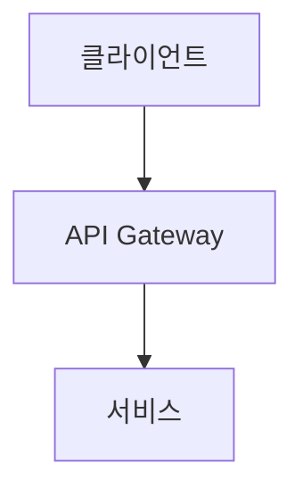
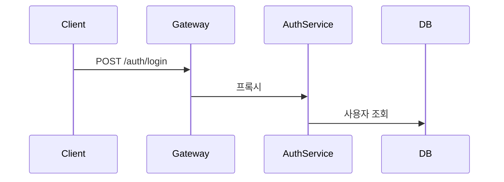
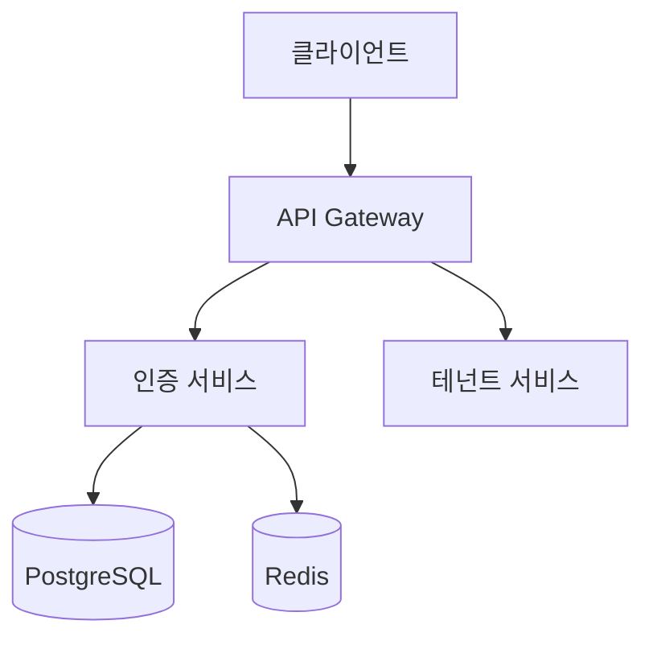
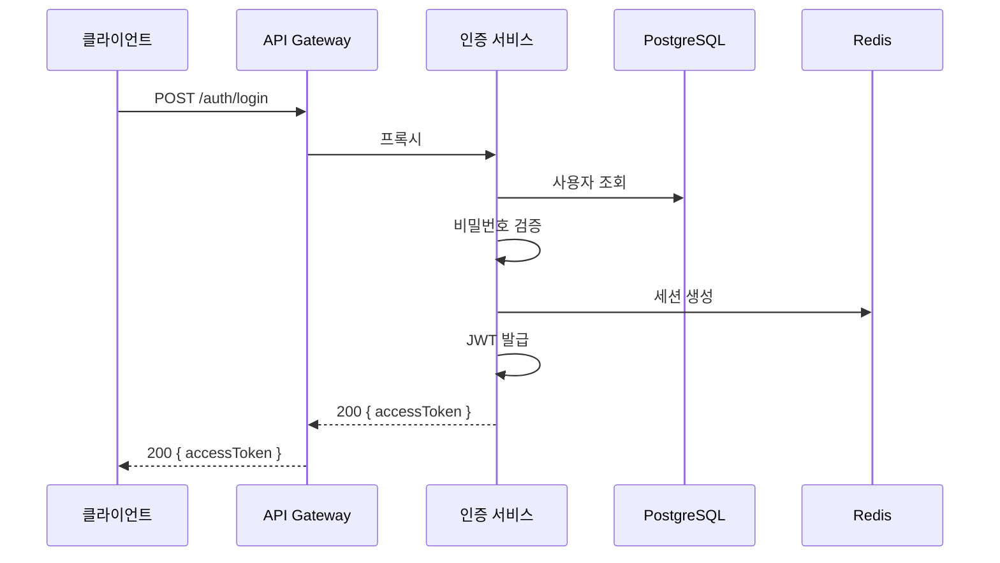
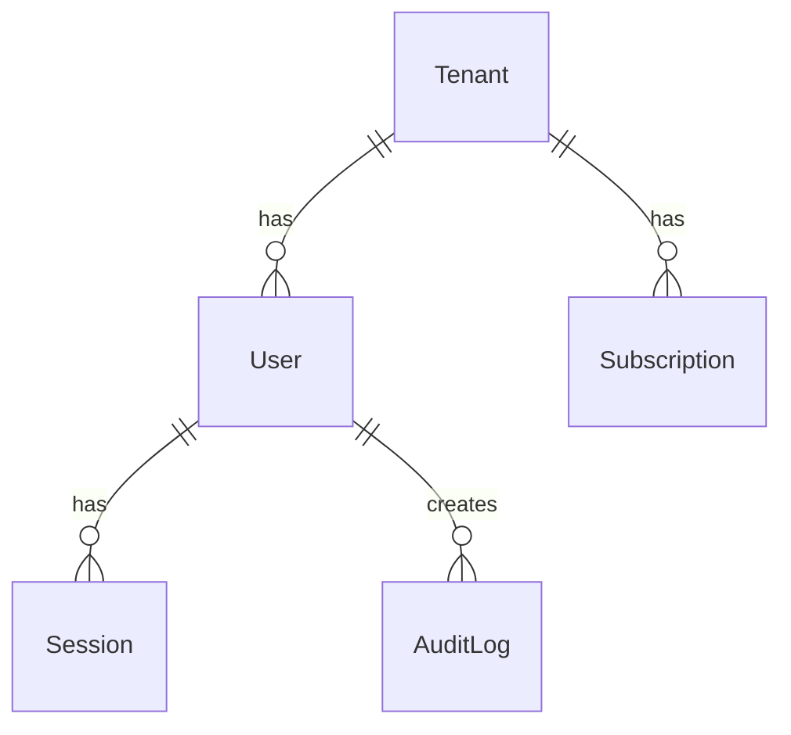

# 공공기관 SaaS 프레임워크 -- 문서 작성 표준 지침서

> **버전**: 1.0.0 | **작성일**: 2026-04-11 | **작성자**: PM Lead (Opus)
> **적용 범위**: docs/ 하위 전체 PDCA 문서
> **Plan 참조**: MTU-TECH-STACK-2026Q2 (CC-REQ-08)
> **근거**: 행안부 정보시스템 감리기준 (고시 제2023-1호)

---

## 목차

1. [문서 체계 개요](#1-문서-체계-개요)
2. [Plan 문서 표준](#2-plan-문서-표준)
3. [Design 문서 표준](#3-design-문서-표준)
4. [Analysis 문서 표준](#4-analysis-문서-표준)
5. [Report 문서 표준](#5-report-문서-표준)
6. [요구사항 ID 체계](#6-요구사항-id-체계)
7. [추적성 매트릭스 표준](#7-추적성-매트릭스-표준)
8. [코드 주석 표준](#8-코드-주석-표준)
9. [다이어그램 표준](#9-다이어그램-표준)
10. [변경 이력 표준](#10-변경-이력-표준)

---

## 1. 문서 체계 개요

### 1.1 PDCA 문서 구조

```
docs/
  00-pm/                         # PRD (Product Requirements Document)
    {mtu-id}.prd.md
  01-plan/                       # Plan (요구사항 분석)
    mtus/
      {mtu-id}.plan.md
  02-design/                     # Design (설계)
    mtus/
      {mtu-id}.design.md
  03-analysis/                   # Analysis (검증 분석)
    {mtu-id}.analysis.md
  04-report/                     # Report (결과 보고)
    {mtu-id}.report.md
  archive/                       # Archive (완료 문서)
    YYYY-MM/
      {mtu-id}/
        _INDEX.md
  guidelines/                    # 지침서 (본 문서 포함)
  pm-reports/                    # PM 세션 보고서
```

### 1.2 문서 작성 원칙

| 원칙 | 설명 |
|------|------|
| 한국어 전용 | 모든 문서는 한국어로 작성 (코드 예시 제외) |
| 공공기관 용어 | 행안부 표준 용어 사용 (예: 접근 통제, 감사 추적) |
| 추적성 필수 | 모든 요구사항은 ID 부여, 산출물과 1:1 매핑 |
| 변경 이력 필수 | 모든 문서에 버전별 변경 이력 테이블 포함 |
| CSAP 매핑 필수 | 보안 관련 요구사항에 CSAP 항목 번호 명시 |

---

## 2. Plan 문서 표준

### 2.1 파일명 규칙

```
docs/01-plan/mtus/{mtu-id}.plan.md
```

예시: `MTU-P01-auth-service.plan.md`, `SVC-AUTH-R1.plan.md`

### 2.2 필수 섹션

```markdown
# {MTU-ID} Plan -- {MTU명}

> **MTU ID**: {MTU-ID}
> **버전**: {버전} | **작성일**: {YYYY-MM-DD} | **작성자**: {이름}
> **분류**: {Phase명} / {카테고리}

---

## 1. Executive Summary (4관점 테이블)

| 관점 | 현재 상태 | 목표 상태 | 측정 지표 |
|------|----------|----------|----------|
| **기능** | {현재} | {목표} | {지표} |
| **보안** | {현재} | {목표} | {지표} |
| **성능** | {현재} | {목표} | {지표} |
| **운영** | {현재} | {목표} | {지표} |

---

## 2. Context Anchor

### WHY (왜 필요한가)
{배경, 문제 정의, 비즈니스 필요성}

### WHO (이해관계자)
| 역할 | 관심사 |
|------|-------|
| {역할} | {관심사} |

### RISK (위험 요소)
| ID | 위험 | 영향 | 대응 |
|----|------|------|------|
| R1 | {위험} | {영향} | {대응} |

### SUCCESS (성공 기준)
| ID | 기준 | 측정 방법 |
|----|------|----------|
| SC-1 | {기준} | {방법} |

### SCOPE (범위)
**포함**: {포함 범위}
**제외**: {제외 범위}

---

## 3. 기능 요구사항

### FR-{모듈}.{번호}: {요구사항명}
{요구사항 상세 설명}

---

## 4. 비기능 요구사항

### NFR-{번호}: {요구사항명}
{요구사항 상세 설명}

---

## 5. 추적성 매트릭스

| 요구사항 | 산출물 | 테스트 | CSAP |
|---------|-------|-------|------|
| FR-{ID} | {파일 경로} | {테스트 ID} | {CSAP 항목} |

---

## 6. 변경 이력

| 버전 | 일자 | 내용 | 작성자 |
|------|------|------|-------|
| 1.0.0 | {YYYY-MM-DD} | 초기 작성 | {이름} |
```

---

## 3. Design 문서 표준

### 3.1 파일명 규칙

```
docs/02-design/mtus/{mtu-id}.design.md
```

### 3.2 필수 섹션

```markdown
# {MTU-ID} Design -- {MTU명}

> **MTU ID**: {MTU-ID}
> **버전**: {버전} | **작성일**: {YYYY-MM-DD} | **작성자**: {이름}
> **Plan 참조**: docs/01-plan/mtus/{mtu-id}.plan.md

---

## 1. Design Anchor

### 설계 원칙
{핵심 설계 원칙 3~5개}

### 아키텍처 옵션 평가
| 옵션 | 설명 | 장점 | 단점 | 판정 |
|------|------|------|------|------|
| A | {설명} | {장점} | {단점} | **채택** / 기각 |

---

## 2. 아키텍처 설계

### 시스템 아키텍처 (Mermaid)


### API 명세
| 메서드 | 경로 | 설명 | 인증 | CSAP |
|--------|------|------|------|------|
| POST | /auth/login | 로그인 | 불필요 | D-08-01 |

### 데이터 모델
{ERD 또는 Prisma 스키마 발췌}

### 시퀀스 다이어그램 (핵심 플로우)


---

## 3. Session Guide

### 구현 순서
1. {단계 1}
2. {단계 2}

### 검증 기준
- {기준 1}
- {기준 2}

---

## 4. 변경 이력

| 버전 | 일자 | 내용 | 작성자 |
|------|------|------|-------|
| 1.0.0 | {YYYY-MM-DD} | 초기 설계 | {이름} |
```

---

## 4. Analysis 문서 표준

### 4.1 파일명 규칙

```
docs/03-analysis/{mtu-id}.analysis.md
```

### 4.2 필수 섹션

```markdown
# {MTU-ID} Analysis -- 설계-구현 적합성 분석

## 1. 분석 개요
| 항목 | 값 |
|------|-----|
| Design 문서 | docs/02-design/mtus/{mtu-id}.design.md |
| 구현 산출물 | {파일 경로 목록} |
| 분석 일시 | {YYYY-MM-DD HH:MM} |
| 적합도 | {N}% |

## 2. 항목별 적합도

| FR ID | 설계 요구사항 | 구현 상태 | 적합 |
|-------|-------------|----------|------|
| FR-{ID} | {요구사항} | {구현 상태} | O / X |

## 3. 발견 사항
{불일치 항목, 개선 권고}

## 4. Q-Gate 결과
| 게이트 | 기준 | 결과 | 비고 |
|--------|------|------|------|
| G1 | FR ID 전수 | PASS/FAIL | |
| G2 | 설계 완전성 | PASS/FAIL | |
| G3 | 코드 품질 | PASS/FAIL | |
| G4 | 테스트 80%+ | PASS/FAIL | |
| G5 | OWASP Top10 | PASS/FAIL | |
| G6 | CSAP 100% | PASS/FAIL | |
| G7 | audit.jsonl | PASS/FAIL | |
```

---

## 5. Report 문서 표준

### 5.1 파일명 규칙

```
docs/04-report/{mtu-id}.report.md
```

### 5.2 필수 섹션

```markdown
# {MTU-ID} Report -- PDCA 완료 보고서

## 1. Executive Summary

| 관점 | 목표 | 달성 | 달성률 |
|------|------|------|-------|
| **기능** | {목표} | {달성} |  |

## 2. Key Decisions & Outcomes
{PRD -> Plan -> Design -> Do 결정 체인}

## 3. Success Criteria Final Status
| ID | 기준 | 상태 |
|----|------|------|
| SC-1 | {기준} | PASS / FAIL |

## 4. 발견된 이슈 및 해결 방법
| 이슈 | 해결 | 잔여 위험 |
|------|------|----------|
| {이슈} | {해결} | {위험} |

## 5. 교훈 (Lessons Learned)
{이번 MTU에서 얻은 교훈}
```

---

## 6. 요구사항 ID 체계

### 6.1 ID 형식

| 구분 | 형식 | 예시 |
|------|------|------|
| 기능 요구사항 | FR-{모듈}.{번호} | FR-P01.1, FR-AUTH.3 |
| 비기능 요구사항 | NFR-{번호} | NFR-1, NFR-5 |
| 인프라 요구사항 | INFR-{번호} | INFR-1, INFR-3 |
| AI 연동 요구사항 | AI-REQ-{번호} | AI-REQ-1 |
| CC 하네스 요구사항 | CC-REQ-{번호} | CC-REQ-01 |

### 6.2 모듈 코드 목록

| 코드 | 서비스 | 설명 |
|------|-------|------|
| P00 | common-foundation | 공통 기반 |
| P01 | auth-service | 인증 |
| P02 | user-service | 사용자 |
| P03 | tenant-service | 테넌트 |
| P04 | api-gateway | API 게이트웨이 |
| P05 | menu-service | 메뉴 |
| P06 | saas-catalog | SaaS 카탈로그 |
| P07 | subscription-service | 구독 |
| P08 | billing-service | 과금 |
| P09 | crm-service | CRM |
| P10 | ai-service | AI |
| P11 | notification-service | 알림 |
| P12 | file-service | 파일 |
| P13 | audit-service | 감사 |
| P14 | compliance-dashboard | 컴플라이언스 |
| P15 | security-monitoring | 보안 모니터링 |
| AUTH | auth (세부) | 인증 세부 기능 |
| OTEL | observability | 관측성 |
| RBAC | rbac | 접근 통제 |
| EVT | event-bus | 이벤트 버스 |
| INT | integration | 통합 |
| MESH | mesh-ready | 서비스 메시 |
| TENANT | tenant-isolation | 테넌트 격리 |
| GW | gateway (세부) | 게이트웨이 세부 |
| UP | portal-ui | 포털 UI |

### 6.3 Plan SC (Success Criteria) 주석 규칙

코드 내 주석에서 사용:

```typescript
// Plan SC: FR-P01.1, FR-P01.6, FR-AUTH.3
```

여러 Plan 문서를 참조할 경우:

```typescript
// Plan SC: FR-P01.1~FR-P01.12, FR-AUTH.1~FR-AUTH.7, FR-OTEL.3
```

---

## 7. 추적성 매트릭스 표준

### 7.1 4방향 추적성

모든 Plan 문서에는 다음 4방향 추적성 매트릭스를 포함한다:

```
요구사항(FR) <-> 산출물(코드/문서) <-> 테스트(케이스) <-> CSAP(통제항목)
```

### 7.2 매트릭스 형식

```markdown
| 요구사항 | 산출물 | 테스트 | CSAP |
|---------|-------|-------|------|
| FR-P01.1 | auth-service/src/handlers/login.handler.ts | TC-AUTH-01 | D-08-01 |
| FR-P01.2 | auth-service/src/middleware/auth.middleware.ts | TC-AUTH-02 | D-08-01 |
| FR-P01.12 | auth-service/src/lib/audit.ts | TC-AUDIT-01 | D-06-01 |
```

### 7.3 CSAP 항목 참조 형식

```
D-{분야번호}-{항목번호}
```

예시:
- D-08-01: 접근 통제 - 인증
- D-08-06: 접근 통제 - 계정 잠금
- D-06-01: 침해사고 관리 - 감사 로그
- D-09-01: 암호화 - 데이터 암호화
- D-12-01: 시스템 개발 보안 - 입력 검증

---

## 8. 코드 주석 표준

### 8.1 파일 헤더 주석 (필수)

모든 소스 파일 (.ts, .tsx) 첫 번째 줄부터:

```typescript
// {파일 설명}
// Design Ref: {MTU-ID} DESIGN §{섹션}
// Plan SC: {FR-ID 목록}
// CSAP: {관련 항목}
```

실제 예시 (auth-service/src/index.ts):

```typescript
// 인증 서비스 진입점
// Design Ref: MTU-P01 DESIGN-MTU-P01, SVC-AUTH-R1 DESIGN
// Plan SC: FR-P01.1~FR-P01.12, FR-AUTH.1~FR-AUTH.7, FR-OTEL.3
// CSAP: D-08 접근 통제, D-07 가용성, D-10 분산 추적, D-06 이벤트 기반 감사
```

### 8.2 인라인 Plan SC 주석

비즈니스 로직에 FR ID를 추적하는 인라인 주석:

```typescript
// Plan SC: FR-AUTH.1 (MFA 검증 통합), FR-AUTH.3 (Rate Limiting)
app.post('/auth/login', loginSchemaOpts, loginHandler);

// CSAP D-08-06: 5회 실패 -> 30분 잠금
if (newFailedCount >= AUTH_CONSTANTS.MAX_LOGIN_ATTEMPTS) {
  updateData['lockedUntil'] = new Date(Date.now() + lockDurationMs);
}
```

### 8.3 JSDoc (공개 API 함수)

```typescript
/**
 * 인증 이벤트 감사 로그 기록
 *
 * @param action - 행위 (LOGIN_SUCCESS, LOGIN_FAIL 등)
 * @param actor - 행위자 ID
 * @param tenantId - 테넌트 ID
 * @param ip - 클라이언트 IP
 * @param userAgent - User-Agent
 * @param metadata - 추가 메타데이터
 */
export async function logAuthEvent(
  action: string,
  actor: string,
  tenantId: string,
  ip: string,
  userAgent: string,
  metadata?: Record<string, unknown>,
): Promise<void> {
  // ...
}
```

### 8.4 TODO / NOTE 형식

```typescript
// TODO: FR-2.3 -- Phase 2에서 캐시 무효화 전략 구현 -- 담당자: 미정 -- 기한: 2026-07

// NOTE: 미사용. Phase 2 FR-2.3 구현 시 사용 예정. 재검토일: 2026-07-01
```

### 8.5 금지 주석 패턴

```typescript
// [금지] 자명한 코드에 주석
const user = await findUser(id);  // 사용자를 찾는다

// [금지] 주석 처리된 코드 (git history로 복구)
// const oldUser = await legacyFindUser(id);

// [금지] 이유 없는 TODO
// TODO: 나중에 수정
```

---

## 9. 다이어그램 표준

### 9.1 텍스트 기반 (Mermaid) 필수

모든 다이어그램은 Mermaid 형식으로 작성 (이미지 파일 금지):



### 9.2 시퀀스 다이어그램

핵심 플로우(로그인, 결제, AI 질의)에 필수:



### 9.3 ERD (데이터 모델)



---

## 10. 변경 이력 표준

### 10.1 테이블 형식 (모든 문서)

```markdown
| 버전 | 일자 | 내용 | 작성자 |
|------|------|------|-------|
| 1.0.0 | 2026-04-11 | 초기 작성 | {이름} |
| 1.0.1 | 2026-04-15 | §3.2 API 명세 수정 | {이름} |
| 1.1.0 | 2026-04-20 | §5 신규 요구사항 추가 | {이름} |
```

### 10.2 버전 규칙

| 변경 유형 | 버전 증가 | 예시 |
|---------|---------|------|
| 오타/포맷 수정 | patch (x.x.+1) | 1.0.0 -> 1.0.1 |
| 섹션 내용 변경 | minor (x.+1.0) | 1.0.1 -> 1.1.0 |
| 요구사항 추가/삭제 | major (+1.0.0) | 1.1.0 -> 2.0.0 |

---

## 11. 변경 이력

| 버전 | 일자 | 내용 | 작성자 |
|------|------|------|-------|
| 1.0.0 | 2026-04-11 | 초기 작성 -- 현재 프로젝트 문서 패턴 기반 | PM Lead (Opus) |
