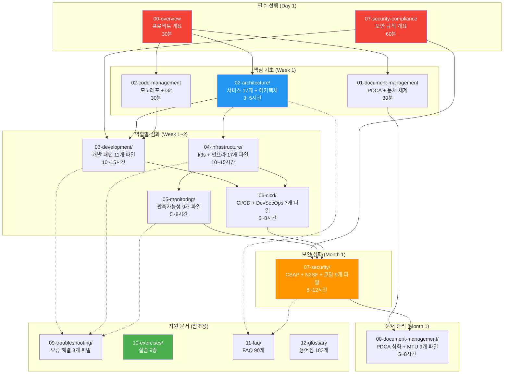
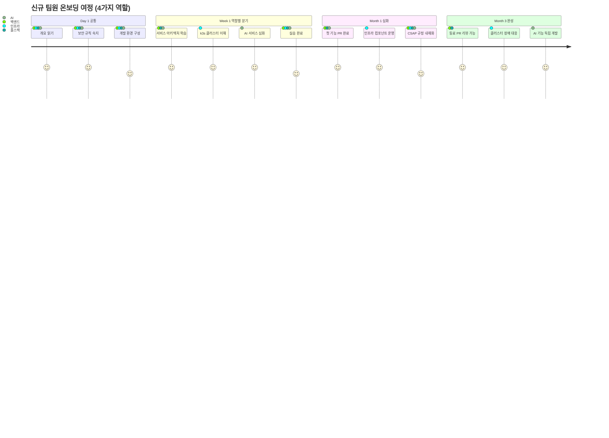
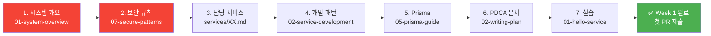
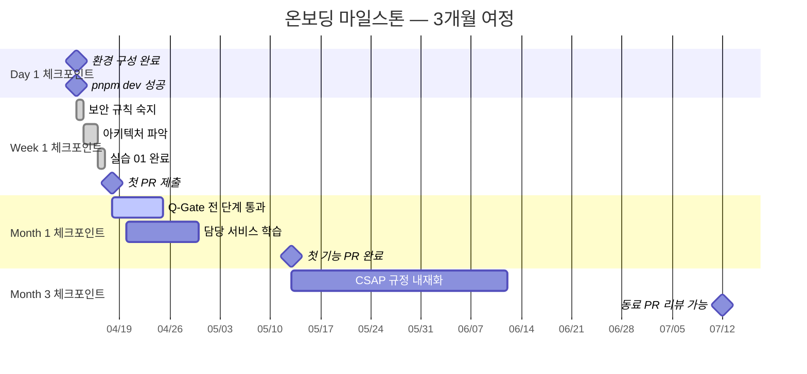

# 가이드북 학습 지도 — 어디서 무엇을 찾는가

> **문서 ID**: ONBOARD-MAP-00
> **버전**: 1.0.0 | **작성일**: 2026-04-12 | **작성자**: Implementer (Sonnet)
> **목적**: 신규 팀원이 157개 파일 중 자신에게 필요한 내용을 빠르게 찾도록 안내
> **대상**: 모든 신규 팀원 — Day 1에 이 파일부터 읽으십시오
> **소요 시간**: 15분 (탐색용 문서, 정독 불필요)
> **이 문서는 콘텐츠 문서가 아닙니다 — 네비게이터입니다**

---

## 목차

1. [가이드북 전체 지도](#1-가이드북-전체-지도)
2. [역할별 학습 경로 — 상세](#2-역할별-학습-경로--상세)
3. [궁금한 게 있으면 여기 — 빠른 탐색 색인](#3-궁금한-게-있으면-여기--빠른-탐색-색인)
4. [온보딩 마일스톤](#4-온보딩-마일스톤)
5. [FAQ 빠른 링크](#5-faq-빠른-링크)
6. [학습 체크리스트](#6-학습-체크리스트)
7. [다음 단계](#7-다음-단계)

---

## 1. 가이드북 전체 지도

### 1.1 섹션 간 관계도

이 가이드북의 15개 섹션이 어떻게 연결되는지 보여줍니다. 화살표는 "이것을 배우면 저것이 이해된다"는 선행 관계입니다.



### 1.2 파일 수 및 학습 시간 요약

| 섹션 | 파일 수 | 예상 시간 | 우선순위 |
|------|---------|---------|---------|
| 개요 파일 (루트) | 15개 | 4~6시간 | 필수 |
| 01-getting-started/ | 5개 | 3~4시간 | Day 1 필수 |
| 02-architecture/ | 27개 | 15~20시간 | Week 1 필수 |
| 03-development/ | 11개 | 10~15시간 | 역할별 |
| 04-infrastructure/ | 17개 | 10~15시간 | 역할별 |
| 05-monitoring/ | 9개 | 5~8시간 | 역할별 |
| 06-cicd/ | 7개 | 5~8시간 | 역할별 |
| 07-security/ | 9개 | 8~12시간 | Month 1 |
| 08-document-management/ | 9개 | 5~8시간 | Month 1 |
| 09-troubleshooting/ | 3개 | 참조용 | 필요 시 |
| 10-exercises/ | 9개 | 20~30시간 | Week 1~2 |
| 11-faq/ | 5개 | 참조용 | 필요 시 |
| **합계** | **약 157개** | **약 100시간** | — |

---

## 2. 역할별 학습 경로 — 상세

### 2.1 역할별 학습 여정 한눈에 보기



### 2.2 백엔드 개발자 — Week 1에 반드시 읽어야 할 7개 파일

```
Day 1 오전: 전체 그림 파악 (필수)
  1. 02-architecture/01-system-overview.md
     → 17개 서비스가 어떻게 연결되는지 C4 다이어그램으로 이해
     → 읽기 전: "왜 마이크로서비스인가?" 스스로 질문해보기
     → 소요 시간: 90분

Day 1 오후: 보안 규칙 조기 숙지
  2. 07-security/coding/01-secure-patterns.md
     → 이 파일을 읽지 않으면 첫 PR에서 Q-Gate G3/G5 실패
     → 핵심: RBAC + Zod + SQL 주입 방지 패턴 암기
     → 소요 시간: 60분

Day 2 오전: 담당 서비스 이해
  3. 02-architecture/services/02-auth-service.md (또는 담당 서비스)
     → JWT RS256, MFA TOTP, 세션 관리 구조 파악
     → 소요 시간: 60분

Day 2 오후: 개발 패턴 학습
  4. 03-development/02-service-development.md
     → Fastify 플러그인 시스템, Repository 패턴, 에러 처리
     → 소요 시간: 90분

Day 3: 데이터베이스 패턴
  5. 03-development/05-prisma-guide.md
     → Prisma Client 사용법, 마이그레이션, N+1 방지
     → 소요 시간: 90분

Day 4: PDCA 문서 체계
  6. 08-document-management/pdca/02-writing-plan.md
     → Plan 문서 없이는 구현 시작 불가 (감리 결함)
     → FR ID 체계 이해 필수
     → 소요 시간: 60분

Day 5: 첫 실습
  7. 10-exercises/01-hello-service.md
     → auth-service에 /health/ping 추가 실습
     → Q-Gate G1~G7 전 단계 통과 경험
     → 소요 시간: 1~2시간
```

**백엔드 학습 경로 순서도**:



### 2.3 인프라 엔지니어 — 순서 있는 학습 체인

```
Level 1: 기초 (Day 1~2)
  ① 04-infrastructure/01-overview.md
     → k3s + WSL2 클러스터 전체 구조 이해
     → 네임스페이스, Helm Chart 구조 파악

  ② 04-infrastructure/kubernetes/01-k3s-basics.md
     → kubectl 기본 50개 명령어 익히기
     → Pod, Deployment, Service 개념 체화

Level 2: 핵심 컴포넌트 (Day 3~5)
  ③ 04-infrastructure/components/03-postgresql.md
     → CNPG HA 구성, WAL 아카이빙, PITR
     → "DB가 죽으면 어떻게 되나?" 직접 시뮬레이션

  ④ 04-infrastructure/components/04-vault.md
     → HashiCorp Vault 시크릿 관리
     → 개발자가 절대 하드코딩하지 않는 이유 설명 가능

  ⑤ 04-infrastructure/components/06-linkerd.md
     → mTLS 서비스 메시, Zero Trust 네트워크
     → CSAP D-09 전송 암호화 요건과 연결

Level 3: GitOps + CI/CD (Week 2)
  ⑥ 04-infrastructure/kubernetes/03-gitops-flux.md
     → Flux HelmRelease 동기화 이해
     → PR 머지 → 자동 배포 흐름 체화

  ⑦ 06-cicd/pipelines/01-ci-walkthrough.md
     → CI 파이프라인 단계별 해설
     → Q-Gate G1~G7이 무슨 역할인지 파악

Level 4: 모니터링 + 장애 대응 (Week 2~3)
  ⑧ 05-monitoring/metrics/01-prometheus-basics.md
     → PromQL 기초, ServiceMonitor 설정
     → "CPU 사용률 급등 시 어떻게 찾나?" 해결 가능

  ⑨ 09-troubleshooting/01-common-errors.md
     → 23개 자주 발생 오류와 해결법
     → 북마크 필수 — 장애 시 즉시 참조

Level 5: 보안 + CSAP (Month 1)
  ⑩ 04-infrastructure/components/07-kyverno-policies.md
     → Kyverno 정책 관리, PSS Restricted
     → CSAP D-11 가상화 보안 요건 충족 방법

  ⑪ 07-security/csap/04-compliance-automation.md (이 섹션!)
     → 증거 자동 수집 파이프라인 운영
```

### 2.4 보안 담당자 — CSAP 집중 경로

```
Phase 1: CSAP 기초 이해 (Week 1)
  ① 07-security/csap/01-what-is-csap.md
     → CSAP 79개 항목 전체 개요
     → D-01~D-13 도메인별 요건 파악

  ② 07-security/csap/02-dev-checklist.md
     → 개발자에게 요구하는 CSAP 항목만 발췌
     → PR 리뷰 시 확인해야 할 체크포인트

Phase 2: N2SF 데이터 등급 (Week 1)
  ③ 07-security/n2sf/01-data-classification.md
     → C/S/O 등급 분류 기준
     → AI API 호출 시 O등급만 허용 규칙

Phase 3: 보안 코딩 감사 (Week 2)
  ④ 07-security/coding/01-secure-patterns.md
     → RBAC, Zod, SQL 주입 방지 — 코드 리뷰 기준

  ⑤ 07-security/coding/02-owasp-patterns.md
     → OWASP Top 10 (2021) — 취약/안전 코드 비교
     → Semgrep 규칙과 연결

Phase 4: 위협 모델링 (Week 2)
  ⑥ 07-security/threat-modeling/01-threat-model.md
     → STRIDE 방법론, DREAD 평가
     → D-02 위험 관리 증거로 활용

Phase 5: 감사 로그 (Week 3)
  ⑦ 07-security/audit/01-audit-logging.md
     → SHA-256 체인, append-only 구조
     → CSAP D-06 증거 품질 기준

Phase 6: 증거 수집 자동화 (Week 3~4)
  ⑧ 07-security/csap/03-evidence-collection.md
     → D-01~D-13 증거 목록과 수집 방법

  ⑨ 07-security/csap/04-compliance-automation.md
     → 자동 수집 파이프라인 운영 (이 섹션!)
     → 갭 분석 자동화, Grafana CSAP 대시보드
```

### 2.5 AI 개발자 — N2SF + AI 개발 집중 경로

```
반드시 먼저 (Day 1):
  ① 02-architecture/services/05-ai-service.md
     → AI Service 전체 아키텍처
     → N2SF 등급 검사, PII 마스킹 플로우

  ② 07-security/n2sf/01-data-classification.md
     → C/S/O 등급 분류 — AI 개발자에게 필수
     → "이 데이터를 AI에 보내도 되나?" 판단 기준

핵심 학습 (Week 1):
  ③ 03-development/08-ai-development-guide.md
     → RAG 구현, 스트리밍, 토큰 예산 관리
     → Claude Haiku/Sonnet/Opus 모델별 비용 계산

  ④ 02-architecture/packages/01-core-packages.md
     → audit-sdk, rbac — AI 핸들러에도 필수

  ⑤ 03-development/09-feature-flags.md
     → 테넌트별 AI 기능 활성화/비활성화 관리

심화 (Week 2~3):
  ⑥ 05-monitoring/metrics/03-custom-metrics.md
     → AI 응답 시간, 토큰 사용량 메트릭 추가

  ⑦ 10-exercises/06-end-to-end-scenario.md (캡스톤)
     → AI 통계 API 처음부터 끝까지 구현
     → N2SF 검사 → AI Gateway → 결과 캐시 전체 플로우
```

### 2.6 신입 (1년 미만 경력) — 기초부터 시작하는 경로

```
💡 신입 팀원에게: "한 번에 다 이해하려 하지 마세요.
   순서대로 따라가면서 막히면 FAQ를 확인하세요."

Week 1 — 환경과 기초:
  Step 1. 01-getting-started/01-welcome.md (30분)
     → 프로젝트 소개, 용어 사전 15개 먼저 읽기

  Step 2. 01-getting-started/02-environment-setup.md (1~2시간)
     → WSL2 + Claude Code 설치, 오류 7개 해결
     → "pnpm dev가 뜨면 Step 2 완료"

  Step 3. 01-getting-started/05-day-one-complete.md (2시간)
     → Day 1 타임라인 따라하기
     → 절대 금지 5가지 먼저 외우기

  Step 4. 02-architecture/01-system-overview.md (90분)
     → 전체 그림 보기 (세부 이해는 나중에)

  Step 5. 07-security/coding/01-secure-patterns.md (60분)
     → 코드 작성 전 보안 규칙 반드시 숙지

  Step 6. 10-exercises/01-hello-service.md (2시간)
     → 첫 코드 변경 경험
     → 막히면 11-faq/01-dev-faq.md 확인

Week 2~3 — 핵심 개념:
  → 03-development/02-service-development.md (Fastify 패턴)
  → 03-development/05-prisma-guide.md (DB 작업)
  → 10-exercises/02-pdca-mini.md (문서 작성 체험)

Month 1 — 실전 투입:
  → 담당 서비스의 02-architecture/services/XX.md 정독
  → 첫 기능 PR 작성 (멘토와 함께)
  → 08-document-management/pdca/02-writing-plan.md (Plan 문서 작성)
```

---

## 3. 궁금한 게 있으면 여기 — 빠른 탐색 색인

### 3.1 개발 관련 빠른 참조

| 궁금한 것 | 찾을 곳 |
|----------|---------|
| JWT 토큰 검증 코드가 어디 있나? | `02-architecture/services/02-auth-service.md` §JWT |
| Fastify 플러그인 어떻게 만드나? | `03-development/04-advanced-patterns.md` §Fastify |
| Prisma 마이그레이션 명령어는? | `03-development/05-prisma-guide.md` §마이그레이션 |
| 테스트 커버리지 80% 달성 방법은? | `03-development/03-testing-guide.md` §커버리지 |
| Redis 캐시 어떻게 사용하나? | `04-infrastructure/components/05-redis.md` |
| 서비스 간 이벤트 통신은? | `02-architecture/05-event-driven-architecture.md` |
| 멀티테넌시 코드 어떻게 작성하나? | `02-architecture/02-multitenancy.md` + `07-multitenancy-advanced.md` |
| tenantId를 DB 쿼리에 어떻게 넣나? | `02-architecture/07-multitenancy-advanced.md` §4 |
| Zod 입력 검증 예시는? | `07-security/coding/01-secure-patterns.md` §Zod |
| auditLog() 사용법은? | `07-security/audit/01-audit-logging.md` §사용법 |
| AI 기능 개발 어떻게 시작하나? | `03-development/08-ai-development-guide.md` |
| 피처 플래그 사용법은? | `03-development/09-feature-flags.md` |
| pnpm filter 사용법은? | `03-development/07-monorepo-navigation.md` |
| 디버깅 VS Code 설정은? | `03-development/10-debugging-advanced.md` |
| 서킷 브레이커 설정은? | `02-architecture/packages/02-infra-packages.md` §circuit-breaker |

### 3.2 인프라 관련 빠른 참조

| 궁금한 것 | 찾을 곳 |
|----------|---------|
| Pod가 CrashLoopBackOff일 때? | `09-troubleshooting/01-common-errors.md` §CrashLoop |
| Vault 시크릿 추가 방법은? | `04-infrastructure/components/04-vault.md` §추가 |
| TLS 인증서 만료 갱신은? | `04-infrastructure/components/02-cert-manager.md` |
| Flux가 동기화 안 될 때? | `09-troubleshooting/01-common-errors.md` §Flux |
| Pod 메모리 제한 설정은? | `04-infrastructure/kubernetes/02-helm-charts.md` §resources |
| PostgreSQL 백업 복구는? | `04-infrastructure/components/08-velero-backup.md` |
| Linkerd mTLS 설정은? | `04-infrastructure/components/06-linkerd.md` |
| Kyverno 정책 예외 추가는? | `04-infrastructure/components/07-kyverno-policies.md` §예외 |
| k9s 주요 단축키는? | `01-getting-started/04-tools-reference.md` §k9s |
| HPA 설정 방법은? | `09-troubleshooting/03-performance-guide.md` §HPA |
| DR 훈련 절차는? | `04-infrastructure/08-disaster-recovery.md` |
| GitOps 배포 흐름은? | `06-cicd/deployment/01-gitops-deploy.md` |

### 3.3 CSAP·보안 관련 빠른 참조

| 궁금한 것 | 찾을 곳 |
|----------|---------|
| CSAP D-08이 뭔가요? | `07-security/csap/01-what-is-csap.md` §D-08 |
| N2SF 등급은 어떻게 분류하나? | `07-security/n2sf/01-data-classification.md` |
| AI API에 데이터 보내도 되나? | `07-security/n2sf/01-data-classification.md` §AI-API |
| PR 보안 체크리스트는? | `14-quick-reference.md` §보안-체크리스트 |
| SQL 주입 방지 방법은? | `07-security/coding/01-secure-patterns.md` §SQL |
| XSS 방지 방법은? | `07-security/coding/02-owasp-patterns.md` §A03 |
| 감사 로그 필수 필드는? | `07-security/audit/01-audit-logging.md` §구조 |
| Semgrep 로컬 실행 방법은? | `06-cicd/pipelines/03-devsecops.md` §Semgrep |
| CSAP 증거 어디서 확인하나? | `07-security/csap/03-evidence-collection.md` |
| 감리 2주 전 해야 할 일은? | `07-security/csap/04-compliance-automation.md` §갭분석 |
| Q-Gate G1~G7이 뭔가요? | `06-cicd/pipelines/02-quality-gate.md` |
| 하드코딩 시크릿 어떻게 수정하나? | `.claude/rules/csap-compliance.md` §D-09 |

### 3.4 아키텍처 결정 빠른 참조

| "왜 이걸 사용했나요?" 질문 | 찾을 곳 |
|--------------------------|---------|
| 왜 Fastify? (Express 대신) | `02-architecture/06-adr-deep-dive.md` §ADR-003 |
| 왜 k3s? (EKS/GKE 대신) | `02-architecture/06-adr-deep-dive.md` §ADR-001 |
| 왜 pnpm? (npm/yarn 대신) | `02-architecture/06-adr-deep-dive.md` §ADR-005 |
| 왜 Row-level 멀티테넌시? | `02-architecture/07-multitenancy-advanced.md` §2 |
| 왜 Prisma? (Drizzle/TypeORM 대신) | `02-architecture/06-adr-deep-dive.md` §ADR-007 |
| 왜 Gitea? (GitHub 대신) | `02-architecture/06-adr-deep-dive.md` §ADR-002 |
| 왜 Linkerd? (Istio 대신) | `02-architecture/06-adr-deep-dive.md` §ADR-009 |
| 왜 Redis? (Memcached 대신) | `02-architecture/06-adr-deep-dive.md` §ADR-008 |

### 3.5 CI/CD 관련 빠른 참조

| 궁금한 것 | 찾을 곳 |
|----------|---------|
| CI 파이프라인 단계가 뭔가요? | `06-cicd/pipelines/01-ci-walkthrough.md` |
| Q-Gate에서 실패한 이유는? | `06-cicd/pipelines/02-quality-gate.md` §실패원인 |
| 핫픽스 배포 프로세스는? | `06-cicd/deployment/02-hotfix-process.md` |
| 카나리 배포는 어떻게 하나? | `06-cicd/deployment/03-canary-deploy.md` |
| CI 빌드 시간 줄이는 방법은? | `06-cicd/pipelines/04-pipeline-optimization.md` |
| Trivy 이미지 스캔 결과 보는 법? | `06-cicd/pipelines/03-devsecops.md` §Trivy |
| DORA 메트릭이 뭔가요? | `05-monitoring/dora/01-dora-metrics.md` |

---

## 4. 온보딩 마일스톤

### 4.1 마일스톤 전체 흐름



### 4.2 Day 1 체크포인트: `pnpm dev` 성공

```
목표: 개발 환경이 완전히 동작하는 상태

완료 기준:
  ✅ 저장소 클론 완료 (git clone)
  ✅ pnpm install 성공 (오류 없이)
  ✅ .env 파일 설정 완료 (멘토에게 요청)
  ✅ pnpm dev 실행 → 서비스 기동 확인
  ✅ http://localhost:3000/health 응답 확인
  ✅ kubectl get pods -n saas-platform 실행 가능

막히면: 01-getting-started/02-environment-setup.md §오류해결 7개 참조
도움: 팀 슬랙 #onboarding 채널에 질문
```

### 4.3 Week 1 체크포인트: 첫 PR Q-Gate 통과

```
목표: PR을 제출하고 Q-Gate G1~G7 전 단계를 통과하는 경험

완료 기준:
  ✅ feat/onboarding/{이름} 브랜치 생성
  ✅ 10-exercises/01-hello-service.md 실습 완료
  ✅ Plan 문서 작성 (FR ID 포함)
  ✅ 코드 변경 (핸들러 + 테스트)
  ✅ pnpm test:coverage → 80% 이상
  ✅ pnpm lint → 오류 없음
  ✅ PR 제출 → Gitea Actions CI 통과
  ✅ Q-Gate G1~G7 모두 녹색
  ✅ 코드 리뷰어 1명 승인

Q-Gate 실패 시 해결:
  G1 실패 (FR ID 없음) → 08-document-management/pdca/02-writing-plan.md
  G3 실패 (코드 품질) → 07-security/coding/01-secure-patterns.md
  G4 실패 (커버리지) → 03-development/03-testing-guide.md
  G5 실패 (OWASP) → 07-security/coding/02-owasp-patterns.md

소요 시간 예상: 1~2일 (처음은 오래 걸리는 것이 정상)
```

### 4.4 Month 1 체크포인트: 담당 서비스 기능 PR 완료

```
목표: 실제 프로덕션 기능 한 건을 처음부터 끝까지 개발

완료 기준:
  ✅ Plan 문서 작성 → 팀장 승인
  ✅ Design 문서 작성 (API 명세 + ERD + 시퀀스 다이어그램)
  ✅ 구현 완료 (핸들러 + 서비스 + 레포지토리)
  ✅ 단위 테스트 + 통합 테스트 작성
  ✅ 커버리지 80% 이상
  ✅ CSAP 보안 요건 적용 (RBAC + Zod + 감사 로그)
  ✅ PR 머지 완료
  ✅ Grafana에서 신규 API 메트릭 확인

참조:
  → 10-exercises/06-end-to-end-scenario.md (캡스톤 실습)
  → 08-document-management/pdca/03-writing-design.md (Design 문서)
  → 13-contributing.md (PR 작성 가이드)
```

### 4.5 Month 3 체크포인트: 동료 PR 리뷰 가능 수준

```
목표: 팀의 코드 리뷰어로서 독립적으로 기여

완료 기준:
  ✅ PR 리뷰 시 보안 결함 독립적으로 탐지 가능
  ✅ CSAP 위반 코드 패턴 식별 가능
  ✅ 아키텍처 개선 제안 가능 (ADR 작성)
  ✅ 신규 팀원 멘토링 가능 (온보딩 가이드 공동 작성)
  ✅ 장애 발생 시 독립적으로 원인 분석 가능
  ✅ 3개월간 작성한 PR 10건 이상

이 시점에서 다시 읽으면 도움이 되는 파일:
  → 02-architecture/06-adr-deep-dive.md (아키텍처 결정 배경 이해)
  → 07-security/threat-modeling/01-threat-model.md (위협 모델링 직접 수행)
  → 08-document-management/standards/02-review-standards.md (리뷰 기준)
```

---

## 5. FAQ 빠른 링크

### 5.1 FAQ 파일 위치

각 역할별로 가장 자주 묻는 질문을 모아둔 파일입니다. 막히면 여기서 먼저 찾으십시오.

| FAQ 파일 | 대상 | 질문 수 | 주요 주제 |
|---------|------|--------|---------|
| [11-faq/01-dev-faq.md](11-faq/01-dev-faq.md) | 백엔드·풀스택 | 25개 | pnpm, Turbo, Fastify, Prisma, 테스트 |
| [11-faq/02-infra-faq.md](11-faq/02-infra-faq.md) | 인프라 | 20개 | Pod 오류, Flux, Ingress, PVC, kubectl |
| [11-faq/03-csap-faq.md](11-faq/03-csap-faq.md) | 보안·전체 | 20개 | 등급 분류, 감사 로그, AI API, Q-Gate |
| [11-faq/04-ai-faq.md](11-faq/04-ai-faq.md) | AI 개발자 | 25개 | RAG, N2SF 규정, 성능 최적화, 트러블슈팅 |

### 5.2 가장 자주 묻는 질문 TOP 10

```
Q1. "pnpm install이 실패합니다"
A: 11-faq/01-dev-faq.md #Q1 → Node.js 버전 확인 (22 필요)

Q2. "kubectl: connection refused 오류가 납니다"
A: 11-faq/02-infra-faq.md #Q1 → kubeconfig 환경 변수 확인

Q3. "Q-Gate G4 (커버리지 80%) 실패 — 테스트가 적어요"
A: 11-faq/01-dev-faq.md #Q15 + 03-development/03-testing-guide.md

Q4. "SQL 주입 방지는 Prisma 쓰면 자동이 아닌가요?"
A: 11-faq/03-csap-faq.md #Q8 → Prisma는 기본적으로 안전하지만
   $queryRawUnsafe 등 예외 메서드 주의 필요

Q5. "AI API에 어떤 데이터를 보내도 되나요?"
A: 11-faq/03-csap-faq.md #Q12 → O등급만, PII 마스킹 후

Q6. "Plan 문서를 꼭 써야 하나요? 바로 구현하면 안 되나요?"
A: 11-faq/03-csap-faq.md #Q1 → 감리 결함 → 절대 안 됨

Q7. "PR에 감사 로그가 없다고 리뷰어가 지적합니다"
A: 11-faq/03-csap-faq.md #Q5 + 07-security/audit/01-audit-logging.md

Q8. "Flux 동기화가 안 됩니다"
A: 11-faq/02-infra-faq.md #Q7 → flux reconcile 명령어 참조

Q9. "테넌트 데이터 격리 코드를 어떻게 작성하나요?"
A: 11-faq/01-dev-faq.md #Q20 + 02-architecture/07-multitenancy-advanced.md

Q10. "Claude Code에서 코드 작성 요청 시 어떻게 해야 하나요?"
A: 11-faq/01-dev-faq.md #Q25 + 03-development/vibecoding/01-basics.md
```

### 5.3 역할별 FAQ 대표 질문

**백엔드 개발자 TOP 3**:
```
"Fastify에서 플러그인 등록 순서가 중요한가요?" → 01-dev-faq.md #Q8
"Prisma의 N+1 문제를 어떻게 해결하나요?" → 01-dev-faq.md #Q12
"테스트에서 Prisma 목(mock)을 어떻게 설정하나요?" → 01-dev-faq.md #Q16
```

**인프라 엔지니어 TOP 3**:
```
"Pod가 OOMKilled 됩니다. 메모리 제한을 어떻게 늘리나요?" → 02-infra-faq.md #Q10
"Vault 토큰이 만료되었습니다" → 02-infra-faq.md #Q15
"HelmRelease가 Pending 상태로 멈춰있습니다" → 02-infra-faq.md #Q7
```

**보안 담당자 TOP 3**:
```
"CSAP 감리에서 가장 자주 지적받는 결함은?" → 03-csap-faq.md #Q3
"하드코딩된 시크릿이 git 이력에 남아있으면?" → 03-csap-faq.md #Q9
"Q-Gate G6 (CSAP 100%)이 왜 실패했나요?" → 03-csap-faq.md #Q18
```

**AI 개발자 TOP 3**:
```
"토큰 수를 어떻게 추정하나요?" → 04-ai-faq.md #Q5
"RAG 응답이 느립니다. 최적화 방법은?" → 04-ai-faq.md #Q15
"AI 응답 스트리밍은 어떻게 구현하나요?" → 04-ai-faq.md #Q8
```

---

## 6. 학습 체크리스트

이 네비게이터 문서를 활용하는 방법을 확인합니다.

- [ ] 자신의 역할에 맞는 학습 경로(§2)를 찾아서 즐겨찾기 했다
- [ ] 빠른 탐색 색인(§3)에서 가장 자주 쓸 것 같은 항목 3개를 메모했다
- [ ] Day 1 체크포인트(§4.2) 기준을 읽고 오늘 안에 달성할 항목을 확인했다
- [ ] 자신의 역할에 맞는 FAQ 파일(§5)을 북마크했다
- [ ] 가장 자주 묻는 질문 TOP 10(§5.2)을 훑어봤다
- [ ] 멘토에게 이 문서를 보여주고 학습 계획을 공유했다

---

## 7. 다음 단계

이 지도 문서를 읽었다면 즉시 다음 순서로 진행하십시오.

**모든 역할 공통 (Day 1 필수)**:
1. [01-getting-started/05-day-one-complete.md](01-getting-started/05-day-one-complete.md) — Day 1 완벽 가이드
2. [00-overview.md](00-overview.md) — 프로젝트 개요
3. [07-security-compliance.md](07-security-compliance.md) — 보안 규칙 개요

**역할별 분기** (§2 참조):
- 백엔드: `02-architecture/01-system-overview.md`
- 인프라: `04-infrastructure/01-overview.md`
- AI 개발: `02-architecture/services/05-ai-service.md`
- 보안: `07-security/csap/01-what-is-csap.md`

**막힐 때**: `11-faq/` 폴더 또는 팀 슬랙 `#onboarding` 채널

> 이 네비게이터는 살아있는 문서입니다. 가이드북이 업데이트될 때마다 이 파일도 함께 업데이트됩니다.
> 색인에서 잘못된 링크를 발견하면 PR을 제출해 주십시오.
