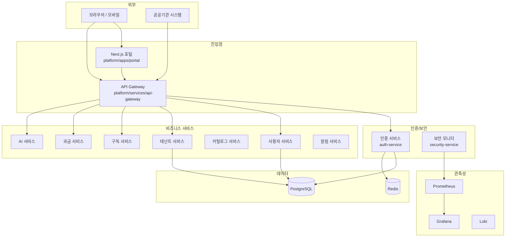

# 공공기관 SaaS 프레임워크 — 신규 직원 가이드북

> **문서 ID**: ONBOARD-00
> **버전**: 1.0.0 | **작성일**: 2026-04-11 | **작성자**: Implementer (Sonnet)
> **학습 대상**: 신규 입사자, 프로젝트 이전 인원
> **학습 기간**: 2주 권장
> **인증 목표**: CSAP 중/상 등급 + 행안부 정보화사업 감리기준 준수

---

## 목차

1. [이 가이드북의 구성](#1-이-가이드북의-구성)
2. [전체 아키텍처 개요](#2-전체-아키텍처-개요)
3. [서비스 구조](#3-서비스-구조)
4. [패키지 구조](#4-패키지-구조)
5. [핵심 인증 및 규정 체계](#5-핵심-인증-및-규정-체계)
6. [개발 도구 및 환경](#6-개발-도구-및-환경)
7. [CC 하네스 (Claude Code 자동화)](#7-cc-하네스-claude-code-자동화)
8. [역할별 학습 경로](#8-역할별-학습-경로)
9. [첫 주 체크리스트](#9-첫-주-체크리스트)
10. [변경 이력](#10-변경-이력)

---

## 1. 이 가이드북의 구성

본 가이드북은 신규 팀원이 프로젝트에 빠르게 합류할 수 있도록 설계된 단계별 학습 경로입니다.
감리·CSAP 인증 준수 환경에서 작업하는 데 필요한 최소한의 지식을 체계적으로 전달합니다.

| 장 | 파일 | 제목 | 학습 시간 | 우선순위 |
|---|------|-----|---------|--------|
| 0장 | `00-overview.md` | 프로젝트 개요 및 아키텍처 (본 문서) | 1일 | 필수 |
| 1장 | `01-document-management.md` | 문서 관리 및 PDCA 사이클 | 반일 | 필수 |
| 2장 | `02-code-management.md` | 코드 관리 및 모노레포 | 1일 | 필수 |
| 3장 | `03-vibe-coding.md` | Claude Code 바이브코딩 | 반일 | 권장 |
| 4장 | `04-infra-k3s.md` | 인프라 및 k3s | 2일 | 역할별 |
| 5장 | `05-monitoring.md` | 모니터링 및 관측성 | 1일 | 역할별 |
| 6장 | `06-cicd-devops.md` | CI/CD 및 DevOps | 1일 | 역할별 |
| 7장 | `07-security-csap.md` | 보안 및 CSAP 준수 | 1일 | 필수 |

> **0장(본 문서)을 반드시 먼저 읽으세요.** 프로젝트 전반을 이해하지 않은 상태에서 개별 서비스 코드를 보면 맥락을 파악하기 어렵습니다.

---

## 2. 전체 아키텍처 개요

### 2.1 프로젝트 목적

공공기관 SaaS 플랫폼은 다음 세 가지 규정·인증 체계를 동시에 충족하는 멀티테넌트 SaaS 인프라입니다.

| 인증/규정 | 발행 기관 | 핵심 내용 | 프레임워크 지원 |
|---------|---------|---------|--------------|
| **CSAP** (클라우드 보안 인증) | KISA | 일반/표준/중요 3등급, 최대 79개 통제항목 | 표준등급 79항목 전수 커버리지 |
| **N2SF** (국가 네트워크 보안 체계) | 국정원/KISA | C/S/O 3등급 데이터 분류, 6개 보안 영역 | 등급별 격리 + AI 연동 데이터 통제 |
| **행안부 감리** | 행안부 | 고시 제2023-1호, 착수~종료 7단계 산출물 | T01~T07 감리 산출물 템플릿 전수 |

### 2.2 기술 스택

```
프론트엔드
  Next.js 15 (App Router) + React 19 + TypeScript 5.7
  Server Component 우선 설계, CSP nonce 보안 미들웨어

백엔드
  Node.js 22 + Fastify 5 + TypeScript 5.7
  Zod 입력 검증, Pino 구조화 로그, OpenTelemetry 분산 추적

데이터
  PostgreSQL 17 (주 데이터베이스)
  Redis 7 (세션, 캐시, Rate Limit)
  Prisma 6 (ORM, 타입 안전 쿼리)

인프라
  k3s (경량 Kubernetes, WSL2 로컬 개발)
  Flux (GitOps 지속 배포)
  Helm (k8s 패키지 관리)
  Harbor (컨테이너 레지스트리, 취약점 스캔)

CI/CD
  Gitea + Gitea Actions (자체 호스팅)
  Turbo (모노레포 빌드 파이프라인)
  pnpm workspace (패키지 관리)

모니터링/관측성
  Prometheus + Grafana (메트릭)
  Loki (로그 집계)
  Tempo (분산 추적)
  OpenTelemetry (계측 표준)

보안
  Kyverno (Policy as Code)
  Cosign (컨테이너 서명)
  Sealed Secrets (k8s 시크릿 암호화)
  OPA/Gatekeeper (정책 시행)
```

### 2.3 시스템 아키텍처



### 2.4 멀티테넌시 격리 모델

본 플랫폼은 N2SF 등급별 격리 정책을 적용합니다.

| 테넌트 등급 | 격리 수준 | 적용 대상 |
|-----------|---------|---------|
| O 등급 | 논리적 격리 (공유 DB + 스키마 분리) | 일반 공공기관 |
| S 등급 | 네임스페이스 격리 (전용 파드 풀) | 민감 데이터 처리 기관 |
| C 등급 | 물리적 격리 (전용 클러스터) | 국가 핵심 인프라 |

---

## 3. 서비스 구조

`platform/services/` 하위에 총 17개 Fastify 마이크로서비스가 있습니다.

### 3.1 서비스 목록

| 서비스 디렉토리 | 패키지명 | 역할 | 기본 포트 | CSAP 항목 |
|--------------|--------|-----|---------|---------|
| `api-gateway` | `@public-saas/api-gateway` | 단일 진입점, 라우팅, Rate Limit | 3000 | D-08 |
| `auth-service` | `@public-saas/auth-service` | JWT 인증, MFA, 세션 관리 | 3001 | D-08 |
| `user-service` | `@public-saas/user-service` | 사용자 CRUD, 프로필 | 3002 | D-08 |
| `tenant-service` | `@public-saas/tenant-service` | 테넌트 온보딩, 격리 | 3003 | D-08, N2SF |
| `subscription-service` | `@public-saas/subscription-service` | 구독 플랜 관리 | 3004 | - |
| `billing-service` | `@public-saas/billing-service` | 과금, 청구서 | 3005 | D-09 |
| `catalog-service` | `@public-saas/catalog-service` | SaaS 서비스 카탈로그 | 3006 | - |
| `saas-catalog-service` | `@public-saas/saas-catalog-service` | 확장 카탈로그 | 3007 | - |
| `crm-service` | `@public-saas/crm-service` | 고객 관계 관리 | 3008 | D-08 |
| `menu-service` | `@public-saas/menu-service` | 메뉴/권한 구조 | 3009 | D-08 |
| `audit-service` | `@public-saas/audit-service` | 감사 로그 수집·저장 | 3010 | D-06 |
| `compliance-service` | `@public-saas/compliance-service` | CSAP/N2SF 준수 현황 | 3011 | D-06, D-08 |
| `security-service` | `@public-saas/security-service` | 보안 이벤트 탐지 | 3012 | D-06 |
| `security-monitor-service` | `@public-saas/security-monitor-service` | 실시간 위협 모니터링 | 3013 | D-06 |
| `notification-service` | `@public-saas/notification-service` | 이메일/SMS/푸시 알림 | 3014 | - |
| `file-service` | `@public-saas/file-service` | 파일 업로드/다운로드 | 3015 | D-09 |
| `ai-service` | `@public-saas/ai-service` | AI 게이트웨이, RAG | 3016 | N2SF AI규칙 |

### 3.2 서비스 표준 디렉토리 구조

모든 서비스는 다음 구조를 따릅니다 (auth-service 기준).

```
platform/services/auth-service/
├── src/
│   ├── index.ts          # 서비스 진입점 (Fastify 인스턴스 생성·플러그인 등록)
│   ├── routes.ts         # 라우트 등록 (registerRoutes 함수 내보내기)
│   ├── handlers/         # 요청 핸들러 (검증 → 로직 → 응답)
│   │   ├── login.handler.ts
│   │   └── logout.handler.ts
│   ├── middleware/       # Fastify 플러그인 형태의 미들웨어
│   │   └── auth.middleware.ts
│   ├── lib/              # 도메인 비즈니스 로직 (순수 함수)
│   │   ├── prisma.ts     # PrismaClient 싱글턴
│   │   ├── token.ts      # JWT 발급·검증
│   │   └── audit.ts      # 감사 로그 헬퍼
│   └── schemas/          # Zod 입력 검증 스키마
│       └── login.schema.ts
├── tests/
│   └── *.test.ts         # Vitest 단위/통합 테스트
├── Dockerfile
├── package.json
└── tsconfig.json
```

### 3.3 서비스 간 통신 방식

```
동기 호출:  HTTP/REST (API Gateway → 서비스)
비동기 호출: Redis Pub/Sub 또는 이벤트 버스 (@public-saas/event-bus)
서비스 탐색: k3s 내부 DNS (서비스명.네임스페이스.svc.cluster.local)
```

---

## 4. 패키지 구조

### 4.1 공유 패키지 (`platform/packages/`)

총 27개 공유 패키지가 `@public-saas/*` 네임스페이스로 제공됩니다.

**핵심 패키지**

| 패키지 | 설명 | 주요 내보내기 |
|--------|------|------------|
| `@public-saas/types` | 공유 TypeScript 타입 | `User`, `Tenant`, `ApiResponse`, `DataGrade` |
| `@public-saas/auth-sdk` | JWT 발급·검증 유틸리티 | `signAccessToken`, `verifyToken` |
| `@public-saas/audit-sdk` | 감사 로그 기록 SDK | `logAuditEvent`, `AuditAction` |
| `@public-saas/rbac` | Fastify RBAC 플러그인 | `rbacPlugin`, `hasPermission` |
| `@public-saas/observability` | OpenTelemetry 계측 | `initTelemetry`, `responseTimePlugin` |
| `@public-saas/health` | 헬스체크 엔드포인트 | `healthPlugin`, `CommonCheckers` |
| `@public-saas/rate-limit` | Rate Limiting 플러그인 | `rateLimitPlugin` |
| `@public-saas/mesh-ready` | 그레이스풀 셧다운, 서비스 메타데이터 | `meshReadyPlugin` |
| `@public-saas/tenant-isolation` | 테넌트 컨텍스트 격리 | `TenantContext`, `isolateByGrade` |
| `@public-saas/event-bus` | 이벤트 버스 (Redis 기반) | `EventBus`, `subscribe`, `publish` |
| `@public-saas/config-vault` | 환경 설정 관리 | `configPlugin` |
| `@public-saas/secret-manager` | 시크릿 관리 (Vault 연동) | `SecretManager` |
| `@public-saas/circuit-breaker` | 서킷 브레이커 | `CircuitBreaker` |
| `@public-saas/request-validator` | 공통 요청 검증 | `validateRequest` |
| `@public-saas/cache` | Redis 캐시 래퍼 | `CacheManager` |

**기타 전문 패키지**

| 패키지 | 설명 |
|--------|------|
| `@public-saas/api-gateway-advanced` | 고급 게이트웨이 기능 |
| `@public-saas/api-version` | API 버저닝 |
| `@public-saas/audit-chain` | 감사 로그 무결성 체인 |
| `@public-saas/chaos` | 카오스 엔지니어링 도구 |
| `@public-saas/workflow-engine` | 비즈니스 워크플로우 엔진 |
| `@public-saas/business-sdk` | 비즈니스 로직 SDK |
| `@public-saas/business-plugin-sdk` | 플러그인 확장 SDK |
| `@public-saas/health-aggregator` | 다중 서비스 헬스 집계 |
| `@public-saas/rate-limit-advanced` | 고급 Rate Limit (토큰 버킷) |
| `@public-saas/rate-limiter` | 분산 Rate Limiter |
| `@public-saas/ui` | 공유 UI 컴포넌트 |

### 4.2 루트 패키지 (`packages/`)

플랫폼 운영 도구 6개 패키지입니다. 서비스 내부에서 직접 의존하지 않고 독립적으로 실행됩니다.

| 패키지 | 설명 |
|--------|------|
| `dora-exporter` | DORA 메트릭 (배포 빈도, 변경 실패율 등) 내보내기 |
| `ml-pipeline` | ML 모델 CI/CD 파이프라인 |
| `slo-escalation` | SLO 위반 시 에스컬레이션 자동화 |
| `feature-flag-sdk` | 기능 플래그 SDK |
| `audit-collector` | 감사 로그 중앙 수집기 |
| `tech-debt-scanner` | 기술 부채 스캐너 |

### 4.3 앱 (`platform/apps/`)

| 앱 | 설명 | 기술 |
|----|------|------|
| `portal` | 관리자 및 테넌트 포털 UI | Next.js 15 + React 19 |

---

## 5. 핵심 인증 및 규정 체계

### 5.1 CSAP 주요 통제 항목 (D-시리즈)

코드를 작성할 때 반드시 숙지해야 하는 CSAP 통제 항목입니다.

| 항목 | 분야 | 개발자 영향 |
|------|------|----------|
| **D-06** | 침해사고 관리 | 모든 민감 작업에 감사 로그 기록 필수 (`audit-sdk` 사용) |
| **D-08** | 접근 통제 | 모든 API 엔드포인트에 RBAC 검사 필수 (`rbac` 패키지 사용) |
| **D-09** | 암호화 | 민감 데이터 AES-256 암호화, 전송 TLS 1.3+ |
| **D-12** | 시스템 개발 보안 | 입력 검증(Zod), 매개변수화 쿼리, XSS 방지 |

### 5.2 N2SF 데이터 등급 분류

AI API 호출 전 반드시 데이터 등급을 확인해야 합니다.

| 등급 | 설명 | AI API 전송 | 처리 방법 |
|------|------|-----------|---------|
| **C** (기밀) | 국가 기밀, 개인정보 | 절대 금지 | 내부 처리만 |
| **S** (민감) | 내부 민감 정보 | 절대 금지 | 내부 처리만 |
| **O** (일반) | 공개 가능 정보 | PII 마스킹 후 가능 | AI Gateway 경유 |

### 5.3 7단계 품질 게이트 (Q-Gate)

모든 코드는 배포 전 7개 게이트를 통과해야 합니다.

| 게이트 | 기준 | 담당 에이전트 |
|--------|------|------------|
| G1 | 요구사항 FR ID 전수 확인 | Auditor |
| G2 | 설계 완전성 (Plan + Design 문서 완비) | Auditor |
| G3 | 코드 품질 + AgentShield 102 규칙 | Reviewer |
| G4 | 테스트 커버리지 80% 이상 | Tester |
| G5 | OWASP Top10 통과 | Reviewer |
| G6 | CSAP 해당 Phase 100% | Auditor |
| G7 | 감사 추적 `audit.jsonl` 완비 | Auditor |

---

## 6. 개발 도구 및 환경

### 6.1 필수 설치 도구

| 도구 | 버전 | 설치 명령 |
|------|------|---------|
| Node.js | 22.x LTS | `nvm install 22` |
| pnpm | 9.x | `npm install -g pnpm@9` |
| Docker | 27.x | Docker Desktop 또는 공식 설치 |
| k3s | 1.29+ | WSL2 환경에서 자동 설치 스크립트 |

### 6.2 프로젝트 설정

```bash
# 1. 저장소 클론
git clone <gitea-repo-url> ai-saas
cd ai-saas

# 2. 의존성 설치 (전체 워크스페이스)
pnpm install

# 3. 환경 변수 설정
cp docs/env.example .env
# .env 편집 후 실제 값 입력

# 4. 데이터베이스 초기화
pnpm prisma migrate dev
pnpm prisma db seed

# 5. 전체 빌드 (Turbo 활용)
pnpm build

# 6. 개발 서버 시작 (특정 서비스)
pnpm --filter @public-saas/auth-service dev
```

### 6.3 주요 루트 스크립트

루트 `package.json`에 정의된 워크스페이스 단위 명령입니다.

| 명령 | 설명 |
|------|------|
| `pnpm test` | 전체 워크스페이스 테스트 실행 |
| `pnpm typecheck` | 전체 TypeScript 타입 검사 |
| `pnpm build` | 전체 빌드 (Turbo 병렬 처리) |
| `pnpm run audit:security` | 보안 감사 스크립트 실행 |
| `pnpm run audit:dead-code` | Dead code 탐지 |

### 6.4 Turbo 빌드 파이프라인

`turbo.json`에 정의된 태스크 의존성입니다.

- `build`: 의존 패키지 먼저 빌드 (`dependsOn: ["^build"]`), 출력 캐시 (`dist/**`, `.next/**`)
- `lint` / `typecheck`: 빌드 완료 후 실행
- `test`: 빌드 완료 후 실행, 환경 변수 주입 (`DATABASE_URL`, `REDIS_URL`)
- `dev`: 캐시 없음, 영구 실행 모드

---

## 7. CC 하네스 (Claude Code 자동화)

### 7.1 하네스 개요

본 프로젝트는 **ECC (Everything Claude Code) v1.9.0** 기반 AI 하네스를 사용합니다.
구현, 리뷰, 감리, 테스트, 리팩토링 5개 에이전트가 자동 분업합니다.

| 에이전트 | 모델 | 역할 |
|---------|------|------|
| Implementer | claude-sonnet-4-6 | 설계 기반 구현 |
| Reviewer | claude-sonnet-4-6 | 코드 품질·보안 검사 (수정 불가) |
| Auditor | claude-opus-4-6 | CSAP·N2SF·감리 준수 검증 (읽기 전용) |
| Tester | claude-sonnet-4-6 | 테스트 케이스 작성·실행 |
| Refactorer | claude-haiku-4-5 | Dead code 제거·구조 개선 |

### 7.2 절대 제약 (CLAUDE.md)

하네스가 강제하는 절대 제약입니다. 위반 시 커밋이 차단됩니다.

- 구현 착수 전 Plan + Design 문서 완비 필수
- `.env`, `secrets.*`, `*credential*` 파일 커밋 금지
- `git push --force`, `DROP TABLE`, `DELETE FROM` (WHERE 없음) 금지
- `git commit --no-verify` 사용 금지 (훅 우회 금지)
- AI API 호출 시 N2SF C/S 등급 데이터 전송 금지
- 외부 클라우드 서비스 사용 금지 (AI API만 예외, O등급 + 마스킹 후)

### 7.3 감사 로그

모든 민감 작업은 `.claude/audit.jsonl`에 자동 기록됩니다 (CSAP D-06 준수).

---

## 8. 역할별 학습 경로

### 8.1 백엔드 개발자

```
0장 (본 문서) → 1장 (문서 관리) → 2장 (코드 관리) → 7장 (보안·CSAP)
→ 서비스별 Plan/Design 문서 (docs/01-plan/mtus/SVC-*.plan.md)
→ 첫 이슈 할당
```

**필수 숙지 파일**:
- `/data/ai-saas/docs/guidelines/coding-standards.md` — TypeScript/Fastify 패턴
- `/data/ai-saas/docs/guidelines/documentation-standards.md` — 코드 주석 표준
- `/data/ai-saas/.claude/rules/csap-compliance.md` — 보안 코딩 규칙

### 8.2 프론트엔드 개발자

```
0장 → 1장 → 2장 → 7장
→ platform/apps/portal/ 코드베이스 탐색
→ Next.js 15 Server Component 패턴 학습 (coding-standards.md §6)
```

**필수 숙지 파일**:
- `/data/ai-saas/docs/guidelines/coding-standards.md` §6 (프론트엔드 패턴)
- `/data/ai-saas/platform/apps/portal/` 디렉토리 구조

### 8.3 인프라 엔지니어

```
0장 → 4장 (인프라·k3s) → 5장 (모니터링) → 6장 (CI/CD)
→ docs/framework/08-infra/ 심화 학습
→ infra/ 디렉토리 탐색
```

**필수 숙지 파일**:
- `/data/ai-saas/docs/framework/08-infra/` — k3s, Gitea, Flux, Harbor
- `/data/ai-saas/helm/` — Helm 차트
- `/data/ai-saas/k8s/` — k8s 매니페스트

### 8.4 보안 담당자

```
0장 → 7장 (보안·CSAP) → docs/framework/02-csap/ → docs/framework/04-n2sf/
→ CSAP 자가진단 체크리스트 작성
```

**필수 숙지 파일**:
- `/data/ai-saas/docs/framework/02-csap/` — CSAP 일반/표준등급
- `/data/ai-saas/docs/framework/04-n2sf/` — N2SF 등급 분류
- `/data/ai-saas/.claude/rules/csap-compliance.md`

### 8.5 PM / 기획자

```
0장 → 1장 (문서 관리) → 7장 (보안·CSAP 개요)
→ docs/roadmap/ → docs/01-plan/mtus/ 현황 파악
```

**필수 숙지 파일**:
- `/data/ai-saas/docs/framework/00-getting-started/AUDIT-CSAP-SUBMISSION-GUIDE.md`
- `/data/ai-saas/docs/01-plan/mtus/` — 현재 진행 중인 MTU 목록
- `/data/ai-saas/CHANGELOG.md`

---

## 9. 첫 주 체크리스트

### 9.1 1일차 (환경 구성)

- [ ] 저장소 클론 및 `pnpm install` 완료
- [ ] `.env` 파일 구성 완료 (`docs/env.example` 참조)
- [ ] `pnpm build` 성공 확인
- [ ] `pnpm test` 통과 확인
- [ ] k3s 로컬 클러스터 기동 확인 (선택: 인프라 담당만)

### 9.2 2~3일차 (문서 파악)

- [ ] 본 문서(0장) 완독
- [ ] `docs/guidelines/coding-standards.md` 완독
- [ ] `docs/guidelines/documentation-standards.md` 완독
- [ ] `.claude/rules/csap-compliance.md` 완독
- [ ] `CLAUDE.md` 완독 (절대 제약 숙지)

### 9.3 4~5일차 (코드 탐색)

- [ ] 담당 서비스의 Plan 문서 (`docs/01-plan/mtus/SVC-*.plan.md`) 읽기
- [ ] 담당 서비스의 Design 문서 (`docs/02-design/mtus/SVC-*.design.md`) 읽기
- [ ] 담당 서비스 소스코드 (`platform/services/{서비스}/src/`) 탐색
- [ ] 첫 이슈 할당 요청

### 9.4 2주차 (실습)

- [ ] 간단한 버그 픽스 또는 문서 개선 PR 작성
- [ ] PR 리뷰 프로세스 경험
- [ ] 감사 로그 작성 실습 (`audit-sdk` 사용)
- [ ] CSAP D-12 입력 검증 패턴 구현 실습

---

## 10. 변경 이력

| 버전 | 일자 | 내용 | 작성자 |
|------|------|------|-------|
| 1.0.0 | 2026-04-11 | 초기 작성 — 프로젝트 실제 구조 기반 | Implementer (Sonnet) |
