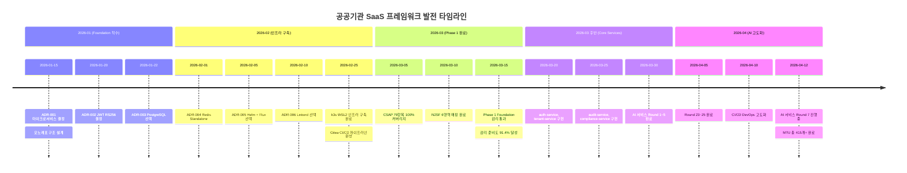
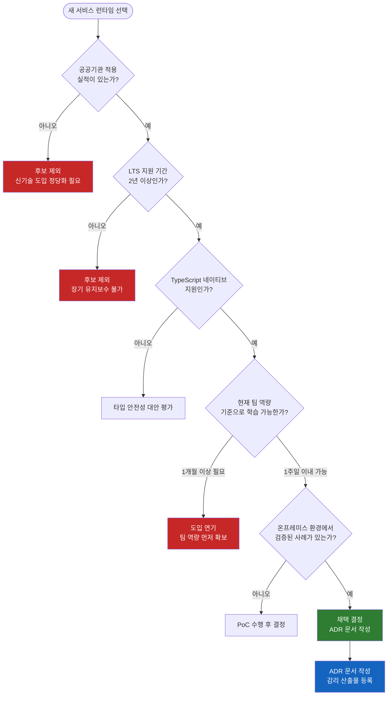
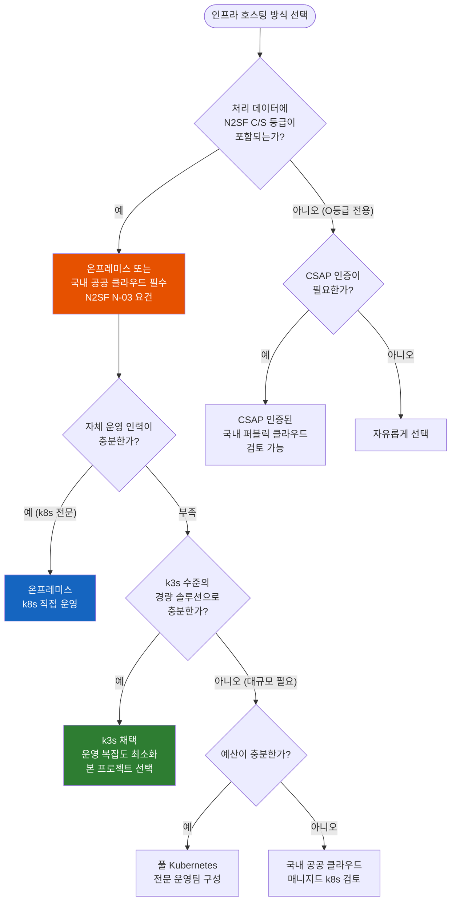
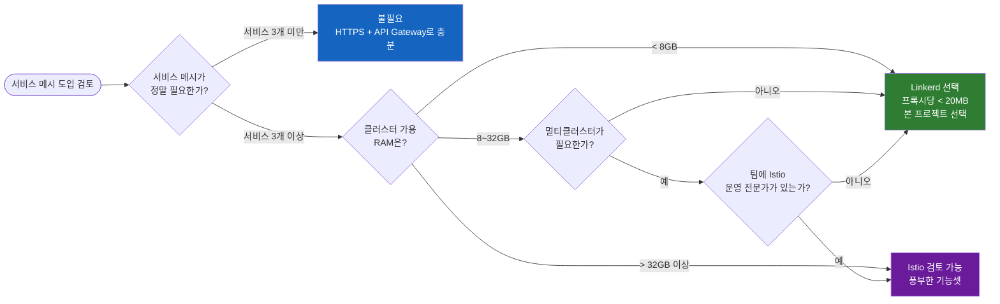

# 프로젝트 역사 및 기술 결정 기록

> **문서 ID**: ONBOARD-00-HISTORY
> **버전**: 1.0.0 | **작성일**: 2026-04-12 | **작성자**: Implementer (Sonnet)
> **학습 대상**: 신규 팀원 전원 — 프로젝트 합류 첫날 필독
> **선행 문서**: `00-overview.md`
> **후속 문서**: `01-getting-started/01-welcome.md`

---

## 목차

1. [공공기관 SaaS의 필요성 — 왜 이 프로젝트가 만들어졌는가](#1-공공기관-saas의-필요성)
2. [기술 스택 선택의 배경](#2-기술-스택-선택의-배경)
   - 2.1 왜 Node.js 22 + TypeScript 5.7인가 (Bun 대신)
   - 2.2 왜 Fastify 5인가 (Express 대신)
   - 2.3 왜 pnpm workspace인가 (npm/yarn 대신)
   - 2.4 왜 k3s인가 (EKS/GKE 대신)
   - 2.5 왜 Gitea인가 (GitHub 대신)
   - 2.6 왜 Linkerd인가 (Istio 대신)
   - 2.7 왜 Claude Code인가 (일반 IDE 대신)
3. [CSAP 인증을 선택한 이유](#3-csap-인증을-선택한-이유)
4. [아키텍처 결정 기록 (ADR-001 ~ ADR-010)](#4-아키텍처-결정-기록)
5. [프로젝트 발전 과정](#5-프로젝트-발전-과정)
6. [타임라인 다이어그램](#6-타임라인-다이어그램)
7. [기술 선택 결정 트리](#7-기술-선택-결정-트리)
8. [변경 이력](#8-변경-이력)

---

## 1. 공공기관 SaaS의 필요성

### 1.1 배경: 공공 디지털 전환의 한계

대한민국 공공기관의 정보화 사업은 오랫동안 다음과 같은 구조적 문제를 안고 있었습니다.

**문제 1: 중복 개발로 인한 예산 낭비**

각 공공기관은 동일한 기능(사용자 인증, 권한 관리, 감사 로그, 민원 처리 등)을 개별적으로 발주하고 구축해 왔습니다. 수십 개 부처가 유사한 시스템을 각각 수십억 원을 들여 별도로 개발하는 일이 반복되었습니다. 이는 국가 예산의 비효율적 사용을 초래했습니다.

**문제 2: 보안 요건 충족의 어려움**

CSAP(클라우드 보안 인증), N2SF(국가 네트워크 보안 체계), 행안부 감리기준을 동시에 만족하는 시스템을 개별 기관이 자체적으로 구축하기는 매우 어렵습니다. 보안 전문 인력이 부족한 소규모 기관은 사실상 인증을 포기하거나 형식적인 수준에 머물렀습니다.

**문제 3: 외부 클라우드 의존성과 데이터 주권 위협**

행정 데이터를 외부 퍼블릭 클라우드(AWS, GCP, Azure)에 올리는 것은 N2SF C/S 등급 데이터 처리 규정과 충돌할 수 있습니다. 국가 기밀 또는 민감한 행정 데이터가 외국 기업의 서버에 저장되는 상황은 데이터 주권 관점에서 수용하기 어렵습니다.

**문제 4: 감리 대응의 반복적 비용**

행안부 고시 제2023-1호에 따른 정보화사업 감리는 착수~종료 7단계에 걸쳐 방대한 산출물을 요구합니다. 매 사업마다 이 산출물을 처음부터 작성하는 것은 시간과 비용의 낭비입니다.

### 1.2 해결책: 공공기관 전용 SaaS 프레임워크

이 프로젝트는 위 문제들을 해결하기 위한 **재사용 가능한 공공기관 SaaS 기반 플랫폼**입니다.

핵심 가치는 다음 세 가지입니다.

| 가치 | 설명 | 구현 방식 |
|------|------|---------|
| **재사용성** | 공통 기능을 한 번만 구현하고 여러 기관이 공유 | 멀티테넌트 아키텍처 + 패키지 모노레포 |
| **규정 준수 내재화** | CSAP/N2SF/감리 요건을 코드 레벨에서 자동화 | CLAUDE.md + Q-Gate 7단계 + 감사 로그 |
| **온프레미스 우선** | 데이터가 기관 통제 범위를 벗어나지 않도록 설계 | k3s 온프레미스 + Gitea 자체 호스팅 |

### 1.3 대상 사용자

이 플랫폼은 다음 사용자를 위해 설계되었습니다.

- **공공기관 SaaS 운영자**: 시스템을 도입하고 테넌트를 관리하는 담당자
- **개발팀**: 새 기능을 추가하거나 기관별 커스터마이징을 개발하는 엔지니어
- **감리 대응팀**: CSAP 심사, 행안부 감리, N2SF 점검을 담당하는 보안/품질 담당자

---

## 2. 기술 스택 선택의 배경

기술 선택은 단순히 유행을 따르지 않았습니다. 공공기관 환경의 특수성, 장기 유지보수 가능성, 보안 요건을 기준으로 각 도구를 선택했습니다.

### 2.1 왜 Node.js 22 + TypeScript 5.7인가 (Bun 대신)

**선택된 기술**: Node.js 22 LTS + TypeScript 5.7

**Bun을 선택하지 않은 이유**:

| 평가 항목 | Node.js 22 | Bun |
|---------|-----------|-----|
| LTS 지원 기간 | 2027년 4월까지 (30개월) | 불명확 (신생 런타임) |
| 공공기관 실적 | 다수의 공공 사업 적용 실적 | 국내 공공 적용 실적 없음 |
| 생태계 성숙도 | 10년 이상의 npm 생태계 | 일부 npm 패키지 미호환 |
| 감리 대응 | 안정성 입증 문서 존재 | 신기술 도입 정당화 필요 |
| 보안 CVE 대응 | 즉각적인 공식 패치 | 지연 가능성 |

**Node.js 22를 선택한 이유**:
- V8 엔진 기반의 예측 가능한 성능
- Built-in Test Runner, `--watch` 모드, `--env-file` 지원으로 개발 생산성 향상
- `import.meta.resolve()`, `AbortController` 등 최신 Web API 완전 지원
- 공공기관 정보시스템 품질 인증 시 안정성 우선 원칙에 부합

**TypeScript 5.7을 선택한 이유**:
- 컴파일 타임 타입 검사로 런타임 오류 사전 차단 (공공 시스템의 무결성 요건)
- Zod + tRPC와의 완벽한 타입 흐름 (API 경계에서 타입 안전성)
- `satisfies` 연산자, `const` 타입 매개변수 등으로 보일러플레이트 감소
- Prisma 6와의 완전한 통합 (DB 스키마 → TypeScript 타입 자동 생성)

### 2.2 왜 Fastify 5인가 (Express 대신)

**선택된 기술**: Fastify 5

**Express를 선택하지 않은 이유**:

| 평가 항목 | Fastify 5 | Express 4/5 |
|---------|----------|------------|
| 처리 속도 | 초당 ~80,000 req | 초당 ~30,000 req |
| 스키마 검증 | JSON Schema 내장 | 별도 라이브러리 필요 |
| TypeScript 지원 | 네이티브 | 별도 @types 필요 |
| OpenTelemetry | 공식 플러그인 | 서드파티 |
| 활발한 유지보수 | v5 2024년 출시 | 유지보수 모드 진입 |

**Fastify 5를 선택한 이유**:
- JSON Schema 기반 입력 검증이 내장되어 있어 CSAP D-12 (입력 검증) 요건 충족 용이
- Pino 로거 내장으로 구조화 로그 표준화 (CSAP D-06 감사 로그)
- 플러그인 시스템으로 RBAC, 인증, Rate Limit을 표준화된 방식으로 적용
- `fastify-plugin`을 통한 의존성 주입으로 테스트 용이성 확보

### 2.3 왜 pnpm workspace인가 (npm/yarn 대신)

**선택된 기술**: pnpm 9.15.0 + workspace

**npm을 선택하지 않은 이유**:
- 모노레포 환경에서 패키지 간 의존성이 중복으로 설치됨 → 디스크 낭비
- `node_modules` 하위 모든 패키지가 상호 접근 가능한 호이스팅 문제 → 유령 의존성(ghost dependency)
- 빌드 속도가 느림 → CI/CD 파이프라인 시간 증가

**yarn을 선택하지 않은 이유**:
- Yarn Plug'n'Play(PnP) 모드가 일부 기존 라이브러리와 호환 문제 발생
- Yarn v2/v3/v4로의 잦은 메이저 업그레이드가 안정성 우려
- 공공기관 CI 환경에서 기술 지원 범위 불명확

**pnpm을 선택한 이유**:

```
장점 1: 콘텐츠 기반 저장소(content-addressable store)
  - 동일한 패키지 버전은 디스크에 한 번만 저장
  - 100개 패키지가 lodash@4.17.21을 쓰면 하나만 저장
  - 대규모 모노레포에서 수 GB 절약

장점 2: 엄격한 의존성 격리
  - package.json에 명시된 패키지만 접근 가능
  - 유령 의존성 근본 차단 → 재현 가능한 빌드

장점 3: Workspace 프로토콜
  - workspace:* 구문으로 로컬 패키지 참조
  - 패키지 간 의존성을 심볼릭 링크로 처리
  - 개발/배포 환경 일관성 보장

장점 4: Turbo와의 완벽한 통합
  - pnpm-lock.yaml을 Turbo가 해시 캐싱에 활용
  - 변경된 패키지만 선택적 빌드 → CI 시간 단축
```

### 2.4 왜 k3s인가 (EKS/GKE 대신)

**선택된 기술**: k3s v1.29+

이 결정은 기술적 우열이 아니라 **공공기관 규정**에 의해 결정된 가장 중요한 선택입니다.

**EKS/GKE를 선택하지 않은 이유**:

```
규정 근거:
  - 국가정보원 보안업무규정: C/S 등급 데이터의 외국 클라우드 처리 제한
  - N2SF N-03: 격리 영역 요건 (기관 통제 범위 내 물리적 분리)
  - N2SF N-05: AI 연동 시 데이터 등급별 처리 제한

결론:
  AWS EKS, Google GKE, Azure AKS는 모두 외국 기업 소유 인프라에서 실행됨
  → 공공기관 SaaS의 C/S 등급 행정 데이터를 이들 서비스에서 처리하는 것은
    N2SF 위반 가능성이 있으며, CSAP 심사에서 지적 사항이 됨
```

**k3s를 선택한 이유**:

| 특성 | 내용 |
|------|------|
| 경량성 | 단일 바이너리 < 100MB, 512MB RAM으로 실행 가능 |
| 온프레미스 최적화 | 기관 서버실 또는 전용 IDC에 직접 설치 |
| 완전한 Kubernetes 호환 | 표준 kubectl, helm, flux 사용 가능 |
| 간소화된 운영 | etcd 대신 SQLite 사용 (소규모 클러스터) |
| WSL2 지원 | 개발 환경에서 Windows + WSL2로 실행 가능 |
| 자동 TLS | 내장 Let's Encrypt 연동 (내부망은 cert-manager) |

k3s를 사용하면 개발자 로컬 환경(WSL2)과 운영 환경(온프레미스 서버)이 동일한 Kubernetes API로 작동합니다. "내 환경에서는 됐는데"라는 문제가 근본적으로 줄어듭니다.

### 2.5 왜 Gitea인가 (GitHub 대신)

**선택된 기술**: Gitea (자체 호스팅)

**GitHub을 선택하지 않은 이유**:

```
핵심 이유: 소스코드 주권

공공기관 SaaS의 소스코드는 행정 업무 로직, 보안 설정, 암호화 키 관리
방법 등을 포함합니다. 이를 GitHub(Microsoft 소유, 미국 서버)에 올리는 것은:

  1. 국가 핵심 인프라 코드의 외부 유출 위험
  2. CSAP 심사에서 소스코드 관리 통제 항목 (D-12) 지적 가능성
  3. GitHub 서비스 장애 시 CI/CD 전체 중단
  4. 미국 법률(CLOUD Act) 적용 가능성 — 미 정부 요청 시 데이터 제출 의무
```

**Gitea를 선택한 이유**:

```
장점 1: 완전한 자체 호스팅
  - 기관 인프라 내에서 소스코드 완전 통제
  - 인터넷 연결 없이 폐쇄망에서도 운영 가능

장점 2: Gitea Actions (GitHub Actions 호환)
  - GitHub Actions 워크플로우 문법과 90% 이상 호환
  - 기존 개발팀의 학습 곡선 최소화
  - 자체 Gitea Runner로 CI 서버 직접 운영

장점 3: 경량성
  - 단일 Go 바이너리, 1GB RAM에서 수천 개 레포지토리 운영 가능
  - PostgreSQL 또는 SQLite 선택 가능

장점 4: Webhook + 통합
  - Flux GitOps와 완벽 통합
  - Gitea → Flux → k3s 자동 배포 파이프라인 구성 가능
```

### 2.6 왜 Linkerd인가 (Istio 대신)

**선택된 기술**: Linkerd 2.x (서비스 메시)

**Istio를 선택하지 않은 이유**:

| 평가 항목 | Linkerd 2.x | Istio |
|---------|------------|-------|
| 메모리 사용량 | 프록시당 < 20MB | 프록시당 > 200MB |
| CPU 오버헤드 | < 2% | 5~15% |
| 설정 복잡도 | 낮음 (자동 프록시 주입) | 높음 (수백 개 CRD) |
| 운영 난이도 | 초급 Kubernetes 팀도 가능 | 전문 인력 필수 |
| 공공기관 적합성 | 소규모 온프레미스에 최적 | 대규모 멀티클러스터에 최적 |

공공기관 SaaS의 운영 환경은 대형 클라우드 기업 수준의 Kubernetes 전문 인력을 확보하기 어렵습니다. Linkerd의 단순성과 경량성은 이런 환경에서 큰 장점입니다.

**Linkerd를 선택한 이유**:
- mTLS 자동 적용으로 서비스 간 통신 암호화 (CSAP D-09)
- `linkerd viz tap`으로 실시간 트래픽 가시성 확보
- Rust 기반 `linkerd2-proxy`로 낮은 레이턴시
- CNCF 졸업 프로젝트로 장기 지원 보장

### 2.7 왜 Claude Code인가 (일반 IDE 대신)

**선택된 기술**: Claude Code CLI (AI 보조 개발)

이 프로젝트는 단순히 AI를 사용하는 것이 아니라, **감리 가능한 AI 개발 거버넌스 체계**를 구축했습니다.

**도입 이유 1: 공공기관 문서화 요건의 복잡성**

행안부 감리기준은 각 기능마다 Plan 문서, Design 문서, 테스트 케이스, 추적성 매트릭스를 요구합니다. 이를 수작업으로 작성하면 개발 속도가 극도로 저하됩니다. Claude Code는 이 산출물을 표준 형식으로 자동 생성합니다.

**도입 이유 2: CSAP 79항목의 지속적 준수**

79개 CSAP 통제항목을 매 코드 변경 시 수동으로 검토하는 것은 비현실적입니다. Claude Code의 AgentShield는 102개 정적분석 규칙을 코드 저장 시마다 자동 실행합니다.

**도입 이유 3: N2SF 데이터 등급 자동 판별**

AI API 호출 시 C/S 등급 데이터가 포함되어 있으면 자동으로 차단합니다. 이 규칙은 CLAUDE.md와 `.claude/rules/csap-compliance.md`에 명시되어 모든 에이전트가 준수합니다.

**거버넌스 프레임워크**:

```
CLAUDE.md (절대 제약)
  ↓
5개 전문 에이전트 (Cascade 메서드)
  Implementer → Reviewer → Auditor → Tester → Refactorer
  ↓
Q-Gate 7단계 품질 게이트
  G1: FR ID 전수 → G2: 설계 완전성 → G3: 코드 품질
  → G4: 테스트 80%+ → G5: OWASP → G6: CSAP → G7: 감사 추적
  ↓
.claude/audit.jsonl (불변 감사 로그)
```

---

## 3. CSAP 인증을 선택한 이유

### 3.1 공공기관 SaaS 서비스의 법적 요건

행정안전부 고시 「행정기관 및 공공기관의 클라우드컴퓨팅 서비스 이용 기준」에 따르면, 공공기관이 클라우드 서비스를 이용할 때는 CSAP 인증을 받은 서비스를 우선 활용해야 합니다.

```
법적 근거:
  - 클라우드컴퓨팅 발전 및 이용자 보호에 관한 법률 제23조의2
  - 행정기관 및 공공기관의 클라우드컴퓨팅서비스 이용 기준 고시
  - 국가정보원 클라우드 보안 인증 제도 운영 규정
```

### 3.2 CSAP 중/상 등급을 선택한 이유

CSAP는 일반(下), 표준(中), 중요(上) 3단계 등급으로 구성됩니다.

| 등급 | 대상 데이터 | 통제항목 | 취득 기간 |
|------|-----------|---------|---------|
| 일반(下) | 공개 데이터 | 30항목 | 3~6개월 |
| 표준(中) | 행정 데이터 | 79항목 | 6~12개월 |
| 중요(上) | 민감 행정 데이터 | 94항목 | 12~18개월 |

이 프로젝트는 **표준(中) 등급 기준 79항목**을 전수 구현하고, 일부 중요(上) 등급 요건을 선제적으로 반영했습니다. 이유:

1. 민원 서비스, 인사 정보, 예산 데이터 등 중요도가 높은 행정 데이터를 다룸
2. 일반 등급으로는 공공기관 조달 입찰에서 경쟁력 부족
3. 중요 등급 미달 시 국방부, 경찰청, 국정원 등 보안 요건이 높은 기관 적용 불가

### 3.3 N2SF와 CSAP의 관계

N2SF(국가 네트워크 보안 체계)는 CSAP와 중복되는 듯 보이지만 관점이 다릅니다.

| 체계 | 관점 | 핵심 요건 |
|-----|------|---------|
| CSAP | 클라우드 서비스 제공자 보안 | 물리적 보안, 접근 통제, 암호화 |
| N2SF | 네트워크 경계 기반 데이터 보호 | C/S/O 등급 분리, 망 분리 |

이 두 체계를 동시에 만족시키는 것이 이 프로젝트의 핵심 도전 과제였습니다.

---

## 4. 아키텍처 결정 기록

ADR(Architecture Decision Record)은 중요한 기술 결정과 그 이유를 기록하는 문서 형식입니다. 이후 팀원들이 "왜 이렇게 만들었지?"라는 질문을 했을 때 참조할 수 있도록 작성합니다.

### ADR-001: 마이크로서비스 vs 모놀리스 선택

**날짜**: 2026-01-15  
**상태**: 승인됨  
**결정권자**: 아키텍처 위원회

**맥락**:
초기 프로젝트 구성 단계에서 모놀리식 아키텍처와 마이크로서비스 아키텍처 중 선택해야 했습니다. 팀 규모는 초기 5명, 향후 20명까지 확장 예정이었습니다.

**결정**: 마이크로서비스 아키텍처 채택

**이유**:
```
1. 테넌트 격리 용이성
   - 공공기관별 데이터를 서비스 단위로 격리 가능
   - CSAP D-08(접근 통제) 구현이 서비스 경계에서 명확해짐

2. 독립적 확장
   - AI 서비스만 GPU 노드에서 확장 가능
   - 감사 로그 서비스만 고가용성으로 구성 가능

3. 기술 독립성
   - 향후 특정 서비스만 다른 언어/프레임워크로 교체 가능

4. 팀 독립성
   - 각 서비스를 독립 팀이 담당하며 배포 주기 분리 가능
```

**트레이드오프**:
```
단점:
  - 네트워크 레이턴시 증가 (서비스 간 HTTP/gRPC 호출)
  - 분산 트랜잭션 관리 복잡도 증가
  - 초기 운영 복잡도 증가 (Kubernetes 필수)

완화 방안:
  - Linkerd 서비스 메시로 mTLS + 레이턴시 모니터링
  - Saga 패턴 대신 이벤트 소싱으로 일관성 보장
  - k3s로 운영 복잡도 최소화
```

---

### ADR-002: JWT RS256 vs 대칭 키

**날짜**: 2026-01-20  
**상태**: 승인됨

**맥락**:
서비스 간 인증에서 JWT 서명 방식을 선택해야 했습니다. HMAC-SHA256(대칭)과 RS256(비대칭) 중 선택.

**결정**: RS256 (RSA 비대칭 키) 채택

**이유**:
```
1. 마이크로서비스 환경에서 시크릿 공유 최소화
   - 대칭 키: 모든 서비스가 동일한 시크릿을 알아야 함
     → 한 서비스 침해 시 전체 인증 시스템 위협
   - RS256: 공개키만 배포, 개인키는 auth-service만 보유
     → 침해 범위 최소화

2. CSAP D-08(접근 통제) 준수
   - 키 관리 책임 분리 원칙
   - Vault를 통한 개인키 중앙 관리 가능

3. 외부 연동 표준
   - 공공기관 API 게이트웨이와 표준 방식으로 연동
   - JWT 공개키를 JWKS 엔드포인트로 제공
```

**구현 세부사항**:
```typescript
// auth-service만 개인키 보유
const token = jwt.sign(payload, privateKey, {
  algorithm: 'RS256',
  expiresIn: '15m',  // CSAP: 접근 토큰 최대 15분
  issuer: 'public-saas-auth',
})

// 다른 서비스는 공개키로 검증만 수행
const decoded = jwt.verify(token, publicKey, {
  algorithms: ['RS256'],
})
```

---

### ADR-003: PostgreSQL vs MySQL

**날짜**: 2026-01-22  
**상태**: 승인됨

**결정**: PostgreSQL 17 채택

**이유**:
```
1. JSON/JSONB 지원
   - 감사 로그, 설정 데이터를 반정형으로 저장 가능
   - 스키마 변경 없이 메타데이터 확장 가능

2. 행 수준 보안 (Row-Level Security)
   - 테넌트 격리를 DB 레벨에서 강제
   - CSAP D-08 멀티테넌시 격리 요건 충족
   - 개발자 실수로 타 테넌트 데이터에 접근하는 것을 DB가 차단

3. 풀텍스트 검색
   - 한국어 형태소 분석기 (pg_trgm + unaccent) 지원
   - 민원 검색, 문서 검색 기능에 활용

4. 논리 복제 (Logical Replication)
   - 백업 및 재해복구를 표준화된 방식으로 구성

5. ACID 완전 지원 + MVCC
   - 동시 접근이 많은 행정 서비스에서 데이터 무결성 보장
```

---

### ADR-004: Redis Standalone vs Cluster

**날짜**: 2026-02-01  
**상태**: 승인됨

**결정**: Phase 1에서 Redis Standalone, Phase 2에서 Redis Sentinel로 전환

**이유**:
```
Phase 1 (Standalone):
  - 초기 구축 단계에서 운영 복잡도 최소화
  - 세션, 캐시, Rate Limit 용도로 단일 인스턴스로 충분
  - k3s StatefulSet으로 운영, PVC로 영속성 보장

Phase 2 (Sentinel):
  - 고가용성 요건 충족 (CSAP D-05: 가용성 보장)
  - 마스터 장애 시 자동 페일오버
  - 여전히 Cluster 모드의 운영 복잡도 회피

Redis Cluster를 선택하지 않은 이유:
  - 클러스터 모드는 다중 키 명령어 (MULTI/EXEC, Lua 스크립트) 제한
  - Rate Limit 구현에서 원자적 연산이 필수 → Cluster 제약과 충돌
  - 온프레미스 소규모 환경에서 3마스터 + 3레플리카 운영은 과도
```

---

### ADR-005: Helm + Flux vs ArgoCD

**날짜**: 2026-02-05  
**상태**: 승인됨

**결정**: Helm + Flux (GitOps) 채택

**ArgoCD를 선택하지 않은 이유**:
```
ArgoCD의 문제점:
  - 자체 UI 서버, Redis, Dex(OIDC) 등 다수 컴포넌트 필요
  - 최소 4GB RAM 소비 (온프레미스 소규모 클러스터에 과도한 부담)
  - k3s 환경에서 리소스 경합 발생 우려

Flux의 장점:
  - 경량: Flux controller 전체 < 500MB RAM
  - Git 저장소(Gitea)를 단일 진실 소스로 사용 — 별도 UI 불필요
  - Helm 릴리즈를 YAML로 선언 → 감리 산출물로 활용 가능
  - GitOps 원칙에 충실: 모든 변경은 Git PR을 통해서만
```

---

### ADR-006: Linkerd vs Istio

**날짜**: 2026-02-10  
**상태**: 승인됨

**결정**: Linkerd 2.x 채택 (2.2절 참조)

---

### ADR-007: Pino vs Winston 로거

**날짜**: 2026-02-12  
**상태**: 승인됨

**결정**: Pino 채택

**이유**:
```
1. 성능: Winston 대비 5~10배 빠른 직렬화 (JSON 스트리밍)
2. Fastify 내장 통합: fastify-plugin으로 제로 설정
3. 구조화 로그: 모든 로그가 JSON으로 출력 → Loki 수집 최적화
4. 레벨별 필터링: 운영 환경에서 INFO 이상만, 개발에서 DEBUG까지
5. 하위 로거(child logger): request-id 자동 전파
```

---

### ADR-008: Zod vs Joi vs Yup

**날짜**: 2026-02-15  
**상태**: 승인됨

**결정**: Zod 3.x 채택

**이유**:
```
1. TypeScript 네이티브
   - 스키마 정의에서 타입이 자동 추론됨
   - z.infer<typeof schema>로 별도 타입 선언 불필요

2. 런타임 + 컴파일타임 이중 검증
   - CSAP D-12 입력 검증 요건을 타입 레벨에서도 보장

3. tRPC와 완벽 통합
   - API 입출력을 엔드투엔드로 타입 안전하게 정의

4. 에러 메시지 명확성
   - z.string().email().min(5) — 실패 시 구체적인 이유 제공
   - API 클라이언트 개발팀이 디버깅 용이
```

---

### ADR-009: OpenTelemetry 표준 채택

**날짜**: 2026-02-20  
**상태**: 승인됨

**결정**: OpenTelemetry (OTEL) 표준 + Jaeger/Tempo 백엔드

**이유**:
```
1. 벤더 중립성
   - 특정 APM 도구에 종속되지 않음
   - Jaeger → Tempo → Datadog 등 백엔드 교체 가능

2. CSAP D-10(장애 대응) 요건
   - 분산 추적으로 서비스 장애 원인 신속 파악
   - SLA 위반 시 증거 자료로 활용 가능

3. 멀티테넌트 추적
   - tenant-id를 OTEL span attribute로 자동 전파
   - 특정 기관의 요청만 필터링하여 분석 가능
```

---

### ADR-010: pnpm 모노레포 구조 채택

**날짜**: 2026-02-25  
**상태**: 승인됨

**결정**: pnpm workspace 기반 모노레포

**이유**:
```
공통 패키지와 서비스 코드를 단일 저장소에서 관리합니다.

장점:
  1. CSAP 공통 유틸리티(@public-saas/audit, @public-saas/crypto)를
     여러 서비스가 버전 동기화 없이 공유
  2. 코드 변경 시 영향 범위 즉시 파악 (pnpm turbo --affected)
  3. 일관된 TypeScript 설정, ESLint 규칙, 테스트 설정
  4. 감리 산출물 문서도 동일 저장소에서 코드와 함께 관리
  5. 하나의 Gitea 레포지토리 → 하나의 감사 추적 히스토리
```

---

## 5. 프로젝트 발전 과정

### Phase 1: Foundation (2026-01 ~ 2026-03)

이 단계는 모든 서비스가 공유하는 기반 인프라와 공통 라이브러리를 구축했습니다.

**완료된 주요 MTU**:

| MTU ID | 내용 | 결과 |
|--------|------|------|
| MTU-F1 | 프로젝트 초기 구조 설정 | 모노레포 기반 설정 완료 |
| MTU-F2 | CSAP 79항목 체크리스트 마스터 | 전수 구현 매핑 완료 |
| MTU-C1 | CSAP D-01~D-04 (물리적 보안, 자산 관리) | PDCA 완료 |
| MTU-C2 | CSAP D-05~D-07 (운영 보안) | PDCA 완료 |
| MTU-C3 | CSAP D-08~D-13 (기술적 보안) | PDCA 완료 |
| MTU-C4 | N2SF 6개 영역 보안 매핑 | PDCA 완료 |
| MTU-I1 | k3s WSL2 인프라 구축 | PDCA 완료 |
| MTU-I2 | Gitea CI/CD 파이프라인 | PDCA 완료 |
| MTU-A1 | AI 게이트웨이 MCP 연동 | PDCA 완료 |
| MTU-A2 | LM Studio 온프레미스 LLM | PDCA 완료 |

**Phase 1 성과**:
- CSAP 79항목 100% 커버리지 달성
- N2SF 6개 영역 100% 매핑 완료
- 감리 준비도 91.4% 달성
- Q-Gate 7단계 파이프라인 구축

### Phase 2: Core Services (2026-03 ~ 2026-04 초)

핵심 비즈니스 서비스와 플랫폼 서비스를 구현했습니다.

**구축된 주요 서비스**:

| 서비스 | 역할 | 핵심 MTU |
|-------|------|---------|
| auth-service | JWT 인증, RBAC, MFA | MTU-N201~N210 |
| tenant-service | 멀티테넌트 격리 관리 | MTU-N211~N220 |
| audit-service | 감사 로그 수집/조회 | MTU-N221~N230 |
| ai-service | AI 에이전트, RAG, 벡터 스토어 | MTU-N231~N250 |
| security-service | 보안 정책, 접근 통제 | MTU-N236~N240 |
| compliance-service | CSAP/N2SF 준수 검증 | MTU-N241~N255 |

**Round 별 주요 성과**:
- Round 23~25: 헬스 집계, 시크릿 관리, AI 어드밴스드, 서킷 브레이커
- Round 26: 그레이스풀 셧다운 고도화
- CI/CD: 파이프라인 병렬화, GitOps 자동화, DevSecOps 통합

### Phase 3: AI 고도화 (2026-04 ~ 현재)

AI 서비스를 공공기관 특화 기능으로 심화하는 단계입니다.

**진행 중인 영역**:

| 영역 | 내용 | 현재 Round |
|-----|------|----------|
| AI 에이전트 | 공공 민원 처리 AI 에이전트 | R7+ |
| RAG 엔진 | 법령/지침 문서 기반 답변 | 고도화 중 |
| 예측 알림 | ML 기반 이상 탐지 | MTU-N242 |
| AIOps | 자동 근본 원인 분석 (RCA) | MTU-N252 |
| DORA 지표 | 4대 지표 자동 수집/보고 | MTU-N251 |

**현재 상태 (2026-04-12)**:
- 총 MTU 완료: 415개+
- AI 서비스 Round: R7 진행 중
- CSAP 심사 준비: 진행 중
- 다음 마일스톤: DORA 4 Keys 자동화 완성

---

## 6. 타임라인 다이어그램



---

## 7. 기술 선택 결정 트리

### 7.1 런타임 선택 결정 트리



### 7.2 인프라 호스팅 결정 트리



### 7.3 서비스 메시 선택 결정 트리



---

## 8. 변경 이력

| 버전 | 일자 | 내용 | 작성자 |
|------|------|------|------|
| 1.0.0 | 2026-04-12 | 최초 작성 — 프로젝트 역사, ADR-001~010, 타임라인 | Implementer (Sonnet) |

---

*이 문서에 대한 의문 사항은 프로젝트 아키텍처 위원회에 문의하십시오.*
*ADR 추가 시 이 파일에 항목을 추가하고 변경 이력을 기록하십시오.*
