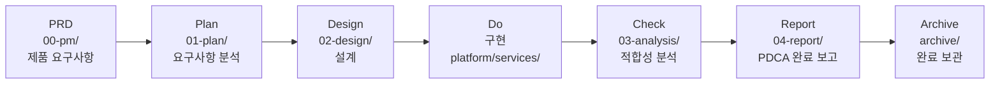
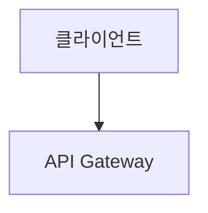
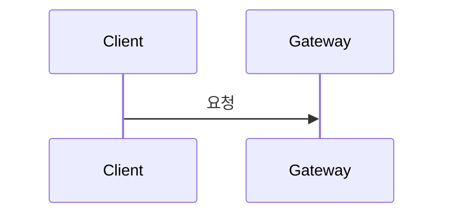

# 1장 — 문서 관리 및 PDCA 사이클

> **문서 ID**: ONBOARD-01
> **버전**: 1.0.0 | **작성일**: 2026-04-11 | **작성자**: Implementer (Sonnet)
> **선행 학습**: `00-overview.md` (0장 — 프로젝트 개요)
> **참고 문서**:
>   - `/data/ai-saas/docs/guidelines/documentation-standards.md`
>   - `/data/ai-saas/CLAUDE.md`
>   - `/data/ai-saas/docs/framework/00-getting-started/README.md`

---

## 목차

1. [문서 관리가 중요한 이유](#1-문서-관리가-중요한-이유)
2. [전체 문서 디렉토리 구조](#2-전체-문서-디렉토리-구조)
3. [PDCA 사이클과 문서 흐름](#3-pdca-사이클과-문서-흐름)
4. [MTU 개념 및 명명 규칙](#4-mtu-개념-및-명명-규칙)
5. [Plan 문서 작성 표준](#5-plan-문서-작성-표준)
6. [Design 문서 작성 표준](#6-design-문서-작성-표준)
7. [요구사항 ID 체계](#7-요구사항-id-체계)
8. [추적성 매트릭스](#8-추적성-매트릭스)
9. [코드 주석 표준](#9-코드-주석-표준)
10. [실습: 새 MTU 문서 작성 예시](#10-실습-새-mtu-문서-작성-예시)
11. [변경 이력](#11-변경-이력)

---

## 1. 문서 관리가 중요한 이유

### 1.1 감리 기준 요건

행안부 정보시스템 감리기준(고시 제2023-1호)은 다음을 요구합니다.

> "정보시스템 개발·운영의 모든 단계에서 산출물이 추적 가능하도록 관리되어야 한다."

이는 단순한 문서화가 아닙니다. **코드 한 줄이 어떤 요구사항에서 비롯되었는지**, 어떤 테스트로 검증되었는지, 어떤 CSAP 항목을 충족하는지 4방향으로 추적할 수 있어야 합니다.

### 1.2 구현 전 문서 완비 원칙

```
[필수] 구현 착수 전 Plan + Design 문서 완비 필수.
       문서 없는 구현 = 감리 결함.
```

이 규칙은 `CLAUDE.md`의 절대 제약입니다. 코드를 먼저 작성하고 나중에 문서를 쓰는 방식은 이 프로젝트에서 허용되지 않습니다.

### 1.3 현황

현재 프로젝트의 문서 규모입니다 (2026-04-11 기준).

| 문서 유형 | 위치 | 수량 |
|---------|------|------|
| Plan 문서 | `docs/01-plan/mtus/` | 289개 |
| Design 문서 | `docs/02-design/mtus/` | 275개 |
| 프레임워크 가이드 | `docs/framework/` | 17개 섹션 |
| 지침서 | `docs/guidelines/` | 3개 |

---

## 2. 전체 문서 디렉토리 구조

```
docs/
├── 00-pm/                     # PRD (Product Requirements Document)
│   └── {mtu-id}.prd.md        # 제품 요구사항 문서 (최상위)
│
├── 01-plan/                   # Plan 단계 — 요구사항 분석
│   └── mtus/
│       ├── MTU-N*.plan.md     # 기술 MTU (N27~N255)
│       ├── SVC-*.plan.md      # 서비스 구현 MTU
│       └── MTU-TECH-*.plan.md # 기술 스택 MTU
│
├── 02-design/                 # Design 단계 — 설계
│   └── mtus/
│       └── {mtu-id}.design.md
│
├── 03-analysis/               # Analysis 단계 — 설계-구현 적합성 분석
│   └── {mtu-id}.analysis.md
│
├── 04-report/                 # Report 단계 — PDCA 완료 보고서
│   └── {mtu-id}.report.md
│
├── archive/                   # 완료 MTU 보관
│   └── YYYY-MM/
│       └── {mtu-id}/
│           └── _INDEX.md
│
├── framework/                 # 프레임워크 전체 가이드 (17개 섹션)
│   ├── 00-getting-started/    # 진입점, 역할별 경로
│   ├── 01-dev-standards/      # 개발 표준
│   ├── 02-csap/               # CSAP 일반/표준등급
│   ├── 03-isms-p/             # ISMS-P 체크리스트
│   ├── 04-n2sf/               # N2SF 등급 분류
│   ├── 05-audit-docs/         # 감리 T01~T02
│   ├── 06-ecosystem/          # 배포·플러그인·FAQ
│   ├── 07-audit-compliance/   # 감리 T03~T07
│   ├── 08-infra/              # k3s·Gitea·Flux
│   ├── 09-ai-integration/     # AI 보안 게이트웨이
│   ├── 10-cc-harness/         # CC 하네스 검증
│   ├── 11-multitenancy/       # 멀티테넌시
│   ├── 12-documentation-portal/ # Docusaurus 포털
│   ├── 13-compliance-dashboard/  # 준수 현황 대시보드
│   ├── 14-framework-upgrade/  # 버전 관리
│   └── 99-references/         # 규정 인덱스·용어 사전
│
├── guidelines/                # 작성 지침서
│   ├── documentation-standards.md  # 문서 작성 표준 (본 장 기반)
│   ├── coding-standards.md          # 코딩 표준 (2장 기반)
│   └── design-patterns.md           # 설계 패턴
│
├── guides/                    # 실무 가이드 (본 가이드북 포함)
│   └── onboarding/
│
├── pm-reports/                # PM 세션 보고서
├── roadmap/                   # 로드맵
├── security/                  # 보안 문서
└── api/                       # API 문서
```

---

## 3. PDCA 사이클과 문서 흐름

### 3.1 전체 흐름

각 MTU(Mission Task Unit)는 다음 PDCA 사이클을 따릅니다.

```
PRD → Plan → Design → Do(구현) → Check(분석) → Report → Archive
```



### 3.2 단계별 산출물

| 단계 | 담당 | 산출물 | 위치 |
|------|------|--------|------|
| PRD | PM | 제품 요구사항 문서 | `docs/00-pm/{mtu-id}.prd.md` |
| Plan | PM + 개발자 | 요구사항 분석, FR/NFR 정의, Context Anchor | `docs/01-plan/mtus/{mtu-id}.plan.md` |
| Design | 개발자 (Architect) | 아키텍처, API 명세, 데이터 모델, 시퀀스 | `docs/02-design/mtus/{mtu-id}.design.md` |
| Do | 개발자 (Implementer) | 소스코드, 테스트 | `platform/services/` 또는 `platform/packages/` |
| Check | 개발자 (Reviewer + Auditor) | 설계-구현 적합성 분석, Q-Gate 결과 | `docs/03-analysis/{mtu-id}.analysis.md` |
| Report | PM + 개발자 | PDCA 완료 보고서, 교훈 | `docs/04-report/{mtu-id}.report.md` |
| Archive | PM | 완료 문서 보관 | `docs/archive/YYYY-MM/{mtu-id}/` |

### 3.3 CC 하네스 에이전트와 PDCA

CC 하네스의 5개 에이전트는 Do~Check 단계를 자동화합니다.

```
Do 단계:
  Implementer 에이전트 → 코드 구현

Check 단계:
  Reviewer 에이전트  → G3 코드 품질, G5 OWASP
  Auditor 에이전트   → G1 FR ID, G2 설계 완전성, G6 CSAP, G7 감사 추적
  Tester 에이전트    → G4 테스트 커버리지 80%+
  Refactorer 에이전트 → Dead code 제거
```

### 3.4 감리 산출물 연계

행안부 감리 T01~T07 산출물은 다음 위치에서 관리됩니다.

| 감리 단계 | 산출물 | 프레임워크 위치 |
|---------|--------|--------------|
| T01 | 사업계획서 | `docs/framework/05-audit-docs/T01-business-plan.md` |
| T02 | 요구사항정의서 | `docs/framework/05-audit-docs/T02-requirements.md` |
| T03~T07 | 설계서·테스트·추적성·감리 체크리스트 | `docs/framework/07-audit-compliance/` |

---

## 4. MTU 개념 및 명명 규칙

### 4.1 MTU란

**MTU (Mission Task Unit)**는 독립적으로 PDCA 사이클을 완료할 수 있는 최소 작업 단위입니다.
각 MTU는 고유 ID를 가지며 Plan + Design + 구현 + 테스트가 세트로 묶입니다.

> MTU는 스프린트 단위보다 작고, 단일 커밋보다 큰 작업 묶음입니다.
> "이 기능이 완료되었다"고 감리인에게 입증할 수 있는 최소 단위입니다.

### 4.2 MTU ID 체계

| 접두사 | 의미 | 예시 | 설명 |
|--------|------|------|------|
| `MTU-N{번호}` | 기술 MTU | `MTU-N27`, `MTU-N255` | 기술 기능 단위 (N27~N255) |
| `SVC-{서비스}-R{라운드}` | 서비스 구현 | `SVC-AUTH-R1`, `SVC-AI-ADV-R5` | 개별 서비스 구현 라운드 |
| `MTU-P{번호}` | 플랫폼 기반 | `MTU-P01` | 플랫폼 기반 기능 |
| `MTU-C{번호}` | CSAP 인증 | `MTU-C1`, `MTU-C6a` | 인증 관련 산출물 |
| `MTU-TECH-{식별자}` | 기술 스택 | `MTU-TECH-STACK-2026Q2` | 기술 스택 정의 |

### 4.3 MTU-N 번호 의미 (주요 구간)

| 구간 | 내용 |
|------|------|
| N27~N50 | 초기 인프라 (Cosign, NetworkPolicy, Gitea CI/CD 등) |
| N100~N119 | 통합·자동화 (Backstage, Argo Rollouts, Thanos, Secret Rotation 등) |
| N200~N240 | 성능 모니터링 (etcd, CoreDNS, Flux, Harbor, Postgres, Redis 등) |
| N241~N255 | 고도화 (eGov 호환, 예측 알림, DORA, AIOps, CSAP 증적 v2, SRE 등) |

### 4.4 SVC-* 서비스 미션 주요 목록

각 서비스의 구현 라운드입니다. `R1`이 초기 구현, 이후 `R2`, `R3` 등으로 고도화됩니다.

| SVC ID 접두사 | 서비스 |
|-------------|--------|
| `SVC-AUTH-*` | auth-service |
| `SVC-AI-*`, `SVC-AI-ADV-*` | ai-service (고급 기능) |
| `SVC-APIGW-*` | api-gateway |
| `SVC-AUDIT-*`, `SVC-AUDITCHAIN-*` | audit-service |
| `SVC-BILL-*` | billing-service |
| `SVC-CACHE-*` | cache 패키지 |
| `SVC-CAT-*` | catalog-service |
| `SVC-CIRCUIT-*` | circuit-breaker 패키지 |
| `SVC-COMP-*` | compliance-service |
| `SVC-CONFIG-*` | config-vault 패키지 |
| `SVC-HEALTHAGG-*` | health-aggregator 패키지 |
| `SVC-RATELIMIT-*` | rate-limit 패키지 |
| `SVC-SECRETMGR-*` | secret-manager 패키지 |
| `SVC-GRACEFUL-*` | mesh-ready (그레이스풀 셧다운) |

---

## 5. Plan 문서 작성 표준

### 5.1 파일명 규칙

```
docs/01-plan/mtus/{mtu-id}.plan.md

예시:
  docs/01-plan/mtus/SVC-AUTH-R1.plan.md
  docs/01-plan/mtus/MTU-N255-sre-error-budget.plan.md
```

### 5.2 필수 섹션

Plan 문서에는 다음 6개 섹션이 반드시 포함되어야 합니다.

```markdown
# {MTU-ID} Plan — {MTU명}

> **MTU ID**: {MTU-ID}
> **버전**: 1.0.0 | **작성일**: YYYY-MM-DD | **작성자**: {이름}
> **분류**: {Phase명} / {카테고리}

## 1. Executive Summary (4관점 테이블)

| 관점 | 현재 상태 | 목표 상태 | 측정 지표 |
|------|----------|----------|----------|
| 기능 | {현재} | {목표} | {지표} |
| 보안 | {현재} | {목표} | {지표} |
| 성능 | {현재} | {목표} | {지표} |
| 운영 | {현재} | {목표} | {지표} |

## 2. Context Anchor

### WHY (왜 필요한가)
{배경, 문제 정의, 비즈니스 필요성}

### WHO (이해관계자)
| 역할 | 관심사 |
|------|-------|

### RISK (위험 요소)
| ID | 위험 | 영향 | 대응 |
|----|------|------|------|

### SUCCESS (성공 기준)
| ID | 기준 | 측정 방법 |
|----|------|----------|
| SC-1 | {기준} | {방법} |

### SCOPE (범위)
**포함**: {포함 범위}
**제외**: {제외 범위}

## 3. 기능 요구사항
### FR-{모듈}.{번호}: {요구사항명}
{상세 설명}

## 4. 비기능 요구사항
### NFR-{번호}: {요구사항명}
{상세 설명}

## 5. 추적성 매트릭스
| 요구사항 | 산출물 | 테스트 | CSAP |
|---------|-------|-------|------|

## 6. 변경 이력
| 버전 | 일자 | 내용 | 작성자 |
|------|------|------|-------|
```

### 5.3 Context Anchor의 중요성

Context Anchor (§2)는 설계·구현 단계에서 핵심 판단 기준이 됩니다.

- **WHY**: "왜 이 기능이 필요한가"를 명확히 하여 scope creep 방지
- **RISK**: 구현 전 위험을 사전 식별하여 설계에 반영
- **SUCCESS**: 완료 기준을 명확히 하여 감리인이 검증 가능하게 함
- **SCOPE**: 포함·제외 범위로 불필요한 작업 방지

---

## 6. Design 문서 작성 표준

### 6.1 파일명 규칙

```
docs/02-design/mtus/{mtu-id}.design.md

예시:
  docs/02-design/mtus/SVC-AUTH-R1.design.md
```

### 6.2 필수 섹션

```markdown
# {MTU-ID} Design — {MTU명}

> **MTU ID**: {MTU-ID}
> **버전**: 1.0.0 | **작성일**: YYYY-MM-DD
> **Plan 참조**: docs/01-plan/mtus/{mtu-id}.plan.md

## 1. Design Anchor

### 설계 원칙
{핵심 설계 원칙 3~5개}

### 아키텍처 옵션 평가
| 옵션 | 설명 | 장점 | 단점 | 판정 |
|------|------|------|------|------|
| A | {설명} | {장점} | {단점} | 채택 |
| B | {설명} | {장점} | {단점} | 기각 |

## 2. 아키텍처 설계

### 시스템 아키텍처 (Mermaid)


### API 명세
| 메서드 | 경로 | 설명 | 인증 | CSAP |
|--------|------|------|------|------|

### 데이터 모델
{ERD 또는 Prisma 스키마 발췌}

### 시퀀스 다이어그램


## 3. Session Guide

### 구현 순서
1. {단계 1}

### 검증 기준
- {기준 1}

## 4. 변경 이력
```

### 6.3 다이어그램 규칙

모든 다이어그램은 **Mermaid 형식** 필수입니다. 이미지 파일(PNG, SVG) 사용 금지.
이유: 텍스트 기반이어야 git diff로 변경 내용 추적이 가능하고, 감리 증적으로 활용할 수 있습니다.

지원하는 다이어그램 유형:
- `graph TD` / `graph LR`: 시스템 아키텍처, 플로우
- `sequenceDiagram`: 서비스 간 통신, 인증 흐름
- `erDiagram`: 데이터 모델 (ERD)
- `classDiagram`: 클래스 구조

---

## 7. 요구사항 ID 체계

### 7.1 ID 형식 표

| 구분 | 형식 | 예시 |
|------|------|------|
| 기능 요구사항 | `FR-{모듈}.{번호}` | `FR-P01.1`, `FR-AUTH.3` |
| 비기능 요구사항 | `NFR-{번호}` | `NFR-1`, `NFR-5` |
| 인프라 요구사항 | `INFR-{번호}` | `INFR-1`, `INFR-3` |
| AI 연동 요구사항 | `AI-REQ-{번호}` | `AI-REQ-1` |
| CC 하네스 요구사항 | `CC-REQ-{번호}` | `CC-REQ-01` |

### 7.2 모듈 코드 표

모듈 코드는 서비스와 1:1 매핑됩니다.

| 모듈 코드 | 서비스 | 설명 |
|---------|--------|------|
| P00 | common-foundation | 공통 기반 |
| P01 | auth-service | 인증 |
| P02 | user-service | 사용자 |
| P03 | tenant-service | 테넌트 |
| P04 | api-gateway | API 게이트웨이 |
| P05 | menu-service | 메뉴 |
| P06 | saas-catalog | SaaS 카탈로그 |
| P07 | subscription-service | 구독 |
| P08 | billing-service | 과금 |
| P09 | crm-service | CRM |
| P10 | ai-service | AI |
| P11 | notification-service | 알림 |
| P12 | file-service | 파일 |
| P13 | audit-service | 감사 |
| P14 | compliance-dashboard | 컴플라이언스 |
| P15 | security-monitoring | 보안 모니터링 |
| AUTH | auth 세부 기능 | - |
| OTEL | observability | 관측성 |
| RBAC | rbac | 접근 통제 |
| EVT | event-bus | 이벤트 버스 |
| MESH | mesh-ready | 서비스 메시 |
| TENANT | tenant-isolation | 테넌트 격리 |
| GW | gateway 세부 | - |
| UP | portal-ui | 포털 UI |

### 7.3 CSAP 항목 참조 형식

```
D-{분야번호}-{항목번호}

예시:
  D-06-01: 침해사고 관리 — 감사 로그
  D-08-01: 접근 통제 — 인증
  D-08-06: 접근 통제 — 계정 잠금
  D-09-01: 암호화 — 데이터 암호화
  D-12-01: 시스템 개발 보안 — 입력 검증
```

---

## 8. 추적성 매트릭스

### 8.1 4방향 추적성

모든 Plan 문서에는 4방향 추적성 매트릭스가 필수입니다.

```
요구사항(FR) ←→ 산출물(코드/문서) ←→ 테스트(케이스) ←→ CSAP(통제항목)
```

### 8.2 매트릭스 작성 예시

```markdown
| 요구사항 | 산출물 | 테스트 | CSAP |
|---------|-------|-------|------|
| FR-P01.1 | platform/services/auth-service/src/handlers/login.handler.ts | TC-AUTH-01 | D-08-01 |
| FR-P01.2 | platform/services/auth-service/src/middleware/auth.middleware.ts | TC-AUTH-02 | D-08-01 |
| FR-P01.12 | platform/services/auth-service/src/lib/audit.ts | TC-AUDIT-01 | D-06-01 |
| NFR-1 | platform/services/auth-service/src/index.ts (rate limit 설정) | TC-PERF-01 | D-08-07 |
```

### 8.3 추적성 확인 방법

구현 완료 후 다음을 확인합니다.

1. Plan 문서의 모든 FR-* ID가 `산출물` 열에 실제 파일 경로와 매핑되었는가
2. 모든 FR-* ID에 대응하는 테스트 케이스 ID가 존재하는가
3. 보안 관련 FR-*에 CSAP 항목이 명시되었는가

---

## 9. 코드 주석 표준

### 9.1 파일 헤더 주석 (모든 .ts 파일 필수)

```typescript
// {파일 설명}
// Design Ref: {MTU-ID} DESIGN §{섹션번호}
// Plan SC: {FR-ID 목록}
// CSAP: {관련 항목}
```

**실제 예시** (`auth-service/src/index.ts`):

```typescript
// 인증 서비스 진입점
// Design Ref: MTU-P01 DESIGN-MTU-P01, SVC-AUTH-R1 DESIGN
// Plan SC: FR-P01.1~FR-P01.12, FR-AUTH.1~FR-AUTH.7, FR-OTEL.3
// CSAP: D-08 접근 통제, D-07 가용성, D-10 분산 추적, D-06 이벤트 기반 감사
```

### 9.2 인라인 주석 — Plan SC 추적

```typescript
// Plan SC: FR-AUTH.1 (MFA 검증 통합), FR-AUTH.3 (Rate Limiting)
app.post('/auth/login', loginSchemaOpts, loginHandler);

// CSAP D-08-06: 5회 실패 → 30분 계정 잠금
if (newFailedCount >= AUTH_CONSTANTS.MAX_LOGIN_ATTEMPTS) {
  updateData['lockedUntil'] = new Date(Date.now() + lockDurationMs);
}
```

### 9.3 TODO / NOTE 형식

```typescript
// TODO: FR-2.3 — Phase 2에서 캐시 무효화 전략 구현 — 담당자: 미정 — 기한: 2026-07

// NOTE: 미사용. Phase 2 FR-2.3 구현 시 사용 예정. 재검토일: 2026-07-01
```

### 9.4 금지 주석 패턴

```typescript
// [금지] 자명한 코드에 불필요한 주석
const user = await findUser(id);  // 사용자를 찾는다  ← 금지

// [금지] 주석 처리된 코드 (git history로 복구 가능)
// const oldUser = await legacyFindUser(id);  ← 금지

// [금지] 이유 없는 TODO
// TODO: 나중에 수정  ← 금지 (기한·담당자·FR ID 없음)
```

---

## 10. 실습: 새 MTU 문서 작성 예시

### 10.1 시나리오

새 기능: 사용자 비밀번호 변경 기능을 `auth-service`에 추가한다.
MTU ID: `SVC-AUTH-R2` (인증 서비스 2라운드)

### 10.2 단계 1: Plan 문서 작성

파일 위치: `docs/01-plan/mtus/SVC-AUTH-R2.plan.md`

```markdown
# SVC-AUTH-R2 Plan — 인증 서비스 비밀번호 변경 기능

> **MTU ID**: SVC-AUTH-R2
> **버전**: 1.0.0 | **작성일**: 2026-04-11 | **작성자**: 홍길동
> **분류**: Phase 2 / 인증 고도화

## 1. Executive Summary

| 관점 | 현재 상태 | 목표 상태 | 측정 지표 |
|------|----------|----------|----------|
| 기능 | 비밀번호 변경 기능 없음 | PATCH /auth/password 엔드포인트 | 기능 통합 테스트 통과 |
| 보안 | 미구현 | bcrypt 재해시, 이전 비밀번호 검증 | CSAP D-08-05 준수 |
| 성능 | 해당 없음 | 응답 시간 200ms 이하 | p95 응답 시간 |
| 운영 | 해당 없음 | 감사 로그 자동 기록 | audit.jsonl 기록 확인 |

## 2. Context Anchor

### WHY
공공기관 보안 정책상 90일 주기 비밀번호 변경이 의무화되어 있으나
현재 인증 서비스에 해당 기능이 없어 CSAP D-08-05 미준수 상태.

### WHO
| 역할 | 관심사 |
|------|-------|
| 시스템 관리자 | 비밀번호 정책 적용 |
| 일반 사용자 | 비밀번호 변경 UI |
| 보안 담당자 | CSAP D-08-05 준수 증적 |

### RISK
| ID | 위험 | 영향 | 대응 |
|----|------|------|------|
| R1 | 이전 비밀번호 재사용 | 보안 취약 | 최근 5개 이력 저장·비교 |
| R2 | 브루트포스 공격 | 계정 탈취 | Rate Limit 5회/시간 |

### SUCCESS
| ID | 기준 | 측정 방법 |
|----|------|----------|
| SC-1 | PATCH /auth/password 정상 동작 | 통합 테스트 TC-AUTH-20 통과 |
| SC-2 | 이전 비밀번호 재사용 차단 | 단위 테스트 TC-AUTH-21 통과 |
| SC-3 | 감사 로그 자동 기록 | audit.jsonl 확인 |

### SCOPE
**포함**: 비밀번호 변경 API, bcrypt 재해시, 이력 관리, 감사 로그
**제외**: 비밀번호 분실 처리 (별도 MTU로 분리)

## 3. 기능 요구사항

### FR-P01.20: 비밀번호 변경 API
- PATCH /auth/password 엔드포인트 구현
- 현재 비밀번호 검증 후 새 비밀번호로 교체
- JWT 인증 필수

### FR-P01.21: 이전 비밀번호 재사용 방지
- 최근 5개 비밀번호 해시 저장
- 신규 비밀번호와 일치 시 400 오류 반환

## 4. 비기능 요구사항

### NFR-8: 비밀번호 변경 응답 시간
- p95 응답 시간 200ms 이하

## 5. 추적성 매트릭스

| 요구사항 | 산출물 | 테스트 | CSAP |
|---------|-------|-------|------|
| FR-P01.20 | auth-service/src/handlers/change-password.handler.ts | TC-AUTH-20 | D-08-05 |
| FR-P01.21 | auth-service/src/lib/password-history.ts | TC-AUTH-21 | D-08-05 |

## 6. 변경 이력
| 버전 | 일자 | 내용 | 작성자 |
|------|------|------|-------|
| 1.0.0 | 2026-04-11 | 초기 작성 | 홍길동 |
```

### 10.3 단계 2: Design 문서 작성

Plan 완성 후 Design 문서를 작성합니다.
파일 위치: `docs/02-design/mtus/SVC-AUTH-R2.design.md`

Design 문서에는 다음이 필수 포함됩니다.
- PATCH /auth/password 시퀀스 다이어그램
- 비밀번호 이력 테이블 데이터 모델
- 에러 응답 명세 (400 재사용 감지, 401 인증 실패 등)

### 10.4 단계 3: 구현

Plan + Design 완비 후에만 구현을 시작합니다.
구현 파일 첫 줄에 헤더 주석 필수:

```typescript
// 비밀번호 변경 핸들러
// Design Ref: SVC-AUTH-R2 DESIGN §2.3
// Plan SC: FR-P01.20, FR-P01.21
// CSAP: D-08-05 비밀번호 정책, D-06-01 감사 로그
```

### 10.5 단계 4: Check (Analysis)

구현 완료 후 `docs/03-analysis/SVC-AUTH-R2.analysis.md`를 작성합니다.
Reviewer + Auditor 에이전트가 Q-Gate 7개를 모두 통과시켜야 합니다.

---

## 11. 변경 이력

| 버전 | 일자 | 내용 | 작성자 |
|------|------|------|-------|
| 1.0.0 | 2026-04-11 | 초기 작성 — documentation-standards.md 및 실제 프로젝트 구조 반영 | Implementer (Sonnet) |
