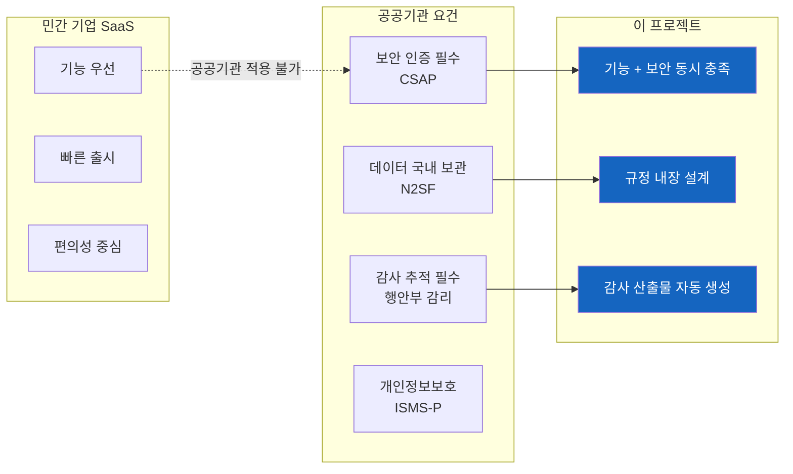
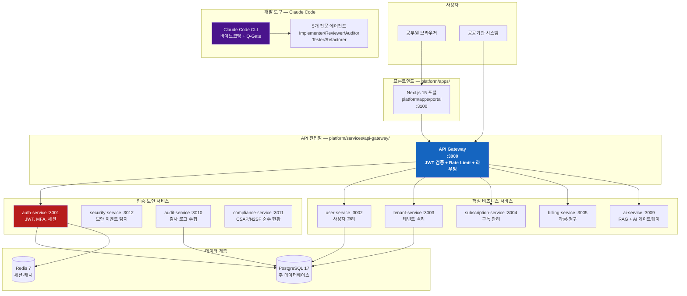
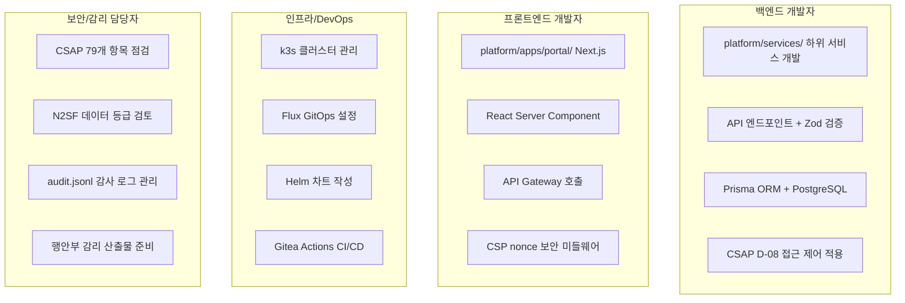
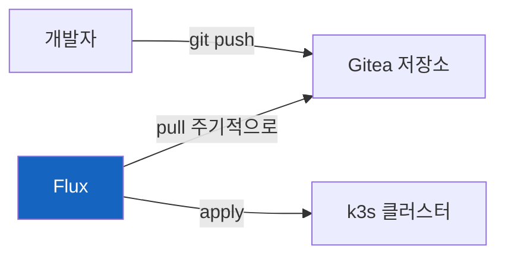

# 공공기관 SaaS 프레임워크 입문

> **문서 ID**: ONBOARD-01-01
> **버전**: 1.0.0 | **작성일**: 2026-04-11 | **작성자**: Implementer (Sonnet)
> **학습 대상**: 프로젝트에 처음 합류하는 모든 팀원
> **예상 학습 시간**: 2시간
> **선행 문서**: `00-overview.md` (필수)

---

## 목차

1. [공공기관 SaaS 프레임워크란 무엇인가](#1-공공기관-saas-프레임워크란-무엇인가)
2. [왜 이 프로젝트가 필요한가](#2-왜-이-프로젝트가-필요한가)
3. [프로젝트 전체 한눈에 보기](#3-프로젝트-전체-한눈에-보기)
4. [나는 어디서 무엇을 할 것인가](#4-나는-어디서-무엇을-할-것인가)
5. [용어 사전](#5-용어-사전)

---

## 1. 공공기관 SaaS 프레임워크란 무엇인가

### 초보자를 위한 쉬운 설명

여러분이 인터넷으로 사용하는 구글 독스나 노션 같은 서비스를 상상해 보십시오. 이런 서비스는 인터넷만 있으면 어디서든 사용할 수 있고, 사용한 만큼만 비용을 냅니다. 이런 방식을 **SaaS(Software as a Service, 서비스형 소프트웨어)**라고 합니다.

그런데 공공기관(행정안전부, 국세청, 지방자치단체 등)이 이런 SaaS를 사용하려면 일반 민간 기업과는 다른 조건이 필요합니다.

- **보안이 훨씬 엄격해야 합니다**: 국민의 개인정보와 국가 기밀 데이터를 다루기 때문입니다.
- **국가 규정을 반드시 지켜야 합니다**: CSAP 인증, N2SF 체계, 행안부 감리 기준 같은 법적 요건이 있습니다.
- **감사에 대비해야 합니다**: 모든 중요한 작업이 기록되고 언제든 검증받을 수 있어야 합니다.

이 프로젝트는 바로 **공공기관이 안심하고 사용할 수 있는 SaaS 플랫폼**을 만드는 것입니다. 단순히 기능을 만드는 것이 아니라, 처음부터 보안과 규정 준수를 설계에 내장합니다.

### 세 줄 요약

- 공공기관이 쓸 수 있는 SaaS 플랫폼을 만드는 프로젝트입니다.
- CSAP(클라우드 보안 인증), N2SF(국가 네트워크 보안 체계), 행안부 감리 기준을 동시에 충족합니다.
- 17개 마이크로서비스가 협력하여 인증, 테넌트 관리, AI, 과금 등 기능을 제공합니다.

---

## 2. 왜 이 프로젝트가 필요한가

### 공공기관이 SaaS를 쓰기 어려운 이유



### CSAP란 무엇인가

**CSAP(Cloud Security Assurance Program)**는 한국인터넷진흥원(KISA)이 운영하는 클라우드 보안 인증 제도입니다.

공공기관이 클라우드 서비스를 사용하려면 해당 서비스가 CSAP 인증을 받아야 합니다. 인증 등급은 세 가지입니다.

| 등급 | 대상 | 통제항목 수 | 설명 |
|------|------|------------|------|
| 일반 | 비중요 정보 처리 | 14개 | 최소 보안 요건 |
| 표준 | 일반 공공 업무 | 79개 | 이 프로젝트의 목표 |
| 중요 | 국가 핵심 시스템 | 116개 | 최고 등급 |

이 프로젝트는 **표준 등급 79개 통제항목을 100% 충족**하는 것이 목표입니다.

### N2SF란 무엇인가

**N2SF(National Network Security Framework)**는 국가정보원과 KISA가 정한 국가 네트워크 보안 체계입니다. 핵심은 데이터를 중요도에 따라 세 등급으로 분류하는 것입니다.

| 등급 | 의미 | 예시 | AI API 전송 |
|------|------|------|------------|
| C (기밀) | 국가 기밀, 공개 시 국가 안보 위협 | 군사 정보, 수사 기록 | 절대 금지 |
| S (민감) | 민감 개인정보, 공개 시 피해 우발 | 주민번호, 의료정보 | 절대 금지 |
| O (공개) | 일반 업무 정보 | 공개 행정 데이터 | PII 마스킹 후 허용 |

코드를 작성할 때 이 분류를 항상 염두에 두어야 합니다. C/S 등급 데이터를 AI API로 전송하면 즉시 보안 사고가 됩니다.

### 행안부 감리란 무엇인가

행정안전부(행안부)가 고시한 **정보시스템 감리기준(고시 제2023-1호)**에 따라, 일정 규모 이상의 공공 IT 사업은 외부 감리를 받아야 합니다. 감리관이 프로젝트를 방문하여 다음을 검사합니다.

- 요구사항 문서가 제대로 작성되었는가
- 설계 문서가 구현과 일치하는가
- 테스트가 충분히 이루어졌는가
- 보안 취약점은 없는가

이 프로젝트에서 모든 기능은 **Plan 문서 → Design 문서 → 구현 → 테스트** 순서로 진행하며, 감리관이 요청하는 산출물을 자동으로 생성합니다.

---

## 3. 프로젝트 전체 한눈에 보기

### 전체 시스템 구성도



### 모노레포 디렉토리 구조

프로젝트는 pnpm workspace 기반 모노레포로 구성되어 있습니다.

```
/data/ai-saas/                  ← 프로젝트 루트
├── platform/
│   ├── apps/
│   │   └── portal/             ← Next.js 15 프론트엔드
│   ├── services/               ← 17개 Fastify 마이크로서비스
│   │   ├── api-gateway/        ← 모든 요청의 단일 진입점
│   │   ├── auth-service/       ← 인증·세션 관리
│   │   └── ...                 ← 나머지 15개 서비스
│   └── packages/               ← 서비스 간 공유 라이브러리
│       ├── auth-sdk/           ← JWT/세션 공통 SDK
│       ├── observability/      ← OpenTelemetry 계측
│       └── rbac/               ← 역할 기반 접근 제어
├── packages/                   ← 범용 공유 패키지
│   ├── feature-flag-sdk/       ← 기능 플래그
│   └── slo-escalation/         ← SLO 위반 에스컬레이션
├── docs/
│   ├── 01-plan/                ← 요구사항 계획 문서
│   ├── 02-design/              ← 설계 문서
│   └── guides/                 ← 온보딩 가이드 (현재 위치)
└── .claude/                    ← Claude Code 설정·에이전트
    ├── agents/                 ← 5개 전문 에이전트 정의
    └── rules/                  ← CSAP/보안 규칙
```

### 개발 프로세스 흐름

```mermaid
flowchart LR
    subgraph "계획"
        P1[요구사항 도출\nFR-*.* ID 부여]
        P2[Plan 문서 작성\ndocs/01-plan/]
    end

    subgraph "설계"
        D1[Design 문서 작성\ndocs/02-design/]
    end

    subgraph "구현 — Claude Code"
        I1[Implementer 에이전트\n코드 작성]
        I2[Reviewer 에이전트\n코드 검토]
        I3[Tester 에이전트\n테스트 작성]
    end

    subgraph "품질 게이트 Q-Gate"
        Q1[G1: FR ID 전수]
        Q2[G3: AgentShield 102규칙]
        Q3[G4: 커버리지 80%+]
        Q4[G6: CSAP 100%]
    end

    subgraph "배포"
        D2[PR 제출\nGitea]
        D3[CI/CD 파이프라인\nGitea Actions]
        D4[GitOps 배포\nFlux + k3s]
    end

    P1 --> P2 --> D1 --> I1 --> I2 --> I3
    I3 --> Q1 --> Q2 --> Q3 --> Q4
    Q4 --> D2 --> D3 --> D4

    style I1 fill:#1565C0,color:#fff
    style Q4 fill:#2E7D32,color:#fff
    style D4 fill:#4A148C,color:#fff
```



---

## 4. 나는 어디서 무엇을 할 것인가

팀원의 역할에 따라 주로 다루게 될 영역이 다릅니다.

### 역할별 주요 작업 영역



### 역할별 학습 우선순위

| 역할 | 필수 문서 | 권장 문서 | 스킵 가능 |
|------|---------|---------|---------|
| 백엔드 개발자 | 00-overview, 1장, 2장 서비스 | 4장 인프라 | - |
| 프론트엔드 개발자 | 00-overview, 1장 | 2장 서비스 | 4장 인프라 |
| 인프라/DevOps | 00-overview, 4장 인프라, 6장 CI/CD | 2장 아키텍처 | - |
| 보안/감리 | 00-overview, 7장 보안 | 1장 전체 | 4장 인프라 |

---

## 5. 용어 사전

이 프로젝트에서 자주 나오는 용어를 초보자도 이해할 수 있도록 설명합니다.

### 프로세스 관련 용어

#### MTU (Minimum Testable Unit, 최소 테스트 단위)

MTU는 이 프로젝트에서 작업 단위를 부르는 이름입니다. 하나의 MTU는 Plan 문서 → Design 문서 → 구현 → 테스트 → 리팩토링이라는 완전한 PDCA 사이클을 가집니다.

예를 들어 `MTU-N251-dora-four-keys`는 DORA Four Keys 지표를 측정하는 기능 구현의 전체 작업 단위입니다.

파일 위치: `docs/01-plan/mtus/MTU-*.plan.md`

#### PDCA (Plan-Do-Check-Act)

품질 관리에서 널리 쓰이는 4단계 사이클입니다.

- **Plan**: 무엇을 할지 계획 (요구사항 도출, Plan 문서 작성)
- **Do**: 계획대로 실행 (Design 문서 작성, 코드 구현)
- **Check**: 결과 확인 (테스트, 코드 리뷰, Q-Gate)
- **Act**: 개선 및 마무리 (리팩토링, 감사 로그 완비)

#### Q-Gate (Quality Gate, 품질 게이트)

PR을 머지하기 전에 통과해야 하는 7단계 품질 검사입니다.

| 단계 | 이름 | 내용 | 담당 에이전트 |
|------|------|------|------------|
| G1 | 요구사항 전수 | 모든 FR ID가 구현과 연결됐는가 | Auditor |
| G2 | 설계 완전성 | Design 문서와 구현이 일치하는가 | Auditor |
| G3 | 코드 품질 | AgentShield 102개 규칙 통과 | Reviewer |
| G4 | 테스트 커버리지 | 80% 이상 | Tester |
| G5 | OWASP Top 10 | 웹 취약점 없음 | Reviewer |
| G6 | CSAP 준수 | 해당 Phase 100% | Auditor |
| G7 | 감사 추적 | audit.jsonl 완비 | Auditor |

### 인증 및 규정 관련 용어

#### CSAP (Cloud Security Assurance Program)

한국인터넷진흥원(KISA)이 운영하는 클라우드 보안 인증 제도입니다. 공공기관이 클라우드 서비스를 도입할 때 이 인증이 없는 서비스는 사용할 수 없습니다. 이 프로젝트는 표준 등급 79개 통제항목을 모두 충족합니다.

CSAP 통제항목은 D-01부터 D-14까지의 도메인으로 구분됩니다.

- **D-06**: 침해사고 관리 (감사 로그 필수)
- **D-08**: 접근 통제 (RBAC, JWT 인증)
- **D-09**: 암호화 (AES-256 저장, TLS 1.3 전송)
- **D-10**: 네트워크 보안 (Rate Limit, IP 필터링)
- **D-12**: 시스템 개발 보안 (입력 검증, SQL 주입 방지)

코드에서 `// CSAP: D-08` 같은 주석은 해당 코드가 어떤 CSAP 항목을 구현하는지 나타냅니다.

#### N2SF (National Network Security Framework)

국가 네트워크 보안 체계입니다. 데이터를 C/S/O 세 등급으로 분류하고 등급에 따라 처리 방식을 다르게 합니다. 특히 AI API에 데이터를 전송할 때 반드시 준수해야 합니다.

```
C 등급 (기밀) → AI API 전송 절대 금지
S 등급 (민감) → AI API 전송 절대 금지
O 등급 (공개) → PII 마스킹 후 AI Gateway 경유하여 전송 가능
```

#### ISMS-P (정보보호 및 개인정보보호 관리체계 인증)

한국인터넷진흥원이 발급하는 정보보호 인증입니다. 이 프로젝트는 CSAP 인증을 통해 ISMS-P의 상당 부분을 함께 충족합니다.

### 기술 스택 관련 용어

#### Fastify

Node.js 기반의 고성능 웹 프레임워크입니다. Express보다 빠르고 플러그인 시스템이 체계적입니다. 이 프로젝트의 17개 마이크로서비스 모두 Fastify로 만들어집니다.

```typescript
// Fastify 서비스의 기본 구조 예시
import Fastify from 'fastify'

const app = Fastify({ logger: true })

app.get('/health', async () => {
  return { status: 'ok' }
})

await app.listen({ port: 3001, host: '0.0.0.0' })
```

#### Prisma

TypeScript 친화적인 ORM(Object-Relational Mapper)입니다. SQL을 직접 쓰는 대신 TypeScript 코드로 데이터베이스를 조작할 수 있습니다. CSAP D-12(SQL 주입 방지)를 자동으로 충족시켜 줍니다.

```typescript
// Prisma를 사용한 사용자 조회 예시
const user = await prisma.user.findUnique({
  where: { email: 'hong@example.go.kr' }
  // 내부적으로 매개변수화 쿼리가 생성됩니다 → SQL 주입 방지
})
```

#### Turbo (Turborepo)

모노레포 빌드 시스템입니다. 17개 서비스 + 여러 패키지를 가진 이 프로젝트에서 변경된 패키지만 선택적으로 빌드하여 CI/CD 속도를 높입니다.

```bash
# 변경된 서비스만 빌드
pnpm turbo build --filter=...@public-saas/auth-service
```

#### pnpm workspace

여러 패키지를 하나의 저장소에서 관리하는 방식입니다. `platform/services/`, `platform/packages/`, `packages/` 세 영역이 하나의 pnpm workspace로 연결되어 있습니다.

```bash
# 특정 서비스에 패키지 추가
pnpm add zod --filter @public-saas/auth-service
```

#### k3s

경량 Kubernetes 배포판입니다. 풀 스케일 Kubernetes와 동일한 API를 제공하지만 설치가 훨씬 간단합니다. 로컬 개발용으로 WSL2 환경에 설치하여 사용합니다.

Kubernetes(k8s)는 컨테이너(Docker 이미지)를 자동으로 배포, 확장, 복구하는 플랫폼입니다. k3s는 그 경량 버전입니다.

#### Flux (GitOps)

GitOps 방식의 지속 배포 도구입니다. Git 저장소의 상태를 실제 k3s 클러스터에 자동으로 동기화합니다. 코드 변경 → Gitea 푸시 → Flux 자동 감지 → k3s 클러스터 배포 흐름으로 동작합니다.



#### Helm

Kubernetes 패키지 관리자입니다. 복잡한 Kubernetes YAML 설정을 템플릿으로 관리하여 환경별(개발/스테이징/운영)로 다른 설정을 쉽게 적용할 수 있습니다.

#### k9s

Kubernetes 클러스터를 터미널에서 시각적으로 관리하는 TUI(Terminal UI) 도구입니다. Pod 상태 확인, 로그 조회, 재시작 등을 마우스 없이 키보드로 빠르게 할 수 있습니다.

### AI 개발 도구 관련 용어

#### Claude Code

Anthropic의 AI 코딩 도우미 CLI 도구입니다. 터미널에서 자연어로 지시를 내리면 코드를 분석하고 작성합니다. 이 프로젝트에서는 Claude Code를 통해 구현, 리뷰, 테스트, 리팩토링을 모두 자동화합니다.

```bash
# Claude Code 설치 후 프로젝트 루트에서 실행
claude
```

#### 바이브코딩 (Vibe Coding)

AI에게 구현 방향과 맥락을 자연어로 설명하고, AI가 실제 코드를 작성하는 협업 방식입니다. 단순히 "코드 써줘"가 아니라 "왜(Why)", "누가(Who)", "어떤 제약(Constraint)"을 함께 전달하여 품질 높은 코드를 얻습니다.

구체적인 방법은 `03-vibecoding.md`를 참고하십시오.

#### AgentShield

Claude Code에 내장된 정적 분석 엔진입니다. 코드 변경 시 102개 규칙을 자동으로 검사합니다. CSAP D-12 위반, 하드코딩된 시크릿, SQL 주입 가능성 등을 감지합니다.

#### GitOps

Git 저장소를 "진리의 원천(Single Source of Truth)"으로 사용하는 운영 방식입니다. 인프라 설정을 코드로 관리하고 Git에 푸시하면 자동으로 클러스터에 반영됩니다. 이 프로젝트에서는 Flux가 GitOps를 구현합니다.

---

## 다음 단계

이 문서를 읽었다면 이제 개발 환경을 설정할 차례입니다.

**[다음: 02-environment-setup.md — 개발 환경 설정]**

환경 설정을 이미 완료했다면 바로 첫 주 학습 계획으로 넘어가십시오.

**[다음: 03-first-week.md — 첫 주 학습 계획]**

---

## 변경 이력

| 버전 | 일자 | 내용 | 작성자 |
|------|------|------|------|
| 1.0.0 | 2026-04-11 | 최초 작성 | Implementer (Sonnet) |
