# 개발 환경 설정

> **문서 ID**: ONBOARD-01-02
> **버전**: 1.0.0 | **작성일**: 2026-04-11 | **작성자**: Implementer (Sonnet)
> **학습 대상**: 프로젝트에 처음 합류하는 모든 팀원
> **예상 소요 시간**: 반나절 (3~5시간)
> **선행 문서**: `01-welcome.md`

---

## 목차

1. [필수 설치 목록 체크리스트](#1-필수-설치-목록-체크리스트)
2. [WSL2 설치 및 최적화](#2-wsl2-설치-및-최적화)
3. [Node.js 22 및 pnpm 설치](#3-nodejs-22-및-pnpm-설치)
4. [Docker Desktop 설정](#4-docker-desktop-설정)
5. [k3s 설치 (로컬 개발용)](#5-k3s-설치-로컬-개발용)
6. [kubectl, helm, flux, k9s 설치](#6-kubectl-helm-flux-k9s-설치)
7. [VS Code 및 DevContainer 설정](#7-vs-code-및-devcontainer-설정)
8. [Claude Code CLI 설치](#8-claude-code-cli-설치)
9. [설치 검증 명령어 모음](#9-설치-검증-명령어-모음)
10. [환경 설정 완료 체크리스트](#10-환경-설정-완료-체크리스트)
11. [자주 발생하는 설치 오류 해결법](#11-자주-발생하는-설치-오류-해결법)

---

## 1. 필수 설치 목록 체크리스트

설치를 시작하기 전에 전체 목록을 파악하십시오. 이 모든 도구가 설치되어야 개발을 시작할 수 있습니다.

| # | 도구 | 버전 | 용도 | 설치 위치 |
|---|------|------|------|---------|
| 1 | WSL2 | Ubuntu 22.04 LTS | Linux 개발 환경 | Windows |
| 2 | Node.js | v22.x.x (LTS) | JavaScript 런타임 | WSL2 내부 |
| 3 | pnpm | 9.15.0 | 패키지 관리자 | WSL2 내부 |
| 4 | Docker Desktop | 최신 | 컨테이너 빌드 | Windows |
| 5 | k3s | v1.29+ | 경량 Kubernetes | WSL2 내부 |
| 6 | kubectl | v1.29+ | k8s CLI | WSL2 내부 |
| 7 | helm | v3.14+ | k8s 패키지 관리 | WSL2 내부 |
| 8 | flux | v2.x | GitOps 배포 | WSL2 내부 |
| 9 | k9s | 최신 | k8s TUI 관리 | WSL2 내부 |
| 10 | VS Code | 최신 | 코드 편집기 | Windows |
| 11 | Claude Code | 최신 | AI 코딩 도우미 | WSL2 내부 |
| 12 | Git | 2.40+ | 버전 관리 | WSL2 내부 |

> **운영체제 가정**: 이 가이드는 Windows 11 + WSL2 환경을 기준으로 합니다.
> macOS나 Linux 네이티브 환경에서는 WSL2 관련 단계를 건너뛰십시오.

---

## 2. WSL2 설치 및 최적화

### 2.1 WSL2 설치

PowerShell을 관리자 권한으로 열고 다음 명령어를 실행합니다.

```powershell
# WSL2 활성화 및 Ubuntu 22.04 설치
wsl --install -d Ubuntu-22.04

# 설치 후 재부팅이 필요할 수 있습니다
# 재부팅 후 Ubuntu 최초 실행 시 사용자명과 비밀번호를 설정합니다
```

WSL2가 이미 설치되어 있다면 버전을 확인합니다.

```powershell
wsl --list --verbose
# NAME            STATE           VERSION
# Ubuntu-22.04   Running         2      ← VERSION이 2여야 합니다
```

### 2.2 WSL2 성능 최적화 설정

WSL2는 기본 설정으로는 메모리를 과도하게 사용할 수 있습니다. `C:\Users\{사용자명}\.wslconfig` 파일을 생성하여 최적화합니다.

```ini
# 파일 경로: C:\Users\{사용자명}\.wslconfig
# Windows 탐색기에서 %USERPROFILE%\.wslconfig 로 접근 가능

[wsl2]
# 최대 메모리 (PC RAM의 절반 권장, 최소 8GB)
memory=8GB

# CPU 코어 수 (전체의 절반 권장)
processors=4

# 스왑 파일 크기
swap=4GB

# 네트워킹 모드 (NAT 대신 mirrored 권장 — WSL2와 Windows 간 포트 공유)
networkingMode=mirrored

# DNS 터널링 활성화 (회사 VPN 환경에서 DNS 문제 해결)
dnsTunneling=true

# 자동 프록시 감지 비활성화 (VPN 환경에서 안정적)
autoProxy=false

[experimental]
# 메모리 자동 반환 활성화 (Linux가 메모리 해제 시 Windows에 반환)
autoMemoryReclaim=gradual

# 희소 VHD 활성화 (디스크 공간 최적화)
sparseVhd=true
```

설정 적용을 위해 WSL2를 재시작합니다.

```powershell
# PowerShell에서 실행
wsl --shutdown
# 잠시 후 Ubuntu 다시 실행
```

### 2.3 Ubuntu 기본 설정

WSL2 Ubuntu 터미널에서 다음 명령어를 실행합니다.

```bash
# 패키지 목록 업데이트 및 기본 도구 설치
sudo apt update && sudo apt upgrade -y
sudo apt install -y \
  curl \
  wget \
  git \
  build-essential \
  ca-certificates \
  gnupg \
  lsb-release \
  unzip

# Git 사용자 설정 (본인 이름과 이메일 입력)
git config --global user.name "홍길동"
git config --global user.email "hong@example.go.kr"

# 한국 타임존 설정
sudo timedatectl set-timezone Asia/Seoul
```

---

## 3. Node.js 22 및 pnpm 설치

### 3.1 nvm으로 Node.js 설치

Node.js는 직접 설치하지 않고 nvm(Node Version Manager)을 통해 설치합니다. 이렇게 하면 나중에 버전을 쉽게 바꿀 수 있습니다.

```bash
# nvm 설치
curl -o- https://raw.githubusercontent.com/nvm-sh/nvm/v0.39.7/install.sh | bash

# 터미널 재시작 또는 환경 변수 적용
export NVM_DIR="$HOME/.nvm"
[ -s "$NVM_DIR/nvm.sh" ] && \. "$NVM_DIR/nvm.sh"
[ -s "$NVM_DIR/bash_completion" ] && \. "$NVM_DIR/bash_completion"

# 현재 셸에 즉시 적용 (선택 사항)
source ~/.bashrc

# Node.js 22 LTS 설치
nvm install 22
nvm use 22
nvm alias default 22

# 설치 확인
node --version    # v22.x.x 출력되어야 합니다
npm --version     # 10.x.x 출력되어야 합니다
```

### 3.2 pnpm 설치

이 프로젝트는 npm이나 yarn 대신 pnpm을 사용합니다. pnpm은 디스크 공간을 절약하고 설치 속도가 빠릅니다.

```bash
# pnpm 설치 (corepack 방식 — Node.js 22 내장 도구 사용)
corepack enable
corepack prepare pnpm@9.15.0 --activate

# 설치 확인
pnpm --version    # 9.15.0 출력되어야 합니다
```

### 3.3 ~/.bashrc 또는 ~/.zshrc에 환경 변수 추가

```bash
# ~/.bashrc 또는 ~/.zshrc 파일 끝에 추가
cat >> ~/.bashrc << 'EOF'

# Node.js 및 pnpm 환경 설정
export NVM_DIR="$HOME/.nvm"
[ -s "$NVM_DIR/nvm.sh" ] && \. "$NVM_DIR/nvm.sh"
[ -s "$NVM_DIR/bash_completion" ] && \. "$NVM_DIR/bash_completion"

# pnpm 전역 패키지 경로
export PNPM_HOME="$HOME/.local/share/pnpm"
case ":$PATH:" in
  *":$PNPM_HOME:"*) ;;
  *) export PATH="$PNPM_HOME:$PATH" ;;
esac
EOF

# 변경사항 적용
source ~/.bashrc
```

---

## 4. Docker Desktop 설정

### 4.1 Docker Desktop 설치

Windows에서 Docker Desktop을 설치합니다. [https://www.docker.com/products/docker-desktop](https://www.docker.com/products/docker-desktop) 에서 다운로드합니다.

설치 시 다음 옵션을 반드시 활성화합니다.

- **Use WSL 2 based engine**: WSL2 통합 활성화
- **Enable integration with my default WSL distro**: Ubuntu와 통합

### 4.2 Docker Desktop WSL2 통합 설정

Docker Desktop 설정 화면에서 확인합니다.

```
Settings > Resources > WSL Integration
→ Enable integration with additional distros: Ubuntu-22.04 체크
```

### 4.3 WSL2에서 Docker 동작 확인

```bash
# WSL2 Ubuntu 터미널에서 실행
docker version
# Client: Docker Engine 버전 정보 출력되어야 합니다

docker run hello-world
# "Hello from Docker!" 메시지 출력되어야 합니다
```

### 4.4 Docker 성능 최적화

Docker Desktop 설정에서 리소스를 조정합니다.

```
Settings > Resources > Advanced
→ CPUs: 4 (PC 코어 수에 따라 조정)
→ Memory: 6GB (최소 4GB)
→ Swap: 2GB
→ Disk image size: 64GB (최소 40GB 권장)
```

---

## 5. k3s 설치 (로컬 개발용)

k3s는 로컬 개발 환경에서 Kubernetes를 실행하기 위해 설치합니다. 운영 환경과 동일한 방식으로 서비스를 테스트할 수 있습니다.

### 5.1 k3s 설치

```bash
# k3s 설치 스크립트 실행
# INSTALL_K3S_EXEC: 추가 옵션 설정
# --disable traefik: 기본 Ingress를 비활성화 (이 프로젝트는 자체 Ingress 사용)
curl -sfL https://get.k3s.io | INSTALL_K3S_EXEC="--disable traefik" sh -

# k3s 서비스 상태 확인
sudo systemctl status k3s

# kubectl 설정 (일반 사용자 권한으로 사용하기 위해)
mkdir -p ~/.kube
sudo cp /etc/rancher/k3s/k3s.yaml ~/.kube/config
sudo chown $USER:$USER ~/.kube/config
chmod 600 ~/.kube/config

# 환경 변수 설정
echo 'export KUBECONFIG=~/.kube/config' >> ~/.bashrc
source ~/.bashrc
```

### 5.2 k3s 동작 확인

```bash
# 클러스터 노드 확인
kubectl get nodes
# NAME        STATUS   ROLES                  AGE   VERSION
# wsl-node    Ready    control-plane,master   2m    v1.29.x+k3s1

# 기본 네임스페이스의 파드 확인
kubectl get pods --all-namespaces
```

### 5.3 WSL2 재시작 시 k3s 자동 시작 설정

WSL2는 재시작 시 서비스가 자동으로 시작되지 않습니다. `.bashrc`에 자동 시작 스크립트를 추가합니다.

```bash
# ~/.bashrc 끝에 추가
cat >> ~/.bashrc << 'EOF'

# k3s 자동 시작 (WSL2 재시작 시)
if ! pgrep -x "k3s" > /dev/null 2>&1; then
  sudo systemctl start k3s 2>/dev/null || true
fi
EOF
```

---

## 6. kubectl, helm, flux, k9s 설치

### 6.1 kubectl 설치

k3s를 설치하면 `/usr/local/bin/kubectl`이 자동으로 설치됩니다. 별도 설치가 필요하지 않습니다. 단, 버전을 확인합니다.

```bash
kubectl version --client
# Client Version: v1.29.x
```

별도로 최신 버전을 설치하려면 다음 명령어를 사용합니다.

```bash
# 최신 안정 버전 자동 감지 및 설치
curl -LO "https://dl.k8s.io/release/$(curl -L -s https://dl.k8s.io/release/stable.txt)/bin/linux/amd64/kubectl"
chmod +x kubectl
sudo mv kubectl /usr/local/bin/
```

### 6.2 helm 설치

```bash
# Helm 공식 설치 스크립트
curl https://raw.githubusercontent.com/helm/helm/main/scripts/get-helm-3 | bash

# 설치 확인
helm version
# version.BuildInfo{Version:"v3.14.x", ...}
```

### 6.3 flux 설치

```bash
# Flux CLI 설치
curl -s https://fluxcd.io/install.sh | sudo bash

# 설치 확인
flux --version
# flux version 2.x.x

# 셸 자동완성 설정 (선택 사항)
echo 'source <(flux completion bash)' >> ~/.bashrc
source ~/.bashrc
```

### 6.4 k9s 설치

k9s는 Kubernetes 클러스터를 터미널에서 시각적으로 관리하는 도구입니다.

```bash
# k9s 최신 버전 다운로드 및 설치
K9S_VERSION=$(curl -s https://api.github.com/repos/derailed/k9s/releases/latest | grep '"tag_name"' | sed -E 's/.*"([^"]+)".*/\1/')
curl -sL "https://github.com/derailed/k9s/releases/download/${K9S_VERSION}/k9s_Linux_amd64.tar.gz" | tar xz
sudo mv k9s /usr/local/bin/

# 설치 확인
k9s version
```

k9s 실행 방법:

```bash
# k9s 실행 (터미널에서 Kubernetes TUI 열기)
k9s

# 종료: Ctrl+C 또는 q
# 네임스페이스 전환: :ns <namespace-name>
# 파드 로그 보기: 파드 선택 후 l
# 파드 재시작: 파드 선택 후 ctrl+d (delete)
```

---

## 7. VS Code 및 DevContainer 설정

### 7.1 VS Code 설치

Windows에서 VS Code를 설치합니다. [https://code.visualstudio.com](https://code.visualstudio.com) 에서 다운로드합니다.

### 7.2 필수 확장 프로그램 설치

VS Code에서 다음 확장 프로그램을 설치합니다.

```
필수 확장 프로그램 목록:
1. Remote - WSL (ms-vscode-remote.remote-wsl)
   → WSL2 내 파일을 Windows VS Code에서 편집
2. Remote - Containers (ms-vscode-remote.remote-containers)
   → DevContainer 지원
3. ESLint (dbaeumer.vscode-eslint)
   → TypeScript 린트
4. Prettier (esbenp.prettier-vscode)
   → 코드 포맷
5. Prisma (Prisma.prisma)
   → Prisma 스키마 문법 강조
6. GitLens (eamodio.gitlens)
   → Git 기록 시각화
7. Thunder Client (rangav.vscode-thunder-client)
   → REST API 테스트 (Postman 대안)
8. Kubernetes (ms-kubernetes-tools.vscode-kubernetes-tools)
   → k8s 리소스 탐색
```

VS Code 명령 팔레트(Ctrl+Shift+P)에서 `Extensions: Install Extensions`를 열고 위 ID를 검색하여 설치합니다.

### 7.3 WSL2에서 VS Code 열기

WSL2 Ubuntu 터미널에서 다음 명령어를 실행합니다.

```bash
# 프로젝트 디렉토리로 이동
cd /data/ai-saas

# VS Code 열기 (WSL2 통합 모드로 자동 실행)
code .
```

처음 실행 시 VS Code가 WSL2 서버를 자동으로 설치합니다. 설치 후에는 WSL2 내부 파일을 Windows VS Code에서 편집할 수 있습니다.

### 7.4 VS Code 설정 최적화

WSL2 내 `.vscode/settings.json`을 생성하거나 기존 파일에 다음 설정을 추가합니다.

```json
{
  "editor.formatOnSave": true,
  "editor.defaultFormatter": "esbenp.prettier-vscode",
  "editor.tabSize": 2,
  "editor.rulers": [120],
  "typescript.preferences.importModuleSpecifier": "relative",
  "eslint.validate": ["typescript", "typescriptreact"],
  "files.eol": "\n",
  "terminal.integrated.defaultProfile.linux": "bash"
}
```

---

## 8. Claude Code CLI 설치

Claude Code는 이 프로젝트의 핵심 개발 도구입니다. AI 에이전트를 통해 코드 작성, 리뷰, 테스트를 자동화합니다.

### 8.1 Claude Code 설치

```bash
# npm을 통해 전역 설치
npm install -g @anthropic-ai/claude-code

# 설치 확인
claude --version
```

### 8.2 Claude Code 초기 설정

```bash
# 프로젝트 루트에서 실행
cd /data/ai-saas

# Claude Code 실행 및 초기 설정
claude
# 처음 실행 시 Anthropic API 인증을 요청합니다
# 프로젝트 담당자에게 API 키 발급을 요청하십시오
```

### 8.3 CLAUDE.md 프로젝트 설정 확인

프로젝트 루트의 `/data/ai-saas/CLAUDE.md`는 Claude Code에게 이 프로젝트의 규칙을 알려주는 파일입니다. Claude Code를 실행하면 이 파일을 자동으로 읽습니다.

```bash
# CLAUDE.md 내용 확인
cat /data/ai-saas/CLAUDE.md
```

중요한 규칙들:

```
- 구현 전 Plan + Design 문서 완비 필수
- git commit --no-verify 사용 금지
- 하드코딩된 시크릿 절대 금지
- C/S 등급 데이터를 AI API로 전송 절대 금지
```

---

## 9. 설치 검증 명령어 모음

모든 도구 설치 후 다음 명령어를 실행하여 버전을 확인합니다. 모든 명령어에서 오류 없이 버전 정보가 출력되어야 합니다.

```bash
# ── Node.js 및 패키지 관리 ──
node --version
# 기대 출력: v22.x.x

pnpm --version
# 기대 출력: 9.15.0

# ── 컨테이너 및 Kubernetes ──
docker version --format '{{.Client.Version}}'
# 기대 출력: 26.x.x 또는 유사

kubectl version --client --output=yaml | grep gitVersion
# 기대 출력: gitVersion: v1.29.x+k3s1 또는 유사

kubectl get nodes
# 기대 출력: 노드 1개 Ready 상태

# ── DevOps 도구 ──
helm version --short
# 기대 출력: v3.14.x+xxx

flux --version
# 기대 출력: flux version 2.x.x

k9s version
# 기대 출력: Version:   v0.3x.x 또는 유사

# ── 프로젝트 빌드 ──
cd /data/ai-saas
pnpm install
# 기대 출력: 오류 없이 패키지 설치 완료

pnpm build
# 기대 출력: Tasks: N successful 메시지

# ── Git ──
git --version
# 기대 출력: git version 2.40.x 또는 유사

git config user.name
# 기대 출력: 본인 이름

# ── Claude Code ──
claude --version
# 기대 출력: 버전 정보
```

### 전체 검증 스크립트

위 명령어들을 한 번에 실행하는 스크립트입니다.

```bash
#!/bin/bash
# 개발 환경 검증 스크립트
# 실행 방법: bash check-env.sh

set -e  # 오류 발생 시 중단

PASS=0
FAIL=0

check() {
  local name="$1"
  local cmd="$2"
  local expected="$3"

  if output=$(eval "$cmd" 2>&1); then
    echo "[OK] $name: $output"
    PASS=$((PASS+1))
  else
    echo "[FAIL] $name: 설치 필요"
    FAIL=$((FAIL+1))
  fi
}

echo "=== 개발 환경 검증 시작 ==="
check "Node.js"  "node --version"            "v22"
check "pnpm"     "pnpm --version"             "9.15"
check "docker"   "docker version --format '{{.Client.Version}}'" ""
check "kubectl"  "kubectl version --client --short 2>/dev/null || kubectl version --client -o yaml | grep gitVersion" ""
check "helm"     "helm version --short"      "v3"
check "flux"     "flux --version"            "flux"
check "k9s"      "k9s version 2>&1 | head -1" ""
check "git"      "git --version"             "git"
echo ""
echo "=== 결과: $PASS 통과 / $FAIL 실패 ==="

if [ "$FAIL" -gt 0 ]; then
  echo "실패한 도구를 설치 후 다시 실행하십시오."
  exit 1
else
  echo "모든 도구가 정상 설치되었습니다."
fi
```

---

## 10. 환경 설정 완료 체크리스트

```mermaid
%%{init: {'theme': 'default'}}%%
graph LR
    subgraph "OS 계층"
        C1["WSL2 Ubuntu 22.04\n설치 완료"]
        C2[".wslconfig 최적화\n적용 완료"]
    end

    subgraph "개발 런타임"
        C3["Node.js 22 LTS\n설치 완료"]
        C4["pnpm 9.15.0\n설치 완료"]
        C5["Docker Desktop\nWSL2 통합 완료"]
    end

    subgraph "Kubernetes"
        C6["k3s 설치\n노드 Ready"]
        C7["kubectl 설정\n~/.kube/config"]
        C8["helm v3\n설치 완료"]
        C9["flux v2\n설치 완료"]
        C10["k9s\n설치 완료"]
    end

    subgraph "개발 도구"
        C11["VS Code + WSL2\n확장 설치 완료"]
        C12["Claude Code CLI\n설치 및 인증 완료"]
    end

    subgraph "프로젝트"
        C13["git clone 완료\n/data/ai-saas"]
        C14["pnpm install\n의존성 설치 완료"]
        C15["pnpm build\n빌드 성공"]
    end

    C1 --> C3
    C2 --> C3
    C3 --> C4
    C4 --> C5
    C5 --> C6
    C6 --> C7
    C7 --> C8
    C8 --> C9
    C9 --> C10
    C10 --> C11
    C11 --> C12
    C12 --> C13
    C13 --> C14
    C14 --> C15

    style C15 fill:#2E7D32,color:#fff,font-weight:bold
```



모든 항목이 완료되면 `03-first-week.md`로 이동합니다.

---

## 11. 자주 발생하는 설치 오류 해결법

### 오류 1: WSL2 커널 업데이트 필요

```
증상: WSL2 설치 후 "커널 구성 요소를 업데이트해야 합니다" 오류
해결:
  1. https://aka.ms/wsl2kernel 에서 패키지 다운로드
  2. 설치 후 PowerShell에서 wsl --set-default-version 2 실행
```

### 오류 2: pnpm install에서 EACCES 권한 오류

```bash
# 증상: EACCES: permission denied, mkdir ...

# 해결: npm 전역 디렉토리 권한 수정
mkdir -p ~/.npm-global
npm config set prefix ~/.npm-global
echo 'export PATH=~/.npm-global/bin:$PATH' >> ~/.bashrc
source ~/.bashrc

# 또는 pnpm store 경로를 사용자 디렉토리로 변경
pnpm config set store-dir ~/.pnpm-store
```

### 오류 3: k3s 설치 후 kubectl get nodes에서 NotReady

```bash
# 증상: kubectl get nodes 에서 NotReady 상태

# k3s 로그 확인
sudo journalctl -u k3s -n 50

# 대부분 5분 내에 자동으로 Ready 상태가 됩니다
# 5분 후에도 NotReady면 재시작 시도
sudo systemctl restart k3s

# WSL2 네트워크 문제인 경우 .wslconfig에 아래 추가 후 재시작
# networkingMode=mirrored
```

### 오류 4: Docker Desktop이 WSL2와 통합되지 않음

```
증상: WSL2 터미널에서 docker: command not found

해결:
  1. Docker Desktop > Settings > Resources > WSL Integration 확인
  2. Ubuntu-22.04 토글 활성화
  3. Apply & Restart 클릭
  4. WSL2 터미널 재시작
```

### 오류 5: pnpm build 중 TypeScript 오류

```bash
# 증상: Type error: ... 출력 후 빌드 실패

# 먼저 TypeScript 버전 확인
npx tsc --version  # 5.7.x 이상이어야 합니다

# node_modules 완전 재설치
rm -rf node_modules
pnpm install

# 타입 오류가 특정 파일에서 발생한다면 해당 서비스 개발 담당자에게 문의하십시오
```

### 오류 6: Claude Code 인증 실패

```
증상: Claude Code 실행 시 Authentication Error

해결:
  1. 프로젝트 담당자에게 API 키 발급 요청
  2. 환경 변수 설정:
     export ANTHROPIC_API_KEY="sk-ant-..."
     echo 'export ANTHROPIC_API_KEY="sk-ant-..."' >> ~/.bashrc
  
  주의: API 키를 코드에 하드코딩하거나 git에 커밋하면 절대 안 됩니다!
        반드시 환경 변수로만 관리하십시오. (CSAP D-09 위반)
```

### 오류 7: WSL2에서 포트 충돌

```bash
# 증상: Error: listen EADDRINUSE :::3000

# 사용 중인 포트 확인
ss -tlnp | grep 3000

# 프로세스 종료 (PID 확인 후)
kill -9 <PID>

# 또는 다른 포트 번호로 서비스 실행
API_GATEWAY_PORT=3100 pnpm --filter @public-saas/api-gateway dev
```

---

## 다음 단계

개발 환경 설정이 완료되었습니다. 첫 주 학습 계획으로 이동합니다.

**[다음: 03-first-week.md — 첫 주 학습 계획 (Day 1~5)]**

---

## 변경 이력

| 버전 | 일자 | 내용 | 작성자 |
|------|------|------|------|
| 1.0.0 | 2026-04-11 | 최초 작성 | Implementer (Sonnet) |
