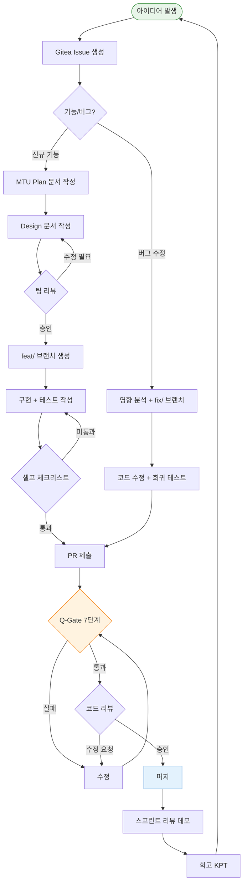

# 팀 개발 문화와 협업 방법

> **문서 ID**: ONBOARD-01-06
> **버전**: 1.0.0 | **작성일**: 2026-04-12 | **작성자**: Implementer (Sonnet)
> **학습 대상**: 이제 막 팀에 합류한 모든 개발자
> **예상 소요 시간**: 약 1.5시간 (숙지)
> **선행 문서**: `05-day-one-complete.md`, `13-contributing.md`, `03-development/06-code-review-guide.md`
> **CSAP**: D-06 (감사 추적), D-12 (시스템 개발 보안)

---

## 목차

1. [이 팀의 개발 문화 원칙](#1-이-팀의-개발-문화-원칙)
2. [일상적인 개발 리듬](#2-일상적인-개발-리듬)
3. [코드 오너십](#3-코드-오너십)
4. [PR 문화](#4-pr-문화)
5. [지식 공유](#5-지식-공유)
6. [원격/하이브리드 협업 팁](#6-원격하이브리드-협업-팁)
7. [팀 협업 전체 흐름도](#7-팀-협업-전체-흐름도)
8. [학습 체크리스트](#8-학습-체크리스트)
9. [다음 단계](#9-다음-단계)

---

## 1. 이 팀의 개발 문화 원칙

### 1.1 "문서 먼저, 코드 나중" 원칙

이 팀에서 가장 낯설게 느껴질 원칙입니다. 대부분의 개발 팀에서는 아이디어가 생기면 곧바로 코드를 작성합니다. 이 프로젝트는 다릅니다.

**왜 문서를 먼저 써야 하는가?**

공공기관 SaaS는 행안부 감리를 받습니다. 감리관은 "코드가 잘 돌아가는가"를 보는 것이 아니라 "계획대로 만들었는가"를 봅니다. 문서 없이 구현된 기능은 감리에서 결함으로 기록됩니다. 결함 하나당 보완 기간이 추가되고, 최악의 경우 CSAP 인증이 지연됩니다.

```
잘못된 순서 (절대 하지 말 것):
  코드 작성 → PR 제출 → 나중에 문서 작성
  → 감리관: "설계 문서가 구현 이후에 작성되었습니다. 결함입니다."

올바른 순서 (반드시 지킬 것):
  MTU Plan 문서 작성 → Design 문서 작성 → 코드 구현 → PR 제출
  → 감리관: "FR-X.X가 Design §3에 설계되고 코드에 구현되었습니다. 통과."
```

**실제로 어떻게 하는가?**

새로운 기능을 구현하기 전에 다음 순서를 따릅니다.

```bash
# 1단계: MTU Plan 문서 생성
# docs/01-plan/mtus/ 디렉토리에 파일 생성
# 예: MTU-N999-이메일-검증.plan.md

# 2단계: Design 문서 생성
# docs/02-design/features/ 디렉토리에 파일 생성
# 예: email-validation.design.md

# 3단계: 문서 PR 먼저 제출 → 리뷰 → 머지
# 4단계: 코드 구현 PR 제출
```

💡 팁: 처음에는 문서 작성이 번거롭게 느껴집니다. 하지만 2~3개 기능을 구현하고 나면 문서를 먼저 쓰는 것이 실제로 구현 속도를 높인다는 것을 체감하게 됩니다. 모호한 요구사항을 미리 정리하기 때문입니다.

### 1.2 비난 없는 피드백 (Constructive Feedback)

코드 리뷰에서 받은 댓글이 공격적으로 느껴질 때가 있습니다. 이 팀은 **비난 없는 피드백 원칙**을 지킵니다.

**비난 없는 피드백이란?**

코드에 문제가 있을 때 "왜 이렇게 짰어요?"라고 묻는 대신, 구체적으로 무엇이 문제이고 어떻게 개선하면 되는지를 설명합니다.

```
❌ 비난성 피드백 (이 팀에서 허용하지 않음):
  "이건 왜 이렇게 짠 거예요? SQL 주입이 뻔히 보이잖아요."
  "기본도 모르시네요. 이거 CSAP D-12 위반이에요."

✅ 건설적 피드백 (이 팀의 표준):
  "[Blocker] SQL 직접 결합은 CSAP D-12 위반입니다.
   매개변수화 쿼리로 변경 부탁드립니다.
   예시: db.execute('SELECT * FROM users WHERE email = $1', [email])
   참고: docs/.../csap-compliance.md §D-12"

  "[Question] 이 부분을 이렇게 구현한 특별한 이유가 있나요?
   제가 놓친 맥락이 있을 것 같아서요."
```

**피드백을 주는 사람의 책임**:
- 문제의 이유를 설명합니다.
- 가능하면 개선 방향을 제시합니다.
- 우선순위를 표시합니다 (Blocker / Suggestion / Nitpick).

**피드백을 받는 사람의 자세**:
- 비판을 나를 향한 것이 아니라 코드를 향한 것으로 받아들입니다.
- 이해하지 못한 댓글은 반드시 질문합니다.
- "이 피드백이 옳다"고 동의하면 수정하고, 다른 의견이 있으면 정중하게 설명합니다.

### 1.3 심리적 안전감 — 실수를 공유하는 문화

이 팀에서는 실수를 숨기는 것이 실수 자체보다 더 큰 문제입니다.

**왜 실수를 공유해야 하는가?**

```
사례 1 (나쁜 패턴):
  개발자 A가 스테이징에서 잘못된 마이그레이션을 실행했다.
  → A는 혼자 복구를 시도했지만 실패했다.
  → 2시간 후 팀 전체가 알게 되었고, 복구에 4시간이 걸렸다.
  → 팀 리드: "왜 즉시 알리지 않았나요?"

사례 2 (좋은 패턴):
  개발자 B가 스테이징에서 잘못된 마이그레이션을 실행했다.
  → B는 즉시 팀 채널에 공유했다.
  → 인프라 담당자가 30분 만에 복구했다.
  → 팀 리드: "빠른 공유 덕분에 피해를 최소화했습니다. 재발 방지책을 같이 논의합시다."
```

**실수 공유 방법**:

```markdown
# 팀 채널 메시지 예시

[환경: staging] [심각도: medium]

상황: db:migrate 명령을 잘못된 브랜치에서 실행했습니다.
영향: staging DB의 users 테이블에 불필요한 컬럼이 추가되었습니다.
현재 상태: 서비스는 정상 동작 중이나 DB 스키마가 의도와 다릅니다.
필요한 도움: 롤백 방법을 알고 계신 분이 있다면 도움 요청드립니다.
```

⚠️ "실수를 해도 괜찮다"는 말이 "실수를 해도 신경 쓰지 않아도 된다"는 뜻이 아닙니다. 실수 후에는 반드시 재발 방지책을 논의하고, 필요하다면 프로세스를 개선합니다.

---

## 2. 일상적인 개발 리듬

### 2.1 데일리 스탠드업

매일 오전 10:00, 15분간 진행합니다. 목적은 서로의 진행 상황을 공유하고 막힌 부분을 빠르게 해결하는 것입니다.

**스탠드업 형식 (세 가지만 말합니다)**:

```
1. 어제 한 것:
   "auth-service JWT 갱신 로직 구현을 완료했습니다.
    PR #123을 제출했고 리뷰를 기다리고 있습니다."

2. 오늘 할 것:
   "오늘은 tenant-service의 이메일 검증 기능을 시작할 예정입니다.
    먼저 MTU Plan 문서를 작성합니다."

3. 블로커 (없으면 '없음'):
   "tenant-service DB 스키마를 확인해야 하는데
    @홍길동 님이 설계 중인 부분과 겹칩니다.
    오늘 오후에 잠깐 확인할 수 있을까요?"
```

**스탠드업에서 하지 말아야 할 것**:

```
❌ 상세한 기술적 토론 ("그 JWT 로직에서 refresh token은...")
   → "나중에 따로 얘기합시다"로 처리합니다.

❌ 진행 상황 보고서 ("어제 총 8시간 동안...")
   → 간결하게 결과만 공유합니다.

❌ 스탠드업 중 다른 작업 (코딩, 슬랙 확인)
   → 15분이니 집중합니다.
```

### 2.2 주간 테크 공유 (Tech Share)

매주 금요일 오후 3:00, 45분간 진행합니다. 팀원이 돌아가며 기술 주제를 공유합니다.

**테크 공유 주제 예시**:

```
1. "이번 주에 Fastify의 preHandler 훅을 활용한 RBAC 구현 방법을 배웠습니다."
2. "CSAP D-08 접근 통제 항목 중 세션 관리 부분을 정리했습니다."
3. "Loki 로그 쿼리를 최적화한 방법을 공유합니다."
4. "오픈소스 라이브러리 xxx를 도입 검토한 결과를 발표합니다."
```

**발표 준비 기준**:
- 슬라이드 없어도 됩니다 (코드, 다이어그램, 설명만으로 충분합니다).
- 15~20분 분량 (질문 25분).
- 핵심 인사이트 3가지를 준비합니다.

💡 처음 합류한 첫 달에는 발표하지 않아도 됩니다. 청중으로 참여하면서 팀의 기술 맥락을 익히는 것이 우선입니다.

### 2.3 스프린트 계획 (MTU 기반 2주 스프린트)

이 팀은 2주 단위 스프린트를 운영합니다. 스프린트의 기본 단위는 **MTU(Minimum Task Unit)**입니다.

**MTU란?**

MTU는 하나의 완결된 작업 단위입니다. 각 MTU는 다음 속성을 가집니다.

```markdown
MTU 속성:
- MTU ID: MTU-N{번호}-{기능명}
- 작업 규모: 소(1~2일) / 중(3~5일) / 대(5일 이상, 분할 권장)
- 담당자: 1명 (복수 담당 시 주담당 1명 지정)
- 의존 MTU: [없음 또는 MTU-N{번호}]
- FR 연결: FR-{모듈}.{번호}
```

**스프린트 진행 방식**:

```
스프린트 시작 (월요일):
  1. 스프린트 계획 미팅 (1시간)
     → 이번 스프린트에서 완료할 MTU 목록 확정
     → 각 MTU를 담당자에게 할당
     → 의존 관계 확인

스프린트 중간 (1주차 금요일):
  2. 중간 점검 (30분)
     → 진행 중인 MTU 현황 공유
     → 블로커가 있는 MTU 집중 지원

스프린트 종료 (2주차 금요일):
  3. 스프린트 리뷰 (1시간)
     → 완료한 MTU 데모
     → 미완료 MTU 원인 분석
  4. 회고 (Retrospective) (1시간)
```

### 2.4 회고 (Retrospective) 방식

2주마다 스프린트 리뷰 후 회고를 진행합니다. 형식은 "Keep-Problem-Try" (KPT) 방식을 사용합니다.

**KPT 예시**:

```markdown
## Keep (계속 잘하고 있는 것)
- PR 크기를 300줄 이내로 유지하고 있습니다.
  → 리뷰 시간이 줄고 머지 속도가 빨라졌습니다.
- 데일리 스탠드업에서 블로커를 조기에 발견합니다.
  → 이번 스프린트에서 블로커 해결 평균 시간: 4시간

## Problem (개선이 필요한 것)
- 문서 작성이 구현보다 늦어지는 경우가 있습니다.
  → MTU-N235의 Design 문서가 구현 이후에 완성되었습니다.
- 통합 테스트 커버리지가 65%로 목표(80%)에 미달합니다.

## Try (다음 스프린트에서 시도할 것)
- 문서 작성을 MTU 시작 조건으로 명시적으로 정의합니다.
  → MTU를 "In Progress"로 이동하려면 Plan 문서가 완성되어야 합니다.
- 통합 테스트를 먼저 작성하는 TDD 방식을 시험합니다.
```

---

## 3. 코드 오너십

### 3.1 서비스별 오너 지정 방법

이 프로젝트는 17개 마이크로서비스와 여러 패키지로 구성됩니다. 각 서비스에는 **주 오너**와 **부 오너**가 있습니다.

| 서비스 | 주 오너 | 부 오너 | 역할 |
|--------|---------|---------|------|
| auth-service | 팀 리드 | 시니어 A | 인증·세션 관리 |
| tenant-service | 시니어 A | 개발자 B | 테넌트 관리 |
| ai-service | 시니어 B | 개발자 C | AI/RAG 연동 |
| compliance-service | 보안 담당 | 팀 리드 | CSAP 감사 로그 |

**오너의 책임**:
- 해당 서비스의 PR을 1차 리뷰합니다.
- 서비스 관련 질문의 1차 답변자입니다.
- 해당 서비스의 설계 결정을 기록합니다.
- 서비스 모니터링 알림의 1차 대응자입니다.

**신규 팀원의 서비스 오너 지정 시기**:

```
Week 1~2: 모든 서비스를 관찰하는 시기
Week 3~4: 관심 있는 서비스를 선택하고 팀 리드와 논의
Month 2~3: 부 오너로 참여하면서 맥락 쌓기
Month 3~6: 주 오너로 전환 (팀 합의)
```

### 3.2 CODEOWNERS 파일 활용

이 프로젝트는 Gitea의 CODEOWNERS 기능을 활용합니다. PR을 제출하면 변경된 파일의 오너가 자동으로 리뷰어로 지정됩니다.

```
# /data/ai-saas/.gitea/CODEOWNERS 예시

# 전체 프로젝트 기본 리뷰어
* @team-lead

# 서비스별 오너
/platform/services/auth-service/     @team-lead @senior-a
/platform/services/tenant-service/   @senior-a @developer-b
/platform/services/ai-service/       @senior-b @developer-c

# 보안 관련 파일 (반드시 보안 담당자 리뷰)
/.claude/rules/csap-compliance.md    @security-officer @team-lead
/platform/services/compliance-service/ @security-officer

# 문서 (모든 팀원 리뷰 가능)
/docs/**                             @team-lead
```

💡 CODEOWNERS 파일을 수정하려면 반드시 팀 리드의 승인이 필요합니다.

### 3.3 내가 담당하지 않는 서비스를 수정할 때

다른 팀원이 담당하는 서비스를 수정해야 할 때는 다음 절차를 따릅니다.

```
1단계: 해당 서비스 오너에게 사전 알림
  → Slack 메시지: "tenant-service의 이메일 검증 로직을 수정해야 합니다.
                   어떤 부분을 확인하면 좋을지 5분만 이야기할 수 있을까요?"

2단계: 수정 범위 합의
  → 오너와 함께 영향 범위를 검토합니다.
  → 오너가 불가능한 영향이 있다면 대안을 논의합니다.

3단계: PR 제출 시 오너를 리뷰어로 명시적으로 추가
  → CODEOWNERS가 자동 지정하지만, 설명 댓글을 추가합니다.
  → "이 변경의 배경을 알고 계신 @senior-a 님을 리뷰어로 추가합니다."

4단계: 수정 후 문서화
  → 서비스 오너가 모르는 변경이 생기지 않도록 PR 설명을 충실히 작성합니다.
```

⚠️ 다른 서비스의 핵심 로직을 오너와 상의 없이 수정하는 것은 팀 문화 위반입니다. 급한 상황이라도 Slack으로 30초만 알리십시오.

---

## 4. PR 문화

### 4.1 PR 크기 제한

연구에 따르면 PR 크기가 클수록 리뷰 품질이 떨어집니다. 리뷰어도 인간이고, 집중력에는 한계가 있습니다.

| PR 크기 | 변경 줄 수 | 평가 | 조치 |
|---------|---------|------|------|
| 이상적 | 150줄 이하 | 집중 리뷰 가능 | 그대로 진행 |
| 권장 범위 | 150~300줄 | 충분히 리뷰 가능 | 그대로 진행 |
| 주의 | 300~500줄 | 리뷰 품질 저하 시작 | 분할 검토 |
| 분할 필요 | 500줄 이상 | 반드시 분할 | 분할 후 재제출 |

**PR을 300줄 이내로 유지하는 방법**:

```bash
# PR 제출 전 변경 줄 수 확인
git diff --stat main...HEAD

# 결과 예시:
# 5 files changed, 287 insertions(+), 43 deletions(-)
# 총 330줄 → 경계선. 분할 검토 필요.
```

**큰 기능을 어떻게 나누는가?**

```
예시: 이메일 도메인 화이트리스트 기능 (예상 700줄)

분할 방법:
  PR 1: DB 스키마 추가 + 마이그레이션 (100줄)
  PR 2: 검증 로직 + 단위 테스트 (250줄)
  PR 3: API 엔드포인트 + 통합 테스트 (200줄)
  PR 4: 문서 + CSAP 추적성 주석 (150줄)

각 PR이 독립적으로 동작하도록 설계합니다.
```

### 4.2 Draft PR 활용

작업이 완성되지 않았더라도 초안 검토를 요청할 수 있습니다. Draft PR(초안 PR)을 활용합니다.

**Draft PR을 사용하는 경우**:

```
- 방향이 맞는지 초기 피드백이 필요할 때
- 큰 기능의 중간 체크포인트가 필요할 때
- 막힌 부분에서 다른 팀원의 아이디어가 필요할 때
```

**Draft PR 제목 형식**:

```bash
# Gitea에서 PR 생성 시 "[Draft]" 접두사를 붙입니다.
# 예:
[Draft] feat(tenant): 이메일 도메인 화이트리스트 검증 — 방향 확인 요청

# PR 본문에 검토 요청 사항을 명시합니다:
## 초안 검토 요청

이 PR은 아직 완성되지 않은 상태입니다.

**현재 완료된 것:**
- 검증 함수 핵심 로직 구현 완료

**피드백이 필요한 부분:**
- validateEmailDomain() 함수의 접근 방식이 맞는지 확인 부탁드립니다.
- 캐싱 전략을 어떻게 할지 아이디어가 있다면 코멘트 부탁드립니다.

**아직 하지 않은 것:**
- 에러 처리 (추후 추가 예정)
- 테스트 작성
- 감사 로그 추가
```

### 4.3 PR 리뷰 응답 기한

| 단계 | 기한 | 설명 |
|------|------|------|
| 초기 확인 응답 | 24시간 이내 | "리뷰했습니다" 또는 "X일까지 할게요" |
| 리뷰 완료 | 72시간 이내 | 승인 또는 수정 요청 |
| 수정 후 재리뷰 | 24시간 이내 | 이전 Blocker 확인 |
| PR 작성자 대응 | 48시간 이내 | Blocker 수정 또는 반박 설명 |

**기한을 지키지 못할 때**:

```
# Slack에서 미리 알립니다:
"PR #157 리뷰를 오늘 중으로 하려 했는데,
 예상치 못한 장애 대응으로 내일 오전까지 할 것 같습니다.
 급하시면 @senior-b 님께 요청하셔도 됩니다."
```

### 4.4 머지 전 셀프 체크리스트

PR을 "Ready for Review"로 전환하기 전에 스스로 확인합니다.

```markdown
## 머지 전 셀프 체크리스트

### 코드 품질
- [ ] 변경 줄 수가 300줄 이내입니까?
- [ ] 함수 하나가 80줄 이하입니까?
- [ ] Dead code가 없습니까? (미사용 함수, 변수, import)
- [ ] 하드코딩된 시크릿(API 키, 비밀번호)이 없습니까?

### CSAP 준수
- [ ] 모든 API 엔드포인트에 RBAC 검사가 있습니까?
- [ ] 사용자 입력에 Zod 검증이 적용되었습니까?
- [ ] SQL 매개변수화 쿼리를 사용했습니까?
- [ ] 민감 작업에 auditLog() 호출이 있습니까?

### 문서 연결
- [ ] Design Ref 주석이 있습니까? (// Design Ref: §{섹션})
- [ ] Plan SC 주석이 있습니까? (// Plan SC: {FR-ID})
- [ ] CHANGELOG.md를 업데이트했습니까?

### 테스트
- [ ] 새로운 함수에 단위 테스트가 있습니까?
- [ ] 테스트가 통과합니까? (pnpm test)
- [ ] 린트 오류가 없습니까? (pnpm lint)

### PR 설명
- [ ] PR 제목이 Conventional Commits 형식입니까?
- [ ] 변경 내용 요약이 있습니까?
- [ ] 관련 Issue 번호가 포함되어 있습니까?
- [ ] 테스트 방법이 기술되어 있습니까?
```

---

## 5. 지식 공유

### 5.1 온보딩 가이드북 개선에 기여하는 방법

여러분이 지금 읽고 있는 이 문서는 팀원들이 함께 만들고 개선합니다. 온보딩 과정에서 "이 부분이 모호했다", "이 내용이 빠져있다"고 느낀 것이 있다면 PR을 제출하면 됩니다.

**기여 방법**:

```bash
# 1. 수정할 파일 확인
ls /data/ai-saas/docs/guides/onboarding/

# 2. docs/ 브랜치 생성
git checkout -b docs/improve-onboarding-setup-guide

# 3. 파일 수정
# 예: 02-environment-setup.md에 WSL2 설정 팁 추가

# 4. 커밋
git commit -m "docs(onboarding): WSL2 환경에서 pnpm 설치 오류 해결 방법 추가"

# 5. PR 제출 (간소한 절차)
# PR 제목: docs(onboarding): {무엇을 개선했는지 한 문장}
# 본문: 왜 이 내용이 필요한지, 어떤 상황에서 이 내용이 도움이 되는지
```

**온보딩 문서 PR은 일반 코드 PR보다 절차가 간소합니다**:
- MTU Plan 문서 불필요
- 단, CSAP/N2SF 관련 내용을 수정하는 경우 Auditor 에이전트 검토 필수

### 5.2 공통 컴포넌트 제안 절차

여러 서비스에서 반복적으로 사용되는 패턴을 발견했을 때 공통 패키지로 제안할 수 있습니다.

```
예시 상황:
  개발자가 auth-service와 tenant-service에서
  동일한 IP 주소 검증 로직을 각각 구현했습니다.
  → 공통 패키지 제안
```

**공통 컴포넌트 제안 절차**:

```markdown
## Step 1: Gitea에 Issue 생성
제목: [공통 패키지 제안] IP 주소 검증 유틸리티

## 내용:
**현황:**
- auth-service/src/utils/ip.ts에 validateIPRange() 구현
- tenant-service/src/utils/network.ts에 isValidIP() 구현
  → 동일한 로직이 두 곳에 중복

**제안:**
packages/network-utils 패키지 생성
- validateIPv4(), validateIPv6(), validateCIDR() 함수 제공

**예상 영향:**
- auth-service, tenant-service, security-service가 사용 가능
- 향후 새 서비스 추가 시 재사용 가능

## Step 2: 팀 스탠드업에서 간단히 언급
## Step 3: 팀 동의 후 MTU 생성 및 구현
```

### 5.3 기술 부채(Tech Debt) 신고 방법

코드를 보다가 "이건 나중에 고쳐야 할 것 같다"는 부분을 발견하면 즉시 신고합니다.

**왜 즉시 신고해야 하는가?**

```
기술 부채를 "나중에 기억하겠다"고 넘어가면:
  → 대부분 잊어버립니다.
  → 코드베이스에 서서히 부채가 쌓입니다.
  → 6개월 후: "왜 이 코드가 이렇게 됐지?" — 아무도 모릅니다.
```

**신고 방법 1: 코드 주석 (간단한 부채)**:

```typescript
// TODO(tech-debt): 현재 In-Memory 캐시를 사용 중.
// 수평 확장 시 캐시 무효화 문제 발생.
// Issue #234에서 Redis 캐시로 전환 논의 중.
// 예상 수정 시점: Q3 2026
const cache = new Map<string, CacheEntry>()
```

**신고 방법 2: Gitea Issue (중요한 부채)**:

```markdown
제목: [Tech Debt] auth-service 세션 저장소 In-Memory → Redis 전환 필요

## 현재 상태
현재 세션을 애플리케이션 메모리에 저장합니다.
코드: platform/services/auth-service/src/lib/session.ts:45

## 문제
- 수평 확장(Pod 2개 이상) 시 세션이 각 Pod에 분산됩니다.
- Pod 재시작 시 모든 세션이 소실됩니다.

## 영향도
- 현재(단일 Pod): 영향 없음
- 수평 확장 시: 사용자 로그아웃 강제 발생

## 권장 해결책
Redis 세션 저장소로 전환
관련 패키지: packages/session-store (구현 예정)

## 우선순위: Medium (수평 확장 전에 해결 필요)
라벨: tech-debt, medium-priority
```

---

## 6. 원격/하이브리드 협업 팁

### 6.1 비동기 소통 에티켓

이 팀은 원격 근무가 포함된 하이브리드 환경에서 일합니다. 실시간 소통이 항상 가능하지 않으므로, 비동기 소통의 품질이 협업 효율을 결정합니다.

**좋은 비동기 메시지의 특징**:

```markdown
❌ 나쁜 메시지:
  "질문 있어요"
  → 상대방은 "무슨 질문이에요?"라고 물어봐야 합니다.
     → 응답 대기 → 또 대기 → 왕복 3회 소통 = 반나절 소요

✅ 좋은 메시지:
  "auth-service의 JWT 갱신 로직에 대해 질문이 있습니다.

  [상황] refresh token 유효 기간이 만료된 상태에서
         클라이언트가 갱신을 요청한 경우입니다.

  [제가 이해한 것] 현재 코드(src/lib/jwt.ts:123)에서는
                   만료된 refresh token을 받으면 401을 반환합니다.

  [질문] 이 경우에 클라이언트가 재로그인을 해야 하는지,
         아니면 다른 처리 방법이 있는지 알고 싶습니다.

  [긴급도] 오늘 중으로 알면 좋지만, 내일 오전까지도 괜찮습니다."
```

**채널 사용 규칙**:

| 채널 | 용도 | 응답 기대 시간 |
|------|------|-------------|
| `#dev-general` | 팀 전체 공지, 일반 기술 질문 | 당일 |
| `#dev-alerts` | 인시던트, 장애 알림 | 즉시 |
| `#dev-review` | PR 리뷰 요청, 코드 질문 | 24시간 |
| `#dev-random` | 비업무 대화 | 언제든 |
| DM | 1:1 개인 사항 | 당일 |

**응답 시간 표시 방법**:

```
메시지에 긴급도를 명시합니다:

[즉시] 프로덕션 장애 상황입니다.
[오늘 중] 오늘 배포 전에 확인이 필요합니다.
[이번 주 중] 다음 스프린트 계획 전에 필요합니다.
[여유] 급하지 않습니다. 시간 될 때 봐주세요.
```

### 6.2 페어 프로그래밍 진행 방법

막힌 문제, 복잡한 설계, 새로운 기술을 습득할 때 페어 프로그래밍을 활용합니다.

**페어 프로그래밍 요청 방법**:

```
Slack 메시지 예시:
"tenant-service의 이메일 검증 로직에서
 복잡한 정규식 처리 때문에 막혀있습니다.
 30분 정도 같이 보실 수 있는 분 계신가요?
 내일 오전 중이면 좋겠습니다.
 (원격: Huddle 또는 화면 공유 방식)"
```

**페어 프로그래밍 진행 방식 (Driver-Navigator)**:

```
역할 교대 방식:
  Driver (키보드를 가진 사람):
    → 실제 코드를 작성합니다.
    → 생각을 소리 내어 말합니다 ("지금 이 함수를 이렇게 작성하고 있어요").

  Navigator (관찰자):
    → 큰 그림을 봅니다.
    → "저 변수명이 더 명확할 것 같은데요", "CSAP 위반 아닌가요?" 등을 제안합니다.
    → 다음 할 것을 미리 생각합니다.

  25~30분마다 역할을 교대합니다.
```

**원격 페어 프로그래밍 도구**:

```bash
# 방법 1: VS Code Live Share
# 한 명이 Live Share 세션을 시작하고 링크를 공유합니다.
# 두 사람이 동일한 파일을 함께 편집할 수 있습니다.

# 방법 2: tmux 세션 공유 (터미널 기반)
# 서버에 tmux 세션을 만들고 두 사람이 SSH로 접속합니다.
tmux new-session -s pair-session
# 다른 사람: tmux attach-session -t pair-session

# 방법 3: 화면 공유 + 원격 조종
# Slack Huddle 또는 화상회의 도구에서 화면 공유 + 원격 마우스 허용
```

---

## 7. 팀 협업 전체 흐름도

### 7.1 기능 개발 라이프사이클



### 7.2 일일 협업 리듬

```mermaid
gantt
    title 하루 협업 리듬 (예시)
    dateFormat HH:mm
    axisFormat %H:%M

    section 오전
    개인 작업 (집중 시간)   :active, 09:00, 60m
    데일리 스탠드업         :milestone, 10:00, 15m
    코드 리뷰 + PR 확인     :10:15, 45m
    개인 작업 (구현)        :11:00, 120m

    section 점심
    점심 휴식               :13:00, 60m

    section 오후
    개인 작업 (구현 계속)   :active, 14:00, 60m
    페어 프로그래밍 (선택)  :15:00, 60m
    주간 테크 공유 (금요일) :16:00, 45m
    PR 리뷰 + 댓글 처리    :16:45, 45m
    내일 할 것 정리         :17:30, 30m
```



---

## 8. 학습 체크리스트

이 문서를 읽고 난 후 다음 항목을 실제로 확인하십시오.

### 문화 이해

- [ ] "문서 먼저, 코드 나중" 원칙을 설명할 수 있습니까?
- [ ] Blocker / Suggestion / Nitpick 댓글 분류를 이해했습니까?
- [ ] 실수 발생 시 팀 채널에 공유하는 방법을 알고 있습니까?

### 리듬 파악

- [ ] 데일리 스탠드업 형식(어제/오늘/블로커)을 기억합니까?
- [ ] 2주 스프린트 구조와 MTU 개념을 이해했습니까?
- [ ] KPT 회고 형식을 알고 있습니까?

### 오너십

- [ ] 내가 주로 기여할 서비스를 잠정적으로 생각해두었습니까?
- [ ] CODEOWNERS가 무엇인지 이해했습니까?
- [ ] 다른 서비스를 수정할 때 사전 알림 절차를 알고 있습니까?

### PR 문화

- [ ] PR 크기 300줄 제한의 이유를 설명할 수 있습니까?
- [ ] Draft PR을 언제 사용하는지 알고 있습니까?
- [ ] 머지 전 셀프 체크리스트를 한 번 훑어보았습니까?

### 지식 공유

- [ ] 온보딩 가이드 개선 PR을 제출하는 방법을 알고 있습니까?
- [ ] 기술 부채를 발견했을 때 신고하는 두 가지 방법을 알고 있습니까?

### 협업

- [ ] 비동기 메시지 작성 시 [긴급도]를 명시하는 습관을 이해했습니까?
- [ ] 페어 프로그래밍 Driver-Navigator 역할을 이해했습니까?

---

## 9. 다음 단계

이 문서를 완료했다면 다음 문서로 진행합니다.

| 순서 | 문서 | 내용 |
|------|------|------|
| 다음 | `07-real-scenarios.md` | 실제 첫 주 시나리오 5가지 |
| 참고 | `13-contributing.md` | 기여 절차 상세 |
| 참고 | `03-development/06-code-review-guide.md` | 코드 리뷰 에티켓 상세 |

---

## 변경 이력

| 버전 | 일자 | 내용 | 작성자 |
|------|------|------|--------|
| 1.0.0 | 2026-04-12 | 최초 작성 | Implementer (Sonnet) |
