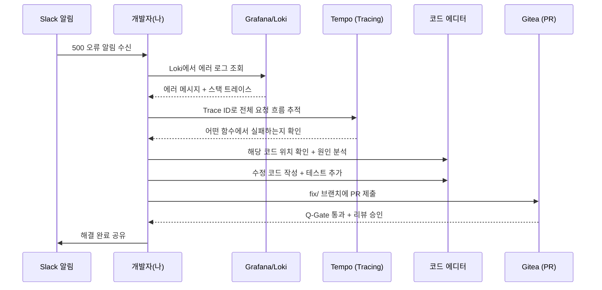
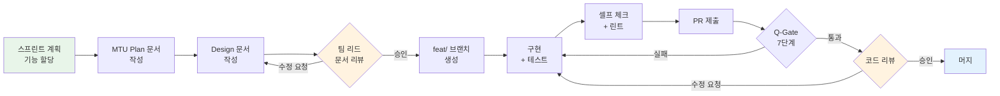
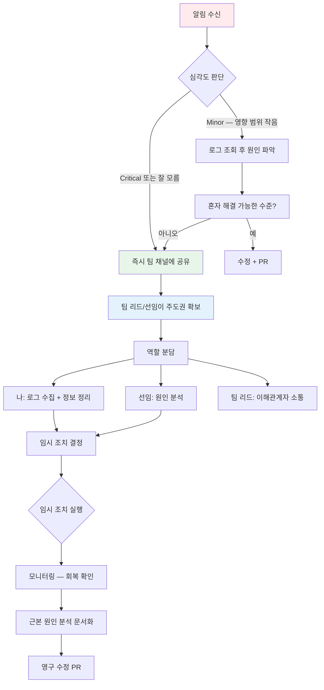
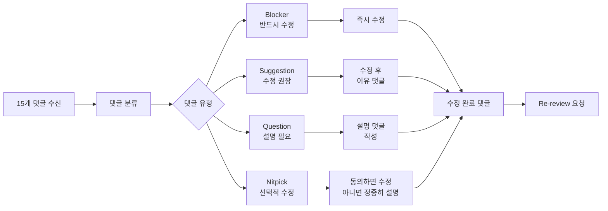
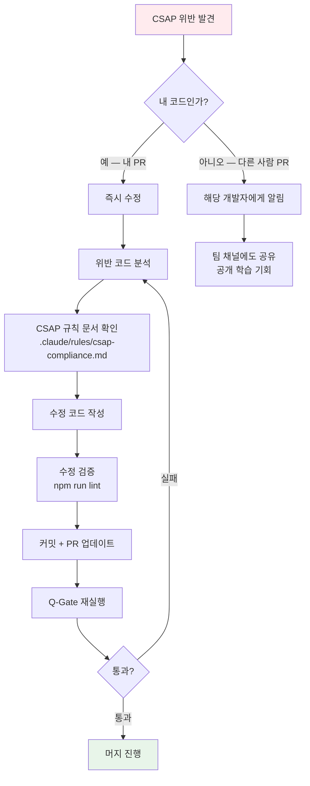

# 첫 주~첫 달 실전 시나리오 5가지

> **문서 ID**: ONBOARD-01-07
> **버전**: 1.0.0 | **작성일**: 2026-04-12 | **작성자**: Implementer (Sonnet)
> **학습 대상**: 이제 막 팀에 합류한 신규 개발자
> **예상 소요 시간**: 약 2시간 (숙독 + 명령어 실습)
> **선행 문서**: `03-first-week.md`, `06-team-practices.md`, `10-exercises/01-hello-service.md`
> **CSAP**: D-06 (침해사고 관리), D-08 (접근 통제), D-12 (시스템 개발 보안)

---

## 목차

1. [이 문서를 읽는 방법](#1-이-문서를-읽는-방법)
2. [시나리오 1: 첫 번째 버그 수정 (Day 3)](#2-시나리오-1-첫-번째-버그-수정-day-3)
3. [시나리오 2: 첫 번째 기능 추가 (Week 2)](#3-시나리오-2-첫-번째-기능-추가-week-2)
4. [시나리오 3: 첫 번째 인시던트 대응 (Month 1)](#4-시나리오-3-첫-번째-인시던트-대응-month-1)
5. [시나리오 4: 첫 번째 코드 리뷰 수신 (Week 2)](#5-시나리오-4-첫-번째-코드-리뷰-수신-week-2)
6. [시나리오 5: CSAP 위반 발견 대응 (Month 1)](#6-시나리오-5-csap-위반-발견-대응-month-1)
7. [전체 타임라인](#7-전체-타임라인)
8. [학습 체크리스트](#8-학습-체크리스트)
9. [다음 단계](#9-다음-단계)

---

## 1. 이 문서를 읽는 방법

이 문서는 신규 팀원이 첫 주부터 첫 달 사이에 실제로 마주치는 상황을 시나리오 형식으로 정리했습니다.

**읽는 방법**:

```
1. 각 시나리오를 순서대로 읽습니다.
2. "명령어 시퀀스" 부분은 실제 로컬 환경에서 따라 해 보십시오.
3. "핵심 교훈" 박스는 가장 중요한 것을 요약한 것입니다.
4. 모르는 용어가 나오면 04-tools-reference.md를 참고하십시오.
```

**이 문서가 가정하는 전제**:

```
- 로컬 개발 환경이 완전히 설정되어 있습니다 (02-environment-setup.md 완료).
- auth-service를 로컬에서 실행해본 적이 있습니다 (03-first-week.md Day 2 완료).
- Gitea, Grafana, Loki에 접근 권한이 있습니다.
- Slack 팀 채널에 참여했습니다.
```

---

## 2. 시나리오 1: 첫 번째 버그 수정 (Day 3)

### 2.1 상황 설정

**시간**: 입사 3일 차 오전 10:30 — 데일리 스탠드업이 방금 끝났습니다.

Slack `#dev-alerts` 채널에 메시지가 올라옵니다.

```
[dev-alerts] 10:28 AM
시스템 알림:
  auth-service가 간헐적으로 HTTP 500을 반환합니다.
  영향: 일부 사용자 로그인 실패
  발생 빈도: 약 5분마다 1~2건
  발생 시작: 10:15 AM

@channel 확인 부탁드립니다.
```

팀 리드가 Slack에서 말합니다.

```
팀 리드 10:32 AM:
신입분, 이 버그 같이 봐봐요.
제가 옆에서 도와드릴 테니 일단 Grafana에서 로그 확인해보세요.
경험 삼아 같이 해보는 거니까 편하게요.
```

### 2.2 전체 대응 프로세스



### 2.3 Step 1: Loki에서 에러 로그 확인

Grafana Loki는 이 프로젝트의 중앙 로그 저장소입니다. 브라우저에서 접근합니다.

```
Grafana 접근:
  URL: http://grafana.local:3000
  (또는 팀이 사용하는 실제 Grafana URL)
```

Loki 쿼리로 auth-service의 500 에러를 찾습니다.

```logql
# Loki 쿼리 언어 (LogQL)
# Explore 탭 → Loki 데이터소스 선택 후 아래 쿼리 입력

{service="auth-service"} |= "500" | json | level="error"

# 결과에서 확인할 것:
# 1. 에러 메시지 (message 필드)
# 2. 스택 트레이스 (stack 필드)
# 3. traceId 필드 (Tempo에서 추가 분석용)
```

에러 로그가 보입니다.

```json
{
  "level": "error",
  "time": "2026-04-15T10:17:43.221Z",
  "service": "auth-service",
  "message": "Cannot read properties of undefined (reading 'id')",
  "stack": "TypeError: Cannot read properties of undefined (reading 'id')\n    at refreshTokenHandler (/app/src/handlers/auth.handler.ts:87:24)",
  "traceId": "a1b2c3d4e5f6789012345678",
  "requestId": "req-20260415-001234"
}
```

### 2.4 Step 2: Tempo로 전체 요청 흐름 추적

`traceId`를 복사하여 Tempo에서 전체 요청 흐름을 확인합니다.

```
Grafana → Explore → Tempo 데이터소스 선택
→ TraceID 입력: a1b2c3d4e5f6789012345678
→ Run query
```

Tempo 결과가 보여줍니다.

```
요청 흐름:
  클라이언트 → [POST /auth/refresh] → auth-service
    ├─ validateRefreshToken()    2ms  ✅
    ├─ findUserById(undefined)   0ms  ❌ (여기서 실패)
    └─ (이후 실행 없음)

힌트: findUserById의 인자가 undefined입니다.
       = refresh token에서 userId를 추출하지 못했습니다.
```

### 2.5 Step 3: 코드 원인 분석

에러 위치를 코드에서 확인합니다.

```bash
# 에러가 발생한 파일 확인
code /data/ai-saas/platform/services/auth-service/src/handlers/auth.handler.ts
# 또는
vi /data/ai-saas/platform/services/auth-service/src/handlers/auth.handler.ts
```

```typescript
// auth.handler.ts 87번째 줄 근처
async function refreshTokenHandler(request: FastifyRequest, reply: FastifyReply) {
  const { refreshToken } = request.body as { refreshToken: string }

  // 여기서 문제 발생!
  // verify()가 만료된 토큰에서 null을 반환하는데
  // null.id를 참조하려고 시도함
  const decoded = verifyRefreshToken(refreshToken)  // null 반환 가능
  const user = await findUserById(decoded.id)       // 87번째 줄 — null.id 오류

  // ... 이하 생략
```

원인을 파악했습니다. `verifyRefreshToken()`이 만료된 토큰에 대해 `null`을 반환하는데, 그 결과를 검사하지 않고 `.id`를 참조합니다.

### 2.6 Step 4: 수정 코드 작성

```bash
# 수정을 위한 브랜치 생성
cd /data/ai-saas
git checkout -b fix/auth-refresh-null-check

# 에디터에서 수정
```

```typescript
// 수정 후 코드
async function refreshTokenHandler(request: FastifyRequest, reply: FastifyReply) {
  const { refreshToken } = request.body as { refreshToken: string }

  // Design Ref: §3.2 — refresh token 만료 처리
  const decoded = verifyRefreshToken(refreshToken)

  // 수정: null 검사 추가 (CSAP D-12 — 입력 검증)
  if (!decoded) {
    // Plan SC: FR-AUTH.3 — 만료된 refresh token 처리
    return reply.status(401).send({
      error: 'Refresh token expired or invalid',
      code: 'TOKEN_EXPIRED',
    })
  }

  const user = await findUserById(decoded.id)
  // ... 이하 정상 로직
```

### 2.7 Step 5: 회귀 테스트 추가

버그를 수정한 후에는 반드시 이 버그가 다시 발생하지 않도록 테스트를 추가합니다.

```typescript
// auth.handler.test.ts에 테스트 케이스 추가
describe('POST /auth/refresh', () => {
  // ... 기존 테스트

  it('만료된 refresh token으로 요청 시 401을 반환한다', async () => {
    // 만료된 토큰 시뮬레이션
    const expiredToken = generateExpiredRefreshToken()

    const response = await app.inject({
      method: 'POST',
      url: '/auth/refresh',
      payload: { refreshToken: expiredToken },
    })

    expect(response.statusCode).toBe(401)
    expect(response.json().code).toBe('TOKEN_EXPIRED')
  })
})
```

```bash
# 테스트 실행 확인
cd /data/ai-saas
pnpm --filter auth-service test

# 통과 확인:
# ✓ POST /auth/refresh: 만료된 refresh token으로 요청 시 401을 반환한다
```

### 2.8 Step 6: PR 제출 및 팀 공유

```bash
# 변경사항 확인
git diff --stat

# 커밋
git add platform/services/auth-service/src/handlers/auth.handler.ts
git add platform/services/auth-service/src/handlers/auth.handler.test.ts
git commit -m "fix(auth): refresh token null 검사 누락으로 발생한 500 오류 수정 (#이슈번호)"

# PR 제출
git push origin fix/auth-refresh-null-check
```

Gitea에서 PR을 생성합니다.

```markdown
## 버그 수정: refresh token 만료 시 500 오류

**버그 원인:**
verifyRefreshToken()이 만료된 토큰에서 null을 반환하지만
이를 검사하지 않고 decoded.id를 참조하여 TypeError 발생

**수정 내용:**
- null 검사 추가 → 만료 시 401 반환
- 회귀 테스트 1개 추가

**재현 방법:**
1. 만료된 refresh token으로 POST /auth/refresh 호출
2. 500 TypeError 확인

**수정 검증:**
- [x] 단위 테스트 통과 (pnpm test)
- [x] 린트 통과 (pnpm lint)
- [x] CSAP D-12 — 입력 검증 확인
```

Slack에 공유합니다.

```
나 10:58 AM:
auth-service 500 오류 원인 파악했습니다.
만료된 refresh token에 대한 null 검사가 없었습니다.
PR #125 제출했습니다. 리뷰 부탁드립니다.
스테이징에 배포하면 해결될 것 같습니다.
```

> **핵심 교훈**
> 버그 수정 순서: 알림 확인 → Loki 로그 → Tempo 추적 → 코드 분석 → 수정 → 회귀 테스트 추가 → PR
> 버그 수정에도 반드시 테스트를 추가합니다. 테스트 없는 버그 수정은 같은 버그가 다시 나타났을 때 알 수 없습니다.

---

## 3. 시나리오 2: 첫 번째 기능 추가 (Week 2)

### 3.1 상황 설정

**시간**: 입사 2주 차 월요일 스프린트 계획 미팅.

팀 리드가 새로운 MTU를 할당합니다.

```
팀 리드:
"tenant-service에 이메일 도메인 화이트리스트 검증 기능을 추가해야 합니다.
 예를 들어 기관 A가 허용한 도메인(@agency-a.go.kr)만 가입할 수 있도록요.
 신입분이 도전해보실 수 있을까요? 제가 리뷰해드리겠습니다."
```

요구사항 요약.

```
기능: 테넌트별 이메일 도메인 화이트리스트 검증
대상 서비스: tenant-service
설명: 관리자가 허용 도메인 목록을 설정하면,
      해당 테넌트에서 사용자 가입 시 도메인을 검사합니다.
예시: @agency-a.go.kr 허용 → abc@agency-a.go.kr 가입 가능
      xyz@gmail.com 가입 불가
```

### 3.2 전체 프로세스



### 3.3 Step 1: MTU Plan 문서 작성

구현 전에 반드시 Plan 문서를 작성합니다.

```bash
# Plan 문서 생성
touch /data/ai-saas/docs/01-plan/mtus/MTU-N999-email-domain-whitelist.plan.md
```

```markdown
# MTU-N999: 이메일 도메인 화이트리스트 검증

> **MTU ID**: MTU-N999
> **작성일**: 2026-04-20 | **작성자**: 개발자 이름
> **담당자**: 개발자 이름 | **검토자**: 팀 리드
> **규모**: 소 (예상 3일)
> **의존 MTU**: 없음

## 배경 및 목적

공공기관 테넌트는 특정 이메일 도메인의 사용자만 가입을 허용해야 합니다.
현재는 모든 이메일 도메인으로 가입이 가능하여 보안 위험이 있습니다.

## 요구사항

| FR ID | 내용 | 우선순위 |
|-------|------|---------|
| FR-TENANT.10 | 관리자가 도메인 화이트리스트를 설정/조회/수정/삭제 가능 | HIGH |
| FR-TENANT.11 | 사용자 가입 시 도메인 검사, 비허용 도메인은 403 반환 | HIGH |
| FR-TENANT.12 | 화이트리스트가 비어있으면 모든 도메인 허용 (기본값) | MEDIUM |

## CSAP 연계

| CSAP 항목 | 연계 이유 |
|----------|---------|
| D-08-03 (접근 통제 — 사용자 등록) | 비인가 사용자 가입 차단 |
| D-12-01 (입력 검증) | 이메일 도메인 형식 검증 |

## 완료 기준

- [ ] FR-TENANT.10~12 구현 완료
- [ ] 단위 테스트 커버리지 80% 이상
- [ ] Q-Gate 7단계 통과
- [ ] CHANGELOG.md 업데이트
```

```bash
# Plan 문서 PR 먼저 제출 (문서 먼저 원칙)
git checkout -b docs/mtu-n999-email-whitelist-plan
git add docs/01-plan/mtus/MTU-N999-email-domain-whitelist.plan.md
git commit -m "docs(plan): MTU-N999 이메일 도메인 화이트리스트 Plan 문서"
git push origin docs/mtu-n999-email-whitelist-plan
```

### 3.4 Step 2: Design 문서 작성

Plan 문서 승인 후 Design 문서를 작성합니다.

```bash
touch /data/ai-saas/docs/02-design/features/email-domain-whitelist.design.md
```

Design 문서에는 API 설계, DB 스키마 변경, 핵심 로직 다이어그램을 포함합니다.

```markdown
# email-domain-whitelist.design.md 주요 내용 (요약)

## API 설계

### GET /tenants/{tenantId}/domains
→ 허용 도메인 목록 조회

### POST /tenants/{tenantId}/domains
→ 허용 도메인 추가
→ Request Body: { "domain": "agency-a.go.kr" }

### DELETE /tenants/{tenantId}/domains/{domain}
→ 허용 도메인 삭제

## DB 스키마

CREATE TABLE tenant_allowed_domains (
  id UUID PRIMARY KEY DEFAULT gen_random_uuid(),
  tenant_id UUID NOT NULL REFERENCES tenants(id),
  domain VARCHAR(255) NOT NULL,
  created_at TIMESTAMPTZ DEFAULT NOW(),
  UNIQUE(tenant_id, domain)
);

## 핵심 검증 로직

1. 가입 요청 수신 → 이메일에서 도메인 추출
2. tenant_allowed_domains에서 해당 테넌트의 허용 도메인 조회
3. 목록이 비어있으면 → 허용 (FR-TENANT.12)
4. 목록이 있으면 → 도메인이 목록에 있는지 확인
5. 없으면 → 403 Forbidden 반환
```

### 3.5 Step 3: 구현

문서 PR이 승인된 후 구현 브랜치를 만듭니다.

```bash
git checkout -b feat/mtu-n999-email-domain-whitelist
```

구현 파일 예시.

```typescript
// platform/services/tenant-service/src/lib/email-domain-validator.ts
// Design Ref: §3 핵심 검증 로직
// Plan SC: FR-TENANT.11

import { db } from './database'
import { auditLog } from './audit'

/**
 * 이메일 주소의 도메인이 테넌트 허용 목록에 포함되는지 검사합니다.
 * 허용 목록이 비어있으면 모든 도메인을 허용합니다 (FR-TENANT.12).
 */
export async function validateEmailDomain(
  tenantId: string,
  email: string,
): Promise<{ allowed: boolean; reason?: string }> {
  // D-12-01: 입력 검증 — 이메일 형식 확인
  const emailRegex = /^[a-zA-Z0-9._%+-]+@([a-zA-Z0-9.-]+\.[a-zA-Z]{2,})$/
  const match = email.match(emailRegex)
  if (!match) {
    return { allowed: false, reason: 'INVALID_EMAIL_FORMAT' }
  }

  const domain = match[1].toLowerCase()

  // 허용 도메인 목록 조회 (매개변수화 쿼리 — CSAP D-12)
  const allowedDomains = await db.execute(
    'SELECT domain FROM tenant_allowed_domains WHERE tenant_id = $1',
    [tenantId],
  )

  // FR-TENANT.12: 목록이 비어있으면 모든 도메인 허용
  if (allowedDomains.rows.length === 0) {
    return { allowed: true }
  }

  const domainSet = new Set(allowedDomains.rows.map((r: { domain: string }) => r.domain))
  const allowed = domainSet.has(domain)

  if (!allowed) {
    // D-06: 감사 로그 — 가입 거부 기록
    await auditLog({
      action: 'USER_REGISTRATION_BLOCKED',
      tenantId,
      detail: { email: email.replace(/^[^@]+/, '***'), domain },
      timestamp: new Date().toISOString(),
    })
  }

  return {
    allowed,
    reason: allowed ? undefined : 'DOMAIN_NOT_ALLOWED',
  }
}
```

### 3.6 Step 4: 테스트 작성 및 실행

```typescript
// email-domain-validator.test.ts
import { validateEmailDomain } from './email-domain-validator'

describe('validateEmailDomain', () => {
  it('허용 목록이 비어있으면 모든 도메인을 허용한다 (FR-TENANT.12)', async () => {
    // 테넌트에 허용 도메인이 없는 상태를 시뮬레이션
    mockDb.execute.mockResolvedValue({ rows: [] })

    const result = await validateEmailDomain('tenant-1', 'user@gmail.com')
    expect(result.allowed).toBe(true)
  })

  it('허용된 도메인의 이메일은 통과한다 (FR-TENANT.11)', async () => {
    mockDb.execute.mockResolvedValue({
      rows: [{ domain: 'agency-a.go.kr' }],
    })

    const result = await validateEmailDomain('tenant-1', 'user@agency-a.go.kr')
    expect(result.allowed).toBe(true)
  })

  it('허용되지 않은 도메인의 이메일은 거부한다 (FR-TENANT.11)', async () => {
    mockDb.execute.mockResolvedValue({
      rows: [{ domain: 'agency-a.go.kr' }],
    })

    const result = await validateEmailDomain('tenant-1', 'user@gmail.com')
    expect(result.allowed).toBe(false)
    expect(result.reason).toBe('DOMAIN_NOT_ALLOWED')
  })

  it('잘못된 이메일 형식은 거부한다 (D-12-01)', async () => {
    const result = await validateEmailDomain('tenant-1', 'not-an-email')
    expect(result.allowed).toBe(false)
    expect(result.reason).toBe('INVALID_EMAIL_FORMAT')
  })
})
```

```bash
# 테스트 실행
cd /data/ai-saas
pnpm --filter tenant-service test

# 린트 확인
pnpm --filter tenant-service lint
```

### 3.7 Step 5: PR 제출 및 코드 리뷰 대응

PR 제출 후 리뷰어의 피드백을 받습니다. 코드 리뷰 대응은 다음 시나리오(시나리오 4)에서 상세히 다룹니다.

> **핵심 교훈**
> 새 기능의 순서: MTU Plan → Design → 구현 → 테스트 → PR
> "문서 먼저" 원칙은 번거로운 절차가 아니라, 모호한 요구사항을 미리 정리하여 잘못된 방향으로 구현하는 것을 방지합니다.

---

## 4. 시나리오 3: 첫 번째 인시던트 대응 (Month 1)

### 4.1 상황 설정

**시간**: 입사 1개월 차 화요일 오후 2:15.

Grafana 알림이 팀 채널로 전달됩니다.

```
[dev-alerts] 14:15
🔴 CRITICAL 알림: SLO Error Budget 위기

서비스: auth-service
지표: Error Budget 남은 비율 = 8.3% (임계값: 10%)
현재 오류율: 0.8% (SLO 목표: 0.1%)
측정 기간: 최근 30일
영향: 이 추세가 계속되면 14일 후 Error Budget 소진

관련 대시보드: [링크]
```

이제 막 입사한 신입 개발자인 여러분이 이 알림을 가장 먼저 봤습니다.

### 4.2 먼저 알아야 할 것: 신입이 혼자 처리할 필요는 없습니다

> ⚠️ 중요: 이 상황에서 신입 개발자가 혼자 모든 것을 해결할 필요는 없습니다.
> 가장 중요한 첫 번째 행동은 팀에게 알리는 것입니다.
> 인시던트 대응은 팀 스포츠입니다.

### 4.3 인시던트 대응 흐름



### 4.4 Step 1: 즉시 팀 채널에 공유 (수신 후 5분 이내)

```
나 14:18 AM:
[인시던트 인지]
SLO Error Budget 위기 알림을 확인했습니다.
저 혼자 처리하기 어려울 것 같아 팀에 공유합니다.

상황: auth-service Error Budget 8.3% (Critical 임계값: 10%)
알림 시간: 14:15
현재 제 위치: 로그 확인 시작 중

선임/팀 리드 분 중 주도해주실 분 있으실까요?
```

### 4.5 Step 2: 로그 조회로 정보 수집

팀 리드가 "같이 보자"고 합니다. 여러분이 수집한 정보를 제공합니다.

```bash
# Loki에서 최근 1시간 auth-service 에러 로그 조회
# LogQL 쿼리:
{service="auth-service"} |= "error" | json | level="error" | line_format "{{.time}} {{.message}}"

# 결과를 Slack에 스크린샷 또는 텍스트로 공유
```

```logql
# 에러율 시계열 확인 (Loki 메트릭)
rate({service="auth-service"} |= "500" [5m])
```

수집한 정보를 정리하여 공유합니다.

```
나 14:25:
Loki 조회 결과 요약:

에러 패턴: "connection pool exhausted" 메시지 반복
최초 발생: 14:02 (알림보다 13분 먼저 시작)
빈도: 분당 약 12건 (정상 시: 분당 0~1건)
에러 위치: src/lib/database.ts:45 (DB 연결 풀 관련)

Grafana 대시보드 스크린샷 첨부합니다.
[스크린샷]
```

### 4.6 Step 3: 선임이 원인 분석하는 동안 내가 할 것

초기 인시던트 대응에서 신입의 역할은 정보 수집과 문서화입니다.

```markdown
# 인시던트 임시 메모 (채널에 실시간 공유)

## auth-service SLO 위기 인시던트

**시작 시간**: 14:15 (알림 수신 기준) / 14:02 (실제 발생 추정)
**인지자**: 개발자 (나)
**현재 대응자**: 팀 리드, 시니어 A

**수집한 정보**:
- 에러 메시지: "connection pool exhausted"
- 발생 빈도: 분당 12건
- 관련 코드: database.ts:45

**현재 진행 상황**:
14:18 - 팀에 공유
14:25 - 에러 로그 수집 완료
14:28 - 시니어 A가 DB 연결 설정 확인 중

**타임라인 업데이트 중...**
```

### 4.7 Step 4: 임시 조치 및 회복 확인

선임이 원인을 파악합니다.

```
시니어 A 14:35:
원인 파악: DB 연결 풀 최대값이 10으로 설정되어 있는데
           갑자기 트래픽이 증가하면서 풀이 고갈되고 있습니다.

임시 조치: 연결 풀 최대값을 50으로 증가시키겠습니다.
           설정 변경 후 Pod 재시작이 필요합니다.
```

```bash
# 팀 리드가 실행하는 임시 조치 (신입은 관찰합니다)
kubectl -n production edit configmap auth-service-config
# DB_POOL_MAX: "10" → "50" 변경

kubectl -n production rollout restart deployment/auth-service
kubectl -n production rollout status deployment/auth-service
```

```
시니어 A 14:42:
Pod 재시작 완료. 에러율 감소 확인 중...

14:45: 에러율 0.05%로 정상화.
Error Budget 회복 중. 모니터링 계속합니다.
```

### 4.8 Step 5: 인시던트 종료 및 문서화

팀 리드가 마무리합니다.

```
팀 리드 15:00:
인시던트 종료 선언.
영향 시간: 43분 (14:02~14:45)
영향 사용자: 약 200명 (간헐적 로그인 오류)

근본 원인 분석(RCA) 문서는 오늘 중으로 작성 부탁합니다.
신입분, 타임라인 정리를 도와주세요. 경험 삼아 같이 써봐요.
```

> **핵심 교훈**
> 인시던트에서 신입 개발자의 역할: 즉시 팀에 알리기 + 정보 수집 + 타임라인 기록
> 혼자 해결하려다 시간을 낭비하는 것이 더 나쁩니다.
> "모르겠다, 도움이 필요하다"고 말하는 것은 약점이 아니라 팀워크입니다.

---

## 5. 시나리오 4: 첫 번째 코드 리뷰 수신 (Week 2)

### 5.1 상황 설정

**시간**: 입사 2주 차 — 시나리오 2에서 제출한 PR에 피드백이 왔습니다.

Gitea 알림.

```
PR #156: feat(tenant): 이메일 도메인 화이트리스트 검증 기능 추가

리뷰어 시니어 A: 코드 검토를 완료했습니다.
수정 요청 사항 15개
```

15개라는 숫자에 당황하지 마십시오. 이것은 정상입니다.

### 5.2 코드 리뷰 대응 전략



### 5.3 댓글 유형별 분류

PR의 댓글을 먼저 분류합니다.

```markdown
## 내가 받은 15개 댓글 분류 결과

### Blocker (반드시 수정, 머지 불가) — 3개
1. "[Blocker] RBAC 검사 누락. /tenants/{id}/domains API에 관리자 권한 검사가 없음. CSAP D-08."
2. "[Blocker] auditLog()가 도메인 추가/삭제 시 호출되지 않음. CSAP D-06."
3. "[Blocker] 도메인 입력에 XSS 방지 새니타이제이션 없음. CSAP D-12."

### Suggestion (수정 권장) — 5개
4. "[Suggestion] validateEmailDomain() 함수가 너무 깁니다. extractDomain()을 분리하면 어떨까요?"
5. "[Suggestion] 캐싱을 고려해보세요. DB를 매 요청마다 조회하고 있습니다."
6. "[Suggestion] 에러 코드를 enum으로 정의하면 타입 안전성이 높아집니다."
7. "[Suggestion] 통합 테스트가 없습니다. 단위 테스트만으로는 DB 연결 문제를 잡기 어렵습니다."
8. "[Suggestion] JSDoc 주석을 추가하면 유지보수가 편해집니다."

### Question (명확히 해주세요) — 4개
9. "[Question] 도메인을 소문자로 정규화하는 이유가 있나요? 대소문자 구분이 필요한 경우는?"
10. "[Question] UNIQUE 제약조건이 있는데도 중복 체크 로직이 코드에 있습니다. 이유가 있나요?"
11. "[Question] tenant_allowed_domains 조회 시 인덱스가 있나요?"
12. "[Question] 화이트리스트가 비어있을 때 캐시를 어떻게 처리할 건가요?"

### Nitpick (사소한 것, 선택적) — 3개
13. "[Nitpick] 변수명 `r`보다 `row`가 더 명확합니다."
14. "[Nitpick] 빈 줄 하나 추가하면 가독성이 좋아집니다."
15. "[Nitpick] 주석에 오타가 있습니다 (인가 → 인가)."
```

### 5.4 Blocker 수정 (가장 먼저)

Blocker는 머지를 막는 필수 수정 사항입니다. 가장 먼저 처리합니다.

```typescript
// Blocker 1 수정: RBAC 검사 추가 (CSAP D-08)
// Design Ref: §4.1 접근 통제
export async function addAllowedDomain(request: FastifyRequest, reply: FastifyReply) {
  // RBAC 검사 추가
  const user = await verifyToken(request.headers.authorization)
  if (!hasPermission(user, 'tenant:domains:write')) {
    return reply.status(403).send({ error: 'Forbidden' })
  }

  // 이하 기존 로직
}
```

```typescript
// Blocker 2 수정: auditLog() 추가 (CSAP D-06)
export async function addAllowedDomain(/* ... */) {
  // ...RBAC 검사 후

  const domain = validated.domain

  // 감사 로그 (D-06)
  await auditLog({
    actor: user.id,
    action: 'TENANT_DOMAIN_ADDED',
    target: `${tenantId}:${domain}`,
    timestamp: new Date().toISOString(),
  })

  await db.execute(
    'INSERT INTO tenant_allowed_domains (tenant_id, domain) VALUES ($1, $2)',
    [tenantId, domain],
  )
}
```

```typescript
// Blocker 3 수정: XSS 방지 새니타이제이션 (CSAP D-12)
import { z } from 'zod'

const addDomainSchema = z.object({
  // 도메인은 영숫자, 점, 하이픈만 허용 (XSS 방지)
  domain: z.string()
    .min(3)
    .max(255)
    .regex(/^[a-zA-Z0-9.-]+$/, '도메인은 영숫자, 점, 하이픈만 허용합니다'),
})
```

### 5.5 댓글에 대한 응답 작성

각 댓글에 응답을 달아야 합니다.

```markdown
## 좋은 응답 예시

### Blocker 1에 대한 응답:
"수정 완료했습니다. verifyToken() + hasPermission() 체크를 추가했습니다.
 커밋: abc1234
 CSAP D-08 준수 확인했습니다."

### Suggestion 5 (캐싱)에 대한 응답:
"좋은 제안입니다. 다만 이번 MTU의 범위에 캐싱은 포함되지 않아서,
 별도 Tech Debt Issue로 등록하겠습니다.
 Issue #167 생성했습니다.
 이번 PR에는 포함하지 않아도 될까요?"

### Question 9 (소문자 정규화)에 대한 응답:
"이메일 도메인은 RFC 5321에 따르면 대소문자를 구분하지 않습니다.
 따라서 agency-a.go.kr과 Agency-A.go.kr은 동일하게 처리해야 합니다.
 소문자 정규화가 맞는 방향이라고 생각합니다. 혹시 다른 의견이 있으시면 알려주세요."

### Nitpick 13 (변수명)에 대한 응답:
"맞습니다. `r` → `row`로 수정했습니다. 감사합니다."
```

### 5.6 수정 완료 후 재리뷰 요청

```bash
# 모든 수정 완료 후 커밋
git add -p  # 변경사항을 하나씩 확인하며 스테이징
git commit -m "fix(tenant): 코드 리뷰 수정 — RBAC, 감사 로그, XSS 방지 추가"

git push origin feat/mtu-n999-email-domain-whitelist
```

Gitea PR에서 리뷰어에게 알립니다.

```
@시니어 A 님,
15개 댓글 모두 처리했습니다.

- Blocker 3개: 수정 완료 (커밋 abc1234)
- Suggestion 5개: 4개 수정, 1개(캐싱)는 Issue #167로 분리
- Question 4개: 모두 댓글로 설명 추가
- Nitpick 3개: 수정 완료

재리뷰 부탁드립니다.
```

> **핵심 교훈**
> 15개 댓글은 공격이 아닙니다. 팀 기준을 코드에 적용하는 과정입니다.
> 댓글을 유형별로 분류하고 우선순위대로 처리합니다.
> 모든 댓글에 응답을 달아야 합니다 (무시하면 리뷰어는 처리됐는지 모릅니다).

---

## 6. 시나리오 5: CSAP 위반 발견 대응 (Month 1)

### 6.1 상황 설정

**시간**: 입사 1개월 차 — CI/CD 파이프라인에서 이메일 검증 관련 다른 PR의 Q-Gate 결과를 보고 있습니다.

Gitea CI 결과.

```
PR #178: feat(tenant): 테넌트 설정 API 추가

Q-Gate G3 실패

Reviewer 에이전트 보고서:
┌─────────────────────────────────────────────────┐
│ AgentShield 정적 분석 결과                        │
│                                                 │
│ [CRITICAL] CSAP D-08 위반                       │
│ 파일: platform/services/tenant-service/         │
│       src/handlers/tenant-settings.handler.ts   │
│ 위치: 행 23~45                                   │
│                                                 │
│ 문제: GET /tenants/{id}/settings 엔드포인트에   │
│       인증 검사(verifyToken)가 없습니다.          │
│       이 엔드포인트는 테넌트 민감 설정을          │
│       인증 없이 노출합니다.                       │
│                                                 │
│ CSAP 항목: D-08-01 (사용자 인증)                 │
│            D-08-03 (권한 부여)                   │
└─────────────────────────────────────────────────┘
```

이것은 내 PR이 아니지만, 팀원의 PR입니다. 어떻게 해야 할까요?

### 6.2 대응 절차



### 6.3 Step 1: 위반 코드 확인

```bash
# 위반이 발생한 파일 확인
code /data/ai-saas/platform/services/tenant-service/src/handlers/tenant-settings.handler.ts
```

```typescript
// 위반된 코드 (수정 전)
export async function getSettingsHandler(
  request: FastifyRequest,
  reply: FastifyReply,
) {
  // ❌ CSAP D-08 위반: 인증 검사 없음!
  const { tenantId } = request.params as { tenantId: string }
  const settings = await getTenantSettings(tenantId)
  return reply.send(settings)
}
```

### 6.4 Step 2: CSAP 규칙 문서 확인

```bash
# CSAP 준수 규칙 확인
cat /data/ai-saas/.claude/rules/csap-compliance.md | grep -A 20 "D-08"
```

규칙 문서에서 올바른 패턴을 확인합니다.

```typescript
// .claude/rules/csap-compliance.md에서 올바른 패턴:
export async function GET(req: Request) {
  const user = await verifyToken(req.headers.authorization)
  if (!hasPermission(user, 'resource:read')) {
    return Response.json({ error: 'Forbidden' }, { status: 403 })
  }
  // 비즈니스 로직
}
```

### 6.5 Step 3: 수정 코드 작성

```typescript
// 수정 후 코드
// Design Ref: §2.1 접근 통제 — 모든 API에 RBAC 적용
// Plan SC: FR-TENANT.5 — 테넌트 설정 접근 제어
export async function getSettingsHandler(
  request: FastifyRequest,
  reply: FastifyReply,
) {
  // CSAP D-08-01: 사용자 인증
  const user = await verifyToken(request.headers.authorization)
  if (!user) {
    return reply.status(401).send({ error: 'Unauthorized' })
  }

  const { tenantId } = request.params as { tenantId: string }

  // CSAP D-08-03: 권한 부여 — 해당 테넌트 설정 읽기 권한 확인
  if (!hasPermission(user, 'tenant:settings:read') || user.tenantId !== tenantId) {
    return reply.status(403).send({ error: 'Forbidden' })
  }

  const settings = await getTenantSettings(tenantId)
  return reply.send(settings)
}
```

### 6.6 Step 4: 검증 및 Q-Gate 재실행

```bash
# 수정 후 로컬에서 검증
cd /data/ai-saas
pnpm --filter tenant-service lint
pnpm --filter tenant-service test

# 커밋
git add platform/services/tenant-service/src/handlers/tenant-settings.handler.ts
git commit -m "fix(tenant): CSAP D-08 위반 수정 — 테넌트 설정 API에 RBAC 추가"
git push

# CI/CD 파이프라인이 자동으로 Q-Gate를 재실행합니다.
# Gitea PR 페이지에서 상태를 확인합니다.
```

### 6.7 팀 학습 공유

CSAP 위반을 수정한 후에는 팀 채널에 공유합니다. 비난 없이, 학습 목적으로.

```
나 (또는 해당 개발자):
[학습 공유] CSAP D-08 위반 패턴

오늘 PR #178에서 CSAP D-08 위반이 발견되었습니다.
팀 전체가 알면 좋을 것 같아 공유합니다.

❌ 위반 패턴:
  async function getSettingsHandler(request, reply) {
    // 인증 없이 바로 데이터 반환
    const settings = await getTenantSettings(tenantId)
    return reply.send(settings)
  }

✅ 올바른 패턴:
  async function getSettingsHandler(request, reply) {
    const user = await verifyToken(request.headers.authorization)
    if (!user) return reply.status(401).send(...)
    if (!hasPermission(user, 'tenant:settings:read')) return reply.status(403).send(...)
    // 이후 로직
  }

참고: .claude/rules/csap-compliance.md §D-08

새 엔드포인트를 추가할 때마다 이 패턴을 기억하면 좋겠습니다.
```

> **핵심 교훈**
> CSAP 위반은 AgentShield가 CI/CD에서 자동으로 잡아줍니다.
> 위반 발견 = 학습 기회입니다. 비난하지 않고 팀 전체가 배웁니다.
> 모든 API 엔드포인트에 verifyToken() + hasPermission() 패턴을 반드시 적용합니다.

---

## 7. 전체 타임라인

```mermaid
gantt
    title 첫 주~첫 달 시나리오 타임라인
    dateFormat  YYYY-MM-DD
    axisFormat  %m/%d

    section Week 1 (Day 1~5)
    환경 설정 + 첫 빌드            :done, w1a, 2026-04-13, 2d
    auth-service 코드 읽기         :done, w1b, after w1a, 1d
    시나리오1: 첫 버그 수정        :active, w1c, after w1b, 1d
    첫 PR 제출 + Q-Gate 경험      :w1d, after w1c, 1d

    section Week 2
    시나리오2: 기능 추가 시작      :w2a, 2026-04-20, 2d
    시나리오4: 코드 리뷰 수신      :w2b, after w2a, 2d
    코드 리뷰 대응 + 머지          :w2c, after w2b, 1d

    section Month 1 (Week 3~4)
    두 번째 기능 개발               :m1a, 2026-04-27, 5d
    시나리오5: CSAP 위반 발견      :m1b, after m1a, 1d
    시나리오3: 첫 인시던트 경험    :m1c, after m1b, 1d
    첫 달 회고                     :m1d, after m1c, 1d
```

---

## 8. 학습 체크리스트

### 시나리오 1 — 버그 수정

- [ ] Loki에서 특정 서비스의 에러 로그를 조회할 수 있습니까?
- [ ] Trace ID를 복사하여 Tempo에서 요청 흐름을 추적할 수 있습니까?
- [ ] 버그 수정 후 회귀 테스트를 추가하는 이유를 설명할 수 있습니까?
- [ ] fix/ 브랜치 이름 규칙을 따라 브랜치를 생성할 수 있습니까?

### 시나리오 2 — 기능 추가

- [ ] 새 기능을 구현하기 전에 MTU Plan 문서를 먼저 작성해야 한다는 것을 기억합니까?
- [ ] Design 문서에 포함해야 하는 세 가지 요소(API 설계, DB 스키마, 핵심 로직)를 알고 있습니까?
- [ ] 매개변수화 쿼리를 사용하는 이유를 설명할 수 있습니까?

### 시나리오 3 — 인시던트

- [ ] 인시던트 발생 시 가장 먼저 해야 할 행동이 "팀에게 알리기"임을 기억합니까?
- [ ] Error Budget이 무엇인지 설명할 수 있습니까?
- [ ] 인시던트 타임라인을 실시간으로 문서화하는 방법을 이해했습니까?

### 시나리오 4 — 코드 리뷰 대응

- [ ] Blocker / Suggestion / Question / Nitpick의 차이를 설명할 수 있습니까?
- [ ] 모든 코드 리뷰 댓글에 응답을 달아야 한다는 것을 기억합니까?
- [ ] 동의하지 않는 Suggestion에 어떻게 대응하는지 알고 있습니까?

### 시나리오 5 — CSAP 위반

- [ ] CSAP D-08 위반이 무엇인지 설명할 수 있습니까?
- [ ] 모든 API 엔드포인트에 verifyToken() + hasPermission() 패턴을 적용해야 한다는 것을 기억합니까?
- [ ] CSAP 위반 발견 시 팀 학습 공유를 비난 없이 해야 한다는 것을 이해했습니까?

---

## 9. 다음 단계

이 문서의 시나리오를 모두 읽었다면 다음으로 진행합니다.

| 순서 | 문서 | 내용 |
|------|------|------|
| 다음 | `02-architecture/01-overview.md` | 전체 아키텍처 이해 |
| 참고 | `07-security/csap/02-dev-checklist.md` | CSAP 개발자 체크리스트 |
| 참고 | `10-exercises/02-add-endpoint.md` | 실습: 엔드포인트 추가 |
| 참고 | `11-troubleshooting/01-common-errors.md` | 자주 발생하는 오류 해결 |

---

## 변경 이력

| 버전 | 일자 | 내용 | 작성자 |
|------|------|------|--------|
| 1.0.0 | 2026-04-12 | 최초 작성 | Implementer (Sonnet) |
