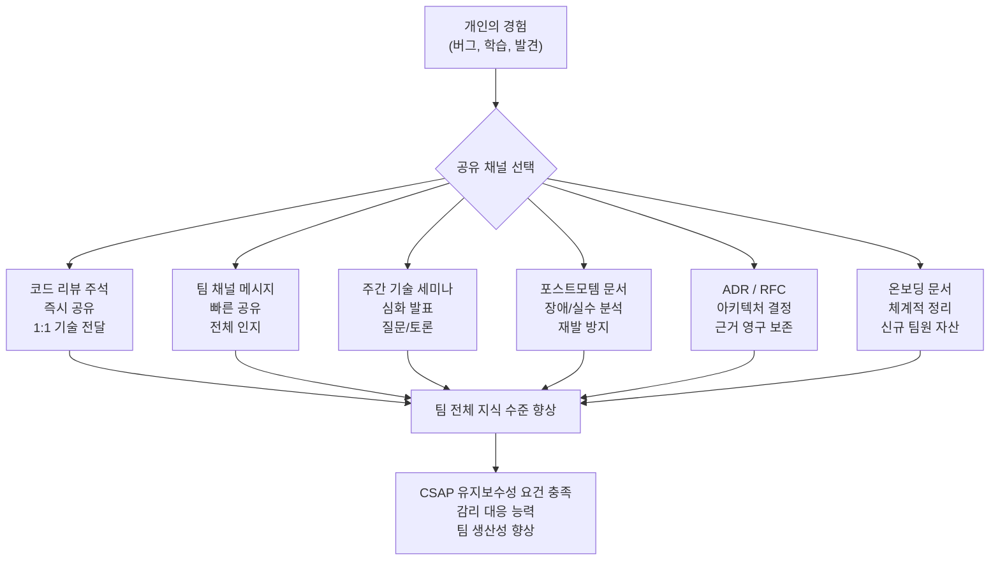
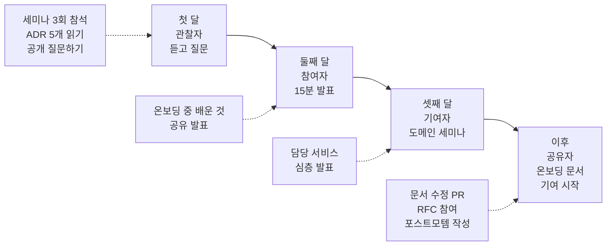

# 팀 기술 공유 문화 — 스터디, 포스트모템, RFC, ADR 작성법

> **문서 ID**: ONBOARD-01-08
> **버전**: 1.0.0 | **작성일**: 2026-04-12 | **대상**: 전체 팀원 (신규 입사자 포함)
> **선행 학습**: `01-getting-started/06-team-practices.md`, `02-architecture/06-adr-deep-dive.md`
> **소요 시간**: 약 2~3시간 (숙지)
> **CSAP**: D-06 (침해사고 관리 — 포스트모템), D-12 (시스템 개발 보안 — 지식 분산)

---

## 목차

1. [공공기관 프로젝트에서 기술 공유가 중요한 이유](#1-공공기관-프로젝트에서-기술-공유가-중요한-이유)
2. [기술 공유 채널 종류](#2-기술-공유-채널-종류)
3. [ADR 작성법](#3-adr-작성법)
4. [RFC 프로세스](#4-rfc-프로세스)
5. [포스트모템 작성법](#5-포스트모템-작성법)
6. [신규 입사자의 기술 공유 참여법](#6-신규-입사자의-기술-공유-참여법)
7. [기술 문서 작성 기여](#7-기술-문서-작성-기여)
8. [변경 이력](#8-변경-이력)

---

## 1. 공공기관 프로젝트에서 기술 공유가 중요한 이유

### 1.1 감리 시 지식 집중화 위험

공공기관 SaaS 프로젝트는 행안부 정보시스템 감리를 정기적으로 받습니다. 감리관이 가장 주목하는 위험 중 하나가 **지식 집중화(Knowledge Silo)**입니다.

지식이 한 사람에게 집중되면 다음 문제가 발생합니다.

```
지식 집중화 시나리오:
  개발자 A가 인증 서비스의 JWT 키 관리와 CSAP D-08 준수 방법을 혼자 알고 있습니다.
  → 개발자 A가 갑자기 병가를 냈습니다.
  → 보안 취약점 발견 시 즉시 대응 불가.
  → 감리관: "핵심 기능의 유지보수 체계가 단일 인력에 의존하고 있습니다. 결함."

  결과: CSAP 인증 심사 지연, 감리 결함 기록, 보완 작업 추가 소요
```

감리관은 다음을 직접 질문합니다.

> "이 서비스의 주요 보안 설정은 문서화되어 있습니까?"
> "담당자 부재 시 다른 팀원이 장애에 대응할 수 있습니까?"
> "아키텍처 결정의 근거가 기록되어 있습니까?"

이 질문들에 "예, 다음 문서를 참고하십시오"라고 답할 수 있어야 합니다. 기술 공유 문화는 감리 대응의 핵심 인프라입니다.

### 1.2 팀원 교체에 대비한 지식 분산

공공사업은 계약 기간이 있고, 팀원 교체는 불가피합니다. 특히 다음 상황에서 지식 분산이 없으면 심각한 문제가 발생합니다.

| 상황 | 지식 집중화 시 결과 | 지식 분산 시 결과 |
|------|----------------|--------------|
| 핵심 개발자 퇴사 | 해당 모듈 유지보수 중단 | 문서 보고 2주 만에 파악 가능 |
| 장기 병가 | 버그 수정 불가 | 다른 팀원이 즉시 투입 가능 |
| 팀 확장 | 온보딩에 수개월 소요 | 온보딩 문서로 1~2주 내 생산성 확보 |
| 감리 대응 | 특정인만 답변 가능 | 팀 누구나 감리 질문에 답변 가능 |

### 1.3 CSAP 유지보수성 요건

CSAP D-12 항목 중 시스템 개발 보안에는 **지식 관리와 인수인계**에 관한 요건이 포함됩니다. 구체적으로 다음을 요구합니다.

- 개발 표준 및 절차 문서화
- 아키텍처 결정 근거 기록
- 운영 절차서(Runbook) 유지
- 취약점 대응 이력 관리

이 요건들은 기술 공유 문화 없이는 충족하기 어렵습니다. 기술 공유는 단순히 "좋은 문화"가 아니라 **CSAP 인증 유지를 위한 필수 요건**입니다.

---

## 2. 기술 공유 채널 종류

### 2.1 주간 기술 세미나

매주 금요일 오후 4:00~5:00, 1시간 동안 진행합니다.

**형식**:

```
발표 형식 (45분 발표 + 15분 질문):
  - 발표자 1명 (돌아가며 담당)
  - 슬라이드 또는 코드 데모
  - 질문/토론 15분

토론 형식 (주제 없는 자유 토론):
  - 2주에 1회
  - "요즘 팀에서 고민하는 것" 자유롭게 공유
  - 결론을 내야 하는 자리가 아님

핵심 원칙:
  - 발표는 준비 부담을 낮게 유지 (완벽할 필요 없음)
  - "이번 주에 새로 알게 된 것" 수준으로도 충분
  - 발표 자료는 Gitea에 올려 참석 못한 팀원도 볼 수 있게 함
```

**추천 발표 주제**:

```
- 새로 도입한 기술이나 패턴의 소개
- 작업 중 만난 어려운 버그와 해결 과정
- CSAP/N2SF 요건 중 처음 알게 된 것
- 이 프로젝트에서 ADR이 결정된 배경 (ADR 설명)
- 성능 최적화 사례
- 보안 취약점 발견 및 수정 과정 (포스트모템 발표)
```

### 2.2 코드 리뷰 주석 활용

코드 리뷰는 단순히 버그를 찾는 자리가 아닙니다. 가장 효율적인 1:1 기술 공유 채널입니다.

```
코드 리뷰에서 기술을 공유하는 방법:

리뷰어 측:
  1. 코드가 올바른지 확인하는 것 외에도,
     이 코드와 관련된 맥락이나 더 나은 방법이 있으면 공유합니다.

  예시:
  "[Suggestion] 이 패턴을 Branded Type으로 표현하면
   컴파일 타임에 userId/tenantId 혼용을 방지할 수 있습니다.
   참고: docs/guides/onboarding/03-development/22-typescript-advanced.md §2.5"

  "[Info] 이 마이그레이션은 Expand-Contract 패턴을 따르지 않습니다.
   프로덕션 롤링 업데이트 중 구버전 Pod에서 에러가 발생할 수 있습니다.
   참고: docs/guides/onboarding/03-development/21-prisma-migration-strategy.md §2"

작성자 측:
  1. 리뷰 댓글을 학습 자료로 활용합니다.
  2. 이해가 안 되면 반드시 질문합니다.
  3. 같은 이슈가 반복된다면 팀 세미나에서 공유합니다.
```

### 2.3 포스트모템 공유

장애나 중요한 실수가 발생하면 **포스트모템(사후 검토)**을 작성하고 팀과 공유합니다. 이 과정이 가장 강력한 기술 공유 방법 중 하나입니다.

자세한 포스트모템 작성법은 섹션 5에서 다룹니다.

### 2.4 Wiki/문서 업데이트 문화

기술을 배웠을 때 혼자 알고 있지 말고, 관련 문서를 업데이트합니다.

```
문서 업데이트가 필요한 상황:
  - 문서에 오류를 발견했을 때 → 즉시 수정 PR
  - 문서에 없는 내용을 새로 배웠을 때 → 해당 문서에 추가
  - 환경 설정이나 명령어가 변경되었을 때 → 관련 가이드 업데이트
  - 새로운 패턴이나 도구를 도입했을 때 → 온보딩 문서에 추가

원칙: "문서가 없으면 존재하지 않는 것이다"
  개인의 머릿속에만 있는 지식은 팀의 자산이 아닙니다.
```

### 2.5 지식 공유 생태계



---

## 3. ADR 작성법

### 3.1 ADR이란 무엇인가

ADR(Architecture Decision Record)은 아키텍처 결정을 기록하는 문서입니다. `02-architecture/06-adr-deep-dive.md`에서 기존 ADR들을 분석했습니다. 이 섹션에서는 **직접 ADR을 작성하는 방법**을 다룹니다.

ADR은 다음 질문에 답합니다.

> 나중에 합류한 팀원이 "왜 이 기술을 선택했나요?"라고 물었을 때, 당신이 없어도 문서가 답할 수 있습니까?

### 3.2 ADR 작성 트리거 — 언제 써야 하는가

모든 기술 결정에 ADR을 쓸 필요는 없습니다. 다음 기준을 따릅니다.

**ADR을 작성해야 하는 경우**:

```
✅ 새로운 기술/도구/라이브러리 도입
   예: "Redis 대신 PostgreSQL LISTEN/NOTIFY를 사용하기로 했다"

✅ 기존 패턴을 변경하는 결정
   예: "Repository 패턴 대신 핸들러에서 직접 Prisma를 사용하기로 했다"

✅ 여러 대안이 있었고 하나를 선택한 경우
   예: "인증을 JWT가 아닌 세션 쿠키로 구현하는 것을 검토했지만 JWT를 선택했다"

✅ 규제나 보안 요건으로 인한 제약 결정
   예: "N2SF 요건으로 인해 외부 클라우드 스토리지 사용 불가"

✅ 팀에서 장시간 논의한 끝에 내린 결정
   예: "멀티테넌시를 행 수준 격리로 구현하기로 했다"
```

**ADR을 쓰지 않아도 되는 경우**:

```
❌ 명백히 자명한 선택
   예: "TypeScript를 사용한다" (이미 코드베이스에서 자명)

❌ 쉽게 되돌릴 수 있는 사소한 결정
   예: "변수명을 user로 할지 currentUser로 할지"

❌ 이미 다른 ADR에서 다룬 내용의 세부 사항
   예: "JWT를 선택한 이유" (ADR-008에 이미 있음)
```

### 3.3 이 프로젝트의 ADR 형식

새 ADR은 다음 템플릿을 사용합니다. 파일 위치: `docs/02-design/adr/ADR-{번호}-{제목}.md`

```markdown
# ADR-{번호}: {제목}

> **상태**: {제안됨 | 승인됨 | 거부됨 | 폐기됨 | 대체됨}
> **작성자**: {이름}
> **작성일**: {날짜}
> **대체 관계**: {이 ADR이 대체하는 ADR 번호, 없으면 생략}

---

## 맥락 (Context)

이 결정이 필요하게 된 배경을 설명합니다.
외부 제약(규제, 성능, 비용 등)을 포함합니다.
어떤 문제를 해결하려고 하는지 명확히 합니다.

## 결정 (Decision)

무엇을 선택했는지 한 문장으로 명확히 씁니다.
"우리는 X를 사용하여 Y 문제를 해결하기로 했다."

## 검토한 대안 (Alternatives Considered)

### 대안 1: {이름}
**장점**: ...
**단점**: ...
**기각 이유**: ...

### 대안 2: {이름}
**장점**: ...
**단점**: ...
**기각 이유**: ...

## 결과 (Consequences)

### 긍정적 결과
- ...

### 부정적 결과 / 트레이드오프
- ...

### 수용 기준 (Acceptance Criteria)
이 결정이 올바르게 구현되었는지 확인하는 방법:
- [ ] ...

## 변경 이력

| 버전 | 일자 | 변경 내용 |
|------|------|---------|
| 1.0.0 | YYYY-MM-DD | 초안 |
```

### 3.4 ADR 작성 실전 가이드 — 단계별

**단계 1: 문제 상황 파악 (5분)**

ADR을 쓰기 전에 "내가 해결하려는 문제가 무엇인가?"를 명확히 합니다.

```
나쁜 시작:
  "Redis를 도입해야 합니다."
  → 해결책부터 시작함. 왜 필요한지 불명확.

좋은 시작:
  "현재 구독 만료 알림을 크론잡으로 처리하는데,
   k3s 멀티 노드 환경에서 중복 실행 문제가 발생합니다.
   분산 잠금(Distributed Lock)이 필요합니다."
  → 문제가 명확함.
```

**단계 2: 대안 목록 작성 (10분)**

선택지를 최소 2개, 이상적으로는 3개 이상 나열합니다.

```
분산 잠금 대안:
  A. Redis SETNX를 이용한 잠금
  B. PostgreSQL Advisory Lock
  C. 잠금 없이 크론잡 단일 노드 고정 (k3s nodeSelector)
  D. 분산 스케줄러(BullMQ) 도입
```

**단계 3: 각 대안의 장단점 분석 (15분)**

이 프로젝트의 제약 조건을 반드시 반영합니다.

```
중요한 제약 조건:
  - 외부 클라우드 서비스 사용 불가 (N2SF)
  - 이미 Redis가 인프라에 포함됨 (ADR-008)
  - CSAP D-06 감사 요건 (모든 작업 로깅)
  - k3s 온프레미스 환경
```

**단계 4: 결정 및 근거 작성 (10분)**

다음 문장 형식을 사용합니다.

> "우리는 [X]를 선택한다. 왜냐하면 [Y] 때문이다. [Z] 대안을 선택하지 않은 이유는 [이유]이다."

**단계 5: 팀 리뷰 요청**

ADR은 PR로 제출합니다. 리뷰어는 최소 1명 이상이어야 합니다.

```
PR 제목 형식: "docs(adr): ADR-{번호} {제목} 결정"
리뷰 기한: 3 영업일 이내
승인 필요: 팀 리드 또는 아키텍트
```

### 3.5 나쁜 ADR vs 좋은 ADR 비교

**나쁜 ADR 예시**:

```markdown
# ADR-999: Redis 사용

Redis를 사용하기로 했다. 빠르기 때문이다.
다른 대안은 검토하지 않았다.
```

이 ADR의 문제점:
- 맥락 없음 (어떤 문제를 해결하려 했는가?)
- 대안 검토 없음
- "빠르기 때문"은 이유가 될 수 없음 (무엇보다 빠른가?)
- 트레이드오프 언급 없음

**좋은 ADR 예시 (ADR-008 참고 형식)**:

```markdown
# ADR-008: Redis Pub/Sub 선택 (단순성)

> **상태**: 승인됨
> **작성일**: 2026-02-15

## 맥락

서비스 간 비동기 이벤트 전달이 필요하다.
subscription.created 이벤트를 billing-service와 notification-service가 받아야 한다.
이미 Redis가 캐시와 세션 저장용으로 인프라에 포함되어 있다.

## 결정

Redis Pub/Sub를 이벤트 버스로 사용한다.
Kafka나 RabbitMQ를 별도 도입하지 않는다.

## 검토한 대안

### 대안 A: Kafka
**장점**: 높은 처리량, 메시지 영속성, 컨슈머 그룹
**단점**: 별도 클러스터 운영 필요. 현재 이벤트 볼륨(초당 100건 미만)에 과도함.
**기각 이유**: 운영 복잡성 대비 이점 없음.

### 대안 B: PostgreSQL LISTEN/NOTIFY
**장점**: 추가 인프라 불필요
**단점**: 대기 연결 수에 비례한 DB 부하
**기각 이유**: DB 연결 풀 부족 우려.

## 결과

긍정적: Redis 단일 관리, 빠른 구현, 낮은 운영 비용
부정적: 메시지 영속성 없음 (서버 재시작 시 미전달 메시지 손실 가능)
완화: 중요 이벤트는 DB에 outbox 패턴 적용 (우선순위 낮음)
```

---

## 4. RFC 프로세스

### 4.1 RFC vs ADR 차이

RFC(Request for Comments)와 ADR은 모두 기술 결정 문서이지만 목적이 다릅니다.

| 항목 | ADR | RFC |
|------|-----|-----|
| 목적 | 이미 내린 결정을 기록 | 결정하기 전에 의견 수렴 |
| 시점 | 결정 후 | 결정 전 |
| 형식 | 과거형 ("선택했다") | 제안형 ("제안합니다") |
| 적합한 상황 | 아키텍처 선택 결과 기록 | 큰 변경, 여러 팀 영향 |
| 승인 방식 | 팀 리뷰 후 머지 | 토론 기간 후 합의 |

**언제 RFC를 쓰는가**:

```
RFC가 필요한 상황:
  - 다른 팀(DevOps, 기획) 의견이 필요한 큰 기술 변경
  - 기존 결정(ADR)을 뒤집는 변경 제안
  - 새로운 서비스나 모듈 추가
  - API 하위 호환성에 영향을 미치는 변경
  - 팀에서 합의가 필요한 개발 프로세스 변경

RFC가 필요하지 않은 상황:
  - 기존 ADR에 따른 구현
  - 버그 수정
  - 성능 개선 (동일 기능 유지)
  - 리팩토링 (외부 인터페이스 변경 없음)
```

### 4.2 RFC 작성 단계

**단계 1: RFC 제안 (Draft 상태)**

파일 위치: `docs/02-design/rfc/RFC-{번호}-{제목}.md`

RFC 상태는 순서대로 변경됩니다.

```
Draft → Review → Accepted / Rejected → Implemented (Accepted인 경우)
```

**단계 2: 리뷰 기간 공지**

```
팀 채널 공지 예시:
  [RFC] RFC-042: AI Gateway 캐싱 전략 제안 — 리뷰 요청

  AI API 비용 최적화를 위한 응답 캐싱 전략 RFC를 작성했습니다.
  관련 파일: docs/02-design/rfc/RFC-042-ai-gateway-caching.md

  리뷰 기간: 2026-04-12 ~ 2026-04-19 (1주일)
  결정 필요 사항: 캐시 TTL 기준, 무효화 전략

  의견 있으신 분은 PR #234에 댓글로 남겨주세요.
```

**단계 3: 의견 수렴 및 수정**

리뷰 기간 동안 팀원들이 PR 댓글로 의견을 남깁니다. RFC 작성자는 의견을 반영하여 문서를 수정합니다.

**단계 4: 결정**

팀 리뷰 미팅에서 최종 결정합니다. RFC가 수락되면 상태를 Accepted로 변경하고, 관련 ADR을 작성합니다.

### 4.3 RFC 템플릿

```markdown
# RFC-{번호}: {제목}

> **상태**: Draft
> **작성자**: {이름}
> **작성일**: {날짜}
> **리뷰 마감**: {날짜}

---

## 요약

이 RFC가 제안하는 내용을 2~3문장으로 요약합니다.

## 동기 (Motivation)

현재 어떤 문제가 있는지, 왜 변경이 필요한지 설명합니다.
현재 상태의 단점을 구체적으로 서술합니다.

## 상세 설계 (Detailed Design)

변경 내용을 상세히 설명합니다.
다이어그램, 코드 예시를 포함하면 좋습니다.

### 영향 범위

| 구성 요소 | 영향 수준 | 설명 |
|---------|---------|------|
| auth-service | 낮음 | 인터페이스 변경 없음 |
| tenant-service | 높음 | 주요 로직 변경 |

## 단점 / 미해결 질문

이 제안의 단점이나 아직 결정하지 못한 사항을 솔직하게 기술합니다.
이 부분을 숨기지 말고 팀 토론 주제로 명시합니다.

## 대안 (Alternatives)

검토한 다른 접근법과 기각 이유를 간략히 서술합니다.

## 감사 (Acknowledgments)

이 RFC 작성에 도움을 준 팀원을 기록합니다.

## 변경 이력

| 버전 | 일자 | 내용 |
|------|------|------|
| 0.1.0 | {날짜} | 초안 |
```

### 4.4 공공기관 맥락에서의 RFC

RFC는 단순히 기술 토론 문서가 아닙니다. 공공기관 감리 맥락에서 RFC는 다음 역할을 합니다.

```
감리 산출물로서의 RFC:
  감리관: "이 아키텍처 변경을 왜 진행했습니까?"
  담당자: "RFC-042를 통해 팀 전체의 의견을 수렴하고 승인받았습니다.
           리뷰 기간 동안 3명의 팀원이 의견을 제시했고,
           ADR-015로 결정이 공식 기록되었습니다."

  → 결정의 투명성과 거버넌스를 입증할 수 있음
  → 감리관 만족: "적절한 절차를 거쳐 결정되었습니다."
```

---

## 5. 포스트모템 작성법

### 5.1 Blame-free 문화

포스트모템의 핵심 원칙은 **책임 추궁이 아닌 시스템 개선**입니다. 장애는 시스템의 문제이지, 개인의 잘못이 아닙니다.

```
잘못된 포스트모템 문화:
  "개발자 A가 잘못된 마이그레이션을 실행했기 때문에 장애가 발생했습니다."
  → 이 결론은 아무것도 개선하지 않습니다.
  → 다음번에도 같은 일이 발생합니다.
  → 팀원이 실수를 숨기게 됩니다.

올바른 포스트모템 문화:
  "마이그레이션 실행 전 스테이징 검증이 의무화되지 않았습니다.
   실행 절차서가 없었고, 롤백 방법이 문서화되지 않았습니다."
  → 시스템과 프로세스의 문제를 식별합니다.
  → 구체적인 개선 방향이 나옵니다.
  → 팀원이 다음번에도 솔직하게 보고할 수 있습니다.
```

포스트모템을 읽었을 때 특정 개인을 비난하는 내용이 있다면 그 포스트모템은 실패입니다.

### 5.2 포스트모템 작성 트리거

모든 사건을 포스트모템으로 작성할 필요는 없습니다.

```
포스트모템 작성 필수:
  - 프로덕션 서비스 1분 이상 중단 (SLA 영향)
  - 데이터 손실 또는 변조 발생
  - 보안 사고 (미인가 접근, 취약점 악용)
  - CSAP 감사 요건 위반 발생

포스트모템 작성 권장:
  - 스테이징 장애 (프로덕션 영향 없지만 재발 우려)
  - 아직 미치지 않은 잠재적 장애 발견 (Near Miss)
  - 배포가 예상보다 크게 오래 걸린 경우

포스트모템 불필요:
  - 개인 개발 환경 오류
  - 이미 알려진 문제의 반복 (별도 이슈로 관리)
```

### 5.3 포스트모템 구조

**완성된 포스트모템 예시**:

```markdown
# 포스트모템: 구독 서비스 마이그레이션 장애

> **날짜**: 2026-04-05
> **심각도**: P1 (서비스 중단)
> **영향 범위**: subscription-service 30분 중단
> **작성자**: 팀 전체 (blame-free)

---

## 요약

2026-04-05 오후 2시 30분, subscription 테이블에 NOT NULL 컬럼을 추가하는
마이그레이션이 스테이징 검증 없이 프로덕션에 직접 실행되었습니다.
기존 데이터에 기본값이 없어 마이그레이션이 실패했고,
Prisma 연결 풀이 모두 에러 상태가 되어 서비스가 30분간 중단되었습니다.

**감지**: 오후 2:32 (Prometheus 알림)
**해결**: 오후 3:02 (30분 소요)
**영향**: 구독 조회/생성 완전 불가

---

## 타임라인

| 시각 | 이벤트 |
|------|-------|
| 14:28 | 개발자가 프로덕션에서 `prisma migrate deploy` 실행 |
| 14:30 | 마이그레이션 실패 (null constraint violation) |
| 14:32 | Prometheus 알림 발송 (에러율 100%) |
| 14:35 | 대기 중이던 팀원이 알림 확인, 채널 공유 |
| 14:40 | 원인 특정: 마이그레이션 실패로 Prisma 연결 불안정 |
| 14:50 | 마이그레이션 롤백 (ALTER TABLE DROP COLUMN) |
| 15:00 | 서비스 재시작 |
| 15:02 | 서비스 정상 복구 확인 |

---

## 근본 원인 분석 (Root Cause Analysis)

**즉각적 원인**: NOT NULL 컬럼을 기존 데이터에 기본값 없이 추가하려 했음.

**시스템적 원인** (5 Why):
  1. 왜 마이그레이션이 실패했는가?
     → NOT NULL 컬럼인데 기존 행에 기본값이 없었음.

  2. 왜 기본값 없이 추가하려 했는가?
     → 로컬에서는 테이블이 비어 있어서 실패하지 않았음.

  3. 왜 스테이징에서 검증하지 않았는가?
     → 스테이징 검증이 의무 절차로 명시되어 있지 않았음.

  4. 왜 의무 절차가 없었는가?
     → 마이그레이션 실행 표준 절차서가 존재하지 않았음.

  5. 왜 절차서가 없었는가?
     → 이전까지 프로덕션 마이그레이션 실패 경험이 없어 필요성을 인식하지 못했음.

**결론**: 개인의 실수가 아니라 스테이징 검증 의무화 부재, 절차서 부재라는 **시스템 문제**.

---

## 액션 아이템

| 항목 | 담당자 | 기한 | 상태 |
|------|--------|------|------|
| 마이그레이션 전략 온보딩 문서 작성 | 홍길동 | 2026-04-12 | 완료 |
| CI/CD에 스테이징 마이그레이션 자동화 | 이순신 | 2026-04-15 | 진행 중 |
| 마이그레이션 체크리스트 작성 및 PR 템플릿 추가 | 김철수 | 2026-04-10 | 완료 |
| Prisma 마이그레이션 가이드 온보딩 문서에 포함 | 홍길동 | 2026-04-12 | 완료 |

---

## 잘된 점

- 알림이 2분 내에 발송되어 빠른 감지가 가능했음.
- 팀원이 즉시 채널에 공유하여 혼자 해결하려 하지 않았음.
- 롤백 경로가 명확해서 (DROP COLUMN) 복구가 빠르게 진행되었음.

---

## 배운 점

마이그레이션은 로컬 환경에서 성공해도 프로덕션에서 실패할 수 있습니다.
테이블이 비어 있는 환경과 수십만 건이 있는 환경은 다릅니다.
이 사실을 팀 전체가 공유하고, 절차서를 통해 재발을 방지합니다.
```

### 5.4 CSAP D-06과 포스트모템의 관계

CSAP D-06 항목은 **침해사고 관리**를 요구합니다. 보안 관련 사고의 경우, 포스트모템은 CSAP D-06 요건을 충족하는 공식 인시던트 보고서로 활용됩니다.

```
CSAP D-06 포스트모템 추가 요건 (보안 사고의 경우):

1. 사고 분류: "정보보안 침해사고 여부" 명시
2. 영향 데이터 분류: 손상/유출 데이터의 N2SF 등급 기록
3. 외부 신고 여부: 개인정보 유출 시 72시간 이내 신고 의무 기록
4. 재발 방지: 기술적 통제 + 관리적 통제 모두 포함

감사 로그와의 연계:
  포스트모템 작성 시 .claude/audit.jsonl의 관련 로그를 첨부합니다.
  감리 시 "사고와 감사 로그의 연계"를 확인합니다.
```

---

## 6. 신규 입사자의 기술 공유 참여법

### 6.1 첫 달: 관찰자로 참여

첫 달에는 발표보다 **듣고 배우는 것**이 목표입니다. 팀의 공유 문화를 먼저 파악합니다.

```
첫 달 체크리스트:
  [ ] 주간 기술 세미나 3회 이상 참석 (청중으로)
  [ ] 포스트모템 문서 2개 이상 읽기
  [ ] ADR 5개 이상 읽기 (adr-deep-dive.md 선행 학습 완료 후)
  [ ] 코드 리뷰 댓글 10개 이상 읽기 (댓글 모드로)
  [ ] 동료에게 "이 결정을 왜 했나요?" 질문 3회 이상
  [ ] 온보딩 중 궁금한 점을 팀 채널에 공개 질문 (다음 사람에게도 도움이 됨)
```

**왜 공개 질문이 중요한가**:

```
나쁜 패턴:
  신규 팀원 → DM으로 개인에게 질문 → 개인이 답변
  → 답변이 그 두 사람만 알게 됨

좋은 패턴:
  신규 팀원 → 팀 채널에 질문 → 팀원이 답변
  → 답변이 팀 전체 지식이 됨
  → 나중에 합류하는 팀원도 채널 히스토리에서 찾을 수 있음
  → 반복되는 질문이면 온보딩 문서에 추가 가능
```

### 6.2 둘째 달: 짧은 발표 1회

첫 세미나 발표의 허들을 낮추기 위해, 두 번째 달에는 **15분짜리 짧은 발표**를 1회 진행합니다.

주제 선택 기준:

```
좋은 첫 발표 주제:
  ✅ "온보딩하면서 처음에 이해가 어려웠던 개념 X를 이렇게 이해했습니다"
     → 다음 신규 팀원에게 도움이 됨

  ✅ "이번 주 작업하면서 TypeScript에서 이런 패턴을 발견했습니다"
     → 개인 학습 내용을 공유

  ✅ "ADR-005를 읽으면서 궁금했던 점과 확인한 내용입니다"
     → 문서 읽기 후 후기

피해야 할 첫 발표 주제:
  ❌ "전 회사에서는 이렇게 했는데 이 프로젝트는..."
     → 맥락 없는 비교는 오해를 낳을 수 있음
  ❌ "이 기술 스택이 잘못됐고 바꿔야 합니다"
     → ADR을 먼저 읽고 이유를 이해한 뒤 논의
```

### 6.3 셋째 달: 담당 도메인 세미나

세 번째 달부터는 본인이 담당하는 서비스나 기능에 대한 **30~45분짜리 심층 발표**를 1회 진행합니다.

```
세미나 제안서 형식 (발표 1주일 전에 제출):

제목: "{담당 서비스} 심층 분석: 구조, 주요 패턴, 운영 주의사항"

내용:
  1. 서비스 개요 및 담당 범위 (5분)
  2. 핵심 코드 구조 walk-through (15분)
  3. 팀이 알아야 할 운영 주의사항 (10분)
  4. 질문/토론 (15분)

목표:
  - 담당자 부재 시 다른 팀원이 이 서비스를 다룰 수 있을 것
  - 지식 집중화 해소
```

### 6.4 신규 멤버 성장 경로



### 6.5 질문을 두려워하지 않는 문화

이 팀에서 "질문이 너무 기초적인 것 같아 물어보기 창피하다"는 생각은 버립니다.

**이 팀의 질문 원칙**:

```
1. 모르는 것을 아는 척하는 것이 진짜 문제입니다.
   아는 척으로 만든 코드는 나중에 팀 전체의 시간을 낭비합니다.

2. 기초적인 질문일수록 공개 채널에 올립니다.
   같은 의문을 가진 사람이 반드시 있기 때문입니다.

3. "당연히 알아야 하는 건데..."라는 말은 이 팀에 없습니다.
   "당연히 알아야 하는 것"이 있다면 문서에 있어야 합니다.
   문서에 없으면 문서의 문제입니다.

4. 질문 후에는 답변을 문서화합니다.
   "다음에 합류하는 사람을 위해 온보딩 문서에 추가해도 될까요?"라고 물어보십시오.
```

---

## 7. 기술 문서 작성 기여

### 7.1 이 온보딩 문서에 기여하는 방법

이 파일을 포함한 온보딩 문서는 팀 전체가 함께 만들어가는 살아있는 문서입니다.

**기여 방법**:

```bash
# 1. 수정할 문서 파일을 찾습니다.
ls /data/ai-saas/docs/guides/onboarding/

# 2. 브랜치 생성
git checkout -b docs/onboarding-fix-prisma-typo

# 3. 문서 수정
# 편집기로 해당 파일 열기

# 4. PR 제출
git add docs/guides/onboarding/...
git commit -m "docs(onboarding): Prisma 마이그레이션 가이드 오타 수정"
git push origin docs/onboarding-fix-prisma-typo
# Gitea에서 PR 생성
```

**기여 규모별 기준**:

| 기여 규모 | 설명 | 리뷰어 | 예시 |
|---------|------|--------|------|
| 사소한 수정 | 오타, 링크 수정 | 1명 | "migrate" → "migration" |
| 내용 추가 | 새 예시 코드, 설명 보완 | 1명 + 담당자 | 코드 예시 추가 |
| 새 문서 작성 | 새 가이드 파일 | 팀 리드 + 1명 | 이 파일처럼 |
| 구조 변경 | 목차/파일 구조 재편 | 팀 전체 합의 | 새 섹션 추가 |

### 7.2 오류 발견 시 즉시 수정 권장

문서에서 오류를 발견했을 때 "나중에 누군가 수정하겠지"라는 생각은 하지 않습니다.

```
올바른 행동:
  1. 오류 발견 → 즉시 PR 작성 → 설명 한 줄 포함
  2. PR 제목: "docs(onboarding): {파일명} 오류 수정"
  3. 큰 변경이 아니면 셀프 머지도 가능 (소소한 오타 수정)

틀린 내용을 방치하는 것의 위험:
  - 다음 신규 팀원이 틀린 정보로 시간을 낭비함
  - 실제 코드에 잘못된 방법이 적용될 수 있음
  - "이 문서는 신뢰할 수 없다"는 인식이 생겨 문서가 방치됨
```

### 7.3 문서 품질 리뷰 기준

온보딩 문서의 PR 리뷰어는 다음 기준을 적용합니다.

```
1. 정확성 (Accuracy)
   - 코드 예시가 실제 동작하는가?
   - 명령어가 현재 환경에서 유효한가?
   - 경로/파일명이 실제와 일치하는가?

2. 완전성 (Completeness)
   - 설명 없이 갑자기 나오는 개념이 있는가?
   - 선행 학습 링크가 제공되어 있는가?

3. 명확성 (Clarity)
   - 초급자가 이해할 수 있는 수준으로 설명되어 있는가?
   - 전문 용어 사용 시 설명이 포함되어 있는가?

4. CSAP 연관성
   - 보안 관련 내용에 CSAP 항목이 명시되어 있는가?
   - 잘못 따라하면 보안 위반이 될 수 있는 내용에 경고가 있는가?

5. 유지보수성
   - 6개월 후에도 유효한 내용인가?
   - 변경될 가능성이 있는 내용은 날짜/버전이 명시되어 있는가?
```

---

## 8. 변경 이력

| 버전 | 일자 | 내용 | 작성자 |
|------|------|------|--------|
| 1.0.0 | 2026-04-12 | 초안 작성 — 기술 공유 채널, ADR/RFC/포스트모템 작성법, 신규 입사자 성장 경로 포함 | Implementer (Sonnet) |
