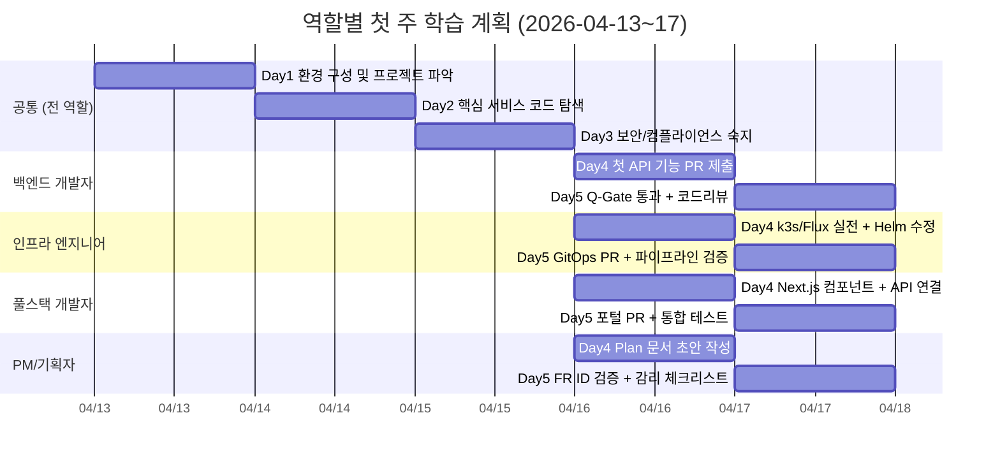
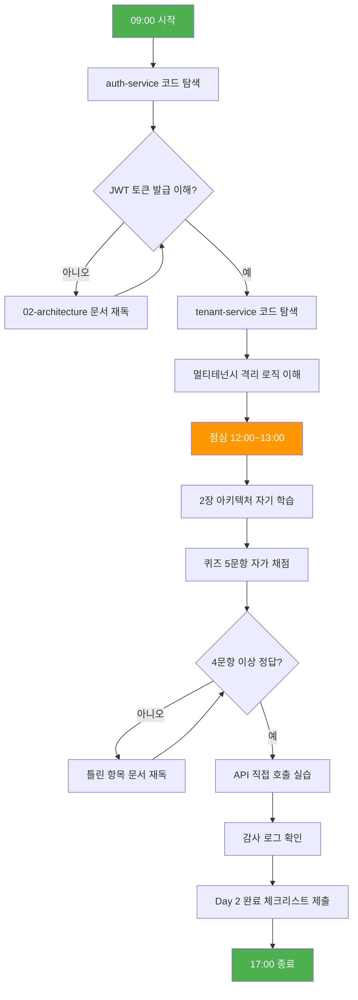
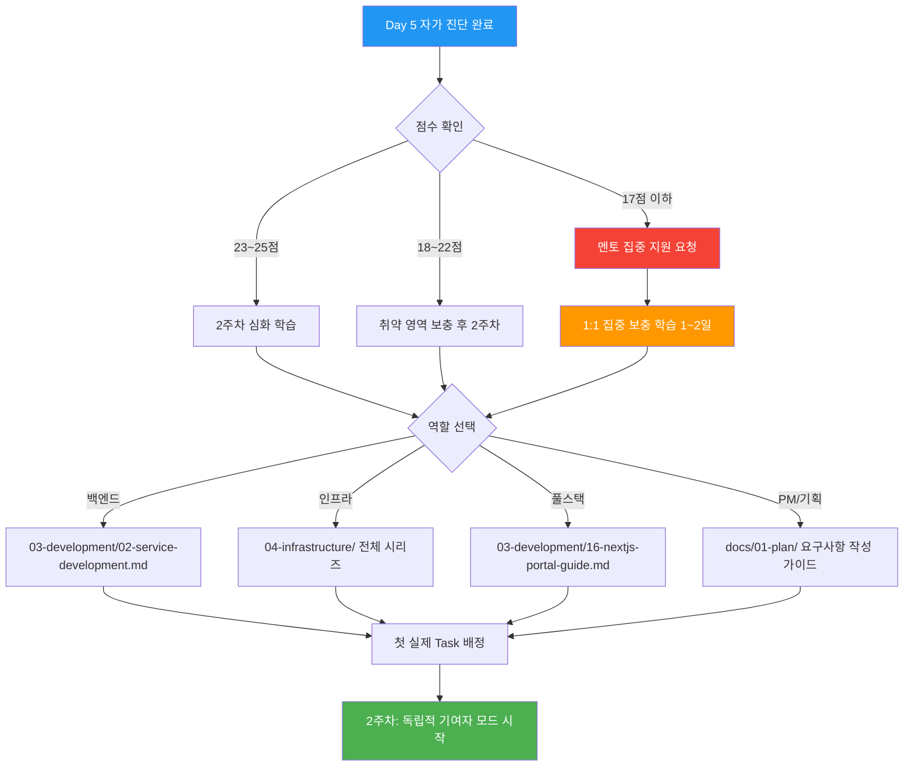

# 첫 주 완전 가이드 — Day 1~5 시간표 + 체크리스트 + 성공 기준

> **문서 ID**: ONBOARD-WEEK1-09
> **버전**: 1.0.0 | **작성일**: 2026-04-13 | **작성자**: Implementer (Sonnet)
> **목적**: 신규 팀원이 첫 주를 체계적으로 완료하고 독립적인 기여자로 성장하도록 안내
> **선행 학습**: `08-knowledge-sharing.md` → 본 문서 → `03-development/` 시리즈

---

## 목차

1. [첫 주 전체 개요](#1-첫-주-전체-개요)
2. [Day 1: 환경 구성 및 프로젝트 파악](#2-day-1-환경-구성-및-프로젝트-파악)
3. [Day 2: 핵심 서비스 이해](#3-day-2-핵심-서비스-이해)
4. [Day 3: 보안 및 컴플라이언스 필수 숙지](#4-day-3-보안-및-컴플라이언스-필수-숙지)
5. [Day 4: 개발 워크플로우 실전](#5-day-4-개발-워크플로우-실전)
6. [Day 5: 종합 점검 및 팀 통합](#6-day-5-종합-점검-및-팀-통합)
7. [역할별 심화 경로](#7-역할별-심화-경로)
8. [변경 이력](#변경-이력)

---

## 1. 첫 주 전체 개요

### 1.1 왜 이 가이드가 필요한가

공공기관 SaaS 프레임워크는 일반 상업용 SaaS와 다릅니다. CSAP 79개 통제항목, N2SF 데이터 분류 체계, 행안부 감리기준이 코드 한 줄 한 줄에 반영되어 있습니다. 처음 합류한 팀원이 이 환경에 적응하지 못하면 감리 결함을 유발하는 코드를 작성하게 됩니다.

이 가이드는 첫 주를 구조화하여 "모르는 것이 당연한 상태"에서 "독립적으로 PR을 올릴 수 있는 상태"로 전환하는 로드맵입니다. 역할(백엔드/인프라/풀스택/PM)에 따라 강조점이 다르지만, Day 1~3의 공통 기반은 모든 역할에 필수입니다.

### 1.2 역할별 첫 주 목표 요약

| 역할 | Day 1~2 공통 목표 | Day 3~5 역할 목표 | 주요 산출물 |
|------|-----------------|-----------------|----------|
| 백엔드 개발자 | 환경 구성 + auth-service 실행 | API 엔드포인트 추가 + 보안 검증 | 첫 기능 PR (merged) |
| 인프라 엔지니어 | 환경 구성 + k3s 클러스터 확인 | Helm Chart 수정 + Flux GitOps 이해 | HelmRelease 변경 PR |
| 풀스택 개발자 | 환경 구성 + 포털 앱 실행 | Next.js 컴포넌트 추가 + API 연결 | 페이지 컴포넌트 PR |
| PM/기획자 | 환경 구성 + 문서 구조 파악 | Plan 문서 작성 + FR ID 체계 숙지 | 요구사항 Plan 문서 |

### 1.3 역할별 Day 1~5 학습 계획 (Gantt)



### 1.4 첫 주 완료 기준 (종합)

아래 모든 항목을 체크해야 첫 주가 공식 완료됩니다.

- [ ] 개발 환경: 계정 5종 발급 완료 (GitHub/Gitea/Vault/Grafana/Slack)
- [ ] 빌드: `pnpm install && pnpm build` 오류 없음
- [ ] 서비스: `pnpm dev` 후 auth-service 헬스체크 응답 200
- [ ] 보안: CSAP D-08/D-09/D-12/N2SF N-05 규칙 숙지 확인
- [ ] 워크플로우: 피처 브랜치 생성 + 커밋 + PR 제출 경험
- [ ] 리뷰: 기존 PR 1건 이상 코드 리뷰 댓글 작성
- [ ] 회고: WWW 형식 첫 주 회고 문서 제출

---

## 2. Day 1: 환경 구성 및 프로젝트 파악

> 오늘의 목표: 개발 환경을 완전히 구성하고, 프로젝트의 전체 구조를 파악합니다.
> 코드를 완벽히 이해하려 하지 마십시오. 지형을 파악하는 날입니다.

### 2.1 09:00~10:00 — 계정 발급 체크리스트

첫 날 가장 먼저 해야 할 일은 모든 시스템 접근 권한을 확보하는 것입니다. 권한 없이는 아무것도 진행할 수 없습니다.

#### 계정 발급 절차

**1단계: 팀 리드에게 입사 메일 확인 요청**

입사 전 HR에서 발송한 초대 메일을 확인합니다. 아래 시스템 초대 메일이 모두 와 있어야 합니다.

**2단계: 계정별 발급 및 검증**

| 시스템 | 접속 주소 | 발급 방법 | 검증 방법 | 담당자 |
|--------|----------|---------|---------|-------|
| GitHub | github.com | HR 초대 메일 링크 | 저장소 접근 확인 | 팀 리드 |
| Gitea (내부 CI) | gitea.내부주소 | 팀 리드에게 요청 | 파이프라인 목록 조회 | DevOps 담당 |
| HashiCorp Vault | vault.내부주소 | 팀 리드에게 요청 | `vault status` 응답 | 보안 담당 |
| Grafana | grafana.내부주소 | 팀 리드에게 요청 | 대시보드 조회 | SRE 담당 |
| Slack | 회사 워크스페이스 | HR 초대 메일 링크 | `#dev-general` 참가 | HR |

**체크리스트 (모두 완료 전 다음 단계 진행 불가)**

```
계정 발급 체크리스트
  □ GitHub 로그인 성공 + ai-saas 저장소 접근 확인
  □ Gitea 로그인 성공 + CI 파이프라인 목록 조회 가능
  □ Vault 로그인 성공 + `vault status` 명령 응답 확인
  □ Grafana 로그인 성공 + 기본 대시보드 1개 이상 조회
  □ Slack 입장 + #dev-general, #incidents, #csap-alerts 채널 참가
  □ SSH 공개키 팀 리드에게 제출 완료
  □ MFA(이중 인증) 모든 시스템에 활성화 완료
```

> 중요: 공공기관 시스템은 MFA 없는 접속이 CSAP D-08 위반입니다. 계정 발급 직후 반드시 MFA를 활성화하십시오.

**Vault 접속 확인 방법**

```bash
# Vault 주소 설정 (팀 리드에게 실제 주소 확인)
export VAULT_ADDR="https://vault.내부주소"
export VAULT_TOKEN="팀리드에게받은토큰"

# 상태 확인
vault status
# 응답 예시:
# Key             Value
# Sealed          false   ← 반드시 false여야 함
# Version         1.13.x

# 개발용 시크릿 조회 테스트
vault kv get secret/dev/db
```

Vault 접속이 실패하면 다음 단계를 진행할 수 없습니다. 즉시 DevOps 담당자에게 문의하십시오.

### 2.2 10:00~12:00 — 저장소 클론 + pnpm install + 서비스 기동

#### 저장소 클론 및 의존성 설치

```bash
# 1. SSH 키 설정 확인
ssh -T git@github.com
# 응답: Hi {username}! You've successfully authenticated.

# 2. 저장소 클론
git clone git@github.com:org/ai-saas.git
cd ai-saas

# 3. Node.js 버전 확인 (22.x 이상 필수)
node --version   # v22.x.x

# 4. pnpm 설치 (없는 경우)
npm install -g pnpm@9

# 5. 의존성 설치 (최초 5~10분 소요)
pnpm install

# 6. 빌드 확인
pnpm build
# 오류 없이 완료되면 성공
```

#### 환경 변수 파일 구성

```bash
# 환경 변수 템플릿 복사 (실제 값은 Vault에서 주입)
cp platform/services/auth-service/.env.example platform/services/auth-service/.env
cp platform/services/ai-service/.env.example platform/services/ai-service/.env

# 중요: .env 파일은 절대 Git에 커밋하지 마십시오 (CSAP 절대 금지)
# .gitignore에 이미 등록되어 있지만, 한 번 더 확인
cat .gitignore | grep ".env"
```

Vault에서 개발 환경 시크릿 자동 주입 스크립트를 사용합니다.

```bash
# Vault에서 개발 환경 시크릿 자동 주입
./scripts/vault-inject-dev.sh

# 스크립트가 없으면 수동으로 조회 후 .env에 설정
vault kv get -format=json secret/dev/auth-service | jq -r '.data.data | to_entries[] | "\(.key)=\(.value)"' > platform/services/auth-service/.env
```

#### 서비스 기동 확인

```bash
# 개발 서버 기동 (전체 서비스)
pnpm dev

# 별도 터미널에서 헬스체크
curl http://localhost:3001/health
# 응답: {"status":"ok","service":"auth-service","version":"1.x.x"}

curl http://localhost:3003/health
# 응답: {"status":"ok","service":"ai-service","version":"1.x.x"}
```

서비스가 기동되지 않을 때 확인 순서:

1. `pnpm install`이 오류 없이 완료되었는가?
2. `.env` 파일에 필수 환경 변수가 모두 있는가?
3. PostgreSQL, Redis가 로컬에서 실행 중인가?
4. 포트 충돌이 없는가? (`lsof -i :3001`)

**포트 번호 참조표**

| 서비스 | 기본 포트 | 헬스체크 경로 |
|--------|---------|------------|
| auth-service | 3001 | GET /health |
| tenant-service | 3002 | GET /health |
| ai-service | 3003 | GET /health |
| compliance-service | 3004 | GET /health |
| portal (Next.js) | 3000 | GET /api/health |

### 2.3 13:00~15:00 — README 및 아키텍처 개요 숙독

오후 첫 2시간은 코드가 아닌 문서를 읽습니다. 전체 구조를 이해하지 않고 코드를 보면 나무만 보고 숲을 못 보게 됩니다.

#### 필수 정독 문서 목록

```
읽는 순서 (이 순서가 중요합니다):

1. /data/ai-saas/README.md                          (10분)
   → 프로젝트 전체 개요, 기술 스택, 빌드 방법

2. docs/guides/onboarding/01-getting-started/00-overview.md  (20분)
   → 온보딩 전체 경로, 이 프로젝트에서 중요한 것

3. docs/guides/onboarding/01-getting-started/00-project-history.md  (15분)
   → 왜 이렇게 만들어졌는가, CSAP 요건이 어떤 결정을 만들었는가

4. docs/guides/onboarding/02-architecture/   (30분)
   → 전체 아키텍처 다이어그램과 서비스 간 관계
```

#### 아키텍처 이해 포인트

프로젝트를 처음 보면 파일이 너무 많아 압도됩니다. 핵심 구조만 파악하면 됩니다.

```
ai-saas/
├── platform/
│   ├── services/          ← 백엔드 마이크로서비스 (가장 중요)
│   │   ├── auth-service/      JWT 인증, RBAC
│   │   ├── tenant-service/    멀티테넌시 관리
│   │   ├── ai-service/        RAG + AI 에이전트
│   │   └── compliance-service/ CSAP 감사 로그
│   ├── apps/
│   │   └── portal/        ← Next.js 관리자 포털
│   └── packages/
│       └── mesh-ready/    ← 서비스메시 공통 유틸
├── packages/              ← 공유 라이브러리 패키지
│   ├── feature-flag-sdk/
│   ├── dora-exporter/
│   └── ml-pipeline/
└── docs/                  ← 모든 문서 (감리 산출물 포함)
```

**왜 이 구조인가**: 각 서비스가 독립적으로 배포되어야 합니다 (k3s 기반 컨테이너 오케스트레이션). 공공기관 SaaS는 테넌트 데이터 격리가 필수이므로 tenant-service가 모든 요청의 관문입니다.

### 2.4 15:00~17:00 — 실습 1 (Hello Service) 완료

첫 날 오후는 실제로 코드를 건드려봅니다. 단, 기존 서비스를 수정하지 않고 `10-exercises/` 폴더의 안전한 실습 환경에서 진행합니다.

#### 실습 1: Hello Service API 추가

이 실습은 Fastify 서버에 간단한 엔드포인트를 추가하는 연습입니다. 실제 서비스 코드를 건드리지 않습니다.

```bash
# 실습 디렉터리로 이동
cd docs/guides/onboarding/10-exercises/

# 실습 파일 확인
ls
# exercise-01-hello-service.md 가이드를 따라 진행
```

**실습 1 목표**: 다음 API 엔드포인트를 구현합니다.

```typescript
// GET /hello?name=홍길동
// 응답: { "message": "안녕하세요, 홍길동님!", "timestamp": "2026-04-13T10:00:00Z" }
```

구현 시 다음 패턴을 반드시 사용해야 합니다 (CSAP D-12 입력 검증).

```typescript
import { z } from 'zod';

// 입력 검증 스키마 (모든 API 입력에 필수)
const helloSchema = z.object({
  name: z.string().min(1).max(50),
});

export async function helloHandler(request, reply) {
  // 입력 검증 실패 시 400 자동 반환
  const { name } = helloSchema.parse(request.query);

  return reply.status(200).send({
    message: `안녕하세요, ${name}님!`,
    timestamp: new Date().toISOString(),
  });
}
```

#### Day 1 완료 기준

아래를 모두 달성해야 Day 1이 완료입니다.

```
Day 1 완료 체크리스트
  □ 5개 시스템 계정 발급 및 MFA 활성화 완료
  □ git clone + pnpm install 오류 없음
  □ pnpm build 오류 없음
  □ auth-service 헬스체크 응답 200 확인 (스크린샷 보관)
  □ 아키텍처 문서 4개 정독 완료
  □ 실습 1 Hello Service 구현 완료 (zod 검증 포함)
```

#### Day 1 제출물

Day 1이 끝나면 팀 리드에게 아래를 Slack 메시지로 보냅니다.

```
[Day 1 완료 보고]
- 계정 발급: 완료 (GitHub, Gitea, Vault, Grafana, Slack)
- 빌드 상태: 성공 (pnpm build 출력 스크린샷 첨부)
- 헬스체크: auth-service 200 OK (스크린샷 첨부)
- 실습 1: 완료 (코드 링크 또는 파일 경로 첨부)
- 질문 사항: (있으면 기재)
```

---

## 3. Day 2: 핵심 서비스 이해

> 오늘의 목표: auth-service와 tenant-service가 어떻게 동작하는지 이해하고,
> API를 직접 호출해봅니다. 아키텍처 설계 원칙을 스스로 파악합니다.

### 3.1 Day 2 학습 경로 흐름도



### 3.2 09:00~12:00 — auth-service + tenant-service 코드 탐색

#### auth-service 탐색 경로

코드를 무작위로 읽으면 효율이 없습니다. 다음 순서로 읽으십시오.

**1단계: 진입점 파악 (15분)**

```bash
# 서비스 진입점 확인
cat platform/services/auth-service/src/index.ts

# 라우트 등록 확인
cat platform/services/auth-service/src/routes.ts
```

라우트 파일에서 어떤 API 경로가 등록되어 있는지 목록화합니다. `POST /auth/login`, `POST /auth/refresh`, `POST /auth/logout` 등을 찾을 것입니다.

**2단계: 로그인 흐름 추적 (45분)**

가장 핵심적인 흐름인 로그인을 end-to-end로 추적합니다.

```
HTTP POST /auth/login
  → routes.ts (라우트 등록)
  → handlers/auth.handler.ts (요청 처리)
    → lib/audit.ts (감사 로그: D-06)
    → lib/token.ts (JWT 발급: D-09 암호화)
    → DB 쿼리 (매개변수화 쿼리: D-12)
  → 응답 반환
```

각 파일을 열어볼 때 다음을 확인하십시오.

- Zod 스키마로 입력 검증하는가? (D-12)
- `auditLog()` 함수가 호출되는가? (D-06)
- 비밀번호를 bcrypt로 검증하는가? (D-09)
- DB 쿼리가 매개변수화되어 있는가? (D-12)

**3단계: RBAC 권한 검사 확인 (30분)**

```bash
# 권한 검사 패턴 검색
grep -r "hasPermission\|verifyToken\|RBAC" platform/services/auth-service/src/ --include="*.ts"
```

모든 API 핸들러 상단에 `verifyToken()` + `hasPermission()` 호출이 있어야 합니다. 없으면 CSAP D-08 위반입니다.

#### tenant-service 탐색 경로

tenant-service는 멀티테넌시의 핵심입니다. 테넌트 격리 없이는 공공기관 데이터 보호 불가능합니다.

**탐색 핵심 포인트**

```bash
# tenant-service 구조 확인
ls platform/services/tenant-service/src/

# 테넌트 격리 미들웨어 확인 (모든 요청에 tenantId 주입)
cat platform/services/tenant-service/src/middleware/tenant.middleware.ts

# 테넌트별 DB 격리 확인
grep -r "tenantId" platform/services/tenant-service/src/ --include="*.ts" | head -20
```

**멀티테넌시 원칙 이해**

공공기관 SaaS에서 각 기관(테넌트)은 완전히 분리된 데이터를 가져야 합니다. 모든 DB 쿼리에 `WHERE tenantId = ?` 조건이 포함됩니다.

```typescript
// 올바른 테넌트 격리 쿼리 예시
const users = await prisma.user.findMany({
  where: {
    tenantId: req.tenantId,  // 반드시 tenantId 조건 포함
    isActive: true,
  },
});

// 잘못된 예 (CSAP 위반 — 다른 테넌트 데이터 노출 가능)
const users = await prisma.user.findMany({
  where: { isActive: true },  // tenantId 없음: 모든 테넌트 데이터 반환
});
```

### 3.3 13:00~17:00 — 2장 아키텍처 자기 학습 + 퀴즈

#### 자기 학습 목록

```
필수 정독 (오후 2시간):
  1. docs/guides/onboarding/02-architecture/ 전체
  2. platform/services/auth-service/README.md
  3. platform/services/tenant-service/README.md
```

#### Day 2 아키텍처 이해 퀴즈 (자가 채점)

아래 5문항을 보지 않고 답할 수 있으면 Day 2 학습이 완료된 것입니다.

**문항 1**: JWT 토큰의 접근 토큰(access token) 만료 시간은 몇 분입니까?
- 정답: 15분 (CSAP 요건, `.claude/rules/csap-compliance.md` 참조)

**문항 2**: 모든 API 핸들러에서 첫 번째로 호출해야 하는 함수는 무엇입니까?
- 정답: `verifyToken()` + `hasPermission()` (D-08 접근 통제)

**문항 3**: DB 쿼리에서 SQL 주입을 방지하는 방법은?
- 정답: 매개변수화 쿼리 (Prisma ORM 사용, 문자열 직접 결합 금지)

**문항 4**: 테넌트 A의 사용자가 테넌트 B의 데이터에 접근하지 못하게 하는 장치는?
- 정답: 모든 쿼리에 `WHERE tenantId = 요청자의tenantId` 조건 강제

**문항 5**: 로그인 이벤트는 어느 함수로 기록합니까?
- 정답: `auditLog()` (D-06 침해사고 관리, 1년 이상 보존)

4문항 이상 맞히면 정상입니다. 틀린 항목은 해당 규칙 문서를 다시 읽으십시오.

#### API 직접 호출 실습

```bash
# 1. 로그인 토큰 발급
curl -X POST http://localhost:3001/auth/login \
  -H "Content-Type: application/json" \
  -d '{"email":"dev@test.kr","password":"Test1234!"}' | jq .

# 2. 발급된 토큰 환경 변수에 저장
export TOKEN="위에서받은accessToken"

# 3. 보호된 API 호출
curl http://localhost:3001/auth/me \
  -H "Authorization: Bearer $TOKEN" | jq .

# 4. 감사 로그 확인 (로그인 기록이 남아 있어야 함)
cat .claude/audit.jsonl | tail -5
```

#### Day 2 완료 기준

```
Day 2 완료 체크리스트
  □ auth-service 로그인 흐름 end-to-end 추적 완료
  □ tenant-service 격리 미들웨어 로직 이해
  □ 아키텍처 퀴즈 5문항 중 4문항 이상 정답
  □ 로그인 API 직접 호출 성공 (응답 스크린샷)
  □ 감사 로그 (.claude/audit.jsonl) 기록 확인
```

---

## 4. Day 3: 보안 및 컴플라이언스 필수 숙지

> 오늘의 목표: CSAP D-08/D-09/D-12, N2SF N-05 규칙을 완전히 이해합니다.
> 보안 코딩 규칙을 모르면 코드 리뷰에서 반려됩니다. 오늘이 가장 중요한 날입니다.

### 4.1 09:00~10:30 — CSAP 기초 + N2SF 데이터 분류 숙독

#### CSAP란 무엇인가

CSAP(Cloud Security Assurance Program)는 과학기술정보통신부가 운영하는 클라우드 보안 인증 제도입니다. 공공기관이 클라우드 서비스를 도입할 때 CSAP 인증 서비스만 사용할 수 있습니다. 이 프로젝트는 CSAP 중/상 등급 79개 통제항목을 모두 코드에 반영해야 합니다.

**개발자가 반드시 알아야 할 핵심 4개 통제항목**

```
D-06: 침해사고 관리 — 모든 민감 작업에 auditLog() 호출 필수
D-08: 접근 통제   — 모든 API에 verifyToken() + hasPermission() 필수
D-09: 암호화       — 비밀번호 bcrypt, 데이터 AES-256, 전송 TLS 1.3+
D-12: 개발 보안   — Zod 검증, 매개변수화 쿼리, 시크릿 환경 변수
```

#### N2SF 데이터 분류 체계

N2SF(국가 정보보안 기본 프레임워크)는 정보를 중요도에 따라 분류합니다.

| 등급 | 의미 | AI API 전송 | 예시 |
|------|------|-----------|------|
| C (비밀) | 국가 기밀 | 절대 금지 | 외교 문서, 군사 정보 |
| S (민감) | 개인 식별 가능 | 금지 | 주민번호, 의료 기록 |
| O (일반) | 비공개 업무 | PII 마스킹 후 허용 | 일반 행정 문서 |

**실제 코드에서 N2SF 등급 검사 방법**

```typescript
// platform/services/ai-service/src/handlers/ai-agent.handler.ts 실제 구현
import { validateDataGrade, DataGradeViolationError } from '../lib/grade-check.js';

// N2SF N-05: C/S등급 차단
try {
  validateDataGrade(body.grade as DataGrade);
} catch (error) {
  if (error instanceof DataGradeViolationError) {
    // 위반 즉시 감사 로그 기록
    await logAiEvent('AI_GRADE_VIOLATION', actor, 'agent', body.tenantId, request.ip,
      request.headers['user-agent'] ?? 'unknown',
      { grade: body.grade, blocked: true, endpoint: 'agent' });
    // 403 반환 (민감 정보 상세 노출 금지)
    await reply.status(403).send({
      success: false,
      error: { code: error.code, message: error.message }
    });
    return;
  }
  throw error;
}
```

이 패턴을 이해하고 외우십시오. AI 관련 기능을 개발할 때 반드시 사용해야 합니다.

### 4.2 10:30~12:00 — 보안 코딩 규칙 실습 (취약점 찾기)

이 실습은 의도적으로 취약한 코드를 보고 무엇이 문제인지 찾는 연습입니다.

**취약한 코드 예시 (모두 찾아보십시오)**

```typescript
// 아래 코드에서 CSAP 위반 사항을 모두 찾으십시오.
// 총 5개의 보안 문제가 있습니다.

export async function getUserData(req, reply) {
  // 문제 1: ?
  const userId = req.query.userId;

  // 문제 2: ?
  const user = await db.query(
    `SELECT * FROM users WHERE id = '${userId}'`
  );

  // 문제 3: ?
  const apiKey = 'sk-prod-a1b2c3d4e5f6g7h8i9j0';

  // 문제 4: ?
  return reply.send({
    user,
    dbConnection: process.env.DATABASE_URL,  // ← 실수로 포함
    error: err.message  // ← 상세 에러 노출
  });
}

// 문제 5: 이 함수 전체에서 빠진 것은?
```

**정답 (직접 맞혀본 후 확인)**

```
문제 1: 입력 검증 없음 — Zod 스키마로 userId 형식 검증 필요 (D-12)
문제 2: SQL 주입 취약점 — 매개변수화 쿼리 필수 (D-12)
문제 3: 하드코딩된 API 키 — 환경 변수 사용 필수 (D-09)
문제 4: 민감 정보 응답 노출 — DATABASE_URL, err.message 제거 (D-12)
문제 5: 인증/권한 검사 없음 — verifyToken() + hasPermission() 누락 (D-08)
```

#### 올바른 구현으로 수정

```typescript
import { z } from 'zod';
import { verifyToken, hasPermission } from '../lib/auth.js';
import { auditLog } from '../lib/audit.js';

const getUserSchema = z.object({
  userId: z.string().uuid(),  // 문제 1 수정: 입력 검증
});

export async function getUserData(req, reply) {
  // 문제 5 수정: 인증 + 권한 검사 (D-08)
  const user = await verifyToken(req.headers.authorization);
  if (!hasPermission(user, 'users:read')) {
    return reply.status(403).send({ error: 'Forbidden' });
  }

  // 문제 1 수정: Zod 검증
  const { userId } = getUserSchema.parse(req.query);

  // 감사 로그 (D-06)
  await auditLog({
    actor: user.id,
    action: 'USER_READ',
    target: userId,
    timestamp: new Date().toISOString(),
    ip: req.ip,
  });

  // 문제 2 수정: 매개변수화 쿼리 (Prisma 사용)
  const userData = await prisma.user.findUnique({
    where: { id: userId, tenantId: user.tenantId },
  });

  // 문제 3 수정: 하드코딩 제거 (환경 변수 사용)
  const externalApiKey = process.env.EXTERNAL_API_KEY;
  if (!externalApiKey) throw new Error('EXTERNAL_API_KEY 환경 변수 누락');

  // 문제 4 수정: 민감 정보 제거된 안전한 응답
  return reply.send({ user: userData });
}
```

### 4.3 13:00~17:00 — 실습 5 (보안 감사) 완료

```bash
# 실습 5 가이드 파일 확인
cat docs/guides/onboarding/10-exercises/exercise-05-security-audit.md
```

실습 5는 실제 코드베이스에서 보안 취약점을 찾아 보고서를 작성하는 과제입니다.

**실습 5 진행 방법**

```bash
# 1. 취약점 패턴 자동 검색 (ESLint 보안 규칙)
pnpm lint

# 2. 하드코딩된 시크릿 검색
grep -r "password\s*=\s*['\"]" platform/services/ --include="*.ts" | grep -v ".test."
grep -r "apiKey\s*=\s*['\"]" platform/services/ --include="*.ts" | grep -v ".test."

# 3. 인증 없는 라우트 확인
grep -r "export async function.*Handler" platform/services/ --include="*.ts" -l | \
  xargs grep -L "verifyToken"
```

### 4.4 Day 3 필수 확인 항목

```
Day 3 완료 체크리스트 (CSAP/N2SF 핵심)

D-08 접근 통제:
  □ verifyToken() 패턴 이해 및 코드에서 확인
  □ hasPermission() 패턴 이해 및 코드에서 확인
  □ JWT 만료 15분 원칙 이해

D-09 암호화:
  □ bcrypt 비밀번호 해시 패턴 이해
  □ AES-256 데이터 암호화 lib/crypto.ts 코드 확인
  □ 하드코딩 시크릿 0개 원칙 이해

D-12 개발 보안:
  □ Zod 스키마 검증 패턴 5개 이상 코드에서 확인
  □ 매개변수화 쿼리 (Prisma) 사용 원칙 이해
  □ SQL 직접 결합 0개 원칙 이해

N2SF N-05 AI 보안:
  □ DataGrade C/S/O 분류 체계 이해
  □ validateDataGrade() 호출 위치 코드에서 확인
  □ PII 마스킹 maskPII() 함수 코드에서 확인

D-06 감사 로그:
  □ auditLog() 호출 패턴 3개 이상 코드에서 확인
  □ .claude/audit.jsonl 형식 이해
  □ 감사 로그 보존 기간 (1년) 이해
```

---

## 5. Day 4: 개발 워크플로우 실전

> 오늘의 목표: 실제 기능을 구현하고 PR을 올립니다. 전체 개발 사이클을 한 번 경험합니다.

### 5.1 09:00~12:00 — 피처 브랜치 생성 + 간단한 수정 + PR

#### 개발 워크플로우 전체 흐름

공공기관 SaaS 개발 워크플로우는 일반 프로젝트보다 엄격합니다. 아래 순서를 반드시 지켜야 합니다.

```
1. Plan 문서 확인 (FR ID 확인)
   ↓
2. Design 문서 확인 (구현 설계 확인)
   ↓
3. 피처 브랜치 생성
   ↓
4. 코드 구현 (CSAP 보안 패턴 준수)
   ↓
5. 테스트 작성 및 통과
   ↓
6. 린트 통과
   ↓
7. PR 제출 (FR ID + Design Ref 주석 포함)
   ↓
8. Q-Gate 7단계 자동 검사
   ↓
9. 코드 리뷰 (Reviewer 에이전트 + 동료)
   ↓
10. 머지 (Q-Gate 전체 통과 후)
```

#### 브랜치 생성 및 코드 작성

```bash
# 1. 최신 main 동기화
git checkout main
git pull origin main

# 2. 피처 브랜치 생성 (Conventional Commits 형식)
# 형식: feat/{모듈}-{FR-ID}-{간단한설명}
git checkout -b feat/auth-FR1.1-add-session-list

# 3. 코드 작성 (실습용 간단한 변경)
# 예: GET /auth/sessions 엔드포인트 추가 (현재 로그인 세션 목록 조회)

# 4. 커밋 (Conventional Commits 형식 필수)
git add platform/services/auth-service/src/handlers/session.handler.ts
git commit -m "feat(auth): FR-1.1 세션 목록 조회 API 추가"
```

**커밋 메시지 규칙 (예시)**

```
feat(csap): FR-2.1 표준등급 79항목 체크리스트 추가
fix(n2sf): N-03 격리 영역 C등급 요건 오류 수정
docs(audit): T01 사업계획서 감리기준 조항 추가
refactor(infra): k3s 레시피 중복 명령 제거
test(auth): FR-1.1 세션 목록 조회 API 테스트 추가

잘못된 예 (거부됨):
"수정"
"API 추가"
"fix bug"
```

#### PR 작성 규칙

```bash
# GitHub CLI로 PR 생성
gh pr create \
  --title "feat(auth): FR-1.1 세션 목록 조회 API 추가" \
  --body "$(cat <<'EOF'
## 변경 요약

- GET /auth/sessions 엔드포인트 추가 (현재 로그인 세션 목록 조회)

## 요구사항 추적

- Plan: FR-1.1 (세션 관리)
- Design: auth-service Design §3.2
- CSAP: D-08 (접근 통제)

## 보안 검증

- [x] verifyToken() 적용 완료
- [x] hasPermission('sessions:read') 검증 완료
- [x] auditLog() 호출 (D-06)
- [x] Zod 입력 검증 (D-12)
- [x] 매개변수화 쿼리 사용 (D-12)
- [x] tenantId 격리 조건 포함

## 테스트

- [x] 단위 테스트 통과
- [x] pnpm lint 오류 없음
EOF
)"
```

### 5.2 13:00~15:00 — Q-Gate 전체 통과 확인

Q-Gate는 자동 품질 검사 시스템입니다. PR을 올리면 7개 게이트를 순서대로 통과해야 합니다.

**Q-Gate 7단계 설명**

| 게이트 | 검사 항목 | 담당 에이전트 | 실패 시 결과 |
|--------|---------|------------|------------|
| G1 | FR ID 전수 확인 | Auditor | PR 자동 반려 |
| G2 | 설계 문서 완전성 | Auditor | PR 자동 반려 |
| G3 | 코드 품질 (AgentShield 102규칙) | Reviewer | PR 자동 반려 |
| G4 | 테스트 커버리지 80%+ | Tester | PR 자동 반려 |
| G5 | OWASP Top 10 통과 | Reviewer | PR 자동 반려 |
| G6 | CSAP 해당 Phase 100% | Auditor | PR 자동 반려 |
| G7 | 감사 추적 완비 | Auditor | PR 자동 반려 |

```bash
# 로컬에서 Q-Gate 사전 검증 (PR 올리기 전 반드시 실행)
pnpm test          # G4: 테스트 통과
pnpm lint          # G3: 린트 통과
pnpm build         # 빌드 통과 확인
```

**Q-Gate 실패 시 대응 방법**

```
G1 실패 (FR ID 없음):
  → 코드 주석에 // Plan SC: FR-{번호} 추가
  → PR 본문에 요구사항 추적 섹션 추가

G3 실패 (코드 품질):
  → eslint 오류 메시지 확인
  → pnpm lint --fix로 자동 수정
  → 수동 수정 후 재커밋

G4 실패 (테스트 커버리지):
  → 새로 추가한 함수에 테스트 파일 작성
  → pnpm test --coverage로 커버리지 확인
```

### 5.3 15:00~17:00 — 코드 리뷰 참여

코드 리뷰는 받는 것만큼 주는 것도 중요합니다. 오늘은 기존에 열려 있는 PR 중 하나를 골라 리뷰 댓글을 작성합니다.

**코드 리뷰 참여 방법**

```bash
# 열려 있는 PR 목록 조회
gh pr list --state open

# 특정 PR 코드 확인
gh pr checkout {PR번호}
gh pr diff {PR번호}
```

**리뷰 댓글 작성 기준**

리뷰할 때 다음 관점에서 확인합니다.

```
보안 관점 (가장 중요):
  - verifyToken() + hasPermission() 있는가?
  - Zod 입력 검증 있는가?
  - auditLog() 민감 작업에 있는가?
  - 하드코딩 시크릿 없는가?

코드 품질 관점:
  - 함수가 80줄 이하인가?
  - 중첩 깊이가 4단계 이하인가?
  - 자명한 이름을 사용하는가?

추적성 관점:
  - // Plan SC: FR-번호 주석 있는가?
  - // Design Ref: §섹션 주석 있는가?
```

#### Day 4 완료 기준

```
Day 4 완료 체크리스트
  □ 피처 브랜치 생성 완료 (feat/* 형식)
  □ 간단한 기능 구현 + 커밋 완료 (Conventional Commits)
  □ PR 생성 완료 (FR ID, 보안 체크리스트 포함)
  □ Q-Gate G1~G4 통과 확인 (CI 초록불)
  □ 기존 PR 코드 리뷰 댓글 1건 이상 작성
  □ CI/CD 파이프라인 전체 흐름 Gitea에서 직접 확인
```

---

## 6. Day 5: 종합 점검 및 팀 통합

> 오늘의 목표: 첫 주를 되돌아보고, 다음 단계로 나아갈 준비를 마칩니다.

### 6.1 온보딩 평가 25문항 자가 진단

아래 25문항에 솔직하게 답하십시오. 모르는 것이 있으면 오늘 확인하고 다음 주를 시작해야 합니다.

**섹션 A: 환경 및 도구 (5문항)**

```
A1. pnpm workspace에서 특정 패키지만 빌드하는 명령은?
    정답: pnpm --filter @public-saas/auth-service build

A2. Vault에서 시크릿을 조회하는 기본 명령은?
    정답: vault kv get secret/{path}

A3. Gitea에서 CI 파이프라인 로그를 보는 방법은?
    정답: Gitea UI → 저장소 → Actions → 해당 워크플로우 클릭

A4. 로컬에서 auth-service만 실행하는 명령은?
    정답: pnpm --filter @public-saas/auth-service dev

A5. 전체 테스트를 실행하는 명령은?
    정답: pnpm test (루트에서 실행)
```

**섹션 B: 보안 규칙 (7문항)**

```
B1. CSAP D-08이 요구하는 것은?
    정답: 모든 API에 인증(verifyToken) + 권한(hasPermission) 검사

B2. N2SF C등급 데이터를 AI API에 전송하면?
    정답: DataGradeViolationError 발생, 403 반환, 감사 로그 기록

B3. 비밀번호를 DB에 저장할 때 사용하는 알고리즘은?
    정답: bcrypt (cost factor 12)

B4. 데이터 암호화에 사용하는 알고리즘은?
    정답: AES-256

B5. 감사 로그는 어디에 저장되는가?
    정답: .claude/audit.jsonl + compliance-service DB

B6. 하드코딩된 시크릿이 발견되면?
    정답: Q-Gate G3에서 자동 차단, 즉시 환경 변수로 교체

B7. JWT 접근 토큰 만료 시간은?
    정답: 15분
```

**섹션 C: 개발 워크플로우 (7문항)**

```
C1. PR을 올리기 전 로컬에서 해야 할 2가지 명령은?
    정답: pnpm test + pnpm lint

C2. 올바른 브랜치 이름 형식은?
    정답: feat/{모듈}-{FR-ID}-{설명}

C3. 커밋 메시지 형식은?
    정답: feat(모듈): FR-번호 설명

C4. Q-Gate G4가 요구하는 테스트 커버리지는?
    정답: 80% 이상

C5. Plan 문서 없이 구현하면?
    정답: 감리 결함, Q-Gate G1/G2 실패

C6. 코드에 // Plan SC: {ID} 주석이 필요한 이유는?
    정답: 요구사항 → 코드 추적성 (행안부 감리기준)

C7. 머지 전 최소 몇 개 Q-Gate를 통과해야 하는가?
    정답: 7개 모두
```

**섹션 D: AI/MLOps (3문항)**

```
D1. RAG 파이프라인의 4단계는?
    정답: 임베딩 생성 → 벡터 검색 → 컨텍스트 구성 → LLM 생성

D2. AI 에이전트의 3가지 실행 모드는?
    정답: react, plan-execute, orchestrate

D3. PII 마스킹이 필요한 시점은?
    정답: AI API 전송 전 (maskPII() 함수 호출)
```

**섹션 E: 장애 대응 (3문항)**

```
E1. P1 사고 발생 시 첫 번째 조치는?
    정답: #incidents 채널 생성 + Incident Commander 지정

E2. CSAP D-06 보고 기한은?
    정답: 사고 인지 후 72시간 이내

E3. Post-Mortem 작성 기한은?
    정답: 사고 해결 후 5영업일 이내
```

**자가 채점**

| 점수 | 평가 | 다음 조치 |
|------|------|---------|
| 23~25점 | 우수 | 2주차 심화 학습 시작 |
| 18~22점 | 양호 | 틀린 항목 문서 재독 후 2주차 시작 |
| 13~17점 | 보통 | 멘토와 취약 영역 1:1 보충 학습 |
| 12점 이하 | 재학습 필요 | Day 3~4 반복 + 멘토 집중 지원 |

### 6.2 첫 주 회고 (WWW 형식)

WWW는 Worked / Wished / Wondered의 약자입니다. 비난 없이 배운 점을 공유하는 애자일 회고 방식입니다.

**회고 작성 양식**

```markdown
# 첫 주 회고 — [이름] (2026-04-13~17)

## Worked (잘 된 것)
- 예: "Vault에서 시크릿을 자동 주입하는 스크립트가 있어서
       환경 설정이 생각보다 빨리 됐다."
- 예: "CSAP 규칙이 코드 주석에 직접 명시되어 있어서
       이유를 이해하기 쉬웠다."

## Wished (아쉬운 것)
- 예: "pnpm install 시간이 너무 오래 걸린다.
       캐시 공유 방법이 있으면 좋겠다."
- 예: "Q-Gate 실패 메시지가 너무 기술적이어서
       신규 팀원이 해결 방법을 찾기 어렵다."

## Wondered (궁금한 것)
- 예: "RAG 파이프라인의 성능이 데이터가 많아질 때
       어떻게 확장되는지 궁금하다."
- 예: "AI 에이전트의 plan-execute 모드를
       실제로 어떤 시나리오에 쓰는지 궁금하다."
```

이 문서를 팀 노션/위키에 업로드하거나 팀 리드에게 Slack으로 전달합니다.

### 6.3 멘토와 1:1 미팅 아젠다

첫 주 금요일 오후, 멘토와 30분 1:1 미팅을 갖습니다. 미팅 전 아래 아젠다를 준비합니다.

**1:1 미팅 아젠다 (30분)**

```
1. 자가 진단 결과 공유 (5분)
   - 점수 보고
   - 취약한 영역 2~3개 언급

2. 첫 주 회고 공유 (10분)
   - Worked/Wished/Wondered 각 1개 이상 공유
   - 멘토 피드백 수렴

3. 기술적 질문 (10분)
   - 이해 안 되는 코드 부분 질문 (미리 목록화)
   - 코드 설계 결정 이유 질문

4. 2주차 계획 확인 (5분)
   - 첫 실제 기능 구현 Task 배정
   - 페어 프로그래밍 일정 확인
```

### 6.4 첫 주 완료 → 다음 단계 선택 흐름



#### Day 5 완료 기준

```
Day 5 완료 체크리스트
  □ 자가 진단 25문항 완료 (점수 기록)
  □ 첫 주 회고 문서 작성 및 제출
  □ 멘토 1:1 미팅 완료
  □ 2주차 첫 Task 확인 및 이해
  □ 첫 PR (Day 4에 올린 것) 코드 리뷰 피드백 반영 완료
  □ 전체 첫 주 체크리스트 최종 확인 및 서명
```

---

## 7. 역할별 심화 경로

### 7.1 2주차 학습 경로 추천 (역할별)

**백엔드 개발자**

```
2주차 필수:
  1. 03-development/02-service-development.md  (서비스 개발 패턴)
  2. 03-development/03-testing-guide.md        (테스트 전략)
  3. 03-development/05-prisma-guide.md         (DB ORM 심화)
  4. 07-security/ 전체                         (보안 심화)

2주차 실습:
  - 실제 FR ID가 부여된 기능 구현 (PR 머지까지)
  - 단위 테스트 80% 커버리지 달성
  - 코드 리뷰 3건 이상 수행
```

**인프라 엔지니어**

```
2주차 필수:
  1. 04-infrastructure/ 전체 시리즈
  2. 06-cicd/ (CI/CD 파이프라인 상세)
  3. 05-monitoring/ (Grafana + Prometheus)

2주차 실습:
  - k3s 클러스터에 새 서비스 배포
  - Flux GitOps HelmRelease 수정 + 적용
  - Grafana 대시보드 패널 1개 추가
```

**풀스택 개발자**

```
2주차 필수:
  1. 03-development/16-nextjs-portal-guide.md  (포털 앱 개발)
  2. 03-development/12-api-design-guide.md     (API 설계)
  3. 03-development/23-websocket-realtime.md   (실시간 기능)

2주차 실습:
  - Next.js 컴포넌트 + API Route 통합 구현
  - 서버-클라이언트 데이터 페칭 패턴 적용
  - 반응형 관리자 대시보드 페이지 구현
```

**PM/기획자**

```
2주차 필수:
  1. docs/01-plan/ Plan 문서 작성 가이드
  2. docs/02-design/ Design 문서 작성 가이드
  3. CSAP 79개 통제항목 전수 확인

2주차 실습:
  - 실제 기능 요구사항 Plan 문서 초안 작성 (FR ID 부여)
  - 아키텍트와 Design 문서 협업 작성
  - 감리 체크리스트 1개 섹션 완성
```

### 7.2 숙달 목표 마일스톤

| 기간 | 목표 상태 | 핵심 역량 | 측정 지표 |
|------|---------|---------|---------|
| 1주차 완료 | 환경 적응 | 개발 사이클 이해 | 첫 PR 제출 |
| 1개월 완료 | 독립 기여자 | 기능 구현 + Q-Gate 통과 | 머지된 PR 5건 |
| 3개월 완료 | 전문 기여자 | 설계 참여 + 코드 리뷰 | PR 리뷰 10건, Plan 문서 2건 |

---

## 변경 이력

| 버전 | 일자 | 내용 | 작성자 |
|------|------|------|------|
| 1.0.0 | 2026-04-13 | 최초 작성 — 첫 주 완전 가이드 Day 1~5 | Implementer (Sonnet) |
