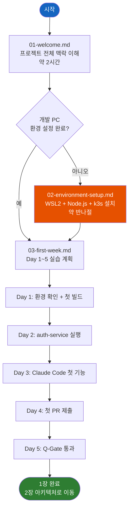

# 1장: 시작하기 (Getting Started)

> **문서 ID**: ONBOARD-01-README
> **버전**: 1.0.0 | **작성일**: 2026-04-11
> **학습 대상**: 프로젝트에 처음 합류하는 모든 팀원

---

## 이 섹션에서 배울 것

이 섹션은 프로젝트에 처음 합류하는 팀원이 **첫 주 안에** 반드시 완료해야 할 내용을 다룹니다.
코드를 단 한 줄도 모르는 상태에서 시작해도 이 섹션을 따라가면 첫 PR을 제출할 수 있습니다.

| 파일 | 제목 | 예상 학습 시간 | 목적 |
|------|------|--------------|------|
| `01-welcome.md` | 프로젝트 입문 | 2시간 | 전체 맥락 파악 |
| `02-environment-setup.md` | 개발 환경 설정 | 반나절 | 노트북에서 코드 실행 |
| `03-first-week.md` | 첫 주 학습 계획 | 첫 주 전체 | Day-by-Day 실습 |

---

## 학습 순서

반드시 아래 순서대로 진행하십시오. 순서를 건너뛰면 이후 실습에서 오류가 발생합니다.

---

## 이 섹션 완료 후 할 수 있는 것

- 공공기관 SaaS 프레임워크의 목적과 구조를 동료에게 설명할 수 있다
- 로컬 PC에서 전체 서비스를 빌드하고 실행할 수 있다
- Claude Code를 사용하여 간단한 기능을 구현하고 PR을 제출할 수 있다
- Q-Gate 7단계가 무엇인지, 왜 필요한지 이해한다

---

## 주의사항

- `00-overview.md` 를 아직 읽지 않았다면 이 섹션보다 먼저 읽으십시오.
- 환경 설정 중 오류가 발생하면 `02-environment-setup.md` 의 "자주 발생하는 오류" 절을 먼저 확인하십시오.
- CSAP, N2SF 등 용어가 생소하다면 `01-welcome.md` 의 용어 사전을 참고하십시오.
