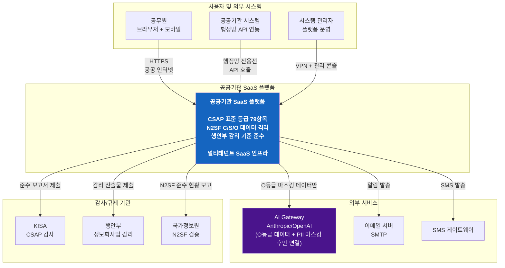
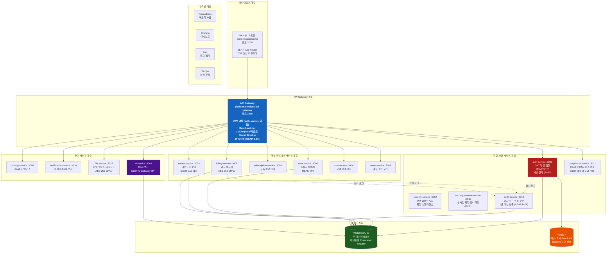
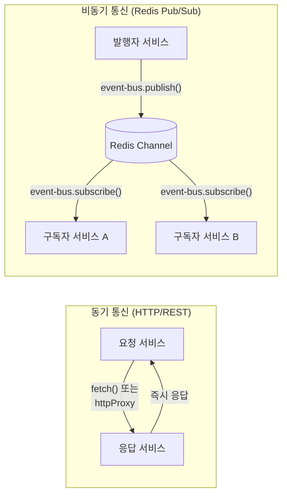
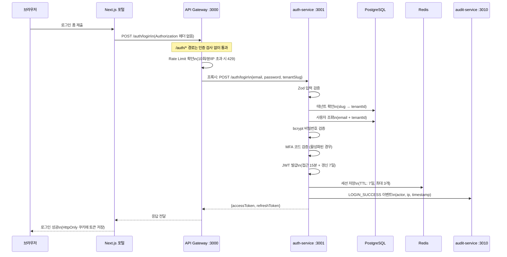
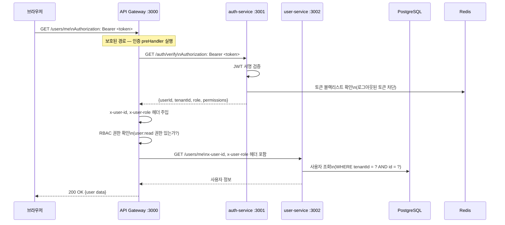
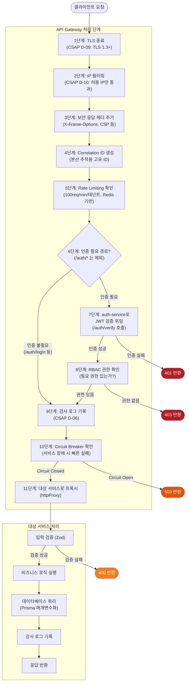
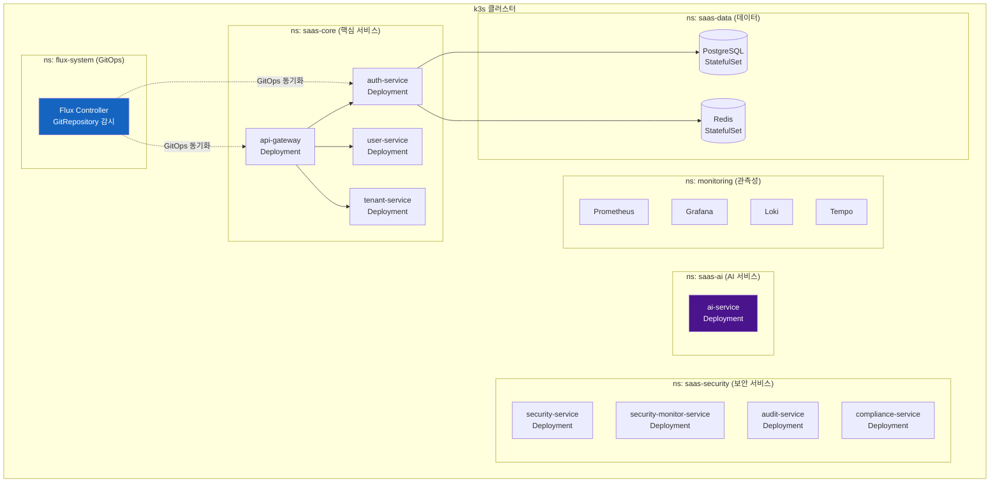

# 전체 시스템 아키텍처

> **문서 ID**: ONBOARD-02-01
> **버전**: 1.0.0 | **작성일**: 2026-04-11 | **작성자**: Implementer (Sonnet)
> **학습 대상**: 1장을 완료한 팀원
> **예상 학습 시간**: 3시간
> **선행 문서**: `01-getting-started/01-welcome.md`

---

## 목차

1. [전체 시스템 아키텍처 (C4 다이어그램)](#1-전체-시스템-아키텍처-c4-다이어그램)
2. [17개 서비스 간 통신 흐름](#2-17개-서비스-간-통신-흐름)
3. [클라이언트 → API Gateway → 서비스 → DB 흐름](#3-클라이언트--api-gateway--서비스--db-흐름)
4. [네임스페이스 구조 (k3s)](#4-네임스페이스-구조-k3s)
5. [공유 패키지 (Platform Packages) 구조](#5-공유-패키지-platform-packages-구조)

---

## 1. 전체 시스템 아키텍처 (C4 다이어그램)

C4 모델은 소프트웨어 아키텍처를 4개의 추상화 수준으로 표현하는 방법입니다.
- **Context**: 시스템이 외부와 어떻게 연결되는가 (가장 큰 그림)
- **Container**: 시스템 내부의 독립 실행 단위 (서비스, 데이터베이스)
- **Component**: 각 컨테이너 내부 구성요소
- **Code**: 실제 클래스, 함수

### 1.1 Context 다이어그램 (Level 1 — 가장 큰 그림)



### 1.2 Container 다이어그램 (Level 2 — 서비스 단위)

이 다이어그램은 플랫폼 내부에 있는 독립 실행 단위들을 보여줍니다.



---

## 2. 17개 서비스 간 통신 흐름

### 2.1 서비스 간 통신 방식

이 플랫폼에서 서비스 간 통신은 두 가지 방식을 사용합니다.



| 통신 방식 | 사용 패키지 | 사용 시나리오 | 예시 |
|---------|-----------|------------|------|
| HTTP 동기 | `fetch()`, `@fastify/http-proxy` | 즉시 응답이 필요한 경우 | 로그인, 데이터 조회 |
| Redis 비동기 | `@public-saas/event-bus` | 이벤트 전파, 알림 | 사용자 생성 → 알림 발송 |

### 2.2 핵심 통신 흐름 — 로그인 요청



### 2.3 핵심 통신 흐름 — 보호된 API 요청



---

## 3. 클라이언트 → API Gateway → 서비스 → DB 흐름

### 3.1 요청 처리 단계 상세



### 3.2 데이터베이스 접근 패턴

모든 서비스는 Prisma ORM을 통해 PostgreSQL에 접근합니다. 직접 SQL 문자열 결합은 절대 금지입니다.

```typescript
// 실제 코드 위치: platform/services/auth-service/src/lib/prisma.ts

// ✅ 올바른 방법 — Prisma 매개변수화 쿼리 (CSAP D-12)
const user = await prisma.user.findUnique({
  where: {
    tenantId_email: {
      tenantId: tenant.id,  // 변수값, 내부에서 매개변수화됨
      email: email,         // 변수값, 내부에서 매개변수화됨
    }
  }
})

// ❌ 절대 금지 — SQL 직접 결합 (SQL 주입 취약점)
const user = await prisma.$queryRaw`
  SELECT * FROM users WHERE email = '${email}'
`  // 이렇게 하면 CSAP D-12 위반이며 AgentShield가 차단합니다
```

### 3.3 멀티테넌트 격리

모든 데이터베이스 쿼리에서 tenantId가 반드시 포함되어야 합니다.

```typescript
// ✅ 올바른 방법 — tenantId 격리
const users = await prisma.user.findMany({
  where: {
    tenantId: request.headers['x-user-tenant-id'],  // GW가 주입한 헤더
  }
})

// ❌ 절대 금지 — tenantId 없는 전체 조회 (다른 테넌트 데이터 노출)
const allUsers = await prisma.user.findMany()
```

---

## 4. 네임스페이스 구조 (k3s)

### 4.1 k8s 네임스페이스 분리

k3s 클러스터에서 서비스들은 역할에 따라 다른 네임스페이스에 배포됩니다.



### 4.2 네트워크 정책 (Kyverno)

네임스페이스 간 통신은 Kyverno NetworkPolicy로 제한됩니다.

```yaml
# 예: saas-core에서 saas-data로만 DB 접근 허용
# 실제 파일 위치: platform/k8s/policies/network-policy.yaml
apiVersion: networking.k8s.io/v1
kind: NetworkPolicy
metadata:
  name: allow-core-to-data
  namespace: saas-data
spec:
  podSelector: {}
  ingress:
    - from:
        - namespaceSelector:
            matchLabels:
              name: saas-core  # saas-core 네임스페이스만 허용
```

이 정책 덕분에 외부에서 PostgreSQL에 직접 접근하는 것이 불가능합니다.

---

## 5. 공유 패키지 (Platform Packages) 구조

### 5.1 왜 공유 패키지를 사용하는가

17개 서비스가 모두 독자적으로 JWT 검증, 감사 로그, Rate Limiting을 구현하면 코드가 중복되고 보안 로직이 각각 달라질 위험이 있습니다. `platform/packages/` 에 있는 공유 패키지를 통해 한 번만 구현하고 모든 서비스에서 재사용합니다.

```mermaid
graph TB
    subgraph "platform/packages/ (공유 라이브러리)"
        RBAC["@public-saas/rbac\n역할 기반 접근 제어"]
        AUDIT["@public-saas/audit-sdk\n감사 로그 SDK"]
        AUTH["@public-saas/auth-sdk\nJWT 발급·검증"]
        OBS["@public-saas/observability\nOpenTelemetry 계측"]
        HEALTH["@public-saas/health\n헬스체크 플러그인"]
        CIRCUIT["@public-saas/circuit-breaker\n서킷 브레이커"]
        EVTBUS["@public-saas/event-bus\nRedis Pub/Sub"]
        TENISL["@public-saas/tenant-isolation\n테넌트 격리 유틸"]
        RATELIM["@public-saas/rate-limit\nRate Limit 미들웨어"]
        SECMGR["@public-saas/secret-manager\nVault 시크릿 관리"]
        MESHREADY["@public-saas/mesh-ready\nGraceful Shutdown"]
        CONFIG["@public-saas/config-vault\n중앙 설정 관리"]
    end

    subgraph "서비스들이 공유 패키지 사용"
        Auth["auth-service"] --> AUTH
        Auth --> AUDIT
        Auth --> SECMGR
        User["user-service"] --> RBAC
        User --> AUDIT
        User --> EVTBUS
        GW["api-gateway"] --> RATELIM
        GW --> HEALTH
        GW --> CIRCUIT
        GW --> MESHREADY
        GW --> CONFIG
        All["모든 서비스"] --> OBS
    end
```



### 5.2 주요 패키지 사용 방법

#### @public-saas/audit-sdk — 감사 로그

모든 중요 작업에 반드시 감사 로그를 남겨야 합니다 (CSAP D-06).

```typescript
// 실제 사용 위치 예: platform/services/auth-service/src/handlers/login.handler.ts
import { logAuthEvent } from '../lib/audit.js'
// 내부적으로 @public-saas/audit-sdk 사용

// 감사 로그 기록
await logAuthEvent('LOGIN_SUCCESS', user.id, tenant.id, ip, userAgent)
// 기록되는 내용: actor, action, target, timestamp, ip, result
```

#### @public-saas/rbac — 역할 기반 접근 제어

```typescript
// api-gateway에서 RBAC 플러그인 등록
// 실제 위치: platform/services/api-gateway/src/index.ts
await app.register(rbacPlugin, {
  auditLogger: (event) => {
    app.log.info({ rbacEvent: event }, 'RBAC 감사 로그')
  }
})

// 개별 라우트에서 권한 확인
app.get('/admin/users', {
  preHandler: [app.rbac.require('user:admin')]
}, handler)
```

#### @public-saas/observability — 분산 추적

```typescript
// 모든 서비스 진입점에서 OpenTelemetry 초기화
// 실제 위치: platform/services/api-gateway/src/index.ts
import { initTelemetry, shutdownTelemetry } from '@public-saas/observability'

initTelemetry({
  serviceName: 'api-gateway',
  serviceVersion: '0.2.0'
})
// 이후 모든 HTTP 요청이 자동으로 추적됩니다
// Grafana Tempo에서 분산 추적 확인 가능
```

---

## 다음 단계

시스템 전체 구조를 파악했습니다. 이제 개별 서비스를 더 자세히 알아봅니다.

**[다음: services/README.md — 17개 서비스 전체 목록]**

---

## 변경 이력

| 버전 | 일자 | 내용 | 작성자 |
|------|------|------|------|
| 1.0.0 | 2026-04-11 | 최초 작성 | Implementer (Sonnet) |
