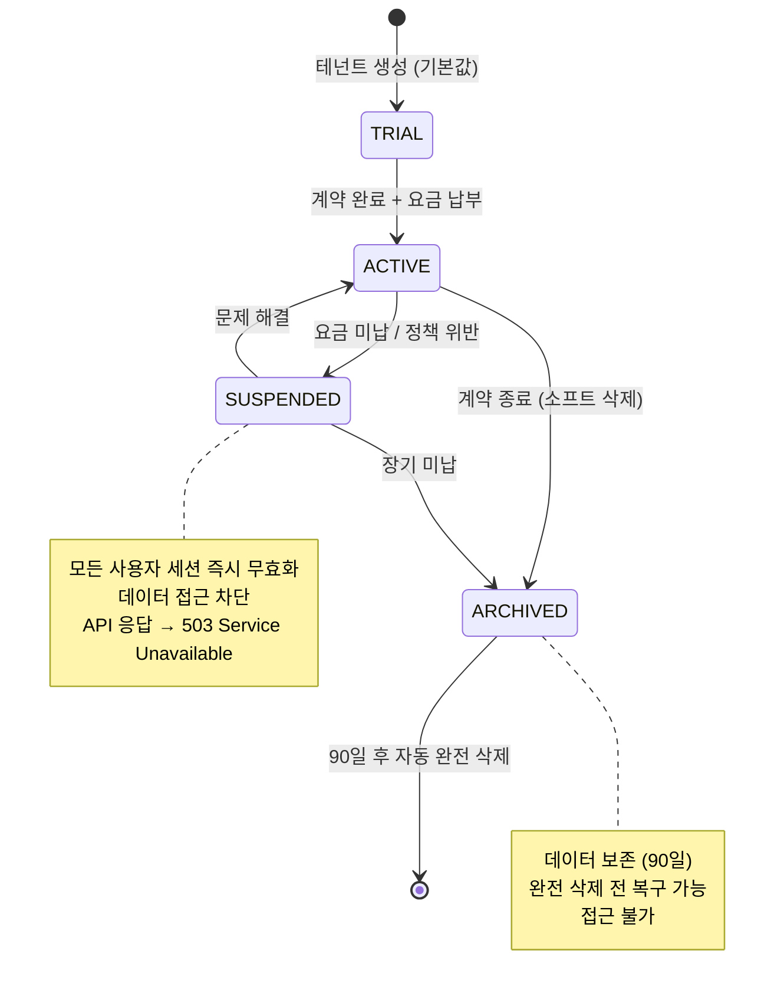
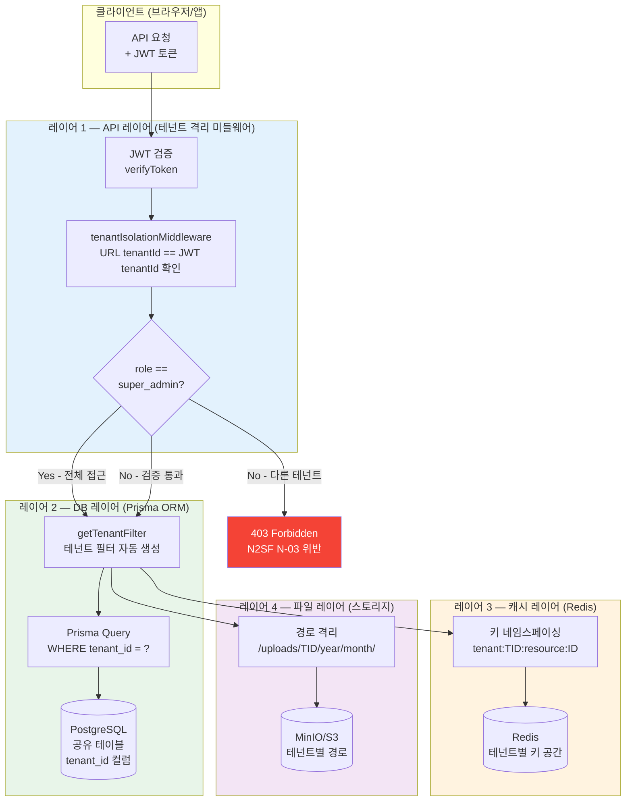
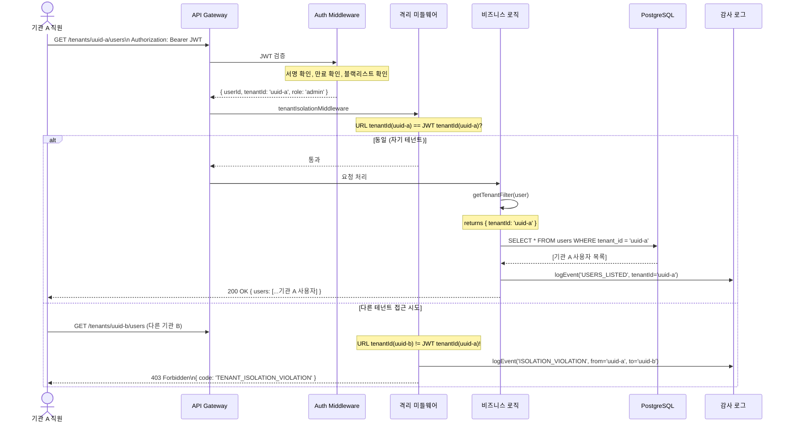
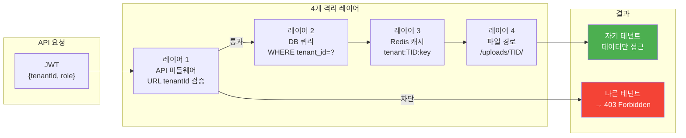

# 멀티테넌시 — 하나의 서비스로 여러 기관을 동시에 서비스하기

> **버전**: 1.0.0 | **작성일**: 2026-04-12
> **대상**: API 또는 DB를 다루는 모든 신규 개발자
> **전제 조건**: `01-system-overview.md`, `services/02-auth-service.md` 학습 완료
> **소요 시간**: 약 90분
> **Design Ref**: DESIGN-MTU-P03 — 테넌트 격리 아키텍처
> **Plan SC**: FR-P03.1~FR-P03.8
> **CSAP**: D-08 (접근 통제), N2SF N-03 (격리 아키텍처)

---

## 목차

1. [멀티테넌시란?](#1-멀티테넌시란)
2. [이 프로젝트의 멀티테넌시 전략](#2-이-프로젝트의-멀티테넌시-전략)
3. [테넌트 격리 구현 — 4개 레이어](#3-테넌트-격리-구현--4개-레이어)
4. [SUPER_ADMIN vs 일반 테넌트 권한](#4-super_admin-vs-일반-테넌트-권한)
5. [테넌트 간 데이터 누출 방지](#5-테넌트-간-데이터-누출-방지)
6. [신규 테넌트 온보딩 플로우](#6-신규-테넌트-온보딩-플로우)
7. [테넌트 격리 레이어 다이어그램](#7-테넌트-격리-레이어-다이어그램)
8. [API 요청에서 테넌트 격리까지 시퀀스](#8-api-요청에서-테넌트-격리까지-시퀀스)
9. [CSAP D-08과의 관계](#9-csap-d-08과의-관계)
10. [개발자 실수 유형과 예방법](#10-개발자-실수-유형과-예방법)
11. [테넌트 격리 검증 방법](#11-테넌트-격리-검증-방법)

---

## 1. 멀티테넌시란?

### 1.1 아파트 건물 비유

멀티테넌시를 이해하는 가장 쉬운 비유는 **아파트 건물**입니다.

```
아파트 건물 = 우리 SaaS 서비스

  건물 (공유):
    → 엘리베이터 (공통 인프라 — 서버, DB 서버)
    → 보일러실 (공통 서비스 — auth, gateway)
    → 우편함 (공통 데이터 저장소 — 같은 DB 서버)

  각 세대 (독립):
    → 현관 잠금장치 (테넌트별 인증)
    → 개인 공간 (테넌트별 데이터 — 다른 방, 접근 불가)
    → 내부 인테리어 (테넌트별 설정)

  중요한 점:
    → 옆집 사람이 내 방에 들어올 수 없음 (데이터 격리)
    → 하지만 같은 건물에 살아 인프라 비용은 공유
    → 건물 관리인(SUPER_ADMIN)은 모든 방 접근 가능
```

### 1.2 멀티테넌시가 필요한 이유

공공기관 SaaS에서 멀티테넌시가 필요한 이유:

```
요구사항:
  → 기관 A (행정안전부): 자기 데이터만 봐야 함
  → 기관 B (교육부): 자기 데이터만 봐야 함
  → 기관 C (보건복지부): 자기 데이터만 봐야 함

비용 효율:
  → 각 기관마다 별도 서버: 월 1,000만원 × 100개 기관 = 10억원
  → 멀티테넌시 하나의 서버: 월 5,000만원 (1/20 비용)

보안 요건:
  → 기관 A 직원이 기관 B 데이터를 볼 수 없어야 함 (CSAP D-08)
  → 데이터 누출 시 CSAP 인증 취소 + 법적 책임
```

### 1.3 테넌트(Tenant)란?

**테넌트(Tenant)**는 서비스를 사용하는 독립적인 조직 단위입니다.

```
우리 서비스의 테넌트:
  → 공공기관 A: tenantId = "uuid-agency-a"
  → 공공기관 B: tenantId = "uuid-agency-b"
  → 산하기관 C: tenantId = "uuid-sub-org-c"

각 테넌트:
  → 고유한 UUID (tenantId)
  → 독립적인 사용자 목록
  → 독립적인 데이터
  → 독립적인 설정 (테마, 기능 on/off)
  → 사용자 수 제한, 저장 용량 제한
```

---

## 2. 이 프로젝트의 멀티테넌시 전략

### 2.1 3가지 멀티테넌시 전략 비교

멀티테넌시를 구현하는 방법은 크게 3가지입니다.

| 전략 | 설명 | 장점 | 단점 |
|------|------|------|------|
| **Database-per-tenant** | 테넌트마다 별도 DB | 완벽한 격리, CSAP 최고 등급 충족 | 비용 매우 높음, 관리 복잡 |
| **Schema-per-tenant** | 같은 DB 서버, 테넌트별 스키마 | 강한 격리, 비용 중간 | PostgreSQL 전용, 스키마 관리 복잡 |
| **Row-level (이 프로젝트)** | 같은 테이블, 행에 tenant_id 컬럼 | 비용 최저, 운영 단순 | 격리 코드 철저히 구현 필요 |

### 2.2 이 프로젝트의 선택: Row-level 격리

이 프로젝트는 **Row-level 격리(행 수준 격리)**를 사용합니다.

```sql
-- 모든 핵심 테이블에 tenant_id 컬럼 필수
CREATE TABLE users (
  id          UUID PRIMARY KEY,
  tenant_id   UUID NOT NULL REFERENCES tenants(id),  -- 항상 포함
  email       VARCHAR(255) NOT NULL,
  name        VARCHAR(100) NOT NULL,
  role        VARCHAR(50) NOT NULL,
  created_at  TIMESTAMPTZ DEFAULT NOW()
);

CREATE INDEX idx_users_tenant_id ON users(tenant_id);  -- 성능
```

**선택 이유**:

```
1. 비용 효율: 수백 개 기관을 하나의 DB로 처리 (운영비 최소화)
2. 운영 단순성: 스키마/DB 관리 오버헤드 없음
3. CSAP 중등급 충족: 코드 레벨 격리로 D-08 요건 충족
4. N2SF N-03 준수: 논리적 격리 (물리적 격리는 C등급 데이터만 필요)
```

**단점과 대응**:

```
단점: 코드에서 tenant_id 필터를 빠뜨리면 데이터 누출
대응:
  → 모든 DB 쿼리에 자동 필터 주입 (getTenantFilter 함수)
  → PR 리뷰에서 tenant_id 없는 쿼리 즉시 차단
  → 격리 검증 자동화 테스트
```

---

## 3. 테넌트 격리 구현 — 4개 레이어

테넌트 격리는 4개의 레이어에서 각각 독립적으로 구현됩니다. 하나가 실패해도 다른 레이어가 방어합니다 (심층 방어 원칙).

### 3.1 레이어 1 — API 레이어: tenantId 자동 주입

모든 API 요청에서 JWT 토큰의 tenantId를 자동으로 추출하여 요청에 바인딩합니다.

```typescript
// platform/services/tenant-service/src/lib/isolation.ts (실제 구현)
// Design Ref: DESIGN-MTU-P03
// Plan SC: FR-P03.5
// CSAP: N2SF N-03 격리 아키텍처

import type { FastifyRequest, FastifyReply } from 'fastify';
import type { TokenPayload } from '@public-saas/types';

/**
 * 테넌트 격리 미들웨어
 *
 * 동작:
 * 1. JWT에서 tenantId 추출
 * 2. 요청 URL의 tenantId와 일치 여부 확인
 * 3. 불일치 시 403 Forbidden 반환
 */
export async function tenantIsolationMiddleware(
  request: FastifyRequest,
  reply: FastifyReply
): Promise<void> {
  const user = (request as FastifyRequest & { user?: TokenPayload }).user;

  if (!user) {
    await reply.status(401).send({
      success: false,
      error: { code: 'AUTH_REQUIRED', message: '인증이 필요합니다' },
    });
    return;
  }

  // SUPER_ADMIN: 전체 테넌트 접근 허용 (관리자 전용)
  if (user.role === 'super_admin') {
    return;  // 필터 없이 통과
  }

  // URL 파라미터에서 tenantId 추출 (예: /tenants/:tenantId/users)
  const params = request.params as Record<string, string>;
  const requestedTenantId = params['tenantId'] ?? params['id'];

  // JWT의 tenantId와 요청 tenantId 비교
  if (requestedTenantId && requestedTenantId !== user.tenantId) {
    await reply.status(403).send({
      success: false,
      error: {
        code: 'TENANT_ISOLATION_VIOLATION',
        message: '다른 테넌트의 데이터에 접근할 수 없습니다 (N2SF N-03)',
      },
    });
    return;
  }
}
```

**언제 적용하는가**:

```
모든 테넌트 데이터 라우터에 필수 적용:

// 예: tenant-service/src/routes.ts
fastify.get('/tenants/:id', {
  preHandler: [verifyToken, tenantIsolationMiddleware],  // ← 순서 중요
}, getTenantHandler);

fastify.get('/tenants/:id/users', {
  preHandler: [verifyToken, tenantIsolationMiddleware],
}, listUsersHandler);
```

### 3.2 레이어 2 — DB 레이어: WHERE tenant_id = ? 강제 적용

모든 데이터베이스 쿼리에 tenantId 필터를 강제로 추가하는 헬퍼 함수를 사용합니다.

```typescript
// platform/services/tenant-service/src/lib/isolation.ts (실제 구현)

/**
 * 쿼리에 tenantId 필터 자동 적용
 *
 * SUPER_ADMIN: 필터 없음 (전체 접근)
 * 일반 사용자: 자기 테넌트만 접근
 *
 * @returns Prisma where 조건에 추가할 tenantId 필터
 */
export function getTenantFilter(user: TokenPayload): { tenantId?: string } {
  if (user.role === 'super_admin') {
    return {};           // super_admin: 전체 접근
  }
  return { tenantId: user.tenantId };  // 일반: 자기 테넌트만
}
```

```typescript
// 사용 예시 — 모든 DB 쿼리에 적용
export async function listUsersHandler(request, reply) {
  const filter = getTenantFilter(request.user);

  // ✅ OK: 테넌트 필터 자동 적용
  const users = await prisma.user.findMany({
    where: {
      ...filter,         // { tenantId: 'xxx' } 자동 포함
      role: 'editor',    // 추가 조건
    },
  });

  // ❌ NG (절대 금지): 필터 없이 전체 조회
  // const users = await prisma.user.findMany();
  // → 모든 테넌트 사용자가 노출됨!

  await reply.send({ success: true, data: users });
}
```

**Prisma로 생성되는 실제 SQL**:

```sql
-- getTenantFilter({ tenantId: 'uuid-agency-a' }) 사용 시
SELECT id, email, name, role
FROM users
WHERE tenant_id = 'uuid-agency-a'  -- ← 자동으로 추가됨
  AND role = 'editor';

-- SUPER_ADMIN의 경우 (getTenantFilter returns {})
SELECT id, email, name, role
FROM users
WHERE role = 'editor';  -- 전체 테넌트 조회
```

### 3.3 레이어 3 — 캐시 레이어: Redis 키 네임스페이싱

캐시에서도 테넌트 간 데이터가 섞이지 않도록 키 구조를 설계합니다.

```typescript
// Redis 캐시 키 네임스페이싱 (레이어 3 격리)
// 테넌트별로 완전히 다른 키 공간 사용

// ❌ NG: 테넌트 구분 없는 캐시 키
const key = `user:${userId}`;
// → 다른 테넌트의 userId와 충돌 가능!

// ✅ OK: 테넌트 ID를 키에 포함
const key = `tenant:${tenantId}:user:${userId}`;
// → 각 테넌트의 데이터가 완전히 분리됨

// 캐시 유틸리티 함수
export function makeCacheKey(
  tenantId: string,
  resource: string,
  id?: string
): string {
  const base = `tenant:${tenantId}:${resource}`;
  return id ? `${base}:${id}` : base;
}

// 사용 예시
const cacheKey = makeCacheKey(user.tenantId, 'users', userId);
// → "tenant:uuid-agency-a:users:user-uuid-123"

// 테넌트 전체 캐시 무효화
async function invalidateTenantCache(tenantId: string): Promise<void> {
  const pattern = `tenant:${tenantId}:*`;
  const keys = await redis.keys(pattern);
  if (keys.length > 0) {
    await redis.del(...keys);
  }
}
```

**테넌트 정지 시 캐시 자동 무효화**:

```typescript
// 테넌트 상태를 SUSPENDED로 변경 시 (tenant.handler.ts)
if (parseResult.data.status === 'SUSPENDED') {
  // 1. DB 상태 변경
  await prisma.tenant.update({ where: { id }, data: { status: 'SUSPENDED' } });

  // 2. 해당 테넌트 모든 세션 무효화
  await invalidateTenantSessions(id, request.ip);

  // 3. Redis 캐시 무효화
  await invalidateTenantCache(id);
}
```

### 3.4 레이어 4 — 파일 레이어: 디렉토리 분리

파일(첨부 문서, 이미지 등) 저장 시 테넌트별로 완전히 분리된 경로를 사용합니다.

```typescript
// 파일 저장 경로 네임스페이싱 (레이어 4 격리)

// ❌ NG: 공유 경로에 저장
const filePath = `/uploads/${fileName}`;
// → 다른 테넌트가 파일명을 알면 접근 가능!

// ✅ OK: 테넌트별 격리 경로
const filePath = `/uploads/${tenantId}/${category}/${uuid()}-${fileName}`;
// → 테넌트 ID가 경로에 포함되어 접근 제어 가능

// 파일 접근 시 검증
export async function getFile(
  tenantId: string,
  fileId: string,
  requestingUser: TokenPayload
): Promise<Buffer> {
  const file = await db.files.findFirst({
    where: {
      id: fileId,
      tenantId,  // 반드시 테넌트 필터
    },
  });

  if (!file) {
    throw new NotFoundError('파일을 찾을 수 없습니다');
  }

  // 경로에서 tenantId 확인 (이중 방어)
  if (!file.path.startsWith(`/uploads/${tenantId}/`)) {
    throw new ForbiddenError('접근 권한이 없습니다 (N2SF N-03)');
  }

  return fs.readFile(file.path);
}
```

**오브젝트 스토리지(S3 호환) 사용 시**:

```typescript
// MinIO / S3 버킷 네임스페이싱
const objectKey = `${tenantId}/${year}/${month}/${uuid()}-${filename}`;

// presigned URL 생성 (다운로드용) — 1시간 유효
const presignedUrl = await s3.getSignedUrl('getObject', {
  Bucket: 'public-saas-uploads',
  Key: objectKey,
  Expires: 3600,  // 1시간
});
```

---

## 4. SUPER_ADMIN vs 일반 테넌트 권한

### 4.1 권한 체계 개요

```
권한 계층:
  SUPER_ADMIN (플랫폼 전체 관리자)
    └── 기관 A (tenantId: uuid-a)
          ├── ADMIN (기관 내 관리자)
          ├── EDITOR (편집자)
          └── VIEWER (조회자)
    └── 기관 B (tenantId: uuid-b)
          ├── ADMIN
          ├── EDITOR
          └── VIEWER
```

### 4.2 SUPER_ADMIN 권한

```typescript
// SUPER_ADMIN: 모든 테넌트 데이터에 접근 가능
// 사용 사례: 플랫폼 운영, 장애 대응, CSAP 감사 지원

if (user.role === 'super_admin') {
  // 테넌트 필터 없이 전체 조회
  return {};  // getTenantFilter의 반환값
}

// SUPER_ADMIN이 할 수 있는 것:
// ✅ 모든 테넌트 목록 조회
// ✅ 특정 테넌트 데이터 조회 (장애 지원)
// ✅ 테넌트 생성/수정/정지/삭제
// ✅ 사용자 수 제한, 용량 제한 설정
// ✅ 테넌트 상태 변경 (ACTIVE → SUSPENDED → ARCHIVED)

// SUPER_ADMIN도 할 수 없는 것:
// ❌ 감사 로그 수정 (append-only)
// ❌ 암호화된 PII 직접 열람 (복호화 키 별도 관리)
// ❌ N2SF C/S등급 데이터 AI API 전송
```

### 4.3 일반 테넌트 ADMIN 권한

```typescript
// 테넌트 ADMIN: 자기 테넌트 내에서만 관리 가능

// ✅ 가능:
// → 자기 테넌트 내 사용자 초대/삭제
// → 테넌트 설정 변경 (테마, 기능)
// → 자기 테넌트 감사 로그 조회
// → 자기 테넌트 통계 조회

// ❌ 불가능:
// → 다른 테넌트 데이터 조회 (403 Forbidden)
// → 테넌트 생성 (SUPER_ADMIN 전용)
// → 사용자 수 제한 변경 (SUPER_ADMIN 전용)
// → 플랫폼 전체 통계 조회
```

### 4.4 권한 비교표

| 작업 | SUPER_ADMIN | 테넌트 ADMIN | EDITOR | VIEWER |
|------|------------|------------|-------|--------|
| 전체 테넌트 목록 조회 | O | X | X | X |
| 자기 테넌트 정보 조회 | O | O | O | O |
| 다른 테넌트 정보 조회 | O | X | X | X |
| 테넌트 생성 | O | X | X | X |
| 테넌트 정지 | O | X | X | X |
| 자기 테넌트 내 사용자 관리 | O | O | X | X |
| 데이터 생성/수정 | O | O | O | X |
| 데이터 조회 | O | O | O | O |
| 감사 로그 조회 (자기 테넌트) | O | O | X | X |
| 감사 로그 조회 (전체) | O | X | X | X |

---

## 5. 테넌트 간 데이터 누출 방지

### 5.1 누출이 발생하는 3가지 패턴

```
패턴 1 — DB 쿼리에 tenant_id 필터 누락:
  const users = await prisma.user.findMany();  // 전체!
  → 기관 A 직원이 기관 B 사용자 목록을 봄

패턴 2 — URL 파라미터 tenantId 미검증:
  GET /api/tenants/uuid-agency-b/users
  (JWT의 tenantId: uuid-agency-a)
  → 격리 미들웨어 없이 통과 시 타 기관 데이터 노출

패턴 3 — 캐시 키 충돌:
  key = `user:${userId}`  (테넌트 구분 없음)
  → 다른 테넌트의 같은 userId로 캐시 히트 발생
```

### 5.2 누출 방지 코드 패턴

```typescript
// 안전한 쿼리 작성 3원칙

// 원칙 1: 항상 getTenantFilter() 사용
const tenantFilter = getTenantFilter(req.user);
const data = await prisma.someTable.findMany({
  where: { ...tenantFilter, /* 추가 조건 */ },
});

// 원칙 2: 단건 조회 시에도 tenantId 포함
const item = await prisma.document.findFirst({
  where: {
    id: documentId,
    tenantId: req.user.tenantId,  // 반드시 포함!
    // 없으면 다른 테넌트의 documentId로 접근 가능
  },
});
// findFirst가 null이면 404 반환 (403 대신 → 존재 여부 노출 방지)

// 원칙 3: UPDATE/DELETE에도 tenantId 검증
const updated = await prisma.document.update({
  where: {
    id: documentId,
    tenantId: req.user.tenantId,  // 반드시 포함!
    // 없으면 다른 테넌트 문서를 수정/삭제 가능
  },
  data: { /* 변경 내용 */ },
});
```

### 5.3 자동화된 격리 검증

```typescript
// 격리 검증 테스트 (자동화)
// 다른 테넌트 데이터 접근 시 403이 반환되는지 확인

describe('테넌트 격리 검증', () => {
  it('다른 테넌트 데이터 접근 시 403 반환', async () => {
    // Given: 테넌트 A 사용자 인증 토큰
    const tokenA = await createTestToken({ tenantId: 'tenant-a' });

    // When: 테넌트 B의 리소스에 접근 시도
    const response = await request(app)
      .get('/api/tenants/tenant-b/users')
      .set('Authorization', `Bearer ${tokenA}`);

    // Then: 403 Forbidden
    expect(response.status).toBe(403);
    expect(response.body.error.code).toBe('TENANT_ISOLATION_VIOLATION');
  });

  it('자기 테넌트 데이터는 정상 접근', async () => {
    const tokenA = await createTestToken({ tenantId: 'tenant-a' });

    const response = await request(app)
      .get('/api/tenants/tenant-a/users')
      .set('Authorization', `Bearer ${tokenA}`);

    expect(response.status).toBe(200);
    // 반환된 users 중 다른 테넌트 데이터 없음 확인
    response.body.data.forEach((user: any) => {
      expect(user.tenantId).toBe('tenant-a');
    });
  });
});
```

---

## 6. 신규 테넌트 온보딩 플로우

### 6.1 관리자 관점 온보딩 절차

SUPER_ADMIN이 새로운 공공기관을 서비스에 추가하는 과정입니다.

```
Step 1: 기관 정보 수집
  → 기관명, 공식 도메인, 담당자 연락처
  → 서비스 유형 (어떤 기능 사용할지)
  → 사용자 수 예상 (제한 설정)
  → 데이터 등급 (어떤 종류의 데이터를 처리할지)

Step 2: 테넌트 생성 (API 또는 관리자 대시보드)
  → POST /api/tenants
  → name, slug, maxUsers, maxStorage 설정

Step 3: 초기 관리자 계정 생성
  → POST /api/tenants/{id}/users (role: 'admin')
  → 기관 담당자에게 임시 비밀번호 전달 (안전한 채널로)

Step 4: 기관별 설정 구성
  → PUT /api/tenants/{id}/config
  → 테마 색상, 로고 설정
  → 기능 on/off 설정

Step 5: 검증
  → 기관 담당자가 로그인하여 정상 동작 확인
  → 다른 테넌트 데이터 접근 불가 확인 (격리 검증)
```

### 6.2 테넌트 생성 API

```typescript
// POST /api/tenants (SUPER_ADMIN 전용)
// platform/services/tenant-service/src/handlers/tenant.handler.ts (실제 구현)

const createTenantSchema = z.object({
  name: z.string().min(1).max(200),           // 기관명
  slug: z.string()                             // URL용 식별자
    .min(2).max(50)
    .regex(/^[a-z0-9-]+$/, 'slug는 소문자, 숫자, 하이픈만 허용'),
  maxUsers: z.number().int().min(1).max(10000).default(10),    // 최대 사용자 수
  maxStorage: z.number().int().min(0).default(1073741824),     // 최대 저장용량 (1GB)
});

// 요청 예시:
const newTenant = {
  name: "행정안전부",
  slug: "mois",               // 도메인: mois.saas.go.kr
  maxUsers: 500,
  maxStorage: 10737418240,   // 10GB
};
```

```typescript
// 생성 성공 후 자동으로:
// 1. UUID tenantId 자동 생성
// 2. 감사 로그 기록 (TENANT_CREATED, CSAP D-06)
// 3. 기본 설정 초기화

await logTenantEvent(
  'TENANT_CREATED',           // 이벤트 타입
  createActor,                // 생성한 관리자 ID
  tenant.id,                  // 새 테넌트 ID
  tenant.id,                  // 대상 (자기 자신)
  request.ip,
  request.headers['user-agent'] ?? 'unknown',
  { name: tenant.name, slug: tenant.slug },  // 추가 정보
);
```

### 6.3 테넌트 상태 생명주기



---

## 7. 테넌트 격리 레이어 다이어그램



---

## 8. API 요청에서 테넌트 격리까지 시퀀스



---

## 9. CSAP D-08과의 관계

### 9.1 멀티테넌시와 CSAP D-08 접근 통제

CSAP D-08(접근 통제) 요건은 멀티테넌시 구현에 직접 반영됩니다.

```
CSAP D-08 요건          → 멀티테넌시 구현 방법

D-08.1 최소 권한        → VIEWER는 조회만 가능
D-08.2 인증 필수        → JWT 검증 (verifyToken)
D-08.3 RBAC             → super_admin/admin/editor/viewer 역할 분리
D-08.4 세션 관리         → 테넌트 정지 시 전체 세션 즉시 무효화
D-08.5 다중 테넌트 격리  → tenantIsolationMiddleware + getTenantFilter
```

### 9.2 D-08 감사 로그 연계

```typescript
// 테넌트 격리 위반 시도는 CSAP D-06 감사 로그에 기록

// CSAP D-06: 침해사고 관리 요건
// → 격리 위반 시도는 잠재적 침해 사고

await logTenantEvent(
  'TENANT_ISOLATION_VIOLATION',   // 이벤트 타입
  user.id,                        // 행위자 (누가)
  requestedTenantId,              // 접근 시도한 테넌트 (대상)
  user.tenantId,                  // 행위자의 원래 테넌트
  request.ip,                     // IP (어디서)
  request.headers['user-agent'],  // 브라우저 정보
  {
    attemptedAccess: requestedTenantId,
    userTenant: user.tenantId,
    csap_ref: 'D-08, N2SF N-03',
  },
);
```

### 9.3 N2SF N-03과의 관계

```
N2SF N-03 격리 아키텍처 요건:
  "테넌트 간 데이터와 처리 환경을 논리적으로 격리하여
   무단 접근 및 데이터 혼용을 방지"

이 프로젝트의 구현:
  ✅ API 레이어: tenantIsolationMiddleware (요청 수준)
  ✅ DB 레이어: getTenantFilter (데이터 수준)
  ✅ 캐시 레이어: 키 네임스페이싱 (캐시 수준)
  ✅ 파일 레이어: 경로 분리 (스토리지 수준)
  ✅ 세션 격리: 테넌트 정지 시 세션 전체 무효화

N2SF N-03 준수 증거:
  → 격리 위반 시도 로그 → 감사 파일
  → 격리 검증 테스트 결과 → CI 아티팩트
  → 코드 리뷰 기록 → PR 이력
```

---

## 10. 개발자 실수 유형과 예방법

### 10.1 실수 1 — 단건 조회에 tenantId 누락

```typescript
// ❌ NG: ID만으로 조회 (다른 테넌트 문서 접근 가능)
const doc = await prisma.document.findUnique({
  where: { id: documentId },
});
// documentId를 추측하면 다른 테넌트 문서를 볼 수 있음!

// ✅ OK: tenantId 필터 반드시 포함
const doc = await prisma.document.findFirst({
  where: {
    id: documentId,
    tenantId: req.user.tenantId,  // 필수!
  },
});
// null이면 존재하지 않거나 다른 테넌트 소유 → 404 반환
if (!doc) {
  return res.status(404).json({ error: 'Document not found' });
  // 403 대신 404: 다른 테넌트의 문서가 존재한다는 사실 숨김
}
```

### 10.2 실수 2 — UPDATE/DELETE에서 격리 누락

```typescript
// ❌ NG: tenantId 없는 삭제 (다른 테넌트 데이터 삭제 가능!)
await prisma.document.delete({
  where: { id: documentId },
});

// ✅ OK: tenantId 포함하여 삭제
const deleted = await prisma.document.deleteMany({
  where: {
    id: documentId,
    tenantId: req.user.tenantId,  // 필수!
  },
});

if (deleted.count === 0) {
  // 존재하지 않거나 다른 테넌트 소유
  return res.status(404).json({ error: 'Not found' });
}
```

### 10.3 실수 3 — 집계 쿼리에서 격리 누락

```typescript
// ❌ NG: 전체 카운트 (다른 테넌트 포함)
const totalUsers = await prisma.user.count();
// → 전체 기관의 사용자 수 노출!

// ✅ OK: 테넌트 필터 포함
const totalUsers = await prisma.user.count({
  where: { tenantId: req.user.tenantId },
});
```

### 10.4 실수 4 — 조인 쿼리에서 격리 누락

```typescript
// ❌ NG: 조인 시 연결 테이블에 tenantId 미확인
const docs = await prisma.document.findMany({
  where: { tenantId: req.user.tenantId },
  include: {
    createdBy: true,  // user 정보 포함 — 다른 테넌트 사용자?
  },
});
// document는 격리되었지만 createdBy user가 다른 테넌트일 수 있음

// ✅ OK: 조인된 테이블도 tenantId 필터
const docs = await prisma.document.findMany({
  where: { tenantId: req.user.tenantId },
  include: {
    createdBy: {
      select: {
        id: true,
        name: true,
        // 민감 정보 제외 (email 등)
      },
    },
  },
});
// Prisma 관계에서 자동으로 같은 tenant의 user만 연결되도록 DB 설계 필요
```

---

## 11. 테넌트 격리 검증 방법

### 11.1 로컬 테스트 방법

```bash
# 두 개의 테스트 테넌트 생성
TENANT_A_TOKEN=$(curl -s POST http://localhost:3001/auth/login \
  -d '{"email":"admin@tenant-a.com","password":"test"}' | jq -r '.accessToken')

TENANT_B_TOKEN=$(curl -s POST http://localhost:3001/auth/login \
  -d '{"email":"admin@tenant-b.com","password":"test"}' | jq -r '.accessToken')

# 테넌트 A 토큰으로 테넌트 B 데이터 접근 시도
RESPONSE=$(curl -s -w "\nHTTP_STATUS:%{http_code}" \
  http://localhost:3000/api/tenants/$TENANT_B_ID/users \
  -H "Authorization: Bearer $TENANT_A_TOKEN")

# 반드시 403 이어야 함
HTTP_STATUS=$(echo "$RESPONSE" | grep "HTTP_STATUS" | cut -d: -f2)
if [ "$HTTP_STATUS" == "403" ]; then
  echo "격리 정상 동작"
else
  echo "격리 실패! (HTTP $HTTP_STATUS)"
fi
```

### 11.2 격리 체크리스트 (PR 리뷰용)

새 핸들러/쿼리를 작성할 때 다음 항목을 점검합니다.

```
PR 체크리스트 — 테넌트 격리

□ 모든 findMany() 쿼리에 getTenantFilter() 적용
□ 모든 findFirst()/findUnique() 쿼리에 tenantId 조건 포함
□ 모든 update()/updateMany() 쿼리에 tenantId 조건 포함
□ 모든 delete()/deleteMany() 쿼리에 tenantId 조건 포함
□ 새 라우터에 tenantIsolationMiddleware 적용
□ 캐시 키에 tenantId 포함 (Redis 사용 시)
□ 파일 경로에 tenantId 포함 (파일 처리 시)
□ 격리 위반 시도 시 감사 로그 기록
□ 단위 테스트: 다른 테넌트 접근 시 403 반환 확인
```

---

## 멀티테넌시 구현 요약



---

## 다음 단계

멀티테넌시 구현 전체를 이해했습니다. 이제 보안 코딩 패턴으로 넘어가서 CSAP D-08, D-09, D-12를 코드 레벨에서 어떻게 구현하는지 학습합니다.

`../../07-security/coding/01-secure-patterns.md`로 이동하십시오.

---

> **참조**: `platform/services/tenant-service/src/lib/isolation.ts` — 실제 격리 미들웨어
> **참조**: `platform/services/tenant-service/src/handlers/tenant.handler.ts` — 테넌트 CRUD 구현
> **Design Ref**: DESIGN-MTU-P03 — 테넌트 격리 아키텍처 설계 문서
> **CSAP 연관**: D-08 (접근 통제), D-06 (침해사고 관리)
> **N2SF 연관**: N-03 (격리 아키텍처), N-04 (접근 통제)
