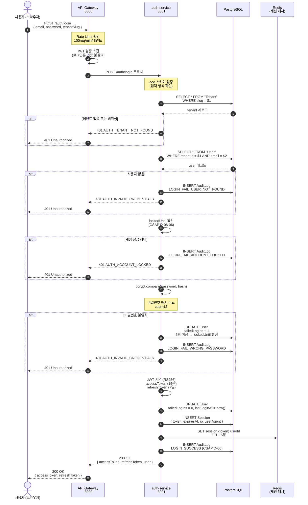
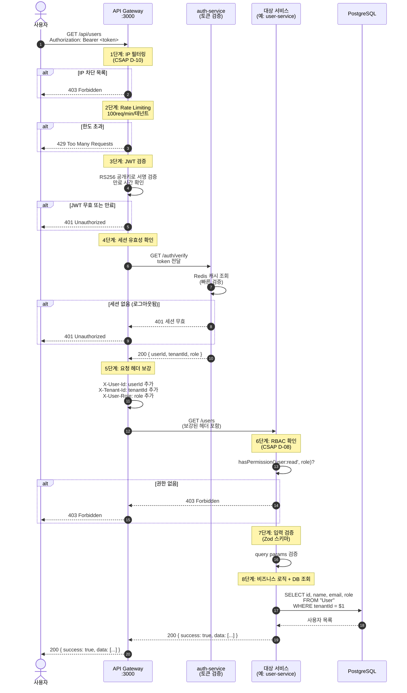
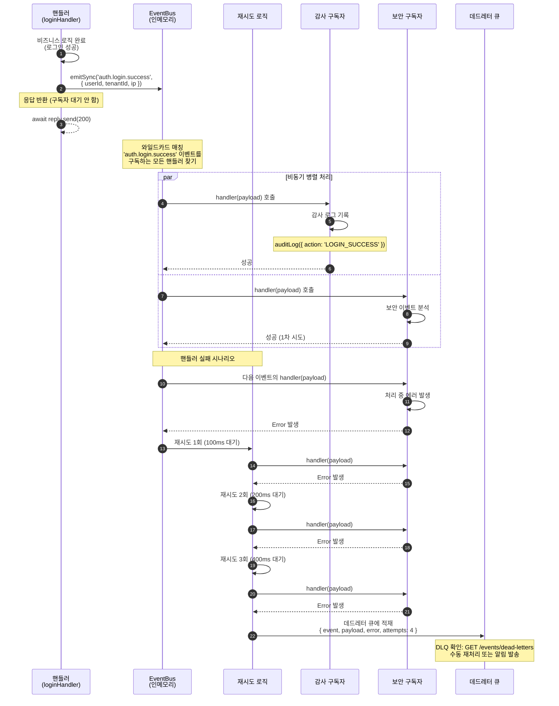
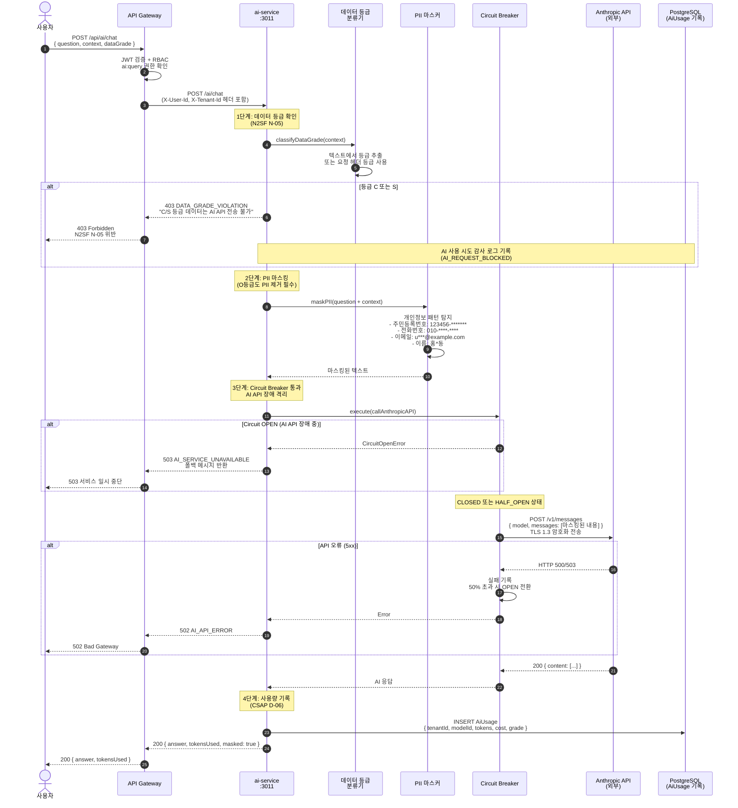
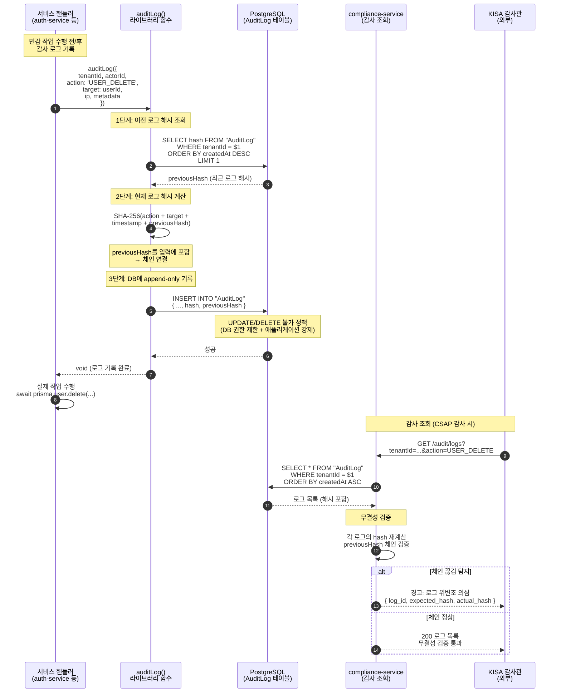
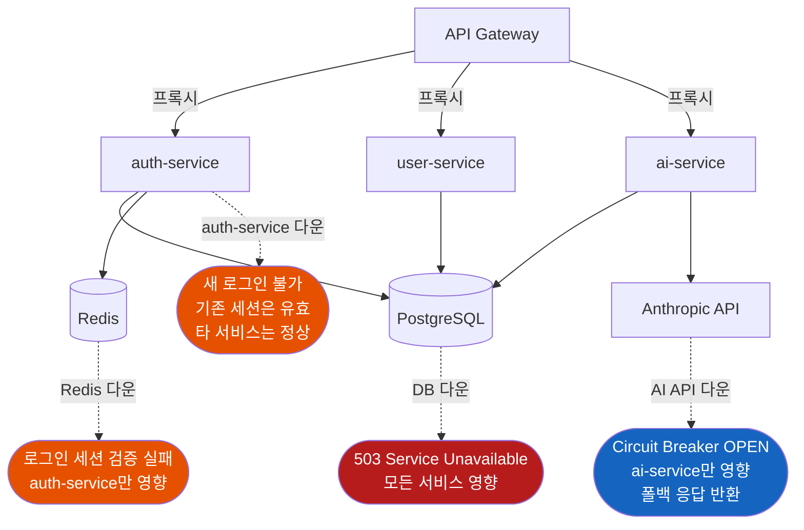

# 데이터 흐름 완전 가이드

> **문서 ID**: ONBOARD-02-03
> **버전**: 1.0.0 | **작성일**: 2026-04-12 | **작성자**: Implementer (Sonnet)
> **선행 학습**: `02-architecture/01-system-overview.md`
> **소요 시간**: 약 3시간

---

## 목차

1. [데이터 흐름 개요](#1-데이터-흐름-개요)
2. [로그인 흐름 (사용자 → API GW → Auth → JWT 발급)](#2-로그인-흐름)
3. [API 요청 흐름 (JWT → API GW → 서비스 → DB → 응답)](#3-api-요청-흐름)
4. [이벤트 흐름 (서비스 → Event Bus → 다른 서비스)](#4-이벤트-흐름)
5. [AI 요청 흐름 (요청 → N2SF 등급 체크 → 마스킹 → AI API)](#5-ai-요청-흐름)
6. [감사 로그 흐름 (작업 → Audit Service → 무결성 체인)](#6-감사-로그-흐름)
7. [에러 전파 패턴](#7-에러-전파-패턴)
8. [변경 이력](#8-변경-이력)

---

## 1. 데이터 흐름 개요

이 시스템에서 데이터는 단순히 "요청이 들어오고 응답이 나가는" 것 이상의 경로를 거칩니다. 보안, 규정 준수, 감사 추적이 모든 흐름에 내재되어 있습니다.

**핵심 원칙**:
- 모든 요청은 API Gateway를 통해서만 들어옵니다 (단일 진입점)
- JWT 검증은 API Gateway에서 한 번만 수행합니다 (중복 제거)
- 민감 작업은 반드시 감사 로그를 남깁니다 (CSAP D-06)
- 외부 AI API에는 O등급 데이터만, PII는 마스킹 후 전송합니다 (N2SF N-05)

**5가지 주요 데이터 흐름 비교**:

| 흐름 | 시작점 | 종착점 | 핵심 통제 |
|------|--------|--------|---------|
| 로그인 | 사용자 | JWT 토큰 | bcrypt 검증, 계정 잠금 (CSAP D-08) |
| API 요청 | JWT 토큰 | JSON 응답 | RBAC 검사, Rate Limiting (CSAP D-08) |
| 이벤트 | 서비스 | 다른 서비스 | 재시도, DLQ (CSAP D-06) |
| AI 요청 | 사용자 질의 | AI 응답 | 데이터 등급 차단, PII 마스킹 (N2SF N-05) |
| 감사 로그 | 민감 작업 | Audit DB | SHA-256 체인, append-only (CSAP D-06) |

---

## 2. 로그인 흐름

### 2.1 흐름 개요

사용자가 이메일과 비밀번호를 입력하면, 시스템은 여러 보안 검사를 거쳐 JWT 토큰을 발급합니다.

**관련 CSAP 통제항목**:
- D-08-01: 사용자 인증 (비밀번호 검증)
- D-08-06: 계정 잠금 (5회 실패 → 30분 잠금)
- D-08-08: 세션 관리 (최대 3개 동시 세션)
- D-06: 침해사고 관리 (모든 로그인 시도 감사 로그)

### 2.2 시퀀스 다이어그램



### 2.3 각 단계 설명

**1-3단계: 진입 및 Rate Limit**

API Gateway는 테넌트별로 분당 100회 요청 제한을 적용합니다. 로그인 요청은 JWT가 없으므로 JWT 검증을 건너뜁니다.

**4-8단계: 테넌트 및 사용자 확인**

`tenantSlug`를 통해 테넌트를 찾습니다. 공공기관 시스템에서 테넌트는 각 기관(부처, 지자체 등)을 의미합니다. 테넌트 격리를 통해 A 기관 사용자가 B 기관 데이터에 접근할 수 없습니다.

**9-12단계: 계정 잠금 확인 (CSAP D-08-06)**

5회 연속 로그인 실패 시 30분 계정 잠금이 자동 적용됩니다. 이는 무차별 대입 공격(brute force)을 방지합니다.

**13-16단계: 비밀번호 검증**

`bcrypt.compare()`는 해시와 원본 비밀번호를 비교합니다. bcrypt는 단방향 해시이므로, 데이터베이스가 침해되어도 원본 비밀번호를 알 수 없습니다.

**17-21단계: JWT 발급 및 세션 생성**

- `accessToken`: 15분 유효 (API 호출에 사용)
- `refreshToken`: 7일 유효 (accessToken 갱신에 사용)
- Session 레코드: PostgreSQL에 저장 (감사 추적용)
- Redis: 빠른 세션 검증용 캐시

---

## 3. API 요청 흐름

### 3.1 흐름 개요

로그인 후 발급된 JWT를 가지고 보호된 API를 호출하는 흐름입니다. API Gateway에서 JWT를 한 번 검증하면, 뒤에 있는 서비스들은 별도 검증 없이 신뢰된 요청으로 처리합니다.

**관련 CSAP 통제항목**:
- D-08: 접근 통제 (JWT 검증, RBAC)
- D-10: 네트워크 접근 통제 (IP 필터링)
- D-12: 시스템 개발 보안 (입력 검증)

### 3.2 시퀀스 다이어그램



### 3.3 각 단계 설명

**헤더 보강 패턴 (5단계)**

API Gateway가 JWT에서 사용자 정보를 추출하여 헤더에 추가합니다. 뒤에 있는 서비스들은 이 헤더를 신뢰하고 별도 JWT 파싱 없이 사용자 정보를 바로 사용할 수 있습니다.

```typescript
// 서비스 측에서 헤더로 사용자 정보 접근
export async function listUsersHandler(request: FastifyRequest, reply: FastifyReply) {
  const tenantId = request.headers['x-tenant-id'] as string;
  const userId = request.headers['x-user-id'] as string;
  const role = request.headers['x-user-role'] as string;

  // 별도 JWT 검증 없이 바로 사용
  const users = await prisma.user.findMany({
    where: { tenantId }, // 테넌트 격리 자동 적용
  });
}
```

**멀티테넌트 격리**

모든 DB 쿼리에 `tenantId` 조건이 포함됩니다. API Gateway가 검증한 `tenantId`가 헤더로 전달되므로, 서비스는 쿼리에 이 값을 사용합니다. A 기관 사용자는 B 기관 데이터를 절대 볼 수 없습니다.

---

## 4. 이벤트 흐름

### 4.1 흐름 개요

서비스 내에서 발생하는 중요 사건(이벤트)을 다른 컴포넌트에 알리는 방법입니다. HTTP 직접 호출 대신 이벤트 버스를 사용하면 컴포넌트 간 결합도가 낮아집니다.

**관련 CSAP 통제항목**:
- D-06: 침해사고 관리 (이벤트를 통한 감사 추적)

### 4.2 시퀀스 다이어그램



### 4.3 각 단계 설명

**이벤트 이름 규칙**

```
{도메인}.{객체}.{상태}

auth.login.success      → 인증 도메인, 로그인, 성공
auth.login.fail         → 인증 도메인, 로그인, 실패
user.profile.updated    → 사용자 도메인, 프로필, 수정됨
billing.invoice.paid    → 청구 도메인, 청구서, 결제됨
subscription.plan.changed → 구독 도메인, 플랜, 변경됨
```

**와일드카드 구독**

```typescript
// 단일 이벤트 구독
bus.on('auth.login.success', handler);

// 와일드카드: auth 도메인의 모든 이벤트
bus.on('auth.*', securityMonitorHandler);
// → 'auth.login.success', 'auth.login.fail', 'auth.logout' 모두 수신

// 더 넓은 와일드카드: 모든 이벤트
bus.on('**', globalAuditHandler);
```

**지수 백오프 재시도**

핸들러가 실패하면 다음 간격으로 재시도합니다:
- 1차 재시도: 100ms 후
- 2차 재시도: 200ms 후
- 3차 재시도: 400ms 후
- 3회 모두 실패 → 데드레터 큐(DLQ) 적재

**데드레터 큐 운영**

```bash
# DLQ 확인 (운영 중 주기적으로 확인 필요)
curl http://localhost:3001/events/dead-letters

# 응답 예시
{
  "data": {
    "count": 3,
    "items": [
      {
        "event": "auth.login.success",
        "payload": { "userId": "..." },
        "error": "Connection refused",
        "timestamp": "2026-04-12T10:00:00Z",
        "attempts": 4
      }
    ]
  }
}

# DLQ 비우기 (재처리 후)
curl -X DELETE http://localhost:3001/events/dead-letters
```

---

## 5. AI 요청 흐름

### 5.1 흐름 개요

사용자의 AI 질의가 외부 AI API로 전송되기까지의 과정입니다. 공공기관 데이터 등급(N2SF N-05) 검증과 PII 마스킹이 핵심입니다.

**관련 CSAP/N2SF 통제항목**:
- N2SF N-05: AI API 전송 데이터 등급 제한 (C/S 등급 전송 절대 금지)
- D-09: 암호화 (전송 중 TLS 1.3)
- D-06: 감사 로그 (AI 사용 기록)

### 5.2 데이터 등급 체계

| 등급 | 의미 | AI API 전송 |
|------|------|-----------|
| C (비밀) | 대외비, 공무상 비밀 | 절대 금지 |
| S (민감) | 개인정보, 업무상 민감 | 절대 금지 |
| O (공개) | 공개 정보, 업무 일반 | PII 마스킹 후 허용 |

### 5.3 시퀀스 다이어그램



### 5.4 PII 마스킹 예시

```typescript
// ai-service 내부 마스킹 로직 예시
function maskPII(text: string): string {
  return text
    // 주민등록번호: 앞 6자리만 남기고 마스킹
    .replace(/\d{6}-\d{7}/g, '######-*******')
    // 전화번호
    .replace(/010-\d{4}-\d{4}/g, '010-****-****')
    // 이메일: 첫 글자만 남기고 마스킹
    .replace(/([a-zA-Z])[a-zA-Z0-9._%+-]+(@[a-zA-Z0-9.-]+)/g, '$1***$2')
    // 한국 이름 (2-4글자): 가운데 마스킹
    .replace(/([가-힣])([가-힣]+)([가-힣])/g, '$1*$3');
}

// 마스킹 전/후 예시
// 입력: "홍길동 씨의 주민번호는 900101-1234567이며 연락처는 010-1234-5678입니다"
// 출력: "홍*동 씨의 주민번호는 ######-*******이며 연락처는 010-****-****입니다"
```

---

## 6. 감사 로그 흐름

### 6.1 흐름 개요

모든 민감 작업(로그인, 데이터 수정, 권한 변경 등)은 반드시 감사 로그를 남겨야 합니다(CSAP D-06). 이 시스템의 감사 로그는 **SHA-256 해시 체인**으로 무결성을 보장합니다. 로그가 위변조되면 해시 체인이 끊어지므로 즉시 탐지 가능합니다.

**관련 CSAP 통제항목**:
- D-06-01: 감사 로그 기록
- D-06-02: 로그 보존 (최소 1년)
- D-06-03: 로그 무결성 보장 (수정/삭제 불가)

### 6.2 SHA-256 해시 체인 구조

```
로그 #1                    로그 #2                    로그 #3
┌─────────────────┐        ┌─────────────────┐        ┌─────────────────┐
│ id: "log-001"   │        │ id: "log-002"   │        │ id: "log-003"   │
│ action: LOGIN   │        │ action: UPDATE  │        │ action: DELETE  │
│ previousHash:   │        │ previousHash:   │        │ previousHash:   │
│   "0000...0000" │        │   "a3f2...b8c1" │   ┌──▷│   "d7e4...f2a9" │
│ hash: "a3f2...  │──────▷ │ hash: "d7e4...  │───┘   │ hash: "9c1b...  │
│       b8c1"     │        │       f2a9"     │        │       e5d0"     │
└─────────────────┘        └─────────────────┘        └─────────────────┘

로그 #2가 위변조되면:
previousHash가 바뀌므로 #3의 hash 계산 결과가 달라짐 → 체인 끊김 탐지
```

### 6.3 시퀀스 다이어그램



### 6.4 감사 로그 기록 코드 패턴

```typescript
// platform/services/compliance-service/src/lib/audit.ts 기반

import crypto from 'node:crypto';
import { prisma } from './prisma.js';

export interface AuditLogParams {
  tenantId?: string;
  actorId?: string;
  action: string;
  target?: string;
  targetType?: string;
  ip?: string;
  userAgent?: string;
  metadata?: Record<string, unknown>;
}

/**
 * 감사 로그 기록 (CSAP D-06)
 *
 * SHA-256 해시 체인으로 무결성 보장.
 * 기록 후 수정/삭제 불가.
 */
export async function auditLog(params: AuditLogParams): Promise<void> {
  // 이전 로그의 해시 조회 (체인 연결용)
  const lastLog = await prisma.auditLog.findFirst({
    where: { tenantId: params.tenantId ?? null },
    orderBy: { createdAt: 'desc' },
    select: { hash: true },
  });

  const previousHash = lastLog?.hash ?? '0'.repeat(64); // 첫 로그는 제로 해시

  // 현재 로그 해시 계산
  const timestamp = new Date().toISOString();
  const hashInput = [
    params.action,
    params.target ?? '',
    params.actorId ?? '',
    timestamp,
    previousHash,
  ].join('|');

  const hash = crypto.createHash('sha256').update(hashInput).digest('hex');

  // DB에 기록 (append-only)
  await prisma.auditLog.create({
    data: {
      tenantId: params.tenantId,
      actorId: params.actorId,
      action: params.action,
      target: params.target,
      targetType: params.targetType,
      ip: params.ip,
      userAgent: params.userAgent,
      metadata: params.metadata ?? {},
      hash,
      previousHash,
      createdAt: new Date(timestamp),
    },
  });
}
```

### 6.5 감사 로그 보존 정책

| 항목 | 정책 |
|------|------|
| 보존 기간 | 최소 1년 (CSAP D-06) |
| 수정 | 불가 (DB 레벨 UPDATE 권한 없음) |
| 삭제 | 불가 (DB 레벨 DELETE 권한 없음) |
| 조회 | compliance-service 전용 엔드포인트 경유 |
| 무결성 검증 | 월 1회 해시 체인 전수 검증 (자동화) |

---

## 7. 에러 전파 패턴

### 7.1 에러가 발생하면 어디까지 영향을 미치는가



### 7.2 서비스별 장애 영향 범위

| 장애 서비스 | 영향 범위 | Circuit Breaker | 복구 시 동작 |
|-----------|---------|----------------|------------|
| PostgreSQL | **전체** 서비스 중단 | 없음 (필수 의존성) | 자동 재연결 |
| Redis | auth-service 세션 검증 실패 (신규 로그인 불가) | 없음 | 재시작 후 정상화 |
| Anthropic API | ai-service만 영향, 폴백 응답 | 있음 (OPEN → 폴백) | HALF_OPEN 후 자동 복구 |
| auth-service | 신규 로그인 불가 (기존 JWT는 유효) | API GW Circuit Breaker | 재시작 후 정상 |
| ai-service | AI 기능만 중단, 다른 서비스 정상 | 있음 | 재시작 후 정상 |

### 7.3 에러 응답 형식

이 시스템의 모든 서비스는 동일한 에러 응답 형식을 사용합니다.

```typescript
// 표준 에러 응답 형식
interface ErrorResponse {
  success: false;
  error: {
    code: string;      // 기계 판독용 에러 코드
    message: string;   // 사람이 읽는 설명 (한국어)
    errorId?: string;  // 로그 추적용 UUID (5xx 에러 시)
  };
}

// HTTP 상태 코드 기준
// 400 Bad Request: 입력 검증 실패 (Zod 스키마 위반)
// 401 Unauthorized: 인증 실패 (JWT 무효, 세션 만료)
// 403 Forbidden: 권한 없음 (RBAC 실패, N2SF 등급 위반)
// 404 Not Found: 리소스 없음
// 429 Too Many Requests: Rate Limit 초과
// 500 Internal Server Error: 예상치 못한 서버 오류
// 502 Bad Gateway: 하위 서비스 오류
// 503 Service Unavailable: Circuit Breaker OPEN 또는 DB 다운
```

```typescript
// 핸들러의 올바른 에러 처리 패턴 (CSAP D-12)
export async function someHandler(request: FastifyRequest, reply: FastifyReply) {
  try {
    const result = await riskyOperation();
    await reply.send({ success: true, data: result });
  } catch (err) {
    if (err instanceof ValidationError) {
      // 400: 입력 오류 (상세 내용 안전하게 노출)
      await reply.status(400).send({
        success: false,
        error: { code: 'VALIDATION_ERROR', message: err.message },
      });
      return;
    }

    // 500: 예상치 못한 에러 (내부 정보 절대 노출 금지 — CSAP D-12)
    const errorId = crypto.randomUUID();
    logger.error('Internal error', { errorId, err }); // 로그에는 상세 기록
    await reply.status(500).send({
      success: false,
      error: {
        code: 'INTERNAL_ERROR',
        message: '내부 서버 오류가 발생했습니다',
        errorId, // 로그 추적용으로만 제공
        // err.message, err.stack 절대 포함 금지
      },
    });
  }
}
```

---

## 8. 변경 이력

| 버전 | 일자 | 내용 | 작성자 |
|------|------|------|--------|
| 1.0.0 | 2026-04-12 | 최초 작성 (5가지 주요 데이터 흐름, Mermaid 시퀀스 다이어그램, 에러 전파 패턴) | Implementer (Sonnet) |
