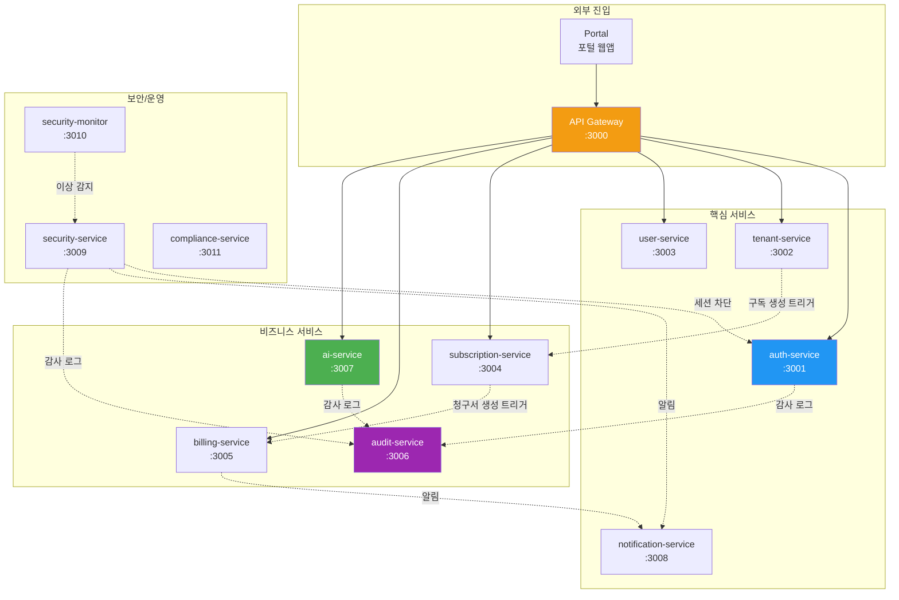
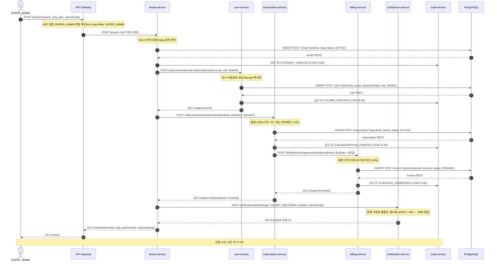
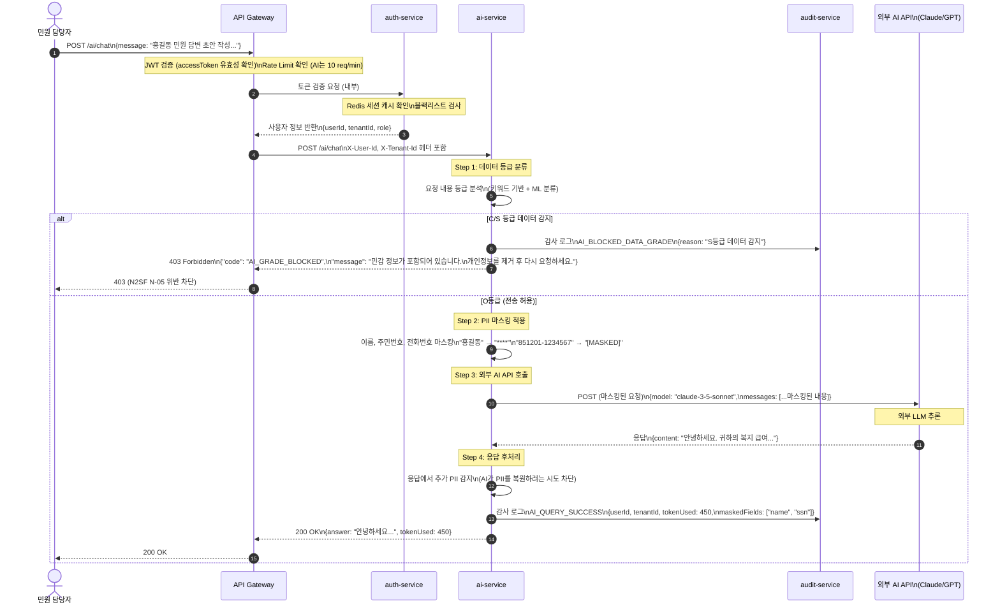
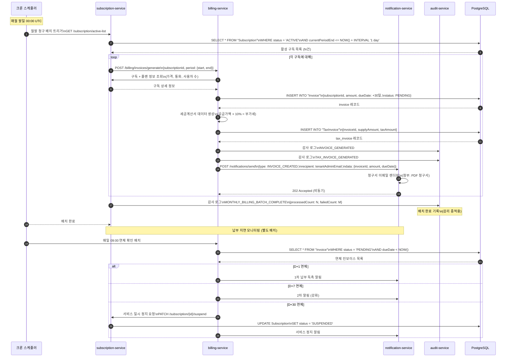
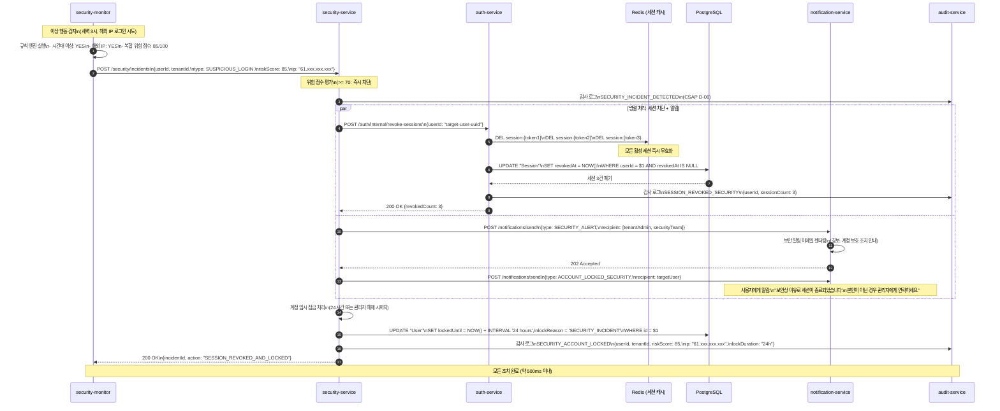

# 서비스 간 협업 — 비즈니스 시나리오로 이해하는 실제 흐름

> **문서 ID**: ONBOARD-02-04
> **버전**: 1.0.0 | **작성일**: 2026-04-12 | **작성자**: Implementer (Sonnet)
> **선행 학습**: `03-data-flow.md` 필수, `services/` 폴더 주요 서비스 개요 권장
> **소요 시간**: 약 3시간

---

## 목차

1. [이 문서의 목적 — 왜 시나리오 기반인가](#1-이-문서의-목적--왜-시나리오-기반인가)
2. [시나리오 1: 신규 테넌트 온보딩](#2-시나리오-1-신규-테넌트-온보딩)
3. [시나리오 2: AI 기능 호출](#3-시나리오-2-ai-기능-호출)
4. [시나리오 3: 청구서 생성 (월말 배치)](#4-시나리오-3-청구서-생성-월말-배치)
5. [시나리오 4: 보안 알림 및 세션 차단](#5-시나리오-4-보안-알림-및-세션-차단)
6. [오류 전파 패턴 — 서비스 다운 시 영향 범위](#6-오류-전파-패턴--서비스-다운-시-영향-범위)
7. [Degraded Mode — 부분 장애 시 대체 동작](#7-degraded-mode--부분-장애-시-대체-동작)
8. [변경 이력](#8-변경-이력)

---

## 1. 이 문서의 목적 — 왜 시나리오 기반인가

`03-data-flow.md`는 데이터가 어떤 경로로 이동하는지를 설명했습니다. 이 문서는 **비즈니스 시나리오** 관점에서 "신규 공공기관이 우리 SaaS에 가입할 때 어떤 일이 벌어지는가", "AI 기능 버튼을 클릭하면 내부에서 무슨 일이 일어나는가"와 같은 질문에 답합니다.

실제 개발 업무에서 이 이해가 필요한 순간:

- 신규 서비스에 기능을 추가할 때 어떤 서비스와 연동이 필요한지 파악
- 버그 리포트를 받았을 때 어느 서비스의 로그를 먼저 봐야 하는지 결정
- 장애 발생 시 영향 범위와 보상 트랜잭션 실행 순서 파악

### 1.1 이 시스템의 서비스 지도



---

## 2. 시나리오 1: 신규 테넌트 온보딩

### 2.1 비즈니스 맥락

"경기도 OO시"가 우리 공공기관 SaaS를 도입하기로 결정했습니다. 시스템 관리자가 포털에 접속하여 신규 기관을 등록하고 초기 관리자를 설정하는 전체 과정입니다.

이 시나리오는 다음 서비스가 순서대로 참여합니다:

```
API Gateway → Auth → Tenant Service → User Service
→ Subscription Service → Billing Service → Notification Service
```

### 2.2 단계별 데이터 흐름

**1단계: SUPER_ADMIN이 새 테넌트 생성 요청**

```json
// POST /tenants
{
  "name": "경기도 OO시",
  "slug": "gyeonggi-oo-city",
  "plan": "standard",
  "adminEmail": "admin@oo-city.go.kr",
  "adminName": "홍길동"
}
```

**2단계: API Gateway에서 JWT 검증**

요청자(SUPER_ADMIN)의 JWT를 검증합니다. tenant-service는 JWT를 직접 검증하지 않습니다. API Gateway가 한 번만 검증하고 사용자 정보를 헤더로 전달합니다.

```
X-User-Id: super-admin-uuid
X-User-Role: SUPER_ADMIN
X-Tenant-Id: platform (플랫폼 자체)
```

**3단계: Tenant Service — 테넌트 생성**

- 슬러그(`gyeonggi-oo-city`) 중복 확인
- Tenant 레코드 생성
- 감사 로그 기록 (CSAP D-06: TENANT_CREATED)

**4단계: User Service — 초기 관리자 계정 생성**

Tenant Service가 User Service를 내부 HTTP 호출로 요청합니다.

```typescript
// tenant-service 내부 코드 패턴
await userServiceClient.post('/users/internal/create-admin', {
  tenantId: newTenant.id,
  email: body.adminEmail,
  name: body.adminName,
  role: 'ADMIN',
})
```

**5단계: Subscription Service — 초기 구독 생성**

테넌트 생성 완료 후 선택한 플랜으로 구독을 자동 생성합니다.

```typescript
// 선택한 플랜으로 구독 생성
await subscriptionServiceClient.post('/subscription/internal/create', {
  tenantId: newTenant.id,
  planSlug: body.plan,  // 'standard'
  startDate: new Date().toISOString(),
})
```

**6단계: Billing Service — 첫 청구서 생성**

구독 생성 이벤트를 받아 첫 인보이스를 생성합니다.

```typescript
// subscription-service가 billing-service 호출
await billingServiceClient.post('/billing/invoices/generate', {
  subscriptionId: newSubscription.id,
  dueDate: addDays(new Date(), 30).toISOString(),
})
```

**7단계: Notification Service — 환영 이메일 발송**

온보딩 완료 후 초기 관리자에게 환영 이메일을 발송합니다.

```typescript
// notification-service 호출 (비동기, 실패해도 온보딩 완료 처리)
await notificationServiceClient.post('/notifications/send', {
  type: 'TENANT_WELCOME',
  recipient: body.adminEmail,
  data: {
    tenantName: body.name,
    adminName: body.adminName,
    loginUrl: `https://portal.saas.go.kr/login?tenant=${body.slug}`,
    tempPassword: generatedTempPassword,  // 마스킹 처리 후 발송
  },
})
```

### 2.3 시퀀스 다이어그램 (전체)



### 2.4 실패 시 보상 트랜잭션 (Saga 패턴)

온보딩은 여러 서비스에 걸쳐 있어 중간에 실패할 수 있습니다. 이 시스템은 Saga 패턴으로 보상 트랜잭션을 처리합니다.

```
실패 시나리오별 처리:

시나리오 A: User Service 호출 실패
  → Tenant Service가 생성한 Tenant 레코드를 삭제 (보상 트랜잭션)
  → 클라이언트에게 500 Internal Server Error 반환
  → 감사 로그: TENANT_CREATION_FAILED

시나리오 B: Subscription Service 호출 실패
  → User Service에 생성된 관리자 계정 삭제
  → Tenant Service에 생성된 테넌트 삭제
  → 감사 로그: SUBSCRIPTION_CREATION_FAILED

시나리오 C: Notification Service 실패 (이메일 미발송)
  → 온보딩 자체는 완료 처리 (알림은 부가적)
  → Notification Service의 재시도 큐에 추가
  → 최대 3회 재시도 후 실패 시 운영팀에 수동 발송 요청
```

```typescript
// Saga 패턴 구현 예시 (tenant-service 내부)
async function createTenantWithSaga(body: CreateTenantDto) {
  let tenantId: string | null = null
  let userId: string | null = null

  try {
    // Step 1: 테넌트 생성
    const tenant = await tenantRepository.create(body)
    tenantId = tenant.id

    // Step 2: 관리자 계정 생성
    const user = await userServiceClient.createAdmin({
      tenantId: tenant.id,
      email: body.adminEmail,
    })
    userId = user.id

    // Step 3: 구독 생성 (실패 시 위로 throw)
    const subscription = await subscriptionServiceClient.create({
      tenantId: tenant.id,
      planSlug: body.plan,
    })

    // Step 4: 알림 (실패해도 진행)
    notificationServiceClient.sendWelcome({
      email: body.adminEmail,
      tenantName: body.name,
    }).catch(err => {
      logger.warn('환영 이메일 발송 실패 (재시도 큐 등록)', { err })
    })

    return { tenant, user, subscription }
  } catch (error) {
    // 보상 트랜잭션 실행
    logger.error('테넌트 온보딩 실패, 보상 트랜잭션 시작', { error })

    if (userId) {
      await userServiceClient.deleteUser(userId).catch(compensationError =>
        logger.error('보상 실패: 사용자 삭제', { compensationError })
      )
    }
    if (tenantId) {
      await tenantRepository.delete(tenantId).catch(compensationError =>
        logger.error('보상 실패: 테넌트 삭제', { compensationError })
      )
    }

    throw error
  }
}
```

---

## 3. 시나리오 2: AI 기능 호출

### 3.1 비즈니스 맥락

"OO시 민원 담당자"가 포털에서 "AI 민원 답변 초안 작성" 버튼을 클릭합니다. 이 기능은 민원 내용을 AI에 전달하고 초안을 생성해줍니다.

이 시나리오는 N2SF 데이터 등급 검사와 PII 마스킹이 핵심입니다.

```
Portal → API Gateway → Auth → AI Service → N2SF 체크
→ PII 마스킹 → 외부 AI API 호출 → Audit
```

### 3.2 N2SF 데이터 등급 검사 위치

AI API 호출 전에 반드시 데이터 등급을 확인해야 합니다.

```
데이터 등급 분류 (N2SF):
  C등급 (기밀): 개인 식별 정보, 의료 기록 → AI API 전송 절대 금지
  S등급 (민감): 재정 정보, 민원 상세 내용 → AI API 전송 절대 금지
  O등급 (일반): 공개 가능 정보 → PII 마스킹 후 AI API 전송 허용

검사 위치: ai-service 내부 (API Gateway 통과 후)
```

### 3.3 PII 마스킹 적용 지점

```
사용자 질의 예시 (원본):
  "홍길동(주민번호: 851201-1234567)의 복지 급여 신청 건에 대한
   답변 초안을 작성해주세요."

마스킹 후 AI API 전달 내용:
  "****(주민번호: [MASKED])의 복지 급여 신청 건에 대한
   답변 초안을 작성해주세요."

마스킹 패턴:
  - 이름: /[가-힣]{2,4}/g → ****
  - 주민번호: /\d{6}-\d{7}/g → [MASKED]
  - 전화번호: /\d{3}-\d{4}-\d{4}/g → [MASKED]
  - 이메일: /\S+@\S+\.\S+/g → [MASKED]
```

### 3.4 시퀀스 다이어그램



### 3.5 AI 서비스에서 주의해야 할 구현 패턴

```typescript
// platform/services/ai-service/src/lib/rag-engine.ts 패턴

// ✅ 올바른 구현: 등급 검사 → 마스킹 → 호출
async function processAiRequest(
  userMessage: string,
  userId: string,
  tenantId: string
): Promise<AiResponse> {
  // 1. 데이터 등급 분류
  const grade = await classifyDataGrade(userMessage)

  if (grade === DataGrade.C || grade === DataGrade.S) {
    await auditLog({
      actor: userId,
      action: 'AI_BLOCKED_DATA_GRADE',
      metadata: { grade, tenantId },
      timestamp: new Date().toISOString(),
    })
    throw new ForbiddenError('N2SF N-05: C/S등급 데이터는 AI API 전송 금지')
  }

  // 2. PII 마스킹
  const maskedMessage = await maskPII(userMessage)
  const maskedFields = getMaskedFields(userMessage, maskedMessage)

  // 3. 외부 AI API 호출 (마스킹된 데이터만)
  const response = await aiGateway.send({
    model: process.env.AI_MODEL,
    messages: [{ role: 'user', content: maskedMessage }],
  })

  // 4. 감사 로그 (CSAP D-06)
  await auditLog({
    actor: userId,
    action: 'AI_QUERY_SUCCESS',
    metadata: { tenantId, tokenUsed: response.tokenUsed, maskedFields },
    timestamp: new Date().toISOString(),
  })

  return response
}

// ❌ 절대 금지: 마스킹 없이 직접 전달
async function badImplementation(userMessage: string) {
  return aiGateway.send({ messages: [{ role: 'user', content: userMessage }] })
  // N2SF N-05 위반 — 감리 결함
}
```

---

## 4. 시나리오 3: 청구서 생성 (월말 배치)

### 4.1 비즈니스 맥락

매월 말일 자정, 시스템이 자동으로 모든 활성 구독에 대한 청구서를 생성합니다. 공공기관 특성상 전자세금계산서 발행이 필수이며, 납부 지연 처리 로직도 포함됩니다.

### 4.2 월말 배치 처리 패턴

```
트리거: 매월 말일 00:00 (크론 스케줄러)
처리 대상: status=ACTIVE인 모든 Subscription

처리 순서:
  1. Subscription Service: 활성 구독 목록 조회
  2. Billing Service: 각 구독에 대한 인보이스 생성
  3. Billing Service: 세금계산서 데이터 생성
  4. Notification Service: 청구서 발송 이메일 (각 테넌트 관리자)
  5. Audit Service: 배치 처리 완료 감사 로그

오류 처리: 개별 실패 → 재시도 큐 등록, 배치 전체는 계속 진행
```

### 4.3 결제 실패 처리 및 재시도

```
결제 실패 시나리오:
  가상계좌 미납 (기한 초과):
    D+1: 미납 알림 이메일 발송
    D+7: 2차 알림 + 담당자 SMS
    D+30: 서비스 일시 정지 (Subscription status → SUSPENDED)
    D+60: 계약 해지 처리 (Subscription status → CANCELED)

  시스템 오류 (API 타임아웃 등):
    즉시: 재시도 큐 등록 (지수 백오프: 1분 → 5분 → 30분)
    3회 실패: 운영팀 Slack 알림
    수동 처리 대기
```

### 4.4 시퀀스 다이어그램



### 4.5 결제 실패 재시도 패턴

```typescript
// billing-service의 재시도 로직 패턴
import { EventBus } from '@public-saas/event-bus'

async function generateInvoiceWithRetry(
  subscriptionId: string,
  attempt = 1
): Promise<void> {
  try {
    await generateInvoice(subscriptionId)
  } catch (error) {
    if (attempt >= 3) {
      // 3회 실패 시 운영팀 알림
      await notificationService.alertOps({
        type: 'INVOICE_GENERATION_FAILED',
        subscriptionId,
        error: error.message,
      })
      await auditLog({
        action: 'INVOICE_GENERATION_FAILED_PERMANENT',
        metadata: { subscriptionId, attempts: attempt },
        timestamp: new Date().toISOString(),
      })
      return
    }

    // 지수 백오프: 1분, 5분, 30분
    const delayMinutes = [1, 5, 30][attempt - 1]
    await EventBus.emit('invoice.retry', {
      subscriptionId,
      attempt: attempt + 1,
      retryAfter: addMinutes(new Date(), delayMinutes),
    })
  }
}
```

---

## 5. 시나리오 4: 보안 알림 및 세션 차단

### 5.1 비즈니스 맥락

Security Monitor 서비스가 "OO시 관리자 계정에서 비정상적인 패턴"을 감지했습니다. 평소 업무 시간(09:00-18:00)에만 로그인하던 계정이 새벽 3시에 해외 IP에서 로그인을 시도하고 있습니다.

이 시나리오는 이상 행동 감지부터 세션 즉시 차단까지의 흐름입니다.

```
Security Monitor → Security Service → Auth Service (세션 차단)
→ Notification → Audit
```

### 5.2 이상 행동 탐지 기준

```
탐지 규칙 (Security Monitor):

Rule 1 — 비정상 시간대 로그인:
  정상 패턴: 업무 시간 (09:00-18:00) 로그인
  이상 감지: 자정~06:00 사이 로그인 시도
  임계값: 3회 시도 시 알림

Rule 2 — 해외 IP 접근:
  한국 IP 범위 이외 접근 감지
  즉시 알림 (1회도 감지 시)

Rule 3 — 단시간 다수 요청:
  5분 내 50회 이상 API 요청
  Rate Limit과 별개로 추가 분석

Rule 4 — 동시 세션 이상:
  이미 세션이 3개인데 4번째 로그인 시도
  → Auth Service가 가장 오래된 세션 강제 종료
```

### 5.3 시퀀스 다이어그램



### 5.4 세션 차단 후 사용자 경험

```
사용자가 다음 API 요청 시:
  → Redis에서 세션 조회 실패 (삭제됨)
  → API Gateway: 401 Unauthorized
  → 응답: {"code": "SESSION_REVOKED", "message": "보안상 이유로 재로그인이 필요합니다."}
  → 포털: 로그인 페이지로 리다이렉트

사용자가 재로그인 시도 시:
  → Auth Service: lockedUntil 확인
  → 잠금 중인 경우 401 반환
  → 응답: {"code": "AUTH_ACCOUNT_LOCKED",
             "message": "보안 조치로 계정이 잠겼습니다. 관리자에게 문의하세요.",
             "lockedUntil": "2026-04-13T09:00:00Z"}
```

### 5.5 계정 잠금 해제 (관리자 처리)

```typescript
// security-service 내부 패턴
async function unlockAccount(
  adminUser: AuthenticatedUser,
  targetUserId: string,
  reason: string
): Promise<void> {
  // SUPER_ADMIN 또는 SECURITY_ADMIN만 잠금 해제 가능
  if (!['SUPER_ADMIN', 'SECURITY_ADMIN'].includes(adminUser.role)) {
    throw new ForbiddenError('계정 잠금 해제 권한 없음')
  }

  await db.user.update({
    where: { id: targetUserId },
    data: {
      lockedUntil: null,
      lockReason: null,
    },
  })

  await auditLog({
    actor: adminUser.id,
    action: 'ACCOUNT_UNLOCKED',
    target: targetUserId,
    metadata: { reason },
    timestamp: new Date().toISOString(),
  })
}
```

---

## 6. 오류 전파 패턴 — 서비스 다운 시 영향 범위

### 6.1 서비스별 장애 영향도 매트릭스

각 서비스가 다운될 때 어떤 기능이 영향받는지 정리합니다.

| 다운된 서비스 | 직접 영향 | 간접 영향 | 정상 동작 유지 |
|------------|---------|---------|------------|
| **API Gateway** | 전체 서비스 불가 | 모든 서비스 | 없음 (단일 진입점) |
| **auth-service** | 로그인 불가, 토큰 갱신 불가 | 새 세션 생성 불가 | 기존 유효 세션은 Redis 캐시로 계속 동작 |
| **tenant-service** | 테넌트 생성/수정 불가 | 온보딩 불가 | 기존 테넌트 서비스 계속 이용 |
| **user-service** | 사용자 관리 불가 | 신규 사용자 추가 불가 | 기존 사용자 로그인/이용 계속 |
| **subscription-service** | 구독 변경 불가 | 청구 배치 일부 실패 | 기존 구독 유지, 기능 이용 계속 |
| **billing-service** | 인보이스 생성 불가 | 월말 배치 실패 | 구독 상태는 유지 (서비스 이용 계속) |
| **notification-service** | 이메일/알림 불가 | 보안 알림 지연 | 핵심 기능 계속 동작 |
| **audit-service** | 감사 로그 기록 불가 | CSAP D-06 위반 위험 | 기능은 동작하나 감사 추적 불가 |
| **ai-service** | AI 기능 불가 | AI 관련 기능 중단 | 비 AI 기능 정상 |
| **security-monitor** | 이상 탐지 중단 | 보안 대응 지연 | 기능은 정상, 보안 감시 약화 |

### 6.2 Circuit Breaker 작동 위치

이 시스템에서 Circuit Breaker는 다음 지점에서 작동합니다.

```
Circuit Breaker가 있는 서비스 간 호출:

tenant-service → user-service
  상태: CLOSED (정상) | OPEN (차단) | HALF_OPEN (테스트 중)
  OPEN 전환 조건: 5초 내 5회 연속 실패 또는 50% 에러율
  OPEN 지속 시간: 30초
  폴백 동작: 테넌트 생성 실패 (보상 트랜잭션 실행)

subscription-service → billing-service
  OPEN 전환 조건: 5초 내 3회 연속 실패
  폴백 동작: 청구서 생성 재시도 큐에 등록 (비동기 처리)
  → 즉각 실패 대신 나중에 재시도

any-service → notification-service
  OPEN 전환 조건: 10초 내 10회 연속 실패
  폴백 동작: 알림 큐에 보관 (notification-service 복구 후 발송)
  → 알림은 핵심 기능이 아니므로 폴백 허용
```

```typescript
// Circuit Breaker 구현 패턴 (04-advanced-patterns.md 참조)
class CircuitBreaker {
  private state: 'CLOSED' | 'OPEN' | 'HALF_OPEN' = 'CLOSED'
  private failureCount = 0
  private lastFailureTime: Date | null = null

  async call<T>(fn: () => Promise<T>, fallback?: () => T): Promise<T> {
    if (this.state === 'OPEN') {
      const elapsed = Date.now() - this.lastFailureTime!.getTime()

      if (elapsed > 30_000) {
        this.state = 'HALF_OPEN'  // 30초 후 테스트 허용
      } else if (fallback) {
        return fallback()         // 폴백 실행
      } else {
        throw new Error('Circuit OPEN: 서비스 일시 불가')
      }
    }

    try {
      const result = await fn()
      if (this.state === 'HALF_OPEN') {
        this.state = 'CLOSED'    // 성공 시 정상 복구
        this.failureCount = 0
      }
      return result
    } catch (error) {
      this.failureCount++
      this.lastFailureTime = new Date()

      if (this.failureCount >= 5) {
        this.state = 'OPEN'      // 실패 임계값 초과 → 차단
      }
      throw error
    }
  }
}
```

---

## 7. Degraded Mode — 부분 장애 시 대체 동작

### 7.1 Degraded Mode 개념

일부 서비스가 다운되어도 핵심 기능은 유지해야 합니다. 이를 "저하 모드(Degraded Mode)"라고 합니다.

```
정상 모드 (Full Mode):
  모든 기능 사용 가능
  실시간 알림 제공
  AI 기능 포함

저하 모드 1 (notification-service DOWN):
  핵심 기능 정상
  이메일/알림 지연 (큐에 저장, 복구 후 발송)
  사용자에게 "알림이 지연될 수 있습니다" 배너 표시

저하 모드 2 (ai-service DOWN):
  비 AI 기능 정상
  AI 기능 버튼 비활성화
  사용자에게 "AI 기능 일시 중단" 안내

저하 모드 3 (audit-service DOWN):
  모든 기능 정상 동작 (사용자 체감 영향 없음)
  단, 감사 로그 기록 불가 → CSAP D-06 위반 위험
  운영팀 즉시 알림 (30분 내 복구 필요)
  감사 로그 로컬 버퍼링 → audit-service 복구 후 일괄 기록
```

### 7.2 Auth Service 캐시 폴백

Auth Service가 다운되어도 기존 세션 사용자는 계속 이용할 수 있는 구조:

```
정상 상태:
  요청 → API Gateway → Redis 캐시 확인 → (없으면) auth-service 검증

auth-service DOWN 시:
  요청 → API Gateway → Redis 캐시 확인
         → 캐시 히트: 세션 유효 → 요청 통과 (auth-service 없이)
         → 캐시 미스: 401 (재로그인 필요)

결과:
  기존 로그인 사용자 (캐시 유효): 계속 이용 가능 (최대 15분)
  신규 로그인 시도: 실패
  토큰 갱신: 실패
```

```typescript
// API Gateway의 JWT 검증 폴백 패턴
async function verifyToken(token: string): Promise<User> {
  // 1. Redis 캐시 먼저 확인 (빠름)
  const cached = await redis.get(`session:${token}`)
  if (cached) {
    return JSON.parse(cached)
  }

  // 2. auth-service 호출 (캐시 미스 시)
  try {
    const user = await authServiceClient.verify(token)
    // 캐시 갱신 (15분 TTL)
    await redis.setex(`session:${token}`, 900, JSON.stringify(user))
    return user
  } catch (authServiceError) {
    // auth-service DOWN 시: 캐시에 없으면 인증 실패
    logger.warn('auth-service 불가, 캐시 폴백 실패', { error: authServiceError })
    throw new UnauthorizedError('인증 서비스 일시 불가')
  }
}
```

### 7.3 헬스체크와 Degraded 상태 노출

각 서비스는 의존 서비스의 상태를 헬스체크 응답에 포함합니다.

```typescript
// Fastify 헬스체크 엔드포인트 패턴
app.get('/health', async () => {
  const dbStatus = await checkDatabaseConnection()
  const redisStatus = await checkRedisConnection()
  const dependencies = await checkDependencies()

  const isHealthy = dbStatus && redisStatus
  const isDegraded = !dependencies.notificationService

  return {
    status: isHealthy ? (isDegraded ? 'degraded' : 'healthy') : 'unhealthy',
    timestamp: new Date().toISOString(),
    version: process.env.SERVICE_VERSION,
    dependencies: {
      database: dbStatus ? 'healthy' : 'unhealthy',
      redis: redisStatus ? 'healthy' : 'unhealthy',
      notificationService: dependencies.notificationService ? 'healthy' : 'degraded',
    },
  }
})

// 응답 예시 (notification-service DOWN 시):
// {
//   "status": "degraded",
//   "dependencies": {
//     "database": "healthy",
//     "redis": "healthy",
//     "notificationService": "degraded"
//   }
// }
```

### 7.4 Degraded Mode 모니터링 알림

```yaml
# infra/monitoring/ — Prometheus AlertRule 패턴
groups:
  - name: degraded-mode
    rules:
      - alert: ServiceDegraded
        expr: |
          kube_deployment_status_replicas_available{deployment="notification-service"} == 0
        for: 1m
        labels:
          severity: warning
        annotations:
          summary: "notification-service DOWN — Degraded Mode 진입"
          description: "알림 기능이 중단되었습니다. 이메일/SMS 발송이 지연됩니다."

      - alert: AuditServiceDown
        expr: |
          kube_deployment_status_replicas_available{deployment="audit-service"} == 0
        for: 30s
        labels:
          severity: critical
        annotations:
          summary: "audit-service DOWN — CSAP D-06 위반 위험"
          description: "30분 내 복구 필요. 감사 로그 누락 발생 중."
```

---

## 8. 변경 이력

| 버전 | 일자 | 내용 | 작성자 |
|------|------|------|--------|
| 1.0.0 | 2026-04-12 | 최초 작성 — 4가지 핵심 비즈니스 시나리오 및 오류 전파 패턴 | Implementer (Sonnet) |

---

> **참조**: `services/08-subscription-service.md` — 구독 서비스 상세
> **참조**: `services/09-billing-service.md` — 청구 서비스 상세
> **참조**: `03-data-flow.md` — 개별 데이터 흐름 상세
> **참조**: `03-development/04-advanced-patterns.md` — Circuit Breaker, Saga 구현 패턴
> **CSAP 연관**: D-06 (감사 로그), D-08 (접근 통제), D-12 (입력 검증)
> **N2SF 연관**: N-05 (AI API 데이터 등급 통제)
