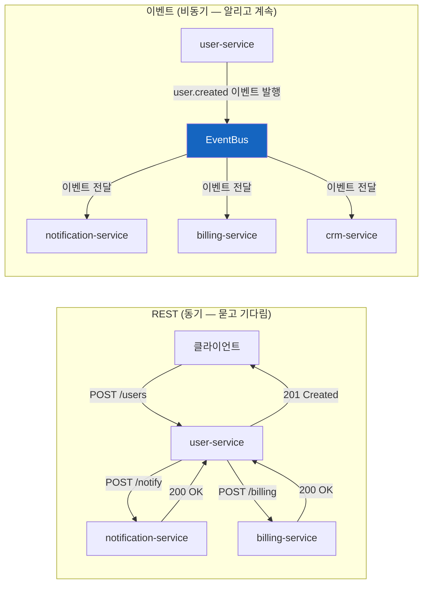
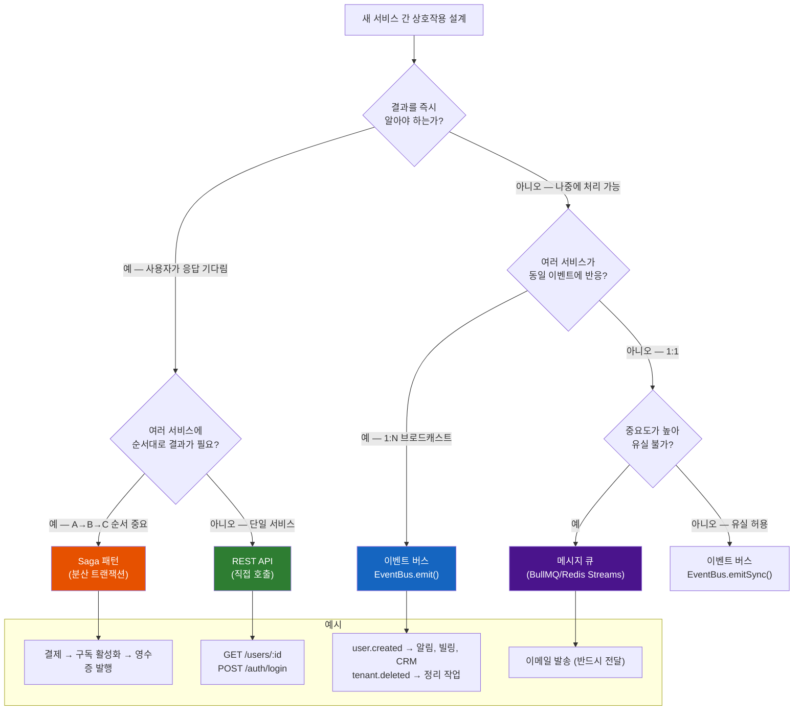
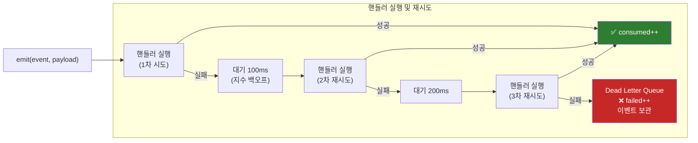
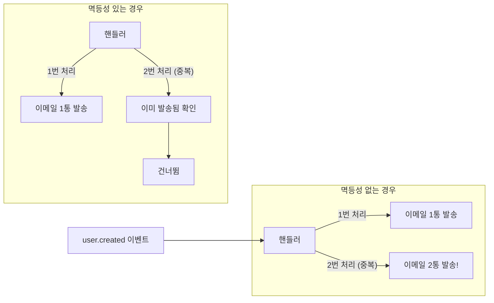
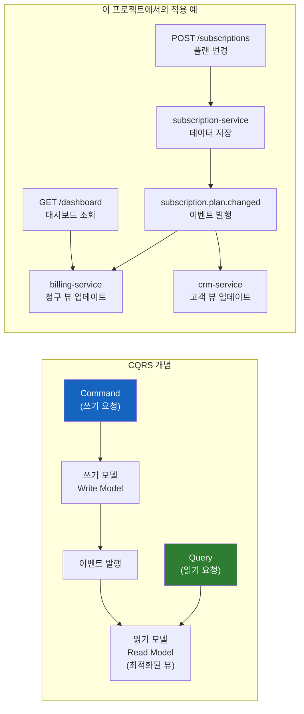

# 이벤트 주도 아키텍처(EDA) 완벽 가이드

> **문서 ID**: ONBOARD-02-05
> **버전**: 1.0.0 | **작성일**: 2026-04-12 | **작성자**: Implementer (Sonnet)
> **학습 대상**: REST API는 알지만 이벤트 기반 통신이 낯선 개발자
> **예상 소요 시간**: 약 3시간
> **선행 문서**:
>   - `01-system-overview.md` (시스템 전체 구조 이해 후)
>   - `services/00-communication-patterns.md` (통신 패턴 개요 이해 후)
> **CSAP**: D-06 (이벤트 추적), D-08 (접근 제어)
> **코드 참조**: `platform/packages/event-bus/src/event-bus.ts`

---

## 목차

1. [이벤트 주도 아키텍처(EDA)란?](#1-이벤트-주도-아키텍처eda란)
2. [동기 REST vs 비동기 이벤트 — 언제 무엇을 쓸까?](#2-동기-rest-vs-비동기-이벤트--언제-무엇을-쓸까)
3. [이 프로젝트의 EventBus 구현](#3-이-프로젝트의-eventbus-구현)
4. [이벤트 스키마 설계](#4-이벤트-스키마-설계)
5. [패턴 매칭과 와일드카드](#5-패턴-매칭과-와일드카드)
6. [Dead Letter Queue — 실패한 이벤트 처리](#6-dead-letter-queue--실패한-이벤트-처리)
7. [이벤트 유형별 설계](#7-이벤트-유형별-설계)
8. [이벤트 발행하기](#8-이벤트-발행하기)
9. [이벤트 구독하기](#9-이벤트-구독하기)
10. [멱등성(Idempotency) 보장](#10-멱등성idempotency-보장)
11. [이벤트 소싱과 CQRS 간단 소개](#11-이벤트-소싱과-cqrs-간단-소개)
12. [이벤트 디버깅](#12-이벤트-디버깅)
13. [실습: subscription.plan.changed 이벤트 구현](#13-실습-subscriptionplanchanged-이벤트-구현)
14. [학습 체크리스트](#학습-체크리스트)
15. [다음 단계](#다음-단계)

---

## 1. 이벤트 주도 아키텍처(EDA)란?

### 기본 개념

이벤트 주도 아키텍처(Event-Driven Architecture, EDA)는 시스템의 구성 요소들이
**이벤트(사건의 발생)**를 통해 서로 통신하는 방식입니다.

이벤트란 무엇인가? 시스템 안에서 일어난 **사실(fact)**입니다.

```
UserCreated        — "사용자 홍길동이 생성되었다"
PlanChanged        — "테넌트 A가 Basic에서 Pro로 변경했다"
PaymentFailed      — "결제가 실패했다"
SecurityAlertRaised — "비정상 로그인 시도가 감지되었다"
```

이벤트는 **과거형**으로 명명합니다. 미래가 아닌 이미 발생한 사실이기 때문입니다.

### REST와 이벤트의 근본적 차이



| 구분 | REST (동기) | 이벤트 (비동기) |
|------|-----------|--------------|
| 응답 방식 | 즉시 응답 대기 | 응답 없이 계속 진행 |
| 결합도 | 강결합 (호출자가 피호출자를 알아야 함) | 느슨한 결합 (이벤트만 알면 됨) |
| 장애 전파 | 피호출자 장애 → 호출자도 실패 | 소비자 장애 → 발행자 영향 없음 |
| 확장성 | 새 소비자 추가 시 발행자 코드 수정 필요 | 새 소비자가 구독만 하면 됨 |
| 디버깅 | 직관적 (스택 트레이스 추적 가능) | 어려움 (비동기 흐름 추적 필요) |

---

## 2. 동기 REST vs 비동기 이벤트 — 언제 무엇을 쓸까?



### 실제 사례로 이해하기

**사례 1: 사용자가 로그인한다 → REST API**

```
이유: 사용자는 "로그인 성공"이라는 즉각적인 피드백이 필요합니다.
     토큰을 받아야 다음 요청을 할 수 있습니다.
방법: POST /auth/login → 즉시 JWT 토큰 반환
```

**사례 2: 새 테넌트가 가입한다 → 이벤트**

```
이유: 테넌트 생성 후 알림 발송, 빌링 초기화, CRM 등록이 필요합니다.
     각각이 독립적으로 처리될 수 있고, 속도보다 안정성이 중요합니다.
방법: tenant.created 이벤트 발행
     → notification-service: 가입 환영 이메일
     → billing-service: 초기 청구 설정
     → crm-service: 고객 정보 등록
```

**사례 3: 구독 플랜 변경 → 이벤트**

```
이유: 플랜 변경은 여러 서비스에 영향을 주지만 즉각 반영 필요는 없습니다.
방법: subscription.plan.changed 이벤트 발행
     → billing-service: 새 요금으로 청구
     → notification-service: 변경 안내 이메일
```

---

## 3. 이 프로젝트의 EventBus 구현

### 아키텍처 위치

```
platform/packages/event-bus/
├── src/
│   ├── event-bus.ts          ← 핵심 구현체
│   ├── event-bus-plugin.ts   ← Fastify 플러그인 (서비스에서 사용)
│   └── index.ts              ← 패키지 공개 API
```

### EventBus 클래스 구조

```typescript
// platform/packages/event-bus/src/event-bus.ts
// Design Ref: SVC-EVENT-R17 Plan
// Plan SC: FR-EVT.2

export class EventBus {
  // 이벤트명 → 핸들러 Set (한 이벤트에 여러 핸들러 등록 가능)
  private readonly handlers = new Map<string, Set<EventHandler>>();

  // 처리 실패한 이벤트를 보관하는 Dead Letter Queue
  private readonly deadLetterQueue: DeadLetterItem[] = [];

  // 통계 (모니터링용)
  private stats: EventStats = { published: 0, consumed: 0, failed: 0, ... };

  constructor(options: EventBusOptions = {}) {
    this.maxRetries = options.maxRetries ?? 3;         // 실패 시 최대 3번 재시도
    this.retryBaseDelay = options.retryBaseDelay ?? 100; // 초기 대기 100ms
    this.maxDeadLetters = options.maxDeadLetters ?? 1000; // DLQ 최대 1000개
  }

  on(event, handler)     // 이벤트 구독
  off(event, handler)    // 이벤트 구독 해제
  once(event, handler)   // 일회성 구독
  emit(event, payload)   // 이벤트 발행 (비동기, await 가능)
  emitSync(event, payload) // 이벤트 발행 (fire-and-forget)
  getDeadLetters()       // DLQ 조회
  getStats()             // 통계 조회
}
```

### Fastify에서 이벤트 버스 등록

```typescript
// 서비스의 app.ts 또는 index.ts에서
import { eventBusPlugin } from '@public-saas/event-bus'

await app.register(eventBusPlugin, {
  maxRetries: 3,           // 실패 시 최대 재시도 횟수
  retryBaseDelay: 100,     // 첫 재시도 전 대기 시간 (ms)
  maxDeadLetters: 1000,    // Dead Letter Queue 최대 크기
  exposeStats: true,       // GET /events/stats 엔드포인트 활성화
  exposeDeadLetters: true, // GET /events/dead-letters 엔드포인트 활성화
})

// 등록 후: app.events로 EventBus 인스턴스에 접근 가능
app.events.emit('user.created', { userId, email })
```

### 인메모리 vs Redis Pub/Sub 비교

현재 이 프로젝트의 EventBus는 **프로세스 내 인메모리** 방식입니다.

| 구분 | 현재 구현 (인메모리) | Redis Pub/Sub (향후 확장) |
|------|-------------------|------------------------|
| 범위 | 단일 프로세스 내 | 여러 서버/프로세스 간 |
| 속도 | 매우 빠름 (메모리 직접) | 네트워크 레이턴시 있음 |
| 내구성 | 프로세스 재시작 시 손실 | Redis 재시작 시 손실 |
| 적합한 상황 | 단일 서비스 내부, 알림 트리거 | 여러 서비스 간 브로드캐스트 |

> 💡 **현재 전략**: 서비스 내부 이벤트(예: notification-service 내부)는 인메모리 EventBus를 사용합니다.
> 서비스 간 이벤트가 필요한 경우 Redis Streams 또는 NATS로 확장을 검토합니다.

---

## 4. 이벤트 스키마 설계

### EventEnvelope 구조

모든 이벤트는 일관된 봉투(Envelope) 구조를 따릅니다.

```typescript
// 이벤트 봉투 표준 구조
interface EventEnvelope<T = unknown> {
  // 이벤트 고유 식별자 (UUID v4)
  id: string

  // 이벤트명: {domain}.{entity}.{action} 형식
  event: string

  // 이벤트가 발행된 시각 (ISO 8601)
  timestamp: string

  // 이벤트를 발행한 서비스
  source: string

  // 이벤트 데이터 (도메인별 다름)
  payload: T

  // 분산 추적 ID (OTel 연동)
  traceId?: string

  // 이벤트 버전 (하위 호환성)
  version: string

  // 테넌트 ID (멀티테넌트 격리)
  tenantId?: string
}
```

### 실제 이벤트 예시

```typescript
// user.created 이벤트
const userCreatedEvent: EventEnvelope<UserCreatedPayload> = {
  id: 'evt-550e8400-e29b-41d4-a716-446655440000',
  event: 'user.created',
  timestamp: '2026-04-12T09:00:00.000Z',
  source: 'user-service',
  version: '1.0',
  tenantId: 'tenant-abc123',
  payload: {
    userId: 'user-123',
    email: 'hong@agency.go.kr',
    name: '홍길동',
    role: 'USER',
    tenantId: 'tenant-abc123',
  }
}

// subscription.plan.changed 이벤트
const planChangedEvent: EventEnvelope<PlanChangedPayload> = {
  id: 'evt-12345678-...',
  event: 'subscription.plan.changed',
  timestamp: '2026-04-12T10:00:00.000Z',
  source: 'subscription-service',
  version: '1.0',
  tenantId: 'tenant-abc123',
  payload: {
    tenantId: 'tenant-abc123',
    oldPlan: 'basic',
    newPlan: 'pro',
    changedAt: '2026-04-12T10:00:00.000Z',
    changedBy: 'user-admin-001',
  }
}
```

### 이벤트 명명 규칙

```
형식: {domain}.{entity}.{action}

domain: 도메인 영역 (user, tenant, subscription, security, billing, ...)
entity: 변경된 엔티티 (plan, invoice, account, alert, ...)
action: 수행된 동작 — 반드시 과거형 (created, updated, deleted, changed, failed, ...)

올바른 예:
  user.created              ← 사용자 생성됨
  user.deactivated          ← 사용자 비활성화됨
  subscription.plan.changed ← 구독 플랜 변경됨
  security.login_failure    ← 로그인 실패 감지됨
  billing.invoice.generated ← 청구서 생성됨
  tenant.deleted            ← 테넌트 삭제됨

잘못된 예:
  createUser                ← 명사.동사 형식 아님
  user_created              ← 점(.) 구분자 사용 필요
  userCreate                ← 카멜케이스 금지
  user.create               ← 현재형 금지 (과거형 사용)
```

---

## 5. 패턴 매칭과 와일드카드

EventBus는 이벤트명에 와일드카드를 사용하여 여러 이벤트를 한 번에 구독할 수 있습니다.

### 와일드카드 규칙

```
*  — 단일 세그먼트 매칭 (점 하나 범위)
** — 모든 세그먼트 매칭 (전체 범위)
```

### 패턴 매칭 예시

```typescript
// platform/packages/event-bus/src/event-bus.ts 실제 구현 기반

// 정확한 매칭
bus.on('user.created', handler)
// → 'user.created'만 수신

// 단일 와일드카드: user 도메인의 모든 이벤트
bus.on('user.*', handler)
// → 'user.created' ✅
// → 'user.updated' ✅
// → 'user.deactivated' ✅
// → 'subscription.created' ❌ (user 도메인 아님)

// 중첩 와일드카드: subscription 하위의 특정 패턴
bus.on('subscription.*', handler)
// → 'subscription.created' ✅
// → 'subscription.plan' ✅
// → 'subscription.plan.changed' ❌ (세그먼트 3개 — * 는 1개만)

// 이중 와일드카드: subscription 하위 모든 이벤트
bus.on('subscription.**', handler)
// → 'subscription.created' ✅
// → 'subscription.plan.changed' ✅
// → 'subscription.invoice.generated.v2' ✅

// 전체 와일드카드: 모든 이벤트 수신 (감사 로그, 모니터링에 유용)
bus.on('**', auditHandler)
// → 모든 이벤트 수신
```

### 실제 사용 예: notification-service

```typescript
// platform/services/notification-service/src/lib/event-bus.ts 실제 코드
// NotificationEventMap에 정의된 이벤트들

export interface NotificationEventMap {
  'user.created': { userId: string; email: string; tenantId: string; name: string }
  'user.deactivated': { userId: string; tenantId: string }
  'subscription.created': { tenantId: string; planName: string }
  'subscription.expiry_warning': { tenantId: string; daysLeft: number }
  'security.login_failure': { userId: string; ip: string; attempts: number }
  'security.account_locked': { userId: string; ip: string; tenantId: string }
  'compliance.check_completed': { tenantId: string; score: number }
}

// 보안 관련 이벤트를 모두 수신하는 핸들러
notificationEventBus.on('security.login_failure', async (payload) => {
  await sendSlackAlert(`로그인 실패 감지: ${payload.userId}, IP: ${payload.ip}`)
})

notificationEventBus.on('security.account_locked', async (payload) => {
  await sendEmail(payload.userId, 'account-locked', { ip: payload.ip })
})
```

---

## 6. Dead Letter Queue — 실패한 이벤트 처리

### Dead Letter Queue(DLQ)란?

처리 중 오류가 발생한 이벤트가 보관되는 별도의 큐입니다.
재시도를 모두 소진해도 실패하면 DLQ로 이동합니다.



### 지수 백오프(Exponential Backoff)

재시도할 때마다 대기 시간이 2배씩 늘어납니다.

```typescript
// platform/packages/event-bus/src/event-bus.ts 실제 코드
private async executeWithRetry(event: string, payload: unknown, handler: EventHandler): Promise<void> {
  let lastError: Error | null = null

  for (let attempt = 0; attempt <= this.maxRetries; attempt++) {
    try {
      await handler(payload)
      this.stats.consumed++
      return  // 성공 → 종료
    } catch (err) {
      lastError = err instanceof Error ? err : new Error(String(err))

      if (attempt < this.maxRetries) {
        // 지수 백오프: 100ms → 200ms → 400ms
        const delay = this.retryBaseDelay * Math.pow(2, attempt)
        await this.sleep(delay)
      }
    }
  }

  // 3번 모두 실패 → Dead Letter Queue
  this.stats.failed++
  this.addToDeadLetterQueue({
    event,
    payload,
    error: lastError?.message ?? 'Unknown error',
    timestamp: new Date().toISOString(),
    attempts: this.maxRetries + 1,  // 총 시도 횟수
  })
}
```

### DLQ 모니터링 및 처리

```bash
# Dead Letter Queue 내용 확인 (Fastify 엔드포인트)
curl http://localhost:3007/events/dead-letters

# 응답 예시:
# {
#   "success": true,
#   "data": {
#     "count": 2,
#     "items": [
#       {
#         "event": "user.created",
#         "payload": { "userId": "..." },
#         "error": "Database connection timeout",
#         "timestamp": "2026-04-12T09:30:00.000Z",
#         "attempts": 4
#       }
#     ]
#   }
# }

# DLQ 비우기 (수동 처리 후)
curl -X DELETE http://localhost:3007/events/dead-letters
```

```typescript
// DLQ 주기적 모니터링 (서비스 시작 시 등록)
setInterval(() => {
  const deadLetters = app.events.getDeadLetters()
  if (deadLetters.length > 0) {
    logger.warn({ count: deadLetters.length }, '처리 실패 이벤트 발생 — DLQ 확인 필요')
    // 알림 발송 또는 재처리 로직
  }
}, 60_000)  // 1분마다 확인
```

---

## 7. 이벤트 유형별 설계

### Domain Events — 비즈니스 변경 사실

도메인 내부에서 발생한 비즈니스 의미 있는 변화를 나타냅니다.
해당 도메인의 서비스가 발행하고, 동일 또는 다른 도메인이 구독합니다.

```typescript
// Domain Event 예시들

// 사용자 도메인
type UserEvents = {
  'user.created': {
    userId: string
    email: string
    name: string
    role: string
    tenantId: string
    createdAt: string
  }
  'user.deactivated': {
    userId: string
    tenantId: string
    reason: string
    deactivatedBy: string
    deactivatedAt: string
  }
  'user.role.changed': {
    userId: string
    tenantId: string
    oldRole: string
    newRole: string
    changedBy: string
  }
}

// 구독 도메인
type SubscriptionEvents = {
  'subscription.created': {
    tenantId: string
    planId: string
    planName: string
    startsAt: string
    endsAt: string
  }
  'subscription.plan.changed': {
    tenantId: string
    oldPlan: string
    newPlan: string
    changedAt: string
    changedBy: string
  }
  'subscription.expired': {
    tenantId: string
    planName: string
    expiredAt: string
  }
  'subscription.expiry_warning': {
    tenantId: string
    daysLeft: number
    planName: string
  }
}
```

### Integration Events — 서비스 간 협력

여러 서비스가 협력해야 하는 작업에서 발생합니다.
한 서비스의 완료가 다른 서비스의 시작을 트리거합니다.

```typescript
// Integration Event 예시

// 결제 완료 → 구독 활성화 → 영수증 발행 → 이메일 발송
type PaymentIntegrationEvents = {
  'payment.completed': {
    paymentId: string
    tenantId: string
    amount: number
    currency: string
    invoiceId: string
    completedAt: string
  }
  'payment.failed': {
    paymentId: string
    tenantId: string
    reason: string
    retryCount: number
    failedAt: string
  }
}

// 보안 이벤트 — 여러 서비스가 반응해야 함
type SecurityIntegrationEvents = {
  'security.login_failure': {
    userId: string
    ip: string
    userAgent: string
    attempts: number
    tenantId: string
    occurredAt: string
  }
  'security.account_locked': {
    userId: string
    tenantId: string
    ip: string
    lockedAt: string
    unlockAt: string
  }
}
```

### CSAP D-06 감사 이벤트

모든 민감 작업은 감사 로그로 기록되어야 합니다.

```typescript
// 보안 관련 이벤트는 반드시 감사 로그와 연결
import { logSecurityEvent } from '../lib/audit'

async function handleLoginFailure(payload: SecurityLoginFailureEvent) {
  // 1. 비즈니스 로직 (계정 잠금 처리 등)
  if (payload.attempts >= 5) {
    await lockAccount(payload.userId)
  }

  // 2. 감사 로그 기록 (CSAP D-06 필수)
  await logSecurityEvent('LOGIN_FAILURE_PROCESSED', {
    userId: payload.userId,
    ip: payload.ip,
    attempts: payload.attempts,
  })
}
```

---

## 8. 이벤트 발행하기

### 기본 발행 방법

```typescript
// app.events는 Fastify 플러그인으로 등록된 EventBus 인스턴스
// eventBusPlugin 등록 후 사용 가능

// 방법 1: await emit (핸들러 완료까지 기다림)
await app.events.emit('user.created', {
  userId: 'user-123',
  email: 'hong@agency.go.kr',
  name: '홍길동',
  tenantId: 'tenant-abc',
})
// → 모든 구독자가 처리 완료 후 다음 코드 실행

// 방법 2: emitSync (fire-and-forget, 기다리지 않음)
app.events.emitSync('security.login_failure', {
  userId: 'user-456',
  ip: '1.2.3.4',
  attempts: 3,
})
// → 즉시 다음 코드 실행 (구독자 처리 결과 무관)
```

### 실제 핸들러에서 이벤트 발행

```typescript
// platform/services/subscription-service/src/handlers/subscription.handler.ts 기반

import type { FastifyRequest, FastifyReply } from 'fastify'
import { z } from 'zod'
import { logSubscriptionEvent } from '../lib/audit'
import { prisma } from '../lib/prisma'

const changePlanSchema = z.object({
  tenantId: z.string().uuid(),
  newPlanId: z.string().uuid(),
})

export async function changePlanHandler(
  request: FastifyRequest,
  reply: FastifyReply,
): Promise<void> {
  // 1. 입력 검증 (CSAP D-12)
  const parseResult = changePlanSchema.safeParse(request.body)
  if (!parseResult.success) {
    await reply.status(400).send({
      success: false,
      error: { code: 'VALIDATION_ERROR', message: '입력값 오류' },
    })
    return
  }

  const { tenantId, newPlanId } = parseResult.data
  const actor = request.headers['x-user-id'] as string

  // 2. 비즈니스 로직 처리
  const currentSubscription = await prisma.subscription.findFirst({
    where: { tenantId, isActive: true },
    include: { plan: true },
  })
  if (!currentSubscription) {
    await reply.status(404).send({ success: false, error: { code: 'NOT_FOUND' } })
    return
  }

  const newPlan = await prisma.plan.findUnique({ where: { id: newPlanId } })
  if (!newPlan) {
    await reply.status(404).send({ success: false, error: { code: 'PLAN_NOT_FOUND' } })
    return
  }

  // 3. 데이터베이스 업데이트 (매개변수화 쿼리 — CSAP D-12)
  await prisma.subscription.update({
    where: { id: currentSubscription.id },
    data: { planId: newPlanId, updatedAt: new Date() },
  })

  // 4. 이벤트 발행 — 다른 서비스들이 자동으로 반응
  await request.server.events.emit('subscription.plan.changed', {
    tenantId,
    oldPlan: currentSubscription.plan.slug,
    newPlan: newPlan.slug,
    changedAt: new Date().toISOString(),
    changedBy: actor,
  })

  // 5. 감사 로그 기록 (CSAP D-06)
  await logSubscriptionEvent('PLAN_CHANGED', actor, tenantId, {
    oldPlan: currentSubscription.plan.slug,
    newPlan: newPlan.slug,
  })

  await reply.status(200).send({
    success: true,
    data: { message: '플랜 변경 완료' },
  })
}
```

### 일회성 이벤트 구독 (once)

```typescript
// 특정 이벤트를 딱 한 번만 처리
app.events.once('tenant.setup.completed', async (payload) => {
  // 이 핸들러는 한 번만 실행되고 자동으로 해제됨
  await sendWelcomePackage(payload.tenantId)
})
```

---

## 9. 이벤트 구독하기

### 구독 등록 위치

서비스 시작 시 (Fastify 서버 준비 완료 후) 이벤트 핸들러를 등록합니다.

```typescript
// platform/services/notification-service/src/index.ts (예시 구조)
import { notificationEventBus } from './lib/event-bus'
import { sendWelcomeEmail, sendPlanChangedEmail } from './lib/email'
import { logNotificationEvent } from './lib/audit'

// 서비스 시작 시 이벤트 핸들러 등록
function registerEventHandlers(): void {

  // 사용자 생성 이벤트 구독
  notificationEventBus.on('user.created', async (payload) => {
    try {
      await sendWelcomeEmail({
        to: payload.email,
        name: payload.name,
        tenantId: payload.tenantId,
      })
      await logNotificationEvent('WELCOME_EMAIL_SENT', payload.userId)
    } catch (error) {
      // 이벤트 핸들러 내부 오류는 로깅만 (이벤트 버스 재시도 대상)
      throw error  // 재시도를 위해 에러를 다시 던짐
    }
  })

  // 구독 만료 경고 이벤트 구독
  notificationEventBus.on('subscription.expiry_warning', async (payload) => {
    await sendExpiryWarningEmail({
      tenantId: payload.tenantId,
      daysLeft: payload.daysLeft,
    })
  })

  // 보안 계정 잠금 이벤트 구독
  notificationEventBus.on('security.account_locked', async (payload) => {
    await sendAccountLockedEmail(payload.userId, payload.ip)
    // CSAP D-06: 보안 이벤트는 감사 로그 필수
    await logNotificationEvent('ACCOUNT_LOCK_NOTIFICATION_SENT', payload.userId)
  })
}

// 서버 시작
const app = Fastify()
await app.register(eventBusPlugin)
registerEventHandlers()  // 핸들러 등록
await app.listen({ port: 3007 })
```

### 에러 처리와 재시도 전략

```typescript
// 올바른 에러 처리 패턴
notificationEventBus.on('user.created', async (payload) => {
  // 재시도 가능한 에러 (네트워크, 타임아웃)
  try {
    await sendEmail(payload.email)
  } catch (error) {
    if (error instanceof NetworkError || error instanceof TimeoutError) {
      // 에러를 다시 던져서 EventBus가 재시도하도록 함
      throw error
    }

    // 재시도 불가능한 에러 (잘못된 이메일 형식)
    // 에러를 삼키고 로그만 남김 (재시도해도 동일 실패)
    logger.error({ error, payload }, '이메일 발송 불가 — 이메일 형식 오류')
    // 에러를 던지지 않으면 EventBus는 성공으로 처리 (DLQ 이동 안 함)
  }
})
```

### 구독 해제

서비스 종료 시 메모리 누수를 방지하기 위해 구독을 해제합니다.

```typescript
// Fastify onClose 훅에서 자동 해제 (eventBusPlugin이 처리)
// eventBusPlugin 코드:
app.addHook('onClose', async () => {
  bus.removeAllListeners()  // 모든 핸들러 자동 해제
})
```

---

## 10. 멱등성(Idempotency) 보장

### 멱등성이란?

같은 이벤트를 여러 번 처리해도 결과가 동일한 성질입니다.
이벤트 시스템에서는 네트워크 오류나 재시도로 인해 동일 이벤트가 중복 전달될 수 있습니다.



### 멱등성 구현 방법

```typescript
// 방법 1: 데이터베이스 중복 체크 (가장 일반적)
notificationEventBus.on('user.created', async (payload) => {
  // 이미 처리된 이벤트인지 확인
  const alreadyProcessed = await prisma.processedEvent.findUnique({
    where: { eventId: payload.userId + '_welcome_email' }
  })

  if (alreadyProcessed) {
    logger.info('이미 처리된 이벤트 — 건너뜀')
    return  // 중복 처리 방지
  }

  // 처리 시작 전 처리 기록 저장
  await prisma.processedEvent.create({
    data: { eventId: payload.userId + '_welcome_email', processedAt: new Date() }
  })

  await sendWelcomeEmail(payload.email)
})

// 방법 2: Upsert 사용 (Create or Update)
notificationEventBus.on('subscription.plan.changed', async (payload) => {
  // INSERT OR IGNORE / UPSERT — 동일 데이터로 두 번 써도 안전
  await prisma.subscription.upsert({
    where: { tenantId: payload.tenantId },
    update: { planSlug: payload.newPlan, updatedAt: new Date() },
    create: { tenantId: payload.tenantId, planSlug: payload.newPlan },
  })
})

// 방법 3: 조건부 업데이트 (낙관적 잠금)
notificationEventBus.on('user.deactivated', async (payload) => {
  // WHERE 조건으로 이미 비활성화된 경우 업데이트 방지
  const result = await prisma.user.updateMany({
    where: {
      id: payload.userId,
      isActive: true,  // 아직 활성 상태인 경우에만 업데이트
    },
    data: { isActive: false, deactivatedAt: new Date() },
  })

  if (result.count === 0) {
    logger.info('이미 비활성화된 사용자 — 건너뜀')
  }
})
```

---

## 11. 이벤트 소싱과 CQRS 간단 소개

### 이벤트 소싱(Event Sourcing)

현재 상태를 저장하는 대신, **상태 변화를 일으킨 모든 이벤트를 저장**하는 패턴입니다.

```
전통적 방식:
  users 테이블: { id: "user-1", balance: 5000, ... }  ← 현재 상태만 보관

이벤트 소싱 방식:
  events 테이블:
    { event: "AccountCreated", userId: "user-1", initialBalance: 0 }
    { event: "MoneyDeposited", userId: "user-1", amount: 10000 }
    { event: "MoneyWithdrawn", userId: "user-1", amount: 5000 }
  → 5000원은 이 이벤트들을 재생해서 계산
```

> 현재 이 프로젝트는 이벤트 소싱을 완전히 구현하지 않습니다.
> 감사 로그(`.claude/audit.jsonl`)가 이벤트 소싱의 간소화 버전입니다.

### CQRS (Command Query Responsibility Segregation)

읽기(Query)와 쓰기(Command)를 분리하는 패턴입니다.



---

## 12. 이벤트 디버깅

### EventBus 통계 확인

```bash
# 이벤트 발행/소비 통계 조회
curl http://localhost:3007/events/stats

# 응답:
# {
#   "success": true,
#   "data": {
#     "published": 150,
#     "consumed": 147,
#     "failed": 3,
#     "listenerCount": 8,
#     "byEvent": {
#       "user.created": 50,
#       "subscription.plan.changed": 30,
#       "security.login_failure": 70
#     }
#   }
# }
```

### Dead Letter Queue에서 실패 원인 파악

```bash
# DLQ 내용 확인
curl http://localhost:3007/events/dead-letters | jq '.data.items[]'

# 출력:
# {
#   "event": "user.created",
#   "payload": { "userId": "user-999", "email": "invalid" },
#   "error": "SMTP connection timeout",
#   "timestamp": "2026-04-12T09:30:00.000Z",
#   "attempts": 4
# }
```

### 로컬 디버깅: 이벤트 가로채기

```typescript
// 개발 환경에서 모든 이벤트를 콘솔에 출력 (프로덕션에서는 제거)
if (process.env.NODE_ENV === 'development') {
  app.events.on('**', (payload) => {
    console.debug('[EVENT-DEBUG]', payload)
  })
}
```

### OpenTelemetry와 이벤트 추적

이벤트에 Trace ID를 포함하면 이벤트 체인을 추적할 수 있습니다.

```typescript
import { trace } from '@opentelemetry/api'

// 이벤트 발행 시 현재 Span의 Trace ID 포함
const span = trace.getActiveSpan()
const traceId = span?.spanContext().traceId

await app.events.emit('user.created', {
  userId,
  email,
  tenantId,
  _traceId: traceId,  // OTel 연동 — Jaeger에서 이벤트 체인 추적 가능
})
```

### 이벤트 타이밍 측정

```typescript
// 이벤트 처리 시간 모니터링
app.events.on('subscription.plan.changed', async (payload) => {
  const startTime = Date.now()
  try {
    await updateBillingPlan(payload)
  } finally {
    const duration = Date.now() - startTime
    logger.info({ event: 'subscription.plan.changed', duration }, '이벤트 처리 완료')
    // Prometheus 메트릭으로 내보낼 수도 있음
  }
})
```

---

## 13. 실습: subscription.plan.changed 이벤트 구현

### 실습 목표

구독 플랜이 변경될 때 다음을 구현합니다.

1. `subscription-service`에서 `subscription.plan.changed` 이벤트 발행
2. `notification-service`에서 이벤트 구독 후 이메일 발송

### Step 1: 이벤트 타입 정의

```typescript
// platform/services/notification-service/src/lib/event-bus.ts에 추가

// 기존 NotificationEventMap에 새 이벤트 타입 추가
export interface NotificationEventMap {
  // ... 기존 이벤트들 ...

  // 새로 추가
  'subscription.plan.changed': {
    tenantId: string
    oldPlan: string
    newPlan: string
    changedAt: string
    changedBy: string
  }
}
```

### Step 2: subscription-service에서 이벤트 발행

```typescript
// platform/services/subscription-service/src/handlers/subscription.handler.ts
// changePlanHandler 함수에 이벤트 발행 추가

// 플랜 변경 완료 후
await request.server.events.emit('subscription.plan.changed', {
  tenantId,
  oldPlan: currentSubscription.plan.slug,
  newPlan: newPlan.slug,
  changedAt: new Date().toISOString(),
  changedBy: actor,
})
```

### Step 3: notification-service에서 이벤트 구독

```typescript
// platform/services/notification-service/src/handlers/notification.handler.ts

import { notificationEventBus } from '../lib/event-bus'
import { prisma } from '../lib/prisma'

export function registerSubscriptionEventHandlers(): void {
  notificationEventBus.on('subscription.plan.changed', async (payload) => {
    // 1. 멱등성 체크 — 이미 알림 보냈는지 확인
    const eventKey = `plan_changed_${payload.tenantId}_${payload.changedAt}`
    const alreadyNotified = await prisma.sentNotification.findUnique({
      where: { eventKey }
    })

    if (alreadyNotified) {
      return  // 중복 발송 방지
    }

    // 2. 테넌트 관리자 이메일 조회
    const tenant = await prisma.tenant.findUnique({
      where: { id: payload.tenantId },
      include: { adminUser: true },
    })

    if (!tenant?.adminUser?.email) {
      throw new Error(`테넌트 ${payload.tenantId}의 관리자 이메일을 찾을 수 없음`)
    }

    // 3. 이메일 발송
    await sendPlanChangedEmail({
      to: tenant.adminUser.email,
      tenantName: tenant.name,
      oldPlan: payload.oldPlan,
      newPlan: payload.newPlan,
      changedAt: payload.changedAt,
    })

    // 4. 발송 기록 저장 (멱등성)
    await prisma.sentNotification.create({
      data: { eventKey, sentAt: new Date() }
    })

    // 5. 감사 로그 (CSAP D-06)
    await logNotificationEvent('PLAN_CHANGE_EMAIL_SENT', payload.tenantId)
  })
}
```

### Step 4: 통합 테스트로 검증

```typescript
// tests/integration/subscription-plan-change.test.ts

import { EventBus } from '@public-saas/event-bus'
import { notificationEventBus } from '../src/lib/event-bus'

describe('subscription.plan.changed 이벤트 통합 테스트', () => {
  it('플랜 변경 시 이메일 발송 이벤트가 처리되어야 한다', async () => {
    // Arrange
    const emailSpy = jest.spyOn(emailService, 'send')
    const testPayload = {
      tenantId: 'test-tenant-001',
      oldPlan: 'basic',
      newPlan: 'pro',
      changedAt: new Date().toISOString(),
      changedBy: 'admin-user-001',
    }

    // Act
    await notificationEventBus.emit('subscription.plan.changed', testPayload)

    // Assert
    expect(emailSpy).toHaveBeenCalledWith(
      expect.objectContaining({
        template: 'plan-changed',
        data: expect.objectContaining({
          oldPlan: 'basic',
          newPlan: 'pro',
        }),
      })
    )
  })

  it('중복 이벤트는 이메일을 발송하지 않아야 한다 (멱등성)', async () => {
    // 동일 이벤트를 두 번 발행
    await notificationEventBus.emit('subscription.plan.changed', testPayload)
    await notificationEventBus.emit('subscription.plan.changed', testPayload)

    // 이메일은 한 번만 발송
    expect(emailSpy).toHaveBeenCalledTimes(1)
  })
})
```

### Step 5: 실행 및 확인

```bash
# 테스트 실행
pnpm --filter @public-saas/notification-service test

# 서비스 실행 후 API로 플랜 변경
curl -X PATCH http://localhost:3001/subscriptions \
  -H "Authorization: Bearer $TOKEN" \
  -H "Content-Type: application/json" \
  -d '{"tenantId": "test-tenant-001", "newPlanId": "plan-pro-001"}'

# 이벤트 통계 확인
curl http://localhost:3007/events/stats | jq '.data.byEvent'
# {
#   "subscription.plan.changed": 1   ← 이벤트 발행 확인
# }

# DLQ 확인 (처리 실패가 없어야 함)
curl http://localhost:3007/events/dead-letters | jq '.data.count'
# 0   ← 성공
```

---

## 학습 체크리스트

### 개념 이해

- [ ] EDA가 REST API와 근본적으로 다른 이유를 설명할 수 있다
- [ ] 동기/비동기 통신을 언제 선택해야 하는지 의사결정 트리를 따를 수 있다
- [ ] 이벤트는 과거형으로 명명해야 하는 이유를 설명할 수 있다
- [ ] Domain Event와 Integration Event의 차이를 설명할 수 있다

### 구현 이해

- [ ] `EventBus.emit()`과 `EventBus.emitSync()`의 차이를 설명할 수 있다
- [ ] 와일드카드 `*`와 `**`의 차이를 예시로 설명할 수 있다
- [ ] Dead Letter Queue가 무엇이고 어떻게 모니터링하는지 안다
- [ ] 지수 백오프(Exponential Backoff) 재시도가 어떻게 동작하는지 안다

### 보안 및 품질

- [ ] 멱등성(Idempotency)이 왜 필요한지 설명할 수 있다
- [ ] 이벤트 핸들러에서 CSAP D-06 감사 로그를 기록해야 하는 경우를 안다
- [ ] 에러를 삼켜야 할 때(재시도 불필요)와 다시 던져야 할 때(재시도 필요)를 구분할 수 있다

### 실습

- [ ] `subscription.plan.changed` 이벤트 발행 코드를 직접 작성했다
- [ ] 이벤트 구독 핸들러를 작성하고 멱등성을 구현했다
- [ ] `/events/stats` API로 이벤트 통계를 확인했다
- [ ] `/events/dead-letters` API로 DLQ 내용을 확인했다

---

## 다음 단계

이벤트 주도 아키텍처의 기초를 이해했습니다. 다음을 학습합니다.

- `services/13-notification-service.md` — 알림 서비스에서 이벤트가 실제로 어떻게 사용되는지
- `services/08-subscription-service.md` — 구독 서비스에서 이벤트 발행 패턴
- `07-security/coding/01-secure-patterns.md` — 이벤트 핸들러의 보안 패턴

---

## 변경 이력

| 버전 | 일자 | 내용 | 작성자 |
|------|------|------|------|
| 1.0.0 | 2026-04-12 | 최초 작성 — EventBus 실제 구현 기반 | Implementer (Sonnet) |
