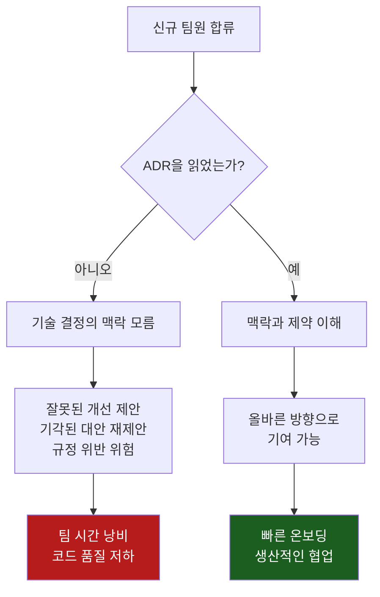
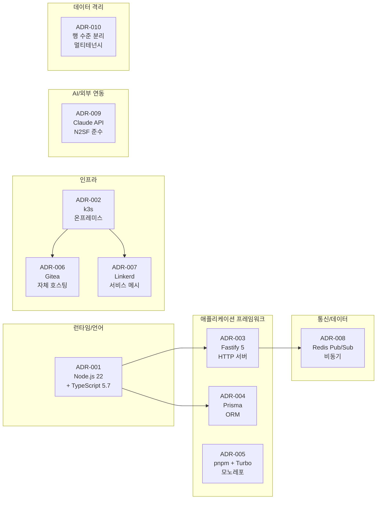
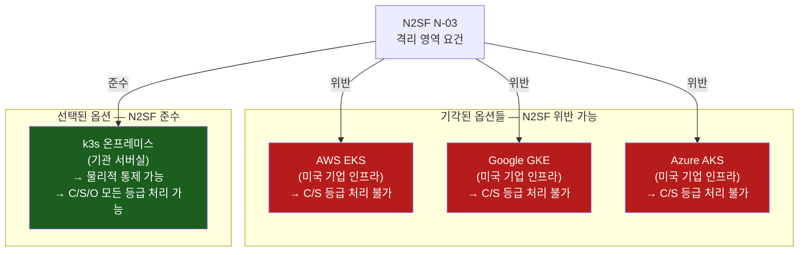
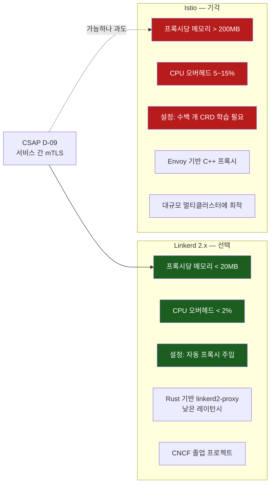
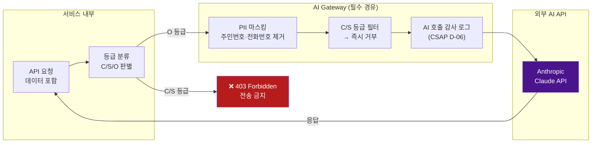
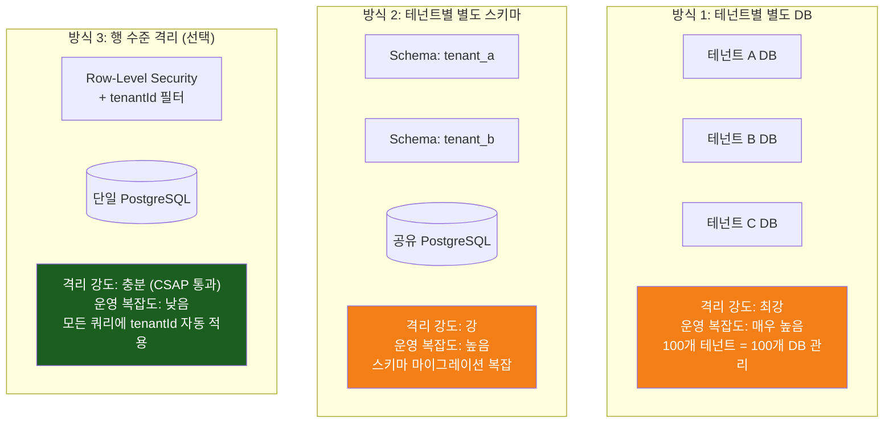
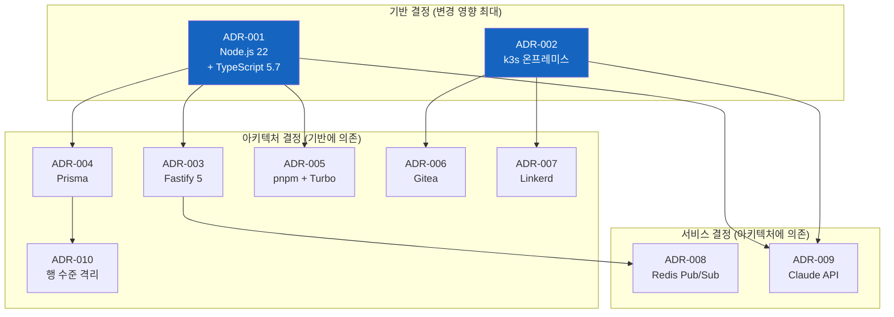
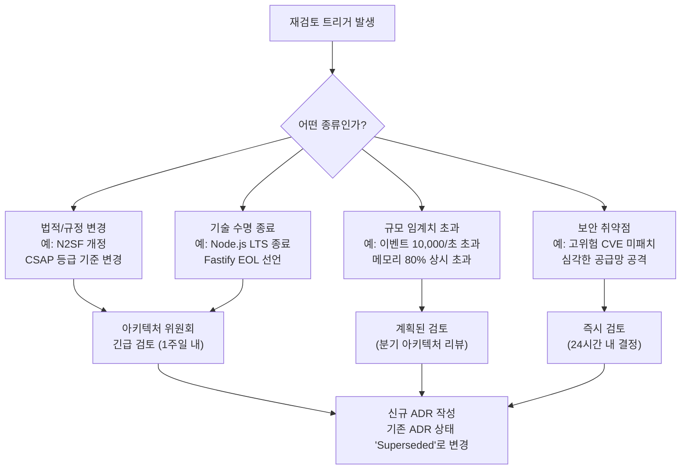

# 아키텍처 결정 기록 (ADR) 심화 분석

> **문서 ID**: ONBOARD-02-06
> **버전**: 1.0.0 | **작성일**: 2026-04-12 | **작성자**: Implementer (Sonnet)
> **학습 대상**: 신규 팀원 — 프로젝트 합류 후 1주일 이내 학습 권장
> **예상 학습 시간**: 4~5시간
> **선행 문서**: `02-architecture/01-system-overview.md`, `00-project-history.md`
> **CSAP 연관**: D-08 (접근통제), D-09 (암호화), D-12 (개발 보안)

---

## 목차

1. [ADR이란 무엇인가](#1-adr이란-무엇인가)
2. [왜 ADR을 읽어야 하는가](#2-왜-adr을-읽어야-하는가)
3. [ADR 형식 안내](#3-adr-형식-안내)
4. [ADR-001: Node.js 22 + TypeScript 5.7 선택](#4-adr-001-nodejs-22--typescript-57-선택)
5. [ADR-002: k3s 선택 (온프레미스 규정)](#5-adr-002-k3s-선택-온프레미스-규정)
6. [ADR-003: Fastify 5 선택 (성능·스키마 기반)](#6-adr-003-fastify-5-선택-성능스키마-기반)
7. [ADR-004: Prisma 선택 (타입 안전성)](#7-adr-004-prisma-선택-타입-안전성)
8. [ADR-005: pnpm workspace + Turbo 선택](#8-adr-005-pnpm-workspace--turbo-선택)
9. [ADR-006: Gitea 선택 (자체 호스팅 규정)](#9-adr-006-gitea-선택-자체-호스팅-규정)
10. [ADR-007: Linkerd 선택 (가벼움·Rust 기반)](#10-adr-007-linkerd-선택-가벼움rust-기반)
11. [ADR-008: Redis Pub/Sub 선택 (단순성)](#11-adr-008-redis-pubsub-선택-단순성)
12. [ADR-009: Claude API 선택 (N2SF 정책 호환)](#12-adr-009-claude-api-선택-n2sf-정책-호환)
13. [ADR-010: 멀티테넌시 — DB 스키마 vs 행 수준 분리](#13-adr-010-멀티테넌시--db-스키마-vs-행-수준-분리)
14. [결정 간 의존성 그래프](#14-결정-간-의존성-그래프)
15. [기술 결정 트레이드오프 요약](#15-기술-결정-트레이드오프-요약)
16. [결정 재검토 트리거 조건](#16-결정-재검토-트리거-조건)
17. [학습 체크리스트](#17-학습-체크리스트)
18. [다음 단계](#18-다음-단계)

---

## 1. ADR이란 무엇인가

### 1.1 "나중에 왜 이렇게 했지?"를 막는 문서

6개월 뒤, 새로운 팀원이 코드를 보며 이런 질문을 합니다.

> "왜 Express를 안 쓰고 Fastify를 쓰나요?"
> "Kafka가 더 성능이 좋은데 왜 Redis Pub/Sub을 쓰나요?"
> "k3s 말고 EKS가 더 편할 것 같은데요?"

이런 질문들은 매우 자연스럽습니다. 그러나 원래 결정을 내린 팀원이 퇴사했거나, 당시 이유를 기억하지 못한다면 어떻게 될까요? 최악의 경우, 이미 검토하고 기각했던 대안을 다시 논의하느라 시간을 낭비하거나, 중요한 제약 조건을 무시한 채 잘못된 방향으로 리팩토링이 진행됩니다.

**ADR(Architecture Decision Record, 아키텍처 결정 기록)**은 이 문제를 해결하기 위해 탄생했습니다. ADR은 다음을 기록합니다.

- 무엇을 결정했는가 (What)
- 언제 결정했는가 (When)
- 왜 그 결정을 했는가 (Why)
- 어떤 대안들을 검토했는가 (Alternatives)
- 이 결정으로 인해 어떤 결과가 생겼는가 (Consequences)

### 1.2 이 프로젝트에서 ADR이 특히 중요한 이유

공공기관 SaaS 프로젝트는 일반 스타트업과 달리 기술 선택에 강한 외부 제약이 있습니다.

- **법적 제약**: N2SF 규정에 따라 C/S 등급 데이터를 외부 클라우드에 올릴 수 없습니다.
- **규제 준수**: CSAP 79개 통제항목을 만족해야 합니다.
- **장기 유지**: 공공사업 특성상 5~10년 운영을 가정하고 설계됩니다.
- **감리 대응**: 기술 선택의 이유를 감리인에게 설명할 수 있어야 합니다.

이 맥락에서 "왜 GitHub 대신 Gitea를 사용하는가?" 같은 질문에 명확한 문서 근거가 없다면, 감리 과정에서 심각한 지적 사항이 될 수 있습니다.

---

## 2. 왜 ADR을 읽어야 하는가

### 2.1 신규 팀원이 반드시 ADR을 읽어야 하는 이유



💡 **실제 사례**: 과거에 "성능을 위해 Kafka로 마이그레이션하자"는 제안이 있었습니다. ADR-008을 읽지 않은 팀원이 제안한 것이었는데, 실제로 검토 당시 Kafka가 기각된 이유 중 하나는 "온프레미스 소규모 클러스터에서 ZooKeeper/KRaft 유지 비용이 과도하다"는 것이었습니다. ADR 덕분에 30분 토론 대신 2분 설명으로 해결되었습니다.

### 2.2 ADR이 다루는 10가지 핵심 결정 개요



---

## 3. ADR 형식 안내

이 문서에서 사용하는 ADR 형식은 다음 구조를 따릅니다.

```
### ADR-00X: [제목]
결정일, 상태, 한 줄 결정 요약

WHY: 이 결정을 하게 된 배경과 맥락
ALTERNATIVES: 검토한 대안들과 각각의 장단점
CONSEQUENCES: 이 결정으로 인한 현재 영향
REVIEW TRIGGER: 언제 이 결정을 재검토해야 하는가
```

각 ADR에는 실제 코드 참조와 CSAP 통제항목 연관이 명시됩니다.

---

## 4. ADR-001: Node.js 22 + TypeScript 5.7 선택

### ADR-001 개요

| 항목 | 내용 |
|------|------|
| **결정일** | 2026-01-10 |
| **상태** | Accepted |
| **결정권자** | 아키텍처 위원회 |
| **CSAP 연관** | D-12 (시스템 개발 보안 — 언어 수준 타입 안전성) |

**결정 (한 문장)**: 서버사이드 런타임으로 Node.js 22 LTS를, 정적 타입 언어로 TypeScript 5.7을 선택하고, Bun/Deno 등 신생 런타임은 채택하지 않는다.

### 왜 이 결정을 했는가

공공기관 SaaS 프로젝트는 다음 세 가지 제약 아래에서 기술 스택을 선택해야 했습니다.

**제약 1 — 장기 LTS 보장**: 공공사업 특성상 최소 3~5년 유지보수를 가정합니다. Node.js 22는 2027년 4월까지 공식 LTS 지원이 보장됩니다.

**제약 2 — 공공기관 적용 실적**: 감리 과정에서 "검증되지 않은 신기술 도입"은 주요 지적 사항입니다. Node.js는 국내 공공기관 시스템에 이미 다수 적용된 실적이 있습니다.

**제약 3 — 보안 CVE 대응 속도**: 런타임 취약점 발생 시 공식 패치가 신속하게 이루어져야 합니다. Node.js는 OpenJS Foundation이 체계적인 보안 패치 프로세스를 운영합니다.

TypeScript 5.7을 선택한 이유는 다음과 같습니다.

- 컴파일 타임 타입 검사로 런타임 오류를 사전 차단합니다. 공공 시스템의 무결성 요건에 부합합니다.
- Zod 스키마와 완전한 타입 흐름을 구성할 수 있어 API 경계에서 타입 안전성이 보장됩니다.
- Prisma 6과 통합 시 DB 스키마에서 TypeScript 타입이 자동 생성됩니다.

### 대안들

**옵션 A: Python 3.12 + FastAPI**

| 구분 | 내용 |
|------|------|
| 장점 | AI/ML 라이브러리 생태계 최강 (NumPy, PyTorch 등), 데이터 과학팀 친숙 |
| 단점 | 비동기 처리가 JavaScript보다 복잡, GIL(전역 인터프리터 잠금)로 CPU 집약 작업 제한 |
| 기각 이유 | 팀의 주력 언어가 TypeScript, 혼용 시 기술 부채 증가 |

**옵션 B: Go 1.22**

| 구분 | 내용 |
|------|------|
| 장점 | 뛰어난 성능, 정적 컴파일, 낮은 메모리 사용량 |
| 단점 | TypeScript 팀이 새로 Go를 학습해야 함, 학습 기간 3~6개월 소요 예상 |
| 기각 이유 | 초기 생산성 저하 위험, 팀 내 Go 전문 인력 부재 |

**옵션 C: Bun (선택되지 않음)**

| 구분 | 내용 |
|------|------|
| 장점 | Node.js 대비 3~5배 빠른 스타트업, 빠른 패키지 설치 |
| 단점 | LTS 없음, 일부 npm 패키지 호환 문제, 공공기관 적용 실적 전무 |
| 기각 이유 | 감리 "신기술 정당화" 부담, 장기 안정성 불확실 |

### 이 결정의 결과

- 현재 17개 모든 서비스가 Node.js 22 + TypeScript 5.7로 구현되어 있습니다.
- `platform/services/` 전체 서비스와 `platform/packages/` 공유 패키지 모두 동일 기술 스택입니다.
- `tsconfig.json`의 `strict: true` 설정으로 런타임 오류 발생 비율이 크게 낮아졌습니다.
- 실제 파일 참조: `platform/services/auth-service/tsconfig.json`

### 변경 가능성

다음 조건이 충족될 때 재검토합니다.

- Node.js LTS 종료 6개월 전 (2026년 10월경) 다음 LTS 버전 업그레이드 계획 수립
- 공공기관 규정에서 특정 언어/런타임 사용을 명시적으로 요구할 경우
- 팀 전체가 Go/Rust 전문 인력으로 교체되는 대규모 조직 변경 시

---

## 5. ADR-002: k3s 선택 (온프레미스 규정)

### ADR-002 개요

| 항목 | 내용 |
|------|------|
| **결정일** | 2026-01-15 |
| **상태** | Accepted |
| **결정권자** | 아키텍처 위원회 + 법무팀 |
| **CSAP 연관** | D-08 (접근통제 — 물리적 격리), D-09 (암호화 — 전송 보호) |
| **N2SF 연관** | N-03 (격리 영역), N-05 (AI 연동 데이터 제한) |

**결정 (한 문장)**: 외부 관리형 Kubernetes 서비스(EKS, GKE, AKS) 대신 k3s를 사용하여 기관 서버실 또는 전용 IDC에서 온프레미스로 운영한다.

### 왜 이 결정을 했는가

이 결정은 기술적 우열보다 **법적 규정**에 의해 결정된 가장 중요한 선택입니다.

**핵심 법적 근거**:

```
국가정보원 보안업무규정:
  - C/S 등급 데이터의 외국 클라우드 처리 금지
  
N2SF N-03 격리 영역 요건:
  - 기관 통제 범위 내 물리적 분리 필수
  
N2SF N-05 AI 연동 데이터 제한:
  - AI API 전송 시 데이터 등급별 처리 제한

미국 CLOUD Act (2018):
  - 미 정부 요청 시 AWS/Google/Azure는 데이터 제출 의무
  - 한국 행정 데이터가 미국 법률에 종속될 위험
```

공공기관 SaaS의 C/S 등급 행정 데이터를 EKS(AWS), GKE(Google), AKS(Microsoft)에서 처리하는 것은 위 규정과 충돌합니다.



### 대안들

**옵션 A: AWS EKS**

| 구분 | 내용 |
|------|------|
| 장점 | 관리형 서비스로 운영 부담 최소, 풍부한 생태계, 글로벌 가용성 |
| 단점 | N2SF C/S 등급 데이터 처리 규정 위반, CLOUD Act 종속, CSAP 심사 지적 위험 |
| 기각 이유 | 법적 규정 위반 — 기술적 우수성과 무관하게 사용 불가 |

**옵션 B: NHN Cloud (국내 클라우드)**

| 구분 | 내용 |
|------|------|
| 장점 | 국내 기업, 한국 데이터센터, CSAP 인증 보유 |
| 단점 | 외부 클라우드 의존성 → 서비스 장애 시 영향, 비용 증가, 데이터 주권 부분 이전 |
| 기각 이유 | 완전한 기관 통제 불가, 비용 모델 불투명 |

**옵션 C: Vanilla Kubernetes (kubeadm)**

| 구분 | 내용 |
|------|------|
| 장점 | 공식 Kubernetes 배포판, 완전한 기능 |
| 단점 | etcd 클러스터 관리 복잡, 최소 3노드 필요, 운영 전문 인력 필수 |
| 기각 이유 | 소규모 팀에 과도한 운영 부담, k3s로 동일 목표 달성 가능 |

### 이 결정의 결과

- 개발 환경: WSL2 위에 k3s를 직접 설치하여 운영 환경과 동일한 Kubernetes API 사용
- 운영 환경: 기관 서버실 물리 서버에 k3s 설치
- `platform/k8s/` 디렉토리에 모든 Kubernetes 매니페스트 관리
- 네임스페이스 격리로 서비스별 보안 경계 구성 (`saas-core`, `saas-security`, `saas-ai`, `saas-data`)

### 변경 가능성

- 국내 공공 클라우드 인프라(국가 클라우드 센터 등)가 N2SF 요건을 만족하는 수준으로 성숙할 경우 검토
- N2SF 규정이 개정되어 특정 외부 클라우드 사용을 허용할 경우 검토

---

## 6. ADR-003: Fastify 5 선택 (성능·스키마 기반)

### ADR-003 개요

| 항목 | 내용 |
|------|------|
| **결정일** | 2026-01-18 |
| **상태** | Accepted |
| **결정권자** | 백엔드 개발팀 |
| **CSAP 연관** | D-12 (입력 검증 — JSON Schema 내장) |

**결정 (한 문장)**: Node.js HTTP 서버 프레임워크로 Fastify 5를 선택하고, Express는 유지보수 모드 진입과 성능 차이를 이유로 채택하지 않는다.

### 왜 이 결정을 했는가

**성능 차이**: 벤치마크 기준으로 Fastify는 초당 약 80,000 요청을 처리하는 반면 Express는 약 30,000 요청입니다. 멀티테넌트 환경에서 다수 기관이 동시 사용할 경우 이 차이는 인프라 비용에 직접 영향을 미칩니다.

**CSAP D-12 입력 검증 내재화**: CSAP D-12는 모든 사용자 입력의 검증을 요구합니다. Fastify는 JSON Schema 기반 요청 검증을 프레임워크 레벨에서 내장하고 있어, 개발자가 별도 검증 라이브러리를 추가하지 않아도 됩니다.

```typescript
// Fastify에서 스키마 기반 입력 검증 (실제 사용 방식)
// Design Ref: §3.2 — 스키마 내장 검증으로 D-12 요건 자동 충족
app.post('/auth/login', {
  schema: {
    body: {
      type: 'object',
      required: ['email', 'password', 'tenantSlug'],
      properties: {
        email: { type: 'string', format: 'email', maxLength: 255 },
        password: { type: 'string', minLength: 1, maxLength: 128 },
        tenantSlug: { type: 'string', minLength: 1, maxLength: 100 },
      },
    },
  },
}, loginHandler)
// 스키마 불일치 시 Fastify가 자동으로 400 Bad Request 반환
```

### 대안들

**옵션 A: Express 4/5**

| 구분 | 내용 |
|------|------|
| 장점 | 가장 널리 알려진 Node.js 프레임워크, 방대한 미들웨어 생태계 |
| 단점 | 2024년 기준 유지보수 모드 진입, 성능이 Fastify의 37% 수준, 타입 지원 미흡 |
| 기각 이유 | 장기 지원 불확실, 성능 열위 |

**옵션 B: Hono**

| 구분 | 내용 |
|------|------|
| 장점 | 초경량, Edge Runtime 지원, 빠른 개발 속도 |
| 단점 | 상대적으로 작은 커뮤니티, 공공기관 적용 실적 없음 |
| 기각 이유 | ADR-001과 동일한 이유 — 공공 프로젝트에서 신기술 도입 리스크 |

**옵션 C: NestJS**

| 구분 | 내용 |
|------|------|
| 장점 | 엔터프라이즈 구조, DI 컨테이너 내장, Angular 방식으로 친숙한 개발자 多 |
| 단점 | Express 기반으로 성능 동일한 한계, 과도한 추상화로 디버깅 복잡 |
| 기각 이유 | 성능 문제 + 추상화 복잡도, 마이크로서비스에서 오버엔지니어링 |

### 이 결정의 결과

- 모든 서비스가 Fastify 5 플러그인 시스템을 통해 RBAC, 인증, Rate Limit을 표준화된 방식으로 적용합니다.
- Pino 로거 내장으로 구조화 JSON 로그 표준화 (CSAP D-06 감사 로그 요건 충족)
- `platform/services/api-gateway/src/index.ts`에서 실제 Fastify 플러그인 등록 패턴 확인 가능

### 변경 가능성

- Fastify의 활발한 개발이 중단되거나 심각한 보안 취약점이 지속 발생할 경우 재검토
- Node.js 생태계에서 사실상 표준 프레임워크가 바뀔 경우 (최소 5년 후 예상)

---

## 7. ADR-004: Prisma 선택 (타입 안전성)

### ADR-004 개요

| 항목 | 내용 |
|------|------|
| **결정일** | 2026-01-20 |
| **상태** | Accepted |
| **결정권자** | 백엔드 개발팀 |
| **CSAP 연관** | D-12 (SQL 인젝션 방지 — 매개변수화 쿼리) |

**결정 (한 문장)**: PostgreSQL ORM으로 Prisma 6를 선택하고, SQL 직접 문자열 결합은 모든 상황에서 금지한다.

### 왜 이 결정을 했는가

CSAP D-12는 SQL 인젝션 방지를 명시적으로 요구합니다. SQL 인젝션 공격은 OWASP Top 10 1위에 해당하는 가장 위험한 웹 취약점입니다. Prisma는 이를 ORM 레벨에서 근본적으로 차단합니다.

```typescript
// ✅ Prisma 사용 — SQL 인젝션 원천 차단 (CSAP D-12 준수)
// Design Ref: §4 — 매개변수화 쿼리 자동화
// Plan SC: FR-AUTH.3
const user = await prisma.user.findUnique({
  where: {
    tenantId_email: {
      tenantId: tenant.id,   // Prisma가 내부적으로 ?1 바인딩
      email: email,          // Prisma가 내부적으로 ?2 바인딩
    }
  }
})

// ❌ 절대 금지 — SQL 직접 결합 (AgentShield가 자동 차단)
const user = await db.execute(`SELECT * FROM users WHERE email = '${email}'`)
// 위 코드는 email = "'; DROP TABLE users; --" 공격에 취약합니다
```

**타입 안전성**: Prisma Schema에서 TypeScript 타입이 자동 생성되어 DB 스키마 변경 시 컴파일 오류로 즉시 감지됩니다.

```typescript
// prisma/schema.prisma 변경 → prisma generate → 타입 자동 재생성
// 타입 불일치는 런타임이 아닌 컴파일 타임에 오류 발생
const user: Prisma.User = await prisma.user.findUnique(...)
// user.nonExistentField → TypeScript 컴파일 오류 (런타임 오류 아님)
```

### 대안들

**옵션 A: TypeORM**

| 구분 | 내용 |
|------|------|
| 장점 | 오래된 역사, Active Record + Data Mapper 패턴 지원 |
| 단점 | 데코레이터 기반으로 tsconfig 설정 복잡, 타입 추론이 Prisma보다 미흡, 마이그레이션 불안정 |
| 기각 이유 | Prisma 대비 DX(개발자 경험) 열위, 타입 안전성 부족 |

**옵션 B: Drizzle ORM**

| 구분 | 내용 |
|------|------|
| 장점 | 매우 가벼움, SQL-like 문법으로 직관적, 번들 크기 최소 |
| 단점 | 비교적 신생 프로젝트, 마이그레이션 도구가 Prisma보다 성숙도 낮음 |
| 기각 이유 | 공공 프로젝트의 안정성 우선 원칙, Prisma의 성숙한 마이그레이션 도구 선호 |

**옵션 C: Raw SQL (pg 라이브러리 직접 사용)**

| 구분 | 내용 |
|------|------|
| 장점 | 최대 성능, 완전한 SQL 제어 |
| 단점 | 개발자 실수로 SQL 인젝션 발생 위험, 마이그레이션 수작업, 타입 자동 생성 불가 |
| 기각 이유 | CSAP D-12 위반 위험이 너무 높음, AgentShield 자동 탐지 한계 |

### 이 결정의 결과

- `prisma/schema.prisma`에서 DB 스키마를 단일 파일로 관리합니다.
- `npx prisma migrate dev`로 스키마 변경 이력을 추적합니다.
- 모든 서비스의 DB 쿼리가 Prisma를 통해 자동으로 매개변수화됩니다.
- SQL 인젝션 CVSS 취약점 발생 위험이 ORM 레벨에서 원천 차단됩니다.

### 변경 가능성

- 특정 서비스에서 Prisma가 지원하지 않는 PostgreSQL 고급 기능이 필요한 경우, 해당 쿼리만 Prisma `$queryRaw` + 템플릿 리터럴(변수 직접 삽입 금지)로 예외 처리
- Prisma가 대형 데이터셋 성능 이슈가 명확히 입증될 경우 일부 서비스에서 Drizzle로 마이그레이션 검토

---

## 8. ADR-005: pnpm workspace + Turbo 선택

### ADR-005 개요

| 항목 | 내용 |
|------|------|
| **결정일** | 2026-01-22 |
| **상태** | Accepted |
| **결정권자** | 인프라/DevOps 팀 |
| **연관 파일** | `pnpm-workspace.yaml`, `turbo.json` |

**결정 (한 문장)**: 모노레포 패키지 관리에 pnpm workspace를, 빌드 오케스트레이션에 Turborepo를 사용하고, npm/yarn과 Nx는 채택하지 않는다.

### 왜 이 결정을 했는가

17개 서비스와 12개 공유 패키지를 하나의 Git 저장소(모노레포)에서 관리하는 이 프로젝트에서, 패키지 매니저 선택은 개발 생산성과 CI/CD 속도에 직접 영향을 미칩니다.

**pnpm 선택 이유**:

```
1. 콘텐츠 기반 저장소 (content-addressable store)
   - 동일한 패키지 버전은 디스크에 한 번만 저장
   - node_modules 심볼릭 링크로 공유 → 수 GB 절약
   
2. 엄격한 의존성 격리
   - package.json에 명시된 패키지만 접근 가능
   - "유령 의존성(ghost dependency)" 근본 차단
   - 재현 가능한 빌드 보장
   
3. workspace: 프로토콜
   - workspace:* 구문으로 로컬 패키지 참조
   - 패키지 간 의존성을 심볼릭 링크로 처리
```

**Turborepo 선택 이유**:

```
4. 변경 감지 기반 빌드
   - 변경된 패키지와 의존 패키지만 선택적 빌드
   - auth-service만 수정하면 auth-service만 빌드됨
   
5. 원격 캐시
   - pnpm-lock.yaml 해시로 빌드 캐시 키 생성
   - CI에서 동일한 입력 → 캐시 히트 → 빌드 생략
   
6. 병렬 실행
   - 의존성이 없는 패키지는 동시에 빌드
   - 17개 서비스 순차 빌드 → 10분, 병렬 → 3분
```

### 대안들

**옵션 A: npm workspaces**

| 구분 | 내용 |
|------|------|
| 장점 | Node.js 내장, 추가 설치 불필요 |
| 단점 | 패키지 호이스팅으로 유령 의존성 문제 발생, 빌드 캐싱 미흡 |
| 기각 이유 | 대규모 모노레포에서 의존성 관리 신뢰성 부족 |

**옵션 B: Nx**

| 구분 | 내용 |
|------|------|
| 장점 | 강력한 플러그인 생태계, 세밀한 빌드 제어 |
| 단점 | 학습 곡선이 높음, Nx 전용 설정 파일 대거 필요, 마이그레이션 복잡 |
| 기각 이유 | 팀 규모 대비 과도한 복잡성, pnpm + Turbo로 동일 목표 달성 가능 |

**옵션 C: Yarn Berry (PnP 모드)**

| 구분 | 내용 |
|------|------|
| 장점 | Zero-install 가능, 엄격한 의존성 격리 |
| 단점 | Plug'n'Play 일부 라이브러리 호환 문제, 메이저 버전 불안정 이력 |
| 기각 이유 | 호환성 문제로 CI 디버깅 비용 증가 위험 |

### 이 결정의 결과

- `pnpm-workspace.yaml`: 모노레포 패키지 위치 선언
- `turbo.json`: 빌드 파이프라인 의존성 그래프 정의
- CI 파이프라인에서 `pnpm install --frozen-lockfile` → `turbo run build` 패턴 사용
- 패키지 간 참조: `"@public-saas/audit-sdk": "workspace:*"` 형식

### 변경 가능성

- pnpm이 버전 메이저 업그레이드로 workspace 프로토콜 호환성이 깨질 경우 검토
- Turborepo가 더 나은 대안(예: Nx의 혁신, Bun workspace 성숙)으로 대체될 경우 검토

---

## 9. ADR-006: Gitea 선택 (자체 호스팅 규정)

### ADR-006 개요

| 항목 | 내용 |
|------|------|
| **결정일** | 2026-01-25 |
| **상태** | Accepted |
| **결정권자** | 아키텍처 위원회 + 법무팀 |
| **CSAP 연관** | D-12 (소스코드 관리 통제) |
| **N2SF 연관** | N-03 (격리 영역 — 소스코드 주권) |

**결정 (한 문장)**: 소스코드 저장소로 자체 호스팅 Gitea를 선택하고, GitHub/GitLab SaaS는 소스코드 주권 위험을 이유로 채택하지 않는다.

### 왜 이 결정을 했는가

공공기관 SaaS 소스코드에는 행정 업무 로직, 보안 설정, 암호화 방법론이 포함됩니다. 이를 외부 서비스에 호스팅하는 것은 다음 위험을 초래합니다.

```
위험 1: 소스코드 유출 가능성
  → GitHub은 Microsoft 소유, 서버는 미국에 위치
  → 공공기관 SaaS의 핵심 로직이 외국 기업 서버에 저장됨

위험 2: CSAP D-12 소스코드 관리 통제 위반 가능성
  → 소스코드 접근 통제를 외부 서비스에 위임하는 구조
  → 감리 시 지적 위험

위험 3: 서비스 장애 시 CI/CD 전면 중단
  → GitHub 장애 → 전체 배포 파이프라인 중단
  → 자체 호스팅 시 독립적 운영 가능

위험 4: CLOUD Act 종속
  → 미 정부 요청 시 소스코드 제출 의무
  → 국가 핵심 인프라 코드가 외국 법률에 종속
```

**Gitea 선택 이유**:

- Go 단일 바이너리, 1GB RAM에서 수천 레포지토리 운영 가능
- GitHub Actions 워크플로우 문법 90% 이상 호환 → 학습 곡선 최소화
- Flux GitOps와 완벽 통합 → Gitea → Flux → k3s 자동 배포 파이프라인
- 인터넷 연결 없이 폐쇄망 운영 가능

### 대안들

**옵션 A: GitHub**

| 구분 | 내용 |
|------|------|
| 장점 | 세계 최대 개발자 커뮤니티, GitHub Actions 생태계, Copilot 통합 |
| 단점 | 미국 기업 소유, CLOUD Act 적용, 소스코드 주권 부재, 장애 시 의존 |
| 기각 이유 | 법적 위험 — 공공 인프라 코드의 소스코드 주권 문제 |

**옵션 B: GitLab Self-Managed**

| 구분 | 내용 |
|------|------|
| 장점 | 자체 호스팅 가능, 풍부한 CI/CD 기능, 이슈 트래커 내장 |
| 단점 | 최소 4GB RAM, 다수 컴포넌트(Rails, PostgreSQL, Redis, Sidekiq 등) |
| 기각 이유 | 리소스 과도, 운영 복잡도 높음, Gitea로 충분한 기능 제공 가능 |

**옵션 C: Gogs (Gitea의 원조)**

| 구분 | 내용 |
|------|------|
| 장점 | 더 경량, Gitea의 원조 프로젝트 |
| 단점 | Gitea 대비 커뮤니티 활성도 낮음, Actions 미지원 |
| 기각 이유 | CI/CD 기능 부족, Gitea Actions가 필수 요건 |

### 이 결정의 결과

- `.gitea/workflows/` 디렉토리에 CI/CD 파이프라인 정의
- 자체 Gitea Runner로 빌드/테스트 실행
- Flux가 Gitea 저장소를 감시하여 k3s 클러스터에 자동 배포
- 오프라인(폐쇄망) 환경에서도 완전한 GitOps 파이프라인 운영 가능

### 변경 가능성

- 국내 자체 호스팅 Git 서비스 표준이 확립될 경우 검토
- Gitea 프로젝트 활동이 크게 감소할 경우 GitLab Self-Managed로 전환 검토

---

## 10. ADR-007: Linkerd 선택 (가벼움·Rust 기반)

### ADR-007 개요

| 항목 | 내용 |
|------|------|
| **결정일** | 2026-02-01 |
| **상태** | Accepted |
| **결정권자** | 인프라/SRE 팀 |
| **CSAP 연관** | D-09 (mTLS 서비스 간 암호화) |

**결정 (한 문장)**: 서비스 메시로 Linkerd 2.x를 선택하고, Istio는 운영 복잡도와 리소스 오버헤드를 이유로 채택하지 않는다.

### 왜 이 결정을 했는가

CSAP D-09는 서비스 간 통신의 암호화를 요구합니다. 17개 마이크로서비스가 서로 통신할 때 매번 애플리케이션 코드에 TLS를 구현하는 것은 매우 복잡합니다. 서비스 메시는 이를 인프라 레벨에서 자동으로 처리합니다.

**Linkerd vs Istio 비교**:



온프레미스 소규모 클러스터에서 Istio의 높은 메모리 소비는 실제 서비스 리소스를 빼앗습니다. 4GB RAM 서버에서 Istio 구성요소만 2~3GB를 소비하면 서비스 Pod를 위한 공간이 부족해집니다.

### 대안들

**옵션 A: Istio**

| 구분 | 내용 |
|------|------|
| 장점 | 가장 성숙한 서비스 메시, 풍부한 트래픽 관리 기능, 대규모 레퍼런스 다수 |
| 단점 | 높은 메모리 사용량(프록시당 200MB+), 수백 개 CRD 학습 필요, 운영 전문 인력 필수 |
| 기각 이유 | 온프레미스 소규모 클러스터에 과도한 리소스 부담 |

**옵션 B: Cilium**

| 구분 | 내용 |
|------|------|
| 장점 | eBPF 기반으로 최고 성능, Kubernetes 네트워크 정책과 완벽 통합 |
| 단점 | 리눅스 커널 5.10+ 필요, eBPF 지식 없으면 디버깅 어려움 |
| 기각 이유 | 운영 난이도, 그러나 NetworkPolicy 목적으로 부분 활용 중 |

**옵션 C: 서비스 메시 없이 TLS 직접 구현**

| 구분 | 내용 |
|------|------|
| 장점 | 의존성 최소화 |
| 단점 | 17개 서비스 각각에 TLS 코드 구현, 인증서 관리 복잡, 운영 오버헤드 증가 |
| 기각 이유 | 코드 중복, 보안 누락 위험 증가 |

### 이 결정의 결과

- 서비스 간 모든 HTTP 트래픽이 mTLS로 자동 암호화 (CSAP D-09 충족)
- `linkerd viz tap` 명령으로 실시간 서비스 간 트래픽 관찰 가능
- Linkerd 대시보드에서 서비스별 성공률/레이턴시 시각화
- 애플리케이션 코드 변경 없이 인프라 레벨에서 암호화 적용

### 변경 가능성

- 클러스터 규모가 크게 성장하여 고급 트래픽 관리(가중치 라우팅, 회로 차단 등)가 필요해질 경우 Istio로 전환 검토
- Linkerd 프로젝트 방향성 변경(유료화 등) 시 Cilium으로 전환 검토

---

## 11. ADR-008: Redis Pub/Sub 선택 (단순성)

### ADR-008 개요

| 항목 | 내용 |
|------|------|
| **결정일** | 2026-02-05 |
| **상태** | Accepted |
| **결정권자** | 백엔드 개발팀 |
| **연관 파일** | `platform/packages/event-bus/` |

**결정 (한 문장)**: 서비스 간 비동기 이벤트 전달에 Redis Pub/Sub을 사용하고, Kafka와 RabbitMQ는 운영 복잡도를 이유로 채택하지 않는다.

### 왜 이 결정을 했는가

마이크로서비스 아키텍처에서 서비스 간 비동기 통신은 필수입니다. 예를 들어 사용자 생성 시 알림 서비스에 이벤트를 전달해야 합니다. 이를 위해 별도 메시지 브로커를 도입하면 운영해야 할 인프라가 늘어납니다.

**Redis를 선택한 이유**:

```
이미 Redis를 사용 중 (세션, Rate Limit, 캐시)
  → 추가 인프라 없이 Pub/Sub 기능 활용 가능
  → 운영 대상 시스템 최소화 (KISS 원칙)

공공기관 SaaS의 이벤트 볼륨:
  → 초당 수천 건 수준 (Kafka가 필요한 수백만 건 규모 아님)
  → Redis Pub/Sub으로 충분히 처리 가능

개발 단순성:
  → 복잡한 Kafka Consumer Group, 파티션 관리 불필요
  → Redis 명령어 PUBLISH/SUBSCRIBE로 간단 구현
```

### 대안들

**옵션 A: Apache Kafka**

| 구분 | 내용 |
|------|------|
| 장점 | 대용량 처리(초당 수백만 메시지), 메시지 영속성, 재생(replay) 가능 |
| 단점 | ZooKeeper/KRaft 추가 인프라, 최소 3브로커 고가용성 구성, 운영 복잡도 높음 |
| 기각 이유 | 이벤트 볼륨이 Kafka가 필요한 규모가 아님, 온프레미스 소규모 환경에 과도 |

**옵션 B: RabbitMQ**

| 구분 | 내용 |
|------|------|
| 장점 | 다양한 라우팅 패턴(Direct, Topic, Fanout), 메시지 TTL, 우선순위 큐 |
| 단점 | 추가 인프라(Erlang 런타임), Redis에 비해 운영 복잡도 높음 |
| 기각 이유 | Redis로 충분한 요구사항 달성 가능, 추가 인프라 도입 불필요 |

**옵션 C: HTTP 폴링**

| 구분 | 내용 |
|------|------|
| 장점 | 구현 단순, 추가 인프라 없음 |
| 단점 | 불필요한 네트워크 요청 증가, 실시간성 부족, 서비스 간 강결합 |
| 기각 이유 | 비동기 이벤트 패턴의 장점 상실 |

⚠️ **주의**: Redis Pub/Sub은 메시지 영속성이 없습니다. 구독자가 오프라인 상태일 때 발행된 메시지는 유실됩니다. 이를 허용할 수 없는 경우(예: 결제 이벤트)는 Redis Streams 또는 별도 영속 큐를 사용해야 합니다.

### 이 결정의 결과

- `platform/packages/event-bus/` 패키지가 Redis Pub/Sub을 추상화하여 제공
- `eventBus.publish('USER_CREATED', { userId, tenantId })` 형식으로 사용
- 각 서비스가 필요한 이벤트만 구독하여 느슨한 결합 달성
- Redis가 이미 세션/캐시로 사용 중이므로 추가 인프라 비용 없음

### 변경 가능성

- 이벤트 볼륨이 Redis 단일 인스턴스의 처리 한계에 도달할 경우 Kafka로 전환 검토
- 메시지 유실이 허용되지 않는 중요 이벤트가 증가할 경우 Redis Streams 또는 Kafka로 일부 전환
- 현재 트리거: 초당 이벤트 10,000건 초과 시 재검토 시작

---

## 12. ADR-009: Claude API 선택 (N2SF 정책 호환)

### ADR-009 개요

| 항목 | 내용 |
|------|------|
| **결정일** | 2026-02-10 |
| **상태** | Accepted |
| **결정권자** | AI/보안 팀 공동 검토 |
| **CSAP 연관** | D-12 (외부 API 호출 보안) |
| **N2SF 연관** | N-05 (AI 연동 시 데이터 등급별 처리 제한) |
| **연관 파일** | `platform/services/ai-service/src/` |

**결정 (한 문장)**: AI LLM API로 Anthropic Claude API를 선택하고, O등급 데이터의 PII 마스킹 후 AI Gateway를 통해서만 호출하는 N2SF 보안 패턴을 의무화한다.

### 왜 이 결정을 했는가

N2SF N-05는 AI API 연동 시 데이터 등급별 처리 규칙을 명시합니다.

```
N2SF 데이터 등급 규칙:
  C등급 (기밀): AI API 전송 절대 금지
  S등급 (민감): AI API 전송 절대 금지
  O등급 (공개): PII 마스킹 후 AI Gateway 경유 허용
```

이 규칙은 어떤 AI API를 선택하든 동일하게 적용됩니다. 따라서 AI API 선택은 기능성, 안정성, 정책 호환성을 기준으로 이루어졌습니다.

**Claude API 선택 이유**:

| 평가 항목 | Claude (Anthropic) | GPT-4 (OpenAI) | Gemini (Google) |
|---------|-------------------|----------------|-----------------|
| 컨텍스트 길이 | 200K 토큰 | 128K 토큰 | 1M 토큰 |
| 코드 생성 품질 | 최상 | 최상 | 상 |
| 한국어 품질 | 상 | 상 | 중상 |
| 엔터프라이즈 정책 | Anthropic 상업 계약 가능 | OpenAI 상업 계약 가능 | Google Cloud 계약 |
| 데이터 학습 opt-out | 기본 제공 | 유료 옵션 | 복잡한 설정 필요 |

특히 Claude는 200K 토큰 컨텍스트 길이가 긴 행정 문서(보고서, 감사 자료 등)를 단일 요청으로 처리할 수 있다는 점에서 공공기관 SaaS에 적합합니다.

**N2SF 준수 아키텍처**:



### 대안들

**옵션 A: GPT-4o (OpenAI)**

| 구분 | 내용 |
|------|------|
| 장점 | 폭넓은 생태계, 함수 호출(Function Calling) 성숙, Vision API |
| 단점 | 기업 계획에서도 데이터 학습 설정 복잡, 컨텍스트 길이 128K로 Claude 대비 제한 |
| 기각 이유 | 데이터 처리 정책이 Claude보다 덜 명확, 동일 N2SF 규정 적용 필요 |

**옵션 B: 온프레미스 LLM (Llama, Mistral)**

| 구분 | 내용 |
|------|------|
| 장점 | 데이터가 외부로 전혀 나가지 않음, C/S 등급 데이터도 처리 가능 |
| 단점 | GPU 서버 필요(최소 A100 1장 이상), 모델 품질이 GPT-4/Claude 대비 낮음, 운영 비용 |
| 기각 이유 | 초기 단계에서 GPU 인프라 구축 비용과 시간 과도, 향후 Phase 3에서 재검토 예정 |

### 이 결정의 결과

- `platform/services/ai-service/src/` 에서 N2SF AI Gateway 패턴 구현
- 모든 AI 요청은 `ai-service`를 통해서만 허용 (직접 외부 API 호출 금지)
- 데이터 등급 판별 → PII 마스킹 → 감사 로그 → API 호출 순서 의무화
- C/S 등급 데이터 전송 시도 시 자동으로 에러 반환

### 변경 가능성

- 온프레미스 LLM 품질이 Claude와 동등해지고 GPU 비용이 합리적 수준이 될 때 전환 검토
- N2SF 규정 개정으로 데이터 등급 처리 방식이 바뀔 경우 게이트웨이 패턴 수정

---

## 13. ADR-010: 멀티테넌시 — DB 스키마 vs 행 수준 분리

### ADR-010 개요

| 항목 | 내용 |
|------|------|
| **결정일** | 2026-02-15 |
| **상태** | Accepted |
| **결정권자** | 아키텍처 위원회 |
| **CSAP 연관** | D-08 (접근통제 — 테넌트 데이터 격리) |
| **연관 파일** | `platform/packages/tenant-isolation/`, `prisma/schema.prisma` |

**결정 (한 문장)**: 멀티테넌시 격리 방식으로 PostgreSQL의 행 수준 보안(Row-Level Security, RLS)과 모든 쿼리에 tenantId 필터를 적용하는 방식을 선택하고, 테넌트별 별도 스키마/DB 분리는 채택하지 않는다.

### 왜 이 결정을 했는가

멀티테넌시 격리는 세 가지 방식이 있으며, 각각 격리 강도와 운영 복잡도가 다릅니다.



**행 수준 격리를 선택한 이유**:

```
1. 운영 단순성
   테넌트가 50개 → 별도 DB: 50개 DB 관리, 마이그레이션 50회 실행
   행 수준 격리: 1개 DB 관리, 마이그레이션 1회 실행

2. 비용 효율성
   소규모 테넌트 수백 개가 각각 별도 DB를 가지면
   → 대부분이 거의 비어있는 DB → 리소스 낭비

3. PostgreSQL RLS로 DB 레벨 강제
   개발자 실수로 tenantId 없는 쿼리 실행 시에도
   → RLS가 DB 레벨에서 차단
   → 타 테넌트 데이터 노출 불가능

4. CSAP D-08 준수
   행 수준 격리도 감리에서 적정한 격리 수단으로 인정
   (실제 대형 SaaS들도 이 방식 사용)
```

**필수 구현 패턴**:

```typescript
// ✅ 올바른 방법 — tenantId 반드시 포함 (Design Ref: §5 — 멀티테넌트 격리)
// Plan SC: FR-TENANT.2
const users = await prisma.user.findMany({
  where: {
    tenantId: request.headers['x-user-tenant-id'],  // GW가 주입한 헤더
  }
})

// ❌ 절대 금지 — tenantId 없는 전체 조회 (다른 테넌트 데이터 노출)
const allUsers = await prisma.user.findMany()
// 이 코드는 AgentShield가 자동으로 탐지하여 차단합니다
```

### 대안들

**옵션 A: 테넌트별 별도 PostgreSQL 인스턴스**

| 구분 | 내용 |
|------|------|
| 장점 | 완벽한 격리, 테넌트별 독립적 스케일링, 데이터 삭제 용이 |
| 단점 | 100개 테넌트 = 100개 DB 인스턴스 관리, 마이그레이션 n배 실행, 비용 n배 |
| 기각 이유 | 운영 복잡도와 비용이 감당 불가능한 수준 |

**옵션 B: 테넌트별 PostgreSQL 스키마 분리**

| 구분 | 내용 |
|------|------|
| 장점 | DB보다는 가볍고, 행 수준보다 강한 격리 |
| 단점 | Prisma가 동적 스키마 전환을 기본 지원하지 않음, 스키마별 마이그레이션 관리 복잡 |
| 기각 이유 | Prisma 도입(ADR-004)과 충돌, 마이그레이션 복잡도 과도 |

**옵션 C: 공유 스키마 + 애플리케이션 레벨 필터만**

| 구분 | 내용 |
|------|------|
| 장점 | 구현 가장 단순 |
| 단점 | DB 레벨 보호 없음, 개발자 실수 시 전체 테넌트 데이터 노출 위험 |
| 기각 이유 | CSAP D-08 격리 요건 충족 불확실, 보안 위험 |

### 이 결정의 결과

- 모든 DB 테이블에 `tenantId` 컬럼이 존재합니다.
- Prisma 쿼리는 반드시 `where: { tenantId: ... }` 를 포함해야 합니다.
- PostgreSQL RLS 정책이 `tenantId` 필터를 DB 레벨에서 강제합니다.
- `platform/packages/tenant-isolation/` 패키지가 tenantId 추출·검증 로직을 제공합니다.
- API Gateway가 검증된 tenantId를 `x-user-tenant-id` 헤더로 하위 서비스에 전달합니다.

### 변경 가능성

- 특정 테넌트가 별도 물리적 격리를 법적으로 요구할 경우, 해당 테넌트만 별도 DB 인스턴스로 운영하는 하이브리드 방식 검토
- PostgreSQL RLS 성능 이슈가 실측되면 애플리케이션 레벨 필터 강화 검토

---

## 14. 결정 간 의존성 그래프

10개 ADR이 서로 어떻게 연결되어 있는지 이해하면 전체 아키텍처를 더 잘 파악할 수 있습니다.



**핵심 통찰**: ADR-001(Node.js)과 ADR-002(k3s)는 기반 결정입니다. 이 두 가지를 변경하면 대부분의 다른 ADR도 재검토가 필요합니다. 따라서 이 결정들을 가장 보수적으로 유지합니다.

---

## 15. 기술 결정 트레이드오프 요약

```mermaid
quadrantChart
    title 기술 선택 트레이드오프 매트릭스
    x-axis 낮은 복잡도 --> 높은 복잡도
    y-axis 낮은 성능 --> 높은 성능
    quadrant-1 최적 (고성능·저복잡)
    quadrant-2 고성능·고복잡 (대규모에 적합)
    quadrant-3 저성능·고복잡 (피해야 할 영역)
    quadrant-4 단순하지만 성능 제한
    Fastify 5: [0.2, 0.85]
    Linkerd: [0.35, 0.75]
    Redis PubSub: [0.15, 0.7]
    Prisma: [0.3, 0.65]
    pnpm+Turbo: [0.25, 0.6]
    Kafka: [0.8, 0.95]
    Istio: [0.85, 0.8]
    Express: [0.1, 0.35]
    RabbitMQ: [0.6, 0.6]
```

이 매트릭스는 선택된 기술들(좌상단 방향)이 "적정한 복잡도로 충분한 성능"을 달성한다는 것을 보여줍니다. 공공기관 SaaS에서 무조건 최고 성능보다 운영 가능한 복잡도 범위 내에서 충분한 성능이 더 중요합니다.

---

## 16. 결정 재검토 트리거 조건



---

## 17. 학습 체크리스트

이 문서를 학습한 후 다음 항목을 확인하세요.

- ✅ ADR이 무엇이고 왜 필요한지 설명할 수 있다
- ✅ "왜 k3s를 쓰나요?"라는 질문에 N2SF 규정 근거로 답할 수 있다
- ✅ "왜 Kafka 대신 Redis Pub/Sub을 쓰나요?"를 설명할 수 있다
- ✅ tenantId가 왜 모든 DB 쿼리에 반드시 포함되어야 하는지 이해했다
- ✅ Claude API 호출 전에 반드시 거쳐야 하는 N2SF 게이트웨이 패턴을 이해했다
- ✅ ADR 재검토 트리거 조건 중 하나 이상을 예시로 설명할 수 있다
- ✅ 기술 결정 트레이드오프 매트릭스에서 선택된 기술들의 위치를 설명할 수 있다
- ✅ ADR-001과 ADR-002가 왜 "기반 결정"인지 이해했다
- ✅ 새로운 기술 제안 시 ADR 형식으로 작성해야 한다는 것을 알고 있다
- ✅ Prisma에서 Raw SQL 문자열 결합이 왜 절대 금지인지 설명할 수 있다

---

## 18. 다음 단계

ADR 심화 분석을 완료했습니다. 다음 문서를 이어서 학습하세요.

- **[다음: 03-development/01-local-setup.md]** — 로컬 개발 환경 구성
- **[참고: 02-architecture/02-multitenancy.md]** — ADR-010의 실제 구현 상세
- **[참고: 02-architecture/03-data-flow.md]** — ADR-009 N2SF AI Gateway 패턴 실제 흐름

---

## 변경 이력

| 버전 | 일자 | 내용 | 작성자 |
|------|------|------|------|
| 1.0.0 | 2026-04-12 | 최초 작성 — 10대 핵심 ADR 심화 분석 | Implementer (Sonnet) |
