# 구독·청구 심화 가이드

> **문서 ID**: ONBOARD-02-ARCH-08-BILLING
> **버전**: 1.0.0 | **작성일**: 2026-04-12 | **작성자**: Implementer (Sonnet)
> **대상 독자**: 비즈니스 로직을 이해하고 싶은 신규 개발자, 운영 담당자
> **선행 학습**: `08-subscription-service.md`, `09-billing-service.md`
> **예상 학습 시간**: 2시간 30분
> **실제 코드 위치**:
> - 구독: `/data/ai-saas/platform/services/subscription-service/`
> - 청구: `/data/ai-saas/platform/services/billing-service/`
> **CSAP 매핑**: D-06 (감사 로그), D-08 (접근 통제·테넌트 격리), D-12 (입력 검증)
> **Plan SC**: FR-P07.1~FR-P07.5, FR-P08.1~FR-P08.5, FR-SUB.1~FR-SUB.4, FR-BILL.1~FR-BILL.5

---

## 목차

1. [이 가이드를 읽기 전에](#1-이-가이드를-읽기-전에)
2. [SaaS 구독 비즈니스 모델 이해](#2-saas-구독-비즈니스-모델-이해)
3. [구독 플랜 구조](#3-구독-플랜-구조)
4. [구독 상태 머신](#4-구독-상태-머신)
5. [구독 라이프사이클 전체 플로우](#5-구독-라이프사이클-전체-플로우)
6. [청구 로직 — 인보이스와 결제](#6-청구-로직--인보이스와-결제)
7. [TOCTOU 방어 — 이중 결제 방지](#7-toctou-방어--이중-결제-방지)
8. [Usage-based Billing 개념](#8-usage-based-billing-개념)
9. [멱등성 보장](#9-멱등성-보장)
10. [공공기관 특수 요건](#10-공공기관-특수-요건)
11. [CSAP 관련 요건](#11-csap-관련-요건)
12. [실제 운영 시나리오 실습](#12-실제-운영-시나리오-실습)
13. [학습 체크리스트](#13-학습-체크리스트)
14. [다음 단계](#14-다음-단계)

---

## 1. 이 가이드를 읽기 전에

### 왜 구독·청구 로직이 중요한가

구독과 청구는 SaaS 비즈니스의 심장입니다. 코드 한 줄의 오류가:

- 기관이 납부한 금액이 잘못 계산될 수 있습니다 (재무 리스크)
- 이미 납부한 기관에 재청구가 발생할 수 있습니다 (신뢰도 손상)
- 구독이 예고 없이 끊겨 업무가 중단될 수 있습니다 (가용성 위반)
- 감사 로그가 없으면 CSAP D-06 위반으로 법적 문제가 발생합니다

이 가이드는 두 서비스(`subscription-service`, `billing-service`)가 어떻게 협력하여 안전하게 구독·청구를 처리하는지 설명합니다.

### 두 서비스의 역할 분리

```
subscription-service (포트 3004)
  → 플랜 관리 (생성/수정/비활성화)
  → 구독 관리 (가입/변경/해지)
  → "무슨 서비스를 쓰고 있는가?" 담당

billing-service (포트 3005)
  → 인보이스 생성
  → 결제 처리
  → 세금계산서 발행
  → "얼마를 내야 하는가, 냈는가?" 담당
```

---

## 2. SaaS 구독 비즈니스 모델 이해

### 2.1 반복 구독(Recurring Subscription) 모델

공공기관 SaaS는 전통적인 소프트웨어 판매(일회성 구매)가 아닌 **정기 구독** 모델을 사용합니다.

```
일반 소프트웨어 구매:
  기관 → [일회성 구매 500만원] → 소프트웨어 CD/라이선스
  문제: 버전 업데이트, 유지보수 비용 별도

SaaS 구독 모델:
  기관 → [매월 50만원] → 클라우드 서비스
  장점: 항상 최신 버전, 유지보수 포함, 사용자 수 유연 조정
```

### 2.2 이 프로젝트의 플랜 계층

공공기관 규모와 필요에 따른 4단계 플랜 구조를 지원합니다.

| 플랜 | 대상 기관 | 사용자 한도 | 저장소 | 주요 기능 |
|------|---------|-----------|--------|---------|
| **Free** | 시범 기관 | ~5명 | 1GB | 기본 기능만 |
| **Basic** | 소규모 기관 (구, 군) | ~20명 | 5GB | AI 어시스턴트 |
| **Pro** | 중규모 기관 (시) | ~100명 | 50GB | 고급 분석, 우선 지원 |
| **Enterprise** | 대형 기관 (부, 처, 청) | 무제한 | 1TB+ | 전용 인스턴스, SLA |

실제 플랜 생성 API 요청:

```json
{
  "name": "행안부 표준 플랜",
  "slug": "gov-standard",
  "price": 500000,
  "currency": "KRW",
  "interval": "monthly",
  "maxUsers": 50,
  "maxStorage": 10737418240
}
```

### 2.3 공공기관 구독의 고유한 특성

```
일반 SaaS 구독과의 차이:

일반 기업:          공공기관:
  ┌─────────────┐     ┌─────────────────────────────┐
  │ 신용카드 즉시 │     │ 가상계좌/계좌이체 + 세금계산서  │
  │ 월별 자동 갱신 │     │ 예산 집행 주기(회계연도) 연동    │
  │ 온라인 즉시 해지 │   │ 부서장 승인 후 변경 가능        │
  │ 개인 계정     │     │ 기관(테넌트) 단위 계약          │
  └─────────────┘     │ 전자세금계산서 의무 발행         │
                      └─────────────────────────────┘
```

---

## 3. 구독 플랜 구조

### 3.1 데이터 모델 관계

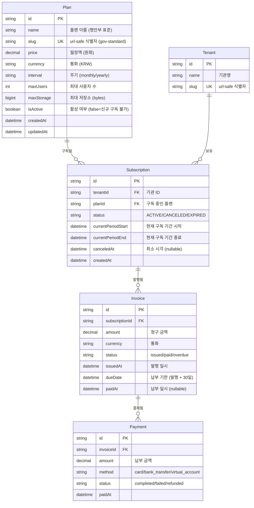

### 3.2 플랜 비활성화 vs 삭제

플랜은 삭제하지 않습니다. `isActive = false`로 소프트 비활성화합니다.

```typescript
// ✅ 올바른 방법: 비활성화 (기존 구독 유지)
await prisma.plan.update({
  where: { id: planId },
  data: { isActive: false }
});
// 효과: 기존 구독자는 계속 사용, 신규 가입만 차단

// ❌ 잘못된 방법: 삭제 (연관 구독 데이터 파괴 위험)
await prisma.plan.delete({ where: { id: planId } });
// 문제: 해당 플랜을 구독 중인 기관의 데이터 무결성 파괴
```

---

## 4. 구독 상태 머신

구독은 항상 정해진 상태 중 하나에 있습니다. 상태 전환은 특정 이벤트에 의해서만 발생합니다.

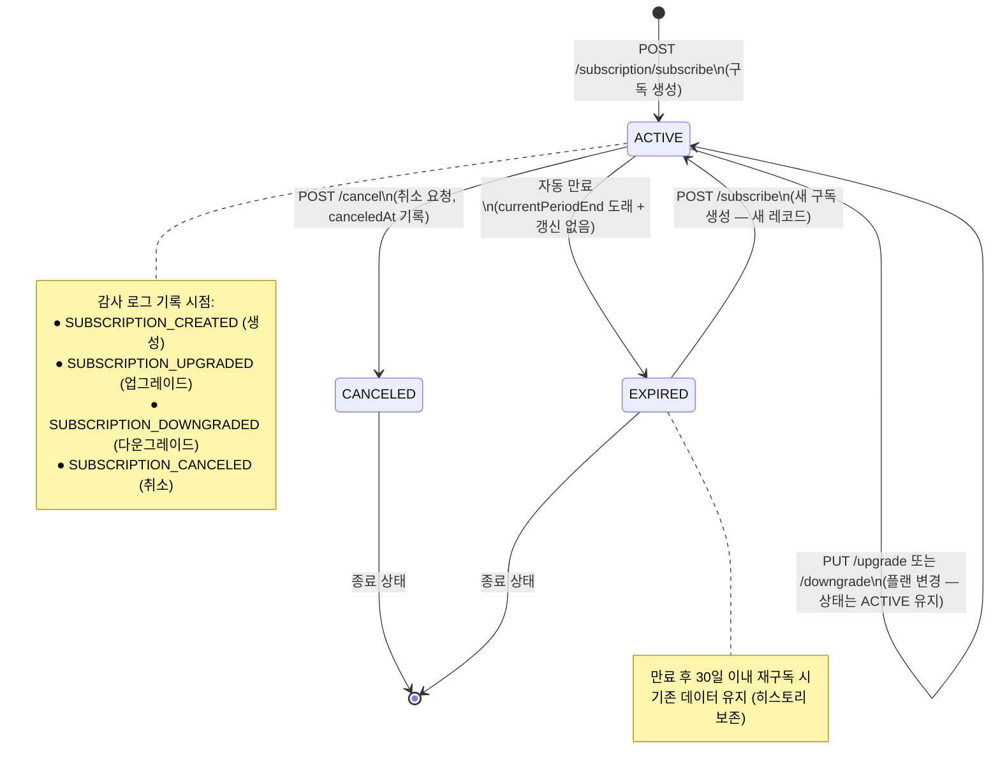

### 상태별 허용 동작

| 현재 상태 | 허용되는 동작 | 허용 안 되는 동작 |
|---------|------------|----------------|
| ACTIVE | 업그레이드, 다운그레이드, 취소 | 새 구독 생성 (중복 방지) |
| CANCELED | 없음 (종료 상태) | 모든 변경 불가 |
| EXPIRED | 새 구독 생성만 가능 | 업그레이드, 다운그레이드 |

---

## 5. 구독 라이프사이클 전체 플로우

### 5.1 신규 가입 → 구독 활성화

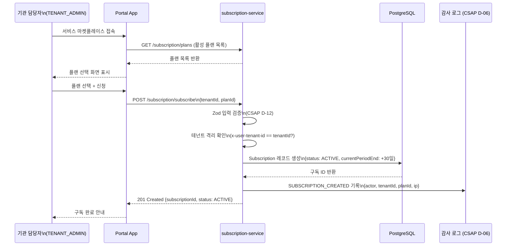

### 5.2 플랜 업그레이드 (즉시 적용)

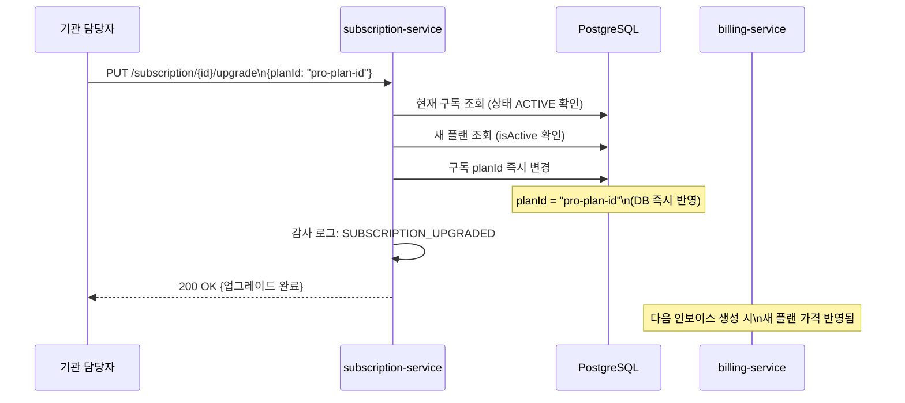

💡 업그레이드는 DB의 `planId`가 즉시 변경됩니다. 금액 조정은 다음 인보이스 발행 시 반영됩니다. 일할 계산(Proration)이 필요하면 billing-service에서 처리합니다.

### 5.3 구독 취소 → 기간 만료

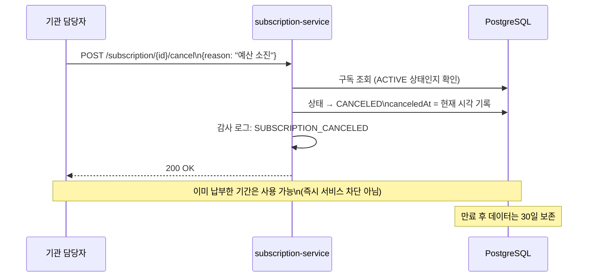

### 5.4 자동 갱신 실패 → 유예 기간 → 만료 (설계 기준)

실제 자동 결제 시스템 연동 시의 플로우입니다.

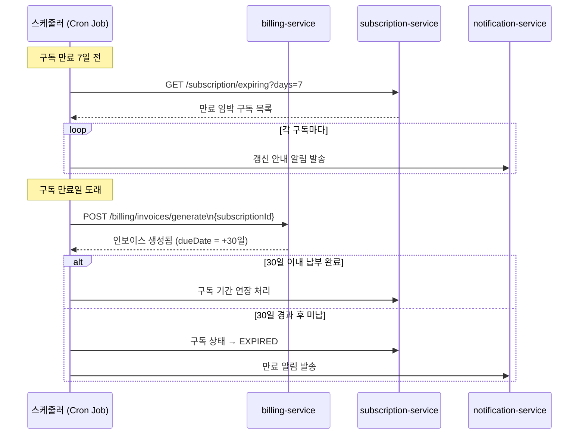

---

## 6. 청구 로직 — 인보이스와 결제

### 6.1 인보이스 생성 규칙

인보이스는 SUPER_ADMIN만 생성할 수 있습니다. 공공기관 SaaS에서는 보통 구독 생성 후 수동 또는 스케줄러로 인보이스를 발행합니다.

```typescript
// billing-service 인보이스 생성 로직 핵심
// platform/services/billing-service/src/handlers/billing.handler.ts

export async function generateInvoiceHandler(request, reply) {
  // 1. 입력 검증 (CSAP D-12)
  const schema = z.object({ subscriptionId: z.string().min(1) });
  const { subscriptionId } = schema.parse(request.body);

  // 2. 구독 정보 조회 (플랜 가격 확인)
  const subscription = await prisma.subscription.findUnique({
    where: { id: subscriptionId },
    include: { plan: true },
  });

  // 3. 납부 기한 설정 (발행일 + 30일)
  const dueDate = new Date();
  dueDate.setDate(dueDate.getDate() + 30);

  // 4. 인보이스 생성 (플랜 가격으로)
  const invoice = await prisma.invoice.create({
    data: {
      subscriptionId: subscription.id,
      amount: subscription.plan.price,    // 플랜 정가 그대로
      currency: subscription.plan.currency,
      status: 'issued',
      issuedAt: new Date(),
      dueDate,
    },
  });

  // 5. 감사 로그 (CSAP D-06 필수)
  await logBillingEvent('INVOICE_GENERATED', actor, invoice.id, tenantId, ip, userAgent, {
    amount: invoice.amount.toString(),
    subscriptionId,
  });

  return reply.status(201).send({ success: true, data: invoice });
}
```

### 6.2 인보이스 상태 전환

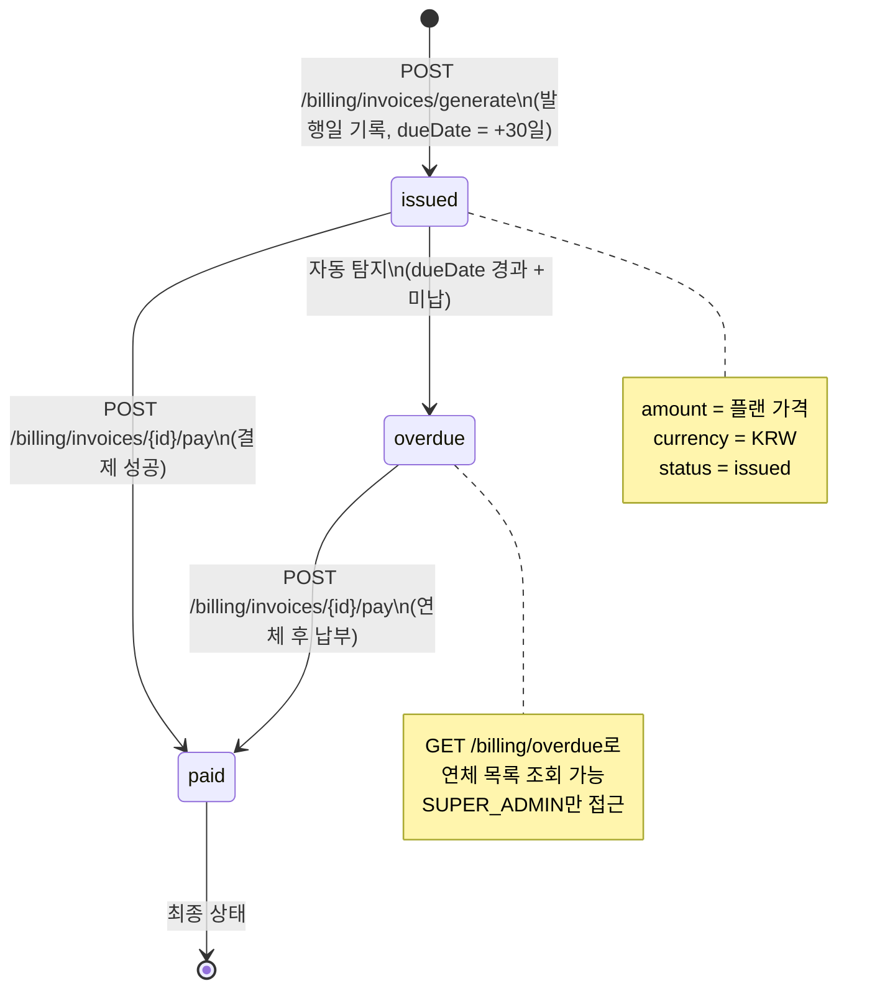

### 6.3 결제 처리 플로우

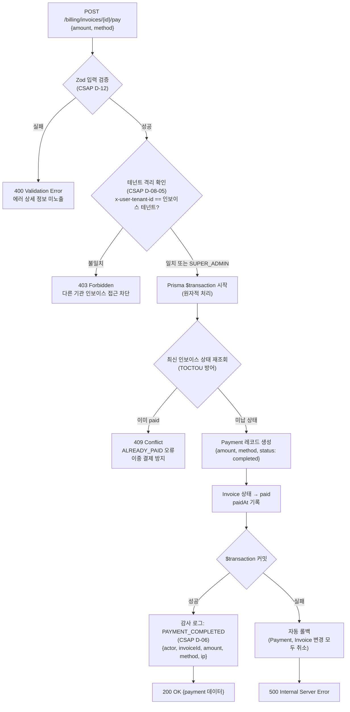

### 6.4 실제 결제 처리 코드 (핵심 부분)

```typescript
// Prisma $transaction으로 TOCTOU 방어
// platform/services/billing-service/src/handlers/billing.handler.ts

const payment = await prisma.$transaction(async (tx) => {
  // 트랜잭션 안에서 최신 상태 재조회 (조회와 변경 사이 시간차 없음)
  const latestInvoice = await tx.invoice.findUnique({
    where: { id: request.params.id },
    select: { status: true },
  });

  // 이미 결제된 경우 null 반환 → 409 Conflict
  if (!latestInvoice || latestInvoice.status === 'paid') {
    return null;
  }

  // Payment 레코드 생성
  const created = await tx.payment.create({
    data: {
      invoiceId: request.params.id,
      amount: parseResult.data.amount,
      method: parseResult.data.method,
      status: 'completed',
      paidAt,
    },
  });

  // Invoice 상태 변경 (같은 트랜잭션 내에서)
  await tx.invoice.update({
    where: { id: request.params.id },
    data: { status: 'paid', paidAt },
  });

  return created;
});

// null이면 이중 결제 시도 → 409
if (!payment) {
  return reply.status(409).send({
    success: false,
    error: { code: 'ALREADY_PAID', message: '이미 결제된 인보이스입니다' },
  });
}
```

### 6.5 세금계산서 처리 (공공기관 특수 요건)

공공기관은 법적으로 세금계산서를 수취해야 합니다.

```typescript
// 세금계산서 계산 로직 (부가세 10%)
const taxInvoice = {
  invoiceId: invoice.id,
  tenantName: invoice.subscription.tenant.name,
  amount: invoice.amount.toString(),              // 공급가액
  tax: (Number(invoice.amount) * 0.1).toFixed(2), // 부가세 (10%)
  total: (Number(invoice.amount) * 1.1).toFixed(2), // 합계
  issuedAt: new Date().toISOString(),
};

// 예시: 50만원 서비스
// amount: "500000"  → 공급가액
// tax: "50000.00"   → 부가세
// total: "550000.00" → 합계 금액
```

실제 국세청 e세로 API 연동은 별도 어댑터 서비스에서 처리합니다. 현재 구현은 JSON 데이터 생성까지만 담당합니다.

---

## 7. TOCTOU 방어 — 이중 결제 방지

### 7.1 TOCTOU란 무엇인가

TOCTOU(Time Of Check To Time Of Use)는 "상태를 확인한 시점"과 "실제로 사용하는 시점" 사이에 데이터가 변하는 버그입니다.

```
TOCTOU 시나리오 (방어 전):

시각 T1: 요청A가 인보이스 상태 확인 → "issued"
시각 T2: 요청B가 인보이스 상태 확인 → "issued" (아직 A가 완료 안 됨)
시각 T3: 요청A가 Payment 생성 + Invoice 상태 → "paid"
시각 T4: 요청B도 Payment 생성 + Invoice 상태 → "paid" (이중 결제 발생!)

결과: 같은 인보이스에 두 번 결제됨
```

### 7.2 $transaction으로 방어하는 방법

```
TOCTOU 방어 후 ($transaction):

시각 T1: 요청A가 $transaction 시작 → 인보이스 SELECT FOR UPDATE (잠금)
시각 T2: 요청B가 $transaction 시작 시도 → 요청A의 잠금으로 대기
시각 T3: 요청A가 상태 확인("issued") → Payment 생성 → Invoice "paid" → 커밋
시각 T4: 요청B의 잠금 해제 → 상태 재확인 → "paid" 발견 → null 반환 → 409

결과: 이중 결제 완전 방지
```

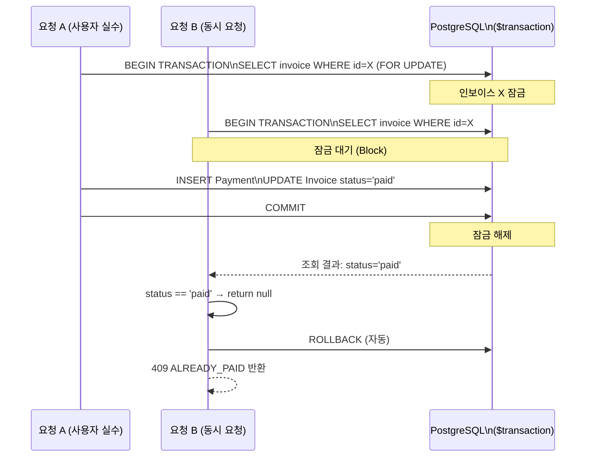

---

## 8. Usage-based Billing 개념

### 8.1 현재 구현 상태

현재 billing-service는 **고정 월정액** 방식을 구현하고 있습니다. Usage-based(사용량 기반) 청구는 향후 Phase에서 확장 예정입니다.

```typescript
// 현재: 고정 월정액
const invoice = await prisma.invoice.create({
  data: {
    amount: subscription.plan.price,  // 플랜 정가 (고정)
    // ...
  },
});
```

### 8.2 Usage-based Billing 확장 설계

사용량 기반 청구 추가 시 아래 설계를 참고합니다.

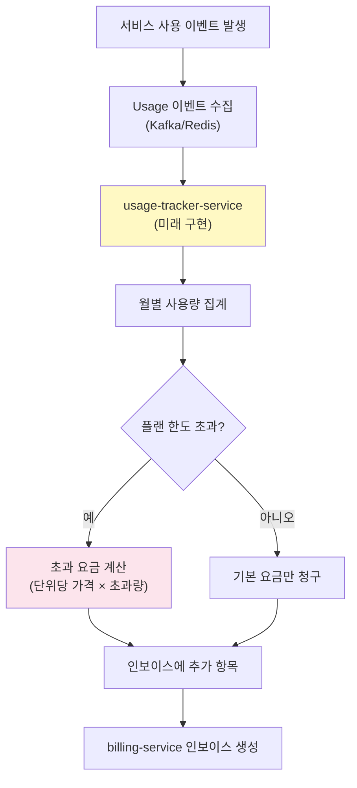

사용량 측정 항목 (설계 기준):

| 측정 항목 | 단위 | 기본 한도 | 초과 요금 |
|---------|-----|---------|---------|
| API 호출량 | 1,000건 | 100만 건/월 | 1,000원/천 건 |
| AI 토큰 사용량 | 1M 토큰 | 플랜별 상이 | 5,000원/백만 토큰 |
| 파일 저장소 | 1GB | 플랜별 상이 | 500원/GB |
| 사용자 수 | 1명 | 플랜 maxUsers | 10,000원/명 |

### 8.3 월별 한도 관리 (현재 구현 가능 부분)

```typescript
// 구독 플랜의 한도 확인 (현재 구현)
const subscription = await prisma.subscription.findUnique({
  where: { id: subscriptionId },
  include: { plan: true },
});

// 사용자 수 한도 확인
if (currentUserCount >= subscription.plan.maxUsers) {
  throw new Error(`사용자 한도(${subscription.plan.maxUsers}명) 초과`);
}

// 저장소 한도 확인 (bytes 단위)
if (currentStorageBytes >= subscription.plan.maxStorage) {
  throw new Error('저장소 한도 초과');
}
```

---

## 9. 멱등성 보장

### 9.1 멱등성이란

같은 요청을 여러 번 보내도 결과가 한 번 보낸 것과 동일해야 합니다. 네트워크 오류로 클라이언트가 재시도할 때 중요합니다.

```
멱등성 있는 연산:
  DELETE /invoices/123  → 123 삭제
  DELETE /invoices/123  → 이미 없음, 200 또는 404 (부작용 없음)

멱등성 없는 연산 (위험):
  POST /billing/invoices/generate  → 인보이스 생성
  POST /billing/invoices/generate  → 또 인보이스 생성 (중복!)
```

### 9.2 현재 구현된 멱등성 방어

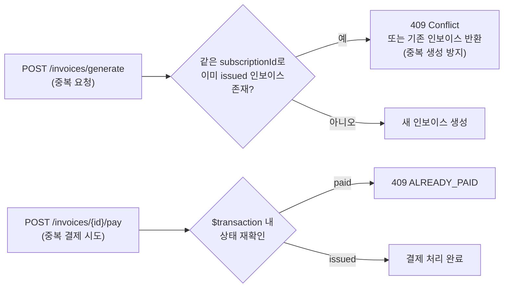

### 9.3 Idempotency Key 패턴 (확장 시)

대규모 결제 시스템에서는 클라이언트가 Idempotency Key를 헤더로 전달하여 중복 방지를 더 강력하게 보장합니다.

```typescript
// 향후 확장 시 패턴 (현재 미구현, 설계 참고용)
export async function payInvoiceHandler(request, reply) {
  const idempotencyKey = request.headers['idempotency-key'];

  if (idempotencyKey) {
    // Redis에서 같은 key의 이전 결과 확인
    const cached = await redis.get(`idem:${idempotencyKey}`);
    if (cached) {
      // 이전 결과를 그대로 반환 (새로 처리하지 않음)
      return reply.send(JSON.parse(cached));
    }
  }

  // 실제 결제 처리
  const result = await processPayment(/* ... */);

  if (idempotencyKey) {
    // 결과를 24시간 캐시 (재시도 시 동일 결과 반환)
    await redis.setex(`idem:${idempotencyKey}`, 86400, JSON.stringify(result));
  }

  return reply.send(result);
}
```

---

## 10. 공공기관 특수 요건

### 10.1 예산 집행 주기와 구독 주기 정렬

공공기관은 회계연도(1월~12월) 기준으로 예산을 집행합니다. 구독 기간도 이에 맞춰 설정할 수 있어야 합니다.

```typescript
// 연간 구독 (yearly interval) 지원
const yearlyPlan = {
  name: "행안부 연간 표준 플랜",
  slug: "gov-yearly",
  price: 5500000,    // 연간 요금 (월 50만원 × 12 = 600만원보다 할인)
  currency: "KRW",
  interval: "yearly", // 연간 구독
  maxUsers: 50,
};

// 구독 기간 계산
const currentPeriodStart = new Date();
const currentPeriodEnd = new Date();
currentPeriodEnd.setFullYear(currentPeriodEnd.getFullYear() + 1); // 1년 후
```

### 10.2 결제 수단별 처리

```typescript
// 지원하는 결제 수단
const paymentMethods = {
  'card': '신용카드 (민간 기업)',
  'bank_transfer': '계좌이체 (공공기관 선호)',
  'virtual_account': '가상계좌 (공공기관 선호)',
};

// 결제 수단 검증 (Zod)
const paySchema = z.object({
  amount: z.number().min(0),
  method: z.enum(['card', 'bank_transfer', 'virtual_account']),
});
```

### 10.3 연체 인보이스 관리 흐름

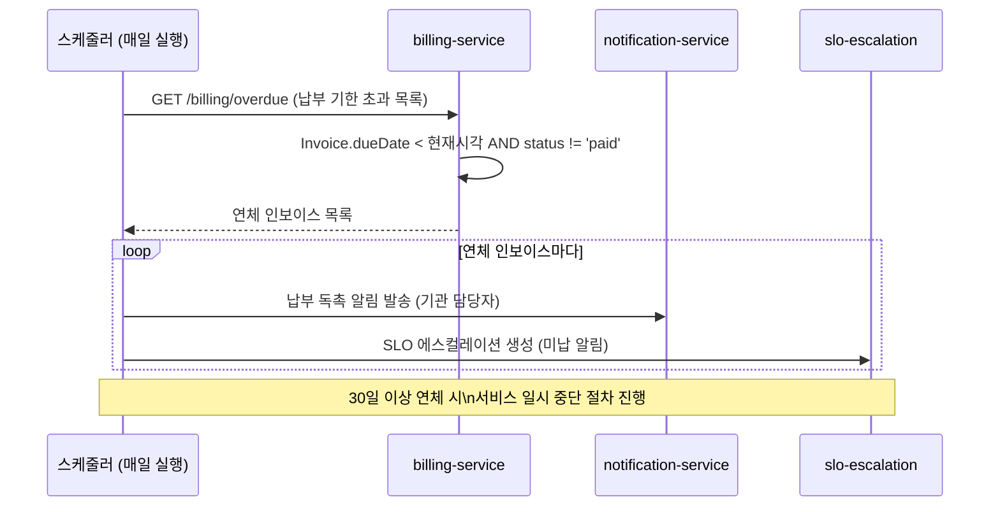

---

## 11. CSAP 관련 요건

### 11.1 데이터 등급 분류 (N2SF)

청구 데이터는 금융 정보를 포함하므로 엄격하게 관리해야 합니다.

| 데이터 항목 | N2SF 등급 | 처리 규칙 |
|-----------|---------|---------|
| 카드 번호, 계좌 번호 | S (민감) | AI API 전송 절대 금지, 내부 DB에만 저장 |
| 결제 금액, 결제 방법 | S (민감) | AI API 전송 절대 금지 |
| 인보이스 번호 | O (일반) | PII 마스킹 후 AI 분석 가능 |
| 수익 집계 통계 (테넌트 미식별) | O (일반) | AI 분석 가능 |
| 세금계산서 원본 | S (민감) | 외부 전송 금지, 내부 DB만 저장 |

```typescript
// ✅ 올바른 방법: AI에 보낼 때 PII 마스킹
async function analyzeRevenueTrend(invoiceData: Invoice[]) {
  const grade = DataGrade.S; // 결제 금액 포함 → S 등급

  // S 등급이면 AI API 전송 불가
  if (grade === DataGrade.S) {
    throw new Error('BLOCKED: S등급 데이터는 AI API 전송 금지 (N2SF N-05)');
  }

  // O 등급이어도 PII 마스킹 필수
  const masked = maskPII(invoiceData);
  return aiGateway.send(masked); // AI Gateway 경유 필수
}

// ❌ 잘못된 방법: 결제 데이터 직접 AI에 전송
const insight = await openai.chat.completions.create({
  messages: [{ role: 'user', content: JSON.stringify(invoiceWithCardNumber) }]
});
```

### 11.2 감사 로그 요건 (CSAP D-06)

청구 관련 모든 민감 작업은 감사 로그를 기록해야 합니다.

```typescript
// billing-service의 감사 로그 팩토리
// platform/services/billing-service/src/lib/audit.ts

import { createServiceAuditLogger } from '@public-saas/audit-sdk';

// createServiceAuditLogger가 보일러플레이트를 제거
// 호출 시: logBillingEvent(action, actor, target, tenantId, ip, userAgent, metadata)
export const logBillingEvent = createServiceAuditLogger('billing-service', 'billing');
```

모든 청구 이벤트와 CSAP 요건 매핑:

| 이벤트 코드 | 발생 시점 | CSAP 요건 | 보존 기간 |
|-----------|---------|---------|---------|
| `INVOICE_GENERATED` | 인보이스 생성 | D-06-01 | 5년 |
| `PAYMENT_COMPLETED` | 결제 완료 | D-06-01 | 5년 |
| `TAX_INVOICE_GENERATED` | 세금계산서 발행 | D-06-01 | 5년 |
| `SUBSCRIPTION_CREATED` | 구독 생성 | D-06-01 | 3년 |
| `SUBSCRIPTION_UPGRADED` | 플랜 변경 | D-06-01 | 3년 |
| `SUBSCRIPTION_CANCELED` | 구독 취소 | D-06-01 | 3년 |

### 11.3 테넌트 격리 (CSAP D-08-05)

모든 청구 조회 API는 테넌트 격리를 엄격히 적용합니다.

```typescript
// 테넌트 격리 패턴 (billing-service의 모든 조회 API)
const jwtTenantId = request.headers['x-user-tenant-id'];
const jwtRole = request.headers['x-user-role'];

// SUPER_ADMIN만 모든 테넌트 데이터 조회 가능
// 그 외는 본인 테넌트 데이터만
const where: Record<string, unknown> = {};
if (jwtRole !== 'SUPER_ADMIN' && jwtTenantId) {
  where['subscription'] = { is: { tenantId: jwtTenantId } };
}

const invoices = await prisma.invoice.findMany({ where });
// TENANT_ADMIN이 이 API를 호출하면 본인 기관 인보이스만 반환됨
```

### 11.4 입력 검증 규칙 (CSAP D-12)

| 필드 | 검증 규칙 | 실패 시 |
|------|---------|--------|
| `subscriptionId` | `z.string().min(1)` | 400 VALIDATION_ERROR |
| `amount` | `z.number().min(0)` | 400 VALIDATION_ERROR |
| `method` | `z.enum(['card', 'bank_transfer', 'virtual_account'])` | 400 VALIDATION_ERROR |
| 경로 파라미터 `id` | 문자열 최소 길이 | 400 VALIDATION_ERROR |

---

## 12. 실제 운영 시나리오 실습

### 시나리오 A: 신규 기관 온보딩

```bash
# 환경 변수 설정
export INTERNAL_SERVICE_KEY="test-internal-key"
export TENANT_ID="550e8400-e29b-41d4-a716-446655440000"
export PLAN_ID="7f000001-c23f-1234-8c23-abc123456789"

# 1. 활성 플랜 목록 확인
curl -s \
  -H "x-internal-service-key: ${INTERNAL_SERVICE_KEY}" \
  -H "x-user-role: SUPER_ADMIN" \
  http://localhost:3004/subscription/plans | jq '.data[] | {id, name, price, interval}'

# 2. 신규 기관용 플랜 생성 (SUPER_ADMIN만)
curl -s -X POST \
  -H "Content-Type: application/json" \
  -H "x-internal-service-key: ${INTERNAL_SERVICE_KEY}" \
  -H "x-user-id: admin-001" \
  -H "x-user-role: SUPER_ADMIN" \
  -d '{
    "name": "행안부 기본 플랜",
    "slug": "mois-basic",
    "price": 300000,
    "currency": "KRW",
    "interval": "monthly",
    "maxUsers": 30,
    "maxStorage": 5368709120
  }' \
  http://localhost:3004/subscription/plans | jq

# 3. 구독 생성 (TENANT_ADMIN이 신청)
curl -s -X POST \
  -H "Content-Type: application/json" \
  -H "x-internal-service-key: ${INTERNAL_SERVICE_KEY}" \
  -H "x-user-id: tenant-admin-001" \
  -H "x-user-role: TENANT_ADMIN" \
  -H "x-user-tenant-id: ${TENANT_ID}" \
  -d "{\"tenantId\": \"${TENANT_ID}\", \"planId\": \"${PLAN_ID}\"}" \
  http://localhost:3004/subscription/subscribe | jq
```

### 시나리오 B: 인보이스 발행 및 결제

```bash
export SUBSCRIPTION_ID="sub-uuid-here"
export INVOICE_ID="inv-uuid-here"

# 4. 인보이스 생성 (SUPER_ADMIN이 월말 발행)
curl -s -X POST \
  -H "Content-Type: application/json" \
  -H "x-internal-service-key: ${INTERNAL_SERVICE_KEY}" \
  -H "x-user-id: admin-001" \
  -H "x-user-role: SUPER_ADMIN" \
  -d "{\"subscriptionId\": \"${SUBSCRIPTION_ID}\"}" \
  http://localhost:3005/billing/invoices/generate | jq

# 5. 인보이스 조회 (기관 담당자가 확인)
curl -s \
  -H "x-internal-service-key: ${INTERNAL_SERVICE_KEY}" \
  -H "x-user-role: TENANT_ADMIN" \
  -H "x-user-tenant-id: ${TENANT_ID}" \
  http://localhost:3005/billing/invoices/${INVOICE_ID} | jq '.data | {id, amount, status, dueDate}'

# 6. 결제 처리 (가상계좌 납부)
curl -s -X POST \
  -H "Content-Type: application/json" \
  -H "x-internal-service-key: ${INTERNAL_SERVICE_KEY}" \
  -H "x-user-id: tenant-admin-001" \
  -H "x-user-role: TENANT_ADMIN" \
  -H "x-user-tenant-id: ${TENANT_ID}" \
  -d '{"amount": 300000, "method": "virtual_account"}' \
  http://localhost:3005/billing/invoices/${INVOICE_ID}/pay | jq

# 7. 이중 결제 시도 → 409 확인
curl -s -X POST \
  -H "Content-Type: application/json" \
  -H "x-internal-service-key: ${INTERNAL_SERVICE_KEY}" \
  -H "x-user-id: tenant-admin-001" \
  -H "x-user-role: TENANT_ADMIN" \
  -H "x-user-tenant-id: ${TENANT_ID}" \
  -d '{"amount": 300000, "method": "virtual_account"}' \
  http://localhost:3005/billing/invoices/${INVOICE_ID}/pay | jq
# → {"success": false, "error": {"code": "ALREADY_PAID", ...}} 확인
```

### 시나리오 C: 세금계산서 발행

```bash
# 8. 세금계산서 발행
curl -s -X POST \
  -H "Content-Type: application/json" \
  -H "x-internal-service-key: ${INTERNAL_SERVICE_KEY}" \
  -H "x-user-id: tenant-admin-001" \
  -H "x-user-role: TENANT_ADMIN" \
  -H "x-user-tenant-id: ${TENANT_ID}" \
  http://localhost:3005/billing/invoices/${INVOICE_ID}/tax-invoice | jq '.data'

# 예시 출력:
# {
#   "invoiceId": "inv-uuid",
#   "tenantName": "행정안전부",
#   "amount": "300000",
#   "tax": "30000.00",      ← 부가세 10%
#   "total": "330000.00",   ← 최종 납부액
#   "issuedAt": "2026-04-12T..."
# }
```

### 시나리오 D: 수익 현황 확인 (SUPER_ADMIN)

```bash
# 9. 전체 수익 대시보드
curl -s \
  -H "x-internal-service-key: ${INTERNAL_SERVICE_KEY}" \
  -H "x-user-role: SUPER_ADMIN" \
  http://localhost:3005/billing/dashboard | jq '.data'

# 10. 연체 인보이스 목록
curl -s \
  -H "x-internal-service-key: ${INTERNAL_SERVICE_KEY}" \
  -H "x-user-role: SUPER_ADMIN" \
  "http://localhost:3005/billing/overdue?page=1&limit=10" | jq '.data | length'

# 11. 최근 6개월 수익 추이
curl -s \
  -H "x-internal-service-key: ${INTERNAL_SERVICE_KEY}" \
  -H "x-user-role: SUPER_ADMIN" \
  "http://localhost:3005/billing/revenue-trend?months=6" | jq
```

---

## 13. 학습 체크리스트

### 구독 비즈니스 모델 이해

- [ ] Free / Basic / Pro / Enterprise 플랜의 차이를 설명할 수 있다
- [ ] 공공기관 구독이 일반 SaaS 구독과 다른 점 3가지를 말할 수 있다
- [ ] 플랜을 삭제하지 않고 `isActive = false`로 비활성화하는 이유를 설명할 수 있다

### 구독 상태 머신

- [ ] ACTIVE, CANCELED, EXPIRED 세 가지 상태를 설명할 수 있다
- [ ] CANCELED 상태에서 다시 ACTIVE로 직접 전환할 수 없는 이유를 안다
- [ ] 업그레이드 시 상태가 ACTIVE로 유지되는 이유를 설명할 수 있다

### 청구 로직

- [ ] 인보이스 생성 시 `dueDate = 발행일 + 30일`로 설정되는 것을 안다
- [ ] issued → paid → (종료) 상태 전환 순서를 말할 수 있다
- [ ] 세금계산서의 부가세 계산 방법 (공급가액 × 10%)을 안다

### TOCTOU 방어

- [ ] TOCTOU 버그가 결제에서 어떤 문제를 일으키는지 설명할 수 있다
- [ ] `prisma.$transaction`이 어떻게 이중 결제를 막는지 설명할 수 있다
- [ ] 이중 결제 시도 시 409 ALREADY_PAID가 반환되는 것을 curl로 직접 확인했다

### CSAP 요건

- [ ] 결제 금액이 N2SF S 등급이어서 AI API로 전송하면 안 되는 이유를 안다
- [ ] 인보이스 생성, 결제, 세금계산서 발행 모두 감사 로그가 기록되는 것을 확인했다
- [ ] TENANT_ADMIN이 다른 기관의 인보이스를 조회하면 403이 반환되는 것을 확인했다

### 실습 완료

- [ ] 플랜 생성 → 구독 생성 → 인보이스 발행 → 결제 → 세금계산서 순서대로 curl 실행 완료
- [ ] 이중 결제 시도 시 409 응답 확인
- [ ] 타 테넌트 인보이스 조회 시 403 응답 확인
- [ ] 수익 대시보드 API 응답 확인

---

## 14. 다음 단계

구독·청구 로직을 이해했다면, 연관 시스템으로 학습을 이어가세요.

- **SLO 에스컬레이션**: 구독 만료 임박 알림 연계
  - `docs/guides/onboarding/05-monitoring/` 디렉터리
- **알림 서비스**: 인보이스 발행·납부 기한 알림
  - `docs/guides/onboarding/02-architecture/services/12-notification-service.md`
- **감사 로그 심화**: CSAP D-06 요건 전체 이해
  - `docs/guides/onboarding/11-faq/03-csap-faq.md`
- **운영 FAQ**: 실제 운영 중 발생하는 문제 대응
  - `docs/guides/onboarding/11-faq/05-operations-faq.md`

---

## 변경 이력

| 버전 | 일자 | 내용 | 작성자 |
|------|------|------|--------|
| 1.0.0 | 2026-04-12 | 최초 작성 — 구독·청구 비즈니스 로직 심화 가이드 | Implementer (Sonnet) |
