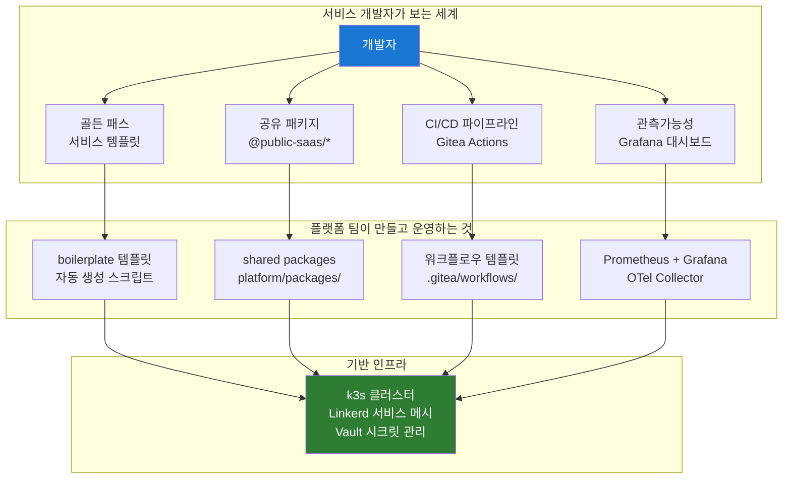
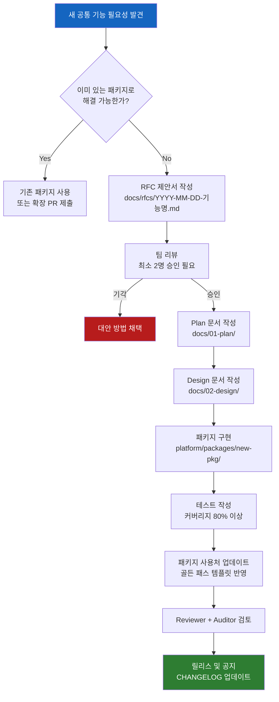
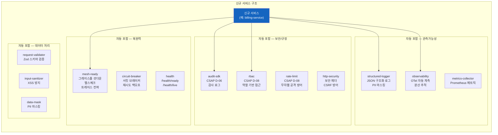
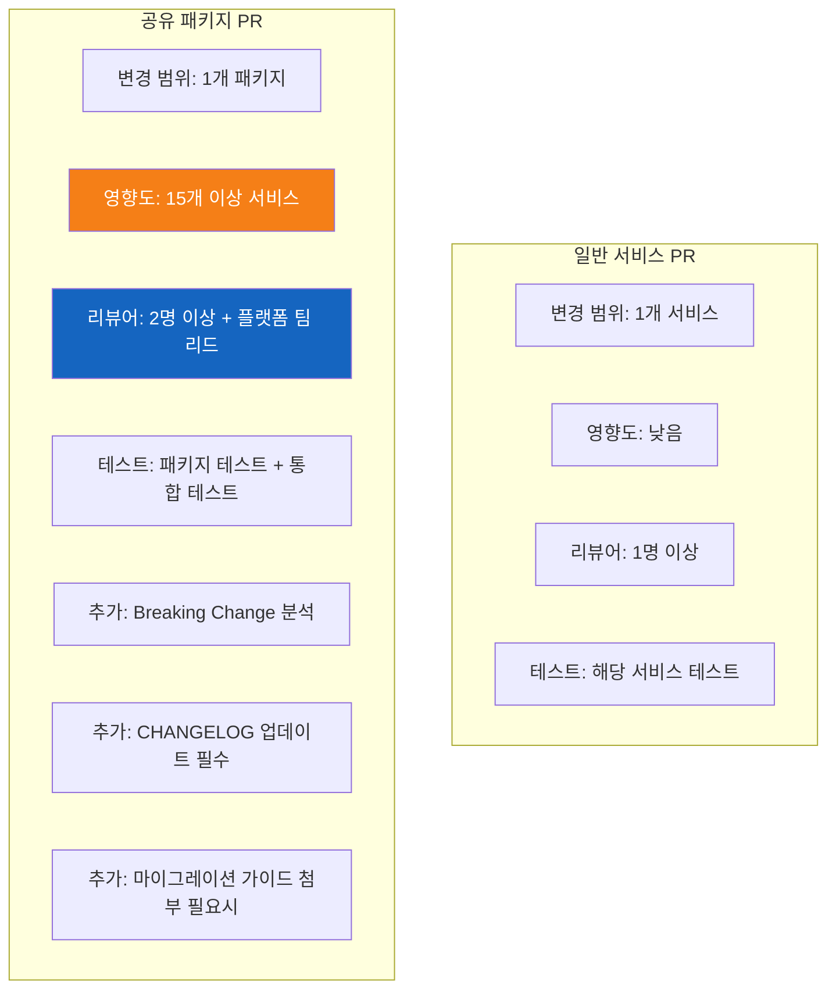

# 플랫폼 엔지니어링 — 공유 패키지와 개발자 경험(DX)

> **문서 ID**: ONBOARD-02-09
> **버전**: 1.0.0 | **작성일**: 2026-04-12 | **작성자**: Implementer (Sonnet)
> **학습 대상**: 신규 팀원 — 프로젝트 합류 후 1~2주 이내 학습 권장
> **예상 학습 시간**: 3~4시간
> **선행 문서**: `02-architecture/06-adr-deep-dive.md`, `02-architecture/01-system-overview.md`
> **CSAP 연관**: D-08 (접근통제), D-09 (암호화), D-12 (개발 보안)

---

## 목차

1. [플랫폼 엔지니어링이란?](#1-플랫폼-엔지니어링이란)
   - 1.1 [개발자 경험(DX)이 핵심 목표다](#11-개발자-경험dx이-핵심-목표다)
   - 1.2 [Internal Developer Platform(IDP) 개념](#12-internal-developer-platformidp-개념)
   - 1.3 [이 프로젝트에서 플랫폼 팀이 하는 일](#13-이-프로젝트에서-플랫폼-팀이-하는-일)
2. [공유 패키지 아키텍처](#2-공유-패키지-아키텍처)
   - 2.1 [왜 packages/를 모노레포에서 관리하는가](#21-왜-packages를-모노레포에서-관리하는가)
   - 2.2 [전체 패키지 목록과 역할](#22-전체-패키지-목록과-역할)
   - 2.3 [패키지 추가 절차](#23-패키지-추가-절차)
   - 2.4 [패키지 버전 관리 — pnpm workspace 프로토콜](#24-패키지-버전-관리--pnpm-workspace-프로토콜)
   - 2.5 [하위 호환성 유지 전략](#25-하위-호환성-유지-전략)
3. [골든 패스(Golden Path)](#3-골든-패스golden-path)
   - 3.1 [골든 패스란 무엇인가](#31-골든-패스란-무엇인가)
   - 3.2 [신규 서비스 생성 시 자동으로 포함되는 것들](#32-신규-서비스-생성-시-자동으로-포함되는-것들)
   - 3.3 [mesh-ready — 서비스 메시 준비 완료 패키지](#33-mesh-ready--서비스-메시-준비-완료-패키지)
   - 3.4 [audit-sdk — 감사 로그 표준화](#34-audit-sdk--감사-로그-표준화)
   - 3.5 [rbac — 인증/인가 표준화](#35-rbac--인증인가-표준화)
   - 3.6 [rate-limit — 속도 제한 표준화](#36-rate-limit--속도-제한-표준화)
   - 3.7 [직접 구현하지 말고 패키지를 써야 하는 이유](#37-직접-구현하지-말고-패키지를-써야-하는-이유)
4. [관측가능성 표준화](#4-관측가능성-표준화)
   - 4.1 [구조화 로그 형식 강제](#41-구조화-로그-형식-강제)
   - 4.2 [OTel 자동 계측 설정](#42-otel-자동-계측-설정)
   - 4.3 [공통 메트릭 네이밍 규칙](#43-공통-메트릭-네이밍-규칙)
5. [패키지 개선 기여 방법](#5-패키지-개선-기여-방법)
   - 5.1 [공유 패키지 PR과 일반 서비스 PR의 차이](#51-공유-패키지-pr과-일반-서비스-pr의-차이)
   - 5.2 [변경 영향 분석](#52-변경-영향-분석)
   - 5.3 [Semver 버전 올리기 기준](#53-semver-버전-올리기-기준)
6. [미래 플랫폼 발전 방향](#6-미래-플랫폼-발전-방향)
   - 6.1 [Backstage IDP 도입 고려사항](#61-backstage-idp-도입-고려사항)
   - 6.2 [서비스 카탈로그 자동화](#62-서비스-카탈로그-자동화)
7. [학습 체크리스트](#7-학습-체크리스트)
8. [다음 단계](#8-다음-단계)

---

## 1. 플랫폼 엔지니어링이란?

### 1.1 개발자 경험(DX)이 핵심 목표다

플랫폼 엔지니어링을 처음 접하는 팀원이라면 이 질문에서 출발해야 합니다.

> "새 서비스를 만들 때 감사 로그는 어떻게 구현해야 하나요?"

이 질문에 대해 두 가지 답이 가능합니다.

**나쁜 답**: "CSAP D-06 요건을 읽고 직접 구현하세요. 로그 형식은 JSON이어야 하고, append-only여야 하고, 타임스탬프 포맷은 ISO 8601이어야 하고..."

**좋은 답**: "`@public-saas/audit-sdk`를 설치하고 `createAuditLogger()`를 호출하면 됩니다. CSAP 요건은 이미 패키지 안에 구현되어 있습니다."

플랫폼 엔지니어링(Platform Engineering)은 개발자가 "좋은 답"을 항상 받을 수 있는 환경을 만드는 일입니다. 구체적으로는 다음을 의미합니다.

- 반복되는 공통 기능(인증, 로깅, 헬스체크 등)을 **한 번** 잘 만들어서 모든 서비스가 재사용
- 보안·규정 요건(CSAP, N2SF)을 **패키지 레벨**에서 이미 충족시켜, 서비스 개발자가 신경 쓰지 않아도 되게끔
- 새 서비스를 만들 때 "올바른 방법"이 "쉬운 방법"이 되도록 도구와 템플릿 제공

💡 **DevX 원칙**: 개발자가 골든 패스(올바른 방법)를 따르는 것이 자신만의 방법을 발명하는 것보다 쉬워야 한다.

### 1.2 Internal Developer Platform(IDP) 개념

IDP(Internal Developer Platform, 내부 개발자 플랫폼)는 플랫폼 엔지니어링의 결과물입니다. 개발자가 서비스를 빌드·배포·운영하는 데 필요한 모든 도구와 절차를 한 곳에서 제공하는 플랫폼입니다.



이 프로젝트에서 IDP는 완전한 상용 제품(예: Backstage)보다는 실용적인 도구 모음으로 구성됩니다. 현재 IDP의 구성 요소는 다음과 같습니다.

| IDP 구성 요소 | 이 프로젝트에서 | 위치 |
|------------|--------------|------|
| 서비스 템플릿 | 골든 패스 boilerplate | `docs/guides/templates/` |
| 공유 라이브러리 | `@public-saas/*` 패키지 | `platform/packages/` |
| CI/CD 파이프라인 | Gitea Actions 워크플로우 | `.gitea/workflows/` |
| 관측가능성 | Prometheus + Grafana + OTel | `infra/monitoring/` |
| 시크릿 관리 | HashiCorp Vault | `infra/vault/` |
| 서비스 카탈로그 | (계획 중 — §6 참조) | - |

### 1.3 이 프로젝트에서 플랫폼 팀이 하는 일

이 프로젝트에서 "플랫폼 팀" 역할을 맡은 개발자(또는 팀 전체가 합의하여)는 다음 책임을 집니다.

**1. 공유 패키지 관리** (`platform/packages/`)
- 신규 패키지 설계·구현·릴리스
- 기존 패키지 버그 수정 및 기능 개선
- 하위 호환성 유지 및 Breaking Change 관리

**2. 골든 패스 유지보수**
- 서비스 boilerplate 템플릿 최신 상태 유지
- 새 패키지가 추가되면 골든 패스에 반영

**3. CI/CD 파이프라인 표준화**
- 모든 서비스에 공통 적용되는 Q-Gate 워크플로우 관리
- 빌드 캐시 최적화

**4. 관측가능성 인프라**
- Prometheus, Grafana, OTel Collector 운영
- 공통 메트릭 네이밍 규칙 정의 및 강제

**5. CSAP/N2SF 요건 패키지화**
- 새 규제 요건이 생기면 패키지에 반영
- 서비스 개발자가 규정을 직접 읽지 않아도 되도록

---

## 2. 공유 패키지 아키텍처

### 2.1 왜 packages/를 모노레포에서 관리하는가

이 프로젝트는 `platform/packages/`에 50개 가까운 공유 패키지를 모노레포로 관리합니다. 왜 별도의 레포지토리로 분리하지 않았을까요?

**모노레포의 핵심 장점 3가지**:

```
장점 1: 원자적 변경 (Atomic Changes)
  패키지 A를 변경하고, 서비스 B가 그 변경을 사용하는 코드를
  하나의 커밋에 담을 수 있습니다.

  별도 레포지토리 방식이라면:
  1. 패키지 레포에 PR 생성 → 리뷰 → 머지 → 태그 → npm publish
  2. 서비스 레포에서 새 버전으로 업데이트 PR 생성
  → 2개의 PR, 2번의 리뷰, 수 시간 ~ 수 일 소요

  모노레포 방식이라면:
  1. 하나의 PR에서 패키지 변경 + 서비스 업데이트 동시 반영
  → 1개의 PR, 한 번의 리뷰

장점 2: 내부 패키지는 npm publish 불필요
  workspace:* 프로토콜로 로컬에서 직접 링크
  → 배포 단계 없이 즉시 사용 가능

장점 3: 타입 공유가 자연스럽다
  공유 타입 패키지(@public-saas/types)가 서비스 코드에서
  즉시 import 가능 — 타입 불일치 문제 원천 차단
```

**pnpm workspace + Turbo 조합**:

```yaml
# pnpm-workspace.yaml (루트)
packages:
  - 'platform/packages/*'
  - 'platform/services/*'
  - 'packages/*'
```

Turbo는 패키지 간 의존성 그래프를 분석해서 변경된 패키지와 그에 의존하는 서비스만 선택적으로 빌드합니다. 50개 패키지가 있어도 내 코드와 관련 없는 패키지는 빌드하지 않습니다.

### 2.2 전체 패키지 목록과 역할

`platform/packages/` 디렉토리에는 현재 다음 패키지들이 있습니다. 신규 팀원은 이 목록을 한 번 훑어보고 어떤 기능이 이미 구현되어 있는지 파악해야 합니다.

**핵심 인프라 패키지** (모든 서비스에 필수):

| 패키지 | 역할 | CSAP 연관 |
|-------|------|----------|
| `mesh-ready` | 그레이스풀 셧다운, 헬스체크, 트레이스 컨텍스트 전파 | D-07 가용성 |
| `audit-sdk` | 감사 로그 기록, 체인 무결성 검증 | D-06 침해사고 관리 |
| `rbac` | 역할 기반 접근 제어 엔진 + Fastify 플러그인 | D-08 접근 통제 |
| `auth-sdk` | JWT 검증, 토큰 블랙리스트 | D-08 접근 통제 |
| `structured-logger` | JSON 구조화 로그, PII 마스킹 | D-06 침해사고 관리 |
| `observability` | OTel 자동 계측 초기화, 텔레메트리 | D-06 보완 |
| `health` | 헬스체크 엔드포인트, SLA 메트릭 | D-07 가용성 |
| `rate-limit` | Redis 기반 속도 제한 미들웨어 | D-08 무차별 공격 방어 |
| `config-vault` | Vault 시크릿 로드, 환경 변수 검증 | D-09 암호화 |
| `crypto-util` | AES-256 암호화/복호화 유틸리티 | D-09 암호화 |

**복원력 패키지** (장애 대응):

| 패키지 | 역할 |
|-------|------|
| `circuit-breaker` | 서킷 브레이커 + 지수 백오프 재시도 |
| `backoff` | 재시도 전략 유틸리티 |
| `bulkhead` | 동시 요청 격벽 패턴 |
| `health-aggregator` | 여러 서비스 헬스 상태 집계 |

**데이터/API 패키지**:

| 패키지 | 역할 |
|-------|------|
| `input-sanitizer` | XSS 방지, HTML 새니타이제이션 |
| `request-validator` | Zod 기반 API 입력 검증 |
| `pagination` | 커서 기반 페이지네이션 |
| `data-mask` | PII 마스킹 (로그, AI 전송 전) |
| `api-version` | API 버전 관리 미들웨어 |
| `http-security` | 보안 헤더 (HSTS, CSP, X-Frame 등) |
| `problem-details` | RFC 7807 표준 에러 응답 형식 |
| `id-generator` | UUID v7, 분산 ID 생성 |
| `idempotency` | 멱등성 키 기반 중복 요청 방지 |

**이벤트/메시징 패키지**:

| 패키지 | 역할 |
|-------|------|
| `event-bus` | Redis Pub/Sub 이벤트 버스 |
| `event-schema-registry` | 이벤트 스키마 등록 및 검증 |
| `outbox` | Transactional Outbox 패턴 구현 |
| `saga` | 분산 트랜잭션 Saga 조율자 |
| `task-queue` | 비동기 작업 큐 |
| `workflow-engine` | 다단계 워크플로우 실행 엔진 |

**기타 유틸리티**:

| 패키지 | 역할 |
|-------|------|
| `tenant-isolation` | 멀티테넌시 데이터 격리 미들웨어 |
| `feature-flags` | 피처 플래그 SDK |
| `cache` / `cache-manager` | 캐시 추상화 레이어 |
| `secret-manager` | 시크릿 관리 추상화 |
| `metrics-collector` | 메트릭 수집 및 Prometheus 노출 |
| `trace-context` | 분산 추적 컨텍스트 전파 |
| `types` | 공유 TypeScript 타입 정의 |

### 2.3 패키지 추가 절차

새로운 공통 기능이 필요하다고 판단되면 즉시 패키지를 만들지 말고 다음 절차를 따릅니다.



**RFC 제안서 필수 항목**:

```markdown
# RFC: [기능명] 공유 패키지 추가

## 문제 정의
어떤 문제를 해결하는가? 현재 어떻게 해결하고 있고 왜 불충분한가?

## 제안하는 해결책
패키지 이름, 공개 API 초안 (TypeScript 인터페이스)

## 영향을 받는 서비스
이 패키지를 사용할 서비스 목록

## CSAP/N2SF 연관성
어떤 통제항목을 지원하는가?

## 대안 검토
왜 대안이 아닌 이 방법을 선택했는가?

## 하위 호환성
기존 코드에 Breaking Change를 일으키는가?
```

⚠️ **중요**: 동일한 기능을 2개 이상의 서비스에서 각자 구현하고 있다면 즉시 공통 패키지화를 검토하세요. "DRY 원칙 + 보안 요건 중앙화"가 핵심입니다.

### 2.4 패키지 버전 관리 — pnpm workspace 프로토콜

이 프로젝트에서는 내부 패키지를 npm 레지스트리에 배포하지 않습니다. 대신 `workspace:*` 프로토콜을 사용합니다.

```json
// platform/services/user-service/package.json
{
  "name": "@public-saas/user-service",
  "dependencies": {
    "@public-saas/audit-sdk": "workspace:*",
    "@public-saas/rbac": "workspace:*",
    "@public-saas/mesh-ready": "workspace:*",
    "@public-saas/structured-logger": "workspace:*",
    "@public-saas/rate-limit": "workspace:*"
  }
}
```

`workspace:*`의 의미: "이 패키지는 npm 레지스트리 대신 로컬 workspace에서 가져온다. 버전 제약 없이 항상 로컬 최신 소스를 사용한다."

**주의 사항**: `workspace:*`를 사용하면 항상 로컬 소스를 사용하므로, 패키지를 수정하면 그 패키지를 사용하는 모든 서비스에 즉시 영향을 줍니다. 이것이 Breaking Change 관리가 중요한 이유입니다.

```bash
# 특정 패키지의 모든 사용처 확인
grep -r "@public-saas/rate-limit" platform/services/*/package.json

# 특정 패키지 빌드 (의존 패키지 포함)
pnpm --filter "@public-saas/rate-limit..." build

# 전체 빌드 (Turbo 캐시 활용)
pnpm turbo build
```

### 2.5 하위 호환성 유지 전략

공유 패키지를 수정할 때 가장 중요한 원칙은 **하위 호환성**입니다. 15개 이상의 서비스가 패키지를 사용하는 상황에서 Breaking Change는 한 번에 모든 서비스를 수정해야 한다는 뜻입니다.

**호환성 판단 기준**:

```typescript
// ✅ 하위 호환 변경 (Minor/Patch 버전 올리기)
// 기존 API는 그대로, 새 기능만 추가
export interface AuditLogOptions {
  actor: string;
  action: string;
  target: string;
  timestamp: string;
  ip: string;
  // 신규 선택적 필드 추가 — 기존 코드에 영향 없음
  metadata?: Record<string, unknown>;
}

// ❌ Breaking Change (Major 버전 올리기 필요)
// 기존 필수 필드 제거 또는 타입 변경
export interface AuditLogOptions {
  // actor 제거 → 기존 코드 컴파일 오류
  action: string;
  target: string;
  timestamp: Date; // string → Date 변경 → 기존 코드 타입 오류
}
```

**Deprecation 전략** (Breaking Change 최소화):

```typescript
// 1단계: 기존 함수에 @deprecated 마킹 + 새 함수 제공
/**
 * @deprecated v2.0에서 제거 예정. createAuditLogger()를 사용하세요.
 * @see createAuditLogger
 */
export function auditLog(options: LegacyAuditOptions): void {
  // 내부적으로 새 함수로 위임
  const logger = createAuditLogger({ service: 'unknown' });
  logger.log(migrateLegacyOptions(options));
}

// 2단계: 변경 공지 (CHANGELOG.md + 팀 공지)
// 3단계: 다음 메이저 버전에서 제거
```

---

## 3. 골든 패스(Golden Path)

### 3.1 골든 패스란 무엇인가

골든 패스(Golden Path)는 Spotify가 개발자 플랫폼 전략으로 유명하게 만든 개념입니다. 핵심 아이디어는 간단합니다.

> "올바른 방법(CSAP 준수, 보안 내재화, 관측가능성 포함)이 가장 쉬운 방법이 되도록 만든다."

이 프로젝트에서 골든 패스는 신규 서비스를 만들 때 최소한의 노력으로 다음을 모두 갖추도록 합니다.

- CSAP 필수 항목 (감사 로그, RBAC, 헬스체크)
- N2SF 요건 (시크릿 환경 변수, PII 마스킹)
- 관측가능성 (구조화 로그, OTel 트레이스, Prometheus 메트릭)
- 복원력 (그레이스풀 셧다운, 헬스체크, 서킷 브레이커)

### 3.2 신규 서비스 생성 시 자동으로 포함되는 것들

신규 서비스를 만들 때 골든 패스 템플릿을 사용하면 다음이 자동으로 포함됩니다.



**골든 패스 서비스 boilerplate 구조**:

```
platform/services/new-service/
  src/
    index.ts          # 서비스 진입점 (OTel 초기화 → 서버 시작)
    server.ts         # Fastify 인스턴스 + 플러그인 등록
    routes.ts         # API 라우트 등록
    handlers/         # 요청 핸들러
    lib/              # 비즈니스 로직
  package.json        # workspace:* 의존성 선언
  tsconfig.json       # TypeScript 설정
  Dockerfile          # 멀티스테이지 빌드
  k8s/
    deployment.yaml   # k8s 배포 매니페스트
    service.yaml      # k8s Service
    networkpolicy.yaml # 기본 NetworkPolicy (deny-all + 허용 목록)
```

**서비스 진입점 표준 패턴** (`src/index.ts`):

```typescript
// Design Ref: 골든 패스 템플릿 §2 — OTel을 Fastify 이전에 초기화
// Plan SC: FR-GOLDEN.1
import { initTelemetry } from '@public-saas/observability';

// OTel 초기화는 반드시 다른 모든 import 이전에 수행해야 합니다.
// 이후 import된 라이브러리(Fastify, Prisma 등)의 자동 계측이 작동합니다.
initTelemetry({
  serviceName: 'new-service',
  serviceVersion: process.env['SERVICE_VERSION'] ?? '0.0.1',
});

import { buildServer } from './server.js';
import { createStructuredLogger } from '@public-saas/structured-logger';

const logger = createStructuredLogger({ service: 'new-service' });

const server = await buildServer();
const port = parseInt(process.env['PORT'] ?? '3000', 10);

await server.listen({ port, host: '0.0.0.0' });
logger.info(`서비스 시작됨 — 포트 ${port}`);
```

**Fastify 서버 표준 설정** (`src/server.ts`):

```typescript
// Design Ref: 골든 패스 템플릿 §3 — 필수 플러그인 등록 순서
import Fastify from 'fastify';
import { meshReadyPlugin } from '@public-saas/mesh-ready';
import { rbacPlugin } from '@public-saas/rbac';
import { httpSecurityPlugin } from '@public-saas/http-security';
import { rateLimitPlugin } from '@public-saas/rate-limit';
import { createAuditLogger } from '@public-saas/audit-sdk';
import { registerRoutes } from './routes.js';

export async function buildServer() {
  const app = Fastify({ logger: false }); // 구조화 로거를 별도 사용

  // 1. 서비스 메시 준비 (헬스체크, 그레이스풀 셧다운)
  await app.register(meshReadyPlugin, {
    serviceName: 'new-service',
    version: process.env['SERVICE_VERSION'] ?? '0.0.1',
  });

  // 2. 보안 헤더 (HSTS, X-Frame-Options, CSP 등)
  await app.register(httpSecurityPlugin);

  // 3. 속도 제한 (D-08)
  await app.register(rateLimitPlugin, {
    max: 100,
    timeWindow: '1 minute',
  });

  // 4. RBAC 플러그인 (D-08)
  await app.register(rbacPlugin);

  // 5. 감사 로거 초기화 (D-06)
  const auditLogger = createAuditLogger({ service: 'new-service' });
  app.decorate('auditLogger', auditLogger);

  // 6. 비즈니스 라우트 등록
  await registerRoutes(app);

  return app;
}
```

### 3.3 mesh-ready — 서비스 메시 준비 완료 패키지

`@public-saas/mesh-ready`는 Kubernetes + Linkerd 환경에서 서비스가 올바르게 동작하기 위한 필수 기능을 제공합니다.

**포함된 기능**:

1. **GracefulShutdown**: SIGTERM 수신 시 진행 중 요청을 완료하고 안전하게 종료
2. **ServiceMetadata**: 서비스 이름, 버전, 환경 정보 관리
3. **TraceContextPropagator**: Linkerd b3/W3C 트레이스 헤더 전파
4. **meshReadyPlugin**: 위 기능을 Fastify 플러그인으로 일괄 등록

```typescript
import { GracefulShutdown } from '@public-saas/mesh-ready';

const shutdown = new GracefulShutdown({
  timeout: 30_000, // k8s terminationGracePeriodSeconds와 일치
  cleanupHandlers: [
    async () => await prisma.$disconnect(),  // DB 연결 종료
    async () => await redisClient.quit(),    // Redis 연결 종료
  ],
});

// SIGTERM, SIGINT 자동 처리
shutdown.register(fastifyInstance);
```

💡 **왜 직접 구현하면 안 되나**: 그레이스풀 셧다운을 직접 구현할 경우, "진행 중 요청 대기", "DB 연결 정리", "로그 flush", "타임아웃 강제 종료" 등 놓치기 쉬운 세부 사항이 많습니다. 특히 Kubernetes의 `terminationGracePeriodSeconds`와 타임아웃을 맞추지 않으면 요청이 중간에 끊깁니다.

### 3.4 audit-sdk — 감사 로그 표준화

`@public-saas/audit-sdk`는 CSAP D-06(침해사고 관리) 요건을 충족하는 감사 로그를 제공합니다.

**CSAP D-06이 요구하는 것**:
- 모든 민감 작업(로그인, 권한 변경, 데이터 수정/삭제) 전수 기록
- 로그 무결성 (수정/삭제 불가, append-only)
- 최소 1년 보존
- 타임스탬프 포함 (ISO 8601)
- 행위자(actor), 대상(target), 행위(action) 기록

```typescript
import { createAuditLogger } from '@public-saas/audit-sdk';

const auditLogger = createAuditLogger({ service: 'user-service' });

// ✅ 올바른 사용법
async function deleteUser(adminUser: User, targetUserId: string) {
  // 작업 실행 전에 감사 로그 기록
  await auditLogger.log({
    actor: adminUser.id,
    action: 'USER_DELETE',
    target: targetUserId,
    timestamp: new Date().toISOString(),
    ip: getClientIP(request),
    metadata: { reason: 'account_violation' },
  });

  await db.users.delete({ where: { id: targetUserId } });
}

// ❌ 잘못된 사용법 — 감사 로그 없이 민감 작업 수행
async function deleteUser(adminUser: User, targetUserId: string) {
  await db.users.delete({ where: { id: targetUserId } }); // CSAP D-06 위반
}
```

### 3.5 rbac — 인증/인가 표준화

`@public-saas/rbac`는 CSAP D-08(접근 통제)을 충족하는 역할 기반 접근 제어를 제공합니다.

```typescript
import { RBACEngine } from '@public-saas/rbac';

const rbac = new RBACEngine();

// ✅ 모든 API 핸들러에 권한 검사 필수 (CSAP D-08)
export async function GET(request: FastifyRequest, reply: FastifyReply) {
  const user = request.user; // JWT에서 추출된 사용자 컨텍스트

  const check = rbac.checkPermission(user, 'tenant:read');
  if (!check.allowed) {
    await auditLogger.log({
      actor: user.userId,
      action: 'ACCESS_DENIED',
      target: 'tenant:read',
      reason: check.reason,
    });
    return reply.status(403).send({ error: 'Forbidden' });
  }

  // 비즈니스 로직
}
```

### 3.6 rate-limit — 속도 제한 표준화

`@public-saas/rate-limit`는 CSAP D-08-06(무차별 대입 공격 방어)을 위한 Redis 기반 속도 제한을 제공합니다.

```typescript
import { rateLimitMiddleware } from '@public-saas/rate-limit';

// Fastify 훅으로 등록
fastify.addHook('preHandler', rateLimitMiddleware({
  max: 100,         // 시간 창당 최대 요청 수
  windowMs: 60_000, // 시간 창 (1분)
  keyGenerator: (req) => req.user?.userId ?? req.ip, // 사용자별 제한
}));
```

💡 **Redis 없이도 동작**: Redis가 연결되지 않은 환경(로컬 개발)에서는 rate limiting이 자동으로 비활성화됩니다(graceful fallback). 서비스 시작이 Redis 연결 실패로 블로킹되지 않습니다.

### 3.7 직접 구현하지 말고 패키지를 써야 하는 이유

신규 팀원이 가장 흔히 저지르는 실수는 "간단한 거니까 직접 구현하자"입니다. 다음 표를 통해 왜 패키지를 써야 하는지 이해할 수 있습니다.

| 관점 | 직접 구현 | 패키지 사용 |
|-----|---------|-----------|
| 개발 시간 | 2~4시간 (처음 구현) | 5분 (import + 설정) |
| CSAP 준수 | 직접 검토 필요 (79항목 중 해당 항목) | 이미 검토 완료 |
| 버그 발생 시 | 개별 수정 (각 서비스마다) | 패키지 한 번 수정으로 모든 서비스 적용 |
| 코드 리뷰 | 패턴 불일치 → 지적 사항 | 표준 패턴 → 빠른 리뷰 통과 |
| 감사 대응 | "왜 다르게 구현했나?" 질문 발생 | "표준 패키지 사용" → 간결한 답변 |

⚠️ **예외**: 서비스에 매우 특수한 요건이 있어 패키지가 맞지 않는 경우, 먼저 패키지 확장(PR)을 검토하고, 불가능할 때만 서비스 내 구현 후 팀에 공유합니다.

---

## 4. 관측가능성 표준화

### 4.1 구조화 로그 형식 강제

`@public-saas/structured-logger`는 모든 서비스의 로그 형식을 통일합니다. 로그 형식이 통일되면 Grafana에서 여러 서비스의 로그를 한 화면에서 볼 수 있고, 인시던트 대응 시간이 단축됩니다.

**표준 로그 형식** (JSON):

```json
{
  "timestamp": "2026-04-12T09:30:00.000Z",
  "level": "info",
  "message": "사용자 로그인 성공",
  "service": "auth-service",
  "traceId": "4bf92f3577b34da6a3ce929d0e0e4736",
  "spanId": "00f067aa0ba902b7",
  "userId": "usr_***masked***",
  "tenantId": "tenant_abc",
  "duration": 42
}
```

**PII 자동 마스킹** (CSAP D-06 + N2SF):

```typescript
import { createStructuredLogger } from '@public-saas/structured-logger';

const logger = createStructuredLogger({
  service: 'user-service',
  maskPii: true, // 기본값 true
});

// 이메일, 전화번호, 주민등록번호는 자동으로 마스킹됨
logger.info('사용자 조회', {
  email: 'hong@example.com',  // 로그에는 "hon***@example.com"으로 기록
  phone: '010-1234-5678',     // 로그에는 "010-****-5678"으로 기록
});
```

**로그 레벨 사용 기준**:

| 레벨 | 사용 상황 | 예시 |
|-----|---------|------|
| `debug` | 개발 중 상세 정보 (프로덕션 비활성화) | 쿼리 파라미터 덤프 |
| `info` | 정상 동작 기록 | 요청 처리 완료, 서비스 시작 |
| `warn` | 주의 필요 (즉각 조치 불필요) | 재시도 성공, 느린 쿼리 |
| `error` | 오류 발생 (즉각 조사 필요) | API 오류, 예외 발생 |
| `fatal` | 서비스 불능 상태 | DB 연결 완전 실패, 초기화 오류 |

### 4.2 OTel 자동 계측 설정

`@public-saas/observability`는 OpenTelemetry를 설정합니다. 자동 계측(Auto Instrumentation)은 코드 변경 없이 HTTP 요청, DB 쿼리, Redis 명령을 자동으로 추적합니다.

```typescript
// src/index.ts — 반드시 다른 모든 import 이전에 호출
import { initTelemetry } from '@public-saas/observability';

initTelemetry({
  serviceName: 'billing-service',
  serviceVersion: process.env['SERVICE_VERSION'] ?? '0.0.1',
});
// 이후 Fastify, Prisma, Redis 등을 import하면 자동으로 계측됨
```

**환경 변수 설정** (K8s ConfigMap):

```yaml
# k8s/configmap.yaml
data:
  OTEL_ENABLED: "true"
  OTEL_EXPORTER_OTLP_ENDPOINT: "http://otel-collector.monitoring.svc.cluster.local:4318"
  OTEL_SERVICE_NAME: "billing-service"
```

자동 계측으로 다음이 추적됩니다:
- HTTP 요청/응답 (latency, status code)
- PostgreSQL 쿼리 (실행 시간, 쿼리문)
- Redis 명령 (실행 시간)
- 서비스 간 호출 (분산 추적)

### 4.3 공통 메트릭 네이밍 규칙

`@public-saas/metrics-collector`가 자동으로 수집하는 메트릭과 팀이 커스텀 메트릭을 추가할 때 따라야 하는 네이밍 규칙입니다.

**자동 수집 메트릭**:

```
# HTTP 요청
saas_http_requests_total{service, method, path, status_code}
saas_http_request_duration_seconds{service, method, path}

# 비즈니스 메트릭
saas_tenant_active_total{tenant_id}
saas_audit_log_entries_total{service, action}

# 인프라
saas_db_connections_active{service}
saas_redis_connections_active{service}
```

**커스텀 메트릭 네이밍 규칙**:

```
saas_{서비스명}_{측정항목}_{단위}

예시:
  saas_billing_invoices_created_total
  saas_billing_payment_duration_seconds
  saas_notification_emails_sent_total
  saas_ai_tokens_consumed_total{model}
```

⚠️ **규칙 위반 시**: Prometheus 대시보드에서 메트릭을 찾을 수 없거나 레이블 일관성이 깨져 알림 설정이 어려워집니다. 네이밍 규칙을 반드시 준수하세요.

---

## 5. 패키지 개선 기여 방법

### 5.1 공유 패키지 PR과 일반 서비스 PR의 차이

공유 패키지 PR은 일반 서비스 PR보다 더 엄격한 기준이 적용됩니다. 그 이유는 공유 패키지 변경은 15개 이상의 서비스에 동시에 영향을 미치기 때문입니다.



**공유 패키지 PR 체크리스트**:

```markdown
## 공유 패키지 PR 체크리스트

### 기본 확인
- [ ] `pnpm test --filter "@public-saas/패키지명"` 통과
- [ ] 테스트 커버리지 80% 이상 유지
- [ ] `pnpm build --filter "@public-saas/패키지명"` 성공
- [ ] TypeScript 컴파일 오류 없음

### 하위 호환성
- [ ] 기존 공개 API 시그니처 변경 없음 (Breaking Change 없음)
- [ ] 기존 코드가 수정 없이 컴파일되는지 확인
- [ ] Breaking Change인 경우: 마이그레이션 가이드 작성

### 문서화
- [ ] JSDoc 주석 업데이트
- [ ] CHANGELOG.md에 변경 내용 기록
- [ ] Plan SC (FR ID) 참조 주석 포함

### 영향 분석
- [ ] 변경된 공개 API를 사용하는 서비스 목록 확인
- [ ] 영향 서비스의 빌드 확인: `pnpm build --filter "...@public-saas/패키지명"`
```

### 5.2 변경 영향 분석

패키지를 변경하기 전에 반드시 영향받는 서비스를 파악해야 합니다.

```bash
# 특정 패키지를 의존하는 모든 패키지/서비스 확인
pnpm --filter "...@public-saas/audit-sdk" list --depth 0

# 변경된 패키지와 그 의존자 모두 빌드 (Turbo 활용)
# "..." 접두사는 "이 패키지에 의존하는 모든 패키지도 포함"을 의미
pnpm turbo build --filter "...@public-saas/audit-sdk"

# 변경된 파일에 의존하는 서비스만 테스트
pnpm turbo test --filter "...@public-saas/rbac"
```

**영향도 시각화 예시**:

```
@public-saas/audit-sdk 변경 시 영향받는 서비스:
  └── platform/services/
      ├── auth-service ✅
      ├── user-service ✅
      ├── tenant-service ✅
      ├── billing-service ✅
      ├── audit-service ✅
      ├── compliance-service ✅
      ├── security-service ✅
      ├── security-monitor-service ✅
      └── ai-service ✅
  (총 9개 서비스 영향)
```

### 5.3 Semver 버전 올리기 기준

이 프로젝트는 현재 내부 패키지에 공식 Semver 버전을 사용하지 않습니다(`workspace:*`). 그러나 외부 배포를 고려하거나, 변경 규모를 소통하기 위해 CHANGELOG.md에서 Semver 관례를 따릅니다.

| 변경 유형 | 버전 | 예시 |
|---------|-----|------|
| **버그 수정** (Patch) | `0.1.x → 0.1.x+1` | 잘못된 마스킹 패턴 수정 |
| **기능 추가** (Minor, 하위 호환) | `0.1.x → 0.2.0` | 새 옵션 필드 추가 |
| **Breaking Change** (Major) | `0.x.y → 1.0.0` | API 시그니처 변경, 필드 제거 |

**CHANGELOG.md 작성 형식**:

```markdown
## [Unreleased]

### Added
- `audit-sdk`: 메타데이터 필드 선택적 추가 지원 (FR-AUDIT.8)

### Fixed
- `rate-limit`: Redis 연결 타임아웃 시 메모리 누수 수정

### Changed
- `rbac`: 권한 캐시 TTL 기본값 5분 → 10분으로 변경

### Removed (Breaking Change)
- `audit-sdk`: `legacyAuditLog()` 함수 제거 (v1.0 이후 deprecated였음)
  마이그레이션: `legacyAuditLog(opts)` → `auditLogger.log(opts)` 로 변경
```

---

## 6. 미래 플랫폼 발전 방향

### 6.1 Backstage IDP 도입 고려사항

현재 이 프로젝트의 IDP는 간소화된 형태(docs + packages + 템플릿)입니다. 팀 규모가 20명 이상으로 성장하거나, 기관 수가 10개 이상으로 늘어나면 Backstage 도입을 검토할 수 있습니다.

**Backstage가 해결하는 문제**:

```
현재 문제 (소규모):              Backstage 해결책:
  패키지 목록을 README로 관리  → 서비스 카탈로그 UI
  "어떤 서비스가 있나?" 물어봄 → 자동화된 서비스 카탈로그
  템플릿을 docs에서 복사       → Scaffolder: 클릭 한 번으로 서비스 생성
  API 문서가 분산됨             → TechDocs: 통합 문서 포털
```

**Backstage 도입 전 필요 조건**:

- Node.js 전문 인력 2명 이상 (Backstage 유지보수 비용 상당)
- 인터넷 단절 환경 지원 확인 (공공기관 폐쇄망)
- PostgreSQL 추가 (Backstage 자체 데이터베이스 필요)

⚠️ **현재 상태**: Backstage 도입은 검토 단계입니다. 현재는 `docs/guides/` 문서와 `platform/packages/`로 IDP 역할을 수행합니다. Backstage 도입 전에 현재 방식을 충분히 이해하고 운영해보는 것이 중요합니다.

### 6.2 서비스 카탈로그 자동화

현재는 서비스 목록을 `platform/services/` 디렉토리 구조로 파악합니다. 향후 서비스 카탈로그 자동화를 위한 준비 사항입니다.

**현재 방식 — 수동 파악**:

```bash
ls platform/services/
# auth-service  billing-service  catalog-service  ...
```

**준비 중인 자동화 — ServiceMetadata 활용**:

```typescript
// platform/packages/mesh-ready/src/service-metadata.ts
// 각 서비스는 자신의 메타데이터를 정의합니다.
// 향후 이 정보를 수집해 자동 카탈로그를 생성할 계획입니다.

export const serviceMetadata: ServiceMetadataConfig = {
  name: 'billing-service',
  version: process.env['SERVICE_VERSION'] ?? '0.0.1',
  description: '청구 및 결제 관리 서비스',
  owner: 'platform-team',
  links: {
    docs: 'https://gitea.internal/ai-saas/docs/billing',
    runbook: 'https://gitea.internal/ai-saas/runbooks/billing',
  },
  tags: ['billing', 'payment', 'csap-d08'],
};
```

**향후 계획**:
1. 각 서비스의 메타데이터를 `/metadata` 엔드포인트로 노출
2. 크론잡이 모든 서비스의 메타데이터를 수집해 카탈로그 DB 업데이트
3. Grafana 플러그인 또는 간단한 웹 UI로 카탈로그 시각화

---

## 7. 학습 체크리스트

이 문서를 학습한 후 다음 항목들을 스스로 확인하세요.

**플랫폼 엔지니어링 개념**
- [ ] "골든 패스"가 무엇인지, 왜 필요한지 동료에게 설명할 수 있다
- [ ] IDP(Internal Developer Platform)가 이 프로젝트에서 어떻게 구현되는지 설명할 수 있다
- [ ] `workspace:*` 프로토콜이 무엇을 의미하는지 설명할 수 있다

**공유 패키지 활용**
- [ ] `platform/packages/` 목록을 보고 내가 필요한 기능이 이미 있는지 먼저 확인하는 습관이 생겼다
- [ ] `@public-saas/mesh-ready`를 새 서비스에 등록하는 코드를 작성할 수 있다
- [ ] `@public-saas/audit-sdk`로 감사 로그를 기록하는 코드를 작성할 수 있다
- [ ] `@public-saas/rbac`로 API 엔드포인트에 권한 검사를 추가할 수 있다
- [ ] `@public-saas/rate-limit`를 Fastify 훅으로 등록할 수 있다

**관측가능성**
- [ ] `initTelemetry()`가 왜 다른 모든 import 이전에 호출해야 하는지 설명할 수 있다
- [ ] 로그 레벨 5가지(debug/info/warn/error/fatal)의 사용 기준을 말할 수 있다
- [ ] 커스텀 메트릭 이름을 `saas_{서비스}_{측정항목}_{단위}` 형식으로 작성할 수 있다

**패키지 기여**
- [ ] 공유 패키지 PR에 필요한 추가 확인 항목 3가지 이상을 말할 수 있다
- [ ] `pnpm turbo build --filter "...@public-saas/audit-sdk"` 명령이 무엇을 하는지 설명할 수 있다
- [ ] Breaking Change와 하위 호환 변경의 차이를 코드 예시로 설명할 수 있다

**실습**
- [ ] `platform/packages/` 디렉토리의 패키지 목록을 한 번 훑어봤다
- [ ] `@public-saas/structured-logger`를 사용해서 테스트 로그를 출력해봤다
- [ ] `pnpm --filter "...@public-saas/rbac" build`를 실행해서 영향받는 패키지를 확인해봤다

---

## 8. 다음 단계

이 문서를 읽은 후 다음 순서로 학습을 이어가세요.

1. **`02-architecture/10-architecture-evolution.md`** — 아키텍처가 어떻게 발전해왔고 어디로 향하는지
2. **`04-infrastructure/08-disaster-recovery.md`** — 장애 상황에서 플랫폼 패키지(circuit-breaker, health)가 어떻게 동작하는지
3. **`04-infrastructure/12-chaos-engineering.md`** — 카오스 실험으로 플랫폼 복원력을 검증하는 방법
4. **실습**: `platform/services/auth-service/src/server.ts`를 열어 실제 서비스에서 패키지가 어떻게 사용되는지 확인

---

*Design Ref: 골든 패스 템플릿 §1~§6 | Plan SC: FR-PLATFORM.1~FR-PLATFORM.6*
*CSAP 연관: D-06 (audit-sdk), D-08 (rbac, rate-limit), D-09 (crypto-util, config-vault), D-12 (input-sanitizer, request-validator)*
