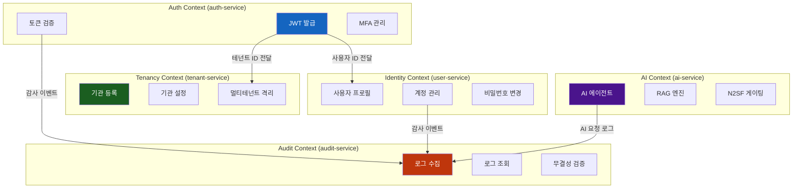
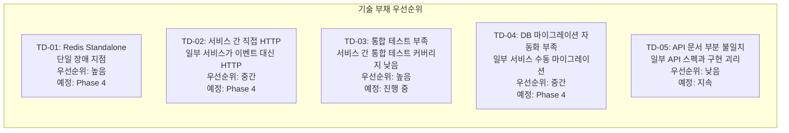
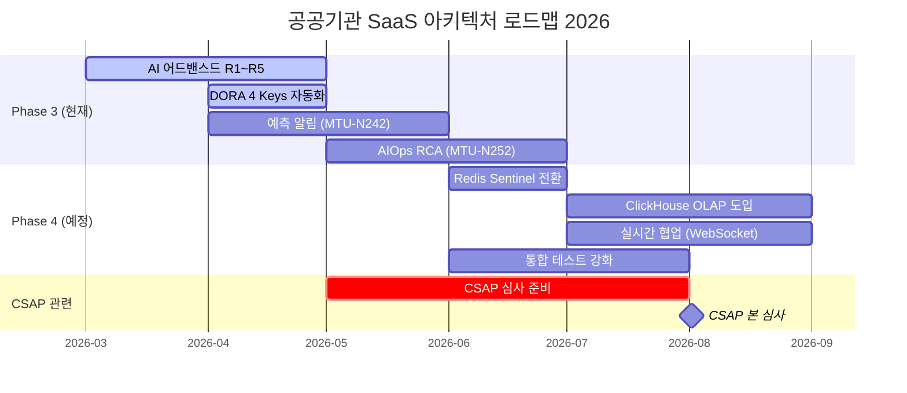
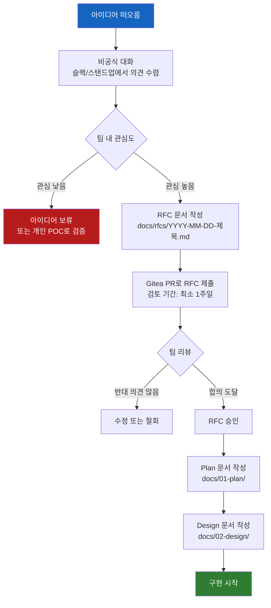
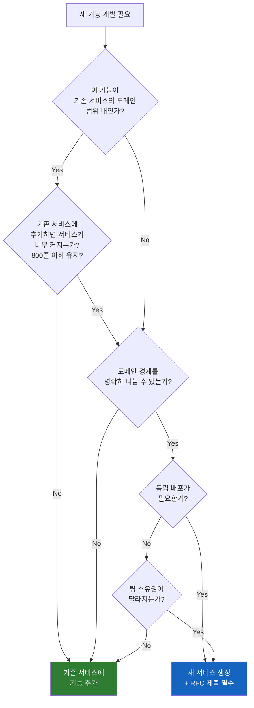

# 아키텍처 발전 과정 — 과거, 현재, 그리고 미래

> **문서 ID**: ONBOARD-02-10
> **버전**: 1.0.0 | **작성일**: 2026-04-12 | **작성자**: Implementer (Sonnet)
> **학습 대상**: 신규 팀원 전원 — 프로젝트 합류 후 2~3주 이내 학습 권장
> **예상 학습 시간**: 4~5시간
> **선행 문서**: `00-project-history.md`, `02-architecture/06-adr-deep-dive.md`, `02-architecture/01-system-overview.md`
> **CSAP 연관**: D-08 (접근통제), D-09 (암호화), D-12 (개발 보안)

---

## 목차

1. [이 프로젝트 아키텍처 발전 과정](#1-이-프로젝트-아키텍처-발전-과정)
   - 1.1 [Phase 0: 개념 설계와 결정 단계 (2025 Q4)](#11-phase-0-개념-설계와-결정-단계-2025-q4)
   - 1.2 [Phase 1: Foundation 구축 (2026 Q1)](#12-phase-1-foundation-구축-2026-q1)
   - 1.3 [Phase 2: Core Services (2026 Q1 후반~Q2 초)](#13-phase-2-core-services-2026-q1-후반q2-초)
   - 1.4 [Phase 3: AI 고도화 — 현재 (2026 Q2)](#14-phase-3-ai-고도화--현재-2026-q2)
   - 1.5 [Phase 4 예정: 데이터 분석 강화 (2026 Q3~Q4)](#15-phase-4-예정-데이터-분석-강화-2026-q3q4)
   - 1.6 [Phase 5 예정: 글로벌 다중 기관 확장 (2027)](#16-phase-5-예정-글로벌-다중-기관-확장-2027)
2. [왜 마이크로서비스로 분리했는가?](#2-왜-마이크로서비스로-분리했는가)
   - 2.1 [모놀리식의 한계](#21-모놀리식의-한계)
   - 2.2 [분리 기준 — 도메인 경계(DDD Bounded Context)](#22-분리-기준--도메인-경계ddd-bounded-context)
   - 2.3 [분리 비용 vs 이익 분석](#23-분리-비용-vs-이익-분석)
3. [현재 아키텍처의 한계와 개선 방향](#3-현재-아키텍처의-한계와-개선-방향)
   - 3.1 [알려진 기술 부채 TOP 5](#31-알려진-기술-부채-top-5)
   - 3.2 [향후 리팩토링 계획](#32-향후-리팩토링-계획)
   - 3.3 [왜 지금 당장 못 고치는가 — 현실적 제약](#33-왜-지금-당장-못-고치는가--현실적-제약)
4. [차세대 기능 로드맵 (2026 Q2~Q4)](#4-차세대-기능-로드맵-2026-q2q4)
   - 4.1 [AI 기능 강화](#41-ai-기능-강화)
   - 4.2 [실시간 협업 기능](#42-실시간-협업-기능)
   - 4.3 [데이터 분석 분리](#43-데이터-분석-분리)
5. [아키텍처 결정에 참여하는 방법](#5-아키텍처-결정에-참여하는-방법)
   - 5.1 [RFC(Request for Comments) 프로세스](#51-rfcrequest-for-comments-프로세스)
   - 5.2 [Architecture Review Board](#52-architecture-review-board)
   - 5.3 [새 ADR 제안 절차](#53-새-adr-제안-절차)
6. [기여자를 위한 아키텍처 가이드라인](#6-기여자를-위한-아키텍처-가이드라인)
   - 6.1 [기존 서비스에 추가 vs 새 서비스 생성 결정 기준](#61-기존-서비스에-추가-vs-새-서비스-생성-결정-기준)
   - 6.2 [서비스 경계 침범 방지 규칙](#62-서비스-경계-침범-방지-규칙)
7. [학습 체크리스트](#7-학습-체크리스트)
8. [다음 단계](#8-다음-단계)

---

## 1. 이 프로젝트 아키텍처 발전 과정

### 1.1 Phase 0: 개념 설계와 결정 단계 (2025 Q4)

모든 프로젝트는 코드 한 줄도 없는 상태에서 시작합니다. 이 프로젝트도 마찬가지였습니다.

**2025 Q4에 이루어진 핵심 결정들**:

프로젝트가 시작되기 전, 아키텍처 위원회는 다음 질문들에 답해야 했습니다.

```
Q1: 모놀리식으로 시작해서 나중에 분리할까, 처음부터 마이크로서비스로 할까?
    → 결정: 처음부터 마이크로서비스 (ADR-001, 2026-01-15)
    이유: 공공기관 특성상 서비스별 독립 배포, 기관별 격리가 필수적

Q2: 퍼블릭 클라우드를 쓸까, 온프레미스로 할까?
    → 결정: 온프레미스 k3s (ADR-002)
    이유: N2SF 규정, C/S 등급 데이터의 외부 클라우드 처리 제한

Q3: GitHub을 쓸까, 자체 호스팅 Git을 사용할까?
    → 결정: Gitea 자체 호스팅 (ADR-006)
    이유: 소스코드 주권, CSAP D-12 소스코드 관리 통제

Q4: AI를 어떻게 연동할까? 어떤 API를 쓸까?
    → 결정: Claude API + N2SF 데이터 등급 게이팅 (ADR-009)
    이유: C/S 등급 데이터의 외부 전송 차단 메커니즘 필수
```

이 결정들이 현재 아키텍처의 근간입니다. 6개월 이상이 지난 지금도 이 결정들은 유효합니다. 신규 팀원이 이 결정들을 바꾸려면 ADR에 기록된 이유를 충분히 이해하고, 새로운 ADR을 통해 팀 전체의 동의를 얻어야 합니다.

### 1.2 Phase 1: Foundation 구축 (2026 Q1)

Phase 1의 목표는 단 하나였습니다. **"모든 서비스가 올라갈 수 있는 기반을 만든다."**

코드를 짜기 전에 기반이 없으면 어떻게 되는지 상상해 보세요. 100명이 다 다른 방식으로 인증을 구현하고, 다 다른 로그 형식을 쓰고, 각자 다른 방식으로 Kubernetes에 배포합니다. 이것이 Foundation 없이 시작했을 때의 결과입니다.

**Phase 1에서 완성된 것들**:

```
인프라 기반:
  - k3s WSL2 클러스터 구성 완료
  - Gitea 자체 호스팅 + CI/CD 파이프라인
  - Vault 시크릿 관리 + cert-manager TLS
  - Linkerd 서비스 메시 + Prometheus/Grafana

공통 패키지 (platform/packages/):
  - audit-sdk: CSAP D-06 감사 로그 표준화
  - rbac: CSAP D-08 접근 통제 표준화
  - mesh-ready: 그레이스풀 셧다운 + 헬스체크
  - structured-logger: JSON 구조화 로그 + PII 마스킹
  - 총 50개 가까운 공유 패키지 구축

규정 준수:
  - CSAP 79항목 100% 커버리지
  - N2SF 6개 영역 100% 매핑
  - Q-Gate 7단계 파이프라인 구축
  - 감리 준비도 91.4% 달성
```

**Phase 1 완료 기준**: 단순히 기능을 만드는 것이 아니라 CSAP 79항목 전수 검증이 통과되어야 완료입니다. 감리 준비도 91.4%라는 수치는 실제 CSAP 심사에 준하는 내부 검토를 통과했다는 의미입니다.

### 1.3 Phase 2: Core Services (2026 Q1 후반~Q2 초)

Phase 2에서는 실제 사용자가 쓰는 핵심 서비스들이 만들어졌습니다.

**구축된 서비스들** (현재 `platform/services/`에 존재):

```
인증/인가:
  auth-service      — JWT RS256 인증, RBAC, MFA
  user-service      — 사용자 프로필, 계정 관리

멀티테넌트:
  tenant-service    — 기관(테넌트) 등록, 격리 관리

감사/보안:
  audit-service     — 감사 로그 수집, 조회, 무결성 검증
  security-service  — 보안 정책, NetworkPolicy 관리
  security-monitor-service — 실시간 보안 이벤트 탐지
  compliance-service — CSAP/N2SF 준수 여부 자동 검증

비즈니스:
  billing-service   — 기관별 사용량 과금, 청구서
  subscription-service — 구독 플랜 관리
  notification-service — 이메일/SMS/푸시 알림
  catalog-service   — 서비스 카탈로그, 플러그인 마켓
  crm-service       — 고객 관계 관리
  menu-service      — 공공기관별 메뉴 구성 관리

파일/API:
  file-service      — 파일 업로드, 저장, 접근 제어
  api-gateway       — 외부 트래픽 진입점, 라우팅

AI:
  ai-service        — AI 에이전트, RAG, 벡터 스토어
```

이 17개 서비스는 모두 Phase 1에서 만든 공통 패키지를 사용합니다. 각 서비스가 독립적으로 배포될 수 있지만, 보안·감사·인증 방식은 모두 동일합니다.

### 1.4 Phase 3: AI 고도화 — 현재 (2026 Q2)

현재 진행 중인 Phase 3는 AI 서비스를 공공기관 특화 기능으로 고도화하는 단계입니다.

**2026-04-12 현재 진행 상황**:

| 영역 | MTU | 상태 |
|-----|-----|------|
| AI 어드밴스드 R1~R5 | SVC-AI-ADV-R1~R5 | R5 진행 중 |
| DORA 4 Keys 자동화 | MTU-N251 | 설계 완료 |
| AIOps 근본 원인 분석 | MTU-N252 | 계획 중 |
| CSAP 증거 자동화 v2 | MTU-N253 | 계획 중 |
| 예측 알림 | MTU-N242 | 설계 완료 |

**AI 서비스 현재 아키텍처** (`platform/services/ai-service/src/`):

```
ai-service/
  handlers/
    ai-agent.handler.ts   — AI 에이전트 요청 처리 + N2SF 게이팅
    ai-rag.handler.ts     — RAG 쿼리 처리
  lib/
    ai-tools.ts           — AI 도구 정의 (공공 민원, 법령 검색 등)
    rag-engine.ts         — 문서 검색 + 컨텍스트 구성
    vector-store.ts       — 벡터 임베딩 저장/검색
    chunker.ts            — 문서 청킹 전략
  routes.ts               — API 라우트 정의
```

**N2SF AI 게이팅 패턴** (모든 AI 호출의 필수 관문):

```typescript
// platform/services/ai-service/src/handlers/ai-agent.handler.ts
// Design Ref: 06-ai-integration/security-gateway-pattern.md
// Plan SC: AI-REQ-1

async function handleAIRequest(request: FastifyRequest) {
  const { data, dataGrade } = request.body;

  // C/S 등급 데이터는 AI API 전송 절대 금지 (N2SF N-05)
  if (dataGrade === 'C' || dataGrade === 'S') {
    await auditLogger.log({
      action: 'AI_REQUEST_BLOCKED',
      reason: `N2SF ${dataGrade}등급 데이터 — AI API 전송 불가`,
    });
    return reply.status(403).send({
      error: `BLOCKED: ${dataGrade}등급 데이터는 AI API 전송 금지 (N2SF N-05)`,
    });
  }

  // O 등급: PII 마스킹 후 AI Gateway 경유
  const maskedData = await maskPII(data);
  return aiGateway.send(maskedData);
}
```

### 1.5 Phase 4 예정: 데이터 분석 강화 (2026 Q3~Q4)

Phase 4는 공공기관 행정 데이터의 분석 기능을 강화합니다.

**계획 중인 변경사항**:

```
OLAP 분리:
  현재: PostgreSQL OLTP 데이터베이스에서 분석 쿼리 직접 실행
  문제: 복잡한 집계 쿼리가 OLTP 성능에 영향
  개선: ClickHouse 또는 DuckDB로 분석 워크로드 분리

데이터 파이프라인:
  현재: 없음 (직접 DB 쿼리)
  개선: CDC(Change Data Capture) + 이벤트 기반 데이터 동기화

새 서비스 추가 예정:
  analytics-service — 공공기관 KPI 대시보드
  report-service    — 법정 보고서 자동 생성
```

### 1.6 Phase 5 예정: 글로벌 다중 기관 확장 (2027)

Phase 5는 단일 클러스터에서 다중 클러스터, 다중 기관(Region)으로 확장하는 단계입니다.

**현재 아키텍처의 한계 (Phase 5 이전)**: 현재는 단일 k3s 클러스터에서 멀티테넌트로 운영합니다. 이것은 소규모에서는 충분하지만, 수십 개 기관이 사용하게 되면 클러스터 자체의 확장성 한계에 부딪힙니다.

**Phase 5에서 해결할 문제**:

```
문제 1: 지역별 데이터 주권
  일부 광역시·도는 데이터가 특정 지역 데이터센터에만 있어야 한다고 요구할 수 있음
  → 지역별 k3s 클러스터 + 중앙 제어 플레인

문제 2: 대규모 멀티테넌시
  100개 이상 기관이 사용하면 단일 DB 스키마 격리가 한계에 도달
  → 기관 규모에 따라 DB 클러스터 분리 (대형 기관은 전용 DB)

문제 3: CI/CD 관리 복잡성
  수십 개 클러스터에 배포 관리
  → Flux GitOps 멀티클러스터 설정
```

---

## 2. 왜 마이크로서비스로 분리했는가?

### 2.1 모놀리식의 한계

많은 스타트업이 처음에는 모놀리식으로 시작합니다. 빠른 개발을 위해서입니다. 그런데 왜 이 프로젝트는 처음부터 마이크로서비스로 갔을까요?

**공공기관 SaaS가 모놀리식으로 시작하면 생기는 문제들**:

```
문제 1: 기관별 독립 배포 불가
  A기관이 "우리 기관 전용 기능"을 요청하면,
  모놀리식에서는 전체 시스템을 배포해야 함.
  → B기관 서비스도 잠시 중단됨 (CSAP D-07: 가용성 위반)

문제 2: 데이터 격리 어려움
  모놀리식에서 A기관 개발자가 실수로 B기관 데이터를
  쿼리하는 코드를 작성해도 런타임 전까지 알 수 없음.
  → CSAP D-08: 테넌트 간 데이터 접근 통제 위반 위험

문제 3: AI 서비스 독립 확장 불가
  AI 서비스만 GPU 노드가 필요하고, 나머지는 일반 CPU면 충분함.
  모놀리식에서는 전체 서비스가 GPU 노드에서 실행되거나,
  AI 기능을 포기해야 함.

문제 4: 감사 서비스의 특별한 요구사항
  감사 로그는 append-only, 절대 삭제 불가 구조여야 함.
  이것을 모놀리식의 일반 DB와 공유하면 관리 복잡성 증가.

문제 5: CSAP 심사 범위 과도
  모놀리식은 전체가 하나이므로 CSAP 심사 시 모든 코드가 검토 대상.
  마이크로서비스는 서비스별로 심사 범위를 분리 가능.
```

### 2.2 분리 기준 — 도메인 경계(DDD Bounded Context)

서비스를 어떻게 나눌까요? 이 프로젝트는 DDD(Domain-Driven Design)의 Bounded Context 개념을 적용했습니다.

**Bounded Context란**: "이 팀이 책임지는 영역"입니다. 인증 팀이 책임지는 것은 "사용자가 누구인지 확인하는 것"까지입니다. 그 사용자가 무엇을 할 수 있는지(RBAC)는 별개의 경계입니다.



**경계 판단 기준** (이 프로젝트에서 실제 사용한 기준):

```
기준 1: 배포 독립성이 필요한가?
  AI 서비스 → GPU 노드 필요, 독립 배포 필수 → 분리

기준 2: 데이터 모델이 완전히 다른가?
  감사 로그 (append-only, 불변) vs 사용자 데이터 (CRUD)
  → 완전히 다른 패턴 → 분리

기준 3: 팀 소유권을 달리할 가능성이 있는가?
  보안 팀이 audit-service를 담당, 서비스 팀이 billing-service 담당
  → 소유권 경계 → 서비스 경계와 일치

기준 4: 스케일 요구사항이 다른가?
  auth-service → 모든 요청의 첫 진입점, 최고 가용성 필요
  billing-service → 월말에만 집중 부하
  → 다른 스케일 전략 → 분리
```

### 2.3 분리 비용 vs 이익 분석

마이크로서비스는 공짜가 아닙니다. 이 결정에는 명확한 비용이 있습니다.

**비용 (솔직한 인정)**:

```
비용 1: 네트워크 레이턴시
  모놀리식: 함수 호출 = 마이크로초
  마이크로서비스: HTTP 호출 = 1~10밀리초

  완화: Linkerd mTLS는 헤더 오버헤드 < 1ms
  결과: auth-service → user-service 호출 약 3~8ms 레이턴시 추가

비용 2: 분산 트랜잭션 복잡성
  모놀리식: BEGIN/COMMIT 한 줄
  마이크로서비스: Saga 패턴 또는 2PC 필요

  완화: @public-saas/saga, @public-saas/outbox 패키지로 표준화
  결과: 개발자가 Saga 패턴을 직접 구현하지 않고 패키지 활용

비용 3: 운영 복잡성
  모놀리식: 서버 1~2개 관리
  마이크로서비스: 17개 서비스 + k3s + Linkerd + Vault... 관리

  완화: k3s + Flux GitOps로 선언적 관리 → 운영 자동화
  결과: 초기 러닝 커브는 있으나, 규모 성장 시 단순성 역전
```

**이익**:

```
이익 1: 기관별 독립 배포
  A기관에만 특정 기능 활성화 (feature flag)
  A기관 관련 서비스만 재배포 → B기관 무중단

이익 2: CSAP 심사 범위 제어
  audit-service만 별도 CSAP D-06 심사 가능
  전체 17개 서비스를 한꺼번에 심사할 필요 없음

이익 3: AI 서비스 독립 스케일
  AI 서비스만 GPU 노드에서 실행
  나머지 서비스는 일반 CPU → 비용 최적화

이익 4: 장애 격리
  billing-service 버그가 auth-service에 영향 없음
  서킷 브레이커(@public-saas/circuit-breaker)로 연쇄 장애 방지
```

**결론**: 이 프로젝트의 특성(공공기관 멀티테넌트, AI 포함, 장기 운영)에서 마이크로서비스의 이익이 비용을 초과한다고 판단했습니다. 하지만 이 판단은 언제든 재검토할 수 있으며, 새로운 증거가 생기면 ADR로 기록합니다.

---

## 3. 현재 아키텍처의 한계와 개선 방향

### 3.1 알려진 기술 부채 TOP 5

신규 팀원에게 솔직하게 알립니다. 현재 아키텍처에는 알려진 한계가 있습니다. 이를 숨기는 것은 나쁜 관행입니다. 오히려 공개적으로 인정하고 개선 계획을 세우는 것이 건강한 엔지니어링 문화입니다.



**TD-01: Redis Standalone 단일 장애 지점**

```
현재 상태:
  Redis Standalone 1개 인스턴스가 세션, 캐시, Rate Limit을 모두 담당
  Redis가 죽으면 → 세션 만료, Rate Limit 비활성화, 캐시 미스

근본 원인:
  Phase 1에서 운영 복잡도 최소화를 위해 Standalone 선택 (ADR-004)
  "Phase 2에서 Sentinel로 전환한다"고 ADR에 명시했으나, 아직 미전환

계획:
  Phase 4에서 Redis Sentinel 전환
  마스터 1 + 레플리카 2 구성
  자동 페일오버로 CSAP D-07 고가용성 요건 강화
```

**TD-02: 일부 서비스의 동기 HTTP 직접 호출**

```
현재 상태:
  notification-service가 이벤트 버스 대신 billing-service를 HTTP로 직접 호출
  audit-service 이벤트가 일부 서비스에서 직접 DB 쓰기로 처리

근본 원인:
  Phase 2 초반에 빠른 구현을 위해 동기 HTTP 선택
  이벤트 버스(@public-saas/event-bus) 패키지가 늦게 완성됨

계획:
  서비스별 이벤트 기반 아키텍처로 순차 전환
  notification-service → 이벤트 소비자로 리팩토링
```

**TD-03: 서비스 간 통합 테스트 부족**

```
현재 상태:
  각 서비스의 단위 테스트 커버리지는 80%+
  그러나 auth-service + tenant-service + user-service의
  통합 시나리오 테스트가 부족

근본 원인:
  통합 테스트 환경 설정(docker-compose, 테스트 데이터 시딩)에 시간이 걸림

계획:
  Tester 에이전트 역할 강화 (MTU-N260 계획)
  k3s 스테이징 클러스터 통합 테스트 자동화
```

**TD-04: 일부 서비스의 수동 DB 마이그레이션**

```
현재 상태:
  Prisma Migrate로 대부분 자동화되어 있으나,
  일부 서비스에서 마이그레이션 스크립트를 수동 실행

근본 원인:
  초기 구축 시 Prisma 마이그레이션 CI/CD 통합이 완성되지 않은 상태에서 배포

계획:
  Gitea Actions 워크플로우에 prisma migrate deploy 단계 표준화
```

**TD-05: 일부 API 문서 불일치**

```
현재 상태:
  Fastify JSON Schema 기반 자동 문서화가 대부분 서비스에 적용됨
  그러나 일부 핸들러에서 스키마가 업데이트되지 않은 채 API가 변경됨

근본 원인:
  빠른 기능 추가 시 문서 업데이트가 후순위로 밀림

계획:
  API 스키마 변경을 감지하는 Q-Gate 단계 추가 (G2 설계 완전성 강화)
```

### 3.2 향후 리팩토링 계획

기술 부채는 한 번에 갚으려 하면 안 됩니다. 계획적으로 우선순위에 따라 처리합니다.

| 분기 | 주요 리팩토링 | 담당 에이전트 |
|-----|------------|------------|
| 2026 Q2 | 통합 테스트 강화 (TD-03) | Tester |
| 2026 Q3 | Redis Sentinel 전환 (TD-01) | Refactorer + DevOps |
| 2026 Q3 | 동기 HTTP → 이벤트 전환 (TD-02) | Refactorer |
| 2026 Q4 | DB 마이그레이션 CI 통합 (TD-04) | Implementer |

### 3.3 왜 지금 당장 못 고치는가 — 현실적 제약

신규 팀원이 기술 부채를 발견하고 "이걸 지금 바로 고치면 되지 않나요?"라고 물을 수 있습니다. 솔직한 답변입니다.

**제약 1: CSAP 심사 일정**

현재 CSAP 심사를 준비 중입니다. 심사 직전에 대규모 아키텍처 변경은 금물입니다. 새로운 위험을 도입하면 심사를 통과하지 못할 수 있습니다.

```
원칙: "심사 3개월 전부터 주요 아키텍처 변경 동결"
      버그 수정과 보안 패치는 예외
```

**제약 2: 에러 버짓 고려**

현재 서비스의 SLO(Service Level Objective)를 유지하면서 리팩토링을 해야 합니다. 기술 부채를 갚으려다가 현재 서비스를 망가뜨리면 안 됩니다.

**제약 3: 팀 역량과 우선순위**

AI 고도화(Phase 3)와 기술 부채 해결을 동시에 하려면 팀 역량이 2배로 필요합니다. 현재 우선순위는 CSAP 심사 준비 > AI 기능 강화 > 기술 부채 해결 순서입니다.

**제약 4: 하위 호환성**

Redis Sentinel로 전환할 때, 현재 Standalone을 사용 중인 17개 서비스가 모두 계속 동작해야 합니다. "완벽한 전환 계획"이 없으면 시작하지 않습니다.

---

## 4. 차세대 기능 로드맵 (2026 Q2~Q4)



### 4.1 AI 기능 강화

**멀티모달 입력 지원**:

현재 `ai-service`는 텍스트 기반 쿼리만 처리합니다. Phase 4에서는 이미지, PDF 문서를 포함한 멀티모달 입력을 지원할 예정입니다.

```
공공기관 적용 시나리오:
  - 서류 사진을 AI에게 보내서 내용 추출
  - PDF 고시문을 업로드하면 Q&A 가능
  - 법령 문서를 RAG에 추가하여 답변 품질 향상
```

**AI 에이전트 자율화**:

현재 AI 에이전트는 사용자 입력에 반응하는 수동적 형태입니다. Phase 4에서는 스케줄 기반, 이벤트 기반으로 자동 실행되는 AI 에이전트를 도입합니다.

```typescript
// Phase 4 목표: 이벤트 기반 자율 AI 에이전트
// 감사 로그에서 이상 패턴 감지 → AI가 자동 분석 보고서 생성

// 현재 (Phase 3):
// 사용자 → HTTP 요청 → AI 에이전트 → 응답

// Phase 4 목표:
// 이상 이벤트 발생 → event-bus → AI 에이전트 → 자동 분석 → 알림
```

### 4.2 실시간 협업 기능

**문제**: 현재 모든 API는 HTTP 요청-응답 방식입니다. 실시간 알림(누군가 문서를 편집 중이라는 표시, 즉각적인 승인 알림 등)을 지원하려면 WebSocket이 필요합니다.

**설계 접근법**:

```
옵션 1: 기존 서비스에 WebSocket 추가
  장점: 별도 서비스 불필요
  단점: HTTP 서비스와 WebSocket이 섞여 복잡도 증가

옵션 2: 별도 realtime-service 신설 (선택)
  장점: 관심사 분리, 독립 스케일
  단점: 새 서비스 추가에 따른 운영 복잡도
```

현재는 옵션 2(별도 서비스)를 선호하고 있으나, RFC를 통해 팀 합의 후 결정합니다.

### 4.3 데이터 분석 분리

**현재 문제**:

```sql
-- 복잡한 집계 쿼리가 OLTP DB(PostgreSQL)에서 실행됨
-- 이 쿼리가 실행되는 동안 다른 OLTP 쿼리 성능 저하
SELECT
  tenant_id,
  COUNT(*) as audit_count,
  DATE_TRUNC('month', created_at) as month
FROM audit_logs
WHERE created_at > NOW() - INTERVAL '1 year'
GROUP BY tenant_id, month
ORDER BY month DESC;
-- 실행 시간: 수십 초 (감사 로그 수백만 건)
```

**해결 방향 — ClickHouse 도입 검토**:

```
ClickHouse 선택 이유:
  - 컬럼 지향 스토리지 → 집계 쿼리 OLTP 대비 10~100배 빠름
  - PostgreSQL보다 간단한 운영 (자체 클러스터링)
  - 온프레미스 완전 지원
  - Go 바이너리로 설치 간편

도입 방식:
  PostgreSQL → CDC(Change Data Capture) → ClickHouse
  (PostgreSQL은 OLTP, ClickHouse는 OLAP 전용)
```

⚠️ **현재 상태**: ClickHouse 도입은 아직 검토 단계입니다. RFC 작성 후 팀 합의가 필요합니다. 현재는 PostgreSQL에서 모든 쿼리를 처리합니다.

---

## 5. 아키텍처 결정에 참여하는 방법

### 5.1 RFC(Request for Comments) 프로세스

새로운 아키텍처 변경을 제안할 때는 RFC(Request for Comments) 문서를 작성합니다. 이것은 "나 혼자 결정하고 구현한다"가 아니라 "팀 전체와 논의한다"는 의미입니다.



**RFC 문서 형식**:

```markdown
# RFC-YYYY-NN: [제목]

**작성자**: [이름]
**날짜**: YYYY-MM-DD
**상태**: Draft / Under Review / Approved / Rejected

## 요약 (한 문단)

## 문제 정의
어떤 문제를 해결하는가?

## 제안하는 해결책
구체적인 기술적 접근법

## 대안 검토
- 대안 A: [설명 + 기각 이유]
- 대안 B: [설명 + 기각 이유]

## 영향 분석
- 변경되는 서비스/패키지
- 팀에게 필요한 학습
- 마이그레이션 비용

## CSAP/N2SF 영향
어떤 통제항목에 영향을 주는가?

## 성공 기준
이 RFC가 성공했는지 어떻게 판단하는가?

## 미해결 질문
리뷰어에게 피드백 받고 싶은 항목
```

**신규 팀원의 RFC 작성 권장 시점**: 프로젝트에 합류한 후 최소 1개월 후, 현재 아키텍처를 충분히 이해한 상태에서 RFC를 작성하는 것을 권장합니다. 너무 이른 RFC는 이미 고려되어 기각된 아이디어를 반복하거나, 중요한 제약(CSAP, N2SF)을 놓칠 수 있습니다.

### 5.2 Architecture Review Board

아키텍처 결정에는 다음 사람들이 참여합니다.

**ARB(Architecture Review Board) 구성**:

| 역할 | 권한 |
|-----|------|
| 아키텍처 리드 | 최종 결정권, ADR 승인 |
| 보안 담당자 | CSAP/N2SF 적합성 거부권 |
| 인프라 담당자 | 운영 가능성 평가 |
| 팀원 전원 | RFC 리뷰 및 투표권 |

**ARB 회의 일정**: 격주 목요일 오전 10시 (상시 개최는 아니며, RFC가 있을 때만)

**신속 결정이 필요한 경우**: 보안 취약점 패치, 서비스 중단 수준의 버그 수정은 ARB 없이 팀장 + 보안 담당자 2인 합의로 빠르게 결정합니다.

### 5.3 새 ADR 제안 절차

RFC가 승인되면 ADR(Architecture Decision Record)로 기록합니다.

```
ADR 번호: 기존 ADR-010에서 이어서 ADR-011, ADR-012...
ADR 위치: docs/adrs/ADR-NNN-제목.md
ADR 상태: Draft → Proposed → Accepted / Rejected / Superseded
```

**ADR 필수 항목**:

```markdown
# ADR-011: [결정 제목]

**날짜**: YYYY-MM-DD
**상태**: Accepted
**결정권자**: [이름]

## 맥락
어떤 상황에서 이 결정이 필요했는가?

## 결정
구체적으로 무엇을 결정했는가?

## 이유
왜 이 결정을 했는가? (정량적 데이터 포함 권장)

## 대안
검토했으나 기각한 대안들과 기각 이유

## 결과 (Consequences)
이 결정으로 생기는 변화 (좋은 것 + 나쁜 것 모두)

## CSAP/N2SF 영향
어떤 통제항목을 지원하거나 영향 받는가?
```

---

## 6. 기여자를 위한 아키텍처 가이드라인

### 6.1 기존 서비스에 추가 vs 새 서비스 생성 결정 기준

이 질문은 신규 팀원이 가장 자주 하는 질문 중 하나입니다. 새 기능을 개발할 때 "어디에 추가해야 하나?"



**실제 결정 예시**:

```
예시 1: "알림 기능을 추가하고 싶다"
  → notification-service가 이미 있다
  → 기존 서비스 범위 내
  → notification-service에 추가 ✅

예시 2: "파일 저장을 user-service에서 하고 싶다"
  → 파일 저장은 user 도메인이 아님
  → file-service 도메인
  → file-service 사용 또는 file-service에 기능 추가 ✅

예시 3: "AI가 자동으로 KPI 보고서를 생성하는 기능"
  → ai-service에 넣자니 너무 복잡해짐
  → 도메인 경계: AI 실행(ai-service) + 보고서 저장(report-service)
  → report-service 신규 생성 + RFC 제출 필요 ✅

예시 4: "실시간 채팅 기능"
  → WebSocket 필요 → 기존 HTTP 서비스와 다른 기술
  → 독립 배포 필요 (다른 스케일 전략)
  → realtime-service 신규 생성 + RFC 제출 필요 ✅
```

**새 서비스를 만들 때 필수 확인 사항**:

```bash
# 1. RFC 제출 (팀 합의 필수)
# 2. Plan + Design 문서 작성 (감리 요건)
# 3. 골든 패스 템플릿 사용 (platform/packages/ 필수 의존성)
# 4. k8s 매니페스트 작성 (deployment, service, networkpolicy)
# 5. Gitea CI/CD 워크플로우 추가
# 6. Grafana 대시보드 추가 (관측가능성)
```

### 6.2 서비스 경계 침범 방지 규칙

마이크로서비스에서 가장 흔한 안티패턴은 **서비스 경계 침범**입니다. 다른 서비스의 DB에 직접 접근하거나, 다른 서비스의 내부 구현을 가정하는 것입니다.

**금지 사항** (Hard Rules):

```typescript
// ❌ 절대 금지: 다른 서비스의 DB 직접 접근
// user-service의 Prisma 클라이언트를 billing-service에서 사용
import { userServicePrisma } from '../../../user-service/src/db.js';
const user = await userServicePrisma.user.findUnique({ where: { id } });
// → 데이터 격리 위반, CSAP D-08 위반 위험

// ✅ 올바른 방법: API 호출로 데이터 요청
const user = await userServiceClient.getUser(userId);
// 또는 이벤트 기반: 사용자 정보가 필요한 이벤트를 구독
```

```typescript
// ❌ 절대 금지: 다른 서비스의 내부 DB 스키마 가정
// audit-service가 tenant-service DB를 직접 조회
const tenant = await db.execute(
  'SELECT * FROM tenants WHERE id = $1', [tenantId]
);
// → tenant-service DB 스키마 변경 시 audit-service 동작 깨짐

// ✅ 올바른 방법: tenant-service API 호출
const tenant = await tenantServiceClient.getTenant(tenantId);
```

**서비스 간 통신 허용 방법 (Allow-list)**:

```yaml
# k8s NetworkPolicy — 명시적 허용 목록
apiVersion: networking.k8s.io/v1
kind: NetworkPolicy
metadata:
  name: billing-service-egress
  namespace: saas-system
spec:
  podSelector:
    matchLabels:
      app.kubernetes.io/name: billing-service
  policyTypes:
    - Egress
  egress:
    # billing-service가 호출할 수 있는 서비스만 명시
    - to:
        - podSelector:
            matchLabels:
              app.kubernetes.io/name: auth-service
      ports:
        - port: 3000
    - to:
        - podSelector:
            matchLabels:
              app.kubernetes.io/name: user-service
      ports:
        - port: 3000
    # subscription-service는 billing-service가 호출 불가
    # → NetworkPolicy에 없으므로 자동 차단
```

**데이터 소유권 원칙**:

| 원칙 | 설명 | 예시 |
|-----|------|------|
| 단일 소유자 | 각 데이터는 한 서비스만 직접 쓰기 가능 | users 테이블 → user-service만 쓰기 |
| API를 통한 접근 | 다른 서비스는 반드시 API로 | billing-service → user-service API 호출 |
| 이벤트로 복제 | 성능 이유로 로컬 복사본이 필요하면 이벤트로 | audit-service가 tenant 이름 캐시 |
| 스키마 비공개 | 내부 DB 스키마는 공개 API가 아님 | user-service DB 스키마 변경은 내부 사항 |

---

## 7. 학습 체크리스트

이 문서를 학습한 후 다음 항목들을 스스로 확인하세요.

**아키텍처 발전 이해**
- [ ] Phase 0~3의 각 단계에서 무엇이 완성되었는지 설명할 수 있다
- [ ] 현재 어떤 Phase에 있고 무엇이 진행 중인지 말할 수 있다
- [ ] 타임라인 다이어그램을 보고 주요 결정 시점을 설명할 수 있다

**마이크로서비스 분리 이해**
- [ ] 이 프로젝트가 처음부터 마이크로서비스를 선택한 이유를 공공기관 특성과 연결해 설명할 수 있다
- [ ] DDD Bounded Context가 무엇인지 auth-service 예시로 설명할 수 있다
- [ ] 마이크로서비스의 비용(레이턴시, 트랜잭션 복잡성)을 솔직하게 말할 수 있다

**기술 부채 인식**
- [ ] 알려진 기술 부채 TOP 5의 내용과 근본 원인을 설명할 수 있다
- [ ] "왜 지금 바로 못 고치는가"에 대한 현실적 이유 3가지를 말할 수 있다
- [ ] 기술 부채와 CSAP 심사 일정의 관계를 설명할 수 있다

**로드맵 이해**
- [ ] Phase 4에서 Redis Sentinel 전환이 왜 필요한지 설명할 수 있다
- [ ] ClickHouse를 도입하려는 이유와 현재 상태를 설명할 수 있다
- [ ] AI 에이전트가 Phase 3와 Phase 4에서 어떻게 달라지는지 설명할 수 있다

**기여 방법**
- [ ] RFC를 언제, 어떻게 작성하는지 설명할 수 있다
- [ ] 새 기능을 기존 서비스에 넣을지 새 서비스를 만들지 판단 기준 4가지를 말할 수 있다
- [ ] 서비스 경계 침범의 예시를 들고 왜 금지인지 설명할 수 있다

**실습**
- [ ] `docs/adrs/` 디렉토리에서 ADR 하나를 골라 읽고 결정 이유를 동료에게 설명해봤다
- [ ] `platform/services/` 디렉토리의 서비스 목록을 보고 각 서비스의 도메인 경계를 그려봤다
- [ ] 현재 기술 부채 TD-01(Redis Standalone)이 어떤 파일에서 확인되는지 찾아봤다

---

## 8. 다음 단계

이 문서를 읽은 후 다음 순서로 학습을 이어가세요.

1. **`02-architecture/06-adr-deep-dive.md`** — 10개 ADR 각각의 상세한 배경과 트레이드오프를 심화 학습
2. **`02-architecture/09-platform-engineering.md`** — 공통 패키지가 어떻게 아키텍처 결정을 지원하는지 이해
3. **`04-infrastructure/12-chaos-engineering.md`** — 현재 아키텍처의 복원력을 실험으로 검증하는 방법
4. **실습**: `docs/rfcs/` 디렉토리가 없다면 만들어보고, 작은 개선 아이디어 하나를 RFC 형식으로 초안 작성

---

*Design Ref: 00-project-history.md §4~§5, 06-adr-deep-dive.md §14 | ADR-001~ADR-010*
*Plan SC: FR-ARCH.1~FR-ARCH.6*
*CSAP 연관: D-08 (접근통제 — 서비스 경계), D-09 (암호화 — Redis 전환), D-12 (개발 보안 — RFC 프로세스)*
