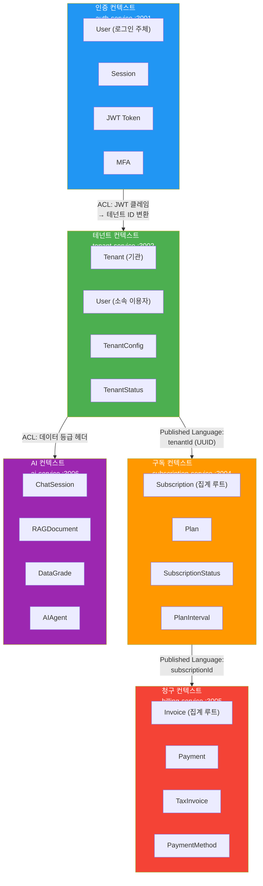
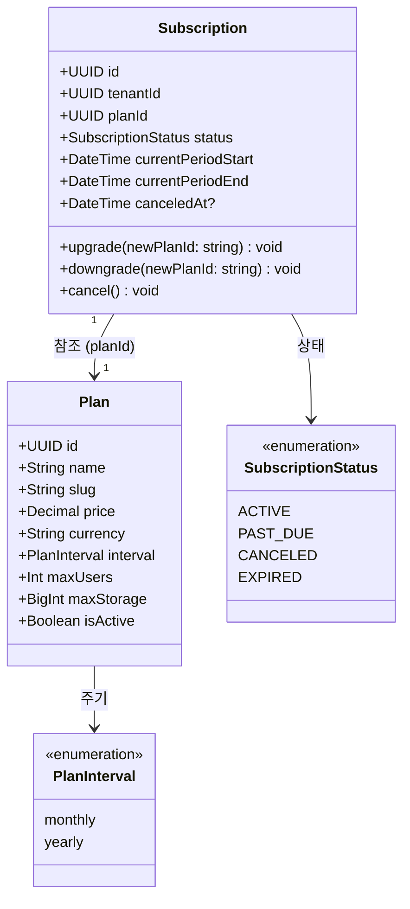
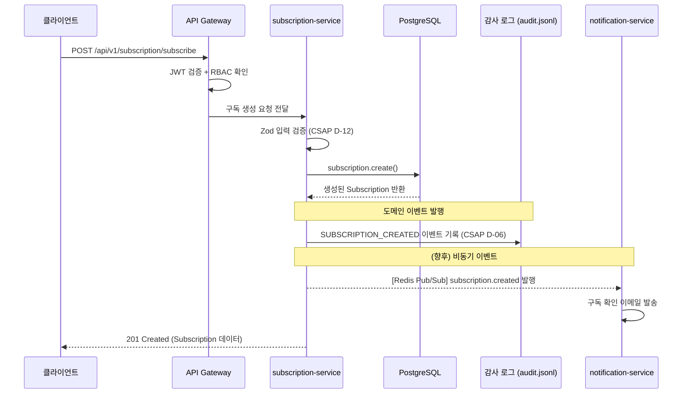
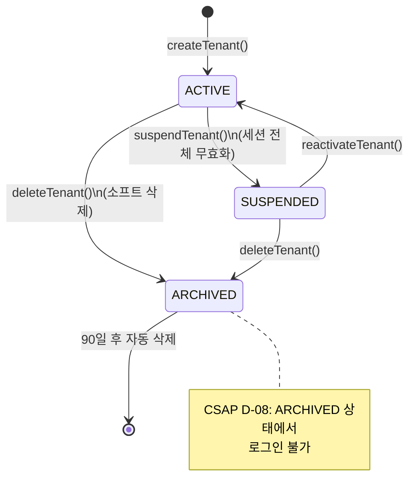
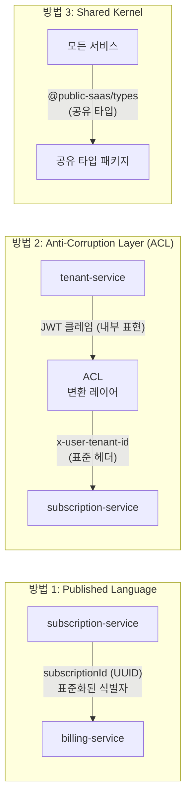
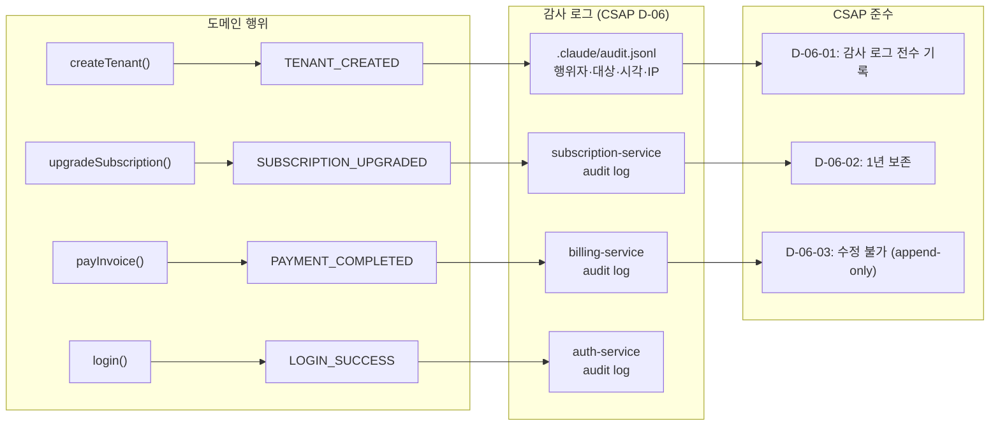
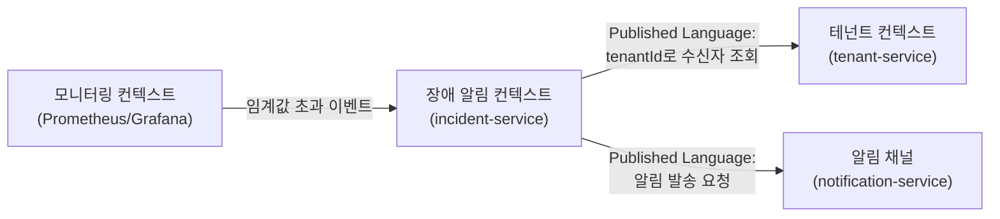

# 도메인 주도 설계(DDD) — 실제 코드 기반

> **문서 ID**: ONBOARD-02-ARCH-11-DDD
> **버전**: 1.0.0 | **작성일**: 2026-04-12 | **대상**: 백엔드 개발자, 아키텍처 설계자
> **선행 학습**: `02-architecture/01-system-overview.md`, `02-architecture/08-billing-subscription-deep-dive.md`
> **예상 학습 시간**: 3~4시간 (실습 포함)
> **실제 코드 위치**:
> - 구독: `platform/services/subscription-service/`
> - 청구: `platform/services/billing-service/`
> - 테넌트: `platform/services/tenant-service/`
> **CSAP 매핑**: D-08 (접근 통제·테넌트 격리), D-06 (감사 로그), D-12 (입력 검증)

---

## 목차

1. [왜 DDD인가? — 플레인 CRUD와의 차이](#1-왜-ddd인가--플레인-crud와의-차이)
2. [DDD 핵심 개념 사전](#2-ddd-핵심-개념-사전)
3. [우리 프로젝트의 5개 바운디드 컨텍스트](#3-우리-프로젝트의-5개-바운디드-컨텍스트)
4. [유비쿼터스 언어 — 팀 용어 사전](#4-유비쿼터스-언어--팀-용어-사전)
5. [집계(Aggregate)와 집계 루트(Aggregate Root)](#5-집계aggregate와-집계-루트aggregate-root)
6. [도메인 이벤트(Domain Event)](#6-도메인-이벤트domain-event)
7. [값 객체(Value Object) vs 엔티티(Entity)](#7-값-객체value-object-vs-엔티티entity)
8. [실제 프로젝트 코드에서의 DDD 패턴](#8-실제-프로젝트-코드에서의-ddd-패턴)
9. [바운디드 컨텍스트 간 통합 패턴](#9-바운디드-컨텍스트-간-통합-패턴)
10. [CSAP 관점에서의 DDD](#10-csap-관점에서의-ddd)
11. [실습: 새 도메인 서비스 설계해보기](#11-실습-새-도메인-서비스-설계해보기)
12. [변경 이력](#12-변경-이력)

---

## 1. 왜 DDD인가? — 플레인 CRUD와의 차이

### 1.1 전통적인 CRUD 방식의 문제

처음 시스템을 만들 때 대부분의 개발자는 "테이블 = 서비스 = API" 방식으로 시작합니다.

```typescript
// 전통적인 CRUD — 이렇게 하지 마십시오
// "구독을 업그레이드한다"는 비즈니스 의도가 없습니다
app.put('/subscriptions/:id', async (req, reply) => {
  // 단순히 DB 레코드를 업데이트
  const sub = await db.subscription.update({
    where: { id: req.params.id },
    data: { planId: req.body.planId }  // 검증? 규칙? 없음
  })
  return sub
})
```

이 방식의 문제점:
- **비즈니스 규칙이 API 레이어에 퍼짐**: 취소된 구독을 업그레이드할 수 없다는 규칙이 어디에?
- **도메인 전문가와 소통 불가**: "구독 레코드의 planId 컬럼 값을 바꿔"라는 말을 기획자는 이해하지 못합니다
- **변경에 취약**: planId 외에 업그레이드 시 처리해야 할 부가 로직(감사 로그, 결제, 알림)이 누락되기 쉽습니다

### 1.2 DDD 방식

DDD는 소프트웨어를 실제 비즈니스 도메인의 언어와 개념으로 설계합니다.

```typescript
// DDD 방식 — 비즈니스 의도가 코드에 드러납니다
// Design Ref: DESIGN-MTU-P07 §구독 업그레이드
export async function upgradeHandler(
  request: FastifyRequest<{ Params: { id: string } }>,
  reply: FastifyReply,
): Promise<void> {
  // 1. 입력 검증 (Value Object 수준)
  const idParse = idParamSchema.safeParse(request.params)

  // 2. 집계 루트 로드 — Subscription이 핵심 엔티티
  const existingSub = await prisma.subscription.findUnique({
    where: { id: upgradeSubId },
    select: { tenantId: true },
  })

  // 3. 비즈니스 규칙 강제: 테넌트 소유권
  if (jwtRole !== 'SUPER_ADMIN' && existingSub.tenantId !== jwtTenantId) {
    return reply.status(403).send({ error: 'FORBIDDEN' })
  }

  // 4. 도메인 행위 실행 (업그레이드)
  const subscription = await prisma.subscription.update({
    where: { id: upgradeSubId },
    data: { planId: parseResult.data.newPlanId },
  })

  // 5. 도메인 이벤트 발행 (감사 로그 = 이벤트 소싱의 단순 형태)
  await logSubscriptionEvent('SUBSCRIPTION_UPGRADED', actor, subscription.id, ...)
}
```

**차이점 요약**:

| 관점 | 플레인 CRUD | DDD |
|------|------------|-----|
| 데이터 접근 | `UPDATE subscriptions SET plan_id = ?` | `subscription.upgrade(newPlan)` |
| 비즈니스 규칙 | API 레이어에 산재 | 도메인 모델에 집중 |
| 팀 소통 | 테이블, 컬럼 단위 | 구독, 플랜, 업그레이드 단위 |
| 변경 영향 | 규칙 누락 위험 높음 | 집계 루트를 통한 일관성 보장 |
| 감사 추적 | 별도 구현 필요 | 도메인 이벤트로 자연스럽게 통합 |

---

## 2. DDD 핵심 개념 사전

초급자를 위해 6개 핵심 개념을 쉬운 설명과 함께 정리합니다.

### 2.1 도메인(Domain)

> "우리가 해결하려는 비즈니스 문제 영역"

이 프로젝트의 도메인은 **공공기관 SaaS 플랫폼** 운영입니다. 하위 도메인으로 나뉩니다:
- **핵심 도메인(Core Domain)**: 멀티테넌시, 구독 관리 — 경쟁 우위를 만드는 핵심
- **지원 도메인(Supporting Domain)**: 청구, 알림 — 핵심을 지원하지만 차별화 요소는 아님
- **일반 도메인(Generic Domain)**: 인증, 파일 저장 — 외부 솔루션으로 대체 가능

### 2.2 바운디드 컨텍스트(Bounded Context)

> "하나의 언어와 모델이 일관성 있게 적용되는 경계"

**같은 단어도 컨텍스트마다 다른 의미를 가집니다.**

```
"사용자(User)"의 의미:
- 인증 컨텍스트: 이메일 + 비밀번호를 가진 로그인 주체
- 테넌트 컨텍스트: 특정 기관 소속의 시스템 이용자
- 구독 컨텍스트: 플랜 사용 권한을 부여받은 테넌트 구성원
- 청구 컨텍스트: 인보이스 수신 대상 (이름, 연락처만 관심)
```

각 서비스가 자신의 바운디드 컨텍스트 내에서 독립적인 모델을 유지합니다.

### 2.3 유비쿼터스 언어(Ubiquitous Language)

> "개발자와 도메인 전문가가 함께 쓰는 공통 언어"

코드, 문서, 회의, 이슈 트래커 — 모든 곳에서 동일한 용어를 사용합니다. 섹션 4에서 상세히 다룹니다.

### 2.4 집계(Aggregate)와 집계 루트(Aggregate Root)

> "함께 변경되어야 하는 객체들의 묶음. 외부에서는 루트를 통해서만 접근"

`Subscription`이 집계 루트이고, 관련된 `Plan`, `TenantId`는 집계 내부 요소입니다.

### 2.5 도메인 이벤트(Domain Event)

> "도메인에서 발생한 중요한 사건. 과거형으로 표현"

`SUBSCRIPTION_CREATED`, `SUBSCRIPTION_UPGRADED`, `PAYMENT_COMPLETED` 등.

### 2.6 값 객체(Value Object)와 엔티티(Entity)

> **엔티티**: ID로 식별. 시간이 지나도 동일한 것. (예: 구독 #123은 플랜이 바뀌어도 #123)
> **값 객체**: 속성으로 식별. 같은 값이면 같은 것. (예: KRW 100,000은 어디서 왔든 동일)

---

## 3. 우리 프로젝트의 5개 바운디드 컨텍스트

### 3.1 컨텍스트 맵



### 3.2 각 컨텍스트의 책임

| 컨텍스트 | 서비스 | 핵심 책임 | 집계 루트 |
|---------|--------|---------|---------|
| 인증 | auth-service | 신원 확인, 세션 관리 | User (인증 관점) |
| 테넌트 | tenant-service | 기관 관리, 이용자 관리 | Tenant |
| 구독 | subscription-service | 플랜 가입·변경·해지 | Subscription |
| 청구 | billing-service | 인보이스·결제·세금계산서 | Invoice |
| AI | ai-service | AI 채팅·RAG·보안 게이트웨이 | ChatSession |

### 3.3 컨텍스트 경계가 마이크로서비스 경계와 일치

이 프로젝트에서 바운디드 컨텍스트와 마이크로서비스는 1:1로 매핑됩니다. 초기에는 이것이 자연스럽습니다. 도메인이 성숙하면 하나의 컨텍스트가 여러 서비스로 분리될 수 있습니다.

```
컨텍스트 = 서비스 경계 = 데이터베이스 경계 = 팀 경계
```

각 서비스는 자신의 Prisma 스키마와 데이터베이스를 가집니다. 다른 서비스의 DB에 직접 접근하는 것은 절대 금지입니다.

---

## 4. 유비쿼터스 언어 — 팀 용어 사전

팀 전체가 아래 용어를 동일하게 이해하고 사용해야 합니다. 회의록, 이슈 제목, 코드 변수명 모두 동일 용어를 씁니다.

### 4.1 테넌트 컨텍스트 용어

| 한국어 | 영문 코드 | 정의 | 잘못된 사용 |
|--------|---------|------|------------|
| 테넌트 | `Tenant` | 서비스를 도입한 공공기관 단위 | 고객, 기업, 회사 ❌ |
| 테넌트 관리자 | `TENANT_ADMIN` | 해당 기관의 최고 권한자 | 어드민 ❌ |
| 슈퍼 어드민 | `SUPER_ADMIN` | 플랫폼 전체 관리자 | 루트, 시스템 어드민 ❌ |
| 이용자 | `User` | 테넌트 소속으로 시스템을 사용하는 자 | 유저, 회원 ❌ |
| 테넌트 슬러그 | `slug` | URL 친화적 테넌트 식별자 (`agency-a`) | 테넌트 코드 ❌ |

### 4.2 구독 컨텍스트 용어

| 한국어 | 영문 코드 | 정의 | 잘못된 사용 |
|--------|---------|------|------------|
| 구독 | `Subscription` | 테넌트가 특정 플랜을 사용하는 계약 | 라이선스, 멤버십 ❌ |
| 플랜 | `Plan` | 사용 가능한 서비스와 제한을 정의한 패키지 | 요금제, 상품 ❌ |
| 구독 주기 | `interval` | 청구 단위 기간 (`monthly`/`yearly`) | 결제 주기 ❌ |
| 구독 업그레이드 | `upgrade` | 더 높은 플랜으로 변경 | 업그레이드, 전환 혼용 ❌ |
| 구독 취소 | `cancel` | 구독을 종료 (`CANCELED` 상태) | 해지, 탈퇴 ❌ |

### 4.3 청구 컨텍스트 용어

| 한국어 | 영문 코드 | 정의 | 잘못된 사용 |
|--------|---------|------|------------|
| 인보이스 | `Invoice` | 결제를 요청하는 청구서 | 영수증, 청구서 혼용 ❌ |
| 결제 | `Payment` | 인보이스에 대한 실제 납부 | 페이먼트, 입금 ❌ |
| 세금계산서 | `TaxInvoice` | 부가세법 상 세금계산서 | 택스 인보이스 ❌ |
| 납부 방법 | `PaymentMethod` | `card`, `bank_transfer`, `virtual_account` | 결제 수단 혼용 ❌ |

### 4.4 인증 컨텍스트 용어

| 한국어 | 영문 코드 | 정의 | 잘못된 사용 |
|--------|---------|------|------------|
| 접근 토큰 | `accessToken` | 15분 유효 JWT (API 인증용) | 토큰, JWT ❌ |
| 갱신 토큰 | `refreshToken` | 7일 유효 JWT (토큰 재발급용) | 리프레시 토큰 ❌ |
| 계정 잠금 | `accountLocked` | 5회 실패 시 30분 잠금 (CSAP D-08-06) | 블락, 차단 ❌ |
| 다중 인증 | `MFA` | TOTP 기반 추가 인증 (CSAP D-08-08) | 2FA, OTP 혼용 ❌ |

---

## 5. 집계(Aggregate)와 집계 루트(Aggregate Root)

### 5.1 개념 설명

집계는 "함께 변경되어야 하는 객체들의 묶음"입니다. 집계 루트는 그 묶음의 대표자로, 외부에서는 반드시 루트를 통해서만 집계 내부에 접근합니다.

**왜 집계 루트가 필요한가?**

구독(Subscription)을 변경할 때 단순히 `planId`만 바꾸면 안 됩니다. 다음을 함께 처리해야 합니다:
1. 현재 구독 상태가 ACTIVE인지 확인
2. 새 플랜이 유효한지 확인
3. 테넌트 소유권 확인 (CSAP D-08-05)
4. 업그레이드 이벤트 발행 (CSAP D-06)

집계 루트(`Subscription`)가 이 불변 조건(invariant)을 보장합니다.

### 5.2 subscription-service의 집계 루트 구조



**중요**: `Subscription`은 `Plan`을 직접 포함하지 않고 `planId`로만 참조합니다. `Plan`은 별도의 집계 루트입니다. 조회 시 `include`로 join하지만 변경은 항상 각자의 집계 루트를 통해 이루어집니다.

### 5.3 집계 루트 원칙의 실제 코드 적용

```typescript
// 올바른 방법: Subscription 집계 루트를 통해서만 변경
// platform/services/subscription-service/src/handlers/subscription.handler.ts

export async function upgradeHandler(
  request: FastifyRequest<{ Params: { id: string } }>,
  reply: FastifyReply,
): Promise<void> {
  // ① 집계 루트 ID 검증 (Value Object 수준 검증)
  const idParse = idParamSchema.safeParse(request.params)
  if (!idParse.success) { /* 400 반환 */ return }

  // ② 집계 루트 로드 (tenantId는 불변 조건 확인용)
  const existingSub = await prisma.subscription.findUnique({
    where: { id: upgradeSubId },
    select: { tenantId: true },  // 필요한 필드만 선택
  })

  // ③ 불변 조건 검사: 테넌트 소유권 (CSAP D-08-05)
  if (jwtRole !== 'SUPER_ADMIN' && existingSub.tenantId !== jwtTenantId) {
    return reply.status(403).send({ error: 'FORBIDDEN' })
  }

  // ④ 집계 루트를 통한 상태 변경
  const subscription = await prisma.subscription.update({
    where: { id: upgradeSubId },
    data: { planId: parseResult.data.newPlanId },
  })

  // ⑤ 도메인 이벤트 발행 (CSAP D-06)
  await logSubscriptionEvent('SUBSCRIPTION_UPGRADED', actor, subscription.id, ...)
}
```

```typescript
// 잘못된 방법: 다른 서비스에서 Subscription DB에 직접 접근
// 이것은 절대 금지입니다!
// billing-service에서:
const sub = await prisma.subscription.update({  // ❌ 타 서비스 DB 직접 접근
  where: { id: subscriptionId },
  data: { status: 'PAST_DUE' }
})
```

---

## 6. 도메인 이벤트(Domain Event)

### 6.1 개념

도메인 이벤트는 "비즈니스 관점에서 중요한 일이 발생했다"는 사실을 기록합니다. 과거형 동사로 표현합니다.

- `SUBSCRIPTION_CREATED` — 구독이 생성되었다
- `SUBSCRIPTION_UPGRADED` — 구독이 업그레이드되었다
- `PAYMENT_COMPLETED` — 결제가 완료되었다
- `TENANT_SUSPENDED` — 테넌트가 정지되었다

### 6.2 이 프로젝트에서의 도메인 이벤트 구현

현재 이 프로젝트에서 도메인 이벤트는 두 가지 형태로 구현됩니다:

**형태 1: 감사 로그 (CSAP D-06)**

모든 중요 도메인 행위는 감사 로그로 기록됩니다. 이것이 도메인 이벤트의 가장 단순한 구현입니다.

```typescript
// platform/services/subscription-service/src/lib/audit.ts
import { createServiceAuditLogger } from '@public-saas/audit-sdk'

// 팩토리 함수로 서비스별 감사 로거 생성
export const logSubscriptionEvent = createServiceAuditLogger(
  'subscription-service',
  'subscription'
)

// 사용 예: 구독 생성 이벤트
await logSubscriptionEvent(
  'SUBSCRIPTION_CREATED',  // 도메인 이벤트명 (과거형)
  actor,                   // 행위자 ID
  subscription.id,         // 대상 집계 루트 ID
  tenantId,                // 테넌트 컨텍스트
  request.ip,
  request.headers['user-agent'],
  { planId },              // 이벤트 메타데이터
)
```

**형태 2: Redis Pub/Sub (비동기 이벤트)**

서비스 간 비동기 통신이 필요한 경우 Redis Pub/Sub을 사용합니다. 현재는 감사 로그가 1차 구현이며, 향후 이벤트 버스로 확장 예정입니다.

### 6.3 도메인 이벤트 흐름도



### 6.4 이벤트 소싱과의 관계

이 프로젝트는 완전한 이벤트 소싱을 구현하지 않습니다. 대신 CSAP D-06 요건으로 인해 모든 상태 변경이 감사 로그에 기록되므로, append-only 이벤트 로그의 특성을 갖습니다.

| 완전한 이벤트 소싱 | 이 프로젝트의 접근 |
|----------------|-----------------|
| 이벤트로 현재 상태 재구성 | DB가 현재 상태, 감사 로그는 이력 |
| 이벤트가 진실의 원천 | DB가 진실의 원천, 감사 로그는 보조 |
| 복잡한 구현 | CSAP 요건을 자연스럽게 충족 |

---

## 7. 값 객체(Value Object) vs 엔티티(Entity)

### 7.1 엔티티의 특성

엔티티는 고유 ID를 가지고, 시간이 지나도 동일한 것으로 간주됩니다. 상태가 변해도 ID가 같으면 같은 엔티티입니다.

```typescript
// Subscription은 엔티티 — ID로 추적됩니다
// planId가 바뀌어도 subscription.id가 같으면 같은 구독입니다
interface Subscription {
  id: string          // UUID — 영구적 식별자
  tenantId: string    // 어느 기관의 구독인가
  planId: string      // 현재 플랜 (변경 가능)
  status: SubscriptionStatus  // 현재 상태 (변경 가능)
  currentPeriodStart: Date
  currentPeriodEnd: Date
}

// Tenant도 엔티티 — 이름이 바뀌어도 같은 기관
interface Tenant {
  id: string      // UUID — 영구적 식별자
  name: string    // 변경 가능
  slug: string    // 변경 불가 (비즈니스 규칙)
  status: TenantStatus  // 변경 가능
}
```

### 7.2 값 객체의 특성

값 객체는 ID가 없고 속성의 값으로 동일성을 판단합니다. 불변(immutable)입니다. 복사하거나 대체할 수 있습니다.

```typescript
// 이 프로젝트에서의 값 객체 패턴

// 1. UUID 형식 검증 — Value Object로서의 ID
const idParamSchema = z.object({
  id: z.string().uuid('유효한 UUID 형식이 아닙니다'),
})
// UUID는 단순 string이 아니라 특정 형식을 가진 값 객체처럼 처리됩니다

// 2. 화폐 금액 — 전형적인 값 객체
// Prisma의 Decimal 타입으로 정밀도 보장
// BigInt for maxStorage (bytes 단위)
const plan = await prisma.plan.create({
  data: {
    price: new Decimal('100000'),    // 값 객체: KRW 100,000
    maxStorage: BigInt(1073741824),  // 값 객체: 1GB
  }
})

// 3. 테넌트 슬러그 — 형식 제약을 가진 값 객체
const createTenantSchema = z.object({
  slug: z
    .string()
    .min(2)
    .max(50)
    .regex(/^[a-z0-9-]+$/, 'slug는 소문자, 숫자, 하이픈만 허용'),
    // 이 검증이 값 객체의 불변 조건을 표현합니다
})

// 4. 구독 기간 — 값 객체
interface SubscriptionPeriod {
  start: Date
  end: Date
}
// 기간의 시작과 끝이 함께 의미를 가집니다
```

### 7.3 엔티티 vs 값 객체 판단 기준

```
질문 1: 시간이 지나도 같은 것으로 추적해야 하나?
  → YES: 엔티티 (ID 필요)
  → NO: 다음 질문으로

질문 2: 속성이 같으면 같은 것으로 봐도 되나?
  → YES: 값 객체 (불변, 대체 가능)
  → NO: 재설계 필요
```

실제 판단 예시:
- Subscription #123 → 엔티티 (플랜 바꿔도 #123)
- Plan "스탠다드" → 엔티티 (가격 바꿔도 같은 플랜)
- 구독 기간 2026-01-01~2026-02-01 → 값 객체 (같은 기간이면 동일)
- 결제 금액 KRW 100,000 → 값 객체 (어디서 왔든 같은 금액)
- UUID "abc-123" → 값 객체 (ID를 나타내는 값)

---

## 8. 실제 프로젝트 코드에서의 DDD 패턴

### 8.1 Zod를 통한 값 객체 검증

DDD에서 값 객체는 불변 조건을 가집니다. 이 프로젝트에서는 Zod 스키마가 값 객체의 불변 조건 역할을 합니다.

```typescript
// platform/services/subscription-service/src/handlers/subscription.handler.ts

// 플랜 생성 값 객체 — 불변 조건을 Zod로 표현
const createPlanSchema = z.object({
  name: z.string().min(1, '플랜명은 필수입니다').max(100),
  slug: z
    .string()
    .min(2)
    .max(50)
    .regex(/^[a-z0-9-]+$/),    // slug 형식 불변 조건
  price: z.number().min(0),    // 음수 가격 불가 — 불변 조건
  currency: z.string().default('KRW'),
  interval: z.enum(['monthly', 'yearly']).default('monthly'),  // 허용 주기만 — 불변 조건
  maxUsers: z.number().int().min(1),    // 최소 1명 — 불변 조건
  maxStorage: z.number().int().min(0),
})
```

### 8.2 테넌트 컨텍스트에서의 집계 루트 보호

```typescript
// platform/services/tenant-service/src/handlers/tenant.handler.ts

// Tenant 집계 루트 생성 — 슬러그 중복 불변 조건 보호
export async function createTenantHandler(request, reply) {
  const parseResult = createTenantSchema.safeParse(request.body)
  if (!parseResult.success) { /* 400 */ return }

  try {
    const tenant = await prisma.tenant.create({
      data: {
        ...parseResult.data,
        maxStorage: BigInt(parseResult.data.maxStorage),  // 타입 안전 변환
      },
    })

    // 도메인 이벤트: 테넌트 생성됨
    await logTenantEvent('TENANT_CREATED', actor, tenant.id, tenant.id, ...)

    return reply.status(201).send({ success: true, data: serializeTenant(tenant) })

  } catch (error) {
    const prismaError = error as { code?: string }
    if (prismaError.code === 'P2002') {
      // DB 레벨 유니크 제약 = 불변 조건 위반 → 도메인 에러로 변환
      return reply.status(409).send({
        error: { code: 'TENANT_SLUG_EXISTS', message: '이미 사용 중인 slug입니다' }
      })
    }
    throw error  // 인프라 에러는 상위로 전파
  }
}
```

### 8.3 테넌트 상태 머신 — 도메인 규칙의 집합



```typescript
// SUSPENDED 처리 시 집계 루트 보호 로직
// platform/services/tenant-service/src/handlers/tenant.handler.ts

export async function updateTenantStatusHandler(request, reply) {
  // 1. 입력 검증
  const parseResult = updateStatusSchema.safeParse(request.body)
  // updateStatusSchema = z.object({ status: z.enum(['ACTIVE', 'SUSPENDED', 'ARCHIVED']) })

  // 2. 상태 변경 (Tenant 집계 루트를 통해)
  const tenant = await prisma.tenant.update({
    where: { id: statusTenantId },
    data: { status: parseResult.data.status },
  })

  // 3. 도메인 이벤트 발행
  await logTenantEvent('TENANT_STATUS_CHANGED', actor, statusTenantId, ...)

  // 4. 도메인 규칙 집행: SUSPENDED시 모든 세션 무효화
  // 이것이 DDD의 핵심 — 상태 변경의 부수 효과를 집계 루트가 조율
  if (parseResult.data.status === 'SUSPENDED') {
    await invalidateTenantSessions(statusTenantId, request.ip)
  }
}
```

### 8.4 결제 트랜잭션 — TOCTOU 방어와 집계 루트

```typescript
// platform/services/billing-service/src/handlers/billing.handler.ts
// H-02 수정: TOCTOU 경쟁조건 방어 — 집계 루트를 통한 원자적 처리

export async function payInvoiceHandler(request, reply) {
  // TOCTOU 문제: invoiceCheck 조회 후 payment 생성 사이에
  // 다른 요청이 중복 결제할 수 있음

  // 해결책: $transaction 내에서 최신 상태 재확인 후 처리
  const payment = await prisma.$transaction(async (tx) => {
    // 트랜잭션 내에서 Invoice 집계 루트 상태 재확인
    const latestInvoice = await tx.invoice.findUnique({
      where: { id: request.params.id },
      select: { status: true },
    })

    // 불변 조건 검사: 이미 결제된 인보이스는 재결제 불가
    if (!latestInvoice || latestInvoice.status === 'paid') {
      return null  // 중복 결제 차단
    }

    // 원자적으로 결제 생성 + 인보이스 상태 변경
    const created = await tx.payment.create({ ... })
    await tx.invoice.update({ where: { id: request.params.id }, data: { status: 'paid' } })
    return created
  })

  if (!payment) {
    return reply.status(409).send({ error: { code: 'ALREADY_PAID' } })
  }

  // 도메인 이벤트: 결제 완료됨
  await logBillingEvent('PAYMENT_COMPLETED', actor, payment.id, ...)
}
```

### 8.5 좋은 코드 vs 나쁜 코드 비교

```typescript
// ❌ 나쁜 코드: 비즈니스 규칙이 없음, 어디서나 직접 접근 가능
app.put('/subscriptions/:id', async (req, reply) => {
  return await db.execute(
    `UPDATE subscriptions SET plan_id = '${req.body.planId}' WHERE id = '${req.params.id}'`
  )
  // SQL 인젝션 취약점! (CSAP D-12 위반)
  // 테넌트 격리 없음! (CSAP D-08-05 위반)
  // 감사 로그 없음! (CSAP D-06 위반)
  // 상태 검증 없음!
})

// ✅ 좋은 코드: DDD + CSAP 준수
export async function upgradeHandler(request, reply) {
  // 1. 입력 값 객체 검증 (CSAP D-12)
  const idParse = idParamSchema.safeParse(request.params)
  if (!idParse.success) { return reply.status(400) }

  // 2. 집계 루트 로드
  const existingSub = await prisma.subscription.findUnique({
    where: { id: idParse.data.id },
    select: { tenantId: true },
  })

  // 3. 불변 조건: 소유권 (CSAP D-08-05)
  if (jwtRole !== 'SUPER_ADMIN' && existingSub.tenantId !== jwtTenantId) {
    return reply.status(403).send({ error: 'FORBIDDEN' })
  }

  // 4. 집계 루트 상태 변경 (매개변수화 쿼리 — Prisma ORM)
  const subscription = await prisma.subscription.update({
    where: { id: idParse.data.id },
    data: { planId: parseResult.data.newPlanId },
  })

  // 5. 도메인 이벤트 (CSAP D-06)
  await logSubscriptionEvent('SUBSCRIPTION_UPGRADED', actor, subscription.id, ...)
}
```

---

## 9. 바운디드 컨텍스트 간 통합 패턴

### 9.1 컨텍스트 간 통합 방법 3가지



### 9.2 Published Language — 테넌트 ID 전파

`tenantId`는 컨텍스트 간 공통 언어입니다. API Gateway가 JWT를 검증하고 `x-user-tenant-id` 헤더로 변환하여 하위 서비스에 전달합니다.

```typescript
// API Gateway가 JWT를 파싱해 표준 헤더로 변환
// platform/services/api-gateway/src/plugins/ 에서 처리

// 각 서비스는 헤더에서 테넌트 컨텍스트를 읽음
const jwtTenantId = request.headers['x-user-tenant-id'] as string
const jwtRole = request.headers['x-user-role'] as string

// subscription-service에서:
if (jwtRole !== 'SUPER_ADMIN' && jwtTenantId && validatedTenantId !== jwtTenantId) {
  return reply.status(403).send({ error: 'FORBIDDEN' })
}
```

### 9.3 Anti-Corruption Layer (ACL) — 데이터 등급 미들웨어

```typescript
// platform/services/api-gateway/src/middleware/data-grade.middleware.ts
// ACL의 역할: 외부 AI 컨텍스트와 내부 컨텍스트 사이의 변환 및 보호

export function dataGradeMiddleware(allowedGrades: DataGrade[] = ['O']) {
  return async (request: FastifyRequest, reply: FastifyReply): Promise<void> => {
    const dataGrade = request.headers['x-data-grade'] as DataGrade | undefined

    if (!dataGrade) return  // 미지정 시 기본값 O (공개) 적용

    // ACL의 핵심: 외부 AI API 컨텍스트로 C/S 등급 데이터 유입 차단
    if (!allowedGrades.includes(dataGrade)) {
      return reply.status(403).send({
        error: {
          code: 'DATA_GRADE_VIOLATION',
          // 허용 등급만 허용 — N2SF N-05 강제 적용
          message: `${dataGrade} 등급 데이터는 이 서비스로 전송할 수 없습니다 (N2SF N-05)`,
        },
      })
    }
  }
}
```

**ACL이 없다면**: AI 서비스가 직접 내부 데이터 등급 개념을 알아야 합니다. ACL이 변환 책임을 분리합니다.

### 9.4 Shared Kernel — 공유 타입 패키지

```typescript
// packages/types/src/index.ts (예시 구조)
// 모든 서비스가 공유하는 타입 — 변경 시 전체 팀 협의 필요

export type DataGrade = 'C' | 'S' | 'O'  // N2SF 데이터 등급

export type TenantStatus = 'ACTIVE' | 'SUSPENDED' | 'TRIAL' | 'ARCHIVED'

export type UserRole =
  | 'SUPER_ADMIN'
  | 'TENANT_ADMIN'
  | 'USER'
  | 'VIEWER'
  | 'AUDITOR'
```

**공유 커널의 주의사항**: 공유 커널은 변경 비용이 큽니다. 최소한으로 유지하고, 변경 시 모든 서비스를 함께 업데이트해야 합니다.

### 9.5 서비스 간 통신 패턴 (내부 API 호출)

직접 HTTP 호출이 필요한 경우 (예: 테넌트 정지 시 세션 무효화):

```typescript
// platform/services/tenant-service/src/handlers/tenant.handler.ts
// 테넌트 정지 → auth-service의 세션 무효화 API 호출

async function invalidateTenantSessions(tenantId: string, _callerIp: string): Promise<void> {
  const authServiceUrl = process.env['AUTH_SVC_URL'] ?? 'http://auth-service:3001'
  const serviceKey = process.env['INTERNAL_SERVICE_KEY']  // CSAP D-09: 서비스 간 인증 키

  if (!serviceKey) return  // 개발 환경에서는 스킵

  const users = await prisma.user.findMany({ where: { tenantId }, select: { id: true } })

  for (const user of users) {
    // HMAC 서비스 토큰으로 내부 API 인증
    const timestamp = Math.floor(Date.now() / 1000)
    const path = '/auth/sessions/invalidate'
    const message = `tenant-service:${timestamp}:${path}`
    const hmac = crypto.createHmac('sha256', serviceKey).update(message).digest('hex')
    const serviceToken = `tenant-service:${timestamp}:${hmac}`

    await fetch(`${authServiceUrl}${path}`, {
      method: 'POST',
      headers: { 'X-Service-Token': serviceToken },
      body: JSON.stringify({ userId: user.id, tenantId, reason: 'ACCOUNT_LOCKED' }),
      signal: AbortSignal.timeout(10000),  // CSAP D-07: 타임아웃 필수
    })
  }
}
```

---

## 10. CSAP 관점에서의 DDD

### 10.1 멀티테넌시와 바운디드 컨텍스트 (CSAP D-08-05)

**CSAP D-08-05 테넌트 데이터 격리 요건**: 테넌트 A의 사용자는 테넌트 B의 데이터에 접근할 수 없어야 합니다.

DDD의 바운디드 컨텍스트는 이 요건을 자연스럽게 지원합니다. 각 집계 루트는 `tenantId`를 포함하고, 모든 조회/수정 시 테넌트 격리를 강제합니다.

```typescript
// 모든 집계 루트에서 일관된 테넌트 격리 패턴
const jwtTenantId = request.headers['x-user-tenant-id'] as string | undefined
const jwtRole = request.headers['x-user-role'] as string | undefined

// SUPER_ADMIN만 전체 접근, 나머지는 본인 테넌트만
if (jwtRole !== 'SUPER_ADMIN' && jwtTenantId && target.tenantId !== jwtTenantId) {
  return reply.status(403).send({ error: 'FORBIDDEN' })
}
```

이 패턴이 세 서비스 (`subscription-service`, `billing-service`, `tenant-service`) 모두에서 일관되게 적용됩니다. 바운디드 컨텍스트 내에서 이 규칙이 유비쿼터스 언어처럼 통용됩니다.

### 10.2 감사 로그와 도메인 이벤트 통합 (CSAP D-06)

CSAP D-06은 "모든 민감 작업의 감사 로그 기록"을 요구합니다. DDD의 도메인 이벤트가 이것을 자연스럽게 구현합니다.



도메인 이벤트 하나가 CSAP D-06의 여러 항목을 동시에 충족합니다:
- 누가 (actor)
- 무엇을 (action)
- 언제 (timestamp, 자동 포함)
- 어디서 (ip, userAgent)
- 무엇에 대해 (target, targetType)

### 10.3 입력 검증과 불변 조건 (CSAP D-12)

DDD 값 객체의 불변 조건이 곧 CSAP D-12의 입력 검증 요건입니다.

```typescript
// 구독 플랜 값 객체의 불변 조건 = CSAP D-12 입력 검증
const createPlanSchema = z.object({
  name: z.string().min(1).max(100),          // D-12: 길이 제한
  slug: z.string().regex(/^[a-z0-9-]+$/),    // D-12: 형식 검증
  price: z.number().min(0),                  // D-12: 범위 검증 (음수 방지)
  interval: z.enum(['monthly', 'yearly']),   // D-12: 허용 값 목록
  maxUsers: z.number().int().min(1),         // D-12: 정수 + 최솟값
})
```

---

## 11. 실습: 새 도메인 서비스 설계해보기

### 11.1 시나리오

**요구사항**: 공공기관이 시스템 장애 발생 시 자동으로 IT 담당자에게 알림을 보내는 "장애 알림(Incident Notification)" 기능을 추가합니다.

### 11.2 단계 1 — 바운디드 컨텍스트 정의

먼저 이 기능이 어떤 컨텍스트에 속하는지 결정합니다.

```
질문 1: 이것이 기존 컨텍스트의 일부인가?
  - 인증 컨텍스트? → NO (인증과 무관)
  - 테넌트 컨텍스트? → 부분적 (테넌트별 수신자 설정)
  - 모니터링 컨텍스트? → YES (새 바운디드 컨텍스트 후보)

결론: "알림(Notification) 컨텍스트"를 별도로 만들거나
      기존 notification-service에 통합
```

### 11.3 단계 2 — 유비쿼터스 언어 정의

```
도메인 전문가와 합의한 용어:
- 장애 (Incident): 시스템이 정상 동작하지 않는 상태
- 수신자 (Recipient): 알림을 받을 IT 담당자
- 알림 채널 (NotificationChannel): 이메일, SMS, 카카오알림톡
- 알림 규칙 (NotificationRule): 어떤 장애에 어떤 채널로 알릴지
- 알림 발송 (NotificationDispatch): 실제 알림 전송 행위
```

### 11.4 단계 3 — 집계 루트 설계

```typescript
// 도메인 모델 설계 (의사코드)
interface Incident {
  id: string          // 집계 루트 ID
  tenantId: string    // 테넌트 컨텍스트 (CSAP D-08-05)
  severity: 'CRITICAL' | 'HIGH' | 'MEDIUM' | 'LOW'
  title: string
  description: string
  status: 'OPEN' | 'ACKNOWLEDGED' | 'RESOLVED'
  createdAt: Date
  resolvedAt?: Date

  // 집계 내부 — 외부에서는 Incident를 통해서만 접근
  dispatches: IncidentDispatch[]
}

interface IncidentDispatch {
  id: string
  incidentId: string      // Incident 집계에 속함
  channel: 'EMAIL' | 'SMS' | 'KAKAO'
  recipientId: string
  sentAt?: Date
  status: 'PENDING' | 'SENT' | 'FAILED'
}
```

### 11.5 단계 4 — Zod 스키마로 값 객체 불변 조건 정의

```typescript
// 새 서비스의 입력 검증 (CSAP D-12)
const createIncidentSchema = z.object({
  tenantId: z.string().uuid(),
  severity: z.enum(['CRITICAL', 'HIGH', 'MEDIUM', 'LOW']),
  title: z.string().min(1).max(200),
  description: z.string().min(1).max(2000),
})

const resolveIncidentSchema = z.object({
  resolution: z.string().min(1).max(1000),
})
```

### 11.6 단계 5 — 도메인 이벤트 목록

```typescript
// 도메인 이벤트 (과거형, 감사 로그로 기록)
const IncidentEvents = [
  'INCIDENT_CREATED',       // 장애 등록됨
  'INCIDENT_ACKNOWLEDGED',  // 장애 인지됨
  'INCIDENT_RESOLVED',      // 장애 해결됨
  'NOTIFICATION_SENT',      // 알림 발송됨
  'NOTIFICATION_FAILED',    // 알림 발송 실패
]
```

### 11.7 단계 6 — 컨텍스트 간 통합 설계



### 11.8 체크리스트

새 도메인 서비스 설계 완료 기준:

```
[ ] 바운디드 컨텍스트 경계가 명확한가?
[ ] 유비쿼터스 언어가 팀 전체와 합의되었는가?
[ ] 집계 루트가 식별되었는가?
[ ] 값 객체의 불변 조건이 Zod로 표현되었는가?
[ ] 도메인 이벤트 목록이 정의되었는가?
[ ] 컨텍스트 간 통합 방법이 결정되었는가?
[ ] CSAP D-08-05 테넌트 격리가 설계에 포함되었는가?
[ ] CSAP D-06 감사 로그가 도메인 이벤트와 연결되었는가?
[ ] CSAP D-12 입력 검증이 Zod 스키마로 계획되었는가?
```

---

## 12. 변경 이력

| 버전 | 일자 | 내용 | 작성자 |
|------|------|------|--------|
| 1.0.0 | 2026-04-12 | 최초 작성 — DDD 핵심 개념, 실제 코드 기반 분석, 실습 포함 | Implementer (Sonnet) |

---

*다음 학습 문서: `02-architecture/04-service-interactions.md` (서비스 간 통신 심화)*
