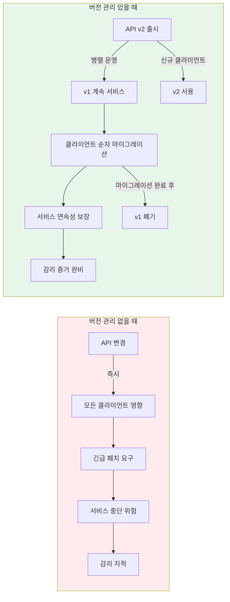
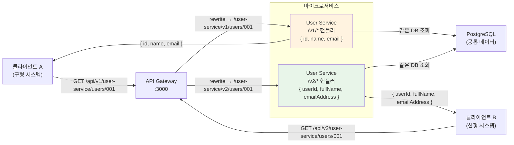
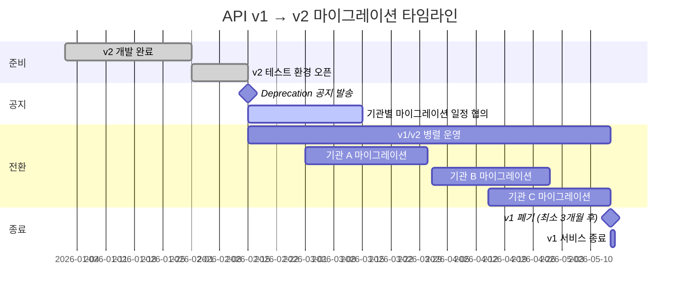
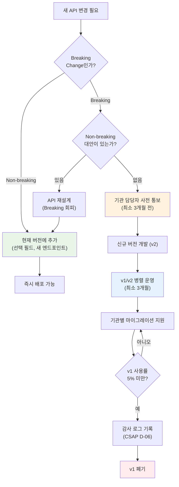

# API 버전 관리 전략 — 하위 호환성, 마이그레이션 가이드

> **문서 ID**: ONBOARD-02-14
> **버전**: 1.0.0 | **작성일**: 2026-04-12 | **작성자**: Implementer (Sonnet)
> **선행 학습**: `03-development/12-api-design-guide.md` (API 설계 원칙)
> **소요 시간**: 약 4~5시간 (실습 포함)
> **CSAP**: D-06 (감사 로깅 — API 변경 이력), D-08 (접근 통제 — 버전별 권한), D-13 (소프트웨어 보안)
> **관련 코드**: `platform/services/ai-service/src/lib/api-versioning-manager.ts`

---

## 목차

1. [API 버전 관리가 왜 필요한가](#1-api-버전-관리가-왜-필요한가)
2. [버전 관리 방법 비교](#2-버전-관리-방법-비교)
3. [우리 프로젝트의 버전 관리 구현](#3-우리-프로젝트의-버전-관리-구현)
4. [Breaking vs Non-breaking 변경](#4-breaking-vs-non-breaking-변경)
5. [버전 마이그레이션 전략](#5-버전-마이그레이션-전략)
6. [CSAP 버전 관리 요건](#6-csap-버전-관리-요건)
7. [실전 시나리오](#7-실전-시나리오)
8. [변경 이력](#8-변경-이력)

---

## 1. API 버전 관리가 왜 필요한가

### 1.1 버전 관리 없이 API를 변경하면 어떤 일이 발생하는가

공공기관 SaaS는 여러 기관의 다양한 클라이언트 시스템과 연동됩니다. 이 클라이언트들은 각자의 개발 일정과 릴리스 사이클을 가지고 있습니다.

```
[시나리오] 버전 관리 없이 응답 구조 변경

변경 전 (2026-01-01):
  GET /api/v1/users/usr-001
  응답: { "id": "usr-001", "name": "홍길동", "email": "hong@example.com" }

변경 후 (2026-03-01 — Breaking 변경 무방비 배포):
  응답: { "userId": "usr-001", "fullName": "홍길동", "emailAddress": "hong@example.com" }
  ("id" → "userId", "name" → "fullName", "email" → "emailAddress" 이름 변경)

결과:
  - 기관 A 시스템: user.id 참조 → 오류 발생 (당일 서비스 중단!)
  - 기관 B 시스템: user.name 참조 → 빈 값 표시
  - 기관 C 모바일 앱: 강제 업데이트 불가 (앱 스토어 심사 2~3주)
  - 언론 보도: "공공기관 SaaS 전국 동시 장애"
  - 감리 지적: "계약 기간 중 API 무단 변경 — 감사원 조치"
```

### 1.2 공공기관 SaaS에서 API 버전 관리의 의미

공공기관 계약은 일반 SaaS와 다른 특수성이 있습니다.

```
일반 SaaS:
  - 계약 기간: 월/연 단위
  - Breaking 변경: 사전 공지 후 가능
  - 마이그레이션: 사용자가 자율 결정

공공기관 SaaS (이 프로젝트):
  - 계약 기간: 1~5년 (정보화사업 계약)
  - Breaking 변경: 계약 기간 중 원칙적 금지
  - 마이그레이션: 기관 담당자 승인 + 감리 증거 필요
  - 법적 근거: 행안부 정보시스템 감리기준 고시 제2023-1호

즉, 이 프로젝트에서 API 버전 관리는
"편의 기능"이 아닌 "계약 이행 의무"입니다.
```

### 1.3 API 버전 관리의 이점과 없을 때의 문제



---

## 2. 버전 관리 방법 비교

### 2.1 세 가지 방법

업계에서 사용하는 API 버전 관리 방법은 크게 세 가지입니다.

**방법 1: URL 경로 버전 (Path Versioning)**
```
GET /api/v1/users
GET /api/v2/users
```

**방법 2: 헤더 버전 (Header Versioning)**
```
GET /api/users
API-Version: 2024-01-01
```
또는
```
Accept: application/vnd.saas.v2+json
```

**방법 3: 쿼리 파라미터 버전 (Query Parameter Versioning)**
```
GET /api/users?version=2
GET /api/users?api-version=2024-01-01
```

### 2.2 방법별 장단점 비교

| 기준 | URL 경로 | 헤더 | 쿼리 파라미터 |
|------|---------|------|-------------|
| 가시성 | 높음 (URL에 명확) | 낮음 (헤더 확인 필요) | 중간 |
| 캐싱 친화성 | 높음 (URL이 달라 구별됨) | 낮음 (같은 URL, 다른 응답) | 중간 |
| 클라이언트 구현 용이성 | 쉬움 | 어려움 (헤더 설정 필요) | 쉬움 |
| REST 원칙 준수 | 논란 있음 | 높음 | 낮음 |
| 로그 분석 용이성 | 높음 | 낮음 | 중간 |
| Swagger 자동화 | 쉬움 | 어려움 | 중간 |
| 공공기관 감리 증거 | 명확 | 모호 | 보통 |

### 2.3 이 프로젝트의 선택: URL 경로 버전

이 프로젝트는 **URL 경로 버전**을 사용합니다. 이유는 다음과 같습니다.

```
선택 근거:
  1. 공공기관 감리 증거 명확성
     → 감사원/감리인이 로그에서 버전 즉시 확인 가능
     → 헤더 버전은 로그에서 확인이 어려움

  2. 캐싱 친화성
     → CDN, 브라우저 캐시가 URL로 구별
     → 헤더 버전은 동일 URL에 다른 응답이므로 캐싱 설정 복잡

  3. 기관 IT 담당자 친화성
     → "v1 → v2"를 URL만 봐도 이해
     → Postman, curl 등 도구에서 직관적

  4. 기존 코드베이스 일관성
     → platform/services/api-gateway/src/routes/proxy.ts 이미 /api/v1 사용
     → 변경 시 모든 클라이언트 재설정 필요

현재 프로젝트 URL 패턴:
  /api/v1/{serviceId}/{resource}   ← 현재
  /api/v2/{serviceId}/{resource}   ← 차기 버전 (필요 시)
```

---

## 3. 우리 프로젝트의 버전 관리 구현

### 3.1 API Gateway 라우팅 코드 분석

현재 API Gateway(`platform/services/api-gateway/src/routes/proxy.ts`)는 `/api/v1` 프리픽스로 모든 요청을 처리합니다.

```typescript
// Design Ref: DESIGN-MTU-P04 §라우팅 설계
// platform/services/api-gateway/src/routes/proxy.ts (실제 코드)

await app.register(httpProxy, {
  upstream: entry.url,                              // 예: http://ai-service:3005
  prefix: `/api/v1/${serviceId}`,                  // 외부: /api/v1/ai
  rewritePrefix: `/${serviceId}`,                  // 내부: /ai
  http2: false,
  preHandler: compositePreHandler,                  // 인증 + 권한 검사
});
```

v2를 추가한다면 다음과 같이 확장합니다.

```typescript
// v2 라우트 추가 예시 (Breaking Change 이후)
// Design Ref: ONBOARD-02-14 §3.1

// v1 라우트 (기존 — 유지)
await app.register(httpProxy, {
  upstream: entry.url,
  prefix: `/api/v1/${serviceId}`,
  rewritePrefix: `/${serviceId}/v1`,
  preHandler: compositePreHandler,
});

// v2 라우트 (신규)
await app.register(httpProxy, {
  upstream: entry.url,
  prefix: `/api/v2/${serviceId}`,
  rewritePrefix: `/${serviceId}/v2`,
  preHandler: compositePreHandler,
});
```

### 3.2 Fastify에서 버전별 라우트 등록

개별 마이크로서비스(Fastify)에서 버전별 라우트를 관리하는 방법입니다.

```typescript
// platform/services/user-service/src/routes/user.ts
// Design Ref: ONBOARD-02-14 §3.2

import { FastifyInstance } from 'fastify';

// ── v1 라우트 (현재 버전) ─────────────────────────────────────────────

async function userRoutesV1(app: FastifyInstance): Promise<void> {
  // v1 응답 구조: { id, name, email }
  app.get('/v1/users/:id', {
    schema: {
      params: {
        type: 'object',
        properties: { id: { type: 'string' } },
        required: ['id'],
      },
      response: {
        200: {
          type: 'object',
          properties: {
            id: { type: 'string' },
            name: { type: 'string' },        // v1: "name"
            email: { type: 'string' },       // v1: "email"
          },
        },
      },
    },
    async handler(request, reply) {
      const { id } = request.params as { id: string };
      const user = await prisma.user.findFirstOrThrow({
        where: { id, tenantId: request.user.tenantId },
      });
      // v1 형식으로 반환
      return reply.send({
        id: user.id,
        name: user.name,              // v1 필드명
        email: user.email,            // v1 필드명
      });
    },
  });
}

// ── v2 라우트 (차기 버전) ─────────────────────────────────────────────

async function userRoutesV2(app: FastifyInstance): Promise<void> {
  // v2 응답 구조: { userId, fullName, emailAddress, ... } (확장된 구조)
  app.get('/v2/users/:id', {
    schema: {
      params: {
        type: 'object',
        properties: { id: { type: 'string' } },
        required: ['id'],
      },
      response: {
        200: {
          type: 'object',
          properties: {
            userId: { type: 'string' },       // v2: "userId" (Breaking!)
            fullName: { type: 'string' },     // v2: "fullName" (Breaking!)
            emailAddress: { type: 'string' }, // v2: "emailAddress" (Breaking!)
            department: { type: 'string' },   // v2: 신규 필드 (Non-breaking in v2)
            lastLoginAt: { type: 'string' },  // v2: 신규 필드
          },
        },
      },
    },
    async handler(request, reply) {
      const { id } = request.params as { id: string };
      const user = await prisma.user.findFirstOrThrow({
        where: { id, tenantId: request.user.tenantId },
      });
      // v2 형식으로 반환
      return reply.send({
        userId: user.id,              // v2 필드명
        fullName: user.name,          // v2 필드명
        emailAddress: user.email,     // v2 필드명
        department: user.department,
        lastLoginAt: user.lastLoginAt?.toISOString(),
      });
    },
  });
}

// ── 플러그인 등록 ─────────────────────────────────────────────────────

export async function userRoutes(app: FastifyInstance): Promise<void> {
  await app.register(userRoutesV1);
  await app.register(userRoutesV2);
}
```

### 3.3 API 버전 관리 시스템 (ai-service 구현 참고)

`platform/services/ai-service/src/lib/api-versioning-manager.ts`에는 버전 등록, 호환성 검사, 마이그레이션 가이드 자동 생성 기능이 구현되어 있습니다.

```typescript
// 실제 구현 기반 — api-versioning-manager.ts
// Design Ref: MTU-N332 | CSAP: D-06, D-08, D-13

import { ApiVersioningManagerService } from './api-versioning-manager.js';

// 테넌트별 API 버전 관리
const manager = new ApiVersioningManagerService('tenant-a');

// v1 스키마 등록
const v1 = manager.register('user-api', '1.0.0', {
  id: 'string',
  name: 'string',
  email: 'string',
});

// v2 스키마 등록
const v2 = manager.register('user-api', '2.0.0', {
  userId: 'string',       // Breaking: 이름 변경
  fullName: 'string',     // Breaking: 이름 변경
  emailAddress: 'string', // Breaking: 이름 변경
  department: 'string',   // Non-breaking: 신규 필드 (v2 context)
});

// 호환성 자동 검사
const compat = manager.checkCompat(
  { id: 'string', name: 'string', email: 'string' },
  { userId: 'string', fullName: 'string', emailAddress: 'string', department: 'string' },
);

console.log(compat.compatible);       // false (Breaking Change 있음)
console.log(compat.breakingChanges);
// ["필드 제거됨: id", "필드 제거됨: name", "필드 제거됨: email"]

// 마이그레이션 가이드 자동 생성
const guide = manager.guide('1.0.0', '2.0.0', compat);
console.log(guide.steps);
// ["제거된 필드 대체 구현: id, name, email",
//  "신규 필드 활용 검토: userId, fullName, emailAddress, department"]

// v1 Deprecation 처리
manager.deprecate(v1.versionId);

// 감사 로그 확인 (CSAP D-06)
const auditLog = manager.getAuditLog();
// [{ action: 'API_VERSION_REGISTERED', ... },
//  { action: 'API_VERSION_DEPRECATED', ... }]
```

### 3.4 버전별 API 라우팅 흐름도



---

## 4. Breaking vs Non-breaking 변경

### 4.1 Breaking Change (계약 기간 중 절대 금지)

Breaking Change는 기존 클라이언트가 변경 없이 계속 작동할 수 없는 변경입니다.

```
[Breaking Change 목록]

응답 구조 변경:
  ❌ 기존 필드 이름 변경: "name" → "fullName"
  ❌ 기존 필드 제거: { id, name, email } → { id, email } (name 제거)
  ❌ 필드 타입 변경: "id": "string" → "id": "number"
  ❌ 중첩 구조 변경: { name } → { name: { first, last } }
  ❌ 배열 → 객체 변경: [item1, item2] → { items: [item1, item2] }

요청 구조 변경:
  ❌ 필수 필드 추가: 기존 요청에 없으면 400 오류 발생
  ❌ URL 경로 변경: /users/:id → /members/:id
  ❌ HTTP 메서드 변경: GET → POST

동작 변경:
  ❌ 오류 코드 변경: 404 → 400 (같은 상황에서)
  ❌ 응답 순서 변경 (순서에 의존하는 클라이언트 있을 수 있음)
  ❌ 인증 방식 변경: JWT → API Key (기존 클라이언트 즉시 장애)
```

### 4.2 Non-breaking Change (안전하게 가능한 것)

Non-breaking Change는 기존 클라이언트가 변경 없이도 계속 작동하는 변경입니다.

```
[Non-breaking Change 목록]

응답 구조 확장:
  ✅ 새 선택 필드 추가: { id, name } → { id, name, department }
     (클라이언트가 department를 무시해도 작동)
  ✅ 새 엔드포인트 추가: GET /users/:id/profile (기존 엔드포인트 불변)
  ✅ 기존 필드에 새 옵션 값 추가: status: "active" | "inactive" → ... | "suspended"
     (단, 클라이언트가 switch로 모든 값을 처리하고 있다면 조심)

요청 처리 개선:
  ✅ 선택 파라미터 추가: ?includeProfile=true (없어도 작동)
  ✅ 유효성 검사 완화: name 길이 제한 100 → 200
  ✅ 성능 개선 (같은 응답, 더 빠르게)

문서/메타데이터:
  ✅ API 설명 텍스트 변경
  ✅ 예시 값 변경
  ✅ 내부 구현 변경 (같은 인터페이스 유지)
```

### 4.3 실제 판단 예시 10개

아래는 실무에서 판단하기 어려운 사례들입니다.

| # | 변경 내용 | 판단 | 이유 |
|---|----------|------|------|
| 1 | `createdAt`: `"2026-01-01"` → `"2026-01-01T00:00:00Z"` | Breaking | 날짜 파싱 코드가 다름. ISO 8601 형식 변경 |
| 2 | 응답에 `metadata` 객체 신규 추가 | Non-breaking | 기존 클라이언트는 무시 가능 |
| 3 | `status` 에 신규 값 `"pending"` 추가 | Breaking 위험 | switch 문에 default 없으면 오류 발생 가능. 공지 필수 |
| 4 | 페이지네이션 기본값 변경 (limit: 20 → 50) | Breaking 위험 | 클라이언트가 20개를 기대하는 로직이 있을 수 있음 |
| 5 | 오류 응답에 `errorCode` 필드 추가 | Non-breaking | 기존 `message` 필드는 유지 |
| 6 | `GET /users` 정렬 순서 변경 (createdAt 오름차순 → 내림차순) | Breaking | 클라이언트가 순서에 의존할 수 있음. 파라미터화 필요 |
| 7 | 응답 필드를 null 허용 → 필수로 변경 | Breaking 위험 | null 처리 코드가 있던 클라이언트 영향 |
| 8 | 내부 로직 최적화 (응답 동일) | Non-breaking | 외부 인터페이스 불변 |
| 9 | 신규 선택 헤더 `X-Request-ID` 지원 | Non-breaking | 헤더 없어도 작동 |
| 10 | `email` 필드 형식 검증 강화 (기존에 허용되던 형식 거부) | Breaking | 기존 데이터/요청이 거부될 수 있음 |

---

## 5. 버전 마이그레이션 전략

### 5.1 Deprecation 공지 절차

Breaking Change가 불가피할 경우, 다음 절차를 따릅니다. 공공기관 SaaS에서 최소 공지 기간은 **3개월**입니다.



### 5.2 Deprecation 공지 코드 구현

```typescript
// Design Ref: ONBOARD-02-14 §5.2
// CSAP: D-06 (감사 로깅 — API 변경 이력)

// Deprecation 헤더를 응답에 자동 추가하는 미들웨어
async function deprecationHeaderPlugin(
  app: FastifyInstance,
): Promise<void> {
  const DEPRECATED_APIS: Record<string, {
    deprecatedAt: string;
    sunsetAt: string;
    successor: string;
  }> = {
    '/api/v1/user-service/users': {
      deprecatedAt: '2026-02-15',
      sunsetAt: '2026-05-15',  // 폐기 예정일
      successor: '/api/v2/user-service/users',
    },
  };

  // 모든 응답에 Deprecation 헤더 추가
  app.addHook('onSend', async (request, reply) => {
    const matchedPath = Object.keys(DEPRECATED_APIS).find((path) =>
      request.url.startsWith(path),
    );

    if (matchedPath) {
      const info = DEPRECATED_APIS[matchedPath]!;
      // RFC 8594: Sunset HTTP Header Field
      reply.header('Sunset', info.sunsetAt);
      // RFC 8288: Web Linking (Link 헤더로 후계 API 안내)
      reply.header('Link', `<${info.successor}>; rel="successor-version"`);
      reply.header('Deprecation', `date="${info.deprecatedAt}"`);
    }
  });
}

// 클라이언트가 받는 응답 헤더 예시:
// HTTP/1.1 200 OK
// Content-Type: application/json
// Sunset: 2026-05-15
// Deprecation: date="2026-02-15"
// Link: </api/v2/user-service/users>; rel="successor-version"
```

### 5.3 병렬 버전 운영 관리

```typescript
// Design Ref: ONBOARD-02-14 §5.3

// 버전별 트래픽 모니터링 (Prometheus 메트릭)
// Plan SC: NFR-1 (SLO 99.9%)

import { Counter, Histogram } from 'prom-client';

const apiVersionRequests = new Counter({
  name: 'api_version_requests_total',
  help: 'API 버전별 요청 수',
  labelNames: ['version', 'service', 'endpoint', 'status_code'],
});

const apiVersionLatency = new Histogram({
  name: 'api_version_request_duration_seconds',
  help: 'API 버전별 응답 시간',
  labelNames: ['version', 'service'],
  buckets: [0.01, 0.05, 0.1, 0.5, 1, 2, 5],
});

// Fastify 미들웨어에서 사용
app.addHook('onResponse', (request, reply, done) => {
  const version = request.url.startsWith('/api/v2') ? 'v2' : 'v1';
  const service = request.url.split('/')[3] ?? 'unknown';

  apiVersionRequests.inc({
    version,
    service,
    endpoint: request.routerPath ?? 'unknown',
    status_code: reply.statusCode.toString(),
  });

  done();
});
```

```yaml
# Grafana 대시보드용 PromQL: v1 vs v2 사용 비율
# 이 그래프를 보고 v1 폐기 시점 결정

# v1 사용 비율
sum(rate(api_version_requests_total{version="v1"}[1h]))
/
sum(rate(api_version_requests_total[1h]))

# 목표: v1 사용 비율이 5% 미만이 되면 v1 폐기 검토
```

### 5.4 클라이언트 마이그레이션 가이드 작성

기관에 제공하는 마이그레이션 가이드 작성 체크리스트:

```
[마이그레이션 가이드 필수 포함 사항]

1. 변경 요약 (Executive Summary)
   - 변경 이유 (왜?)
   - 영향 받는 API 목록
   - 마이그레이션 기한

2. 상세 변경 사항
   - 각 엔드포인트별 변경 전/후 비교 표
   - 코드 예시 (변경 전 → 변경 후)

3. 단계별 마이그레이션 방법
   - 테스트 환경에서 검증
   - 프로덕션 전환 체크리스트

4. 롤백 방법
   - v1으로 즉시 복구 방법 (v1 폐기 전까지)

5. 지원 창구
   - 담당자 연락처
   - FAQ
```

```markdown
<!-- 기관에 제공하는 마이그레이션 가이드 예시 -->

# User API v1 → v2 마이그레이션 가이드

## 변경 요약
- **대상**: GET /api/v1/user-service/users/:id
- **폐기 예정**: 2026-05-15
- **후계 API**: GET /api/v2/user-service/users/:id

## 변경 사항 (응답 필드)

| v1 필드명 | v2 필드명 | 비고 |
|---------|---------|------|
| id | userId | 이름 변경 |
| name | fullName | 이름 변경 |
| email | emailAddress | 이름 변경 |
| (없음) | department | 신규 필드 |

## 코드 변경 예시

```javascript
// 변경 전 (v1)
const user = await api.get('/api/v1/user-service/users/usr-001');
console.log(user.name);   // "홍길동"

// 변경 후 (v2)
const user = await api.get('/api/v2/user-service/users/usr-001');
console.log(user.fullName);  // "홍길동"
```
```

---

## 6. CSAP 버전 관리 요건

### 6.1 API 변경 이력 문서화 (감리 증거)

감리에서 API 버전 관리 증거로 요구하는 산출물입니다.

```
[CSAP D-06: 침해사고 관리 — API 변경 이력 감사 로그]

필요 증거:
  1. API 버전별 릴리스 노트 (CHANGELOG.md)
  2. API 버전 등록/폐기 감사 로그 (audit.jsonl)
  3. 기관 공지 발송 증거 (이메일, 공문)
  4. 마이그레이션 완료 확인 (접속 로그)

[CSAP D-13: 소프트웨어 보안 — 버전 관리]
  - 소프트웨어 형상 관리: Git 태그로 API 버전 추적
  - 이전 버전 코드 보존: 폐기 후 최소 1년 아카이브
```

```typescript
// 감사 로그 자동 기록 (api-versioning-manager.ts 실제 구현)
// CSAP: D-06 감사 로깅

// API 버전 등록 시 자동 감사 로그 기록
export function registerVersion(
  tenantId: string,
  apiName: string,
  version: string,
  schema: Record<string, unknown>,
): APIVersion {
  const v: APIVersion = {
    versionId: `apiv-${Date.now()}-${Math.random().toString(36).slice(2, 8)}`,
    tenantId,
    apiName,
    version,
    status: 'active',
    schema,
    deprecatedAt: null,
    retiredAt: null,
    createdAt: new Date().toISOString(),
  };

  // 감사 로그 자동 기록
  recordAudit({
    actor: 'system',
    tenantId,
    action: 'API_VERSION_REGISTERED',
    target: v.versionId,
    details: { apiName, version },
  });

  return v;
}

// 폐기 시 감사 로그 기록
export function deprecateVersion(
  tenantId: string,
  versionId: string,
): APIVersion | null {
  // ...
  recordAudit({
    actor: 'system',
    tenantId,
    action: 'API_VERSION_DEPRECATED',
    target: versionId,
    details: { deprecatedAt: new Date().toISOString() },
  });
  return updated;
}
```

### 6.2 계약 기간 중 Breaking Change 금지 정책

```
[정책 문서 — 공공기관 SaaS API 변경 관리]

원칙:
  1. 계약 기간 중 Breaking Change 원칙적 금지
  2. 불가피한 Breaking Change 시 사전 기관 동의 필수
  3. 최소 공지 기간: 3개월
  4. 병렬 운영 보장 기간: Deprecation 이후 최소 3개월

절차:
  Step 1. 변경 필요성 검토 (기술팀 + 기획팀)
  Step 2. Breaking 여부 판단 (§4 기준 적용)
  Step 3. Non-breaking 대안 검토 (Breaking 불가피한지 재확인)
  Step 4. 기관 담당자 사전 통보 (최소 3개월 전)
  Step 5. 마이그레이션 가이드 제공
  Step 6. 기관별 마이그레이션 지원
  Step 7. 폐기 처리 + 감사 기록
```

### 6.3 API 버전 폐기 시 감사 기록

```typescript
// API 버전 폐기 완료 시 감사 기록
// CSAP: D-06 감사 로깅, D-13 소프트웨어 보안

import { auditLog } from '@/lib/audit.js';

async function retireApiVersion(
  actor: string,           // 처리 담당자
  tenantId: string,
  versionId: string,
  reason: string,          // 폐기 이유 (예: "3개월 공지 완료, 모든 기관 마이그레이션 완료")
): Promise<void> {
  // 감사 로그 기록 (CSAP D-06)
  await auditLog({
    actor,
    action: 'API_VERSION_RETIRED',
    target: versionId,
    details: {
      tenantId,
      reason,
      retiredAt: new Date().toISOString(),
    },
    timestamp: new Date().toISOString(),
  });

  // 버전 상태 변경
  const manager = new ApiVersioningManagerService(tenantId);
  // (실제 구현에서 retire 메서드 호출)
}
```

---

## 7. 실전 시나리오

### 7.1 시나리오 1: 새 필수 필드 추가 시 마이그레이션

상황: 보안 감사 결과, 사용자 생성 시 `organizationCode` 필드가 반드시 필요하게 됨.

```
문제: organizationCode는 기존 클라이언트가 보내지 않는 필드
→ 즉시 필수화 시 기존 클라이언트 모두 400 오류 (Breaking!)

해결 방법: 단계적 전환
```

```typescript
// ── 단계 1: 선택 필드로 먼저 추가 (Non-breaking) ────────────────────

// v1 스키마 업데이트 (하위 호환 유지)
const createUserSchemaV1 = z.object({
  email: z.string().email(),
  name: z.string().min(1).max(100),
  organizationCode: z.string().optional(), // ← 선택 필드로 먼저 추가
});

// 없으면 기본값 처리
async function createUser(data: CreateUserInput): Promise<User> {
  const organizationCode = data.organizationCode ?? 'DEFAULT'; // 기본값
  // ...
}

// ── 단계 2: Deprecation 공지 발송 ───────────────────────────────────

// "organizationCode 미제공 시 DEFAULT로 처리되며,
//  2026-05-01부터 organizationCode는 필수 필드가 됩니다."

// ── 단계 3: v2에서 필수화 (Breaking이지만 사전 공지됨) ──────────────

const createUserSchemaV2 = z.object({
  email: z.string().email(),
  name: z.string().min(1).max(100),
  organizationCode: z.string().min(1), // ← v2에서 필수
});
```

### 7.2 시나리오 2: 엔드포인트 이름 변경 (하위 호환)

상황: `/api/v1/ai-service/chat` → `/api/v1/ai-service/conversations`로 변경 요청.

```typescript
// Design Ref: ONBOARD-02-14 §7.2

// ── 방법: 별칭(Alias) 라우트 추가 (Non-breaking) ─────────────────────

async function aiRoutes(app: FastifyInstance): Promise<void> {
  // 새로운 이름 (현재 버전)
  app.post('/v1/conversations', conversationHandler);

  // 기존 이름 유지 (별칭 — Deprecation 공지)
  app.post('/v1/chat', async (request, reply) => {
    // Deprecation 헤더 추가
    reply.header('Sunset', '2026-08-01');
    reply.header('Link', '</api/v1/ai-service/conversations>; rel="successor-version"');

    // 실제 처리는 새 핸들러에 위임
    return conversationHandler(request, reply);
  });
}

// 결과:
// - 기존 클라이언트: /api/v1/ai-service/chat 계속 작동
// - 신규 클라이언트: /api/v1/ai-service/conversations 사용
// - 3개월 후: /api/v1/ai-service/chat 폐기
```

### 7.3 시나리오 3: 응답 구조 변경 (Breaking)

상황: AI 응답 구조를 근본적으로 바꿔야 하는 상황.

```typescript
// 변경 전 (v1): 단순 구조
// GET /api/v1/ai-service/rag/query
// Response: { answer: "...", source: "문서 제목" }

// 변경 후 (v2): 상세 출처 정보 포함 (Breaking!)
// GET /api/v2/ai-service/rag/query
// Response: {
//   answer: "...",
//   sources: [             ← "source" → "sources" (배열로 변경!)
//     { title: "...", page: 3, confidence: 0.92 }
//   ],
//   tokensUsed: 1234       ← 신규 필드
// }

// ── 구현 ──────────────────────────────────────────────────────────────

// v1 핸들러 (유지)
async function ragQueryV1(request: FastifyRequest, reply: FastifyReply) {
  const result = await runRAG(request.body);
  return reply.send({
    answer: result.answer,
    source: result.sources[0]?.title ?? '',  // v1: 첫 번째 출처만
  });
}

// v2 핸들러 (신규)
async function ragQueryV2(request: FastifyRequest, reply: FastifyReply) {
  const result = await runRAG(request.body);
  return reply.send({
    answer: result.answer,
    sources: result.sources.map((s) => ({  // v2: 전체 출처 배열
      title: s.title,
      page: s.pageNumber,
      confidence: s.score,
    })),
    tokensUsed: result.usage.totalTokens,
  });
}
```

---

## 7.4 시나리오 4: API 문서 자동화와 버전 관리 연동

OpenAPI(Swagger) 문서를 버전별로 분리하여 클라이언트에 제공합니다.

```typescript
// Fastify Swagger 플러그인으로 버전별 API 문서 자동 생성
// Design Ref: ONBOARD-02-14 §7.4

import FastifySwagger from '@fastify/swagger';
import FastifySwaggerUI from '@fastify/swagger-ui';

// v1 문서 서버
const v1App = Fastify();
await v1App.register(FastifySwagger, {
  openapi: {
    info: {
      title: '공공기관 SaaS API',
      version: '1.0.0',
      description: 'v1 API 문서. 2026-05-15 폐기 예정.',
    },
    servers: [{ url: '/api/v1' }],
  },
});
await v1App.register(FastifySwaggerUI, {
  routePrefix: '/docs/v1',
  uiConfig: { docExpansion: 'list' },
});

// v2 문서 서버
const v2App = Fastify();
await v2App.register(FastifySwagger, {
  openapi: {
    info: {
      title: '공공기관 SaaS API',
      version: '2.0.0',
      description: '현재 안정 버전 (v2)',
    },
    servers: [{ url: '/api/v2' }],
  },
});
```

**버전별 스키마 분리 방법:**

```typescript
// 버전별 스키마를 별도 파일로 관리
// platform/services/user-service/src/schemas/

// schemas/v1/user.schema.ts
export const getUserSchemaV1 = {
  params: {
    type: 'object',
    properties: { id: { type: 'string', description: '사용자 ID' } },
    required: ['id'],
  },
  response: {
    200: {
      type: 'object',
      description: 'v1 사용자 조회 응답',
      properties: {
        id: { type: 'string', description: '사용자 ID' },
        name: { type: 'string', description: '이름' },
        email: { type: 'string', description: '이메일' },
      },
    },
  },
} as const;

// schemas/v2/user.schema.ts
export const getUserSchemaV2 = {
  params: {
    type: 'object',
    properties: { id: { type: 'string', description: '사용자 ID' } },
    required: ['id'],
  },
  response: {
    200: {
      type: 'object',
      description: 'v2 사용자 조회 응답 (확장)',
      properties: {
        userId: { type: 'string', description: '사용자 ID (v2)' },
        fullName: { type: 'string', description: '전체 이름 (v2)' },
        emailAddress: { type: 'string', description: '이메일 주소 (v2)' },
        department: { type: 'string', description: '부서명 (v2 신규)' },
        lastLoginAt: { type: 'string', format: 'date-time', description: '마지막 로그인 (v2 신규)' },
      },
    },
  },
} as const;
```

### 7.5 시나리오 5: 테넌트별 API 버전 계약 관리

공공기관 계약에서는 기관마다 다른 버전을 사용할 수 있습니다. 계약서에 "API 버전 v1 기준"이라고 명시된 경우, 해당 기관은 v2 전환 의무가 없습니다.

```typescript
// Design Ref: ONBOARD-02-14 §7.5
// platform/services/ai-service/src/lib/api-versioning-manager.ts 기반

// 테넌트별 계약 API 버전 관리
interface TenantApiContract {
  tenantId: string;
  contractedVersion: string;         // "1.0.0"
  contractStartDate: string;         // "2025-01-01"
  contractEndDate: string;           // "2027-12-31"
  allowedVersions: string[];         // ["1.0.0", "1.1.0"]
  forceMigrationRequired: boolean;   // 강제 마이그레이션 여부
}

// 계약 기간 중 버전 변경 보호
function canForceMigration(
  contract: TenantApiContract,
  newVersion: string,
): boolean {
  const now = new Date();
  const contractEnd = new Date(contract.contractEndDate);

  // 계약 기간 중에는 강제 마이그레이션 불가
  if (now < contractEnd && !contract.forceMigrationRequired) {
    return false;
  }

  return true;
}

// API 요청 시 버전 권한 확인
function checkVersionPermission(
  tenantId: string,
  requestedVersion: string,
  contract: TenantApiContract,
): { allowed: boolean; reason?: string } {
  if (!contract.allowedVersions.includes(requestedVersion)) {
    return {
      allowed: false,
      reason: `계약된 API 버전(${contract.contractedVersion})과 다릅니다. 담당자에게 문의하세요.`,
    };
  }
  return { allowed: true };
}
```

### 7.6 시나리오 6: 버전별 Rate Limit 차등 적용

버전별로 다른 Rate Limit을 적용하여 v1 사용자의 마이그레이션을 유도할 수 있습니다.

```typescript
// v1은 느리게, v2는 빠르게 — 마이그레이션 인센티브 제공
// Design Ref: ONBOARD-02-14 §7.6

const VERSION_RATE_LIMITS = {
  v1: {
    requestsPerMinute: 30,   // v1: 느린 제한
    description: 'v1 API (Deprecated — 2026-05-15 폐기 예정)',
  },
  v2: {
    requestsPerMinute: 100,  // v2: 빠른 제한
    description: 'v2 API (현재 권장 버전)',
  },
} as const;

// Rate Limit 미들웨어에서 버전 감지
async function versionAwareRateLimit(
  request: FastifyRequest,
): Promise<void> {
  const version = request.url.startsWith('/api/v2') ? 'v2' : 'v1';
  const limit = VERSION_RATE_LIMITS[version];

  // v1 요청에 추가 지연 헤더 (마이그레이션 권고)
  if (version === 'v1') {
    request.reply?.header(
      'X-Deprecation-Warning',
      `이 API 버전(v1)은 2026-05-15 폐기됩니다. v2로 마이그레이션하세요.`,
    );
  }
}
```

## 7.7 API 버전 관리 전체 흐름 요약



---

## 8. 변경 이력

| 버전 | 일자 | 내용 | 작성자 |
|------|------|------|--------|
| 1.0.0 | 2026-04-12 | 최초 작성 — URL 경로 버전 전략, Breaking/Non-breaking 판단, 마이그레이션 가이드, CSAP 요건, 실전 시나리오 6개 | Implementer (Sonnet) |

---

> **관련 문서**:
> - `03-development/12-api-design-guide.md` — API 설계 원칙 (Fastify 스키마, RESTful 패턴)
> - `platform/services/api-gateway/src/routes/proxy.ts` — API Gateway 라우팅 실제 구현
> - `platform/services/ai-service/src/lib/api-versioning-manager.ts` — 버전 등록/호환성 검사 구현
> - `platform/services/ai-service/src/lib/api-deprecation-manager.ts` — Deprecation 관리 구현
> - `07-security/csap/01-what-is-csap.md` — CSAP 79개 통제항목 개요
