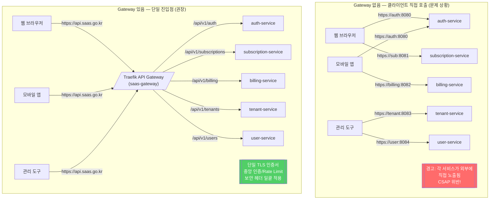
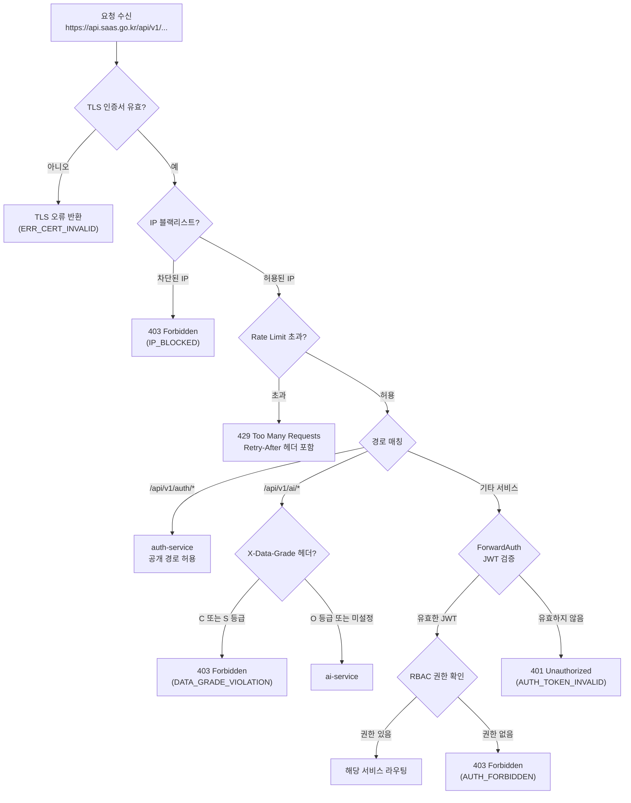
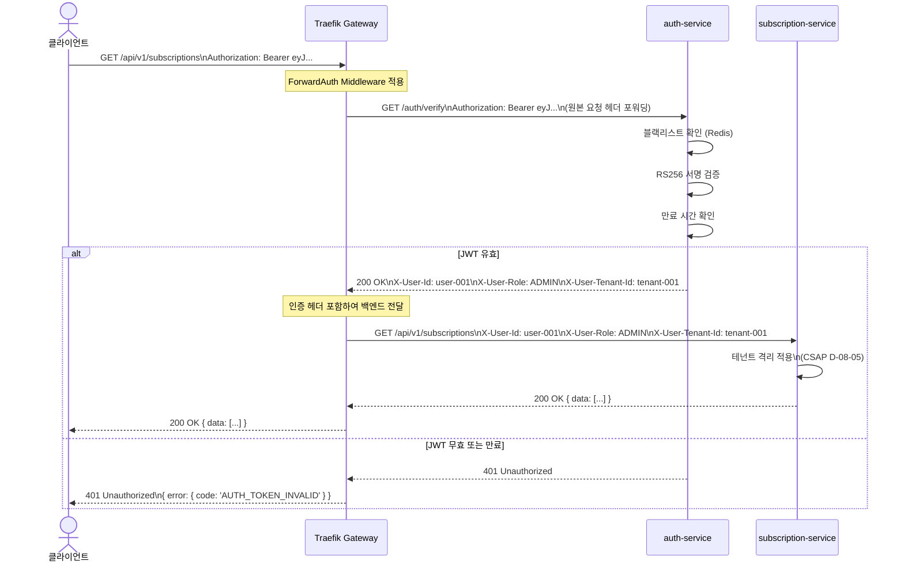

# API Gateway 패턴 — Traefik 기반 게이트웨이 완전 가이드

> **문서 ID**: ARCH-GW-15
> **버전**: 1.0.0 | **작성일**: 2026-04-13 | **작성자**: Implementer (Sonnet)
> **목적**: 공공기관 SaaS 플랫폼의 Traefik 기반 API Gateway 구성을 초급자가 완전히 이해할 수 있도록 설명합니다.
> **선행 학습**: [14-service-mesh.md](./14-service-mesh.md)

---

## 목차

1. [API Gateway 역할 이해](#1-api-gateway-역할-이해)
2. [이 프로젝트의 Traefik 구성](#2-이-프로젝트의-traefik-구성)
3. [라우팅 전략](#3-라우팅-전략)
4. [Rate Limiting 완전 가이드](#4-rate-limiting-완전-가이드)
5. [인증 통합](#5-인증-통합)
6. [관측가능성](#6-관측가능성)
7. [장애 시나리오](#7-장애-시나리오)
8. [변경 이력](#변경-이력)

---

## 1. API Gateway 역할 이해

### 1.1 클라이언트가 직접 마이크로서비스를 호출하면?

공공기관 SaaS 플랫폼은 15개 이상의 마이크로서비스로 구성됩니다(`auth-service`, `subscription-service`, `billing-service` 등). 클라이언트가 이들 서비스를 직접 호출하면 다음 문제가 발생합니다.

| 문제 | 설명 |
|------|------|
| 클라이언트 복잡도 증가 | 각 서비스 주소, 포트, 프로토콜을 모두 알아야 합니다. |
| 인증 중복 | 모든 서비스가 각자 JWT 검증 로직을 구현해야 합니다. |
| Rate Limiting 불가 | 개별 서비스에서 IP별 요청 제한이 어렵습니다. |
| TLS 관리 복잡 | 15개 서비스 각각 인증서를 관리해야 합니다. |
| CORS 처리 분산 | 각 서비스에서 CORS 설정을 유지해야 합니다. |
| 관측 지점 분산 | 요청 추적이 어렵고 로그가 분산됩니다. |
| 보안 노출 면적 증가 | 외부에 노출되는 포트와 서비스가 많아집니다. |

CSAP D-08 접근통제 요건상, **외부 클라이언트에게 내부 서비스를 직접 노출하는 것은 보안 위험**입니다.

### 1.2 API Gateway가 있을 때의 장점

API Gateway는 모든 요청의 **단일 진입점(Single Entry Point)**입니다. 클라이언트는 Gateway 주소 하나만 알면 되고, Gateway가 각 서비스로 라우팅합니다.



### 1.3 이 프로젝트 Gateway의 책임 영역

이 프로젝트의 Traefik API Gateway는 다음 기능을 담당합니다.

- **TLS Termination**: HTTPS → HTTP 변환 후 내부 서비스에 전달합니다.
- **라우팅**: 경로 기반으로 요청을 적절한 서비스에 전달합니다.
- **Rate Limiting**: IP 기반 요청 속도 제한으로 DDoS를 방어합니다.
- **보안 헤더**: XSS, CSRF, Clickjacking 방지 헤더를 자동으로 추가합니다.
- **접근 로그**: CSAP D-06 요건에 따라 모든 요청을 로깅합니다.
- **ForwardAuth**: 인증을 `auth-service`에 위임합니다.
- **Circuit Breaker**: 백엔드 서비스 장애 시 빠른 실패를 반환합니다.

---

## 2. 이 프로젝트의 Traefik 구성

### 2.1 전체 아키텍처

이 프로젝트는 k3s에 내장된 Traefik을 **Kubernetes Gateway API** 모드로 운영합니다.

```
[클라이언트]
    ↓ HTTPS (TLS 1.3+)
[Traefik 로드밸런서 (k3s 내장)]
    ↓ GatewayClass: traefik
[saas-gateway (Gateway 리소스)]
    ↓ HTTPRoute 매칭
[각 서비스 (ClusterIP)]
```

### 2.2 GatewayClass + Gateway 구성

`infra/gateway-api/gateway.yaml`에 정의된 실제 구성입니다.

```yaml
# infra/gateway-api/gateway.yaml
# Design Ref: MTU-N65.design.md §1
# Plan SC: FR-N65.1, FR-N65.2

apiVersion: gateway.networking.k8s.io/v1
kind: GatewayClass
metadata:
  name: traefik
spec:
  controllerName: traefik.io/gateway-controller  # k3s 내장 Traefik

---
apiVersion: gateway.networking.k8s.io/v1
kind: Gateway
metadata:
  name: saas-gateway
  namespace: saas
  annotations:
    cert-manager.io/cluster-issuer: saas-ca-issuer  # 자동 인증서 발급
spec:
  gatewayClassName: traefik
  listeners:
    - name: http
      protocol: HTTP
      port: 80
      allowedRoutes:
        namespaces:
          from: Same
    - name: https
      protocol: HTTPS
      port: 443
      tls:
        mode: Terminate              # TLS Termination
        certificateRefs:
          - name: api-gateway-tls-secret
      allowedRoutes:
        namespaces:
          from: Same
```

**핵심 포인트**:
- `cert-manager.io/cluster-issuer: saas-ca-issuer`: cert-manager가 자동으로 TLS 인증서를 발급하고 갱신합니다. 공공기관의 인증서 만료 사고를 예방합니다.
- `tls.mode: Terminate`: Traefik이 TLS를 종단합니다. 내부 서비스들은 HTTP로 통신합니다.

### 2.3 Traefik HelmChartConfig 설정

`infra/gateway-api/traefik-config.yaml`에서 Prometheus 메트릭과 접근 로그를 설정합니다.

```yaml
# infra/gateway-api/traefik-config.yaml
# Design Ref: MTU-N65.design.md §2
# Plan SC: FR-N65.7

apiVersion: helm.cattle.io/v1
kind: HelmChartConfig
metadata:
  name: traefik
  namespace: kube-system
spec:
  valuesContent: |
    providers:
      kubernetesGateway:
        enabled: true

    ports:
      websecure:
        port: 8443
        exposedPort: 443
        tls:
          enabled: true

    # CSAP D-06: 접근 로그 (감사 요건)
    accessLog:
      enabled: true
      format: json
      fields:
        headers:
          defaultMode: drop
          names:
            X-Forwarded-For: keep   # 실제 클라이언트 IP 추적
            User-Agent: keep        # 요청 출처 식별

    # Prometheus 메트릭
    metrics:
      prometheus:
        entryPoint: metrics
        addEntryPointsLabels: true
        addServicesLabels: true
```

### 2.4 보안 헤더 Middleware

`infra/gateway-api/middlewares/security-headers.yaml`에 정의된 보안 헤더입니다.

```yaml
# infra/gateway-api/middlewares/security-headers.yaml
# Design Ref: MTU-N65.design.md §3
# CSAP: D-08 접근통제 + OWASP 보안 헤더

apiVersion: traefik.io/v1alpha1
kind: Middleware
metadata:
  name: security-headers
  namespace: saas
spec:
  headers:
    browserXssFilter: true               # X-XSS-Protection: 1; mode=block
    contentTypeNosniff: true             # X-Content-Type-Options: nosniff
    frameDeny: true                      # X-Frame-Options: DENY
    customFrameOptionsValue: "SAMEORIGIN"
    stsSeconds: 31536000                 # HSTS: 1년 (TLS 강제)
    stsIncludeSubdomains: true
    stsPreload: true
    contentSecurityPolicy: "default-src 'self'; script-src 'self'; ..."
    referrerPolicy: "strict-origin-when-cross-origin"
    customResponseHeaders:
      X-Powered-By: ""                   # 서버 기술 스택 숨김
      Server: ""                         # Traefik 버전 숨김
```

**각 헤더의 역할**:
- `X-XSS-Protection`: 크로스 사이트 스크립팅(XSS) 공격을 브라우저 수준에서 차단합니다.
- `X-Frame-Options: SAMEORIGIN`: 클릭재킹(Clickjacking) 공격을 방지합니다.
- `Strict-Transport-Security`: 브라우저가 항상 HTTPS를 사용하도록 강제합니다.
- `X-Powered-By: ""`: 서버 기술 스택 정보를 숨겨 공격 정보 수집을 방해합니다.

### 2.5 mTLS 백엔드 연결

내부 서비스 간 통신에는 Linkerd 서비스 메시가 mTLS(상호 TLS)를 자동으로 적용합니다. Traefik에서 내부 서비스로의 요청도 Linkerd 프록시를 경유합니다.

```
클라이언트 → [TLS] → Traefik → [mTLS via Linkerd] → 내부 서비스
```

`infra/linkerd/authorization/auth-service-policy.yaml`에서 서비스별 접근 정책을 정의합니다.

---

## 3. 라우팅 전략

### 3.1 Path 기반 라우팅

각 서비스는 URL 경로 접두사(PathPrefix)로 라우팅됩니다.

```yaml
# infra/gateway-api/routes/auth-service-route.yaml
# Design Ref: MTU-N65.design.md §1
# Plan SC: FR-N65.3

apiVersion: gateway.networking.k8s.io/v1
kind: HTTPRoute
metadata:
  name: auth-service-route
  namespace: saas
spec:
  parentRefs:
    - name: saas-gateway
      sectionName: https        # HTTPS 리스너에만 연결
  rules:
    - matches:
        - path:
            type: PathPrefix
            value: /api/v1/auth  # /api/v1/auth/* → auth-service
      backendRefs:
        - name: auth-service
          port: 8080
      timeouts:
        request: 30s            # 전체 요청 타임아웃
        backendRequest: 25s     # 백엔드 연결 타임아웃
```

전체 라우팅 맵은 다음과 같습니다.

| URL 경로 | 백엔드 서비스 | 포트 | 특이사항 |
|---------|------------|------|---------|
| `/api/v1/auth` | auth-service | 8080 | ForwardAuth 필요 없음 (인증 서비스 자체) |
| `/api/v1/subscriptions` | subscription-service | 8080 | JWT 검증 필수 |
| `/api/v1/billing` | billing-service | 8080 | JWT + RBAC 검증 |
| `/api/v1/tenants` | tenant-service | 8080 | SUPER_ADMIN 권한 필요 |
| `/api/v1/users` | user-service | 8080 | 테넌트 격리 적용 |
| `/api/v1/ai` | ai-service | 8080 | N2SF 데이터 등급 검증 |
| `/api/v1/catalog` | catalog-service | 8080 | 공개 엔드포인트 포함 |

### 3.2 Header 기반 라우팅 — 테넌트별 A/B 테스트

특정 헤더 값에 따라 다른 서비스 버전으로 라우팅할 수 있습니다.

```yaml
# A/B 테스트용 헤더 기반 라우팅 예시
apiVersion: gateway.networking.k8s.io/v1
kind: HTTPRoute
metadata:
  name: subscription-ab-test
  namespace: saas
spec:
  parentRefs:
    - name: saas-gateway
      sectionName: https
  rules:
    # Beta 테스터 테넌트는 v2로 라우팅
    - matches:
        - path:
            type: PathPrefix
            value: /api/v1/subscriptions
          headers:
            - name: X-Beta-Tenant
              value: "true"
      backendRefs:
        - name: subscription-service-v2
          port: 8080
    # 일반 테넌트는 v1 (안정 버전)으로 라우팅
    - matches:
        - path:
            type: PathPrefix
            value: /api/v1/subscriptions
      backendRefs:
        - name: subscription-service
          port: 8080
```

`platform/services/api-gateway/src/middleware/data-grade.middleware.ts`는 `X-Data-Grade` 헤더를 검사하여 N2SF 데이터 등급에 따른 라우팅을 제어합니다.

```typescript
// platform/services/api-gateway/src/middleware/data-grade.middleware.ts
// Design Ref: DESIGN-MTU-P04
// Plan SC: FR-P04.6
// CSAP: N2SF N-05 데이터 등급

export function dataGradeMiddleware(allowedGrades: DataGrade[] = ['O']) {
  return async (request: FastifyRequest, reply: FastifyReply): Promise<void> => {
    const dataGrade = request.headers['x-data-grade'] as DataGrade | undefined;

    if (!dataGrade) {
      return; // 등급 미지정 시 기본값 O (공개) 허용
    }

    if (!allowedGrades.includes(dataGrade)) {
      // C/S 등급 데이터는 AI 서비스로 전송 차단 (N2SF N-05)
      await reply.status(403).send({
        error: {
          code: 'DATA_GRADE_VIOLATION',
          message: `${dataGrade} 등급 데이터는 이 서비스로 전송할 수 없습니다`,
        },
      });
    }
  };
}
```

### 3.3 가중치 라우팅 — 카나리 배포

Linkerd TrafficSplit을 통해 새 버전으로 트래픽을 점진적으로 전환합니다.

```yaml
# infra/linkerd/traffic-split/api-gateway-canary.yaml
# Design Ref: DS-N114.1
# Plan SC: FR-N114.1
# CSAP: D-10 부하 분산

apiVersion: split.smi-spec.io/v1alpha2
kind: TrafficSplit
metadata:
  name: api-gateway-canary
  namespace: saas-system
spec:
  service: api-gateway
  backends:
    - service: api-gateway-stable
      weight: 900   # 90% → 안정 버전
    - service: api-gateway-canary
      weight: 100   # 10% → 카나리 버전
```

카나리 배포 단계는 다음과 같습니다.

1. 새 버전 배포 후 `weight: 10` (1%)으로 시작합니다.
2. 에러율, 레이턴시 모니터링 후 이상 없으면 `weight: 100` (10%)으로 증가합니다.
3. 1시간 안정화 후 `weight: 500` (50%)으로 증가합니다.
4. 완전히 검증되면 구 버전을 제거합니다.

### 3.4 요청 라우팅 결정 트리



---

## 4. Rate Limiting 완전 가이드

### 4.1 Rate Limiting이 필요한 이유

Rate Limiting이 없으면 다음 공격이 가능합니다.

- **DDoS 공격**: 대량 요청으로 서비스 불능 상태 유도합니다.
- **무차별 대입 공격(Brute Force)**: 로그인 API에 무한 시도합니다.
- **스크래핑**: 데이터를 대량으로 수집합니다.
- **리소스 낭비**: 악의적 사용자가 다른 테넌트의 서비스를 방해합니다.

CSAP D-08-06 요건: **무차별 대입 공격 방어를 위한 계정 잠금 및 요청 제한 구현 필수**.

### 4.2 Traefik Rate Limit Middleware

`infra/gateway-api/middlewares/rate-limit.yaml`에서 기본 Rate Limit을 정의합니다.

```yaml
# infra/gateway-api/middlewares/rate-limit.yaml
# Design Ref: MTU-N65.design.md §3
# Plan SC: FR-N65.4
# CSAP: D-08-06 무차별 대입 공격 방어

apiVersion: traefik.io/v1alpha1
kind: Middleware
metadata:
  name: rate-limit
  namespace: saas
  labels:
    csap: D-08
spec:
  rateLimit:
    average: 100    # 초당 평균 100 요청 (슬라이딩 윈도우)
    burst: 200      # 순간 버스트: 200 요청까지 허용
    sourceCriterion:
      requestHeaderName: X-Forwarded-For  # IP 기반 제한

---
# AI Gateway 전용 (더 엄격한 제한)
apiVersion: traefik.io/v1alpha1
kind: Middleware
metadata:
  name: ai-rate-limit
  namespace: saas
spec:
  rateLimit:
    average: 10     # AI 요청: 초당 10건 (LLM 비용 제어)
    burst: 20
    sourceCriterion:
      requestHeaderName: X-Forwarded-For
```

### 4.3 rate-limit-service 연동

`platform/packages/rate-limit-advanced`의 `TenantRateLimiter`는 테넌트별 차별화된 Rate Limit을 Redis 기반으로 구현합니다.

```typescript
// platform/packages/rate-limit-advanced/src/tenant-rate-limiter.ts 활용
// Plan SC: FR-GW.4

// Auth-service에서 Rate Limit 미들웨어 적용
// platform/services/auth-service/src/middleware/rate-limit.middleware.ts
import { createRateLimiter, setRedisClient } from '@public-saas/rate-limit';

setRedisClient(redis); // Redis 인스턴스 주입

// 로그인 엔드포인트: 분당 10회 제한 (무차별 대입 방어)
export const loginRateLimit = rateLimitMiddleware({
  max: 10,
  windowSeconds: 60,
  keyPrefix: 'ratelimit:login',
});

// 일반 API: 분당 1000회 제한
export const apiRateLimit = rateLimitMiddleware({
  max: 1000,
  windowSeconds: 60,
  keyPrefix: 'ratelimit:api',
});
```

### 4.4 테넌트별 차별화 Rate Limit

공공기관 SaaS에서는 플랜별로 다른 Rate Limit을 적용합니다.

| 플랜 | 분당 API 요청 | 분당 AI 요청 | 버스트 |
|------|-------------|------------|-------|
| Premium | 10,000 req/min | 100 req/min | 2,000 |
| Standard | 1,000 req/min | 20 req/min | 300 |
| Free | 100 req/min | 5 req/min | 30 |

```typescript
// 테넌트 플랜 기반 Rate Limit 결정 (api-gateway 내부 로직)
// Design Ref: SVC-GATEWAY-R1 DESIGN §2

async function getTenantRateLimit(tenantId: string): Promise<RateLimitConfig> {
  // 테넌트 플랜 조회 (Redis 캐시 사용)
  const plan = await cache.get<TenantPlan>(`tenant:plan:${tenantId}`);

  switch (plan?.slug) {
    case 'premium':
      return { max: 10000, windowSeconds: 60, burst: 2000 };
    case 'standard':
      return { max: 1000, windowSeconds: 60, burst: 300 };
    default:
      return { max: 100, windowSeconds: 60, burst: 30 };
  }
}
```

### 4.5 슬라이딩 윈도우 알고리즘

Traefik의 Rate Limit은 **슬라이딩 윈도우(Sliding Window)** 알고리즘을 사용합니다.

고정 윈도우(Fixed Window)와 달리, 슬라이딩 윈도우는 윈도우 경계에서 요청이 집중되는 문제를 해결합니다.

```
고정 윈도우 문제:
[0-60초: 100건] [60-120초: 100건]
     50-110초 사이에 100+100=200건 허용 가능 (허점!)

슬라이딩 윈도우:
매 요청 시 직전 60초를 계산하여 100건 초과 시 차단
윈도우 경계 문제 해결
```

### 4.6 Rate Limit 초과 응답 형식

```http
HTTP/1.1 429 Too Many Requests
Content-Type: application/json
Retry-After: 30
X-RateLimit-Limit: 100
X-RateLimit-Remaining: 0
X-RateLimit-Reset: 1744549200

{
  "success": false,
  "error": {
    "code": "RATE_LIMIT_EXCEEDED",
    "message": "요청 한도를 초과했습니다. 30초 후 다시 시도하십시오.",
    "retryAfter": 30
  }
}
```

---

## 5. 인증 통합

### 5.1 ForwardAuth Middleware 동작 원리

Traefik의 ForwardAuth는 인증을 외부 서비스에 위임하는 패턴입니다. 모든 요청은 `auth-service`의 `/auth/verify` 엔드포인트를 먼저 거칩니다.

**동작 순서**:
1. 클라이언트가 `/api/v1/subscriptions`에 요청합니다.
2. Traefik이 ForwardAuth Middleware를 통해 `auth-service`의 `/auth/verify`에 요청을 포워딩합니다.
3. `auth-service`가 JWT를 검증합니다.
   - 유효: `200 OK` + 사용자 정보 헤더 반환합니다.
   - 무효: `401 Unauthorized` 반환합니다.
4. `200 OK`이면 Traefik이 원래 요청을 `subscription-service`로 전달합니다.
5. `401`이면 Traefik이 클라이언트에게 `401`을 반환합니다.

### 5.2 auth-service JWT 검증 로직

`platform/services/auth-service/src/middleware/auth.middleware.ts`의 실제 구현입니다.

```typescript
// platform/services/auth-service/src/middleware/auth.middleware.ts
// Design Ref: DESIGN-MTU-P01 Section 3
// Plan SC: FR-P01.2, FR-P01.6
// CSAP: D-08-01 인증, N2SF N-03 테넌트 격리

const authPlugin: FastifyPluginCallback = (app, _opts, done) => {
  app.addHook('onRequest', async (request: FastifyRequest, reply: FastifyReply) => {
    // 공개 경로 제외 (정확한 경로 매칭으로 인증 우회 방지)
    const urlPath = request.url.split('?')[0] ?? request.url;
    const publicPaths = ['/health', '/ready', '/auth/login', '/auth/refresh'];
    if (publicPaths.some((p) => urlPath === p)) {
      return; // 공개 경로는 검증 없이 통과
    }

    const authHeader = request.headers.authorization;
    if (!authHeader?.startsWith('Bearer ')) {
      await reply.status(401).send({
        error: { code: 'AUTH_NO_TOKEN', message: '인증 토큰이 필요합니다' },
      });
      return;
    }

    const token = authHeader.slice(7);

    try {
      // 블랙리스트 확인 (로그아웃된 토큰)
      if (await isTokenBlacklisted(token)) {
        await reply.status(401).send({
          error: { code: 'AUTH_TOKEN_REVOKED', message: '토큰이 무효화되었습니다' },
        });
        return;
      }

      // RS256 검증 (환경 변수에서 공개 키 로드)
      const payload = await verifyToken(token);
      request.user = payload;
    } catch {
      await reply.status(401).send({
        error: { code: 'AUTH_TOKEN_INVALID', message: '유효하지 않거나 만료된 토큰입니다' },
      });
    }
  });
  done();
};
```

### 5.3 RS256 JWT 키 관리

`platform/services/auth-service/src/lib/jwt.ts`에서 RSA 키를 사용합니다.

```typescript
// platform/services/auth-service/src/lib/jwt.ts 발췌
// Plan SC: FR-P01.1, FR-P01.2
// CSAP: D-08-01 인증 관리

// 접근 토큰 발급 (15분 만료 — CSAP D-08 요건)
export async function signAccessToken(payload: Omit<TokenPayload, 'iat' | 'exp'>): Promise<string> {
  const privateKey = await getPrivateKey(); // 환경 변수에서 로드

  return new SignJWT({
    tenantId: payload.tenantId,  // 테넌트 격리용 클레임
    role: payload.role,
    permissions: payload.permissions,
  })
    .setProtectedHeader({ alg: 'RS256', typ: 'JWT', kid: KEY_ID }) // kid: 키 회전 지원
    .setSubject(payload.sub)
    .setIssuedAt()
    .setExpirationTime('900s') // 15분
    .sign(privateKey);
}

// 갱신 토큰 발급 (7일 만료)
export async function signRefreshToken(userId: string, tenantId: string): Promise<string> {
  const privateKey = await getPrivateKey();
  return new SignJWT({ tenantId, type: 'refresh' })
    .setProtectedHeader({ alg: 'RS256', typ: 'JWT', kid: KEY_ID })
    .setSubject(userId)
    .setExpirationTime('604800s') // 7일
    .sign(privateKey);
}
```

**토큰 만료 정책 (CSAP D-08)**:
- 접근 토큰(Access Token): 15분
- 갱신 토큰(Refresh Token): 7일
- 동시 세션 최대 3개

### 5.4 RBAC 권한 검사

`platform/services/auth-service/src/middleware/rbac.middleware.ts`에서 라우트별 권한을 검사합니다.

```typescript
// platform/services/auth-service/src/middleware/rbac.middleware.ts
// Design Ref: DESIGN-MTU-P01 Section 5
// Plan SC: FR-P01.5
// CSAP: D-08-05 접근 권한

// 단일 권한 검사
export function requirePermission(permission: string) {
  return async (request: FastifyRequest, reply: FastifyReply): Promise<void> => {
    if (!request.user) {
      await reply.status(401).send({ error: { code: 'AUTH_REQUIRED' } });
      return;
    }

    if (!hasPermission(request.user, permission)) {
      await reply.status(403).send({
        error: { code: 'AUTH_FORBIDDEN', message: `권한 필요: ${permission}` },
      });
    }
  };
}

// 사용 예시
app.delete('/api/v1/tenants/:id', {
  preHandler: requirePermission('tenant:delete'), // SUPER_ADMIN만 가능
}, deleteTenantHandler);
```

### 5.5 Gateway → auth-service 인증 흐름



### 5.6 공개 엔드포인트 예외 처리

일부 엔드포인트는 인증 없이 접근 가능해야 합니다.

```typescript
// auth.middleware.ts에서 공개 경로 정의
// CSAP D-08-01: 정확한 경로 매칭 (prefix 방식은 우회 위험)

const publicPaths = [
  '/health',        // 헬스체크 (k8s Probe)
  '/ready',         // 준비 상태 (k8s Probe)
  '/auth/login',    // 로그인 (인증 전)
  '/auth/refresh',  // 토큰 갱신
  '/metrics',       // Prometheus (내부망만 접근)
];

// 정확한 경로 매칭 (prefix가 아닌 ===)
if (publicPaths.some((p) => urlPath === p)) {
  return; // 검증 없이 통과
}
```

주의: `/auth/` 를 prefix로 허용하면 `/auth/admin` 등 비공개 경로도 우회될 수 있습니다. **반드시 정확한 경로 매칭**을 사용합니다.

---

## 6. 관측가능성

### 6.1 Traefik Prometheus 메트릭

Traefik은 다음 메트릭을 자동으로 노출합니다.

```
# 요청 총 수 (서비스, 상태 코드별)
traefik_service_requests_total{service="auth-service@kubernetes", code="200"}

# 요청 처리 시간 히스토그램
traefik_service_request_duration_seconds_bucket{service="subscription-service@kubernetes", le="0.1"}

# 진행 중인 요청 수
traefik_service_open_connections{service="billing-service@kubernetes"}

# Rate Limit 차단 수
traefik_entrypoint_requests_total{code="429"}
```

### 6.2 레이턴시 히스토그램 분석

Prometheus에서 P99 레이턴시를 조회합니다.

```promql
# P99 레이턴시 (subscription-service)
histogram_quantile(0.99,
  sum(rate(traefik_service_request_duration_seconds_bucket{
    service=~"subscription-service.*"
  }[5m])) by (le)
)

# 초당 에러율 (5xx)
sum(rate(traefik_service_requests_total{code=~"5.."}[5m])) by (service)
/
sum(rate(traefik_service_requests_total[5m])) by (service)
```

### 6.3 접근 로그 → Loki 전송

Traefik의 JSON 접근 로그는 Loki로 전송됩니다.

```json
{
  "level": "info",
  "msg": "access",
  "time": "2026-04-13T09:30:00Z",
  "ClientHost": "203.0.113.42",
  "ClientUsername": "-",
  "RequestMethod": "GET",
  "RequestPath": "/api/v1/subscriptions",
  "RequestProtocol": "HTTP/2.0",
  "OriginStatus": 200,
  "Duration": 0.023,
  "RouterName": "subscription-service@kubernetes",
  "ServiceName": "subscription-service-saas-8080@kubernetes",
  "RequestHeaders": {
    "X-Forwarded-For": "203.0.113.42",
    "User-Agent": "Mozilla/5.0..."
  }
}
```

Grafana에서 Loki 쿼리로 분석합니다.

```logql
# 특정 IP의 최근 1시간 요청
{job="traefik"} | json | ClientHost = "203.0.113.42" | __error__ = ""

# 4xx 에러만 필터링 (CSAP D-06 감사)
{job="traefik"} | json | OriginStatus >= 400 and OriginStatus < 500
```

---

## 7. 장애 시나리오

### 7.1 백엔드 서비스 다운 시 Circuit Breaker

`platform/packages/circuit-breaker`는 3-상태 패턴(CLOSED → OPEN → HALF_OPEN)으로 장애를 격리합니다.

```typescript
// platform/packages/circuit-breaker/src/circuit-breaker.ts 활용
// Design Ref: SVC-CIRCUIT-R25 DESIGN
// Plan SC: FR-CB.1~FR-CB.6
// CSAP: D-14 시스템 가용성

const subscriptionServiceBreaker = new CircuitBreaker({
  name: 'subscription-service',
  failureThreshold: 0.5,      // 50% 실패율에서 OPEN
  minimumCalls: 5,            // 최소 5건 이후 계산
  resetTimeoutMs: 30000,      // 30초 후 HALF_OPEN 전환
  halfOpenMaxCalls: 3,        // HALF_OPEN에서 최대 3건 프로브
  windowSizeMs: 60000,        // 60초 슬라이딩 윈도우
  fallback: (error) => {
    // OPEN 상태 폴백: 캐시된 응답 또는 기본값 반환
    return { data: null, error: '서비스를 일시적으로 이용할 수 없습니다' };
  },
});

// API Gateway에서 서비스 호출 시 Circuit Breaker 적용
async function callSubscriptionService(path: string): Promise<Response> {
  return subscriptionServiceBreaker.execute(async () => {
    return fetch(`http://subscription-service:8080${path}`);
  });
}
```

서킷 브레이커 상태 전환은 다음과 같습니다.

```
CLOSED (정상)
  ↓ 50% 실패율 (최소 5건)
OPEN (차단) ← 모든 요청을 폴백으로 즉시 반환
  ↓ 30초 후 자동 전환
HALF_OPEN (점진적 복구 시도) ← 최대 3건 프로브
  ↓ 성공        ↓ 실패
CLOSED        OPEN
```

### 7.2 헬스체크 기반 자동 제거

Kubernetes가 헬스체크에 실패한 Pod를 자동으로 트래픽에서 제거합니다.

```yaml
# 서비스 Deployment 헬스체크 설정
spec:
  template:
    spec:
      containers:
        - name: subscription-service
          livenessProbe:
            httpGet:
              path: /health
              port: 8080
            initialDelaySeconds: 10
            periodSeconds: 10
            failureThreshold: 3  # 3회 실패 시 Pod 재시작

          readinessProbe:
            httpGet:
              path: /ready
              port: 8080
            initialDelaySeconds: 5
            periodSeconds: 5
            failureThreshold: 2  # 2회 실패 시 트래픽 제거
```

Traefik은 Kubernetes EndpointSlice를 감시하여 준비되지 않은 Pod를 자동으로 라우팅 대상에서 제외합니다.

### 7.3 Retry 정책

일시적 오류(503, 504)에 대해 Traefik이 자동으로 재시도합니다.

```yaml
# HTTPRoute에 재시도 정책 추가 (Gateway API 확장)
apiVersion: gateway.networking.k8s.io/v1
kind: HTTPRoute
spec:
  rules:
    - matches:
        - path:
            type: PathPrefix
            value: /api/v1/subscriptions
      backendRefs:
        - name: subscription-service
          port: 8080
      timeouts:
        request: 30s
        # 참고: Gateway API v1.1+에서 retry 설정 지원
        # 현재는 Linkerd retry-budget으로 처리
```

Linkerd의 재시도 예산(`infra/linkerd/retry-budget/enhanced-profiles.yaml`)에서 서비스별 재시도 비율을 설정합니다.

### 7.4 IP 블랙리스트 기반 접근 차단

보안 모니터링 서비스가 악의적 IP를 감지하면 런타임에 블랙리스트에 추가합니다.

```typescript
// platform/services/api-gateway/src/middleware/ip-filter.middleware.ts
// Design Ref: SVC-GATEWAY-R1 DESIGN §1
// Plan SC: FR-GW.1
// CSAP: D-10 네트워크 보안

// 보안 모니터링 서비스가 호출하는 API
app.post('/internal/blacklist', async (request, reply) => {
  const { ip } = request.body;
  addToBlacklist(ip); // 런타임 블랙리스트 추가

  await auditLog({
    action: 'IP_BLACKLISTED',
    actor: 'security-monitor-service',
    target: ip,
    timestamp: new Date().toISOString(),
  });

  await reply.send({ success: true });
});
```

---

## 8. 고급 주제

### 8.1 Middleware 체인 조합

Traefik의 강점 중 하나는 여러 Middleware를 체인으로 조합할 수 있다는 점입니다. HTTPRoute에 여러 Middleware를 순서대로 적용합니다.

```yaml
# 미들웨어 체인: rate-limit → security-headers → auth
apiVersion: gateway.networking.k8s.io/v1
kind: HTTPRoute
metadata:
  name: billing-service-route
  namespace: saas
  annotations:
    # Traefik Middleware 체인 (순서 중요)
    traefik.ingress.kubernetes.io/router.middlewares: >
      saas-rate-limit@kubernetescrd,
      saas-security-headers@kubernetescrd
spec:
  parentRefs:
    - name: saas-gateway
      sectionName: https
  rules:
    - matches:
        - path:
            type: PathPrefix
            value: /api/v1/billing
      backendRefs:
        - name: billing-service
          port: 8080
      timeouts:
        request: 60s       # 결제 처리는 더 긴 타임아웃
        backendRequest: 55s
```

미들웨어 처리 순서는 다음과 같습니다.

```
요청 → rate-limit (429 반환 가능)
     → security-headers (응답에 헤더 추가)
     → ForwardAuth (auth-service에 검증 위임)
     → 백엔드 서비스 전달
```

### 8.2 OpenAPI 명세와 Gateway 연동

이 프로젝트는 `docs-portal/static/openapi/ai-saas-api.yaml`에 전체 API 명세가 있습니다. Gateway의 라우팅 규칙과 OpenAPI 명세가 일치해야 합니다.

```bash
# API 명세 경로 확인
ls /data/ai-saas/docs-portal/static/openapi/

# Gateway 라우팅과 OpenAPI 경로 비교 (일관성 검증)
# OpenAPI에 정의된 모든 경로가 HTTPRoute에 있는지 확인
grep -o '"/api/v1/[^"]*"' /data/ai-saas/docs-portal/static/openapi/ai-saas-api.yaml \
  | sort -u
```

### 8.3 Gateway 수준 요청 변환

Traefik Middleware로 요청/응답을 변환할 수 있습니다.

```yaml
# 헤더 추가/삭제 Middleware
apiVersion: traefik.io/v1alpha1
kind: Middleware
metadata:
  name: add-request-id
  namespace: saas
spec:
  headers:
    customRequestHeaders:
      X-Request-ID: "{{ request.headers.X-Request-ID | default(uuid()) }}"
      X-Gateway-Version: "1.0.0"
    customResponseHeaders:
      X-Request-ID: ""  # 응답에서 내부 ID 제거

---
# 경로 재작성 Middleware
apiVersion: traefik.io/v1alpha1
kind: Middleware
metadata:
  name: strip-prefix
  namespace: saas
spec:
  stripPrefix:
    prefixes:
      - /api/v1
    # /api/v1/subscriptions → /subscriptions 으로 변환 후 전달
```

### 8.4 서비스 버전 관리 (API Versioning)

이 프로젝트는 `platform/packages/api-version`을 사용하여 API 버전을 관리합니다.

```typescript
// API 버전 협상 — Accept-Version 헤더 또는 URL 경로로 버전 선택
// platform/packages/api-version 패키지 활용

// v1 → v2 마이그레이션 시 Gateway 수준에서 라우팅 제어
// 클라이언트가 Accept-Version: v2 헤더 전송 시 v2로 라우팅
const apiVersionRouter = {
  'v2': 'subscription-service-v2:8080',
  'v1': 'subscription-service:8080',  // 기본값
};
```

HTTPRoute에서 헤더 기반으로 버전별 서비스 라우팅이 가능합니다.

```yaml
apiVersion: gateway.networking.k8s.io/v1
kind: HTTPRoute
metadata:
  name: subscription-versioned-route
  namespace: saas
spec:
  parentRefs:
    - name: saas-gateway
      sectionName: https
  rules:
    # v2 API 요청
    - matches:
        - path:
            type: PathPrefix
            value: /api/v2/subscriptions
      backendRefs:
        - name: subscription-service-v2
          port: 8080
    # v1 API 요청 (하위 호환)
    - matches:
        - path:
            type: PathPrefix
            value: /api/v1/subscriptions
      backendRefs:
        - name: subscription-service
          port: 8080
```

### 8.5 Traefik Dashboard 활용

Traefik은 내장 대시보드를 제공합니다. 개발/테스트 환경에서만 활성화합니다.

```yaml
# traefik-config.yaml에 Dashboard 활성화 (개발 환경 전용)
spec:
  valuesContent: |
    api:
      dashboard: true
      insecure: false  # 운영 환경: false 필수
    ingressRoute:
      dashboard:
        enabled: true
        matchRule: "Host(`traefik.saas.local`)"
        entryPoints:
          - websecure
```

대시보드에서 확인 가능한 정보는 다음과 같습니다.

- 등록된 모든 Router, Service, Middleware 목록
- 현재 활성 연결 수
- 서비스별 헬스체크 상태
- 에러 로그

```bash
# kubectl 포트 포워딩으로 대시보드 접근 (로컬 개발 환경)
kubectl port-forward -n kube-system service/traefik 9000:9000 &

# http://localhost:9000/dashboard/ 에서 접근
curl http://localhost:9000/api/rawdata | python3 -m json.tool | head -50
```

### 8.6 TLS 인증서 자동 갱신 확인

cert-manager가 TLS 인증서를 자동으로 갱신합니다.

```bash
# 인증서 상태 확인
kubectl get certificate -n saas
# 예상 출력:
# NAME                      READY   SECRET                    AGE
# api-gateway-tls-secret    True    api-gateway-tls-secret    30d

# 인증서 만료일 확인
kubectl get certificate api-gateway-tls-secret -n saas \
  -o jsonpath='{.status.notAfter}'

# 인증서 갱신 이벤트 확인
kubectl describe certificate api-gateway-tls-secret -n saas | tail -20
```

공공기관 환경에서 인증서 만료는 서비스 중단을 야기하므로, cert-manager의 자동 갱신 상태를 정기적으로 모니터링해야 합니다.

### 8.7 Gateway 성능 튜닝 (WSL2 환경)

`infra/gateway-api/traefik-config.yaml`에서 WSL2 환경에 맞게 리소스를 최적화합니다.

```yaml
# WSL2 최적화 설정
resources:
  requests:
    cpu: 50m
    memory: 64Mi
  limits:
    cpu: 200m
    memory: 128Mi
```

부하 테스트 결과 기반 권장 설정값은 다음과 같습니다.

| 트래픽 규모 | CPU Request | Memory Request | CPU Limit | Memory Limit |
|------------|-------------|----------------|-----------|-------------|
| 소규모 (< 100 RPS) | 50m | 64Mi | 200m | 128Mi |
| 중규모 (< 1000 RPS) | 200m | 128Mi | 500m | 256Mi |
| 대규모 (> 1000 RPS) | 500m | 256Mi | 1000m | 512Mi |

### 8.8 자주 발생하는 문제와 해결 방법

#### 문제 1: 502 Bad Gateway

백엔드 서비스가 응답하지 않을 때 발생합니다.

```bash
# 1. 백엔드 서비스 Pod 상태 확인
kubectl get pods -n saas -l app=subscription-service

# 2. 서비스 엔드포인트 확인
kubectl get endpoints subscription-service -n saas

# 3. 서비스 로그 확인
kubectl logs -n saas deployment/subscription-service --tail=50

# 4. Traefik 로그에서 에러 확인
kubectl logs -n kube-system deployment/traefik --tail=50 | grep -i "502\|error\|backend"
```

#### 문제 2: 401 Unauthorized (예상치 못한 경우)

JWT 토큰이 유효한데도 401이 반환되는 경우입니다.

```bash
# JWT 블랙리스트 확인 (로그아웃된 토큰)
kubectl exec -n saas deployment/auth-service -- \
  redis-cli GET "blacklist:$TOKEN_HASH"

# 토큰 디코딩하여 만료 확인 (base64 디코딩)
echo "$JWT_TOKEN" | cut -d. -f2 | base64 -d 2>/dev/null | python3 -m json.tool

# auth-service 로그에서 거부 원인 확인
kubectl logs -n saas deployment/auth-service --since=5m | \
  grep -i "AUTH_TOKEN\|unauthorized\|expired" | tail -20
```

#### 문제 3: 429 Too Many Requests (정상 사용자가 차단)

Rate Limit 설정이 너무 엄격한 경우입니다.

```bash
# 현재 Rate Limit 설정 확인
kubectl get middleware rate-limit -n saas -o yaml

# 특정 IP의 현재 요청 수 (Redis에서 확인)
kubectl exec -n saas deployment/auth-service -- \
  redis-cli KEYS "ratelimit:*" | head -10

# Rate Limit 임시 완화 (운영 주의)
kubectl patch middleware rate-limit -n saas \
  --type=merge \
  -p '{"spec":{"rateLimit":{"average":500,"burst":1000}}}'
```

---

## 변경 이력

| 버전 | 일자 | 내용 | 작성자 |
|------|------|------|--------|
| 1.0.0 | 2026-04-13 | 최초 작성 — Traefik API Gateway 완전 가이드 | Implementer (Sonnet) |
