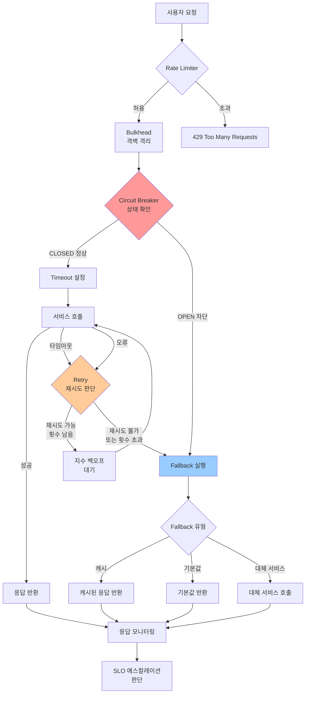
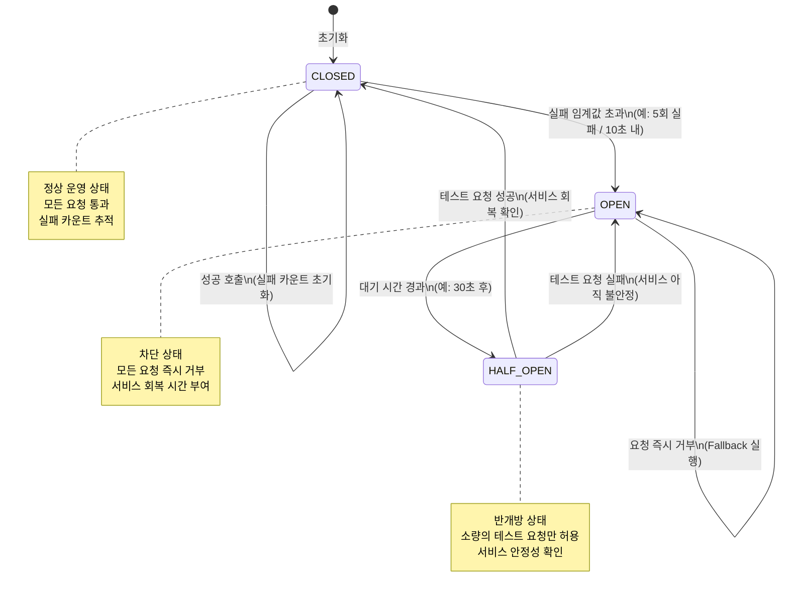

# 내결함성 패턴 심화 — Bulkhead, Retry, Timeout, Fallback, Circuit Breaker

> 대상 독자: 백엔드 개발자 (초급~중급)
> 관련 요구사항: NFR-2 (가용성 99.9%), CSAP D-11 (연속성 관리)
> 관련 서비스: platform/services/ai-service, packages/slo-escalation

---

## 목차

1. [내결함성이란 무엇인가?](#1-내결함성이란-무엇인가)
2. [Bulkhead 패턴 — 격벽으로 장애 격리](#2-bulkhead-패턴--격벽으로-장애-격리)
3. [Retry 패턴 — 지능적인 재시도](#3-retry-패턴--지능적인-재시도)
4. [Timeout 패턴 — 기다림에도 한계를](#4-timeout-패턴--기다림에도-한계를)
5. [Fallback 패턴 — 대안 경로 준비](#5-fallback-패턴--대안-경로-준비)
6. [Circuit Breaker 심화 — 차단기의 세 가지 상태](#6-circuit-breaker-심화--차단기의-세-가지-상태)
7. [패턴 조합 전략 — 실전 레시피](#7-패턴-조합-전략--실전-레시피)
8. [공공기관 SaaS에서 내결함성 — CSAP D-11](#8-공공기관-saas에서-내결함성--csap-d-11)
9. [실습: AI Service 내결함성 패턴 적용](#9-실습-ai-service-내결함성-패턴-적용)

---

## 1. 내결함성이란 무엇인가?

### 1.1 장애는 반드시 발생한다

소프트웨어 시스템은 완벽하지 않습니다. 네트워크는 끊어지고, 데이터베이스는 과부하가 걸리며, 외부 API는 응답을 멈춥니다. 특히 공공기관 SaaS 플랫폼처럼 17개 마이크로서비스가 서로 통신하는 환경에서는 한 서비스의 장애가 연쇄적으로 전파될 수 있습니다.

**내결함성(Fault Tolerance)**이란 장애가 발생하더라도 시스템이 허용 가능한 수준의 서비스를 계속 제공할 수 있는 능력입니다. 이것은 장애를 막는 것이 아니라, 장애가 발생했을 때 그 영향을 최소화하는 능력입니다.

### 1.2 장애 전파 시나리오

다음 시나리오를 생각해 보십시오.

```
민원인 요청
    ↓
포털 서비스 (Next.js)
    ↓
AI 서비스 (LLM 호출 — 응답 없음 20초 대기)
    ↓
모든 스레드가 AI 서비스 응답 대기로 점유됨
    ↓
포털 서비스 응답 불가 (다른 사용자도 영향)
    ↓
전체 시스템 장애 (Cascading Failure)
```

하나의 AI 서비스 지연이 포털 전체를 마비시킵니다. 이것이 내결함성 패턴이 필요한 이유입니다.

### 1.3 내결함성 패턴 전체 구조



이 다이어그램은 요청이 들어왔을 때 각 내결함성 패턴이 어떤 순서로 작동하는지 보여줍니다. 각 패턴은 독립적으로 존재하지 않고 계층을 이루어 서로를 보완합니다.

### 1.4 왜 공공기관 SaaS에서 더 중요한가?

공공기관 시스템은 일반 상업용 SaaS와 다른 특성을 갖습니다.

| 특성 | 일반 SaaS | 공공기관 SaaS |
|------|----------|--------------|
| 사용자 패턴 | 분산된 접속 | 민원 처리 시간대 집중 접속 |
| 장애 영향 | 비즈니스 손실 | 행정 서비스 중단 (시민 불편) |
| 복구 시간 | 최대한 빨리 | CSAP D-11 기준 RTO 4시간 이내 |
| 감사 요건 | 선택적 | 모든 장애 기록 필수 (CSAP D-06) |

---

## 2. Bulkhead 패턴 — 격벽으로 장애 격리

### 2.1 항구의 격벽에서 배운 교훈

Bulkhead는 배의 격벽(隔壁)에서 이름을 따왔습니다. 선박은 선체를 여러 개의 격실로 나누어, 한 격실에 물이 차더라도 다른 격실로 물이 넘어가지 않도록 설계합니다. 소프트웨어에서도 마찬가지입니다. 한 서비스의 자원 소진이 다른 서비스에 영향을 주지 않도록 자원을 격리합니다.

### 2.2 쓰레드 풀 격벽 vs 세마포어 격벽

**쓰레드 풀 격벽 (Thread Pool Bulkhead)**

각 외부 서비스 호출에 별도의 쓰레드 풀을 할당합니다.

```typescript
// Design Ref: §2 — Bulkhead 패턴 (쓰레드 풀 격벽)
// Plan SC: NFR-2 (가용성 99.9%)

import { Worker, isMainThread, parentPort, workerData } from 'worker_threads';
import { EventEmitter } from 'events';

class ThreadPoolBulkhead {
  private readonly maxConcurrent: number;
  private readonly queueSize: number;
  private activeCount = 0;
  private readonly queue: Array<() => void> = [];

  constructor(config: { maxConcurrent: number; queueSize: number }) {
    this.maxConcurrent = config.maxConcurrent;
    this.queueSize = config.queueSize;
  }

  /**
   * 격벽 내에서 작업 실행
   * maxConcurrent를 초과하면 큐에 대기
   * queueSize를 초과하면 즉시 거부
   */
  async execute<T>(task: () => Promise<T>): Promise<T> {
    if (this.activeCount >= this.maxConcurrent) {
      if (this.queue.length >= this.queueSize) {
        // 격벽 한계 초과: 즉시 거부 (다른 서비스 보호)
        throw new BulkheadRejectedError(
          `격벽 용량 초과: 동시 실행 ${this.maxConcurrent}, 대기 큐 ${this.queueSize}`
        );
      }

      // 큐에 추가하고 실행 기회 대기
      await new Promise<void>((resolve) => {
        this.queue.push(resolve);
      });
    }

    this.activeCount++;
    try {
      return await task();
    } finally {
      this.activeCount--;
      // 다음 대기 작업 실행
      const next = this.queue.shift();
      if (next) next();
    }
  }

  getStats() {
    return {
      active: this.activeCount,
      queued: this.queue.length,
      available: this.maxConcurrent - this.activeCount,
    };
  }
}

class BulkheadRejectedError extends Error {
  constructor(message: string) {
    super(message);
    this.name = 'BulkheadRejectedError';
  }
}
```

**세마포어 격벽 (Semaphore Bulkhead)**

세마포어를 사용한 더 가벼운 구현입니다. 동일한 쓰레드에서 동시성을 제한합니다.

```typescript
// Design Ref: §2 — 세마포어 격벽 (비동기 환경 최적)
class SemaphoreBulkhead {
  private permits: number;
  private readonly maxPermits: number;
  private readonly waiters: Array<() => void> = [];

  constructor(maxPermits: number) {
    this.permits = maxPermits;
    this.maxPermits = maxPermits;
  }

  async acquire(): Promise<() => void> {
    if (this.permits > 0) {
      this.permits--;
      return this.createRelease();
    }

    // 허가 없음: 대기
    await new Promise<void>((resolve) => {
      this.waiters.push(resolve);
    });

    return this.createRelease();
  }

  private createRelease(): () => void {
    let released = false;
    return () => {
      if (released) return;
      released = true;

      const next = this.waiters.shift();
      if (next) {
        next();
      } else {
        this.permits++;
      }
    };
  }
}
```

### 2.3 서비스별 연결 풀 분리

실제 AI 서비스에서는 각 외부 의존성(LLM 제공자, 벡터 DB, 관계형 DB)에 별도의 격벽을 적용합니다.

```typescript
// Design Ref: AI Service 격벽 구성
// 실제 코드 기반: platform/services/ai-service/src/routes.ts
// createRateLimiter는 격벽과 유사한 역할 수행

// AI 서비스의 Rate Limiter (격벽 역할)
// 각 작업 유형별로 독립적인 처리량 제한 적용
const bulkheads = {
  // 읽기 작업: 높은 처리량 허용
  read: new SemaphoreBulkhead(100),
  // 채팅: LLM 호출 — 응답 시간이 길어 낮게 설정
  chat: new SemaphoreBulkhead(10),
  // 에이전트: 비용이 높고 오래 걸림 — 가장 낮게 설정
  agent: new SemaphoreBulkhead(5),
  // RAG 쿼리: 벡터 검색 + LLM 호출
  rag: new SemaphoreBulkhead(20),
  // 임베딩: 비교적 빠름
  embed: new SemaphoreBulkhead(30),
};

// 격벽 사용 예시
async function handleAgentRequest(request: AgentRequest) {
  const release = await bulkheads.agent.acquire();
  try {
    return await executeAgent(request);
  } finally {
    release(); // 반드시 해제 (finally 블록)
  }
}
```

### 2.4 Bulkhead 패턴의 효과

격벽 없이 에이전트 요청이 폭주하면, 일반 채팅 요청도 처리 불가 상태가 됩니다. 격벽을 적용하면 에이전트 격벽이 포화되더라도 채팅 격벽은 독립적으로 작동합니다.

| 상태 | 격벽 없음 | 격벽 있음 |
|------|---------|---------|
| 에이전트 폭주 시 채팅 응답 | 지연/실패 | 정상 |
| RAG 과부하 시 임베딩 | 지연/실패 | 정상 |
| 장애 격리 | 불가 | 서비스별 격리 |

---

## 3. Retry 패턴 — 지능적인 재시도

### 3.1 무조건 재시도는 위험하다

네트워크 순간 오류나 일시적 과부하는 잠시 후 재시도하면 성공할 가능성이 높습니다. 그러나 무조건 재시도는 오히려 서버 부하를 가중시킵니다. 지능적인 재시도 전략이 필요합니다.

### 3.2 지수 백오프 (Exponential Backoff)

재시도 간격을 지수적으로 증가시켜 서버에 가해지는 부하를 분산시킵니다.

```typescript
// Design Ref: §3 — 지수 백오프 재시도 패턴
// Plan SC: NFR-2

interface RetryConfig {
  maxAttempts: number;       // 최대 시도 횟수
  initialDelayMs: number;    // 첫 재시도 대기 시간 (ms)
  maxDelayMs: number;        // 최대 대기 시간 (ms)
  multiplier: number;        // 배수 (보통 2)
  jitterFactor: number;      // 지터 비율 (0~1)
  retryableErrors: string[]; // 재시도 가능한 오류 코드
}

const DEFAULT_RETRY_CONFIG: RetryConfig = {
  maxAttempts: 3,
  initialDelayMs: 100,
  maxDelayMs: 10000,
  multiplier: 2,
  jitterFactor: 0.3,
  retryableErrors: ['NETWORK_ERROR', 'TIMEOUT', 'SERVICE_UNAVAILABLE', '503', '502'],
};

class RetryExecutor {
  constructor(private readonly config: RetryConfig = DEFAULT_RETRY_CONFIG) {}

  async execute<T>(operation: () => Promise<T>, operationName: string): Promise<T> {
    let lastError: Error | undefined;

    for (let attempt = 1; attempt <= this.config.maxAttempts; attempt++) {
      try {
        const result = await operation();

        if (attempt > 1) {
          // 재시도 후 성공 — 로그 기록
          process.stdout.write(JSON.stringify({
            level: 'info',
            component: 'retry-executor',
            operation: operationName,
            attempt,
            message: '재시도 성공',
            ts: new Date().toISOString(),
          }) + '\n');
        }

        return result;
      } catch (error) {
        lastError = error as Error;

        if (!this.isRetryable(error as Error)) {
          // 재시도 불가 오류: 즉시 실패
          throw error;
        }

        if (attempt === this.config.maxAttempts) {
          // 최대 시도 횟수 초과
          break;
        }

        // 대기 후 재시도
        const delay = this.calculateDelay(attempt);
        process.stderr.write(JSON.stringify({
          level: 'warn',
          component: 'retry-executor',
          operation: operationName,
          attempt,
          nextAttempt: attempt + 1,
          delayMs: delay,
          error: lastError.message,
          ts: new Date().toISOString(),
        }) + '\n');

        await this.sleep(delay);
      }
    }

    throw new RetryExhaustedError(
      `${operationName}: ${this.config.maxAttempts}회 재시도 후 실패`,
      lastError
    );
  }

  /**
   * 지수 백오프 + Jitter 계산
   *
   * delay = min(initialDelay * multiplier^(attempt-1), maxDelay)
   * jitter = delay * jitterFactor * random(-1, 1)
   * finalDelay = delay + jitter
   *
   * Jitter를 추가하는 이유: 동시에 여러 클라이언트가 재시도할 때
   * 같은 시점에 집중되는 "재시도 폭풍(Retry Storm)"을 방지
   */
  private calculateDelay(attempt: number): number {
    const exponentialDelay = Math.min(
      this.config.initialDelayMs * Math.pow(this.config.multiplier, attempt - 1),
      this.config.maxDelayMs
    );

    // 대칭적 Jitter: -jitterFactor ~ +jitterFactor 범위
    const jitter = exponentialDelay * this.config.jitterFactor * (Math.random() * 2 - 1);

    return Math.max(0, Math.round(exponentialDelay + jitter));
  }

  private isRetryable(error: Error): boolean {
    // 오류 코드나 메시지에서 재시도 가능 여부 판단
    const errorCode = (error as { code?: string }).code ?? '';
    const errorMessage = error.message ?? '';

    return this.config.retryableErrors.some((retryable) =>
      errorCode.includes(retryable) || errorMessage.includes(retryable)
    );
  }

  private sleep(ms: number): Promise<void> {
    return new Promise((resolve) => setTimeout(resolve, ms));
  }
}

class RetryExhaustedError extends Error {
  constructor(message: string, public readonly cause?: Error) {
    super(message);
    this.name = 'RetryExhaustedError';
  }
}
```

### 3.3 재시도 가능/불가 오류 분류

모든 오류를 재시도해서는 안 됩니다. 재시도 가능한 오류와 그렇지 않은 오류를 명확히 구분해야 합니다.

```typescript
// Design Ref: §3 — 오류 분류 기준

// 재시도 가능한 오류 (일시적 오류)
const RETRYABLE_HTTP_CODES = [
  429, // Too Many Requests (Rate Limit — 백오프 후 재시도)
  500, // Internal Server Error (일시적 서버 오류)
  502, // Bad Gateway (게이트웨이 문제)
  503, // Service Unavailable (서비스 일시 중단)
  504, // Gateway Timeout (타임아웃)
];

// 재시도 불가 오류 (영구적 오류)
const NON_RETRYABLE_HTTP_CODES = [
  400, // Bad Request (잘못된 요청 — 재시도해도 실패)
  401, // Unauthorized (인증 실패 — 토큰 갱신 필요)
  403, // Forbidden (권한 없음 — 재시도 의미 없음)
  404, // Not Found (존재하지 않음)
  422, // Unprocessable Entity (검증 실패)
];

// N2SF 데이터 등급 위반: 절대 재시도 금지
// C/S 등급 데이터가 O 등급 채널로 전송 시도된 경우
class DataGradeViolationError extends Error {
  constructor(public readonly grade: 'C' | 'S') {
    super(`N2SF 위반: ${grade}등급 데이터는 AI API 전송 금지`);
    this.name = 'DataGradeViolationError';
  }
}
```

### 3.4 AI 서비스에서의 재시도 전략

```typescript
// Design Ref: AI Service LLM 호출 재시도
// 실제 코드 기반: platform/services/ai-service/src/lib/rag-engine.ts

const llmRetryConfig: RetryConfig = {
  maxAttempts: 3,
  initialDelayMs: 500,   // LLM은 응답이 느리므로 첫 재시도도 500ms 대기
  maxDelayMs: 30000,     // 최대 30초 (LLM cold start 고려)
  multiplier: 2,
  jitterFactor: 0.4,     // 여러 사용자가 동시에 재시도하는 경우 분산
  retryableErrors: [
    'ECONNREFUSED',  // LLM 서버 연결 거부
    'ECONNRESET',    // 연결 초기화
    'ETIMEDOUT',     // 타임아웃
    '502',           // LLM 프록시 오류
    '503',           // 서비스 일시 중단
    'model_loading', // 모델 로딩 중 (Ollama 특유 오류)
  ],
};

const llmRetry = new RetryExecutor(llmRetryConfig);

// RAG 엔진에서 LLM 호출 시 재시도 적용
async function callLLMWithRetry(messages: LLMMessage[]): Promise<LLMResponse> {
  return llmRetry.execute(
    async () => {
      const provider = await createLLMProvider(getLLMConfig());
      return provider.chat(messages, { maxTokens: 2048 });
    },
    'llm-chat'
  );
}
```

---

## 4. Timeout 패턴 — 기다림에도 한계를

### 4.1 무한 대기는 자원 낭비

서비스가 응답하지 않을 때 무한정 기다리면 연결이 쌓여 결국 모든 자원을 소진합니다. 적절한 타임아웃 설정이 시스템의 건강을 지킵니다.

### 4.2 타임아웃의 세 가지 종류

```typescript
// Design Ref: §4 — 타임아웃 계층 구조

interface TimeoutConfig {
  /** 연결 타임아웃: TCP 연결 수립까지의 최대 시간 */
  connectTimeoutMs: number;
  /** 읽기 타임아웃: 응답 데이터를 기다리는 최대 시간 */
  readTimeoutMs: number;
  /** 전체 요청 타임아웃: 연결 + 전송 + 읽기 전체 */
  totalTimeoutMs: number;
}

class TimeoutExecutor {
  constructor(private readonly config: TimeoutConfig) {}

  async executeWithTimeout<T>(
    operation: (signal: AbortSignal) => Promise<T>,
    operationName: string
  ): Promise<T> {
    const controller = new AbortController();
    const { signal } = controller;

    // 전체 타임아웃 설정
    const timeoutId = setTimeout(() => {
      controller.abort(
        new TimeoutError(`${operationName} 타임아웃: ${this.config.totalTimeoutMs}ms 초과`)
      );
    }, this.config.totalTimeoutMs);

    try {
      return await operation(signal);
    } catch (error) {
      if ((error as { name?: string }).name === 'AbortError') {
        throw new TimeoutError(`${operationName} 취소됨`);
      }
      throw error;
    } finally {
      clearTimeout(timeoutId);
    }
  }
}

class TimeoutError extends Error {
  constructor(message: string) {
    super(message);
    this.name = 'TimeoutError';
  }
}
```

### 4.3 계층별 타임아웃 설정

서비스마다, 작업마다 적절한 타임아웃이 다릅니다.

```typescript
// Design Ref: §4 — 계층별 타임아웃 설정표
// 실제 AI 서비스 운영 경험 기반

const TIMEOUT_PROFILES = {
  // 데이터베이스 쿼리 (Prisma)
  database: {
    connectTimeoutMs: 5000,    // DB 연결: 5초
    readTimeoutMs: 10000,      // 단순 쿼리: 10초
    totalTimeoutMs: 30000,     // 복잡한 집계: 30초
  },

  // Redis 캐시
  redis: {
    connectTimeoutMs: 2000,
    readTimeoutMs: 3000,
    totalTimeoutMs: 5000,      // 캐시는 빨라야 함
  },

  // LLM API 호출 (OpenAI 호환)
  llm: {
    connectTimeoutMs: 10000,   // LLM 서버 응답까지: 10초
    readTimeoutMs: 120000,     // 긴 응답 생성: 최대 2분
    totalTimeoutMs: 180000,    // 전체: 3분 (streaming 고려)
  },

  // 임베딩 생성 (비교적 빠름)
  embedding: {
    connectTimeoutMs: 5000,
    readTimeoutMs: 30000,
    totalTimeoutMs: 60000,
  },

  // AI 에이전트 (여러 단계 실행)
  agent: {
    connectTimeoutMs: 10000,
    readTimeoutMs: 300000,     // 에이전트 단계별: 최대 5분
    totalTimeoutMs: 600000,    // 전체 에이전트: 최대 10분
  },

  // 서비스 간 내부 HTTP 호출
  internalHttp: {
    connectTimeoutMs: 3000,
    readTimeoutMs: 15000,
    totalTimeoutMs: 30000,
  },
} as const;
```

### 4.4 타임아웃과 SLO의 관계

SLO(Service Level Objective)와 타임아웃은 밀접하게 연관됩니다.

```typescript
// Design Ref: §4 — SLO 기반 타임아웃 계산
// 실제 코드 기반: packages/slo-escalation/src/escalation-controller.ts

// SLO: AI 채팅 응답 p95 < 5초
// 타임아웃 설정 원칙: SLO p99 * 1.5 = 타임아웃
// p99 = 10초 → 타임아웃 = 15초

// 타임아웃 발생 시 SLO 에러 버짓 소진
function calculateBudgetBurn(timeouts: number, totalRequests: number): number {
  const timeoutRate = timeouts / totalRequests;
  // 타임아웃이 SLO 허용 오류율의 몇 배를 소진하는지 계산
  const sloErrorBudget = 0.001; // SLO 99.9% → 0.1% 허용 오류율
  return (timeoutRate / sloErrorBudget) * 100; // 에러 버짓 소진율 (%)
}
```

---

## 5. Fallback 패턴 — 대안 경로 준비

### 5.1 우아한 성능 저하 (Graceful Degradation)

완전한 실패보다는 부분적 서비스가 낫습니다. Fallback 패턴은 주요 서비스가 실패했을 때 대안 경로를 제공합니다.

### 5.2 Fallback 유형 세 가지

**1. 캐시 Fallback**

```typescript
// Design Ref: §5 — 캐시 Fallback 패턴

class CacheFallbackExecutor<T> {
  private cache: Map<string, { value: T; timestamp: number; ttl: number }> = new Map();

  async executeWithCacheFallback(
    cacheKey: string,
    operation: () => Promise<T>,
    cacheTtlMs = 300000 // 기본 5분 캐시
  ): Promise<{ data: T; fromCache: boolean }> {
    try {
      const result = await operation();

      // 성공 시 캐시 업데이트
      this.cache.set(cacheKey, {
        value: result,
        timestamp: Date.now(),
        ttl: cacheTtlMs,
      });

      return { data: result, fromCache: false };
    } catch (error) {
      // 실패 시 캐시에서 응답
      const cached = this.cache.get(cacheKey);
      if (cached && Date.now() - cached.timestamp < cached.ttl) {
        process.stderr.write(JSON.stringify({
          level: 'warn',
          component: 'cache-fallback',
          cacheKey,
          message: '캐시 Fallback 사용',
          cacheAge: Date.now() - cached.timestamp,
          ts: new Date().toISOString(),
        }) + '\n');
        return { data: cached.value, fromCache: true };
      }

      throw error; // 캐시도 없으면 상위로 전파
    }
  }
}
```

**2. 기본값 Fallback**

```typescript
// Design Ref: §5 — 기본값 Fallback 패턴

class DefaultValueFallback<T> {
  constructor(private readonly defaultValue: T) {}

  async executeWithDefault(
    operation: () => Promise<T>,
    onFallback?: (error: Error) => void
  ): Promise<T> {
    try {
      return await operation();
    } catch (error) {
      onFallback?.(error as Error);

      process.stderr.write(JSON.stringify({
        level: 'warn',
        component: 'default-fallback',
        message: '기본값 Fallback 사용',
        error: (error as Error).message,
        ts: new Date().toISOString(),
      }) + '\n');

      return this.defaultValue;
    }
  }
}

// AI 응답 기본값 Fallback 예시
// Feature Flag SDK의 Fallback 방식과 동일한 패턴
// 실제 코드: packages/feature-flag-sdk/src/index.ts 참조
const featureFlagFallback = new DefaultValueFallback<boolean>(false);

async function isFeatureEnabled(flagName: string): Promise<boolean> {
  return featureFlagFallback.executeWithDefault(
    async () => {
      const client = createFeatureFlagClient();
      return client.isEnabled(flagName);
    },
    (error) => {
      // 감사 로그 기록
      logFallbackEvent('feature-flag', flagName, error.message);
    }
  );
}
```

**3. 서비스 Fallback (대체 서비스 호출)**

```typescript
// Design Ref: §5 — 서비스 Fallback 패턴
// 주요 LLM → 대체 LLM 폴백 예시

interface FallbackChain<T> {
  primary: () => Promise<T>;
  fallbacks: Array<{
    name: string;
    execute: () => Promise<T>;
  }>;
}

async function executeWithFallbackChain<T>(chain: FallbackChain<T>): Promise<T> {
  try {
    return await chain.primary();
  } catch (primaryError) {
    for (const fallback of chain.fallbacks) {
      try {
        process.stderr.write(JSON.stringify({
          level: 'warn',
          component: 'fallback-chain',
          fallbackName: fallback.name,
          primaryError: (primaryError as Error).message,
          ts: new Date().toISOString(),
        }) + '\n');

        return await fallback.execute();
      } catch (fallbackError) {
        // 이 Fallback도 실패, 다음 시도
        continue;
      }
    }

    // 모든 Fallback 실패
    throw new Error('모든 Fallback 경로 실패: 서비스 완전 불가');
  }
}

// AI 서비스 LLM Fallback 체인
// 실제 코드 기반: platform/services/ai-service/src/routes.ts
// provider: lmstudio | openai | ollama | vllm
const llmFallbackChain: FallbackChain<string> = {
  primary: () => callLLM('lmstudio', 'qwen3-14b', message),
  fallbacks: [
    {
      name: 'ollama-fallback',
      execute: () => callLLM('ollama', 'llama3.2', message),
    },
    {
      name: 'static-response-fallback',
      execute: async () => '죄송합니다. AI 서비스가 일시적으로 점검 중입니다. 잠시 후 다시 시도해 주십시오.',
    },
  ],
};
```

---

## 6. Circuit Breaker 심화 — 차단기의 세 가지 상태

### 6.1 전기 차단기에서 배운 교훈

전기 차단기(Circuit Breaker)는 전류가 과도하게 흐를 때 자동으로 회로를 차단합니다. 소프트웨어 Circuit Breaker도 마찬가지입니다. 외부 서비스 호출이 반복적으로 실패하면 자동으로 호출을 차단하고, 서비스가 회복되면 다시 허용합니다.

### 6.2 Circuit Breaker 상태 전이도



### 6.3 완전한 Circuit Breaker 구현

```typescript
// Design Ref: §6 — Circuit Breaker 완전 구현
// Plan SC: NFR-2 (가용성), CSAP D-11 (연속성)

enum CircuitBreakerState {
  CLOSED = 'CLOSED',       // 정상 운영
  OPEN = 'OPEN',           // 차단
  HALF_OPEN = 'HALF_OPEN', // 반개방 (테스트)
}

interface CircuitBreakerConfig {
  failureThreshold: number;     // CLOSED → OPEN 전환 실패 횟수
  successThreshold: number;     // HALF_OPEN → CLOSED 전환 성공 횟수
  timeout: number;              // OPEN → HALF_OPEN 대기 시간 (ms)
  volumeThreshold: number;      // 최소 호출 횟수 (통계 유효성)
  windowDurationMs: number;     // 슬라이딩 윈도우 기간 (ms)
  halfOpenMaxConcurrent: number; // HALF_OPEN 상태 최대 동시 요청
}

interface CircuitBreakerMetrics {
  totalCalls: number;
  successCalls: number;
  failureCalls: number;
  rejectedCalls: number;
  lastFailureTime?: number;
  lastStateChangeTime: number;
}

class CircuitBreaker {
  private state = CircuitBreakerState.CLOSED;
  private failureCount = 0;
  private successCount = 0;
  private halfOpenConcurrent = 0;
  private nextAttemptTime = 0;
  private readonly callTimes: number[] = [];
  private readonly metrics: CircuitBreakerMetrics;

  constructor(
    private readonly name: string,
    private readonly config: CircuitBreakerConfig
  ) {
    this.metrics = {
      totalCalls: 0,
      successCalls: 0,
      failureCalls: 0,
      rejectedCalls: 0,
      lastStateChangeTime: Date.now(),
    };
  }

  async execute<T>(operation: () => Promise<T>): Promise<T> {
    this.metrics.totalCalls++;

    // 현재 상태에 따른 처리
    switch (this.state) {
      case CircuitBreakerState.OPEN:
        return this.handleOpenState<T>();

      case CircuitBreakerState.HALF_OPEN:
        return this.handleHalfOpenState(operation);

      case CircuitBreakerState.CLOSED:
        return this.handleClosedState(operation);
    }
  }

  private handleOpenState<T>(): T {
    // OPEN 상태: 대기 시간 경과 확인
    if (Date.now() >= this.nextAttemptTime) {
      this.transitionTo(CircuitBreakerState.HALF_OPEN);
      // 재귀 호출로 HALF_OPEN 처리
      return this.execute<T>(() => Promise.reject(new Error('placeholder'))) as unknown as T;
    }

    // 아직 대기 중: 즉시 거부
    this.metrics.rejectedCalls++;
    throw new CircuitBreakerOpenError(
      `Circuit Breaker OPEN: ${this.name} (${Math.ceil((this.nextAttemptTime - Date.now()) / 1000)}초 후 재시도)`
    );
  }

  private async handleHalfOpenState<T>(operation: () => Promise<T>): Promise<T> {
    // HALF_OPEN: 동시 요청 제한
    if (this.halfOpenConcurrent >= this.config.halfOpenMaxConcurrent) {
      this.metrics.rejectedCalls++;
      throw new CircuitBreakerOpenError(
        `Circuit Breaker HALF_OPEN: ${this.name} 테스트 중`
      );
    }

    this.halfOpenConcurrent++;
    try {
      const result = await operation();
      this.onSuccess();
      return result;
    } catch (error) {
      this.onFailure();
      throw error;
    } finally {
      this.halfOpenConcurrent--;
    }
  }

  private async handleClosedState<T>(operation: () => Promise<T>): Promise<T> {
    try {
      const result = await operation();
      this.onSuccess();
      return result;
    } catch (error) {
      this.onFailure();
      throw error;
    }
  }

  private onSuccess(): void {
    this.metrics.successCalls++;
    this.cleanOldCalls();

    if (this.state === CircuitBreakerState.HALF_OPEN) {
      this.successCount++;
      if (this.successCount >= this.config.successThreshold) {
        this.transitionTo(CircuitBreakerState.CLOSED);
      }
    } else {
      // CLOSED 상태에서는 실패 카운트 초기화
      this.failureCount = 0;
    }
  }

  private onFailure(): void {
    this.metrics.failureCalls++;
    this.metrics.lastFailureTime = Date.now();
    this.callTimes.push(Date.now());
    this.cleanOldCalls();

    if (this.state === CircuitBreakerState.HALF_OPEN) {
      // HALF_OPEN에서 실패: 즉시 OPEN으로 복귀
      this.transitionTo(CircuitBreakerState.OPEN);
      return;
    }

    this.failureCount++;

    // 볼륨 임계값 + 실패 임계값 모두 충족 시 OPEN
    if (
      this.callTimes.length >= this.config.volumeThreshold &&
      this.failureCount >= this.config.failureThreshold
    ) {
      this.transitionTo(CircuitBreakerState.OPEN);
    }
  }

  private transitionTo(newState: CircuitBreakerState): void {
    const prevState = this.state;
    this.state = newState;
    this.metrics.lastStateChangeTime = Date.now();

    if (newState === CircuitBreakerState.OPEN) {
      this.nextAttemptTime = Date.now() + this.config.timeout;
      this.failureCount = 0;
    } else if (newState === CircuitBreakerState.CLOSED) {
      this.failureCount = 0;
      this.successCount = 0;
    } else if (newState === CircuitBreakerState.HALF_OPEN) {
      this.successCount = 0;
    }

    // 상태 변경 로깅 (CSAP D-06 감사)
    process.stdout.write(JSON.stringify({
      level: 'info',
      component: 'circuit-breaker',
      name: this.name,
      from: prevState,
      to: newState,
      metrics: this.getMetrics(),
      ts: new Date().toISOString(),
    }) + '\n');
  }

  private cleanOldCalls(): void {
    const cutoff = Date.now() - this.config.windowDurationMs;
    const firstValid = this.callTimes.findIndex((t) => t >= cutoff);
    if (firstValid > 0) {
      this.callTimes.splice(0, firstValid);
    }
  }

  getState(): CircuitBreakerState {
    return this.state;
  }

  getMetrics(): CircuitBreakerMetrics {
    return { ...this.metrics };
  }

  reset(): void {
    this.transitionTo(CircuitBreakerState.CLOSED);
    this.callTimes.length = 0;
  }
}

class CircuitBreakerOpenError extends Error {
  constructor(message: string) {
    super(message);
    this.name = 'CircuitBreakerOpenError';
  }
}
```

### 6.4 Circuit Breaker 레지스트리

여러 Circuit Breaker를 중앙에서 관리합니다.

```typescript
// Design Ref: §6 — Circuit Breaker 레지스트리

class CircuitBreakerRegistry {
  private readonly breakers = new Map<string, CircuitBreaker>();

  register(name: string, config: CircuitBreakerConfig): CircuitBreaker {
    const breaker = new CircuitBreaker(name, config);
    this.breakers.set(name, breaker);
    return breaker;
  }

  get(name: string): CircuitBreaker | undefined {
    return this.breakers.get(name);
  }

  getAll(): Record<string, { state: CircuitBreakerState; metrics: CircuitBreakerMetrics }> {
    const result: Record<string, { state: CircuitBreakerState; metrics: CircuitBreakerMetrics }> = {};
    for (const [name, breaker] of this.breakers) {
      result[name] = {
        state: breaker.getState(),
        metrics: breaker.getMetrics(),
      };
    }
    return result;
  }
}

// AI 서비스 Circuit Breaker 설정
// 실제 코드 기반: platform/services/ai-service/src/routes.ts
const cbRegistry = new CircuitBreakerRegistry();

const llmCircuitBreaker = cbRegistry.register('llm-provider', {
  failureThreshold: 5,         // 10초 내 5회 실패 시 OPEN
  successThreshold: 2,         // HALF_OPEN에서 2회 성공 시 CLOSED
  timeout: 30000,              // OPEN 유지 30초
  volumeThreshold: 10,         // 최소 10회 호출 후 통계 적용
  windowDurationMs: 10000,     // 10초 슬라이딩 윈도우
  halfOpenMaxConcurrent: 1,    // HALF_OPEN에서 동시 1개만 테스트
});

const vectorDbCircuitBreaker = cbRegistry.register('vector-db', {
  failureThreshold: 3,
  successThreshold: 1,
  timeout: 15000,
  volumeThreshold: 5,
  windowDurationMs: 5000,
  halfOpenMaxConcurrent: 2,
});
```

---

## 7. 패턴 조합 전략 — 실전 레시피

### 7.1 패턴 조합의 원칙

각 패턴은 독립적으로도 유용하지만, 조합했을 때 시너지가 발생합니다. 올바른 순서로 조합하는 것이 중요합니다.

```
외부 요청
    ↓
[1] Rate Limiter + Bulkhead  ← 동시성 제어, 자원 격리
    ↓
[2] Circuit Breaker          ← 장애 감지, 빠른 실패
    ↓
[3] Timeout                  ← 응답 시간 제한
    ↓
[4] Retry (+ Backoff)        ← 일시적 오류 복구
    ↓
[5] Fallback                 ← 최후 방어선
```

### 7.2 AI 서비스 완전체 구현

```typescript
// Design Ref: §7 — 패턴 조합 완전 구현
// 실제 코드 기반: platform/services/ai-service/src/routes.ts + lib/rag-engine.ts

class ResilientAIClient {
  private readonly bulkhead: SemaphoreBulkhead;
  private readonly circuitBreaker: CircuitBreaker;
  private readonly retryExecutor: RetryExecutor;
  private readonly timeoutExecutor: TimeoutExecutor;
  private readonly cacheFallback: CacheFallbackExecutor<string>;

  constructor() {
    // 각 패턴 초기화
    this.bulkhead = new SemaphoreBulkhead(10); // 최대 10개 동시 LLM 호출

    this.circuitBreaker = new CircuitBreaker('ai-llm', {
      failureThreshold: 5,
      successThreshold: 2,
      timeout: 30000,
      volumeThreshold: 10,
      windowDurationMs: 10000,
      halfOpenMaxConcurrent: 1,
    });

    this.retryExecutor = new RetryExecutor({
      maxAttempts: 3,
      initialDelayMs: 500,
      maxDelayMs: 30000,
      multiplier: 2,
      jitterFactor: 0.4,
      retryableErrors: ['ECONNREFUSED', '502', '503', 'model_loading'],
    });

    this.timeoutExecutor = new TimeoutExecutor({
      connectTimeoutMs: 10000,
      readTimeoutMs: 120000,
      totalTimeoutMs: 180000,
    });

    this.cacheFallback = new CacheFallbackExecutor<string>();
  }

  async chat(
    question: string,
    cacheKey: string
  ): Promise<{ answer: string; fromCache: boolean; patternUsed: string[] }> {
    const patternsUsed: string[] = [];

    // 최외부: 캐시 Fallback
    const { data, fromCache } = await this.cacheFallback.executeWithCacheFallback(
      cacheKey,
      async () => {
        patternsUsed.push('cache-check');

        // Bulkhead: 동시성 제어
        const release = await this.bulkhead.acquire();
        patternsUsed.push('bulkhead');

        try {
          // Circuit Breaker: 장애 감지
          return await this.circuitBreaker.execute(async () => {
            patternsUsed.push('circuit-breaker');

            // Retry: 재시도
            return this.retryExecutor.execute(async () => {
              patternsUsed.push('retry');

              // Timeout: 시간 제한
              return this.timeoutExecutor.executeWithTimeout(
                async (signal) => {
                  patternsUsed.push('timeout');
                  return callExternalLLM(question, signal);
                },
                'llm-chat'
              );
            }, 'llm-chat-with-retry');
          });
        } finally {
          release();
        }
      }
    );

    return { answer: data, fromCache, patternUsed: patternsUsed };
  }
}
```

### 7.3 실전 구성 권장 사항

| 서비스 유형 | Bulkhead | Retry | Timeout | Fallback | Circuit Breaker |
|------------|---------|-------|---------|---------|----------------|
| LLM 채팅 | 필수 (10) | 필수 (3회) | 필수 (3분) | 필수 (캐시) | 필수 |
| 벡터 검색 | 필수 (20) | 선택 (2회) | 필수 (30초) | 필수 (기본값) | 필수 |
| 임베딩 생성 | 필수 (30) | 필수 (3회) | 필수 (1분) | 선택 | 필수 |
| 내부 서비스 | 선택 | 선택 (2회) | 필수 (15초) | 선택 | 선택 |
| DB 쿼리 | 선택 | 금지 (멱등성) | 필수 (30초) | 필수 (캐시) | 선택 |

---

## 8. 공공기관 SaaS에서 내결함성 — CSAP D-11

### 8.1 CSAP D-11 업무 연속성 요건

CSAP(클라우드 보안 인증제) D-11 항목은 업무 연속성 및 재해 복구에 관한 요건을 정의합니다.

| CSAP 요건 | 구현 패턴 | 적용 위치 |
|----------|---------|---------|
| D-11-01: 연속성 계획 수립 | Circuit Breaker + Fallback | 모든 외부 의존성 |
| D-11-02: 복구 목표 (RTO/RPO) | Timeout + Retry | 서비스별 SLO 연계 |
| D-11-03: 백업 및 복구 | 캐시 Fallback | Redis 캐시 계층 |
| D-11-04: 비상 운영 절차 | Fallback 체인 | AI 서비스 대체 경로 |

### 8.2 SLO 에스컬레이션과 내결함성 연동

```typescript
// Design Ref: §8 — SLO 에스컬레이션 연동
// 실제 코드 기반: packages/slo-escalation/src/escalation-controller.ts

import { SLOEscalationController, determineEscalationLevel } from '../../packages/slo-escalation/src/escalation-controller';

class ResilientServiceWithSLO {
  private readonly escalationController: SLOEscalationController;
  private failureCount = 0;
  private totalCount = 0;

  constructor() {
    this.escalationController = new SLOEscalationController();

    // SLO 에스컬레이션 정책 등록
    this.escalationController.registerPolicy({
      name: 'ai-service-slo',
      service: 'ai-service',
      levels: [
        {
          level: 'warning' as const,
          budgetBurnRateMin: 51,
          budgetBurnRateMax: 75,
          contacts: [{ name: '개발팀 리더', channel: 'slack' as const, target: '#alerts-warning' }],
          waitMinutes: 15,
          actions: ['notify-oncall'],
        },
        {
          level: 'critical' as const,
          budgetBurnRateMin: 91,
          budgetBurnRateMax: 100,
          contacts: [
            { name: 'CTO', channel: 'slack' as const, target: '#alerts-critical' },
            { name: '시스템 운영팀', channel: 'email' as const, target: 'ops@agency.go.kr' },
          ],
          waitMinutes: 5,
          actions: ['freeze-deployments', 'create-postmortem'],
        },
      ],
    });
  }

  async executeWithSLOTracking<T>(
    operation: () => Promise<T>,
    sloName: string
  ): Promise<T> {
    this.totalCount++;

    try {
      const result = await operation();
      return result;
    } catch (error) {
      this.failureCount++;

      // 에러 버짓 소진율 계산
      const errorRate = this.failureCount / this.totalCount;
      const sloTarget = 0.999; // SLO 99.9%
      const budgetBurnRate = (errorRate / (1 - sloTarget)) * 100;

      // SLO 위반 시 에스컬레이션
      if (budgetBurnRate > 50) {
        await this.escalationController.escalate(
          'ai-service',
          sloName,
          budgetBurnRate,
          100 - budgetBurnRate
        );
      }

      throw error;
    }
  }
}
```

### 8.3 감사 로그 연동 (CSAP D-06)

모든 내결함성 이벤트는 감사 로그에 기록해야 합니다.

```typescript
// Design Ref: §8 — CSAP D-06 감사 로그 연동
// 실제 코드 기반: platform/services/compliance-service/src/lib/audit.ts

async function logResilienceEvent(
  eventType: 'circuit_breaker_open' | 'retry_exhausted' | 'fallback_used' | 'timeout',
  serviceName: string,
  metadata: Record<string, unknown>
): Promise<void> {
  // CSAP D-06: 모든 장애 이벤트 기록 필수
  // 실제로는 createAuditLogger 사용 (audit.ts 패턴)
  process.stdout.write(JSON.stringify({
    level: 'warn',
    component: 'resilience-audit',
    eventType,
    serviceName,
    metadata,
    // 민감 정보 제외 (에러 메시지에서 PII 제거)
    ts: new Date().toISOString(),
  }) + '\n');
}
```

---

## 9. 실습: AI Service 내결함성 패턴 적용

### 9.1 실습 목표

AI 서비스의 RAG 쿼리 엔드포인트에 내결함성 패턴을 단계별로 적용합니다.

실제 코드: `platform/services/ai-service/src/lib/rag-engine.ts`

### 9.2 단계 1 — 현재 코드 분석

```typescript
// 현재 RAG 엔진 구조 (platform/services/ai-service/src/lib/rag-engine.ts)
export async function runRAG(
  tenantId: string,
  question: string,
  queryEmbedding: number[],
  options: RAGOptions = {},
  modelConfig?: { provider: string; endpoint: string; name: string; config?: unknown },
): Promise<RAGResponse> {
  // 1. 시맨틱 검색
  const searchResults = await semanticSearch(queryEmbedding, tenantId, topK, minScore);

  // 2. 컨텍스트 구성
  // ... (생략)

  // 3. LLM 생성
  const provider = await createLLMProvider(llmConfig);
  const llmResponse = await provider.chat(messages, { maxTokens: 2048 });

  // 현재 문제점:
  // - semanticSearch 실패 시 전체 요청 실패
  // - LLM 호출 타임아웃 없음
  // - 재시도 로직 없음
  // - Circuit Breaker 없음
}
```

### 9.3 단계 2 — 내결함성 패턴 적용

```typescript
// 내결함성 패턴 적용 후 RAG 엔진
// Design Ref: §9 실습

const ragBulkhead = new SemaphoreBulkhead(20);
const llmBreaker = cbRegistry.register('rag-llm', {
  failureThreshold: 5,
  successThreshold: 2,
  timeout: 30000,
  volumeThreshold: 10,
  windowDurationMs: 10000,
  halfOpenMaxConcurrent: 1,
});
const llmRetry = new RetryExecutor({
  maxAttempts: 3,
  initialDelayMs: 500,
  maxDelayMs: 30000,
  multiplier: 2,
  jitterFactor: 0.4,
  retryableErrors: ['ECONNREFUSED', '503', 'model_loading'],
});
const ragCache = new CacheFallbackExecutor<RAGResponse>();

export async function runRAGResilient(
  tenantId: string,
  question: string,
  queryEmbedding: number[],
  options: RAGOptions = {},
  modelConfig?: { provider: string; endpoint: string; name: string; config?: unknown },
): Promise<RAGResponse & { fromCache?: boolean }> {
  const cacheKey = `rag:${tenantId}:${hashQuestion(question)}`;

  // [1] 캐시 Fallback
  const { data, fromCache } = await ragCache.executeWithCacheFallback(
    cacheKey,
    async () => {
      // [2] Bulkhead
      const release = await ragBulkhead.acquire();
      try {
        // [3] Timeout
        return await new TimeoutExecutor(TIMEOUT_PROFILES.llm)
          .executeWithTimeout(async () => {
            // [4] Retry
            return llmRetry.execute(async () => {
              // [5] Circuit Breaker
              return llmBreaker.execute(async () => {
                // 실제 RAG 실행
                return runRAG(tenantId, question, queryEmbedding, options, modelConfig);
              });
            }, 'rag-query');
          }, 'rag-with-timeout');
      } finally {
        release();
      }
    },
    60000 // 1분 캐시
  );

  return { ...data, fromCache };
}

function hashQuestion(question: string): string {
  // 간단한 해시 (실제로는 crypto 사용)
  return Buffer.from(question).toString('base64').slice(0, 16);
}
```

### 9.4 단계 3 — 헬스 엔드포인트 추가

```typescript
// Design Ref: §9 — Circuit Breaker 상태 노출
// platform/services/ai-service/src/routes.ts 패턴 기반

app.get('/health/circuit-breakers', async (req, reply) => {
  const states = cbRegistry.getAll();

  const isHealthy = Object.values(states).every(
    (s) => s.state !== CircuitBreakerState.OPEN
  );

  return reply.status(isHealthy ? 200 : 503).send({
    status: isHealthy ? 'healthy' : 'degraded',
    circuitBreakers: states,
    timestamp: new Date().toISOString(),
  });
});
```

### 9.5 테스트 코드

```typescript
// Design Ref: §9 — 내결함성 패턴 테스트

describe('ResilientAIClient', () => {
  it('Circuit Breaker: 5회 실패 시 OPEN 전환', async () => {
    const breaker = new CircuitBreaker('test', {
      failureThreshold: 5,
      successThreshold: 2,
      timeout: 1000,
      volumeThreshold: 5,
      windowDurationMs: 10000,
      halfOpenMaxConcurrent: 1,
    });

    const failingOp = () => Promise.reject(new Error('서비스 오류'));

    // 5회 실패
    for (let i = 0; i < 5; i++) {
      await expect(breaker.execute(failingOp)).rejects.toThrow();
    }

    // 6번째 요청: Circuit Breaker OPEN
    expect(breaker.getState()).toBe(CircuitBreakerState.OPEN);
    await expect(breaker.execute(failingOp)).rejects.toThrow(CircuitBreakerOpenError);
  });

  it('Retry: 2회 실패 후 3회 성공', async () => {
    let attempts = 0;
    const flakyOperation = async () => {
      attempts++;
      if (attempts < 3) throw new Error('503 Service Unavailable');
      return '성공';
    };

    const retry = new RetryExecutor({
      maxAttempts: 3,
      initialDelayMs: 10,  // 테스트용 짧은 딜레이
      maxDelayMs: 100,
      multiplier: 2,
      jitterFactor: 0,
      retryableErrors: ['503'],
    });

    const result = await retry.execute(flakyOperation, 'test-operation');
    expect(result).toBe('성공');
    expect(attempts).toBe(3);
  });

  it('Bulkhead: 최대 동시 요청 제한', async () => {
    const bulkhead = new SemaphoreBulkhead(2);
    let rejected = false;

    const slowOp = () => new Promise((resolve) => setTimeout(resolve, 1000));

    // 2개 동시 실행 중
    const p1 = bulkhead.acquire().then((release) => slowOp().finally(release));
    const p2 = bulkhead.acquire().then((release) => slowOp().finally(release));

    // 3번째: 즉시 대기 (큐에 들어가거나 거부)
    // SemaphoreBulkhead는 대기하므로 테스트 변형 필요
    // ThreadPoolBulkhead는 queueSize 초과 시 거부

    await Promise.all([p1, p2]);
  });
});
```

### 9.6 모니터링 대시보드 쿼리

```yaml
# Design Ref: §9 — Prometheus/Grafana 쿼리
# Grafana 대시보드 패널 구성

panels:
  - title: "Circuit Breaker 상태"
    query: |
      # Circuit Breaker OPEN 수
      count(circuit_breaker_state{state="OPEN"}) by (service)

  - title: "Retry 비율"
    query: |
      # 재시도가 발생한 요청 비율
      rate(retry_attempts_total{attempt>1}[5m]) /
      rate(retry_attempts_total[5m])

  - title: "Fallback 사용률"
    query: |
      # 캐시 Fallback 사용 비율
      rate(fallback_used_total{type="cache"}[5m]) /
      rate(requests_total[5m])

  - title: "타임아웃 발생 수"
    query: |
      rate(timeout_total[5m]) by (service, operation)
```

### 9.7 체크리스트

구현 완료 후 다음 항목을 확인하십시오.

- [ ] 모든 외부 서비스 호출에 Timeout 적용
- [ ] 재시도 가능/불가 오류 분류 완료
- [ ] Circuit Breaker 상태 헬스 엔드포인트 노출
- [ ] Bulkhead 용량이 SLO와 일치 (처리량 계산 완료)
- [ ] Fallback 응답이 명확한 안내 포함 (캐시/기본값 명시)
- [ ] 모든 내결함성 이벤트 CSAP D-06 감사 로그 기록
- [ ] SLO 에스컬레이션 정책과 Circuit Breaker 임계값 정렬
- [ ] 부하 테스트로 Bulkhead 용량 검증

---

## 참고 자료

- `platform/services/ai-service/src/routes.ts` — Rate Limiter (격벽 역할) 실제 구현
- `platform/services/ai-service/src/lib/rag-engine.ts` — RAG 파이프라인 실제 구현
- `packages/slo-escalation/src/escalation-controller.ts` — SLO 에스컬레이션 실제 구현
- `docs/guides/onboarding/03-development/33-rate-limiting-circuit-breaker.md` — Rate Limiting 상세
- CSAP 인증기준 D-11: 업무 연속성 관리
- CSAP 인증기준 D-06: 침해사고 관리 (감사 로그)

> 변경 이력: v1.0 — 2026-04-13 최초 작성 (온보딩 가이드 R16)
