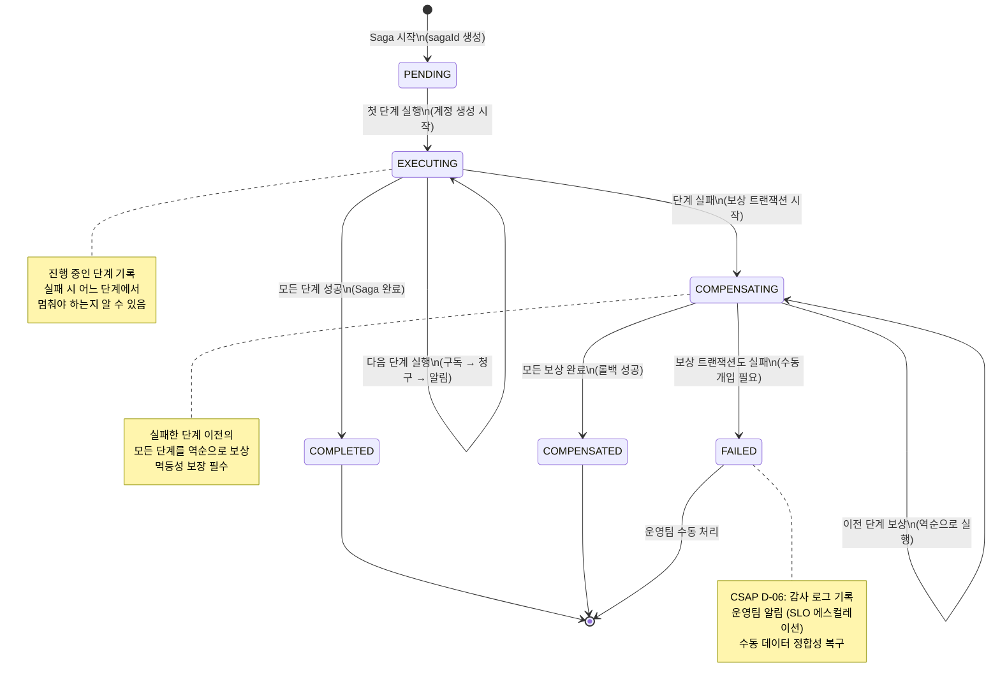
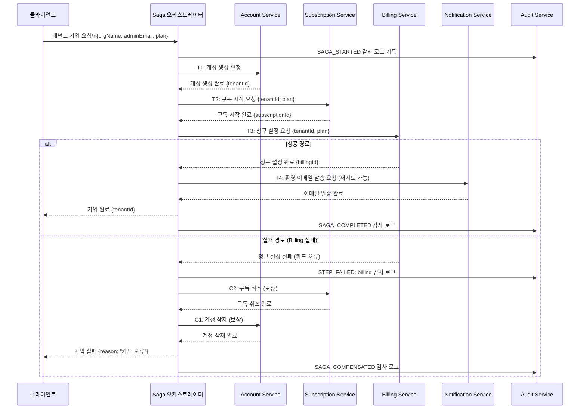

# Saga 패턴 심화 — Choreography vs Orchestration, 보상 트랜잭션, 멱등성, 실전 구현

> 대상 독자: 백엔드 개발자 (중급)
> 관련 요구사항: FR-TENANT.1~FR-TENANT.5, CSAP D-06 (감사 추적)
> 관련 서비스: platform/services/compliance-service, platform/services/security-service

---

## 목차

1. [분산 트랜잭션 문제 — 2PC의 한계](#1-분산-트랜잭션-문제--2pc의-한계)
2. [Choreography Saga — 이벤트 기반 협력](#2-choreography-saga--이벤트-기반-협력)
3. [Orchestration Saga — 중앙 지휘자 패턴](#3-orchestration-saga--중앙-지휘자-패턴)
4. [보상 트랜잭션 완전 가이드](#4-보상-트랜잭션-완전-가이드)
5. [멱등성 보장 전략](#5-멱등성-보장-전략)
6. [실전 시나리오: 테넌트 가입 Saga](#6-실전-시나리오-테넌트-가입-saga)
7. [Saga 모니터링 — OpenTelemetry 추적](#7-saga-모니터링--opentelemetry-추적)
8. [공공기관 SaaS에서 Saga — CSAP 감사 추적](#8-공공기관-saas에서-saga--csap-감사-추적)
9. [실습: 구독 취소 Saga 구현](#9-실습-구독-취소-saga-구현)

---

## 1. 분산 트랜잭션 문제 — 2PC의 한계

### 1.1 단일 데이터베이스 트랜잭션은 쉽다

모든 서비스가 하나의 데이터베이스를 사용한다면 트랜잭션은 간단합니다.

```typescript
// 단일 DB: ACID 트랜잭션으로 전부 성공 or 전부 실패
await prisma.$transaction([
  prisma.account.create({ data: accountData }),
  prisma.subscription.create({ data: subscriptionData }),
  prisma.billing.create({ data: billingData }),
]);
// 하나라도 실패하면 모두 롤백됨
```

### 1.2 마이크로서비스에서는 다르다

공공기관 SaaS는 17개 마이크로서비스로 구성되어 있고, 각 서비스는 자체 데이터베이스를 가집니다. 테넌트 가입 처리는 여러 서비스를 거쳐야 합니다.

```
테넌트 가입 요청
    ↓
[Account Service] 계정 생성 → account_db
    ↓
[Subscription Service] 구독 시작 → subscription_db
    ↓
[Billing Service] 청구 설정 → billing_db
    ↓
[Notification Service] 환영 이메일 발송 → notification_queue
```

이 과정에서 Billing Service가 실패하면 어떻게 될까요? Account와 Subscription은 이미 생성되었는데 Billing만 실패한 상태가 됩니다. 이것이 분산 트랜잭션의 핵심 문제입니다.

### 1.3 2PC(2단계 커밋)의 한계

2PC(Two-Phase Commit)는 분산 트랜잭션의 고전적 해결책입니다.

```
1단계 (준비): 조정자 → 모든 참여자에게 "준비해"
              모든 참여자: "준비 완료"

2단계 (커밋): 조정자 → 모든 참여자에게 "커밋해"
              모든 참여자: 실제 커밋 실행
```

하지만 2PC는 마이크로서비스 환경에서 치명적 단점이 있습니다.

| 문제 | 설명 |
|------|------|
| 성능 | 모든 참여자가 응답할 때까지 잠금 유지 |
| 가용성 | 조정자 장애 시 전체 시스템 Block |
| 확장성 | 참여자 수 증가 시 선형적 오버헤드 증가 |
| 이기종 시스템 | 모든 서비스가 2PC 지원해야 함 (NoSQL 불가) |

### 1.4 Saga가 해결하는 것

Saga는 하나의 큰 트랜잭션을 여러 개의 로컬 트랜잭션으로 분해합니다. 각 단계는 독립적으로 성공하고, 실패 시에는 이전 단계를 되돌리는 **보상 트랜잭션(Compensating Transaction)**을 실행합니다.

```
Saga = 로컬 트랜잭션의 순서 + 실패 시 보상 트랜잭션의 역순 실행
```

**Saga의 특성 — BASE:**
- **Basically Available**: 기본적으로 사용 가능 (전체 잠금 없음)
- **Soft State**: 일시적으로 불일치 상태 허용
- **Eventually Consistent**: 최종적으로 일관성 보장

---

## 2. Choreography Saga — 이벤트 기반 협력

### 2.1 Choreography의 작동 원리

Choreography(안무)는 중앙 지휘자 없이 각 서비스가 이벤트를 발행하고 구독하며 협력하는 방식입니다. 춤을 출 때 지휘자 없이 각 무용수가 음악에 맞춰 독립적으로 움직이는 것과 같습니다.

```typescript
// Design Ref: §2 — Choreography Saga 이벤트 정의

// 도메인 이벤트 (각 서비스가 발행)
interface TenantRegistrationEvents {
  // Account Service가 발행
  'account.created': {
    sagaId: string;
    tenantId: string;
    accountId: string;
    orgName: string;
    adminEmail: string;
    createdAt: string;
  };

  // Subscription Service가 발행
  'subscription.started': {
    sagaId: string;
    tenantId: string;
    subscriptionId: string;
    plan: 'free' | 'standard' | 'premium';
    startedAt: string;
  };

  // Billing Service가 발행
  'billing.configured': {
    sagaId: string;
    tenantId: string;
    billingId: string;
    configuredAt: string;
  };

  // 실패 이벤트 (보상 트랜잭션 트리거)
  'billing.configuration.failed': {
    sagaId: string;
    tenantId: string;
    reason: string;
    failedAt: string;
  };

  // 보상 이벤트
  'subscription.cancelled': {
    sagaId: string;
    tenantId: string;
    reason: string;
  };

  'account.deleted': {
    sagaId: string;
    tenantId: string;
    reason: string;
  };
}
```

### 2.2 Choreography Saga 구현

```typescript
// Design Ref: §2 — Choreography Saga 서비스별 이벤트 핸들러
// CSAP D-06: 모든 이벤트 감사 로그 기록

import { EventEmitter } from 'events';

// 이벤트 버스 (실제로는 Redis Streams 또는 Kafka 사용)
class DomainEventBus extends EventEmitter {
  publish<K extends keyof TenantRegistrationEvents>(
    event: K,
    data: TenantRegistrationEvents[K]
  ): void {
    // CSAP D-06: 이벤트 발행 감사 로그
    process.stdout.write(JSON.stringify({
      level: 'info',
      component: 'event-bus',
      action: 'publish',
      event,
      sagaId: (data as { sagaId: string }).sagaId,
      ts: new Date().toISOString(),
    }) + '\n');

    this.emit(event, data);
  }

  subscribe<K extends keyof TenantRegistrationEvents>(
    event: K,
    handler: (data: TenantRegistrationEvents[K]) => Promise<void>
  ): void {
    this.on(event, handler);
  }
}

const eventBus = new DomainEventBus();

// ── Account Service ──────────────────────────────────────────────────────────

class AccountService {
  // 테넌트 계정 생성 (Saga 1단계)
  async createAccount(
    sagaId: string,
    orgName: string,
    adminEmail: string
  ): Promise<string> {
    const tenantId = crypto.randomUUID();
    const accountId = crypto.randomUUID();

    // 로컬 트랜잭션
    await prisma.tenant.create({
      data: { id: tenantId, orgName, adminEmail, status: 'PENDING' },
    });

    // 성공 이벤트 발행 → Subscription Service가 구독
    eventBus.publish('account.created', {
      sagaId,
      tenantId,
      accountId,
      orgName,
      adminEmail,
      createdAt: new Date().toISOString(),
    });

    return tenantId;
  }

  // 보상 트랜잭션: 계정 삭제
  async deleteAccount(sagaId: string, tenantId: string, reason: string): Promise<void> {
    await prisma.tenant.delete({ where: { id: tenantId } });

    eventBus.publish('account.deleted', { sagaId, tenantId, reason });
  }

  // billing.configuration.failed 이벤트 구독 → 보상 실행
  setupHandlers(): void {
    eventBus.subscribe('subscription.cancelled', async (data) => {
      await this.deleteAccount(data.sagaId, data.tenantId, '구독 취소로 인한 계정 삭제');
    });
  }
}

// ── Subscription Service ──────────────────────────────────────────────────────

class SubscriptionService {
  setupHandlers(): void {
    // account.created 이벤트 구독 → 구독 시작 (Saga 2단계)
    eventBus.subscribe('account.created', async (data) => {
      try {
        const subscriptionId = crypto.randomUUID();

        await prisma.subscription.create({
          data: {
            id: subscriptionId,
            tenantId: data.tenantId,
            plan: 'free',
            status: 'ACTIVE',
            startedAt: new Date(),
          },
        });

        eventBus.publish('subscription.started', {
          sagaId: data.sagaId,
          tenantId: data.tenantId,
          subscriptionId,
          plan: 'free',
          startedAt: new Date().toISOString(),
        });
      } catch (error) {
        // Subscription 실패: Account 보상 트리거
        eventBus.publish('billing.configuration.failed', {
          sagaId: data.sagaId,
          tenantId: data.tenantId,
          reason: `구독 생성 실패: ${(error as Error).message}`,
          failedAt: new Date().toISOString(),
        });
      }
    });

    // billing.configuration.failed 이벤트 구독 → 보상 실행
    eventBus.subscribe('billing.configuration.failed', async (data) => {
      await prisma.subscription.deleteMany({
        where: { tenantId: data.tenantId },
      });

      eventBus.publish('subscription.cancelled', {
        sagaId: data.sagaId,
        tenantId: data.tenantId,
        reason: '청구 설정 실패로 인한 구독 취소',
      });
    });
  }
}
```

### 2.3 Choreography의 장단점

| 장점 | 단점 |
|------|------|
| 느슨한 결합 (서비스 간 직접 의존 없음) | 전체 흐름 파악이 어려움 |
| 단일 실패 지점 없음 | 이벤트 체인 추적이 복잡 |
| 새 서비스 추가 용이 | 순환 이벤트 위험 |
| 독립적 확장 가능 | 테스트가 어려움 |

---

## 3. Orchestration Saga — 중앙 지휘자 패턴

### 3.1 Orchestration의 작동 원리

Orchestration(오케스트레이션)은 중앙 오케스트레이터(지휘자)가 각 서비스를 순서대로 호출하는 방식입니다. 오케스트라 지휘자가 각 악기 연주자에게 언제 연주할지 신호를 주는 것과 같습니다.

### 3.2 Saga 상태 머신



### 3.3 Orchestration Saga 오케스트레이터 구현

```typescript
// Design Ref: §3 — Orchestration Saga 오케스트레이터
// Plan SC: FR-TENANT.1~FR-TENANT.4

enum SagaStatus {
  PENDING = 'PENDING',
  EXECUTING = 'EXECUTING',
  COMPLETED = 'COMPLETED',
  COMPENSATING = 'COMPENSATING',
  COMPENSATED = 'COMPENSATED',
  FAILED = 'FAILED',
}

interface SagaStep<T = unknown> {
  name: string;
  execute: (context: T) => Promise<T>;
  compensate: (context: T) => Promise<void>;
  canCompensate: boolean; // 보상 가능 여부
}

interface SagaState<T> {
  sagaId: string;
  status: SagaStatus;
  currentStep: number;
  context: T;
  completedSteps: string[];
  failedStep?: string;
  error?: string;
  startedAt: string;
  updatedAt: string;
}

class SagaOrchestrator<T extends Record<string, unknown>> {
  private readonly states = new Map<string, SagaState<T>>();

  constructor(private readonly steps: SagaStep<T>[]) {}

  async execute(initialContext: T): Promise<SagaState<T>> {
    const sagaId = crypto.randomUUID();

    const state: SagaState<T> = {
      sagaId,
      status: SagaStatus.PENDING,
      currentStep: 0,
      context: { ...initialContext },
      completedSteps: [],
      startedAt: new Date().toISOString(),
      updatedAt: new Date().toISOString(),
    };

    this.states.set(sagaId, state);
    this.logStateChange(state, 'SAGA_STARTED');

    // 실행 단계
    state.status = SagaStatus.EXECUTING;

    for (let i = 0; i < this.steps.length; i++) {
      const step = this.steps[i];
      state.currentStep = i;
      state.updatedAt = new Date().toISOString();

      this.logStateChange(state, `STEP_STARTED: ${step.name}`);

      try {
        // 단계 실행
        state.context = await step.execute(state.context);
        state.completedSteps.push(step.name);
        this.logStateChange(state, `STEP_COMPLETED: ${step.name}`);
      } catch (error) {
        state.failedStep = step.name;
        state.error = (error as Error).message;
        this.logStateChange(state, `STEP_FAILED: ${step.name}`);

        // 보상 트랜잭션 시작
        await this.compensate(state);
        return state;
      }
    }

    state.status = SagaStatus.COMPLETED;
    state.updatedAt = new Date().toISOString();
    this.logStateChange(state, 'SAGA_COMPLETED');

    return state;
  }

  private async compensate(state: SagaState<T>): Promise<void> {
    state.status = SagaStatus.COMPENSATING;
    this.logStateChange(state, 'COMPENSATION_STARTED');

    // 완료된 단계를 역순으로 보상
    const stepsToCompensate = [...state.completedSteps].reverse();

    for (const stepName of stepsToCompensate) {
      const step = this.steps.find((s) => s.name === stepName);
      if (!step || !step.canCompensate) continue;

      try {
        await step.compensate(state.context);
        this.logStateChange(state, `COMPENSATION_STEP_COMPLETED: ${stepName}`);
      } catch (compensationError) {
        // 보상도 실패: 수동 개입 필요
        state.status = SagaStatus.FAILED;
        state.updatedAt = new Date().toISOString();
        this.logStateChange(state, `COMPENSATION_FAILED: ${stepName} — 수동 개입 필요`);

        // SLO 에스컬레이션 트리거
        await this.triggerManualIntervention(state, compensationError as Error);
        return;
      }
    }

    state.status = SagaStatus.COMPENSATED;
    state.updatedAt = new Date().toISOString();
    this.logStateChange(state, 'COMPENSATION_COMPLETED');
  }

  private logStateChange(state: SagaState<T>, event: string): void {
    // CSAP D-06: 모든 Saga 상태 변경 감사 로그
    process.stdout.write(JSON.stringify({
      level: 'info',
      component: 'saga-orchestrator',
      sagaId: state.sagaId,
      status: state.status,
      event,
      currentStep: state.currentStep,
      completedSteps: state.completedSteps,
      ts: new Date().toISOString(),
    }) + '\n');
  }

  private async triggerManualIntervention(
    state: SagaState<T>,
    error: Error
  ): Promise<void> {
    process.stderr.write(JSON.stringify({
      level: 'error',
      component: 'saga-orchestrator',
      sagaId: state.sagaId,
      action: 'MANUAL_INTERVENTION_REQUIRED',
      failedStep: state.failedStep,
      compensationError: error.message,
      context: state.context,
      ts: new Date().toISOString(),
    }) + '\n');
  }

  getState(sagaId: string): SagaState<T> | undefined {
    return this.states.get(sagaId);
  }
}
```

---

## 4. 보상 트랜잭션 완전 가이드

### 4.1 보상 트랜잭션의 세 가지 유형

모든 트랜잭션이 동일하게 보상될 수 있는 것은 아닙니다.

```typescript
// Design Ref: §4 — 보상 트랜잭션 유형 분류

/**
 * 유형 1: 보상 가능 트랜잭션 (Compensable Transaction)
 * 이전 상태로 완전히 복원 가능
 * 예: 계정 생성 → 계정 삭제
 */
const createAccountStep: SagaStep<TenantRegistrationContext> = {
  name: 'create-account',
  canCompensate: true,
  execute: async (context) => {
    const tenant = await prisma.tenant.create({
      data: {
        orgName: context.orgName,
        adminEmail: context.adminEmail,
        status: 'PENDING',
      },
    });
    return { ...context, tenantId: tenant.id };
  },
  compensate: async (context) => {
    // 완전한 역작업: 생성한 테넌트 삭제
    if (context.tenantId) {
      await prisma.tenant.delete({ where: { id: context.tenantId } });
    }
  },
};

/**
 * 유형 2: 피벗 트랜잭션 (Pivot Transaction)
 * Saga의 성공/실패 전환점. 이 단계 이전은 보상 가능, 이후는 보상 불가
 * 예: 결제 승인 처리 — 승인되면 취소는 가능하지만 "미처리"로 되돌릴 수 없음
 */
const paymentProcessStep: SagaStep<TenantRegistrationContext> = {
  name: 'process-payment',
  canCompensate: true, // 취소는 가능
  execute: async (context) => {
    const payment = await billingService.chargeCard({
      amount: context.amount,
      tenantId: context.tenantId,
    });
    return { ...context, paymentId: payment.id };
  },
  compensate: async (context) => {
    // 역작업: 결제 취소 (환불) — 완전한 역작업이 아님 (거래 기록은 남음)
    if (context.paymentId) {
      await billingService.refund({ paymentId: context.paymentId });
    }
  },
};

/**
 * 유형 3: 재시도 가능 트랜잭션 (Retriable Transaction)
 * 피벗 이후 단계. 실패하면 재시도로 성공 보장
 * 예: 환영 이메일 발송 — 보상 불가하지만 재시도 가능
 */
const sendWelcomeEmailStep: SagaStep<TenantRegistrationContext> = {
  name: 'send-welcome-email',
  canCompensate: false, // 이메일은 "미발송"으로 되돌릴 수 없음
  execute: async (context) => {
    // 멱등성 키 사용: 같은 sagaId로 중복 발송 방지
    await emailService.sendWithIdempotency({
      idempotencyKey: `welcome-${context.sagaId}`,
      to: context.adminEmail,
      subject: '[공공기관 SaaS] 환영합니다',
      body: `${context.orgName} 기관의 SaaS 가입이 완료되었습니다.`,
    });
    return context;
  },
  compensate: async (_context) => {
    // 보상 불가: 이미 발송된 이메일은 취소할 수 없음
    // Saga 실패 시 "가입 취소 이메일"을 별도 발송하는 것이 올바른 접근
  },
};
```

### 4.2 보상 트랜잭션 역순 실행

```
Saga 실행 순서:    T1 → T2 → T3 → T4 (실패)
보상 실행 순서:               C3 ← C2 ← C1

T4 실패 시:
  1. C3 실행 (T3 보상)
  2. C2 실행 (T2 보상)
  3. C1 실행 (T1 보상)
  T4 자체는 성공하지 않았으므로 C4는 실행하지 않음
```

### 4.3 보상이 실패하는 경우 처리

```typescript
// Design Ref: §4 — 보상 실패 처리 (SAGA_FAILED 상태)
// 실제 코드 기반: platform/services/compliance-service/src/lib/audit.ts 패턴

interface SagaFailureRecord {
  sagaId: string;
  sagaType: string;
  failedStep: string;
  compensationFailedStep?: string;
  context: unknown;
  manualActionRequired: boolean;
  notifiedAt?: string;
}

class SagaFailureHandler {
  async handleCompensationFailure(
    sagaId: string,
    sagaType: string,
    failedCompensationStep: string,
    context: unknown
  ): Promise<void> {
    // 1. 영구 저장소에 실패 기록 (복구를 위해)
    await prisma.sagaFailureLog.create({
      data: {
        sagaId,
        sagaType,
        failedCompensationStep,
        context: JSON.stringify(context),
        manualActionRequired: true,
        createdAt: new Date(),
      },
    });

    // 2. CSAP D-06: 감사 로그
    process.stderr.write(JSON.stringify({
      level: 'critical',
      component: 'saga-failure-handler',
      sagaId,
      sagaType,
      failedCompensationStep,
      action: 'COMPENSATION_FAILURE_LOGGED',
      manualActionRequired: true,
      ts: new Date().toISOString(),
    }) + '\n');

    // 3. 운영팀 즉시 알림 (SLO 에스컬레이션)
    await this.notifyOperationsTeam(sagaId, sagaType, failedCompensationStep);
  }

  private async notifyOperationsTeam(
    sagaId: string,
    sagaType: string,
    failedStep: string
  ): Promise<void> {
    // 알림 큐에 긴급 알림 추가
    process.stderr.write(JSON.stringify({
      level: 'critical',
      component: 'saga-failure-handler',
      action: 'OPERATIONS_ALERT',
      message: `[긴급] Saga 보상 실패: ${sagaType}/${sagaId} — ${failedStep} — 수동 개입 필요`,
      ts: new Date().toISOString(),
    }) + '\n');
  }
}
```

---

## 5. 멱등성 보장 전략

### 5.1 왜 멱등성이 중요한가?

네트워크 오류나 재시도로 인해 같은 요청이 여러 번 전달될 수 있습니다. 멱등성(Idempotency)은 같은 요청을 여러 번 실행해도 결과가 동일하다는 성질입니다.

**멱등성 없이:** "환영 이메일" 요청이 3번 전달되면 3통의 이메일 발송
**멱등성 있음:** "환영 이메일" 요청이 3번 전달되어도 1통만 발송

### 5.2 Idempotency Key 설계

```typescript
// Design Ref: §5 — Idempotency Key 패턴
// CSAP D-12: 모든 외부 API 호출에 멱등성 키 적용

class IdempotencyService {
  // Redis 기반 멱등성 키 저장소
  async checkAndSet(
    idempotencyKey: string,
    operation: () => Promise<unknown>,
    ttlSeconds = 86400 // 24시간 기본 유효기간
  ): Promise<{ result: unknown; isDuplicate: boolean }> {
    const redisKey = `idempotency:${idempotencyKey}`;

    // 1. 기존 결과 확인
    const existing = await redis.get(redisKey);
    if (existing) {
      return {
        result: JSON.parse(existing),
        isDuplicate: true,
      };
    }

    // 2. 처리 중 표시 (동시 요청 방지)
    const acquired = await redis.set(
      `${redisKey}:lock`,
      '1',
      'EX', 30,  // 30초 잠금
      'NX'       // 이미 존재하면 실패
    );

    if (!acquired) {
      throw new Error('중복 요청 처리 중: 잠시 후 다시 시도하세요');
    }

    // 3. 실제 작업 실행
    const result = await operation();

    // 4. 결과 저장
    await redis.set(
      redisKey,
      JSON.stringify(result),
      'EX', ttlSeconds
    );

    // 5. 잠금 해제
    await redis.del(`${redisKey}:lock`);

    return { result, isDuplicate: false };
  }
}

// Saga Step에서 멱등성 키 사용
const idempotencyService = new IdempotencyService();

const idempotentCreateAccount: SagaStep<TenantRegistrationContext> = {
  name: 'create-account-idempotent',
  canCompensate: true,
  execute: async (context) => {
    const idempotencyKey = `tenant-register:${context.sagaId}:account`;

    const { result, isDuplicate } = await idempotencyService.checkAndSet(
      idempotencyKey,
      async () => {
        const tenant = await prisma.tenant.create({
          data: {
            orgName: context.orgName,
            adminEmail: context.adminEmail,
            status: 'PENDING',
          },
        });
        return { tenantId: tenant.id };
      }
    );

    if (isDuplicate) {
      process.stdout.write(JSON.stringify({
        level: 'info',
        component: 'saga-step',
        step: 'create-account-idempotent',
        action: 'DUPLICATE_SKIPPED',
        idempotencyKey,
        ts: new Date().toISOString(),
      }) + '\n');
    }

    return { ...context, tenantId: (result as { tenantId: string }).tenantId };
  },
  compensate: async (context) => {
    if (context.tenantId) {
      await prisma.tenant.delete({ where: { id: context.tenantId } });
      // 멱등성 키도 삭제 (재가입 허용을 위해)
      await redis.del(`idempotency:tenant-register:${context.sagaId}:account`);
    }
  },
};
```

### 5.3 중복 이벤트 처리

```typescript
// Design Ref: §5 — 중복 이벤트 처리
// Choreography Saga에서 이벤트 중복 수신 방지

class DuplicateEventFilter {
  private readonly processedEvents = new Set<string>();
  private readonly maxSize = 10000;

  /**
   * 이벤트가 중복인지 확인
   * eventId: 이벤트 발행 시 생성한 고유 ID
   */
  isDuplicate(eventId: string): boolean {
    return this.processedEvents.has(eventId);
  }

  markProcessed(eventId: string): void {
    this.processedEvents.add(eventId);

    // 메모리 관리: 오래된 항목 제거
    if (this.processedEvents.size > this.maxSize) {
      const oldest = this.processedEvents.values().next().value;
      if (oldest) this.processedEvents.delete(oldest);
    }
  }
}

const eventFilter = new DuplicateEventFilter();

// 이벤트 핸들러에서 중복 처리
eventBus.subscribe('account.created', async (data) => {
  const eventId = `account.created:${data.sagaId}`;

  if (eventFilter.isDuplicate(eventId)) {
    process.stdout.write(JSON.stringify({
      level: 'warn',
      component: 'subscription-service',
      action: 'DUPLICATE_EVENT_SKIPPED',
      eventId,
      ts: new Date().toISOString(),
    }) + '\n');
    return; // 중복 이벤트 무시
  }

  eventFilter.markProcessed(eventId);

  // 실제 처리
  await subscriptionService.startSubscription(data);
});
```

---

## 6. 실전 시나리오: 테넌트 가입 Saga

### 6.1 테넌트 가입 Saga 전체 흐름



### 6.2 완전한 테넌트 가입 Saga 구현

```typescript
// Design Ref: §6 — 테넌트 가입 Saga 완전 구현
// Plan SC: FR-TENANT.1, FR-TENANT.2, FR-TENANT.3, FR-TENANT.4

interface TenantRegistrationContext {
  sagaId: string;
  orgName: string;
  adminEmail: string;
  plan: 'free' | 'standard' | 'premium';
  // 각 단계에서 채워지는 필드
  tenantId?: string;
  subscriptionId?: string;
  billingId?: string;
  emailSent?: boolean;
}

// Saga 단계 정의
const tenantRegistrationSteps: SagaStep<TenantRegistrationContext>[] = [
  // T1: 계정 생성
  {
    name: 'create-account',
    canCompensate: true,
    execute: async (context) => {
      // 멱등성 키: sagaId 기반
      const existing = await prisma.tenant.findFirst({
        where: { adminEmail: context.adminEmail, status: 'PENDING' },
      });

      if (existing) {
        // 중복 요청: 기존 결과 반환
        return { ...context, tenantId: existing.id };
      }

      const tenant = await prisma.tenant.create({
        data: {
          id: crypto.randomUUID(),
          orgName: context.orgName,
          adminEmail: context.adminEmail,
          status: 'PENDING',
          createdAt: new Date(),
        },
      });

      // CSAP D-06: 계정 생성 감사 로그
      await logComplianceEvent('TENANT_ACCOUNT_CREATED', {
        sagaId: context.sagaId,
        tenantId: tenant.id,
        orgName: context.orgName,
        adminEmail: maskEmail(context.adminEmail),
      });

      return { ...context, tenantId: tenant.id };
    },
    compensate: async (context) => {
      if (context.tenantId) {
        await prisma.tenant.delete({ where: { id: context.tenantId } });

        await logComplianceEvent('TENANT_ACCOUNT_DELETED', {
          sagaId: context.sagaId,
          tenantId: context.tenantId,
          reason: '가입 실패로 인한 롤백',
        });
      }
    },
  },

  // T2: 구독 시작
  {
    name: 'start-subscription',
    canCompensate: true,
    execute: async (context) => {
      if (!context.tenantId) throw new Error('tenantId가 설정되지 않음');

      // 멱등성: 이미 구독이 있으면 재사용
      const existing = await prisma.subscription.findFirst({
        where: { tenantId: context.tenantId },
      });

      if (existing) {
        return { ...context, subscriptionId: existing.id };
      }

      const subscription = await prisma.subscription.create({
        data: {
          id: crypto.randomUUID(),
          tenantId: context.tenantId,
          plan: context.plan,
          status: 'ACTIVE',
          startedAt: new Date(),
        },
      });

      return { ...context, subscriptionId: subscription.id };
    },
    compensate: async (context) => {
      if (context.subscriptionId) {
        await prisma.subscription.update({
          where: { id: context.subscriptionId },
          data: { status: 'CANCELLED', cancelledAt: new Date() },
        });
      }
    },
  },

  // T3: 청구 설정 (피벗 트랜잭션)
  {
    name: 'configure-billing',
    canCompensate: true, // 취소는 가능
    execute: async (context) => {
      if (!context.tenantId) throw new Error('tenantId가 설정되지 않음');

      const billing = await prisma.billing.create({
        data: {
          id: crypto.randomUUID(),
          tenantId: context.tenantId,
          plan: context.plan,
          status: 'ACTIVE',
          nextBillingDate: getNextBillingDate(),
        },
      });

      return { ...context, billingId: billing.id };
    },
    compensate: async (context) => {
      if (context.billingId) {
        await prisma.billing.update({
          where: { id: context.billingId },
          data: { status: 'CANCELLED' },
        });
      }
    },
  },

  // T4: 환영 이메일 발송 (재시도 가능 트랜잭션)
  {
    name: 'send-welcome-email',
    canCompensate: false, // 발송된 이메일 취소 불가
    execute: async (context) => {
      // 멱등성 키로 중복 발송 방지
      const idempotencyKey = `welcome-email:${context.sagaId}`;
      const alreadySent = await redis.get(`idempotency:${idempotencyKey}`);

      if (!alreadySent) {
        await emailQueue.add('send-email', {
          tenantId: context.tenantId ?? 'unknown',
          to: context.adminEmail,
          subject: '[공공기관 SaaS] 가입을 환영합니다',
          body: `${context.orgName} 기관의 서비스 가입이 완료되었습니다.`,
          priority: 'high',
          auditId: crypto.randomUUID(),
          actorId: 'system:tenant-registration-saga',
          requestIp: '127.0.0.1',
        });

        // 멱등성 키 설정 (24시간)
        await redis.set(`idempotency:${idempotencyKey}`, '1', 'EX', 86400);
      }

      return { ...context, emailSent: true };
    },
    compensate: async (_context) => {
      // 취소 이메일 발송 (별도 이메일로 알림)
      // 실제 구현에서는 별도 "가입 취소" 이메일 발송
    },
  },

  // T5: 테넌트 상태 활성화
  {
    name: 'activate-tenant',
    canCompensate: false, // 활성화 후에는 보상 없음 (취소 Saga로 처리)
    execute: async (context) => {
      if (!context.tenantId) throw new Error('tenantId가 설정되지 않음');

      await prisma.tenant.update({
        where: { id: context.tenantId },
        data: { status: 'ACTIVE', activatedAt: new Date() },
      });

      // CSAP D-06: 활성화 감사 로그
      await logComplianceEvent('TENANT_ACTIVATED', {
        sagaId: context.sagaId,
        tenantId: context.tenantId,
        plan: context.plan,
      });

      return context;
    },
    compensate: async (_context) => {
      // 취소 불가: 별도 비활성화 Saga 사용
    },
  },
];

// Saga 실행
const orchestrator = new SagaOrchestrator<TenantRegistrationContext>(
  tenantRegistrationSteps
);

async function registerTenant(
  orgName: string,
  adminEmail: string,
  plan: 'free' | 'standard' | 'premium'
): Promise<{ success: boolean; tenantId?: string; error?: string }> {
  const sagaId = crypto.randomUUID();

  const finalState = await orchestrator.execute({
    sagaId,
    orgName,
    adminEmail,
    plan,
  });

  if (finalState.status === SagaStatus.COMPLETED) {
    return { success: true, tenantId: finalState.context.tenantId };
  }

  return {
    success: false,
    error: finalState.error ?? '알 수 없는 오류',
  };
}

function getNextBillingDate(): Date {
  const next = new Date();
  next.setMonth(next.getMonth() + 1);
  return next;
}

function maskEmail(email: string): string {
  const [local, domain] = email.split('@');
  return `${local.slice(0, 2)}***@${domain}`;
}

// compliance-service의 logComplianceEvent 패턴과 동일
async function logComplianceEvent(
  action: string,
  metadata: Record<string, unknown>
): Promise<void> {
  process.stdout.write(JSON.stringify({
    level: 'info',
    component: 'saga-compliance',
    actor: 'system:tenant-registration-saga',
    action,
    target: 'tenant',
    targetType: 'tenant',
    metadata,
    ts: new Date().toISOString(),
  }) + '\n');
}
```

---

## 7. Saga 모니터링 — OpenTelemetry 추적

### 7.1 분산 추적의 필요성

Saga는 여러 서비스에 걸쳐 실행됩니다. 단일 sagaId로 모든 단계를 추적하려면 분산 추적(Distributed Tracing)이 필요합니다.

```typescript
// Design Ref: §7 — OpenTelemetry 분산 추적

import { trace, context, SpanStatusCode } from '@opentelemetry/api';

const tracer = trace.getTracer('saga-orchestrator', '1.0.0');

class TracedSagaOrchestrator<T extends Record<string, unknown>> extends SagaOrchestrator<T> {
  async execute(initialContext: T & { sagaId: string }): Promise<SagaState<T>> {
    // Saga 전체를 하나의 상위 Span으로 감싸기
    return tracer.startActiveSpan(
      `saga.${initialContext.sagaId.slice(0, 8)}`,
      async (sagaSpan) => {
        sagaSpan.setAttributes({
          'saga.id': initialContext.sagaId,
          'saga.type': 'tenant-registration',
          'tenant.id': (initialContext as unknown as { tenantId?: string }).tenantId ?? 'unknown',
        });

        try {
          const result = await super.execute(initialContext);

          sagaSpan.setStatus({
            code: result.status === SagaStatus.COMPLETED
              ? SpanStatusCode.OK
              : SpanStatusCode.ERROR,
            message: result.status,
          });

          return result;
        } catch (error) {
          sagaSpan.recordException(error as Error);
          sagaSpan.setStatus({ code: SpanStatusCode.ERROR });
          throw error;
        } finally {
          sagaSpan.end();
        }
      }
    );
  }
}
```

### 7.2 Prometheus 메트릭 수집

```typescript
// Design Ref: §7 — Saga 메트릭

import { Counter, Histogram, Gauge, Registry } from 'prom-client';

// 실제 코드 기반: packages/dora-exporter/src/index.ts 메트릭 패턴

const sagaRegistry = new Registry();

const sagaTotal = new Counter({
  name: 'saga_executions_total',
  help: 'Saga 실행 횟수',
  labelNames: ['saga_type', 'status'],
  registers: [sagaRegistry],
});

const sagaDuration = new Histogram({
  name: 'saga_duration_seconds',
  help: 'Saga 실행 시간',
  labelNames: ['saga_type'],
  buckets: [0.5, 1, 2, 5, 10, 30, 60],
  registers: [sagaRegistry],
});

const sagaCompensationTotal = new Counter({
  name: 'saga_compensations_total',
  help: '보상 트랜잭션 실행 횟수',
  labelNames: ['saga_type', 'step'],
  registers: [sagaRegistry],
});

const sagaActiveCurrent = new Gauge({
  name: 'saga_active_current',
  help: '현재 실행 중인 Saga 수',
  labelNames: ['saga_type'],
  registers: [sagaRegistry],
});
```

---

## 8. 공공기관 SaaS에서 Saga — CSAP 감사 추적

### 8.1 CSAP D-06과 Saga

CSAP D-06은 모든 민감 작업에 대한 감사 로그 기록을 요구합니다. Saga의 각 단계는 민감 작업이므로, 모든 상태 변경을 감사 로그에 기록해야 합니다.

```typescript
// Design Ref: §8 — CSAP D-06 Saga 감사 추적
// 실제 코드 기반:
// - platform/services/compliance-service/src/lib/audit.ts
// - platform/services/security-service/src/lib/audit.ts

// compliance-service 패턴과 동일한 감사 로거
import { createAuditLogger, createStandardTransport } from '@public-saas/audit-sdk';

const sagaAuditLogger = createAuditLogger({
  serviceName: 'saga-orchestrator',
  transport: createStandardTransport('saga-orchestrator'),
});

async function logSagaEvent(
  sagaId: string,
  step: string,
  action: string,
  tenantId: string,
  metadata?: Record<string, unknown>
): Promise<void> {
  await sagaAuditLogger.log({
    actor: `saga:${sagaId}`,
    action: `SAGA.${action}`,
    target: `step:${step}`,
    targetType: 'saga-step',
    tenantId,
    ip: '127.0.0.1',
    userAgent: 'saga-orchestrator/1.0',
    metadata: {
      sagaId,
      step,
      ...metadata,
    },
  });
}

// Saga 단계별 감사 이벤트 매핑
const SAGA_AUDIT_EVENTS = {
  STEP_STARTED: 'STEP_STARTED',
  STEP_COMPLETED: 'STEP_COMPLETED',
  STEP_FAILED: 'STEP_FAILED',
  COMPENSATION_STARTED: 'COMPENSATION_STARTED',
  COMPENSATION_COMPLETED: 'COMPENSATION_COMPLETED',
  COMPENSATION_FAILED: 'COMPENSATION_FAILED',
  SAGA_COMPLETED: 'SAGA_COMPLETED',
  SAGA_COMPENSATED: 'SAGA_COMPENSATED',
  SAGA_FAILED: 'SAGA_FAILED',
} as const;
```

### 8.2 감사 로그 보존 정책

```typescript
// Design Ref: §8 — CSAP D-06 감사 로그 보존 정책

// Saga 감사 로그 보존: 1년 (CSAP D-06 최소 요건)
const SAGA_LOG_RETENTION = {
  minimal: 365, // 일 (1년)
  extended: 1825, // 일 (5년, 고위험 작업)
};

// 고위험 Saga (보존 기간 연장)
const HIGH_RISK_SAGAS = [
  'tenant-deletion',      // 테넌트 삭제
  'data-export',          // 개인정보 내보내기 (GDPR/개인정보보호법)
  'admin-privilege-grant', // 관리자 권한 부여
  'billing-refund',        // 환불 처리
];
```

---

## 9. 실습: 구독 취소 Saga 구현

### 9.1 실습 목표

테넌트의 구독 취소 요청을 처리하는 Saga를 구현합니다. 구독 취소는 여러 서비스에 걸쳐 처리되어야 하는 복잡한 작업입니다.

### 9.2 구독 취소 Saga 설계

```
구독 취소 Saga 단계:
T1: 구독 상태 → CANCELLING으로 변경
T2: 미사용 기간 환불 계산 및 처리
T3: 기관 데이터 보관 처리 (30일 유예)
T4: 관련 서비스 접근 권한 해제
T5: 구독 상태 → CANCELLED로 변경
T6: 취소 확인 이메일 발송

실패 시 보상 (역순):
C4: 접근 권한 복원
C3: 데이터 보관 취소
C2: 환불 취소 (환불 전이라면)
C1: 구독 상태 → ACTIVE로 복원
```

### 9.3 구현 코드

```typescript
// Design Ref: §9 — 구독 취소 Saga 완전 구현
// Plan SC: FR-TENANT.5

interface SubscriptionCancellationContext {
  sagaId: string;
  tenantId: string;
  subscriptionId: string;
  requestedBy: string;  // 취소 요청자 (관리자 ID)
  cancellationReason: string;
  // 단계별 채워지는 필드
  refundAmount?: number;
  dataRetentionId?: string;
  accessRevoked?: boolean;
  cancelledAt?: string;
}

const cancellationSteps: SagaStep<SubscriptionCancellationContext>[] = [
  // T1: 구독 상태 CANCELLING으로 변경 (시작 표시)
  {
    name: 'mark-subscription-cancelling',
    canCompensate: true,
    execute: async (context) => {
      await prisma.subscription.update({
        where: { id: context.subscriptionId },
        data: { status: 'CANCELLING', updatedAt: new Date() },
      });

      // CSAP D-06: 구독 취소 시작 감사 로그
      await logSagaEvent(
        context.sagaId,
        'mark-subscription-cancelling',
        SAGA_AUDIT_EVENTS.STEP_COMPLETED,
        context.tenantId,
        {
          requestedBy: context.requestedBy,
          reason: context.cancellationReason,
        }
      );

      return context;
    },
    compensate: async (context) => {
      // 취소 중단: 구독 상태 복원
      await prisma.subscription.update({
        where: { id: context.subscriptionId },
        data: { status: 'ACTIVE', updatedAt: new Date() },
      });
    },
  },

  // T2: 환불 처리
  {
    name: 'process-refund',
    canCompensate: true, // 환불 취소는 가능하지만 복잡
    execute: async (context) => {
      // 미사용 기간 계산
      const subscription = await prisma.subscription.findUnique({
        where: { id: context.subscriptionId },
        include: { billing: true },
      });

      if (!subscription) throw new Error('구독 정보를 찾을 수 없음');

      // 환불 금액 계산 (일할 계산)
      const today = new Date();
      const nextBilling = subscription.billing?.nextBillingDate ?? today;
      const daysRemaining = Math.max(
        0,
        Math.floor((nextBilling.getTime() - today.getTime()) / (1000 * 60 * 60 * 24))
      );

      const monthlyAmount = getPlanAmount(subscription.plan);
      const refundAmount = Math.floor((monthlyAmount / 30) * daysRemaining);

      if (refundAmount > 0) {
        await prisma.billing.update({
          where: { tenantId: context.tenantId },
          data: {
            refundAmount,
            refundedAt: new Date(),
            status: 'REFUND_PENDING',
          },
        });
      }

      return { ...context, refundAmount };
    },
    compensate: async (context) => {
      // 환불 취소 (결제 상태 복원)
      await prisma.billing.update({
        where: { tenantId: context.tenantId },
        data: {
          refundAmount: null,
          refundedAt: null,
          status: 'ACTIVE',
        },
      });
    },
  },

  // T3: 데이터 보관 처리 (30일 유예)
  {
    name: 'initiate-data-retention',
    canCompensate: true,
    execute: async (context) => {
      const retentionId = crypto.randomUUID();
      const retentionEndDate = new Date();
      retentionEndDate.setDate(retentionEndDate.getDate() + 30);

      await prisma.dataRetention.create({
        data: {
          id: retentionId,
          tenantId: context.tenantId,
          retentionEndDate,
          status: 'ACTIVE',
          createdAt: new Date(),
        },
      });

      return { ...context, dataRetentionId: retentionId };
    },
    compensate: async (context) => {
      if (context.dataRetentionId) {
        await prisma.dataRetention.delete({
          where: { id: context.dataRetentionId },
        });
      }
    },
  },

  // T4: 접근 권한 해제
  {
    name: 'revoke-access',
    canCompensate: true,
    execute: async (context) => {
      // API 키, 세션, 권한 모두 해제
      await prisma.tenant.update({
        where: { id: context.tenantId },
        data: { status: 'SUSPENDED' },
      });

      // 세션 무효화 (Redis)
      await redis.del(`sessions:tenant:${context.tenantId}`);

      return { ...context, accessRevoked: true };
    },
    compensate: async (context) => {
      // 접근 권한 복원
      await prisma.tenant.update({
        where: { id: context.tenantId },
        data: { status: 'ACTIVE' },
      });
    },
  },

  // T5: 구독 최종 취소 확정
  {
    name: 'finalize-cancellation',
    canCompensate: false, // 취소 확정 후에는 보상 없음
    execute: async (context) => {
      const cancelledAt = new Date().toISOString();

      await prisma.subscription.update({
        where: { id: context.subscriptionId },
        data: {
          status: 'CANCELLED',
          cancelledAt: new Date(cancelledAt),
        },
      });

      // CSAP D-06: 구독 취소 완료 감사 로그 (보안 서비스 패턴)
      await logSagaEvent(
        context.sagaId,
        'finalize-cancellation',
        SAGA_AUDIT_EVENTS.SAGA_COMPLETED,
        context.tenantId,
        {
          requestedBy: context.requestedBy,
          reason: context.cancellationReason,
          refundAmount: context.refundAmount,
          cancelledAt,
        }
      );

      return { ...context, cancelledAt };
    },
    compensate: async (_context) => {
      // 취소 불가: 취소 재개를 원하면 새 구독 생성
    },
  },

  // T6: 취소 확인 이메일 (재시도 가능)
  {
    name: 'send-cancellation-email',
    canCompensate: false,
    execute: async (context) => {
      const idempotencyKey = `cancellation-email:${context.sagaId}`;
      const alreadySent = await redis.get(`idempotency:${idempotencyKey}`);

      if (!alreadySent) {
        const tenant = await prisma.tenant.findUnique({
          where: { id: context.tenantId },
        });

        if (tenant) {
          await emailQueue.add('send-email', {
            tenantId: context.tenantId,
            to: tenant.adminEmail,
            subject: '[공공기관 SaaS] 구독 취소가 완료되었습니다',
            body: [
              `${tenant.orgName} 기관의 구독 취소가 완료되었습니다.`,
              `취소 일자: ${context.cancelledAt}`,
              `환불 금액: ${context.refundAmount ?? 0}원 (영업일 기준 3~5일 소요)`,
              `데이터는 30일간 보관 후 삭제됩니다.`,
            ].join('\n'),
            priority: 'high',
            auditId: crypto.randomUUID(),
            actorId: 'system:cancellation-saga',
            requestIp: '127.0.0.1',
          });

          await redis.set(`idempotency:${idempotencyKey}`, '1', 'EX', 86400);
        }
      }

      return context;
    },
    compensate: async (_context) => {
      // 이미 발송된 이메일 취소 불가
    },
  },
];

function getPlanAmount(plan: string): number {
  const amounts: Record<string, number> = {
    free: 0,
    standard: 50000,
    premium: 200000,
    enterprise: 1000000,
  };
  return amounts[plan] ?? 0;
}

// 구독 취소 실행 함수
const cancellationOrchestrator = new SagaOrchestrator<SubscriptionCancellationContext>(
  cancellationSteps
);

async function cancelSubscription(
  tenantId: string,
  subscriptionId: string,
  requestedBy: string,
  reason: string
): Promise<{ success: boolean; message: string; refundAmount?: number }> {
  const sagaId = crypto.randomUUID();

  const result = await cancellationOrchestrator.execute({
    sagaId,
    tenantId,
    subscriptionId,
    requestedBy,
    cancellationReason: reason,
  });

  if (result.status === SagaStatus.COMPLETED) {
    return {
      success: true,
      message: '구독 취소가 완료되었습니다',
      refundAmount: result.context.refundAmount,
    };
  }

  if (result.status === SagaStatus.COMPENSATED) {
    return {
      success: false,
      message: `구독 취소 처리 중 오류가 발생하여 원상 복구되었습니다: ${result.error}`,
    };
  }

  return {
    success: false,
    message: `구독 취소 처리 중 심각한 오류가 발생했습니다. 운영팀에 문의하세요. (Saga ID: ${sagaId})`,
  };
}
```

### 9.4 Fastify API 통합

```typescript
// Design Ref: §9 — Fastify 라우트 통합

import type { FastifyInstance } from 'fastify';
import { z } from 'zod'; // CSAP D-12 입력 검증

const cancelSubscriptionSchema = z.object({
  reason: z.string().min(10).max(500),
  confirmedBy: z.string().uuid(), // 취소 승인자 ID
});

export async function registerSagaRoutes(app: FastifyInstance): Promise<void> {
  app.post('/subscriptions/:subscriptionId/cancel', {
    schema: {
      description: '구독 취소 요청 (Orchestration Saga)',
      tags: ['subscription', 'saga'],
      params: {
        type: 'object',
        properties: { subscriptionId: { type: 'string', format: 'uuid' } },
      },
      body: {
        type: 'object',
        required: ['reason', 'confirmedBy'],
        properties: {
          reason: { type: 'string', minLength: 10, maxLength: 500 },
          confirmedBy: { type: 'string', format: 'uuid' },
        },
      },
    },
    // CSAP D-08: 관리자 권한 필수
    preHandler: [verifyAdminOrTenantOwner],
  }, async (request, reply) => {
    const body = cancelSubscriptionSchema.parse(request.body);
    const { subscriptionId } = request.params as { subscriptionId: string };

    // 구독 조회 및 소유권 확인
    const subscription = await prisma.subscription.findUnique({
      where: { id: subscriptionId },
    });

    if (!subscription) {
      return reply.status(404).send({
        success: false,
        error: { code: 'NOT_FOUND', message: '구독을 찾을 수 없습니다' },
      });
    }

    if (subscription.status !== 'ACTIVE') {
      return reply.status(400).send({
        success: false,
        error: { code: 'INVALID_STATE', message: '활성 구독만 취소할 수 있습니다' },
      });
    }

    // Saga 실행 (비동기 응답: 202 Accepted)
    const result = await cancelSubscription(
      subscription.tenantId,
      subscriptionId,
      body.confirmedBy,
      body.reason
    );

    if (result.success) {
      return reply.status(200).send({
        success: true,
        data: {
          message: result.message,
          refundAmount: result.refundAmount,
        },
      });
    }

    return reply.status(422).send({
      success: false,
      error: { code: 'SAGA_FAILED', message: result.message },
    });
  });
}
```

### 9.5 테스트 코드

```typescript
// Design Ref: §9 — Saga 테스트

describe('구독 취소 Saga', () => {
  it('정상 취소: 모든 단계 성공', async () => {
    const mockContext: SubscriptionCancellationContext = {
      sagaId: 'test-saga-001',
      tenantId: 'tenant-001',
      subscriptionId: 'sub-001',
      requestedBy: 'admin-001',
      cancellationReason: '기관 서비스 이용 종료',
    };

    // Mock: DB 조회 성공
    // Mock: 이메일 발송 성공

    const orchestrator = new SagaOrchestrator<SubscriptionCancellationContext>(
      cancellationSteps
    );
    const result = await orchestrator.execute(mockContext);

    expect(result.status).toBe(SagaStatus.COMPLETED);
    expect(result.context.cancelledAt).toBeDefined();
  });

  it('Billing 실패: T3에서 실패 시 T2, T1 보상 실행', async () => {
    // T3 (initiate-data-retention) 실패 시나리오
    const failingSteps: SagaStep<SubscriptionCancellationContext>[] = [
      cancellationSteps[0], // T1: 성공
      cancellationSteps[1], // T2: 성공
      {
        ...cancellationSteps[2], // T3: 실패
        execute: async () => {
          throw new Error('데이터 보관 서비스 오류');
        },
      },
    ];

    const orchestrator = new SagaOrchestrator<SubscriptionCancellationContext>(
      failingSteps
    );

    const result = await orchestrator.execute({
      sagaId: 'test-saga-002',
      tenantId: 'tenant-001',
      subscriptionId: 'sub-001',
      requestedBy: 'admin-001',
      cancellationReason: '테스트',
    });

    expect(result.status).toBe(SagaStatus.COMPENSATED);
    expect(result.failedStep).toBe('initiate-data-retention');
    // T2, T1의 보상이 실행되었는지 확인
    // (Mock DB 호출 검증)
  });

  it('멱등성: 같은 sagaId로 이메일 중복 발송 방지', async () => {
    const sagaId = 'idempotent-saga-001';
    let emailSentCount = 0;

    // 이메일 발송 Mock
    jest.spyOn(emailQueue, 'add').mockImplementation(async () => {
      emailSentCount++;
      return { id: 'job-001' } as unknown as ReturnType<typeof emailQueue.add> extends Promise<infer T> ? T : never;
    });

    // 같은 sagaId로 두 번 실행
    await sendWelcomeEmailStep.execute({
      sagaId,
      tenantId: 'tenant-001',
      orgName: '테스트 기관',
      adminEmail: 'admin@test.go.kr',
      plan: 'standard',
    });

    await sendWelcomeEmailStep.execute({
      sagaId,
      tenantId: 'tenant-001',
      orgName: '테스트 기관',
      adminEmail: 'admin@test.go.kr',
      plan: 'standard',
    });

    // 멱등성: 이메일은 1번만 발송되어야 함
    expect(emailSentCount).toBe(1);
  });
});
```

### 9.6 운영 체크리스트

```
Saga 구현 완료 후 확인 사항:

[ ] 모든 단계에 고유한 name 필드 설정
[ ] canCompensate 설정이 적절한지 검토
[ ] 멱등성 키가 sagaId 기반으로 설계됨
[ ] 모든 상태 변경에 CSAP D-06 감사 로그 포함
[ ] 보상 트랜잭션이 실패하는 경우 SAGA_FAILED 처리 포함
[ ] 운영팀 수동 개입 알림 경로 확인
[ ] OpenTelemetry 추적 연동 (sagaId → traceId 연결)
[ ] Saga 상태를 Redis/DB에 영속화 (프로세스 재시작 복구)
[ ] 통합 테스트: 정상 경로 + 각 단계 실패 시나리오
[ ] 부하 테스트: 동시 다수 Saga 실행 시 멱등성 검증
```

---

## 참고 자료

- `platform/services/compliance-service/src/lib/audit.ts` — CSAP D-06 감사 로거 실제 구현
- `platform/services/security-service/src/lib/audit.ts` — 보안 이벤트 감사 로거 실제 구현
- `docs/guides/onboarding/03-development/26-distributed-transactions.md` — 분산 트랜잭션 기초
- `docs/guides/onboarding/03-development/30-event-sourcing-cqrs.md` — 이벤트 소싱 패턴
- `docs/guides/onboarding/02-architecture/05-event-driven-architecture.md` — 이벤트 기반 아키텍처
- CSAP 인증기준 D-06: 침해사고 관리 (감사 로그)
- CSAP 인증기준 D-08: 접근 통제

> 변경 이력: v1.0 — 2026-04-13 최초 작성 (온보딩 가이드 A17)
