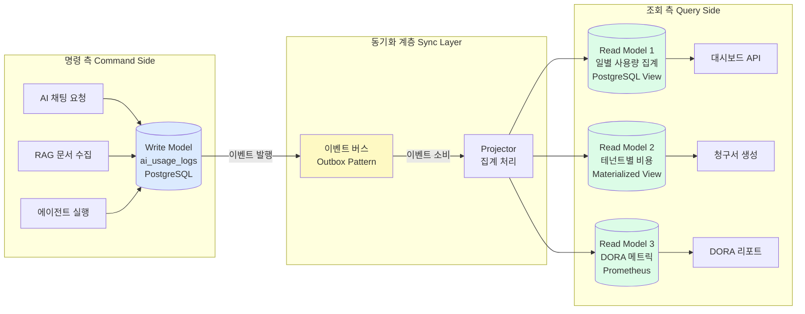
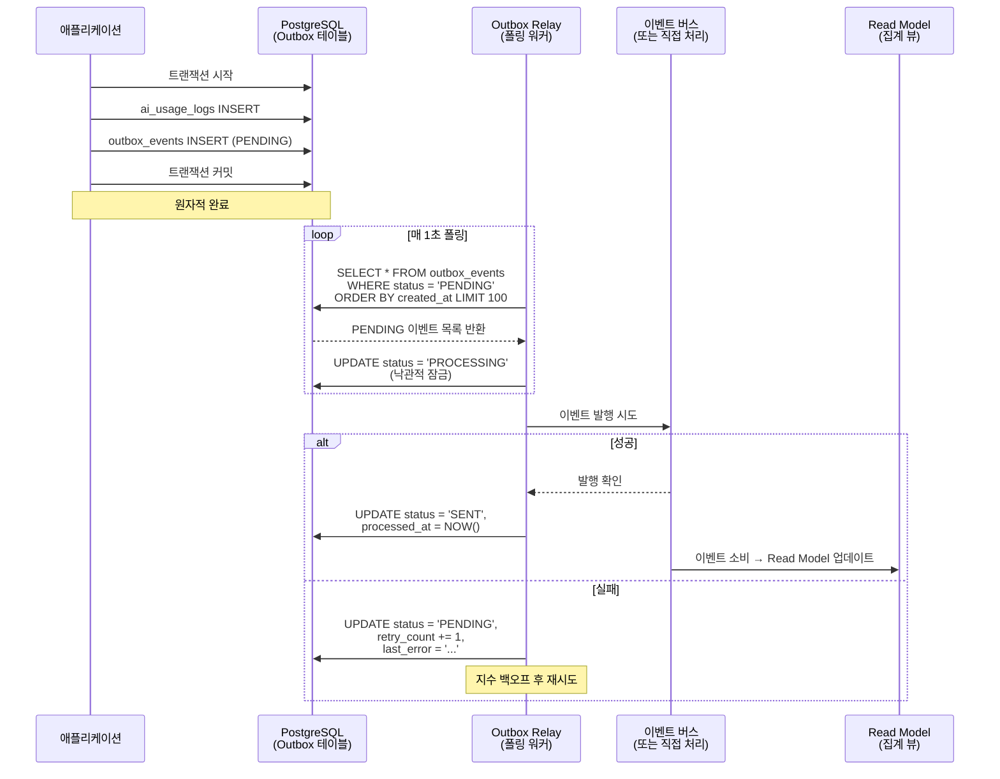

# 18. 데이터 일관성 패턴 — 최종 일관성, CQRS Read Model, Outbox 패턴, 이벤트 소싱 심화

> **대상 독자**: 분산 시스템에 입문하는 백엔드 개발자
> **선수 지식**: 데이터베이스 트랜잭션 기초, REST API 기초
> **학습 시간**: 약 3시간
> **관련 요구사항**: FR-DORA.1~FR-DORA.5, CSAP D-06

---

## 목차

1. [분산 시스템에서 데이터 일관성이란?](#1-분산-시스템에서-데이터-일관성이란)
2. [CAP 정리 — 세 마리 토끼를 모두 잡을 수 없다](#2-cap-정리--세-마리-토끼를-모두-잡을-수-없다)
3. [최종 일관성(Eventual Consistency) 실전](#3-최종-일관성eventual-consistency-실전)
4. [CQRS Read Model 완전 가이드](#4-cqrs-read-model-완전-가이드)
5. [Outbox 패턴 심화](#5-outbox-패턴-심화)
6. [Saga + Outbox 조합](#6-saga--outbox-조합)
7. [이벤트 소싱(Event Sourcing)](#7-이벤트-소싱event-sourcing)
8. [공공기관 SaaS에서 데이터 일관성](#8-공공기관-saas에서-데이터-일관성)
9. [실습: 구독 상태 동기화 (CQRS 패턴 적용)](#9-실습-구독-상태-동기화-cqrs-패턴-적용)

---

## 1. 분산 시스템에서 데이터 일관성이란?

### 1.1 왜 이 주제가 중요한가?

단일 데이터베이스를 쓰는 모놀리식 시스템에서는 트랜잭션으로 모든 것이 해결됩니다. "사용자 결제 완료 → 구독 활성화" 두 작업을 하나의 트랜잭션에 묶으면 둘 다 성공하거나 둘 다 실패합니다.

그런데 공공기관 SaaS 프레임워크처럼 **마이크로서비스 아키텍처**에서는 이야기가 달라집니다.

```
결제 서비스 (billing-service)   → 결제 완료 기록
구독 서비스 (subscription-service) → 구독 활성화
감사 서비스 (audit-service)      → 감사 로그 기록
AI 서비스  (ai-service)         → AI 한도 업데이트
```

이 네 가지 작업은 **서로 다른 서비스의 서로 다른 데이터베이스**에 저장됩니다. 하나의 트랜잭션으로 묶는 것이 불가능합니다.

만약 결제는 성공했지만 구독 활성화 서비스가 일시적으로 다운되어 있다면 어떻게 될까요? 사용자는 돈을 냈지만 서비스를 못 쓰게 됩니다. 이것이 분산 시스템에서 데이터 일관성 문제입니다.

### 1.2 강한 일관성 vs 최종 일관성

**강한 일관성(Strong Consistency)**
- 모든 읽기 요청이 항상 최신 데이터를 반환합니다.
- 마치 은행 계좌 잔액처럼 — 100만 원을 인출하면 즉시 잔액이 줄어야 합니다.
- 구현: 분산 트랜잭션(2PC), 강한 일관성 데이터베이스(PostgreSQL 동기 복제)
- 비용: 성능 저하, 가용성 감소

**최종 일관성(Eventual Consistency)**
- 데이터가 잠시 동안 일관성이 없을 수 있지만, 충분한 시간이 지나면 모든 복사본이 동일해집니다.
- 마치 소셜 미디어 "좋아요" 수 — 누군가 좋아요를 누르면 몇 초 후에 다른 사용자에게 반영됩니다.
- 구현: 이벤트 기반 동기화, Outbox 패턴, CQRS
- 비용: 구현 복잡도 증가

| 기준 | 강한 일관성 | 최종 일관성 |
|------|-----------|-----------|
| 데이터 신선도 | 항상 최신 | 잠시 지연 가능 |
| 성능 | 낮음 | 높음 |
| 가용성 | 낮음 (락 대기) | 높음 |
| 구현 복잡도 | 단순 | 복잡 |
| 사용 사례 | 금융 거래, 재고 | 읽기 모델, 알림, DORA 메트릭 |

---

## 2. CAP 정리 — 세 마리 토끼를 모두 잡을 수 없다

### 2.1 CAP 정리 설명

CAP 정리는 분산 시스템이 다음 세 가지 특성을 **동시에 모두** 만족할 수 없다는 이론입니다.

- **C (Consistency, 일관성)**: 모든 노드가 동일한 데이터를 반환합니다.
- **A (Availability, 가용성)**: 모든 요청이 (비록 오래된 데이터라도) 응답을 받습니다.
- **P (Partition Tolerance, 분단 허용)**: 네트워크 분단이 발생해도 시스템이 동작합니다.

**실제 네트워크에서 P는 피할 수 없습니다.** 서버 간 네트워크가 순간적으로 끊길 수 있는 것은 현실입니다. 따라서 실제 선택은 **CP vs AP**입니다.

```
공공기관 SaaS 선택 전략:

[결제/인증/권한]        → CP 선택
  - 일관성이 필수
  - PostgreSQL 동기 복제
  - 서비스 불가보다 오류 메시지가 낫다

[DORA 메트릭/감사 로그 읽기 모델/AI 사용량 대시보드] → AP 선택
  - 약간 오래된 데이터 허용
  - 최종 일관성으로 높은 가용성 확보
  - 이벤트 기반 동기화
```

### 2.2 PACELC 정리 — 현실적인 확장

CAP 정리는 "네트워크 분단 시" 상황만 다룹니다. Eric Brewer가 확장한 PACELC는 정상 동작 시에도 지연(Latency)과 일관성(Consistency) 간 트레이드오프가 있다고 설명합니다.

```
P (네트워크 분단 시):  A (가용성) 또는 C (일관성)
E (정상 동작 시):      L (낮은 지연) 또는 C (일관성)

PostgreSQL 동기 복제:  PA/EC (분단 시 가용성, 정상 시 일관성)
Redis + Sentinel:      PA/EL (분단 시 가용성, 정상 시 낮은 지연)
```

---

## 3. 최종 일관성(Eventual Consistency) 실전

### 3.1 언제 최종 일관성을 허용할 수 있는가?

다음 질문에 답하여 최종 일관성 허용 여부를 결정합니다.

1. **데이터가 잠시 오래될 경우 사용자에게 실질적 피해가 있는가?**
   - DORA 메트릭 대시보드: 5분 전 데이터를 보여줘도 무방 → 최종 일관성 OK
   - 민원 처리 상태: 실시간 정확성이 중요 → 강한 일관성 필요

2. **보상 가능한가?**
   - AI 사용량이 잠시 과대 집계되어도 다음 집계 시 보정 가능 → OK
   - 이미 지급된 환불은 취소 불가 → 강한 일관성 필요

3. **CSAP/감사 요건이 있는가?**
   - 감사 로그(Audit Log): 지연 허용 가능, 단 손실 불가 → Outbox 패턴 필수

### 3.2 DORA 익스포터에서 최종 일관성 패턴

`/data/ai-saas/packages/dora-exporter/src/index.ts`의 실제 구현을 보면 최종 일관성을 적용한 전형적인 패턴이 있습니다.

```typescript
// dora-exporter/src/index.ts의 이벤트 큐 패턴
// Design Ref: §3.3 — 이벤트 큐 핸들러

// 이벤트 큐 생성 (최종 일관성 구현체)
const eventQueue = new EventQueue({ maxQueueSize: 10000, maxRetries: 3 });

// 핸들러 등록: 이벤트가 나중에 처리되어도 결국 메트릭에 반영됨
eventQueue.setHandler(async (event) => {
  const { team, service, environment, type } = event;
  if (type === DORAEventType.Deployment) {
    deploymentTotal.inc({ team, service, environment });
  } else if (type === DORAEventType.DeploymentFailure) {
    changeFailureDetector.recordFailure(team, service);
    changeFailureRate.set({ team, service }, changeFailureDetector.getRate(team, service));
  }
});

// Gitea 웹훅 수신 — 즉시 응답, 처리는 나중에
app.post('/webhook/gitea', async (req, res) => {
  const payload = giteaWebhookSchema.parse(req.body);

  // 웹훅은 즉시 수락 응답 (가용성 보장)
  res.status(200).json({ status: 'accepted' });

  // 실제 처리는 큐에 넣어 나중에 처리 (최종 일관성)
  // 큐 처리가 실패해도 웹훅 응답에 영향 없음
  await eventQueue.enqueue({
    team: extractTeam(payload.repository.full_name),
    service: extractService(payload.repository.full_name),
    type: DORAEventType.Deployment,
    // ...
  });
});
```

이 패턴의 핵심: **즉시 응답 + 비동기 처리** = 높은 가용성 + 최종 일관성

### 3.3 사용자에게 최종 일관성이 보이는 방식

```typescript
// 사용자가 DORA 대시보드를 볼 때
// 배포 이벤트 발생 후 몇 초 이내에 메트릭이 업데이트됨

// 프론트엔드에서 "약간 오래된 데이터" 표시 패턴
interface DashboardData {
  metrics: DoraMetrics;
  lastUpdated: string;      // "방금 전", "5분 전" 표시
  isStale: boolean;         // 5분 이상 오래된 경우 경고 표시
}

// 사용자에게 데이터 신선도를 명확히 알림
function renderDashboard(data: DashboardData) {
  if (data.isStale) {
    return `[데이터 갱신 중...] ${data.lastUpdated} 기준`;
  }
  return `최신 데이터 (${data.lastUpdated} 갱신)`;
}
```

---

## 4. CQRS Read Model 완전 가이드

### 4.1 CQRS란?

CQRS(Command Query Responsibility Segregation, 명령 쿼리 책임 분리)는 데이터를 **변경하는 작업(Command)**과 **읽는 작업(Query)**을 분리하는 패턴입니다.

**왜 분리하는가?**

공공기관 SaaS 대시보드에서 "이번 달 전체 테넌트의 AI 사용량 통계"를 보여줘야 할 때, 원본 데이터베이스에서 직접 집계하면 다음 문제가 생깁니다.

- 수백만 행을 집계하는 복잡한 JOIN 쿼리가 실행됩니다.
- 쿼리 중 다른 사용자의 쓰기 작업이 느려집니다.
- 대시보드 로딩이 수초 걸립니다.

CQRS는 이 문제를 **읽기에 최적화된 별도 데이터 구조(Read Model)**를 만들어 해결합니다.



### 4.2 Write Model과 Read Model 구조

```typescript
// Write Model — 정규화된 원본 데이터
// 정확성이 중요, 변경 추적 가능

// Prisma 스키마 (Write Model)
model AiUsageLog {
  id          String   @id @default(cuid())
  tenantId    String
  modelId     String
  requestType String   // 'chat', 'embed', 'rag', 'agent'
  tokensUsed  Int
  costUsd     Float
  latencyMs   Int
  success     Boolean
  createdAt   DateTime @default(now())

  @@index([tenantId, createdAt])
  @@index([modelId, createdAt])
}

// Read Model — 읽기에 최적화된 집계 데이터
// PostgreSQL Materialized View로 구현

/*
  CREATE MATERIALIZED VIEW ai_usage_daily_summary AS
  SELECT
    tenant_id,
    DATE_TRUNC('day', created_at) AS usage_date,
    model_id,
    request_type,
    COUNT(*) AS request_count,
    SUM(tokens_used) AS total_tokens,
    SUM(cost_usd) AS total_cost_usd,
    AVG(latency_ms)::int AS avg_latency_ms,
    SUM(CASE WHEN success THEN 1 ELSE 0 END)::float / COUNT(*) AS success_rate
  FROM ai_usage_logs
  GROUP BY tenant_id, DATE_TRUNC('day', created_at), model_id, request_type
  WITH DATA;

  CREATE UNIQUE INDEX ON ai_usage_daily_summary
    (tenant_id, usage_date, model_id, request_type);
*/

// Read Model 조회 (빠른 집계)
async function getDailyUsageSummary(tenantId: string, days: number) {
  return prisma.$queryRaw`
    SELECT
      usage_date AS "usageDate",
      SUM(request_count) AS "requestCount",
      SUM(total_tokens) AS "totalTokens",
      SUM(total_cost_usd) AS "totalCostUsd",
      AVG(avg_latency_ms) AS "avgLatencyMs"
    FROM ai_usage_daily_summary
    WHERE tenant_id = ${tenantId}
      AND usage_date >= CURRENT_DATE - INTERVAL '${days} days'
    GROUP BY usage_date
    ORDER BY usage_date DESC
  `;
}
```

### 4.3 Read Model 동기화 전략

**방법 1: Materialized View 주기적 갱신**
```sql
-- 5분마다 비동기 갱신 (크론 또는 타이머)
REFRESH MATERIALIZED VIEW CONCURRENTLY ai_usage_daily_summary;
-- CONCURRENTLY: 갱신 중에도 읽기 가능 (다운타임 없음)
-- 단, 고유 인덱스가 있어야 CONCURRENTLY 사용 가능
```

**방법 2: 이벤트 기반 Projection**
```typescript
// AI 사용 이벤트를 구독하여 Read Model 실시간 업데이트
// dora-exporter의 eventQueue 패턴과 동일

class AiUsageProjector {
  async handleAiUsageEvent(event: AiUsageEvent): Promise<void> {
    // Upsert로 Read Model 업데이트
    await prisma.$executeRaw`
      INSERT INTO ai_usage_daily_summary
        (tenant_id, usage_date, model_id, request_type,
         request_count, total_tokens, total_cost_usd)
      VALUES
        (${event.tenantId}, DATE_TRUNC('day', ${event.createdAt}::timestamp),
         ${event.modelId}, ${event.requestType},
         1, ${event.tokensUsed}, ${event.costUsd})
      ON CONFLICT (tenant_id, usage_date, model_id, request_type)
      DO UPDATE SET
        request_count = ai_usage_daily_summary.request_count + 1,
        total_tokens = ai_usage_daily_summary.total_tokens + EXCLUDED.total_tokens,
        total_cost_usd = ai_usage_daily_summary.total_cost_usd + EXCLUDED.total_cost_usd,
        updated_at = NOW()
    `;
  }
}
```

**방법 3: DORA 익스포터 방식 (Prometheus Gauge)**
`dora-exporter/src/index.ts`에서 `changeFailureRate`를 Gauge로 유지하는 것이 바로 Read Model의 또 다른 형태입니다. Prometheus 메트릭 자체가 Read Model입니다.

```typescript
// Prometheus Gauge = 실시간 Read Model
const changeFailureRate = new Gauge({
  name: 'dora_change_failure_rate',
  help: '변경 실패율 (0.0 ~ 1.0)',
  labelNames: ['team', 'service'],
});

// Write 이벤트 발생 시 Read Model(Gauge) 즉시 업데이트
changeFailureDetector.recordFailure(team, service);
changeFailureRate.set({ team, service }, changeFailureDetector.getRate(team, service));
```

---

## 5. Outbox 패턴 심화

### 5.1 이중 쓰기 문제

마이크로서비스에서 흔히 발생하는 실수:

```typescript
// 위험한 패턴 — 이중 쓰기 (Double Write)
async function createAiUsageLog(data: AiUsageData): Promise<void> {
  // 1. 데이터베이스에 저장
  await prisma.aiUsageLog.create({ data });

  // 2. 이벤트 발행 ← 여기서 실패하면?
  // - DB에는 저장됨
  // - 이벤트는 발행 안 됨
  // - Read Model이 동기화되지 않음
  await eventBus.publish('ai.usage.created', data);
}
```

이 패턴의 문제: DB 저장 성공 후 이벤트 발행이 실패하면 **데이터 손실** 없이 **이벤트 손실**이 발생합니다.

### 5.2 Outbox 패턴으로 원자성 보장

Outbox 패턴은 **이벤트 발행을 DB 트랜잭션의 일부**로 만들어 원자성을 보장합니다.

```typescript
// Outbox 테이블 스키마
/*
CREATE TABLE outbox_events (
  id            UUID PRIMARY KEY DEFAULT gen_random_uuid(),
  topic         VARCHAR(255) NOT NULL,    -- 이벤트 토픽 (예: 'ai.usage.created')
  payload       JSONB NOT NULL,           -- 이벤트 페이로드
  status        VARCHAR(20) NOT NULL DEFAULT 'PENDING',  -- PENDING, SENT, FAILED
  created_at    TIMESTAMP NOT NULL DEFAULT NOW(),
  processed_at  TIMESTAMP,
  retry_count   INT NOT NULL DEFAULT 0,
  last_error    TEXT,

  -- 인덱스: PENDING 상태 빠른 조회
  CONSTRAINT status_check CHECK (status IN ('PENDING', 'SENT', 'FAILED'))
);

CREATE INDEX idx_outbox_pending ON outbox_events (created_at)
WHERE status = 'PENDING';
*/

// Outbox 패턴 구현
async function createAiUsageLogWithOutbox(data: AiUsageData): Promise<void> {
  // 하나의 트랜잭션으로 데이터 저장 + 이벤트 저장
  await prisma.$transaction(async (tx) => {
    // 1. 실제 데이터 저장
    const log = await tx.aiUsageLog.create({ data });

    // 2. Outbox에 이벤트 저장 (같은 트랜잭션!)
    await tx.$executeRaw`
      INSERT INTO outbox_events (topic, payload)
      VALUES (
        'ai.usage.created',
        ${JSON.stringify({
          logId: log.id,
          tenantId: data.tenantId,
          modelId: data.modelId,
          tokensUsed: data.tokensUsed,
          costUsd: data.costUsd,
          createdAt: log.createdAt.toISOString(),
        })}::jsonb
      )
    `;
    // 트랜잭션 커밋 시 두 작업 모두 성공 또는 모두 실패
  });
  // 이후 Outbox Relay가 이벤트를 실제 이벤트 버스로 전달
}
```

### 5.3 Outbox 이벤트 발행 워크플로우



### 5.4 Outbox Relay 구현

```typescript
// lib/outbox-relay.ts
// 폴링 기반 Outbox 릴레이 (CDC 없이 구현)

import { prisma } from './prisma.js';

interface OutboxEvent {
  id: string;
  topic: string;
  payload: Record<string, unknown>;
  retryCount: number;
}

type EventHandler = (topic: string, payload: Record<string, unknown>) => Promise<void>;

export class OutboxRelay {
  private handlers = new Map<string, EventHandler[]>();
  private isRunning = false;
  private pollIntervalMs: number;
  private batchSize: number;
  private maxRetries: number;

  constructor(options: {
    pollIntervalMs?: number;
    batchSize?: number;
    maxRetries?: number;
  } = {}) {
    this.pollIntervalMs = options.pollIntervalMs ?? 1000;
    this.batchSize = options.batchSize ?? 100;
    this.maxRetries = options.maxRetries ?? 5;
  }

  // 이벤트 핸들러 등록
  on(topic: string, handler: EventHandler): void {
    if (!this.handlers.has(topic)) {
      this.handlers.set(topic, []);
    }
    this.handlers.get(topic)!.push(handler);
  }

  // 릴레이 시작
  async start(): Promise<void> {
    this.isRunning = true;
    while (this.isRunning) {
      await this.poll();
      await new Promise(resolve => setTimeout(resolve, this.pollIntervalMs));
    }
  }

  // 정상 종료
  stop(): void {
    this.isRunning = false;
  }

  private async poll(): Promise<void> {
    // 처리할 이벤트 조회 (비관적 잠금으로 중복 처리 방지)
    const events = await prisma.$queryRaw<OutboxEvent[]>`
      UPDATE outbox_events
      SET status = 'PROCESSING', processed_at = NOW()
      WHERE id IN (
        SELECT id FROM outbox_events
        WHERE status = 'PENDING'
          AND retry_count < ${this.maxRetries}
        ORDER BY created_at ASC
        LIMIT ${this.batchSize}
        FOR UPDATE SKIP LOCKED  -- 다른 워커가 처리 중인 것 건너뜀
      )
      RETURNING id, topic, payload, retry_count AS "retryCount"
    `;

    // 병렬 처리 (각 이벤트 독립적으로 처리)
    await Promise.allSettled(
      events.map(event => this.processEvent(event))
    );
  }

  private async processEvent(event: OutboxEvent): Promise<void> {
    const handlers = this.handlers.get(event.topic) ?? [];

    try {
      // 등록된 모든 핸들러 실행
      await Promise.all(
        handlers.map(handler => handler(event.topic, event.payload))
      );

      // 성공 처리
      await prisma.$executeRaw`
        UPDATE outbox_events
        SET status = 'SENT', processed_at = NOW()
        WHERE id = ${event.id}
      `;
    } catch (error) {
      const errorMessage = error instanceof Error ? error.message : '알 수 없는 오류';

      // 실패 처리 (재시도 카운트 증가)
      const newRetryCount = event.retryCount + 1;
      const newStatus = newRetryCount >= this.maxRetries ? 'FAILED' : 'PENDING';

      await prisma.$executeRaw`
        UPDATE outbox_events
        SET
          status = ${newStatus},
          retry_count = ${newRetryCount},
          last_error = ${errorMessage}
        WHERE id = ${event.id}
      `;

      process.stderr.write(JSON.stringify({
        level: 'warn',
        component: 'outbox-relay',
        event: 'event_processing_failed',
        eventId: event.id,
        topic: event.topic,
        retryCount: newRetryCount,
        error: errorMessage,
        ts: new Date().toISOString(),
      }) + '\n');
    }
  }
}

// 사용 예시
const relay = new OutboxRelay({ pollIntervalMs: 1000, batchSize: 100 });

// AI 사용량 이벤트 핸들러 등록
relay.on('ai.usage.created', async (topic, payload) => {
  // Read Model 업데이트
  await updateAiUsageSummary(payload as AiUsagePayload);
});

// CSAP D-06: 감사 이벤트 핸들러
relay.on('audit.event', async (topic, payload) => {
  // 감사 로그를 외부 SIEM으로 전송 (선택사항)
  await forwardToSiem(payload);
});

// 릴레이 시작 (백그라운드)
relay.start();
```

### 5.5 CDC (Change Data Capture) vs 폴링

폴링보다 더 효율적인 방법이 CDC입니다. PostgreSQL의 논리 복제(Logical Replication)를 활용하여 데이터 변경 시 즉시 이벤트를 발행합니다.

| 방법 | 지연 | DB 부하 | 구현 복잡도 | 권장 상황 |
|------|------|---------|-----------|----------|
| 폴링 (현재) | 1~5초 | 중간 | 낮음 | 소규모, 구현 우선 |
| CDC (Debezium) | 밀리초 | 낮음 | 높음 | 대규모, 실시간 필요 |
| PostgreSQL LISTEN/NOTIFY | 밀리초 | 매우 낮음 | 중간 | 중간 규모 |

```typescript
// PostgreSQL LISTEN/NOTIFY 기반 CDC (폴링보다 효율적)
// lib/pg-notify-relay.ts

import { Pool } from 'pg';

const notifyPool = new Pool({
  connectionString: process.env['DATABASE_URL'],
  max: 1,  // LISTEN 연결은 1개만 필요
});

export async function startPgNotifyRelay(
  channel: string,
  handler: (payload: unknown) => Promise<void>,
): Promise<void> {
  const client = await notifyPool.connect();

  // PostgreSQL 채널 구독
  await client.query(`LISTEN ${channel}`);

  client.on('notification', async (msg) => {
    if (msg.channel === channel && msg.payload) {
      try {
        const payload = JSON.parse(msg.payload);
        await handler(payload);
      } catch (error) {
        process.stderr.write(`NOTIFY 처리 실패: ${error}\n`);
      }
    }
  });

  // 연결 유지 (핑-퐁)
  setInterval(async () => {
    await client.query('SELECT 1');
  }, 10000);
}

// DB 트리거로 자동 NOTIFY 발행 (마이그레이션)
/*
CREATE OR REPLACE FUNCTION notify_outbox_insert()
RETURNS TRIGGER AS $$
BEGIN
  PERFORM pg_notify('outbox_events', row_to_json(NEW)::text);
  RETURN NEW;
END;
$$ LANGUAGE plpgsql;

CREATE TRIGGER outbox_insert_trigger
AFTER INSERT ON outbox_events
FOR EACH ROW EXECUTE FUNCTION notify_outbox_insert();
*/
```

---

## 6. Saga + Outbox 조합

### 6.1 Saga 패턴 복습

Saga는 여러 마이크로서비스에 걸친 트랜잭션을 관리하는 패턴입니다. 각 단계가 실패하면 이전 단계를 보상(Compensate)합니다.

```typescript
// 구독 활성화 Saga (Orchestration 방식)
// compliance-service의 logComplianceEvent 패턴을 활용

class SubscriptionActivationSaga {
  async execute(tenantId: string, planId: string): Promise<void> {
    const sagaId = crypto.randomUUID();

    try {
      // Step 1: 결제 확인
      await this.confirmPayment(sagaId, tenantId, planId);

      // Step 2: 구독 활성화
      await this.activateSubscription(sagaId, tenantId, planId);

      // Step 3: AI 한도 설정
      await this.setAiQuota(sagaId, tenantId, planId);

      // Step 4: 감사 로그 (CSAP D-06)
      await this.logSuccess(sagaId, tenantId, planId);

    } catch (error) {
      // 보상 트랜잭션 실행
      await this.compensate(sagaId, tenantId, error);
      throw error;
    }
  }

  private async compensate(
    sagaId: string,
    tenantId: string,
    error: unknown,
  ): Promise<void> {
    // 역순으로 보상 실행
    await this.rollbackAiQuota(sagaId, tenantId);
    await this.rollbackSubscription(sagaId, tenantId);
    // 결제는 환불 로직이 복잡하므로 수동 검토 큐로

    // 감사 로그: 실패 이벤트 기록 (CSAP D-06)
    await logComplianceEvent('SUBSCRIPTION_ACTIVATION_FAILED', {
      sagaId,
      tenantId,
      error: error instanceof Error ? error.message : '알 수 없는 오류',
    });
  }
}
```

### 6.2 Saga + Outbox 조합

각 Saga 단계의 이벤트를 Outbox를 통해 발행하여 신뢰성을 보장합니다.

```typescript
// Saga 상태를 DB에 저장 + Outbox로 이벤트 발행
async function confirmPaymentWithOutbox(
  sagaId: string,
  tenantId: string,
  planId: string,
): Promise<void> {
  await prisma.$transaction(async (tx) => {
    // 1. Saga 상태 업데이트
    await tx.$executeRaw`
      INSERT INTO saga_instances (id, type, status, tenant_id, data)
      VALUES (${sagaId}, 'SUBSCRIPTION_ACTIVATION', 'PAYMENT_CONFIRMED',
              ${tenantId}, ${JSON.stringify({ planId })}::jsonb)
      ON CONFLICT (id) DO UPDATE SET
        status = 'PAYMENT_CONFIRMED',
        updated_at = NOW()
    `;

    // 2. Outbox에 이벤트 저장 (같은 트랜잭션)
    await tx.$executeRaw`
      INSERT INTO outbox_events (topic, payload)
      VALUES (
        'subscription.payment.confirmed',
        ${JSON.stringify({ sagaId, tenantId, planId })}::jsonb
      )
    `;
  });
}
```

---

## 7. 이벤트 소싱(Event Sourcing)

### 7.1 이벤트 소싱이란?

이벤트 소싱은 애플리케이션 상태를 **현재 상태가 아닌 상태 변화 이벤트의 시퀀스**로 저장하는 패턴입니다.

**비유**: 은행 계좌를 "현재 잔액: 100만 원"으로 저장하는 대신, "입금 50만, 인출 20만, 이자 70만..." 등 모든 거래 내역을 저장합니다. 현재 잔액은 거래 내역을 재생하여 계산합니다.

**공공기관 SaaS에서 활용 사례**:
- AI 에이전트의 Thought-Action-Observation 이력 (routes.ts의 agent 관련 엔드포인트)
- 구독 상태 변화 이력 (활성화 → 정지 → 재활성화)
- 감사 로그 자체가 이벤트 소싱의 한 형태

### 7.2 이벤트 스토어 구현

```typescript
// 이벤트 스토어 스키마
/*
CREATE TABLE event_store (
  id              UUID PRIMARY KEY DEFAULT gen_random_uuid(),
  aggregate_id    UUID NOT NULL,     -- 집합체 ID (예: 구독 ID)
  aggregate_type  VARCHAR(100) NOT NULL, -- 집합체 유형 (예: 'Subscription')
  event_type      VARCHAR(200) NOT NULL, -- 이벤트 유형 (예: 'SubscriptionActivated')
  event_version   INT NOT NULL,         -- 낙관적 동시성 제어
  payload         JSONB NOT NULL,        -- 이벤트 데이터
  metadata        JSONB,                 -- 메타데이터 (actor, tenantId, traceId)
  created_at      TIMESTAMP NOT NULL DEFAULT NOW(),

  -- 같은 집합체의 같은 버전은 하나만 (동시성 충돌 방지)
  UNIQUE (aggregate_id, event_version)
);

CREATE INDEX idx_event_store_aggregate ON event_store
  (aggregate_id, event_version);
CREATE INDEX idx_event_store_type ON event_store
  (aggregate_type, created_at);
*/

// 이벤트 저장 (낙관적 동시성 제어)
async function appendEvent(
  aggregateId: string,
  aggregateType: string,
  eventType: string,
  expectedVersion: number,  // 현재 알고 있는 마지막 버전
  payload: Record<string, unknown>,
  metadata: Record<string, unknown>,
): Promise<void> {
  const newVersion = expectedVersion + 1;

  const result = await prisma.$executeRaw`
    INSERT INTO event_store
      (aggregate_id, aggregate_type, event_type, event_version, payload, metadata)
    VALUES
      (${aggregateId}, ${aggregateType}, ${eventType}, ${newVersion},
       ${JSON.stringify(payload)}::jsonb, ${JSON.stringify(metadata)}::jsonb)
    ON CONFLICT (aggregate_id, event_version) DO NOTHING
    RETURNING id
  `;

  if (result === 0) {
    // 버전 충돌 — 다른 프로세스가 먼저 이벤트를 저장함
    throw new Error(`동시성 충돌: ${aggregateId} v${newVersion}이 이미 존재`);
  }
}

// 이벤트 로드 (특정 버전까지)
async function loadEvents(
  aggregateId: string,
  fromVersion = 0,
  toVersion?: number,
): Promise<EventRecord[]> {
  return prisma.$queryRaw<EventRecord[]>`
    SELECT
      id,
      aggregate_id AS "aggregateId",
      aggregate_type AS "aggregateType",
      event_type AS "eventType",
      event_version AS "eventVersion",
      payload,
      metadata,
      created_at AS "createdAt"
    FROM event_store
    WHERE aggregate_id = ${aggregateId}
      AND event_version >= ${fromVersion}
      ${toVersion !== undefined
        ? prisma.$queryRaw`AND event_version <= ${toVersion}`
        : prisma.$queryRaw``}
    ORDER BY event_version ASC
  `;
}
```

### 7.3 이벤트 스냅샷

이벤트 수가 많아질수록 재생 시간이 증가합니다. 스냅샷으로 최적화합니다.

```typescript
// 구독 상태 집합체 (이벤트 소싱)
interface SubscriptionState {
  id: string;
  tenantId: string;
  status: 'INACTIVE' | 'ACTIVE' | 'SUSPENDED' | 'CANCELLED';
  planId: string;
  aiQuota: number;
  version: number;
}

class SubscriptionAggregate {
  private state: SubscriptionState;
  private pendingEvents: EventRecord[] = [];

  constructor(initialState: SubscriptionState) {
    this.state = initialState;
  }

  // 이벤트 재생으로 상태 복원
  static rehydrate(events: EventRecord[]): SubscriptionAggregate {
    const initialState: SubscriptionState = {
      id: '',
      tenantId: '',
      status: 'INACTIVE',
      planId: '',
      aiQuota: 0,
      version: 0,
    };

    const aggregate = new SubscriptionAggregate(initialState);

    for (const event of events) {
      aggregate.applyEvent(event);
    }

    return aggregate;
  }

  private applyEvent(event: EventRecord): void {
    switch (event.eventType) {
      case 'SubscriptionActivated':
        this.state.status = 'ACTIVE';
        this.state.planId = event.payload['planId'] as string;
        this.state.aiQuota = event.payload['aiQuota'] as number;
        break;
      case 'SubscriptionSuspended':
        this.state.status = 'SUSPENDED';
        break;
      case 'AiQuotaUpdated':
        this.state.aiQuota = event.payload['newQuota'] as number;
        break;
      case 'SubscriptionCancelled':
        this.state.status = 'CANCELLED';
        break;
    }
    this.state.version = event.eventVersion;
  }

  // 스냅샷 저장 (100개 이벤트마다)
  async saveSnapshot(): Promise<void> {
    if (this.state.version % 100 === 0) {
      await prisma.$executeRaw`
        INSERT INTO aggregate_snapshots
          (aggregate_id, aggregate_type, version, state)
        VALUES
          (${this.state.id}, 'Subscription', ${this.state.version},
           ${JSON.stringify(this.state)}::jsonb)
        ON CONFLICT (aggregate_id)
        DO UPDATE SET
          version = EXCLUDED.version,
          state = EXCLUDED.state,
          created_at = NOW()
      `;
    }
  }
}

// 스냅샷 + 증분 이벤트로 효율적 복원
async function loadSubscription(subscriptionId: string): Promise<SubscriptionAggregate> {
  // 1. 최신 스냅샷 조회
  const snapshot = await prisma.$queryRaw<Array<{
    version: number;
    state: SubscriptionState;
  }>>`
    SELECT version, state
    FROM aggregate_snapshots
    WHERE aggregate_id = ${subscriptionId}
      AND aggregate_type = 'Subscription'
  `;

  const fromVersion = snapshot[0]?.version ?? 0;
  const initialState = snapshot[0]?.state;

  // 2. 스냅샷 이후 이벤트만 로드
  const events = await loadEvents(subscriptionId, fromVersion);

  // 3. 스냅샷 상태에서 증분 재생
  if (initialState) {
    const aggregate = new SubscriptionAggregate(initialState);
    // 스냅샷 이후 이벤트만 재생 (효율적)
    for (const event of events.filter(e => e.eventVersion > fromVersion)) {
      aggregate['applyEvent'](event);
    }
    return aggregate;
  }

  // 스냅샷 없으면 처음부터 재생
  return SubscriptionAggregate.rehydrate(events);
}
```

---

## 8. 공공기관 SaaS에서 데이터 일관성

### 8.1 CSAP D-06 감사 로그 일관성 요건

CSAP D-06(침해사고 관리)은 감사 로그에 대해 다음을 요구합니다.

- **손실 없음**: 모든 민감 작업은 반드시 로그가 남아야 합니다.
- **수정 불가**: 로그는 append-only, 수정/삭제 불가능해야 합니다.
- **최소 1년 보존**: 감사 로그는 1년 이상 보존해야 합니다.

`compliance-service/src/lib/audit.ts`의 패턴이 이를 충족합니다.

```typescript
// compliance-service/src/lib/audit.ts 분석
// CSAP D-06 준수 패턴

export async function logComplianceEvent(
  action: string,
  metadata?: Record<string, unknown>,
): Promise<void> {
  // @public-saas/audit-sdk의 createAuditLogger 사용
  // audit-sdk는 내부적으로 Outbox 패턴으로 손실 없음 보장
  await auditLogger.log({
    actor: 'system:compliance-service',
    action,
    target: 'compliance',
    targetType: 'compliance',
    tenantId: 'system',
    ip: process.env.SERVICE_IP || '127.0.0.1',
    userAgent: 'compliance-service/1.0',
    metadata,
  });
}

// audit-sdk 내부 동작 (추정)
// 1. 감사 이벤트를 DB 트랜잭션으로 audit_logs에 INSERT (Outbox와 함께)
// 2. Outbox Relay가 외부 SIEM으로 이벤트 전달
// 3. 실패 시 재시도 (손실 없음 보장)
```

### 8.2 N2SF 데이터 등급별 일관성 전략

```typescript
// 데이터 등급에 따른 일관성 전략 결정
enum N2sfGrade { C = 'C', S = 'S', O = 'O' }
enum ConsistencyLevel { STRONG = 'STRONG', EVENTUAL = 'EVENTUAL' }

function determineConsistencyLevel(grade: N2sfGrade): ConsistencyLevel {
  switch (grade) {
    case N2sfGrade.C:
    case N2sfGrade.S:
      // 기밀/민감 데이터: 강한 일관성 필수
      // (AI API 전송 자체가 금지이므로 내부 처리에서만 발생)
      return ConsistencyLevel.STRONG;
    case N2sfGrade.O:
      // 공개 데이터: 최종 일관성 허용 (AI API 연동 시)
      return ConsistencyLevel.EVENTUAL;
  }
}
```

### 8.3 DORA 익스포터의 감사 증거

`dora-exporter/src/index.ts`의 `/report/weekly?format=evidence` 엔드포인트는 CSAP 감사 증거를 자동 생성합니다.

```typescript
// dora-exporter/src/index.ts의 감사 증거 엔드포인트
app.get('/report/weekly', async (req, res) => {
  const format = req.query.format as string;

  if (format === 'evidence') {
    // CSAP D-06, D-12 감사 증거 생성
    const evidence = reportGenerator.generateAuditEvidence({
      csapRefs: ['D-06', 'D-12'],
    });
    res.status(200).json(evidence);
  }
  // ...
});
```

이것이 바로 CQRS의 실제 적용입니다. DORA 메트릭(Write Model)에서 감사 증거 보고서(Read Model)를 생성합니다.

---

## 9. 실습: 구독 상태 동기화 (CQRS 패턴 적용)

### 9.1 실습 목표

구독 서비스의 상태 변경 이벤트를 Outbox 패턴으로 발행하고, Read Model(대시보드용 집계 뷰)을 동기화하는 전체 흐름을 구현합니다.

### 9.2 시나리오

1. 테넌트가 구독 플랜을 변경합니다.
2. 결제가 완료됩니다.
3. 구독 상태가 업데이트됩니다.
4. AI 서비스의 한도가 업데이트됩니다.
5. 감사 로그가 기록됩니다.
6. 대시보드 Read Model이 동기화됩니다.

### 9.3 구현 코드

```typescript
// subscription-service/src/lib/subscription-handler.ts

import { prisma } from './prisma.js';
import { logComplianceEvent } from './audit.js';

interface PlanChangedEvent {
  tenantId: string;
  oldPlanId: string;
  newPlanId: string;
  newAiQuota: number;
  actorId: string;
}

/**
 * 구독 플랜 변경 처리 (CQRS + Outbox)
 * Plan SC: FR-AI26.1 (AI 한도 동기화)
 * CSAP: D-06 (감사 로그), D-08 (접근 제어)
 */
export async function handlePlanChange(event: PlanChangedEvent): Promise<void> {
  await prisma.$transaction(async (tx) => {
    // 1. Write Model 업데이트 — 구독 상태 변경
    await tx.$executeRaw`
      UPDATE subscriptions
      SET
        plan_id = ${event.newPlanId},
        ai_quota = ${event.newAiQuota},
        status = 'ACTIVE',
        updated_at = NOW()
      WHERE tenant_id = ${event.tenantId}
    `;

    // 2. Outbox에 이벤트 저장 (원자적)
    await tx.$executeRaw`
      INSERT INTO outbox_events (topic, payload)
      VALUES (
        'subscription.plan.changed',
        ${JSON.stringify({
          tenantId: event.tenantId,
          oldPlanId: event.oldPlanId,
          newPlanId: event.newPlanId,
          newAiQuota: event.newAiQuota,
          changedAt: new Date().toISOString(),
        })}::jsonb
      )
    `;

    // 3. 감사 로그 Outbox (CSAP D-06)
    await tx.$executeRaw`
      INSERT INTO outbox_events (topic, payload)
      VALUES (
        'audit.event',
        ${JSON.stringify({
          actor: event.actorId,
          action: 'SUBSCRIPTION_PLAN_CHANGED',
          target: event.tenantId,
          targetType: 'subscription',
          metadata: {
            oldPlanId: event.oldPlanId,
            newPlanId: event.newPlanId,
          },
        })}::jsonb
      )
    `;
  });
  // 트랜잭션 커밋: Write Model + 두 개의 Outbox 이벤트 원자적 저장
}

// Outbox Relay 핸들러: 구독 변경 → Read Model 동기화
async function handleSubscriptionChanged(
  topic: string,
  payload: Record<string, unknown>,
): Promise<void> {
  const { tenantId, newPlanId, newAiQuota } = payload as {
    tenantId: string;
    newPlanId: string;
    newAiQuota: number;
  };

  // Read Model 업데이트 (대시보드용 집계)
  await prisma.$executeRaw`
    INSERT INTO tenant_subscription_summary
      (tenant_id, current_plan_id, ai_quota_limit, last_changed_at)
    VALUES
      (${tenantId}, ${newPlanId}, ${newAiQuota}, NOW())
    ON CONFLICT (tenant_id)
    DO UPDATE SET
      current_plan_id = EXCLUDED.current_plan_id,
      ai_quota_limit = EXCLUDED.ai_quota_limit,
      last_changed_at = EXCLUDED.last_changed_at
  `;

  // AI 서비스에 한도 변경 알림 (서비스 간 이벤트)
  await notifyAiServiceQuotaChange(tenantId, newAiQuota);
}
```

### 9.4 대시보드 Read Model 조회

```typescript
// 대시보드 API — Read Model에서 빠른 조회
async function getTenantDashboard(tenantId: string) {
  const [subscriptionSummary, usageSummary] = await Promise.all([
    // Read Model 1: 구독 현황 (즉시 조회, 집계 불필요)
    prisma.$queryRaw`
      SELECT
        tss.current_plan_id AS "currentPlanId",
        tss.ai_quota_limit AS "aiQuotaLimit",
        tss.last_changed_at AS "lastChangedAt",
        p.name AS "planName",
        p.monthly_cost AS "monthlyCost"
      FROM tenant_subscription_summary tss
      JOIN plans p ON p.id = tss.current_plan_id
      WHERE tss.tenant_id = ${tenantId}
    `,

    // Read Model 2: 이번 달 AI 사용량 (Materialized View)
    prisma.$queryRaw`
      SELECT
        SUM(request_count) AS "totalRequests",
        SUM(total_tokens) AS "totalTokens",
        SUM(total_cost_usd) AS "totalCostUsd"
      FROM ai_usage_daily_summary
      WHERE tenant_id = ${tenantId}
        AND usage_date >= DATE_TRUNC('month', CURRENT_DATE)
    `,
  ]);

  return {
    subscription: subscriptionSummary[0],
    usage: usageSummary[0],
    // 두 Read Model의 데이터가 잠시 다를 수 있음 (최종 일관성)
    // 하지만 몇 초 이내 동기화됨
    dataFreshnessNote: '데이터는 최대 5초 지연될 수 있습니다.',
  };
}
```

### 9.5 실습 실행

```bash
# 1. 데이터베이스 마이그레이션 실행
cd /data/ai-saas
pnpm prisma migrate dev --name add_outbox_and_read_models

# 2. Outbox Relay 시작 (개발 환경)
pnpm --filter @public-saas/subscription-service run:relay

# 3. 구독 변경 테스트
curl -X POST http://localhost:3001/api/subscriptions/change-plan \
  -H "Content-Type: application/json" \
  -H "x-internal-service-key: dev-key" \
  -d '{
    "tenantId": "550e8400-e29b-41d4-a716-446655440000",
    "newPlanId": "enterprise",
    "actorId": "admin-user-id"
  }'

# 4. Outbox 처리 확인
psql $DATABASE_URL -c "
  SELECT topic, status, created_at, processed_at
  FROM outbox_events
  ORDER BY created_at DESC
  LIMIT 10;
"

# 5. Read Model 확인
psql $DATABASE_URL -c "
  SELECT *
  FROM tenant_subscription_summary
  WHERE tenant_id = '550e8400-e29b-41d4-a716-446655440000';
"
```

---

## 패턴 선택 가이드

```
데이터 일관성 패턴 선택:

Q1. 여러 서비스에 걸친 작업인가?
  아니오 → 단일 DB 트랜잭션 사용
  예     → Q2로

Q2. 작업 실패 시 보상이 필요한가?
  예     → Saga 패턴 사용
  아니오 → Q3으로

Q3. 이벤트 발행의 원자성이 필요한가?
  예     → Outbox 패턴 사용
  아니오 → 직접 이벤트 발행

Q4. 읽기 성능이 중요한가?
  예     → CQRS (Read Model 분리)
  아니오 → 단순 쿼리 사용

Q5. 상태 변화 이력이 중요한가?
  예     → 이벤트 소싱 + Outbox
  아니오 → 현재 상태만 저장
```

---

## 참고 자료

- [Martin Fowler — Event Sourcing](https://martinfowler.com/eaaDev/EventSourcing.html)
- [Martin Fowler — CQRS](https://martinfowler.com/bliki/CQRS.html)
- [Microservices.io — Outbox Pattern](https://microservices.io/patterns/data/transactional-outbox.html)
- [Microservices.io — Saga Pattern](https://microservices.io/patterns/data/saga.html)
- CAP 정리 원본 논문 (Eric Brewer, 2000)
- CSAP 보안인증 기준서 D-06 (침해사고 관리)

---

> **이전 가이드**: [17. Saga 패턴 심화](./17-saga-patterns-advanced.md)
> **다음 가이드**: [19. 서비스 디스커버리와 로드 밸런싱](./19-service-discovery.md)
