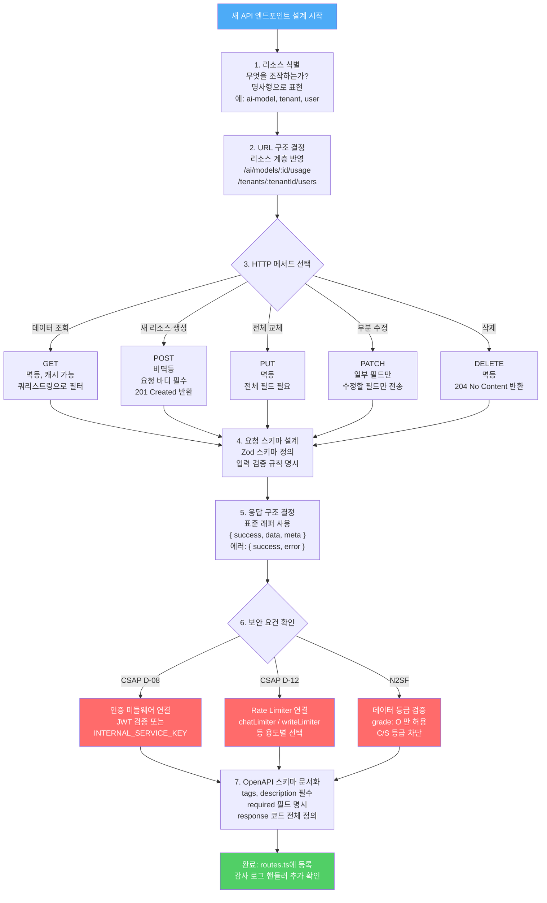
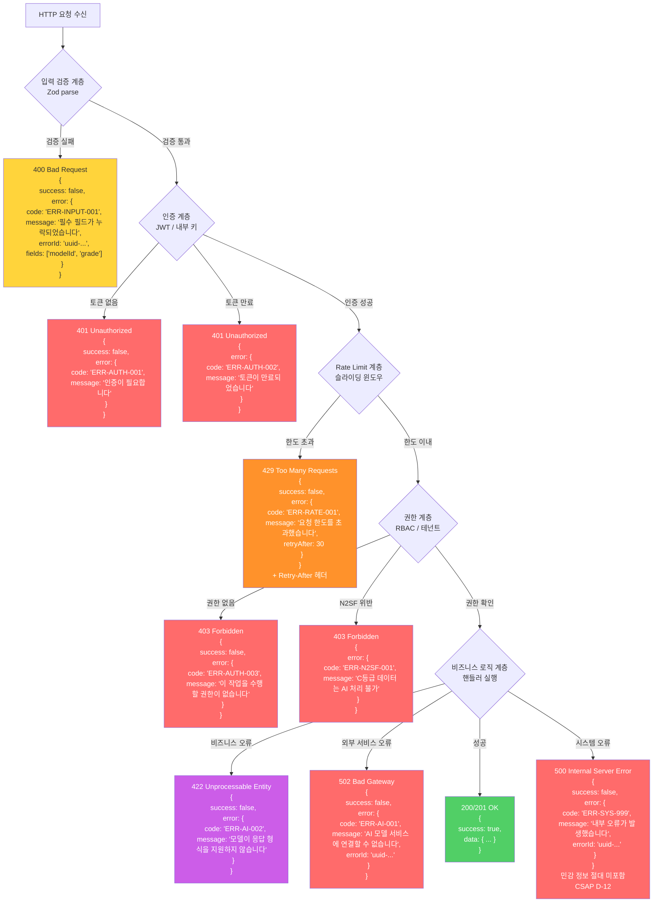

# API 설계 모범 사례 — RESTful API 완전 가이드, 에러 응답 표준화, 버전 관리, 공공기관 API 표준

> **문서 ID**: ONBOARD-02-19
> **버전**: 1.0.0 | **작성일**: 2026-04-13 | **작성자**: Implementer (Sonnet)
> **선행 학습**: `02-architecture/14-api-versioning.md`, `03-development/12-api-design-guide.md`
> **소요 시간**: 약 5~7시간 (실습 포함)
> **CSAP**: D-06 (감사 로깅), D-08 (접근 통제), D-12 (시스템 개발 보안)
> **관련 코드**: `platform/services/ai-service/src/routes.ts`

---

## 목차

1. [API 설계 원칙](#1-api-설계-원칙)
2. [URL 설계](#2-url-설계)
3. [HTTP 메서드 올바른 사용](#3-http-메서드-올바른-사용)
4. [요청/응답 표준화](#4-요청응답-표준화)
5. [에러 응답 표준화](#5-에러-응답-표준화)
6. [API 버전 관리](#6-api-버전-관리)
7. [API 문서화 필수 요소](#7-api-문서화-필수-요소)
8. [공공기관 SaaS API 특수 요건](#8-공공기관-saas-api-특수-요건)
9. [실습: 표준 API 템플릿으로 엔드포인트 작성](#9-실습-표준-api-템플릿으로-엔드포인트-작성)
10. [변경 이력](#10-변경-이력)

---

## 1. API 설계 원칙

### 1.1 초급자를 위한 설명: "API는 계약이다"

API(Application Programming Interface)를 처음 접하는 개발자에게 가장 중요한 것은 "API는 클라이언트와 서버 사이의 계약"이라는 개념입니다.

```
[비유] 식당 메뉴판과 API

메뉴판:
  - 제품 목록 (리소스)
  - 주문 방법 (요청 형식)
  - 가격 (응답 형식)
  - 규칙 ("반찬은 무료 리필")

API 명세:
  - 엔드포인트 목록 (리소스)
  - 요청 파라미터 (요청 형식)
  - 응답 구조 (응답 형식)
  - 제약 조건 (Rate Limit, 인증 등)

나쁜 식당 = 메뉴판 없이 매일 다른 음식을 제공
나쁜 API = 명세 없이 매일 다른 응답 구조를 반환
```

공공기관 SaaS에서 API 설계가 특히 중요한 이유:

1. **여러 기관의 클라이언트**: 시군구, 도청, 중앙부처 등 수십 개 기관이 우리 API를 사용합니다.
2. **갱신 주기 불일치**: 클라이언트 시스템은 우리보다 느리게 업데이트됩니다. 하위 호환성이 필수입니다.
3. **감리 대상**: 행안부 감리에서 API 명세 일치 여부를 검사합니다.
4. **보안 규제**: CSAP D-08, D-12에 따라 모든 API에 인증/검증이 필수입니다.

### 1.2 RESTful API 6가지 제약조건

REST(Representational State Transfer)는 API 설계 스타일입니다. 완전한 RESTful API는 다음 6가지 제약을 만족해야 합니다.

| 번호 | 제약조건 | 설명 | 우리 프로젝트 적용 |
|------|---------|------|-----------------|
| 1 | 클라이언트-서버 분리 | UI와 데이터 저장 분리 | Next.js 프론트 ↔ Fastify 백엔드 분리 |
| 2 | 무상태(Stateless) | 각 요청은 완전한 정보 포함 | JWT 토큰으로 상태 유지 (서버 세션 없음) |
| 3 | 캐시 가능 | 응답에 캐시 가능 여부 표시 | Cache-Control 헤더 설정 |
| 4 | 계층형 시스템 | 클라이언트는 직접 연결인지 모름 | API Gateway → Fastify (Linkerd mTLS) |
| 5 | 인터페이스 일관성 | 표준 HTTP 메서드와 상태 코드 | GET/POST/PUT/PATCH/DELETE 표준 준수 |
| 6 | (선택) 코드 온 디맨드 | 서버가 실행 코드 전송 | 우리 프로젝트는 미사용 |

### 1.3 API 설계 의사결정 흐름



### 1.4 공공기관 API 표준 참조

국내 공공기관 API 설계는 다음 표준을 따릅니다.

| 표준 | 기관 | 주요 내용 |
|------|------|---------|
| 행정안전부 API 설계 가이드 | 행안부 | RESTful API, 인증 방식, 에러 코드 체계 |
| 공공데이터 개방 표준 | 행안부 공공데이터포털 | JSON 응답 구조, 인코딩, 페이지네이션 |
| 전자정부 표준프레임워크 | NIA | 서비스 인터페이스 규격 |
| CSAP 개발 보안 (D-12) | KISA | 입력 검증, SQL 주입 방지, 에러 정보 보호 |

---

## 2. URL 설계

### 2.1 리소스 계층 구조

URL은 리소스의 계층 관계를 명확하게 나타내야 합니다.

```
[원칙] 명사로 표현, 동사 금지

❌ 잘못된 예 (동사 포함):
  GET /getAiModels
  POST /createModel
  DELETE /deleteModel?id=123
  GET /runChat
  POST /doEmbedding

✅ 올바른 예 (명사, 계층 표현):
  GET /ai/models           → AI 모델 목록
  POST /ai/models          → AI 모델 등록
  GET /ai/models/:id       → 특정 모델 조회
  PUT /ai/models/:id       → 모델 전체 수정
  DELETE /ai/models/:id    → 모델 삭제
  POST /ai/chat            → 채팅 메시지 전송 (동작이 리소스처럼 표현)
  POST /ai/embed           → 임베딩 생성
```

routes.ts의 실제 URL 설계 패턴 분석:

```typescript
// /data/ai-saas/platform/services/ai-service/src/routes.ts 실제 구조
// Design Ref: DESIGN-MTU-P10, SVC-AI-R3 DESIGN

// 계층 1: 서비스 도메인
// /ai/...              → AI 서비스 전체
// /ai/rag/...          → RAG 기능
// /ai/agent/...        → 에이전트 기능
// /ai/esg/...          → ESG 기능
// /ai/public/...       → 공공 서비스 AI
// /ai/security/...     → 보안 AI
// /ai/data/...         → 데이터 플랫폼 AI

// 계층 2: 기능 세부
// /ai/models           → 모델 관리
// /ai/rag/ingest       → RAG 문서 수집
// /ai/rag/query        → RAG 질의
// /ai/rag/query/advanced → 고급 RAG 질의

// 계층 3: 리소스 식별자
// /ai/models/:id       → 특정 모델 (UUID)
// /ai/agents/:id/audit-trail → 특정 에이전트 감사 추적
```

### 2.2 URL 설계 규칙 상세

**규칙 1: 소문자와 하이픈(-) 사용**

```
✅ 올바른 형식:
  /ai/function-call
  /ai/agents/marketplace/register
  /ai/public/citizen/classify
  /ai/data/quality/check

❌ 잘못된 형식:
  /ai/functionCall      ← 카멜케이스 금지
  /ai/FunctionCall      ← 대문자 금지
  /ai/function_call     ← 언더스코어 금지
```

**규칙 2: 복수형 vs 단수형**

```
컬렉션(목록): 복수형 사용
  /ai/models        ← 모델 목록 (복수)
  /ai/agents        ← 에이전트 목록 (복수)

단일 리소스: 복수형 + ID
  /ai/models/:id    ← 특정 모델 (복수 + 식별자)
  /ai/agents/:id    ← 특정 에이전트

동작(Action): 동사 허용 (순수 REST에서는 예외)
  /ai/chat          ← 채팅 (동작이 명사화됨)
  /ai/embed         ← 임베딩
  /ai/agents/:id/rollback  ← 특정 행위
```

**규칙 3: 경로 깊이 제한**

```
권장: 3단계 이하
  /ai/models/:id          ← 2단계 (이상적)
  /ai/rag/query/advanced  ← 3단계 (적정)
  /ai/agents/:id/audit-trail  ← 3단계 (적정)

주의: 4단계 이상은 설계 재검토
  /api/v1/tenants/:id/users/:userId/roles/:roleId  ← 복잡함
```

### 2.3 쿼리 파라미터 표준

```typescript
// ✅ 올바른 쿼리 파라미터 사용
// routes.ts 실제 예시:
app.get('/ai/analytics/trend', {
  schema: {
    querystring: {
      type: 'object',
      properties: {
        days: { type: 'integer', default: 30 }  // 숫자형 필터
      }
    }
  }
})

// 권장 쿼리 파라미터 표준
// 페이지네이션
GET /ai/models?page=1&limit=20
GET /ai/models?cursor=eyJpZCI6MTIzfQ&limit=20

// 필터링
GET /ai/models?provider=openai&isActive=true

// 정렬
GET /ai/models?sortBy=createdAt&sortOrder=desc

// 검색
GET /ai/models?q=gpt

// 복합 사용
GET /ai/models?provider=openai&isActive=true&sortBy=name&sortOrder=asc&limit=10
```

---

## 3. HTTP 메서드 올바른 사용

### 3.1 메서드별 의미와 특성

| 메서드 | 의미 | 멱등성 | 바디 | 캐시 | 상태 코드 |
|--------|------|--------|------|------|---------|
| GET | 조회 | O | 없음 | O | 200 |
| POST | 생성/처리 | X | 있음 | X | 201 (생성), 200 (처리) |
| PUT | 전체 교체 | O | 있음 | X | 200 |
| PATCH | 부분 수정 | X | 있음 | X | 200 |
| DELETE | 삭제 | O | 없음 | X | 204 |

**멱등성(Idempotency)**: 같은 요청을 여러 번 보내도 결과가 동일한 성질입니다.

```
GET /ai/models/123 → 항상 같은 모델 반환 (멱등)
DELETE /ai/models/123 → 처음엔 삭제, 두 번째엔 404 (멱등 — 최종 상태 동일)
POST /ai/chat → 호출마다 새 채팅 기록 생성 (비멱등)
```

### 3.2 routes.ts 실제 메서드 사용 패턴 분석

```typescript
// /data/ai-saas/platform/services/ai-service/src/routes.ts 실제 코드 분석

// ── GET: 조회 ────────────────────────────────
app.get('/ai/models', { preHandler: readLimiter }, listModelsHandler)
// → Rate Limit: 100회/60초 (읽기 전용이므로 관대)
// → 응답: 200 + 목록 배열

app.get('/ai/usage', { preHandler: readLimiter }, usageHandler)
app.get('/ai/cost', { preHandler: readLimiter }, costHandler)
app.get('/ai/analytics/trend', { preHandler: readLimiter }, aiUsageTrendHandler)
// → 모두 readLimiter 사용 (조회만 하므로 위험도 낮음)

// ── POST: 생성 또는 처리 ──────────────────────
app.post('/ai/models', { preHandler: writeLimiter }, createModelHandler)
// → Rate Limit: 20회/60초 (쓰기 작업이므로 엄격)
// → 응답: 201 Created

app.post('/ai/chat', { preHandler: chatLimiter }, chatHandler)
// → Rate Limit: 10회/60초 (AI 비용 고려)
// → 응답: 200 (채팅 처리 결과)
// → grade: ['O']만 허용 (N2SF 검증)

app.post('/ai/agent', { preHandler: agentLimiter }, agentHandler)
// → Rate Limit: 5회/60초 (에이전트는 비용이 높아 가장 엄격)

// ── PUT: 전체 수정 ────────────────────────────
app.put('/ai/models/:id', { preHandler: writeLimiter }, updateModelHandler)
// → 모델 전체 수정
// → params에 UUID 형식 검증: { type: 'string', format: 'uuid' }
```

### 3.3 POST vs PUT vs PATCH 선택 기준

```
시나리오 1: AI 모델 설정을 전부 새로 입력한다
→ PUT 사용 (전체 교체)
  PUT /ai/models/:id
  Body: { name, endpoint, config, isActive }  ← 모든 필드 포함

시나리오 2: AI 모델의 isActive만 true로 변경한다
→ PATCH 사용 (부분 수정)
  PATCH /ai/models/:id
  Body: { isActive: true }  ← 변경할 필드만 포함

시나리오 3: 새 AI 모델을 등록한다
→ POST 사용 (생성)
  POST /ai/models
  Body: { name, provider, endpoint, config }
  응답: 201 Created + { success: true, data: { id: "...", ... } }

시나리오 4: RAG에 문서를 추가한다 (멱등하지 않음)
→ POST 사용 (처리)
  POST /ai/rag/ingest
  Body: { tenantId, content, title }
  응답: 200 + { success: true, data: { chunkCount: 15, ... } }
```

---

## 4. 요청/응답 표준화

### 4.1 표준 응답 래퍼

routes.ts에서 실제로 사용하는 OpenAPI 스키마를 바탕으로 표준을 정의합니다.

```typescript
// routes.ts의 실제 응답 스키마 정의 (Design Ref: §86-100)
const modelResponse = {
  type: 'object' as const,
  properties: {
    success: { type: 'boolean' as const },
    data: { type: 'object' as const }
  },
}

const listResponse = {
  type: 'object' as const,
  properties: {
    success: { type: 'boolean' as const },
    data: { type: 'array' as const, items: { type: 'object' as const } },
  },
}

const errorResponse = {
  type: 'object' as const,
  properties: {
    success: { type: 'boolean' as const },
    error: { type: 'object' as const }
  },
}
```

이를 실제 타입으로 표현하면:

```typescript
// 성공 응답 (단일 객체)
interface SuccessResponse<T> {
  success: true
  data: T
  meta?: {
    page?: number
    limit?: number
    total?: number
    cursor?: string
  }
}

// 성공 응답 (목록)
interface ListResponse<T> {
  success: true
  data: T[]
  meta: {
    total: number
    page: number
    limit: number
    cursor?: string
  }
}

// 에러 응답 (CSAP D-12 민감 정보 제외)
interface ErrorResponse {
  success: false
  error: {
    code: string      // ERR-DOMAIN-CODE 형식
    message: string   // 한국어, 사용자 친화적
    errorId: string   // UUID (감사 추적용)
    timestamp: string
    // ❌ 절대 포함하지 않을 것:
    // stack, dbPassword, internalMessage, userId 등
  }
}
```

### 4.2 페이지네이션 표준

공공기관 SaaS는 두 가지 페이지네이션을 지원합니다.

**방식 1: Offset 기반 (전통적)**

```typescript
// 요청
GET /ai/models?page=2&limit=20

// 응답
{
  "success": true,
  "data": [...],
  "meta": {
    "total": 150,    // 전체 항목 수
    "page": 2,       // 현재 페이지
    "limit": 20,     // 페이지당 항목 수
    // 클라이언트는 totalPages = Math.ceil(150/20) = 8 계산
  }
}

// 장점: 직관적, 특정 페이지 바로 이동 가능
// 단점: 대용량 데이터에서 OFFSET이 느림, 데이터 추가/삭제 시 중복/누락
// 적합: 감사 로그 조회, 모델 목록 (변경 빈도 낮음)
```

**방식 2: Cursor 기반 (현대적)**

```typescript
// 첫 요청
GET /ai/analytics/trend?limit=30

// 첫 응답
{
  "success": true,
  "data": [...30개...],
  "meta": {
    "cursor": "eyJpZCI6MTIzLCJ0cyI6IjIwMjYtMDQtMTMifQ",  // Base64 인코딩
    "hasMore": true
  }
}

// 다음 페이지 요청
GET /ai/analytics/trend?cursor=eyJpZCI6MTIzLCJ0cyI6IjIwMjYtMDQtMTMifQ&limit=30

// 장점: 대용량 데이터에서 일정한 성능, 실시간 데이터 스크롤에 적합
// 단점: 특정 페이지로 바로 이동 불가
// 적합: 실시간 로그, 채팅 히스토리, 이벤트 스트림
```

### 4.3 필터링·정렬·검색 표준

```typescript
// Zod 스키마로 쿼리 파라미터 검증 (CSAP D-12)
import { z } from 'zod'

const listModelsQuery = z.object({
  // 필터링
  provider: z.enum(['lmstudio', 'openai', 'ollama', 'vllm']).optional(),
  isActive: z.coerce.boolean().optional(),  // "true" 문자열 → boolean 변환

  // 정렬
  sortBy: z.enum(['name', 'createdAt', 'updatedAt']).default('createdAt'),
  sortOrder: z.enum(['asc', 'desc']).default('desc'),

  // 페이지네이션
  page: z.coerce.number().int().min(1).default(1),
  limit: z.coerce.number().int().min(1).max(100).default(20),

  // 검색
  q: z.string().max(100).optional(),  // 최대 길이 제한 (CSAP D-12)
})

type ListModelsQuery = z.infer<typeof listModelsQuery>

// 실제 사용
app.get('/ai/models', async (req, reply) => {
  const query = listModelsQuery.parse(req.query)
  // query.provider, query.sortBy 등 타입 안전하게 사용
})
```

### 4.4 큰 용량 입력 제한

routes.ts에서 실제로 적용한 크기 제한:

```typescript
// 채팅 메시지: 8,192자 (약 6,000 단어)
message: { type: 'string', maxLength: 8192 }

// 시스템 프롬프트: 2,048자
systemPrompt: { type: 'string', maxLength: 2048 }

// RAG 문서: 500,000자 (약 375KB)
content: { type: 'string', maxLength: 500000 }

// 공공문서 분석: 300,000자 (약 225KB)
content: { type: 'string', maxLength: 300000 }

// 문서 비교: 각 150,000자
documentA: { type: 'string', maxLength: 150000 }
documentB: { type: 'string', maxLength: 150000 }

// 임베딩 텍스트 배열: 최대 100개
texts: { type: 'array', minItems: 1, maxItems: 100 }
```

이러한 제한은 다음 목적으로 설정됩니다.
- **서비스 가용성**: 과도한 입력으로 인한 OOM(메모리 부족) 방지
- **보안**: ReDoS(정규식 서비스 거부) 공격 방지
- **비용 관리**: AI API 토큰 비용 상한 설정

---

## 5. 에러 응답 표준화

### 5.1 에러 코드 체계

공공기관 SaaS 표준 에러 코드: `ERR-{DOMAIN}-{CODE}` 형식

```
DOMAIN 목록:
  AUTH    → 인증/인가 오류
  INPUT   → 입력 검증 오류
  N2SF    → 데이터 등급 위반
  RATE    → Rate Limit 초과
  AI      → AI 모델/API 오류
  DB      → 데이터베이스 오류
  SYS     → 시스템 내부 오류
  TENANT  → 테넌트 격리 위반

CODE: 3자리 숫자

전체 예시:
  ERR-AUTH-001  → JWT 토큰 만료
  ERR-AUTH-002  → JWT 토큰 형식 오류
  ERR-AUTH-003  → 내부 서비스 키 불일치
  ERR-INPUT-001 → 필수 필드 누락
  ERR-INPUT-002 → 필드 형식 오류 (email, uuid 등)
  ERR-INPUT-003 → 필드 값 범위 초과
  ERR-N2SF-001  → C등급 데이터 AI 전송 시도
  ERR-N2SF-002  → S등급 데이터 외부 전송 시도
  ERR-RATE-001  → 분당 요청 한도 초과
  ERR-AI-001    → AI 모델 응답 없음
  ERR-AI-002    → AI 모델 응답 형식 오류
  ERR-SYS-001   → 데이터베이스 연결 실패
  ERR-SYS-999   → 알 수 없는 내부 오류
```

### 5.2 에러 응답 처리 계층



### 5.3 에러 응답 구현 패턴

```typescript
// ✅ 올바른 에러 처리 (CSAP D-12 준수)
// routes.ts의 실제 에러 응답 스키마 기반

import { randomUUID } from 'crypto'

// 에러 응답 생성 헬퍼
function createErrorResponse(
  code: string,
  message: string,
  statusCode: number,
): { status: number; body: object } {
  return {
    status: statusCode,
    body: {
      success: false,
      error: {
        code,
        message,
        errorId: randomUUID(),     // 감사 추적용 UUID (CSAP D-06)
        timestamp: new Date().toISOString(),
        // ❌ 절대 포함 금지: stack, dbError, internalMessage
      },
    },
  }
}

// Fastify 에러 핸들러 등록
app.setErrorHandler((error, request, reply) => {
  // Zod 검증 오류
  if (error instanceof z.ZodError) {
    const { body, status } = createErrorResponse(
      'ERR-INPUT-001',
      '입력 데이터 형식이 올바르지 않습니다',
      400,
    )
    return reply.status(status).send(body)
  }

  // Fastify 검증 오류 (스키마 검증)
  if (error.validation) {
    const { body, status } = createErrorResponse(
      'ERR-INPUT-002',
      '요청 형식이 올바르지 않습니다',
      400,
    )
    return reply.status(status).send(body)
  }

  // 인증 오류
  if (error.statusCode === 401) {
    const { body, status } = createErrorResponse(
      'ERR-AUTH-001',
      '인증이 필요합니다',
      401,
    )
    return reply.status(status).send(body)
  }

  // 시스템 오류 (민감 정보 절대 미포함)
  const errorId = randomUUID()
  // 내부 로그에만 상세 기록 (감사 로그)
  logger.error('Unhandled error', {
    errorId,
    error: error.message,  // 내부 로그에는 상세 정보 기록
    stack: error.stack,
    url: request.url,
  })

  // 클라이언트에는 최소 정보만 반환
  const { body, status } = createErrorResponse(
    'ERR-SYS-999',
    '내부 오류가 발생했습니다. 지속될 경우 관리자에게 문의하세요.',
    500,
  )
  // errorId를 포함하면 클라이언트가 지원팀에 제공 가능
  return reply.status(status).send({
    ...body,
    error: { ...(body as any).error, errorId },
  })
})
```

### 5.4 CSAP D-12 에러 메시지 보안 요건

```typescript
// ❌ 위반 사례 — 민감 정보 노출

// 위반 1: 데이터베이스 에러 노출
catch (e) {
  return reply.status(500).send({
    error: e.message,  // "relation 'users' does not exist" — DB 구조 노출
  })
}

// 위반 2: 스택 트레이스 노출
catch (e) {
  return reply.status(500).send({
    stack: e.stack,  // 파일 경로, 코드 구조 노출
  })
}

// 위반 3: 내부 서비스 정보 노출
if (provided !== internalKey) {
  return reply.status(401).send({
    error: `키 불일치: 입력=${provided}, 실제=${internalKey}`,  // 시크릿 노출!
  })
}

// ✅ 준수 사례
catch (e) {
  const errorId = randomUUID()
  // 상세 정보는 내부 로그에만
  logger.error({ errorId, error: e.message, url: request.url })
  // 클라이언트에는 최소 정보
  return reply.status(500).send({
    success: false,
    error: {
      code: 'ERR-SYS-999',
      message: '내부 오류가 발생했습니다',
      errorId,  // 지원 팀 추적용
    }
  })
}
```

---

## 6. API 버전 관리

### 6.1 버전 관리 방식 비교

| 방식 | 예시 | 장점 | 단점 | 우리 권장 |
|------|------|------|------|---------|
| URL 경로 | `/api/v1/models` | 명확, 캐시 용이 | URL 중복 | **주 방식** |
| 쿼리 파라미터 | `/api/models?version=1` | 하위 호환 | 표준에서 벗어남 | 사용 자제 |
| 헤더 | `Accept: application/vnd.api+json;version=1` | URL 깔끔 | 가시성 낮음 | 보조 방식 |
| Content-Type | `application/vnd.saas.v1+json` | REST 원칙 | 복잡 | 사용 안 함 |

routes.ts에서 현재 버전 관리 방식:

```typescript
// 현재: 버전 없는 API (초기 단계)
app.post('/ai/chat', ...)
app.get('/ai/models', ...)

// 향후: v2 변경이 필요할 때 URL 버전 추가
app.post('/api/v2/ai/chat', ...)  // 새 버전
app.post('/ai/chat', ...)          // 기존 버전 유지 (Deprecation 기간)
```

### 6.2 Deprecation 정책

```typescript
// 기존 버전을 즉시 제거하면 안 됩니다.
// 최소 6개월 Deprecation 기간 제공

// routes.ts에 Deprecation 헤더 추가 패턴
app.post('/ai/chat', {
  schema: {
    description: '[Deprecated v2026-10-01] /api/v2/ai/chat으로 마이그레이션 필요',
    tags: ['ai', 'deprecated'],
  },
  preHandler: [
    chatLimiter,
    // Deprecation 경고 헤더 추가
    async (request, reply) => {
      reply.header('Deprecation', 'true')
      reply.header('Sunset', 'Mon, 01 Oct 2026 00:00:00 GMT')
      reply.header('Link', '</api/v2/ai/chat>; rel="successor-version"')
    }
  ],
}, chatHandler)
```

### 6.3 Breaking vs Non-breaking 변경

```
Non-breaking 변경 (버전 업 불필요):
  ✅ 새 선택적(optional) 필드 추가
     Before: { modelId, message, grade }
     After:  { modelId, message, grade, systemPrompt? }  ← optional 추가 OK

  ✅ 새 엔드포인트 추가
     Before: POST /ai/chat
     After:  POST /ai/chat + POST /ai/chat/stream  ← 새 엔드포인트 추가 OK

  ✅ 응답에 새 필드 추가
     Before: { success: true, data: { answer } }
     After:  { success: true, data: { answer, usage? } }  ← 새 필드 추가 OK

Breaking 변경 (버전 업 필수):
  ❌ 필수 필드 제거
  ❌ 필드 이름 변경
  ❌ 필드 타입 변경 (string → number)
  ❌ 엔드포인트 URL 변경
  ❌ HTTP 메서드 변경 (POST → GET)
  ❌ 에러 코드 체계 변경
```

---

## 7. API 문서화 필수 요소

### 7.1 OpenAPI 스키마 작성 표준

routes.ts의 실제 문서화 패턴을 분석합니다.

```typescript
// ✅ 잘 문서화된 엔드포인트 예시 (routes.ts §288-312 기반)
app.post('/ai/rag/ingest', {
  schema: {
    // 1. 설명 (기능 명세)
    description: 'RAG 지식베이스 문서 수집 (청킹 + 임베딩 + 벡터 저장)',

    // 2. 태그 (그룹화)
    tags: ['ai', 'rag'],

    // 3. 요청 바디 스키마 (입력 검증 + 문서화 동시)
    body: {
      type: 'object' as const,
      required: ['tenantId', 'grade', 'title', 'content'] as const,  // 필수 필드 명시
      properties: {
        tenantId: {
          type: 'string' as const,
          format: 'uuid'               // 형식 제약
        },
        grade: {
          type: 'string' as const,
          enum: ['O']                  // 허용 값 열거
        },
        title: {
          type: 'string' as const,
          maxLength: 200               // 최대 길이
        },
        content: {
          type: 'string' as const,
          maxLength: 500000            // 최대 크기 제한
        },
        sourceUrl: {
          type: 'string' as const,
          format: 'uri'               // URL 형식
        },
        embedModelId: {
          type: 'string' as const
        },
      },
    },

    // 4. 응답 코드별 스키마 (성공 + 실패 모두 문서화)
    response: {
      200: modelResponse,    // 성공
      403: errorResponse,    // N2SF 위반
      500: errorResponse,    // 서버 오류
    },
  },
  preHandler: ragLimiter,    // Rate Limiter (CSAP D-08-06)
}, ragIngestHandler)
```

### 7.2 필수 문서화 항목 체크리스트

| 항목 | 필수 여부 | 예시 |
|------|---------|------|
| description | 필수 | "RAG 지식베이스 문서 수집" |
| tags | 필수 | ['ai', 'rag'] |
| required 필드 목록 | 필수 | ['tenantId', 'grade', 'title'] |
| 각 필드 타입 | 필수 | string, integer, boolean |
| 필드 제약 (maxLength 등) | 권장 | maxLength: 500000 |
| enum 값 (허용 값 목록) | 해당 시 필수 | enum: ['O'] |
| format (uuid, uri 등) | 해당 시 필수 | format: 'uuid' |
| 성공 응답 코드 | 필수 | 200 또는 201 |
| 실패 응답 코드 | 필수 | 400, 401, 403, 500 |
| preHandler (Rate Limit) | 필수 | chatLimiter |

### 7.3 Swagger UI 접근

```bash
# 개발 서버에서 Swagger UI 접근
# ai-service: http://localhost:3001/docs
# compliance-service: http://localhost:3002/docs

# Fastify Swagger 플러그인 설정 (참고)
await app.register(import('@fastify/swagger'), {
  openapi: {
    info: {
      title: 'AI Service API',
      version: '1.0.0',
      description: '공공기관 SaaS AI 서비스 API (CSAP D-08, D-12 준수)',
    },
    tags: [
      { name: 'ai', description: 'AI 모델 관리 및 추론' },
      { name: 'rag', description: 'RAG 지식베이스' },
      { name: 'agent', description: 'AI 에이전트' },
    ],
  },
})
```

---

## 8. 공공기관 SaaS API 특수 요건

### 8.1 테넌트 격리 헤더

공공기관 SaaS에서는 여러 기관(테넌트)이 같은 API를 사용합니다. 데이터 격리가 필수입니다.

```typescript
// 테넌트 격리를 위한 헤더 패턴 (멀티테넌트)
// routes.ts에서 tenantId는 요청 바디에 포함

// 방식 1: 요청 바디에 tenantId 포함 (현재 방식)
POST /ai/chat
Body: {
  "tenantId": "tenant-gyeonggi-001",  // 필수 필드
  "modelId": "...",
  "message": "..."
}

// 방식 2: 헤더 기반 테넌트 식별 (대안)
POST /ai/chat
Headers:
  X-Tenant-ID: tenant-gyeonggi-001
  X-Tenant-Tier: standard          // 테넌트 플랜 (standard/premium)

// 핸들러에서 테넌트 검증 (CSAP D-08 접근 통제)
async function chatHandler(request, reply) {
  const { tenantId } = request.body

  // 요청자의 테넌트와 요청한 tenantId가 일치하는지 검증
  const tokenTenantId = request.user?.tenantId
  if (tokenTenantId && tokenTenantId !== tenantId) {
    return reply.status(403).send({
      success: false,
      error: {
        code: 'ERR-TENANT-001',
        message: '다른 테넌트의 리소스에 접근할 수 없습니다',
        errorId: randomUUID(),
        timestamp: new Date().toISOString(),
      }
    })
  }
  // ...
}
```

### 8.2 Rate Limiter 구성 — 테넌트별 쿼터

routes.ts에서 실제로 사용하는 Rate Limiter 설정:

```typescript
// /data/ai-saas/platform/services/ai-service/src/routes.ts §76-83
// Design Ref: CSAP D-08-06 Rate Limiting

import { createRateLimiter } from '@public-saas/rate-limit'

// 용도별 Rate Limiter (다른 작업에 다른 한도)
const readLimiter = createRateLimiter(100, 60, 'rl:ai:read')
//                                   ^^^  ^^  ^^^^^^^^^^^^^^^
//                                   최대  초  Redis 키 접두사
//                                   100회/60초

const writeLimiter = createRateLimiter(20, 60, 'rl:ai:write')
// 쓰기 작업: 20회/60초 (읽기보다 5배 엄격)

const chatLimiter = createRateLimiter(10, 60, 'rl:ai:chat')
// AI 채팅: 10회/60초 (AI 비용 고려)

const embedLimiter = createRateLimiter(30, 60, 'rl:ai:embed')
// 임베딩: 30회/60초 (채팅보다 낮은 비용)

const ragLimiter = createRateLimiter(20, 60, 'rl:ai:rag')
// RAG: 20회/60초

const agentLimiter = createRateLimiter(5, 60, 'rl:ai:agent')
// 에이전트: 5회/60초 (가장 엄격 — "에이전트는 비용이 높아 제한" 주석)

const workflowLimiter = createRateLimiter(10, 60, 'rl:ai:workflow')
// 워크플로우: 10회/60초
```

> **설계 근거** (Design Ref: routes.ts §82 주석): 에이전트(agentLimiter)를 가장 엄격하게 설정한 이유는 ReAct 패턴이 최대 10번의 LLM 호출을 유발할 수 있어 단일 요청당 비용이 매우 높기 때문입니다.

### 8.3 N2SF 데이터 등급 API 검증

```typescript
// routes.ts의 실제 등급 검증 패턴
// 모든 AI API 엔드포인트에 grade 필드 필수
body: {
  type: 'object',
  required: ['modelId', 'tenantId', 'message', 'grade'],
  properties: {
    grade: {
      type: 'string',
      enum: ['O']  // ← O등급만 허용! C, S 등급은 스키마에서 거부
    },
  }
}

// 핸들러에서 추가 검증 (CSAP N2SF N-05)
async function chatHandler(request, reply) {
  const { grade, message } = request.body

  // 스키마에서 이미 'O'만 허용하지만, 핸들러에서 이중 검증
  if (grade !== 'O') {
    await auditLog({
      action: 'N2SF_VIOLATION_ATTEMPT',
      actor: request.user?.id ?? 'unknown',
      grade,
      message: '허용되지 않은 데이터 등급으로 AI API 접근 시도',
    })
    return reply.status(403).send({
      success: false,
      error: {
        code: 'ERR-N2SF-001',
        message: `${grade}등급 데이터는 AI API 전송이 금지됩니다 (N2SF N-05)`,
        errorId: randomUUID(),
        timestamp: new Date().toISOString(),
      }
    })
  }
}
```

### 8.4 내부 서비스 인증 (CSAP D-08-06)

routes.ts의 실제 내부 서비스 인증 코드:

```typescript
// /data/ai-saas/platform/services/ai-service/src/routes.ts §57-74

// C-03 수정 (CSAP D-08): 서비스 간 내부 인증 — API 게이트웨이 우회 차단
const internalKey = process.env['INTERNAL_SERVICE_KEY']

// 프로덕션에서는 반드시 설정
if (!internalKey && process.env['NODE_ENV'] === 'production') {
  throw new Error(
    '[SECURITY] INTERNAL_SERVICE_KEY 환경변수가 설정되지 않았습니다. 서비스를 시작할 수 없습니다.'
  )
}

if (internalKey) {
  app.addHook('onRequest', async (request, reply) => {
    // 헬스체크는 인증 제외 (쿠버네티스 liveness/readiness probe)
    if (request.url === '/health' || request.url === '/ready') return

    const provided = request.headers['x-internal-service-key']
    if (provided !== internalKey) {
      await reply.status(401).send({
        success: false,
        error: { code: 'UNAUTHORIZED', message: '내부 서비스 인증 실패' },
      })
    }
  })
}
```

### 8.5 감사 로그 자동 기록 패턴

```typescript
// CSAP D-06: 모든 민감 작업에 감사 로그 필수
import { auditLog } from '@saas/audit-chain'

// Fastify onResponse 훅으로 모든 API 호출 자동 기록
app.addHook('onResponse', async (request, reply) => {
  // 읽기 전용이 아닌 모든 작업 기록
  if (['POST', 'PUT', 'PATCH', 'DELETE'].includes(request.method)) {
    await auditLog({
      actor: (request as any).user?.id ?? 'anonymous',
      action: `${request.method} ${request.url}`,
      tenantId: (request.body as any)?.tenantId ?? 'unknown',
      ip: request.ip,
      result: reply.statusCode < 400 ? 'success' : 'failure',
      timestamp: new Date().toISOString(),
      metadata: {
        statusCode: reply.statusCode,
        responseTime: reply.elapsedTime,
      }
    })
  }
})
```

---

## 9. 실습: 표준 API 템플릿으로 엔드포인트 작성

### 9.1 시나리오

**목표**: 테넌트 관리자가 AI 사용량 알림을 설정할 수 있는 API를 작성합니다.

```
리소스: AI 사용량 알림 설정 (UsageAlert)
기능:
  - 월별 토큰 사용량 임계값 설정
  - 임계값 초과 시 담당자 이메일 발송
  - 알림 설정 조회/수정/삭제
```

**예상 소요 시간**: 30~45분

### 9.2 Step 1: 요구사항 분석 (FR 추적)

```
// Design Ref: 이 예시는 실습용 — 실제 구현 전 Plan 문서 필요
// Plan SC: FR-USAGE-ALERT.1 ~ FR-USAGE-ALERT.4

엔드포인트 목록:
  GET  /ai/usage-alerts          → 알림 설정 목록 조회 (FR-USAGE-ALERT.1)
  POST /ai/usage-alerts          → 알림 설정 생성 (FR-USAGE-ALERT.2)
  PUT  /ai/usage-alerts/:id      → 알림 설정 수정 (FR-USAGE-ALERT.3)
  DELETE /ai/usage-alerts/:id    → 알림 설정 삭제 (FR-USAGE-ALERT.4)
```

### 9.3 Step 2: 입력 스키마 설계

```typescript
// Zod 스키마로 입력 검증 (CSAP D-12)
import { z } from 'zod'

const createUsageAlertSchema = z.object({
  tenantId: z.string().uuid('올바른 UUID 형식이어야 합니다'),
  grade: z.literal('O'),                    // N2SF — O등급만
  thresholdTokens: z
    .number()
    .int()
    .min(1000, '최소 1,000 토큰')
    .max(10_000_000, '최대 1,000만 토큰'),
  alertEmails: z
    .array(z.string().email())
    .min(1, '최소 1개 이메일')
    .max(5, '최대 5개 이메일'),
  alertChannel: z.enum(['email', 'slack', 'webhook']).default('email'),
  enabled: z.boolean().default(true),
})

type CreateUsageAlertInput = z.infer<typeof createUsageAlertSchema>
```

### 9.4 Step 3: routes.ts에 엔드포인트 등록

```typescript
// 추가 위치: /data/ai-saas/platform/services/ai-service/src/routes.ts
// Design Ref: routes.ts §76-83 (Rate Limiter 설정 참조)

// ── 사용량 알림 설정 ─────────────────────────────────────────
// Plan SC: FR-USAGE-ALERT.1 ~ FR-USAGE-ALERT.4
// CSAP: D-06 (감사 로그), D-08 (접근 통제), D-12 (입력 검증)

app.get(
  '/ai/usage-alerts',
  {
    schema: {
      description: 'AI 사용량 알림 설정 목록 조회 (테넌트별)',
      tags: ['ai', 'usage'],
      querystring: {
        type: 'object',
        properties: {
          tenantId: { type: 'string', format: 'uuid' },
          page: { type: 'integer', minimum: 1, default: 1 },
          limit: { type: 'integer', minimum: 1, maximum: 100, default: 20 },
        },
        required: ['tenantId'],
      },
      response: {
        200: listResponse,
        401: errorResponse,
        403: errorResponse,
      },
    },
    preHandler: readLimiter,  // 조회 — readLimiter (100회/60초)
  },
  listUsageAlertsHandler,
)

app.post(
  '/ai/usage-alerts',
  {
    schema: {
      description: 'AI 사용량 알림 설정 생성',
      tags: ['ai', 'usage'],
      body: {
        type: 'object',
        required: ['tenantId', 'grade', 'thresholdTokens', 'alertEmails'],
        properties: {
          tenantId: { type: 'string', format: 'uuid' },
          grade: { type: 'string', enum: ['O'] },          // N2SF
          thresholdTokens: {
            type: 'integer',
            minimum: 1000,
            maximum: 10000000,
          },
          alertEmails: {
            type: 'array',
            items: { type: 'string', format: 'email' },
            minItems: 1,
            maxItems: 5,
          },
          alertChannel: {
            type: 'string',
            enum: ['email', 'slack', 'webhook'],
            default: 'email',
          },
          enabled: { type: 'boolean', default: true },
        },
      },
      response: {
        201: modelResponse,      // 생성 성공
        400: errorResponse,      // 입력 오류
        401: errorResponse,      // 인증 오류
        403: errorResponse,      // 권한/N2SF 오류
      },
    },
    preHandler: writeLimiter,  // 쓰기 — writeLimiter (20회/60초)
  },
  createUsageAlertHandler,
)

app.put(
  '/ai/usage-alerts/:id',
  {
    schema: {
      description: 'AI 사용량 알림 설정 수정',
      tags: ['ai', 'usage'],
      params: idParam,  // { id: string (uuid) }
      body: {
        type: 'object',
        properties: {
          thresholdTokens: { type: 'integer', minimum: 1000, maximum: 10000000 },
          alertEmails: {
            type: 'array',
            items: { type: 'string', format: 'email' },
            minItems: 1,
            maxItems: 5,
          },
          enabled: { type: 'boolean' },
        },
      },
      response: {
        200: modelResponse,
        400: errorResponse,
        401: errorResponse,
        403: errorResponse,
        404: errorResponse,
      },
    },
    preHandler: writeLimiter,
  },
  updateUsageAlertHandler,
)

app.delete(
  '/ai/usage-alerts/:id',
  {
    schema: {
      description: 'AI 사용량 알림 설정 삭제 (CSAP D-06 감사 로그 자동 기록)',
      tags: ['ai', 'usage'],
      params: idParam,
      response: {
        204: { type: 'null' },   // 성공 시 바디 없음
        401: errorResponse,
        403: errorResponse,
        404: errorResponse,
      },
    },
    preHandler: writeLimiter,
  },
  deleteUsageAlertHandler,
)
```

### 9.5 Step 4: 핸들러 구현 (표준 패턴)

```typescript
// handlers/ai-usage-alert.handler.ts (신규 파일)
// Design Ref: §이 실습 §9
// Plan SC: FR-USAGE-ALERT.2

import type { FastifyRequest, FastifyReply } from 'fastify'
import { z } from 'zod'
import { randomUUID } from 'crypto'

const createUsageAlertSchema = z.object({
  tenantId: z.string().uuid(),
  grade: z.literal('O'),
  thresholdTokens: z.number().int().min(1000).max(10_000_000),
  alertEmails: z.array(z.string().email()).min(1).max(5),
  alertChannel: z.enum(['email', 'slack', 'webhook']).default('email'),
  enabled: z.boolean().default(true),
})

export async function createUsageAlertHandler(
  request: FastifyRequest,
  reply: FastifyReply,
): Promise<void> {
  try {
    // 1. 입력 검증 (CSAP D-12)
    const input = createUsageAlertSchema.parse(request.body)

    // 2. N2SF 등급 검증 (이미 스키마에서 처리했지만 이중 검증)
    if (input.grade !== 'O') {
      await reply.status(403).send({
        success: false,
        error: {
          code: 'ERR-N2SF-001',
          message: 'O등급 데이터만 처리 가능합니다',
          errorId: randomUUID(),
          timestamp: new Date().toISOString(),
        }
      })
      return
    }

    // 3. 비즈니스 로직 (데이터베이스 저장)
    const alert = await createAlertInDB({
      id: randomUUID(),
      tenantId: input.tenantId,
      thresholdTokens: input.thresholdTokens,
      alertEmails: input.alertEmails,
      alertChannel: input.alertChannel,
      enabled: input.enabled,
      createdAt: new Date().toISOString(),
    })

    // 4. 감사 로그 (CSAP D-06)
    await auditLog({
      actor: (request as any).user?.id ?? 'anonymous',
      action: 'USAGE_ALERT_CREATE',
      target: alert.id,
      tenantId: input.tenantId,
      timestamp: new Date().toISOString(),
      result: 'success',
    })

    // 5. 표준 응답 반환
    await reply.status(201).send({
      success: true,
      data: alert,
    })
  } catch (error) {
    // 6. 에러 처리 (민감 정보 미포함 — CSAP D-12)
    if (error instanceof z.ZodError) {
      await reply.status(400).send({
        success: false,
        error: {
          code: 'ERR-INPUT-001',
          message: '입력 데이터 형식이 올바르지 않습니다',
          errorId: randomUUID(),
          timestamp: new Date().toISOString(),
        }
      })
      return
    }

    const errorId = randomUUID()
    request.log.error({ errorId, error: (error as Error).message })
    await reply.status(500).send({
      success: false,
      error: {
        code: 'ERR-SYS-999',
        message: '내부 오류가 발생했습니다',
        errorId,
        timestamp: new Date().toISOString(),
      }
    })
  }
}
```

### 9.6 Step 5: 검증

```bash
# 1. 타입 체크
pnpm --filter ai-service typecheck

# 2. 린트
pnpm --filter ai-service lint

# 3. 개발 서버 실행
pnpm --filter ai-service dev

# 4. API 테스트 (curl)
# 올바른 요청
curl -X POST http://localhost:3001/ai/usage-alerts \
  -H "Content-Type: application/json" \
  -H "x-internal-service-key: ${INTERNAL_SERVICE_KEY}" \
  -d '{
    "tenantId": "550e8400-e29b-41d4-a716-446655440000",
    "grade": "O",
    "thresholdTokens": 100000,
    "alertEmails": ["admin@agency.go.kr"]
  }'

# 예상 응답:
# { "success": true, "data": { "id": "...", "tenantId": "...", ... } }

# 잘못된 등급 (N2SF 위반)
curl -X POST http://localhost:3001/ai/usage-alerts \
  -d '{ "tenantId": "...", "grade": "C", ... }'
# 예상 응답:
# { "success": false, "error": { "code": "ERR-INPUT-002", ... } }
# (스키마 검증에서 먼저 차단)

# Rate Limit 테스트 (21번 이상 요청)
for i in {1..25}; do
  curl -X POST http://localhost:3001/ai/usage-alerts -d '{...}'
done
# 21번째부터: { "success": false, "error": { "code": "ERR-RATE-001", ... } }
```

---

## 10. 변경 이력

| 버전 | 일자 | 내용 | 작성자 |
|------|------|------|--------|
| 1.0.0 | 2026-04-13 | 최초 작성 — RESTful 원칙, URL 설계, 에러 표준화, 공공기관 특수 요건, routes.ts 기반 실습 | Implementer (Sonnet) |

---

*이 문서는 `/data/ai-saas/platform/services/ai-service/src/routes.ts` 실제 소스 파일을 기반으로 작성되었습니다.*
*선행 문서: `02-architecture/14-api-versioning.md`*
*다음 학습: `03-development/12-api-design-guide.md` (구현 상세 가이드)*
