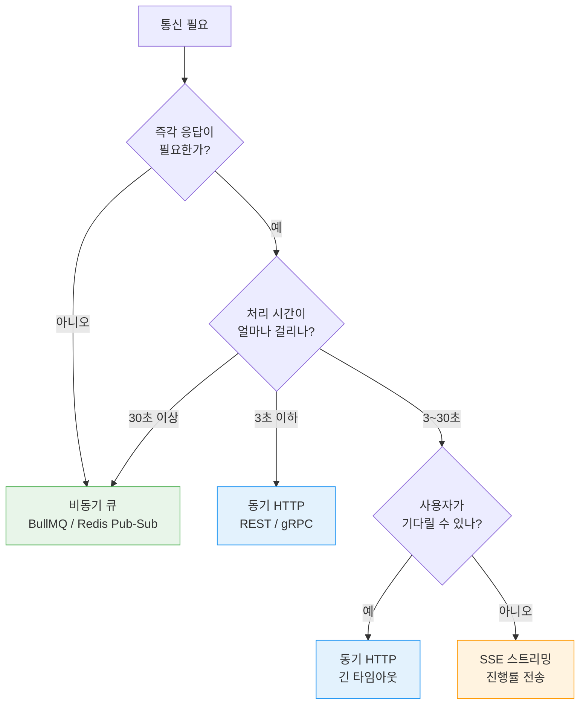
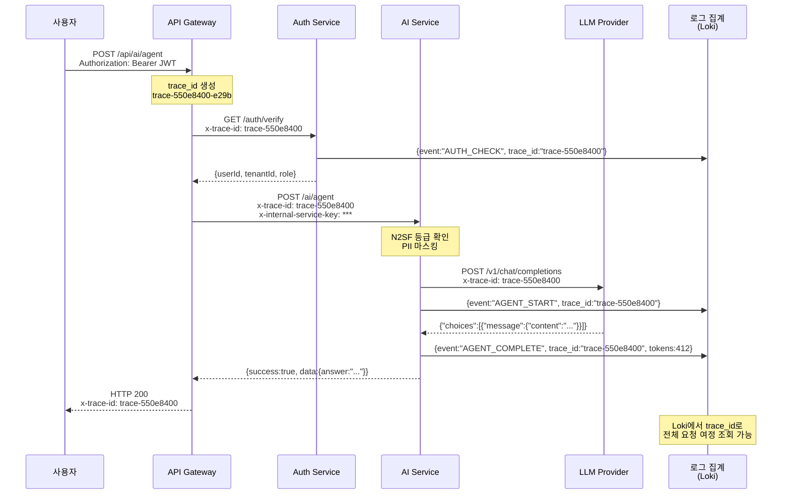
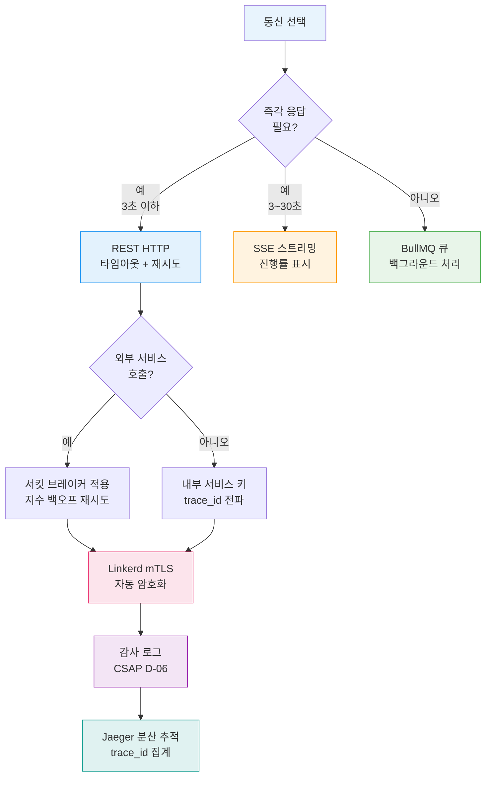

# 마이크로서비스 통신 패턴 심화

> 공공기관 SaaS 프레임워크 온보딩 시리즈 — 아키텍처편 20
> 대상 독자: 서비스 간 통신을 처음 설계하는 개발자
> CSAP D-11 통신 보안 + N2SF C/S/O 데이터 등급 적용 기준 포함

---

## 목차

1. [마이크로서비스 통신이란?](#1-마이크로서비스-통신이란)
2. [동기 통신 (HTTP/gRPC)](#2-동기-통신-httpgrpc)
3. [비동기 통신 (이벤트 기반)](#3-비동기-통신-이벤트-기반)
4. [서비스 디스커버리](#4-서비스-디스커버리)
5. [서킷 브레이커 실전](#5-서킷-브레이커-실전)
6. [재시도 정책](#6-재시도-정책)
7. [관측가능성 — trace_id 전파](#7-관측가능성--trace_id-전파)
8. [CSAP D-11 통신 보안 (mTLS)](#8-csap-d-11-통신-보안-mtls)
9. [실습: 서비스 간 인증된 HTTP 호출 구현](#9-실습-서비스-간-인증된-http-호출-구현)

---

## 1. 마이크로서비스 통신이란?

### 1.1 단일 서버 vs 마이크로서비스 통신

단일 서버(모놀리스) 환경에서는 함수 호출로 모든 것을 처리했습니다.

```typescript
// 모놀리스: 같은 프로세스 내 함수 호출 (실패 없음)
const user = await userService.findById(userId);  // 동일 메모리 접근
const ai = await aiService.chat(user, message);   // 동일 프로세스
```

마이크로서비스에서는 각 서비스가 별도 프로세스(또는 컨테이너)로 실행됩니다. 통신은 반드시 네트워크를 거쳐야 합니다.

```typescript
// 마이크로서비스: 네트워크 호출 (실패 가능!)
const user = await httpClient.get('http://user-service/users/123');  // 네트워크 레이턴시
const ai = await httpClient.post('http://ai-service/chat', { userId, message }); // 장애 가능
```

**네트워크 호출의 특성:**
- 레이턴시: 함수 호출 < 1μs, 네트워크 호출 1~10ms
- 실패 가능성: 타임아웃, 서버 다운, 패킷 손실
- 직렬화: 데이터를 JSON/Protobuf로 변환 필요
- 보안: 전송 중 데이터 암호화 필요 (TLS)

### 1.2 통신 실패 시 시스템 동작

장애 전파(Cascading Failure)를 이해해야 합니다.

```
사용자 → API Gateway → AI Service → LLM Service (다운!)
                          ↓
              AI Service가 30초 대기 (타임아웃)
                          ↓
              API Gateway도 30초 대기
                          ↓
              다른 사용자 요청도 30초 대기
                          ↓
              전체 시스템 응답 불가 (Cascading Failure)
```

이를 막기 위해 서킷 브레이커, 타임아웃, 재시도 정책을 사용합니다.

### 1.3 공공기관 SaaS 서비스 구성

```
사용자 (공무원, 민원인)
    ↓
[포털 (Next.js)]                ← 클라이언트
    ↓ HTTPS
[API Gateway (Nginx + mTLS)]   ← 진입점
    ↓ mTLS (내부 서비스)
┌──────────────────────────────────────────┐
│ 내부 서비스 메시 (Linkerd mTLS)           │
│                                          │
│  [AI Service]    [Security Service]      │
│       ↓               ↓                 │
│  [RAG Engine]   [Compliance Service]    │
│       ↓                                 │
│  [Vector DB]    [PostgreSQL]  [Redis]   │
└──────────────────────────────────────────┘
```

---

## 2. 동기 통신 (HTTP/gRPC)

### 2.1 REST API 호출 패턴

서비스 간 HTTP 호출의 핵심 패턴입니다.

```typescript
// Design Ref: §2.1 — 서비스 간 HTTP 클라이언트
// Plan SC: CSAP D-11 (통신 보안)
// 파일: src/lib/service-client.ts

import { z } from 'zod';

interface ServiceClientOptions {
  baseUrl: string;
  timeout?: number;
  retries?: number;
  internalServiceKey?: string;
}

class ServiceClient {
  private baseUrl: string;
  private timeout: number;
  private internalServiceKey: string | undefined;

  constructor(options: ServiceClientOptions) {
    this.baseUrl = options.baseUrl;
    this.timeout = options.timeout ?? 10000;  // 기본 10초
    // CSAP D-12: 시크릿은 환경변수에서만
    this.internalServiceKey = options.internalServiceKey
      ?? process.env['INTERNAL_SERVICE_KEY'];
  }

  async get<T>(
    path: string,
    responseSchema: z.ZodType<T>,
    options: { traceId?: string } = {}
  ): Promise<T> {
    const url = `${this.baseUrl}${path}`;

    const controller = new AbortController();
    const timeoutId = setTimeout(() => controller.abort(), this.timeout);

    try {
      const response = await fetch(url, {
        method: 'GET',
        headers: {
          'Content-Type': 'application/json',
          // CSAP D-08: 내부 서비스 인증 키
          ...(this.internalServiceKey && {
            'x-internal-service-key': this.internalServiceKey,
          }),
          // 분산 추적: trace_id 전파
          ...(options.traceId && { 'x-trace-id': options.traceId }),
        },
        signal: controller.signal,
      });

      if (!response.ok) {
        throw new ServiceCallError(
          `${path} 호출 실패: HTTP ${response.status}`,
          response.status
        );
      }

      const json = await response.json();

      // CSAP D-12: 응답도 검증
      return responseSchema.parse(json);
    } finally {
      clearTimeout(timeoutId);
    }
  }

  async post<TBody, TResponse>(
    path: string,
    body: TBody,
    responseSchema: z.ZodType<TResponse>,
    options: { traceId?: string } = {}
  ): Promise<TResponse> {
    const url = `${this.baseUrl}${path}`;
    const controller = new AbortController();
    const timeoutId = setTimeout(() => controller.abort(), this.timeout);

    try {
      const response = await fetch(url, {
        method: 'POST',
        headers: {
          'Content-Type': 'application/json',
          ...(this.internalServiceKey && {
            'x-internal-service-key': this.internalServiceKey,
          }),
          ...(options.traceId && { 'x-trace-id': options.traceId }),
        },
        body: JSON.stringify(body),
        signal: controller.signal,
      });

      if (!response.ok) {
        const errorBody = await response.json().catch(() => ({}));
        throw new ServiceCallError(
          // 에러 메시지에 내부 정보 노출 금지 (CSAP D-12)
          `${path} 호출 실패: HTTP ${response.status}`,
          response.status,
          errorBody
        );
      }

      const json = await response.json();
      return responseSchema.parse(json);
    } finally {
      clearTimeout(timeoutId);
    }
  }
}

class ServiceCallError extends Error {
  constructor(
    message: string,
    public readonly statusCode: number,
    public readonly body?: unknown
  ) {
    super(message);
    this.name = 'ServiceCallError';
  }
}

// 서비스별 클라이언트 인스턴스 (싱글턴)
export const aiServiceClient = new ServiceClient({
  baseUrl: process.env['AI_SERVICE_URL'] ?? 'http://ai-service:3009',
  timeout: 30000,  // AI 응답은 30초까지 허용
});

export const securityServiceClient = new ServiceClient({
  baseUrl: process.env['SECURITY_SERVICE_URL'] ?? 'http://security-service:3005',
  timeout: 5000,
});
```

### 2.2 타임아웃 설정 전략

타임아웃은 서비스 특성에 맞게 설정해야 합니다.

| 서비스 | 권장 타임아웃 | 이유 |
|--------|------------|------|
| 인증 서비스 | 3초 | 빠른 응답 필수 |
| 일반 API | 10초 | 표준 처리 시간 |
| AI 채팅 | 30초 | LLM 응답 대기 |
| AI 에이전트 | 120초 | 다단계 추론 |
| 문서 분석 | 60초 | 대용량 처리 |
| 배치 작업 | 없음 (비동기) | 큐 기반 처리 |

```typescript
// Design Ref: §2.2 — 계층별 타임아웃
// 타임아웃 계층: 클라이언트 < API Gateway < 서비스
const TIMEOUTS = {
  AUTH:       3_000,   // 3초
  READ:      10_000,   // 10초
  AI_CHAT:   30_000,   // 30초
  AI_AGENT: 120_000,   // 2분
  DOCUMENT:  60_000,   // 1분
} as const;
```

### 2.3 gRPC 내부 서비스 통신

gRPC는 Protobuf를 사용하여 JSON보다 빠르고 강타입 계약을 제공합니다.

```protobuf
// Design Ref: §2.3 — gRPC 서비스 정의
// 파일: proto/ai-internal.proto
syntax = "proto3";

package ai.internal.v1;

service AIInternalService {
  // 에이전트 실행 (양방향 스트리밍)
  rpc RunAgent(AgentRequest) returns (stream AgentChunk);

  // 임베딩 생성 (단순 요청/응답)
  rpc GenerateEmbedding(EmbedRequest) returns (EmbedResponse);
}

message AgentRequest {
  string tenant_id = 1;
  string query = 2;
  repeated string tools = 3;
  string trace_id = 4;  // 분산 추적
}

message AgentChunk {
  oneof content {
    string text = 1;
    bool done = 2;
    AgentStep step = 3;
  }
  int32 tokens_used = 4;
}
```

```typescript
// gRPC 클라이언트 사용 예
const agentStub = new AIInternalServiceClient(
  'ai-service:50051',
  grpc.credentials.createSsl()  // TLS 필수 (CSAP D-11)
);

const stream = agentStub.runAgent({
  tenantId: 'tenant-123',
  query: '예산 집행 현황을 분석해주세요',
  tools: ['search_knowledge', 'calculate'],
  traceId: request.traceId,
});

for await (const chunk of stream) {
  if (chunk.done) break;
  console.log(chunk.text);
}
```

---

## 3. 비동기 통신 (이벤트 기반)

### 3.1 언제 비동기를 선택하는가

동기 통신과 비동기 통신의 선택 기준:



### 3.2 Redis Pub/Sub — 실시간 이벤트

```typescript
// Design Ref: §3.2 — Redis Pub/Sub
// 서비스 간 이벤트 브로드캐스트

import Redis from 'ioredis';

// 퍼블리셔 (AI Service에서 이벤트 발행)
const publisher = new Redis(process.env['REDIS_URL']!);

async function publishAICompletionEvent(tenantId: string, result: unknown): Promise<void> {
  const event = {
    type: 'AI_COMPLETION',
    tenantId,
    timestamp: new Date().toISOString(),
    // N2SF: 이벤트에도 PII 마스킹 적용
    data: maskPII(JSON.stringify(result)).slice(0, 1000),
  };

  await publisher.publish(`events:ai:${tenantId}`, JSON.stringify(event));
}

// 구독자 (Notification Service에서 이벤트 수신)
const subscriber = new Redis(process.env['REDIS_URL']!);

await subscriber.subscribe('events:ai:*');

subscriber.on('message', (channel, message) => {
  const event = JSON.parse(message);
  // 알림 발송, 통계 집계 등 처리
  console.log(`[${event.type}] 테넌트: ${event.tenantId}`);
});
```

### 3.3 BullMQ — 작업 큐

시간이 오래 걸리는 작업(문서 수집, 모델 학습 등)은 큐로 처리합니다.

```typescript
// Design Ref: §3.3 — BullMQ 작업 큐
// 비동기 문서 수집 파이프라인

import { Queue, Worker, Job } from 'bullmq';

// 작업 타입 정의
interface DocumentIngestJob {
  tenantId: string;
  documentId: string;
  content: string;
  grade: 'O';  // N2SF: O등급만 AI 처리 가능
}

// 큐 생성 (RAG Ingest Service)
const ragIngestQueue = new Queue<DocumentIngestJob>('rag:ingest', {
  connection: { url: process.env['REDIS_URL']! },
  defaultJobOptions: {
    attempts: 3,            // 최대 3회 재시도
    backoff: {
      type: 'exponential',  // 지수 백오프
      delay: 2000,          // 2초, 4초, 8초
    },
    removeOnComplete: { count: 100 },  // 완료 작업 100개 보존
    removeOnFail: { count: 50 },       // 실패 작업 50개 보존
  },
});

// 작업 추가 (AI Service에서 호출)
await ragIngestQueue.add('ingest', {
  tenantId: 'tenant-123',
  documentId: 'doc-456',
  content: largeDocumentText,
  grade: 'O',
}, {
  priority: 10,  // 높은 숫자 = 낮은 우선순위
});

// 워커 (별도 프로세스에서 실행)
const worker = new Worker<DocumentIngestJob>(
  'rag:ingest',
  async (job: Job<DocumentIngestJob>) => {
    const { tenantId, documentId, content, grade } = job.data;

    // N2SF 등급 재확인 (큐에서 꺼낼 때도)
    if (grade !== 'O') {
      throw new Error(`비허용 등급 작업: ${grade}`);
    }

    // 진행률 업데이트
    await job.updateProgress(10);

    // 청킹
    const chunks = await splitIntoChunks(content);
    await job.updateProgress(30);

    // 임베딩 생성
    const embeddings = await generateEmbeddings(chunks);
    await job.updateProgress(70);

    // 벡터 저장
    await storeVectors(tenantId, documentId, chunks, embeddings);
    await job.updateProgress(100);

    return { chunksProcessed: chunks.length };
  },
  {
    connection: { url: process.env['REDIS_URL']! },
    concurrency: 5,  // 동시 처리 5개
  }
);
```

### 3.4 이벤트 스키마 관리

이벤트 스키마를 중앙에서 관리하면 서비스 간 계약 불일치를 방지합니다.

```typescript
// Design Ref: §3.4 — 이벤트 스키마 (공유 패키지)
// 파일: packages/types/src/events.ts

import { z } from 'zod';

// AI 완료 이벤트 스키마
export const aiCompletionEventSchema = z.object({
  type: z.literal('AI_COMPLETION'),
  tenantId: z.string().uuid(),
  sessionId: z.string().optional(),
  tokensUsed: z.number().min(0),
  model: z.string(),
  durationMs: z.number(),
  timestamp: z.string().datetime(),
  // PII를 포함하지 않는 메타데이터만
});

export type AICompletionEvent = z.infer<typeof aiCompletionEventSchema>;

// 이벤트 발행 시 검증
export function createAICompletionEvent(
  data: Omit<AICompletionEvent, 'type' | 'timestamp'>
): AICompletionEvent {
  return aiCompletionEventSchema.parse({
    type: 'AI_COMPLETION',
    timestamp: new Date().toISOString(),
    ...data,
  });
}
```

---

## 4. 서비스 디스커버리

### 4.1 Kubernetes Service + DNS

Kubernetes에서 서비스는 DNS 이름으로 자동 디스커버리됩니다.

```yaml
# AI Service Kubernetes 서비스
apiVersion: v1
kind: Service
metadata:
  name: ai-service          # DNS 이름
  namespace: public-saas
spec:
  selector:
    app: ai-service
  ports:
    - port: 3009
      targetPort: 3009
```

```typescript
// DNS 기반 서비스 호출
// Kubernetes 내부에서는 서비스명만으로 접근 가능
const AI_SERVICE_URL = process.env['AI_SERVICE_URL']
  ?? 'http://ai-service.public-saas.svc.cluster.local:3009';

// 다른 네임스페이스: http://ai-service.other-ns.svc.cluster.local:3009
```

환경변수로 URL을 주입하면 로컬 개발, 스테이징, 프로덕션에서 동일한 코드가 동작합니다.

```
로컬 개발:  AI_SERVICE_URL=http://localhost:3009
스테이징:   AI_SERVICE_URL=http://ai-service.staging.svc.cluster.local:3009
프로덕션:   AI_SERVICE_URL=http://ai-service.public-saas.svc.cluster.local:3009
```

### 4.2 Linkerd 서비스 디스커버리

Linkerd는 서비스 메시로, mTLS와 트래픽 관리를 자동으로 처리합니다.

```yaml
# Linkerd 서비스 프로파일 — 재시도 정책 정의
apiVersion: linkerd.io/v1alpha2
kind: ServiceProfile
metadata:
  name: ai-service.public-saas.svc.cluster.local
  namespace: public-saas
spec:
  routes:
    - name: POST /ai/chat
      condition:
        method: POST
        pathRegex: /ai/chat
      responseClasses:
        - condition:
            status:
              min: 500
              max: 599
          isFailure: true
      timeout: 30s
      retryBudget:
        retryRatio: 0.2      # 20% 재시도 예산
        minRetriesPerSecond: 10
        ttl: 10s
```

Linkerd가 처리해주는 것들:
- 서비스 간 자동 mTLS (CSAP D-11 요건 자동 충족)
- 트래픽 지표 수집 (Prometheus)
- 부하 분산 (라운드로빈 + EWMA)
- 자동 재시도 (설정된 정책에 따라)

---

## 5. 서킷 브레이커 실전

### 5.1 서킷 브레이커란?

서킷 브레이커는 전기 차단기처럼 동작합니다. 하류(downstream) 서비스가 연속으로 실패하면 회로를 차단하여 더 이상 요청을 보내지 않습니다.

```
닫힘(Closed):  정상 상태, 요청 통과
                ↓ 실패율 임계값 초과
열림(Open):    차단 상태, 즉시 오류 반환 (빠른 실패)
                ↓ 일정 시간 후
반열림(Half-Open): 소량 요청 허용 → 성공하면 닫힘, 실패하면 다시 열림
```

### 5.2 실제 코드 기반 분석 — INTERNAL_SERVICE_KEY 패턴

AI Service(`platform/services/ai-service/src/routes.ts`)는 내부 서비스 인증을 통해 외부 API 게이트웨이 우회를 방지합니다. 이는 단순하지만 강력한 보안 패턴입니다.

```typescript
// 실제 코드: platform/services/ai-service/src/routes.ts
// C-03 수정 (CSAP D-08): 서비스 간 내부 인증
const internalKey = process.env['INTERNAL_SERVICE_KEY'];

if (!internalKey && process.env['NODE_ENV'] === 'production') {
  // 키가 없으면 서버 시작 자체를 막음 — Fail Fast 원칙
  throw new Error('[SECURITY] INTERNAL_SERVICE_KEY 환경변수가 설정되지 않았습니다.');
}

if (internalKey) {
  app.addHook('onRequest', async (request, reply) => {
    if (request.url === '/health' || request.url === '/ready') return;
    const provided = request.headers['x-internal-service-key'];
    if (provided !== internalKey) {
      await reply.status(401).send({
        success: false,
        error: { code: 'UNAUTHORIZED', message: '내부 서비스 인증 실패' },
      });
    }
  });
}
```

이 패턴의 핵심:
1. **Fail Fast**: 프로덕션에서 키가 없으면 서버 시작 거부
2. **헬스체크 예외**: Kubernetes Probe는 인증 없이 통과
3. **상수 시간 비교**: 타이밍 공격 방지를 위해 실제 구현에서는 `crypto.timingSafeEqual()` 권장

### 5.3 외부 AI API 호출 보호

AI 도구 레지스트리(`platform/services/ai-service/src/lib/ai-tools.ts`)에서 외부 LLM 호출을 안전하게 래핑하는 패턴을 살펴봅니다.

```typescript
// 실제 코드: platform/services/ai-service/src/lib/ai-tools.ts
// calculate 도구의 CSAP D-12 준수 — eval 대신 안전한 파서
calculate: async (params): Promise<ToolCallResult> => {
  const expression = String(params['expression'] ?? '');

  // CSAP D-12: 안전한 수학 표현식만 허용 (Function 생성자/eval 사용 금지)
  if (!/^[\d\s+\-*/().,]+$/.test(expression)) {
    return {
      success: false,
      output: '',
      error: '허용되지 않는 계산식입니다. 숫자와 사칙연산만 가능합니다.',
    };
  }

  try {
    const result = safeEvaluate(expression);  // 재귀 하강 파서
    if (result === null) {
      return { success: false, output: '', error: '계산 실패: 유효하지 않은 수식입니다' };
    }
    return { success: true, output: String(result) };
  } catch {
    return { success: false, output: '', error: '계산 실패' };
  }
},
```

### 5.4 서킷 브레이커 구현

```typescript
// Design Ref: §5.4 — 서킷 브레이커 패턴
// 외부 LLM API 호출 보호

enum CircuitState { CLOSED, OPEN, HALF_OPEN }

interface CircuitBreakerConfig {
  failureThreshold: number;    // 실패 임계값 (기본 5)
  recoveryTimeout: number;     // 복구 대기 시간 ms (기본 60초)
  halfOpenRequests: number;    // 반열림 시 허용 요청 수 (기본 3)
}

class CircuitBreaker {
  private state = CircuitState.CLOSED;
  private failureCount = 0;
  private lastFailureTime = 0;
  private halfOpenSuccesses = 0;

  constructor(
    private readonly name: string,
    private readonly config: CircuitBreakerConfig = {
      failureThreshold: 5,
      recoveryTimeout: 60_000,
      halfOpenRequests: 3,
    }
  ) {}

  async execute<T>(fn: () => Promise<T>): Promise<T> {
    // 열림 상태: 즉시 실패 (빠른 실패)
    if (this.state === CircuitState.OPEN) {
      const timeSinceLastFailure = Date.now() - this.lastFailureTime;

      if (timeSinceLastFailure < this.config.recoveryTimeout) {
        throw new CircuitOpenError(
          `서킷 브레이커 [${this.name}] 열림 상태. ` +
          `${Math.ceil((this.config.recoveryTimeout - timeSinceLastFailure) / 1000)}초 후 재시도`
        );
      }

      // 복구 타임아웃 경과: 반열림 상태로 전환
      this.state = CircuitState.HALF_OPEN;
      this.halfOpenSuccesses = 0;
    }

    try {
      const result = await fn();
      this.onSuccess();
      return result;
    } catch (err) {
      this.onFailure();
      throw err;
    }
  }

  private onSuccess(): void {
    if (this.state === CircuitState.HALF_OPEN) {
      this.halfOpenSuccesses++;
      if (this.halfOpenSuccesses >= this.config.halfOpenRequests) {
        // 반열림에서 성공 임계값 도달: 닫힘 전환
        this.state = CircuitState.CLOSED;
        this.failureCount = 0;
        console.log(`서킷 브레이커 [${this.name}] 복구됨`);
      }
    } else {
      this.failureCount = 0;
    }
  }

  private onFailure(): void {
    this.failureCount++;
    this.lastFailureTime = Date.now();

    if (this.failureCount >= this.config.failureThreshold) {
      this.state = CircuitState.OPEN;
      console.warn(`서킷 브레이커 [${this.name}] 열림 — 실패 ${this.failureCount}회`);
    }
  }
}

class CircuitOpenError extends Error {
  constructor(message: string) {
    super(message);
    this.name = 'CircuitOpenError';
  }
}

// AI Service에서 사용
const llmCircuitBreaker = new CircuitBreaker('lmstudio', {
  failureThreshold: 5,
  recoveryTimeout: 30_000,  // 30초 후 복구 시도
  halfOpenRequests: 2,
});

async function callLLMWithProtection(messages: LLMMessage[]): Promise<string> {
  try {
    return await llmCircuitBreaker.execute(async () => {
      return await llmProvider.chat(messages);
    });
  } catch (err) {
    if (err instanceof CircuitOpenError) {
      // 서킷 열림: 캐시 응답 또는 폴백
      return '현재 AI 서비스가 일시적으로 불안정합니다. 잠시 후 다시 시도해주세요.';
    }
    throw err;
  }
}
```

---

## 6. 재시도 정책

### 6.1 지수 백오프 + Jitter

단순 재시도는 "Thundering Herd"(모든 클라이언트가 동시에 재시도) 문제를 일으킵니다. 지수 백오프 + Jitter(무작위 지연)로 해결합니다.

```typescript
// Design Ref: §6.1 — 지수 백오프 + Jitter
interface RetryOptions {
  maxAttempts: number;      // 최대 시도 횟수
  baseDelay: number;        // 기본 대기 시간 (ms)
  maxDelay: number;         // 최대 대기 시간 (ms)
  jitter: boolean;          // Jitter 적용 여부
  retryOn?: (error: unknown) => boolean;  // 재시도 조건
}

async function withRetry<T>(
  fn: () => Promise<T>,
  options: RetryOptions
): Promise<T> {
  const {
    maxAttempts = 3,
    baseDelay = 1000,
    maxDelay = 30000,
    jitter = true,
    retryOn = (err) => {
      // 기본: 5xx 오류와 네트워크 오류만 재시도
      if (err instanceof ServiceCallError) {
        return err.statusCode >= 500;
      }
      return err instanceof TypeError;  // 네트워크 오류
    },
  } = options;

  let lastError: unknown;

  for (let attempt = 1; attempt <= maxAttempts; attempt++) {
    try {
      return await fn();
    } catch (err) {
      lastError = err;

      // 재시도 불필요한 오류 (4xx 등)
      if (!retryOn(err)) throw err;

      // 마지막 시도이면 즉시 실패
      if (attempt === maxAttempts) break;

      // 대기 시간 계산: 지수 백오프
      let delay = Math.min(baseDelay * Math.pow(2, attempt - 1), maxDelay);

      // Jitter: ±50% 무작위 변동
      if (jitter) {
        delay = delay * (0.5 + Math.random() * 0.5);
      }

      console.log(
        `[재시도] ${attempt}/${maxAttempts} 실패, ${Math.round(delay)}ms 후 재시도`
      );
      await new Promise((resolve) => setTimeout(resolve, delay));
    }
  }

  throw lastError;
}

// 사용 예
const result = await withRetry(
  () => aiServiceClient.post('/ai/chat', body, responseSchema),
  {
    maxAttempts: 3,
    baseDelay: 1000,    // 1초, 2초, 4초
    maxDelay: 10000,    // 최대 10초
    jitter: true,
    retryOn: (err) => {
      // AI 서비스는 5xx만 재시도 (4xx는 재시도 불필요)
      return err instanceof ServiceCallError && err.statusCode >= 500;
    },
  }
);
```

### 6.2 재시도하면 안 되는 경우

```typescript
// 재시도 금지 목록
const NON_RETRYABLE_CODES = [
  400, // Bad Request — 요청 자체가 잘못됨
  401, // Unauthorized — 인증 실패 (재시도해도 동일)
  403, // Forbidden — 권한 없음
  404, // Not Found — 존재하지 않음
  422, // Unprocessable Entity — 검증 실패
  429, // Too Many Requests — 재시도하면 더 많은 요청 금지
];

// 멱등성이 없는 작업도 재시도 주의
// POST /ai/chat: 동일 메시지가 두 번 처리될 수 있음
// → Idempotency-Key 헤더로 해결
```

---

## 7. 관측가능성 — trace_id 전파

### 7.1 분산 추적이란?

마이크로서비스 환경에서 하나의 사용자 요청이 여러 서비스를 거쳐 처리됩니다. `trace_id`는 이 요청의 여정을 추적하는 고유 ID입니다.

```
사용자 요청 → trace_id: abc123

[API Gateway]   INFO "요청 수신" trace_id=abc123
[AI Service]    INFO "AI 처리 시작" trace_id=abc123
[LLM Provider]  INFO "LLM 호출" trace_id=abc123
[AI Service]    INFO "응답 완료" trace_id=abc123 duration=2.3s
```

trace_id가 없으면 어느 로그가 어느 요청에 속하는지 알 수 없습니다.

### 7.2 trace_id 서비스 간 전파 구현

```typescript
// Design Ref: §7.2 — trace_id 전파 패턴
// CSAP D-10: 분산 추적

import { randomUUID } from 'crypto';

// 1. API Gateway에서 trace_id 생성 (또는 상위에서 전달된 것 사용)
function getOrCreateTraceId(request: FastifyRequest): string {
  // W3C Trace Context 표준 헤더 확인
  const existing = request.headers['x-trace-id'] as string
    ?? request.headers['traceparent'] as string;

  return existing ?? `trace-${randomUUID()}`;
}

// 2. 서비스 내에서 trace_id를 모든 로그에 포함
fastify.addHook('onRequest', async (request) => {
  const traceId = getOrCreateTraceId(request);
  request.traceId = traceId;
  // 응답 헤더에도 포함 (디버깅 용이)
  request.server.log.child({ traceId });
});

// 3. 하류 서비스 호출 시 trace_id 전달
async function callAIService(
  query: string,
  traceId: string
): Promise<AIResponse> {
  const response = await fetch(`${AI_SERVICE_URL}/ai/agent`, {
    method: 'POST',
    headers: {
      'Content-Type': 'application/json',
      'x-internal-service-key': process.env['INTERNAL_SERVICE_KEY']!,
      'x-trace-id': traceId,           // trace_id 전파
      'x-request-id': randomUUID(),     // 이 호출의 고유 ID
    },
    body: JSON.stringify({ query, grade: 'O', tenantId }),
  });
  return response.json();
}
```

### 7.3 내부 서비스 호출 trace_id 전파 다이어그램



### 7.4 OpenTelemetry 연동

```typescript
// Design Ref: §7.4 — OpenTelemetry 자동 계측
// platform/services/ai-service/src/index.ts에서 실제 사용

import { initTelemetry, shutdownTelemetry } from '@public-saas/observability';

// 서버 시작 전 텔레메트리 초기화 (import 전에 호출!)
initTelemetry({ serviceName: 'ai-service', serviceVersion: '0.2.0' });

// 이후 모든 fetch, http 호출에 자동으로 스팬 추가됨
// Jaeger/Tempo에서 trace_id로 전체 경로 시각화 가능
```

---

## 8. CSAP D-11 통신 보안 (mTLS)

### 8.1 mTLS란?

TLS는 서버만 인증합니다(HTTPS). mTLS(Mutual TLS)는 서버와 클라이언트 **양방향** 인증입니다. 서비스 간 통신에서 "이 요청이 정말 신뢰할 수 있는 서비스에서 왔는가?"를 검증합니다.

```
일반 TLS: 클라이언트가 서버 인증서 검증
           클라이언트 → [서버 인증서 확인] → 서버

mTLS:     양방향 인증서 검증
           클라이언트 ← [클라이언트 인증서 확인] → 서버
           클라이언트 → [서버 인증서 확인] → 서버
           (인증서 없으면 연결 거부)
```

### 8.2 Linkerd를 통한 자동 mTLS (CSAP D-11)

Linkerd 서비스 메시를 사용하면 코드 변경 없이 자동으로 mTLS가 적용됩니다.

```yaml
# Linkerd 주석으로 mTLS 활성화
apiVersion: apps/v1
kind: Deployment
metadata:
  name: ai-service
  namespace: public-saas
  annotations:
    linkerd.io/inject: enabled  # Linkerd 사이드카 주입
spec:
  template:
    metadata:
      annotations:
        linkerd.io/inject: enabled
```

Linkerd가 자동으로 처리:
- 서비스 간 모든 트래픽 mTLS 암호화 (CSAP D-11)
- 인증서 자동 발급 및 갱신 (90일)
- 인증서 교체 시 무중단 (zero-downtime)

### 8.3 mTLS 없는 환경에서 보안 (개발/테스트)

```typescript
// Design Ref: §8.3 — 개발 환경 내부 키 인증
// Linkerd mTLS 없는 환경에서 INTERNAL_SERVICE_KEY로 보완

// 실제 코드 패턴 (routes.ts에서 발췌)
// 개발: INTERNAL_SERVICE_KEY 없이 동작
// 프로덕션: 반드시 INTERNAL_SERVICE_KEY 설정 (Linkerd mTLS와 이중 보호)

const internalKey = process.env['INTERNAL_SERVICE_KEY'];
if (!internalKey && process.env['NODE_ENV'] === 'production') {
  throw new Error('[SECURITY] INTERNAL_SERVICE_KEY 필수 설정');
}
```

### 8.4 통신 보안 체크리스트

| 항목 | 요건 | 구현 방법 |
|------|------|---------|
| 전송 암호화 | TLS 1.3+ 필수 | Linkerd mTLS / Nginx SSL |
| 서비스 인증 | mTLS 또는 내부 키 | Linkerd 주입 / INTERNAL_SERVICE_KEY |
| API 게이트웨이 인증 | JWT 토큰 | rbacPlugin |
| 내부 서비스 격리 | NetworkPolicy | K8s NetworkPolicy |
| 민감 데이터 암호화 | AES-256 | @public-saas/crypto |
| 시크릿 관리 | 환경변수 | K8s Secret + Sealed Secrets |

---

## 9. 실습: 서비스 간 인증된 HTTP 호출 구현

이 실습에서는 Compliance Service에서 AI Service를 인증된 방식으로 호출하는 코드를 구현합니다.

### 9.1 시나리오

Compliance Service가 CSAP 점검 결과 분석을 위해 AI Service의 문서 분석 API를 호출합니다.

```
[Compliance Service] → (내부 인증 키 + trace_id) → [AI Service /ai/document/analyze]
```

### 9.2 구현

```typescript
// Design Ref: §9 — 서비스 간 인증 HTTP 호출 실습
// Plan SC: CSAP D-08 (접근통제), D-10 (분산추적), D-11 (통신보안)
// 파일: platform/services/compliance-service/src/lib/ai-client.ts

import { z } from 'zod';
import { randomUUID } from 'crypto';

// 응답 스키마 (Zod 검증 필수)
const documentAnalysisResponseSchema = z.object({
  success: z.boolean(),
  data: z.object({
    summary: z.string().optional(),
    risks: z.array(z.string()).optional(),
    entities: z.record(z.array(z.string())).optional(),
    classification: z.string().optional(),
  }),
});

type DocumentAnalysisResponse = z.infer<typeof documentAnalysisResponseSchema>;

class AIServiceClient {
  private readonly baseUrl: string;
  private readonly internalKey: string;
  private readonly timeout: number;

  constructor() {
    // CSAP D-12: 모든 설정은 환경변수에서
    this.baseUrl = process.env['AI_SERVICE_URL']
      ?? 'http://ai-service.public-saas.svc.cluster.local:3009';

    const key = process.env['INTERNAL_SERVICE_KEY'];
    if (!key) {
      throw new Error('INTERNAL_SERVICE_KEY 환경변수가 설정되지 않았습니다');
    }
    this.internalKey = key;
    this.timeout = 60_000; // 60초
  }

  async analyzeDocument(params: {
    tenantId: string;
    content: string;       // N2SF O등급 문서만
    analysisType: 'summary' | 'risk' | 'extract' | 'full';
    traceId: string;       // 분산 추적
  }): Promise<DocumentAnalysisResponse> {
    const requestId = randomUUID();
    const controller = new AbortController();
    const timeoutId = setTimeout(() => controller.abort(), this.timeout);

    try {
      const response = await fetch(`${this.baseUrl}/ai/document/analyze`, {
        method: 'POST',
        headers: {
          'Content-Type': 'application/json',
          // CSAP D-08: 내부 서비스 인증
          'x-internal-service-key': this.internalKey,
          // CSAP D-10: 분산 추적 헤더
          'x-trace-id': params.traceId,
          'x-request-id': requestId,
          // 호출 서비스 식별 (감사 로그용)
          'x-calling-service': 'compliance-service',
        },
        body: JSON.stringify({
          tenantId: params.tenantId,
          grade: 'O',                    // N2SF: O등급만 AI 처리
          content: params.content,
          analysisType: params.analysisType,
        }),
        signal: controller.signal,
      });

      if (!response.ok) {
        const errorBody = await response.json().catch(() => ({}));
        throw new AIServiceError(
          `AI 문서 분석 실패: HTTP ${response.status}`,
          response.status,
          errorBody
        );
      }

      const json = await response.json();

      // CSAP D-12: 응답 검증
      return documentAnalysisResponseSchema.parse(json);

    } catch (err) {
      if ((err as Error).name === 'AbortError') {
        throw new AIServiceError('AI 서비스 타임아웃 (60초 초과)', 504);
      }
      throw err;
    } finally {
      clearTimeout(timeoutId);
    }
  }
}

class AIServiceError extends Error {
  constructor(
    message: string,
    public readonly statusCode: number,
    public readonly details?: unknown
  ) {
    super(message);
    this.name = 'AIServiceError';
  }
}

// 싱글턴으로 내보내기
export const aiServiceClient = new AIServiceClient();
```

### 9.3 Compliance Service에서 사용

```typescript
// Design Ref: §9.3 — Compliance Service AI 호출
// 파일: platform/services/compliance-service/src/handlers/csap-analyze.handler.ts

import type { FastifyRequest, FastifyReply } from 'fastify';
import { z } from 'zod';
import { aiServiceClient } from '../lib/ai-client.js';
import { withRetry } from '../lib/retry.js';
import { auditLog } from '../lib/audit.js';

const csapAnalyzeSchema = z.object({
  tenantId: z.string().uuid(),
  checklistContent: z.string().min(1).max(300000),
});

export async function csapAnalyzeHandler(
  request: FastifyRequest,
  reply: FastifyReply
): Promise<void> {
  const body = csapAnalyzeSchema.parse(request.body);
  const actor = (request.headers['x-user-id'] as string) || 'system';
  const traceId = (request.headers['x-trace-id'] as string)
    ?? `trace-${Date.now()}`;

  try {
    // 재시도 포함 AI 서비스 호출
    const analysis = await withRetry(
      () => aiServiceClient.analyzeDocument({
        tenantId: body.tenantId,
        content: body.checklistContent,
        analysisType: 'risk',
        traceId,
      }),
      {
        maxAttempts: 3,
        baseDelay: 2000,
        maxDelay: 10000,
        jitter: true,
        retryOn: (err) => {
          if (err instanceof AIServiceError) {
            // 5xx만 재시도 (타임아웃 포함)
            return err.statusCode >= 500 || err.statusCode === 504;
          }
          return false;
        },
      }
    );

    // 감사 로그 (CSAP D-06)
    await auditLog({
      actor,
      action: 'CSAP_AI_ANALYZE',
      tenantId: body.tenantId,
      traceId,
      result: analysis.success ? 'SUCCESS' : 'FAILURE',
      ip: request.ip,
    });

    await reply.status(200).send({
      success: true,
      data: analysis.data,
    });

  } catch (err) {
    if (err instanceof AIServiceError) {
      request.log.error({ err, traceId }, 'AI 서비스 호출 실패');
      await reply.status(502).send({
        success: false,
        error: {
          code: 'AI_SERVICE_ERROR',
          // 내부 정보 노출 금지 (CSAP D-12)
          message: 'AI 분석 서비스가 일시적으로 불안정합니다',
        },
      });
      return;
    }
    throw err;
  }
}
```

### 9.4 실습 체크리스트

구현 후 다음 항목을 확인합니다.

- [ ] `INTERNAL_SERVICE_KEY`가 환경변수에서 읽히는가? (하드코딩 금지)
- [ ] `x-trace-id` 헤더가 하류 서비스로 전파되는가?
- [ ] 타임아웃이 설정되어 있는가? (`AbortController`)
- [ ] 5xx 오류에만 재시도가 적용되는가? (4xx는 재시도 안 함)
- [ ] 클라이언트에 내부 오류 상세가 노출되지 않는가?
- [ ] 감사 로그에 서비스 호출 결과가 기록되는가?
- [ ] 응답 스키마를 Zod로 검증하는가?

---

## 요약 및 다음 단계



| 패턴 | 핵심 내용 |
|------|---------|
| 내부 서비스 인증 | `INTERNAL_SERVICE_KEY` 환경변수 + `x-internal-service-key` 헤더 |
| trace_id 전파 | 모든 서비스 호출에 `x-trace-id` 전달 |
| 타임아웃 | `AbortController` + 서비스 특성별 차등 설정 |
| 서킷 브레이커 | CLOSED → OPEN → HALF_OPEN, 빠른 실패 |
| 재시도 | 지수 백오프 + Jitter, 5xx만, 멱등성 확인 |
| 비동기 큐 | BullMQ로 장시간 작업 처리 |
| mTLS | Linkerd 주입으로 자동 서비스 간 암호화 |

**다음 단계:**
- `16-resilience-patterns.md`: Bulkhead, Timeout, Retry 패턴 심화
- `04-service-interactions.md`: 전체 서비스 상호작용 아키텍처
- `05-event-driven-architecture.md`: 이벤트 소싱과 CQRS 패턴

---

*Design Ref: SVC-AI-2026 DESIGN §2, SVC-AI-ADV-R2 DESIGN §5*
*Plan SC: FR-AI26.1~FR-AI26.5, FR-ADV2.1~FR-ADV2.6*
*CSAP: D-08 접근통제, D-10 분산추적, D-11 통신보안, D-12 시스템 개발 보안*
