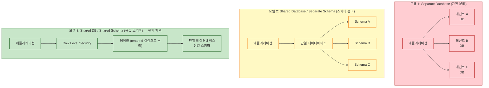
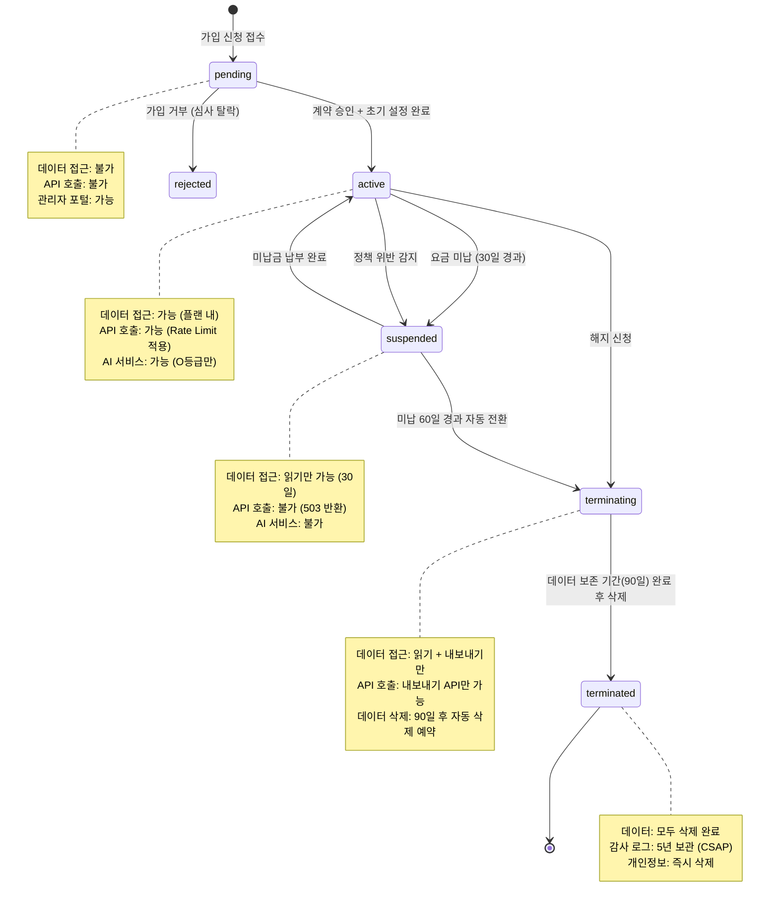

# 21. 멀티테넌트 아키텍처 완전 가이드 — 격리 모델, 컨텍스트 전파, 데이터 격리 패턴

> **대상 독자**: 공공기관 SaaS 개발에 참여하는 모든 개발자 및 아키텍트
> **학습 목표**: 멀티테넌트 시스템의 설계 원칙 이해, 실제 코드에서 테넌트 격리가 어떻게 구현되는지 파악
> **소요 시간**: 약 3~4시간
> **관련 설계 문서**: `SVC-AI-2026 DESIGN §1`, `SVC-AI-ADV-R1 DESIGN §6`
> **CSAP 요건**: D-08 접근 통제 — 테넌트 간 완전한 논리적 분리

---

## 목차

1. [멀티테넌시란 무엇인가](#1-멀티테넌시란-무엇인가)
2. [격리 모델 3가지 비교](#2-격리-모델-3가지-비교)
3. [AsyncLocalStorage — 테넌트 컨텍스트 전파 완전 가이드](#3-asynclocalstorage--테넌트-컨텍스트-전파-완전-가이드)
4. [vector-store.ts 테넌트 격리 실제 분석](#4-vector-storets-테넌트-격리-실제-분석)
5. [ai-rag.handler.ts 테넌트별 RAG 격리 분석](#5-ai-raghandlerts-테넌트별-rag-격리-분석)
6. [routes.ts 테넌트 미들웨어 주입 패턴 분석](#6-routests-테넌트-미들웨어-주입-패턴-분석)
7. [Redis 멀티테넌트 키 네임스페이스](#7-redis-멀티테넌트-키-네임스페이스)
8. [BullMQ 테넌트별 큐 격리](#8-bullmq-테넌트별-큐-격리)
9. [테넌트 라이프사이클 상태 머신](#9-테넌트-라이프사이클-상태-머신)
10. [테넌트 데이터 유출 방지 TOP 5 패턴](#10-테넌트-데이터-유출-방지-top-5-패턴)
11. [공공기관 SaaS CSAP D-08 요건](#11-공공기관-saas-csap-d-08-요건)

---

## 1. 멀티테넌시란 무엇인가

**멀티테넌시(Multi-tenancy)**는 하나의 소프트웨어 인스턴스가 여러 고객(테넌트)을 동시에 서비스하는 아키텍처입니다. 공공기관 SaaS에서는 여러 기관(교육부, 행정안전부, 지방자치단체 등)이 같은 플랫폼을 사용하지만 각자의 데이터는 완전히 분리됩니다.

### 1.1 공공기관 SaaS에서 테넌트란

```
테넌트 A: 서울특별시 교육청
├── 사용자: 1,200명
├── AI 지식베이스: 교육과정 문서 500건
├── RAG 질의: 일 500회
└── 데이터: 완전히 격리됨

테넌트 B: 경기도 행정지원과
├── 사용자: 350명
├── AI 지식베이스: 행정 법령 200건
├── RAG 질의: 일 150회
└── 데이터: 테넌트 A와 절대로 섞이지 않음
```

이 격리가 실패하면 **테넌트 간 데이터 유출**이 발생합니다. 공공기관 SaaS에서 이는 개인정보보호법 위반 + CSAP 인증 취소 + 기관 신뢰도 붕괴로 이어집니다.

---

## 2. 격리 모델 3가지 비교

멀티테넌트 SaaS의 데이터 격리 전략은 크게 3가지입니다.



### 2.1 3가지 모델 상세 비교

| 항목 | Separate DB | Shared Schema | Shared Schema + RLS |
|------|------------|---------------|---------------------|
| 격리 강도 | 최강 (물리적) | 중간 (논리적) | 강 (논리적+정책) |
| 운영 복잡도 | 매우 높음 | 중간 | 낮음 |
| 비용 | 매우 높음 | 중간 | 낮음 |
| 신규 테넌트 추가 | DB 생성 필요 | 스키마 생성 필요 | 레코드 추가만 |
| 테넌트 수 | ~수십 | ~수백 | 수천 이상 |
| 맞춤형 스키마 | 쉬움 | 가능 | 어려움 |
| CSAP D-08 | 통과 | 통과 | 통과 (RLS 설정 필수) |
| **현재 채택** | | | **✓** |

### 2.2 공공 SaaS가 Shared Schema를 선택한 이유

공공기관 SaaS는 소규모 기관부터 대형 기관까지 수백 개의 테넌트를 서비스해야 합니다.

```
Separate DB 방식의 문제:
- 테넌트 100개 = PostgreSQL 인스턴스 100개 = Kubernetes Pod 수백 개
- CNPG 클러스터 100개 관리 = 운영 불가능
- 비용: 수억 원/월

Shared Schema + RLS 방식:
- 테넌트 1,000개 = PostgreSQL 클러스터 1개
- RLS 정책이 자동으로 테넌트 격리
- 비용: 수천만 원/월 (약 10배 절감)
```

---

## 3. AsyncLocalStorage — 테넌트 컨텍스트 전파 완전 가이드

`AsyncLocalStorage`는 Node.js에서 비동기 컨텍스트를 전달하는 메커니즘입니다. 마치 스레드 로컬 변수처럼, 동일한 비동기 호출 체인 안에서만 데이터를 공유합니다.

### 3.1 왜 AsyncLocalStorage가 필요한가

```
HTTP 요청 처리 흐름:
Request → Middleware → Handler → Service → Repository → DB

각 단계에서 "이 요청이 어떤 테넌트의 요청인가"를 알아야 합니다.

문제: 함수 인자로 tenantId를 모든 곳에 전달하면...
Handler(tenantId) → Service(tenantId) → Repository(tenantId) → ...
→ 코드가 지저분하고 누락 위험 있음

해결: AsyncLocalStorage로 요청 시작 시 tenantId를 저장하고
      어디서든 조회 가능하게 함
```

### 3.2 기본 구현 패턴

```typescript
// platform/libs/tenant-context/src/index.ts
import { AsyncLocalStorage } from 'node:async_hooks';

// 테넌트 컨텍스트 타입
export interface TenantContext {
  tenantId: string;          // 테넌트 UUID
  tenantPlan: 'basic' | 'standard' | 'premium';  // 서비스 플랜
  userId?: string;           // 현재 사용자 (선택)
  requestId: string;         // 요청 추적 ID
  dataGrade: 'O' | 'C' | 'S';  // N2SF 데이터 등급
}

// AsyncLocalStorage 인스턴스 (싱글톤)
export const tenantStore = new AsyncLocalStorage<TenantContext>();

// 편의 함수: 현재 컨텍스트 조회
export function getTenantContext(): TenantContext {
  const ctx = tenantStore.getStore();
  if (!ctx) {
    throw new Error(
      'TenantContext가 설정되지 않았습니다. ' +
      '요청 미들웨어를 통해 접근하고 있는지 확인하세요.'
    );
  }
  return ctx;
}

// 편의 함수: 테넌트 ID만 조회
export function getCurrentTenantId(): string {
  return getTenantContext().tenantId;
}

// 테넌트 컨텍스트 설정 (미들웨어에서 호출)
export function runWithTenantContext<T>(
  context: TenantContext,
  fn: () => Promise<T>,
): Promise<T> {
  return tenantStore.run(context, fn);
}
```

### 3.3 Fastify 미들웨어에서 컨텍스트 주입

```typescript
// platform/services/ai-service/src/middleware/tenant.middleware.ts
import type { FastifyRequest, FastifyReply } from 'fastify';
import { runWithTenantContext } from '@public-saas/tenant-context';
import { z } from 'zod';

// tenantId 헤더 검증 스키마
const tenantHeaderSchema = z.object({
  'x-tenant-id': z.string().uuid('테넌트 ID는 UUID 형식이어야 합니다'),
  'x-user-id': z.string().optional(),
  'x-request-id': z.string().default(() => crypto.randomUUID()),
});

export async function tenantMiddleware(
  request: FastifyRequest,
  reply: FastifyReply,
): Promise<void> {
  // 1. 헤더에서 테넌트 정보 추출 및 검증
  const parseResult = tenantHeaderSchema.safeParse(request.headers);

  if (!parseResult.success) {
    await reply.status(400).send({
      success: false,
      error: {
        code: 'INVALID_TENANT_HEADER',
        message: '유효하지 않은 테넌트 헤더입니다.',
        details: parseResult.error.issues,
      },
    });
    return;
  }

  const { 'x-tenant-id': tenantId, 'x-user-id': userId, 'x-request-id': requestId }
    = parseResult.data;

  // 2. 테넌트 정보 조회 (DB에서)
  // 실제 구현에서는 Redis 캐싱 권장 (매 요청 DB 조회 방지)
  const tenant = await getTenantFromCache(tenantId);
  if (!tenant || tenant.status !== 'active') {
    await reply.status(403).send({
      success: false,
      error: { code: 'TENANT_INACTIVE', message: '비활성화된 테넌트입니다.' },
    });
    return;
  }

  // 3. AsyncLocalStorage에 컨텍스트 저장
  // NOTE: Fastify의 onRequest 훅에서는 직접 runWithTenantContext를 쓰기 어려움
  //       대신 request 객체에 저장 후 핸들러에서 설정하는 패턴 사용
  request.tenantContext = {
    tenantId,
    tenantPlan: tenant.plan,
    userId,
    requestId,
    dataGrade: 'O',  // AI 서비스는 항상 O등급만 허용
  };
}

// Fastify 타입 확장
declare module 'fastify' {
  interface FastifyRequest {
    tenantContext: TenantContext;
  }
}
```

### 3.4 실제 요청 흐름에서 컨텍스트 전파

```typescript
// 핸들러에서 컨텍스트 사용
export async function ragQueryHandler(
  request: FastifyRequest<{ Body: QueryBody }>,
  reply: FastifyReply,
): Promise<void> {
  const { tenantId } = request.tenantContext;  // 컨텍스트에서 직접 조회

  // runRAG에 tenantId 명시적으로 전달 (현재 패턴)
  const ragResponse = await runRAG(
    tenantId,           // 명시적 전달
    body.question,
    queryEmbedding,
    options,
  );
  // ...
}

// 대안: AsyncLocalStorage로 암묵적 전달 (더 깔끔한 패턴)
// runWithTenantContext(request.tenantContext, async () => {
//   const ragResponse = await runRAG(body.question, queryEmbedding, options);
//   // 내부에서 getCurrentTenantId()로 조회
// });
```

### 3.5 AsyncLocalStorage 주의사항

```typescript
// ❌ 주의 1: 비동기 경계를 벗어나면 컨텍스트가 사라짐
setTimeout(() => {
  // 이 콜백은 원래 AsyncLocalStorage 컨텍스트에서 실행됨 (Node.js 14+)
  // 단, setInterval이나 외부 이벤트 핸들러는 확인 필요
  const tenantId = getCurrentTenantId();  // 작동함
}, 100);

// ❌ 주의 2: Worker Thread는 별도 컨텍스트 (공유 안 됨)
new Worker('./heavy-task.js', { workerData: { tenantId } });
// workerData로 명시적 전달 필요

// ✅ 올바른 사용: async/await 체인 내에서는 완전히 전파됨
async function processRequest(request: FastifyRequest) {
  await runWithTenantContext(request.tenantContext, async () => {
    await step1();        // tenantId 접근 가능
    await step2();        // tenantId 접근 가능
    await Promise.all([   // 병렬 실행도 OK
      step3(),            // tenantId 접근 가능
      step4(),            // tenantId 접근 가능
    ]);
  });
}
```

---

## 4. vector-store.ts 테넌트 격리 실제 분석

`/platform/services/ai-service/src/lib/vector-store.ts`에서 테넌트 격리가 어떻게 구현되어 있는지 상세히 분석합니다.

### 4.1 storeChunks — 저장 시 격리

```typescript
// Design Ref: SVC-AI-2026 DESIGN §1
export async function storeChunks(
  tenantId: string,      // 반드시 tenantId 첫 번째 파라미터
  documentId: string,
  chunks: Array<{ content: string; chunkIndex: number; tokenCount: number; embedding: number[] }>,
): Promise<void> {
  const data = chunks.map((c) => ({
    tenantId,            // 모든 청크에 tenantId 자동 포함
    documentId,
    chunkIndex: c.chunkIndex,
    content: c.content,
    embeddingJson: JSON.stringify(c.embedding),
    tokenCount: c.tokenCount,
  }));

  // 기존 청크 삭제: documentId 기준 (tenantId는 문서 레벨에서 이미 격리됨)
  await db['aiKnowledgeChunk'].deleteMany({ where: { documentId } });
  await db['aiKnowledgeChunk'].createMany({ data });
}
```

**보안 포인트**: 청크 저장 시 `tenantId`를 애플리케이션 코드에서 명시적으로 삽입합니다. 클라이언트가 임의로 다른 테넌트의 `tenantId`를 지정할 수 없도록 `tenantId`는 **헤더에서 검증된 값**만 사용해야 합니다.

### 4.2 semanticSearch — 검색 시 격리

```typescript
export async function semanticSearch(
  queryEmbedding: number[],
  tenantId: string,    // 격리 키
  topK = 5,
  minScore = 0.3,
): Promise<SearchResult[]> {
  // 핵심: WHERE tenantId = 요청_테넌트_ID
  // 테넌트 A가 테넌트 B의 청크를 절대 조회할 수 없음
  const chunks = await db['aiKnowledgeChunk'].findMany({
    where: {
      tenantId,                          // 테넌트 격리 필터 (필수)
      document: { isActive: true },      // 비활성 문서 제외
    },
    include: {
      document: { select: { title: true, sourceUrl: true } }
    },
    take: 10000,  // 메모리 보호: 청크 10k 이상이면 pgvector 전환 필요
  });
  // ...
```

### 4.3 pgvector + RLS 이중 격리 아키텍처 (향후 구현)

현재는 애플리케이션 레벨(tenantId WHERE 절)만 격리합니다. 향후 pgvector 전환 시 RLS까지 추가하면 이중 격리가 됩니다.

```
격리 레이어 1: 애플리케이션 코드
  - WHERE tenantId = $1 (Prisma 쿼리)
  - 개발자가 WHERE 절을 누락하면 격리 실패 위험

격리 레이어 2: PostgreSQL RLS (추가 방어)
  - RLS 정책이 자동으로 tenantId 필터 적용
  - 개발자가 WHERE 절을 누락해도 RLS가 차단
  - 더 강력하지만 설정 복잡도 증가
```

```sql
-- 향후 추가될 RLS 정책
ALTER TABLE "AiKnowledgeChunk" ENABLE ROW LEVEL SECURITY;

CREATE POLICY chunk_tenant_isolation ON "AiKnowledgeChunk"
  AS RESTRICTIVE  -- PERMISSIVE보다 엄격 (모든 정책 통과 필요)
  FOR ALL
  TO app_user
  USING ("tenantId" = current_setting('app.current_tenant_id', true));
```

---

## 5. ai-rag.handler.ts 테넌트별 RAG 격리 분석

`/platform/services/ai-service/src/handlers/ai-rag.handler.ts`는 RAG 파이프라인의 진입점입니다. 테넌트 격리가 최초로 적용되는 레이어입니다.

### 5.1 입력 검증 단계에서의 테넌트 격리

```typescript
// Design Ref: SVC-AI-2026 DESIGN §1 — CSAP D-12 입력 검증
const ingestSchema = z.object({
  tenantId: z.string().uuid(),    // UUID 형식만 허용
  grade: z.enum(['O']),           // O등급만 허용 (N2SF)
  title: z.string().min(1).max(200),
  content: z.string().min(1).max(500_000),
  sourceUrl: z.string().url().optional(),
  metadata: z.record(z.unknown()).optional(),
  embedModelId: z.string().optional(),
});
```

**핵심 포인트**:
1. `tenantId: z.string().uuid()` — 임의 문자열이 아닌 UUID만 허용합니다. SQL 주입 방지 효과도 있습니다.
2. `grade: z.enum(['O'])` — N2SF O등급(공개 데이터)만 AI에 전송 허용. C/S 등급은 Zod 검증 단계에서 차단됩니다.

### 5.2 N2SF 데이터 등급 차단

```typescript
export async function ragIngestHandler(
  request: FastifyRequest<{ Body: IngestBody }>,
  reply: FastifyReply,
): Promise<void> {
  const body = ingestSchema.parse(request.body);
  const actor = (request.headers['x-user-id'] as string) || 'system';

  // N2SF N-05: C/S등급 데이터의 AI API 전송 차단
  try {
    validateDataGrade(body.grade as DataGrade);
  } catch (error) {
    if (error instanceof DataGradeViolationError) {
      // 감사 로그 기록 (CSAP D-06)
      await logAiEvent('AI_GRADE_VIOLATION', actor, 'rag',
        body.tenantId, request.ip,
        request.headers['user-agent'] ?? 'unknown',
        { grade: body.grade, blocked: true, endpoint: 'rag/ingest' }
      );
      await reply.status(403).send({
        success: false,
        error: { code: error.code, message: error.message },
      });
      return;
    }
    throw error;
  }
```

**데이터 흐름 보안 검사**:
```
요청 수신 → Zod 검증 (형식) → N2SF 등급 검증 (보안) → 처리 시작

등급 검증 실패 시:
1. 감사 로그 기록 (누가, 언제, 어떤 등급을, 어떤 테넌트에서 시도했는지)
2. 403 Forbidden 응답
3. 처리 중단
```

### 5.3 완전한 RAG 수집 파이프라인

```typescript
  try {
    // 단계 1: 문서 레코드 생성/수정 (테넌트 소유권 확인)
    let document: Record<string, unknown>;
    const existing = await db['aiKnowledgeDocument']?.findFirst({
      where: {
        tenantId: body.tenantId,  // 테넌트 소유 문서만 조회
        title: body.title,
      },
    }).catch(() => null);

    if (existing) {
      // 기존 문서 수정: id로만 접근 (tenantId 재확인 불필요 — 위에서 이미 검증)
      document = await db['aiKnowledgeDocument'].update({
        where: { id: existing.id as string },
        data: { isActive: true, sourceUrl: body.sourceUrl ?? null, updatedAt: new Date() },
      });
    } else {
      document = await db['aiKnowledgeDocument'].create({
        data: {
          tenantId: body.tenantId,
          title: maskPII(body.title),  // 제목에 PII가 포함될 수 있으므로 마스킹
          sourceUrl: body.sourceUrl ?? null,
          isActive: true,
          metadata: body.metadata ?? {},
        },
      });
    }

    // 단계 2: 텍스트 청킹 (512 토큰, 50 오버랩)
    const chunks = chunkText(body.content, 512, 50);

    // 단계 3: 임베딩 생성 (병렬)
    const chunksWithEmbeddings = await Promise.all(
      chunks.map(async (chunk) => {
        const embedding = await generateEmbedding(chunk.content, body.embedModelId);
        return { ...chunk, embedding };
      }),
    );

    // 단계 4: 벡터 저장 (tenantId 자동 포함)
    await storeChunks(body.tenantId, document['id'] as string, chunksWithEmbeddings);

    // 단계 5: 감사 로그 (CSAP D-06)
    await logAiEvent('RAG_INGEST', actor, 'rag', body.tenantId, ...);
  }
```

---

## 6. routes.ts 테넌트 미들웨어 주입 패턴 분석

`/platform/services/ai-service/src/routes.ts`는 모든 AI 서비스 엔드포인트를 등록합니다. 테넌트 격리의 관점에서 중요한 패턴들을 분석합니다.

### 6.1 내부 서비스 키 인증 (서비스 간 격리)

```typescript
// Design Ref: DESIGN-MTU-P10 — CSAP D-08-06
export async function registerRoutes(app: FastifyInstance): Promise<void> {
  // 서비스 간 내부 인증 — API 게이트웨이 우회 차단
  const internalKey = process.env['INTERNAL_SERVICE_KEY'];

  if (!internalKey && process.env['NODE_ENV'] === 'production') {
    // 운영 환경에서 키가 없으면 서비스 시작 자체를 막음
    throw new Error('[SECURITY] INTERNAL_SERVICE_KEY 환경변수가 설정되지 않았습니다.');
  }

  if (internalKey) {
    app.addHook('onRequest', async (request, reply) => {
      // /health, /ready는 인증 제외 (k8s 프로브용)
      if (request.url === '/health' || request.url === '/ready') return;

      const provided = request.headers['x-internal-service-key'];
      if (provided !== internalKey) {
        await reply.status(401).send({
          success: false,
          error: { code: 'UNAUTHORIZED', message: '내부 서비스 인증 실패' },
        });
      }
    });
  }
```

**보안 설계 포인트**: AI 서비스는 직접 외부 인터넷에 노출되지 않습니다. API 게이트웨이를 통해서만 접근 가능하며, 서비스 간 직접 호출 시 `INTERNAL_SERVICE_KEY`로 인증합니다. 이 키는 환경 변수로 관리되며 하드코딩은 절대 금지입니다.

### 6.2 Rate Limiter — 테넌트별 트래픽 제어

```typescript
  // CSAP D-08-06: Rate Limiting (엔드포인트별 다른 제한)
  const readLimiter   = createRateLimiter(100, 60, 'rl:ai:read');   // 100회/분
  const writeLimiter  = createRateLimiter(20, 60, 'rl:ai:write');   // 20회/분
  const chatLimiter   = createRateLimiter(10, 60, 'rl:ai:chat');    // 10회/분
  const embedLimiter  = createRateLimiter(30, 60, 'rl:ai:embed');   // 30회/분
  const ragLimiter    = createRateLimiter(20, 60, 'rl:ai:rag');     // 20회/분
  const agentLimiter  = createRateLimiter(5, 60, 'rl:ai:agent');    // 5회/분 (비용 높음)
  const workflowLimiter = createRateLimiter(10, 60, 'rl:ai:workflow');
```

**Rate Limiter 키 네이밍**: `rl:ai:{type}` 패턴은 Redis 키입니다. 멀티테넌트 환경에서는 이 키에 테넌트 ID를 포함시켜야 테넌트별 독립적인 제한이 적용됩니다.

```typescript
// createRateLimiter 내부 구현 (개념적 예시)
export function createRateLimiter(
  maxRequests: number,
  windowSeconds: number,
  keyPrefix: string,
): FastifyPreHandlerHookHandler {
  return async (request, reply) => {
    // 테넌트별 독립 카운터: rl:ai:chat:{tenantId}
    const tenantId = request.headers['x-tenant-id'] as string ?? 'anonymous';
    const key = `${keyPrefix}:${tenantId}`;

    const current = await redis.incr(key);
    if (current === 1) {
      await redis.expire(key, windowSeconds);
    }

    if (current > maxRequests) {
      reply.header('Retry-After', windowSeconds);
      await reply.status(429).send({
        success: false,
        error: {
          code: 'RATE_LIMIT_EXCEEDED',
          message: `요청 한도 초과 (${maxRequests}회/${windowSeconds}초)`,
        },
      });
    }
  };
}
```

### 6.3 RAG 엔드포인트 등록 패턴

```typescript
  // N2SF + 테넌트 격리가 함께 적용된 엔드포인트 등록 패턴
  app.post(
    '/ai/rag/ingest',
    {
      schema: {
        body: {
          type: 'object' as const,
          required: ['tenantId', 'grade', 'title', 'content'] as const,
          properties: {
            tenantId: { type: 'string' as const, format: 'uuid' },  // UUID 형식 강제
            grade: { type: 'string' as const, enum: ['O'] },        // O등급만 허용
            // ...
          },
        },
      },
      preHandler: ragLimiter,  // Rate Limiting 적용
    },
    ragIngestHandler as never,
  );
```

**OpenAPI 스키마의 보안 역할**: `format: 'uuid'`와 `enum: ['O']`는 단순한 문서화가 아닙니다. Fastify가 이를 기반으로 **요청 전처리 검증**을 수행합니다. 잘못된 형식의 요청은 핸들러에 도달하기 전에 차단됩니다.

---

## 7. Redis 멀티테넌트 키 네임스페이스

Redis는 모든 테넌트가 동일한 인스턴스를 공유합니다. 테넌트 간 데이터 혼재를 방지하려면 키 네이밍 규칙이 필수입니다.

### 7.1 키 네임스페이스 설계 원칙

```
패턴: {서비스}:{테넌트_ID}:{기능}:{식별자}

예시:
session:tenant-a:{userId}:data    → 테넌트 A 사용자 세션
session:tenant-b:{userId}:data    → 테넌트 B 사용자 세션 (완전히 다른 키)

cache:tenant-a:rag:stats          → 테넌트 A RAG 통계 캐시
cache:tenant-b:rag:stats          → 테넌트 B RAG 통계 캐시

ratelimit:tenant-a:ai:chat:count  → 테넌트 A 채팅 Rate Limit 카운터
ratelimit:tenant-b:ai:chat:count  → 테넌트 B 채팅 Rate Limit 카운터
```

### 7.2 구체적 키 패턴 목록

```typescript
// platform/libs/redis-keys/src/index.ts
// 모든 Redis 키 생성 함수를 중앙 관리 (오타/불일치 방지)

export const RedisKeys = {
  // 사용자 세션
  userSession: (tenantId: string, userId: string) =>
    `session:${tenantId}:${userId}:data`,

  // JWT 토큰 블랙리스트 (로그아웃)
  tokenBlacklist: (tenantId: string, jti: string) =>
    `blacklist:${tenantId}:token:${jti}`,

  // Rate Limit 카운터
  rateLimit: (tenantId: string, endpoint: string) =>
    `rl:${tenantId}:${endpoint}`,

  // RAG 통계 캐시
  ragStats: (tenantId: string) =>
    `cache:${tenantId}:rag:stats`,

  // AI 모델 정보 캐시 (전역 — 테넌트 무관)
  aiModelCache: (modelId: string) =>
    `cache:global:ai:model:${modelId}`,

  // 테넌트 정보 캐시
  tenantInfo: (tenantId: string) =>
    `cache:tenant:${tenantId}:info`,

  // 사용량 집계 (일별)
  usageDaily: (tenantId: string, date: string) =>
    `usage:${tenantId}:daily:${date}`,
} as const;

// 사용 예시
const sessionKey = RedisKeys.userSession('tenant-a', 'user-123');
// → 'session:tenant-a:user-123:data'
```

### 7.3 테넌트 데이터 만료 정책

```typescript
// 테넌트별 데이터 보존 정책
const TTL = {
  userSession: 15 * 60,          // 15분 (JWT accessToken과 동기)
  tokenBlacklist: 7 * 24 * 3600, // 7일 (refreshToken 만료와 동기)
  rateLimit: 60,                 // 1분 (Rate Limit 창)
  ragStats: 5 * 60,              // 5분 (자주 변하지 않음)
  tenantInfo: 10 * 60,           // 10분 (설정 변경 빈도 고려)
  usageDaily: 90 * 24 * 3600,    // 90일 (분석 목적)
} as const;

// Redis 저장 with TTL
async function cacheRagStats(tenantId: string, stats: RagStats): Promise<void> {
  const key = RedisKeys.ragStats(tenantId);
  await redis.setEx(key, TTL.ragStats, JSON.stringify(stats));
}
```

---

## 8. BullMQ 테넌트별 큐 격리

BullMQ는 Redis 기반 작업 큐입니다. 대용량 문서 임베딩, 일괄 처리, 비동기 작업에 사용됩니다.

### 8.1 테넌트별 큐 격리 전략

```typescript
// platform/libs/queue/src/tenant-queue.ts
import { Queue, Worker } from 'bullmq';
import { redis } from './redis.js';

// 큐 이름 패턴: {서비스}-{테넌트_ID}-{작업유형}
function getTenantQueueName(tenantId: string, jobType: string): string {
  return `rag-${tenantId}-${jobType}`;
}

// 테넌트별 큐 생성
export function createTenantQueue(tenantId: string, jobType: string): Queue {
  const queueName = getTenantQueueName(tenantId, jobType);

  return new Queue(queueName, {
    connection: redis,
    defaultJobOptions: {
      removeOnComplete: 100,   // 완료된 작업 100개만 보관
      removeOnFail: 500,       // 실패 작업 500개 보관 (디버깅용)
      attempts: 3,             // 최대 3회 재시도
      backoff: {
        type: 'exponential',
        delay: 5000,           // 5초 → 10초 → 20초
      },
    },
  });
}

// 문서 임베딩 작업 큐에 추가
export async function enqueueEmbedding(
  tenantId: string,
  documentId: string,
  priority?: number,
): Promise<void> {
  const queue = createTenantQueue(tenantId, 'embedding');

  await queue.add(
    'embed-document',
    { tenantId, documentId },
    {
      priority: priority ?? getPriorityByPlan(tenantId),
      // Premium 플랜 = 높은 우선순위 (낮은 숫자 = 높은 우선순위)
    },
  );
}
```

### 8.2 플랜별 우선순위 설정

```typescript
// 테넌트 플랜에 따른 큐 우선순위
function getPriorityByPlan(tenantPlan: string): number {
  const PRIORITY = {
    premium: 1,    // 최우선 처리
    standard: 5,   // 일반 처리
    basic: 10,     // 지연 처리 가능
  } as const;

  return PRIORITY[tenantPlan as keyof typeof PRIORITY] ?? PRIORITY.basic;
}

// Worker: 여러 테넌트 큐를 단일 워커로 처리
export function createEmbeddingWorker(): Worker {
  return new Worker(
    'rag-*-embedding',  // glob 패턴으로 모든 테넌트 큐 처리
    async (job) => {
      const { tenantId, documentId } = job.data;
      // 처리 로직
    },
    {
      connection: redis,
      concurrency: 5,  // 동시 5개 작업 처리
    },
  );
}
```

---

## 9. 테넌트 라이프사이클 상태 머신

테넌트는 가입에서 해지까지 여러 상태를 거칩니다. 각 상태 전환에 따라 데이터 접근 권한과 리소스 할당이 달라집니다.



### 9.1 상태 전환 구현

```typescript
// platform/services/tenant-service/src/lib/tenant-lifecycle.ts
import { z } from 'zod';
import { prisma } from './prisma.js';
import { auditLog } from './audit.js';

// 허용된 상태 전환 매트릭스
const ALLOWED_TRANSITIONS: Record<string, string[]> = {
  pending:     ['active', 'rejected'],
  active:      ['suspended', 'terminating'],
  suspended:   ['active', 'terminating'],
  terminating: ['terminated'],
  terminated:  [],
  rejected:    [],
};

export async function transitionTenantStatus(
  tenantId: string,
  targetStatus: string,
  actorId: string,
  reason: string,
): Promise<void> {
  const tenant = await prisma.tenant.findUniqueOrThrow({ where: { id: tenantId } });
  const currentStatus = tenant.status;

  // 허용되지 않은 전환 차단
  const allowed = ALLOWED_TRANSITIONS[currentStatus] ?? [];
  if (!allowed.includes(targetStatus)) {
    throw new Error(
      `상태 전환 불가: ${currentStatus} → ${targetStatus}. ` +
      `허용: ${allowed.join(', ') || '없음'}`
    );
  }

  await prisma.$transaction(async (tx) => {
    // 상태 변경
    await tx.tenant.update({
      where: { id: tenantId },
      data: { status: targetStatus, updatedAt: new Date() },
    });

    // 감사 로그 (CSAP D-06 필수)
    await auditLog({
      tenantId,
      actor: actorId,
      action: 'TENANT_STATUS_CHANGE',
      details: { from: currentStatus, to: targetStatus, reason },
      timestamp: new Date().toISOString(),
    });

    // 부가 작업
    if (targetStatus === 'terminated') {
      // 90일 후 데이터 삭제 예약
      await scheduleTenantDataDeletion(tx, tenantId, 90);
    }
    if (targetStatus === 'suspended') {
      // Redis에서 세션 즉시 무효화
      await invalidateAllTenantSessions(tenantId);
    }
  });
}
```

---

## 10. 테넌트 데이터 유출 방지 TOP 5 패턴

데이터 유출은 공공기관 SaaS에서 가장 치명적인 보안 사고입니다. 발생 원인과 방지 방법을 정리합니다.

### 패턴 1: 모든 쿼리에 tenantId WHERE 절 강제화

```typescript
// ❌ 위험: tenantId 없는 쿼리
const chunks = await prisma.aiKnowledgeChunk.findMany({
  where: { documentId },  // tenantId 없음! 다른 테넌트 데이터 접근 가능
});

// ✅ 안전: tenantId 항상 포함
const chunks = await prisma.aiKnowledgeChunk.findMany({
  where: {
    tenantId: request.tenantContext.tenantId,  // 반드시 포함
    documentId,
  },
});

// ✅ 더 안전: RLS로 2중 보호 (DB 레벨 방어선)
// 위 쿼리에서 tenantId를 누락해도 RLS가 차단함
```

### 패턴 2: 경로 파라미터 소유권 검증

```typescript
// ❌ 위험: 다른 테넌트의 문서 ID를 추측하여 접근 가능
app.get('/documents/:id', async (request) => {
  const doc = await prisma.aiKnowledgeDocument.findUnique({
    where: { id: request.params.id },
  });
  return doc;  // 어떤 테넌트의 문서든 반환!
});

// ✅ 안전: 소유권 검증
app.get('/documents/:id', async (request) => {
  const doc = await prisma.aiKnowledgeDocument.findFirst({
    where: {
      id: request.params.id,
      tenantId: request.tenantContext.tenantId,  // 소유권 확인
    },
  });

  if (!doc) {
    // 존재하지 않거나 다른 테넌트의 문서인 경우 동일하게 404 반환
    // (404 vs 403 구분 시 테넌트 ID 추측 가능)
    return reply.status(404).send({ error: '문서를 찾을 수 없습니다.' });
  }
  return doc;
});
```

### 패턴 3: 에러 메시지에서 테넌트 정보 제거

```typescript
// ❌ 위험: 에러에 내부 정보 노출
catch (e) {
  return reply.status(500).send({
    error: e.message,           // DB 스키마, 쿼리 정보 노출 위험
    stack: e.stack,             // 내부 구조 노출
    tenantId: body.tenantId,    // 다른 테넌트에게 tenantId 노출
  });
}

// ✅ 안전: 추상화된 에러 응답
catch (err) {
  const errorId = crypto.randomUUID();
  // 내부 로그에는 상세 정보 기록
  request.log.error({ err, tenantId: body.tenantId, errorId }, 'RAG 처리 실패');

  // 외부 응답에는 최소한의 정보만
  return reply.status(500).send({
    success: false,
    error: {
      code: 'INTERNAL_ERROR',
      message: '처리 중 오류가 발생했습니다.',
      errorId,  // 로그 추적용 ID만 포함
    },
  });
}
```

### 패턴 4: 테넌트별 캐시 분리

```typescript
// ❌ 위험: 테넌트 구분 없는 캐시 키
const cached = await redis.get('rag:stats');  // 모든 테넌트 공유!

// ✅ 안전: 테넌트별 캐시 키
const cacheKey = RedisKeys.ragStats(tenantId);  // 'cache:tenant-a:rag:stats'
const cached = await redis.get(cacheKey);

if (!cached) {
  const stats = await getKnowledgeStats(tenantId);
  await redis.setEx(cacheKey, 300, JSON.stringify(stats));
  return stats;
}
return JSON.parse(cached) as KnowledgeStats;
```

### 패턴 5: Prisma 미들웨어로 자동 검증

```typescript
// 모든 쿼리에 tenantId 자동 검증하는 Prisma 미들웨어
prisma.$use(async (params, next) => {
  const TENANT_SCOPED_MODELS = [
    'AiKnowledgeChunk',
    'AiKnowledgeDocument',
    'AuditLog',
    'User',
  ];

  if (TENANT_SCOPED_MODELS.includes(params.model ?? '')) {
    const tenantId = tenantStore.getStore()?.tenantId;

    if (!tenantId) {
      throw new Error(`[SECURITY] ${params.model} 쿼리에 테넌트 컨텍스트가 없습니다.`);
    }

    // findMany, findFirst 등 조회 쿼리에 tenantId 자동 추가
    if (['findMany', 'findFirst', 'count', 'aggregate'].includes(params.action)) {
      params.args.where = {
        ...params.args.where,
        tenantId,  // 자동 추가
      };
    }
  }

  return next(params);
});
```

---

## 11. 공공기관 SaaS CSAP D-08 요건

CSAP(클라우드 서비스 보안인증) D-08은 접근 통제에 관한 12개 항목을 규정합니다. 멀티테넌트 아키텍처에서 특히 중요한 항목들을 설명합니다.

### 11.1 D-08 멀티테넌트 관련 항목

| 항목 | 요건 | 구현 방법 |
|------|------|----------|
| D-08-01 | 사용자 식별 및 인증 | JWT + 테넌트 컨텍스트 검증 |
| D-08-02 | 최소 권한 원칙 | RBAC + 테넌트 범위 제한 |
| D-08-03 | 접근 이력 관리 | audit.jsonl + AuditLog 테이블 |
| D-08-04 | 비인가 접근 차단 | RLS + 애플리케이션 tenantId 필터 |
| D-08-05 | 세션 관리 | JWT 15분 만료 + 블랙리스트 |
| D-08-06 | 서비스 남용 방지 | Rate Limiting (엔드포인트별) |

### 11.2 감사 증적 요건

CSAP D-08-03에 따라 모든 접근 이력을 보관해야 합니다.

```typescript
// 감사 로그 구조 (CSAP D-06 + D-08-03 통합)
interface AuditEntry {
  timestamp: string;    // ISO 8601 (UTC)
  tenantId: string;     // 어떤 테넌트
  actor: string;        // 누가 (userId)
  action: string;       // 무엇을 (RAG_INGEST, RAG_QUERY, USER_DELETE...)
  resource: string;     // 어떤 리소스 (rag, user, document...)
  sourceIp: string;     // 어디서 (IP)
  userAgent: string;    // 어떤 클라이언트
  details: object;      // 상세 정보 (민감 정보 제외)
  result: 'success' | 'failure';  // 성공/실패
}

// 보존 정책:
// - 일반 감사 로그: 1년 (CSAP 최소 요건)
// - 보안 이벤트: 3년
// - 개인정보 접근: 5년 (개인정보보호법)
```

### 11.3 CSAP 증거 수집 — 멀티테넌트 격리 검증

```bash
# CSAP 감사 시 테넌트 격리 증거 제출용 쿼리

-- 1. 테넌트 간 데이터 분리 확인
SELECT
  "tenantId",
  COUNT(DISTINCT "documentId") AS "문서수",
  COUNT(*) AS "청크수"
FROM "AiKnowledgeChunk"
GROUP BY "tenantId"
ORDER BY "청크수" DESC;
-- 기대 결과: 각 tenantId가 완전히 분리된 행 집합

-- 2. Cross-tenant 접근 시도 감사 로그
SELECT timestamp, "tenantId", actor, action, "sourceIp"
FROM "AuditLog"
WHERE action IN ('AI_GRADE_VIOLATION', 'UNAUTHORIZED_ACCESS')
  AND timestamp > NOW() - INTERVAL '30 days'
ORDER BY timestamp DESC;

-- 3. RLS 정책 활성화 확인
SELECT
  schemaname,
  tablename,
  rowsecurity AS "RLS활성화",
  forcerowsecurity AS "RLS강제"
FROM pg_tables
WHERE schemaname = 'public'
  AND tablename IN (
    'AiKnowledgeChunk', 'AiKnowledgeDocument', 'User', 'AuditLog'
  );
```

### 11.4 CSAP 준수 체크리스트

```
[D-08 접근 통제 — 멀티테넌트 관련]
□ 모든 API 엔드포인트에 tenantId 검증 적용
□ Prisma 쿼리 전수 tenantId WHERE 절 포함 확인
□ PostgreSQL RLS 정책 활성화 확인
□ Redis 키 네임스페이스 tenantId 포함 확인
□ 에러 메시지에서 테넌트 정보 미노출 확인
□ Rate Limiting 테넌트별 독립 카운터 확인
□ 감사 로그 전수 기록 확인 (AuditLog 테이블)
□ 테넌트 상태 전환 권한 관리자만 가능 확인
□ 세션 무효화 (suspended 전환 시 즉시) 확인
□ 테넌트 데이터 삭제 90일 유예 기간 적용 확인
```

---

## 12. 멀티테넌트 성능 최적화 패턴

데이터가 늘어날수록 테넌트 격리 로직이 성능 병목이 될 수 있습니다. 공공 SaaS 환경에서 검증된 최적화 패턴을 설명합니다.

### 12.1 테넌트별 캐시 예열 전략

테넌트가 처음 요청을 보내면 데이터가 캐시에 없어 DB 쿼리가 발생합니다. 이를 "콜드 스타트"라고 합니다. 정기적으로 자주 사용되는 테넌트의 데이터를 미리 캐시에 올려두면 응답 속도를 일정하게 유지할 수 있습니다.

```typescript
// platform/services/cache-service/src/tenant-cache-warmer.ts
import { prisma } from './prisma.js';
import { redis } from './redis.js';
import { RedisKeys } from '@public-saas/redis-keys';

/**
 * 활성 테넌트의 기본 데이터를 캐시에 예열
 * 매일 업무 시작 전(08:00) 실행 예정 (CronJob)
 */
export async function warmTenantCaches(): Promise<void> {
  // 최근 24시간 내 활성 테넌트 목록
  const activeTenants = await prisma.tenant.findMany({
    where: {
      status: 'active',
      lastActivityAt: { gte: new Date(Date.now() - 24 * 60 * 60 * 1000) },
    },
    select: { id: true, plan: true },
    take: 500,  // 상위 500개 테넌트만
  });

  // 병렬 예열 (동시 20개 제한으로 DB 과부하 방지)
  const CONCURRENCY = 20;
  for (let i = 0; i < activeTenants.length; i += CONCURRENCY) {
    const batch = activeTenants.slice(i, i + CONCURRENCY);
    await Promise.all(batch.map((tenant) => warmSingleTenant(tenant.id)));
  }
}

async function warmSingleTenant(tenantId: string): Promise<void> {
  try {
    // 1. RAG 통계 캐시 (자주 조회됨)
    const [docCount, chunkAgg] = await Promise.all([
      prisma.aiKnowledgeDocument.count({ where: { tenantId, isActive: true } }),
      prisma.aiKnowledgeChunk.aggregate({
        where: { tenantId },
        _count: true,
        _sum: { tokenCount: true },
      }),
    ]);

    const statsKey = RedisKeys.ragStats(tenantId);
    await redis.setEx(statsKey, 300, JSON.stringify({
      documentCount: docCount,
      chunkCount: chunkAgg._count,
      totalTokens: chunkAgg._sum.tokenCount ?? 0,
    }));

    // 2. 테넌트 정보 캐시 (모든 요청에서 조회됨)
    const tenant = await prisma.tenant.findUnique({
      where: { id: tenantId },
      select: { id: true, status: true, plan: true, name: true },
    });

    if (tenant) {
      const tenantKey = RedisKeys.tenantInfo(tenantId);
      await redis.setEx(tenantKey, 600, JSON.stringify(tenant));
    }
  } catch (err) {
    // 개별 테넌트 예열 실패는 전체 작업에 영향 없음
    console.warn(`테넌트 캐시 예열 실패: ${tenantId}`, err);
  }
}
```

### 12.2 테넌트별 데이터 분할 (Horizontal Sharding)

테넌트 수가 수천 개를 넘어서면 단일 PostgreSQL 클러스터로는 한계가 옵니다. 이 경우 테넌트를 여러 DB 클러스터로 분산합니다.

```typescript
// platform/libs/tenant-router/src/index.ts
// 테넌트를 어느 DB 클러스터로 라우팅할지 결정

/**
 * 테넌트 → DB 클러스터 라우팅
 * 공공 SaaS에서는 기관 규모별로 클러스터 분리
 */
export function getTenantDatabaseCluster(tenantId: string): string {
  // 방법 1: 기관 코드 기반 (예: 교육부 계열은 cluster-edu)
  // 방법 2: UUID 해시 기반 (균등 분산)
  // 방법 3: 테넌트 플랜 기반 (premium은 전용 클러스터)

  // UUID 해시 기반 예시 (4개 클러스터)
  const hash = simpleHash(tenantId);
  const clusterIndex = hash % 4;
  return `cluster-${clusterIndex}`;
}

function simpleHash(str: string): number {
  let hash = 0;
  for (let i = 0; i < str.length; i++) {
    const char = str.charCodeAt(i);
    hash = ((hash << 5) - hash) + char;
    hash = hash & hash; // 32비트 정수로 변환
  }
  return Math.abs(hash);
}
```

### 12.3 N+1 문제 방지 — DataLoader 패턴

멀티테넌트 환경에서 여러 테넌트의 정보를 한 번에 조회할 때 N+1 문제가 발생하기 쉽습니다.

```typescript
// ❌ N+1 문제: 각 요청마다 별도 DB 쿼리
async function processBatch(tenantIds: string[]): Promise<void> {
  for (const tenantId of tenantIds) {
    const tenant = await prisma.tenant.findUnique({ where: { id: tenantId } });
    // N개 테넌트 = N번 DB 쿼리
    await processForTenant(tenant);
  }
}

// ✅ 해결: 한 번에 일괄 조회 (DataLoader 패턴)
async function processBatchOptimized(tenantIds: string[]): Promise<void> {
  // 1번 쿼리로 모든 테넌트 조회
  const tenants = await prisma.tenant.findMany({
    where: { id: { in: tenantIds } },
  });

  // Map으로 빠른 조회
  const tenantMap = new Map(tenants.map((t) => [t.id, t]));

  await Promise.all(
    tenantIds.map(async (tenantId) => {
      const tenant = tenantMap.get(tenantId);
      if (tenant) await processForTenant(tenant);
    }),
  );
}
```

---

## 13. 실제 운영 사례 — 공공기관 SaaS 테넌트 관리

공공기관 SaaS를 실제 운영할 때 마주치는 시나리오와 해결 방법을 설명합니다.

### 13.1 대규모 문서 수집 요청 처리

특정 테넌트가 한꺼번에 수백 개의 문서를 RAG 지식베이스에 등록하는 경우, 다른 테넌트의 서비스에 영향을 주지 않아야 합니다.

```typescript
// 해결 방법: 테넌트별 큐 + 플랜별 우선순위
// 대규모 수집은 백그라운드 큐로 처리

export async function ragBulkIngestHandler(
  request: FastifyRequest<{ Body: BulkIngestBody }>,
  reply: FastifyReply,
): Promise<void> {
  const { tenantId, documents } = request.body;

  // 즉시 응답: 작업 ID 반환
  const jobId = crypto.randomUUID();

  // 큐에 추가 (비동기 처리)
  await enqueueEmbedding(tenantId, jobId, {
    documents,
    priority: getPriorityByPlan(request.tenantContext.tenantPlan),
  });

  // 202 Accepted: 작업 수락, 처리 중
  await reply.status(202).send({
    success: true,
    data: {
      jobId,
      status: 'queued',
      documentCount: documents.length,
      estimatedMinutes: Math.ceil(documents.length / 10),
    },
  });
}
```

### 13.2 테넌트 플랜 업그레이드/다운그레이드

```typescript
// platform/services/tenant-service/src/lib/plan-change.ts

export async function changeTenantPlan(
  tenantId: string,
  newPlan: 'basic' | 'standard' | 'premium',
  actorId: string,
): Promise<void> {
  const tenant = await prisma.tenant.findUniqueOrThrow({ where: { id: tenantId } });
  const oldPlan = tenant.plan;

  await prisma.$transaction(async (tx) => {
    // 플랜 변경
    await tx.tenant.update({
      where: { id: tenantId },
      data: { plan: newPlan },
    });

    // 감사 로그 (CSAP D-06)
    await auditLog({
      tenantId,
      actor: actorId,
      action: 'TENANT_PLAN_CHANGE',
      details: { from: oldPlan, to: newPlan },
      timestamp: new Date().toISOString(),
    });

    // 다운그레이드 시: 사용량 초과 데이터 처리
    if (isPlanDowngrade(oldPlan, newPlan)) {
      const limits = PLAN_LIMITS[newPlan];

      // 초과 문서 비활성화 (삭제는 하지 않음 — 30일 유예)
      const excessDocs = await tx.aiKnowledgeDocument.findMany({
        where: { tenantId, isActive: true },
        orderBy: { createdAt: 'desc' },
        skip: limits.maxDocuments,
      });

      if (excessDocs.length > 0) {
        await tx.aiKnowledgeDocument.updateMany({
          where: { id: { in: excessDocs.map((d) => d.id) } },
          data: { isActive: false },
        });
      }
    }
  });

  // Redis 캐시 무효화 (플랜 변경 즉시 적용)
  const tenantKey = RedisKeys.tenantInfo(tenantId);
  await redis.del(tenantKey);
}

const PLAN_LIMITS = {
  basic:    { maxDocuments: 50,  maxChunks: 5000,   maxQueriesPerDay: 100 },
  standard: { maxDocuments: 200, maxChunks: 20000,  maxQueriesPerDay: 500 },
  premium:  { maxDocuments: 999, maxChunks: 100000, maxQueriesPerDay: 5000 },
} as const;

function isPlanDowngrade(from: string, to: string): boolean {
  const order = { basic: 0, standard: 1, premium: 2 };
  return (order[to as keyof typeof order] ?? 0) < (order[from as keyof typeof order] ?? 0);
}
```

### 13.3 테넌트 데이터 내보내기 (GDPR/개인정보보호법 요건)

개인정보보호법과 공공기관 정보 관리 기준에 따라 테넌트는 자신의 데이터를 내보낼 수 있어야 합니다.

```typescript
// 테넌트 전체 데이터 내보내기
export async function exportTenantData(tenantId: string): Promise<TenantExport> {
  const [documents, chunks, usageLogs, auditLogs] = await Promise.all([
    prisma.aiKnowledgeDocument.findMany({ where: { tenantId } }),
    prisma.aiKnowledgeChunk.findMany({
      where: { tenantId },
      select: {
        id: true, chunkIndex: true, content: true, tokenCount: true,
        // embeddingJson은 제외 (용량이 매우 크고 재생성 가능)
      },
    }),
    prisma.aiUsageLog.findMany({
      where: { tenantId },
      orderBy: { createdAt: 'asc' },
    }),
    prisma.auditLog.findMany({
      where: { tenantId },
      orderBy: { createdAt: 'asc' },
      take: 10000,  // 최대 1만 건 (대용량 테넌트 보호)
    }),
  ]);

  return {
    exportedAt: new Date().toISOString(),
    tenantId,
    data: {
      documents: documents.length,
      chunks: chunks.length,
      usageLogs: usageLogs.length,
      auditLogs: auditLogs.length,
    },
    content: { documents, chunks, usageLogs, auditLogs },
  };
}
```

---

## 요약 및 다음 단계

이 가이드에서 학습한 내용을 정리합니다.

| 주제 | 핵심 내용 |
|------|----------|
| 격리 모델 | Shared Schema + RLS 이중 격리 채택 |
| 컨텍스트 전파 | AsyncLocalStorage로 비동기 체인에서 tenantId 전달 |
| 저장 격리 | 모든 쓰기에 tenantId 자동 포함 |
| 검색 격리 | WHERE tenantId = $1 + RLS 2중 방어 |
| 라우트 보안 | 내부 서비스 키 + Rate Limiting + OpenAPI 스키마 검증 |
| Redis 격리 | 키 네임스페이스에 tenantId 포함 |
| 큐 격리 | BullMQ 큐 이름에 tenantId 포함 |
| 라이프사이클 | pending → active → suspended → terminated 상태 머신 |
| 데이터 유출 방지 | 5가지 패턴 — 쿼리/소유권/에러/캐시/미들웨어 |
| CSAP D-08 | 접근 이력 보관, RLS 활성화, 감사 로그 필수 |

**다음 학습 권장 가이드**:
- `03-development/46-database-advanced-operations.md` — PostgreSQL 고급 운영
- `07-security/03-csap-compliance-guide.md` — CSAP 준수 전체 가이드
- `10-exercises/24-multi-tenant-isolation-lab.md` — 멀티테넌트 격리 실습

---

*Design Ref: SVC-AI-2026 DESIGN §1, SVC-AI-ADV-R1 DESIGN §6*
*Plan SC: FR-AI26.1, FR-ADV1.7*
*CSAP: D-08 접근 통제, D-06 감사 로깅, D-12 시스템 개발 보안*
