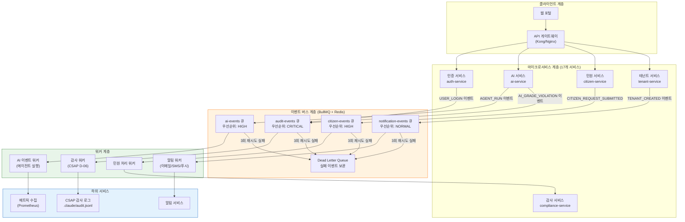
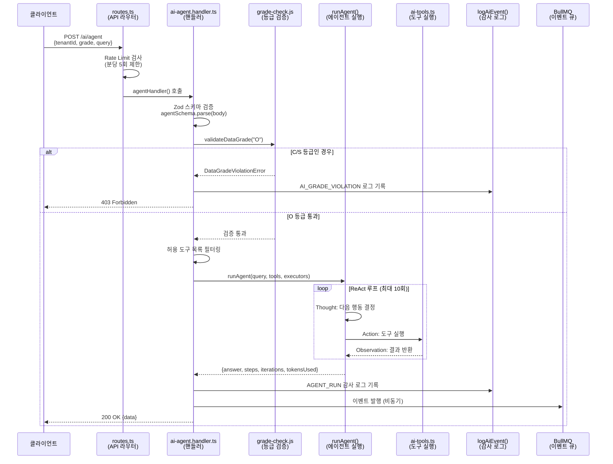
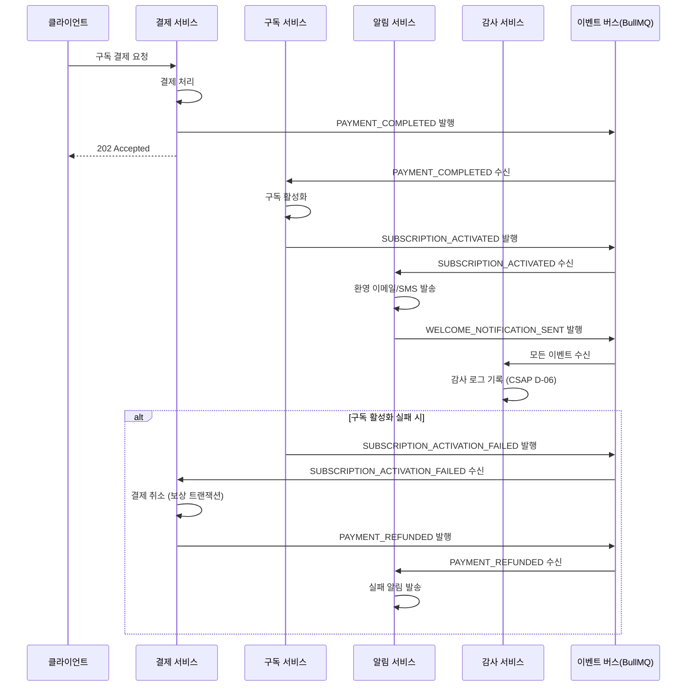
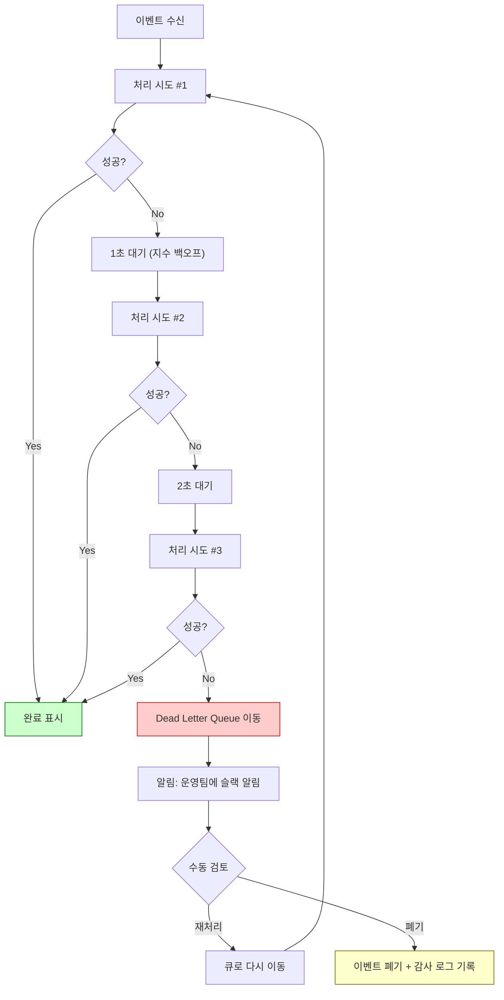

# 이벤트 기반 아키텍처(EDA) 완전 가이드

> **대상**: 공공기관 SaaS 프레임워크 신규 개발자  
> **수준**: 초급 ~ 중급 (사전 지식 없어도 이해 가능)  
> **Design Ref**: SVC-AI-2026 DESIGN §2, SVC-AI-ADV-R2 DESIGN §1~§5  
> **Plan SC**: FR-AI26.2, FR-ADV2.1~FR-ADV2.6  
> **CSAP**: D-06(감사 로그), D-08(접근통제), D-12(개발보안)  
> **최종 수정**: 2026-04-13

---

## 목차

1. [이벤트 기반 아키텍처란 무엇인가](#1-이벤트-기반-아키텍처란-무엇인가)
2. [EDA 전체 아키텍처 다이어그램](#2-eda-전체-아키텍처-다이어그램)
3. [ai-agent.handler.ts 완전 분석](#3-ai-agenthandlerts-완전-분석)
4. [ai-tools.ts 완전 분석 — safeEvaluate 재귀 파서](#4-ai-toolsts-완전-분석--safeevaluate-재귀-파서)
5. [도메인 이벤트 설계 원칙](#5-도메인-이벤트-설계-원칙)
6. [BullMQ 이벤트 버스 패턴](#6-bullmq-이벤트-버스-패턴)
7. [Event Sourcing 운영 패턴](#7-event-sourcing-운영-패턴)
8. [Outbox 패턴 — 원자적 게시](#8-outbox-패턴--원자적-게시)
9. [이벤트 기반 Saga — Choreography 완전 예제](#9-이벤트-기반-saga--choreography-완전-예제)
10. [이벤트 스키마 레지스트리](#10-이벤트-스키마-레지스트리)
11. [EDA 디버깅 — 이벤트 추적과 실패 재처리](#11-eda-디버깅--이벤트-추적과-실패-재처리)
12. [연습 문제](#12-연습-문제)

---

## 1. 이벤트 기반 아키텍처란 무엇인가

### 1.1 전통적인 방식과의 비교

우리가 흔히 접하는 웹 서버는 **요청-응답(Request-Response)** 방식입니다. 클라이언트가 요청하면 서버가 처리하고 즉시 결과를 반환합니다. 이 방식은 단순하지만 다음과 같은 문제가 있습니다.

```
[전통적인 요청-응답 방식]

민원인 → API 게이트웨이 → 민원 서비스 → DB 저장
                                     ↓
민원인 ← 응답 ←←←←←←←←←←←←← 알림 서비스 호출 (동기)
                                     ↓
                               감사 로그 저장 (동기)
```

문제점:
- 민원 서비스가 알림 서비스와 **직접 연결**되어 있어 알림 서비스가 장애 나면 민원 접수도 실패
- 처리 시간이 길어질수록 사용자 대기 시간 증가
- 서비스 간 결합도(coupling)가 높아 독립 배포 어려움

**이벤트 기반 아키텍처(EDA, Event-Driven Architecture)**는 이 문제를 해결합니다.

```
[이벤트 기반 방식]

민원인 → API 게이트웨이 → 민원 서비스 → DB 저장
                                     ↓ 이벤트 발행
                               [이벤트 버스(BullMQ)]
                                /       |       \
                         알림 서비스  감사 서비스  통계 서비스
                         (비동기)    (비동기)    (비동기)
```

핵심 차이점:
- 민원 서비스는 이벤트를 **발행(publish)**만 하고 즉시 응답
- 알림/감사/통계 서비스는 이벤트를 **구독(subscribe)**하여 독립적으로 처리
- 한 서비스가 장애 나도 다른 서비스에 영향 없음

### 1.2 핵심 개념 정의

| 개념 | 설명 | 예시 |
|------|------|------|
| **이벤트(Event)** | "무언가 일어났다"는 사실의 기록 | `CITIZEN_REQUEST_SUBMITTED` |
| **이벤트 버스** | 이벤트를 받아 전달하는 중계자 | BullMQ, Kafka, RabbitMQ |
| **발행자(Publisher)** | 이벤트를 만들어 버스에 보내는 서비스 | 민원 서비스 |
| **구독자(Subscriber)** | 버스에서 이벤트를 받아 처리하는 서비스 | 알림 서비스 |
| **워커(Worker)** | 큐에서 이벤트를 꺼내 처리하는 실행 단위 | BullMQ Worker |
| **도메인 이벤트** | 비즈니스 도메인에서 발생한 중요한 사실 | 사용자 생성, 결제 완료 |

### 1.3 공공기관 SaaS에서 EDA가 필요한 이유

이 프로젝트에서는 17개 마이크로서비스가 운영됩니다. 각 서비스가 직접 통신하면 17 × 16 = 272개 연결이 필요합니다. EDA를 사용하면 모든 서비스가 하나의 이벤트 버스와만 통신합니다.

또한 공공기관 서비스에서는 다음 요구사항이 있습니다:
- **CSAP D-06**: 모든 민감 작업의 감사 로그 필수 기록 — EDA로 모든 이벤트를 자동 감사
- **고가용성**: AI 에이전트 처리가 실패해도 이벤트는 큐에 보존되어 재처리 가능
- **비용 최적화**: AI API 호출은 비싸므로 큐를 통해 속도 제한(rate limiting) 적용 가능

---

## 2. EDA 전체 아키텍처 다이어그램

### 2.1 도메인 이벤트에서 알림까지 전체 흐름



### 2.2 AI 에이전트 이벤트 처리 상세 흐름



---

## 3. ai-agent.handler.ts 완전 분석

이 파일은 `/data/ai-saas/platform/services/ai-service/src/handlers/ai-agent.handler.ts`에 있으며, AI 에이전트의 핵심 진입점입니다.

### 3.1 파일 구조 개요

파일은 크게 두 개의 핸들러로 나뉩니다.

```
ai-agent.handler.ts
├── agentHandler()          — 기본 ReAct 에이전트 (POST /ai/agent)
└── advancedAgentHandler()  — 고급 에이전트 (POST /ai/agent/advanced)
    ├── mode='react'        — 기존 ReAct 패턴
    ├── mode='plan-execute' — 계획 수립 → 단계별 실행
    └── mode='orchestrate'  — 서브에이전트 위임 실행
```

### 3.2 입력 검증 — Zod 스키마

```typescript
// Design Ref: SVC-AI-ADV-R2 DESIGN §5
// CSAP D-12: 모든 API 입력에 스키마 검증 필수
const agentSchema = z.object({
  tenantId: z.string().uuid(),          // UUID 형식만 허용
  grade: z.enum(['O']),                 // O 등급만 허용 (N2SF N-05)
  query: z.string().min(1).max(4000),   // 1~4000자
  maxIterations: z.number().int()
    .min(1).max(10)
    .optional().default(10),            // 최대 10회 반복
  tools: z.array(z.string()).optional(),
  modelId: z.string().optional(),
});
```

**초급자를 위한 설명**: Zod는 TypeScript의 런타임 입력 검증 라이브러리입니다. `agentSchema.parse(request.body)`를 호출하면, 입력이 스키마와 맞지 않을 때 자동으로 400 에러를 발생시킵니다. CSAP D-12(입력 검증) 요구사항을 충족합니다.

### 3.3 N2SF 데이터 등급 검사 — 핵심 보안 로직

```typescript
// N2SF N-05: C/S등급 차단 — 공공기관 보안 핵심 로직
try {
  validateDataGrade(body.grade as DataGrade);
} catch (error) {
  if (error instanceof DataGradeViolationError) {
    // 감사 로그 기록 (CSAP D-06)
    await logAiEvent(
      'AI_GRADE_VIOLATION',   // 이벤트 유형
      actor,                  // 행위자 (사용자 ID)
      'agent',                // 컨텍스트
      body.tenantId,          // 테넌트 ID
      request.ip,             // 클라이언트 IP
      request.headers['user-agent'] ?? 'unknown',
      { grade: body.grade, blocked: true, endpoint: 'agent' }
    );
    await reply.status(403).send({
      success: false,
      error: { code: error.code, message: error.message }
    });
    return;
  }
  throw error;
}
```

**보안 설계 이유**: N2SF(국가정보원 보안프레임워크)의 N-05 규칙에 따라 C(기밀)나 S(민감) 등급 데이터는 외부 AI API로 전송할 수 없습니다. 오직 O(공개) 등급만 허용됩니다. 이를 위반하면 즉시 차단하고 감사 로그에 기록합니다.

### 3.4 ReAct 모드 — Thought-Action-Observation 루프

ReAct(Reason + Act)는 AI 에이전트가 생각하고, 행동하고, 관찰하는 반복 패턴입니다.

```
[ReAct 루프 예시]

사용자 질의: "2026년 1분기 예산 집행률이 어떻게 되나요?"

Thought 1: 예산 집행 관련 문서를 먼저 검색해야 한다.
Action 1: search_knowledge(query="2026년 1분기 예산 집행", tenantId="...")
Observation 1: "1분기 예산 집행률: 23.4%, 목표: 25%"

Thought 2: 수치를 계산하여 달성률을 구해야 한다.
Action 2: calculate(expression="23.4/25*100")
Observation 2: "93.6"

Thought 3: 현재 날짜를 확인해야 한다.
Action 3: current_datetime()
Observation 3: "2026년 4월 13일 월요일 09:30"

Answer: 2026년 1분기 예산 집행률은 23.4%로, 목표 대비 93.6%를 달성했습니다.
```

코드에서 ReAct 모드는 다음과 같이 실행됩니다:

```typescript
const result = await runAgent(
  body.query,
  allowedTools,      // 허용된 도구 목록
  executors,         // 각 도구의 실행 로직
  { maxIterations: body.maxIterations },
  modelConfig,
);
```

`runAgent()` 함수는 `lib/ai-agent.js`에 구현되어 있으며, 내부에서 LLM과 주고받으며 Thought → Action → Observation을 반복합니다.

### 3.5 Plan-Execute 모드 — 계획 수립 후 실행

ReAct가 "생각하면서 실행"이라면, Plan-Execute는 "먼저 전체 계획을 세우고 실행"합니다.

```typescript
// mode='plan-execute' 처리 분기
if (body.mode === 'plan-execute') {
  // 1. 도구 레지스트리에서 사용 가능한 도구 목록 가져오기
  const registry = getOrCreateRegistry(body.tenantId, {
    ragSearch: async (query: string, tenantId: string) => {
      const embedding = await generateEmbedding(query);
      const rag = await runRAG(tenantId, query, embedding, { topK: 3, minScore: 0.25 });
      return rag.answer;
    },
  });

  // 2. Plan-Execute 실행
  const result = await runPlanExecute(
    body.query,
    tools,
    executors,
    { additionalContext: memoryContext },  // 이전 대화 기억
    modelConfig,
  );

  // 3. 감사 로그 기록
  await logAiEvent('AGENT_PLAN_EXECUTE', actor, 'agent-advanced', body.tenantId, ...{
    mode: 'plan-execute',
    stepsPlanned: result.plan.steps.length,    // 계획된 단계 수
    stepsCompleted: result.steps.filter(s => s.status === 'completed').length,
    replanned: result.replanned,               // 재계획 발생 여부
  });
}
```

Plan-Execute의 특징:
- 처음에 LLM이 전체 단계 계획을 수립
- 각 단계를 순서대로 실행
- 중간에 실패하면 재계획(replanning) 가능
- 복잡한 다단계 작업에 적합 (예: "보고서 작성 → 검토 → 승인 요청")

### 3.6 Orchestrator 모드 — 서브에이전트 위임

가장 복잡한 모드입니다. 하나의 오케스트레이터가 여러 서브에이전트에게 작업을 위임합니다.

```typescript
// mode='orchestrate' 처리
const result = await runOrchestrator(
  body.query,
  body.subAgents as SubAgentRole[] | undefined,
  // 사용 가능한 서브에이전트:
  // 'researcher' — 정보 수집
  // 'analyst'    — 데이터 분석
  // 'writer'     — 문서 작성
  // 'reviewer'   — 검토
  { additionalContext: memoryContext },
  modelConfig,
);
```

예시 시나리오: "공공조달 정책 변경 분석 보고서 작성"
```
오케스트레이터
├── researcher: 관련 법령 및 고시 검색
├── analyst: 변경 사항 비교 분석
├── writer: 보고서 초안 작성
└── reviewer: 초안 검토 및 개선
```

### 3.7 세션 메모리 — 대화 컨텍스트 유지

`enableMemory=true`이고 `sessionId`가 제공되면, 이전 대화 내용을 기억합니다.

```typescript
if (body.enableMemory && body.sessionId) {
  // 1. 현재 세션 가져오기 (없으면 새로 생성)
  const session = getOrCreateSession(body.tenantId, body.sessionId);

  // 2. 장기 메모리 로드 (테넌트별 공유 지식)
  const longTerm = await loadLongTermMemory(body.tenantId);

  // 3. 세션 대화 내역을 메시지 형식으로 변환
  const memMessages = memoryToMessages(session);

  // 4. 메모리 컨텍스트 문자열 구성
  memoryContext = parts.length > 0 ? parts.join('\n---\n') : undefined;

  // 5. 현재 질의를 세션에 저장
  await addToMemory(session, 'user', body.query);
}
```

이 메모리 시스템 덕분에 챗봇이 이전 대화를 기억하고 연속적인 업무 처리가 가능합니다.

### 3.8 에러 처리 — 보안 관점

```typescript
} catch (err) {
  request.log.error(err, 'Advanced Agent 실행 실패');
  // CSAP D-12: 민감 정보(스택트레이스, 내부 오류)를 클라이언트에 노출 금지
  await reply.status(502).send({
    success: false,
    error: {
      code: 'AGENT_ADVANCED_FAILED',
      message: 'AI 에이전트 실행 중 오류가 발생했습니다.'
      // 실제 에러 메시지(err.message)는 포함하지 않음
    },
  });
}
```

**왜 이렇게 했을까?**: `err.message`를 그대로 반환하면 공격자가 내부 시스템 구조를 파악할 수 있습니다. 에러는 서버 로그에만 기록하고 클라이언트에는 안전한 메시지만 반환합니다. CSAP D-12 보안 코딩 요구사항입니다.

---

## 4. ai-tools.ts 완전 분석 — safeEvaluate 재귀 파서

이 파일은 `/data/ai-saas/platform/services/ai-service/src/lib/ai-tools.ts`에 있으며, AI 에이전트가 사용할 수 있는 7가지 도구를 정의합니다.

### 4.1 도구 정의 — TOOL_DEFINITIONS

```typescript
export const TOOL_DEFINITIONS: ToolDefinition[] = [
  {
    name: 'search_knowledge',
    description: '테넌트의 지식베이스(공공문서 등)에서 관련 정보를 시맨틱 검색합니다',
    parameters: {
      query: { type: 'string', description: '검색 질문', required: true },
      tenantId: { type: 'string', description: '테넌트 ID', required: true },
    },
  },
  // ... 6개 더
];
```

에이전트는 이 목록을 보고 어떤 도구를 언제 사용할지 판단합니다. 마치 직원에게 "이런 도구들이 있으니 필요할 때 사용하세요"라고 알려주는 것과 같습니다.

### 4.2 도구 실행기 팩토리 — createToolExecutors()

도구 정의(TOOL_DEFINITIONS)는 "어떤 도구가 있는지" 설명만 합니다. 실제 실행 로직은 `createToolExecutors()`에 있습니다. 의존성 주입(Dependency Injection) 패턴을 사용합니다.

```typescript
export function createToolExecutors(
  options: {
    ragSearch?: (query: string, tenantId: string) => Promise<string>;
    llmSummarize?: (text: string) => Promise<string>;
    llmClassify?: (text: string) => Promise<string>;
  } = {},
): Record<string, ToolExecutor> {
  return {
    search_knowledge: async (params) => {
      if (!options.ragSearch) {
        return { success: false, output: '', error: 'RAG 검색이 설정되지 않았습니다' };
      }
      // ... 실행 로직
    },
    // ...
  };
}
```

**초급자를 위한 설명**: 왜 RAG 검색 함수를 매개변수로 받을까요? `ai-tools.ts`는 순수한 도구 실행 로직이고, RAG 관련 의존성(벡터 DB, 임베딩 모델)을 직접 가지면 테스트가 어렵습니다. 외부에서 주입받으면 테스트 시 가짜(mock) 함수를 넣을 수 있습니다.

### 4.3 safeEvaluate() — 재귀 하강 파서 완전 분석

이 함수는 이 프로젝트에서 가장 정교한 보안 코딩의 예시입니다. CSAP D-12의 OWASP A03:2021 인젝션 방지를 구현합니다.

**왜 eval()을 사용하지 않을까?**

```typescript
// 절대 금지: eval()은 임의 코드 실행 가능 (OWASP A03)
const result = eval("1+2");           // 정상
const result = eval("process.exit()"); // 위험! 서버 종료
const result = eval("require('fs').readFileSync('/etc/passwd')"); // 위험!
```

대신, 수학 표현식만 처리하는 파서를 직접 구현했습니다.

**파서 구조 — 재귀 하강 파싱(Recursive Descent Parsing)**

```
수식의 문법 규칙 (BNF 표기법):
expression = term (('+' | '-') term)*
term       = factor (('*' | '/') factor)*
factor     = '(' expression ')' | number | unary
```

예시: `3 + 4 * 2` 파싱 과정

```
parseExpression() 호출
  → parseTerm() 호출
      → parseFactor() → 숫자 3 반환
      → peek() = '+', 다음 term 없음 → 3 반환
  → left = 3
  → peek() = '+', consume() = '+'
  → parseTerm() 호출
      → parseFactor() → 숫자 4 반환
      → peek() = '*', consume() = '*'
      → parseFactor() → 숫자 2 반환
      → 4 * 2 = 8 반환
  → left = 3 + 8 = 11 반환
```

코드 주석과 함께 살펴보겠습니다:

```typescript
function safeEvaluate(expression: string): number | null {
  // 1단계: 토큰화 — 수식을 숫자와 연산자로 분리
  const tokens: string[] = [];
  const cleaned = expression
    .replace(/,/g, '')      // 1,000 → 1000 (천단위 구분자 제거)
    .replace(/\s+/g, '');   // 공백 제거

  let i = 0;
  while (i < cleaned.length) {
    const ch = cleaned[i];
    if ((ch >= '0' && ch <= '9') || ch === '.') {
      // 숫자 수집 (123.45와 같은 소수점 포함)
      let num = '';
      while (i < cleaned.length && ((cleaned[i] >= '0' && cleaned[i] <= '9') || cleaned[i] === '.')) {
        num += cleaned[i++];
      }
      tokens.push(num);
    } else if ('+-*/()'.includes(ch)) {
      tokens.push(ch);
      i++;
    } else {
      return null; // 허용되지 않는 문자 발견 → null 반환
    }
  }

  // 2단계: 파서 상태 관리
  let pos = 0;
  function peek(): string | undefined { return tokens[pos]; }
  function consume(): string {
    return tokens[pos++] ?? '';
  }

  // 3단계: 재귀 하강 파서
  // expression = term (('+' | '-') term)*
  function parseExpression(): number | null {
    let left = parseTerm();
    if (left === null) return null;
    while (peek() === '+' || peek() === '-') {
      const op = consume();
      const right = parseTerm();
      if (right === null) return null;
      left = op === '+' ? left + right : left - right;
    }
    return left;
  }

  // term = factor (('*' | '/') factor)*
  function parseTerm(): number | null {
    let left = parseFactor();
    if (left === null) return null;
    while (peek() === '*' || peek() === '/') {
      const op = consume();
      const right = parseFactor();
      if (right === null) return null;
      if (op === '/') {
        if (right === 0) return null; // 0으로 나누기 방지 (NaN/Infinity 방지)
        left = left / right;
      } else {
        left = left * right;
      }
    }
    return left;
  }

  // factor = '(' expression ')' | number | unary('-'|'+')
  function parseFactor(): number | null {
    const token = peek();
    if (token === '-' || token === '+') {
      // 단항 연산자: -5, +3
      const op = consume();
      const factor = parseFactor();
      if (factor === null) return null;
      return op === '-' ? -factor : factor;
    }
    if (token === '(') {
      consume(); // '(' 소비
      const result = parseExpression(); // 재귀 호출
      if (result === null || peek() !== ')') return null;
      consume(); // ')' 소비
      return result;
    }
    // 숫자
    const num = parseFloat(consume());
    if (isNaN(num) || !isFinite(num)) return null;
    return num;
  }

  const result = parseExpression();
  // 모든 토큰을 소비했는지 확인 (남은 토큰이 있으면 문법 오류)
  if (result === null || pos !== tokens.length) return null;
  if (!isFinite(result)) return null;
  return result;
}
```

**보안 설계 결정 요약**:

| 위협 | 방어 방법 |
|------|---------|
| 코드 인젝션 | 정규식 화이트리스트 `[\d\s+\-*/().,]+` 로 사전 차단 |
| 무한 루프 | 재귀 파서는 입력 길이에 비례하여 종료 보장 |
| 0 나누기 | `if (right === 0) return null` 명시적 처리 |
| 오버플로우 | `!isFinite(result)` 검사로 Infinity 차단 |
| 부동소수점 오류 | `isNaN(num)` 검사 |

### 4.4 detectCategory() — 키워드 기반 민원 분류

```typescript
function detectCategory(text: string): string {
  const patterns: Array<[RegExp, string]> = [
    [/교통|도로|주차|버스|지하철/, '교통'],
    [/복지|수당|지원금|기초생활/, '복지'],
    [/세금|납부|부과|환급/, '세금'],
    [/환경|쓰레기|분리수거|미세먼지/, '환경'],
  ];
  for (const [pattern, category] of patterns) {
    if (pattern.test(text)) return category;
  }
  return '민원';
}
```

LLM 기반 분류(`llmClassify`)가 없을 때 폴백(fallback)으로 사용합니다. 공공기관 민원의 주요 카테고리를 정규식으로 매칭합니다.

### 4.5 extractSimpleEntities() — 개체명 추출

```typescript
function extractSimpleEntities(text: string): Record<string, string[]> {
  return {
    // 날짜 패턴: 2026.04.13, 2026-04-13, 2026/04/13
    dates: [...new Set((text.match(/\d{4}[.\-\/]\d{1,2}[.\-\/]\d{1,2}/g) ?? []))],
    // 금액 패턴: 1,000원, 100만원, 5억원
    amounts: [...new Set((text.match(/\d+,?\d*원|\d+만원|\d+억원/g) ?? []))],
    // 기관명 패턴: XX부, XX청, XX원, XX처
    organizations: [...new Set((text.match(/\w+부|\w+청|\w+원|\w+처|\w+청/g) ?? []))].slice(0, 5),
  };
}
```

**Set을 사용하는 이유**: `new Set()`으로 중복을 제거합니다. 같은 날짜가 여러 번 나와도 한 번만 결과에 포함됩니다.

---

## 5. 도메인 이벤트 설계 원칙

### 5.1 이벤트란 무엇인가 — 철학적 이해

이벤트는 "과거에 일어난 사실"입니다. 현재형이 아닌 과거형으로 명명합니다.

| 잘못된 예 | 올바른 예 | 이유 |
|---------|---------|------|
| `CreateUser` | `UserCreated` | 명령(Command)이 아닌 사실(Fact) |
| `SendNotification` | `NotificationSent` | 과거형 사용 |
| `ProcessCitizenRequest` | `CitizenRequestSubmitted` | 과거형 + 구체적 동작 |

### 5.2 이벤트 명명 규칙

```
{도메인}_{엔티티}_{동사_과거형}

예시:
- AI_AGENT_EXECUTED          (AI 에이전트 실행됨)
- CITIZEN_REQUEST_SUBMITTED  (민원 접수됨)
- USER_LOGGED_IN             (사용자 로그인됨)
- TENANT_SUBSCRIPTION_CREATED (테넌트 구독 생성됨)
- PAYMENT_COMPLETED          (결제 완료됨)
```

이 프로젝트에서 사용하는 감사 이벤트(`logAiEvent()` 호출 시):

```typescript
// ai-agent.handler.ts에서 실제 사용되는 이벤트 타입
'AI_GRADE_VIOLATION'   // N2SF 등급 위반 시도
'AGENT_RUN'            // 기본 ReAct 에이전트 실행 완료
'AGENT_PLAN_EXECUTE'   // Plan-Execute 에이전트 실행 완료
'AGENT_ORCHESTRATE'    // Orchestrator 에이전트 실행 완료
'AGENT_REACT'          // Advanced ReAct 에이전트 실행 완료
```

### 5.3 이벤트 페이로드 스키마 설계

이벤트 페이로드는 다음 원칙을 따릅니다:

```typescript
// 이벤트 페이로드 표준 구조
interface DomainEvent<T = Record<string, unknown>> {
  // 필수 필드
  eventId: string;          // UUID v4, 이벤트 고유 식별자
  eventType: string;        // 이벤트 유형 (명명 규칙 준수)
  eventVersion: string;     // "1.0" — 하위 호환성 관리용
  timestamp: string;        // ISO 8601 형식 "2026-04-13T09:30:00Z"
  tenantId: string;         // 멀티테넌트 격리

  // 발생 컨텍스트
  actor: string;            // 행위자 (사용자 ID 또는 "system")
  source: string;           // 발생 서비스 ("ai-service")
  correlationId?: string;   // 연관 요청 추적 ID

  // 페이로드 (이벤트마다 다름)
  payload: T;
}

// 예시: AGENT_RUN 이벤트
interface AgentRunEvent extends DomainEvent<{
  query: string;          // PII 마스킹된 질문
  iterations: number;     // 반복 횟수
  tokensUsed: number;     // 사용된 토큰 수
  timedOut: boolean;      // 타임아웃 여부
  durationMs: number;     // 처리 시간(ms)
}> {}
```

### 5.4 PII 마스킹 — 개인정보 보호

이벤트에 개인정보가 포함되어서는 안 됩니다.

```typescript
// ai-agent.handler.ts에서 실제 사용
await logAiEvent('AGENT_RUN', actor, 'agent', body.tenantId, request.ip,
  request.headers['user-agent'] ?? 'unknown', {
    query: maskPII(body.query).slice(0, 100),  // PII 마스킹 + 100자 잘라내기
    iterations: result.iterations,
    tokensUsed: result.tokensUsed,
  });
```

`maskPII()` 함수는 주민등록번호, 전화번호, 이메일 등 개인정보를 `[MASKED]`로 치환합니다. 이벤트 로그가 유출되어도 개인정보가 노출되지 않습니다.

---

## 6. BullMQ 이벤트 버스 패턴

### 6.1 BullMQ 소개

BullMQ는 Redis를 기반으로 하는 TypeScript/Node.js용 분산 큐 라이브러리입니다. 공공기관 SaaS에서 다음 이유로 선택했습니다:

- **영속성**: Redis에 이벤트를 저장하므로 서버 재시작 후에도 처리 가능
- **재시도**: 실패한 이벤트를 자동으로 재시도 (지수 백오프)
- **우선순위**: 중요한 이벤트(감사 로그)를 먼저 처리
- **Dead Letter Queue**: 최종 실패 이벤트 보관

### 6.2 기본 Publish/Subscribe 패턴

```typescript
// ─── 발행자 (Publisher) ───────────────────────────────────────
// Design Ref: SVC-AI-2026 DESIGN §2
import { Queue } from 'bullmq';
import { redis } from './redis-client.js';

const aiEventQueue = new Queue('ai-events', {
  connection: redis,
  defaultJobOptions: {
    attempts: 3,           // 최대 3회 재시도
    backoff: {
      type: 'exponential', // 지수 백오프: 1s → 2s → 4s
      delay: 1000,
    },
    removeOnComplete: { count: 1000 },  // 완료된 이벤트 1000개 보관
    removeOnFail: { count: 5000 },      // 실패 이벤트 5000개 보관
  },
});

// 이벤트 발행 함수
export async function publishAiEvent(eventType: string, payload: unknown): Promise<void> {
  await aiEventQueue.add(eventType, {
    eventId: crypto.randomUUID(),
    eventType,
    timestamp: new Date().toISOString(),
    payload,
  }, {
    priority: getEventPriority(eventType),  // 이벤트 유형별 우선순위
  });
}

// 이벤트 우선순위 결정
function getEventPriority(eventType: string): number {
  if (eventType.includes('VIOLATION') || eventType.includes('SECURITY')) return 1;  // 최고
  if (eventType.includes('AUDIT') || eventType.includes('LOG')) return 2;
  if (eventType.includes('AGENT') || eventType.includes('RAG')) return 3;
  return 10;  // 기본
}
```

```typescript
// ─── 구독자/워커 (Worker) ──────────────────────────────────────
import { Worker, Job } from 'bullmq';

const aiEventWorker = new Worker('ai-events', async (job: Job) => {
  const { eventType, payload } = job.data;

  switch (eventType) {
    case 'AGENT_RUN':
      await handleAgentRun(payload);
      break;
    case 'AI_GRADE_VIOLATION':
      await handleGradeViolation(payload);
      // 보안 위반은 즉시 알림
      await sendSecurityAlert(payload);
      break;
    default:
      console.warn(`알 수 없는 이벤트 유형: ${eventType}`);
  }
}, {
  connection: redis,
  concurrency: 5,  // 동시에 5개 이벤트 처리
});

// 이벤트 처리 실패 핸들러
aiEventWorker.on('failed', (job, error) => {
  console.error(`이벤트 처리 실패: ${job?.id}`, error);
  // Dead Letter Queue로 이동 (3회 실패 후)
});
```

### 6.3 팬아웃(Fan-out) 패턴

하나의 이벤트를 여러 구독자에게 전달합니다.

```typescript
// 팬아웃 구현: 하나의 이벤트를 여러 큐로 복사
export async function fanOutEvent(
  eventType: string,
  payload: unknown,
  targetQueues: string[]  // ['audit-events', 'notification-events', 'metrics-events']
): Promise<void> {
  const event = {
    eventId: crypto.randomUUID(),
    eventType,
    timestamp: new Date().toISOString(),
    payload,
  };

  // 모든 대상 큐에 병렬 발행
  await Promise.all(
    targetQueues.map(queueName =>
      new Queue(queueName, { connection: redis }).add(eventType, event)
    )
  );
}

// 사용 예시: CITIZEN_REQUEST_SUBMITTED 이벤트 팬아웃
await fanOutEvent('CITIZEN_REQUEST_SUBMITTED', {
  citizenId: '[MASKED]',  // PII 마스킹
  requestType: '민원',
  tenantId: '...',
}, [
  'audit-events',        // 감사 로그 기록
  'notification-events', // 접수 확인 알림
  'analytics-events',    // 통계 집계
]);
```

### 6.4 이벤트 필터링 패턴

구독자가 관심 있는 이벤트만 처리합니다.

```typescript
// 이벤트 필터 정의
const notificationWorker = new Worker('all-events', async (job: Job) => {
  const { eventType } = job.data;

  // 알림이 필요한 이벤트만 처리
  const notificationEvents = new Set([
    'CITIZEN_REQUEST_SUBMITTED',
    'AI_GRADE_VIOLATION',
    'TENANT_SUBSCRIPTION_EXPIRED',
    'USER_PASSWORD_RESET',
  ]);

  if (!notificationEvents.has(eventType)) {
    return; // 무시 (처리 완료로 표시)
  }

  await sendNotification(job.data);
}, { connection: redis });
```

---

## 7. Event Sourcing 운영 패턴

### 7.1 Event Sourcing이란

일반 CRUD 방식은 현재 상태만 저장합니다. Event Sourcing은 모든 변경 이력(이벤트)을 저장하고, 현재 상태는 이벤트를 재생하여 계산합니다.

```
[일반 CRUD]                    [Event Sourcing]

민원 테이블                    이벤트 스토어
─────────────                  ─────────────────────────────────
id: 1                          1. CitizenRequestCreated {type: "교통"}
status: "처리중"               2. CitizenRequestAssigned {officer: "김담당"}
→ 이전 상태를 알 수 없음       3. CitizenRequestReviewed {result: "검토완료"}
                               4. CitizenRequestCompleted {resolution: "도로보수"}
                               → 모든 변경 이력 추적 가능
```

**공공기관에서 Event Sourcing이 유리한 이유**:
- 감사(Audit): 모든 변경 이력이 자동으로 기록됨 (CSAP D-06 요구사항 자동 충족)
- 디버깅: 장애 시 언제, 어떻게 상태가 변했는지 추적 가능
- 민원 처리 투명성: 시민이 요청한 민원의 전체 처리 과정 추적 가능

### 7.2 Projection 재구축

이벤트에서 현재 상태(View)를 계산하는 것을 Projection이라 합니다.

```typescript
// 민원 요청 상태 Projection
interface CitizenRequestState {
  id: string;
  status: 'submitted' | 'assigned' | 'in_review' | 'completed' | 'rejected';
  assignedOfficer?: string;
  resolution?: string;
  updatedAt: Date;
}

async function rebuildCitizenRequestProjection(requestId: string): Promise<CitizenRequestState> {
  // 이벤트 스토어에서 해당 요청의 모든 이벤트 조회 (시간순)
  const events = await eventStore.findByAggregateId(requestId, {
    orderBy: { version: 'asc' }
  });

  // 초기 상태
  let state: CitizenRequestState = {
    id: requestId,
    status: 'submitted',
    updatedAt: new Date(),
  };

  // 이벤트 순서대로 재생하여 현재 상태 계산
  for (const event of events) {
    state = applyEvent(state, event);
  }

  return state;
}

function applyEvent(
  state: CitizenRequestState,
  event: { type: string; payload: unknown; timestamp: Date }
): CitizenRequestState {
  switch (event.type) {
    case 'CitizenRequestAssigned':
      return {
        ...state,
        status: 'assigned',
        assignedOfficer: (event.payload as { officer: string }).officer,
        updatedAt: event.timestamp,
      };
    case 'CitizenRequestCompleted':
      return {
        ...state,
        status: 'completed',
        resolution: (event.payload as { resolution: string }).resolution,
        updatedAt: event.timestamp,
      };
    default:
      return state;
  }
}
```

### 7.3 이벤트 버전 관리

시스템이 발전하면서 이벤트 스키마가 변경될 수 있습니다. 하위 호환성을 위해 버전을 관리합니다.

```typescript
// 이벤트 업캐스터 — 구버전 이벤트를 최신 버전으로 변환
function upcaste(event: StoredEvent): DomainEvent {
  if (event.eventType === 'CITIZEN_REQUEST_SUBMITTED' && event.version === '1.0') {
    // v1.0: { citizenName, requestText }
    // v2.0: { citizenId (마스킹됨), requestType, requestText }
    return {
      ...event,
      version: '2.0',
      payload: {
        citizenId: maskPII(event.payload.citizenName), // 레거시 필드 마스킹
        requestType: classifyRequestType(event.payload.requestText),
        requestText: event.payload.requestText,
      },
    };
  }
  return event;
}
```

---

## 8. Outbox 패턴 — 원자적 게시

### 8.1 문제 상황: 이중 쓰기 문제

```
[문제 시나리오]

1. DB 저장 성공
2. 이벤트 발행 실패 ← 여기서 오류 발생!

결과: DB에는 민원이 저장됐지만, 감사 로그 이벤트가 발행되지 않음
     → 데이터 불일치! CSAP D-06 위반!
```

### 8.2 Outbox 패턴 해결책

```typescript
// Outbox 테이블 구조
// CREATE TABLE event_outbox (
//   id UUID PRIMARY KEY,
//   event_type VARCHAR(100),
//   payload JSONB,
//   created_at TIMESTAMP,
//   published_at TIMESTAMP,  -- NULL이면 미발행
//   retry_count INT DEFAULT 0
// );

// DB 트랜잭션 + Outbox에 원자적 저장
async function submitCitizenRequest(requestData: CitizenRequest): Promise<void> {
  // 트랜잭션으로 민원 저장 + 이벤트 outbox 저장을 원자적으로 처리
  await prisma.$transaction(async (tx) => {
    // 1. 민원 저장
    const request = await tx.citizenRequest.create({
      data: {
        tenantId: requestData.tenantId,
        requestType: requestData.requestType,
        content: maskPII(requestData.content),
        status: 'submitted',
      },
    });

    // 2. Outbox에 이벤트 저장 (아직 발행 안 함)
    await tx.eventOutbox.create({
      data: {
        id: crypto.randomUUID(),
        eventType: 'CITIZEN_REQUEST_SUBMITTED',
        payload: {
          requestId: request.id,
          tenantId: requestData.tenantId,
          requestType: requestData.requestType,
          timestamp: new Date().toISOString(),
        },
        // published_at은 NULL — 아직 미발행
      },
    });
    // 트랜잭션 커밋: 민원 + outbox 둘 다 저장되거나 둘 다 실패
  });
}
```

### 8.3 Outbox 폴러 — 미발행 이벤트 처리

```typescript
// 별도 프로세스: Outbox의 미발행 이벤트를 주기적으로 처리
async function processOutbox(): Promise<void> {
  // 미발행 이벤트 조회 (오래된 것 먼저)
  const unpublished = await prisma.eventOutbox.findMany({
    where: {
      publishedAt: null,
      retryCount: { lt: 5 },  // 최대 5회 재시도
    },
    orderBy: { createdAt: 'asc' },
    take: 100,
  });

  for (const event of unpublished) {
    try {
      // BullMQ에 이벤트 발행
      await aiEventQueue.add(event.eventType, event.payload);

      // 발행 완료 표시
      await prisma.eventOutbox.update({
        where: { id: event.id },
        data: { publishedAt: new Date() },
      });
    } catch (error) {
      // 발행 실패: 재시도 카운트 증가
      await prisma.eventOutbox.update({
        where: { id: event.id },
        data: { retryCount: { increment: 1 } },
      });
    }
  }
}

// 10초마다 폴링
setInterval(processOutbox, 10_000);
```

### 8.4 중복 이벤트 방지 — 멱등성(Idempotency)

같은 이벤트가 두 번 처리되어도 결과가 동일해야 합니다.

```typescript
// 이벤트 처리 워커에서 중복 방지
const processedEventIds = new Set<string>();

const worker = new Worker('ai-events', async (job: Job) => {
  const { eventId } = job.data;

  // 이미 처리된 이벤트인지 확인
  if (processedEventIds.has(eventId)) {
    console.log(`중복 이벤트 무시: ${eventId}`);
    return;
  }

  // Redis에서도 확인 (서버 재시작 후에도 중복 방지)
  const alreadyProcessed = await redis.exists(`processed:${eventId}`);
  if (alreadyProcessed) return;

  // 이벤트 처리
  await handleEvent(job.data);

  // 처리 완료 표시 (24시간 보관)
  await redis.setex(`processed:${eventId}`, 86400, '1');
  processedEventIds.add(eventId);
}, { connection: redis });
```

---

## 9. 이벤트 기반 Saga — Choreography 완전 예제

### 9.1 Saga 패턴이란

분산 트랜잭션을 처리하는 패턴입니다. "결제 → 구독 생성 → 알림 발송" 같은 여러 서비스에 걸친 작업을 관리합니다.

두 가지 방식:
- **Orchestration Saga**: 중앙 조율자가 각 서비스에 명령 (한 곳이 모든 흐름을 알고 있음)
- **Choreography Saga**: 각 서비스가 이벤트를 발행하고 다음 서비스가 반응 (분산된 흐름)

이 프로젝트에서는 **Choreography Saga**를 사용합니다. 결합도가 낮고 각 서비스가 독립적으로 진화할 수 있습니다.

### 9.2 SaaS 구독 결제 Choreography Saga 완전 예제



코드 구현:

```typescript
// ─── 결제 서비스 ──────────────────────────────────────────────
class PaymentService {
  async processPayment(tenantId: string, amount: number): Promise<void> {
    // 결제 처리 로직
    const payment = await this.paymentGateway.charge(tenantId, amount);

    if (payment.success) {
      // 성공 이벤트 발행
      await eventBus.publish('PAYMENT_COMPLETED', {
        eventId: crypto.randomUUID(),
        tenantId,
        paymentId: payment.id,
        amount,
        timestamp: new Date().toISOString(),
      });
    } else {
      await eventBus.publish('PAYMENT_FAILED', {
        eventId: crypto.randomUUID(),
        tenantId,
        reason: payment.failureReason,
      });
    }
  }

  // 보상 트랜잭션 — 구독 활성화 실패 시 결제 취소
  async handleSubscriptionFailed(event: DomainEvent): Promise<void> {
    const { paymentId } = event.payload as { paymentId: string };
    await this.paymentGateway.refund(paymentId);

    await eventBus.publish('PAYMENT_REFUNDED', {
      eventId: crypto.randomUUID(),
      paymentId,
      timestamp: new Date().toISOString(),
    });
  }
}

// ─── 구독 서비스 ──────────────────────────────────────────────
const subscriptionWorker = new Worker('payment-events', async (job: Job) => {
  if (job.name !== 'PAYMENT_COMPLETED') return;

  const { tenantId, paymentId } = job.data.payload;

  try {
    // 구독 활성화
    await prisma.subscription.update({
      where: { tenantId },
      data: { status: 'active', activatedAt: new Date() },
    });

    await eventBus.publish('SUBSCRIPTION_ACTIVATED', {
      eventId: crypto.randomUUID(),
      tenantId,
      paymentId,
      activatedAt: new Date().toISOString(),
    });
  } catch (error) {
    // 실패 이벤트 발행 → 결제 서비스가 환불 처리
    await eventBus.publish('SUBSCRIPTION_ACTIVATION_FAILED', {
      eventId: crypto.randomUUID(),
      tenantId,
      paymentId,
      reason: (error as Error).message,
    });
  }
}, { connection: redis });

// ─── 알림 서비스 ──────────────────────────────────────────────
const notificationWorker = new Worker('subscription-events', async (job: Job) => {
  if (job.name === 'SUBSCRIPTION_ACTIVATED') {
    const { tenantId } = job.data.payload;
    const tenant = await tenantService.findById(tenantId);

    await emailService.send({
      to: tenant.adminEmail,
      template: 'welcome',
      data: { tenantName: tenant.name },
    });
  }
}, { connection: redis });
```

---

## 10. 이벤트 스키마 레지스트리

### 10.1 스키마 레지스트리의 필요성

서비스 A가 이벤트를 발행할 때와 서비스 B가 받을 때 스키마가 다르면 시스템이 깨집니다. 스키마 레지스트리는 이벤트 스키마의 "계약서" 역할을 합니다.

```typescript
// 스키마 레지스트리 — 중앙화된 이벤트 스키마 관리
// Design Ref: SVC-AI-2026 DESIGN §2
import { z } from 'zod';

export const eventSchemas = {
  'AGENT_RUN': z.object({
    eventId: z.string().uuid(),
    eventType: z.literal('AGENT_RUN'),
    version: z.literal('1.0'),
    timestamp: z.string().datetime(),
    tenantId: z.string().uuid(),
    actor: z.string(),
    payload: z.object({
      query: z.string().max(100),    // PII 마스킹 후 100자
      iterations: z.number().int(),
      tokensUsed: z.number().int(),
      timedOut: z.boolean(),
      durationMs: z.number(),
    }),
  }),

  'AI_GRADE_VIOLATION': z.object({
    eventId: z.string().uuid(),
    eventType: z.literal('AI_GRADE_VIOLATION'),
    version: z.literal('1.0'),
    timestamp: z.string().datetime(),
    tenantId: z.string().uuid(),
    actor: z.string(),
    payload: z.object({
      grade: z.string(),
      blocked: z.literal(true),
      endpoint: z.string(),
    }),
  }),
} as const;

// 이벤트 발행 시 스키마 검증
export async function publishWithValidation(
  eventType: keyof typeof eventSchemas,
  data: unknown
): Promise<void> {
  const schema = eventSchemas[eventType];
  const validated = schema.parse(data); // 검증 실패 시 예외 발생
  await eventBus.publish(eventType, validated);
}
```

### 10.2 하위 호환성 보장 전략

스키마가 변경될 때 기존 구독자가 깨지지 않도록 합니다.

```typescript
// ✅ 하위 호환 변경 (추가만, 삭제 없음)
// v1.0 → v1.1: 선택적 필드 추가
const agentRunSchemaV1_1 = z.object({
  // ... v1.0 필드 동일하게 유지
  payload: z.object({
    query: z.string().max(100),
    iterations: z.number().int(),
    tokensUsed: z.number().int(),
    timedOut: z.boolean(),
    durationMs: z.number(),
    // 새로 추가: 선택적(optional)이어야 하위 호환성 유지
    modelName: z.string().optional(),  // v1.1 추가
  }),
});

// ❌ 하위 비호환 변경 (필드 삭제/이름 변경 — 구독자 깨짐)
// query → userQuery 로 이름 변경 → 기존 구독자가 query 필드를 못 찾음
```

### 10.3 버전 마이그레이션 전략

```
스키마 버전 관리 3단계:

1. Deprecate   — 구버전 필드를 @deprecated로 표시 (코드는 유지)
2. Dual-write  — 구버전 + 신버전 필드 동시 발행 (전환 기간 2주)
3. Remove      — 모든 구독자 업데이트 확인 후 구버전 필드 제거
```

---

## 11. EDA 디버깅 — 이벤트 추적과 실패 재처리

### 11.1 이벤트 처리 실패 흐름도



### 11.2 Dead Letter Queue 관리

```typescript
// DLQ 모니터링 및 재처리
class DeadLetterQueueManager {
  async listFailedEvents(queueName: string): Promise<Job[]> {
    const queue = new Queue(queueName, { connection: redis });
    return queue.getFailed();
  }

  async reprocessEvent(queueName: string, jobId: string): Promise<void> {
    const queue = new Queue(queueName, { connection: redis });
    const failedJob = await queue.getJob(jobId);

    if (!failedJob) throw new Error(`이벤트를 찾을 수 없습니다: ${jobId}`);

    // 실패 이유 로그 기록
    console.log('재처리 이유:', failedJob.failedReason);

    // 재시도
    await failedJob.retry('failed');

    // 감사 로그 기록 (CSAP D-06)
    await auditLog({
      actor: 'operator',
      action: 'DLQ_EVENT_REPROCESSED',
      target: jobId,
      detail: { queueName, reason: failedJob.failedReason },
    });
  }
}
```

### 11.3 이벤트 추적 — Correlation ID

분산 시스템에서 하나의 사용자 요청이 여러 이벤트를 통해 처리됩니다. Correlation ID로 추적합니다.

```typescript
// 모든 이벤트에 correlationId 포함
async function handleRequest(request: FastifyRequest): Promise<void> {
  // 요청 헤더에서 correlationId 추출 (없으면 생성)
  const correlationId = request.headers['x-correlation-id'] as string
    ?? crypto.randomUUID();

  // 모든 하위 이벤트에 동일한 correlationId 전파
  await publishAiEvent('AGENT_RUN', {
    correlationId,  // 이 값으로 전체 처리 흐름 추적 가능
    tenantId: request.body.tenantId,
    // ...
  });
}

// Jaeger/Tempo에서 쿼리: correlationId로 전체 흐름 확인
// curl http://jaeger:16686/api/traces?service=ai-service&tags=correlationId=abc123
```

### 11.4 BullMQ 대시보드로 이벤트 모니터링

개발 환경에서 Bull Board를 사용하여 큐 상태를 시각적으로 확인합니다.

```typescript
import { createBullBoard } from '@bull-board/api';
import { BullMQAdapter } from '@bull-board/api/bullMQAdapter';
import { FastifyAdapter } from '@bull-board/fastify';

// 모니터링 대시보드 등록
const serverAdapter = new FastifyAdapter();
createBullBoard({
  queues: [
    new BullMQAdapter(aiEventQueue),
    new BullMQAdapter(auditEventQueue),
    new BullMQAdapter(notificationEventQueue),
  ],
  serverAdapter,
});

app.register(serverAdapter.registerPlugin(), { prefix: '/bull-board' });
// 접속: http://localhost:3000/bull-board
```

---

## 12. 연습 문제

다음 시나리오를 구현해 보세요.

### 연습 1 (초급)

민원인이 교통 관련 민원을 접수하면 담당 공무원에게 이메일 알림이 발송되어야 합니다.

1. `CITIZEN_REQUEST_SUBMITTED` 이벤트 스키마를 Zod로 정의하세요.
2. 민원 접수 핸들러에서 이벤트를 발행하는 코드를 작성하세요.
3. 이메일 알림 워커를 구현하세요.

### 연습 2 (중급)

AI 에이전트가 C등급 데이터 전송을 시도하는 상황을 시뮬레이션하세요.

1. `grade: 'C'` 로 `/ai/agent` API를 호출하면 어떤 일이 일어나는지 코드를 추적하세요.
2. `AI_GRADE_VIOLATION` 이벤트가 `.claude/audit.jsonl`에 기록되는지 확인하세요.
3. CSAP D-06 요구사항(감사 로그 1년 보존)을 충족하는 retention 정책을 BullMQ에 설정하세요.

### 연습 3 (고급)

"AI 에이전트 실행 → 결과 알림 → 감사 로그" Choreography Saga를 구현하세요.

1. `AGENT_RUN_COMPLETED` 이벤트 발행 코드를 `ai-agent.handler.ts`에 추가하세요.
2. 알림 워커가 이 이벤트를 수신하여 담당자에게 결과를 발송하도록 구현하세요.
3. 알림 실패 시 보상 트랜잭션(재발송 대기열에 추가)을 구현하세요.

---

## 참고 자료

- 실제 코드: `/data/ai-saas/platform/services/ai-service/src/handlers/ai-agent.handler.ts`
- 도구 레지스트리: `/data/ai-saas/platform/services/ai-service/src/lib/ai-tools.ts`
- API 라우트: `/data/ai-saas/platform/services/ai-service/src/routes.ts`
- CSAP D-06 감사 로그: `/data/ai-saas/.claude/audit.jsonl`
- Design 문서: `docs/01-plan/mtus/SVC-AI-ADV-R2.plan.md`

---

*문서 버전: 1.0.0 | 작성일: 2026-04-13 | 작성자: 공공 SaaS 개발팀*  
*다음 가이드: `23-cqrs-pattern.md` — CQRS 패턴과 읽기/쓰기 분리*
