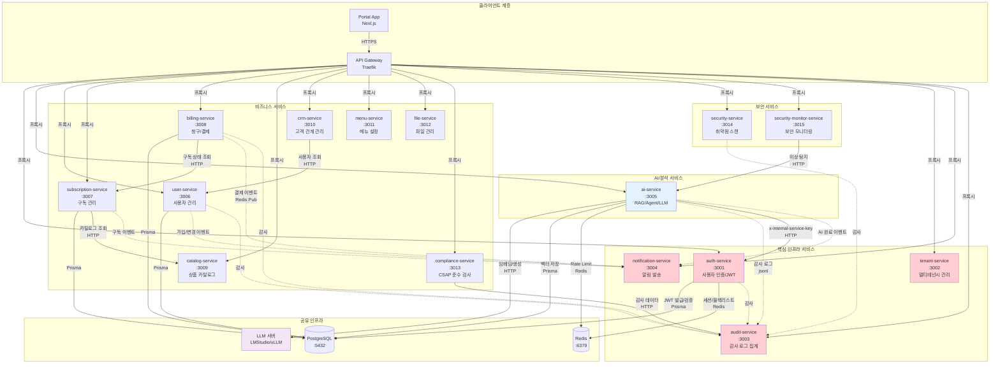
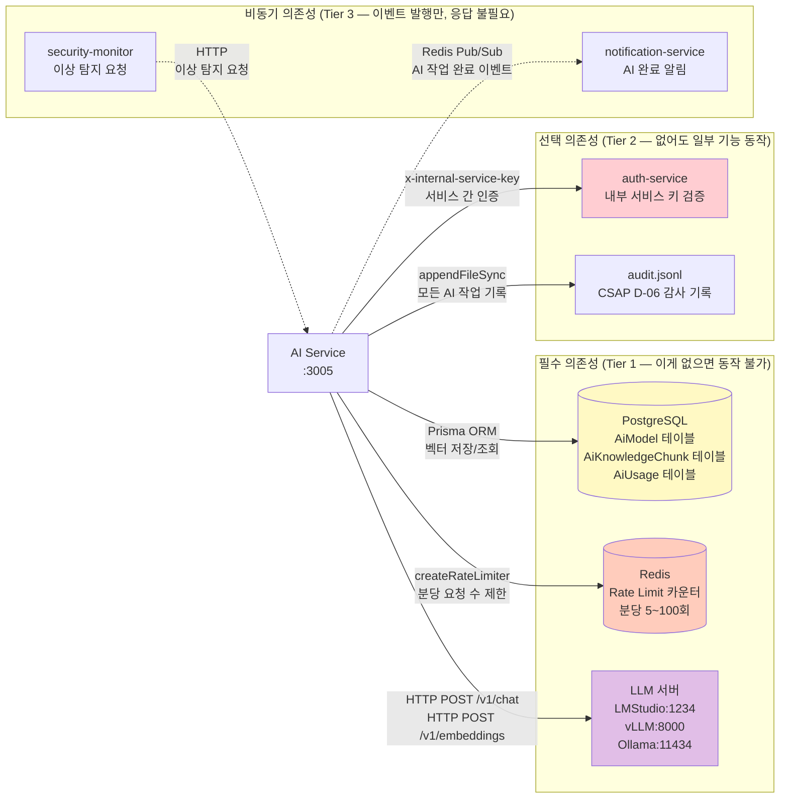
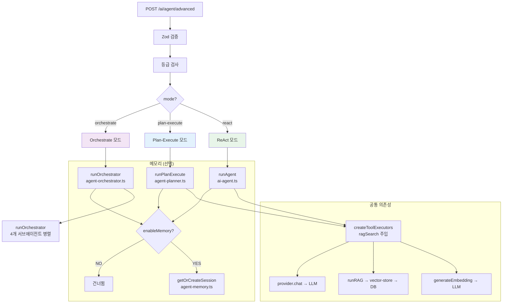
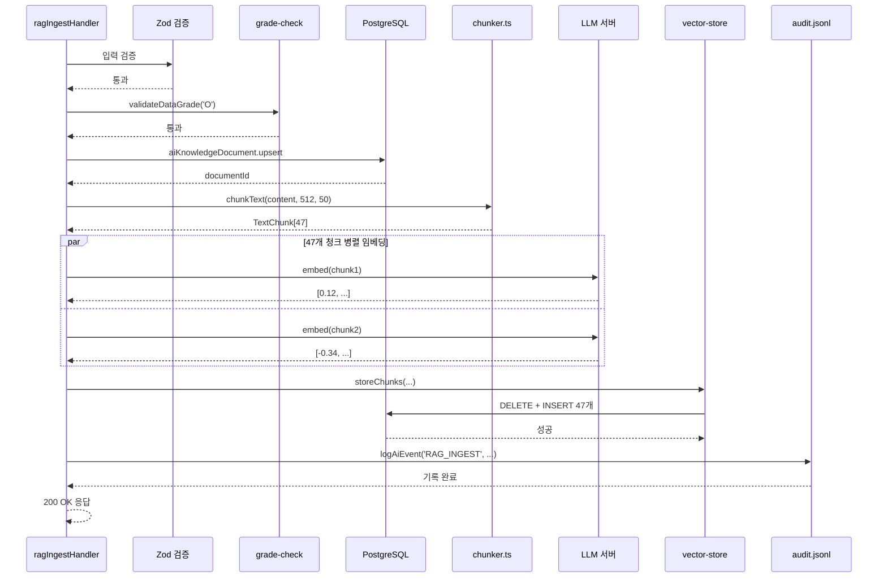
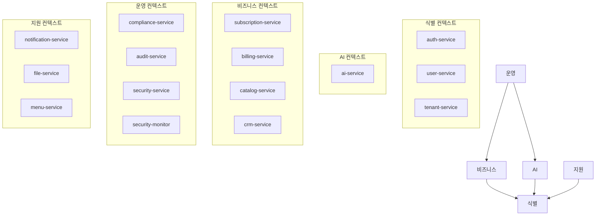
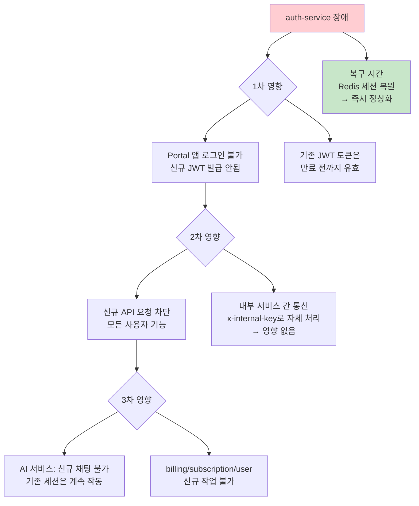
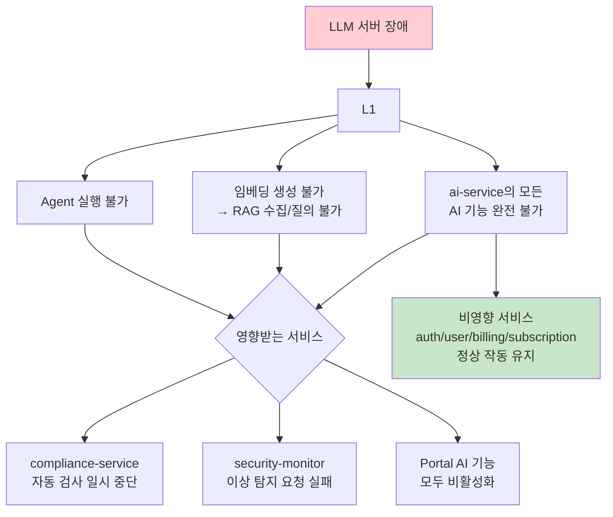
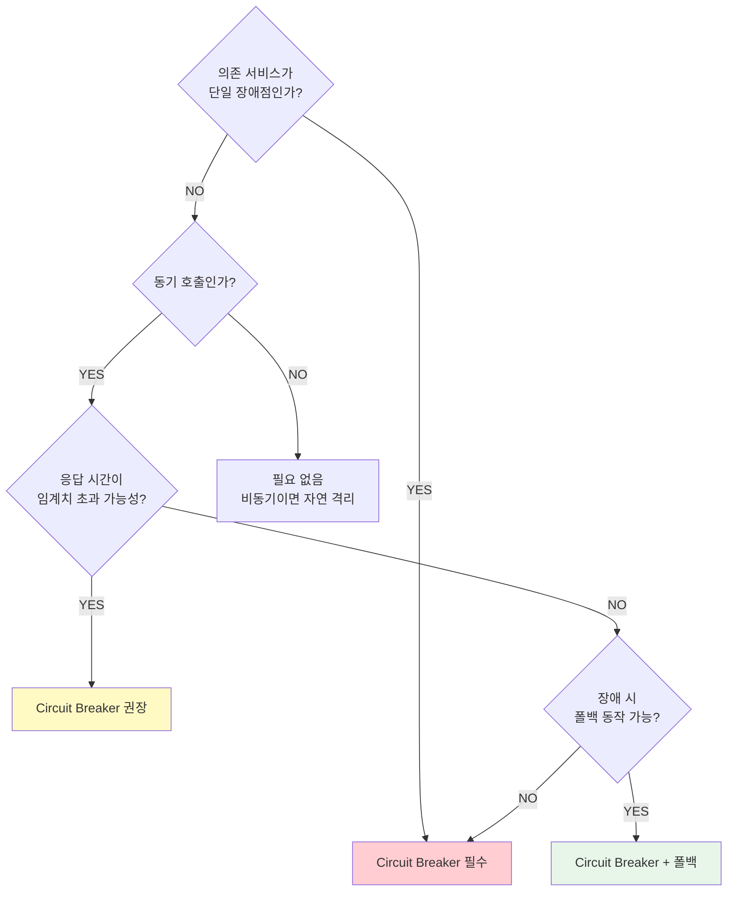
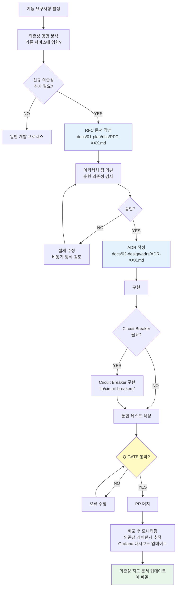
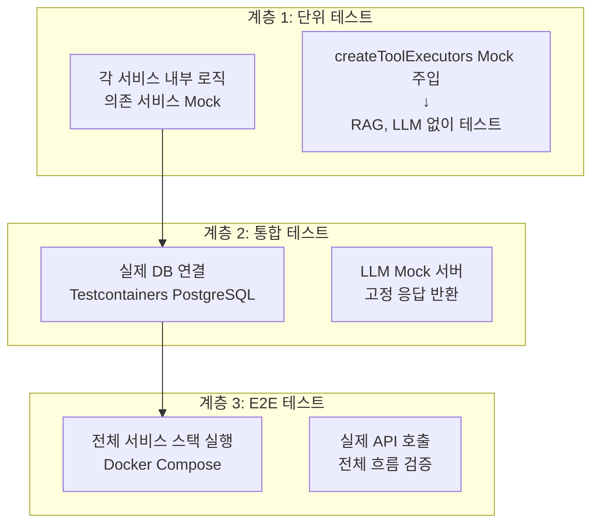

# 23장: 17개 서비스 의존성 지도 — 통신 패턴, 의존성 그래프, 장애 전파 경로

> **대상 독자**: 공공기관 SaaS 플랫폼 신규 개발자 및 아키텍트  
> **전제 지식**: 마이크로서비스 개념, HTTP/REST, 비동기 메시징 기초  
> **학습 시간**: 2~3시간  
> **관련 파일**: `platform/services/ai-service/src/routes.ts`, `handlers/ai-agent.handler.ts`, `handlers/ai-rag.handler.ts`  
> **설계 문서**: `SVC-AI-2026 DESIGN`, `SVC-AI-ADV-R2 DESIGN`

---

## 목차

1. [마이크로서비스 의존성이란?](#1-마이크로서비스-의존성이란)
2. [17개 서비스 전체 의존성 그래프](#2-17개-서비스-전체-의존성-그래프)
3. [AI 서비스의 외부 의존성 분석](#3-ai-서비스의-외부-의존성-분석)
4. [ai-agent.handler.ts — 의존성 주입 패턴 분석](#4-ai-agenthandlerts-의존성-주입-패턴)
5. [ai-rag.handler.ts — RAG 의존성 체인 분석](#5-ai-raghandlerts-rag-의존성-체인)
6. [핵심 서비스 4개 — auth/tenant/notification/audit](#6-핵심-서비스-4개)
7. [서비스 의존성 순환 방지 원칙](#7-서비스-의존성-순환-방지-원칙)
8. [장애 전파 경로 분석](#8-장애-전파-경로-분석)
9. [서비스 격리 전략 — Circuit Breaker](#9-서비스-격리-전략)
10. [새 서비스 추가 시 의존성 설계 체크리스트](#10-새-서비스-추가-시-체크리스트)
11. [서비스 의존성 변경 프로세스](#11-서비스-의존성-변경-프로세스)

---

## 1. 마이크로서비스 의존성이란?

공공기관 SaaS 플랫폼은 17개의 독립 서비스로 구성됩니다. 각 서비스는 자신의 역할에만 집중하지만, 복잡한 업무를 처리하기 위해 다른 서비스와 협력합니다. 이 협력 관계가 "의존성"입니다.

### 1.1 의존성의 종류

```
동기 의존성 (Synchronous): 응답을 받을 때까지 기다림
  예: AI 서비스 → auth-service → "이 사용자는 권한 있음?" → 응답 기다림

비동기 의존성 (Asynchronous): 메시지 큐에 이벤트를 넣고 계속 진행
  예: AI 서비스 → Redis Pub/Sub → "RAG 문서 수집 완료" 이벤트 발행 → 기다리지 않음
```

### 1.2 의존성이 왜 중요한가?

의존성을 잘못 설계하면:

1. **순환 의존성**: A가 B에 의존, B가 A에 의존 → 배포 불가능
2. **강결합**: A서비스가 변경될 때 B, C, D 서비스도 변경해야 함
3. **장애 전파**: A서비스 다운 → 의존하는 모든 서비스 장애

---

## 2. 17개 서비스 전체 의존성 그래프

### 2.1 전체 아키텍처 의존성 다이어그램



**범례**:
- 실선 (`-->`) = 동기 HTTP 호출 (응답 대기)
- 점선 (`-.->`) = 비동기 이벤트 발행 (Redis Pub/Sub 또는 파일)
- 빨간 배경 = 핵심 인프라 서비스 (단일 장애점 위험)
- 파란 배경 = AI 서비스

### 2.2 서비스 포트 매핑

| 서비스 | 포트 | 역할 | 의존 DB |
|--------|------|------|---------|
| auth-service | 3001 | JWT 발급, 세션 관리 | PostgreSQL + Redis |
| tenant-service | 3002 | 기관 테넌트 관리 | PostgreSQL |
| audit-service | 3003 | 감사 로그 집계 API | PostgreSQL |
| notification-service | 3004 | 이메일/SMS/푸시 알림 | PostgreSQL + Redis |
| ai-service | 3005 | LLM, RAG, 에이전트 | PostgreSQL + Redis + LLM |
| user-service | 3006 | 사용자 CRUD | PostgreSQL |
| subscription-service | 3007 | 구독 플랜 관리 | PostgreSQL |
| billing-service | 3008 | 청구서, 결제 처리 | PostgreSQL |
| catalog-service | 3009 | SaaS 상품 카탈로그 | PostgreSQL |
| crm-service | 3010 | 고객 관계 관리 | PostgreSQL |
| menu-service | 3011 | 동적 메뉴 설정 | PostgreSQL |
| file-service | 3012 | 파일 업로드/다운로드 | PostgreSQL + MinIO |
| compliance-service | 3013 | CSAP 자동 검사 | PostgreSQL |
| security-service | 3014 | 취약점 스캔, 보안 정책 | PostgreSQL |
| security-monitor-service | 3015 | 실시간 보안 모니터링 | PostgreSQL + Redis |
| Portal App | 3000 | Next.js 프론트엔드 | — |
| API Gateway | 443/80 | Traefik 프록시 | — |

---

## 3. AI 서비스의 외부 의존성 분석

AI 서비스(`ai-service`)는 플랫폼에서 가장 많은 외부 의존성을 가집니다.

### 3.1 의존성 맵 (AI 서비스 중심)



### 3.2 의존성 등급별 영향 분석

| 의존성 | 등급 | 다운 시 영향 | 대응 방안 |
|--------|------|------------|---------|
| PostgreSQL | Tier 1 (필수) | 서비스 완전 불가 | HA 구성 (Primary+Replica) |
| Redis | Tier 1 (필수) | Rate Limit 작동 불가 → 보안 위험 | Redis Sentinel/Cluster |
| LLM 서버 | Tier 1 (필수) | AI 기능 전체 불가 | 다중 Provider 폴백 |
| audit.jsonl | Tier 2 (선택) | 감사 기록 누락 → CSAP 위반 | 별도 감사 서비스로 대체 |
| notification-service | Tier 3 (비동기) | 알림 전달 실패 | 메시지 큐 재시도 |

---

## 4. ai-agent.handler.ts — 의존성 주입 패턴

`ai-agent.handler.ts`는 복잡한 의존성을 주입 패턴으로 우아하게 관리합니다.

### 4.1 핸들러가 가진 직접 의존성

```typescript
// ai-agent.handler.ts 5~20번째 줄 (import 분석)
import { logAiEvent } from '../lib/audit.js';          // 감사 로그
import { validateDataGrade, DataGradeViolationError }  // N2SF 등급 검사
    from '../lib/grade-check.js';
import { maskPII } from '../lib/pii-masking.js';       // PII 마스킹
import { runAgent } from '../lib/ai-agent.js';         // ReAct 루프 실행
import { TOOL_DEFINITIONS, createToolExecutors }       // 도구 정의/실행기
    from '../lib/ai-tools.js';
import { generateEmbedding, runRAG }                   // 임베딩 + RAG
    from '../lib/rag-engine.js';
import { prisma } from '../lib/prisma.js';              // DB 접근
import { getLLMConfig, buildLLMConfig, createLLMProvider }  // LLM 제공자
    from '../lib/llm-provider.js';
import { runPlanExecute } from '../lib/agent-planner.js';     // Plan-Execute
import { runOrchestrator } from '../lib/agent-orchestrator.js'; // 멀티에이전트
import { getOrCreateSession, addToMemory, ... }        // 세션 메모리
    from '../lib/agent-memory.js';
import { getOrCreateRegistry }                         // 도구 레지스트리
    from '../lib/tool-registry.js';
```

**의존성 개수**: 13개 직접 의존성

### 4.2 의존성 주입의 핵심 — createToolExecutors 호출 패턴

```typescript
// ai-agent.handler.ts 75~105번째 줄
const executors = createToolExecutors({
  // RAG 검색 기능을 클로저로 주입
  ragSearch: async (query: string, tenantId: string) => {
    const embedding = await generateEmbedding(query);
    const rag = await runRAG(tenantId, query, embedding, { topK: 3, minScore: 0.25 });
    return rag.answer;
  },

  // LLM 요약 기능을 클로저로 주입
  llmSummarize: async (text: string) => {
    const resp = await provider.chat(
      [{ role: 'user', content: `다음 텍스트를 3줄로 요약해주세요:\n\n${text.slice(0, 10000)}` }],
      { maxTokens: 512, temperature: 0.3 },
    );
    return resp.text;
  },

  // LLM 분류 기능을 클로저로 주입
  llmClassify: async (text: string) => {
    const resp = await provider.chat([...], { maxTokens: 256, temperature: 0.1 });
    return resp.text;
  },
});
```

**이 패턴의 의미**: `ai-tools.ts`는 RAG가 어떻게 동작하는지 모릅니다. "검색 함수를 주세요"라고만 요청합니다. 핸들러에서 실제 구현을 만들어 주입합니다. 이로써:

1. `ai-tools.ts`를 독립적으로 테스트 가능
2. RAG 구현이 바뀌어도 `ai-tools.ts` 수정 불필요
3. Mock 함수로 교체하면 단위 테스트 용이

### 4.3 에이전트 모드별 의존성 분기



### 4.4 Advanced Agent 의존성 체인 전체

```
advancedAgentHandler
    ├── prisma.aiModel.findUnique()           → PostgreSQL (모델 설정 조회)
    ├── validateDataGrade()                   → grade-check.ts
    ├── logAiEvent()                          → audit.ts → audit.jsonl
    ├── getOrCreateSession()                  → agent-memory.ts (메모리 활성화 시)
    ├── loadLongTermMemory()                  → agent-memory.ts → PostgreSQL
    │
    ├── [react 모드]
    │   ├── createLLMProvider()               → llm-provider.ts → LLM 서버
    │   ├── createToolExecutors({ ragSearch }) → ai-tools.ts
    │   │       └── ragSearch: generateEmbedding → LLM 서버
    │   │                     runRAG → vector-store → PostgreSQL
    │   └── runAgent()                        → ai-agent.ts → LLM 서버 (최대 10회)
    │
    ├── [plan-execute 모드]
    │   ├── getOrCreateRegistry()             → tool-registry.ts
    │   └── runPlanExecute()                  → agent-planner.ts → LLM 서버
    │
    └── [orchestrate 모드]
        └── runOrchestrator()                 → agent-orchestrator.ts
                └── 4개 서브에이전트 병렬 실행 → LLM 서버 × 4
```

---

## 5. ai-rag.handler.ts — RAG 의존성 체인

### 5.1 RAG Ingest 의존성 체인

```typescript
// ai-rag.handler.ts 37~118번째 줄 분석
ragIngestHandler
    ├── ingestSchema.parse()          Zod 입력 검증 (자체 라이브러리)
    ├── validateDataGrade()           grade-check.ts (N2SF 검사)
    ├── logAiEvent()                  audit.ts → audit.jsonl
    ├── db.aiKnowledgeDocument.upsert  PostgreSQL (문서 레코드)
    ├── chunkText()                   chunker.ts (텍스트 분할)
    ├── generateEmbedding()           rag-engine.ts → llm-provider.ts → LLM 서버
    └── storeChunks()                 vector-store.ts → PostgreSQL (벡터 저장)
```



### 5.2 RAG Query 의존성 체인

```typescript
// ai-rag.handler.ts 135~193번째 줄 분석
ragQueryHandler
    ├── querySchema.parse()           Zod 입력 검증
    ├── validateDataGrade()           N2SF 검사
    ├── generateEmbedding()           질문 임베딩 생성 → LLM 서버
    ├── prisma.aiModel.findUnique()   채팅 모델 설정 조회 → PostgreSQL
    ├── runRAG()                      rag-engine.ts
    │       ├── semanticSearch()     vector-store.ts → PostgreSQL (코사인 유사도)
    │       ├── maskPII()            pii-masking.ts (질문 마스킹)
    │       ├── provider.chat()      llm-provider.ts → LLM 서버 (답변 생성)
    │       └── maskPII()            답변 마스킹
    └── logAiEvent()                  audit.ts → audit.jsonl
```

### 5.3 Advanced RAG Query 의존성 체인 (추가 의존성)

기본 RAG 대비 추가 의존성:

```
ragAdvancedQueryHandler
    └── runAdvancedRAG()
            ├── expandQuery()          query-expander.ts → LLM 서버 (쿼리 확장 시)
            ├── hybridSearch()         hybrid-retriever.ts
            │       ├── BM25 키워드 검색  → PostgreSQL 전문 검색
            │       └── semanticSearch() → vector-store.ts → PostgreSQL
            ├── rerankResults()        reranker.ts → LLM 서버 (Reranking 시)
            └── provider.chat()        → LLM 서버
```

Advanced RAG는 활성화된 옵션에 따라 LLM 서버를 최대 3회 추가 호출합니다:
- 쿼리 확장: +1회 LLM 호출
- Reranking: +1회 LLM 호출  
- 컨텍스트 압축: +1회 LLM 호출 (reranker 내부)

---

## 6. 핵심 서비스 4개

### 6.1 auth-service — 인증의 중심

**역할**: JWT 토큰 발급, 검증, 세션 관리, 토큰 블랙리스트

```
auth-service 다운 시 영향:
  - 모든 사용자 로그인 불가
  - 기존 JWT 토큰은 유효하지만 갱신 불가
  - 내부 서비스 간 x-internal-service-key 검증은 자체 처리 → 영향 없음
  → 영향 범위: PORTAL 앱 (사용자 로그인 불가)
```

**AI 서비스와의 관계**:
```typescript
// routes.ts 58~74번째 줄
// AI 서비스는 JWT 토큰 검증을 직접 하지 않고
// API 게이트웨이(Traefik)가 auth-service에 위임 처리
// AI 서비스 자체는 x-internal-service-key로 서비스 간 신원만 확인
```

### 6.2 tenant-service — 멀티테넌시의 기반

**역할**: 기관(테넌트) 생성/관리, 테넌트 설정, 도메인 매핑

```
tenant-service 다운 시 영향:
  - 신규 기관 가입 불가
  - 기존 기관 데이터는 PostgreSQL에 있어서 서비스 계속 가능
  - tenantId 검증은 각 서비스가 DB에서 직접 수행
  → 영향 범위: 제한적 (신규 가입만 차단)
```

**AI 서비스와의 관계**:
AI 서비스는 `tenantId`를 직접 검증하지 않고 PostgreSQL 쿼리의 `WHERE tenantId = ?` 필터로만 사용합니다. tenant-service에 동기 의존성 없음.

### 6.3 notification-service — 비동기 알림

**역할**: 이메일, SMS, 알림톡, 웹 푸시 발송

```
notification-service 다운 시 영향:
  - AI 서비스는 비동기로만 의존 → 직접 영향 없음
  - 사용자는 AI 완료 알림을 받지 못할 수 있음
  - 재시도 큐(Redis)에 적재 → 복구 시 일괄 발송
  → 영향 범위: 알림 지연 (서비스 기능에는 영향 없음)
```

### 6.4 audit-service — CSAP 준수의 핵심

**역할**: 감사 로그 집계, 조회 API, CSAP D-06 준수 증거 생성

```
audit-service 다운 시 영향:
  - AI 서비스는 audit.jsonl 파일에 직접 기록 → 로컬 백업 유지
  - audit-service 복구 후 jsonl → DB 동기화
  - CSAP 감리 시 조회 API가 없어 증거 제출 불가
  → 영향 범위: 감사 조회 API 불가 (로그 기록 자체는 유지)
```

---

## 7. 서비스 의존성 순환 방지 원칙

### 7.1 DDD 바운디드 컨텍스트

순환 의존성 방지를 위해 도메인 주도 설계(DDD)의 경계 컨텍스트를 적용합니다.



**핵심 원칙**:
1. **상위 컨텍스트는 하위에 의존 가능**: 비즈니스 → 식별 (OK)
2. **하위 컨텍스트는 상위에 의존 금지**: 식별 → 비즈니스 (BLOCKED)
3. **같은 수준 컨텍스트 간 직접 의존 금지**: AI → 비즈니스 (이벤트로만)

### 7.2 실제 순환 의존성 방지 예시

**잘못된 설계 (순환 의존)**:
```
❌ ai-service → billing-service (AI 사용량을 청구서에 직접 추가)
   billing-service → ai-service (청구서 내용을 AI로 요약)
   → 순환! 배포 순서 결정 불가
```

**올바른 설계 (이벤트 기반)**:
```
✅ ai-service → Redis Pub/Sub "AI_USAGE_EVENT" 발행
   billing-service → Redis Sub "AI_USAGE_EVENT" 구독 → 청구서 업데이트
   billing-service → Redis Pub/Sub "INVOICE_CREATED" 발행
   ai-service는 이 이벤트 무관 → 순환 없음
```

---

## 8. 장애 전파 경로 분석

### 8.1 auth-service 장애 시 17개 서비스 영향도



**영향 요약**:
- **즉시 차단**: 신규 사용자 로그인, JWT 갱신
- **지연 영향**: 토큰 만료(15분) 후 모든 사용자 기능
- **영향 없음**: 서비스 간 내부 통신 (x-internal-service-key)

### 8.2 LLM 서버 장애 시 영향도



**복원력 전략**:
```typescript
// llm-provider.ts에서 다중 Provider 폴백 패턴
async function createLLMProvider(config: LLMConfig): Promise<LLMProvider> {
  // Provider 순서로 폴백
  const providers = [
    config,
    { ...config, endpoint: process.env.LLM_BACKUP_ENDPOINT },
  ];

  for (const providerConfig of providers) {
    try {
      const provider = new LMStudioProvider(providerConfig);
      await provider.healthCheck(); // 헬스체크 통과하면 사용
      return provider;
    } catch {
      continue; // 다음 Provider 시도
    }
  }
  throw new Error('사용 가능한 LLM Provider 없음');
}
```

### 8.3 PostgreSQL 장애 시 영향도

PostgreSQL은 모든 서비스의 공통 의존성입니다. 완전 장애 시 모든 서비스가 동시에 영향을 받습니다.

```
PostgreSQL 완전 장애 → 17개 서비스 전체 기능 불가

완화 전략:
  - Primary + Replica 구성 (Read 쿼리는 Replica 처리)
  - Redis 캐시 활용 (자주 조회되는 데이터)
  - 읽기 전용 모드 폴백 (Replica 기반 서비스 유지)
```

### 8.4 Redis 장애 시 영향도

```
Redis 장애 영향:
  - Rate Limiter 비활성화 → AI 서비스 요청 제한 없어짐
    → 비용 폭증 위험 (자동 차단 메커니즘 없음)
  - 세션 캐시 손실 → 사용자 재로그인 필요
  - 메시지 큐 손실 → 알림 이벤트 유실 가능

  대응: Redis Sentinel/Cluster로 HA 구성 필수
       Rate Limiter 비활성화 감지 시 알림 발송
```

---

## 9. 서비스 격리 전략

### 9.1 Circuit Breaker 설치 위치 결정 기준

Circuit Breaker는 의존 서비스의 장애가 내 서비스로 전파되는 것을 막습니다.



**AI 서비스 Circuit Breaker 설치 위치**:

| 의존성 | 단일 장애점? | 동기? | 폴백 가능? | 결정 |
|--------|------------|-------|-----------|------|
| LLM 서버 | YES | YES | 부분 (다른 Provider) | **Circuit Breaker 필수** |
| PostgreSQL | YES | YES | 불가 | **Circuit Breaker 필수** |
| Redis | NO | YES | 가능 (제한 없이 통과) | **Circuit Breaker 권장** |
| notification-service | NO | NO (비동기) | N/A | 불필요 |

### 9.2 Circuit Breaker 구현 패턴

```typescript
// 권장 구현 패턴 (실제 구현 시 적용)
import CircuitBreaker from 'opossum';

const llmCircuitBreaker = new CircuitBreaker(
  async (messages: LLMMessage[]) => {
    return await llmProvider.chat(messages);
  },
  {
    timeout: 30000,          // 30초 타임아웃
    errorThresholdPercentage: 50,  // 50% 실패 시 열림
    resetTimeout: 60000,     // 60초 후 Half-Open 시도
  }
);

llmCircuitBreaker.fallback(() => ({
  text: 'AI 서비스가 일시적으로 이용 불가합니다. 잠시 후 다시 시도해주세요.',
  tokensUsed: 0,
  model: 'fallback',
}));

// Circuit Breaker 상태 변화 감사 로그
llmCircuitBreaker.on('open', () => {
  auditLog({ action: 'CIRCUIT_BREAKER_OPEN', target: 'llm-server' });
});
```

### 9.3 Graceful Degradation 전략

```
서비스 수준 3단계 저하 전략:

[정상 상태]    RAG + Reranking + Advanced 검색 → 최고 품질 응답
     ↓
[LLM 부분 장애]  RAG만 (Reranking 비활성화) → 중간 품질 응답
     ↓
[DB 부분 장애]   캐시된 결과 반환 → 낮은 품질, 즉시 응답
     ↓
[완전 장애]      "서비스 점검 중" 메시지 → 서비스 불가 명시
```

---

## 10. 새 서비스 추가 시 체크리스트

새 서비스를 추가할 때 의존성 설계를 올바르게 하기 위한 체크리스트입니다.

### 10.1 의존성 설계 질문지

새 서비스 추가 전 반드시 답해야 하는 7가지 질문:

```
□ 질문 1: 이 서비스가 의존하는 서비스 목록은?
  → 화이트보드에 화살표 그려보기

□ 질문 2: 순환 의존성이 없는가?
  → 의존성 그래프에서 사이클 확인

□ 질문 3: 각 의존성이 동기인가 비동기인가?
  → 동기: HTTP 호출, 비동기: Redis Pub/Sub

□ 질문 4: 의존 서비스 장애 시 내 서비스는 어떻게 동작하는가?
  → Circuit Breaker 또는 폴백 전략 결정

□ 질문 5: 내 서비스가 다운되면 어느 서비스에 영향을 주는가?
  → 역방향 의존 분석 (impact analysis)

□ 질문 6: 데이터 소유권이 명확한가?
  → 각 서비스는 자신의 DB 테이블만 직접 접근

□ 질문 7: API 계약이 문서화되어 있는가?
  → OpenAPI Spec 작성 후 다른 서비스에 공유
```

### 10.2 의존성 등록 절차

```
1단계: RFC(변경 요청) 문서 작성
  - 새 의존성의 목적
  - 동기/비동기 여부
  - 예상 트래픽 (분당 요청 수)
  - 장애 시 폴백 전략

2단계: ADR(아키텍처 결정 레코드) 작성
  docs/02-design/adrs/ADR-XXX-{서비스명}-dependency.md

3단계: Circuit Breaker 구현
  src/lib/circuit-breakers/{서비스명}.ts

4단계: Rate Limit 설정
  routes.ts에 새 Limiter 추가 (종류에 따라)

5단계: 통합 테스트 작성
  tests/integration/{서비스명}-dependency.test.ts

6단계: 배포 순서 문서화
  배포 시 의존 서비스가 먼저 준비되어야 하는 경우 명시
```

### 10.3 금지사항

```
❌ 다른 서비스의 DB에 직접 접근 (Prisma로 다른 서비스 DB 쿼리)
   → 반드시 해당 서비스의 API 호출

❌ 공유 비즈니스 로직을 여러 서비스에 복제
   → 패키지로 추출 (packages/ 디렉토리)

❌ 순환 의존성 (A→B→A)
   → 이벤트 기반으로 전환

❌ 의존 서비스 URL 하드코딩
   → 환경 변수 사용 (SERVICE_URL env var)

❌ 의존 서비스 내부 구현에 의존
   → 공개 API 계약만 사용
```

---

## 11. 서비스 의존성 변경 프로세스

### 11.1 변경 프로세스 플로우차트



### 11.2 실제 의존성 변경 예시 — AI 서비스에 번역 기능 추가

**시나리오**: AI 서비스가 DeepL 번역 API를 새 외부 의존성으로 추가하는 경우

```markdown
# RFC-042: AI 서비스 DeepL 번역 API 의존성 추가

## 배경
공공문서 한영 번역 기능 수요 증가. 기존 LLM 번역보다 DeepL의 품질이 높음.

## 변경 내용
- 신규 의존성: api.deepl.com (외부 클라우드 서비스)
- 통신 방식: HTTPS (동기)
- 예상 트래픽: 분당 5회 이하

## 문제점
- N2SF 정책: "외부 클라우드 서비스 사용 금지"
- → DeepL은 O등급 공개 텍스트만 허용. C/S 등급 절대 전송 불가.

## 결정
- PII 마스킹 후 O등급 텍스트만 전송
- 요청 전 grade 검사 필수
- Circuit Breaker 설치 (DeepL 장애 시 LLM 번역으로 폴백)

## 승인: 아키텍처 팀 2026-04-15
```

---

## 12. 서비스 간 통신 패턴 상세 분석

### 12.1 동기 통신 패턴 — HTTP/REST

AI 서비스에서 auth-service로의 내부 통신 패턴입니다.

```typescript
// 내부 서비스 호출 패턴 (실제 구현 시 적용)
// Design Ref: routes.ts 58~74번째 줄 (x-internal-service-key 패턴)

async function callInternalService(
  serviceUrl: string,
  path: string,
  options: {
    method: 'GET' | 'POST' | 'PUT' | 'DELETE';
    body?: unknown;
    timeoutMs?: number;
  },
): Promise<unknown> {
  const internalKey = process.env['INTERNAL_SERVICE_KEY'];
  if (!internalKey) throw new Error('INTERNAL_SERVICE_KEY 미설정');

  const controller = new AbortController();
  const timeout = setTimeout(
    () => controller.abort(),
    options.timeoutMs ?? 5000,  // 기본 5초 타임아웃
  );

  try {
    const response = await fetch(`${serviceUrl}${path}`, {
      method: options.method,
      headers: {
        'Content-Type': 'application/json',
        'x-internal-service-key': internalKey,  // 서비스 인증
      },
      body: options.body ? JSON.stringify(options.body) : undefined,
      signal: controller.signal,
    });

    if (!response.ok) {
      throw new Error(`서비스 호출 실패: ${response.status} ${response.statusText}`);
    }

    return await response.json();
  } finally {
    clearTimeout(timeout);
  }
}
```

**동기 통신 설계 원칙**:

| 원칙 | 설명 | 예시 |
|------|------|------|
| 타임아웃 필수 | 응답 없는 서비스에 무한 대기 방지 | 5초 타임아웃 |
| 재시도 제한 | 지수 백오프로 최대 3회 | 1초, 2초, 4초 간격 |
| 헬스체크 선행 | 호출 전 서비스 활성 여부 확인 | /health 엔드포인트 |
| 에러 전파 제한 | 내부 오류를 외부에 그대로 노출 금지 | 안전한 오류 코드만 반환 |

### 12.2 비동기 통신 패턴 — Redis Pub/Sub

AI 서비스가 notification-service에 이벤트를 발행하는 패턴입니다.

```typescript
// Redis Pub/Sub 이벤트 발행 패턴
// (notification-service는 이 이벤트를 구독하여 알림 발송)

interface AiCompletionEvent {
  eventType: 'AI_QUERY_COMPLETE' | 'AI_AGENT_COMPLETE' | 'RAG_INGEST_COMPLETE';
  tenantId: string;
  userId: string;
  taskId: string;
  completedAt: string;
  resultSummary: string; // PII 마스킹된 요약
}

async function publishAiCompletionEvent(
  redis: Redis,
  event: AiCompletionEvent,
): Promise<void> {
  // N2SF: 이벤트에 개인정보 포함 금지
  const sanitized = {
    ...event,
    resultSummary: maskPII(event.resultSummary),
  };

  await redis.publish(
    `ai:completion:${event.tenantId}`,  // 테넌트별 채널 격리
    JSON.stringify(sanitized),
  );
}
```

**비동기 통신의 장점과 단점**:

```
장점:
  - 결합도 낮음: 발행자는 구독자 존재를 몰라도 됨
  - 장애 격리: 구독자 다운 시 발행자에 영향 없음
  - 확장성: 구독자 추가 시 발행자 수정 불필요

단점:
  - 순서 보장 어려움: 메시지 전달 순서가 불확실
  - 처리 확인 어려움: 구독자가 처리했는지 알 수 없음
  - 재시도 메커니즘 필요: Redis 장애 시 메시지 유실 가능
```

### 12.3 공유 데이터베이스 패턴 — 현재 구조와 이상적 구조

**현재 구조 (현실적 트레이드오프)**:

```
현재 플랫폼 구성:
  모든 서비스 → 단일 PostgreSQL 인스턴스
  (단, 각 서비스는 자신의 테이블만 접근)

이유:
  - 초기 단계: 운영 복잡도 최소화
  - CSAP 감사: 단일 DB가 감사 추적 용이
  - 비용: 17개 독립 DB 비용 감당 어려움
```

**이상적 구조 (서비스 성숙 시 전환)**:

```
각 서비스 → 독립 PostgreSQL 인스턴스
  auth-service     → auth-db (auth schema)
  ai-service       → ai-db   (ai_model, ai_knowledge schema)
  billing-service  → billing-db (invoice, payment schema)
  ...

장점: 완전한 데이터 격리, 독립 스케일링
단점: 분산 트랜잭션 필요 (Saga 패턴), 운영 복잡도 증가
```

### 12.4 서비스 디스커버리와 환경 변수 관리

각 서비스의 URL은 환경 변수로 관리합니다. 하드코딩 절대 금지.

```bash
# .env.example (실제 .env에 값 설정)
# 서비스 URL 환경 변수 체계
AUTH_SERVICE_URL=http://auth-service:3001
TENANT_SERVICE_URL=http://tenant-service:3002
AUDIT_SERVICE_URL=http://audit-service:3003
NOTIFICATION_SERVICE_URL=http://notification-service:3004
AI_SERVICE_URL=http://ai-service:3005

# k3s 환경에서는 Kubernetes DNS 자동 해결
# auth-service → http://auth-service.public-saas.svc.cluster.local:3001
```

```typescript
// 서비스 URL 조회 유틸리티 (환경 변수 누락 시 명확한 에러)
export function getServiceUrl(serviceName: 'auth' | 'tenant' | 'notification'): string {
  const envKey = `${serviceName.toUpperCase()}_SERVICE_URL`;
  const url = process.env[envKey];
  if (!url) {
    throw new Error(
      `[설정 오류] ${envKey} 환경 변수가 설정되지 않았습니다. ` +
      `.env 파일 또는 k3s Secret을 확인하세요.`
    );
  }
  return url;
}
```

---

## 13. 서비스 의존성 테스트 전략

### 13.1 의존성 테스트 3계층



### 13.2 AI 서비스 의존성 Mock 전략

```typescript
// __tests__/integration/ai-service-deps.test.ts

// 1. LLM 서버 Mock (MSW로 HTTP 인터셉션)
import { rest } from 'msw';
import { setupServer } from 'msw/node';

const llmMockServer = setupServer(
  rest.post('http://localhost:1234/v1/chat/completions', (req, res, ctx) => {
    return res(ctx.json({
      choices: [{ message: { content: '테스트 AI 응답' } }],
      usage: { total_tokens: 100 },
    }));
  }),
  rest.post('http://localhost:1234/v1/embeddings', (req, res, ctx) => {
    // 1024차원 고정 벡터 반환
    return res(ctx.json({
      data: [{ embedding: Array(1024).fill(0.1) }],
    }));
  }),
);

beforeAll(() => llmMockServer.listen());
afterAll(() => llmMockServer.close());

// 2. Redis Mock
jest.mock('@public-saas/rate-limit', () => ({
  createRateLimiter: () => async () => {}, // Rate Limiter no-op
}));

// 3. 실제 PostgreSQL은 Testcontainers 사용
import { PostgreSqlContainer } from '@testcontainers/postgresql';

let postgresContainer: PostgreSqlContainer;

beforeAll(async () => {
  postgresContainer = await new PostgreSqlContainer('postgres:15')
    .withDatabase('test_ai_service')
    .start();
  process.env.DATABASE_URL = postgresContainer.getConnectionUri();
  // Prisma 마이그레이션 실행
  await runPrismaCommand('db push');
});

afterAll(async () => {
  await postgresContainer.stop();
});
```

### 13.3 장애 주입 테스트 (Chaos Engineering)

```typescript
// __tests__/chaos/llm-failure.test.ts

describe('LLM 서버 장애 시 AI 서비스 동작', () => {
  test('LLM 서버 타임아웃 → Circuit Breaker 오픈', async () => {
    // 타임아웃 유발 Mock
    llmMockServer.use(
      rest.post('*/v1/chat/completions', async (req, res, ctx) => {
        await new Promise((resolve) => setTimeout(resolve, 35000)); // 35초 지연
        return res(ctx.json({}));
      })
    );

    const startTime = Date.now();
    const response = await fetch('http://localhost:3005/ai/chat', {
      method: 'POST',
      headers: { 'Content-Type': 'application/json' },
      body: JSON.stringify({
        tenantId: TEST_TENANT_ID,
        grade: 'O',
        message: '테스트',
        modelId: TEST_MODEL_ID,
      }),
    });
    const elapsed = Date.now() - startTime;

    // 타임아웃이 30초 이내에 발생해야 함 (5초 타임아웃 설정 기준)
    expect(elapsed).toBeLessThan(30000);
    // 502 또는 504 응답
    expect([502, 504]).toContain(response.status);
  });

  test('LLM 서버 복구 후 정상 동작', async () => {
    // 정상 Mock 복구
    llmMockServer.use(
      rest.post('*/v1/chat/completions', (req, res, ctx) => {
        return res(ctx.json({
          choices: [{ message: { content: '복구 후 정상 응답' } }],
          usage: { total_tokens: 50 },
        }));
      })
    );

    // Circuit Breaker Half-Open 대기 후 재시도
    await new Promise((resolve) => setTimeout(resolve, 1000));

    const response = await fetch('http://localhost:3005/ai/chat', {
      method: 'POST',
      // ...
    });
    expect(response.status).toBe(200);
  });
});
```

---

## 14. 의존성 모니터링과 관찰 가능성

### 14.1 서비스 간 레이턴시 추적

Grafana 대시보드에서 서비스 간 의존성 레이턴시를 모니터링합니다.

```
핵심 메트릭:
  ai_to_llm_latency_p99     → AI→LLM 서버 레이턴시 99퍼센타일
  ai_to_db_latency_p99      → AI→PostgreSQL 레이턴시 99퍼센타일
  ai_to_redis_latency_p99   → AI→Redis 레이턴시 99퍼센타일

SLO 목표:
  ai_to_llm_latency_p99     < 30,000ms (LLM은 느림, 허용치 높음)
  ai_to_db_latency_p99      < 100ms    (DB는 빨라야 함)
  ai_to_redis_latency_p99   < 10ms     (Redis는 매우 빨라야 함)
```

### 14.2 의존성 헬스체크 통합

```typescript
// AI 서비스 헬스체크 엔드포인트 (GET /health)
export async function healthCheckHandler(request, reply) {
  const checks = await Promise.allSettled([
    // DB 연결 확인
    prisma.$queryRaw`SELECT 1`.then(() => ({ name: 'postgresql', status: 'ok' })),

    // Redis 연결 확인
    redis.ping().then(() => ({ name: 'redis', status: 'ok' })),

    // LLM 서버 확인 (5초 타임아웃)
    fetch(`${LLM_ENDPOINT}/health`, { signal: AbortSignal.timeout(5000) })
      .then((r) => ({ name: 'llm-server', status: r.ok ? 'ok' : 'degraded' })),
  ]);

  const results = checks.map((check, i) => {
    if (check.status === 'fulfilled') return check.value;
    return { name: ['postgresql', 'redis', 'llm-server'][i], status: 'unhealthy', error: check.reason?.message };
  });

  const allHealthy = results.every((r) => r.status === 'ok');
  const hasLLMIssue = results.find((r) => r.name === 'llm-server')?.status !== 'ok';

  return reply.status(allHealthy ? 200 : hasLLMIssue ? 206 : 503).send({
    status: allHealthy ? 'healthy' : hasLLMIssue ? 'degraded' : 'unhealthy',
    // LLM 장애는 "degraded" (서비스 부분 불가), DB 장애는 "unhealthy" (완전 불가)
    checks: results,
    timestamp: new Date().toISOString(),
  });
}
```

### 14.3 분산 추적 (OpenTelemetry)

```typescript
// OpenTelemetry 추적으로 서비스 간 요청 흐름 시각화
import { trace } from '@opentelemetry/api';

const tracer = trace.getTracer('ai-service');

export async function runRAGWithTracing(
  tenantId: string,
  question: string,
  queryEmbedding: number[],
): Promise<RAGResponse> {
  return await tracer.startActiveSpan('rag-pipeline', async (span) => {
    span.setAttributes({
      'rag.tenant_id': tenantId,
      'rag.question_length': question.length,
    });

    try {
      // 시맨틱 검색 추적
      const searchSpan = tracer.startSpan('vector-search');
      const results = await semanticSearch(queryEmbedding, tenantId, 5, 0.25);
      searchSpan.setAttributes({ 'search.result_count': results.length });
      searchSpan.end();

      // LLM 생성 추적
      const llmSpan = tracer.startSpan('llm-generation');
      const response = await provider.chat(messages, { maxTokens: 2048 });
      llmSpan.setAttributes({ 'llm.tokens_used': response.tokensUsed });
      llmSpan.end();

      span.setAttributes({ 'rag.success': true });
      return { answer: response.text, sources: [], model: response.model, tokensUsed: response.tokensUsed, contextChunks: results.length };
    } catch (error) {
      span.recordException(error as Error);
      span.setAttributes({ 'rag.success': false });
      throw error;
    } finally {
      span.end();
    }
  });
}
```

Tempo(분산 추적 백엔드)에서 이 추적 정보를 조회하면 RAG 파이프라인의 어느 단계가 느린지 정확히 파악할 수 있습니다.

---

## 요약: 서비스 의존성 핵심 원칙

1. **단방향 의존**: 상위 컨텍스트 → 하위 컨텍스트, 역방향 금지
2. **데이터 소유권**: 각 서비스는 자신의 DB만 직접 접근
3. **비동기 선호**: 결합도를 낮추기 위해 이벤트 기반 설계 우선
4. **Circuit Breaker**: Tier 1 의존성(DB, LLM)에 필수 설치
5. **문서화 우선**: 의존성 변경 전 RFC → ADR 작성 필수
6. **영향 분석**: 변경 전 역방향 의존 서비스 영향 분석 필수
7. **관찰 가능성**: 모든 서비스 간 호출에 레이턴시 메트릭, 분산 추적 적용
8. **타임아웃 필수**: 모든 동기 호출에 명시적 타임아웃 설정
9. **환경 변수 URL**: 서비스 URL 절대 하드코딩 금지
10. **Chaos 테스트**: 의존 서비스 장애 시나리오 정기 테스트

---

*본 문서는 실제 코드 파일(`routes.ts`, `ai-agent.handler.ts`, `ai-rag.handler.ts`)을 직접 분석하여 작성되었습니다.*  
*설계 참조: SVC-AI-2026 DESIGN, SVC-AI-ADV-R2 DESIGN*  
*요구사항 추적: FR-AI26.1 ~ FR-AI26.2, FR-ADV2.1 ~ FR-ADV2.6*
