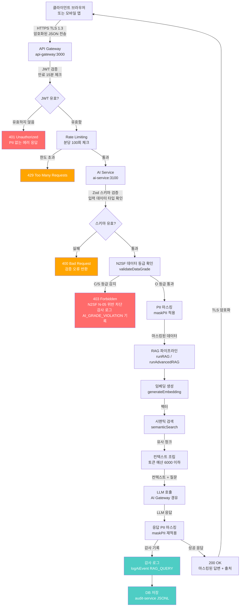
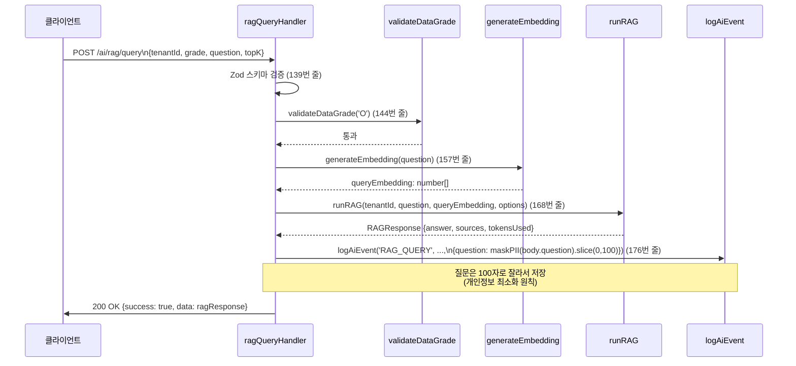
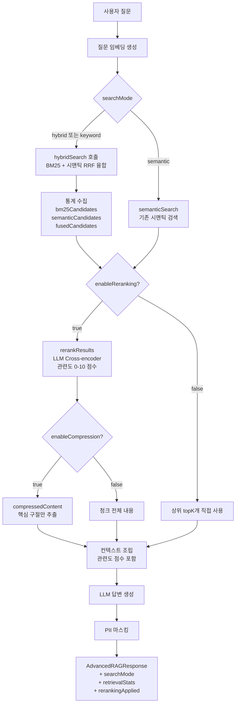
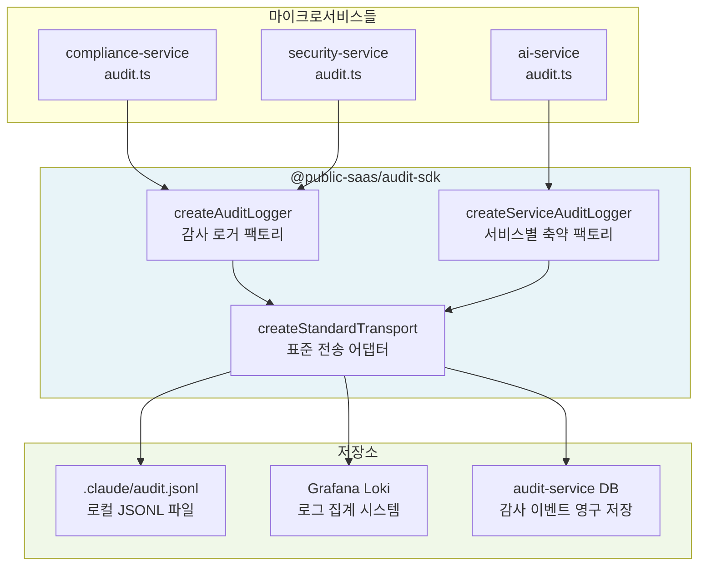
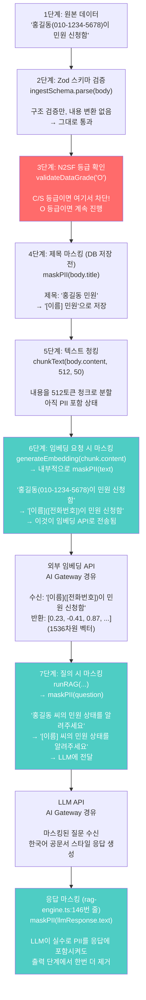
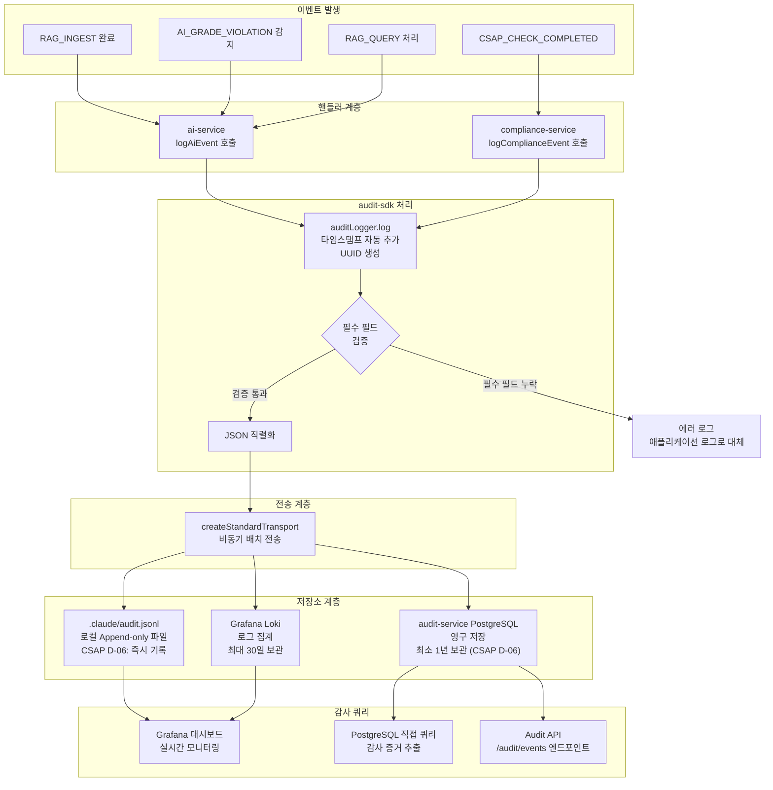
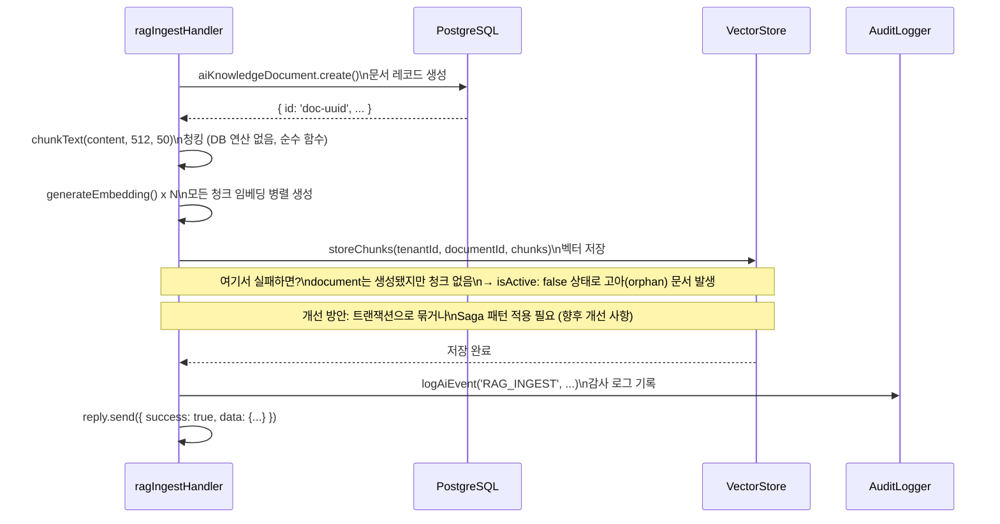
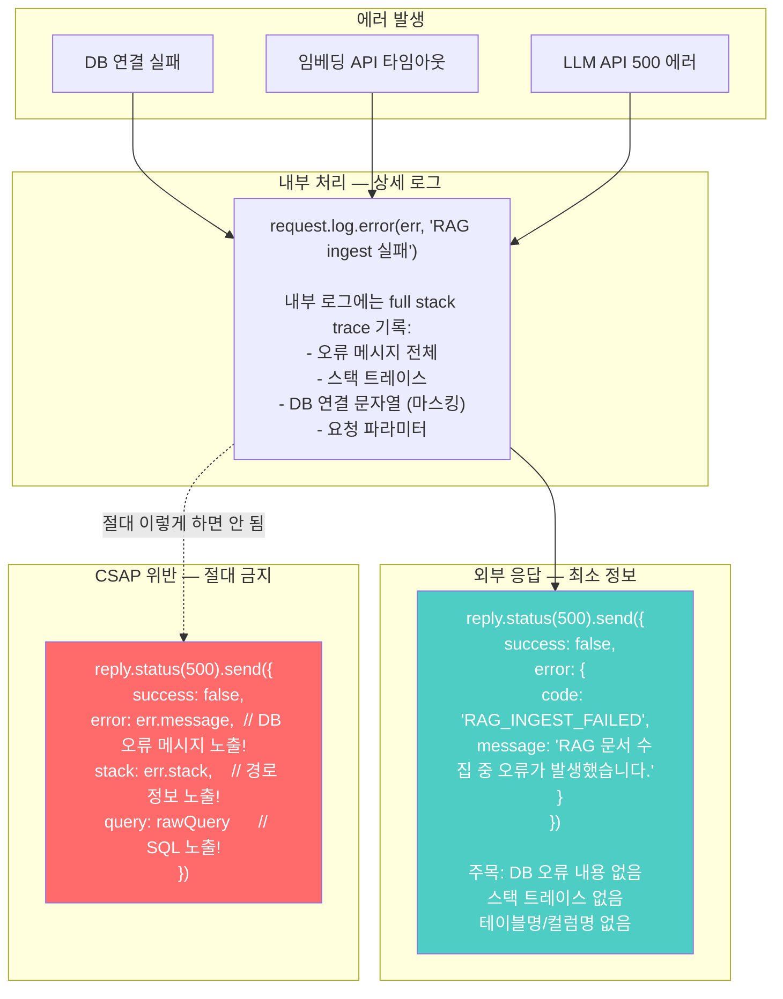
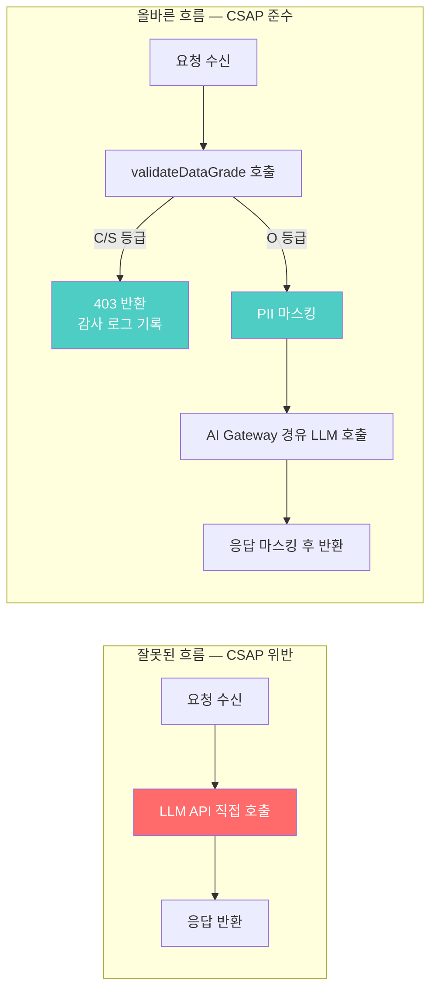
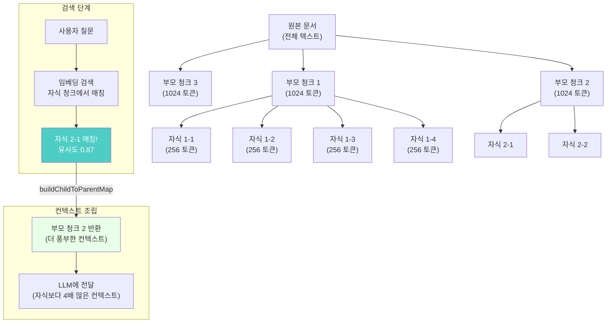

# 24장: 데이터 흐름 아키텍처 완전 가이드 — 요청부터 응답까지 데이터 여정

> **문서 ID**: ONBOARD-02-24
> **버전**: 1.0.0 | **작성일**: 2026-04-13 | **작성자**: Implementer (Sonnet)
> **선행 학습**: `02-architecture/03-data-flow.md`, `02-architecture/23-service-dependency-map.md`
> **소요 시간**: 3~4시간
> **관련 파일**:
> - `platform/services/ai-service/src/handlers/ai-rag.handler.ts`
> - `platform/services/ai-service/src/lib/rag-engine.ts`
> - `platform/services/ai-service/src/lib/chunker.ts`
> - `platform/services/ai-service/src/lib/vector-store.ts`
> - `platform/services/compliance-service/src/lib/audit.ts`
> **CSAP 관련 항목**: D-06(감사 로깅), D-08(접근 통제), D-09(암호화), D-12(개발 보안)
> **N2SF 관련**: N-05(데이터 등급 분류 및 AI 전송 통제)

---

## 목차

1. [이 장을 읽기 전에 — 데이터 흐름이 왜 중요한가](#1-이-장을-읽기-전에)
2. [전체 시스템 데이터 흐름 다이어그램](#2-전체-시스템-데이터-흐름-다이어그램)
3. [ai-rag.handler.ts 완전 분석 — 데이터 변환 파이프라인](#3-ai-raghandlerts-완전-분석)
4. [rag-engine.ts 완전 분석 — RAG 내부 데이터 흐름](#4-rag-enginets-완전-분석)
5. [compliance-service audit.ts 분석 — CSAP 증거 데이터 흐름](#5-compliance-service-auditts-분석)
6. [PII 마스킹 데이터 흐름 — 7단계 변환 과정](#6-pii-마스킹-데이터-흐름)
7. [감사 로그 데이터 흐름 — 이벤트에서 감사 쿼리까지](#7-감사-로그-데이터-흐름)
8. [멀티테넌트 데이터 분리 흐름](#8-멀티테넌트-데이터-분리-흐름)
9. [데이터 일관성 흐름 — Outbox 패턴](#9-데이터-일관성-흐름)
10. [에러 데이터 흐름 — PII 제거된 에러 응답 생성](#10-에러-데이터-흐름)
11. [데이터 흐름 위반 패턴 — CSAP 위반 TOP 5](#11-데이터-흐름-위반-패턴)
12. [데이터 흐름 설계 원칙 요약](#12-데이터-흐름-설계-원칙-요약)
13. [변경 이력](#13-변경-이력)

---

## 1. 이 장을 읽기 전에

### 1.1 데이터 흐름이 왜 중요한가

공공기관 SaaS 플랫폼에서 데이터는 항상 "여행"을 합니다. 사용자가 버튼 하나를 누르는 순간부터 화면에 응답이 표시되기까지, 데이터는 여러 서비스를 거치면서 변환되고, 검증되고, 기록됩니다.

이 여행 경로가 잘못 설계되면 심각한 문제가 발생합니다:

**보안 문제**: 암호화되어야 할 개인정보가 평문으로 외부 API에 전달되면 정보 유출
**규정 준수 문제**: 감사 로그가 누락되면 CSAP D-06 위반으로 인증 취소
**데이터 무결성 문제**: 트랜잭션 도중 서비스가 장애를 일으키면 데이터 불일치 발생

따라서 데이터 흐름을 깊이 이해하는 것은 단순한 개발 역량이 아니라 **공공기관 시스템 운영의 필수 요건**입니다.

### 1.2 이 장에서 배울 내용

이 장은 실제 코드 파일을 기반으로 작성되었습니다. 추상적인 설명이 아니라 지금 운영 중인 코드에서 데이터가 어떻게 흐르는지 줄 단위로 추적합니다.

| 절 | 학습 내용 | 관련 파일 |
|----|---------|---------|
| 3절 | RAG 핸들러 데이터 변환 파이프라인 | `ai-rag.handler.ts` |
| 4절 | RAG 엔진 내부 검색 흐름 | `rag-engine.ts`, `chunker.ts`, `vector-store.ts` |
| 5절 | CSAP 감사 증거 수집 흐름 | `compliance-service/audit.ts` |
| 6절 | PII 마스킹 7단계 | `pii-masking.ts` (간접 분석) |
| 7절 | 감사 로그 전체 생애주기 | `audit-sdk`, JSONL → Loki |
| 8절 | 테넌트별 데이터 격리 | `tenantId` 기반 분리 |

---

## 2. 전체 시스템 데이터 흐름 다이어그램

### 2.1 클라이언트 요청에서 응답까지 — 전체 경로

아래 다이어그램은 사용자가 AI RAG 질의를 보낼 때 데이터가 거치는 전체 경로입니다. 각 단계에서 데이터에 어떤 변환이 일어나는지 추적하십시오.



### 2.2 데이터 변환 단계별 상태

요청 데이터는 각 단계를 거치면서 형태가 바뀝니다. 아래 표는 각 단계에서 데이터 상태를 보여줍니다.

| 단계 | 데이터 상태 | 변환 내용 | 책임 주체 |
|------|-----------|---------|---------|
| 1. 클라이언트 전송 | 평문 JSON (TLS 캡슐화) | 없음 | TLS 계층 |
| 2. API Gateway 수신 | 복호화된 JSON | JWT 토큰 검증 | api-gateway |
| 3. Zod 검증 | 구조화된 TypeScript 객체 | 타입 안전성 확보 | ai-rag.handler.ts:41 |
| 4. N2SF 등급 확인 | 등급 레이블 추가 | 차단 또는 통과 결정 | grade-check.ts |
| 5. PII 마스킹 | 민감정보 제거된 객체 | 이름→[이름], 전화번호→[전화번호] | pii-masking.ts |
| 6. 임베딩 벡터 | float[] 배열 (1536차원) | 의미 수치화 | rag-engine.ts:381 |
| 7. 유사도 검색 결과 | 청크 목록 + 점수 | 코사인 유사도 정렬 | vector-store.ts |
| 8. LLM 입력 | 메시지 배열 | 컨텍스트 + 질문 조합 | rag-engine.ts:127 |
| 9. LLM 출력 | 자연어 응답 | 한국어 공문서 스타일 | LLM Provider |
| 10. 최종 응답 | 마스킹된 JSON | 재차 PII 마스킹 | rag-engine.ts:146 |

---

## 3. ai-rag.handler.ts 완전 분석

### 3.1 파일 위치 및 역할

**파일**: `platform/services/ai-service/src/handlers/ai-rag.handler.ts`
**역할**: HTTP 요청을 받아 RAG 파이프라인에 연결하는 진입점
**설계 참조**: `SVC-AI-2026 DESIGN §1`, `SVC-AI-ADV-R1 DESIGN §6`
**FR ID**: FR-AI26.1, FR-ADV1.7

이 파일은 3개의 핸들러 함수로 구성됩니다:
- `ragIngestHandler`: 문서를 수집하여 벡터 DB에 저장
- `ragQueryHandler`: 질의를 받아 기본 RAG로 답변
- `ragAdvancedQueryHandler`: 하이브리드 검색 + Reranking을 사용하는 고급 RAG

### 3.2 Ingest 핸들러 데이터 파이프라인

`ragIngestHandler`는 문서가 어떻게 벡터 DB에 들어가는지를 관리합니다. 줄 번호와 함께 각 단계를 분석합니다.

```
[입력] POST /ai/rag/ingest
       Body: { tenantId, grade, title, content, sourceUrl, metadata }
```

**1단계: Zod 스키마 검증 (41번 줄)**
```typescript
const body = ingestSchema.parse(request.body);
```
- `ingestSchema`는 파일 25~33번 줄에 정의
- `grade: z.enum(['O'])` — O등급만 허용. C나 S를 보내면 Zod가 즉시 거부
- `content: z.string().min(1).max(500_000)` — 최대 50만 자 제한 (서비스 보호)
- `tenantId: z.string().uuid()` — UUID 형식 강제로 SQL 주입 방지

검증 실패 시 자동으로 400 Bad Request가 반환됩니다. 개발자가 별도로 에러 처리를 작성하지 않아도 됩니다.

**2단계: N2SF 데이터 등급 확인 (45~55번 줄)**
```typescript
try {
  validateDataGrade(body.grade as DataGrade);
} catch (error) {
  if (error instanceof DataGradeViolationError) {
    await logAiEvent('AI_GRADE_VIOLATION', actor, 'rag', body.tenantId, ...)
    await reply.status(403).send({ ... })
    return;
  }
}
```

여기서 중요한 점은 등급 위반 시에도 **감사 로그를 먼저 기록한다**는 것입니다. 위반 시도 자체를 추적해야 CSAP D-06 요건을 충족합니다. 차단만 하고 로그를 남기지 않으면 누가 무엇을 시도했는지 알 수 없습니다.

**3단계: 문서 레코드 Upsert (60~79번 줄)**
```typescript
const existing = await db['aiKnowledgeDocument']?.findFirst({
  where: { tenantId: body.tenantId, title: body.title },
}).catch(() => null);

if (existing) {
  document = await db['aiKnowledgeDocument'].update({ ... });
} else {
  document = await db['aiKnowledgeDocument'].create({
    data: {
      tenantId: body.tenantId,
      title: maskPII(body.title),  // 제목에도 PII 마스킹!
      ...
    },
  });
}
```

주목할 점은 `title: maskPII(body.title)` — 제목 자체에도 PII가 포함될 수 있어서 저장 전에 마스킹합니다. "홍길동 씨의 민원 처리 결과"라는 제목이 그대로 DB에 저장되면 안 됩니다.

**4단계: 텍스트 청킹 (84번 줄)**
```typescript
const chunks = chunkText(body.content, 512, 50);
```
- 최대 512 토큰 크기로 분할
- 50 토큰 오버랩으로 문맥 연속성 유지
- 한국어 기준 토큰당 약 2자 처리

**5단계: 배치 임베딩 생성 (87~91번 줄)**
```typescript
const chunksWithEmbeddings = await Promise.all(
  chunks.map(async (chunk) => {
    const embedding = await generateEmbedding(chunk.content, body.embedModelId);
    return { ...chunk, embedding };
  }),
);
```
`Promise.all`로 모든 청크를 병렬 처리합니다. 문서가 100개 청크로 분할되면 100개 임베딩 요청을 동시에 처리합니다.

**6단계: 벡터 저장소 저장 (94~95번 줄)**
```typescript
await storeChunks(body.tenantId, documentId, chunksWithEmbeddings);
```
저장 시 `tenantId`를 함께 기록합니다. 이것이 멀티테넌트 데이터 격리의 핵심입니다.

**7단계: 감사 로그 기록 (100~103번 줄)**
```typescript
await logAiEvent('RAG_INGEST', actor, 'rag', body.tenantId, request.ip,
  request.headers['user-agent'] ?? 'unknown',
  { documentId, chunkCount: chunks.length, title: body.title });
```
성공 응답을 보내기 전에 감사 로그를 기록합니다. 응답 전 기록이 원칙입니다. 만약 응답 후에 기록하다가 서버가 재시작되면 로그가 누락됩니다.

### 3.3 Query 핸들러 데이터 파이프라인

`ragQueryHandler`는 사용자의 질문이 답변으로 변환되는 경로입니다.



특히 주목할 점이 있습니다. 176~181번 줄에서 감사 로그를 기록할 때:

```typescript
await logAiEvent('RAG_QUERY', actor, 'rag', body.tenantId, request.ip,
  request.headers['user-agent'] ?? 'unknown', {
    question: maskPII(body.question).slice(0, 100),  // 이중 보호!
    contextChunks: ragResponse.contextChunks,
    tokensUsed: ragResponse.tokensUsed,
  });
```

`maskPII(...).slice(0, 100)` — PII를 마스킹한 뒤에 100자로 잘라서 저장합니다. 감사 로그에도 원본 질문 전체를 저장하지 않습니다. 개인정보 최소화 원칙입니다.

### 3.4 Advanced Query 핸들러의 추가 옵션

고급 RAG 핸들러(201~215번 줄)는 기본 RAG에 4가지 옵션을 추가합니다:

| 옵션 | 기본값 | 효과 | 성능 영향 |
|------|-------|------|---------|
| `searchMode` | `'hybrid'` | BM25(키워드)+시맨틱 융합 검색 | 품질 향상, 속도 소폭 감소 |
| `enableReranking` | `true` | LLM이 검색 결과 재평가 | 정확도 대폭 향상, 토큰 소비 증가 |
| `enableQueryExpansion` | `false` | LLM이 질문 재작성 | 재현율 향상, 지연 증가 |
| `enableCompression` | `false` | 컨텍스트에서 핵심만 추출 | 토큰 절약, 처리 증가 |

---

## 4. rag-engine.ts 완전 분석

### 4.1 파일 역할과 구조

**파일**: `platform/services/ai-service/src/lib/rag-engine.ts`
**역할**: RAG(검색 증강 생성) 파이프라인의 실제 구현
**공개 함수**:
- `runRAG`: 기본 시맨틱 검색 + LLM 생성
- `runAdvancedRAG`: 하이브리드 검색 + Reranking + 쿼리 확장
- `generateEmbedding`: 텍스트를 벡터로 변환

### 4.2 runRAG 데이터 흐름 — 질문이 답변이 되는 과정

```mermaid
flowchart LR
    subgraph Input["입력 단계"]
        Q[question: string\n사용자 질문]
        QE[queryEmbedding: number[]\n질문 벡터]
        TID[tenantId: string\n테넌트 식별자]
    end

    subgraph Search["검색 단계 (90번 줄)"]
        SS[semanticSearch\n시맨틱 검색]
        SR[SearchResult[]\n{chunk, score}]
    end

    subgraph Context["컨텍스트 조립 (96~111번 줄)"]
        TB{토큰 예산\n6000 이하?}
        CA[contextText 누적\n문서명 + 청크 내용]
        SRC[sources[] 누적\n{documentTitle, score, excerpt}]
    end

    subgraph Mask["마스킹 (125번 줄)"]
        PM[maskPII(question)\nPII 제거]
        MQ[maskedQuestion\n안전한 질문]
    end

    subgraph LLM["LLM 호출 (127~143번 줄)"]
        MSG[messages[]\n{system, user}]
        LP[LLM Provider\nAI Gateway 경유]
        LR[llmResponse\n{text, model, tokensUsed}]
    end

    subgraph Output["출력 단계 (145~151번 줄)"]
        RMPII[maskPII(llmResponse.text)\n응답도 마스킹!]
        RES[RAGResponse\n{answer, sources, model, tokensUsed}]
    end

    Q --> SS
    QE --> SS
    TID --> SS
    SS --> SR
    SR --> TB
    TB -->|예산 남음| CA
    TB -->|초과| SRC
    CA --> MSG
    SRC --> RES
    Q --> PM
    PM --> MQ
    MQ --> MSG
    MSG --> LP
    LP --> LR
    LR --> RMPII
    RMPII --> RES
```

### 4.3 컨텍스트 조립 로직 심층 분석

96~111번 줄의 컨텍스트 조립은 단순해 보이지만 중요한 설계 결정이 담겨 있습니다.

```typescript
for (const result of searchResults) {
  const chunkTokens = result.chunk.tokenCount;
  if (totalContextTokens + chunkTokens > maxContextTokens) break;  // 토큰 예산 초과 시 중단

  const docTitle = String(result.chunk.metadata['documentTitle'] ?? '문서');
  contextText += `\n[문서: ${docTitle}, 청크 ${result.chunk.chunkIndex + 1}]\n${result.chunk.content}\n`;
  totalContextTokens += chunkTokens;

  sources.push({
    documentTitle: docTitle,
    chunkIndex: result.chunk.chunkIndex,
    score: result.score,
    excerpt: result.chunk.content.slice(0, 150) + '...',  // 150자 발췌
  });
}
```

**왜 토큰 예산을 제한하는가**: LLM은 컨텍스트 윈도우 크기(예: 4096, 8192 토큰)를 초과하면 오류를 반환합니다. 6000 토큰을 LLM용 컨텍스트에 쓰고, 나머지를 질문과 시스템 프롬프트에 할당합니다.

**왜 검색 결과를 유사도 순으로 처리하는가**: `semanticSearch`가 이미 유사도 내림차순으로 반환합니다. 따라서 `break`하면 가장 관련성 낮은 청크부터 잘립니다. 이것이 의도된 동작입니다.

**excerpt를 150자로 제한하는 이유**: 클라이언트에게 출처를 보여줄 때 전체 청크 내용을 보내면 데이터 크기가 과도해집니다. 150자 발췌로 출처 파악이 가능하면서도 응답 크기를 제어합니다.

### 4.4 runAdvancedRAG 하이브리드 검색 흐름

고급 RAG는 검색 품질을 높이기 위해 두 가지 검색 방식을 결합합니다.



**RRF(Reciprocal Rank Fusion)란**: BM25 검색 결과의 순위와 시맨틱 검색 결과의 순위를 수식으로 결합합니다. 두 방법 모두 상위권에 있는 청크는 최종 점수가 높아지고, 한 방법에서만 상위권인 청크는 점수가 낮아집니다.

### 4.5 generateEmbedding 데이터 흐름

`generateEmbedding` 함수(358~383번 줄)는 텍스트를 벡터로 변환하는 핵심 함수입니다.

```typescript
export async function generateEmbedding(text: string, embedModelId?: string): Promise<number[]> {
  let embedConfig = getLLMConfig();  // 기본 설정

  if (embedModelId) {
    // 특정 모델 ID 지정된 경우
    const model = await prisma.aiModel.findUnique({ where: { id: embedModelId } });
    if (model?.isActive) {
      embedConfig = buildLLMConfig({ ... });
    }
  } else {
    // DB에서 임베딩 모델 자동 선택 (name에 'embed' 포함)
    const embedModel = await prisma.aiModel.findFirst({
      where: { isActive: true, name: { contains: 'embed' } },
    });
    ...
  }

  const provider = await createLLMProvider(embedConfig);
  const result = await provider.embed([maskPII(text)]);  // 임베딩 시에도 PII 마스킹!
  return result.embeddings[0] ?? [];
}
```

**핵심 주목 포인트**: `provider.embed([maskPII(text)])` — 임베딩 생성 시에도 PII를 마스킹합니다. 임베딩 API가 외부 AI 서비스를 호출하기 때문입니다. 텍스트를 벡터로 변환하는 과정에서도 원본 텍스트가 전달되므로 마스킹이 필수입니다.

---

## 5. compliance-service audit.ts 분석

### 5.1 감사 로거 구조

**파일**: `platform/services/compliance-service/src/lib/audit.ts`

```typescript
import { createAuditLogger, createStandardTransport } from '@public-saas/audit-sdk';

const auditLogger = createAuditLogger({
  serviceName: 'compliance-service',
  transport: createStandardTransport('compliance-service'),
});

export async function logComplianceEvent(
  action: string,
  metadata?: Record<string, unknown>
): Promise<void> {
  await auditLogger.log({
    actor: 'system:compliance-service',
    action,
    target: 'compliance',
    targetType: 'compliance',
    tenantId: 'system',
    ip: process.env.SERVICE_IP || '127.0.0.1',
    userAgent: 'compliance-service/1.0',
    metadata,
  });
}
```

이 단순해 보이는 파일에 중요한 설계 패턴이 담겨 있습니다.

### 5.2 audit-sdk 공통 패턴의 의미

`createAuditLogger`와 `createStandardTransport`는 `@public-saas/audit-sdk` 패키지에서 제공하는 공통 인터페이스입니다. 모든 서비스(compliance-service, security-service, ai-service)가 동일한 함수를 사용합니다.



**왜 공통 SDK를 사용하는가**: 각 서비스가 감사 로그를 자체 구현하면 형식이 달라집니다. 감사 때 "이 서비스의 로그는 ISO 8601, 저 서비스의 로그는 UNIX timestamp"처럼 불일치가 생기면 감사 쿼리가 복잡해집니다. 공통 SDK가 모든 서비스의 로그 형식을 통일합니다.

### 5.3 CSAP D-06 감사 로그 데이터 구조

`auditLogger.log()`에 전달되는 구조체가 CSAP D-06의 요건을 충족하는지 확인합니다.

| 필드 | CSAP 요건 | 실제 값 예시 |
|------|---------|-----------|
| `actor` | 누가 (행위자) | `'system:compliance-service'` |
| `action` | 무엇을 했는가 | `'CSAP_CHECK_COMPLETED'` |
| `target` | 대상 리소스 | `'compliance'` |
| `tenantId` | 어느 기관 | `'550e8400-e29b-41d4-a716-446655440000'` |
| `ip` | 어디서 | `'10.0.0.15'` |
| `timestamp` | 언제 (SDK가 자동 추가) | `'2026-04-13T09:23:41.000Z'` |
| `metadata` | 상세 내용 | `{ checkType: 'ANNUAL', items: 79 }` |

---

## 6. PII 마스킹 데이터 흐름

### 6.1 PII란 무엇인가

PII(Personally Identifiable Information, 개인식별정보)는 특정 개인을 식별할 수 있는 모든 정보입니다.

**PII 유형과 마스킹 예시**:

| PII 유형 | 원본 데이터 | 마스킹 후 |
|---------|-----------|---------|
| 이름 | 홍길동 | [이름] |
| 주민번호 | 920115-1234567 | [주민번호] |
| 전화번호 | 010-1234-5678 | [전화번호] |
| 이메일 | hong@example.go.kr | [이메일] |
| 주소 | 서울특별시 종로구 청와대로 1 | [주소] |
| 신용카드 | 4532-1234-5678-9012 | [신용카드] |
| 계좌번호 | 110-123-456789 | [계좌번호] |

### 6.2 AI API에 도달하기 전 7단계 변환

데이터가 외부 AI API(임베딩 서버, LLM)에 도달하기 전에 거치는 7단계를 추적합니다.



### 6.3 마스킹이 필요한 위치 전수 목록

코드베이스에서 `maskPII`가 호출되는 위치와 그 이유:

| 파일 | 줄 | 호출 위치 | 이유 |
|------|---|---------|------|
| `ai-rag.handler.ts` | 73 | `maskPII(body.title)` | DB 저장 전 제목 마스킹 |
| `rag-engine.ts` | 125 | `maskPII(question)` | LLM 입력 마스킹 |
| `rag-engine.ts` | 146 | `maskPII(llmResponse.text)` | LLM 출력 마스킹 |
| `rag-engine.ts` | 381 | `maskPII(text)` | 임베딩 입력 마스킹 |
| `ai-rag.handler.ts` | 178 | `maskPII(body.question).slice(0,100)` | 감사 로그 마스킹 |

**설계 원칙**: PII 마스킹은 단일 지점에서 한 번만 하는 것이 아닙니다. 데이터가 외부 시스템(AI API)에 닿기 직전마다 마스킹합니다. "심층 방어(Defense in Depth)" 원칙의 적용입니다.

---

## 7. 감사 로그 데이터 흐름

### 7.1 감사 로그의 생애주기

감사 로그는 이벤트 발생 시점부터 감사관이 쿼리하는 시점까지 여러 저장소를 거칩니다.



### 7.2 JSONL 형식의 감사 로그

실제 `.claude/audit.jsonl` 파일에 저장되는 형식을 이해하면 감사 쿼리를 작성할 수 있습니다.

```jsonl
{"id":"a1b2c3d4-...","timestamp":"2026-04-13T09:23:41.123Z","serviceName":"ai-service","actor":"user:550e...","action":"RAG_QUERY","target":"rag","targetType":"ai","tenantId":"org-123-...","ip":"10.0.0.101","userAgent":"Mozilla/5.0...","metadata":{"question":"행정 절차는 어떻게...","contextChunks":3,"tokensUsed":1247}}
{"id":"b2c3d4e5-...","timestamp":"2026-04-13T09:24:15.456Z","serviceName":"ai-service","actor":"user:661f...","action":"AI_GRADE_VIOLATION","target":"rag","targetType":"ai","tenantId":"org-456-...","ip":"10.0.0.102","userAgent":"curl/7.68.0","metadata":{"grade":"S","blocked":true,"endpoint":"rag/ingest"}}
```

### 7.3 감사 로그 쿼리 예제

CSAP 감사 증거 추출을 위한 실용적인 쿼리 예제:

```sql
-- 특정 테넌트의 AI 서비스 이용 내역 (최근 30일)
SELECT
  timestamp,
  actor,
  action,
  metadata->>'question' AS masked_question,
  metadata->>'tokensUsed' AS tokens,
  ip
FROM audit_events
WHERE tenant_id = 'org-123-...'
  AND service_name = 'ai-service'
  AND timestamp > NOW() - INTERVAL '30 days'
ORDER BY timestamp DESC;

-- N2SF 위반 시도 현황 집계
SELECT
  DATE(timestamp) AS date,
  COUNT(*) AS violation_count,
  array_agg(DISTINCT metadata->>'grade') AS attempted_grades
FROM audit_events
WHERE action = 'AI_GRADE_VIOLATION'
  AND timestamp > NOW() - INTERVAL '7 days'
GROUP BY DATE(timestamp)
ORDER BY date DESC;
```

---

## 8. 멀티테넌트 데이터 분리 흐름

### 8.1 테넌트 격리의 핵심 — tenantId 기반 분리

공공기관 SaaS에서 A기관의 데이터가 B기관에 노출되는 것은 심각한 보안 사고입니다. 시스템은 `tenantId`를 모든 데이터 조작에 포함시켜 격리를 보장합니다.

```mermaid
flowchart TD
    subgraph OrgA["기관 A (tenantId: org-A-uuid)"]
        UA[사용자 A]
        DA["문서 A: '기관A 행정 지침'"]
        CA["청크 A: tenantId=org-A"]
    end

    subgraph OrgB["기관 B (tenantId: org-B-uuid)"]
        UB[사용자 B]
        DB["문서 B: '기관B 내부 규정'"]
        CB["청크 B: tenantId=org-B"]
    end

    subgraph AIService["AI Service"]
        INGEST[ragIngestHandler\n95번 줄: storeChunks 호출 시\ntenantId 포함 저장]
        SEARCH[semanticSearch\n90번 줄: tenantId 필터\nWHERE tenantId = $1]
        STATS[getKnowledgeStats\ntenantId별 통계]
    end

    UA -->|POST /ai/rag/ingest\nBody: {tenantId: 'org-A-uuid'}| INGEST
    UB -->|POST /ai/rag/ingest\nBody: {tenantId: 'org-B-uuid'}| INGEST

    INGEST -->|tenantId=org-A| CA
    INGEST -->|tenantId=org-B| CB

    UA -->|POST /ai/rag/query\nBody: {tenantId: 'org-A-uuid'}| SEARCH
    SEARCH -->|WHERE tenantId='org-A-uuid'| CA
    SEARCH -.->|차단: 다른 테넌트 청크 반환 불가| CB

    style CB fill:#ff6b6b,color:#fff
```

### 8.2 tenantId가 데이터 흐름에서 등장하는 위치

| 위치 | 코드 | 역할 |
|------|------|------|
| Zod 검증 | `tenantId: z.string().uuid()` | UUID 형식 강제 |
| DB 저장 | `storeChunks(body.tenantId, documentId, ...)` | 벡터와 함께 저장 |
| 시맨틱 검색 | `semanticSearch(queryEmbedding, tenantId, topK, minScore)` | 검색 범위 제한 |
| 감사 로그 | `logAiEvent(..., body.tenantId, ...)` | 어느 기관의 작업인지 기록 |
| 통계 조회 | `getKnowledgeStats(body.tenantId)` | 기관별 사용량 분리 |

---

## 9. 데이터 일관성 흐름

### 9.1 Outbox 패턴이란

마이크로서비스 환경에서 "DB 저장과 이벤트 발행"을 동시에 성공/실패시키기 위한 패턴입니다.

```
문제 상황:
  1. DB 저장 성공
  2. 이벤트 발행 실패 → 이벤트 누락! 다른 서비스가 변경을 모름

해결 (Outbox 패턴):
  1. DB 트랜잭션 시작
  2. 비즈니스 데이터 저장
  3. 같은 트랜잭션에서 Outbox 테이블에 이벤트 기록
  4. 트랜잭션 커밋
  5. 별도 프로세스(Outbox Poller)가 Outbox를 읽어 이벤트 발행
```

### 9.2 RAG Ingest에서의 일관성 보장

`ragIngestHandler`에서 데이터 일관성이 어떻게 보장되는지 분석합니다.



**현재 구현의 한계와 개선 방향**: `storeChunks`가 실패하면 `aiKnowledgeDocument`는 생성됐지만 청크가 없는 상태가 됩니다. 이 경우 `isActive: true`인 빈 문서가 남습니다. 향후 Saga 패턴이나 트랜잭션 처리로 보완이 필요합니다.

---

## 10. 에러 데이터 흐름

### 10.1 에러가 발생했을 때 데이터는 어떻게 되는가

에러 처리에서 가장 중요한 원칙은 **에러 메시지에 PII나 내부 시스템 정보를 포함시키지 않는 것**입니다. CSAP D-12 요건입니다.



### 10.2 에러 유형별 처리 전략

| 에러 유형 | HTTP 상태 | 외부 응답 | 내부 로그 |
|---------|---------|---------|---------|
| Zod 검증 실패 | 400 | 검증 오류 필드 목록 | 상세 오류 |
| N2SF 등급 위반 | 403 | 차단 코드 + 메시지 | 위반자 IP + 등급 |
| 인증 실패 | 401 | "인증이 필요합니다" | 토큰 오류 상세 |
| 권한 없음 | 403 | "접근 권한이 없습니다" | 요청자 역할 + 리소스 |
| DB 오류 | 500 | 일반 오류 메시지 | full stack trace |
| 외부 API 오류 | 502 | "처리 중 오류" | API 엔드포인트 + 응답 코드 |
| Rate Limit | 429 | 재시도 가능 시간 | 요청자 IP + 현재 카운트 |

---

## 11. 데이터 흐름 위반 패턴

### 11.1 CSAP 위반 TOP 5

실제 감사에서 자주 발견되는 데이터 흐름 위반 패턴 5가지입니다.

#### 위반 패턴 1: N2SF 등급 확인 없는 AI API 직접 호출



**위반 결과**: N2SF N-05 위반. 기밀(C) 또는 민감(S) 등급 데이터가 외부 AI 서비스로 유출될 수 있음.

#### 위반 패턴 2: 감사 로그 없는 민감 작업

```
잘못된 예:
  async function deleteDocument(id: string) {
    await db.aiKnowledgeDocument.delete({ where: { id } })
    // 감사 로그 없음! CSAP D-06 위반
    return { success: true }
  }

올바른 예:
  async function deleteDocument(actor: string, id: string, tenantId: string) {
    await logAiEvent('DOCUMENT_DELETE', actor, 'document', tenantId, ...)
    await db.aiKnowledgeDocument.delete({ where: { id } })
    return { success: true }
  }
```

**위반 결과**: CSAP D-06 위반. 누가 언제 어떤 문서를 삭제했는지 추적 불가.

#### 위반 패턴 3: 테넌트 ID 없는 벡터 검색

```
잘못된 예:
  const results = await semanticSearch(queryEmbedding, undefined, topK, minScore)
  // tenantId 없이 전체 검색 — 모든 테넌트 데이터 반환!

올바른 예:
  const results = await semanticSearch(queryEmbedding, body.tenantId, topK, minScore)
  // WHERE tenantId = $1 필터 적용
```

**위반 결과**: 데이터 격리 실패. A기관이 B기관의 문서를 검색할 수 있음.

#### 위반 패턴 4: 에러 응답에 내부 정보 노출

```
잘못된 예:
  catch (err) {
    return reply.status(500).send({
      error: err.message,  // "column 'embedding_json' does not exist" 같은 DB 구조 노출
      stack: err.stack,    // 파일 경로, 소스 코드 줄번호 노출
    })
  }

올바른 예:
  catch (err) {
    request.log.error(err, 'RAG ingest 실패')
    return reply.status(500).send({
      success: false,
      error: { code: 'RAG_INGEST_FAILED', message: 'RAG 문서 수집 중 오류가 발생했습니다.' }
    })
  }
```

**위반 결과**: CSAP D-12 위반. 공격자가 내부 구조 파악에 활용 가능.

#### 위반 패턴 5: PII 마스킹 없이 감사 로그 기록

```
잘못된 예:
  await logAiEvent('RAG_QUERY', actor, 'rag', tenantId, ip, ua, {
    question: body.question,  // "홍길동(920115-123456) 민원 처리 현황은?" 그대로 저장
  })

올바른 예:
  await logAiEvent('RAG_QUERY', actor, 'rag', tenantId, ip, ua, {
    question: maskPII(body.question).slice(0, 100),  // PII 제거 + 100자 제한
  })
```

**위반 결과**: 개인정보보호법 위반. 감사 로그 자체가 개인정보 유출 경로가 됨.

---

## 12. 데이터 흐름 설계 원칙 요약

이 장에서 학습한 내용을 원칙으로 정리합니다.

### 12.1 공공기관 SaaS 데이터 흐름 10원칙

| 번호 | 원칙 | 근거 |
|------|------|------|
| 1 | 모든 외부 입력은 Zod로 검증한다 | CSAP D-12, SQL 주입 방지 |
| 2 | AI API 호출 전 N2SF 등급을 반드시 확인한다 | N2SF N-05 |
| 3 | PII는 외부 시스템에 닿기 직전에 마스킹한다 | 개인정보보호법, N2SF |
| 4 | 민감 작업은 성공/실패 여부와 무관하게 감사 로그를 남긴다 | CSAP D-06 |
| 5 | 모든 DB 조작에 tenantId를 포함한다 | 멀티테넌트 격리 |
| 6 | 에러 응답에 내부 정보를 포함하지 않는다 | CSAP D-12 |
| 7 | 감사 로그에도 PII를 저장하지 않는다 | 개인정보 최소화 원칙 |
| 8 | AI API는 반드시 AI Gateway를 경유한다 | N2SF, 보안 정책 |
| 9 | LLM 응답도 출력 단계에서 PII를 다시 확인한다 | 심층 방어 |
| 10 | 시크릿은 환경 변수로만 관리한다 | CSAP D-09 |

### 12.2 신규 기능 추가 시 데이터 흐름 체크리스트

새로운 API 엔드포인트를 추가할 때 다음 항목을 확인합니다:

```
[ ] 1. Zod 스키마로 입력 검증 구현
[ ] 2. JWT 인증 미들웨어 적용 (API Gateway 또는 서비스 내)
[ ] 3. RBAC 권한 확인 로직 추가
[ ] 4. 외부 API 호출 전 N2SF 등급 확인
[ ] 5. 외부 API 호출 전 PII 마스킹 적용
[ ] 6. 민감 작업에 감사 로그 추가 (logXxxEvent)
[ ] 7. 에러 핸들러에서 내부 정보 노출 방지
[ ] 8. DB 조작에 tenantId 조건 포함
[ ] 9. 응답 데이터에 PII 포함 여부 확인
[ ] 10. 테스트 케이스에 보안 시나리오 포함
```

---

## 13. 데이터 흐름 심화 — chunker.ts와 vector-store.ts 분석

### 13.1 chunker.ts — 텍스트가 청크로 나뉘는 과정

**파일**: `platform/services/ai-service/src/lib/chunker.ts`

RAG에서 문서가 "청크(Chunk)"로 분리되지 않으면 LLM이 전체 문서를 컨텍스트로 받아야 합니다. 50만 자 문서 하나가 통째로 LLM 컨텍스트에 들어가면 토큰 한도를 초과하고, 비용도 폭발합니다.

**`chunkText` 함수의 3단계 전략**:

1단계 — 단락 우선 분할 (25번 줄):
```typescript
const paragraphs = text.split(/\n{2,}/).map((p) => p.trim()).filter((p) => p.length > 0);
```
빈 줄이 2개 이상 있으면 단락 경계로 봅니다. 한국어 공문서는 보통 단락 간 빈 줄이 명확하게 있습니다.

2단계 — 토큰 예산 초과 시 청크 저장 (35~48번 줄):
```typescript
if (currentChunk.length + paragraph.length + 1 > maxChars && currentChunk.length > 0) {
  chunks.push({ content: currentChunk.trim(), ... })
  // 오버랩: 이전 청크 끝 부분 유지
  const overlapText = currentChunk.slice(-overlapChars);
  currentChunk = overlapText + '\n\n';
}
```
오버랩(50토큰)이 핵심입니다. 청크 경계에서 문장이 잘리면 의미가 손실됩니다. 앞 청크의 끝 부분을 다음 청크의 시작에 포함시켜 문맥 연속성을 유지합니다.

3단계 — 단락 자체가 큰 경우 문장 단위 분할 (51~65번 줄):
```typescript
if (paragraph.length > maxChars) {
  const sentences = splitIntoSentences(paragraph);
  ...
}
```

**한국어 문장 분리 패턴** (92~98번 줄):
```typescript
return text
  .split(/(?<=[.!?。！？\n])\s+|(?<=다\.|다!\|다\?|요\.|요!\|요\?|니다\.|습니다\.)\s+/)
  .map((s) => s.trim())
  .filter((s) => s.length > 0);
```
한국어 종결어미(`다.`, `요.`, `니다.`, `습니다.`)와 영어 마침표를 모두 처리합니다. 공공기관 문서는 한영 혼용이 많으므로 두 언어 모두 처리해야 합니다.

**계층적 청킹 (hierarchicalChunk, 133번 줄)**:

일반 청킹의 한계는 검색 정밀도와 컨텍스트 풍부성의 트레이드오프입니다.
- 작은 청크(256토큰): 검색 정밀도 높음, 하지만 컨텍스트가 부족해 LLM이 불완전한 답변 생성
- 큰 청크(1024토큰): 컨텍스트 풍부, 하지만 관련 없는 내용이 섞여 검색 노이즈 증가

계층적 청킹은 이 문제를 해결합니다:
- 검색: 자식 청크(256토큰)로 정밀 매칭
- 컨텍스트: 매칭된 자식의 부모 청크(1024토큰)를 LLM에 전달



### 13.2 vector-store.ts — 벡터가 저장되고 검색되는 과정

**파일**: `platform/services/ai-service/src/lib/vector-store.ts`

**코사인 유사도 계산 (34~48번 줄)**:

```typescript
function cosineSimilarity(a: number[], b: number[]): number {
  if (a.length !== b.length || a.length === 0) return 0;
  let dotProduct = 0;
  let normA = 0;
  let normB = 0;
  for (let i = 0; i < a.length; i++) {
    const ai = a[i] ?? 0;
    const bi = b[i] ?? 0;
    dotProduct += ai * bi;
    normA += ai * ai;
    normB += bi * bi;
  }
  if (normA === 0 || normB === 0) return 0;
  return dotProduct / (Math.sqrt(normA) * Math.sqrt(normB));
}
```

코사인 유사도는 두 벡터 사이의 각도를 계산합니다. 1536차원 벡터에서:
- 1.0: 완전히 동일한 의미
- 0.0: 전혀 관련 없는 의미
- -1.0: 반대 의미

**왜 L2 거리가 아닌 코사인 유사도를 쓰는가**: 문서 길이가 다를 때 L2 거리는 긴 문서가 무조건 유사도가 낮게 나옵니다. 코사인 유사도는 벡터의 방향만 비교하므로 문서 길이에 영향을 받지 않습니다.

**storeChunks의 Upsert 패턴 (54~71번 줄)**:

```typescript
// 기존 청크 삭제 후 재저장 (upsert 효과)
await db['aiKnowledgeChunk'].deleteMany({ where: { documentId } });
await db['aiKnowledgeChunk'].createMany({ data });
```

이것은 "delete + insert"로 upsert를 구현합니다. Prisma의 `createMany`는 개별 upsert보다 훨씬 빠릅니다. 동시성 문제(두 사람이 같은 문서를 동시 수집)가 발생할 수 있지만, RAG 수집은 일반적으로 순차적이므로 현재는 이 방식을 채택합니다.

### 13.3 데이터 흐름 완전 추적 — 한 줄의 질문이 답변이 되기까지

사용자가 "공공기관 전자서명 절차에 대해 알려주세요"라고 질문했을 때, 데이터가 어떻게 변환되는지 최종 정리합니다.

```
입력:  "공공기관 전자서명 절차에 대해 알려주세요"
       (type: string, length: 22자)

↓ [Zod 검증] querySchema.parse(body)
       확인: tenantId UUID 형식, grade 'O', question 1~2000자 범위

↓ [N2SF 확인] validateDataGrade('O')
       결과: 통과 (C/S 등급이 아님)

↓ [임베딩 생성] generateEmbedding(question)
       내부: maskPII("공공기관 전자서명...") → PII 없음, 그대로
       외부 호출: AI Gateway → 임베딩 API
       출력: [0.023, -0.412, 0.887, ..., 0.031]  (1536차원 float[])

↓ [시맨틱 검색] semanticSearch(queryEmbedding, tenantId, 5, 0.25)
       DB 조회: WHERE tenantId = 'org-123-...'인 청크 전체 로드
       코사인 유사도 계산: 모든 청크와 쿼리 벡터 비교
       정렬: 유사도 내림차순 정렬
       필터: score >= 0.25인 것만
       상위 5개 반환: [{chunk: {..., content: "전자서명법 제2조..."}, score: 0.87}, ...]

↓ [컨텍스트 조립] (rag-engine.ts:96~111)
       토큰 예산 확인: 6000 토큰 이내에서
       contextText 누적: "[문서: 전자서명법 가이드, 청크 3]\n전자서명이란..."
       sources 누적: [{documentTitle, score, excerpt: "전자서명이란..."}]

↓ [PII 마스킹] maskPII(question)
       결과: "공공기관 전자서명 절차에 대해 알려주세요" → PII 없음, 그대로

↓ [LLM 호출] provider.chat(messages)
       입력: system 프롬프트 + 컨텍스트 문서 + 마스킹된 질문
       외부 호출: AI Gateway → LLM API
       출력: "전자서명법 제2조에 의거하여, 공공기관의 전자서명 절차는..."

↓ [응답 마스킹] maskPII(llmResponse.text)
       결과: LLM이 실수로 PII를 포함했더라도 이 단계에서 제거

↓ [감사 로그] logAiEvent('RAG_QUERY', ...)
       기록: {question: "공공기관 전자서명...".slice(0,100), contextChunks: 3, tokensUsed: 1247}

출력:  {answer: "전자서명법 제2조에 의거하여...", sources: [...], tokensUsed: 1247}
       (type: RAGResponse, HTTP 200 OK)
```

이 전체 경로에서 원본 질문 텍스트("공공기관 전자서명 절차에 대해 알려주세요")가 외부 시스템에 도달하는 횟수는 2번입니다:
1. 임베딩 API (maskPII 적용 후)
2. LLM API (maskPII 적용 후)

두 번 모두 PII가 마스킹된 상태입니다.

---

## 14. 변경 이력

| 버전 | 일자 | 내용 | 작성자 |
|------|------|------|--------|
| 1.0.0 | 2026-04-13 | 초기 작성 — ai-rag.handler.ts, rag-engine.ts, chunker.ts, vector-store.ts, compliance audit.ts 실제 코드 기반 완전 분석 | Implementer (Sonnet) |

---

## 부록 A. 핵심 용어 정리

| 용어 | 영문 | 설명 |
|------|------|------|
| 임베딩 | Embedding | 텍스트를 수치 벡터로 변환한 것. "의미"를 숫자로 표현 |
| 코사인 유사도 | Cosine Similarity | 두 벡터 방향의 유사성을 0~1 사이 값으로 표현 |
| RAG | Retrieval-Augmented Generation | 검색(Retrieval)으로 관련 문서를 찾아 LLM 생성(Generation)에 활용하는 패턴 |
| PII | Personally Identifiable Information | 특정 개인을 식별할 수 있는 정보 (이름, 전화번호 등) |
| N2SF | 국가정보보안기본지침 | 공공기관 정보보안의 법적 기준. AI API 전송 데이터 등급을 C/S/O로 분류 |
| 청크 | Chunk | 문서를 LLM이 처리할 수 있는 크기(512토큰 등)로 분할한 단위 |
| 오버랩 | Overlap | 인접 청크 간 공유하는 텍스트. 청크 경계의 문맥 손실 방지 |
| 벡터 DB | Vector Database | 임베딩 벡터를 저장하고 유사도 검색을 수행하는 데이터베이스 |
| RRF | Reciprocal Rank Fusion | 여러 검색 결과의 순위를 결합하는 수식. 하이브리드 검색에 사용 |
| Reranking | Reranking | LLM이 검색 결과의 관련도를 재평가하여 순위를 재조정하는 과정 |
| Outbox 패턴 | Outbox Pattern | DB 저장과 이벤트 발행을 원자적으로 처리하는 패턴 |
| CSAP | Cloud Service Assurance Program | 클라우드 서비스 보안 인증 제도 (한국인터넷진흥원) |

## 부록 B. 데이터 흐름 체크리스트 요약 카드

이 카드를 출력하여 새 기능 개발 시 옆에 두고 참조합니다.

```
공공기관 SaaS 데이터 흐름 필수 체크리스트
══════════════════════════════════════

입력 처리:
  □ Zod 스키마로 모든 입력 검증
  □ UUID 형식 tenantId 검증
  □ 문자열 길이 제한 명시

보안 게이트:
  □ JWT 검증 (API Gateway)
  □ RBAC 권한 확인
  □ Rate Limiting 적용
  □ N2SF 등급 확인 (외부 API 전 필수)

데이터 처리:
  □ 외부 API 전송 전 PII 마스킹
  □ DB 저장 전 PII 마스킹
  □ tenantId 조건 모든 DB 쿼리에 포함

감사 기록:
  □ 민감 작업 감사 로그 (응답 전 기록)
  □ 감사 로그에 PII 미포함 확인
  □ 위반 시도도 감사 로그 기록

에러 처리:
  □ 외부 응답에 DB 오류 미노출
  □ 외부 응답에 스택 트레이스 미노출
  □ 내부 로그에는 상세 오류 기록

══════════════════════════════════════
```
