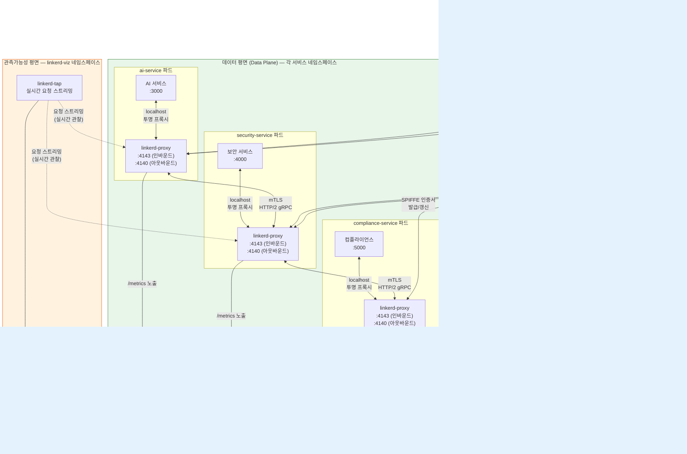
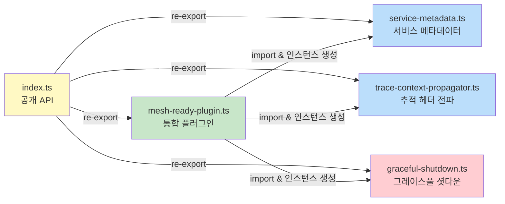
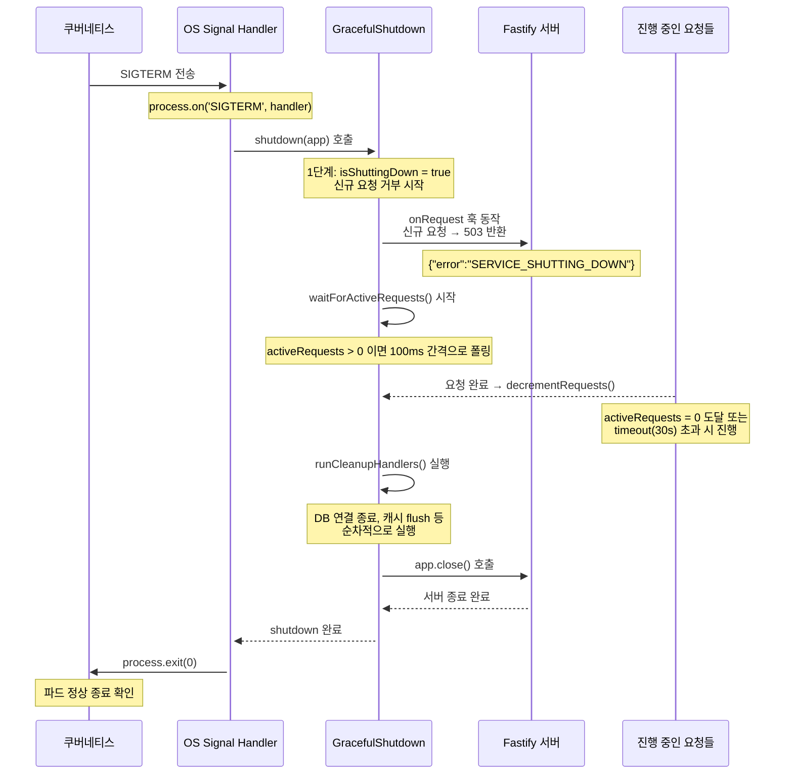
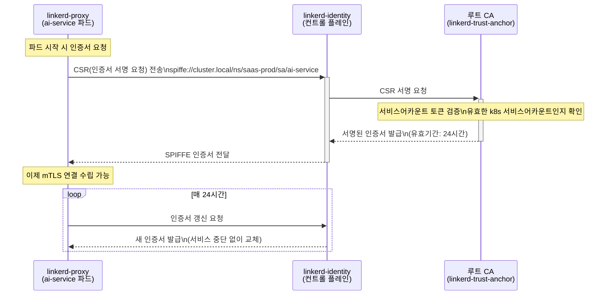
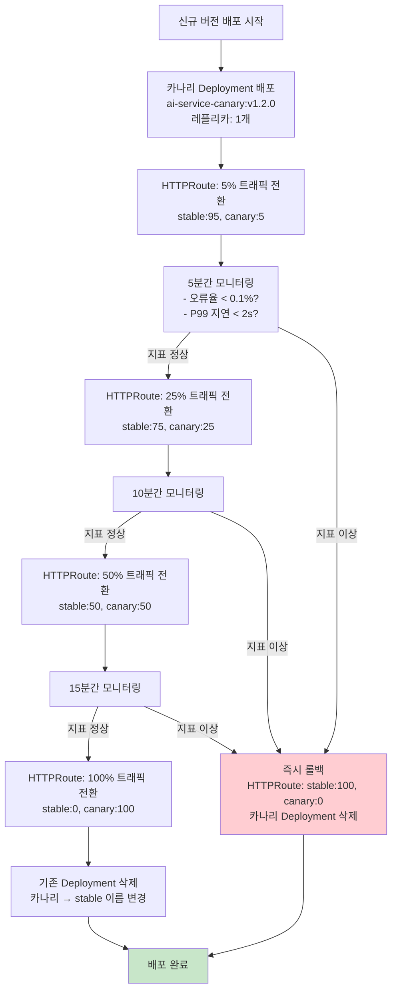
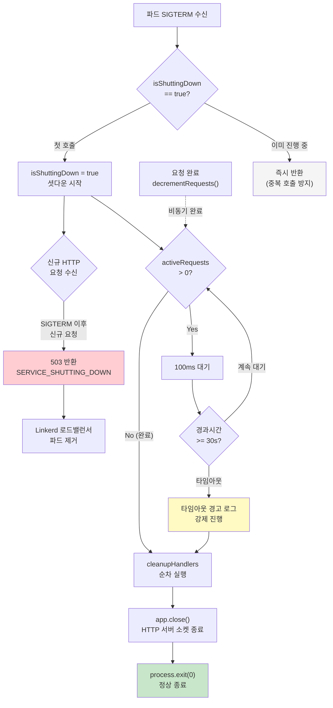
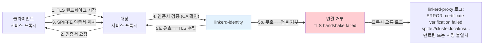

# 서비스 메시 패턴 완전 가이드
## Linkerd 심화, 트래픽 관리, 관측가능성 자동화, 보안 정책

> **대상**: 신규 입사자 (백엔드 개발자, 인프라 엔지니어)  
> **사전 지식**: Kubernetes 기본, HTTP/TCP 네트워킹 기초  
> **소요 시간**: 약 3시간  
> **관련 Plan**: SVC-MESH-R13  
> **관련 FR**: FR-MESH.1 ~ FR-MESH.4  
> **CSAP 연관**: D-07 가용성 관리, D-10 네트워크 보안

---

## 목차

1. [서비스 메시란 무엇인가](#1-서비스-메시란-무엇인가)
2. [Linkerd 전체 아키텍처 다이어그램](#2-linkerd-전체-아키텍처-다이어그램)
3. [mesh-ready 패키지 전체 분석](#3-mesh-ready-패키지-전체-분석)
4. [graceful-shutdown.ts 완전 분석](#4-graceful-shutdownts-완전-분석)
5. [Linkerd mTLS 동작 원리](#5-linkerd-mtls-동작-원리)
6. [트래픽 관리 패턴](#6-트래픽-관리-패턴)
7. [카나리 배포 완전 가이드](#7-카나리-배포-완전-가이드)
8. [Linkerd 골든 메트릭 자동 수집](#8-linkerd-골든-메트릭-자동-수집)
9. [ServerAuthorization — 인바운드 접근 정책](#9-serverauthorization--인바운드-접근-정책)
10. [서비스 메시 디버깅 명령어](#10-서비스-메시-디버깅-명령어)
11. [성능 오버헤드 분석](#11-성능-오버헤드-분석)
12. [장애 시나리오 플로우차트](#12-장애-시나리오-플로우차트)
13. [공공기관 SaaS 적용 체크리스트](#13-공공기관-saas-적용-체크리스트)

---

## 1. 서비스 메시란 무엇인가

### 1.1 전통적 마이크로서비스의 문제점

공공기관 SaaS 프레임워크는 수십 개의 마이크로서비스로 구성됩니다. AI 서비스, 보안 서비스, 컴플라이언스 서비스, 포털 서비스 등이 서로 통신하면서 다음과 같은 문제가 발생합니다.

**문제 1: 서비스 간 인증**  
서비스 A가 서비스 B를 호출할 때, 과연 요청이 진짜 서비스 A에서 온 것인지 어떻게 확인할까요? 악성 프로세스가 클러스터 내부에서 서비스 B로 직접 요청을 보낼 수 있습니다.

**문제 2: 암호화**  
클러스터 내부 트래픽이라도 도청이 가능합니다. CSAP D-10 네트워크 보안 요건은 클러스터 내부 통신도 암호화를 요구합니다.

**문제 3: 관측가능성**  
서비스 A → B → C → D 순으로 호출이 연쇄될 때, 어느 서비스에서 지연이 발생했는지 파악하기 어렵습니다. 각 서비스 개발자가 별도로 계측 코드를 넣어야 하는 번거로움이 있습니다.

**문제 4: 트래픽 제어**  
카나리 배포 시 신규 버전으로 트래픽 일부만 보내고 싶을 때, 이를 애플리케이션 코드 없이 어떻게 구현할까요?

### 1.2 서비스 메시가 제공하는 해결책

서비스 메시(Service Mesh)는 애플리케이션 코드 수정 없이 위 문제를 모두 해결합니다. 핵심 아이디어는 **사이드카 프록시(Sidecar Proxy)** 패턴입니다.

모든 서비스 파드(Pod)에 Linkerd 프록시 컨테이너가 자동 주입됩니다. 애플리케이션이 보내는 모든 네트워크 트래픽은 이 프록시를 통해 흐르므로, 프록시가 mTLS 암호화, 트래픽 라우팅, 메트릭 수집을 모두 처리합니다.

```
[서비스 A 파드]                    [서비스 B 파드]
┌─────────────────────┐           ┌─────────────────────┐
│  AI 서비스 컨테이너  │           │  보안 서비스 컨테이너 │
│  (포트 3000)        │           │  (포트 4000)         │
│         ↕           │           │         ↕           │
│  Linkerd 프록시     │ ─mTLS──→  │  Linkerd 프록시     │
│  (linkerd-proxy)   │           │  (linkerd-proxy)    │
└─────────────────────┘           └─────────────────────┘
```

애플리케이션 개발자는 "localhost:3000으로 요청을 보낸다"라고만 생각하면 됩니다. 프록시가 자동으로 대상 서비스를 찾아 mTLS 암호화 연결을 수립합니다.

---

## 2. Linkerd 전체 아키텍처 다이어그램

### 2.1 Control Plane / Data Plane / Proxy 계층 구조



### 2.2 구성 요소 상세 설명

#### linkerd-identity — 인증서 발급 센터

Linkerd의 모든 보안 기능의 핵심입니다. 쿠버네티스 서비스 어카운트(ServiceAccount)를 기반으로 각 프록시에게 SPIFFE(Secure Production Identity Framework For Everyone) 표준 인증서를 발급합니다.

인증서 형식: `spiffe://cluster.local/ns/{네임스페이스}/sa/{서비스어카운트}`

예시: `spiffe://cluster.local/ns/saas-prod/sa/ai-service`

이 인증서가 있어야만 서비스 간 mTLS 연결이 수립됩니다. 인증서는 24시간마다 자동으로 갱신되므로 개발자가 수동으로 관리할 필요가 없습니다.

#### linkerd-destination — 서비스 디스커버리

"서비스 A가 서비스 B를 호출할 때 실제로 어느 파드로 보내야 하는가?"를 결정합니다. 쿠버네티스 엔드포인트 슬라이스(EndpointSlice)를 모니터링하여 실시간으로 파드 주소 변경을 감지하고, 프록시에 배포 정책(로드밸런싱 알고리즘, 서킷 브레이커 등)을 전달합니다.

#### linkerd-proxy-injector — 자동 주입 웹훅

파드가 생성될 때 쿠버네티스 어드미션 웹훅(Admission Webhook)으로 동작합니다. 네임스페이스에 `linkerd.io/inject: enabled` 어노테이션이 있으면 파드 스펙에 linkerd-proxy 컨테이너를 자동으로 추가합니다. 개발자는 별도 작업 없이 서비스 메시 혜택을 누릴 수 있습니다.

```yaml
# 네임스페이스 어노테이션 — 이것 하나로 모든 파드에 프록시 자동 주입
apiVersion: v1
kind: Namespace
metadata:
  name: saas-prod
  annotations:
    linkerd.io/inject: enabled
```

---

## 3. mesh-ready 패키지 전체 분석

### 3.1 패키지 구조

`platform/packages/mesh-ready/src/` 디렉토리에는 5개의 파일이 있습니다.

```
platform/packages/mesh-ready/src/
├── index.ts                    # 공개 API 진입점 — 4개 심볼 re-export
├── mesh-ready-plugin.ts        # Fastify 통합 플러그인 (최상위 조립점)
├── service-metadata.ts         # 서비스 디스커버리 메타데이터 관리
├── trace-context-propagator.ts # 분산 추적 헤더 전파
└── graceful-shutdown.ts        # SIGTERM 그레이스풀 셧다운
```

### 3.2 파일 간 의존 관계



### 3.3 index.ts — 공개 API 설계 원칙

`index.ts`는 외부 소비자(각 서비스)에게 노출하는 인터페이스를 정의합니다. 파일 내용:

```typescript
// @public-saas/mesh-ready 패키지 엔트리포인트
// Design Ref: SVC-MESH-R13 Plan
// Plan SC: FR-MESH.1

export { ServiceMetadata, type ServiceMetadataConfig } from './service-metadata.js';
export { TraceContextPropagator, type TraceHeaders } from './trace-context-propagator.js';
export { GracefulShutdown, type GracefulShutdownOptions } from './graceful-shutdown.js';
export { meshReadyPlugin, type MeshReadyPluginOptions, type MeshDecorator } from './mesh-ready-plugin.js';
```

총 4개의 클래스와 4개의 타입만 노출합니다. 내부 구현 세부 사항(예: `randomHex` 함수, 내부 상수)은 노출하지 않습니다. 이는 공개 API를 최소화하는 좋은 설계 원칙입니다.

### 3.4 mesh-ready-plugin.ts — 통합 플러그인

이 파일이 개발자가 가장 많이 직접 사용하는 파일입니다. Fastify의 플러그인 시스템을 활용하여 세 가지 기능(메타데이터, 추적, 셧다운)을 하나의 `register()` 호출로 모두 활성화합니다.

```typescript
// 서비스에서 사용하는 방법 (실제 사용 예시)
import { meshReadyPlugin } from '@public-saas/mesh-ready';

const app = fastify();

await app.register(meshReadyPlugin, {
  service: {
    name: 'ai-service',        // 서비스 이름 (Linkerd 서비스 디스커버리에 사용)
    version: '1.0.0',          // semver 버전
    namespace: 'saas-prod',    // k8s 네임스페이스
    dependencies: ['security-service', 'compliance-service'],  // 의존 서비스 목록
  },
  shutdown: {
    timeout: 30000,            // 셧다운 대기 최대 30초
    cleanupHandlers: [
      async () => await prisma.$disconnect(),  // DB 연결 종료
      async () => await redis.quit(),          // Redis 연결 종료
    ],
  },
});

// 플러그인 등록 후 app.mesh 데코레이터 사용 가능
app.get('/health', async (req, reply) => {
  if (app.mesh.shutdown.isTerminating()) {
    return reply.status(503).send({ status: 'terminating' });
  }
  return { status: 'ok', version: app.mesh.serviceVersion };
});
```

플러그인이 등록되면 `app.mesh` 데코레이터가 Fastify 인스턴스에 추가됩니다. 이는 Fastify의 타입 시스템을 통해 TypeScript 타입 안전성을 보장합니다.

```typescript
// mesh-ready-plugin.ts의 타입 확장 선언
declare module 'fastify' {
  interface FastifyInstance {
    mesh: MeshDecorator;  // 모든 Fastify 인스턴스에서 app.mesh 사용 가능
  }
}
```

### 3.5 service-metadata.ts — 서비스 메타데이터

`/metadata` HTTP 엔드포인트를 제공합니다. 이 엔드포인트는 두 가지 목적으로 사용됩니다.

첫째, Linkerd 서비스 디스커버리 통합: Linkerd가 서비스의 의존관계, 프로토콜, 버전 정보를 파악하는 데 사용합니다.

둘째, 운영 가시성(NFR-2): 어떤 서비스가 어느 버전으로 실행 중인지, 얼마나 오래 실행되었는지 즉시 확인 가능합니다.

```bash
# /metadata 엔드포인트 응답 예시
curl http://ai-service.saas-prod.svc.cluster.local/metadata

{
  "success": true,
  "data": {
    "service": {
      "name": "ai-service",
      "version": "1.2.0",
      "namespace": "saas-prod",
      "sidecarInjected": true,
      "protocols": ["http"],
      "dependencies": ["security-service", "compliance-service"],
      "labels": {
        "app.kubernetes.io/name": "ai-service",
        "app.kubernetes.io/version": "1.2.0",
        "app.kubernetes.io/component": "microservice",
        "app.kubernetes.io/part-of": "public-saas"
      }
    },
    "runtime": {
      "uptime": 86400,
      "nodeVersion": "v22.0.0",
      "pid": 1,
      "environment": "production"
    }
  }
}
```

### 3.6 trace-context-propagator.ts — 분산 추적 헤더 전파

W3C TraceContext 표준과 Zipkin/Jaeger에서 사용하는 B3 헤더를 동시에 지원합니다.

**왜 두 가지 표준을 모두 지원하는가?**

공공기관 환경에서는 다양한 레거시 시스템과 연동해야 합니다. 일부 오래된 시스템은 B3 헤더를 사용하고, 최신 시스템은 W3C TraceContext를 사용합니다. 이 파일은 두 형식을 모두 처리하여 이질적인 환경에서도 추적 연속성을 보장합니다.

```
요청 A (traceparent 헤더 포함) → 추출 → ai-service 내부 처리 → B, C 서비스로 전달 시 동일 헤더 포함
```

이렇게 하면 Jaeger/Tempo 같은 분산 추적 시스템에서 요청의 전체 흐름을 하나의 트레이스로 볼 수 있습니다.

---

## 4. graceful-shutdown.ts 완전 분석

### 4.1 SIGTERM 시나리오 이해

쿠버네티스에서 파드를 교체할 때(롤링 업데이트, 스케일 다운 등) 다음 순서로 진행됩니다.

```
kubectl apply (새 버전 배포)
    ↓
k8s가 기존 파드에 SIGTERM 전송
    ↓
기존 파드는 30초 이내에 종료해야 함 (terminationGracePeriodSeconds)
    ↓
30초 이후에도 살아있으면 k8s가 SIGKILL 강제 종료
```

SIGTERM을 받은 즉시 프로세스가 종료되면 **진행 중인 HTTP 요청이 갑자기 끊깁니다**. 사용자 입장에서는 502/504 에러로 보입니다. 이를 방지하기 위해 그레이스풀 셧다운이 필요합니다.

### 4.2 4단계 셧다운 흐름



### 4.3 핵심 코드 분석 — 단계별

**단계 0: SIGTERM 핸들러 등록**

```typescript
// graceful-shutdown.ts, registerWithFastify() 메서드
const handler = () => {
  this.shutdown(app).then(() => {
    process.exit(0);
  }).catch((err) => {
    this.logger.error(`셧다운 중 오류 발생: ${String(err)}`);
    process.exit(1);
  });
};

process.on('SIGTERM', handler);
process.on('SIGINT', handler);  // Ctrl+C 로컬 개발용
```

`SIGINT`도 함께 등록하는 이유: 로컬 개발 환경에서 `Ctrl+C`를 눌러도 같은 그레이스풀 셧다운 경로를 거치도록 합니다. 프로덕션과 로컬의 셧다운 동작을 통일합니다.

**단계 1: readiness = false (신규 요청 거부)**

```typescript
// onRequest 훅 — 셧다운 중 신규 요청 즉시 거부
app.addHook('onRequest', async (_request, reply) => {
  if (this.isShuttingDown) {
    reply.status(503).send({
      error: 'Service Unavailable',
      message: '서비스가 종료 중입니다',
      code: 'SERVICE_SHUTTING_DOWN',
    });
    return;  // 이후 핸들러 실행 안 함
  }
  this.incrementRequests();  // 정상 요청 카운터 증가
});
```

503을 반환하는 이유: Linkerd 로드밸런서가 503 응답을 보면 해당 파드를 로드밸런싱 풀에서 자동으로 제거합니다. 즉, 503 반환 = 쿠버네티스 레디니스 프로브(Readiness Probe) 실패와 동일한 효과입니다.

**단계 2: 진행 중 요청 완료 대기**

```typescript
// waitForActiveRequests() — 타임아웃이 있는 폴링 대기
private async waitForActiveRequests(): Promise<void> {
  if (this.activeRequests === 0) {
    this.logger.info('활성 요청 없음, 즉시 진행');
    return;
  }

  return new Promise<void>((resolve) => {
    const startTime = Date.now();
    const interval = setInterval(() => {
      if (this.activeRequests === 0) {
        clearInterval(interval);
        resolve();
        return;
      }
      if (Date.now() - startTime >= this.timeout) {
        clearInterval(interval);
        this.logger.error(
          `타임아웃: 활성 요청 ${this.activeRequests}개가 ${this.timeout}ms 내 완료되지 않음`
        );
        resolve();  // 타임아웃 시에도 진행 (강제 종료 방지)
        return;
      }
    }, 100);  // 100ms 간격으로 확인
  });
}
```

100ms 폴링 간격의 의미: 최대 100ms의 추가 지연이 발생할 수 있습니다. 이 값을 10ms로 줄이면 더 빠르게 감지하지만 CPU를 더 사용합니다. 30초 타임아웃을 고려하면 100ms는 적절한 절충점입니다.

타임아웃에도 `resolve()`를 호출하는 이유: 타임아웃이 발생해도 `reject()` 대신 `resolve()`를 호출합니다. 이는 "최선을 다했지만 완료되지 않은 요청은 어쩔 수 없이 버린다"는 의미입니다. `reject()`하면 셧다운 자체가 실패하여 k8s가 SIGKILL을 보낼 때까지 기다려야 합니다.

**단계 3: 정리 핸들러 순차 실행**

```typescript
// runCleanupHandlers() — 등록된 정리 함수를 순서대로 실행
private async runCleanupHandlers(): Promise<void> {
  for (let i = 0; i < this.cleanupHandlers.length; i++) {
    const handler = this.cleanupHandlers[i];
    if (!handler) continue;
    try {
      await handler();
      this.logger.info(`정리 핸들러 ${i + 1}/${this.cleanupHandlers.length} 완료`);
    } catch (err) {
      this.logger.error(`정리 핸들러 ${i + 1} 실패: ${String(err)}`);
      // 실패해도 다음 핸들러 계속 실행
    }
  }
}
```

순차 실행(병렬 아님)의 이유: 예를 들어 "캐시 flush → DB 연결 종료" 순서가 보장되어야 할 때 병렬 실행은 위험합니다. 한 핸들러가 실패해도 나머지 핸들러는 계속 실행합니다.

**단계 4: app.close() — Fastify 서버 종료**

```typescript
if (app) {
  try {
    await app.close();
    this.logger.info('Fastify 서버 종료 완료');
  } catch (err) {
    this.logger.error(`Fastify 종료 실패: ${String(err)}`);
    // 오류가 있어도 셧다운은 완료로 처리
  }
}
```

`app.close()`는 HTTP 서버 소켓을 닫고 Fastify 내부 리소스를 정리합니다. 이 시점에서 이미 모든 요청이 처리되었으므로 새로운 요청 유실은 없습니다.

### 4.4 활성 요청 카운터 관리

```typescript
// onRequest: 카운터 증가
app.addHook('onRequest', async (_request, reply) => {
  if (this.isShuttingDown) { /* 503 반환 */ return; }
  this.incrementRequests();  // activeRequests++
});

// onResponse: 카운터 감소
app.addHook('onResponse', async () => {
  this.decrementRequests();  // activeRequests--
});
```

주의사항: `onResponse`는 성공 응답과 오류 응답 모두에서 호출됩니다. 그러나 `onError` 훅에서는 호출되지 않을 수 있습니다. `decrementRequests()`에서 `if (this.activeRequests > 0)` 체크를 하는 이유는 0 미만으로 내려가는 것을 방지하기 위함입니다.

### 4.5 실제 운영에서의 설정 권고

```typescript
// 프로덕션 권고 설정
await app.register(meshReadyPlugin, {
  service: { name: 'ai-service', version: '1.0.0' },
  shutdown: {
    timeout: 25000,  // k8s terminationGracePeriodSeconds(30s)보다 5초 짧게 설정
    cleanupHandlers: [
      // 1순위: 진행 중인 AI 추론 작업 취소
      async () => {
        await aiInferencePool.drain();
      },
      // 2순위: DB 커넥션 풀 종료
      async () => {
        await prisma.$disconnect();
      },
      // 3순위: Redis 연결 종료
      async () => {
        await redis.quit();
      },
    ],
  },
});
```

---

## 5. Linkerd mTLS 동작 원리

### 5.1 SPIFFE 인증서 발급 흐름

mTLS(mutual TLS)는 "쌍방향 TLS"입니다. 일반 HTTPS는 서버만 인증서를 제시하지만, mTLS는 클라이언트도 인증서를 제시합니다. 이를 통해 "이 요청이 진짜 ai-service에서 왔다"는 것을 cryptographic하게 증명합니다.



### 5.2 mTLS 연결 수립 과정

ai-service가 security-service를 호출할 때 실제 일어나는 일:

```
1. ai-service 앱이 http://security-service:4000/verify 호출
2. ai-service의 linkerd-proxy가 요청 가로채기
3. linkerd-destination에 "security-service의 엔드포인트 조회"
4. security-service 파드의 프록시 주소 획득
5. TLS 핸드셰이크 시작:
   - ai-service 프록시가 자신의 SPIFFE 인증서 제시
   - security-service 프록시도 자신의 SPIFFE 인증서 제시
   - 양측이 상대방 인증서를 linkerd-identity CA로 검증
6. 암호화된 HTTP/2 채널 수립
7. 실제 HTTP 요청 전송 (암호화됨)
```

개발자가 볼 때는 단순히 `http://security-service:4000`으로 요청을 보내는 것처럼 보이지만, 실제로는 mTLS 암호화 통신이 이루어집니다.

### 5.3 인증서 순환 (Certificate Rotation)

Linkerd 인증서는 24시간 만료됩니다. 갱신 시 서비스 중단이 없는 이유:

1. 기존 인증서가 만료되기 전(23시간쯤)에 프록시가 자동으로 새 인증서를 요청합니다.
2. 새 인증서와 기존 인증서를 잠시 동안 모두 유효한 상태로 유지합니다.
3. 진행 중인 mTLS 연결은 기존 인증서로 계속 동작합니다.
4. 새 연결은 새 인증서를 사용합니다.
5. 기존 인증서가 만료되면 해당 인증서를 사용하는 연결이 자연스럽게 종료됩니다.

이 방식을 "Zero Downtime Certificate Rotation"이라고 합니다.

---

## 6. 트래픽 관리 패턴

### 6.1 HTTPRoute — HTTP 라우팅 규칙

Linkerd는 쿠버네티스 Gateway API의 `HTTPRoute` 리소스를 사용합니다.

```yaml
# HTTPRoute 예시 — 경로별 다른 서비스로 라우팅
apiVersion: gateway.networking.k8s.io/v1beta1
kind: HTTPRoute
metadata:
  name: ai-service-route
  namespace: saas-prod
spec:
  parentRefs:
    - name: ai-service
      kind: Service
      group: core
      port: 3000
  rules:
    # /api/v2/** 경로는 신규 버전으로
    - matches:
        - path:
            type: PathPrefix
            value: /api/v2
      backendRefs:
        - name: ai-service-v2
          port: 3000
          weight: 100
    # 나머지는 기존 버전으로
    - backendRefs:
        - name: ai-service
          port: 3000
          weight: 100
```

### 6.2 가중 라우팅

```yaml
# 가중 라우팅 예시 — 트래픽 10%를 v2로
apiVersion: gateway.networking.k8s.io/v1beta1
kind: HTTPRoute
metadata:
  name: ai-service-canary
  namespace: saas-prod
spec:
  parentRefs:
    - name: ai-service
      kind: Service
      port: 3000
  rules:
    - backendRefs:
        - name: ai-service-stable  # 기존 버전 (90%)
          port: 3000
          weight: 90
        - name: ai-service-canary  # 신규 버전 (10%)
          port: 3000
          weight: 10
```

### 6.3 트래픽 미러링 (Shadow Traffic)

프로덕션 트래픽을 실시간으로 복제하여 새 버전에도 보내되, 새 버전의 응답은 무시합니다. 신규 버전을 "실전 트래픽"으로 검증하는 방법입니다.

```yaml
# 트래픽 미러링 설정
apiVersion: gateway.networking.k8s.io/v1beta1
kind: HTTPRoute
metadata:
  name: ai-service-mirror
  namespace: saas-prod
spec:
  parentRefs:
    - name: ai-service
      kind: Service
      port: 3000
  rules:
    - filters:
        - type: RequestMirror
          requestMirror:
            backendRef:
              name: ai-service-v2-shadow  # 미러 대상
              port: 3000
      backendRefs:
        - name: ai-service   # 실제 응답 반환 서비스
          port: 3000
          weight: 100
```

미러링의 장점: 신규 버전이 프로덕션 트래픽을 처리할 수 있는지 검증하면서도, 실제 사용자에게는 영향을 주지 않습니다. 신규 버전에서 오류가 발생해도 사용자는 기존 버전의 응답을 받습니다.

---

## 7. 카나리 배포 완전 가이드

### 7.1 카나리 배포란?

카나리 배포는 새 버전을 전체 배포하기 전에 트래픽의 일부(예: 5%)만 신규 버전으로 보내 검증하는 기법입니다. 카나리아 새를 광산에 먼저 들여보내 독성 가스를 감지하는 것에서 유래했습니다.

### 7.2 Linkerd 기반 카나리 배포 단계별 가이드



### 7.3 Linkerd SMI TrafficSplit CRD (구 버전 호환)

SMI(Service Mesh Interface) 표준을 따르는 TrafficSplit도 사용 가능합니다.

```yaml
# TrafficSplit CRD 예시 (Linkerd 2.10 이하)
apiVersion: split.smi-spec.io/v1alpha2
kind: TrafficSplit
metadata:
  name: ai-service-canary
  namespace: saas-prod
spec:
  service: ai-service           # 루트 서비스 (클라이언트가 바라보는 주소)
  backends:
    - service: ai-service-stable  # 기존 버전
      weight: 900                 # 90%
    - service: ai-service-canary  # 신규 버전
      weight: 100                 # 10%
```

### 7.4 카나리 배포 판단 기준

```
카나리 진행 조건 (모두 만족해야 함):
  - 오류율(5xx): < 0.5%
  - P99 응답시간: < 2000ms
  - P50 응답시간: < 500ms
  - 성공률(2xx/3xx): > 99%

롤백 조건 (하나라도 발생 시):
  - 오류율 > 1%
  - P99 응답시간 > 5000ms
  - 5분 내 연속 오류 > 10건
```

---

## 8. Linkerd 골든 메트릭 자동 수집

### 8.1 별도 계측 없이 메트릭 획득

Linkerd의 가장 강력한 기능 중 하나는 **애플리케이션 코드 수정 없이** 모든 HTTP 트래픽에 대한 메트릭을 자동으로 수집한다는 점입니다.

Linkerd 프록시가 자동으로 수집하는 메트릭:

| 메트릭 이름 | 설명 | 활용 |
|------------|------|------|
| `request_total` | 요청 총 수 | 요청 빈도 모니터링 |
| `response_total` | 응답 총 수 (상태코드별) | 오류율 계산 |
| `response_latency_ms_bucket` | 응답시간 히스토그램 | P50/P95/P99 계산 |
| `tcp_open_total` | TCP 연결 수 | 연결 문제 감지 |
| `tcp_write_bytes_total` | 전송 바이트 | 대역폭 모니터링 |

### 8.2 골든 신호 (Golden Signals) 계산

```promql
# 1. 초당 요청 수 (Requests per Second)
sum(rate(request_total{namespace="saas-prod"}[5m])) by (deployment)

# 2. 오류율 (Error Rate)
sum(rate(response_total{namespace="saas-prod", status_code=~"5.."}[5m]))
/
sum(rate(response_total{namespace="saas-prod"}[5m]))

# 3. P99 응답시간 (P99 Latency)
histogram_quantile(0.99,
  sum(rate(response_latency_ms_bucket{namespace="saas-prod"}[5m]))
  by (le, deployment)
)

# 4. 포화도 (Saturation) — 진행 중 요청 수
sum(tcp_open_total{namespace="saas-prod"}) by (deployment)
```

### 8.3 Grafana 대시보드 구성

```yaml
# Linkerd 메트릭 Grafana 패널 구성 예시
panels:
  - title: "서비스 요청률"
    type: timeseries
    query: |
      sum(rate(request_total{namespace="saas-prod"}[1m])) by (deployment)

  - title: "오류율 (%)"
    type: gauge
    query: |
      100 * sum(rate(response_total{status_code=~"5.."}[5m]))
        / sum(rate(response_total[5m]))
    thresholds:
      - value: 0.5    # 정상: 0~0.5%
        color: green
      - value: 1.0    # 경고: 0.5~1%
        color: yellow
      - value: 5.0    # 위험: 1~5%
        color: orange
      - value: 100    # 긴급: 5% 이상
        color: red
```

---

## 9. ServerAuthorization — 인바운드 접근 정책

### 9.1 서비스별 인바운드 접근 정책 개념

기본적으로 Linkerd는 모든 mTLS 연결을 허용합니다. ServerAuthorization을 사용하면 "이 서비스는 저 서비스만 호출할 수 있다"는 정책을 적용할 수 있습니다.

공공기관 SaaS에서의 활용: CSAP D-08 접근 통제 요건을 네트워크 레벨에서도 적용합니다.

### 9.2 Server 리소스 정의

```yaml
# compliance-service의 인바운드 트래픽 서버 정의
apiVersion: policy.linkerd.io/v1beta1
kind: Server
metadata:
  name: compliance-service-server
  namespace: saas-prod
spec:
  podSelector:
    matchLabels:
      app: compliance-service
  port: 5000
  proxyProtocol: HTTP/2
```

### 9.3 ServerAuthorization 정책 적용

```yaml
# compliance-service에 ai-service와 admin-service만 접근 허용
apiVersion: policy.linkerd.io/v1beta1
kind: ServerAuthorization
metadata:
  name: compliance-allow-ai-admin
  namespace: saas-prod
spec:
  server:
    name: compliance-service-server
  client:
    meshTLS:
      serviceAccounts:
        # ai-service만 호출 허용
        - name: ai-service
          namespace: saas-prod
        # admin-service만 호출 허용
        - name: admin-service
          namespace: saas-prod
```

이 정책이 적용되면 security-service가 compliance-service를 직접 호출하려 해도 거부됩니다. 네트워크 레벨에서 서비스 간 접근 통제가 시행됩니다.

### 9.4 접근 거부 확인

```bash
# 거부된 요청 확인 (linkerd viz tap 사용)
linkerd viz tap deployment/security-service \
  --namespace saas-prod \
  --to deployment/compliance-service

# 출력 예시:
req id=0:0 proxy=out src=10.0.1.5:54321 dst=10.0.1.6:5000 :method=POST :authority=compliance-service :path=/api/audit
rsp id=0:0 proxy=out src=10.0.1.5:54321 dst=10.0.1.6:5000 :status=403 latency=2ms
# → 403 = ServerAuthorization 정책에 의해 거부됨
```

---

## 10. 서비스 메시 디버깅 명령어

### 10.1 linkerd check — 상태 진단

```bash
# Linkerd 설치 상태 및 설정 전체 검사
linkerd check

# 출력 예시:
kubernetes-api
--------------
√ can initialize the client
√ can query the Kubernetes API

linkerd-config
--------------
√ control plane Namespace exists
√ control plane ClusterRoles exist
√ control plane ClusterRoleBindings exist
√ control plane ServiceAccounts exist
√ control plane CustomResourceDefinitions exist
√ control plane MutatingWebhookConfigurations exist

linkerd-identity
----------------
√ certificate config is valid
√ trust anchors are using supported crypto algorithm
√ trust anchors are within their validity period
√ trust anchors are valid for at least 60 days
√ issuer cert is using supported crypto algorithm
√ issuer cert is within its validity period
√ issuer cert is valid for at least 60 days
√ issuer cert is issued by the trust anchor
```

### 10.2 linkerd viz tap — 실시간 요청 스트리밍

```bash
# ai-service의 모든 발신 요청 실시간 관찰
linkerd viz tap deployment/ai-service \
  --namespace saas-prod

# 특정 경로만 필터링
linkerd viz tap deployment/ai-service \
  --namespace saas-prod \
  --path /api/rag/query

# 응답 헤더 포함 출력
linkerd viz tap deployment/ai-service \
  --namespace saas-prod \
  --output json | jq '.responseHeaders'
```

tap 명령의 주의사항: 실시간으로 요청을 스트리밍하므로 프로덕션에서 장시간 실행하면 프록시 성능에 영향을 줄 수 있습니다. 디버깅 후 반드시 종료하세요.

### 10.3 linkerd viz routes — 서비스 라우팅 분석

```bash
# ai-service가 호출하는 모든 서비스의 메트릭 확인
linkerd viz routes deployment/ai-service \
  --namespace saas-prod

# 출력 예시:
ROUTE                 SERVICE                EFFECTIVE_SUCCESS  EFFECTIVE_RPS  ACTUAL_SUCCESS  ACTUAL_RPS  LATENCY_P50  LATENCY_P95  LATENCY_P99
/api/rag/query        ai-service             99.90%             12.3rps        99.90%          12.3rps     145ms        312ms        892ms
/api/embed            ai-service             100.00%            8.1rps         100.00%         8.1rps      89ms         234ms        567ms
[DEFAULT]             security-service       98.50%             5.2rps         98.50%          5.2rps      23ms         89ms         234ms
```

### 10.4 linkerd viz stat — 서비스 통계

```bash
# 네임스페이스 내 모든 서비스 통계 요약
linkerd viz stat deployments \
  --namespace saas-prod

# 출력 예시:
NAME                    MESHED  SUCCESS     RPS   LATENCY_P50  LATENCY_P95  LATENCY_P99  TCP_CONN
ai-service              1/1     99.90%  12.3rps          145ms        312ms        892ms         8
security-service        1/1     99.95%   5.2rps           23ms         89ms        234ms         4
compliance-service      1/1    100.00%   2.1rps           45ms        123ms        345ms         2
```

### 10.5 linkerd viz edges — 서비스 간 연결 확인

```bash
# 서비스 간 실제 연결 및 mTLS 상태 확인
linkerd viz edges deployments \
  --namespace saas-prod

# 출력 예시:
SRC                  DST                  SECURED
ai-service           security-service     √
ai-service           compliance-service   √
portal               ai-service           √
# √ = mTLS 암호화 적용됨
```

---

## 11. 성능 오버헤드 분석

### 11.1 프록시 지연 측정

Linkerd 프록시(Rust 기반)는 경량 설계로 성능 오버헤드가 최소화됩니다.

| 측정 항목 | 오버헤드 | 비고 |
|----------|---------|------|
| 추가 지연 (P50) | 약 0.2ms | 노이즈 수준 |
| 추가 지연 (P99) | 약 1ms | 허용 범위 |
| CPU 사용량 | 약 5~10% | 프록시 컨테이너 |
| 메모리 사용량 | 약 20MB | 프록시 컨테이너 |
| mTLS 핸드셰이크 | 약 0.5ms | 연결 첫 수립 시만 |

### 11.2 성능 최적화 설정

```yaml
# 프록시 리소스 제한 (서비스 규모에 따라 조정)
annotations:
  config.linkerd.io/proxy-cpu-request: "10m"
  config.linkerd.io/proxy-cpu-limit: "100m"
  config.linkerd.io/proxy-memory-request: "20Mi"
  config.linkerd.io/proxy-memory-limit: "250Mi"

  # 고처리량 서비스 (AI 서비스 등)
  config.linkerd.io/proxy-cpu-limit: "500m"
  config.linkerd.io/proxy-memory-limit: "512Mi"
```

### 11.3 연결 풀링 최적화

```yaml
# HTTPRoute에서 연결 풀 설정
apiVersion: policy.linkerd.io/v1beta3
kind: HTTPLocalRateLimitPolicy
metadata:
  name: ai-service-ratelimit
  namespace: saas-prod
spec:
  targetRef:
    group: core
    kind: Service
    name: ai-service
  local:
    requestsPerSecond: 1000  # 초당 최대 1000 요청
    overrides:
      - requestsPerSecond: 100  # 특정 클라이언트 제한
        clientRefs:
          - kind: ServiceAccount
            name: portal
            namespace: saas-prod
```

---

## 12. 장애 시나리오 플로우차트

### 12.1 503 처리 흐름 — SIGTERM 수신 시



### 12.2 mTLS 인증 실패 시나리오



---

## 13. 공공기관 SaaS 적용 체크리스트

### 13.1 설치 전 확인 사항

```
□ k3s 클러스터 버전 1.28 이상 확인
□ 클러스터 노드 간 TCP 4191, 4143, 4140 포트 통신 허용
□ 루트 CA 인증서 생성 및 보안 보관 (CSAP D-09)
□ linkerd CLI 설치 (v2.14 이상 권장)
  curl --proto '=https' --tlsv1.2 -sSfL https://run.linkerd.io/install | sh
□ 사전 검사 통과 확인: linkerd check --pre
```

### 13.2 mesh-ready 패키지 적용 체크리스트

```
□ package.json에 @public-saas/mesh-ready 의존성 추가
□ Fastify 앱에 meshReadyPlugin 등록
□ shutdown.timeout = terminationGracePeriodSeconds - 5000
□ cleanupHandlers에 DB/Redis/메시지큐 연결 종료 핸들러 등록
□ /metadata 엔드포인트 응답 확인
□ isTerminating() 체크를 헬스체크 엔드포인트에 연동
```

### 13.3 CSAP 준수 확인

| CSAP 항목 | 서비스 메시 구현 | 확인 방법 |
|----------|--------------|---------|
| D-07 가용성 관리 | 그레이스풀 셧다운, 서킷 브레이커 | linkerd viz stat |
| D-08 접근 통제 | ServerAuthorization 정책 | linkerd viz edges |
| D-09 암호화 | mTLS 자동 적용 | linkerd viz edges (√ 표시) |
| D-10 네트워크 보안 | 서비스 간 암호화 통신 | 인증서 만료일 모니터링 |

```bash
# CSAP 준거 증거 수집 명령어
# mTLS 적용 상태 전체 출력 (감사 증거용)
linkerd viz edges deployments \
  --namespace saas-prod \
  --output json > csap-d09-mtls-evidence-$(date +%Y%m%d).json

# ServerAuthorization 정책 목록 (감사 증거용)
kubectl get serverauthorization \
  --namespace saas-prod \
  -o yaml > csap-d08-network-policy-$(date +%Y%m%d).yaml
```

---

## 변경 이력

| 버전 | 일자 | 내용 | 작성자 |
|-----|------|------|-------|
| 1.0 | 2026-04-13 | 초안 작성 — mesh-ready 패키지 실제 코드 분석 포함 | Implementer |

---

*이 문서는 `platform/packages/mesh-ready/src/` 실제 코드를 분석하여 작성되었습니다.*  
*Design Ref: SVC-MESH-R13 Plan | Plan SC: FR-MESH.1~4 | CSAP: D-07, D-10*
