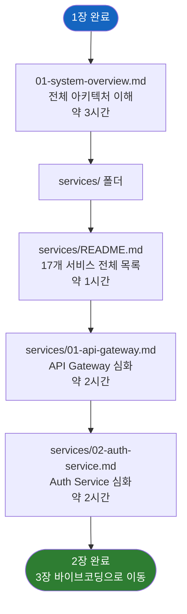

# 2장: 아키텍처 (Architecture)

> **문서 ID**: ONBOARD-02-README
> **버전**: 1.0.0 | **작성일**: 2026-04-11
> **학습 대상**: 1장을 완료한 팀원
> **선행 조건**: `01-getting-started/` 전체 완료

---

## 이 섹션 개요

1장에서 개발 환경을 설정하고 첫 PR을 제출했다면, 이제 시스템이 어떻게 설계되어 있는지 깊이 이해할 차례입니다. 이 섹션은 17개 서비스가 어떻게 협력하는지, 각 서비스의 역할이 무엇인지 구체적으로 설명합니다.

이 섹션을 공부하면 다음과 같은 상황에서 자신감 있게 작업할 수 있습니다.

- "이 요청은 어떤 서비스가 처리하는가?" 를 즉시 답할 수 있습니다.
- 서비스 간 통신 흐름을 따라가며 버그를 추적할 수 있습니다.
- 새 기능이 어느 서비스에 추가되어야 하는지 판단할 수 있습니다.

---

## 학습 순서

---

## 파일 목록

| 파일 | 내용 | 예상 학습 시간 |
|------|------|--------------|
| `01-system-overview.md` | 전체 시스템 아키텍처 (C4 다이어그램, 서비스 통신 흐름) | 3시간 |
| `services/README.md` | 17개 서비스 전체 목록 표 (포트, 역할, CSAP 매핑) | 1시간 |
| `services/01-api-gateway.md` | API Gateway 역할, 라우팅 규칙, Rate Limiting, 실제 코드 | 2시간 |
| `services/02-auth-service.md` | 인증 플로우, JWT, MFA, CSAP D-08 준수 방법, 실습 | 2시간 |

---

## 이 섹션 완료 후 할 수 있는 것

- 전체 17개 서비스 이름과 역할을 말할 수 있다
- 클라이언트 요청이 API Gateway → 서비스 → DB로 흐르는 경로를 설명할 수 있다
- API Gateway의 Rate Limiting이 어떻게 동작하는지 설명할 수 있다
- auth-service의 로그인 플로우를 단계별로 설명할 수 있다
- CSAP D-08 접근 제어가 코드에서 어떻게 구현되는지 보여줄 수 있다
