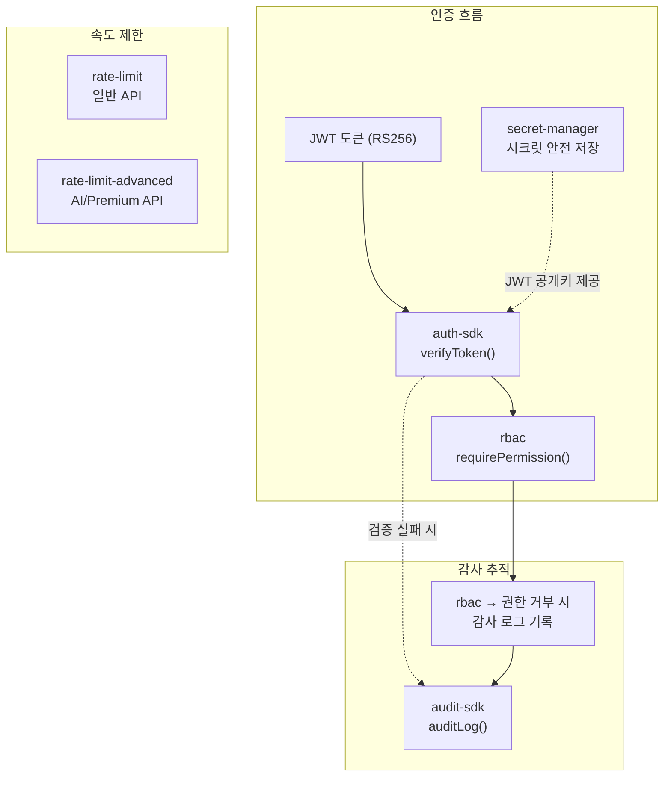
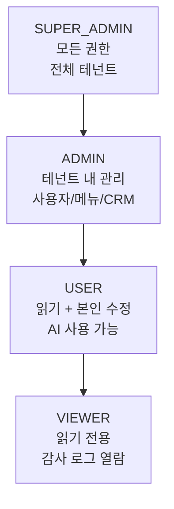
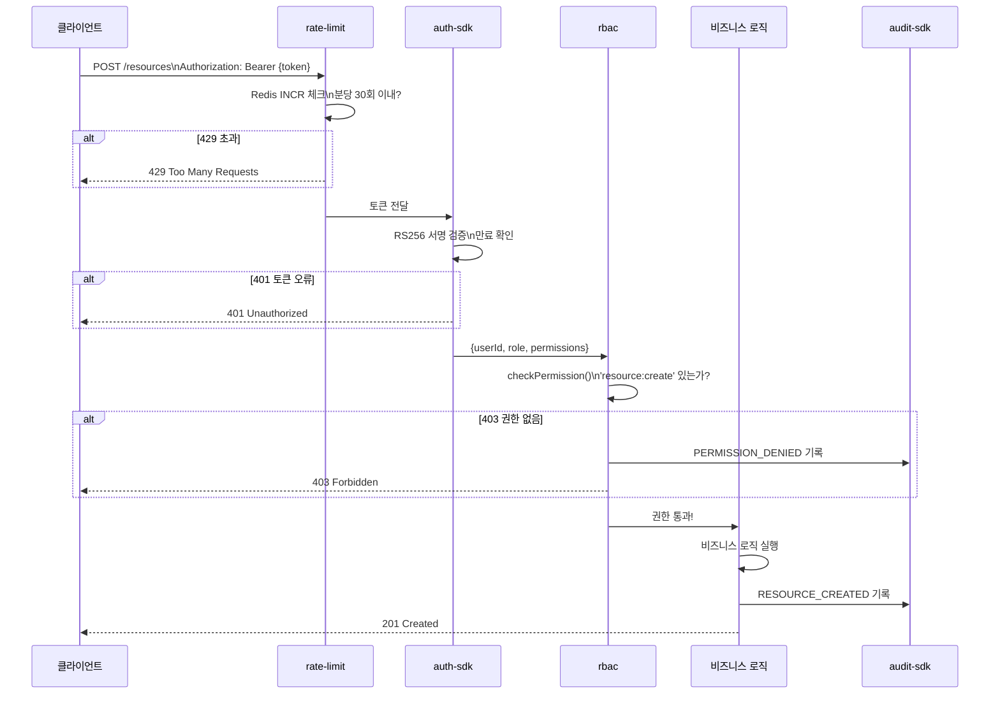

# 핵심 패키지 심화 가이드

> **문서 ID**: ONBOARD-02-PKG-01
> **버전**: 1.1.0 | **작성일**: 2026-04-12 | **작성자**: Implementer (Sonnet)
> **대상 패키지**: auth-sdk, rbac, audit-sdk, rate-limit, rate-limit-advanced, secret-manager
> **실제 파일 위치**: `/data/ai-saas/platform/packages/`
> **예상 학습 시간**: 2시간
> **CSAP 매핑**: D-06 (감사 로그), D-08 (접근 통제), D-09 (암호화), D-08-06 (무차별 대입 방어)

---

## 목차

1. [패키지 간 관계](#1-패키지-간-관계)
2. [auth-sdk](#2-auth-sdk-public-saasauth-sdk)
3. [rbac](#3-rbac-public-saasrbac)
4. [audit-sdk](#4-audit-sdk-public-saasaudit-sdk)
5. [rate-limit vs rate-limit-advanced](#5-rate-limit-vs-rate-limit-advanced)
6. [secret-manager](#6-secret-manager-public-saassecret-manager)
7. [패키지 조합 패턴](#7-패키지-조합-패턴-실제-서비스-구현)
8. [초보자 실습](#8-초보자-실습)

---

## 1. 패키지 간 관계



**요청이 들어왔을 때 패키지 실행 순서:**

```
HTTP 요청 → rate-limit 체크 → auth-sdk JWT 검증 → rbac 권한 검사 → 비즈니스 로직 → audit-sdk 로그 기록
```

---

## 1. auth-sdk (`@public-saas/auth-sdk`)

**경로**: `platform/packages/auth-sdk/src/`
**Design Ref**: D-P00.3 인증 SDK

### 1.1 역할

auth-sdk는 JWT 토큰 검증 및 권한 확인 헬퍼 함수를 제공합니다. 주로 API 게이트웨이와 auth-service가 사용합니다.

### 1.2 주요 export

| 함수/상수 | 설명 |
|---------|------|
| `verifyToken(token, options)` | RS256 JWT 토큰 검증, 페이로드 반환 |
| `hasPermission(user, permission)` | 사용자가 특정 권한을 보유하는지 확인 |
| `requirePermissions(user, permissions[])` | 여러 권한 중 하나 이상 보유 확인 |
| `AUTH_CONSTANTS` | JWT 만료 시간 상수 (접근: 15분, 갱신: 7일) |

### 1.3 verifyToken 사용 예시

```typescript
import { verifyToken } from '@public-saas/auth-sdk';

export async function authMiddleware(req: Request) {
  const token = req.headers.get('authorization')?.replace('Bearer ', '');
  if (!token) throw new Error('토큰 없음');

  // CSAP D-08-01: RS256 알고리즘 검증
  const payload = await verifyToken(token, {
    publicKey: process.env.JWT_PUBLIC_KEY!,
    // algorithms 기본값: ['RS256']
  });

  return payload;
  // payload: { userId, tenantId, role, permissions, exp, iat }
}
```

### 1.4 hasPermission 사용 예시

```typescript
import { hasPermission } from '@public-saas/auth-sdk';

const user = await verifyToken(token, { publicKey: process.env.JWT_PUBLIC_KEY! });

// SUPER_ADMIN은 항상 true
if (!hasPermission(user, 'tenant:create')) {
  return Response.json({ error: 'Forbidden' }, { status: 403 });
}
```

### 1.5 AUTH_CONSTANTS

```typescript
import { AUTH_CONSTANTS } from '@public-saas/auth-sdk';

// AUTH_CONSTANTS.ACCESS_TOKEN_EXPIRY  = '15m'
// AUTH_CONSTANTS.REFRESH_TOKEN_EXPIRY = '7d'
// AUTH_CONSTANTS.MAX_SESSIONS         = 3  (동시 세션 최대)
```

---

## 2. rbac (`@public-saas/rbac`)

**경로**: `platform/packages/rbac/src/`
**Design Ref**: SVC-RBAC-R8 Plan

### 2.1 역할

RBAC(Role-Based Access Control) 엔진 및 Fastify 플러그인을 제공합니다. 모든 백엔드 서비스가 `rbacPlugin`을 등록하고 `requirePermission()` 미들웨어로 엔드포인트를 보호합니다.

### 2.2 역할 체계 (CSAP D-08-03: 최소 권한 원칙)



**역할별 권한 요약:**

| 권한 | SUPER_ADMIN | ADMIN | USER | VIEWER |
|------|:-----------:|:-----:|:----:|:------:|
| tenant:create/delete | O | - | - | - |
| tenant:read/update | O | O | O | O |
| user:create/delete | O | O | - | - |
| user:update | O | O | self만 | - |
| billing:manage | O | O | - | - |
| catalog:manage | O | O | - | - |
| menu:manage | O | O | - | - |
| security:manage | O | - | - | - |
| audit:read | O | O | - | O |
| ai:chat | O | O | O | - |
| crm:delete | O | - | - | - |

### 2.3 서비스에 rbacPlugin 등록

```typescript
import { rbacPlugin } from '@public-saas/rbac';
import { createServiceAuditLogger } from '@public-saas/audit-sdk';

const auditLog = createServiceAuditLogger('my-service', 'permission');

await app.register(rbacPlugin, {
  // 선택: 권한 거부 시 감사 로그 기록 (CSAP D-06)
  auditLogger: (event) => {
    if (!event.allowed) {
      void auditLog(
        event.action, event.actor, event.permission,
        'system', event.ip, 'rbac-check'
      );
    }
  },
});
```

### 2.4 requirePermission() 미들웨어 사용

```typescript
import { requirePermission, requireAnyPermission } from '@public-saas/rbac';

// 단일 권한 검사
app.post('/tenants', {
  preHandler: requirePermission('tenant:create'),
}, createTenantHandler);

// OR 조건: 여러 권한 중 하나
app.get('/tenants/:id', {
  preHandler: requireAnyPermission('tenant:read', 'tenant:manage'),
}, getTenantHandler);

// 'self' 권한: 본인 데이터만 수정 가능
app.put('/users/:id', {
  preHandler: requirePermission('user:update', { targetUserIdParam: 'id' }),
}, updateUserHandler);
```

### 2.5 RBACEngine 직접 사용

```typescript
import { rbac } from '@public-saas/rbac';

// 권한 확인
const result = rbac.checkPermission(
  { userId: 'u1', tenantId: 't1', role: 'ADMIN' },
  'crm:delete'
);
// { allowed: false, reason: 'ADMIN 역할에 crm:delete 권한이 없습니다' }

// 역할별 전체 권한 목록
const perms = rbac.listPermissions('USER');
// ['tenant:read', 'user:read', 'user:update', 'billing:read', ...]
```

### 2.6 커스텀 권한 (테넌트별 오버라이드)

```typescript
// UserContext에 customPermissions 추가
const userContext = {
  userId: 'u1',
  tenantId: 't1',
  role: 'USER' as Role,
  customPermissions: {
    'crm:create': true,   // USER이지만 이 테넌트에서는 CRM 생성 허용
    'audit:read': false,  // 기본 허용이지만 이 테넌트에서는 차단
  },
};
```

---

## 3. audit-sdk (`@public-saas/audit-sdk`)

**경로**: `platform/packages/audit-sdk/src/`
**Design Ref**: D-P00.4
**CSAP**: D-06-01 침해사고 관리

### 3.1 역할

CSAP D-06 준수를 위한 불변(append-only) 감사 로그 시스템을 제공합니다. SHA-256 해시 체인으로 로그 무결성을 보장합니다.

### 3.2 표준 감사 로그 함수 생성 (권장 패턴)

14개 서비스 모두가 동일한 패턴으로 감사 로그를 기록합니다. `createServiceAuditLogger()`가 서비스별 표준 함수를 제공합니다.

```typescript
import { createServiceAuditLogger } from '@public-saas/audit-sdk';

// 서비스 시작 시 한 번 초기화 (lib/audit.ts)
export const logUserEvent = createServiceAuditLogger('user-service', 'user');

// 핸들러에서 사용
await logUserEvent(
  'USER_CREATED',     // action
  request.userId,     // actor (행위자)
  newUser.id,         // target (대상 리소스 ID)
  request.tenantId,   // tenantId
  request.ip,         // IP 주소
  request.userAgent,  // User-Agent
  { email: newUser.email }  // metadata (선택)
);
```

### 3.3 AuditLogger 직접 사용

```typescript
import { createAuditLogger, createStandardTransport } from '@public-saas/audit-sdk';

const logger = createAuditLogger({
  serviceName: 'my-service',
  defaultTenantId: 'platform',
  // transport: stdout NDJSON + audit-service HTTP POST
  transport: createStandardTransport('my-service'),
});

await logger.log({
  actor: 'admin-001',
  action: 'TENANT_DELETED',
  target: 'tenant-abc',
  targetType: 'tenant',
  tenantId: 'platform',
  ip: '10.0.0.1',
  userAgent: 'Mozilla/5.0...',
  metadata: { reason: '계약 만료' },
});
```

### 3.4 SHA-256 해시 체인 원리

```
로그 1: { ...data, hash: H(data1), previousHash: "000...0" }
로그 2: { ...data, hash: H(data2 + H(data1)), previousHash: H(data1) }
로그 3: { ...data, hash: H(data3 + H(data2)), previousHash: H(data2) }
```

중간 로그가 변조되면 이후 모든 로그의 해시가 깨집니다. 감사 서비스가 주기적으로 체인 무결성을 검증합니다.

### 3.5 표준 감사 이벤트 코드

| 카테고리 | 이벤트 코드 |
|---------|-----------|
| 인증 | USER_LOGIN, USER_LOGOUT, TOKEN_REFRESH |
| 사용자 | USER_CREATED, USER_UPDATED, USER_DELETED |
| 테넌트 | TENANT_CREATED, TENANT_UPDATED, TENANT_DELETED |
| 구독 | SUBSCRIPTION_CREATED, SUBSCRIPTION_CANCELLED |
| 결제 | INVOICE_CREATED, PAYMENT_PROCESSED |
| CRM | CUSTOMER_CREATED, CUSTOMER_UPDATED, CONTRACT_CREATED, CONTRACT_UPDATED |
| 메뉴 | MENU_CREATED, MENU_UPDATED, MENU_DELETED, MENU_REORDERED |
| 보안 | PERMISSION_DENIED, SUSPICIOUS_ACTIVITY, RATE_LIMIT_EXCEEDED |

---

## 4. rate-limit vs rate-limit-advanced

두 패키지는 서로 다른 알고리즘을 사용하며 목적이 다릅니다.

### 4.1 rate-limit (`@public-saas/rate-limit`) — 고정 윈도우

**알고리즘**: Redis INCR + EXPIRE (Fixed Window Counter)
**특징**: 구현이 단순하고 Redis 의존성이 있음. Redis 미연결 시 통과(가용성 우선).
**사용 대상**: 전체 서비스의 표준 Rate Limiting

```typescript
import { createRateLimiter } from '@public-saas/rate-limit';

// 읽기 API: IP당 분당 100회
const readLimiter = createRateLimiter(100, 60, 'rl:user:read');

// 쓰기 API: IP당 분당 30회
const writeLimiter = createRateLimiter(30, 60, 'rl:user:write');

// 삭제 API: IP당 5분당 10회
const deleteLimiter = createRateLimiter(10, 300, 'rl:user:delete');

// Fastify 라우트에 적용
app.post('/users', {
  preHandler: writeLimiter,
}, createUserHandler);
```

**응답 헤더:**
```
X-RateLimit-Limit: 30
X-RateLimit-Remaining: 28
X-RateLimit-Reset: 45
```

**한계**: 윈도우 경계에서 두 배 트래픽 허용 가능 (버스트 문제)

### 4.2 rate-limit-advanced (`@public-saas/rate-limit-advanced`) — 슬라이딩 윈도우

**알고리즘**: Sliding Window Counter (메모리 기반)
**특징**: 더 정밀한 제한. 테넌트별 구분 가능. Redis 미의존.
**사용 대상**: AI 서비스, API Gateway 고급 제한

```typescript
import { SlidingWindowCounter } from '@public-saas/rate-limit-advanced';

const counter = new SlidingWindowCounter(60_000);  // 60초 윈도우

// 요청 처리 시
const result = counter.increment(`tenant:${tenantId}`, 100);
// result: { count, limit: 100, remaining, exceeded, retryAfterMs }

if (result.exceeded) {
  reply.status(429).send({
    error: 'RATE_LIMIT_EXCEEDED',
    retryAfterMs: result.retryAfterMs,
  });
  return;
}
```

**Fixed Window vs Sliding Window 비교:**

| 항목 | rate-limit (고정) | rate-limit-advanced (슬라이딩) |
|------|:-----------------:|:-----------------------------:|
| 알고리즘 | Redis INCR+EXPIRE | 메모리 내 슬라이딩 윈도우 |
| 버스트 방어 | 보통 | 우수 |
| Redis 의존 | 필요 | 불필요 |
| 테넌트별 구분 | IP 기준 | 임의 키 기준 |
| 분산 환경 | 지원 (Redis 공유) | 미지원 (서버별 독립) |
| 추천 용도 | 일반 API 보호 | AI 사용량 제한 |

### 4.3 언제 어느 것을 사용하는가?

```
일반 REST API 엔드포인트 → rate-limit (Redis 기반 공유 상태)
AI 채팅/RAG API         → rate-limit-advanced (테넌트별 세밀 제어)
API Gateway 전체 제한   → 두 패키지 함께 적용 (다계층)
```

---

## 5. secret-manager (`@public-saas/secret-manager`)

**경로**: `platform/packages/secret-manager/src/`
**Design Ref**: SVC-SECRETMGR-R24 Plan
**CSAP**: D-09 암호화 (AES-256-GCM)

### 5.1 역할

시크릿(API 키, 비밀번호, 토큰)을 AES-256-GCM으로 암호화하여 메모리에 저장합니다. 저장소에 없는 시크릿은 환경 변수에서 폴백 조회합니다.

**핵심 보안 요건:**
- 하드코딩 시크릿 절대 금지 (CSAP D-09)
- 모든 시크릿 접근 감사 로깅
- TTL 기반 자동 만료 지원

### 5.2 SecretManager 초기화

```typescript
import { SecretManager } from '@public-saas/secret-manager';

// 서비스 시작 시 초기화
const secrets = new SecretManager({
  masterKey: process.env.SECRET_MASTER_KEY!,  // 32바이트 이상 권장
  enableEnvFallback: true,  // 환경 변수 폴백 (기본: true)
  maxAuditEntries: 1000,
  expirationCheckIntervalMs: 60_000,  // 1분마다 만료 체크
});
```

### 5.3 시크릿 저장 및 조회

```typescript
// 시크릿 저장 (AES-256-GCM 암호화)
secrets.set('AI_API_KEY', 'sk-xxx...', 3600_000);  // 1시간 TTL

// 시크릿 조회 (복호화)
const apiKey = secrets.get('AI_API_KEY');
// 1순위: 메모리 저장소 복호화
// 2순위: process.env['AI_API_KEY'] 폴백
// 없으면: undefined

// 존재 확인 (만료 체크 포함)
if (!secrets.has('AI_API_KEY')) {
  throw new Error('AI_API_KEY가 없습니다. 환경변수를 확인하세요.');
}

// 이름 목록 조회 (값은 노출하지 않음)
const names = secrets.listNames();  // ['AI_API_KEY', 'DB_PASSWORD', ...]
```

### 5.4 감사 로그 확인

```typescript
const auditLog = secrets.getAuditLog();
// [
//   { action: 'set', name: 'AI_API_KEY', success: true, timestamp: '...' },
//   { action: 'get', name: 'AI_API_KEY', success: true, source: 'store', timestamp: '...' },
// ]
```

### 5.5 Fastify 플러그인으로 등록

```typescript
import { secretPlugin } from '@public-saas/secret-manager';

await app.register(secretPlugin, {
  masterKey: process.env.SECRET_MASTER_KEY!,
  // 이후 app.secrets.get('KEY_NAME')으로 접근
});

// 라우트에서 사용
app.get('/ai/config', async (request) => {
  const apiKey = request.server.secrets.get('AI_API_KEY');
  if (!apiKey) throw new Error('AI_API_KEY 미설정');
  // ...
});
```

### 5.6 AES-256-GCM 암호화 구조

```
masterKey → scrypt → derivedKey (32바이트)
                        ↓
plaintext + IV(12바이트) → AES-256-GCM → { encrypted, authTag }

복호화 시 authTag 검증 → 무결성 보장
```

---

## 6. 패키지 조합 패턴 (실제 서비스 구현)

실제 서비스에서 핵심 패키지들이 어떻게 조합되는지 보여주는 표준 패턴입니다.

```typescript
// 서비스 진입점 (index.ts)
import { initTelemetry } from '@public-saas/observability';
initTelemetry({ serviceName: 'my-service', serviceVersion: '1.0.0' });

import Fastify from 'fastify';
import { healthPlugin, CommonCheckers } from '@public-saas/health';
import { rbacPlugin } from '@public-saas/rbac';
import { meshReadyPlugin } from '@public-saas/mesh-ready';
import { tenantIsolationPlugin } from '@public-saas/tenant-isolation';

const app = Fastify({ logger: true });

await app.register(meshReadyPlugin, { service: { name: 'my-service' } });
await app.register(healthPlugin, {
  serviceName: 'my-service',
  checkers: [CommonCheckers.database(prisma)],
});
await app.register(rbacPlugin, {});
await app.register(tenantIsolationPlugin, {
  masterKey: process.env.TENANT_MASTER_KEY,
  requireTenantHeader: true,
  excludePaths: ['/health', '/ready'],
});
```

```typescript
// 라우트 등록 (routes.ts)
import { createRateLimiter } from '@public-saas/rate-limit';
import { requirePermission } from '@public-saas/rbac';

const readLimiter = createRateLimiter(100, 60, 'rl:my:read');
const writeLimiter = createRateLimiter(30, 60, 'rl:my:write');

app.get('/resources', {
  preHandler: [readLimiter, requirePermission('resource:read')],
}, listHandler);

app.post('/resources', {
  preHandler: [writeLimiter, requirePermission('resource:create')],
}, createHandler);
```

```typescript
// 핸들러 (handler.ts)
import { createServiceAuditLogger } from '@public-saas/audit-sdk';

const logEvent = createServiceAuditLogger('my-service', 'resource');

export async function createHandler(request, reply) {
  // 1. 입력 검증 (CSAP D-12)
  const parseResult = schema.safeParse(request.body);
  if (!parseResult.success) { /* 400 */ }

  // 2. 비즈니스 로직
  const resource = await prisma.resource.create({ data: parseResult.data });

  // 3. 감사 로그 (CSAP D-06)
  await logEvent(
    'RESOURCE_CREATED', request.userContext?.userId ?? 'system',
    resource.id, request.userContext?.tenantId ?? 'platform',
    request.ip, request.headers['user-agent'] ?? 'unknown',
  );

  await reply.status(201).send({ success: true, data: resource });
}
```

---

## 8. 초보자 실습

### 실습 목표

auth-sdk와 rbac 패키지를 직접 사용하여 권한 검사 로직을 작성합니다. 실제 서비스 코드를 흉내 낸 예제입니다.

### 실습 1: RBAC 권한 확인

```typescript
// 터미널에서 REPL로 테스트
// cd /data/ai-saas && node --loader ts-node/esm

import { rbac } from '@public-saas/rbac';

// 테스트 1: SUPER_ADMIN이 tenant:delete를 할 수 있는가?
const result1 = rbac.checkPermission(
  { userId: 'user-001', tenantId: 'tenant-001', role: 'SUPER_ADMIN' },
  'tenant:delete'
);
console.log(result1);
// → { allowed: true }

// 테스트 2: USER가 tenant:delete를 할 수 있는가?
const result2 = rbac.checkPermission(
  { userId: 'user-002', tenantId: 'tenant-001', role: 'USER' },
  'tenant:delete'
);
console.log(result2);
// → { allowed: false, reason: 'USER 역할에 tenant:delete 권한이 없습니다' }

// 테스트 3: USER가 자신의 데이터를 수정할 수 있는가?
const result3 = rbac.checkPermission(
  { userId: 'user-003', tenantId: 'tenant-001', role: 'USER' },
  'user:update',
  'user-003'  // targetUserId = 본인 ID
);
console.log(result3);
// → { allowed: true, selfOnly: true }

// 테스트 4: USER가 다른 사람 데이터를 수정할 수 있는가?
const result4 = rbac.checkPermission(
  { userId: 'user-003', tenantId: 'tenant-001', role: 'USER' },
  'user:update',
  'user-999'  // targetUserId = 다른 사람 ID
);
console.log(result4);
// → { allowed: false, selfOnly: true, reason: '본인 데이터만 접근 가능합니다' }

// 테스트 5: USER의 전체 권한 목록
const perms = rbac.listPermissions('USER');
console.log(perms);
// → ['tenant:read', 'user:read', 'user:update', 'billing:read', ...]
```

### 실습 2: AUTH_CONSTANTS 확인

```typescript
import { AUTH_CONSTANTS } from '@public-saas/auth-sdk';

// CSAP D-08 요건 확인
console.log('접근 토큰 만료:', AUTH_CONSTANTS.ACCESS_TOKEN_EXPIRES_SECONDS, '초 (15분)');
console.log('갱신 토큰 만료:', AUTH_CONSTANTS.REFRESH_TOKEN_EXPIRES_SECONDS, '초 (7일)');
console.log('최대 동시 세션:', AUTH_CONSTANTS.MAX_CONCURRENT_SESSIONS, '개');
console.log('로그인 실패 허용:', AUTH_CONSTANTS.MAX_LOGIN_ATTEMPTS, '회');
console.log('계정 잠금 시간:', AUTH_CONSTANTS.ACCOUNT_LOCK_DURATION_SECONDS, '초 (30분)');
console.log('bcrypt 강도:', AUTH_CONSTANTS.BCRYPT_SALT_ROUNDS);
console.log('JWT 알고리즘:', AUTH_CONSTANTS.JWT_ALGORITHM);  // RS256
```

### 실습 3: 권한 검사 시퀀스 다이어그램 이해



### 실습 완료 체크

- [ ] `rbac.checkPermission()` 4가지 시나리오 실행 확인
- [ ] `AUTH_CONSTANTS` 값과 CSAP D-08 요건 매핑 이해
- [ ] 시퀀스 다이어그램에서 패키지 실행 순서 파악
- [ ] `rbac.listPermissions('ADMIN')`과 `rbac.listPermissions('USER')` 차이 확인

---

## 변경 이력

| 버전 | 일자 | 내용 | 작성자 |
|------|------|------|------|
| 1.0.0 | 2026-04-11 | 최초 작성 | Implementer (Sonnet) |
| 1.1.0 | 2026-04-12 | 패키지 간 관계 다이어그램, 실습 섹션 추가 | Implementer (Sonnet) |
```
