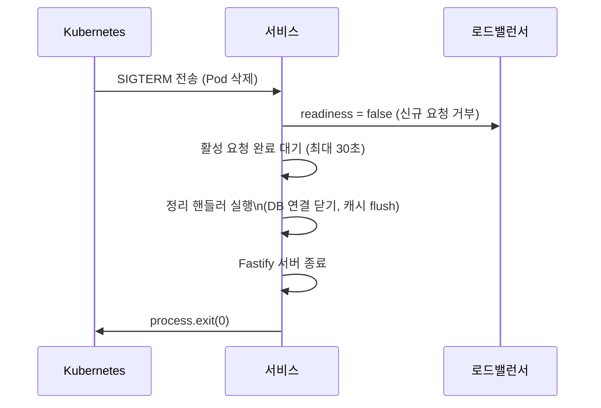
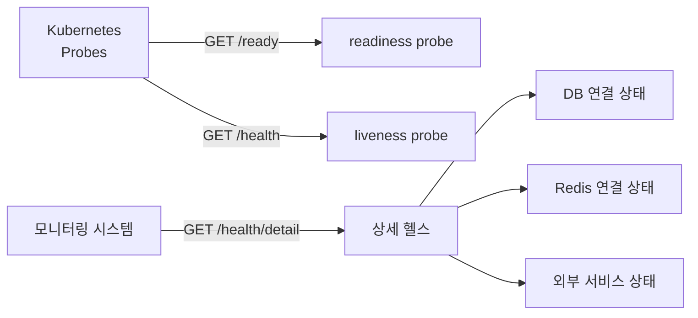
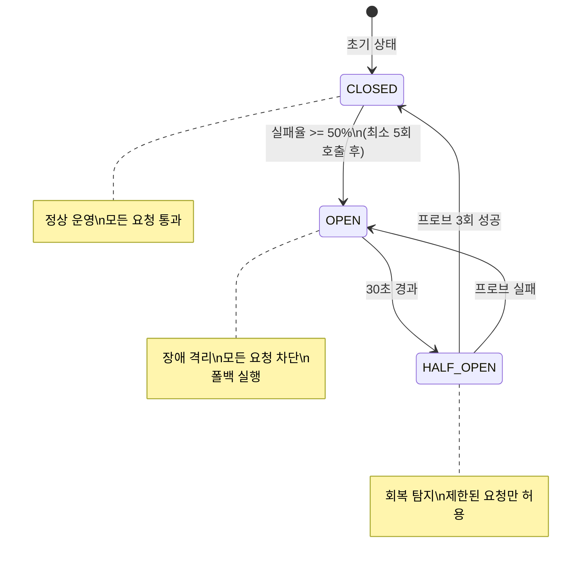
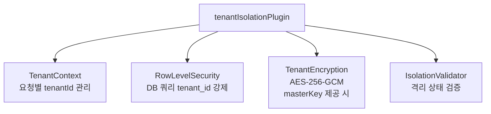
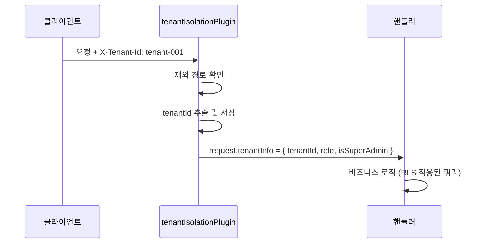
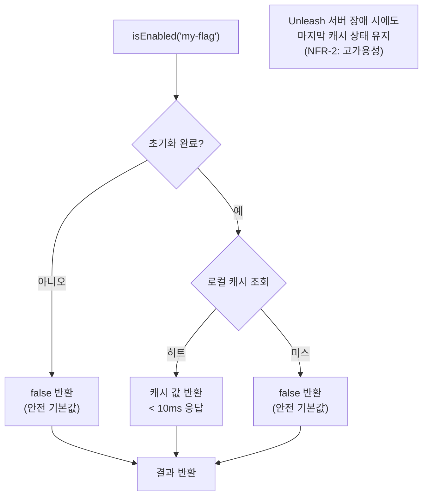
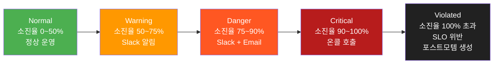
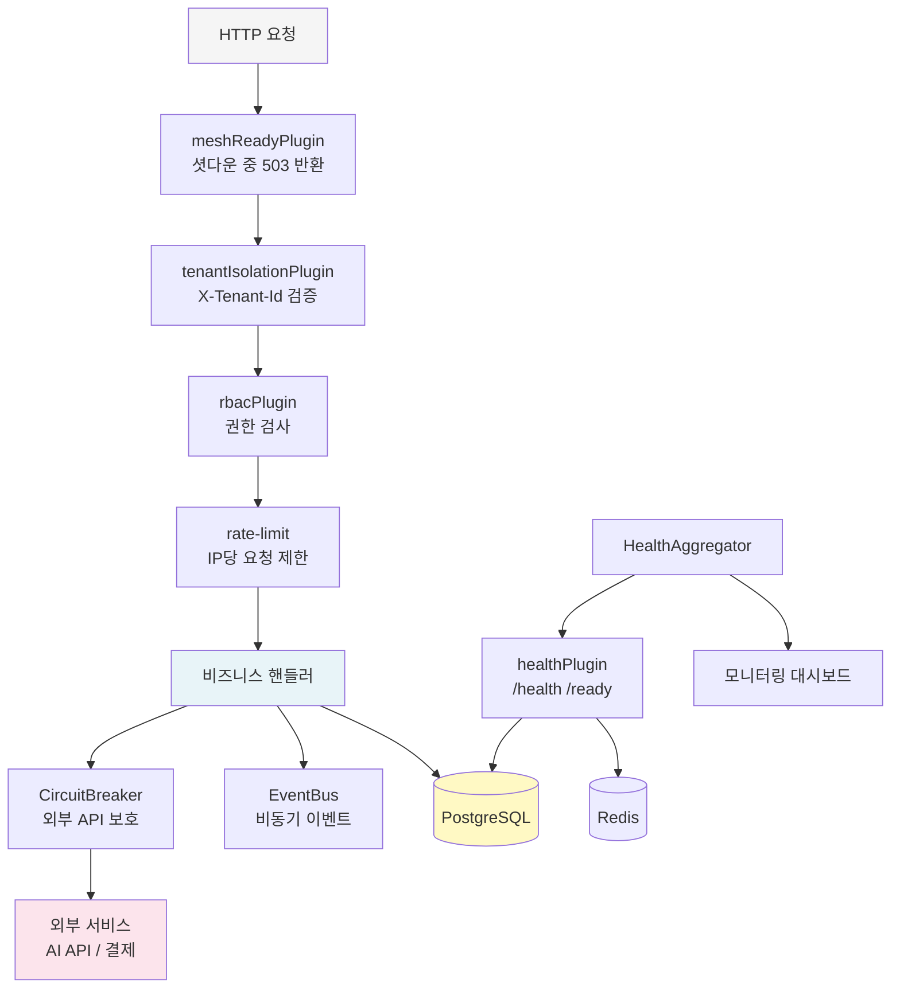

# 인프라 패키지 심화 가이드

> **문서 ID**: ONBOARD-02-PKG-02
> **버전**: 1.1.0 | **작성일**: 2026-04-12 | **작성자**: Implementer (Sonnet)
> **대상 패키지**: mesh-ready, health, health-aggregator, circuit-breaker, event-bus, tenant-isolation, feature-flag-sdk, slo-escalation
> **실제 파일 위치**: `/data/ai-saas/platform/packages/` + `/data/ai-saas/packages/`
> **예상 학습 시간**: 2시간 30분
> **CSAP 매핑**: D-07 (가용성 관리), D-08 (접근 통제), D-09 (암호화), D-14 (시스템 가용성)

---

## 목차

1. [인프라 패키지 전체 관계도](#1-인프라-패키지-전체-관계도)
2. [mesh-ready](#2-mesh-ready-public-saasmesh-ready)
3. [health + health-aggregator](#3-health--health-aggregator)
4. [circuit-breaker](#4-circuit-breaker-public-saascircuit-breaker)
5. [event-bus](#5-event-bus-public-saasevent-bus)
6. [tenant-isolation](#6-tenant-isolation-public-saasmtenant-isolation)
7. [feature-flag-sdk](#7-feature-flag-sdk-루트-packages)
8. [slo-escalation](#8-slo-escalation-루트-packages)
9. [인프라 패키지 통합 아키텍처](#9-인프라-패키지-통합-아키텍처)
10. [초보자 실습](#10-초보자-실습)

---

## 1. 인프라 패키지 전체 관계도

```mermaid
graph TD
    subgraph "요청 처리 계층"
        MR["mesh-ready\nSIGTERM 셧다운\n분산 추적 헤더"]
        TI["tenant-isolation\n테넌트 경계 강제\nRLS 자동 적용"]
    end

    subgraph "가용성 계층"
        H["health\n/health /ready\nK8s 프로브"]
        HA["health-aggregator\n14개 서비스 집계\n단일 플랫폼 뷰"]
        CB["circuit-breaker\n외부 서비스 장애 격리\n폴백 자동 실행"]
    end

    subgraph "통신·확장 계층"
        EB["event-bus\n비동기 pub/sub\n와일드카드 패턴"]
    end

    subgraph "DevOps/SRE 계층 (루트 packages/)"]
        FF["feature-flag-sdk\nUnleash 연동\n기능 플래그"]
        SLO["slo-escalation\n에러버짓 추적\n자동 에스컬레이션"]
    end

    MR --> TI --> H
    H --> HA
    CB --> EB
    FF -.->|"기능 토글"| MR
    SLO -.->|"SLO 위반 감지"| HA

    style MR fill:#E8F5E9
    style TI fill:#E8F5E9
    style H fill:#E3F2FD
    style HA fill:#E3F2FD
    style CB fill:#FFF3E0
    style EB fill:#FFF3E0
    style FF fill:#FCE4EC
    style SLO fill:#FCE4EC
```

---

## 1. mesh-ready (`@public-saas/mesh-ready`)

**경로**: `platform/packages/mesh-ready/src/`
**Design Ref**: SVC-MESH-R13 Plan

### 1.1 역할

Kubernetes 환경에서 안전한 서비스 종료(Graceful Shutdown)를 보장합니다. SIGTERM 수신 시 진행 중인 요청을 완료한 후 종료합니다.

### 1.2 GracefulShutdown 종료 순서



### 1.3 meshReadyPlugin 등록

```typescript
import { meshReadyPlugin } from '@public-saas/mesh-ready';
import { shutdownTelemetry } from '@public-saas/observability';

await app.register(meshReadyPlugin, {
  service: {
    name: 'my-service',
    version: '1.0.0',
  },
  shutdown: {
    timeout: 30_000,  // 30초 (k8s terminationGracePeriodSeconds와 일치)
    cleanupHandlers: [
      async () => { await prisma.$disconnect(); },     // DB 연결 해제
      async () => { await shutdownTelemetry(); },      // OpenTelemetry flush
      async () => { await redisClient.disconnect(); }, // Redis 연결 해제
    ],
  },
});
```

### 1.4 셧다운 중 요청 처리

```typescript
// meshReadyPlugin이 onRequest 훅에 자동 등록
// 셧다운 중 요청 수신 시 자동으로 503 반환:
{
  "error": "Service Unavailable",
  "message": "서비스가 종료 중입니다",
  "code": "SERVICE_SHUTTING_DOWN"
}
```

### 1.5 GracefulShutdown 직접 사용

```typescript
import { GracefulShutdown } from '@public-saas/mesh-ready';

const shutdown = new GracefulShutdown({
  timeout: 30_000,
  cleanupHandlers: [async () => { /* 정리 */ }],
});

// Fastify에 통합 (SIGTERM/SIGINT 자동 등록)
shutdown.registerWithFastify(app);

// 수동 종료
await shutdown.shutdown(app);
```

---

## 2. health + health-aggregator

### 2.1 health (`@public-saas/health`)

**경로**: `platform/packages/health/src/`
**Design Ref**: SVC-HEALTH-R10 Plan
**CSAP**: D-07 가용성



**등록 방법:**
```typescript
import { healthPlugin, CommonCheckers } from '@public-saas/health';

await app.register(healthPlugin, {
  serviceName: 'user-service',
  version: '1.2.0',
  checkers: [
    // DB 헬스체커 (Prisma)
    CommonCheckers.database(prisma),

    // Redis 헬스체커
    CommonCheckers.redis(redisClient),

    // 커스텀 체커 (외부 서비스)
    {
      name: 'ai-gateway',
      check: async () => {
        const res = await fetch('http://ai-gateway/health');
        return { healthy: res.ok };
      },
      timeout: 3000,  // 3초 타임아웃
    },
  ],
});
```

**노출되는 엔드포인트:**

| 경로 | 설명 | k8s Probe |
|------|------|-----------|
| `/health` | 기본 liveness 상태 | livenessProbe |
| `/ready` | readiness 상태 (의존성 포함) | readinessProbe |
| `/health/detail` | 의존성 상세 상태 및 SLA | 모니터링 |
| `/health/sla` | SLA 메트릭 (업타임 %) | 대시보드 |

**응답 구조 (`/health/detail`):**
```json
{
  "service": "user-service",
  "status": "healthy",
  "version": "1.2.0",
  "uptime": 86400,
  "timestamp": "2026-04-11T09:00:00.000Z",
  "dependencies": [
    {
      "name": "database",
      "status": "healthy",
      "responseTimeMs": 12,
      "lastChecked": "2026-04-11T09:00:00.000Z"
    },
    {
      "name": "ai-gateway",
      "status": "degraded",
      "responseTimeMs": 2800,
      "message": "응답 지연 감지",
      "lastChecked": "2026-04-11T09:00:00.000Z"
    }
  ]
}
```

**상태 정의:**
- `healthy`: 모든 의존성 정상
- `degraded`: 일부 의존성 지연/경고 (서비스는 계속 운영)
- `unhealthy`: 핵심 의존성 장애 (readiness probe 실패)

### 2.2 health-aggregator (`@public-saas/health-aggregator`)

**경로**: `platform/packages/health-aggregator/src/`

14개 서비스의 헬스 상태를 집계하여 단일 뷰로 제공합니다. 모니터링 대시보드와 알림 시스템에서 사용합니다.

```typescript
import { HealthAggregator } from '@public-saas/health-aggregator';

const aggregator = new HealthAggregator({
  services: [
    { name: 'api-gateway', url: 'http://api-gateway:4000' },
    { name: 'auth-service', url: 'http://auth-service:3001' },
    { name: 'user-service', url: 'http://user-service:3002' },
    // ... 나머지 서비스
  ],
  checkIntervalMs: 30_000,  // 30초마다 집계
});

// 전체 플랫폼 상태 조회
const platformHealth = await aggregator.aggregate();
// {
//   overall: 'healthy' | 'degraded' | 'unhealthy',
//   services: [ { name, status, responseTimeMs }, ... ],
//   summary: { healthy: 12, degraded: 1, unhealthy: 0 }
// }
```

---

## 3. circuit-breaker (`@public-saas/circuit-breaker`)

**경로**: `platform/packages/circuit-breaker/src/`
**Design Ref**: SVC-CIRCUIT-R25 DESIGN
**CSAP**: D-14 시스템 가용성

### 3.1 역할

외부 서비스(AI API, 외부 결제, 메일 서버)의 연속 장애 시 캐스케이딩 실패를 방지합니다.

### 3.2 3-상태 패턴



### 3.3 기본 사용법

```typescript
import { CircuitBreaker } from '@public-saas/circuit-breaker';

const aiCircuit = new CircuitBreaker({
  name: 'ai-api',
  failureThreshold: 0.5,    // 50% 실패율 초과 시 OPEN
  minimumCalls: 5,           // 최소 5회 호출 후 판단
  resetTimeoutMs: 30_000,    // 30초 후 HALF_OPEN 전환
  halfOpenMaxCalls: 3,       // HALF_OPEN에서 프로브 3회
  windowSizeMs: 60_000,      // 60초 윈도우
  fallback: (error) => ({    // OPEN 상태 폴백
    message: 'AI 서비스 일시 불가. 잠시 후 재시도하세요.',
    cached: true,
  }),
});

// 사용
const result = await aiCircuit.execute(async () => {
  return await fetch('https://ai-gateway/v1/chat', { ... });
});
```

### 3.4 상태 모니터링

```typescript
const metrics = aiCircuit.getMetrics();
// {
//   name: 'ai-api',
//   state: 'CLOSED',
//   totalCalls: 1000,
//   successCalls: 950,
//   failureCalls: 50,
//   failureRate: 0.05,     // 5%
//   stateTransitions: 2,
//   lastStateChange: '2026-04-11T08:00:00.000Z',
//   windowCalls: 100
// }
```

### 3.5 AI 서비스에서의 실제 사용 패턴

```typescript
// platform/services/ai-service에서 외부 LLM API 호출 보호
const llmCircuit = new CircuitBreaker({
  name: 'llm-api',
  failureThreshold: 0.3,   // 30% 실패 시 차단 (AI API는 더 엄격)
  resetTimeoutMs: 60_000,  // 1분 후 재시도
  fallback: () => {
    // 폴백: 캐시된 응답 또는 사전 정의된 안내 메시지
    return { content: '현재 AI 서비스를 이용할 수 없습니다.', fallback: true };
  },
});

export async function callLLM(prompt: string) {
  return llmCircuit.execute(async () => {
    const response = await fetch(process.env.AI_GATEWAY_URL! + '/v1/chat', {
      method: 'POST',
      headers: { Authorization: `Bearer ${secrets.get('AI_API_KEY')}` },
      body: JSON.stringify({ prompt }),
    });
    if (!response.ok) throw new Error(`LLM API 오류: ${response.status}`);
    return response.json();
  });
}
```

---

## 4. event-bus (`@public-saas/event-bus`)

**경로**: `platform/packages/event-bus/src/`
**Design Ref**: SVC-EVENT-R17 Plan
**CSAP**: D-06 이벤트 추적

### 4.1 역할

프로세스 내 비동기 이벤트 pub/sub 시스템입니다. 서비스 간 결합도를 낮추고 이벤트 기반 아키텍처를 지원합니다.

**주요 기능:**
- 와일드카드 패턴 매칭 (`user.*`, `**`)
- 재시도 로직 (지수 백오프, 최대 3회)
- 데드레터 큐 (모든 재시도 실패 시 보존)
- 이벤트 통계 수집

### 4.2 기본 사용법

```typescript
import { EventBus } from '@public-saas/event-bus';

const eventBus = new EventBus({
  maxRetries: 3,
  retryBaseDelay: 100,    // 100ms → 200ms → 400ms (지수 백오프)
  maxDeadLetters: 1000,
});

// 이벤트 구독
eventBus.on('user.created', async (payload) => {
  const { userId, email, tenantId } = payload as { userId: string; email: string; tenantId: string };
  await sendWelcomeEmail(email);
  await notificationService.notify(tenantId, `새 사용자 ${userId} 등록`);
});

// 와일드카드 구독 (user.* 패턴)
eventBus.on('user.*', async (payload) => {
  await auditLog.record(payload);  // 모든 사용자 이벤트 감사 기록
});

// 이벤트 발행 (비동기, 모든 핸들러 완료 대기)
await eventBus.emit('user.created', {
  userId: 'u-001',
  email: 'kim@seoul.go.kr',
  tenantId: 'seoul-001',
});

// fire-and-forget (응답 대기 없음)
eventBus.emitSync('notification.sent', { notificationId: 'n-001' });
```

### 4.3 와일드카드 패턴

```
'user.created'     → 'user.created'만 매칭
'user.*'           → 'user.created', 'user.updated', 'user.deleted' 등
'user.**'          → 'user.created.v2', 'user.profile.updated' 등 깊은 경로
'**'               → 모든 이벤트
```

### 4.4 일회성 구독 (once)

```typescript
// 특정 이벤트를 딱 한 번만 처리
eventBus.once('tenant.setup.completed', async (payload) => {
  await initializeTenantDefaults(payload.tenantId);
  // 이후 동일 이벤트가 발행되어도 이 핸들러는 실행되지 않음
});
```

### 4.5 데드레터 큐 모니터링

```typescript
// 처리 실패한 이벤트 확인
const deadLetters = eventBus.getDeadLetters();
// [
//   {
//     event: 'email.send',
//     payload: { to: 'admin@gov.kr', subject: '...' },
//     error: 'SMTP 연결 실패',
//     timestamp: '2026-04-11T09:00:00.000Z',
//     attempts: 4
//   }
// ]

// 통계 조회
const stats = eventBus.getStats();
// { published: 1000, consumed: 995, failed: 5, listenerCount: 12, byEvent: {...} }
```

### 4.6 표준 이벤트 코드

| 카테고리 | 이벤트 | 페이로드 |
|---------|--------|---------|
| 사용자 | user.created | { userId, email, tenantId, role } |
| 사용자 | user.updated | { userId, tenantId, changedFields } |
| 테넌트 | tenant.created | { tenantId, name, plan } |
| 구독 | subscription.activated | { subscriptionId, tenantId, serviceId } |
| 구독 | subscription.cancelled | { subscriptionId, tenantId, reason } |
| 알림 | notification.requested | { type, recipient, data } |
| 결제 | payment.completed | { invoiceId, amount, tenantId } |

---

## 5. tenant-isolation (`@public-saas/tenant-isolation`)

**경로**: `platform/packages/tenant-isolation/src/`
**Design Ref**: SVC-TENANT-R14 Plan
**CSAP**: D-08 접근 통제, D-09 암호화

### 5.1 역할

멀티테넌트 데이터 격리를 자동화합니다. 모든 DB 쿼리에 `tenant_id` 필터를 강제 적용하고, 선택적으로 AES-256-GCM 테넌트별 암호화를 제공합니다.

### 5.2 내부 구성 요소



### 5.3 플러그인 등록

```typescript
import { tenantIsolationPlugin } from '@public-saas/tenant-isolation';

await app.register(tenantIsolationPlugin, {
  masterKey: process.env.TENANT_MASTER_KEY,  // hex 64자, 없으면 암호화 비활성화
  keyVersion: 1,
  tenantColumn: 'tenant_id',          // DB 컬럼명 (기본: 'tenant_id')
  requireTenantHeader: true,           // X-Tenant-Id 헤더 필수
  excludePaths: [                      // 테넌트 헤더 검사 제외 경로
    '/health', '/ready', '/metadata',
    '/health/detail', '/health/sla',
  ],
});
```

### 5.4 요청 처리 흐름



### 5.5 격리 검증 엔드포인트

`tenantIsolationPlugin`은 자동으로 `/tenant/isolation-check` 엔드포인트를 등록합니다.

```
GET /tenant/isolation-check
X-Tenant-Id: tenant-001

응답:
{
  "success": true,
  "data": {
    "tenantId": "tenant-001",
    "rlsActive": true,
    "encryptionActive": true,
    "contextValid": true
  }
}
```

### 5.6 테넌트별 암호화 사용 (선택)

```typescript
// 플러그인 등록 후 app.tenant.encryption 사용
app.post('/sensitive-data', async (request) => {
  if (!app.tenant.encryption) {
    throw new Error('암호화가 비활성화되어 있습니다. TENANT_MASTER_KEY를 설정하세요.');
  }

  const tenantId = request.tenantInfo?.tenantId ?? '';

  // 암호화 (AES-256-GCM)
  const encrypted = await app.tenant.encryption.encrypt(
    tenantId,
    JSON.stringify(sensitiveData)
  );

  await prisma.sensitiveRecord.create({
    data: { tenantId, payload: encrypted },
  });
});

app.get('/sensitive-data/:id', async (request) => {
  const record = await prisma.sensitiveRecord.findUnique({ where: { id: request.params.id } });
  const decrypted = await app.tenant.encryption!.decrypt(
    record.tenantId,
    record.payload
  );
  return JSON.parse(decrypted);
});
```

---

## 7. feature-flag-sdk (루트 packages/)

**경로**: `/data/ai-saas/packages/feature-flag-sdk/src/index.ts`
**Design Ref**: MTU-N234 SS4, FR-FF.3
**npm 이름**: `@public-saas/feature-flag-sdk`

### 7.1 역할

Unleash 오픈소스 기능 플래그 서버와 연동하여, 코드 배포 없이 기능을 켜고 끌 수 있게 합니다.

비유하자면, 집의 조명 스위치처럼 새 기능을 코드에 넣어 두고 스위치로 켜는 시점을 조절합니다. 배포 없이 위험한 기능을 끌 수 있어 안전합니다.

### 7.2 핵심 인터페이스

```typescript
// 실제 파일: packages/feature-flag-sdk/src/index.ts

export interface IFeatureFlagClient {
  initialize(): Promise<void>;    // Unleash 서버 연결 초기화
  isEnabled(flagName: string, context?: FeatureFlagContext): boolean;  // 플래그 평가
  getVariant(flagName: string, context?: FeatureFlagContext): string | undefined;  // A/B 변형
  getActiveFlags(): string[];     // 활성화된 플래그 목록
  destroy(): void;                // 연결 종료 (그레이스풀 셧다운 시)
}
```

### 7.3 클라이언트 생성 및 초기화

```typescript
import { createFeatureFlagClient } from '@public-saas/feature-flag-sdk';

// 팩토리 함수로 생성 (환경 변수 자동 로드)
const flags = createFeatureFlagClient({
  apiUrl: process.env.UNLEASH_API_URL,   // Unleash Edge 주소
  apiKey: process.env.UNLEASH_API_KEY,   // API 키 (하드코딩 금지 — CSAP D-09)
  appName: 'portal',
  refreshInterval: 15000,  // 15초마다 플래그 갱신
});

// 서비스 시작 시 초기화
await flags.initialize();

// 그레이스풀 셧다운 시 종료
process.on('SIGTERM', () => {
  flags.destroy();
});
```

### 7.4 플래그 평가

```typescript
// 단순 boolean 평가 (활성/비활성)
if (flags.isEnabled('new-ai-chat-ui')) {
  return renderNewChatUI();
} else {
  return renderOldChatUI();
}

// 사용자 컨텍스트 기반 평가 (특정 기관에만 활성화)
const isEnabled = flags.isEnabled('beta-feature', {
  userId: auth.userId,
  tenantId: auth.tenantId,
  environment: process.env.NODE_ENV,
});

// A/B 테스트: 변형 조회
const variant = flags.getVariant('checkout-button-color', {
  userId: auth.userId,
});
// variant: 'blue' | 'green' | undefined
```

### 7.5 플래그 상태와 폴백



### 7.6 FeatureFlagConfig 옵션

| 옵션 | 기본값 | 설명 |
|------|--------|------|
| `apiUrl` | `http://unleash-edge:3063/api` | Unleash API 주소 |
| `apiKey` | (필수) | API 키, 환경 변수로 관리 |
| `appName` | `saas-platform` | 앱 식별자 |
| `refreshInterval` | 15000ms | 플래그 갱신 주기 |
| `metricsInterval` | 60000ms | 메트릭 전송 주기 |

---

## 8. slo-escalation (루트 packages/)

**경로**: `/data/ai-saas/packages/slo-escalation/src/`
**Design Ref**: MTU-N178 §3, FR-SLO.1~6
**npm 이름**: `@public-saas/slo-escalation`

이 패키지는 두 개의 핵심 클래스로 구성됩니다.
- `SLOEscalationController` (`escalation-controller.ts`): SLO 에러버짓 소진 시 알림·런북 자동 트리거
- `ErrorBudgetPolicyEngine` (`error-budget-policy.ts`): 에러버짓 계산, 소진 예측, 배포 동결 판정

### 8.1 SLO와 에러버짓이란

**SLO(Service Level Objective)**: 서비스 가용률 목표. 예: 99.9% = 월 43분 다운타임 허용.

**에러버짓(Error Budget)**: SLO에서 허용하는 총 다운타임. 에러버짓이 소진되면 서비스가 SLO를 위반한 것입니다.

```
SLO 99.9% → 월 다운타임 허용 = 0.1% × 30일 × 24시간 × 60분 = 43.2분
현재 다운타임 30분 → 소진율 = 30/43.2 = 69.4% → Warning 단계
```

### 8.2 에스컬레이션 단계



### 8.3 SLOEscalationController 사용

```typescript
import {
  SLOEscalationController,
  EscalationLevel,
  NotificationChannel,
  determineEscalationLevel,
} from '@public-saas/slo-escalation';

const controller = new SLOEscalationController();

// 에스컬레이션 정책 등록 (FR-SLO.3)
controller.registerPolicy({
  name: 'auth-service-slo',
  service: 'auth-service',
  levels: [
    {
      level: EscalationLevel.Warning,
      budgetBurnRateMin: 50,
      budgetBurnRateMax: 75,
      contacts: [
        { name: 'SRE Slack', channel: NotificationChannel.Slack, target: '#sre-alerts' },
      ],
      waitMinutes: 15,
    },
    {
      level: EscalationLevel.Critical,
      budgetBurnRateMin: 90,
      budgetBurnRateMax: 100,
      contacts: [
        { name: 'SRE On-call', channel: NotificationChannel.Slack, target: '#oncall' },
        { name: 'Team Lead', channel: NotificationChannel.Email, target: 'lead@gov.kr' },
      ],
      waitMinutes: 5,
      actions: ['deploy-freeze', 'create-incident'],  // 런북 자동 실행
    },
    {
      level: EscalationLevel.Violated,
      budgetBurnRateMin: 100,
      budgetBurnRateMax: 200,
      contacts: [
        { name: '전체 팀', channel: NotificationChannel.Slack, target: '#engineering' },
        { name: '운영 웹훅', channel: NotificationChannel.Webhook, target: 'https://...' },
      ],
      waitMinutes: 0,
      actions: ['create-postmortem', 'notify-management'],
    },
  ],
});

// 에스컬레이션 실행 (FR-SLO.4) — 모니터링 루프에서 주기적으로 호출
const event = await controller.escalate(
  'auth-service',  // service
  'availability',  // SLO 이름
  72.5,           // budgetBurnRate (%) — 72.5% 소진
  27.5,           // budgetRemaining (%)
);

console.log(event.level);           // EscalationLevel.Warning
console.log(event.notifiedContacts); // ['SRE Slack']
console.log(event.actionsTriggered); // []
```

### 8.4 ErrorBudgetPolicyEngine 사용

```typescript
import { ErrorBudgetPolicyEngine, BudgetStatus } from '@public-saas/slo-escalation';

const engine = new ErrorBudgetPolicyEngine({
  freezeThreshold: 90,   // 90% 소진 시 배포 동결 권고
  enforceThreshold: 100, // 100% 소진 시 배포 자동 동결
});

// 에러버짓 계산 (FR-N255.SC-1)
const result = engine.calculateErrorBudget({
  name: 'auth-service-availability',
  service: 'auth-service',
  target: 0.999,              // 99.9% SLO
  windowDays: 30,             // 30일 측정 기간
  currentAvailability: 0.9976, // 현재 가용률
});

console.log(result.totalBudgetMinutes);   // 43.2분 (전체 허용 버짓)
console.log(result.consumedMinutes);      // 34.56분 소진
console.log(result.burnRate);             // 80% 소진
console.log(result.status);              // BudgetStatus.Warning
console.log(result.projectedExhaustionDate); // "2026-04-18T..." — 소진 예측일
console.log(result.actions);             // [AutoAction.Notify, AutoAction.FreezeRecommend]

// 배포 동결 여부 확인
if (engine.isDeployFrozen()) {
  throw new Error('에러버짓 소진으로 배포가 동결되었습니다');
}
```

### 8.5 에스컬레이션 이력 조회

```typescript
// 특정 서비스 이력 조회 (FR-SLO.5)
const history = controller.getHistory('auth-service', 50);

// 에러버짓 이력 조회
const budgetHistory = engine.getBudgetHistory('auth-service', 100);
```

---

## 9. 인프라 패키지 통합 아키텍처

실제 서비스에서 6개 인프라 패키지가 협력하는 전체 그림입니다.



**패키지 책임 분리:**

| 계층 | 패키지 | 역할 |
|------|--------|------|
| 수신 | mesh-ready | 셧다운 중 신규 요청 거부 |
| 격리 | tenant-isolation | 테넌트 경계 강제 |
| 인증 | rbac | 권한 검사 |
| 보호 | rate-limit | 과도한 요청 차단 |
| 회복 | circuit-breaker | 외부 서비스 장애 격리 |
| 통신 | event-bus | 서비스 간 비동기 연동 |
| 관측 | health + health-aggregator | 상태 모니터링 |
| 기능 제어 | feature-flag-sdk | 배포 없이 기능 켜기/끄기 |
| SLO 관리 | slo-escalation | 에러버짓 추적·자동 에스컬레이션 |

---

## 10. 초보자 실습

### 실습 목표

GracefulShutdown, HealthChecker, feature-flag-sdk, slo-escalation을 TypeScript로 직접 사용해봅니다.

### 실습 1: GracefulShutdown 동작 이해

```typescript
import { GracefulShutdown } from '@public-saas/mesh-ready';

const shutdown = new GracefulShutdown({
  timeout: 5000,  // 5초 (실습용)
  cleanupHandlers: [
    async () => {
      console.log('1단계: DB 연결 해제...');
      await new Promise(r => setTimeout(r, 100));
      console.log('DB 연결 해제 완료');
    },
    async () => {
      console.log('2단계: 캐시 플러시...');
      await new Promise(r => setTimeout(r, 50));
      console.log('캐시 플러시 완료');
    },
  ],
});

// 시뮬레이션: SIGTERM 수신
console.log('서비스 실행 중...');
console.log('종료 시작:', shutdown.isTerminating()); // false

await shutdown.shutdown();

console.log('종료 완료:', shutdown.isTerminating()); // true
// 출력:
// 서비스 실행 중...
// 종료 시작: false
// 그레이스풀 셧다운 시작 (timeout: 5000ms)
// 활성 요청 없음, 즉시 진행
// 1단계: DB 연결 해제...
// DB 연결 해제 완료
// 정리 핸들러 1/2 완료
// 2단계: 캐시 플러시...
// 캐시 플러시 완료
// 정리 핸들러 2/2 완료
// 그레이스풀 셧다운 완료
```

### 실습 2: HealthChecker SLA 계산

```typescript
import { HealthChecker, CommonCheckers } from '@public-saas/health';

const checker = new HealthChecker('my-service', '1.0.0');

// 커스텀 체커 추가
checker.addChecker(
  CommonCheckers.custom('external-api', async () => {
    // 실습: 랜덤하게 healthy/unhealthy 반환
    return Math.random() > 0.1;  // 90% healthy
  }, 1000)
);

// 10번 체크 시뮬레이션
for (let i = 0; i < 10; i++) {
  const status = await checker.check();
  console.log(`체크 ${i+1}: ${status.status}`);
}

// SLA 계산
const sla = checker.calculateSLA();
console.log('업타임:', sla.uptimePercentage.toFixed(1) + '%');
console.log('전체:', sla.totalChecks, '회');
console.log('정상:', sla.healthyChecks, '회');
console.log('이상:', sla.unhealthyChecks, '회');
```

### 실습 3: SLO 에스컬레이션 레벨 판정

```typescript
import { determineEscalationLevel, EscalationLevel } from '@public-saas/slo-escalation';

// 소진율별 에스컬레이션 레벨 확인
const scenarios = [30, 55, 78, 92, 105];

for (const burnRate of scenarios) {
  const level = determineEscalationLevel(burnRate);
  const emoji = {
    [EscalationLevel.Normal]: '✅',
    [EscalationLevel.Warning]: '⚠️',
    [EscalationLevel.Danger]: '🔶',
    [EscalationLevel.Critical]: '🔴',
    [EscalationLevel.Violated]: '🚨',
  }[level];

  console.log(`소진율 ${burnRate}% → ${emoji} ${level}`);
}

// 출력:
// 소진율 30% → ✅ normal
// 소진율 55% → ⚠️ warning
// 소진율 78% → 🔶 danger
// 소진율 92% → 🔴 critical
// 소진율 105% → 🚨 violated
```

### 실습 4: 에러버짓 계산

```typescript
import { ErrorBudgetPolicyEngine } from '@public-saas/slo-escalation';

const engine = new ErrorBudgetPolicyEngine();

// 99.9% SLO, 30일 윈도우, 현재 가용률 99.85%
const result = engine.calculateErrorBudget({
  name: 'availability',
  service: 'auth-service',
  target: 0.999,
  windowDays: 30,
  currentAvailability: 0.9985,
});

console.log('전체 허용 버짓:', result.totalBudgetMinutes.toFixed(1), '분');
console.log('소진 버짓:', result.consumedMinutes.toFixed(1), '분');
console.log('잔여 버짓:', result.remainingMinutes.toFixed(1), '분');
console.log('소진율:', result.burnRate.toFixed(1) + '%');
console.log('상태:', result.status);
console.log('자동 액션:', result.actions);

// 출력:
// 전체 허용 버짓: 43.2 분
// 소진 버짓: 21.6 분
// 잔여 버짓: 21.6 분
// 소진율: 50.0%
// 상태: caution
// 자동 액션: [ 'notify' ]
```

### 실습 완료 체크

- [ ] GracefulShutdown의 정리 핸들러 실행 순서 확인
- [ ] HealthChecker SLA 계산 결과 이해
- [ ] 5단계 에스컬레이션 레벨(Normal~Violated) 소진율 기준 암기
- [ ] ErrorBudgetPolicyEngine으로 99.9% SLO 에러버짓 직접 계산

---

## 변경 이력

| 버전 | 일자 | 내용 | 작성자 |
|------|------|------|------|
| 1.0.0 | 2026-04-11 | 최초 작성 | Implementer (Sonnet) |
| 1.1.0 | 2026-04-12 | feature-flag-sdk, slo-escalation 섹션 추가 + 초보자 실습 보강 | Implementer (Sonnet) |
