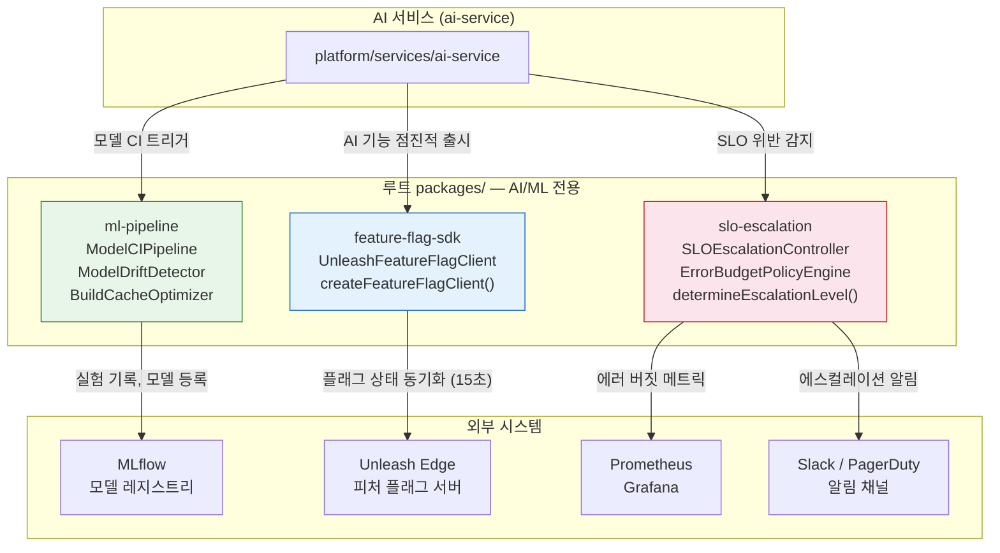
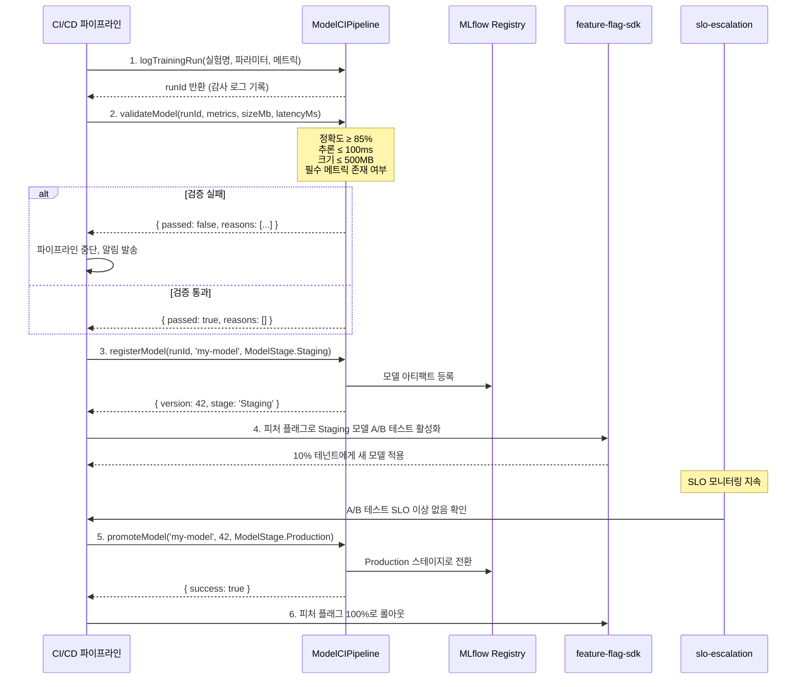
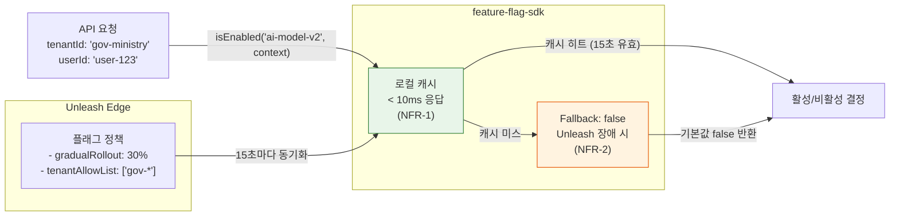
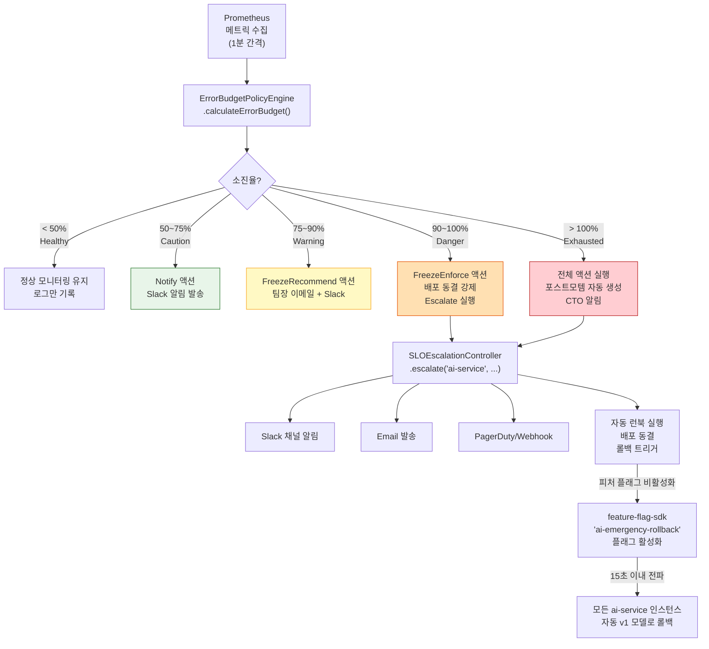
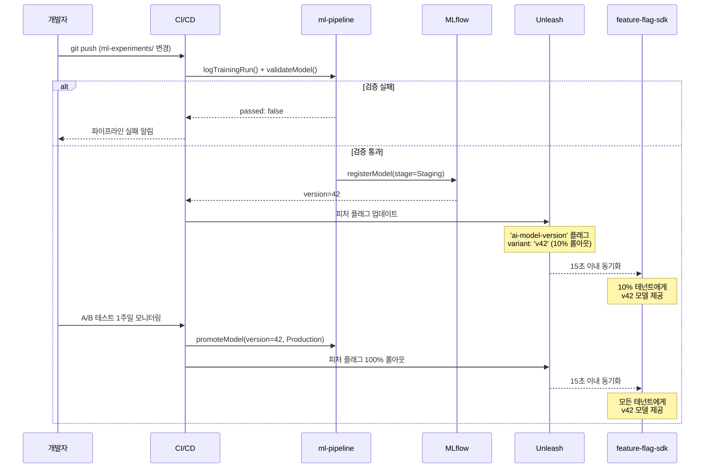

# AI/ML 관련 패키지 심화 가이드

> **문서 ID**: ONBOARD-02-PKG-03
> **버전**: 1.0.0 | **작성일**: 2026-04-12 | **대상**: ML 엔지니어, AI 서비스 개발자, SRE
> **선행 학습**: `01-core-packages.md`, `02-infra-packages.md`, `08-ai-development-guide.md`
> **실제 코드 위치**: `/data/ai-saas/packages/ml-pipeline/`, `/data/ai-saas/packages/feature-flag-sdk/`, `/data/ai-saas/packages/slo-escalation/`
> **예상 학습 시간**: 3시간
> **CSAP 매핑**: D-06 (감사 로그), D-12 (시스템 개발 보안), N2SF N-05 (AI API 데이터 등급)

---

## 목차

1. [AI/ML 패키지 개요](#1-aiml-패키지-개요)
2. [ml-pipeline 패키지 완전 분석](#2-ml-pipeline-패키지-완전-분석)
3. [feature-flag-sdk AI 연동 패턴](#3-feature-flag-sdk-ai-연동-패턴)
4. [slo-escalation 패키지 심화](#4-slo-escalation-패키지-심화)
5. [패키지 통합 실습](#5-패키지-통합-실습)
6. [패키지 기여 가이드](#6-패키지-기여-가이드)

---

## 1. AI/ML 패키지 개요

### 1.1 패키지 목록 및 역할

공공기관 SaaS 플랫폼에서 AI/ML 기능을 지원하는 패키지는 루트 `packages/` 디렉터리에 위치합니다. 이들은 `platform/packages/`의 서비스 공통 라이브러리와 달리, ML 파이프라인 운영과 기능 플래그 제어에 특화되어 있습니다.

| 패키지 | 위치 | 핵심 역할 | 설계 기준 |
|--------|------|---------|---------|
| `ml-pipeline` | `packages/ml-pipeline/` | 모델 학습 → 검증 → 등록 → 드리프트 감지 | MTU-N173, FR-ML.4~6 |
| `feature-flag-sdk` | `packages/feature-flag-sdk/` | Unleash 연동, A/B 테스트, 모델 버전 제어 | MTU-N234, FR-FF.3 |
| `slo-escalation` | `packages/slo-escalation/` | 에러 버짓 추적, 자동 에스컬레이션, 배포 동결 | MTU-N178, FR-SLO.1~6 |
| `dora-exporter` | `packages/dora-exporter/` | DORA 4 Keys 메트릭 수집 | MTU-N251 |

### 1.2 패키지 의존 관계도

아래 다이어그램은 AI 서비스가 이들 패키지를 어떻게 조합하여 사용하는지 보여줍니다.



### 1.3 N2SF 보안 요건과 패키지 설계 연관성

N2SF(국가 정보 보안 기본 지침)는 AI 패키지 설계에 직접 영향을 미칩니다.

```
[N2SF N-05 규칙]
  C등급 (기밀) → AI API 전송 절대 금지
  S등급 (민감) → AI API 전송 절대 금지
  O등급 (공개) → PII 마스킹 후 → AI Gateway 경유 → 외부 AI API

[ml-pipeline 적용]
  학습 데이터 → 등급 검증 → O등급만 통과 → MLflow 기록
  모델 메트릭 → 개인정보 없음 → 직접 기록 가능

[feature-flag-sdk 적용]
  플래그 평가 컨텍스트 → userId/tenantId만 전달 (PII 없음)
  API 키 → 환경 변수 필수, 하드코딩 금지 (CSAP D-09)

[slo-escalation 적용]
  알림 메시지 → 메트릭 데이터만 포함, 개인정보 제외
  에스컬레이션 이력 → 감사 로그 기록 (CSAP D-06)
```

---

## 2. ml-pipeline 패키지 완전 분석

### 2.1 패키지 구조

```
packages/ml-pipeline/src/
├── model-ci.ts              # 모델 CI 파이프라인 (핵심)
│   ├── ModelCIPipeline      # 학습→검증→등록→승격
│   ├── ModelDriftDetector   # PSI 기반 드리프트 감지
│   ├── ModelTrainRequest    # 입력 스키마 (Zod)
│   ├── ModelStage enum      # None/Staging/Production/Archived
│   └── ModelValidationCriteria  # 검증 기준 인터페이스
└── build-cache-optimizer.ts # BuildKit 캐시 최적화 (CI/CD 부속)
    ├── BuildCacheOptimizer  # 캐시 히트율 추적, GC
    ├── CacheBackend enum    # Local/Registry/S3/GHA
    └── analyzeDockerfile()  # Dockerfile 최적화 분석
```

### 2.2 주요 인터페이스 및 함수 목록

`model-ci.ts`에서 실제로 내보내는 공개 인터페이스입니다.

```typescript
// ── 타입 ──────────────────────────────────────────────────────────────────────

// 모델 학습 요청 (Zod 검증 — CSAP D-12)
export type ModelTrainRequest = {
  experimentName: string;   // MLflow 실험 이름
  modelName: string;        // 모델 식별자
  params: Record<string, string | number | boolean>; // 하이퍼파라미터
  metrics: Record<string, number>;                   // 평가 지표
  artifactPath: string;     // 모델 아티팩트 경로
  tags?: Record<string, string>; // 선택적 태그
};

// 모델 수명주기 단계
export enum ModelStage {
  None       = 'None',       // 미등록 상태
  Staging    = 'Staging',    // 스테이징 (검증 완료)
  Production = 'Production', // 프로덕션 (A/B 테스트 후 승격)
  Archived   = 'Archived',   // 아카이브 (더 이상 사용 안 함)
}

// 검증 기준 (기본값: 정확도 85%, 추론 100ms, 크기 500MB)
export interface ModelValidationCriteria {
  minAccuracy: number;
  maxInferenceTimeMs: number;
  maxModelSizeMb: number;
  requiredMetrics: string[]; // 기본: ['accuracy','f1_score','precision','recall']
}

// ── 클래스 ────────────────────────────────────────────────────────────────────

export class ModelCIPipeline {
  constructor(config: MLflowConfig, criteria?: Partial<ModelValidationCriteria>)

  // 1단계: 학습 결과 기록 → runId 반환
  logTrainingRun(request: ModelTrainRequest): Promise<{ runId: string }>

  // 2단계: 검증 → 통과/실패 + 실패 사유
  validateModel(
    runId: string,
    metrics: Record<string, number>,
    modelSizeMb: number,
    inferenceTimeMs: number
  ): Promise<{ passed: boolean; reasons: string[] }>

  // 3단계: 모델 레지스트리 등록 → 버전 번호 + 스테이지
  registerModel(
    runId: string,
    modelName: string,
    stage?: ModelStage  // 기본: Staging
  ): Promise<{ version: number; stage: ModelStage }>

  // 4단계: 스테이지 승격 (Staging → Production)
  promoteModel(
    modelName: string,
    version: number,
    targetStage: ModelStage
  ): Promise<{ success: boolean }>
}

export class ModelDriftDetector {
  constructor(psiThreshold?: number, ksThreshold?: number)

  // PSI(Population Stability Index) 계산
  calculatePSI(
    expected: number[],
    actual: number[],
    bins?: number
  ): { psi: number; drifted: boolean }

  // 종합 드리프트 판정 + 권고사항
  detect(
    expectedDistribution: number[],
    actualDistribution: number[]
  ): { drifted: boolean; psi: number; recommendation: string }
}
```

### 2.3 파이프라인 단계 상세 설명



### 2.4 N2SF 데이터 등급 파이프라인 내 적용

```typescript
// Design Ref: N2SF N-05 — AI API 전송 전 등급 확인 필수
// Plan SC: FR-ML.4

import { ModelCIPipeline, ModelStage } from 'ml-pipeline';

enum DataGrade { C = 'C', S = 'S', O = 'O' }

async function trainAndRegisterModel(
  trainingData: unknown,
  dataGrade: DataGrade,
): Promise<void> {
  // N2SF N-05: C/S 등급 데이터는 외부 AI API 전송 금지
  // MLflow가 내부 온프레미스에 배포된 경우 O등급 요건 완화 가능
  // 단, 학습 메트릭(숫자 값)은 등급과 무관하게 기록 가능
  if (dataGrade === DataGrade.C || dataGrade === DataGrade.S) {
    throw new Error(
      `BLOCKED: ${dataGrade}등급 데이터는 외부 AI API 학습에 사용 불가 (N2SF N-05). ` +
      `내부 폐쇄망 MLflow를 사용하거나 데이터를 익명화하십시오.`
    );
  }

  const pipeline = new ModelCIPipeline(
    {
      trackingUri: process.env['MLFLOW_TRACKING_URI'] ?? '',
      registryUri: process.env['MLFLOW_REGISTRY_URI'] ?? '',
    },
    {
      minAccuracy: 0.90,       // 공공기관 기준 강화
      maxInferenceTimeMs: 200, // 행정 서비스 응답 기준
      maxModelSizeMb: 300,
      requiredMetrics: ['accuracy', 'f1_score', 'precision', 'recall'],
    }
  );

  // 학습 기록 (메트릭만 기록, 원본 데이터 전송 없음)
  const { runId } = await pipeline.logTrainingRun({
    experimentName: 'complaint-classifier-v3',
    modelName: 'complaint-classifier',
    params: { learning_rate: 0.001, epochs: 50, batch_size: 32 },
    metrics: { accuracy: 0.94, f1_score: 0.91, precision: 0.93, recall: 0.89 },
    artifactPath: '/models/complaint-classifier-v3/',
    tags: { data_grade: dataGrade, team: 'ai-team' },
  });

  // 검증
  const validation = await pipeline.validateModel(runId, {
    accuracy: 0.94, f1_score: 0.91, precision: 0.93, recall: 0.89,
  }, 180, 85);

  if (!validation.passed) {
    throw new Error(`모델 검증 실패: ${validation.reasons.join(', ')}`);
  }

  // 등록
  await pipeline.registerModel(runId, 'complaint-classifier', ModelStage.Staging);
}
```

### 2.5 model-ci.ts — CI/CD 연동 방법

`model-ci.ts`는 Gitea Actions CI/CD 워크플로우에서 다음과 같이 호출됩니다.

```yaml
# .gitea/workflows/model-ci.yml
name: ML 모델 CI/CD

on:
  push:
    paths:
      - 'ml-experiments/**'
      - 'packages/ml-pipeline/**'

jobs:
  model-train-validate:
    runs-on: ubuntu-latest
    steps:
      - uses: actions/checkout@v4

      - name: pnpm 설치
        uses: pnpm/action-setup@v3
        with:
          version: 9

      - name: 의존성 설치
        run: pnpm install --frozen-lockfile

      - name: 모델 CI 파이프라인 실행
        env:
          MLFLOW_TRACKING_URI: ${{ secrets.MLFLOW_TRACKING_URI }}
          MLFLOW_REGISTRY_URI: ${{ secrets.MLFLOW_REGISTRY_URI }}
        run: |
          cd packages/ml-pipeline
          pnpm tsx scripts/run-model-ci.ts

      - name: Dockerfile 캐시 분석
        run: |
          cd packages/ml-pipeline
          pnpm tsx scripts/analyze-dockerfile.ts ../../../Dockerfile
```

실제 CI 스크립트 예시입니다.

```typescript
// packages/ml-pipeline/scripts/run-model-ci.ts
import { ModelCIPipeline, ModelDriftDetector, ModelStage } from '../src/model-ci.js';

const pipeline = new ModelCIPipeline({
  trackingUri: process.env['MLFLOW_TRACKING_URI'] ?? 'http://mlflow:5000',
  registryUri: process.env['MLFLOW_REGISTRY_URI'] ?? 'http://mlflow:5000',
});

// 1. 현재 학습 실행 결과 (실제로는 학습 스크립트가 생성한 JSON 파일에서 읽음)
const trainResult = JSON.parse(
  await import('fs').then(fs => fs.promises.readFile('train-result.json', 'utf-8'))
);

const { runId } = await pipeline.logTrainingRun(trainResult);
console.log(`학습 기록 완료: runId=${runId}`);

// 2. 검증
const validation = await pipeline.validateModel(
  runId,
  trainResult.metrics,
  trainResult.modelSizeMb,
  trainResult.inferenceTimeMs,
);

if (!validation.passed) {
  console.error('모델 검증 실패:', validation.reasons);
  process.exit(1);
}
console.log('모델 검증 통과');

// 3. 등록
const registered = await pipeline.registerModel(runId, trainResult.modelName);
console.log(`모델 등록 완료: v${registered.version} @ ${registered.stage}`);

// 4. 드리프트 감지 (이전 배포 분포 vs 현재)
const driftDetector = new ModelDriftDetector(0.2, 0.05);
const driftResult = driftDetector.detect(
  trainResult.baselineDistribution,
  trainResult.currentDistribution,
);

console.log(`드리프트 감지: PSI=${driftResult.psi.toFixed(4)}, ${driftResult.recommendation}`);

if (driftResult.drifted) {
  console.warn('데이터 드리프트 감지! 모델 재학습을 검토하십시오.');
}
```

### 2.6 ModelDriftDetector — PSI 계산 원리

PSI(Population Stability Index)는 입력 데이터 분포 변화를 감지하는 핵심 지표입니다.

| PSI 값 | 해석 | 권고 조치 |
|--------|------|---------|
| < 0.1 | 안정 | 정상 모니터링 유지 |
| 0.1 ~ 0.2 | 주의 | 추이 강화 모니터링 |
| 0.2 ~ 0.25 | 경미한 드리프트 | 재학습 검토 |
| > 0.25 | 심각한 드리프트 | 즉시 재학습 |

PSI 계산 공식:

```
PSI = Σ (실제 비율 - 기대 비율) × ln(실제 비율 / 기대 비율)
```

```typescript
// 실제 사용 예시
import { ModelDriftDetector } from 'packages/ml-pipeline/src/model-ci.js';

const detector = new ModelDriftDetector(
  0.2,   // PSI 임계값 (기본값)
  0.05   // KS 통계량 임계값 (기본값)
);

// 기준 분포: 학습 시점의 입력 특성 분포
const baselineScores = [0.1, 0.3, 0.5, 0.7, 0.9, 0.2, 0.4, 0.6, 0.8, 0.15];
// 현재 분포: 프로덕션에서 수집된 최근 입력 특성 분포
const currentScores  = [0.2, 0.4, 0.6, 0.8, 0.95, 0.3, 0.55, 0.7, 0.85, 0.25];

const result = detector.detect(baselineScores, currentScores);
// result = {
//   drifted: false,
//   psi: 0.047,
//   recommendation: '정상 - 모니터링 유지'
// }
```

### 2.7 BuildCacheOptimizer — 빌드 가속 도구

`build-cache-optimizer.ts`는 Docker 이미지 빌드 캐시 성능을 추적하고 Dockerfile 품질을 분석합니다.

```typescript
import { BuildCacheOptimizer, CacheBackend } from 'packages/ml-pipeline/src/build-cache-optimizer.js';

const optimizer = new BuildCacheOptimizer({
  maxSizeBytes: 5 * 1024 * 1024 * 1024, // 5GB
  maxAgeDays: 7,
  minHitRate: 0.2,
  intervalHours: 12,
});

// 빌드 결과 기록
const buildResult = optimizer.recordBuild('ai-service:v1.2.3', 145, [
  { description: 'base image (node:22-alpine)', sizeBytes: 120_000_000, hit: true },
  { description: 'pnpm install', sizeBytes: 450_000_000, hit: true },
  { description: 'typescript compile', sizeBytes: 30_000_000, hit: false },
]);
console.log(`캐시 히트율: ${(buildResult.cacheHitRate * 100).toFixed(1)}%`);
// → 캐시 히트율: 66.7%

// Dockerfile 최적화 분석
const dockerfile = `FROM node:latest
COPY . .
RUN npm install
RUN npm run build`;

const recs = optimizer.analyzeDockerfile(dockerfile);
recs.forEach(r => {
  console.log(`[${r.severity.toUpperCase()}] ${r.ruleId}: ${r.description}`);
  console.log(`  권고: ${r.recommendation}`);
});
// → [HIGH] DF-005: :latest 태그를 사용합니다. 빌드 재현성이 보장되지 않습니다.
// → [HIGH] DF-001: COPY . 전에 package.json을 먼저 복사하지 않습니다.
// → [MEDIUM] DF-002: 멀티스테이지 빌드를 사용하지 않습니다.

// 캐시 GC 실행 (주기적으로 호출)
const gcResult = optimizer.runGC();
console.log(`GC: ${gcResult.removedLayers}개 제거, ${gcResult.reclaimedBytes / 1e9:.2f}GB 회수`);
```

---

## 3. feature-flag-sdk AI 연동 패턴

### 3.1 패키지 구조 및 실제 코드 분석

```
packages/feature-flag-sdk/src/
└── index.ts
    ├── FeatureFlagConfig         # SDK 설정 인터페이스
    ├── FeatureFlagContext        # 평가 컨텍스트 (userId, tenantId)
    ├── FeatureFlagEvaluation     # 평가 결과 (flagName, enabled, variant)
    ├── FlagChangeEvent           # 변경 이벤트 (감사 로그용)
    ├── IFeatureFlagClient        # 공개 인터페이스 (백엔드 교체 가능)
    ├── UnleashFeatureFlagClient  # Unleash 기반 구현체
    └── createFeatureFlagClient() # 팩토리 함수 (환경 변수 자동 로드)
```

`IFeatureFlagClient` 인터페이스는 다음 메서드를 정의합니다.

```typescript
export interface IFeatureFlagClient {
  initialize(): Promise<void>;        // SDK 초기화 (Unleash 연결)
  isEnabled(flagName: string, context?: FeatureFlagContext): boolean; // 플래그 활성 여부
  getVariant(flagName: string, context?: FeatureFlagContext): string | undefined; // A/B 변형
  getActiveFlags(): string[];         // 현재 활성화된 전체 플래그 목록
  destroy(): void;                    // Graceful shutdown (연결 정리)
}
```

**중요한 보안 특성**: `UnleashFeatureFlagClient` 생성자는 API 키 형식을 검증합니다.

```typescript
constructor(config: FeatureFlagConfig) {
  // CSAP D-09: API 키 하드코딩 방지 — 길이 10 미만이거나 'sk-'로 시작하면 예외
  if (!config.apiKey || config.apiKey.startsWith('sk-') || config.apiKey.length < 10) {
    throw new Error('유효한 API 키를 환경 변수에서 제공해야 합니다 (하드코딩 금지 - CSAP D-09)');
  }
}
```

### 3.2 AI 피처 플래그 타입 — A/B 모델 테스트

피처 플래그를 활용하면 모델 버전 전환을 코드 배포 없이 제어할 수 있습니다. 아래는 Unleash 관리 콘솔에서 설정하는 플래그 유형과 AI 서비스에서의 활용 패턴입니다.

| 플래그 이름 | 전략 | 용도 |
|-----------|------|------|
| `ai-model-v2-enabled` | gradualRollout (점진적) | 새 모델 단계적 출시 |
| `ai-model-variant` | multiVariate (A/B/C) | 모델 버전 A/B 테스트 |
| `ai-rag-enabled` | userWithId (특정 사용자) | RAG 기능 베타 사용자 |
| `ai-streaming-enabled` | tenant (테넌트별) | 스트리밍 기능 테넌트 제어 |



### 3.3 테넌트별 AI 기능 점진적 출시

```typescript
// AI 서비스에서의 피처 플래그 활용 패턴
// Design Ref: MTU-N234 SS4, Plan SC: FR-FF.3
// CSAP: D-09 (API 키 환경 변수), D-08 (접근 통제)

import { createFeatureFlagClient } from '@root/packages/feature-flag-sdk/src/index.js';

const flagClient = createFeatureFlagClient({
  // 환경 변수에서 자동 로드: UNLEASH_API_URL, UNLEASH_API_KEY, APP_NAME
  // 하드코딩 금지 (CSAP D-09)
});

await flagClient.initialize();

// 테넌트별 AI 기능 활성화 확인
function isAIModelV2Enabled(tenantId: string, userId: string): boolean {
  return flagClient.isEnabled('ai-model-v2-enabled', {
    tenantId,
    userId,
    environment: process.env['NODE_ENV'],
    properties: {
      // 추가 컨텍스트 (PII 없이 분류 정보만)
      userTier: 'standard',
    },
  });
}

// AI 모델 버전 A/B 선택
function selectAIModelVariant(tenantId: string): 'v1' | 'v2' | 'v3' {
  const variant = flagClient.getVariant('ai-model-variant', { tenantId });
  // variant: 'control' | 'v2' | 'v3' (Unleash 설정에 따름)
  if (variant === 'v2') return 'v2';
  if (variant === 'v3') return 'v3';
  return 'v1'; // 기본값 (control 또는 undefined)
}

// 실제 AI 요청 처리에서 활용
async function handleAIRequest(tenantId: string, userId: string, query: string) {
  const useNewModel = isAIModelV2Enabled(tenantId, userId);
  const modelVariant = selectAIModelVariant(tenantId);

  const modelEndpoint = useNewModel
    ? `http://ai-model-v2:8080/predict`
    : `http://ai-model-v1:8080/predict`;

  // 감사 로그 (CSAP D-06)
  await logEvent({
    action: 'AI_MODEL_SELECTED',
    tenantId,
    modelVariant,
    useNewModel,
    flagsActive: flagClient.getActiveFlags(),
  });

  return fetch(modelEndpoint, {
    method: 'POST',
    body: JSON.stringify({ query }),
    headers: { 'Content-Type': 'application/json' },
  });
}
```

### 3.4 피처 플래그 기반 모델 롤백

긴급 롤백 시나리오에서 피처 플래그를 사용하면 코드 배포 없이 즉시 이전 모델로 전환할 수 있습니다.

```typescript
// 긴급 롤백 시나리오
// 1. Unleash 관리 콘솔에서 'ai-model-v2-enabled' 플래그를 비활성화 (수동)
// 2. SDK가 15초 이내에 변경 사항을 감지하고 캐시 갱신
// 3. 모든 요청이 자동으로 v1 모델로 라우팅

// 코드에서 롤백 상태를 직접 확인하는 방법
function isSystemInRollbackMode(): boolean {
  // 'ai-emergency-rollback' 플래그가 활성화되면 즉시 안전 모드로 전환
  return flagClient.isEnabled('ai-emergency-rollback');
}

async function aiRequestWithRollback(tenantId: string, query: string) {
  if (isSystemInRollbackMode()) {
    // 롤백 모드: 기본 모델 사용, 감사 로그 기록
    await logEvent({ action: 'AI_ROLLBACK_MODE', tenantId });
    return callModel('v1', query);
  }

  if (isAIModelV2Enabled(tenantId, 'system')) {
    return callModel('v2', query);
  }

  return callModel('v1', query);
}

// 애플리케이션 종료 시 graceful shutdown
process.on('SIGTERM', () => {
  flagClient.destroy(); // 연결 정리, 캐시 초기화
});
```

### 3.5 피처 플래그 팩토리 함수 사용법

```typescript
// createFeatureFlagClient() — 환경 변수 자동 로드 팩토리
import { createFeatureFlagClient } from 'feature-flag-sdk';

// 필수 환경 변수 (CSAP D-09 — 하드코딩 금지)
// UNLEASH_API_URL=http://unleash-edge:3063/api
// UNLEASH_API_KEY=your-secret-key-here
// APP_NAME=ai-service

// 기본 초기화 (환경 변수에서 모든 설정 자동 로드)
const client = createFeatureFlagClient();

// 일부 오버라이드 (테스트 환경)
const testClient = createFeatureFlagClient({
  apiUrl: 'http://localhost:4242/api',
  appName: 'ai-service-test',
  refreshInterval: 5000,    // 테스트에서 더 빠른 갱신
});

// UNLEASH_API_KEY가 없으면 즉시 예외 발생
// Error: UNLEASH_API_KEY 환경 변수가 설정되지 않았습니다
```

---

## 4. slo-escalation 패키지 심화

### 4.1 패키지 구조

```
packages/slo-escalation/src/
├── escalation-controller.ts    # SLO 에스컬레이션 컨트롤러
│   ├── EscalationLevel enum    # Normal/Warning/Danger/Critical/Violated
│   ├── NotificationChannel     # Slack/Email/Webhook
│   ├── EscalationPolicy        # 정책 정의 (Zod 검증)
│   ├── SLOEscalationController # 정책 등록 + 에스컬레이션 실행
│   └── determineEscalationLevel() # 버짓 소진율 → 레벨 판정 (순수 함수)
└── error-budget-policy.ts      # 에러 버짓 정책 엔진
    ├── BudgetStatus enum       # Healthy/Caution/Warning/Danger/Exhausted
    ├── AutoAction enum         # Notify/FreezeRecommend/FreezeEnforce/Escalate
    ├── SLODefinition           # SLO 정의 (목표, 현재 가용률)
    ├── ErrorBudgetResult       # 계산 결과 (소진율, 잔여량, 예측일)
    ├── OnCallLevel             # P1~P4 온콜 정책
    └── ErrorBudgetPolicyEngine # 에러 버짓 계산 + 온콜 에스컬레이션
```

### 4.2 EscalationLevel — 버짓 소진율 기반 레벨 판정

`determineEscalationLevel()` 함수는 에러 버짓 소진율을 입력받아 에스컬레이션 레벨을 반환합니다. 이 함수는 순수 함수이므로 단독으로 테스트하기 쉽습니다.

```typescript
import { determineEscalationLevel, EscalationLevel } from 'slo-escalation';

// 버짓 소진율 → 에스컬레이션 레벨
determineEscalationLevel(40)   // → EscalationLevel.Normal   (정상)
determineEscalationLevel(60)   // → EscalationLevel.Warning  (경고: 50~75%)
determineEscalationLevel(85)   // → EscalationLevel.Danger   (위험: 75~90%)
determineEscalationLevel(95)   // → EscalationLevel.Critical (긴급: 90~100%)
determineEscalationLevel(110)  // → EscalationLevel.Violated (SLO 위반: 100% 초과)
```

| 소진율 범위 | 레벨 | 의미 | 즉각 조치 |
|----------|------|------|---------|
| 0 ~ 50% | Normal | 정상 운영 | 없음 |
| 50 ~ 75% | Warning | 주의 | 모니터링 강화 |
| 75 ~ 90% | Danger | 위험 | 팀 알림, 변경 검토 |
| 90 ~ 100% | Critical | 긴급 | 관리자 즉시 알림 |
| > 100% | Violated | SLO 위반 | 배포 동결, 포스트모템 |

### 4.3 SLOEscalationController — AI 서비스 연동

```typescript
import {
  SLOEscalationController,
  EscalationLevel,
  NotificationChannel,
} from 'slo-escalation';

const controller = new SLOEscalationController();

// AI 서비스 에스컬레이션 정책 등록 (Zod 검증 자동 적용)
controller.registerPolicy({
  name: 'AI 서비스 SLO 정책',
  service: 'ai-service',
  levels: [
    {
      level: EscalationLevel.Warning,
      budgetBurnRateMin: 50,
      budgetBurnRateMax: 75,
      contacts: [
        { name: '개발팀 Slack', channel: NotificationChannel.Slack, target: '#ai-alerts' },
      ],
      waitMinutes: 30,
      actions: [],
    },
    {
      level: EscalationLevel.Critical,
      budgetBurnRateMin: 90,
      budgetBurnRateMax: 100,
      contacts: [
        { name: '팀장', channel: NotificationChannel.Email, target: 'lead@agency.go.kr' },
        { name: '긴급 Slack', channel: NotificationChannel.Slack, target: '#ai-critical' },
      ],
      waitMinutes: 5,
      actions: ['freeze-deployments', 'create-postmortem'],
    },
    {
      level: EscalationLevel.Violated,
      budgetBurnRateMin: 100,
      budgetBurnRateMax: 200,
      contacts: [
        { name: 'CTO', channel: NotificationChannel.Email, target: 'cto@agency.go.kr' },
        { name: 'PagerDuty', channel: NotificationChannel.Webhook, target: 'https://events.pagerduty.com/...' },
      ],
      waitMinutes: 0,
      actions: ['freeze-deployments', 'rollback-latest', 'create-postmortem'],
    },
  ],
});

// AI 서비스 SLO 위반 발생 시 에스컬레이션 실행
async function handleAIServiceAlert(budgetBurnRate: number): Promise<void> {
  const event = await controller.escalate(
    'ai-service',       // 서비스 이름 (정책과 일치해야 함)
    'AI API 가용성',    // SLO 이름
    budgetBurnRate,     // 현재 에러 버짓 소진율 (%)
    100 - budgetBurnRate, // 잔여 에러 버짓 (%)
  );

  // 에스컬레이션 이력에서 최근 10개 조회
  const history = controller.getHistory('ai-service', 10);
  console.log(`에스컬레이션 이력: ${history.length}개`);
}

// Prometheus에서 수집한 메트릭으로 주기적 실행
setInterval(async () => {
  const currentBurnRate = await fetchBurnRateFromPrometheus('ai-service');
  await handleAIServiceAlert(currentBurnRate);
}, 60_000); // 1분마다
```

### 4.4 ErrorBudgetPolicyEngine — 에러 버짓 계산

```typescript
import {
  ErrorBudgetPolicyEngine,
  BudgetStatus,
  AutoAction,
} from 'slo-escalation';

const engine = new ErrorBudgetPolicyEngine(
  {
    freezeThreshold: 90,      // 90% 소진 시 배포 동결 권고
    enforceThreshold: 100,    // 100% 소진 시 배포 동결 강제
    escalateThreshold: 100,   // 에스컬레이션 임계값
    postmortemThreshold: 100, // 포스트모템 자동 생성
    projectionDays: 30,       // 30일 기준 소진 예측
  }
);

// AI 서비스 SLO 계산
const result = engine.calculateErrorBudget({
  name: 'AI API 가용성 SLO',
  service: 'ai-service',
  target: 0.999,              // 99.9% 가용률 목표
  windowDays: 30,             // 30일 측정 기간
  currentAvailability: 0.997, // 현재 가용률 (99.7%)
});

console.log(`에러 버짓 소진율: ${result.burnRate.toFixed(1)}%`);
// → 에러 버짓 소진율: 66.7%

console.log(`상태: ${result.status}`);
// → 상태: caution

console.log(`잔여: ${result.remainingMinutes.toFixed(0)}분`);
// → 잔여: 14.4분 (30일 기간 중 남은 에러 버짓)

console.log(`자동 액션: ${result.actions.join(', ')}`);
// → 자동 액션: notify

// 배포 동결 여부 확인
if (engine.isDeployFrozen()) {
  throw new Error('배포 동결 상태입니다. 에러 버짓을 회복한 후 배포하십시오.');
}

// P1 인시던트 온콜 에스컬레이션
const escalation = engine.escalateOnCall('INC-2026-001', 'P1', 0);
console.log(`알림 대상: ${escalation.notifiedTargets.join(', ')}`);
// → 알림 대상: oncall-primary, oncall-secondary, engineering-manager
```

### 4.5 AI 서비스 SLO 에스컬레이션 흐름도



---

## 5. 패키지 통합 실습

### 5.1 ml-pipeline + feature-flag-sdk 결합 패턴

이 패턴은 모델 CI 파이프라인과 피처 플래그를 결합하여 "모델 배포 = 피처 플래그 활성화"가 되도록 합니다.



### 5.2 단계별 구현 가이드

**단계 1: ml-pipeline으로 모델 CI**

```typescript
// scripts/model-deployment-pipeline.ts
import { ModelCIPipeline, ModelDriftDetector, ModelStage } from '../packages/ml-pipeline/src/model-ci.js';

const pipeline = new ModelCIPipeline({
  trackingUri: process.env['MLFLOW_TRACKING_URI']!,
  registryUri: process.env['MLFLOW_REGISTRY_URI']!,
});

// 학습 결과 기록
const { runId } = await pipeline.logTrainingRun({
  experimentName: 'citizen-complaint-classifier',
  modelName: 'complaint-classifier',
  params: { lr: 0.001, epochs: 100, architecture: 'bert-base' },
  metrics: { accuracy: 0.943, f1_score: 0.921, precision: 0.935, recall: 0.908 },
  artifactPath: 'gs://ml-artifacts/complaint-classifier/v5/',
  tags: { data_grade: 'O', approved_by: 'ml-team-lead' },
});

// 검증
const { passed, reasons } = await pipeline.validateModel(
  runId,
  { accuracy: 0.943, f1_score: 0.921, precision: 0.935, recall: 0.908 },
  180,  // 모델 크기 180MB
  72,   // 추론 시간 72ms
);

if (!passed) {
  console.error('배포 중단:', reasons);
  process.exit(1);
}

// Staging 등록
const { version } = await pipeline.registerModel(runId, 'complaint-classifier', ModelStage.Staging);
console.log(`v${version} Staging 등록 완료`);

// 환경 변수로 다음 단계에 전달
process.env['MODEL_VERSION'] = String(version);
```

**단계 2: feature-flag-sdk로 점진적 출시 제어**

```typescript
// scripts/activate-feature-flag.ts
// (실제로는 Unleash REST API를 직접 호출하거나 관리 콘솔에서 설정)

const modelVersion = process.env['MODEL_VERSION'];
const unleashAdminUrl = process.env['UNLEASH_ADMIN_URL'];
const unleashApiToken = process.env['UNLEASH_ADMIN_API_KEY'];

// Unleash Admin API로 피처 플래그 업데이트
await fetch(`${unleashAdminUrl}/api/admin/features/complaint-model-version/variants`, {
  method: 'PUT',
  headers: {
    'Authorization': unleashApiToken!,
    'Content-Type': 'application/json',
  },
  body: JSON.stringify({
    variants: [
      { name: `v${modelVersion}`, weight: 1000, weightType: 'fix' },
      { name: 'v-previous', weight: 9000, weightType: 'variable' },
    ],
  }),
});
// → 10% 트래픽이 새 모델로 라우팅됨
```

**단계 3: slo-escalation으로 SLO 모니터링**

```typescript
// src/monitoring/model-slo-monitor.ts
import { ErrorBudgetPolicyEngine } from 'packages/slo-escalation/src/error-budget-policy.js';
import { SLOEscalationController } from 'packages/slo-escalation/src/escalation-controller.js';
import { createFeatureFlagClient } from 'packages/feature-flag-sdk/src/index.js';

const engine = new ErrorBudgetPolicyEngine({ freezeThreshold: 90 });
const controller = new SLOEscalationController();
const flagClient = createFeatureFlagClient();

// A/B 테스트 중 SLO 위반 감지 시 자동 롤백
async function monitorABTest(modelVersion: string): Promise<void> {
  const newModelAvailability = await fetchModelAvailability(`v${modelVersion}`);

  const result = engine.calculateErrorBudget({
    name: `complaint-classifier v${modelVersion} A/B`,
    service: 'ai-service',
    target: 0.999,
    windowDays: 7, // A/B 테스트 1주일 기간
    currentAvailability: newModelAvailability,
  });

  // SLO 위반 시 피처 플래그로 즉시 롤백
  if (result.status === 'exhausted' || result.burnRate > 100) {
    console.error(`v${modelVersion} SLO 위반! 롤백 시작...`);

    // 1. Unleash에서 피처 플래그 비활성화 (Admin API)
    await disableFeatureFlag(`complaint-model-v${modelVersion}-enabled`);

    // 2. 에스컬레이션 실행
    await controller.escalate(
      'ai-service',
      `complaint-classifier v${modelVersion}`,
      result.burnRate,
      result.remainingMinutes,
    );

    return;
  }

  if (result.burnRate > 75) {
    console.warn(`v${modelVersion} 에러 버짓 ${result.burnRate.toFixed(1)}% 소진. 모니터링 강화.`);
  }
}
```

---

## 6. 패키지 기여 가이드

### 6.1 새 AI 패키지 추가 방법

루트 `packages/` 디렉터리에 새 패키지를 추가하는 절차입니다.

```bash
# 1. 패키지 디렉터리 생성
mkdir -p /data/ai-saas/packages/my-ai-package/src

# 2. package.json 작성
cat > /data/ai-saas/packages/my-ai-package/package.json << 'EOF'
{
  "name": "@root/my-ai-package",
  "version": "0.1.0",
  "type": "module",
  "main": "./src/index.ts",
  "exports": {
    ".": "./src/index.ts"
  },
  "scripts": {
    "build": "tsc",
    "test": "vitest run",
    "lint": "eslint src/"
  },
  "dependencies": {
    "zod": "^3.22.0"
  },
  "devDependencies": {
    "typescript": "^5.4.0",
    "vitest": "^1.5.0"
  }
}
EOF

# 3. tsconfig.json 작성 (루트 tsconfig 상속)
cat > /data/ai-saas/packages/my-ai-package/tsconfig.json << 'EOF'
{
  "extends": "../../tsconfig.base.json",
  "compilerOptions": {
    "outDir": "./dist",
    "rootDir": "./src"
  },
  "include": ["src/**/*"],
  "exclude": ["node_modules", "dist"]
}
EOF
```

### 6.2 패키지 코드 작성 체크리스트

새 AI 패키지를 작성할 때 반드시 확인해야 할 사항들입니다.

```typescript
// src/index.ts — 필수 패턴 예시
// Design Ref: {설계 문서 섹션}
// Plan SC: {FR ID}

import { z } from 'zod'; // CSAP D-12: 모든 입력 Zod 검증

// 1. 입력 스키마 정의 (CSAP D-12)
const MyRequestSchema = z.object({
  tenantId: z.string().uuid(),   // 멀티테넌시 격리
  grade: z.enum(['O']),          // N2SF: O등급만 허용
  value: z.string().min(1).max(1000),
});

export type MyRequest = z.infer<typeof MyRequestSchema>;

// 2. 시크릿 환경 변수 검증 (CSAP D-09)
function getRequiredEnv(key: string): string {
  const value = process.env[key];
  if (!value) throw new Error(`환경 변수 ${key} 누락`);
  return value;
}

// 3. 감사 로그 함수 (CSAP D-06)
function logAudit(action: string, data: Record<string, unknown>): void {
  process.stdout.write(JSON.stringify({
    level: 'info',
    component: 'my-ai-package',
    action,
    ts: new Date().toISOString(),
    ...data,
  }) + '\n');
}

export class MyAIComponent {
  async process(request: MyRequest): Promise<{ result: string }> {
    // 4. 입력 검증 (CSAP D-12)
    const validated = MyRequestSchema.parse(request);

    // 5. N2SF: grade 재확인 (방어적 코딩)
    if (validated.grade !== 'O') {
      throw new Error(`BLOCKED: ${validated.grade}등급 데이터 처리 불가 (N2SF N-05)`);
    }

    // 6. 핵심 로직
    const result = `처리 완료: ${validated.value}`;

    // 7. 감사 로그 (CSAP D-06)
    logAudit('MY_AI_PROCESS', { tenantId: validated.tenantId });

    return { result };
  }
}
```

### 6.3 패키지 버전 관리 (Changesets)

```bash
# 패키지 변경 시 Changeset 생성
cd /data/ai-saas
pnpm changeset

# 대화형 프롬프트:
# ? Which packages would you like to include? → @root/ml-pipeline
# ? Which type of change is this for ml-pipeline? → patch / minor / major
# ? Please enter a summary for this change → 모델 드리프트 PSI 임계값 설정 추가

# 생성된 .changeset/*.md 파일 확인 후 커밋
git add .changeset/
git commit -m "chore(ml-pipeline): 드리프트 감지 임계값 설정 추가"
```

### 6.4 테스트 요건 — 80% 커버리지

모든 패키지는 최소 80% 테스트 커버리지를 달성해야 합니다 (Q-GATE G4).

```typescript
// packages/ml-pipeline/tests/model-ci.test.ts
import { describe, it, expect, beforeEach } from 'vitest';
import {
  ModelCIPipeline,
  ModelDriftDetector,
  ModelStage,
  determineEscalationLevel,
} from '../src/model-ci.js';

describe('ModelCIPipeline', () => {
  let pipeline: ModelCIPipeline;

  beforeEach(() => {
    pipeline = new ModelCIPipeline({
      trackingUri: 'http://mlflow-test:5000',
      registryUri: 'http://mlflow-test:5000',
    });
  });

  describe('logTrainingRun', () => {
    it('유효한 요청으로 runId를 반환한다', async () => {
      const result = await pipeline.logTrainingRun({
        experimentName: 'test-exp',
        modelName: 'test-model',
        params: { lr: 0.001, epochs: 10 },
        metrics: { accuracy: 0.92, f1_score: 0.90, precision: 0.91, recall: 0.89 },
        artifactPath: '/tmp/test-model/',
      });

      expect(result.runId).toMatch(/^run_\d+_[a-z0-9]+$/);
    });

    it('빈 experimentName은 Zod 오류를 발생시킨다', async () => {
      await expect(pipeline.logTrainingRun({
        experimentName: '',    // 빈 문자열 금지
        modelName: 'test',
        params: {},
        metrics: {},
        artifactPath: '/tmp/',
      })).rejects.toThrow();
    });
  });

  describe('validateModel', () => {
    it('기준 미달 모델은 passed=false를 반환한다', async () => {
      const { passed, reasons } = await pipeline.validateModel(
        'run_123',
        { accuracy: 0.70, f1_score: 0.65, precision: 0.72, recall: 0.63 }, // 85% 미달
        100,
        50,
      );

      expect(passed).toBe(false);
      expect(reasons.some(r => r.includes('정확도 미달'))).toBe(true);
    });

    it('추론 시간 초과 시 실패한다', async () => {
      const { passed, reasons } = await pipeline.validateModel(
        'run_123',
        { accuracy: 0.92, f1_score: 0.90, precision: 0.91, recall: 0.89 },
        100,
        150, // 100ms 초과
      );

      expect(passed).toBe(false);
      expect(reasons.some(r => r.includes('추론 시간 초과'))).toBe(true);
    });
  });
});

describe('ModelDriftDetector', () => {
  it('동일 분포는 드리프트가 없다', () => {
    const detector = new ModelDriftDetector(0.2);
    const dist = [0.1, 0.2, 0.3, 0.4, 0.5, 0.6, 0.7, 0.8, 0.9, 1.0];
    const result = detector.detect(dist, dist);
    expect(result.drifted).toBe(false);
    expect(result.psi).toBeLessThan(0.2);
  });
});

describe('feature-flag-sdk', () => {
  it('API 키 없이 생성하면 예외가 발생한다', () => {
    expect(() => createFeatureFlagClient({
      apiKey: '',           // 빈 키 → 예외
      apiUrl: 'http://test',
      appName: 'test',
    })).toThrow('UNLEASH_API_KEY');
  });
});
```

```bash
# 커버리지 확인
cd /data/ai-saas/packages/ml-pipeline
pnpm vitest run --coverage

# 결과 확인
# Statements: 84.2% (Q-GATE G4 통과)
# Branches:   81.5%
# Functions:  87.0%
# Lines:      84.2%
```

---

## 변경 이력

| 버전 | 일자 | 내용 | 작성자 |
|------|------|------|------|
| 1.0.0 | 2026-04-12 | 최초 작성 — ml-pipeline, feature-flag-sdk, slo-escalation 실제 코드 기반 분석 | Implementer (Sonnet) |
