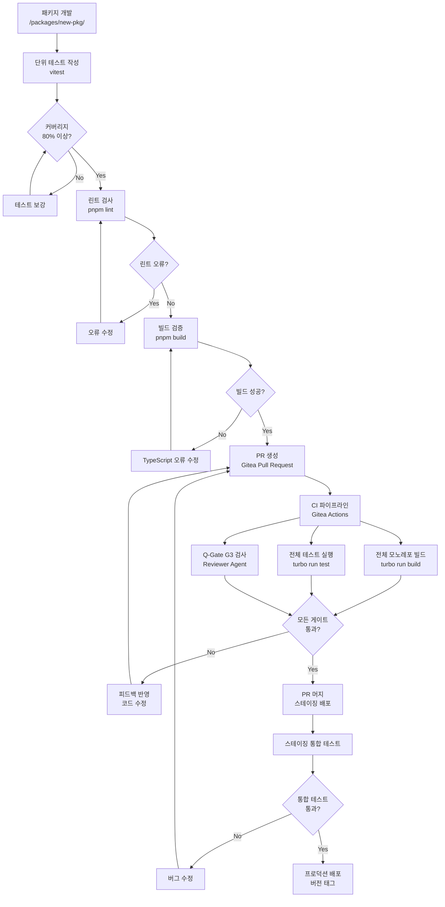
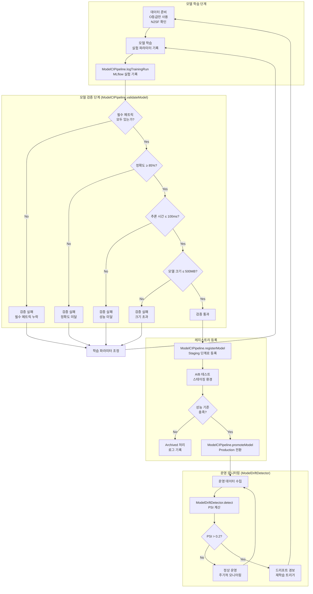

# 공유 패키지 개발 가이드 — 새 패키지 만들기부터 배포까지

> **문서 ID**: ARCH-PKG-04
> **버전**: 1.0.0 | **작성일**: 2026-04-13 | **작성자**: Implementer (Sonnet)
> **목적**: 공공기관 SaaS 프레임워크 공유 패키지의 아키텍처를 이해하고, 새 패키지 생성부터 테스트 및 배포까지 전체 과정을 단계별로 학습한다.
> **선행 학습**: [01-core-packages.md](./01-core-packages.md), [02-infra-packages.md](./02-infra-packages.md), [03-ai-packages.md](./03-ai-packages.md)

---

## 목차

1. [패키지 아키텍처 이해](#1-패키지-아키텍처-이해)
2. [새 패키지 생성 단계별 가이드](#2-새-패키지-생성-단계별-가이드)
3. [패키지 버전 관리](#3-패키지-버전-관리)
4. [테스트 전략](#4-테스트-전략)
5. [dora-exporter 패키지 심화 분석](#5-dora-exporter-패키지-심화-분석)
6. [ml-pipeline 패키지 심화 분석](#6-ml-pipeline-패키지-심화-분석)
7. [패키지 공개 API 설계 원칙](#7-패키지-공개-api-설계-원칙)
8. [변경 이력](#변경-이력)

---

## 1. 패키지 아키텍처 이해

### 1.1 왜 공유 패키지인가

공공기관 SaaS 프레임워크는 여러 마이크로서비스로 구성됩니다. 각 서비스가 동일한 기능(예: 감사 로깅, RBAC, 헬스체크)을 독립적으로 구현하면 다음 문제가 발생합니다.

**코드 중복 문제**: 10개 서비스가 모두 감사 로깅 코드를 가지면, 감사 로그 형식 변경 시 10곳을 모두 수정해야 합니다. 하나라도 누락되면 CSAP D-06 감리에서 불일치로 지적됩니다.

**독립 버전 관리의 한계**: 서비스별로 다른 보안 라이브러리 버전을 사용하면 취약점 대응이 어렵습니다. 공유 패키지를 사용하면 한 곳에서 업데이트하고 모든 서비스에 즉시 반영됩니다.

**감리 증거 일관성**: CSAP D-12 시스템 개발 보안 요건에 따라 입력 검증 패턴이 모든 서비스에서 일관되어야 합니다. 공유 패키지는 이 일관성을 구조적으로 보장합니다.

### 1.2 27개 공유 패키지 분류

공공기관 SaaS 프레임워크의 공유 패키지는 기능별로 4개 범주로 분류됩니다.

**Core 패키지**: 모든 서비스에서 공통으로 사용하는 기반 기능

| 패키지 | 역할 | 주요 기능 |
|--------|------|----------|
| `@public-saas/audit-sdk` | CSAP D-06 감사 로깅 | 감사 이벤트 기록, append-only 보장 |
| `@public-saas/rbac` | CSAP D-08 접근 제어 | 역할 기반 권한 검사 |
| `@public-saas/config-vault` | 시크릿 관리 | 환경 변수 검증, 하드코딩 방지 |
| `@public-saas/health` | 헬스체크 | Kubernetes probe 대응 |
| `@public-saas/cache` | 캐시 | Redis 기반 캐시 추상화 |
| `@public-saas/rate-limit` | 속도 제한 | API 남용 방지 |

**Infra 패키지**: 인프라 연동 및 플랫폼 기능

| 패키지 | 역할 | 주요 기능 |
|--------|------|----------|
| `@public-saas/observability` | 관측가능성 | OTel 초기화, 분산 추적 |
| `@public-saas/mesh-ready` | 서비스 메시 | Graceful Shutdown, k3s 연동 |
| `@public-saas/feature-flag-sdk` | 피처 플래그 | 점진적 배포 지원 |
| `@public-saas/circuit-breaker` | 서킷 브레이커 | 서비스 간 장애 전파 방지 |
| `@public-saas/secret-manager` | 시크릿 관리 | Vault/k8s Secret 연동 |

**AI 패키지**: AI 연동 관련 기능 (N2SF 보안 적용)

| 패키지 | 역할 | 주요 기능 |
|--------|------|----------|
| `@public-saas/ai-gateway` | N2SF AI 필터 | 데이터 등급 확인, PII 마스킹 |
| `@public-saas/ml-pipeline` | ML 파이프라인 | 모델 CI, 드리프트 탐지 |

**Observability 패키지**: 메트릭 및 운영 기능

| 패키지 | 역할 | 주요 기능 |
|--------|------|----------|
| `@public-saas/dora-exporter` (실제: `packages/dora-exporter`) | DORA 메트릭 | 4대 지표 수집, Prometheus 노출 |
| `@public-saas/slo-escalation` (실제: `packages/slo-escalation`) | SLO 에스컬레이션 | 에러 예산 소진 알림 |

### 1.3 패키지 의존성 계층도


**의존성 원칙**: 상위 레이어는 하위 레이어에 의존할 수 있으나, 하위 레이어는 상위 레이어에 절대 의존하지 않습니다(단방향 의존성). 서비스 레이어는 모든 패키지를 사용할 수 있습니다.

### 1.4 모노레포 구조

```
/data/ai-saas/
├── packages/                  # 공유 패키지 루트
│   ├── dora-exporter/         # DORA 메트릭 익스포터
│   │   ├── src/
│   │   │   ├── index.ts       # 메인 진입점 (Express 서버)
│   │   │   ├── classifier.ts  # DORA 등급 분류기
│   │   │   ├── lead-time.ts   # 리드타임 계산기
│   │   │   ├── change-failure.ts # 변경 실패 탐지기
│   │   │   ├── mttr-tracker.ts   # MTTR 추적기
│   │   │   ├── trend-analyzer.ts # 추세 분석기
│   │   │   ├── report-generator.ts # 보고서 생성기
│   │   │   └── event-queue.ts    # 이벤트 큐
│   │   ├── package.json
│   │   └── tsconfig.json
│   ├── ml-pipeline/           # ML 파이프라인
│   │   ├── src/
│   │   │   ├── index.ts
│   │   │   └── model-ci.ts    # ModelCIPipeline, ModelDriftDetector
│   │   ├── package.json
│   │   └── tsconfig.json
│   ├── feature-flag-sdk/
│   ├── slo-escalation/
│   └── ...
├── platform/
│   ├── services/              # 마이크로서비스
│   │   ├── compliance-service/
│   │   ├── ai-service/
│   │   └── security-service/
│   └── packages/              # 플랫폼 공유 패키지
│       ├── audit-sdk/
│       ├── rbac/
│       ├── observability/
│       └── ...
├── pnpm-workspace.yaml        # pnpm 워크스페이스 설정
└── turbo.json                 # Turbo 빌드 오케스트레이션
```

---

## 2. 새 패키지 생성 단계별 가이드

새 패키지를 만드는 전체 과정을 단계별로 설명합니다. 예시로 `notification-sdk`(알림 발송 공유 패키지)를 만드는 과정을 따라가겠습니다.

### STEP 1: 패키지 디렉토리 및 package.json 생성

```bash
# 패키지 디렉토리 생성
mkdir -p /data/ai-saas/packages/notification-sdk/src
```

```json
// packages/notification-sdk/package.json
{
  "name": "@public-saas/notification-sdk",
  "version": "0.1.0",
  "description": "공공기관 SaaS 알림 발송 공유 SDK",
  "type": "module",
  "main": "./dist/index.js",
  "types": "./dist/index.d.ts",
  "exports": {
    ".": {
      "import": "./dist/index.js",
      "types": "./dist/index.d.ts"
    }
  },
  "scripts": {
    "build": "tsc",
    "dev": "tsc --watch",
    "test": "vitest run",
    "test:coverage": "vitest run --coverage",
    "lint": "eslint src --ext .ts",
    "typecheck": "tsc --noEmit"
  },
  "dependencies": {
    "zod": "^3.22.0"
  },
  "devDependencies": {
    "typescript": "^5.4.0",
    "vitest": "^1.4.0",
    "@vitest/coverage-v8": "^1.4.0"
  },
  "peerDependencies": {
    "@public-saas/audit-sdk": "workspace:*"
  }
}
```

**주의사항**:
- `"type": "module"` 설정으로 ES Module 방식 사용
- `exports` 필드에서 공개 진입점 명시 (내부 파일 직접 import 방지)
- 내부 공유 패키지는 `workspace:*` 프로토콜 사용 (pnpm 워크스페이스)

### STEP 2: tsconfig.json 설정

```json
// packages/notification-sdk/tsconfig.json
{
  "compilerOptions": {
    "target": "ES2022",
    "module": "NodeNext",
    "moduleResolution": "NodeNext",
    "lib": ["ES2022"],
    "outDir": "./dist",
    "rootDir": "./src",
    "declaration": true,
    "declarationMap": true,
    "sourceMap": true,
    "strict": true,
    "noUnusedLocals": true,       // Dead code 방지 (harness-constraints.md §2)
    "noUnusedParameters": true,   // Dead code 방지
    "noImplicitReturns": true,
    "noFallthroughCasesInSwitch": true,
    "esModuleInterop": true,
    "skipLibCheck": true
  },
  "include": ["src/**/*.ts"],
  "exclude": ["node_modules", "dist", "**/*.test.ts"]
}
```

**`paths` 설정 (모노레포 내부 패키지 참조)**:

```json
// tsconfig.json에 추가
{
  "compilerOptions": {
    // ... 위 설정 ...
    "paths": {
      "@public-saas/audit-sdk": ["../../platform/packages/audit-sdk/src/index.ts"]
    }
  }
}
```

### STEP 3: src/index.ts 공개 API 설계

공개 API는 신중하게 설계해야 합니다. 한 번 공개한 API를 변경하면 모든 사용 서비스에 영향을 줍니다.

```typescript
// packages/notification-sdk/src/index.ts
// 공개 API: 외부에서 import 할 수 있는 것만 export

// 타입 export: 타입 안전성 보장
export type { NotificationPayload, NotificationResult, NotificationChannel } from './types.js';

// 클래스/함수 export: 핵심 기능
export { NotificationSender } from './sender.js';
export { NotificationTemplateEngine } from './template.js';

// 상수 export: 사용 가능한 채널 목록
export { NOTIFICATION_CHANNELS } from './constants.js';

// 내부 구현 세부 사항은 export 하지 않음
// (예: HttpNotificationAdapter, EmailFormatter는 내부 구현)
```

```typescript
// packages/notification-sdk/src/types.ts
import { z } from 'zod';

// Zod 스키마: 입력 검증 (CSAP D-12 준수)
export const NotificationPayloadSchema = z.object({
  channel: z.enum(['slack', 'email', 'webhook']),
  recipient: z.string().min(1),
  // PII 마스킹 필수 (N2SF 요건)
  message: z.string().min(1).max(10000),
  // C/S 등급 데이터 절대 포함 금지
  priority: z.enum(['low', 'medium', 'high', 'critical']).default('medium'),
  metadata: z.record(z.string()).optional(),
});

export type NotificationPayload = z.infer<typeof NotificationPayloadSchema>;

export interface NotificationResult {
  success: boolean;
  messageId?: string;
  error?: string;
  // 에러 메시지에 민감 정보 포함 금지 (CSAP D-12)
}

export type NotificationChannel = 'slack' | 'email' | 'webhook';
```

### STEP 4: pnpm-workspace.yaml 등록 확인

공공기관 SaaS 프레임워크의 `pnpm-workspace.yaml`은 이미 `packages/**`를 포함하도록 설정되어 있어, 새 패키지 디렉토리를 `packages/` 하위에 생성하면 자동으로 인식됩니다.

```yaml
# /data/ai-saas/pnpm-workspace.yaml 확인
packages:
  - "packages/**"
  - "platform/packages/**"
  - "platform/services/**"
  - "platform/apps/**"
```

패키지 생성 후 워크스페이스 재인식:

```bash
# pnpm 워크스페이스 패키지 목록 확인
pnpm list --recursive --depth=0 | grep notification-sdk

# 의존성 설치 (워크스페이스 전체)
pnpm install
```

### STEP 5: Turbo DAG에 빌드 태스크 추가

Turbo는 패키지 간 의존성을 분석하여 빌드 순서를 자동으로 결정합니다. `package.json`의 `peerDependencies`에 선언된 패키지가 먼저 빌드됩니다.

```json
// /data/ai-saas/turbo.json 확인 및 필요시 추가
{
  "$schema": "https://turbo.build/schema.json",
  "pipeline": {
    "build": {
      "dependsOn": ["^build"],  // 의존 패키지 먼저 빌드
      "outputs": ["dist/**"]
    },
    "test": {
      "dependsOn": ["build"],   // 빌드 후 테스트
      "outputs": ["coverage/**"]
    },
    "lint": {
      "outputs": []
    },
    "typecheck": {
      "dependsOn": ["build"],
      "outputs": []
    }
  }
}
```

**Turbo 빌드 실행**:

```bash
# 전체 빌드 (변경된 패키지만 재빌드, 캐시 활용)
pnpm turbo run build

# 특정 패키지만 빌드
pnpm turbo run build --filter=@public-saas/notification-sdk

# 의존 패키지 포함 빌드
pnpm turbo run build --filter=@public-saas/notification-sdk...
```

### STEP 6: 공개 전 체크리스트

새 패키지를 팀에 공개하기 전에 다음 항목을 확인합니다.

```
[ ] package.json name 필드: @public-saas/패키지명 형식
[ ] exports 필드: 공개 API 진입점 명시
[ ] tsconfig.json: strict 모드, noUnusedLocals/noUnusedParameters 활성화
[ ] src/index.ts: 필요한 것만 export (내부 구현 노출 금지)
[ ] 모든 입력에 Zod 검증 적용 (CSAP D-12)
[ ] 하드코딩된 시크릿 없음 (환경 변수 사용)
[ ] README.md: 사용 예시 포함
[ ] 테스트 커버리지 80% 이상
[ ] lint 오류 없음: pnpm lint
[ ] 빌드 성공: pnpm build
```

---

## 3. 패키지 버전 관리

### 3.1 모노레포 내부 패키지: workspace:* 프로토콜

`workspace:*` 프로토콜은 pnpm이 제공하는 모노레포 전용 의존성 선언 방식입니다.

```json
// 서비스에서 공유 패키지 참조 시
{
  "dependencies": {
    "@public-saas/audit-sdk": "workspace:*",
    "@public-saas/rbac": "workspace:*",
    "@public-saas/notification-sdk": "workspace:*"
  }
}
```

**workspace:* 의 동작 방식**:
- 로컬 개발: 워크스페이스 내 패키지의 `src/` 직접 참조 (빌드 결과물 불필요)
- CI/CD 배포: 패키지의 `dist/` 빌드 결과물 참조
- 버전 자동 해결: 항상 최신 워크스페이스 버전 사용

### 3.2 Semantic Versioning 정책

모든 공유 패키지는 Semantic Versioning(SemVer)을 따릅니다.

```
MAJOR.MINOR.PATCH
1     2     3

MAJOR: Breaking Change (기존 API 제거 또는 비호환 변경)
MINOR: 하위 호환 기능 추가 (기존 API 유지하면서 새 기능)
PATCH: 버그 수정 (기능 변경 없음)
```

**Breaking Change 예시**:
```typescript
// v1.0.0: 기존 API
export function logAuditEvent(action: string, actor: string): void { }

// v2.0.0: Breaking Change - 파라미터 타입 변경
// 기존 호출 코드가 컴파일 오류 발생 → MAJOR 버전 증가 필수
export function logAuditEvent(payload: AuditPayload): void { }
```

**버전 증가 명령**:
```bash
# PATCH 버전 증가 (0.1.0 → 0.1.1)
pnpm version patch --filter=@public-saas/notification-sdk

# MINOR 버전 증가 (0.1.0 → 0.2.0)
pnpm version minor --filter=@public-saas/notification-sdk

# MAJOR 버전 증가 (0.1.0 → 1.0.0)
pnpm version major --filter=@public-saas/notification-sdk
```

### 3.3 CHANGELOG 자동 생성

패키지 변경 시 CHANGELOG.md를 업데이트합니다. `conventional-changelog` 도구를 활용하면 커밋 메시지에서 자동 생성할 수 있습니다.

```markdown
## [0.2.0] — 2026-04-13

### Added
- Slack 알림 채널 지원 추가 (FR-NOTIF.3)
- 알림 재시도 로직 구현 (최대 3회)

### Fixed
- 긴 메시지 절단 버그 수정 (#42)

### Security
- PII 마스킹 강화: 이메일 주소 자동 마스킹 적용

## [0.1.0] — 2026-04-01

### Added
- 최초 버전: Email, Webhook 채널 지원
- Zod 입력 검증 (CSAP D-12)
- CSAP D-06 감사 로깅 연동
```

---

## 4. 테스트 전략

### 4.1 Vitest 설정

공공기관 SaaS 프레임워크는 Vitest를 표준 테스트 도구로 사용합니다.

```typescript
// packages/notification-sdk/vitest.config.ts
import { defineConfig } from 'vitest/config';

export default defineConfig({
  test: {
    // TypeScript 경로 별칭 지원
    globals: true,
    environment: 'node',
    // 커버리지 설정
    coverage: {
      provider: 'v8',
      reporter: ['text', 'json', 'html'],
      // Q-GATE G4: 커버리지 80% 이상 필수
      thresholds: {
        statements: 80,
        branches: 80,
        functions: 80,
        lines: 80,
      },
      exclude: [
        'src/index.ts',    // 진입점은 통합 테스트로 커버
        '**/*.d.ts',
        '**/types.ts',     // 타입 전용 파일 제외
      ],
    },
  },
});
```

### 4.2 단위 테스트 작성

각 클래스/함수에 대한 단위 테스트를 작성합니다.

```typescript
// packages/dora-exporter/src/__tests__/change-failure.test.ts
// 실제 ChangeFailureDetector 테스트 예시

import { describe, it, expect, beforeEach } from 'vitest';
import { ChangeFailureDetector } from '../change-failure.js';

describe('ChangeFailureDetector', () => {
  let detector: ChangeFailureDetector;

  beforeEach(() => {
    detector = new ChangeFailureDetector();
  });

  describe('recordSuccess / recordFailure', () => {
    it('초기 실패율은 0이어야 한다', () => {
      const rate = detector.getRate('team-a', 'service-x');
      expect(rate).toBe(0);
    });

    it('성공 1회 후 실패율은 0', () => {
      detector.recordSuccess('team-a', 'service-x');
      expect(detector.getRate('team-a', 'service-x')).toBe(0);
    });

    it('성공 2회 실패 1회 시 실패율은 0.333...', () => {
      detector.recordSuccess('team-a', 'service-x');
      detector.recordSuccess('team-a', 'service-x');
      detector.recordFailure('team-a', 'service-x');
      expect(detector.getRate('team-a', 'service-x')).toBeCloseTo(1/3);
    });

    it('팀/서비스별로 독립적으로 추적한다', () => {
      detector.recordFailure('team-a', 'service-x');
      detector.recordSuccess('team-b', 'service-y');
      // team-a/service-x: 실패율 1.0
      expect(detector.getRate('team-a', 'service-x')).toBe(1);
      // team-b/service-y: 실패율 0
      expect(detector.getRate('team-b', 'service-y')).toBe(0);
    });
  });
});
```

### 4.3 통합 테스트: 의존 서비스와 함께

일부 패키지는 Redis, Prometheus 등 외부 서비스와 연동하므로 통합 테스트가 필요합니다.

```typescript
// packages/dora-exporter/src/__tests__/integration/webhook.test.ts
import { describe, it, expect, beforeAll, afterAll } from 'vitest';
import request from 'supertest';
import { app } from '../../index.js';

describe('Gitea Webhook 통합 테스트', () => {
  it('유효한 Gitea Webhook payload → 200 반환', async () => {
    const payload = {
      ref: 'refs/heads/main',
      after: 'abc123',
      repository: { full_name: 'team-a/service-x' },
      commits: [
        {
          id: 'abc123',
          timestamp: new Date(Date.now() - 3600000).toISOString(), // 1시간 전
          message: 'feat: 신기능 추가',
        },
      ],
      pusher: { login: 'developer1' },
    };

    const response = await request(app)
      .post('/webhook/gitea')
      .send(payload)
      .set('Content-Type', 'application/json');

    expect(response.status).toBe(200);
    expect(response.body).toEqual({ status: 'accepted' });
  });

  it('잘못된 payload → 400 반환 (Zod 검증 실패)', async () => {
    const invalidPayload = {
      // ref 필드 누락 → Zod 오류
      after: 'abc123',
    };

    const response = await request(app)
      .post('/webhook/gitea')
      .send(invalidPayload);

    expect(response.status).toBe(400);
    expect(response.body.error).toBe('Invalid webhook payload');
  });
});
```

### 4.4 패키지 개발-테스트-배포 흐름



---

## 5. dora-exporter 패키지 심화 분석

### 5.1 패키지 개요

`packages/dora-exporter`는 DORA(DevOps Research and Assessment) 4대 지표를 수집하여 Prometheus 메트릭으로 노출하는 독립 서비스형 패키지입니다. Express 웹서버로 실행되며, 두 가지 Webhook을 수신합니다.

- **Gitea Webhook** (`POST /webhook/gitea`): 코드 푸시/태그 이벤트 수신
- **AlertManager Webhook** (`POST /webhook/alertmanager`): 장애 발생/해결 이벤트 수신

### 5.2 배포 이벤트 수집 방법

```typescript
// Design Ref: packages/dora-exporter/src/index.ts §3.1, §3.2

// 1단계: Gitea Webhook 수신 및 Zod 검증 (CSAP D-12)
const giteaWebhookSchema = z.object({
  ref: z.string(),              // refs/heads/main, refs/tags/v1.0.0
  after: z.string(),            // 최신 커밋 SHA
  repository: z.object({
    full_name: z.string(),      // "team-a/service-x"
  }),
  commits: z.array(z.object({
    id: z.string(),
    timestamp: z.string(),      // ISO 8601 형식
    message: z.string(),
  })),
  pusher: z.object({ login: z.string() }),
});

// 2단계: 배포 이벤트 판별 및 메트릭 기록
app.post('/webhook/gitea', async (req, res) => {
  const payload = giteaWebhookSchema.parse(req.body);

  const team = extractTeam(payload.repository.full_name);  // "team-a"
  const service = extractService(payload.repository.full_name); // "service-x"
  const environment = extractEnvironment(payload.ref);  // "production"

  if (isDeploymentEvent(payload.ref)) {
    // FR-DORA.1: 배포 카운터 증가
    deploymentTotal.inc({ team, service, environment });

    // FR-DORA.2: 리드타임 계산 (첫 커밋 → 배포 완료)
    const firstCommitTime = getFirstCommitTimestamp(payload.commits);
    if (firstCommitTime) {
      const leadTime = (Date.now() - firstCommitTime) / 1000; // ms → 초
      leadTimeSeconds.observe({ team, service }, leadTime);
    }

    // FR-DORA.3: 변경 실패 감지 (롤백, 핫픽스 커밋 메시지 패턴)
    const isFailure = changeFailureDetector.detect(payload.commits);
    if (isFailure) {
      changeFailureDetector.recordFailure(team, service);
    } else {
      changeFailureDetector.recordSuccess(team, service);
    }
    changeFailureRate.set(
      { team, service },
      changeFailureDetector.getRate(team, service)
    );
  }
});
```

### 5.3 Prometheus Histogram 설계 이유

리드타임 히스토그램의 버킷 설계를 이해하는 것이 중요합니다.

```typescript
// 리드타임 버킷: 공공기관 SaaS DORA 기준에 맞춤
buckets: [
  60,      // 1분: Elite 기준 (매우 빠른 CI/CD)
  300,     // 5분
  900,     // 15분
  1800,    // 30분
  3600,    // 1시간: Elite 상한선
  7200,    // 2시간
  14400,   // 4시간
  28800,   // 8시간: High 등급 기준
  86400,   // 1일: Medium 등급 기준
  604800,  // 7일: Low 등급 기준
]
```

**버킷 선택 원칙**: DORA 등급 임계값(1시간, 8시간, 1일, 7일)에 맞춰 버킷을 설정합니다. 이렇게 하면 `histogram_quantile` 함수로 P50, P95 등을 계산할 때 정확도가 높아집니다.

### 5.4 이벤트 큐 패턴

대량의 Webhook이 동시에 수신될 때를 대비하여 EventQueue를 도입했습니다.

```typescript
// Design Ref: packages/dora-exporter/src/event-queue.ts (§3.3)
const eventQueue = new EventQueue({
  maxQueueSize: 10000,  // 최대 1만 개 이벤트 버퍼
  maxRetries: 3,        // 처리 실패 시 최대 3회 재시도
});

// 핸들러 등록: 큐에서 이벤트를 꺼내 메트릭 기록
eventQueue.setHandler(async (event) => {
  const { team, service, environment, type } = event;
  if (type === DORAEventType.Deployment) {
    deploymentTotal.inc({ team, service, environment });
  } else if (
    type === DORAEventType.DeploymentFailure ||
    type === DORAEventType.Rollback ||
    type === DORAEventType.Hotfix
  ) {
    changeFailureDetector.recordFailure(team, service);
    changeFailureRate.set(
      { team, service },
      changeFailureDetector.getRate(team, service)
    );
  }
});
```

### 5.5 주간 보고서 생성 구조

```typescript
// Design Ref: packages/dora-exporter/src/index.ts §3.2, §3.8
// FR-N251.9: 주간 DORA 보고서 생성

app.get('/report/weekly', async (req, res) => {
  // 1단계: 현재 메트릭 스냅샷 기록
  for (const team of changeFailureDetector.getTeams()) {
    trendAnalyzer.recordSnapshot({
      deploymentFrequency: await getDeploymentRate(team),
      leadTimeSeconds: await getMedianLeadTime(team),
      changeFailureRate: changeFailureDetector.getTeamRate(team),
      mttrSeconds: mttrTracker.getMedianMTTR(team),
    });
  }

  // 2단계: 형식에 따라 다른 출력 생성
  const format = req.query.format as string;
  if (format === 'evidence') {
    // CSAP 감리 증거 형식 (JSON)
    const evidence = reportGenerator.generateAuditEvidence({
      csapRefs: ['D-06', 'D-12'],
    });
    res.status(200).json(evidence);
  } else if (format === 'json') {
    // JSON 분석 데이터
    const report = trendAnalyzer.analyzeWeekly();
    res.status(200).json(report);
  } else {
    // Markdown 보고서 (기본값)
    const markdown = reportGenerator.generateWeeklyReport({});
    res.set('Content-Type', 'text/markdown; charset=utf-8');
    res.status(200).send(markdown);
  }
});
```

---

## 6. ml-pipeline 패키지 심화 분석

### 6.1 패키지 개요

`packages/ml-pipeline/src/model-ci.ts`는 머신러닝 모델의 CI(지속적 통합) 파이프라인을 구현합니다. 학습 결과 기록 → 검증 → 레지스트리 등록 → 스테이지 전환의 4단계 워크플로우를 제공합니다.

### 6.2 ModelCIPipeline 동작 원리

```typescript
// Design Ref: packages/ml-pipeline/src/model-ci.ts §3.4
// Plan SC: FR-ML.4

export class ModelCIPipeline {
  private validationCriteria: ModelValidationCriteria;

  // 기본 검증 기준 (커스터마이징 가능)
  constructor(config: MLflowConfig, criteria?: Partial<ModelValidationCriteria>) {
    this.validationCriteria = {
      minAccuracy: 0.85,         // 최소 정확도 85%
      maxInferenceTimeMs: 100,   // 최대 추론 시간 100ms
      maxModelSizeMb: 500,       // 최대 모델 크기 500MB
      requiredMetrics: ['accuracy', 'f1_score', 'precision', 'recall'],
      ...criteria,
    };
  }

  // 1단계: 학습 결과 기록 (MLflow 실험 기록)
  async logTrainingRun(request: ModelTrainRequest): Promise<{ runId: string }> {
    // Zod 검증 (CSAP D-12)
    const validated = ModelTrainRequestSchema.parse(request);

    const runId = `run_${Date.now()}_${Math.random().toString(36).slice(2, 8)}`;

    // CSAP D-06 감사 추적: 모든 모델 학습 결과 기록
    process.stdout.write(JSON.stringify({
      level: 'info', component: 'model-ci', action: 'log_training_run',
      runId, experiment: validated.experimentName,
      model: validated.modelName, metrics: validated.metrics,
      ts: new Date().toISOString(),
    }) + '\n');

    return { runId };
  }

  // 2단계: 성능 임계값 검사
  async validateModel(
    runId: string,
    metrics: Record<string, number>,
    modelSizeMb: number,
    inferenceTimeMs: number,
  ): Promise<{ passed: boolean; reasons: string[] }> {
    const reasons: string[] = [];

    // 필수 메트릭 존재 여부 확인
    for (const metric of this.validationCriteria.requiredMetrics) {
      if (!(metric in metrics)) {
        reasons.push(`필수 메트릭 누락: ${metric}`);
      }
    }

    // 정확도 기준 초과 확인
    if (metrics.accuracy < this.validationCriteria.minAccuracy) {
      reasons.push(`정확도 미달: ${metrics.accuracy} < ${this.validationCriteria.minAccuracy}`);
    }

    // 추론 시간 기준 초과 확인
    if (inferenceTimeMs > this.validationCriteria.maxInferenceTimeMs) {
      reasons.push(`추론 시간 초과: ${inferenceTimeMs}ms > ${this.validationCriteria.maxInferenceTimeMs}ms`);
    }

    // 모델 크기 기준 초과 확인
    if (modelSizeMb > this.validationCriteria.maxModelSizeMb) {
      reasons.push(`모델 크기 초과: ${modelSizeMb}MB > ${this.validationCriteria.maxModelSizeMb}MB`);
    }

    const passed = reasons.length === 0;
    // 검증 결과 로깅
    process.stdout.write(JSON.stringify({
      level: passed ? 'info' : 'warn',
      component: 'model-ci', action: 'validate_model',
      runId, passed, reasons, ts: new Date().toISOString(),
    }) + '\n');

    return { passed, reasons };
  }
}
```

### 6.3 ModelDriftDetector: PSI 기반 드리프트 감지

모델 드리프트(Model Drift)는 학습 시점의 데이터 분포와 실제 운영 데이터 분포가 달라지는 현상입니다. 공공기관 SaaS에서 AI 모델이 오래될수록 예측 정확도가 떨어질 수 있습니다.

```typescript
// Design Ref: packages/ml-pipeline/src/model-ci.ts §3.6
// Plan SC: FR-ML.6

export class ModelDriftDetector {
  private psiThreshold: number;  // PSI > 0.2 이면 드리프트 의심

  // PSI (Population Stability Index) 계산
  calculatePSI(
    expected: number[],   // 학습 시점 입력 분포
    actual: number[],     // 현재 운영 입력 분포
    bins = 10,            // 구간 수
  ): { psi: number; drifted: boolean } {
    const min = Math.min(...expected, ...actual);
    const max = Math.max(...expected, ...actual);
    const binWidth = (max - min) / bins;

    let psi = 0;
    for (let i = 0; i < bins; i++) {
      const lower = min + i * binWidth;
      const upper = lower + binWidth;

      // 각 구간의 비율 계산
      const expectedPct = Math.max(
        expected.filter(v => v >= lower && v < upper).length / expected.length,
        0.0001  // 0으로 나누기 방지
      );
      const actualPct = Math.max(
        actual.filter(v => v >= lower && v < upper).length / actual.length,
        0.0001
      );

      // PSI = Σ (실제 비율 - 기대 비율) × ln(실제 비율 / 기대 비율)
      psi += (actualPct - expectedPct) * Math.log(actualPct / expectedPct);
    }

    return { psi, drifted: psi > this.psiThreshold };
  }

  // PSI 값 해석 및 권고 사항 제공
  detect(expected: number[], actual: number[]): {
    drifted: boolean;
    psi: number;
    recommendation: string;
  } {
    const { psi, drifted } = this.calculatePSI(expected, actual);

    let recommendation = '정상 - 모니터링 유지';
    if (psi > 0.25) {
      recommendation = '심각한 드리프트 - 즉시 모델 재학습 필요';
    } else if (psi > 0.2) {
      recommendation = '경미한 드리프트 - 재학습 검토 필요';
    } else if (psi > 0.1) {
      recommendation = '주의 - 추이 모니터링 강화';
    }

    return { drifted, psi, recommendation };
  }
}
```

### 6.4 ML 파이프라인 CI 흐름



### 6.5 실제 사용 예시

```typescript
// ml-pipeline 패키지 사용 예시
import { ModelCIPipeline, ModelDriftDetector, ModelStage } from '@public-saas/ml-pipeline';

const pipeline = new ModelCIPipeline(
  {
    trackingUri: process.env['MLFLOW_TRACKING_URI'] ?? 'http://mlflow:5000',
    registryUri: process.env['MLFLOW_REGISTRY_URI'] ?? 'http://mlflow:5000',
  },
  {
    // 공공기관 AI 서비스 기준에 맞춰 임계값 커스터마이징
    minAccuracy: 0.90,       // 90% 이상 (기본값 85%보다 높게)
    maxInferenceTimeMs: 200, // 200ms (기본값 100ms보다 완화)
  },
);

async function runModelCI(experimentName: string): Promise<void> {
  // 1단계: 학습 결과 기록
  const { runId } = await pipeline.logTrainingRun({
    experimentName,
    modelName: 'document-classifier',
    params: { learning_rate: 0.001, epochs: 10, batch_size: 32 },
    metrics: { accuracy: 0.93, f1_score: 0.91, precision: 0.92, recall: 0.90 },
    artifactPath: 's3://ml-artifacts/document-classifier/run-123',
  });

  // 2단계: 검증
  const { passed, reasons } = await pipeline.validateModel(
    runId,
    { accuracy: 0.93, f1_score: 0.91, precision: 0.92, recall: 0.90 },
    150,   // 모델 크기 150MB
    180,   // 추론 시간 180ms
  );

  if (!passed) {
    console.error('모델 검증 실패:', reasons);
    return;
  }

  // 3단계: Staging 등록
  const { version } = await pipeline.registerModel(runId, 'document-classifier', ModelStage.Staging);

  // 4단계: Production 전환 (A/B 테스트 후)
  await pipeline.promoteModel('document-classifier', version, ModelStage.Production);
}
```

---

## 7. 패키지 공개 API 설계 원칙

### 7.1 Breaking Change 방지 전략

공유 패키지를 사용하는 서비스가 많아질수록, Breaking Change의 파급력이 커집니다. 다음 전략으로 Breaking Change를 방지합니다.

**인터페이스 확장 우선 (Extension over Modification)**:

```typescript
// v1.0.0: 기존 인터페이스
interface AuditPayload {
  actor: string;
  action: string;
  target: string;
}

// v1.1.0: 기존 인터페이스 확장 (Optional 필드 추가) → Breaking Change 아님
interface AuditPayload {
  actor: string;
  action: string;
  target: string;
  targetType?: string;      // 추가: 선택적 필드
  tenantId?: string;        // 추가: 선택적 필드
  metadata?: Record<string, unknown>; // 추가: 선택적 필드
}

// v2.0.0: Breaking Change (필수 필드 추가) → MAJOR 버전 증가 필수
interface AuditPayload {
  actor: string;
  action: string;
  target: string;
  targetType: string;       // 필수로 변경 → 기존 코드 컴파일 오류
  tenantId: string;         // 필수로 변경 → 기존 코드 컴파일 오류
}
```

**오버로딩보다 선택적 매개변수**:

```typescript
// 피해야 할 패턴: 함수 오버로딩은 Breaking Change 위험
async function logAuditEvent(action: string): Promise<void>;
async function logAuditEvent(action: string, actor: string): Promise<void>;

// 권장 패턴: 선택적 매개변수로 확장 가능
async function logAuditEvent(
  action: string,
  options?: {
    actor?: string;
    target?: string;
    metadata?: Record<string, unknown>;
  }
): Promise<void> { }
```

### 7.2 Deprecation 정책

```typescript
// Deprecation 표시 예시
/**
 * @deprecated v2.0.0에서 제거 예정. logComplianceEvent()를 사용하십시오.
 * @see logComplianceEvent
 * @since v1.3.0
 */
export async function logLegacyAuditEvent(action: string): Promise<void> {
  // v1.x 하위 호환성 유지
  return logComplianceEvent(action);
}

// 새 함수
export async function logComplianceEvent(
  action: string,
  metadata?: Record<string, unknown>,
): Promise<void> {
  await auditLogger.log({
    actor: 'system:compliance-service',
    action,
    target: 'compliance',
    targetType: 'compliance',
    tenantId: 'system',
    ip: process.env['SERVICE_IP'] || '127.0.0.1',
    userAgent: 'compliance-service/1.0',
    metadata,
  });
}
```

**Deprecation 기간**: 최소 2개 MINOR 버전 이상 유지 후 MAJOR 버전에서 제거합니다.

### 7.3 API 문서 자동 생성 (TypeDoc)

```bash
# TypeDoc 설치 및 문서 생성
pnpm add -D typedoc --filter=@public-saas/notification-sdk

# 문서 생성
pnpm typedoc --entryPoints src/index.ts --out docs/api
```

```json
// package.json에 문서 생성 스크립트 추가
{
  "scripts": {
    "docs": "typedoc --entryPoints src/index.ts --out ../../docs/api/notification-sdk",
    "docs:check": "typedoc --entryPoints src/index.ts --emit none"
  }
}
```

**TSDoc 주석 작성 기준**:

```typescript
/**
 * 컴플라이언스 이벤트를 CSAP D-06 감사 로그에 기록합니다.
 *
 * @param action - 감사 이벤트 액션 코드 (예: 'READINESS_CHECK', 'CSAP_EXPORT')
 * @param metadata - 추가 컨텍스트 정보 (민감 정보 포함 금지)
 * @returns Promise<void> - 로그 기록 완료 시 resolve
 * @throws {AuditLogError} - 감사 로그 기록 실패 시 (로그 저장소 장애)
 *
 * @example
 * ```typescript
 * // 감리 준비도 체크 이벤트 기록
 * await logComplianceEvent('READINESS_CHECK', { readinessScore: 94 });
 *
 * // 위반 탐지 이벤트 기록
 * await logComplianceEvent('VIOLATION_DETECTED', { domain: 'D-08', controlId: 'D-08-03' });
 * ```
 *
 * @see {@link https://wiki.internal/csap/D-06 | CSAP D-06 침해사고 관리}
 */
export async function logComplianceEvent(
  action: string,
  metadata?: Record<string, unknown>,
): Promise<void> {
  // 구현
}
```

### 7.4 패키지 공개 API 검증 자동화

```typescript
// scripts/check-api-surface.ts
// 공개 API 변경 자동 감지 (CI에서 실행)

import { execSync } from 'child_process';
import { readFileSync, writeFileSync } from 'fs';

// 현재 API 표면 생성
const currentAPI = execSync(
  'pnpm exec api-extractor run --local --verbose 2>&1'
).toString();

// 이전 버전과 비교
const previousAPI = readFileSync('api-surface.baseline.md', 'utf-8');

if (currentAPI !== previousAPI) {
  console.error('[API 변경 감지] Breaking Change 여부를 확인하고 버전을 업데이트하십시오.');
  console.error('변경 내용:\n', diffAPISurface(previousAPI, currentAPI));
  process.exit(1);
}

function diffAPISurface(_prev: string, _curr: string): string {
  // diff 계산 로직
  return '';
}
```

---

## 변경 이력

| 버전 | 일자 | 내용 | 작성자 |
|------|------|------|--------|
| 1.0.0 | 2026-04-13 | 최초 작성 — 공유 패키지 개발 가이드 (아키텍처, 생성 가이드, 버전 관리, 테스트, dora-exporter 심화, ml-pipeline 심화, API 설계 원칙) | Implementer (Sonnet) |

---

*본 문서는 `packages/dora-exporter/src/index.ts` (FR-DORA.1~DORA.8), `packages/ml-pipeline/src/model-ci.ts` (FR-ML.4, FR-ML.6) 실제 코드를 기반으로 작성되었습니다.*
