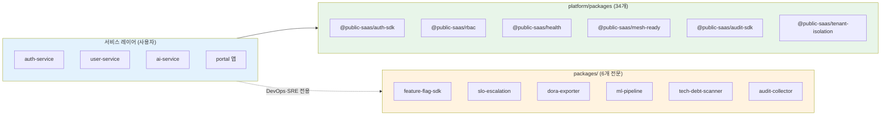
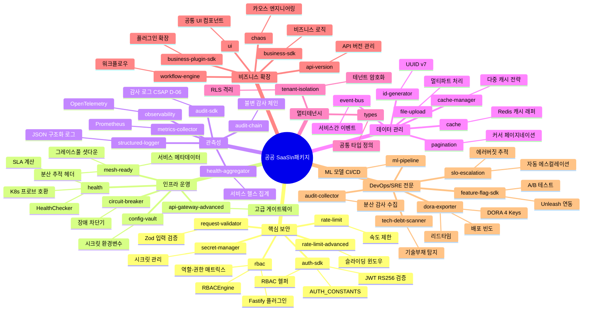
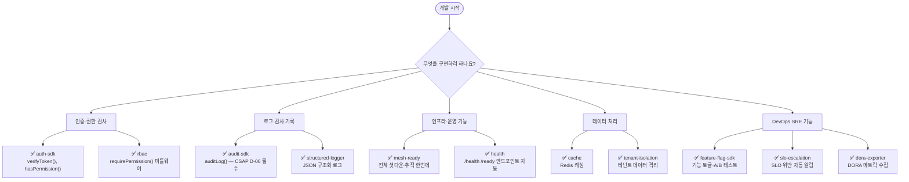

# 플랫폼 패키지 가이드

> **문서 ID**: ONBOARD-02-PKG-README
> **버전**: 1.1.0 | **작성일**: 2026-04-12 | **작성자**: Implementer (Sonnet)
> **경로**: `platform/packages/` + `packages/`
> **총 개수**: 34개 platform 패키지 + 6개 전문 패키지
> **패키지 접두사**: `@public-saas/`
> **예상 학습 시간**: 30분
> **CSAP 매핑**: D-06, D-07, D-08, D-09, D-12

---

## 개요

`platform/packages/` 하위의 내부 패키지(internal monorepo packages)는 14개 백엔드 서비스와 포털 앱이 공통으로 사용하는 기능을 제공합니다. 각 패키지는 단일 책임 원칙에 따라 분리되어 있으며, pnpm workspace를 통해 관리됩니다.

비유하자면, 레스토랑 주방의 공용 재료 창고입니다. 각 서비스는 검증된 공통 패키지를 가져다 쓰므로, 보안·인증·로깅 로직을 서비스마다 반복 구현하지 않아도 됩니다.

---

## 패키지 레이어 전체 구조

---

## 전체 패키지 마인드맵

---

## 패키지 전체 목록

### 인증 / 보안 / RBAC

| 패키지 | npm 이름 | 주요 export | 사용 서비스 |
|--------|---------|------------|-----------|
| `auth-sdk` | `@public-saas/auth-sdk` | `verifyToken`, `hasPermission`, `AUTH_CONSTANTS` | API Gateway, Auth Service |
| `rbac` | `@public-saas/rbac` | `rbacPlugin`, `requirePermission`, `requireAnyPermission`, `RBACEngine`, `ROLE_PERMISSIONS` | 전 서비스 |
| `secret-manager` | `@public-saas/secret-manager` | `SecretManager`, `secretPlugin` | 전 서비스 (시크릿 관리) |
| `request-validator` | `@public-saas/request-validator` | Zod 기반 입력 검증 미들웨어 | 전 서비스 |

### 관측성 / 감사 / 로깅

| 패키지 | npm 이름 | 주요 export | 사용 서비스 |
|--------|---------|------------|-----------|
| `audit-sdk` | `@public-saas/audit-sdk` | `AuditLogger`, `createAuditLogger`, `createServiceAuditLogger`, `createStandardTransport` | 전 서비스 |
| `observability` | `@public-saas/observability` | `initTelemetry`, `shutdownTelemetry`, `responseTimePlugin`, `MetricsCollector` | 전 서비스 |
| `structured-logger` | `@public-saas/structured-logger` | 구조화 로그 (NDJSON) | 전 서비스 |
| `audit-chain` | `@public-saas/audit-chain` | SHA-256 해시 체인 감사 로그 | Audit Service |

### 헬스체크 / 가용성

| 패키지 | npm 이름 | 주요 export | 사용 서비스 |
|--------|---------|------------|-----------|
| `health` | `@public-saas/health` | `healthPlugin`, `HealthChecker`, `CommonCheckers`, `HealthStatus` | 전 서비스 |
| `health-aggregator` | `@public-saas/health-aggregator` | `HealthAggregator`, `healthAggregatorPlugin` | 모니터링 서비스 |
| `mesh-ready` | `@public-saas/mesh-ready` | `meshReadyPlugin`, `GracefulShutdown` | 전 서비스 |

### 네트워크 / 회복성

| 패키지 | npm 이름 | 주요 export | 사용 서비스 |
|--------|---------|------------|-----------|
| `rate-limit` | `@public-saas/rate-limit` | `createRateLimiter` (고정 윈도우, Redis) | 전 서비스 |
| `rate-limit-advanced` | `@public-saas/rate-limit-advanced` | `SlidingWindowCounter`, `tenantRateLimiter`, `rateLimitPlugin` | AI, API Gateway |
| `rate-limiter` | `@public-saas/rate-limiter` | 레거시 Rate Limiter (하위 호환) | 일부 서비스 |
| `circuit-breaker` | `@public-saas/circuit-breaker` | `CircuitBreaker`, `CircuitOpenError`, `CircuitBreakerMetrics` | AI, 외부 연동 서비스 |
| `api-gateway-advanced` | `@public-saas/api-gateway-advanced` | 고급 API Gateway 기능 | API Gateway |

### 데이터 / 캐시 / 이벤트

| 패키지 | npm 이름 | 주요 export | 사용 서비스 |
|--------|---------|------------|-----------|
| `cache` | `@public-saas/cache` | `CacheStore`, `cachePlugin` | 전 서비스 |
| `cache-manager` | `@public-saas/cache-manager` | 다계층 캐시 관리 | AI, Catalog |
| `event-bus` | `@public-saas/event-bus` | `EventBus`, `EventBusOptions`, 와일드카드 pub/sub | 전 서비스 |
| `pagination` | `@public-saas/pagination` | 페이지네이션 유틸리티 | 전 서비스 |
| `id-generator` | `@public-saas/id-generator` | CUID2 기반 ID 생성 | 전 서비스 |

### 멀티테넌트 / 격리

| 패키지 | npm 이름 | 주요 export | 사용 서비스 |
|--------|---------|------------|-----------|
| `tenant-isolation` | `@public-saas/tenant-isolation` | `tenantIsolationPlugin`, `TenantContext`, `RowLevelSecurity`, `TenantEncryption` | 전 서비스 |

### 설정 / 기반

| 패키지 | npm 이름 | 주요 export | 사용 서비스 |
|--------|---------|------------|-----------|
| `types` | `@public-saas/types` | `TokenPayload`, `AuditEntry`, `Tenant`, `User` 등 공통 TypeScript 타입 | 전체 |
| `config-vault` | `@public-saas/config-vault` | `configPlugin` (환경변수 통합 관리) | 전 서비스 |
| `config-loader` | `@public-saas/config-loader` | 설정 파일 로더 | 일부 서비스 |
| `api-version` | `@public-saas/api-version` | API 버전 관리 헤더 미들웨어 | API Gateway |

### 비즈니스 / 도메인

| 패키지 | npm 이름 | 주요 export | 사용 서비스 |
|--------|---------|------------|-----------|
| `business-sdk` | `@public-saas/business-sdk` | 공공기관 비즈니스 로직 공통화 | Billing, Subscription |
| `business-plugin-sdk` | `@public-saas/business-plugin-sdk` | 비즈니스 플러그인 확장 SDK | 플러그인 서비스 |
| `workflow-engine` | `@public-saas/workflow-engine` | 비즈니스 워크플로우 실행 엔진 | 승인 프로세스 서비스 |

### UI / 파일 / 확장

| 패키지 | npm 이름 | 주요 export | 사용 서비스 |
|--------|---------|------------|-----------|
| `ui` | `@public-saas/ui` | 공통 UI 컴포넌트 (React) | Portal App |
| `file-upload` | `@public-saas/file-upload` | 파일 업로드 미들웨어 | File Service |
| `chaos` | `@public-saas/chaos` | 카오스 엔지니어링 도구 (테스트 전용) | 개발/테스트 환경 |

---

## packages/ — 루트 전문 패키지

`/data/ai-saas/packages/` 아래에 위치하는 DevOps·SRE·AI 전문 패키지입니다.

| 패키지 | npm 이름 | 설명 | 핵심 의존성 |
|--------|---------|------|-----------|
| `feature-flag-sdk` | `@public-saas/feature-flag-sdk` | Unleash 기반 기능 플래그 SDK. 로컬 캐시로 10ms 미만 응답. | unleash-client |
| `slo-escalation` | `@public-saas/slo-escalation` | SLO 에러버짓 소진 시 자동 에스컬레이션. 5단계 레벨 (Normal→Warning→Danger→Critical→Violated). | zod |
| `dora-exporter` | `@public-saas/dora-exporter` | DORA 4 Key 메트릭 수집·내보내기 (배포 빈도, 리드타임, MTTR, 변경 실패율). | - |
| `ml-pipeline` | `@public-saas/ml-pipeline` | ML 모델 CI/CD 파이프라인 (모델 학습·검증·배포 자동화). | - |
| `tech-debt-scanner` | `@public-saas/tech-debt-scanner` | 기술 부채 자동 탐지·리포팅. ts-prune 연동. | - |
| `audit-collector` | `@public-saas/audit-collector` | 분산 서비스 감사 로그 수집 통합. CSAP D-06 준수. | - |

---

## 패키지 선택 빠른 결정표

새 기능 개발 시 어떤 패키지를 사용해야 할지 빠르게 결정하는 표입니다.

---

## 카테고리별 심화 가이드

패키지 세부 사용법은 아래 문서를 참고하세요.

| 문서 | 대상 패키지 |
|------|-----------|
| [01-core-packages.md](./01-core-packages.md) | auth-sdk, rbac, audit-sdk, rate-limit vs rate-limit-advanced, secret-manager |
| [02-infra-packages.md](./02-infra-packages.md) | mesh-ready, health, health-aggregator, circuit-breaker, event-bus, tenant-isolation, feature-flag-sdk, slo-escalation |

---

## 패키지 사용 원칙

**1. 하드코딩 금지 (CSAP D-09)**
모든 시크릿은 환경 변수 또는 `secret-manager`를 통해 관리합니다. `auth-sdk`의 `AUTH_CONSTANTS`를 사용하고 JWT 만료 시간 등을 코드에 직접 작성하지 않습니다.

**2. 모든 엔드포인트에 RBAC 적용 (CSAP D-08)**
`@public-saas/rbac`의 `requirePermission()` 미들웨어를 모든 라우트에 적용합니다. 인증 없이 접근 가능한 엔드포인트는 `/health`, `/ready`뿐입니다.

**3. 감사 로그 필수 (CSAP D-06)**
데이터 변경이 발생하는 모든 핸들러에서 `createServiceAuditLogger()`로 생성된 로거를 호출합니다.

**4. Rate Limit 적용 (CSAP D-08-06)**
읽기/쓰기/삭제 작업별로 `createRateLimiter()`를 구분 적용합니다. Redis 미연결 시 가용성을 우선하여 통과시킵니다.

**5. 헬스체크 노출 (CSAP D-07)**
모든 서비스는 `healthPlugin`을 등록하고 DB 헬스체커 (`CommonCheckers.database()`)를 포함합니다.

---

## 변경 이력

| 버전 | 일자 | 내용 | 작성자 |
|------|------|------|------|
| 1.0.0 | 2026-04-11 | 최초 작성 | Implementer (Sonnet) |
| 1.1.0 | 2026-04-12 | 마인드맵 추가, 루트 packages/ 섹션, 패키지 선택 결정표 보강 | Implementer (Sonnet) |
