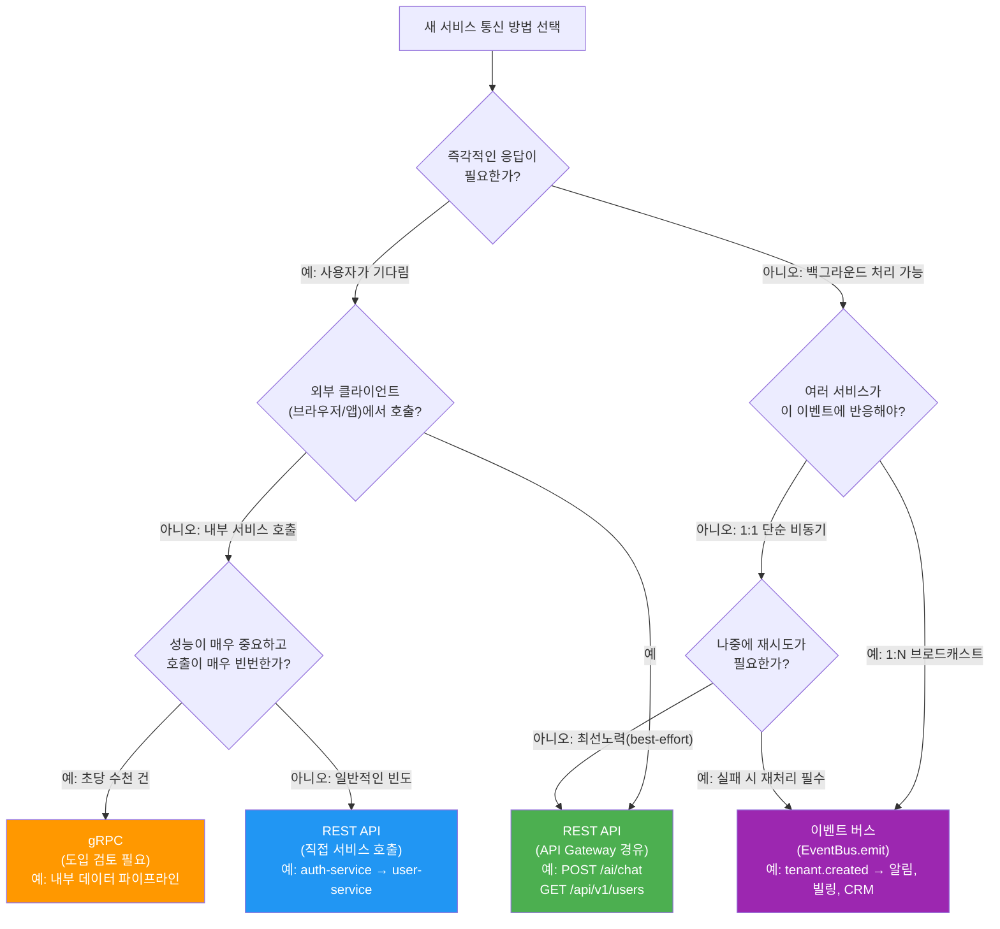
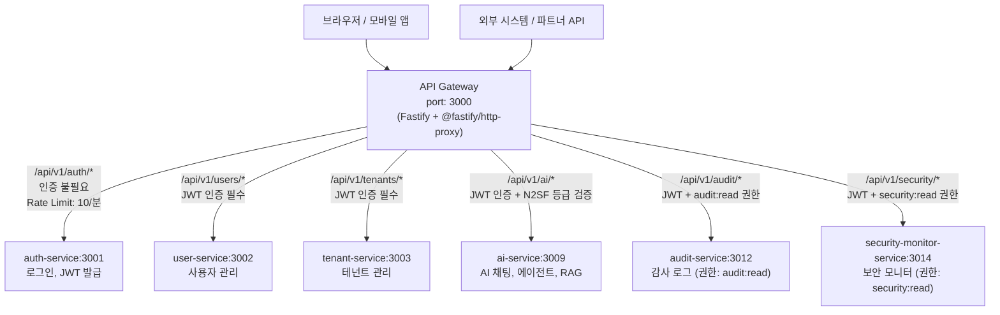
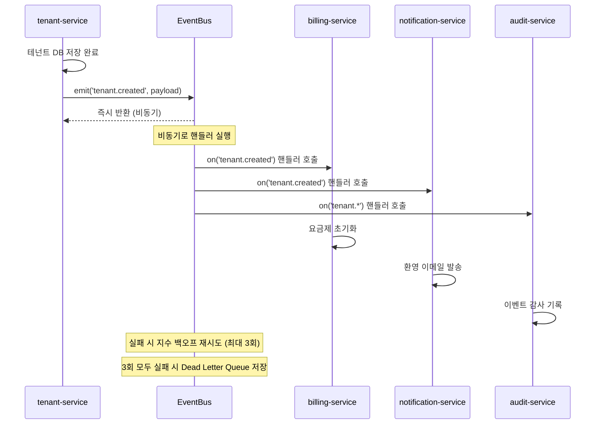
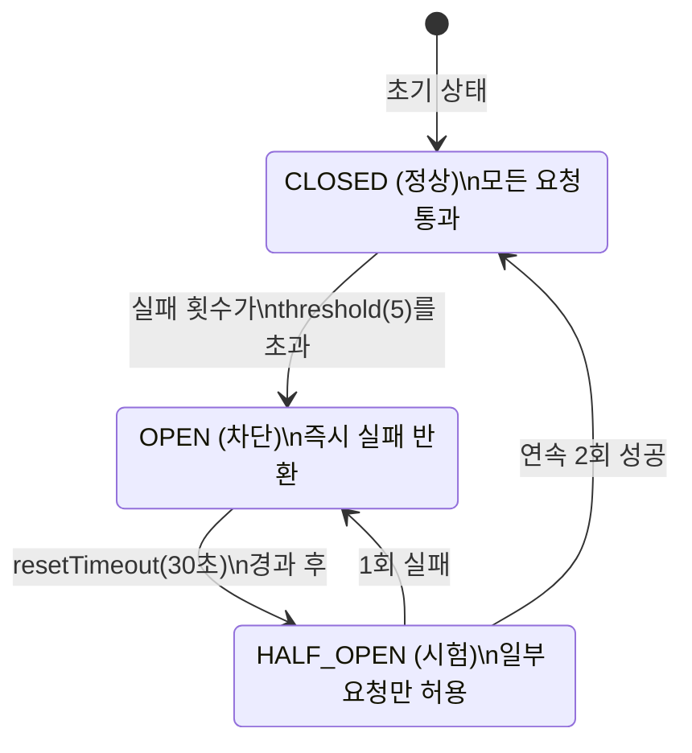
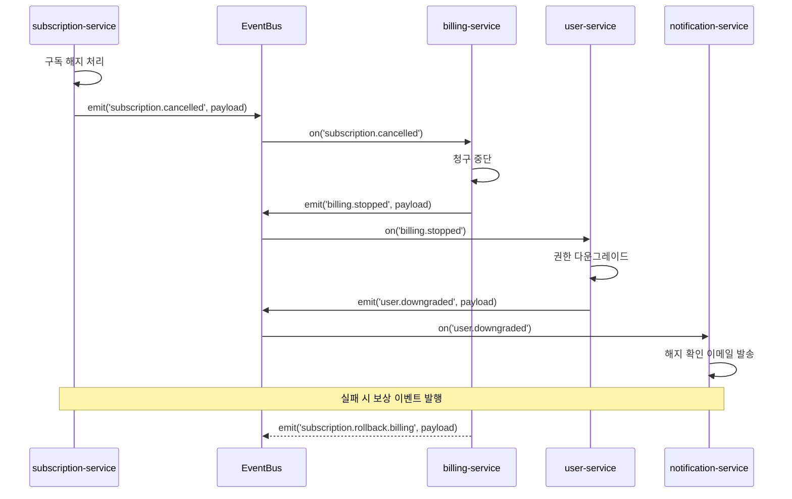
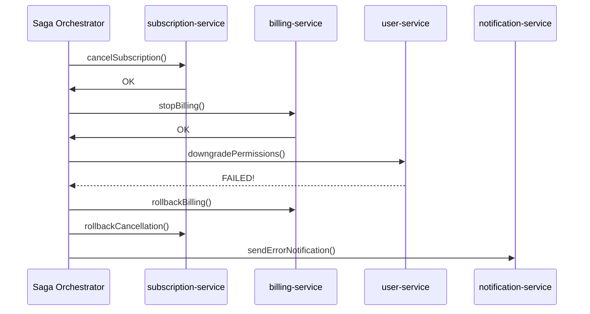
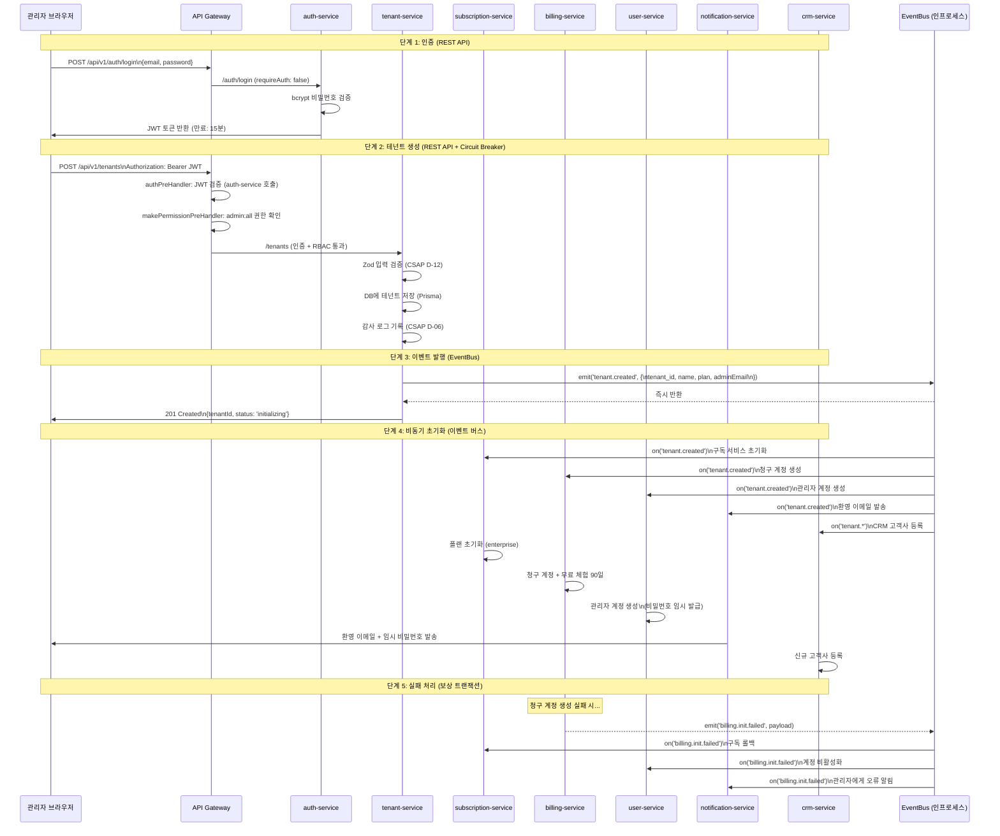

# 서비스 간 통신 패턴 가이드

> 이 가이드를 마치면 이 플랫폼의 14개 마이크로서비스가 서로 어떻게 통신하는지 이해하고,
> 새로운 서비스를 추가할 때 적절한 통신 패턴을 선택하며,
> Circuit Breaker와 Saga 패턴을 직접 구현할 수 있습니다.

## 목차

1. [서비스 간 통신 3가지 패턴](#1-서비스-간-통신-3가지-패턴)
2. [언제 무엇을 쓸까? 의사결정 트리](#2-언제-무엇을-쓸까-의사결정-트리)
3. [API Gateway 역할과 라우팅 전략](#3-api-gateway-역할과-라우팅-전략)
4. [이벤트 버스: 인프로세스 Pub/Sub](#4-이벤트-버스-인프로세스-pubsub)
5. [Circuit Breaker 패턴](#5-circuit-breaker-패턴)
6. [분산 트랜잭션: Saga 패턴](#6-분산-트랜잭션-saga-패턴)
7. [서비스 메시: Linkerd mTLS](#7-서비스-메시-linkerd-mtls)
8. [테넌트 생성 실제 플로우: 8개 서비스 협력](#8-테넌트-생성-실제-플로우-8개-서비스-협력)
9. [학습 체크리스트](#학습-체크리스트)
10. [다음 단계](#다음-단계)

---

## 1. 서비스 간 통신 3가지 패턴

이 플랫폼은 마이크로서비스 아키텍처를 사용합니다.
14개의 독립적인 서비스가 협력하여 하나의 SaaS 플랫폼을 구성합니다.
서비스들이 서로 통신하는 방법은 크게 3가지입니다.

### 1.1 REST API (동기 요청-응답)

```
클라이언트 → API Gateway → 대상 서비스 → 응답 반환
```

**특징**: 요청 후 즉시 응답을 받아야 하는 경우 사용합니다.
응답이 올 때까지 클라이언트는 기다립니다.

```typescript
// API Gateway의 프록시 라우트 등록 (proxy.ts 실제 코드)
// platform/services/api-gateway/src/routes/proxy.ts

// 서비스 레지스트리에서 자동으로 프록시 생성
for (const [serviceId, entry] of Object.entries(SERVICE_REGISTRY)) {
  await app.register(httpProxy, {
    upstream: entry.url,
    prefix: `/api/v1/${serviceId}`,
    rewritePrefix: `/${serviceId === 'auth' ? 'auth' : serviceId}`,
    http2: false,
    preHandler: compositePreHandler,  // 인증 + RBAC + 등급 검증
  });
}

// 결과: /api/v1/ai/* → http://ai-service:3009/ai/*
//       /api/v1/auth/* → http://auth-service:3001/auth/*
```

**장점**: 구현이 단순하고 즉각적인 피드백 가능
**단점**: 호출한 서비스가 다운되면 전체 요청 실패 (강결합)

### 1.2 이벤트 기반 통신 (비동기 Pub/Sub)

```
발행자(Publisher) → 이벤트 버스 → 구독자(Subscriber) (나중에 처리)
```

**특징**: 발행자는 응답을 기다리지 않고 이벤트를 발행하고 바로 다음 작업으로 넘어갑니다.
구독자는 독립적으로 이벤트를 처리합니다.

```typescript
// platform/packages/event-bus/src/event-bus.ts (실제 코드)
export class EventBus {
  // 이벤트 구독
  on<T = unknown>(event: string, handler: EventHandler<T>): void {
    if (!this.handlers.has(event)) {
      this.handlers.set(event, new Set());
    }
    this.handlers.get(event)!.add(handler as EventHandler);
  }

  // 이벤트 발행 — 모든 구독자에게 비동기로 전달
  async emit<T = unknown>(event: string, payload: T): Promise<void> {
    this.stats.published++;
    const matchingHandlers = this.getMatchingHandlers(event);
    for (const handler of matchingHandlers) {
      await this.executeWithRetry(event, payload, handler);
    }
  }

  // fire-and-forget 발행 (응답 불필요)
  emitSync<T = unknown>(event: string, payload: T): void {
    this.emit(event, payload).catch(() => { /* 데드레터 큐 처리 */ });
  }
}
```

**장점**: 서비스 간 느슨한 결합(loose coupling), 한 서비스 장애가 다른 서비스에 미치는 영향 최소화
**단점**: 디버깅이 어렵고 최종 일관성(eventual consistency)만 보장

### 1.3 gRPC (고성능 RPC)

```
클라이언트 stub → 네트워크 → 서버 stub → 처리 → 응답
```

**특징**: Protocol Buffers로 직렬화하여 REST보다 빠른 바이너리 통신을 수행합니다.
스트리밍을 지원하고 강한 타입 안전성을 제공합니다.

```
⚠️ 현재 상태: 이 프로젝트는 현재 REST API와 이벤트 버스를 주로 사용합니다.
   gRPC는 서비스 간 내부 통신 성능이 병목이 될 경우 도입을 검토합니다.
```

```protobuf
// 참고용 gRPC 서비스 정의 예시 (현재 미사용)
syntax = "proto3";

service TenantService {
  rpc CreateTenant(CreateTenantRequest) returns (TenantResponse);
  rpc GetTenant(GetTenantRequest) returns (TenantResponse);
  // 서버 사이드 스트리밍 — 이벤트를 실시간으로 클라이언트에 푸시
  rpc WatchTenantEvents(WatchRequest) returns (stream TenantEvent);
}
```

---

## 2. 언제 무엇을 쓸까? 의사결정 트리



### 실제 사례로 보는 선택 기준

| 시나리오 | 선택한 패턴 | 이유 |
|---------|-----------|------|
| 사용자가 AI 채팅 요청 | REST API (API Gateway) | 즉각 응답 필요 |
| 테넌트 생성 후 알림/빌링 초기화 | 이벤트 버스 | 여러 서비스에 1:N 전파 |
| JWT 토큰 검증 (매 요청마다) | REST API (내부) | 즉각 응답 + 중앙 인증 |
| DORA 배포 이벤트 기록 | 이벤트 버스 | 비동기, 여러 소비자 |
| SLO 위반 알림 에스컬레이션 | 이벤트 버스 + REST | 비동기 + 외부 API 호출 |

---

## 3. API Gateway 역할과 라우팅 전략

API Gateway는 이 플랫폼의 **단일 진입점(Single Entry Point)**입니다.
모든 외부 요청은 반드시 API Gateway를 통과해야 합니다.



### 서비스 레지스트리 구조

API Gateway의 라우팅은 `SERVICE_REGISTRY`에 선언적으로 정의됩니다.

```typescript
// platform/services/api-gateway/src/registry/service-registry.ts (실제 코드)

export const SERVICE_REGISTRY: Record<string, ServiceEntry> = {
  auth: {
    url: process.env['AUTH_SVC_URL'] ?? 'http://auth-service:3001',
    requireAuth: false, // 인증 서비스는 인증 불필요
    rateLimit: { max: 10, timeWindow: '1 minute' }, // 브루트포스 방지
  },
  users: {
    url: process.env['USER_SVC_URL'] ?? 'http://user-service:3002',
    requireAuth: true,
  },
  ai: {
    url: process.env['AI_SVC_URL'] ?? 'http://ai-service:3009',
    requireAuth: true,
    // 추가로 N2SF 데이터 등급 검증 미들웨어 적용 (routes/proxy.ts에서 처리)
  },
  audit: {
    url: process.env['AUDIT_SVC_URL'] ?? 'http://audit-service:3012',
    requireAuth: true,
    requiredPermissions: ['audit:read'],  // RBAC: 감사 권한 필요
  },
  security: {
    url: process.env['SECURITY_SVC_URL'] ?? 'http://security-monitor-service:3014',
    requireAuth: true,
    requiredPermissions: ['security:read'],  // RBAC: 보안 읽기 권한 필요
  },
};

// 비즈니스 플러그인을 동적으로 등록할 수 있는 메커니즘
const dynamicServices: Map<string, ServiceEntry> = new Map();

export function registerBusinessService(id: string, entry: ServiceEntry): void {
  dynamicServices.set(id, entry);
}
```

### API Gateway의 요청 처리 흐름

```typescript
// platform/services/api-gateway/src/routes/proxy.ts (실제 코드 축약)

// 각 서비스에 적용할 preHandler 체인 구성
for (const [serviceId, entry] of Object.entries(SERVICE_REGISTRY)) {
  const preHandlers = [];

  // 1단계: JWT 인증 검사 (requireAuth: true인 경우)
  if (entry.requireAuth) {
    preHandlers.push(authPreHandler);
  }

  // 2단계: N2SF 데이터 등급 검증 (AI 서비스만 해당)
  if (serviceId === 'ai') {
    preHandlers.push(dataGradeMiddleware(['O']));  // O 등급만 허용
  }

  // 3단계: RBAC 권한 검사 (requiredPermissions가 있는 경우)
  if (entry.requiredPermissions?.length) {
    preHandlers.push(makePermissionPreHandler(entry.requiredPermissions));
  }

  // preHandler 체인을 하나의 함수로 합성
  const compositePreHandler =
    preHandlers.length > 0
      ? async (req, reply) => {
          for (const handler of preHandlers) {
            await handler(req, reply);
            if (reply.sent) return; // 이전 단계에서 응답 완료 시 중단
          }
        }
      : undefined;

  // @fastify/http-proxy로 실제 프록시 등록
  await app.register(httpProxy, {
    upstream: entry.url,
    prefix: `/api/v1/${serviceId}`,
    rewritePrefix: `/${serviceId}`,
    preHandler: compositePreHandler,
  });
}
```

### 동적 서비스 (비즈니스 플러그인)

정적으로 등록된 플랫폼 서비스 외에, 비즈니스별 플러그인 서비스를 동적으로 등록할 수 있습니다.

```typescript
// 동적 플러그인 서비스 등록 예시
import { registerBusinessService } from '@public-saas/api-gateway/registry';

// 새로운 비즈니스 서비스를 API Gateway에 등록
registerBusinessService('my-custom-service', {
  url: 'http://my-custom-service:4000',
  requireAuth: true,
  requiredPermissions: ['custom:read'],
});

// 등록 후 자동으로 /api/v1/plugins/my-custom-service/* 경로로 접근 가능
```

---

## 4. 이벤트 버스: 인프로세스 Pub/Sub

### 4.1 EventBus 구조

이 프로젝트의 이벤트 버스는 Redis가 아닌 **인프로세스(in-process)** 구현입니다.
같은 Node.js 프로세스 내에서 서비스 간 결합도를 낮추는 역할을 합니다.

```typescript
// platform/packages/event-bus/src/event-bus.ts (실제 코드 핵심 부분)

export class EventBus {
  private readonly handlers = new Map<string, Set<EventHandler>>();
  private readonly deadLetterQueue: DeadLetterItem[] = [];
  private readonly maxRetries: number;

  // 지수 백오프 재시도 포함 핸들러 실행
  private async executeWithRetry(
    event: string,
    payload: unknown,
    handler: EventHandler,
  ): Promise<void> {
    let lastError: Error | null = null;

    for (let attempt = 0; attempt <= this.maxRetries; attempt++) {
      try {
        await handler(payload);
        this.stats.consumed++;
        return;
      } catch (err) {
        lastError = err instanceof Error ? err : new Error(String(err));
        if (attempt < this.maxRetries) {
          // 지수 백오프: 100ms → 200ms → 400ms
          const delay = this.retryBaseDelay * Math.pow(2, attempt);
          await this.sleep(delay);
        }
      }
    }

    // 모든 재시도 실패 → 데드레터 큐(DLQ)에 보관
    this.stats.failed++;
    this.addToDeadLetterQueue({
      event,
      payload,
      error: lastError?.message ?? 'Unknown error',
      timestamp: new Date().toISOString(),
      attempts: this.maxRetries + 1,
    });
  }

  // 와일드카드 패턴 지원
  // 예: 'tenant.*' → 'tenant.created', 'tenant.deleted' 모두 매칭
  private matchPattern(pattern: string, event: string): boolean {
    if (pattern === event) return true;
    if (pattern === '**') return true;
    // ... 와일드카드 매칭 로직
  }
}
```

### 4.2 이벤트 버스 사용 예시

```typescript
// 이벤트 버스 인스턴스 생성 및 사용 예시

import { EventBus } from '@public-saas/event-bus';

const eventBus = new EventBus({
  maxRetries: 3,           // 실패 시 최대 3회 재시도
  retryBaseDelay: 100,     // 첫 재시도 100ms 대기 (지수 백오프)
  maxDeadLetters: 1000,    // 데드레터 큐 최대 크기
});

// 구독 — 테넌트 생성 이벤트 처리
eventBus.on('tenant.created', async (payload: TenantCreatedEvent) => {
  console.log(`새 테넌트 생성됨: ${payload.tenantId}`);
  await billingService.initializeTenant(payload.tenantId, payload.plan);
});

eventBus.on('tenant.created', async (payload: TenantCreatedEvent) => {
  await notificationService.sendWelcomeEmail(payload.adminEmail);
});

// 와일드카드 구독 — 모든 테넌트 이벤트
eventBus.on('tenant.*', async (payload: unknown) => {
  await auditService.logTenantEvent(payload);
});

// 발행 — 다음 구독자들이 비동기로 실행됨
await eventBus.emit('tenant.created', {
  tenantId: 'abc-123',
  tenantName: '행정안전부',
  plan: 'enterprise',
  adminEmail: 'admin@mois.go.kr',
});

// 통계 확인
const stats = eventBus.getStats();
console.log(`발행: ${stats.published}, 소비: ${stats.consumed}, 실패: ${stats.failed}`);

// 데드레터 큐 확인 (처리 실패한 이벤트)
const deadLetters = eventBus.getDeadLetters();
```



### 4.3 데드레터 큐(DLQ) 처리

```typescript
// 데드레터 큐에 쌓인 이벤트 처리 (운영 도구)

async function processDeadLetters(): Promise<void> {
  const deadLetters = eventBus.getDeadLetters();

  for (const item of deadLetters) {
    console.error('처리 실패 이벤트:', {
      event: item.event,
      error: item.error,
      attempts: item.attempts,
      timestamp: item.timestamp,
    });

    // 수동 재처리 또는 알림 발송
    await alertingService.notify({
      severity: 'WARNING',
      message: `이벤트 처리 실패: ${item.event}`,
      metadata: item,
    });
  }

  eventBus.clearDeadLetters();
}

// 주기적으로 DLQ 확인
setInterval(processDeadLetters, 60 * 1000); // 1분마다
```

---

## 5. Circuit Breaker 패턴

### 5.1 Circuit Breaker가 없으면 어떻게 될까?

서킷 브레이커 없이 A → B → C 형태로 연결된 서비스에서 C 서비스가 다운되면:

```
시나리오: ai-service가 RAG 쿼리를 위해 vector-store에 연결

1. ai-service → vector-store (다운됨) → 30초 대기 후 타임아웃
2. 그 사이 10개의 새 요청이 들어옴 → 모두 30초씩 대기
3. ai-service의 쓰레드 풀이 꽉 참 → ai-service도 응답 불가
4. api-gateway → ai-service (응답 없음) → api-gateway도 쓰레드 고갈
5. 전체 플랫폼이 연쇄 장애(Cascading Failure)로 다운

이를 "장애 전파(Failure Propagation)" 또는 "서비스 스톰(Service Storm)"이라고 합니다.
```

### 5.2 Circuit Breaker 3가지 상태



### 5.3 실제 구현 코드

```typescript
// platform/services/api-gateway/src/lib/circuit-breaker.ts (실제 코드)

class CircuitBreakerManager {
  private circuits: Map<string, CircuitBreakerState> = new Map();
  private options: CircuitBreakerOptions;

  // Circuit Breaker를 통해 요청 실행
  async execute<T>(serviceId: string, action: () => Promise<T>): Promise<T> {
    const circuit = this.getCircuit(serviceId);

    // OPEN 상태: 즉시 실패 반환 (서비스 보호)
    if (circuit.state === 'OPEN') {
      const elapsed = Date.now() - circuit.lastFailureTime;
      if (elapsed >= this.options.resetTimeout) {
        // 30초 경과 → HALF_OPEN으로 전환 (복구 시도)
        circuit.state = 'HALF_OPEN';
        circuit.successCount = 0;
      } else {
        // 아직 30초 미경과 → 즉시 거부
        throw new CircuitOpenError(serviceId, this.options.resetTimeout - elapsed);
      }
    }

    // 타임아웃 포함 실행
    try {
      const result = await this.withTimeout(action(), this.options.requestTimeout);
      this.onSuccess(circuit);
      return result;
    } catch (error) {
      this.onFailure(circuit);
      throw error;
    }
  }

  private onSuccess(circuit: CircuitBreakerState): void {
    if (circuit.state === 'HALF_OPEN') {
      circuit.successCount += 1;
      // HALF_OPEN에서 2회 연속 성공 → CLOSED 복귀
      if (circuit.successCount >= 2) {
        circuit.state = 'CLOSED';
        circuit.failureCount = 0;
      }
    } else {
      circuit.failureCount = 0;
    }
  }

  private onFailure(circuit: CircuitBreakerState): void {
    circuit.failureCount += 1;
    circuit.lastFailureTime = Date.now();

    if (circuit.state === 'HALF_OPEN') {
      circuit.state = 'OPEN';  // HALF_OPEN에서 실패 → 다시 OPEN
    } else if (circuit.failureCount >= this.options.failureThreshold) {
      circuit.state = 'OPEN';  // 실패 횟수 초과 → OPEN
    }
  }
}

// 싱글턴 인스턴스 (기본 설정: 5회 실패, 30초 차단, 10초 타임아웃)
export const circuitBreaker = new CircuitBreakerManager({
  failureThreshold: 5,
  resetTimeout: 30000,   // 30초
  requestTimeout: 10000, // 10초
});
```

### 5.4 API Gateway에서의 Circuit Breaker 사용

```typescript
// platform/services/api-gateway/src/routes/proxy.ts (실제 코드)

// 동적 플러그인 서비스 호출 시 Circuit Breaker 적용
const proxyResponse = await circuitBreaker.execute(params.pluginId, () =>
  fetch(targetUrl, {
    method: request.method,
    headers: { /* ... */ },
    body: /* ... */,
    signal: AbortSignal.timeout(30000), // CSAP D-07: 프록시 타임아웃 30초
  }),
);

// Circuit Breaker OPEN 시 503 반환
} catch (error) {
  if (error instanceof CircuitOpenError) {
    app.log.warn({ serviceId: params.pluginId }, `Circuit breaker OPEN: ${params.pluginId}`);
    await reply.status(503).send({
      success: false,
      error: {
        code: 'SERVICE_UNAVAILABLE',
        message: error.message,        // "ai-service가 일시적으로 차단됨. N초 후 재시도"
        retryAfterMs: error.retryAfterMs,
      },
    });
    return;
  }
}
```

---

## 6. 분산 트랜잭션: Saga 패턴

마이크로서비스에서는 하나의 비즈니스 작업이 여러 서비스에 걸쳐 있습니다.
예를 들어, "테넌트 구독 해지"는 다음 서비스를 모두 업데이트해야 합니다:
subscription-service → billing-service → user-service → notification-service

이 때 중간에 하나가 실패하면 어떻게 롤백할까요? **Saga 패턴**이 해결책입니다.

### 6.1 Saga 두 가지 방식

**Choreography Saga** (안무형 - 이 프로젝트 이벤트 버스 패턴):



**Orchestration Saga** (조율형):



### 6.2 Saga 패턴 구현 예시

```typescript
// Choreography Saga — 이벤트 버스 기반 (이 프로젝트 권장 방식)

// 각 서비스에서 이벤트 구독 및 보상 이벤트 발행

// subscription-service
eventBus.on('subscription.cancel.requested', async (payload: CancelPayload) => {
  try {
    await db.subscription.update({
      where: { tenantId: payload.tenantId },
      data: { status: 'CANCELLING' },
    });
    await eventBus.emit('subscription.cancelled', payload);
  } catch (error) {
    await eventBus.emit('subscription.cancel.failed', {
      ...payload,
      error: 'DB 업데이트 실패',
    });
  }
});

// billing-service — subscription.cancelled 구독
eventBus.on('subscription.cancelled', async (payload: CancelPayload) => {
  try {
    await billingDb.stopBilling(payload.tenantId);
    await eventBus.emit('billing.stopped', payload);
  } catch (error) {
    // 보상 트랜잭션: 구독 해지 취소 요청
    await eventBus.emit('subscription.cancel.rollback', {
      ...payload,
      reason: '빌링 중단 실패',
    });
  }
});

// subscription-service — 보상 이벤트 처리
eventBus.on('subscription.cancel.rollback', async (payload: RollbackPayload) => {
  await db.subscription.update({
    where: { tenantId: payload.tenantId },
    data: { status: 'ACTIVE' },  // 원래 상태로 복귀
  });
  await notificationService.sendAlert(
    `구독 해지 실패: ${payload.reason}`,
    payload.adminEmail,
  );
});
```

---

## 7. 서비스 메시: Linkerd mTLS

### 7.1 Linkerd란?

Linkerd는 Kubernetes 위에서 동작하는 경량 서비스 메시입니다.
서비스 간 모든 통신에 **mTLS(상호 TLS)**를 자동으로 적용합니다.

```
일반 TLS: 클라이언트가 서버를 인증 (단방향)
mTLS:    클라이언트와 서버가 서로를 인증 (양방향)

효과:
- 서비스 A → 서비스 B 통신에서 A가 B를 사칭할 수 없음
- 네트워크 도청 불가 (암호화)
- CSAP D-09(암호화) 요건 자동 충족
```

### 7.2 이 프로젝트에서 Linkerd 설정

```yaml
# k8s/linkerd-annotation.yml
# 모든 서비스 Deployment에 Linkerd 주입 활성화

apiVersion: apps/v1
kind: Deployment
metadata:
  name: ai-service
  namespace: public-saas
  annotations:
    linkerd.io/inject: enabled  # Linkerd 사이드카 자동 주입
spec:
  template:
    metadata:
      annotations:
        linkerd.io/inject: enabled
    spec:
      containers:
        - name: ai-service
          image: public-saas/ai-service:latest
          # Linkerd 프록시가 사이드카로 자동 추가됨
          # 모든 인/아웃바운드 트래픽을 가로채서 mTLS 적용
```

```bash
# Linkerd 트래픽 정책 — 특정 서비스 간 통신만 허용

# ai-service → vector-store만 허용 (다른 서비스에서 직접 접근 차단)
kubectl apply -f - <<EOF
apiVersion: policy.linkerd.io/v1beta3
kind: Server
metadata:
  name: vector-store-server
  namespace: public-saas
spec:
  podSelector:
    matchLabels:
      app: vector-store
  port: 6333
  proxyProtocol: HTTP/2
---
apiVersion: policy.linkerd.io/v1beta3
kind: AuthorizationPolicy
metadata:
  name: allow-ai-service-to-vector-store
  namespace: public-saas
spec:
  targetRef:
    group: policy.linkerd.io
    kind: Server
    name: vector-store-server
  requiredAuthenticationRefs:
    - name: ai-service-identity
      kind: MeshTLSAuthentication
EOF
```

### 7.3 Linkerd 관측성

```bash
# 서비스 간 트래픽 실시간 확인
linkerd viz top deployment/ai-service

# 서비스 메시 대시보드 (Grafana 연동)
linkerd viz dashboard &

# 서비스 간 성공률, 레이턴시, 요청수 확인
linkerd viz stat deployment -n public-saas
```

---

## 8. 테넌트 생성 실제 플로우: 8개 서비스 협력

실제 비즈니스 플로우를 통해 서비스 간 통신 패턴이 어떻게 사용되는지 살펴봅니다.

새로운 공공기관(테넌트)이 SaaS 플랫폼에 가입하는 과정을 추적합니다.



### 8.1 흐름 설명

**단계 1 - 인증 (REST API)**
- 관리자가 로그인하면 API Gateway가 auth-service로 요청을 전달합니다
- `requireAuth: false`이므로 JWT 없이 직접 접근 가능합니다
- 성공 시 15분짜리 JWT 토큰을 반환합니다

**단계 2 - 테넌트 생성 (REST API)**
- JWT가 있어야 접근 가능합니다 (`requireAuth: true`)
- API Gateway가 auth-service에 JWT 유효성 검증을 요청합니다 (동기 REST)
- 검증 통과 후 tenant-service로 요청을 전달합니다

**단계 3 - 이벤트 발행 (EventBus)**
- tenant-service가 DB 저장 완료 후 `tenant.created` 이벤트를 발행합니다
- 이벤트 발행은 비동기이므로 즉시 201 응답을 반환합니다
- 뒤에서 5개 서비스가 각자 독립적으로 초기화를 수행합니다

**단계 4 - 비동기 초기화 (EventBus)**
- 각 서비스는 `tenant.created` 이벤트를 구독하고 있습니다
- 서비스들이 독립적으로 실행되므로 하나가 느려도 다른 서비스에 영향이 없습니다
- 실패 시 최대 3회 재시도합니다

**단계 5 - 실패 처리 (Saga Choreography)**
- 빌링 초기화가 실패하면 보상 이벤트를 발행합니다
- 다른 서비스들이 보상 이벤트를 받아 자신의 작업을 롤백합니다
- Orchestrator 없이 각 서비스가 스스로 보상을 처리합니다

### 8.2 상태 확인 API

```typescript
// 테넌트 생성 상태 확인 (폴링 방식)
app.get('/api/v1/tenants/:tenantId/status', async (req, reply) => {
  const tenant = await prisma.tenant.findUnique({
    where: { id: req.params.tenantId },
    include: {
      subscription: true,
      billing: true,
    },
  });

  return reply.send({
    tenantId: tenant.id,
    status: tenant.status, // 'initializing' | 'active' | 'failed'
    initialized: {
      subscription: tenant.subscription?.status === 'active',
      billing: tenant.billing?.accountId != null,
    },
  });
});
```

---

## 학습 체크리스트

이 가이드를 완료한 후 다음 항목들을 스스로 확인해 보세요.

**통신 패턴 이해**
- [ ] REST API, 이벤트 버스, gRPC 세 가지 패턴의 차이를 설명할 수 있다
- [ ] 주어진 시나리오에서 어떤 통신 패턴을 선택해야 할지 결정할 수 있다
- [ ] 동기(synchronous)와 비동기(asynchronous) 통신의 장단점을 설명할 수 있다

**API Gateway**
- [ ] `SERVICE_REGISTRY`에 새 서비스를 추가하는 방법을 알고 있다
- [ ] `requireAuth`, `requiredPermissions` 설정의 의미를 이해했다
- [ ] API Gateway의 preHandler 체인(인증 → 등급검증 → RBAC)을 설명할 수 있다

**EventBus**
- [ ] `on()`, `emit()`, `emitSync()`의 차이를 설명할 수 있다
- [ ] 와일드카드 패턴 (`tenant.*`, `**`)이 어떻게 동작하는지 안다
- [ ] 데드레터 큐(DLQ)가 왜 필요한지 설명할 수 있다

**Circuit Breaker**
- [ ] CLOSED, OPEN, HALF_OPEN 세 가지 상태를 설명할 수 있다
- [ ] Circuit Breaker가 없으면 연쇄 장애(Cascading Failure)가 발생하는 이유를 안다
- [ ] `failureThreshold`, `resetTimeout` 파라미터의 역할을 이해했다

**Saga 패턴**
- [ ] Choreography Saga와 Orchestration Saga의 차이를 설명할 수 있다
- [ ] 보상 트랜잭션(Compensating Transaction)이 무엇인지 이해했다
- [ ] 테넌트 생성 플로우에서 8개 서비스가 어떻게 협력하는지 추적할 수 있다

**Linkerd 서비스 메시**
- [ ] mTLS가 단방향 TLS와 어떻게 다른지 설명할 수 있다
- [ ] `linkerd.io/inject: enabled` 어노테이션의 역할을 안다
- [ ] Linkerd 트래픽 정책으로 서비스 간 접근을 제어하는 방법을 이해했다

---

## 다음 단계

서비스 간 통신 패턴을 마스터했다면, 다음 가이드로 이어가세요.

- **개별 서비스 상세**: `02-architecture/services/01-api-gateway.md` — API Gateway 내부 구조 심화
- **AI 서비스**: `02-architecture/services/05-ai-service.md` — RAG, 에이전트, N2SF 등급 처리
- **이벤트 설계**: `03-development/` — 새 이벤트 추가 시 설계 문서 작성 방법
- **장애 대응**: `09-troubleshooting/` — Circuit Breaker 알람 대응, 데드레터 큐 처리

```
💡 실무 팁: 새 기능을 추가할 때 "이 서비스 간 통신이 실패하면 어떻게 되는가?"를
   항상 생각하세요. Circuit Breaker, 재시도, 데드레터 큐, 보상 트랜잭션 중
   어떤 전략이 필요한지를 설계 문서에 명시하고 구현하세요.
```
