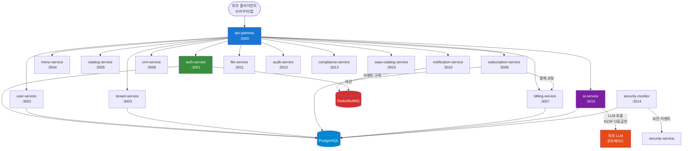
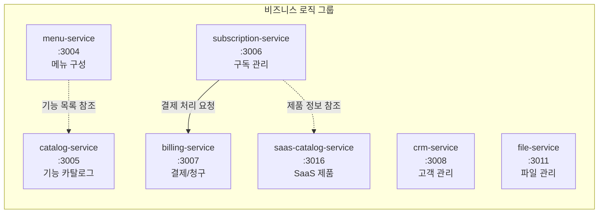
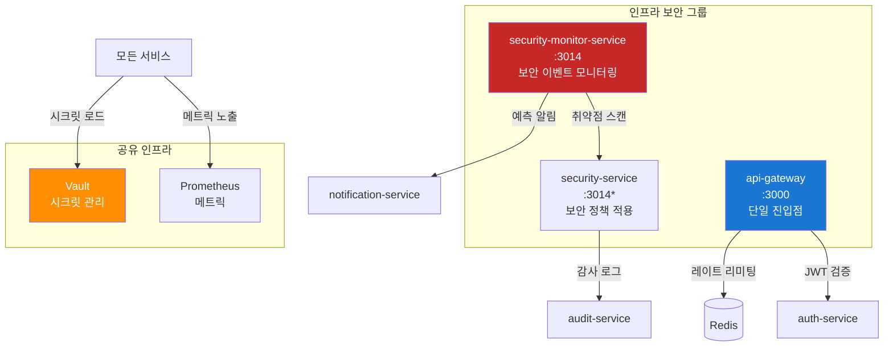
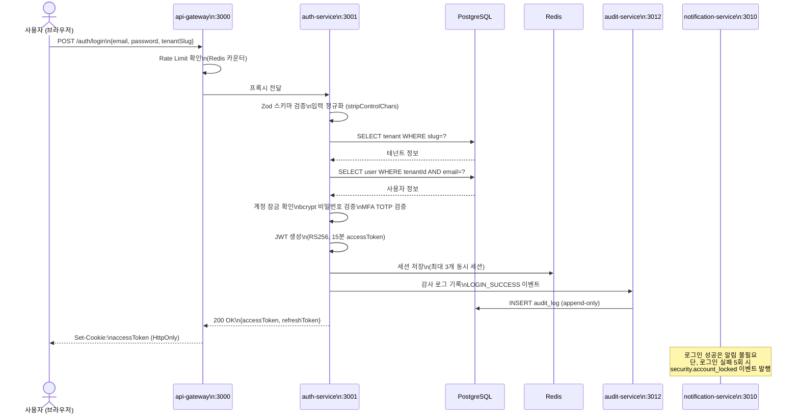
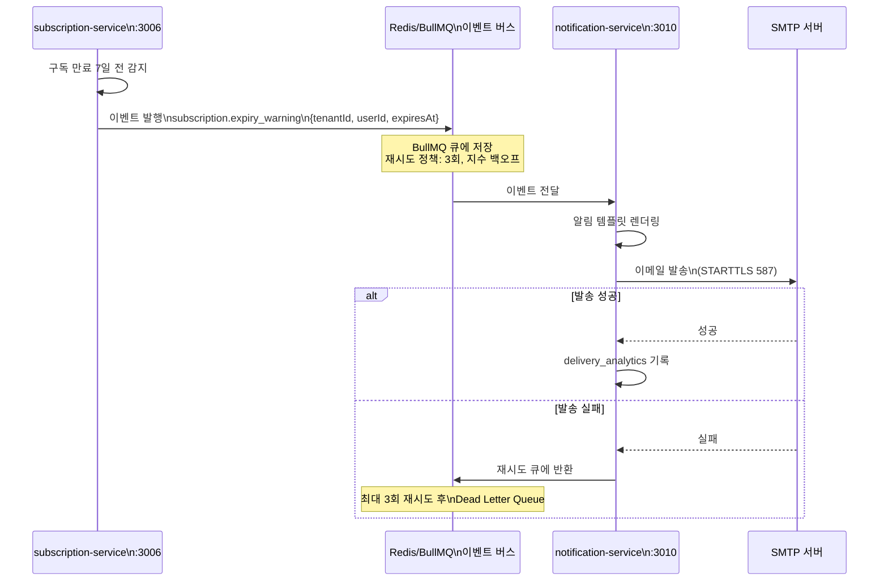
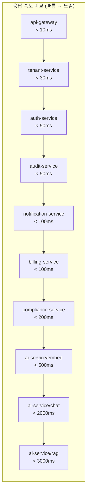

# 17개 마이크로서비스 비교 분석 — 언제 어떤 서비스를 써야 하나

> **문서 ID**: ARCH-SVC-COMP-00
> **버전**: 1.0.0 | **작성일**: 2026-04-12 | **작성자**: Implementer (Sonnet)
> **목적**: 17개 마이크로서비스의 역할과 차이를 이해하고 신규 기능 개발 시 올바른 서비스를 선택한다
> **선행 학습**: [02-architecture/01-system-overview.md](../01-system-overview.md), [02-architecture/04-service-interactions.md](../04-service-interactions.md)

---

## 목차

1. [전체 서비스 개요](#1-전체-서비스-개요)
2. [도메인별 그룹 분류](#2-도메인별-그룹-분류)
3. [서비스 간 호출 패턴](#3-서비스-간-호출-패턴)
4. [포트 번호 완전 목록](#4-포트-번호-완전-목록)
5. [신규 기능 개발 시 어느 서비스에 추가할까](#5-신규-기능-개발-시-어느-서비스에-추가할까)
6. [서비스별 테스트 전략 비교](#6-서비스별-테스트-전략-비교)
7. [성능 특성 비교](#7-성능-특성-비교)
8. [변경 이력](#변경-이력)

---

## 1. 전체 서비스 개요

### 1.1 17개 서비스 한눈에 보기

아래 표는 `platform/services/` 디렉토리의 실제 서비스 목록입니다.

| # | 서비스명 | 역할 요약 | 포트 | 주요 의존 서비스 | 그룹 |
|---|---------|---------|------|--------------|------|
| 1 | api-gateway | 외부 트래픽 단일 진입점, 라우팅, 인증 전처리 | 3000 | auth-service, 전 서비스 | 인프라 |
| 2 | auth-service | JWT 발급/검증, 로그인/로그아웃, MFA, 세션 관리 | 3001 | PostgreSQL, Redis | 인증/인가 |
| 3 | user-service | 사용자 프로필 CRUD, 역할 관리 | 3002 | PostgreSQL, auth-service | 인증/인가 |
| 4 | tenant-service | 테넌트 생성/관리, 격리 정책, 사용량 | 3003 | PostgreSQL, Redis | 인증/인가 |
| 5 | menu-service | 동적 메뉴 구성, 역할별 메뉴 노출 제어 | 3004 | PostgreSQL | 비즈니스 |
| 6 | catalog-service | 서비스 카탈로그 (구독 가능한 제품 목록) | 3005 | PostgreSQL | 비즈니스 |
| 7 | subscription-service | 구독 라이프사이클 (생성/갱신/취소/만료) | 3006 | PostgreSQL, billing-service | 비즈니스 |
| 8 | billing-service | 청구/결제 처리, 인보이스 생성 | 3007 | PostgreSQL, subscription-service | 비즈니스 |
| 9 | crm-service | 고객 관계 관리, 연락처, 상담 이력 | 3008 | PostgreSQL | 비즈니스 |
| 10 | notification-service | 이메일/푸시 알림 발송, 알림 이력 | 3010 | PostgreSQL, Redis(BullMQ) | 알림/통신 |
| 11 | file-service | 파일 업로드/다운로드, 스토리지 관리 | 3011 | PostgreSQL, S3/MinIO | 비즈니스 |
| 12 | audit-service | 감사 로그 수집/조회, append-only 보장 | 3012 | PostgreSQL | AI/데이터 |
| 13 | compliance-service | CSAP 체크리스트, 플랫폼 성숙도 평가 | 3013 | PostgreSQL | AI/데이터 |
| 14 | security-monitor-service | 보안 이벤트 모니터링, 예측 알림, 취약점 스캔 | 3014 | PostgreSQL, security-service | 인프라 보안 |
| 15 | security-service | 감사 클라이언트, 보안 정책 적용 | 3014* | PostgreSQL | 인프라 보안 |
| 16 | ai-service | LLM 연동, RAG, 에이전트, AI 워크플로우 | 3015 | PostgreSQL, 외부 LLM | AI/데이터 |
| 17 | saas-catalog-service | SaaS 제품 카탈로그 (멀티테넌트 전용) | 3016 | PostgreSQL | 비즈니스 |

> **주의**: security-monitor-service와 security-service가 모두 3014 포트를 기본값으로 설정합니다.
> 동일 클러스터에 배포 시 환경 변수(`SECURITY_SERVICE_PORT`)로 구분해야 합니다.
> 자세한 내용은 [섹션 4](#4-포트-번호-완전-목록)를 참조하세요.

### 1.2 전체 서비스 의존성 그래프



---

## 2. 도메인별 그룹 분류

### 2.1 인증/인가 그룹: auth-service, user-service, tenant-service

이 세 서비스는 "누가, 어느 테넌트에서, 무엇을 할 수 있는가"를 담당합니다.

#### auth-service vs user-service: 무엇이 다른가?

| 구분 | auth-service | user-service |
|------|-------------|-------------|
| **핵심 역할** | 신원 증명 (인증) | 사용자 데이터 관리 (CRUD) |
| **주요 API** | POST /auth/login, POST /auth/refresh | GET /users, POST /users |
| **JWT 발급** | 예 | 아니오 |
| **비밀번호 관리** | 예 (bcrypt 해시) | 아니오 |
| **MFA** | 예 (TOTP) | 아니오 |
| **세션 관리** | 예 (Redis) | 아니오 |
| **사용자 프로필 수정** | 아니오 | 예 |
| **역할 할당** | 아니오 (읽기만) | 예 |
| **포트** | 3001 | 3002 |

**실제 코드 근거** (`auth-service/src/index.ts`):
```typescript
// auth-service: 로그인 핸들러에서 JWT 발급 + Redis 세션 생성
// auth-service/src/handlers/login.handler.ts
const accessToken = await signAccessToken({ sub: user.id, tenantId, role, permissions })
await createSession(user.id, { token: accessToken, refreshToken, ip, userAgent })
// 이 이후 사용자 프로필 변경은 user-service가 담당
```

**규칙**: "로그인/로그아웃/토큰 갱신" → auth-service. "사용자 정보 조회/수정" → user-service.

#### auth-service vs tenant-service: 무엇이 다른가?

| 구분 | auth-service | tenant-service |
|------|-------------|---------------|
| **핵심 역할** | 사용자 신원 증명 | 테넌트 조직 관리 |
| **주요 데이터** | 사용자 세션, JWT 토큰 | 테넌트 설정, 사용량, 격리 정책 |
| **tenantId 검증** | JWT에서 추출 후 검증 | 테넌트 존재/상태 확인 |
| **격리 플러그인** | 아니오 | 예 (`tenantIsolationPlugin`) |
| **포트** | 3001 | 3003 |

**실제 코드 근거** (`tenant-service/src/index.ts`):
```typescript
// tenant-service는 tenantIsolationPlugin으로 테넌트 데이터 격리 강제
// tenant-service/src/lib/isolation.ts: getTenantFilter()가 모든 쿼리에 tenantId 주입
await app.register(tenantIsolationPlugin, {
  masterKey: masterKey || undefined,
  tenantColumn: 'tenant_id',
  requireTenantHeader: true,  // X-Tenant-Id 헤더 필수
})
```

### 2.2 비즈니스 로직 그룹

#### billing-service vs subscription-service: 언제 무엇을 호출?

이 둘의 관계는 "구독이 무엇인가(what)"와 "돈을 어떻게 처리하는가(how)"로 구분됩니다.

| 구분 | subscription-service | billing-service |
|------|---------------------|----------------|
| **핵심 역할** | 구독 상태 관리 | 결제/청구 처리 |
| **주요 데이터** | 구독 플랜, 만료일, 상태 | 인보이스, 결제 내역, 환불 |
| **직접 호출 시점** | 구독 생성/취소/갱신 조회 | 인보이스 발행, 결제 상태 확인 |
| **경유 관계** | billing-service를 호출함 | subscription-service에 의해 호출됨 |
| **이벤트** | subscription.expiry_warning 발행 | 결제 성공/실패 이벤트 발행 |
| **포트** | 3006 | 3007 |

**결정 규칙**:
- "이 테넌트가 어떤 플랜을 구독 중인가?" → subscription-service
- "이 달 청구 금액은?" → billing-service
- "구독을 취소하면 환불은?" → subscription-service → billing-service 순서로 호출

#### catalog-service vs saas-catalog-service: 무엇이 다른가?

| 구분 | catalog-service | saas-catalog-service |
|------|----------------|---------------------|
| **대상** | 서비스 기능 카탈로그 (내부) | SaaS 제품 카탈로그 (멀티테넌트) |
| **주요 사용처** | 메뉴 구성, 권한 매핑 | 테넌트가 구독할 수 있는 SaaS 제품 목록 |
| **포트** | 3005 | 3016 |

**결정 규칙**: 시스템 내부 기능 목록 관리 → catalog-service. 외부 고객에게 노출되는 SaaS 제품 목록 → saas-catalog-service.

#### 비즈니스 그룹 서비스 클러스터



### 2.3 알림/통신 그룹: notification-service

이 프로젝트에는 notification-service 하나만 존재합니다.
외부 시스템으로 보내는 웹훅 기능도 notification-service 내부의
`src/lib/webhook-sender.ts`가 담당합니다.

**notification-service의 두 가지 역할**:

| 역할 | 대상 | 채널 | 코드 위치 |
|------|------|------|----------|
| 내부 사용자 알림 | 내부 사용자 (이메일, 푸시) | SMTP, 앱 알림 | notification.handler.ts |
| 외부 시스템 웹훅 | 외부 시스템 | HTTPS 웹훅 | webhook-sender.ts |

**이벤트 기반 트리거** (`notification-service/src/index.ts`에서 실제 확인):
```typescript
// 이 서비스는 다른 서비스의 이벤트를 구독하여 알림을 발송합니다
app.events.on('user.created', async (payload) => { /* 신규 사용자 환영 알림 */ })
app.events.on('security.account_locked', async (payload) => { /* 계정 잠금 보안 알림 */ })
app.events.on('subscription.expiry_warning', async (payload) => { /* 구독 만료 알림 */ })
app.events.on('auth.login_failed', async (payload) => { /* 로그인 실패 보안 알림 */ })
```

**결정 규칙**: 사용자나 외부 시스템에 무언가를 발송해야 한다면 → notification-service.
직접 HTTP 호출이 아닌 이벤트 버스(BullMQ)를 통해 비동기로 처리합니다.

### 2.4 AI/데이터 그룹: ai-service, audit-service, compliance-service

| 구분 | ai-service | audit-service | compliance-service |
|------|-----------|--------------|-------------------|
| **핵심 역할** | LLM 연동, RAG, 에이전트 | 감사 로그 수집/조회 | CSAP 준수 검증 |
| **외부 API** | LLM API (O등급 데이터만) | 없음 | 없음 |
| **데이터 특성** | AI 모델 설정, 사용량 | append-only 감사 로그 | CSAP 체크리스트 |
| **N2SF 관련** | PII 마스킹 + O등급 필터 | 감사 데이터 보존 1년 | CSAP 79항목 관리 |
| **포트** | 3015 | 3012 | 3013 |

**ai-service의 N2SF 필터 (실제 코드)**:
```typescript
// ai-service/src/routes.ts: grade: 'O' 필수 파라미터
// C등급 또는 S등급 데이터는 API 스키마 수준에서 거부됨
body: {
  grade: { type: 'string', enum: ['O'] },  // O등급만 허용
  message: { type: 'string', maxLength: 8192 },
}
```

**결정 규칙**:
- LLM을 이용한 문서 분석/질의응답 → ai-service
- 누가 언제 무엇을 했는지 기록 → audit-service
- CSAP 79항목 중 몇 개 충족하는지 확인 → compliance-service

### 2.5 인프라 보안 그룹



**security-monitor-service vs security-service**:

| 구분 | security-monitor-service | security-service |
|------|-------------------------|-----------------|
| **역할** | 이상 탐지, 예측 알림, 취약점 스캔 | 감사 클라이언트, 보안 정책 시행 |
| **코드 위치** | `src/lib/predictive-alert-engine.ts` | `src/lib/audit-client.ts` |
| **능동/수동** | 능동 (스캔, 탐지) | 수동 (정책 적용) |
| **포트** | 3014 | 3014* (충돌 주의) |

---

## 3. 서비스 간 호출 패턴

### 3.1 동기 호출 vs 비동기 호출

| 방식 | 기술 | 사용 시점 | 예시 |
|------|------|---------|------|
| **동기 (HTTP/REST)** | Fastify + fetch | 즉각적인 응답이 필요한 경우 | 로그인 → JWT 발급 |
| **비동기 (BullMQ)** | Redis 큐 + eventBusPlugin | 처리 시간이 길거나 실패 재시도 필요 | 이메일 발송, 웹훅 |
| **이벤트 (in-process)** | eventBusPlugin | 서비스 내부 이벤트 | user.created 이벤트 |

**동기를 선택하는 경우**:
- 사용자가 응답을 기다려야 하는 경우 (로그인, 권한 확인)
- 트랜잭션 일관성이 필요한 경우 (구독 생성 → 결제 처리)

**비동기를 선택하는 경우**:
- 이메일/알림 발송 (실패 시 재시도 가능)
- 감사 로그 기록 (메인 로직에 영향 없이)
- 외부 웹훅 (응답 지연 허용)

### 3.2 실제 코드: auth-service → tenant-service 호출 패턴

로그인 과정에서 auth-service는 tenant-service를 직접 HTTP로 호출하지 않습니다.
대신 **같은 PostgreSQL을 참조**하여 테넌트 정보를 조회합니다.

```typescript
// auth-service/src/handlers/login.handler.ts — 실제 코드
// tenant-service를 HTTP로 호출하지 않고 직접 PostgreSQL 조회
const tenant = await prisma.tenant.findUnique({
  where: { slug: tenantSlug },
})
if (!tenant || tenant.status !== 'ACTIVE') {
  // 테넌트 없음 → 로그인 거부
}
```

**이유**: 로그인은 가장 빈번한 작업입니다. 서비스 간 HTTP 호출을 추가하면
지연 시간이 증가합니다. 대신 두 서비스는 같은 DB를 공유하고,
각자 자신의 도메인 데이터를 조회합니다.

### 3.3 사용자 로그인 시 서비스 호출 체인



### 3.4 비동기 이벤트 패턴: 알림 발송



---

## 4. 포트 번호 완전 목록

### 4.1 서비스별 포트 할당

| 포트 | 서비스 | 환경 변수 | 비고 |
|------|-------|---------|------|
| 3000 | api-gateway | `API_GATEWAY_PORT` | 유일한 외부 노출 포트 |
| 3001 | auth-service | `AUTH_SERVICE_PORT` | |
| 3002 | user-service | `USER_SERVICE_PORT` | |
| 3003 | tenant-service | `TENANT_SERVICE_PORT` | |
| 3004 | menu-service | `MENU_SERVICE_PORT` | |
| 3005 | catalog-service | `CATALOG_SERVICE_PORT` | |
| 3006 | subscription-service | `SUBSCRIPTION_SERVICE_PORT` | |
| 3007 | billing-service | `BILLING_SERVICE_PORT` | |
| 3008 | crm-service | `CRM_SERVICE_PORT` | |
| 3009 | (예약) | — | 향후 사용 |
| 3010 | notification-service | `NOTIFICATION_SERVICE_PORT` | |
| 3011 | file-service | `FILE_SERVICE_PORT` | |
| 3012 | audit-service | `AUDIT_SERVICE_PORT` | |
| 3013 | compliance-service | `COMPLIANCE_SERVICE_PORT` | |
| 3014 | security-monitor-service | `SECURITY_MONITOR_PORT` | 충돌 주의 |
| 3014 | security-service | `SECURITY_SERVICE_PORT` | 충돌 주의! |
| 3015 | ai-service | `AI_SERVICE_PORT` | |
| 3016 | saas-catalog-service | `SAAS_CATALOG_PORT` | |

### 4.2 포트 충돌 방지 규칙

**3014 포트 충돌 해결 방법**:
```yaml
# kubernetes deployment 예시 — 서로 다른 포트로 분리
# security-monitor-service
env:
  - name: SECURITY_MONITOR_PORT
    value: "3014"

# security-service — 3017로 변경
env:
  - name: SECURITY_SERVICE_PORT
    value: "3017"
```

**메트릭 포트**: 모든 서비스는 `:8080/metrics`에서 Prometheus 메트릭을 제공합니다.
`responseTimePlugin` 플러그인이 자동으로 등록합니다.

**헬스체크 포트**: 모든 서비스는 `:3xxx/health` 엔드포인트를 제공합니다.
`healthPlugin` 플러그인이 DB 연결 상태를 확인합니다.

### 4.3 로컬 개발 환경 충돌 방지

```bash
# 현재 사용 중인 3000-3020 포트 확인 (Linux/Mac)
ss -tlnp | grep -E '300[0-9]|301[0-9]|302[0-9]'

# 특정 서비스만 실행 (포트 충돌 방지)
SECURITY_SERVICE_PORT=3017 pnpm --filter security-service dev
```

---

## 5. 신규 기능 개발 시 어느 서비스에 추가할까

### 5.1 서비스 선택 결정 트리

```mermaid
flowchart TD
    START([새 기능 개발]) --> Q1{사용자 신원 확인\n또는 세션 관련?}

    Q1 -->|예| AUTH_GROUP[auth-service\n또는 user-service]
    Q1 -->|아니오| Q2{외부 LLM 또는\nAI 분석 필요?}

    AUTH_GROUP --> Q_AUTH{JWT 발급\n또는 세션 관리?}
    Q_AUTH -->|예| AUTH[auth-service]
    Q_AUTH -->|아니오| USER[user-service]

    Q2 -->|예| AI_CHECK{N2SF 데이터 등급 확인\nO등급인가?}
    AI_CHECK -->|C/S등급| BLOCKED[차단!\nAI API 전송 불가\n내부 처리 필요]
    AI_CHECK -->|O등급| AI[ai-service\n(PII 마스킹 필수)]
    Q2 -->|아니오| Q3{감사 로그\n또는 CSAP 검증?}

    Q3 -->|감사 로그| AUDIT[audit-service]
    Q3 -->|CSAP 체크리스트| COMPLIANCE[compliance-service]
    Q3 -->|아니오| Q4{이메일/알림\n발송 필요?}

    Q4 -->|예| NOTIF[notification-service]
    Q4 -->|아니오| Q5{구독/결제 관련?}

    Q5 -->|구독 상태 관리| SUB[subscription-service]
    Q5 -->|청구/인보이스| BILL[billing-service]
    Q5 -->|아니오| Q6{테넌트 설정\n또는 격리?}

    Q6 -->|예| TENANT[tenant-service]
    Q6 -->|아니오| Q7{고객 관계\n또는 CRM?}

    Q7 -->|예| CRM[crm-service]
    Q7 -->|파일 처리| FILE[file-service]
    Q7 -->|메뉴/네비게이션| MENU[menu-service]
    Q7 -->|새 도메인| NEW[신규 서비스 검토\n12-new-service-guide.md 참조]

    style BLOCKED fill:#ff4444,color:#fff
    style AI fill:#7B1FA2,color:#fff
    style AUTH fill:#388E3C,color:#fff
```

### 5.2 예제 5개: 어느 서비스에 추가할까?

#### 예제 1: 배치 리포트 (월간 사용량 PDF 생성)

**요구사항**: 매월 1일 각 테넌트의 월간 사용량 리포트를 PDF로 생성하여 이메일 발송

**분석**:
- PDF 생성은 시간이 걸리므로 비동기 처리 필요
- 이메일 발송은 notification-service 담당
- 사용량 데이터는 tenant-service, billing-service에 있음
- 정기 실행은 BullMQ 스케줄러 활용

**결론**:
- 스케줄러 트리거: billing-service (월간 정산 로직)
- 데이터 수집: billing-service → tenant-service 조회
- 이메일 발송: notification-service (이벤트 발행 방식)
- 파일 저장: file-service (PDF 임시 저장)

```
billing-service: 월말 집계 → 이벤트 발행
  → notification-service: PDF 첨부 이메일 발송
  → file-service: 생성된 PDF 저장
```

#### 예제 2: 멀티언어 이메일 (한국어/영어 알림)

**요구사항**: 사용자 언어 설정에 따라 한국어 또는 영어로 알림 이메일 발송

**분석**:
- 알림 발송은 notification-service 담당
- 언어 설정은 사용자 프로필(user-service)에 저장
- 이메일 템플릿 다국어 지원이 필요

**결론**: notification-service의 `src/handlers/template.handler.ts`에
다국어 템플릿 로직 추가. user-service에서 사용자 언어 설정 조회.

**추가 위치**: `notification-service/src/handlers/template.handler.ts`

#### 예제 3: AI 감사 (AI 결정 설명가능성 보고)

**요구사항**: AI가 어떤 결정을 내렸는지 감사자가 조회 가능해야 함 (CSAP D-06)

**분석**:
- AI 처리는 ai-service (`/ai/agents/:id/audit-trail` 이미 존재)
- 감사 로그는 audit-service에 append-only로 저장
- CSAP 준수 여부 확인은 compliance-service

**결론**: ai-service는 AI 결정 시 audit-service로 감사 이벤트를 기록합니다.
`ai-service/src/routes.ts`에 `/ai/agents/:id/audit-trail` 엔드포인트가 이미 구현되어 있습니다.

**추가 위치**: ai-service의 각 핸들러에서 audit-service로 이벤트 기록 추가.

#### 예제 4: 구독 할인 쿠폰

**요구사항**: 특정 기간 구독료 50% 할인 쿠폰 기능

**분석**:
- 쿠폰 적용 = 구독 생성/갱신 시 처리 → subscription-service
- 실제 결제 금액 변경 → billing-service
- 쿠폰 코드 유효성 확인은 subscription-service가 담당

**결론**:
- 쿠폰 CRUD: subscription-service (쿠폰 도메인)
- 할인 적용된 인보이스: billing-service (결제 처리)

**추가 위치**:
```
subscription-service/src/handlers/coupon.handler.ts  (신규)
subscription-service/src/lib/coupon-validator.ts     (신규)
billing-service/src/lib/discount-calculator.ts       (신규)
```

#### 예제 5: PII 마스킹 감사 리포트

**요구사항**: 어떤 사용자의 PII 데이터가 마스킹되었는지 월간 보고

**분석**:
- PII 마스킹은 ai-service (`src/lib/pii-masking.ts`)
- 마스킹 이벤트 기록 → audit-service
- 월간 리포트 생성 → compliance-service (CSAP 증적)

**결론**:
- 마스킹 이벤트 기록: ai-service → audit-service 호출 추가
- 리포트 집계: compliance-service (`src/lib/csap-evidence-collector.ts` 확장)

---

## 6. 서비스별 테스트 전략 비교

### 6.1 테스트 유형별 필요 조건

| 서비스 | 단위 테스트 | 통합 테스트 | E2E 테스트 | 특이사항 |
|-------|----------|----------|----------|---------|
| auth-service | JWT 로직, bcrypt | PostgreSQL + Redis 필요 | 로그인 → 세션 전체 | MFA TOTP 모킹 필요 |
| tenant-service | 격리 로직 | PostgreSQL 필요 | 테넌트 생성 → 격리 확인 | tenantIsolationPlugin 모킹 어려움 |
| ai-service | PII 마스킹, 청킹 | 외부 LLM 모킹 필수 | RAG 파이프라인 전체 | LLM 응답 nondeterministic |
| audit-service | append-only 로직 | PostgreSQL 필요 | 감사 이벤트 수집 전체 | append-only 보장 테스트 필수 |
| notification-service | 템플릿 렌더링 | PostgreSQL + Redis 필요 | 이메일 발송 E2E | SMTP 모킹 (Mailhog) |
| billing-service | 금액 계산 | PostgreSQL 필요 | 결제 처리 전체 | 결제 API 모킹 필수 |
| compliance-service | CSAP 점수 계산 | PostgreSQL 필요 | 전체 체크리스트 | 79항목 전수 테스트 |

### 6.2 모킹이 필요한 서비스 vs 실제 DB 필요 서비스

**모킹으로 충분한 경우**:
```typescript
// ai-service 단위 테스트: LLM을 모킹
// ai-service/src/lib/pii-masking.ts 테스트
const mockLLMResponse = { answer: '테스트 응답', tokensUsed: 100 }
jest.mock('./llm-provider', () => ({ createLLMProvider: () => ({ generate: async () => mockLLMResponse }) }))
```

**실제 DB가 필요한 경우**:
```typescript
// auth-service 통합 테스트: 실제 PostgreSQL + Redis 필요
// Docker Compose로 테스트용 DB 기동
// docker-compose.test.yml: postgres:15-alpine + redis:7-alpine
beforeAll(async () => {
  prisma = new PrismaClient({ datasources: { db: { url: process.env.TEST_DATABASE_URL } } })
  await prisma.$connect()
})
```

### 6.3 테스트 커버리지 현황

| 서비스 | 단위 테스트 목표 | 통합 테스트 | 현재 상태 |
|-------|--------------|----------|---------|
| auth-service | 80%+ | 필수 | CSAP D-12 요건 |
| ai-service | 70%+ | 권장 | LLM nondeterminism으로 어려움 |
| audit-service | 90%+ | 필수 | append-only 무결성 검증 포함 |
| compliance-service | 85%+ | 필수 | 79항목 전수 |
| 기타 서비스 | 70%+ | 권장 | |

---

## 7. 성능 특성 비교

### 7.1 응답시간 목표 (SLO)

| 서비스 | P50 목표 | P99 목표 | 처리량 (RPS) | 메모리 사용 |
|-------|---------|---------|------------|----------|
| api-gateway | < 10ms | < 50ms | 1000 RPS | 256MB |
| auth-service | < 50ms | < 200ms | 200 RPS | 256MB |
| tenant-service | < 30ms | < 100ms | 500 RPS | 256MB |
| ai-service (채팅) | < 2000ms | < 10000ms | 10 RPS | 512MB |
| ai-service (임베딩) | < 500ms | < 2000ms | 30 RPS | 512MB |
| ai-service (RAG) | < 3000ms | < 15000ms | 20 RPS | 512MB |
| notification-service | < 100ms | < 500ms | 100 RPS | 256MB |
| audit-service | < 50ms | < 200ms | 500 RPS | 256MB |
| billing-service | < 100ms | < 500ms | 100 RPS | 256MB |
| compliance-service | < 200ms | < 1000ms | 50 RPS | 512MB |

### 7.2 병목이 자주 발생하는 서비스 상위 3개

**1위: ai-service — LLM 추론 지연**

원인: LLM API 호출은 네트워크 왕복 + 토큰 생성 시간이 필요합니다.
RAG 파이프라인은 "임베딩 → 벡터 검색 → LLM 생성" 3단계를 직렬로 실행합니다.

```typescript
// ai-service/src/lib/rag-engine.ts 실제 구조
// 1단계: 쿼리 임베딩 (100~500ms)
// 2단계: 벡터 유사도 검색 (10~50ms)
// 3단계: LLM 생성 (1000~10000ms) ← 병목
```

**대응 방법**:
- 스트리밍 응답(`/ai/chat/stream`) 사용으로 체감 대기 시간 감소
- 자주 쓰는 프롬프트 결과 Redis 캐시 (TTL 5분)
- 에이전트(`/ai/agent`) 호출은 레이트 리미터로 RPS 5로 제한 (ai-service/src/routes.ts)

**2위: auth-service — bcrypt 해시 검증**

원인: bcrypt cost factor 12는 의도적으로 느립니다. (보안 요건)
로그인 요청마다 약 100~300ms의 CPU 연산이 발생합니다.

```typescript
// auth-service/src/lib/password.ts
// bcrypt.hash(password, 12) → 검증 시 약 100-300ms 소요
```

**대응 방법**:
- 수평 확장 (auth-service Pod 수 증가)
- 동시 로그인 요청 제한 (rate-limit.middleware.ts로 이미 적용)
- 자주 접속하는 관리자는 세션 갱신 주기를 늘림

**3위: compliance-service — CSAP 79항목 전체 계산**

원인: `compliance-service/src/lib/csap-evidence-collector.ts`가
79개 항목을 DB에서 읽어 점수를 계산합니다. 대용량 집계 쿼리가 발생합니다.

**대응 방법**:
- 점수 결과를 Redis에 캐시 (TTL 1시간)
- 배경 작업으로 주기적으로 계산 후 결과만 조회

### 7.3 성능 비교표 요약



---

## 변경 이력

| 버전 | 일자 | 내용 | 작성자 |
|------|------|------|-------|
| 1.0.0 | 2026-04-12 | 최초 작성 — 17개 서비스 비교, 포트 목록, 결정 트리 | Implementer (Sonnet) |
