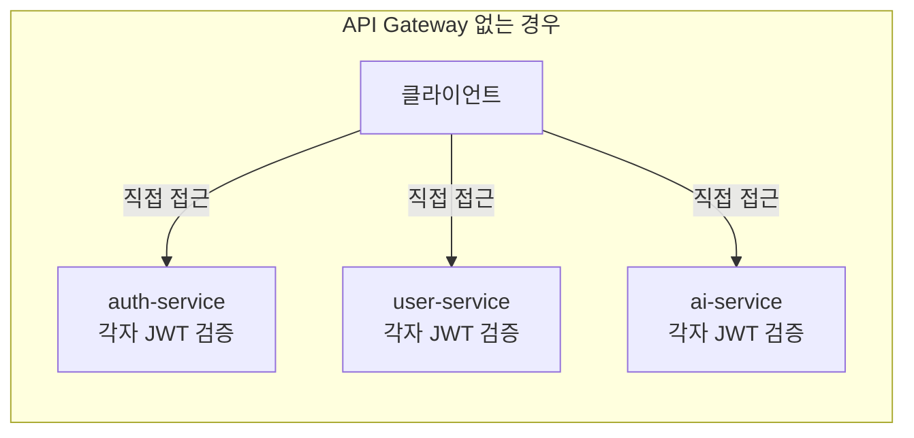
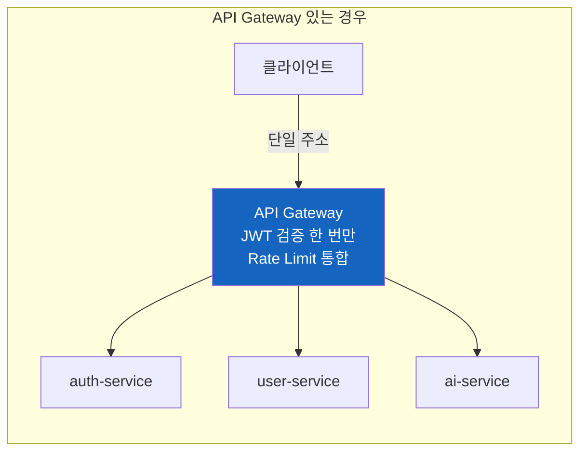
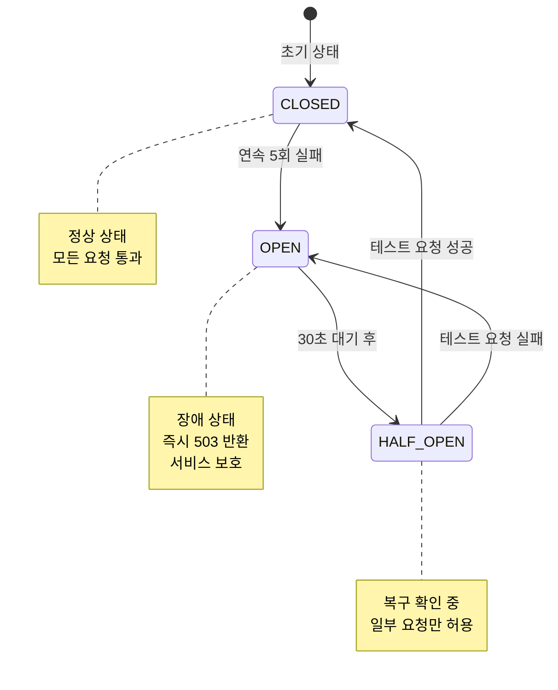

# API Gateway 심화 학습

> **문서 ID**: ONBOARD-02-SVC-01
> **버전**: 1.0.0 | **작성일**: 2026-04-11 | **작성자**: Implementer (Sonnet)
> **실제 파일 위치**: `/data/ai-saas/platform/services/api-gateway/`
> **예상 학습 시간**: 2시간

---

## 목차

1. [API Gateway의 역할과 위치](#1-api-gateway의-역할과-위치)
2. [라우팅 규칙](#2-라우팅-규칙)
3. [Rate Limiting 설정](#3-rate-limiting-설정)
4. [IP 필터링 (CSAP D-10)](#4-ip-필터링-csap-d-10)
5. [Circuit Breaker (CSAP D-07)](#5-circuit-breaker-csap-d-07)
6. [실제 코드 예시](#6-실제-코드-예시)
7. [초보자가 수정해야 할 상황과 방법](#7-초보자가-수정해야-할-상황과-방법)

---

## 1. API Gateway의 역할과 위치

### 왜 API Gateway가 필요한가

17개 서비스가 각각 인터넷에 노출되면 어떤 문제가 생길까요?

- 각 서비스가 따로 JWT 검증 로직을 구현해야 합니다 → 보안 로직 중복 + 오류 위험
- Rate Limiting을 각 서비스가 따로 구현해야 합니다 → 설정 불일치
- 클라이언트가 17개 서비스 주소를 모두 알아야 합니다 → 관리 어려움

API Gateway는 이 모든 문제를 해결하는 **단일 진입점(Single Entry Point)**입니다.





### 파일 구조

```
platform/services/api-gateway/
├── src/
│   ├── index.ts                    ← 서비스 진입점 (플러그인 등록, 서버 시작)
│   ├── routes/
│   │   └── proxy.ts               ← 프록시 라우팅 (핵심 파일)
│   ├── middleware/
│   │   ├── ip-filter.middleware.ts ← IP 블랙리스트/화이트리스트 (CSAP D-10)
│   │   └── data-grade.middleware.ts← N2SF 데이터 등급 검사
│   ├── plugins/
│   │   ├── audit-logger.ts        ← 감사 로그 플러그인 (CSAP D-06)
│   │   ├── correlation-id.ts      ← 분산 추적 ID 생성
│   │   ├── security-headers.ts    ← 보안 응답 헤더 (CSAP D-10)
│   │   ├── swagger.ts             ← OpenAPI 문서 (CSAP D-12)
│   │   └── health-check.ts        ← 서비스 헬스 확인
│   ├── registry/
│   │   └── service-registry.ts    ← 서비스 URL 목록 (라우팅 대상)
│   └── lib/
│       └── circuit-breaker.ts     ← 서킷 브레이커 (CSAP D-07)
├── package.json
└── tsconfig.json
```

---

## 2. 라우팅 규칙

### 2.1 서비스 레지스트리

API Gateway는 `service-registry.ts`에 등록된 서비스로만 요청을 라우팅합니다.

```typescript
// 실제 파일: platform/services/api-gateway/src/registry/service-registry.ts

export const SERVICE_REGISTRY: Record<string, ServiceEntry> = {
  auth: {
    url: process.env['AUTH_SVC_URL'] ?? 'http://auth-service:3001',
    requireAuth: false,    // /auth/* 경로는 인증 검사 없음 (로그인 전이므로)
    rateLimit: { max: 10, timeWindow: '1 minute' },  // 로그인 브루트포스 방지
  },
  users: {
    url: process.env['USER_SVC_URL'] ?? 'http://user-service:3002',
    requireAuth: true,     // 반드시 JWT 인증 필요
  },
  tenants: {
    url: process.env['TENANT_SVC_URL'] ?? 'http://tenant-service:3003',
    requireAuth: true,
  },
  ai: {
    url: process.env['AI_SVC_URL'] ?? 'http://ai-service:3009',
    requireAuth: true,
  },
  // ... 나머지 서비스
}
```

### 2.2 라우팅 패턴

```
클라이언트 요청 URL → 대상 서비스

GET  /users/me          → user-service:3002/users/me
POST /auth/login        → auth-service:3001/auth/login    (인증 불필요)
GET  /tenants/current   → tenant-service:3003/tenants/current
POST /ai/query          → ai-service:3009/ai/query
GET  /billing/invoices  → billing-service:3007/billing/invoices
```

### 2.3 라우팅 로직 실제 코드

```typescript
// 실제 파일: platform/services/api-gateway/src/routes/proxy.ts

// 경로 접두사로 대상 서비스 결정
// 예: /users/me → 'users' 키 → SERVICE_REGISTRY['users'].url = user-service:3002
const pathPrefix = path.split('/')[1]  // 'users', 'auth', 'tenants', ...
const serviceEntry = getServiceEntry(pathPrefix)

if (!serviceEntry) {
  return reply.status(404).send({ error: 'SERVICE_NOT_FOUND' })
}

// 인증이 필요한 서비스인 경우 → JWT 검증 먼저
if (serviceEntry.requireAuth) {
  await authPreHandler(request, reply)
  if (reply.sent) return  // 인증 실패 시 이미 응답 완료
}

// Circuit Breaker로 요청 전달
await circuitBreaker.execute(serviceId, async () => {
  // 실제 서비스로 HTTP 프록시
  await httpProxy(request, reply, serviceEntry.url)
})
```

---

## 3. Rate Limiting 설정

### 3.1 Rate Limiting이란

API를 과도하게 호출하는 것을 방지하는 기술입니다. 특히 공공기관 SaaS에서는 DoS(서비스 거부) 공격 방어와 공정 사용을 위해 필수입니다 (CSAP D-10).

### 3.2 현재 설정

```typescript
// 실제 파일: platform/services/api-gateway/src/index.ts

await app.register(rateLimit, {
  max: 100,           // 최대 100 요청
  timeWindow: '1 minute',  // 1분 기준

  // 테넌트 ID가 있으면 테넌트별로 제한, 없으면 IP 기준
  keyGenerator: (request) => {
    const tenantId = request.headers['x-tenant-id']
    if (typeof tenantId === 'string') {
      return `tenant:${tenantId}`  // 테넌트별 Rate Limit
    }
    return request.ip              // IP 기준 Rate Limit
  }
})
```

### 3.3 서비스별 다른 Rate Limit

로그인 API는 브루트포스 공격 방지를 위해 더 엄격하게 제한합니다.

```typescript
// service-registry.ts에서 서비스별 Rate Limit 설정
auth: {
  url: '...',
  requireAuth: false,
  rateLimit: { max: 10, timeWindow: '1 minute' }  // 로그인은 분당 10회만
}
```

### 3.4 Rate Limit 초과 시 응답

```json
{
  "success": false,
  "error": {
    "code": "RATE_LIMIT_EXCEEDED",
    "message": "요청 한도를 초과했습니다. 잠시 후 다시 시도하세요.",
    "retryAfter": 60
  }
}
```

HTTP 상태 코드: 429 Too Many Requests

---

## 4. IP 필터링 (CSAP D-10)

### 4.1 IP 필터링이란

CSAP D-10(네트워크 보안) 요건에 따라 특정 IP 주소를 차단하거나 특정 IP만 허용할 수 있습니다.

```typescript
// 실제 파일: platform/services/api-gateway/src/middleware/ip-filter.middleware.ts

// 환경 변수로 IP 목록 관리 (하드코딩 금지!)
const IP_BLACKLIST: Set<string> = new Set(
  (process.env['IP_BLACKLIST'] ?? '')
    .split(',')
    .map((ip) => ip.trim())
    .filter(Boolean)
)

const IP_WHITELIST: Set<string> = new Set(
  (process.env['IP_WHITELIST'] ?? '')
    .split(',')
    .map((ip) => ip.trim())
    .filter(Boolean)
)

// 처리 우선순위:
// 1. 화이트리스트에 있으면 → 허용
// 2. 블랙리스트에 있으면 → 403 차단
// 3. 목록에 없으면 → 허용 (기본 허용 정책)
```

### 4.2 IP 차단 설정 방법

```bash
# .env 파일 또는 k8s Secret에 설정 (직접 코드 수정 금지!)
IP_BLACKLIST=192.168.1.100,10.0.0.50
IP_WHITELIST=203.0.113.0/24,10.10.0.0/16
```

### 4.3 런타임 IP 추가/제거

security-monitor-service가 실시간 위협을 감지하면 API Gateway에 동적으로 IP를 추가할 수 있습니다.

```typescript
// 내부 서비스 전용 관리 함수
import { addToBlacklist, removeFromBlacklist } from './ip-filter.middleware.js'

// 위협 IP 실시간 차단
addToBlacklist('192.168.1.100')

// 차단 해제
removeFromBlacklist('192.168.1.100')
```

---

## 5. Circuit Breaker (CSAP D-07)

### 5.1 Circuit Breaker란

실생활의 전기 차단기를 생각하면 됩니다. 과전류(장애)가 발생하면 자동으로 차단하여 더 큰 피해를 막습니다.

소프트웨어에서는 하나의 서비스가 느려지거나 장애가 나면, 그 서비스로의 요청을 일시적으로 막아 전체 시스템이 멈추는 것을 방지합니다.



```typescript
// 실제 파일: platform/services/api-gateway/src/lib/circuit-breaker.ts

const DEFAULT_OPTIONS = {
  failureThreshold: 5,     // 5회 실패 시 OPEN
  resetTimeout: 30000,     // 30초 후 HALF_OPEN
  requestTimeout: 10000,   // 요청 타임아웃 10초
}
```

### 5.2 Circuit Breaker 상태 확인

```bash
# 관리자 전용 엔드포인트 (INTERNAL_SERVICE_KEY 필요)
curl http://localhost:3000/admin/circuits \
  -H "x-internal-service-key: $INTERNAL_SERVICE_KEY"

# 기대 응답:
# {
#   "auth": { "state": "CLOSED", "failureCount": 0 },
#   "users": { "state": "CLOSED", "failureCount": 0 },
#   "ai":   { "state": "OPEN",   "failureCount": 5 }  ← ai-service 장애!
# }
```

---

## 6. 실제 코드 예시

### 6.1 전체 요청 처리 흐름 (index.ts 요약)

```typescript
// 실제 파일: platform/services/api-gateway/src/index.ts

const app = Fastify({ logger: true, bodyLimit: 10_485_760 }) // 10MB

// 1. 설정 관리 (환경 변수 중앙화)
await app.register(configPlugin, { ... })

// 2. Graceful Shutdown 설정 (SIGTERM 처리)
await app.register(meshReadyPlugin, { ... })

// 3. CORS 설정 (허용 출처 환경 변수로 관리)
await app.register(cors, { origin: corsOrigins, credentials: true })

// 4. IP 필터링 훅 (CSAP D-10)
app.addHook('onRequest', ipFilterMiddleware)

// 5. 보안 응답 헤더 (CSAP D-10)
await app.register(securityHeadersPlugin)

// 6. Correlation ID (분산 추적)
await app.register(correlationIdPlugin)

// 7. OpenAPI 문서 (CSAP D-12)
await app.register(swaggerPlugin)

// 8. 감사 로그 (CSAP D-06)
await app.register(auditLoggerPlugin)

// 9. Rate Limiting (CSAP D-10)
await app.register(rateLimit, { max: 100, timeWindow: '1 minute', keyGenerator })

// 10. 헬스체크 엔드포인트 (CSAP D-07)
await app.register(healthPlugin, { ... })

// 11. RBAC 플러그인 (CSAP D-08)
await app.register(rbacPlugin, { ... })

// 12. API 버전 관리 (CSAP D-12)
await app.register(versionPlugin, { versions: ['v1', 'v2'] })

// 13. 프록시 라우트 등록 (모든 서비스로 라우팅)
await registerProxyRoutes(app)

await app.listen({ port: 3000, host: '0.0.0.0' })
```

### 6.2 JWT 인증 검사 preHandler

```typescript
// 실제 파일: platform/services/api-gateway/src/routes/proxy.ts

// API Gateway는 자체적으로 JWT를 파싱하지 않습니다.
// 대신 auth-service의 /auth/verify 엔드포인트를 호출하여 검증을 위임합니다.
// 이렇게 하면 JWT 검증 로직이 auth-service에만 존재하여 일관성을 보장합니다.

async function authPreHandler(request, reply): Promise<void> {
  let authHeader = request.headers.authorization

  // HttpOnly 쿠키에서 토큰 추출 지원 (브라우저 보안)
  if (!authHeader?.startsWith('Bearer ')) {
    const token = extractTokenFromCookie(request.headers.cookie)
    if (token) authHeader = `Bearer ${token}`
  }

  if (!authHeader?.startsWith('Bearer ')) {
    return reply.status(401).send({ error: 'AUTH_NO_TOKEN' })
  }

  // auth-service에 검증 위임 (타임아웃 5초)
  const response = await fetch(`${AUTH_SERVICE_URL}/auth/verify`, {
    headers: { authorization: authHeader },
    signal: AbortSignal.timeout(5000)
  })

  if (!response.ok) {
    return reply.status(401).send({ error: 'AUTH_TOKEN_INVALID' })
  }

  // 검증 성공 → 사용자 정보를 헤더로 하위 서비스에 전달
  const { data } = await response.json()
  request.headers['x-user-id'] = data.sub
  request.headers['x-user-tenant-id'] = data.tenantId
  request.headers['x-user-role'] = data.role
}
```

---

## 7. 초보자가 수정해야 할 상황과 방법

### 상황 1: 새로운 서비스를 등록해야 한다

새 서비스를 추가한 후 API Gateway가 라우팅하도록 등록합니다.

```typescript
// 수정 파일: platform/services/api-gateway/src/registry/service-registry.ts

export const SERVICE_REGISTRY = {
  // 기존 서비스들...

  // 새 서비스 추가
  'new-feature': {
    url: process.env['NEW_FEATURE_SVC_URL'] ?? 'http://new-feature-service:3017',
    requireAuth: true,
    // 특별한 권한이 필요하다면:
    // requiredPermissions: ['new-feature:read'],
  }
}
```

주의사항:
- 포트 번호는 기존과 중복되지 않아야 합니다
- URL은 반드시 환경 변수로 관리합니다 (하드코딩 금지)
- 내부 k8s DNS 이름 형식: `http://{서비스명}:{포트}`

### 상황 2: Rate Limit을 조정해야 한다

특정 서비스의 Rate Limit이 너무 빡빡하거나 느슨하다면 조정합니다.

```typescript
// 수정 파일: platform/services/api-gateway/src/registry/service-registry.ts

'my-service': {
  url: '...',
  requireAuth: true,
  // Rate Limit 커스텀 설정
  rateLimit: {
    max: 30,               // 분당 30회로 변경
    timeWindow: '1 minute'
  }
}
```

Rate Limit 변경 전 확인사항:
- 변경 이유를 PR 설명에 명시합니다
- 너무 낮으면 정상 사용자도 차단됩니다
- 너무 높으면 DoS 공격에 취약해집니다

### 상황 3: 특정 경로에 추가 권한 검사가 필요하다

관리자만 접근할 수 있는 경로를 설정합니다.

```typescript
// 수정 파일: platform/services/api-gateway/src/routes/proxy.ts

// 관리자 경로에 추가 권한 확인
if (path.startsWith('/admin/')) {
  const user = (request as any).user
  if (!user?.permissions?.includes('admin:all')) {
    return reply.status(403).send({
      error: 'INSUFFICIENT_PERMISSIONS',
      message: '관리자 권한이 필요합니다'
    })
  }
}
```

### 상황 4: 보안 응답 헤더를 추가해야 한다

```typescript
// 수정 파일: platform/services/api-gateway/src/plugins/security-headers.ts

// 기존 헤더에 추가
reply.header('Permissions-Policy', 'camera=(), microphone=()')
reply.header('Cross-Origin-Opener-Policy', 'same-origin')
```

수정 전 CSAP D-10 항목에서 요건을 확인하고 PR에 근거를 기록합니다.

### 실습: API Gateway 로컬에서 실행하기

```bash
# 환경 변수 설정
export AUTH_SVC_URL=http://localhost:3001
export USER_SVC_URL=http://localhost:3002
export API_GATEWAY_PORT=3000
export NODE_ENV=development
export LOG_LEVEL=debug

# API Gateway 실행
cd /data/ai-saas
pnpm --filter @public-saas/api-gateway dev

# 정상 실행 확인
curl http://localhost:3000/health
# {"status":"ok","service":"api-gateway","timestamp":"..."}

# OpenAPI 문서 확인 (브라우저에서)
# http://localhost:3000/docs
```

---

## 다음 단계

**[다음: 02-auth-service.md — Auth Service 심화 학습]**

---

## 변경 이력

| 버전 | 일자 | 내용 | 작성자 |
|------|------|------|------|
| 1.0.0 | 2026-04-11 | 최초 작성 | Implementer (Sonnet) |
