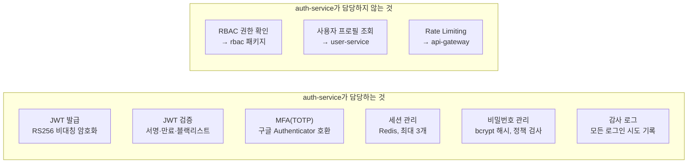
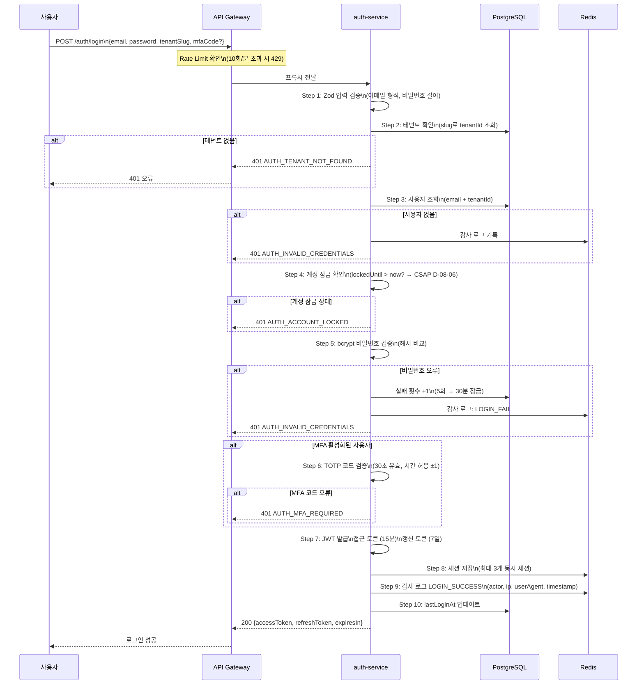
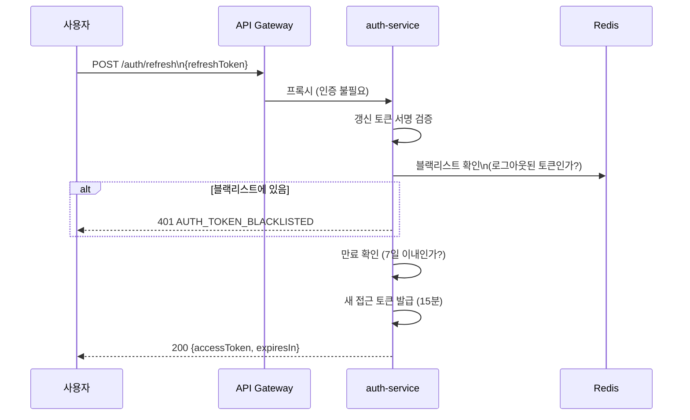
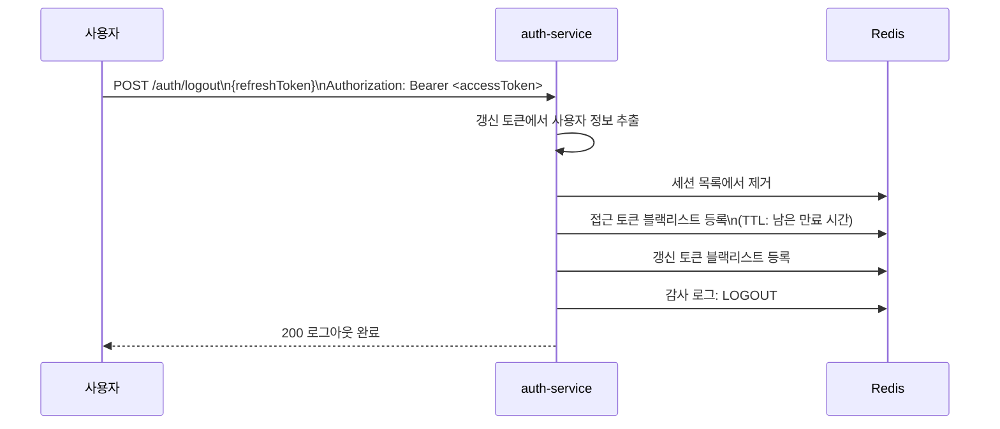
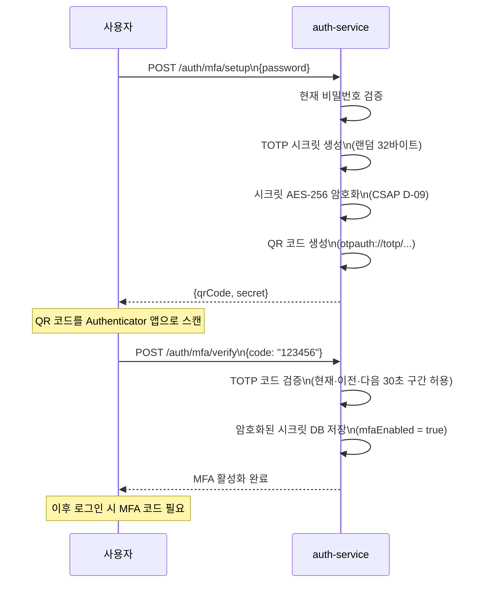

# Auth Service 심화 학습

> **문서 ID**: ONBOARD-02-SVC-02
> **버전**: 1.0.0 | **작성일**: 2026-04-11 | **작성자**: Implementer (Sonnet)
> **실제 파일 위치**: `/data/ai-saas/platform/services/auth-service/`
> **예상 학습 시간**: 2시간
> **CSAP 매핑**: D-08 (접근 통제)

---

## 목차

1. [Auth Service의 역할](#1-auth-service의-역할)
2. [인증 플로우 다이어그램](#2-인증-플로우-다이어그램)
3. [주요 엔드포인트](#3-주요-엔드포인트)
4. [JWT 토큰 구조](#4-jwt-토큰-구조)
5. [MFA (다중 인증) 구현](#5-mfa-다중-인증-구현)
6. [세션 관리 (Redis)](#6-세션-관리-redis)
7. [CSAP D-08 준수 방법](#7-csap-d-08-준수-방법)
8. [초보자 실습: 로그인 API 호출해보기](#8-초보자-실습-로그인-api-호출해보기)

---

## 1. Auth Service의 역할

auth-service는 **모든 인증과 세션 관리를 담당하는 보안의 핵심 서비스**입니다.

다른 서비스들은 JWT를 직접 검증하지 않습니다. 대신 API Gateway를 통해 auth-service의 `/auth/verify` 엔드포인트를 호출하여 검증을 위임합니다. 인증 로직이 한 곳에만 있으므로 보안 업데이트가 필요할 때 한 번만 수정하면 됩니다.



### 파일 구조

```
platform/services/auth-service/
├── src/
│   ├── index.ts           ← 서비스 진입점
│   ├── routes.ts          ← 9개 엔드포인트 등록
│   ├── handlers/          ← 요청 핸들러 (1핸들러 = 1엔드포인트)
│   │   ├── login.handler.ts          ← POST /auth/login
│   │   ├── logout.handler.ts         ← POST /auth/logout
│   │   ├── refresh.handler.ts        ← POST /auth/refresh
│   │   ├── verify.handler.ts         ← GET /auth/verify
│   │   ├── password-change.handler.ts← POST /auth/password/change
│   │   ├── mfa.handler.ts            ← POST /auth/mfa/*
│   │   └── session-invalidate.handler.ts ← POST /auth/sessions/invalidate
│   ├── lib/               ← 비즈니스 로직 라이브러리
│   │   ├── jwt.ts         ← JWT 발급·검증 (RS256)
│   │   ├── session.ts     ← Redis 세션 관리
│   │   ├── password.ts    ← bcrypt 해시·검증
│   │   ├── permissions.ts ← 역할별 권한 조회
│   │   ├── audit.ts       ← 인증 감사 로그
│   │   ├── mfa-crypto.ts  ← MFA 시크릿 암호화
│   │   ├── totp.ts        ← TOTP 코드 생성·검증
│   │   └── prisma.ts      ← Prisma 클라이언트
│   ├── middleware/
│   │   ├── rate-limit.middleware.ts  ← 서비스 내부 Rate Limit
│   │   └── service-auth.middleware.ts← 내부 서비스 인증
│   └── schemas/           ← Zod 입력 검증 스키마
```

---

## 2. 인증 플로우 다이어그램

### 2.1 로그인 플로우



### 2.2 JWT 갱신 플로우



### 2.3 로그아웃 플로우



---

## 3. 주요 엔드포인트

```typescript
// 실제 파일: platform/services/auth-service/src/routes.ts

// 공개 엔드포인트 (인증 불필요)
POST /auth/login            // 로그인 → {accessToken, refreshToken}
POST /auth/refresh          // 토큰 갱신

// 인증 필요 엔드포인트
GET  /auth/verify           // 토큰 검증 (API Gateway가 호출)
POST /auth/logout           // 로그아웃
POST /auth/password/change  // 비밀번호 변경
POST /auth/mfa/setup        // MFA TOTP 등록 시작
POST /auth/mfa/verify       // MFA TOTP 검증·활성화
DELETE /auth/mfa            // MFA 비활성화

// 내부 서비스 전용 (INTERNAL_SERVICE_KEY 필요)
POST /auth/sessions/invalidate  // 사용자 전체 세션 강제 무효화
```

### 엔드포인트별 Rate Limit

```typescript
// 실제 파일: platform/services/auth-service/src/routes.ts

const LOGIN_RATE_LIMIT      = { max: 10, window: 60 }    // 10회/분
const REFRESH_RATE_LIMIT    = { max: 30, window: 60 }    // 30회/분
const PASSWORD_CHANGE_LIMIT = { max: 5,  window: 300 }   // 5회/5분
```

---

## 4. JWT 토큰 구조

### 4.1 RS256 비대칭 암호화

이 서비스는 HS256(공유 시크릿) 대신 RS256(비대칭 키)을 사용합니다.

- **HS256**: 같은 시크릿으로 발급하고 검증 → 시크릿이 유출되면 누구나 토큰을 만들 수 있음
- **RS256**: 비밀 키(private key)로 발급, 공개 키(public key)로 검증 → 검증자는 발급 불가

```
비밀 키 (auth-service만 보유) → 토큰 서명
공개 키 (다른 서비스도 사용 가능) → 토큰 검증
```

```typescript
// 실제 파일: platform/services/auth-service/src/lib/jwt.ts

// JWT 발급 — 비밀 키 사용 (환경 변수로 관리)
const privateKey = await importPKCS8(process.env['JWT_PRIVATE_KEY'], 'RS256')

const token = await new SignJWT({ tenantId, role, permissions })
  .setProtectedHeader({ alg: 'RS256', kid: 'key-1' })
  .setSubject(userId)           // sub: 사용자 ID
  .setIssuedAt()                // iat: 발급 시각
  .setExpirationTime('15m')     // exp: 15분 후 만료 (CSAP D-08)
  .setIssuer('public-saas-auth')
  .sign(privateKey)
```

### 4.2 토큰 페이로드 구조

```json
{
  "sub": "user-uuid-here",           // 사용자 ID
  "tenantId": "tenant-uuid-here",    // 테넌트 ID (멀티테넌트 격리)
  "role": "TENANT_ADMIN",            // RBAC 역할
  "permissions": ["user:read", "user:write"],  // 세부 권한
  "iat": 1744300000,                 // 발급 시각 (Unix timestamp)
  "exp": 1744300900,                 // 만료 시각 (15분 후)
  "iss": "public-saas-auth"         // 발급자
}
```

---

## 5. MFA (다중 인증) 구현

### 5.1 TOTP란

TOTP(Time-based One-Time Password)는 30초마다 새로운 6자리 코드를 생성하는 방식입니다. 구글 Authenticator, Microsoft Authenticator 앱과 호환됩니다.



### 5.2 MFA 보안 처리

```typescript
// 실제 파일: platform/services/auth-service/src/lib/mfa-crypto.ts

// MFA 시크릿은 AES-256으로 암호화하여 저장 (CSAP D-09)
export async function encryptMfaSecret(secret: string): Promise<string> {
  const encryptionKey = process.env['MFA_ENCRYPTION_KEY']
  if (!encryptionKey) throw new Error('MFA_ENCRYPTION_KEY 환경 변수 누락')
  // AES-256-GCM 암호화 처리
  return encrypt(secret, encryptionKey)
}

// 검증 시 복호화 후 사용
export async function decryptMfaSecret(encrypted: string): Promise<string> {
  const encryptionKey = process.env['MFA_ENCRYPTION_KEY']
  return decrypt(encrypted, encryptionKey)
}
```

---

## 6. 세션 관리 (Redis)

### 6.1 세션 구조

```
Redis 키 구조:
  session:{userId}:{sessionId}  → 세션 데이터 (TTL: 7일)
  token:blacklist:{tokenHash}   → 블랙리스트 (TTL: 남은 만료 시간)
```

### 6.2 최대 3개 동시 세션

CSAP D-08 요건에 따라 동시 세션 수를 제한합니다.

```typescript
// 실제 파일: platform/services/auth-service/src/lib/session.ts

const MAX_SESSIONS = parseInt(process.env['MAX_SESSIONS_PER_USER'] ?? '3', 10)

export async function createSession(userId: string, ...): Promise<void> {
  // 기존 세션 목록 조회
  const existingSessions = await getActiveSessions(userId)

  // 최대 3개 초과 시 가장 오래된 세션 제거 (FIFO)
  if (existingSessions.length >= MAX_SESSIONS) {
    const oldest = existingSessions[0]
    await removeSession(userId, oldest.sessionId)
  }

  // 새 세션 저장
  await redis.setex(
    `session:${userId}:${sessionId}`,
    7 * 24 * 60 * 60,  // 7일 TTL
    JSON.stringify(sessionData)
  )
}
```

### 6.3 토큰 블랙리스트

로그아웃 시 토큰을 블랙리스트에 등록하여 만료 전에도 무효화합니다.

```typescript
// 로그아웃 핸들러에서 호출
// 실제 파일: platform/services/auth-service/src/handlers/logout.handler.ts

// 접근 토큰 블랙리스트 등록 (남은 만료 시간만큼 TTL)
await blacklistToken(accessToken)

// 갱신 토큰도 블랙리스트 등록
await blacklistToken(refreshToken)

// 이후 /auth/verify 호출 시 블랙리스트 확인 → 401 반환
```

---

## 7. CSAP D-08 준수 방법

CSAP D-08은 '접근 통제'를 담당하는 통제 도메인입니다. auth-service는 이 항목의 핵심 구현체입니다.

### D-08-01: 사용자 인증

```typescript
// 구현 위치: src/handlers/login.handler.ts

// 1. 이메일 + 비밀번호 검증 (Knowledge Factor)
const isValid = await verifyPassword(password, user.passwordHash)

// 2. MFA TOTP 코드 검증 (Possession Factor — 소유 기반)
if (user.mfaEnabled) {
  const mfaSecret = await decryptMfaSecret(user.mfaSecret)
  const isValidMfa = verifyTotp(mfaCode, mfaSecret)
}
```

### D-08-02: 세션 토큰 관리

```typescript
// 접근 토큰: 15분 만료 (CSAP 요건: 짧은 만료 시간)
const ACCESS_TOKEN_EXPIRY = '15m'

// 갱신 토큰: 7일 만료
const REFRESH_TOKEN_EXPIRY = '7d'
```

### D-08-06: 계정 잠금 정책

```typescript
// 구현 위치: src/handlers/login.handler.ts

const MAX_FAILED_ATTEMPTS = 5
const LOCKOUT_DURATION_MINUTES = 30

// 5회 연속 실패 → 30분 잠금
if (user.failedLoginAttempts >= MAX_FAILED_ATTEMPTS) {
  await prisma.user.update({
    where: { id: user.id },
    data: {
      lockedUntil: new Date(Date.now() + LOCKOUT_DURATION_MINUTES * 60 * 1000)
    }
  })
}
```

### D-08-07: 비밀번호 정책

```typescript
// 실제 파일: platform/services/auth-service/src/schemas/login.schema.ts (추정)
// 또는 password-change.handler.ts

const newPasswordSchema = z.string()
  .min(8, '최소 8자 이상')
  .max(128, '최대 128자')
  .regex(/[A-Z]/, '대문자 포함 필수')
  .regex(/[a-z]/, '소문자 포함 필수')
  .regex(/[0-9]/, '숫자 포함 필수')
  .regex(/[!@#$%^&*]/, '특수문자 포함 필수')
```

### D-08-08: MFA (다중 인증)

중요 권한(TENANT_ADMIN, SUPER_ADMIN)을 가진 사용자에게 MFA를 의무화합니다.

```typescript
// MFA가 없는 관리자가 로그인 시도 시
if (user.role === 'TENANT_ADMIN' && !user.mfaEnabled) {
  return reply.status(401).send({
    error: 'MFA_REQUIRED',
    message: '관리자 계정은 MFA 설정이 필수입니다'
  })
}
```

---

## 8. 초보자 실습: 로그인 API 호출해보기

### 실습 목표

auth-service를 직접 실행하고 로그인 API를 호출하여 JWT 토큰을 받아봅니다.

### 준비 사항

```bash
# 1. PostgreSQL + Redis가 실행 중인지 확인
docker ps | grep -E "postgres|redis"

# 2. 환경 변수 파일 확인
cat /data/ai-saas/platform/services/auth-service/.env.local
# 파일이 없다면 02-environment-setup.md 참고
```

### 실습 1: auth-service 실행

```bash
cd /data/ai-saas

# auth-service만 개발 모드로 실행
pnpm --filter @public-saas/auth-service dev

# 정상 실행 시 출력:
# [info] auth-service 기동: http://0.0.0.0:3001
# [info] OpenAPI 문서: http://localhost:3001/docs
```

### 실습 2: 헬스체크

```bash
curl http://localhost:3001/health

# 기대 응답:
# {
#   "status": "ok",
#   "service": "auth-service",
#   "timestamp": "2026-04-11T09:00:00.000Z"
# }
```

### 실습 3: 로그인

```bash
# 테스트 계정 정보는 팀장에게 확인 (seed 데이터)
curl -X POST http://localhost:3001/auth/login \
  -H "Content-Type: application/json" \
  -d '{
    "email": "admin@test-tenant.go.kr",
    "password": "Test1234!@",
    "tenantSlug": "test-tenant"
  }'

# 성공 응답:
# {
#   "success": true,
#   "data": {
#     "accessToken": "eyJhbGciOiJSUzI1NiIsInR5cCI6IkpXVCJ9...",
#     "refreshToken": "eyJhbGciOiJSUzI1NiIsInR5cCI6IkpXVCJ9...",
#     "expiresIn": 900
#   }
# }
```

### 실습 4: 토큰 검증

```bash
# 위에서 받은 accessToken으로 검증
ACCESS_TOKEN="eyJhbGciOiJSUzI1NiIsInR5cCI6IkpXVCJ9..."

curl http://localhost:3001/auth/verify \
  -H "Authorization: Bearer $ACCESS_TOKEN"

# 성공 응답:
# {
#   "success": true,
#   "data": {
#     "sub": "user-uuid",
#     "tenantId": "tenant-uuid",
#     "role": "TENANT_ADMIN",
#     "permissions": ["user:read", "user:write"]
#   }
# }
```

### 실습 5: JWT 내용 직접 확인

JWT 토큰은 Base64로 인코딩된 3개 부분으로 이루어져 있습니다. 디코딩하면 내용을 볼 수 있습니다.

```bash
ACCESS_TOKEN="eyJhbGciOiJSUzI1NiIsInR5cCI6IkpXVCJ9..."

# 헤더 (알고리즘, 타입)
echo $ACCESS_TOKEN | cut -d '.' -f 1 | base64 -d 2>/dev/null | python3 -m json.tool
# {"alg": "RS256", "typ": "JWT", "kid": "key-1"}

# 페이로드 (사용자 정보)
echo $ACCESS_TOKEN | cut -d '.' -f 2 | base64 -d 2>/dev/null | python3 -m json.tool
# {
#   "sub": "user-uuid",
#   "tenantId": "tenant-uuid",
#   "role": "TENANT_ADMIN",
#   "permissions": ["user:read"],
#   "iat": 1744300000,
#   "exp": 1744300900
# }
```

> **주의**: JWT 내용은 누구나 볼 수 있습니다(서명만 검증). 따라서 JWT에 민감한 정보(비밀번호, 주민번호 등)를 절대 넣어서는 안 됩니다.

### 실습 6: 로그아웃

```bash
# 로그아웃 (접근 토큰 + 갱신 토큰 모두 무효화)
REFRESH_TOKEN="eyJhbGciOiJSUzI1NiIsInR5cCI6IkpXVCJ9..."

curl -X POST http://localhost:3001/auth/logout \
  -H "Authorization: Bearer $ACCESS_TOKEN" \
  -H "Content-Type: application/json" \
  -d "{\"refreshToken\": \"$REFRESH_TOKEN\"}"

# 성공 응답:
# {"success": true, "message": "로그아웃 완료"}

# 로그아웃 후 이전 토큰으로 검증 시도 → 401 반환
curl http://localhost:3001/auth/verify \
  -H "Authorization: Bearer $ACCESS_TOKEN"
# {"success": false, "error": {"code": "AUTH_TOKEN_BLACKLISTED"}}
```

### 실습 완료 체크

- [ ] auth-service 로컬 실행 성공
- [ ] 헬스체크 200 응답 확인
- [ ] 로그인 API 호출 + accessToken 수신
- [ ] JWT 토큰 디코딩하여 페이로드 확인
- [ ] /auth/verify 호출 성공
- [ ] 로그아웃 후 토큰 무효화 확인

---

## 다음 단계

auth-service를 이해했다면 다른 서비스들도 같은 패턴으로 구성되어 있습니다.

**[다음: 시스템 아키텍처 학습 완료 → 03-vibecoding.md]**

---

## 변경 이력

| 버전 | 일자 | 내용 | 작성자 |
|------|------|------|------|
| 1.0.0 | 2026-04-11 | 최초 작성 | Implementer (Sonnet) |
