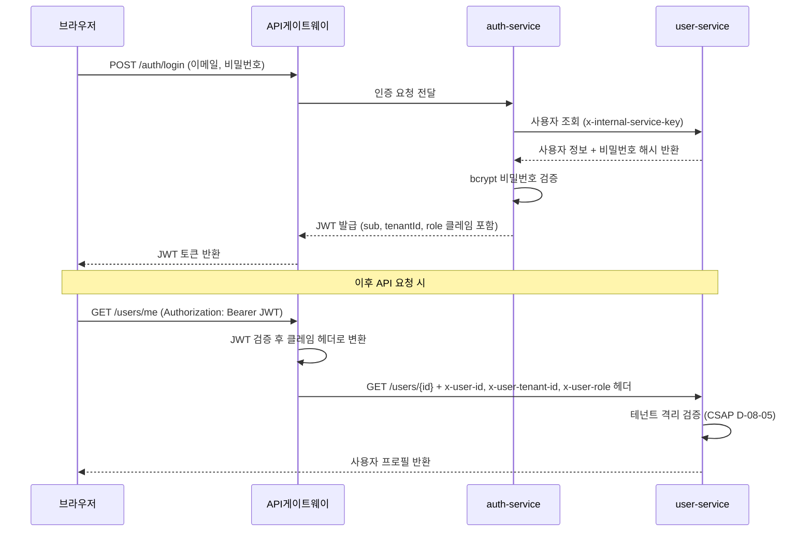
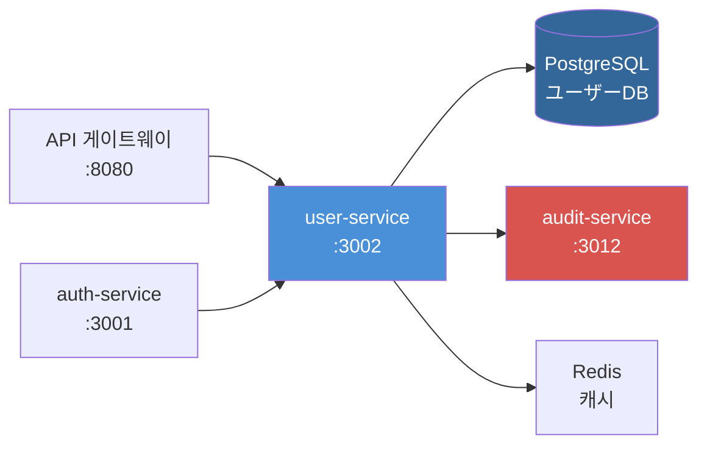

# 03. 사용자 서비스 (user-service)

> 대상 독자: 이 프레임워크를 처음 접하는 개발자
> CSAP 관련 항목: D-08 (접근 통제), D-09 (암호화), D-06 (감사 로그), D-12 (개발 보안)

---

## 서비스 개요 카드

| 항목 | 내용 |
|------|------|
| 역할 | 사용자 계정 CRUD, 비밀번호 관리, 역할(Role) 관리 |
| 기본 포트 | **3002** |
| 소스 경로 | `platform/services/user-service/src/` |
| 의존 서비스 | auth-service (JWT 클레임 헤더 수신), tenant-service (테넌트 존재 확인) |
| 데이터베이스 | PostgreSQL (Prisma ORM) |
| CSAP 항목 | D-08-05 (테넌트 격리), D-08-07 (비밀번호 정책), D-06 (감사 로그), D-12 (입력 검증) |
| 인증 방식 | x-internal-service-key 헤더 (API 게이트웨이가 주입) |

---

## 왜 별도 서비스인가?

처음에는 "사용자 관리를 auth-service에 합쳐도 되지 않나?"라는 의문이 생깁니다.

공공기관 SaaS에서 분리하는 이유는 다음과 같습니다.

- **책임 분리**: auth-service는 "로그인/토큰 발급"만 담당, user-service는 "계정 프로필 데이터"만 담당합니다.
- **감사 독립성**: CSAP D-06에 따라 사용자 데이터 변경 이력을 별도 추적해야 합니다.
- **테넌트 격리**: 멀티테넌시 환경에서 테넌트A의 관리자가 테넌트B의 사용자에 접근하지 못하도록 각 서비스에서 독립적으로 격리 로직을 실행합니다.

---

## 인증 흐름: auth-service → user-service

사용자가 로그인하면 다음 흐름이 일어납니다.



핵심 포인트: user-service는 JWT를 직접 검증하지 않습니다. API 게이트웨이가 JWT를 검증하고 클레임 정보를 HTTP 헤더(`x-user-id`, `x-user-tenant-id`, `x-user-role`)로 변환하여 전달합니다. user-service는 이 헤더를 신뢰하여 사용합니다.

---

## 사용자 데이터 모델

실제 Prisma 스키마에서 user-service가 다루는 필드입니다.

```
User {
  id           String    -- UUID (기본 키)
  email        String    -- 고유 이메일 (테넌트 내 중복 불가)
  name         String    -- 표시 이름
  passwordHash String    -- bcrypt(12 rounds) 해시, 평문 절대 저장 금지
  role         Enum      -- TENANT_ADMIN | USER | VIEWER | AUDITOR
  tenantId     String    -- 소속 테넌트 UUID (외래 키)
  mfaEnabled   Boolean   -- MFA 활성화 여부
  lastLoginAt  DateTime  -- 마지막 로그인 시각 (비활성 계정 탐지용)
  failedLogins Int       -- 연속 로그인 실패 횟수
  lockedUntil  DateTime  -- 계정 잠금 해제 시각
                          -- (9999-12-31 = 영구 비활성화/소프트 삭제)
  createdAt    DateTime  -- 생성 시각
  updatedAt    DateTime  -- 마지막 수정 시각
}
```

### 소프트 삭제 방식

공공기관 감사 요건상 실제 DELETE는 사용하지 않습니다. 대신 `lockedUntil = 9999-12-31T23:59:59Z`로 설정하여 영구 비활성화를 표시합니다. 복원 시 `lockedUntil = null`로 초기화합니다.

---

## 역할(Role) 체계

| 역할 | 설명 | 주요 권한 |
|------|------|-----------|
| `SUPER_ADMIN` | 플랫폼 전체 관리자 | 모든 테넌트 접근, 시스템 설정 |
| `TENANT_ADMIN` | 테넌트 관리자 | 본인 테넌트 내 사용자 관리 |
| `USER` | 일반 사용자 | 본인 프로필 조회/수정 |
| `VIEWER` | 읽기 전용 | 조회만 가능 |
| `AUDITOR` | 감사 담당자 | 감사 로그 조회 가능 |

---

## 주요 엔드포인트 표

모든 엔드포인트는 `x-internal-service-key` 헤더가 필요합니다 (API 게이트웨이 경유 시 자동 주입).

| 메서드 | 경로 | 설명 | Rate Limit | CSAP |
|--------|------|------|-----------|------|
| GET | /users | 사용자 목록 조회 (검색/필터/정렬 지원) | 100/분 | D-08-05 |
| GET | /users/stats | 사용자 통계 (총 수, 역할별 분포) | 100/분 | D-06 |
| GET | /users/login-activity | 로그인 활동 추이 (days 파라미터) | 100/분 | D-06 |
| GET | /users/inactive | 비활성 계정 목록 | 100/분 | D-08-10 |
| GET | /users/:id | 사용자 상세 조회 | 100/분 | D-08-05 |
| POST | /users | 사용자 생성 | 10/분 | D-08-07 |
| PUT | /users/:id | 사용자 정보 수정 | 30/분 | D-08-05 |
| DELETE | /users/:id | 사용자 비활성화 (소프트 삭제) | 5/5분 | D-08-10 |
| PUT | /users/:id/reactivate | 비활성 사용자 복원 | 30/분 | D-08-10 |
| PUT | /users/:id/role | 역할 변경 | 30/분 | D-08-05 |
| PUT | /users/:id/password | 비밀번호 변경 | 5/5분 | D-08-07 |
| POST | /users/password-reset/request | 비밀번호 재설정 요청 | 5/5분 | D-08-07 |
| POST | /users/password-reset/confirm | 비밀번호 재설정 확인 | 5/5분 | D-08-07 |

### 목록 조회 필터 파라미터

GET /users 엔드포인트는 다음 쿼리 파라미터를 지원합니다.

| 파라미터 | 타입 | 설명 | 예시 |
|----------|------|------|------|
| page | integer | 페이지 번호 (기본 1) | ?page=2 |
| pageSize | integer | 페이지당 항목 수 (최대 100) | ?pageSize=50 |
| search | string | 이름/이메일 부분 일치 검색 | ?search=홍길동 |
| role | string | 역할 필터 | ?role=TENANT_ADMIN |
| status | string | 상태 필터 (active/inactive/locked) | ?status=active |
| sortBy | string | 정렬 기준 (name/email/createdAt/lastLoginAt) | ?sortBy=createdAt |
| sortOrder | string | 정렬 방향 (asc/desc) | ?sortOrder=desc |

---

## CSAP 보안 구현 상세

### 테넌트 격리 (D-08-05)

user-service의 모든 데이터 접근은 JWT 클레임에서 추출한 `tenantId`로 자동 필터링됩니다. `SUPER_ADMIN`만 쿼리 파라미터로 다른 테넌트를 지정할 수 있습니다.

```typescript
// 실제 구현 (platform/services/user-service/src/handlers/user.handler.ts)
const jwtTenantId = request.headers['x-user-tenant-id'] as string | undefined;
const jwtRole = request.headers['x-user-role'] as string | undefined;

// SUPER_ADMIN은 파라미터 지정 가능, 그 외는 JWT 테넌트로 강제
const tenantId = jwtRole === 'SUPER_ADMIN'
  ? (request.query.tenantId ?? jwtTenantId)
  : jwtTenantId;
```

### 비밀번호 정책 (D-08-07)

사용자 생성/변경 시 자동으로 적용됩니다.

- 최소 8자 이상
- 대문자, 소문자, 숫자, 특수문자 각 1개 이상 포함
- bcrypt (12 라운드) 해시 저장
- 평문 비밀번호 절대 저장 금지

### 입력 검증 (D-12)

모든 API 요청 본문은 Zod 스키마로 검증됩니다. 검증 실패 시 400 상태코드와 오류 메시지를 반환합니다.

```typescript
// 실제 Zod 스키마 (사용자 생성)
const createUserSchema = z.object({
  email: z.string().email('유효한 이메일 주소를 입력하세요'),
  name: z.string().min(1, '이름은 필수입니다').max(100),
  password: z.string().min(8, '비밀번호는 8자 이상이어야 합니다'),
  role: z.enum(['TENANT_ADMIN', 'USER', 'VIEWER', 'AUDITOR']).default('USER'),
  tenantId: z.string().min(1),
});
```

### 감사 로그 (D-06)

사용자 생성, 수정, 비활성화, 역할 변경, 비밀번호 변경 시 자동으로 감사 로그가 기록됩니다. 감사 로그는 `audit-service`로 전송됩니다.

---

## 초보자 실습: 사용자 프로필 조회

### 준비사항

- `INTERNAL_SERVICE_KEY` 환경 변수 설정 (개발 환경: `.env.local` 참고)
- user-service가 포트 3002에서 실행 중

### 실습 1: 사용자 목록 조회

```bash
# 사용자 목록 조회 (테넌트 ID 지정)
curl -s -X GET \
  "http://localhost:3002/users?tenantId=550e8400-e29b-41d4-a716-446655440000&page=1&pageSize=10" \
  -H "x-internal-service-key: dev-internal-key" \
  -H "x-user-tenant-id: 550e8400-e29b-41d4-a716-446655440000" \
  -H "x-user-role: TENANT_ADMIN" \
  | jq '.'
```

성공 응답 예시:

```json
{
  "success": true,
  "data": [
    {
      "id": "7f000001-0000-0000-0000-000000000001",
      "email": "admin@agency.go.kr",
      "name": "홍길동",
      "role": "TENANT_ADMIN",
      "mfaEnabled": false,
      "lastLoginAt": "2026-04-10T09:00:00.000Z",
      "lockedUntil": null,
      "createdAt": "2026-04-01T00:00:00.000Z",
      "tenantId": "550e8400-e29b-41d4-a716-446655440000"
    }
  ],
  "pagination": {
    "page": 1,
    "pageSize": 10,
    "total": 1,
    "totalPages": 1
  }
}
```

### 실습 2: 사용자 생성

```bash
# 신규 사용자 생성
curl -s -X POST \
  "http://localhost:3002/users" \
  -H "x-internal-service-key: dev-internal-key" \
  -H "x-user-tenant-id: 550e8400-e29b-41d4-a716-446655440000" \
  -H "x-user-role: TENANT_ADMIN" \
  -H "x-user-id: 7f000001-0000-0000-0000-000000000001" \
  -H "Content-Type: application/json" \
  -d '{
    "email": "newuser@agency.go.kr",
    "name": "김신입",
    "password": "Secure!Pass1",
    "role": "USER",
    "tenantId": "550e8400-e29b-41d4-a716-446655440000"
  }' \
  | jq '.'
```

### 실습 3: 비활성 사용자 조회

```bash
# 90일 이상 로그인하지 않은 비활성 계정 목록 (CSAP 계정 검토)
curl -s -X GET \
  "http://localhost:3002/users/inactive" \
  -H "x-internal-service-key: dev-internal-key" \
  -H "x-user-tenant-id: 550e8400-e29b-41d4-a716-446655440000" \
  -H "x-user-role: TENANT_ADMIN" \
  | jq '.'
```

---

## 초보자가 수정할 상황

### 상황 1: 새 사용자 필드 추가

예를 들어 `departmentCode` (부서 코드) 필드를 추가하고 싶다면:

**1단계: Prisma 스키마 수정**
`platform/services/user-service/prisma/schema.prisma`에서 User 모델에 필드 추가:

```prisma
model User {
  // ... 기존 필드 ...
  departmentCode String? // 부서 코드 (선택)
}
```

**2단계: 마이그레이션 실행**
```bash
cd platform/services/user-service
npx prisma migrate dev --name add-department-code
```

**3단계: 핸들러 스키마 업데이트**
`src/handlers/user.handler.ts`의 `updateUserSchema`에 새 필드 추가:

```typescript
const updateUserSchema = z.object({
  name: z.string().min(1).max(100).optional(),
  email: z.string().email().optional(),
  mfaEnabled: z.boolean().optional(),
  departmentCode: z.string().max(20).optional(), // 추가
});
```

**4단계: select 쿼리에 포함**
`prisma.user.update`의 `select` 블록에 `departmentCode: true` 추가.

### 상황 2: 역할 추가

새 역할 `DEPARTMENT_HEAD`를 추가하려면:

1. Prisma 스키마 `role` Enum에 추가
2. `user.handler.ts`의 `createUserSchema`와 `changeRoleHandler` 업데이트
3. `routes.ts`의 role 검증 배열에 추가
4. auth-service의 권한 매핑 테이블 업데이트

---

## 자주 묻는 질문 (FAQ)

**Q. 사용자를 완전히 삭제할 수 없나요?**

A. 의도적입니다. 공공기관 CSAP D-06 요건상 감사 추적을 위해 사용자 데이터를 최소 1년 보존해야 합니다. 대신 소프트 삭제(`lockedUntil = 9999-12-31`)로 비활성화합니다. 필요 시 복원도 가능합니다.

**Q. 비밀번호를 직접 조회할 수 있나요?**

A. 절대 불가합니다. bcrypt 해시만 저장되며, API 응답에서도 `passwordHash` 필드는 `select`에서 제외됩니다. 비밀번호 확인이 필요하면 재설정 API를 사용합니다.

**Q. 다른 테넌트 사용자를 조회하려면?**

A. `SUPER_ADMIN` 역할의 계정으로 `tenantId` 쿼리 파라미터를 지정합니다. 일반 `TENANT_ADMIN`은 본인 테넌트 사용자만 조회 가능합니다 (CSAP D-08-05 테넌트 격리).

**Q. Rate Limit에 걸렸을 때 어떤 응답이 오나요?**

A. HTTP 429 Too Many Requests 응답과 함께 `Retry-After` 헤더가 반환됩니다. 개발 환경에서는 `NODE_ENV=test`로 실행하면 Rate Limit이 완화됩니다.

**Q. x-internal-service-key는 어떻게 설정하나요?**

A. 환경 변수 `INTERNAL_SERVICE_KEY`에 설정합니다. 프로덕션에서는 Kubernetes Secret으로 관리합니다. 개발 환경에서는 `dev-internal-key`를 사용합니다 (.env.local 참고).

**Q. MFA(다중 인증)는 어떻게 활성화하나요?**

A. PUT /users/:id API에서 `mfaEnabled: true`로 설정합니다. 실제 TOTP 코드 생성/검증은 auth-service에서 처리합니다.

---

## 서비스 의존성 다이어그램



---

## 관련 파일

- 라우트 정의: `/data/ai-saas/platform/services/user-service/src/routes.ts`
- 사용자 핸들러: `/data/ai-saas/platform/services/user-service/src/handlers/user.handler.ts`
- 역할 핸들러: `/data/ai-saas/platform/services/user-service/src/handlers/role.handler.ts`
- 비밀번호 핸들러: `/data/ai-saas/platform/services/user-service/src/handlers/password.handler.ts`
- 감사 유틸: `/data/ai-saas/platform/services/user-service/src/lib/audit.ts`
