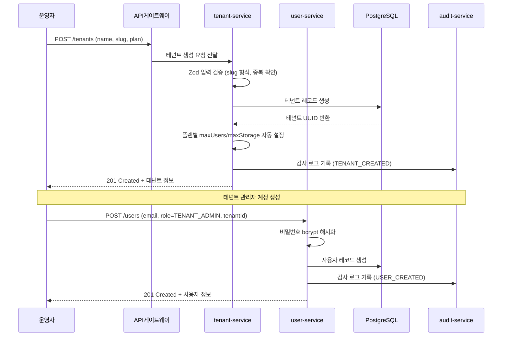
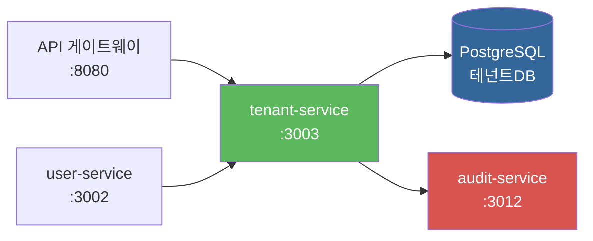

# 04. 테넌트 서비스 (tenant-service)

> 대상 독자: 이 프레임워크를 처음 접하는 개발자
> CSAP 관련 항목: D-08-06 (Rate Limiting), D-10 (네트워크 보안), N2SF N-02/N-03 (멀티테넌시)

---

## 서비스 개요 카드

| 항목 | 내용 |
|------|------|
| 역할 | 멀티테넌시 핵심 — 테넌트 생성/관리, 격리 정책, 리소스 사용량 추적 |
| 기본 포트 | **3003** |
| 소스 경로 | `platform/services/tenant-service/src/` |
| 의존 서비스 | user-service (테넌트 내 사용자 수 확인), audit-service (변경 이력 기록) |
| 데이터베이스 | PostgreSQL (Prisma ORM, RLS 정책 적용) |
| CSAP 항목 | N2SF N-02 (멀티테넌시 보안), N2SF N-03 (격리 아키텍처), D-08-06 (Rate Limiting) |
| 인증 방식 | x-internal-service-key 헤더 (API 게이트웨이가 주입) |

---

## 멀티테넌시란?

이 프레임워크를 처음 접하는 분들이 가장 낯설어하는 개념이 "멀티테넌시"입니다.

**비유:** 아파트 건물을 생각하면 됩니다.
- 건물 전체 = 플랫폼
- 각 세대 = 테넌트 (공공기관 A, 공공기관 B, ...)
- 각 세대 거주자 = 해당 기관의 사용자들

각 세대의 사생활이 완전히 분리되어야 합니다. 공공기관 A의 직원은 공공기관 B의 데이터를 볼 수 없어야 합니다. 이것이 "테넌트 격리"입니다.

---

## 테넌트 격리 방식

### Row-Level Security (RLS) 기반 격리

이 프레임워크는 PostgreSQL의 RLS(행 수준 보안)를 사용하여 데이터를 격리합니다. 모든 테이블에는 `tenant_id` 컬럼이 있고, 데이터베이스 레벨에서 자동으로 필터링됩니다.

```
PostgreSQL RLS 정책 예시
  CREATE POLICY tenant_isolation ON users
    USING (tenant_id = current_setting('app.tenant_id')::uuid);
```

### 미들웨어 레벨 격리

RLS 외에도 코드 레벨에서 이중으로 격리를 적용합니다.

```typescript
// platform/services/tenant-service/src/lib/isolation.ts 실제 구현
export async function tenantIsolationMiddleware(
  request: FastifyRequest,
  reply: FastifyReply
): Promise<void> {
  const user = request.user; // JWT에서 파싱된 사용자 정보

  // SUPER_ADMIN은 전체 접근 허용
  if (user.role === 'super_admin') return;

  // URL 파라미터에서 tenantId 추출
  const requestedTenantId = params['tenantId'] ?? params['id'];

  // JWT tenantId와 요청 tenantId가 다르면 차단 (N2SF N-03)
  if (requestedTenantId && requestedTenantId !== user.tenantId) {
    await reply.status(403).send({
      error: { code: 'TENANT_ISOLATION_VIOLATION',
               message: '다른 테넌트의 데이터에 접근할 수 없습니다 (N2SF N-03)' }
    });
  }
}
```

### 플랜별 리소스 제한

각 테넌트는 구독 플랜에 따라 리소스가 제한됩니다.

| 플랜 | 최대 사용자 수 | 최대 저장용량 | AI 기능 |
|------|--------------|--------------|---------|
| basic | 10명 | 1GB | 기본 채팅 |
| standard | 50명 | 10GB | RAG 포함 |
| enterprise | 무제한 | 무제한 | 전체 기능 |

---

## 테넌트 데이터 모델

```
Tenant {
  id         String    -- UUID (기본 키)
  name       String    -- 기관명 (예: "행정안전부")
  slug       String    -- URL 식별자 (예: "mois", 소문자+숫자+하이픈)
  plan       Enum      -- basic | standard | enterprise
  status     Enum      -- ACTIVE | SUSPENDED | ARCHIVED
  maxUsers   Int       -- 최대 사용자 수 (플랜에 따라 자동 설정)
  maxStorage BigInt    -- 최대 저장용량 (바이트)
  config     JSON      -- 테넌트별 커스텀 설정
  theme      JSON      -- UI 테마 (primaryColor, logoUrl 등)
  createdAt  DateTime
  updatedAt  DateTime
}
```

**slug 규칙**: 소문자, 숫자, 하이픈만 허용합니다. 예: `mois`, `nts-2026`, `mohw`. URL에 사용되므로 특수문자나 한글은 불가합니다.

---

## 주요 엔드포인트 표

| 메서드 | 경로 | 설명 | Rate Limit | 권한 |
|--------|------|------|-----------|------|
| GET | /tenants/stats | 전체 테넌트 통계 | 100/분 | SUPER_ADMIN |
| GET | /tenants/search | 테넌트 검색 (?q=검색어) | 100/분 | SUPER_ADMIN |
| GET | /tenants | 테넌트 목록 (페이지네이션) | 100/분 | SUPER_ADMIN |
| GET | /tenants/:id | 테넌트 상세 조회 | 100/분 | SUPER_ADMIN |
| POST | /tenants | 테넌트 생성 | 30/분 | SUPER_ADMIN |
| PUT | /tenants/:id | 테넌트 정보 수정 | 30/분 | SUPER_ADMIN |
| PUT | /tenants/:id/status | 테넌트 상태 변경 | 30/분 | SUPER_ADMIN |
| DELETE | /tenants/:id | 테넌트 삭제 | 30/분 | SUPER_ADMIN |
| GET | /tenants/:id/usage | 리소스 사용량 조회 | 100/분 | TENANT_ADMIN |
| GET | /tenants/:id/config | 테넌트 설정 조회 | 100/분 | TENANT_ADMIN |
| PUT | /tenants/:id/config | 테넌트 설정 수정 | 30/분 | TENANT_ADMIN |

**중요**: 테넌트 생성/삭제/상태 변경은 `SUPER_ADMIN`만 가능합니다. 테넌트 관리자(`TENANT_ADMIN`)는 본인 테넌트의 설정과 사용량만 조회할 수 있습니다.

---

## 테넌트 프로비저닝 흐름

새 공공기관이 서비스에 가입할 때의 전체 흐름입니다.



---

## N2SF 멀티테넌시 보안 요건

### N-02: 멀티테넌시 보안

N2SF N-02는 SaaS 서비스에서 테넌트 간 데이터 격리를 강제합니다.

- 테넌트 A의 데이터가 테넌트 B에게 노출되면 안 됩니다.
- API 응답에 다른 테넌트의 ID나 정보가 포함되면 안 됩니다.
- 에러 메시지에도 다른 테넌트 정보가 노출되면 안 됩니다.

### N-03: 격리 아키텍처

N2SF N-03는 논리적 격리(Logical Isolation) 구현을 요구합니다.

이 프레임워크의 구현 방식:

1. **JWT 클레임 격리**: API 게이트웨이가 JWT에서 tenantId를 추출하여 요청 헤더에 주입
2. **미들웨어 격리**: 모든 서비스에서 요청 tenantId와 JWT tenantId 일치 검증
3. **DB 쿼리 격리**: Prisma 쿼리의 `where` 절에 `tenantId` 자동 주입
4. **에러 응답 격리**: 다른 테넌트 리소스 접근 시 "존재하지 않음" 대신 403 응답 (N2SF N-03 위반 방지)

---

## CSAP D-08-06: Rate Limiting 설계

테넌트 서비스의 Rate Limit은 읽기/쓰기를 분리합니다.

```
읽기 작업 (조회):  100 요청/분 — 테넌트 목록, 상세 조회, 통계
쓰기 작업 (변경):   30 요청/분 — 테넌트 생성, 수정, 삭제
```

읽기 한도가 더 높은 이유: 조회는 상태를 변경하지 않아 위험도가 낮고, 대시보드 갱신 등에서 자주 호출되기 때문입니다.

---

## 초보자 실습: 테넌트 생성 API 호출

### 준비사항

- SUPER_ADMIN 계정으로 발급된 JWT 토큰
- tenant-service가 포트 3003에서 실행 중

### 실습 1: 테넌트 생성

```bash
# 신규 기관 테넌트 생성
curl -s -X POST \
  "http://localhost:3003/tenants" \
  -H "x-internal-service-key: dev-internal-key" \
  -H "x-user-role: SUPER_ADMIN" \
  -H "x-user-id: super-admin-uuid" \
  -H "Content-Type: application/json" \
  -d '{
    "name": "행정안전부",
    "slug": "mois",
    "plan": "enterprise"
  }' \
  | jq '.'
```

성공 응답 예시:

```json
{
  "success": true,
  "data": {
    "id": "a1b2c3d4-e5f6-7890-abcd-ef1234567890",
    "name": "행정안전부",
    "slug": "mois",
    "plan": "enterprise",
    "status": "ACTIVE",
    "maxUsers": 9999,
    "maxStorage": "107374182400",
    "createdAt": "2026-04-11T09:00:00.000Z"
  }
}
```

`maxStorage`가 문자열로 반환되는 이유: JavaScript는 64비트 정수를 정확히 표현할 수 없어 BigInt를 문자열로 직렬화합니다.

### 실습 2: 테넌트 목록 조회

```bash
# 활성 테넌트만 조회 (최신순)
curl -s -X GET \
  "http://localhost:3003/tenants?status=ACTIVE&sortBy=createdAt&sortOrder=desc" \
  -H "x-internal-service-key: dev-internal-key" \
  -H "x-user-role: SUPER_ADMIN" \
  | jq '.'
```

### 실습 3: 테넌트 일시 정지 (SUSPENDED)

요금 미납이나 정책 위반 시 사용합니다.

```bash
# 테넌트 일시 정지
curl -s -X PUT \
  "http://localhost:3003/tenants/a1b2c3d4-e5f6-7890-abcd-ef1234567890/status" \
  -H "x-internal-service-key: dev-internal-key" \
  -H "x-user-role: SUPER_ADMIN" \
  -H "Content-Type: application/json" \
  -d '{
    "status": "SUSPENDED",
    "reason": "서비스 이용 약관 위반"
  }' \
  | jq '.'
```

### 실습 4: 리소스 사용량 확인

```bash
# 특정 테넌트의 사용량 조회
curl -s -X GET \
  "http://localhost:3003/tenants/a1b2c3d4-e5f6-7890-abcd-ef1234567890/usage" \
  -H "x-internal-service-key: dev-internal-key" \
  -H "x-user-role: TENANT_ADMIN" \
  -H "x-user-tenant-id: a1b2c3d4-e5f6-7890-abcd-ef1234567890" \
  | jq '.'
```

사용량 응답에는 현재 사용자 수, 저장용량 사용량, 플랜 한도 대비 사용률이 포함됩니다.

### 실습 5: 테넌트 검색

```bash
# "행정" 키워드로 테넌트 검색
curl -s -X GET \
  "http://localhost:3003/tenants/search?q=행정&status=ACTIVE" \
  -H "x-internal-service-key: dev-internal-key" \
  -H "x-user-role: SUPER_ADMIN" \
  | jq '.'
```

---

## 초보자가 수정할 상황

### 상황 1: 새 플랜 추가

`premium` 플랜을 추가하고 싶다면:

**1단계: Prisma Enum 수정**
```prisma
enum Plan {
  basic
  standard
  premium   // 추가
  enterprise
}
```

**2단계: 마이그레이션 실행**
```bash
cd platform/services/tenant-service
npx prisma migrate dev --name add-premium-plan
```

**3단계: routes.ts API 스키마 업데이트**
```typescript
plan: { type: 'string', enum: ['basic', 'standard', 'premium', 'enterprise'] }
```

**4단계: tenant.handler.ts의 플랜별 한도 설정 로직 추가**

### 상황 2: 테넌트 설정에 새 키 추가

예를 들어 `allowedIPRanges` 설정을 추가하고 싶다면:

`tenants.config` 필드는 JSON 타입이므로 스키마 변경 없이 추가 가능합니다.

```bash
# 테넌트 설정 업데이트
curl -s -X PUT \
  "http://localhost:3003/tenants/{id}/config" \
  -H "Content-Type: application/json" \
  -d '{
    "allowedIPRanges": ["203.252.0.0/16", "210.91.0.0/16"],
    "sessionTimeout": 3600,
    "requireMFA": true
  }'
```

단, 보안 관련 설정(IP 제한, MFA 강제 등)을 추가할 경우 해당 설정을 읽는 auth-service 로직도 함께 수정해야 합니다.

---

## 자주 묻는 질문 (FAQ)

**Q. 테넌트 slug를 나중에 변경할 수 있나요?**

A. 기술적으로 가능하지만 권장하지 않습니다. slug는 URL, API 엔드포인트, 내부 식별자로 사용되므로 변경 시 연동 시스템 전체에 영향을 줍니다. 초기 설정 시 신중하게 결정하세요.

**Q. 테넌트 삭제 시 사용자 데이터는 어떻게 되나요?**

A. CSAP D-06 요건에 따라 즉시 삭제되지 않습니다. 테넌트 상태가 `ARCHIVED`로 변경되고, 데이터는 보존 정책(기본 1년)에 따라 유지됩니다. 실제 데이터 삭제는 보존 기간 만료 후 자동화된 정리 작업이 수행합니다.

**Q. 테넌트별 데이터베이스를 분리할 수 없나요?**

A. 현재 구현은 단일 데이터베이스에 Row-Level Security로 격리합니다. `enterprise` 플랜에서 전용 스키마 격리(Schema-per-tenant)로 전환 가능한 설계를 유지하고 있지만, 현 단계에서는 RLS 방식을 사용합니다.

**Q. 테넌트 상태 전환에 제약이 있나요?**

A. 있습니다. `ARCHIVED` 상태에서는 다른 상태로 전환할 수 없습니다 (단방향). `ACTIVE` ↔ `SUSPENDED` 전환은 자유롭게 가능합니다.

**Q. 최대 사용자 수를 초과하면 어떻게 되나요?**

A. user-service의 사용자 생성 API에서 테넌트의 현재 사용자 수와 `maxUsers`를 비교합니다. 한도 초과 시 HTTP 409 Conflict와 `TENANT_USER_LIMIT` 에러 코드를 반환합니다.

**Q. 테넌트 통계에는 어떤 정보가 포함되나요?**

A. GET /tenants/stats 응답에는 전체 테넌트 수, 플랜별 분포, 상태별 분포, 최근 30일 신규 가입 추이가 포함됩니다.

---

## 서비스 의존성 다이어그램



---

## 관련 파일

- 라우트 정의: `/data/ai-saas/platform/services/tenant-service/src/routes.ts`
- 테넌트 핸들러: `/data/ai-saas/platform/services/tenant-service/src/handlers/tenant.handler.ts`
- 격리 미들웨어: `/data/ai-saas/platform/services/tenant-service/src/lib/isolation.ts`
- 사용량 핸들러: `/data/ai-saas/platform/services/tenant-service/src/handlers/tenant-usage.handler.ts`
