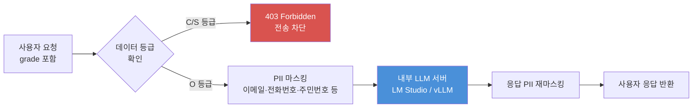
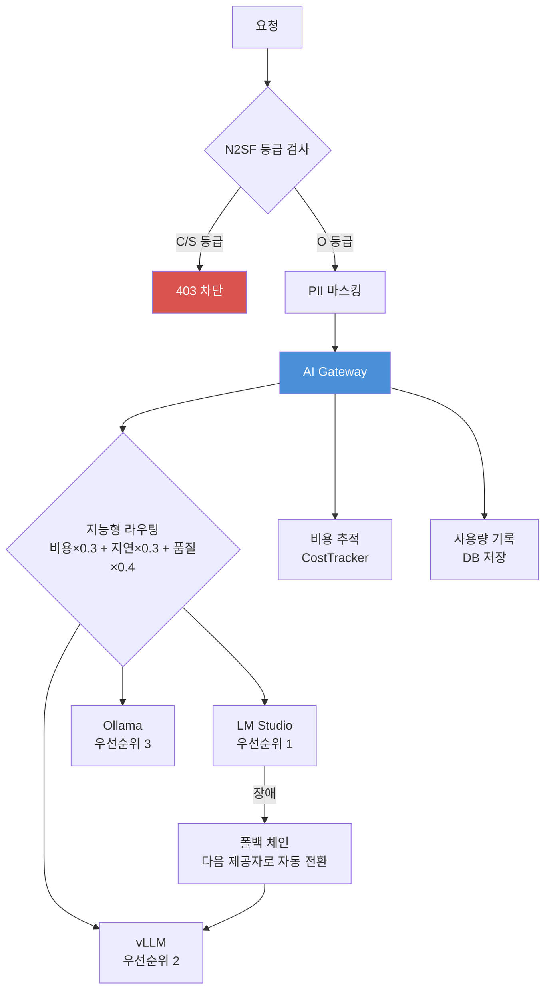
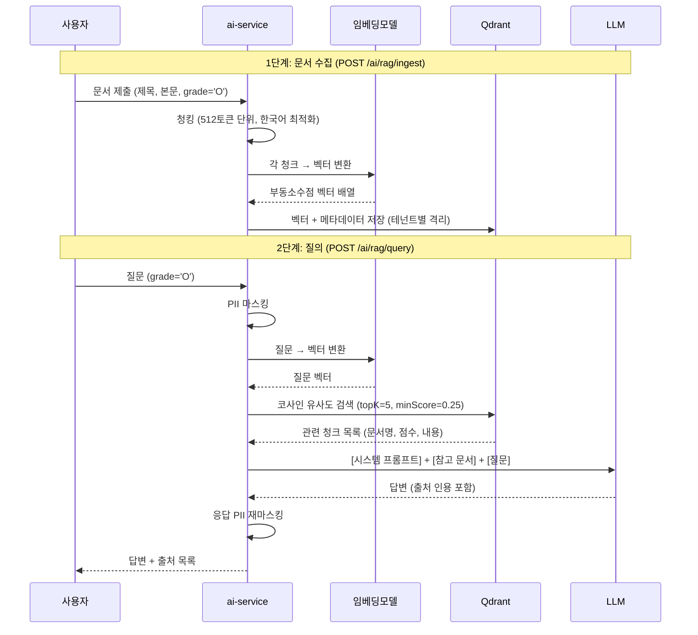
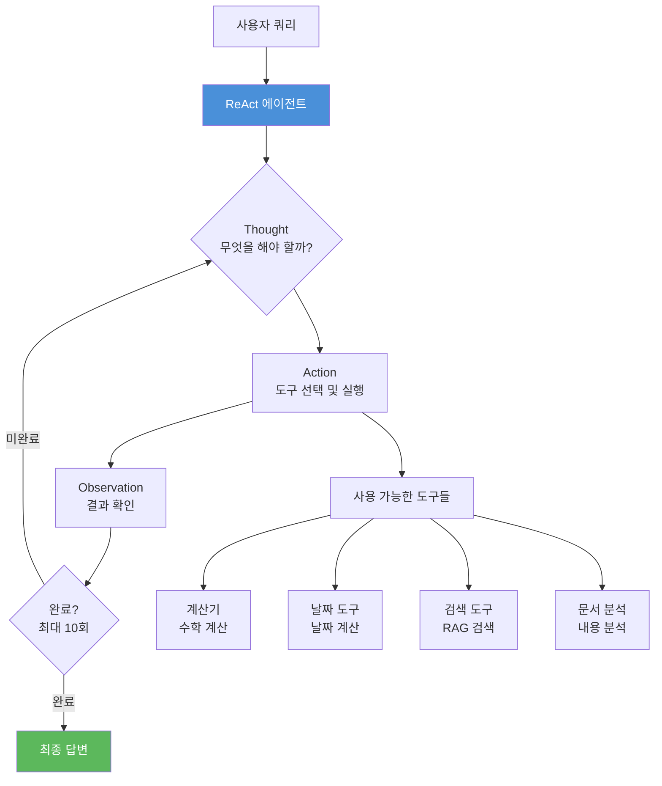
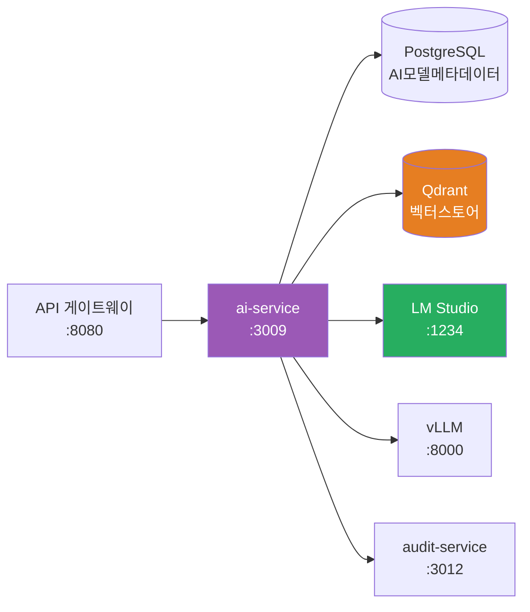

# 05. AI 서비스 (ai-service)

> 대상 독자: 이 프레임워크를 처음 접하는 개발자
> CSAP 관련 항목: N2SF N-05 (데이터 등급 필터링), D-08-06 (Rate Limiting), D-06 (감사 로그)

---

## 서비스 개요 카드

| 항목 | 내용 |
|------|------|
| 역할 | AI/LLM 기능 통합 — 채팅, RAG, 에이전트, 임베딩, 문서 분석, 워크플로우 |
| 기본 포트 | **3009** |
| 소스 경로 | `platform/services/ai-service/src/` |
| 의존 서비스 | LM Studio (로컬 LLM), Qdrant (벡터 DB), audit-service |
| 데이터베이스 | PostgreSQL (AI 모델 메타데이터), Qdrant (벡터 스토어) |
| CSAP 항목 | N2SF N-05 (C/S등급 전송 금지), D-08-06 (Rate Limit), D-06 (감사) |
| 특이사항 | 외부 AI API 직접 호출 금지 — 반드시 내부 LLM 서버 경유 |

---

## 가장 중요한 개념: N2SF 데이터 등급 필터링

AI 서비스를 이해하기 전에 반드시 알아야 할 규칙이 있습니다.

### 공공기관 데이터 3등급

| 등급 | 명칭 | 설명 | AI 전송 가능 여부 |
|------|------|------|-----------------|
| C | 기밀 (Confidential) | 개인정보, 비밀 문서 | 절대 금지 |
| S | 민감 (Sensitive) | 내부 업무 문서 | 절대 금지 |
| O | 공개 (Open) | 공개 정보, 비식별 정보 | PII 마스킹 후 가능 |

**이 규칙은 코드로 강제됩니다.** 실제 구현:

```typescript
// platform/services/ai-service/src/lib/grade-check.ts
export function validateDataGrade(grade: DataGrade): void {
  if (grade === 'C' || grade === 'S') {
    throw new DataGradeViolationError(
      `BLOCKED: ${grade}등급 데이터는 AI API 전송이 금지됩니다 (N2SF N-05)`,
      grade
    );
  }
  // O등급만 통과
}
```

모든 AI API 요청 본문에는 `grade: 'O'`가 필수입니다. 다른 값을 입력하면 HTTP 403 응답이 반환됩니다.

### AI 데이터 흐름 (N2SF 준수)



---

## PII 마스킹 동작 방식

O등급 데이터라도 개인식별정보(PII)는 마스킹 후 LLM에 전달됩니다.

```typescript
// platform/services/ai-service/src/lib/pii-masking.ts 실제 구현
export function maskPII(text: string): string {
  let masked = text;

  // 이메일 마스킹: hong@agency.go.kr → [EMAIL_MASKED]
  masked = masked.replace(/[a-zA-Z0-9._%+-]+@[a-zA-Z0-9.-]+\.[a-zA-Z]{2,}/g,
                          '[EMAIL_MASKED]');

  // 카드 번호 마스킹: 1234-5678-9012-3456 → [CARD_MASKED]
  masked = masked.replace(/\d{4}[-\s]?\d{4}[-\s]?\d{4}[-\s]?\d{4}/g,
                          '[CARD_MASKED]');

  // 주민등록번호: 900101-1234567 → [RRN_MASKED]
  masked = masked.replace(/\d{6}[-\s]?\d{7}/g, '[RRN_MASKED]');

  // 전화번호: 010-1234-5678 → [PHONE_MASKED]
  masked = masked.replace(/0\d{1,2}[-.\s]?\d{3,4}[-.\s]?\d{4}/g,
                          '[PHONE_MASKED]');

  // IP 주소: 192.168.1.1 → [IP_MASKED]
  masked = masked.replace(/\d{1,3}\.\d{1,3}\.\d{1,3}\.\d{1,3}/g, '[IP_MASKED]');

  return masked;
}
```

---

## 지원하는 LLM 제공자

이 프레임워크는 외부 클라우드 AI API를 사용하지 않습니다. 모든 LLM 추론은 내부 서버에서 실행됩니다.

| 제공자 | 용도 | 특징 |
|--------|------|------|
| LM Studio | 로컬 개발 환경 | GPU 없이 CPU로 실행 가능 |
| vLLM | 프로덕션 고성능 추론 | GPU 필수, 높은 처리량 |
| Ollama | 개발/테스트 | 간단한 설치, 다양한 모델 |
| OpenAI 호환 | 내부 프록시 | 외부 전송은 허용된 경우에만 |

---

## 주요 엔드포인트 표

### 기본 AI 기능

| 메서드 | 경로 | 설명 | Rate Limit |
|--------|------|------|-----------|
| GET | /ai/models | 등록된 AI 모델 목록 조회 | 100/분 |
| POST | /ai/models | 새 AI 모델 등록 | 20/분 |
| PUT | /ai/models/:id | 모델 정보 수정 | 20/분 |
| POST | /ai/chat | 일반 AI 채팅 | 10/분 |
| POST | /ai/chat/stream | 스트리밍 채팅 (SSE) | 10/분 |
| POST | /ai/embed | 텍스트 임베딩 벡터 생성 | 30/분 |
| GET | /ai/usage | AI 사용량 조회 | 100/분 |
| GET | /ai/cost | AI 비용 조회 | 100/분 |

### RAG (검색 증강 생성)

| 메서드 | 경로 | 설명 | Rate Limit |
|--------|------|------|-----------|
| POST | /ai/rag/ingest | 문서 수집 (청킹+임베딩+저장) | 20/분 |
| POST | /ai/rag/query | 기본 RAG 질의 | 10/분 |
| POST | /ai/rag/query/advanced | 고급 RAG (하이브리드+리랭킹) | 10/분 |

### 에이전트 및 고급 기능

| 메서드 | 경로 | 설명 | Rate Limit |
|--------|------|------|-----------|
| POST | /ai/agent | ReAct 패턴 AI 에이전트 | 5/분 |
| POST | /ai/agent/advanced | 고급 에이전트 (다중 에이전트) | 5/분 |
| POST | /ai/structured | 구조화 출력 (JSON 스키마 강제) | 10/분 |
| POST | /ai/function-call | Function Calling | 5/분 |
| POST | /ai/document/analyze | 공공문서 분석 | 20/분 |
| POST | /ai/document/compare | 두 문서 비교 분석 | 20/분 |
| POST | /ai/workflow | 멀티스텝 워크플로우 | 10/분 |

에이전트 Rate Limit이 가장 낮은(5/분) 이유: 에이전트는 한 번의 요청에서 최대 10번의 LLM 추론을 수행하므로 비용이 높습니다.

---

## AI Gateway 구조

여러 LLM 제공자를 통합 관리하는 AI Gateway 아키텍처입니다.



### 지능형 라우팅 공식

제공자 선택 시 다음 공식으로 최적 제공자를 선택합니다.

```
총점 = 비용점수 × 0.3 + 지연점수 × 0.3 + 품질점수 × 0.4
```

비용과 지연은 낮을수록 좋으므로 `1 - 정규화값`으로 반전합니다.

### 폴백 체인 (자동 장애 복구)

연속 3번 오류 발생 시 해당 제공자를 `down` 상태로 표시하고 다음 제공자로 자동 전환합니다. 주기적 헬스체크 후 복구되면 다시 `active` 상태로 전환됩니다.

---

## RAG 파이프라인 상세

RAG (Retrieval-Augmented Generation)는 "문서 기반 AI 답변"을 구현하는 핵심 기능입니다. 공무원이 "행정처리 지침 어디에 써 있어?"라고 물으면 실제 내부 문서를 검색하여 답변합니다.

### 기본 RAG 파이프라인



### 텍스트 청킹 전략

한국어 문서를 효과적으로 분할합니다.

```
전략: 단락 우선 → 문장 분리 → 크기 기준 강제 분할

1. 빈 줄(\n\n)로 단락 분리
2. 단락이 512토큰(약 1024자)을 초과하면 문장(. ? !) 단위로 분리
3. 문장도 너무 길면 최대 크기에서 강제 분할
4. 청크 간 50토큰 오버랩으로 문맥 연속성 보장
```

### Advanced RAG (고급 모드)

POST /ai/rag/query/advanced 엔드포인트는 더 정확한 답변을 위해 추가 기술을 적용합니다.

| 기능 | 파라미터 | 설명 |
|------|----------|------|
| 하이브리드 검색 | searchMode: 'hybrid' | BM25(키워드)+시맨틱 RRF 융합 |
| 리랭킹 | enableReranking: true | LLM이 후보 문서 관련도 재평가 |
| 쿼리 확장 | enableQueryExpansion: true | LLM이 질문을 다각도로 재작성 |
| 컨텍스트 압축 | enableCompression: true | 관련 구절만 추출하여 토큰 절약 |
| BM25 가중치 | bm25Weight: 0.4 | 0=순수시맨틱, 1=순수키워드 |

---

## AI 에이전트 구조

AI 에이전트는 단순 채팅과 달리 "생각 → 행동 → 관찰" 사이클을 반복합니다.



### 에이전트 모드

Advanced Agent(POST /ai/agent/advanced)는 세 가지 모드를 지원합니다.

| 모드 | 설명 | 적합한 작업 |
|------|------|------------|
| react | 단일 에이전트 ReAct | 단순한 다단계 작업 |
| plan-execute | 먼저 계획 후 실행 | 복잡한 분석 작업 |
| orchestrate | 다중 에이전트 협력 | 대형 복잡 작업 |

다중 에이전트 모드에서는 `researcher`, `analyst`, `writer`, `reviewer` 역할의 서브에이전트가 협력합니다.

---

## MCP (Model Context Protocol) 통합

MCP는 AI 모델이 외부 리소스(파일, DB, API)와 상호작용하는 표준 프로토콜입니다.

이 프레임워크의 MCP 서버는 JSON-RPC 2.0 프로토콜을 사용하며, AI 모델에게 다음 리소스를 제공합니다.

- 테넌트별 공공문서 리소스
- 감사 로그 리소스
- 컴플라이언스 현황 리소스
- 커스텀 도구 정의 (MCP Tools)

**중요**: MCP를 통해 접근하는 리소스도 N2SF 등급 검사와 PII 마스킹이 적용됩니다.

---

## LM Studio 로컬 모델 연동

개발 환경에서 GPU 없이도 LLM을 사용할 수 있습니다.

### 1단계: LM Studio 설치 및 모델 다운로드

```bash
# LM Studio 설치 후 원하는 모델 다운로드
# 추천 모델: Qwen2.5-7B-Instruct (한국어 지원 우수)
```

### 2단계: AI 모델 등록

```bash
# LM Studio로 실행 중인 모델을 플랫폼에 등록
curl -s -X POST \
  "http://localhost:3009/ai/models" \
  -H "x-internal-service-key: dev-internal-key" \
  -H "Content-Type: application/json" \
  -d '{
    "name": "qwen2.5-7b-instruct",
    "provider": "lmstudio",
    "endpoint": "http://localhost:1234",
    "maxGrade": "O",
    "config": {
      "modelId": "qwen2.5-7b-instruct",
      "modelType": "chat",
      "maxTokens": 4096,
      "temperature": 0.7
    }
  }' \
  | jq '.'
```

### 3단계: 제공자 헬스체크

```bash
# 연결된 LLM 서버 상태 확인
curl -s "http://localhost:3009/ai/provider/health" \
  -H "x-internal-service-key: dev-internal-key" \
  | jq '.'
```

---

## 초보자 실습: AI 채팅 API 호출

### 실습 1: 기본 채팅

```bash
# 등록된 모델 ID 먼저 확인
MODEL_ID=$(curl -s "http://localhost:3009/ai/models" \
  -H "x-internal-service-key: dev-internal-key" \
  | jq -r '.data[0].id')

# AI 채팅 요청
curl -s -X POST \
  "http://localhost:3009/ai/chat" \
  -H "x-internal-service-key: dev-internal-key" \
  -H "Content-Type: application/json" \
  -d "{
    \"modelId\": \"${MODEL_ID}\",
    \"tenantId\": \"550e8400-e29b-41d4-a716-446655440000\",
    \"message\": \"CSAP 인증 취득을 위한 주요 단계를 알려주세요\",
    \"grade\": \"O\"
  }" \
  | jq '.'
```

응답 예시:

```json
{
  "success": true,
  "data": {
    "text": "CSAP(클라우드 보안인증) 취득을 위한 주요 단계는 다음과 같습니다...",
    "model": "qwen2.5-7b-instruct",
    "tokensUsed": 342,
    "latencyMs": 2840
  }
}
```

### 실습 2: 스트리밍 채팅 (SSE)

응답이 길어질 때 실시간으로 토큰을 받는 방식입니다.

```bash
curl -s -X POST \
  "http://localhost:3009/ai/chat/stream" \
  -H "x-internal-service-key: dev-internal-key" \
  -H "Content-Type: application/json" \
  -H "Accept: text/event-stream" \
  -d "{
    \"modelId\": \"${MODEL_ID}\",
    \"tenantId\": \"550e8400-e29b-41d4-a716-446655440000\",
    \"message\": \"정보보호관리체계(ISMS-P) 인증 절차를 상세히 설명해주세요\",
    \"grade\": \"O\"
  }"
```

SSE 응답 형식:

```
data: {"token": "정보보호"}
data: {"token": "관리체계"}
data: {"token": "(ISMS-P)"}
...
data: {"done": true, "tokensUsed": 512}
```

### 실습 3: RAG 문서 수집 후 질의

```bash
# 1단계: 공공 정책 문서 수집
curl -s -X POST \
  "http://localhost:3009/ai/rag/ingest" \
  -H "x-internal-service-key: dev-internal-key" \
  -H "Content-Type: application/json" \
  -d "{
    \"tenantId\": \"550e8400-e29b-41d4-a716-446655440000\",
    \"grade\": \"O\",
    \"title\": \"2026년 공공기관 클라우드 전환 지침\",
    \"content\": \"제1조(목적) 이 지침은 공공기관의 클라우드 서비스 도입 및 전환에 관한 기준을...\",
    \"embedModelId\": \"${EMBED_MODEL_ID}\"
  }" \
  | jq '.'

# 2단계: 수집된 문서 기반 질의
curl -s -X POST \
  "http://localhost:3009/ai/rag/query" \
  -H "x-internal-service-key: dev-internal-key" \
  -H "Content-Type: application/json" \
  -d "{
    \"tenantId\": \"550e8400-e29b-41d4-a716-446655440000\",
    \"grade\": \"O\",
    \"question\": \"공공기관 클라우드 전환 시 보안 요건은 무엇인가요?\",
    \"topK\": 5
  }" \
  | jq '.'
```

RAG 응답에는 답변 텍스트와 함께 어느 문서의 어느 부분을 참조했는지 `sources` 배열이 포함됩니다.

### 실습 4: 구조화 출력 (민원 처리)

LLM 응답을 미리 정의된 JSON 스키마 형태로 받습니다.

```bash
curl -s -X POST \
  "http://localhost:3009/ai/structured" \
  -H "x-internal-service-key: dev-internal-key" \
  -H "Content-Type: application/json" \
  -d "{
    \"tenantId\": \"550e8400-e29b-41d4-a716-446655440000\",
    \"grade\": \"O\",
    \"schema\": \"citizen_request\",
    \"inputText\": \"도로 옆 가로등이 한 달째 꺼져 있어 밤에 위험합니다. 빨리 수리해 주세요.\",
    \"modelId\": \"${MODEL_ID}\"
  }" \
  | jq '.'
```

`schema` 파라미터로 지정할 수 있는 출력 형식:

- `citizen_request`: 민원 분류 및 담당부서 자동 배정
- `document_analysis`: 문서 요약 및 핵심 항목 추출
- `meeting_summary`: 회의록 구조화 요약
- `risk_assessment`: 위험도 평가 보고서

### 실습 5: C등급 차단 테스트

N2SF 규칙이 실제로 작동하는지 확인합니다.

```bash
# 의도적으로 C등급으로 요청 시도 → 차단되어야 함
curl -s -X POST \
  "http://localhost:3009/ai/chat" \
  -H "x-internal-service-key: dev-internal-key" \
  -H "Content-Type: application/json" \
  -d "{
    \"modelId\": \"${MODEL_ID}\",
    \"tenantId\": \"550e8400-e29b-41d4-a716-446655440000\",
    \"message\": \"테스트 메시지\",
    \"grade\": \"C\"
  }" \
  | jq '.'
```

예상 응답 (HTTP 400 - Zod 검증에서 차단):

```json
{
  "success": false,
  "error": {
    "code": "VALIDATION_ERROR",
    "message": "grade 필드는 'O'만 허용됩니다"
  }
}
```

API 스키마 레벨에서 `grade: { enum: ['O'] }`로 C/S등급이 원천 차단됩니다.

---

## 초보자가 수정할 상황

### 상황 1: 새 워크플로우 타입 추가

예: `budget_review` (예산 검토) 워크플로우 추가

**1단계: routes.ts에 enum 추가**
```typescript
workflowType: {
  type: 'string',
  enum: ['citizen_request', 'document_review', 'meeting_assist',
         'policy_draft', 'budget_review'], // 추가
}
```

**2단계: ai-workflow.ts에 워크플로우 로직 구현**

**3단계: 테스트 케이스 작성**

### 상황 2: 새 AI 모델 제공자 추가

예: Anthropic API 프록시 추가 (내부 서버를 통해 경유하는 경우)

**1단계: routes.ts의 provider enum에 추가**
```typescript
provider: { type: 'string', enum: ['lmstudio', 'openai', 'ollama', 'vllm', 'anthropic'] }
```

**2단계: lib/providers/에 새 제공자 클래스 구현**

**3단계: llm-provider.ts의 createLLMProvider에 분기 추가**

**중요**: 어떤 제공자든 외부 네트워크로 직접 전송하려면 별도 보안 검토가 필요합니다. N2SF O등급 + PII 마스킹이 반드시 선행되어야 합니다.

---

## 자주 묻는 질문 (FAQ)

**Q. ChatGPT나 Claude API를 직접 사용할 수 없나요?**

A. 공공기관 데이터는 외부 클라우드에 전송하지 않는 것이 원칙입니다 (N2SF). 외부 AI API 사용이 불가피한 경우 별도의 보안 검토와 승인 절차가 필요합니다. 현재 구현은 로컬 LLM(LM Studio, vLLM)만 지원합니다.

**Q. grade 파라미터를 매번 보내야 하나요?**

A. 예, 필수입니다. 요청자가 데이터 등급을 명시적으로 선언하게 함으로써 개발자가 데이터 분류를 의식하도록 강제하는 설계입니다. `grade: 'O'`를 보내지 않으면 400 오류가 반환됩니다.

**Q. RAG 벡터 저장소는 어떻게 테넌트별로 격리되나요?**

A. Qdrant 컬렉션에 메타데이터로 `tenantId`를 저장하고, 검색 시 필터링합니다. 테넌트 A의 문서는 테넌트 B의 RAG 검색에 절대 포함되지 않습니다.

**Q. 임베딩 모델과 채팅 모델을 다르게 설정할 수 있나요?**

A. 예. RAG 요청 시 `embedModelId`와 `chatModelId`를 별도로 지정할 수 있습니다. 지정하지 않으면 DB에서 활성화된 기본 모델이 자동 선택됩니다.

**Q. 에이전트가 어떤 도구를 사용할 수 있나요?**

A. `tools` 파라미터로 허용할 도구를 지정합니다. 기본 제공 도구: `calculator`, `date_calculator`, `rag_search`, `document_analyzer`. 커스텀 도구는 `lib/tool-registry.ts`에 등록합니다.

**Q. 스트리밍 응답을 프론트엔드에서 어떻게 처리하나요?**

A. SSE(Server-Sent Events) 형식으로 전달됩니다. JavaScript의 `EventSource` API 또는 `fetch`와 `ReadableStream`을 사용하여 처리합니다.

---

## 서비스 의존성 다이어그램



---

## 관련 파일

- 라우트 정의: `/data/ai-saas/platform/services/ai-service/src/routes.ts`
- N2SF 등급 검사: `/data/ai-saas/platform/services/ai-service/src/lib/grade-check.ts`
- PII 마스킹: `/data/ai-saas/platform/services/ai-service/src/lib/pii-masking.ts`
- AI Gateway: `/data/ai-saas/platform/services/ai-service/src/lib/ai-gateway.ts`
- RAG 엔진: `/data/ai-saas/platform/services/ai-service/src/lib/rag-engine.ts`
- 청킹 유틸: `/data/ai-saas/platform/services/ai-service/src/lib/chunker.ts`
- MCP 서버: `/data/ai-saas/platform/services/ai-service/src/lib/mcp-server.ts`
