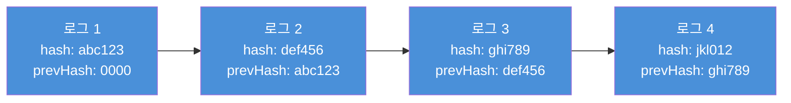
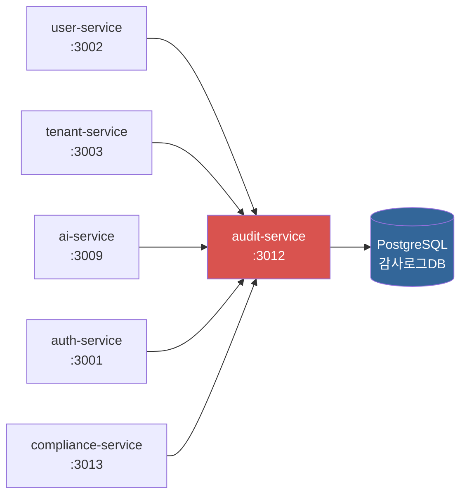

# 06. 감사 서비스 (audit-service)

> 대상 독자: 이 프레임워크를 처음 접하는 개발자
> CSAP 관련 항목: D-06 (침해사고 관리), D-08 (접근 통제), D-12 (개발 보안)

---

## 서비스 개요 카드

| 항목 | 내용 |
|------|------|
| 역할 | 모든 민감 작업의 감사 로그 수집, SHA-256 체인 무결성 보장, 이상 행위 탐지 |
| 기본 포트 | **3012** |
| 소스 경로 | `platform/services/audit-service/src/` |
| 의존 서비스 | 모든 서비스가 audit-service에 로그를 기록함 (단방향 의존) |
| 데이터베이스 | PostgreSQL (append-only 구조, UPDATE/DELETE 없음) |
| CSAP 항목 | D-06-01 (로그 수집), D-06-02 (로그 무결성), D-06-04 (1년 보존), D-06-05 (이상 탐지) |
| 인증 방식 | x-internal-service-key 헤더 (API 게이트웨이가 주입) |

---

## 왜 감사 로그가 중요한가?

CSAP D-06 (침해사고 관리)은 공공기관 SaaS의 핵심 보안 요건입니다.

**감리원이 가장 먼저 확인하는 것**: "이 시스템에서 누가 언제 무엇을 했는지 추적할 수 있는가?"

감사 로그가 없거나 조작 가능하다면 보안 사고 발생 시:
- 무엇이 유출되었는지 알 수 없습니다.
- 누가 무엇을 했는지 증명할 수 없습니다.
- CSAP 인증이 취소될 수 있습니다.

이 서비스는 이런 상황을 방지하기 위해 **변경/삭제 불가능한 감사 로그**를 유지합니다.

---

## 핵심 개념: Append-Only 구조

감사 로그는 한 번 기록되면 절대 수정하거나 삭제할 수 없습니다.

```
일반 테이블:    INSERT ✓   SELECT ✓   UPDATE ✓   DELETE ✓
감사 로그 테이블: INSERT ✓   SELECT ✓   UPDATE ✗   DELETE ✗
```

이를 코드와 데이터베이스 두 레벨에서 강제합니다.

**코드 레벨 (append-only.ts):**
```typescript
// platform/services/audit-service/src/lib/append-only.ts 실제 구현
export async function appendAuditLog(entry: {
  action: string;
  tenantId?: string;
  actorId?: string;
  // ... 기타 필드
}): Promise<void> {
  // 이전 로그 해시 조회 (체인 연결)
  const lastLog = await prisma.auditLog.findFirst({
    orderBy: { createdAt: 'desc' },
    select: { hash: true },
  });
  const previousHash = lastLog?.hash ?? '0'.repeat(64);

  // SHA-256 해시 계산 (이전 해시 포함 → 체인 형성)
  const hashData = [
    entry.actorId ?? 'system',
    entry.action,
    entry.target ?? '',
    entry.tenantId ?? 'system',
    new Date().toISOString(),
    previousHash,   // 핵심: 이전 해시를 포함하여 체인 형성
  ].join('|');
  const hash = createHash('sha256').update(hashData).digest('hex');

  // CREATE만 호출, UPDATE/DELETE 없음
  await prisma.auditLog.create({
    data: { ...entry, hash, previousHash }
  });
}
```

**왜 이전 해시를 포함하나요?** 블록체인과 동일한 원리입니다. 중간 레코드를 수정하면 이후 모든 레코드의 해시가 달라져 즉시 탐지됩니다.

---

## SHA-256 체인 무결성



**무결성 검증 과정 (verifyAuditLogIntegrity):**

1. 시간 순서대로 모든 감사 로그를 조회합니다.
2. 각 로그의 데이터로 SHA-256을 재계산합니다.
3. 저장된 hash와 재계산값이 일치하는지 확인합니다.
4. 현재 로그의 previousHash가 이전 로그의 hash와 일치하는지 확인합니다.
5. 불일치 발생 시 어느 로그, 언제 변조되었는지 정확히 위치를 반환합니다.

---

## 감사 로그 구조

```
AuditLog {
  id          String    -- UUID (기본 키)
  tenantId    String    -- 소속 테넌트 (없으면 시스템 이벤트)
  actorId     String    -- 행위자 사용자 UUID
  action      String    -- 행위 코드 (예: USER_CREATED, TENANT_DELETED)
  target      String    -- 대상 리소스 ID
  targetType  String    -- 대상 유형 (예: USER, TENANT, DOCUMENT)
  ip          String    -- 요청 IP 주소
  userAgent   String    -- 브라우저/클라이언트 정보
  metadata    JSON      -- 추가 컨텍스트 정보
  hash        String    -- 현재 레코드의 SHA-256 해시
  previousHash String   -- 이전 레코드의 SHA-256 해시 (체인)
  createdAt   DateTime  -- 기록 시각 (자동 설정, 수정 불가)
}
```

### 표준 action 코드

각 서비스에서 사용하는 표준화된 감사 이벤트 코드입니다.

| 서비스 | Action 코드 | 의미 |
|--------|-------------|------|
| user-service | USER_CREATED | 사용자 생성 |
| user-service | USER_UPDATED | 사용자 정보 수정 |
| user-service | USER_DEACTIVATED | 사용자 비활성화 |
| user-service | USER_REACTIVATED | 사용자 복원 |
| user-service | ROLE_CHANGED | 역할 변경 |
| user-service | PASSWORD_CHANGED | 비밀번호 변경 |
| tenant-service | TENANT_CREATED | 테넌트 생성 |
| tenant-service | TENANT_DELETED | 테넌트 삭제 |
| tenant-service | TENANT_STATUS_CHANGED | 테넌트 상태 변경 |
| ai-service | AI_CHAT | AI 채팅 요청 |
| ai-service | RAG_INGEST | 문서 수집 |
| auth-service | LOGIN_SUCCESS | 로그인 성공 |
| auth-service | LOGIN_FAILED | 로그인 실패 |
| auth-service | TOKEN_REFRESH | 토큰 갱신 |
| compliance-service | COMPLIANCE_SCAN | 컴플라이언스 검사 실행 |

---

## 주요 엔드포인트 표

| 메서드 | 경로 | 설명 | Rate Limit |
|--------|------|------|-----------|
| POST | /audit/logs | 감사 로그 기록 (append-only) | 200/분 |
| GET | /audit/logs | 감사 로그 조회 (필터+커서 페이지네이션) | 100/분 |
| POST | /audit/verify | SHA-256 체인 무결성 검증 | 100/분 |
| GET | /audit/export | 로그 내보내기 (CSV/JSON) | 100/분 |
| GET | /audit/stats | 로그 통계 (보존 현황) | 100/분 |
| GET | /audit/retention | 보존 정책 현황 조회 | 100/분 |
| POST | /audit/retention/cleanup | 만료 로그 아카이브 처리 | 200/분 |
| GET | /audit/analytics | 감사 이벤트 집계 | 100/분 |
| GET | /audit/analytics/top-actors | 상위 행위자 통계 | 100/분 |
| GET | /audit/analytics/top-actions | 상위 행위 유형 통계 | 100/분 |
| GET | /audit/analytics/trend | 일별 이벤트 추이 | 100/분 |
| GET | /audit/analytics/anomalies | 이상 행위 탐지 결과 | 100/분 |

쓰기 Rate Limit(200/분)이 읽기(100/분)보다 높은 이유: 다른 서비스들이 모든 이벤트마다 감사 로그를 기록하기 때문에 처리량이 높아야 합니다.

---

## 감사 로그 조회 방법

### 커서 기반 페이지네이션

감사 로그는 대용량이므로 오프셋 기반 대신 커서 기반 페이지네이션을 사용합니다.

```
오프셋 방식: ?page=100&limit=20 → 100번째 이후 20개 조회
            (100페이지 이전 데이터를 건너뛰는 연산 필요 → 느림)

커서 방식:  ?cursor=last_seen_id&limit=20 → 해당 ID 이후 20개 조회
            (인덱스로 바로 접근 → 빠름)
```

첫 조회 응답에 `nextCursor` 필드가 포함되며, 다음 페이지 요청 시 이 값을 `cursor` 파라미터로 사용합니다.

---

## 보존 정책 (CSAP D-06-04)

CSAP는 감사 로그를 최소 1년 이상 보존하도록 요구합니다.

```
보존 기간: 1년 (기본)
만료 후:   ARCHIVE 상태로 변경 (실제 삭제 아님)
아카이브:  별도 스토리지로 이동 (콜드 스토리지)
```

`POST /audit/retention/cleanup` API를 주기적으로 호출하면 만료된 로그를 아카이브 처리합니다. 이 작업은 Kubernetes CronJob으로 자동화되어 있습니다.

---

## 이상 행위 탐지 (CSAP D-06-05)

`GET /audit/analytics/anomalies` API는 다음 패턴을 탐지합니다.

| 이상 패턴 | 탐지 기준 | 위험도 |
|----------|----------|--------|
| 연속 로그인 실패 | 10분 내 5회 이상 | HIGH |
| 비정상 시간대 접근 | 업무시간(9-18시) 외 관리자 작업 | MEDIUM |
| 대량 데이터 조회 | 1분 내 1000건 이상 조회 | HIGH |
| 권한 상승 시도 | 역할 변경 요청 실패 반복 | HIGH |
| 다수 테넌트 접근 | 단일 계정에서 다수 테넌트 접근 | MEDIUM |

---

## 초보자 실습: 감사 로그 조회하기

### 실습 1: 감사 로그 직접 기록 (다른 서비스가 호출하는 방식)

```bash
# 감사 로그 수동 기록 (테스트용)
curl -s -X POST \
  "http://localhost:3012/audit/logs" \
  -H "x-internal-service-key: dev-internal-key" \
  -H "Content-Type: application/json" \
  -d '{
    "tenantId": "550e8400-e29b-41d4-a716-446655440000",
    "actorId": "7f000001-0000-0000-0000-000000000001",
    "action": "USER_CREATED",
    "target": "7f000002-0000-0000-0000-000000000002",
    "targetType": "USER",
    "ip": "192.168.1.100",
    "userAgent": "Mozilla/5.0 (Test)",
    "metadata": {
      "email": "newuser@agency.go.kr",
      "role": "USER"
    }
  }' \
  | jq '.'
```

성공 응답:

```json
{
  "success": true,
  "data": {
    "id": "a1b2c3d4-1234-5678-abcd-000000000001",
    "action": "USER_CREATED",
    "createdAt": "2026-04-11T09:00:00.000Z"
  }
}
```

### 실습 2: 감사 로그 조회 (특정 기간, 특정 테넌트)

```bash
# 특정 테넌트의 최근 감사 로그 조회
curl -s -X GET \
  "http://localhost:3012/audit/logs?tenantId=550e8400-e29b-41d4-a716-446655440000&limit=20" \
  -H "x-internal-service-key: dev-internal-key" \
  | jq '.'
```

### 실습 3: 특정 action 필터링

```bash
# 로그인 실패 이벤트만 조회
curl -s -X GET \
  "http://localhost:3012/audit/logs?action=LOGIN_FAILED&limit=50" \
  -H "x-internal-service-key: dev-internal-key" \
  | jq '.'
```

### 실습 4: 기간 범위 조회

```bash
# 2026-04-01 ~ 2026-04-11 사이 모든 USER_CREATED 이벤트
curl -s -X GET \
  "http://localhost:3012/audit/logs?action=USER_CREATED&fromDate=2026-04-01T00:00:00Z&toDate=2026-04-11T23:59:59Z" \
  -H "x-internal-service-key: dev-internal-key" \
  | jq '.'
```

### 실습 5: 무결성 검증

```bash
# 전체 감사 로그 SHA-256 체인 무결성 검증
curl -s -X POST \
  "http://localhost:3012/audit/verify" \
  -H "x-internal-service-key: dev-internal-key" \
  -H "Content-Type: application/json" \
  -d '{
    "tenantId": "550e8400-e29b-41d4-a716-446655440000"
  }' \
  | jq '.'
```

정상 응답:

```json
{
  "success": true,
  "data": {
    "valid": true,
    "totalEntries": 1523,
    "checkedEntries": 1523
  }
}
```

변조 감지 시 응답:

```json
{
  "success": true,
  "data": {
    "valid": false,
    "totalEntries": 1523,
    "checkedEntries": 756,
    "brokenAt": "2026-04-10T14:32:00.000Z",
    "brokenLogId": "damaged-log-uuid"
  }
}
```

### 실습 6: 감사 로그 내보내기

감리 또는 보고용으로 로그를 파일로 내보냅니다.

```bash
# CSV 형식으로 내보내기
curl -s -X GET \
  "http://localhost:3012/audit/export?format=csv&fromDate=2026-04-01T00:00:00Z" \
  -H "x-internal-service-key: dev-internal-key" \
  -o audit-log-april.csv

# JSON 형식으로 내보내기
curl -s -X GET \
  "http://localhost:3012/audit/export?format=json&tenantId=550e8400-e29b-41d4-a716-446655440000" \
  -H "x-internal-service-key: dev-internal-key" \
  | jq '.' > audit-log-tenant.json
```

### 실습 7: 이상 행위 탐지 조회

```bash
# 이상 행위 탐지 결과 확인
curl -s -X GET \
  "http://localhost:3012/audit/analytics/anomalies" \
  -H "x-internal-service-key: dev-internal-key" \
  | jq '.'
```

---

## 다른 서비스에서 감사 로그 기록하는 방법

모든 서비스에는 감사 로그 기록 유틸 함수가 있습니다.

```typescript
// user-service의 lib/audit.ts 패턴 (각 서비스마다 유사)
export async function logUserEvent(
  action: string,
  actorId: string,
  targetId: string,
  tenantId: string,
  ip: string,
  userAgent: string,
  metadata?: Record<string, unknown>
): Promise<void> {
  // audit-service에 HTTP POST 요청
  await fetch(`${AUDIT_SERVICE_URL}/audit/logs`, {
    method: 'POST',
    headers: {
      'Content-Type': 'application/json',
      'x-internal-service-key': process.env.INTERNAL_SERVICE_KEY ?? '',
    },
    body: JSON.stringify({
      action,
      actorId,
      target: targetId,
      targetType: 'USER',
      tenantId,
      ip,
      userAgent,
      metadata,
    }),
  });
}
```

새 서비스를 추가할 때 이 패턴을 따라 감사 로그를 기록해야 합니다. 기록하지 않으면 Q-GATE G7 감사 추적 항목에서 실패합니다.

---

## 초보자가 수정할 상황

### 상황 1: 새 action 코드 추가

새 서비스에서 발생하는 이벤트를 추적하려면:

1. 표준 action 코드 명명 규칙을 따릅니다: `{OBJECT}_{VERB}` (예: `DOCUMENT_UPLOADED`)
2. 새 서비스의 `lib/audit.ts`에 로그 기록 함수 작성
3. 핵심 비즈니스 로직 전후에 함수 호출 추가
4. 이 문서의 "표준 action 코드" 테이블에 추가

### 상황 2: 감사 로그 보존 기간 변경

CSAP D-06에서 1년 이상 보존을 요구하므로 기본값보다 짧게 설정하면 안 됩니다.

```typescript
// retention.handler.ts에서 보존 기간 설정 (단위: 일)
const RETENTION_DAYS = 365; // 최소 365일, 변경 시 CSAP 검토 필요
```

---

## 자주 묻는 질문 (FAQ)

**Q. 감사 로그를 실수로 잘못 기록했을 때 수정할 수 없나요?**

A. 맞습니다. Append-Only 구조이므로 수정이 불가합니다. 잘못된 로그 위에 정정 로그를 새로 기록하는 방식을 사용합니다. 예: `USER_ROLE_CHANGE_CORRECTION` action으로 이전 변경이 오류였음을 기록합니다.

**Q. 감사 로그 조회에 권한 제한이 없나요?**

A. API 게이트웨이 레벨에서 RBAC이 적용됩니다. `AUDITOR` 또는 `SUPER_ADMIN` 역할만 감사 로그 조회가 가능합니다. `TENANT_ADMIN`은 본인 테넌트 로그만 조회할 수 있습니다.

**Q. 로그가 너무 많아 성능이 걱정됩니다.**

A. 두 가지 방식으로 대응합니다. (1) 커서 기반 페이지네이션으로 대용량 조회 성능을 최적화합니다. (2) 만료된 로그를 콜드 스토리지로 아카이브하여 활성 테이블 크기를 관리합니다. 단일 무결성 검증 요청은 최대 100,000건으로 제한됩니다 (OOM 방지).

**Q. 무결성 검증을 얼마나 자주 해야 하나요?**

A. CSAP 권고사항은 주 1회 이상입니다. 이 프레임워크에서는 Kubernetes CronJob으로 매일 자동 실행됩니다. 감리 시 검증 이력을 제출할 수 있도록 검증 결과를 별도로 기록합니다.

**Q. 이상 행위 탐지 알림은 어떻게 받나요?**

A. 이상 행위 탐지 결과는 `security-monitor-service`가 구독하여 담당자에게 알림을 전송합니다. 현재 지원하는 알림 채널은 이메일과 슬랙입니다.

---

## 서비스 의존성 다이어그램



audit-service는 모든 서비스로부터 로그를 받는 중앙 집중식 구조입니다. audit-service 자체는 다른 서비스에 의존하지 않습니다.

---

## 관련 파일

- 라우트 정의: `/data/ai-saas/platform/services/audit-service/src/routes.ts`
- Append-Only 구현: `/data/ai-saas/platform/services/audit-service/src/lib/append-only.ts`
- 무결성 검증: `/data/ai-saas/platform/services/audit-service/src/lib/integrity.ts`
- 로그 핸들러: `/data/ai-saas/platform/services/audit-service/src/handlers/audit.handler.ts`
- 보존 핸들러: `/data/ai-saas/platform/services/audit-service/src/handlers/retention.handler.ts`
- 분석 핸들러: `/data/ai-saas/platform/services/audit-service/src/handlers/analytics.handler.ts`
- 추이/이상 탐지: `/data/ai-saas/platform/services/audit-service/src/handlers/trend.handler.ts`
- 입력 검증 스키마: `/data/ai-saas/platform/services/audit-service/src/schemas/audit.schema.ts`
