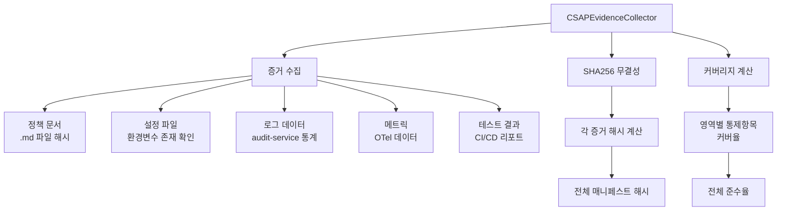
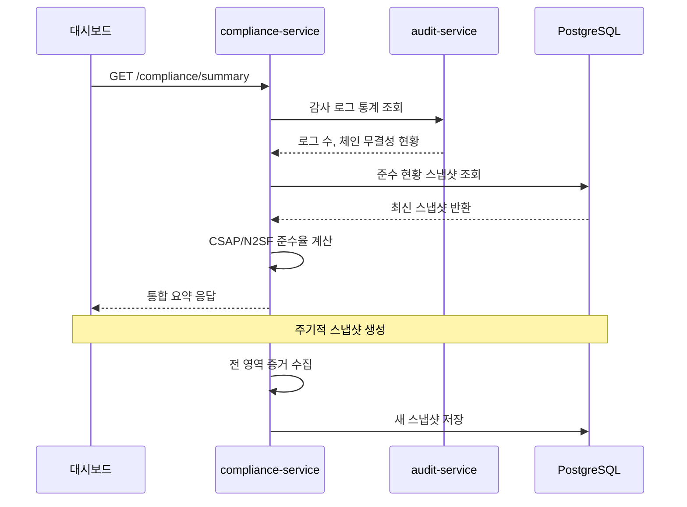
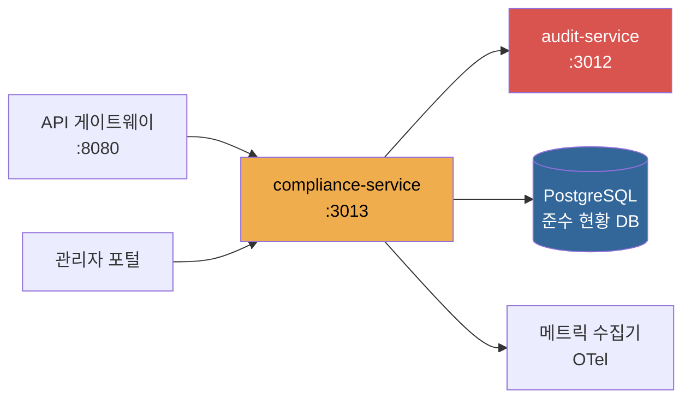
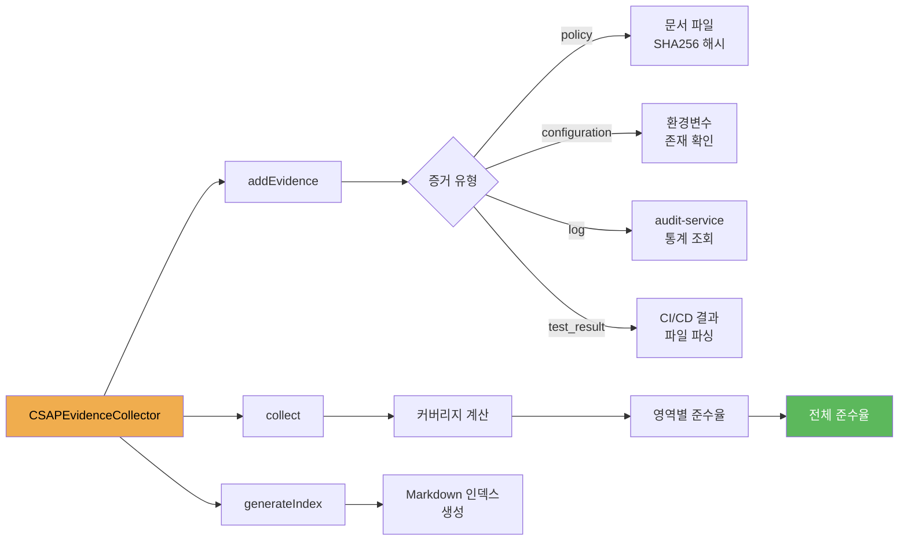

# 07. 컴플라이언스 서비스 (compliance-service)

> 대상 독자: 이 프레임워크를 처음 접하는 개발자
> CSAP 관련 항목: CSAP 79항목 전체, N2SF 6영역, 행안부 감리기준

---

## 서비스 개요 카드

| 항목 | 내용 |
|------|------|
| 역할 | CSAP/ISMS-P/N2SF 준수 현황 집계, 컴플라이언스 대시보드 데이터 제공, DORA 지표 포함 |
| 기본 포트 | **3013** |
| 소스 경로 | `platform/services/compliance-service/src/` |
| 의존 서비스 | audit-service (로그 기반 증거 수집), 각종 메트릭 소스 |
| 데이터베이스 | PostgreSQL (준수 현황 스냅샷 저장) |
| CSAP 항목 | D-01~D-13 전 영역 (79개 통제항목 추적), N2SF 6영역 |
| 인증 방식 | x-internal-service-key 헤더 (API 게이트웨이가 주입) |

---

## 이 서비스가 존재하는 이유

공공기관 SaaS는 매년 또는 감리 시점에 다음을 증명해야 합니다.

1. CSAP 79개 보안 통제항목을 모두 준수하고 있는가?
2. N2SF 6개 보안 영역의 요건을 충족하는가?
3. 감리 준비는 되어 있는가?

compliance-service는 이 질문들에 실시간으로 답할 수 있도록 시스템 전반의 보안 현황을 자동으로 집계합니다. 감리원이 방문했을 때 담당자가 수동으로 자료를 준비하는 대신, API 한 번 호출로 현황 보고서를 생성할 수 있습니다.

---

## CSAP 79개 통제항목이란?

CSAP(클라우드 보안인증)은 13개 영역, 79개 통제항목으로 구성됩니다.

| 영역 | 영역명 | 통제항목 수 |
|------|--------|------------|
| D-01 | 정보보호 정책 | 3 |
| D-02 | 정보보호 조직 | 4 |
| D-03 | 인적 보안 | 5 |
| D-04 | 자산 관리 | 4 |
| D-05 | 물리적 보안 | 6 |
| D-06 | 침해사고 관리 | 5 |
| D-07 | 보안 교육 | 3 |
| D-08 | 접근 통제 | 12 |
| D-09 | 암호화 | 4 |
| D-10 | 운영 관리 | 10 |
| D-11 | 네트워크 보안 | 8 |
| D-12 | 시스템 개발 보안 | 10 |
| D-13 | 서비스 연속성 | 5 |
| **합계** | | **79** |

compliance-service는 이 79개 항목 각각의 준수 여부를 자동으로 판단하여 준수율을 계산합니다.

---

## N2SF 6개 보안 영역

N2SF (국가 클라우드 보안 프레임워크)는 공공기관 클라우드 서비스의 보안 요건입니다.

| 영역 | 핵심 요건 |
|------|----------|
| N-01 | 서비스 가용성 (SLA 99.9% 이상) |
| N-02 | 멀티테넌시 보안 (테넌트 간 격리) |
| N-03 | 격리 아키텍처 (논리적/물리적 격리) |
| N-04 | 데이터 보호 (암호화, 백업) |
| N-05 | 데이터 분류 (C/S/O 등급 관리) |
| N-06 | 보안 모니터링 (실시간 탐지) |

---

## CSAP 증거 자동 수집 구조

compliance-service는 `CSAPEvidenceCollector` 클래스를 사용하여 시스템 전반의 보안 증거를 자동으로 수집합니다.



증거 유형별 처리 방식:

| 증거 유형 | 수집 방법 | 예시 |
|----------|----------|------|
| 정책 (policy) | 문서 파일 해시화 | CSAP 준수 규칙 문서 |
| 설정 (configuration) | 환경변수 존재 확인 | TLS 설정, 암호화 키 |
| 로그 (log) | audit-service 통계 | 감사 로그 보존 현황 |
| 메트릭 (metric) | OTel 메트릭 수집 | API 응답시간, 오류율 |
| 테스트 결과 (test_result) | CI/CD 파이프라인 | 보안 스캔 통과 여부 |

---

## 주요 엔드포인트 표

| 메서드 | 경로 | 설명 | 주기적 사용 |
|--------|------|------|------------|
| GET | /compliance/csap | CSAP 79항목 준수율 조회 | 일 1회 이상 |
| GET | /compliance/csap/gaps | CSAP 미준수 항목 상세 | 보완 작업 시 |
| GET | /compliance/n2sf | N2SF 6영역 현황 조회 | 주 1회 이상 |
| GET | /compliance/readiness | 감리 준비도 점수 | 감리 전 확인 |
| GET | /compliance/history | 준수율 스냅샷 이력 (최대 100건) | 추이 분석 시 |
| GET | /compliance/metrics | OpenTelemetry 메트릭 | 모니터링 대시보드 |
| GET | /compliance/trend | 준수율 추이 (?days=30) | 월간 보고 시 |
| GET | /compliance/summary | 통합 준수 요약 대시보드 | 일상 모니터링 |

모든 엔드포인트는 읽기 전용이며 Rate Limit은 100요청/분입니다.

---

## 컴플라이언스 현황 데이터 흐름



---

## 초보자 실습: 현황 API 조회

### 준비사항

- compliance-service가 포트 3013에서 실행 중
- INTERNAL_SERVICE_KEY 환경 변수 설정

### 실습 1: CSAP 79항목 준수율 조회

```bash
# CSAP 전체 준수율 확인
curl -s -X GET \
  "http://localhost:3013/compliance/csap" \
  -H "x-internal-service-key: dev-internal-key" \
  | jq '.'
```

응답 예시:

```json
{
  "success": true,
  "data": {
    "overallRate": 94.9,
    "totalControls": 79,
    "coveredControls": 75,
    "domains": [
      {
        "domain": "D-08",
        "domainName": "접근 통제",
        "totalControls": 12,
        "coveredControls": 12,
        "coverageRate": 100
      },
      {
        "domain": "D-06",
        "domainName": "침해사고 관리",
        "totalControls": 5,
        "coveredControls": 5,
        "coverageRate": 100
      }
    ],
    "lastUpdated": "2026-04-11T09:00:00.000Z"
  }
}
```

### 실습 2: 미준수 항목 확인 및 보완 계획 수립

```bash
# 미준수(갭) 항목 상세 조회
curl -s -X GET \
  "http://localhost:3013/compliance/csap/gaps" \
  -H "x-internal-service-key: dev-internal-key" \
  | jq '.data.gaps[]'
```

각 갭 항목에는 다음이 포함됩니다.

- `controlId`: 통제항목 ID (예: D-03-02)
- `controlName`: 항목명 (예: 보안 교육 이수 현황)
- `gap`: 미충족 이유
- `recommendation`: 권고 조치 방법

### 실습 3: N2SF 6영역 현황 조회

```bash
# N2SF 보안 영역별 현황
curl -s -X GET \
  "http://localhost:3013/compliance/n2sf" \
  -H "x-internal-service-key: dev-internal-key" \
  | jq '.'
```

응답에는 각 영역(N-01~N-06)의 준수율과 세부 항목이 포함됩니다.

### 실습 4: 감리 준비도 점수 확인

감리 예정일이 다가올 때 준비 상태를 수치로 확인합니다.

```bash
# 감리 준비도 점수 (0~100점)
curl -s -X GET \
  "http://localhost:3013/compliance/readiness" \
  -H "x-internal-service-key: dev-internal-key" \
  | jq '.'
```

응답 예시:

```json
{
  "success": true,
  "data": {
    "score": 91,
    "grade": "A",
    "breakdown": {
      "documentation": 95,
      "technical": 93,
      "operational": 87,
      "audit_trail": 100
    },
    "recommendation": "D-03 인적 보안 분야 교육 이수 기록 보완 필요"
  }
}
```

점수 해석:

| 점수 | 등급 | 의미 |
|------|------|------|
| 95 이상 | S | 감리 즉시 가능 |
| 90 이상 | A | 감리 준비 완료 |
| 80 이상 | B | 일부 보완 필요 |
| 80 미만 | C | 상당한 보완 필요 |

### 실습 5: 준수율 추이 분석

준수율이 시간에 따라 어떻게 변화했는지 확인합니다.

```bash
# 최근 30일 준수율 추이
curl -s -X GET \
  "http://localhost:3013/compliance/trend?days=30" \
  -H "x-internal-service-key: dev-internal-key" \
  | jq '.'
```

### 실습 6: 통합 요약 대시보드

포털 메인 화면에 표시하는 모든 컴플라이언스 정보를 한 번에 조회합니다.

```bash
# 통합 요약 (가장 자주 사용하는 API)
curl -s -X GET \
  "http://localhost:3013/compliance/summary" \
  -H "x-internal-service-key: dev-internal-key" \
  | jq '.'
```

통합 요약 응답에는 다음이 포함됩니다.

- CSAP 전체 준수율
- N2SF 전체 준수율
- 감리 준비도 점수
- 최근 7일 이상 이벤트 수
- 보완이 필요한 상위 3개 항목

---

## 초보자가 수정할 상황

### 상황 1: 새 컴플라이언스 항목 추가

예: ISMS-P 인증 항목을 추가하고 싶다면:

**1단계: 새 핸들러 생성**
`src/handlers/isms-compliance.handler.ts` 파일 생성

**2단계: routes.ts에 엔드포인트 추가**
```typescript
app.get('/compliance/isms', {
  schema: { description: 'ISMS-P 준수 현황', ... },
}, ismsPComplianceHandler as never);
```

**3단계: ISMS-P 통제항목 목록 정의**
CSAPEvidenceCollector 패턴을 참고하여 ISMS-P용 수집기 구현

### 상황 2: 준수율 계산 로직 변경

`src/handlers/compliance.handler.ts`의 `csapComplianceHandler` 함수에서 계산 로직을 수정합니다. 단, 항목 수를 임의로 줄이거나 준수율을 조작하는 것은 CSAP 인증 위반이므로 절대 금지입니다.

---

## 자주 묻는 질문 (FAQ)

**Q. 준수율이 100%가 아닌데 서비스를 운영해도 되나요?**

A. CSAP 중등급 인증의 경우 79개 항목 중 일부는 기술적으로 구현하기 어려운 것이 있습니다(예: D-03 인적 보안 교육은 HR 프로세스와 연계 필요). 중요한 것은 미준수 항목에 대한 보완 계획을 수립하고 추적하는 것입니다.

**Q. compliance-service는 어떻게 준수 여부를 판단하나요?**

A. 두 가지 방식을 사용합니다. (1) 자동 수집: 코드 패턴, 환경변수 존재, API 응답 확인 등으로 자동 판단. (2) 수동 선언: 물리적 보안이나 인적 보안처럼 자동 검사가 불가능한 항목은 관리자가 명시적으로 준수 여부를 선언합니다.

**Q. 감리원에게 어떤 자료를 제출해야 하나요?**

A. 다음 API 응답을 출력하여 제출합니다.
- GET /compliance/csap: 79항목 준수율 전체
- GET /compliance/csap/gaps: 미준수 항목과 보완 계획
- GET /compliance/history: 최근 6개월 준수율 추이
- GET /compliance/readiness: 감리 준비도 점수

**Q. 준수율 스냅샷은 얼마나 자주 갱신되나요?**

A. Kubernetes CronJob으로 매일 00:00에 자동 갱신됩니다. 즉시 갱신이 필요하면 `POST /compliance/snapshot` 엔드포인트를 직접 호출합니다(내부 API).

**Q. OpenTelemetry 메트릭이란 무엇인가요?**

A. GET /compliance/metrics 응답에는 CSAP D-10 운영 관리 요건과 관련된 메트릭이 포함됩니다. API 응답시간, 오류율, 가용성 등을 표준 형식으로 제공합니다. 외부 모니터링 시스템(Prometheus, Grafana)과 연동하여 사용합니다.

---

## 서비스 의존성 다이어그램



---

## CSAP 증거 수집 워크플로우



---

## 관련 파일

- 라우트 정의: `/data/ai-saas/platform/services/compliance-service/src/routes.ts`
- 컴플라이언스 핸들러: `/data/ai-saas/platform/services/compliance-service/src/handlers/compliance.handler.ts`
- 추이 핸들러: `/data/ai-saas/platform/services/compliance-service/src/handlers/compliance-trend.handler.ts`
- CSAP 증거 수집기: `/data/ai-saas/platform/services/compliance-service/src/lib/csap-evidence-collector.ts`
- 감사 유틸: `/data/ai-saas/platform/services/compliance-service/src/lib/audit.ts`
