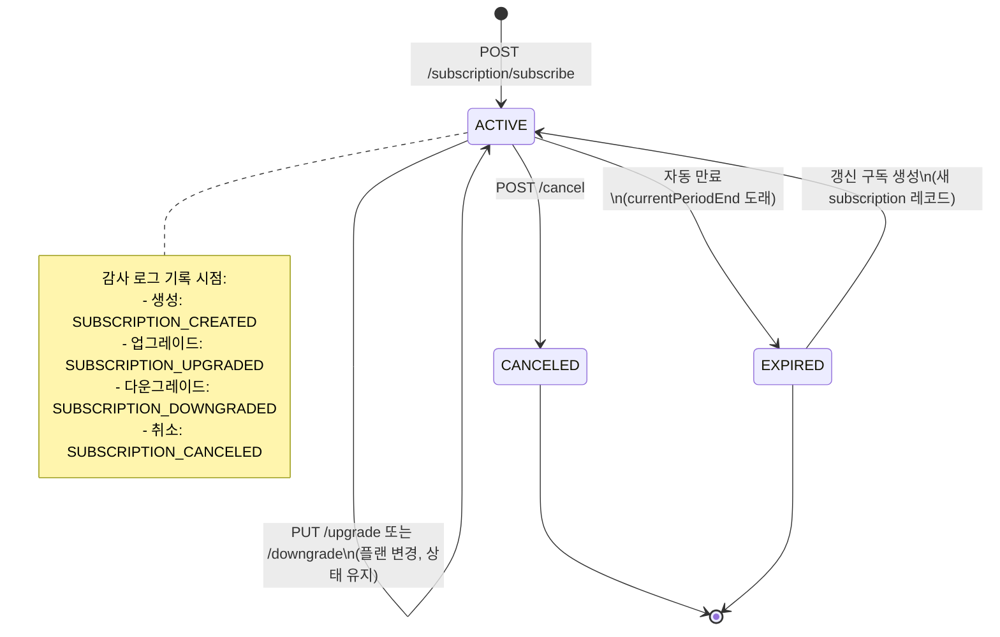
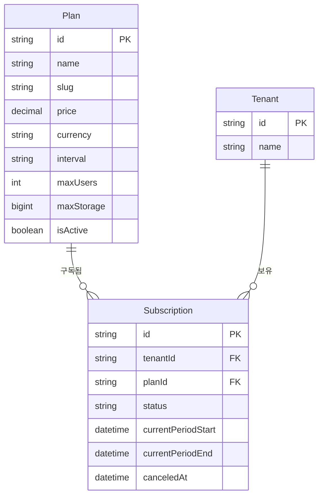
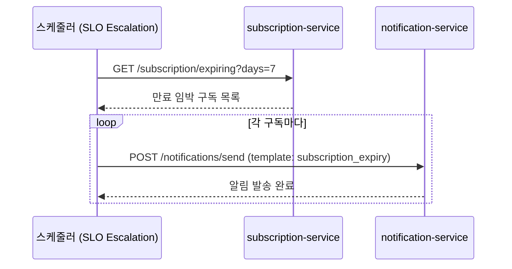

# 08. Subscription Service — 구독 관리 서비스

> 대상 독자: 개발팀 신규 합류자, SaaS 운영 담당자
> 관련 Plan: FR-P07.1~FR-P07.5, FR-SUB.1~FR-SUB.4
> CSAP 항목: D-06 감사 로그, D-08 접근 통제, D-12 입력 검증

---

## 서비스 개요 카드

| 항목 | 값 |
|------|-----|
| 서비스명 | subscription-service |
| 역할 | 구독 플랜 정의, 테넌트별 구독 생성/변경/해지 |
| 기본 포트 | 3004 |
| 프레임워크 | Fastify + TypeScript |
| DB | PostgreSQL (Prisma ORM) |
| 의존 서비스 | auth-service (JWT 검증), billing-service (인보이스 생성 트리거) |
| CSAP 적용 | D-06(감사 로그), D-08(접근 통제·테넌트 격리), D-12(입력 검증) |
| Rate Limit | 읽기 100 req/min, 쓰기 20 req/min, 취소 5 req/5min |

---

## 공공기관 SaaS 구독의 특성

일반 상업 SaaS와 달리 공공기관 구독에는 몇 가지 고유한 특성이 있습니다.

**예산 집행 주기와 구독 주기의 정렬**
공공기관은 회계연도(1월~12월) 기준으로 예산을 집행합니다. 구독 시작일이 회계연도 중간이라도 만료일은 연말 결산에 맞추는 경우가 많습니다. 플랜 생성 시 `interval` 필드(`monthly` / `yearly`)로 이를 구분합니다.

**기관 단위 계약 (테넌트 = 기관)**
개인이 아닌 기관(테넌트) 단위로 구독 계약이 이루어집니다. 한 테넌트 아래 여러 사용자가 존재하고, 사용자 수는 플랜의 `maxUsers` 제한을 따릅니다.

**업그레이드/다운그레이드 통제**
담당 부서장 승인 없이 임의로 플랜을 변경하면 안 됩니다. 이 서비스는 변경 API를 제공하지만, 실제 워크플로우에서는 포털에서 승인 프로세스를 거친 후 호출합니다.

**감사 추적 의무**
모든 구독 변경(생성, 업그레이드, 다운그레이드, 취소)은 CSAP D-06 요건에 따라 감사 로그로 기록됩니다. 삭제·변경 후에도 기록이 남아 감리 시 제출 가능합니다.

---

## 구독 상태 흐름



---

## 플랜-구독 관계 다이어그램



---

## 주요 API 엔드포인트

| 메서드 | 경로 | 설명 | 권한 | Rate Limit |
|--------|------|------|------|-----------|
| GET | `/subscription/plans` | 활성 플랜 목록 | 인증 필요 | 100/min |
| POST | `/subscription/plans` | 플랜 생성 | SUPER_ADMIN | 20/min |
| PUT | `/subscription/plans/:id` | 플랜 수정 | SUPER_ADMIN | 20/min |
| POST | `/subscription/subscribe` | 구독 생성 | TENANT_ADMIN+ | 20/min |
| GET | `/subscription/tenants/:tenantId` | 테넌트 구독 조회 | 본인 테넌트 | 100/min |
| PUT | `/subscription/:id/upgrade` | 플랜 업그레이드 | TENANT_ADMIN+ | 20/min |
| PUT | `/subscription/:id/downgrade` | 플랜 다운그레이드 | TENANT_ADMIN+ | 20/min |
| POST | `/subscription/:id/cancel` | 구독 취소 | TENANT_ADMIN+ | 5/5min |
| GET | `/subscription/expiring` | 만료 임박 구독 | SUPER_ADMIN | 100/min |
| GET | `/subscription/stats` | 구독 통계 | SUPER_ADMIN | 100/min |

### 요청/응답 구조

**플랜 생성 요청 본문**
```json
{
  "name": "공공기관 표준 플랜",
  "slug": "gov-standard",
  "price": 500000,
  "currency": "KRW",
  "interval": "monthly",
  "maxUsers": 50,
  "maxStorage": 10737418240
}
```

**구독 생성 요청 본문**
```json
{
  "tenantId": "550e8400-e29b-41d4-a716-446655440000",
  "planId": "7f000001-c23f-1234-8c23-abc123456789"
}
```

**성공 응답 구조**
```json
{
  "success": true,
  "data": {
    "id": "sub-uuid",
    "tenantId": "tenant-uuid",
    "planId": "plan-uuid",
    "status": "ACTIVE",
    "currentPeriodStart": "2026-04-11T00:00:00.000Z",
    "currentPeriodEnd": "2026-05-11T00:00:00.000Z"
  }
}
```

---

## 테넌트 격리 동작 방식

이 서비스는 CSAP D-08-05 테넌트 격리를 철저히 적용합니다. 구체적으로 동작하는 방식은 아래와 같습니다.

```
요청 수신
    |
    v
API Gateway가 JWT 검증 후 헤더 주입
    x-user-id: {userId}
    x-user-role: {role}
    x-user-tenant-id: {tenantId}
    |
    v
서비스에서 헤더 읽기
    |
    +--> role == SUPER_ADMIN ?
    |         |
    |         YES --> 모든 테넌트 데이터 접근 허용
    |         |
    |         NO  --> jwtTenantId와 요청 tenantId 비교
    |                   |
    |                   불일치 --> 403 Forbidden 반환
    |                   일치   --> 정상 처리
    v
DB 조회 실행
```

---

## 만료 임박 알림 흐름



---

## 실습 curl 예시

### 1. 구독 플랜 목록 확인

```bash
curl -s \
  -H "x-internal-service-key: ${INTERNAL_SERVICE_KEY}" \
  -H "x-user-role: SUPER_ADMIN" \
  http://localhost:3004/subscription/plans | jq '.data[] | {id, name, price, interval}'
```

### 2. 새 플랜 생성

```bash
curl -s -X POST \
  -H "Content-Type: application/json" \
  -H "x-internal-service-key: ${INTERNAL_SERVICE_KEY}" \
  -H "x-user-id: admin-001" \
  -H "x-user-role: SUPER_ADMIN" \
  -d '{
    "name": "소규모 기관 플랜",
    "slug": "gov-small",
    "price": 200000,
    "interval": "monthly",
    "maxUsers": 10,
    "maxStorage": 5368709120
  }' \
  http://localhost:3004/subscription/plans | jq
```

### 3. 구독 생성

```bash
curl -s -X POST \
  -H "Content-Type: application/json" \
  -H "x-internal-service-key: ${INTERNAL_SERVICE_KEY}" \
  -H "x-user-id: admin-001" \
  -H "x-user-role: TENANT_ADMIN" \
  -H "x-user-tenant-id: ${TENANT_ID}" \
  -d '{
    "tenantId": "'"${TENANT_ID}"'",
    "planId": "'"${PLAN_ID}"'"
  }' \
  http://localhost:3004/subscription/subscribe | jq
```

### 4. 만료 임박 구독 조회 (30일 이내)

```bash
curl -s \
  -H "x-internal-service-key: ${INTERNAL_SERVICE_KEY}" \
  -H "x-user-role: SUPER_ADMIN" \
  "http://localhost:3004/subscription/expiring?days=30" | jq '.data.subscriptions | length'
```

### 5. 구독 취소

```bash
curl -s -X POST \
  -H "Content-Type: application/json" \
  -H "x-internal-service-key: ${INTERNAL_SERVICE_KEY}" \
  -H "x-user-id: admin-001" \
  -H "x-user-role: TENANT_ADMIN" \
  -H "x-user-tenant-id: ${TENANT_ID}" \
  -d '{"reason": "기관 예산 소진"}' \
  http://localhost:3004/subscription/${SUBSCRIPTION_ID}/cancel | jq
```

---

## 감사 로그 이벤트 목록

| 이벤트 코드 | 발생 시점 | CSAP 근거 |
|------------|---------|---------|
| `PLAN_CREATED` | 플랜 생성 | D-06 |
| `PLAN_UPDATED` | 플랜 수정 | D-06 |
| `SUBSCRIPTION_CREATED` | 구독 생성 | D-06 |
| `SUBSCRIPTION_UPGRADED` | 업그레이드 | D-06 |
| `SUBSCRIPTION_DOWNGRADED` | 다운그레이드 | D-06 |
| `SUBSCRIPTION_CANCELED` | 취소 | D-06 |

모든 이벤트는 `.claude/audit.jsonl` 및 compliance-service로 전달됩니다.

---

## 입력 검증 규칙 (CSAP D-12)

| 필드 | 검증 규칙 |
|------|---------|
| `id` (경로 파라미터) | UUID 형식 강제 (Zod `z.string().uuid()`) |
| `tenantId` | UUID 형식 강제 |
| `price` | `number, min(0)` |
| `maxUsers` | `int, min(1)` |
| `interval` | enum `['monthly', 'yearly']` |
| `slug` | 소문자·숫자·하이픈 정규식 `/^[a-z0-9-]+$/` |

검증 실패 시 400 상태 코드와 `VALIDATION_ERROR` 코드가 반환됩니다. 에러 메시지에 내부 시스템 정보는 포함되지 않습니다.

---

## 초보자 FAQ

**Q. 플랜을 삭제하면 기존 구독은 어떻게 되나요?**
A. 이 서비스는 플랜 삭제 API를 제공하지 않습니다. 대신 플랜의 `isActive` 필드를 `false`로 설정하여 신규 구독을 막습니다. 기존 구독은 유지됩니다.

**Q. 업그레이드와 다운그레이드는 즉시 적용되나요?**
A. 네, DB의 `planId`가 즉시 변경됩니다. 요금 조정은 billing-service에서 다음 인보이스 생성 시 반영됩니다.

**Q. SUPER_ADMIN이 아닌 사람이 다른 테넌트의 구독을 조회하면 어떻게 되나요?**
A. API Gateway가 주입한 `x-user-tenant-id` 헤더와 요청한 `tenantId`가 불일치하면 즉시 403 Forbidden을 반환합니다.

**Q. 구독 취소 후 같은 플랜으로 다시 구독할 수 있나요?**
A. 네. 취소된 구독은 상태가 `CANCELED`로 변경될 뿐이며, `/subscribe` 엔드포인트로 새 구독을 생성할 수 있습니다.

**Q. 구독 통계 API는 누가 사용하나요?**
A. 주로 SUPER_ADMIN이 플랫폼 전체 현황을 파악하는 데 사용합니다. 일반 TENANT_ADMIN은 본인 테넌트 데이터만 조회됩니다.
